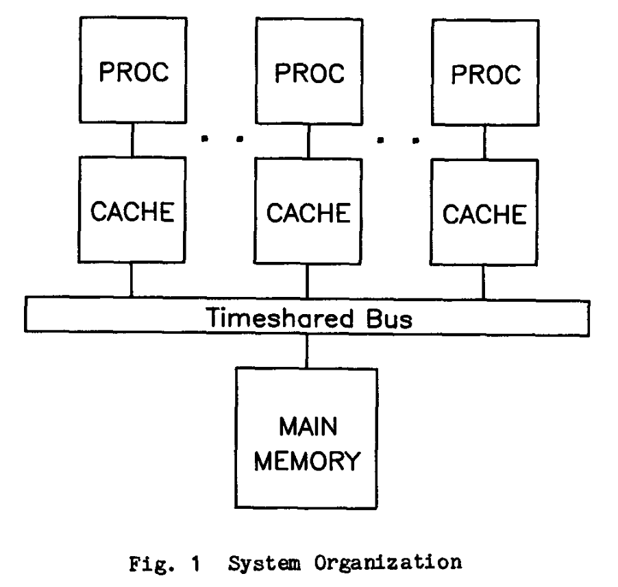
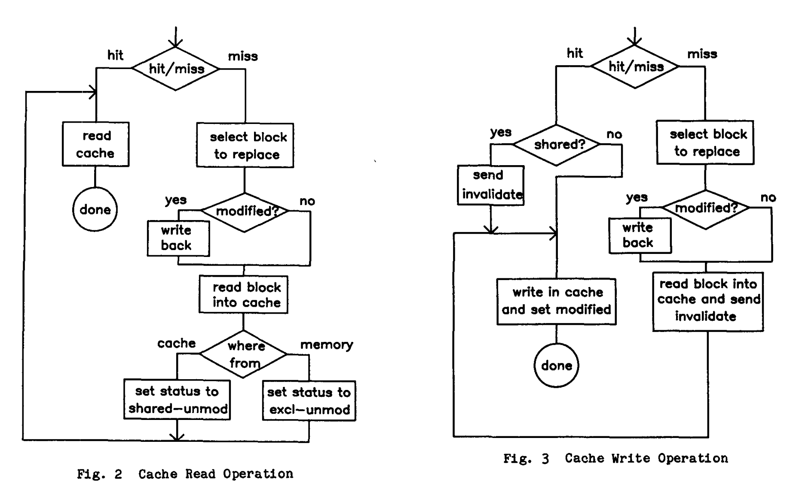

# A low-overhead coherence solution for multiprocessors with private cache memories
> Mark S.  Papamarcos and Janak H.  Patel

## Abstract
This paper presents a cache coherence solution for multiprocessors organized around a single time-shared bus. The solution aims at reducing bus traffic and hence bus wait time. This in turn increases the overall processor utilization. Unlike most traditional high-performance coherence solutions, this solution does not use any global tables. Furthermore, this coherence scheme is modular and easily extensible, requiring no modification of cache modules to add more processors to a system. The performance of this scheme is evaluated by using an approximate analysis method. It is shown that the performance of this scheme is closely tied with the miss ratio and the amount of sharing between processors. 

本文提出了一个针对围绕单一时间共享总线组织的多处理器的缓存一致性解决方案。该解决方案的目的是减少总线流量，从而减少总线等待时间。这反过来又提高了处理器的整体利用率。与大多数传统的高性能一致性解决方案不同，该方案不使用任何全局表。此外，这种一致性方案是模块化的，易于扩展，不需要修改缓存模块就可以在系统中增加更多的处理器。该方案的性能是通过使用近似分析方法进行评估的。结果表明，该方案的性能与失误率和处理器之间的共享量密切相关。

## 1. Introduction
The use of cache memory has long been recognized as a cost-effective means of increasing the performance of uniprocessor systems [Conti69, Meade70, Kaplan73,  Strecker76, Rao78, Smith82]. In this paper, we will consider the application of 
cache memory in a tightly-coupled multiprocessor system organized around a timeshared bus. Many computer systems, particularly the ones which use microprocessors, are heavily bus-limited. Without some type of local memory,  it is physically impossible to gain a significant performance advantage through multiple microprocessors on a single bus.

长期以来，人们认为使用高速缓冲存储器是提高单处理器系统性能的一种经济有效的手段[Conti69, Meade70, Kaplan73, Strecker76, Rao78, Smith82]。在本文中，我们将考虑高速缓冲存储器在紧密耦合的多处理器系统中的应用，该系统围绕一条共享总线组织。许多计算机系统，特别是那些使用微处理器的系统，都有大量的总线连接。如果没有某种类型的本地存储器，在一条总线上通过多个微处理器获得显著的性能优势在物理上是不可能的。

Generally, there are two different implementations of multlprocessor cache systems. One involves a single shared cache for all processors [Yeh83]. This organization has same distinct advantages, in particular,  efficient cache utilization. However, this organization requires a crossbar between the processors and the shared cache. It is impractical to provide communication between each processor and the shared cache using a shared bus. The other alternative is private cache for each processor, as shown in Fig.I.  However, thls organization suffers from the well known data consistency or cache coherence problem. Should the same writeable data block exist in more than one cache, it is possible for one processor to modify its local copy independently of the rest of the system. 

一般来说，有两种不同的多处理器高速缓存系统的实现方式。一种是所有处理器共享一个高速缓存。这种组织方式具有相同的优势，尤其是高效的缓存利用率。然而，这种组织方式需要在处理器和共享高速缓存之间有一个横杆。使用共享总线在每个处理器和共享高速缓存之间提供通信是不现实的。另一个选择是每个处理器的私有高速缓存，如图一所示。然而，这种组织方式存在众所周知的数据一致性或高速缓存一致性问题。如果相同的可写数据块存在于一个以上的高速缓存中，一个处理器就有可能独立于系统的其他部分来修改其本地拷贝。

The simplest way to solve the coherence problem is to require that the address of the block being written in cache be tranemitted throughout the system. Each cache must then check its own directory and purge the block if present. This scheme is most frequently referred to as broadcast-invalidate. Obviously, the invalidate traffic grows very quickly and, assuming that writes constitute 25% of the memory references, the system becomes saturated wlth less than four processors. In [Bean79], a bias filter is proposed to reduce the cache directory interference that results from this scheme. The filter consists of a small associative memory between the bus and each cache. The associative memory keeps record of the most recently invalidated blocks, inhibitlng some subsequent wasteful invalidations. However, this only serves to reduce the amount of cache directory interference without actually reducing the bus traffic. 

解决一致性问题的最简单方法是要求在整个系统中转发被写入缓存的块的地址。然后每个高速缓存必须检查自己的目录，如果有的话就清除该块。这个方案最常被称为 "广播-无效"。显然，无效流量增长得非常快，而且，假设写占内存引用的 25%，系统在少于四个处理器的情况下就会饱和。在[Bean79]中，提出了一个偏置过滤器来减少这个方案导致的高速缓存目录干扰。该过滤器由总线和每个高速缓存之间的一个小型关联存储器组成。这个关联存储器记录了最近失效的块，抑制了随后的一些浪费的失效。然而，这只是为了减少缓存目录的干扰量，而没有真正减少总线流量。

Another class of coherence solutions are of the global-directory type. Status bits are associated with each block in main memory. Upon a cache miss or the first write to a block in cache, the block's global status is checked. An invalidate signal is sent only if another cache has a copy. Requests for transfers due to misses are also screened by the global table to eliminate unnecessary cache directory interference. The performance associated with these solutions is very high if one ignores the interference in the global directory. The hardware required to implement a global direcotry for low access interference is extensive, requiring a distributed directory with full crossbar. Threse schemes and their variations have been analyzed by serveral authors.

另一类一致性解决方案是全局目录类型的。状态位与主存储器中的每个块相关联。在缓存缺失或第一次写到缓存中的块时，会检查该块的全局状态。只有当另一个缓冲区有一个拷贝时，才会发送一个无效信号。由于失误而产生的传输请求也被全局表所筛选，以消除不必要的高速缓存目录干扰。如果忽略全局目录的干扰，与这些解决方案相关的性能是非常高的。实现低访问干扰的全局目录所需的硬件非常多，需要一个具有全交叉条的分布式目录。这些方案及其变化已被一些作者分析过。

A solution more appropriate for bus organized multiprocessors has been proposed by Goodman. In this scheme, an invalidate request is broadcast only when a block is written in cache for the first time. The updated block is simulteneously written through to main memory. Only if a block in cache is written to more than once is it necessary to write it back before replacing it. THis particular write strategy, a combination of write-through and write-back, is called write-once. A dual cache directory system is employed in order to reduce cache interference.

Goodman 提出了一个更适合于总线组织的多核处理器的解决方案。在这个方案中，只有当一个区块第一次被写入高速缓存时，才会广播一个无效请求。更新的块同时被写入主存储器。只有当缓存中的一个块被写入超过一次时，才有必要在替换它之前把它写回去。这种特殊的写策略，是写通和写回的结合，被称为 "一次写"。为了减少缓冲区的干扰，采用了双缓冲区目录系统。

We seek to integrate the high performance of global directory solutions associated with the inhibition of all ineffective invalidations and the modularity and easy adaptability to microprocessors of Goodman's scheme. In a bus-organized system with dual directories for interrogation, it is possible to determine at miss time if a block is resident in another cache. Therefore a status may be kept for each block in cache indicating whether it is Exclusive or  Shared. All unnecessary invalidate requests can be cut off at the point of origin. Bus traffic is therefore reduced to cache misses, actual invalidations  and writes to main memory. Of these, the traffic generated by cache misses and actual invalidations represents the minimum unavoidable traffic. The number of writes to main memory is determined by the particular policy of write-through or  write-back. Therefore, for a multlprocessor on a timeshared bus, performance should then approach the maximum possible for a cache coherent system under the given write policy. 

我们试图将全局目录解决方案的高性能与抑制所有无效的无效性以及 Goodman 方案的模块化和对微处理器的易适应性结合起来。在一个具有双目录查询的总线组织系统中，有可能在失误时确定一个块是否驻留在另一个缓冲区中。因此，缓存中的每个区块都可以保持一个状态，表明它是独占的还是共享的。所有不必要的无效请求都可以在原点被切断。因此，总线流量被减少到高速缓冲区的缺失、实际的失效和对主内存的写入。其中，由高速缓存缺失和实际失效产生的流量代表了最小的不可避免的流量。写入主内存的次数由特定的穿透式或回写式策略决定。因此，对于一个分时总线上的多处理器来说，在给定的写策略下，性能应该接近高速缓存一致性系统的最大可能。

The cache coherence solution to be presented is applicable to both write-through and write-back policies. However, it has been shown that write-back generates less bus traffic than write-through [Norton82]. This has been verified by our performance studies. Therefore, we have chosen a write-back policy in the rest of this paper. Under a write-back policy, coherence is not maintained between a cache and a main memory as can be done with a write-through policy. This in turn implies that I/O processors must follow the same protocol as a cache for data transfer to and from memory. 

将要提出的缓存一致性解决方案同时适用于穿写和回写策略。然而，事实证明，回写比穿写产生的总线流量要少[Norton82]。我们的性能研究已经验证了这一点。因此，我们在本文的其余部分选择了回写策略。在回写策略下，缓存和主存之间的一致性不能像穿写策略那样保持。这又意味着 I/O 处理器必须遵循与高速缓存相同的协议来进行数据的传输。

## 2. Proposed coherence solution
In this section we present a low-overhead cache coherence algorithm. To implement this algorithm, it is necessary to associate two status bits with each block in cache. No status bits are associated with the main memory. The first bit indicates either Shared or Exclusive ownership of a block, while the second bit is set if the block has been locally modified. Because the state Share-Modified is not allowed in our scheme, this status is used instead to denote a block containing invalid data. A write-back policy is assumed. The four possible statuses of a block in cache at any given time are then:

在这一节中，我们提出了一种低开销的高速缓存一致性算法。为了实现这个算法，有必要将两个状态位与高速缓存中的每个块联系起来。在主存储器中没有状态位。第一个位表示一个块的共享或独占所有权，而第二个位在该块被局部修改时被设置。因为在我们的方案中不允许出现共享-修改的状态，这个状态被用来表示一个包含无效数据的块。我们假设有一个回写策略。缓存中的块在任何时候都有四种可能的状态。

1. Invalid: Block does not contain valid data.
2. Exclusive-Unmodified (Excl-Unmod): No other cache has this block. Data in block is consistent with main memory.
3. Shared-Unmodified (Shared-Unmod): Some other caches may have this block. Data in block is consistent with main memory.
4. Exclusive-Modified (Excl-Mod): No other cache has this block. Data in block has been locally modified and is therefore inconsistent with main memory.

1. 无效。区块不包含有效数据。
2. 独占-未修改（Excl-Unmod）。其他缓存没有这个块。区块中的数据与主存一致。
3. 共享-未修改（Shared-Unmod）。一些其他的缓存可能有这个块。块中的数据与主内存一致。
4. 独占-修改（Excl-Mod）。其他缓冲区没有这个区块。区块中的数据已经被局部修改，因此与主内存不一致。

A block is written back to main memory when evicted only if its status is Excl-Mod. If a write-through cache was desired then one would not need to differentiate between Excel-Mod and Excl-Unmod. Writes to an Exclusive block result only in modification of the cached block and the setting of the Modified status. The status of Shared-Unmod says that some other caches may have this block. Initially, when a block is declared Shared-Unmod, at least two caches must have this block. However, at a lter time when all but one cache evicts this block, it is no longer truly Shared. But the status is not altered in favor of simplicity of implementation.

只有当一个块的状态是 Excl-Mod 时，它才会被写回主内存。如果需要一个写通缓存，那么就不需要区分Excel-Mod 和 Excl-Unmod。对独占块的写操作只导致对缓存块的修改和对修改状态的设置。Shared-Unmod 的状态表示一些其他的缓冲区可能有这个块。最初，当一个块被声明为 Shared-Unmod 时，至少有两个缓存必须有这个块。然而，到了后来，当除了一个缓冲区之外的所有缓冲区都驱逐了这个区块时，它就不再是真正的共享了。但是为了实现的简单性，这个状态并没有被改变。

Detailed flow charts of the proposed coherence algorithm are given in Figs. 2 and 3. Fig. 2 gives the required operations during a read cycle and Fig. 3 describes the write cycle. The following is a summary of the algorithm and some implementation details which are not present in the flow charts. 

图 2 和图 3 给出了拟议的相干算法的详细流程图。图 2 给出了读取周期中的必要操作，图 3 描述了写入周期。下面是该算法的总结和一些流程图中没有的实施细节。

Upon a cache miss, a read request is broadcast to all caches and the main memory. If the miss was caused by a write operation, an invalidate signal accompanies the request. If a cache directory matches the requested address then it inhibits the main memory from putting data on the bus. Assuming cache operations are asynchronous with each other and the bus, possible multiple cache responses can be resolved with a simple priority network, such as a daisy chain. The highest priority cache among the responding caches will then put the data on the bus. If no cache has the block then the memory provides the block. A unique response is  thus guaranteed. On a read operation, all caches which match the requested address set the status of the corresponding block to Shared-Unmod. In addition,  the block is written back to main memory concurrently with the transfer if its status was Excl-Mod. On a write, matching caches set the block status to Invalid. The requesting cache sets the status of the block to Shared-Unmod if the block came from another cache and to Excl-Unmod if the block came from main memory. Upon a subsequent cache write, an invalidation signal is broadcast with the block address only if the status is Shared-Uemod, thus minimizing unnecessary invalidation traffic.

在缓存缺失时，一个读请求被广播到所有的缓存和主存储器。如果错过是由写操作引起的，一个无效信号会伴随着这个请求。如果一个缓存目录与请求的地址相匹配，那么它就会抑制主存储器将数据放到总线上。假设缓存操作与彼此和总线是异步的，可能的多个缓存响应可以用一个简单的优先级网络来解决，比如一个菊花链。响应的缓冲区中优先级最高的缓冲区将把数据放到总线上。如果没有缓存有这个块，那么内存就会提供这个块。因此，一个独特的响应是有保证的。在读操作中，所有与要求的地址相匹配的高速缓存将相应的块的状态设置为共享-未修改。此外，如果该块的状态是 Excl-Mod，则该块会在传输的同时被写回主内存。在写的时候，匹配的缓存将块的状态设置为无效。如果该块来自另一个高速缓存，请求高速缓存将该块的状态设置为 Shared-Unmod，如果该块来自主存，则设置为 Excl-Unmod。在随后的缓存写入中，只有当状态为 Shared-Uemod 时，才会用区块地址广播一个无效信号，从而最大限度地减少不必要的无效流量。

As will be seen in the following sections, the performance of the proposed coherence algorithm is directly dependent on the miss ratio and the degree of sharing, while in algorithms not utilizing global tables the performance is tied closely with the write frequency. Since the number of cache misses are far fewer than the number of writes, intuitively it is clear that the proposed algorithm should perform better than other modular algorithms. 

在下面的章节中会看到，所提出的一致性算法的性能直接取决于失误率和共享程度，而在不利用全局表的算法中，性能与写入频率紧密相连。由于缓存的缺失次数远远少于写入次数，从直观上看，很明显，所提出的算法应该比其他模块化算法表现得更好。

Most multlprocessing systems require the use of synchronization and mutual exclusion primitives. These primitives can be implemented with indivisible read-modlfy-wrlte operations (e.g., test-and-set) to memory. Indivisible read-modlfy-write operations are a challenge to most cache coherence solutions. However, in our system, the bus provides a convenient "lock" operation with which to solve the read-modify-write problem. In our scheme if the block is either Excl-Unmod or Excl-Mod no special action is required to perform an indivisible read-modify-write operation on that block. However, if the block is declared Shared-Unmod, we must account for the contingency in which two processors are simultaneously accessing a Shared block. If  the operation being performed is designated as indivisible, then the cache controllers must first capture the bus before proceeding to execute the instruction. Through the normal bus arbitration mechanism, only one cache controller will get the bus. This controller can then complete the indivisible operation. In the process, of course, the other block is invalidated and the other processor treats the access as a cache miss and proceeds on that basis. An implicit assumption in this scheme is that the controller must know before it starts executing the instruction that it is an indivisible operation. Some current microprocessors are capable of locking the bus for the duration of an instruction. Unfortunately, with some others it is not possible to recognize a read-modify-write before the read is complete; it is then too late to backtrack. For specific processors we have devised elaborate methods using interrupts and system calls to handle such situations. We will not present the specifics here, but it suffices to 
say that the schemes involve either the aborting and retrying of instructions or decoding instructions in the cache controller. 

大多数多处理系统需要使用同步和互斥基元。这些基元可以通过对内存进行不可分割的读-模-写操作（例如，测试-设置）来实现。不可分割的读、模、写操作是对大多数高速缓存一致性解决方案的一个挑战。然而，在我们的系统中，总线提供了一个方便的 "锁 "操作，用来解决读-改-写的问题。在我们的方案中，如果块是 Excl-Unmod 或者 Excl-Mod，那么在该区块上执行不可分割的读-改-写操作就不需要特别的操作。然而，如果该块被声明为共享-未修改，我们必须考虑到两个处理器同时访问一个共享块的意外情况。如果正在进行的操作被指定为不可分割的，那么高速缓存控制器必须首先捕获总线，然后再继续执行指令。通过正常的总线仲裁机制，只有一个高速缓存控制器会获得总线。这个控制器就可以完成这个不可分割的操作。当然，在这个过程中，另一个区块被废止，另一个处理器将访问视为缓存缺失，并在此基础上继续进行。这个方案的一个隐含假设是，控制器在开始执行指令前必须知道这是一个不可分割的操作。目前有些微处理器能够在指令执行期间锁定总线。不幸的是，在其他一些处理器中，在读完成之前不可能识别出读-改-写；这时再回溯就太晚了。对于特定的处理器，我们已经设计了详细的方法，使用中断和系统调用来处理这种情况。我们不会在这里介绍具体细节，但只需说一下这些方法涉及到指令的中止和重试，或者在高速缓存控制器中对指令进行编码。

(3, 4, 5 暂缓，后续补充)