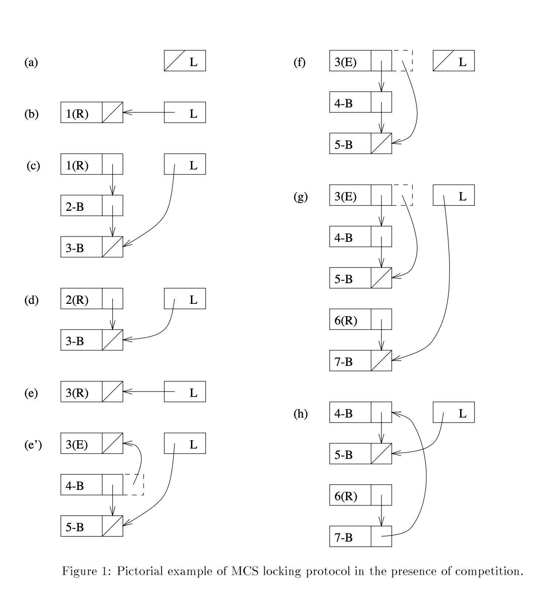

# Algorithms for Scalable Synchronization on Shared-Memory Multiprocessors
> by John. Mellor-Crummey* Michael L. Scott

## Abstract
Busy-wait techniques are heavily used for mutual exclusion and barrier synchronization in shared-memory paraller programs. Unfortunately, tipical implementataions of busy-waiting tend to produce large amounts of memory and interconnect contention, introducing performance bottlenecks that become markedly more pronounced as applications scale. We argue that this problem is not fundamental, and that one can in fact construct busy-wait synchronization algorithms that induce no memory or interconnect contention. The key to these algorithms is for every processor to spin on separate locally-accessible flag varibles, and for some other processor to terminate the spin with a single remote write operation at an appropriate time. Flag variables may be locally-accessible as a result of coherent caching, or by virtue of allocation in the local portion of physically distributed shared memory.

在共享内存并行程序中，忙等待技术主要用于互斥和屏障同步。不幸的是，忙等待的典型实现往往会产生大量内存和互连争用，从而引入性能瓶颈，随着应用程序的扩展，这些瓶颈变得更加明显。我们认为，这个问题不是根本性的，事实上，我们可以构造不引起内存或互连争用的忙等待同步算法。这些算法的关键是每个处理器在单独的本地可访问标志变量上旋转，而其他一些处理器在适当的时间通过单个远程写入操作终止旋转。标志变量可以作为一致缓存的结果或通过物理分布共享内存的本地部分中的分配而在本地可访问。

We present a new scalable algorithm for spin locks that generates O(1) remote references per lock acquisition, independent of the number of processors attempting to contention, requires only a constant amount of space per lock, and requires no hardware support other than a swap-with-memory instruction. We also present a new scalable barrier algorithm that generates O(1) remote references per processor reaching the barrier, and observe that two previously-known barriers can likewise be cast in a form that spins only on locally-accessible flag varibles. None of these barrier algorithms requires hardware support beyond the usual atomicity of memory reads and writes.

我们提出了一种新的可扩展的自旋锁算法，该算法在每次锁获取时生成 O(1）个远程引用，与试图争用的处理器数量无关，每个锁只需要恒定的空间量，并且除了使用内存指令交换外，不需要任何硬件支持。我们还提出了一种新的可伸缩屏障算法，该算法在每个到达屏障的处理器上生成 O(1）个远程引用，并观察到两个以前已知的屏障同样可以以仅在本地可访问的标志变量上旋转的形式投射。除了通常的内存读写原子性之外，这些屏障算法都不需要硬件支持。

We compare the performance of our scalable algorithms with other software approaches to busy-wait synchronization on both a Sequent Symmetry and a BBN Butterfly. Our principal conclusion is that **contention due to synchronization need not be a problem in large-scale shared-memory multiprocessors**. The existence of scalable algorithms greatly weakens the case for costly special-purpose hardware support for synchronization, and provides a case against so-called "dance hall" architectures, in which shared memory locations are equally far from all proessors.

我们比较了我们的可伸缩算法与其他软件方法在顺序对称和 BBN Butterfly 上的忙等待同步性能。我们的主要结论是同步引起的争用在大规模共享内存多处理器中不一定是问题。可伸缩算法的存在极大地削弱了昂贵的专用硬件支持同步的必要性，并为所谓的“舞厅”架构提供了一个反对的理由，在这种架构中，共享内存位置与所有进程的距离相等。

## 1 Introduction

Techniques for effciently coordinating parallel computation on MIMD, shared-memory multiprocessors are of growing interest and importance as the scale of parallel machines increases. On shared-memory machines, processors communicate by sharing data structures. To ensure the consistency of shared data structures, processors perform simple operations by using hardware-supported atomic primitives and coordinate complex operations by using synchronization constructs and conventions to protect against overlap of conflicting operations.

随着并行机规模的增加，在 MIMD、共享内存多处理器上高效协调并行计算的技术越来越受到人们的关注和重视。在共享内存机器上，处理器通过共享数据结构进行通信。为了确保共享数据结构的一致性，处理器通过使用硬件支持的原子原语执行简单操作，并通过使用同步构造和约定来协调复杂操作，以防止冲突操作的重叠。

Synchronization constructs can be divided into two classes: blocking constructs that de-schedule waiting processes, and busy-wait constructs in which processes repeatedly test shared variables to determine when they may proceed. Busy-wait synchronization is fundamental to parallel programming on shared-memory multiprocessors and is preferred over scheduler-based blocking scheduling overhead exceeds expected wait time, when processor resources are not needed for other tasks (so that the lower wake-up latency of busy waiting need not be balanced against an opportunity cost), or when scheduler-based blo cking is inappropriate or impossible (for example in the kernel of an operating system).

同步构造可以分为两类：取消等待进程调度的阻塞构造，以及进程重复测试共享变量以确定何时可以继续的忙等待构造。忙等待同步是共享内存多处理器上并行编程的基础，优先于基于调度器的阻塞调度开销超过预期等待时间，因为其他任务不需要处理器资源（因此，忙等待的较低唤醒延迟无需与机会成本相平衡），或者当基于调度器的 block 不合适或不可能时（例如在操作系统的内核中）。

Two of the most widely used busy-wait synchronization constructs are spin lo cks and barriers. Spin locks provide a means for achieving mutual exclusion (ensuring that only one processor can access a particular shared data structure at a time) and are a basic building block for synchronization constructs with richer semantics, such as semaphores and monitors. Spin locks are ubiquitously used in the implementation of parallel operating systems and application programs. Barriers provide a means of ensuring that no processes advacnce beyond a particular point int a computation until all have arrived at that point. They are typically used to separate "phases" of an application program. A barrier might guarantee, for example, that all processes have finished updating the values in a shared matrix in step t before any processes use the values as input in step t + 1.

两种最广泛使用的忙等待同步结构是自旋锁和屏障。自旋锁提供了一种实现互斥的方法（确保一次只有一个处理器可以访问特定的共享数据结构），并且是具有更丰富语义（如信号量和监视器）的同步构造的基本构建块。自旋锁广泛应用于并行操作系统和应用程序的实现中。屏障提供了一种方法，确保在所有进程都到达某一点之前，计算中没有进程超过某一点。它们通常用于分离应用程序的“阶段”。例如，屏障可以保证在任何进程在步骤 t + 1 中使用共享矩阵中的值作为输入之前，所有进程都已在步骤 t 中更新完共享矩阵中的值。

The performance of locks and barriers is a topic of great importance. Spin locks are generally employed to protect very small critical sections, and may be executed an enormous number of times in the course of a computation.Barriers, likewise, are frequently used between brief phases of data-parallel algorithms (e.g., successive relaxation), and may be a major contributor to run time. Unfortunately, typical implementations of busy-waiting tend to produce large amounts of memory and interconnection network contention, which causes performance bottlenecks that become markedly more pronounced in larger machines and applications. As a consequence, the overhead of busy-wait synchronization is widely regarded as a serious performance problem.[2,6,11,14,38,49,51]

锁和屏障的性能是一个非常重要的话题。自旋锁通常用于保护非常小的关键部分，在计算过程中可能会执行大量次。同样，在数据并行算法的短暂阶段（例如，连续松弛）之间经常使用屏障，并且可能是运行时间的主要因素。不幸的是，忙等待的典型实现往往会产生大量内存和互连网络争用，这会导致性能瓶颈，在大型机器和应用程序中变得更加明显。因此，忙等待同步的开销被广泛认为是一个严重的性能问题。

When many processors busy-wait on a single synchronization variable, they create a hot spot that is the target of a disproportionate share of the network traffic. Pfister and Norton showed that the presence of hot spots can severely degrade performance for all traffic in multistage interconnection networks, not just traffic due to synchronizing processors. As part of a larger study, Agarwal and Cherian investigated the impact of synchronization on overall program performance. Their simulations of benchmarks on a cache-coherent multiprocessor indicate that memory references due to synchronization cause cache line invalidations much more often than non-synchronization references. In simulations of the benchmarks on a 64-processor "dance hall" machine (in which each access to a shared variable traverses the processor-memory interconnection network), they observed that synchronization accounted for as much as 49% of total network traffic.

当许多处理器忙着等待一个同步变量时，它们会创建一个热点，该热点是网络通信量中不成比例的目标。Pfister 和 Norton 表明，热点的存在会严重降低多级互连网络中所有通信量的性能，而不仅仅是由于处理器的同步。作为一项大型研究的一部分，Agarwal 和 Cherian 调查了同步对整个程序性能的影响。他们在缓存一致性多处理器上对基准测试的模拟表明，同步导致的内存引用导致缓存行失效的频率比非同步引用高得多。在 64 位处理器“舞厅”机器上的基准测试模拟中（在该机器中，对共享变量的每次访问都穿过处理器内存互连网络），他们观察到同步占总网络流量的49%。

In response to performance concerns. the history of synchronization techniques has displayed a trend toward increasing hardware support. Early algorithms assumed only the ability to read and write individual memory locations atomically. They tended to b e subtle, and costly in time and space. requiring both a large number of shared variables and a large number of operations to coordinate concurrent invocations of synchronization primitives. Modern multiprocessors generally include more sophisticated atomic operations, permitting simpler and faster coordination strategies. Particularly common are various fetch_and_X operations, which atomically read, modify, and write a memory location. Fetch_and_X operations include test_and_set, fetch_and_store (swap), fetch_and_add, and compare_and_swap.

针对性能问题。同步技术的历史显示了一种增加硬件支持的趋势。早期的算法假设只能原子地读写单个内存位置。它们往往很微妙，在时间和空间上都很昂贵。需要大量共享变量和大量操作来协调同步原语的并发调用。现代多处理器通常包括更复杂的原子操作，允许更简单、更快的协调策略。特别常见的是各种 fetch_and_X操作，它们以原子方式读取、修改和写入内存位置。Fetch_and_X 操作包括 test_and_set, fetch_and_store (swap), fetch_and_add, and compare_and_swap.

More recently, there have been proposals for multistage interconnection networks that combine concurrent accesses to the same memory location. multistage networks that have special synchronization variables embedded in each stage of the network, and special-purpose cache hardware to maintain a queue of processors waiting for the same lock. The principal purpose of these hardware primitives is to reduce the impact of busy waiting. Before adopting them, it is worth considering the extent to which software techniques can achieve a similar result.

最近，有人提出了多级互连网络的建议，将对同一内存位置的并发访问结合起来。多级网络，在网络的每一级都嵌入了特殊的同步变量，并使用特殊的高速缓存硬件来维护等待相同锁的处理器队列。这些硬件原语的主要目的是减少忙等待的影响。在采用它们之前，值得考虑软件技术在多大程度上可以实现类似的结果。

For a wide range of shared-memory multiprocessor architectures, we contend that appropriate design of spin locks and barriers can eliminate all busy-wait contention. Specifically, by distributing data structures appropriately, we can ensure that each processor spins only on locally-accessible locations, locations that are not the target of spinning references by any other processor. All that is required in the way of hardware support is a simple set of fetch_and_x operations and a memory hierarchy in which each processor is able to read some portion of shared memory without using the interconnection network. On a machine with coherent caches, processors spin only on locations in their caches. On a machine in which shared memory is distributed (e.g., the BBN Butterfly, the IBM RP3, or a shared-memory hypercube), processors spin only on locations in the local portion of shared memeory.

对于广泛的共享内存多处理器体系结构，我们认为适当的自旋锁和屏障设计可以消除所有忙等待争用。具体地说，通过适当地分布数据结构，我们可以确保每个处理器只在本地可访问的位置上旋转，而这些位置不是任何其他处理器旋转引用的目标。硬件支持所需的只是一组简单的 fetch_and_x 操作，以及一个内存层次结构，其中每个处理器都能够在不使用互连网络的情况下读取部分共享内存。在具有一致缓存的机器上，处理器仅在其缓存中的位置上旋转。在共享内存分布的机器上（例如 BBN Butterfly、IBM RP3 或a shared-memory hypercube），处理器仅在共享内存的本地部分的位置上旋转。

The implication of our work is that efficient synchronization algorithms can be constructed in software for shared-memory multiprocessors of arbitrary size. Special-purpose synchronization hardware can offer only a small constant factor of additional performance for mutual exclusion, and at best a logarithmic factor for barrier synchronization. In addition, the feasibility and performance of busy-waiting algorithms with local-only spinning provides a case against "dance hall" architectures, in which shared memory locations are equally far from all processors.

我们的工作意味着可以在软件中为任意大小的共享内存多处理器构造有效的同步算法。专用同步硬件只能为互斥提供附加性能的小常数因子，对于势垒同步最多只能提供对数因子。此外，仅本地旋转的忙等待算法的可行性和性能为“舞厅”架构提供了一个案例，在“舞厅”架构中，共享内存位置与所有处理器的距离相等。

We discuss the implementation of spin locks in section 2, presenting both existing approaches and a new algorithm of our own design. In section 3 we turn to the issue of barrier synchronization, explaining how existing approaches can be adapted to eliminate spinning on remote locations, and introducing a new design that achieves both a short critical path and the theoretical minimum total number of network transactions. We present performance results in section 4 for a variety of spin lock and barrier implementations, and discuss the implications of these results for software and hardware designers. Our conclusions are summarized in section 5.

我们将在第 2 节讨论自旋锁的实现，介绍现有的方法和我们自己设计的新算法。在第 3 节中，我们将讨论屏障同步问题，解释如何调整现有方法以消除远程位置上的旋转，并介绍一种新的设计，以实现短关键路径和理论上最小的网络事务总数。我们在第 4 节中介绍了各种自旋锁和势垒实现的性能结果，并讨论了这些结果对软件和硬件设计者的影响。第 5 节总结了我们的结论。

## 2 Spin Locks
In this section we describe a series of five implementations for a mutual-exclusion spin lock. The first four appear in the literature in one form or another. The fifth is a novel lock of our own design. Each lock can be seen as an attempt to eliminate some deficiency in the previous design. Each assumes a shared-memory environment that includes certain fecth_and_x operations. As noted above, a substantial body of work has also addressed mutual exclusion using more primitive read and write atomicity; the complexity of the resulting solutions is the principal motivation for the development of fech_and_x primitives. Other researchers have considered mutual exclusion in the context of distributed systems, but the characteristics of message passing are different enough from shared memory operations that solutions do not transfer from one environment to the other.

在本节中，我们将介绍互斥自旋锁的一系列五种实现。前四种以某种形式出现在文献中。第五个是我们自己设计的新型锁。每个锁都可以看作是试图消除以前设计中的一些缺陷。每一个都假定一个共享内存环境，其中包含某些 fecth_and_x 操作。如上所述，大量工作还使用更原始的读写原子性解决了互斥问题；生产解决方案的复杂性是开发 fech_and_x 原语的主要动机。其他研究人员已经在分布式系统的上下文中考虑了互斥，但是消息传递的特性与共享内存操作有很大的不同，因此解决方案不会从一个环境转移到另一个环境。

### 2.1 The Simple Test_and_set Lock
The simplest mutual exclusion lock, found in all operating system textbooks and widely used in practice, employs a polling loop to access a Boolean flag that indicates whether the lock is held. Each processor repeatedly executes a test_and_set instruction in an attempt to change the flag from false to true, thereby acquiring the lock. A processor releases the lock by setting it to false.

最简单的互斥锁存在于所有操作系统教科书中，并在实践中广泛使用，它使用轮询循环访问指示是否持有锁的布尔标志。每个处理器重复执行一条 test_and_set 指令，试图将标志从 false 更改为 true，从而获取锁。处理器通过将锁设置为 false 来释放锁。

The principal shortcoming of the test_and_set lock is contention for the flag. Each waiting processor accesses the single shared flag as frequently as possible, using relatively expensive read-modify-write (fetch_and_x) instructions. The result is degraded performance, not only of the memory bank in which the lock resides, but also of the processor/memory interconnection network and, in a distributed shared-memory machine, the processor that owns the memory bank (as a result of stolen bus cycles).

test_and_set锁的主要缺点是对标志的争用。每个等待的处理器尽可能频繁地访问单个共享标志，使用相对昂贵的读-修改-写（fetch_and_x）指令。结果不仅是锁所在的内存库的性能下降，而且是处理器/内存互连网络的性能下降，在分布式共享内存机器中，是拥有内存库的处理器的性能下降（由于总线周期被窃取）。

Fetch_and_x instructions can be particularly expensive on cache-coherent multiprocessors, since each execution of such an instruction may cause many remote invalidations. To reduce this overhead, the test_and_set lock can be modified to use a test_and_set instruction only when a previous read indicates that the test_and_set might succeed. This so-called test-and-test_and_set technique ensures that waiting processors poll with read requests during the time that a lock is held. Once the lock becomes available, some fraction of the waiting processors detect that the lock is free and perform a test_and_set operation, exactly one of which succeeds, but each of which causes remote invalidations on a cache-coherent machine.

Fetch_and_x 指令在高速缓存相关多处理器上可能特别昂贵，因为此类指令的每次执行都可能导致许多远程失效。为了减少这种开销，可以修改 test_and_set lock，使其仅在先前的读取指示 test_and_set 可能成功时才使用 test_and_set 指令。这种所谓的 test-and-test_and_set 技术确保了等待的处理器在持有锁期间轮询读取请求。一旦锁可用，部分等待的处理器会检测到锁是空闲的，并执行测试和设置操作，其中只有一个成功，但每个操作都会导致缓存相关计算机上的远程失效。

The total amount of network traffic caused by busy-waiting on a test_and_set lock can be reduced further by introducing delay on each processor between consecutive probes of the lock. The simplest approach employs a constant delay; more elaborate schemes use some sort of backoff on unsuccessful probes. Anderson reports the best performance with exponential backoff; our experiments confirm this result. Pseudo-code for a test_and_set lock with exponential backoff appears in algorithm 1. Test_and_set suffices when using a backoff scheme; test-and-test_and_set is not necessary.

通过在锁的连续探测之间在每个处理器上引入延迟，可以进一步减少因忙等待 test_and_set 锁而导致的网络通信量总量。最简单的方法是采用恒定延迟；更复杂的方案在失败的探测上使用某种退避。Anderson报告了指数退避的最佳性能；我们的实验证实了这一结果。算法 1 中出现了具有指数退避的测试和集合锁的伪代码。使用退避方案时，test_and_set 就足够了；test-and-test_and_set 不是必需的。

```
    type lock = (unlocked, locked)

    procedure acquire_lock (L: ^lcok)
        delay : integer := 1
        while test_and_set (L) = locked     // returns old value
            pause (dalay)                   // consume this many units of time
            delay := delay * 2
    
    procedure release_lock (L: ^lock)
        lock^ := unlocked

            Algorithm 1: Simple test_and_set lock with exponential backoff.
```

### 2.2 The Ticket Lock

In a test-and-test_and_set lock, the number of read-modify-write operations is substantially less than for a simple test_and_set lock, but still potentially large. Specifically, it is possible for every waiting processor to perform a test_and_set operation every time the lock becomes available, even though only one can actually accquire the lock. We can reduce the number of fetch_and_x operations to one per lock acquisition with what we call a ticket lock. At the same time, we can ensure FIFO service by granting the lock to processors in the same order in which they first requested it. A ticket lock is fair in a strong sense; it eliminates the possibility of starvation.

在 test-and-test_and_set 锁中，读-修改-写操作的数量大大少于简单的 test_and_set 锁，但仍然可能很大。具体来说，每次锁可用时，每个等待的处理器都可能执行 test_and_set 操作，即使只有一个处理器可以实际获得锁。我们可以使用我们称之为票证锁的方法，将每个锁获取的 fetch_and_x 操作的数量减少到一个。同时，我们可以通过按照处理器第一次请求锁的相同顺序将锁授予处理器来确保 FIFO 服务。从强烈的意义上说，票证锁是公平的；它消除了饥饿的可能性。

A ticket lock consists of two counters, one containing the number of requests to acquire the lock, and the other the number of times the lock has been released. A processor acquires the lock by performing a fetch_and_increment operation on the request counter and waiting until the result (its ticket) is equal to the value of the release counter. It releases the lock by incrementing the release counter. In the terminology of Reed and Kanadia, a ticket lock corresponds to the busy-wait implementation of a semaphore using an eventcount and a sequencer. It can also be thought of as an optimization of Lamport's bakery lock, which was designed for fault-tolerance rather than performance. Instead of spinning on the release counter, processors using a bakery lock repeatedly examine the tickets of their peers.

票证锁由两个计数器组成，一个计数器包含获取锁的请求数，另一个计数器包含释放锁的次数。处理器通过对请求计数器执行 fetch_and_increment 操作并等待结果（其票证）等于释放计数器的值来获取锁。它通过增加释放计数器来释放锁。在 Reed 和 Kanadia 的术语中，票证锁对应于使用 eventcount 和sequencer 的信号量的忙等待实现。它也可以被认为是对 Lamport's bakery 锁的优化，该锁是为容错而不是性能而设计的。使用 bakery 锁的处理器不在释放计数器上旋转，而是反复检查同行的票。

Though it probes with read operations only (and thus avoids the overhead of unnecessary invalidations in coherent cache machines), the ticket lock still causes substantial memory and network contention through polling of a common location. As with the test_and_set lock, this contention can be reduces by introducing delay on each processor between consecutive probes of the lock. In this case, however, exponential backoff is clearly a bad idea. Since processors acquire the lock in FIFO order, overshoot in backoff by the first processor in line will delay all others as well, causing them to back off even farther. Our experiments suggest that a reasonable delay can be determined by using information not available with a test_and_set lock: namely, the number of processors already waiting for the lock. The delay can be computed as the difference between a newly-obtained ticket and the current value of the release counter.

尽管它只使用读取操作进行探测（从而避免了一致缓存机器中不必要的失效开销），但票证锁仍然通过轮询公共位置导致大量内存和网络争用。与 test_and_set lock一样，可以通过在锁的连续探测之间在每个处理器上引入延迟来减少这种争用。然而，在这种情况下，指数退避显然是个坏主意。由于处理器以 FIFO 顺序获得锁，因此第一个处理器在退避中的过冲也会延迟所有其他处理器，导致它们退避得更远。我们的实验表明，合理的延迟可以通过使用 test_and_set 锁不可用的信息来确定：即已经等待锁的处理器数量。延迟可以计算为新获得的票证和释放计数器的当前值之间的差值。

Delaying for an appropriate amount of time requires an estimate of how long it will take each processor to execute its critical section and pass the lock to its successor. If this time is known exactly. it is in principle possible to acquire the lock with only two probes, one to determine the number of processors already in line (if any), and another (if necessary) to verify that one's predecessor in line has finished with the lock. This sort of accuracy is not likely in practice, however, since critical sections do not in general take identical, constant amounts of time. Moreover, delaying proportional to the expected average time to hold the lock is risky: if the processors already in line average less than the expected amount the waiting processor will delay too long and slow the entire system. A more appropriate constant of proportionality for the delay is the minimum time that a processor can hold the lock. Pseudo-code for a ticket lock with proportional backoff appears in algorithm 2. It assumes that the new_ticket and now_serving counters are large enough to accommodate the maximum number of simultaneous requests for the lock.

延迟适当的时间需要估计每个处理器执行其关键部分并将锁传递给后续处理器所需的时间。如果这个时间是准确的。原则上，只需两个探针即可获取锁，一个探针用于确定已在线的处理器数量（如有），另一个探针（如有必要）用于验证已在线的前一个处理器是否已使用锁。然而，这种精度在实践中是不可能的，因为关键部分通常不需要相同、恒定的时间。此外，与持有锁的预期平均时间成比例的延迟是有风险的：如果已排队的处理器的平均值小于预期值，等待的处理器将延迟太长时间，并使整个系统变慢。算法 2 中展示了具有比例退避的票据锁的伪代码。它假设 new_ticket 和 now_serving 计数器足够大，可以容纳最大数量的同时请求锁。

```
    type lock = record
        next_ticket : unsigned integer := 0
        now_serving : unsighed integer := 0

    procedure acquire_lock (L : ^lock)
        my_ticket : unsigned integer := fetch_and_increment (&L->next_ticket)
            // returns old value; arithmetic overflow is harmless
        loop
            pause (my_ticket - L->now_serving)
                // consume this many units of time
                // on most machines, subtraction works correctly despite 
                // overflow
            if  L->now_serving = my_ticket
                return
            
    procedure release_lock (L : ^lock)
        L->now_serving := L->now_serving + 1

```

### 2.3 Array-Based Queuing Locks

Even using a ticket lock with proportional backoff, it is not possible to obtain a lock with an expected constant number of network transactions, due to the unpredictability of the length of critical sections. Anderson and Graunke and Thakkar have proposed locking algorithms that achieve the constant bound on cache-coherent multiprocessors that support atomic fetch_and_increment or fetch_and_store, respectively. The trick is for each processor to use the atomic operation to obtain the address of a location on which to spin. Each processor spins on a different location, in a different cache line. Anderson's experiments indicate that his queuing lock outperforms a test_and_set lock with exponential backoff on the Sequent Symmetry when more than six processors are competing for access. Graunke and Thakkar's experiments indicate that their lock outperforms a test_and_set lock on the same machine when more than three processors are competing.

即使使用具有比例退避的票证锁，也不可能获得具有预期恒定网络事务数的锁，因为关键部分的长度不可预测。Anderson、Graunke 和 Thakkar 提出了锁定算法，分别在支持原子 fetch_and_increment 或 fetch_and_store 的缓存一致多处理器上实现常量界限。技巧是每个处理器使用原子操作来获取要旋转的位置的地址。每个处理器在不同的缓存线中的不同位置旋转。Anderson 的实验表明，当超过六个处理器竞争访问时，他的排队锁在顺序对称性上优于具有指数退避的 test_and_set 锁。Graunke 和Thakkar 的实验表明，当三个以上的处理器竞争时，他们的锁在同一台机器上的性能优于 test_and set 锁。

```
    type lock = record
        slots : array [0..numprocs - 1] of (has_lcok, must_wait)
            := (has_lock, must_wait, must_wait, ..., must_wait)
            // each element of slots should lie in a different memory module
            // or cache line
        next_slot : integer := 0

    // parameter my_place, below, points to a private varible
    // in an enclosing scope

    procedure acquire_lock (L : ^lock, my_place : ^integer)
        my_place^ := fetch_and_increment (&L->next_slot)
            // returns old value
        if my_place^ mod numprocs = 0
            atomic_add (&L->next_slot, -numprocs)
            // avoid problems with overflow; return value ignored
        my_place^ := my_place^ mod numprocs
        repeat while L->slots[my_place^] = must_wait    // spin
        L->slots[my_place^] := must_wait                // init for next times

    procedure release_lock (L : ^lock, my_place : ^integer)
        L->slots[(my_place^ + 1) mod numprocs] := has_lock

    
    Altorithm 3: Anderson's array-based queuing lock.

```

```
    type lock = record
        slots : array [0..numprocs - 1] of Boolean := true
            // each element of slots should lie in a diffrent memeory module
            // or cache line
        tail : record
            who_was_last : ^Boolean := 0
            this_means_locked : Boolean := false
            // this_means_locked is a one-bit quantity.
            // who_was_last points to an element of slots.
            // if all elements lie at even addresses, this tail "record"
            // can be made to fit in one word
    processor private vpid : integer    // a unique virtual processor index

    procedure acquire_lock (L : ^lock) 
        (who_is_ahead_of_me : ^Boolean, what_is_locked : Boolean)
            := fetch_and_store (&L->tail, (&slots[vpid], slots[vpid]))
        repeat while who_is_ahead_of_me^ = what_is_locked

    procedure release_lock (L : ^lock)
        L->slots[vpid] := not L->slots[vpid]


    Algorithm 4: Graunke and Thakkar's array-based queuing lock.

```

Neither Anderson nor Graunke and Thakkar included the ticket lock in their exp eriments. In qualitative terms, both the ticket lock (with prop ortional backoff) and the array-based queuing locks guarantee FIFO ordering of requests. Both the ticket lock and Anderson's lock use an atomic fetch_and_increment instruction. The ticket lock with proportional backoff is likely to require more network transactions on a cache-coherent multiprocessor, but fewer on a multiprocessor without coherently cached shared variables. The array-based queuing locks require space per lock linear in the number of processors, whereas the ticket lock requires only a small constant amount of space. We provide quantitative comparisons of the locks' performance in section 4.3.

Anderson、Graunke 和 Thakkar 都没有在他们的实验中包括票锁。在定性方面，票证锁（具有比例退避）和基于数组的排队锁都保证请求的 FIFO 排序。票证锁和安德森锁都使用原子 fetch_and_increment 指令。具有比例退避的票证锁在缓存一致的多处理器上可能需要更多的网络事务，但在没有一致缓存的共享变量的多处理器上可能需要更少的网络事务。array-based 的排队锁要求每个锁的空间与处理器数量成线性关系，而票证锁只需要少量的固定空间。我们在第 4.3 节中提供了锁性能的定量比较。

### 2.4 A New List-Based Queuing Lock
We have devised a new mechanism called the MCS lock (after out initials) that
+ guarantees FIFO ordering of lock acquisitions;
+ spins on locally-accessible flag variables only;
+ requires a small constant amount of space per lock; and
+ works equally well (requiring only O(1) network transactions per lock acquisition) on machines with and without coherent caches.

我们设计了一种称为MCS锁（在首字母后面）的新机制
+ 保证锁获取的 FIFO 顺序；
+ 仅在本地可访问的标志变量上旋转；
+ 每个锁需要少量的固定空间；
+ 在具有或不具有一致缓存的计算机上同样有效（每次锁获取只需要 O（1）个网络事务）。

The first of these advantages is shared with the ticket lock and the array-based queuing locks, but not with the test_and_set lock. The third is shared with the test_and_set and ticket locks, but not with the array-based queuing locks. The fourth advantage is in large part a consequence of the sescond, and is unique to the MCS lock.

这些优点中的第一个与票证锁和基于数组的排队锁共享，但与 test_and_set 锁不共享。第三个与 test_and_set 和票证锁共享，但不与基于数组的排队锁共享。第四个优点在很大程度上是秒数的结果，并且是 MCS 锁所独有的。

Our lock was inspired by the QOLB (Queue On Lock Bit) primitive proposed for the cache controllers of the Wisconsin Multicube, but is implementedentirely in software. It requires an atomic fetch_and_store (swap) instruction. and benefits from the availability of compare_and_swap. Without compare_and_swap we lose the guarantee of FIFO ordering and introduce the theoretical possibility of starvation, though lock acquisitions are likely to remain very nearly FIFO in practice.

我们的锁的灵感来自于为威斯康星州多管缓存控制器提出的 QOLB（锁位队列）原语，但主要是在软件中实现的。它需要一个原子fetch_and_store（swap）指令。并从 compare_and_swap 的可用性中获益。如果不 compare_and_swap，我们就失去了 FIFO 排序的保证，并引入了饥饿的理论可能性，尽管锁获取在实践中可能仍然非常接近 FIFO。

Pseudo-code for our lock appears in algorithm 5. Every processor using the lock allocates a qnode record containing a queue link and a Boolean flag. Each processor employs one additional temporary variable during the acquire_lock operations. Processors holding or waiting for the lock are chained together by the links. Each processor spins on its own locally-accessible flag. The lock itself contains a pointer to the qnode record for the processor at the tail of the queue, or a nil if the lock is not held. Each processor in the queue holds the address of the record for the processor behind it--the processor it should resume after acquiring and releasing the lock. Compare_and_swap enables a processor to determine whether it is the only processor in the queue, and if so remove itself correctly, as a single atomic action. The spin in acquire_lock waits for the lock to become free. The spin in release_lock compensates for the timing window between the fetch_and_store and the assignment to predecessor->next in acquire_lock. Both spins are local.

锁的伪代码出现在算法 5 中。每个使用锁的处理器分配一个 qnode 记录，其中包含一个队列链接和一个布尔标志。在获取锁定操作期间，每个处理器使用一个额外的临时变量。持有或等待锁的处理器由链接链接在一起。每个处理器根据其自己的本地可访问标志旋转。锁本身包含一个指向队列尾部处理器的 qnode 记录的指针，如果没有持有锁，则包含一个 nil。队列中的每个处理器都保存其后面的处理器的记录地址——即在获取并释放锁后应该恢复的处理器。Compare_and_swap 使处理器能够确定它是否是队列中的唯一处理器，如果是，则作为单个原子操作正确删除自身。“获取锁定”中的旋转将等待锁定释放。释放锁定中的自旋补偿了获取锁定中 fetch_and_store 以及分配给 predecessor->next 的时间窗口。两次旋转都是局部旋转。

```
    type qnode = record
        next : ^qnode
        locked : Boolean
    type lock = ^qnode

    // parameter I, below, points to a qnode record allocated
    // (in an enclosing scope) in shared memory locally-accessible
    // to the invoking processor

    procedure acquire_lock (L : ^lock, I : ^qnode)
        I->next := nil
        predecessor : ^qnode := fetch_and_store (L, I)
        if predecessor != nil           // queue was non-empty
            I->locked := true
            predecessor->next := I
            repeat while I->locked                  // spin

    procedure release_lock (L : ^lock, I : ^qnode)
        if I->next = nil                // no known successor
            if compare_and_swap (L, I, nil)
                return
                // compare_and_swap returns true iff it swapped
            repeat while I->next = nil              // spin
        I->next->locked := false

    
        Algorithm 5: The MCS list-based queuing lock.
```

Figure 1, parts (a) through (e), illustrates aseries of acquire_lock and release_lock operations. The lock itself is represented by a box containing an 'L'. The other rectangles are qnode records. A box with a slash through it represents a nil pointer. Non-nil pointer are directed arcs. In (a) the lock is free. In (b), processor 1 has acquried the lock. It is running (indicated by the 'R'), thus its locked flag is irrelevant (indicated by putting the 'R' in parentheses). In (c), two more processors have entered the queue while the lock is still held by processor 1. They are blocked spinning on their locked flags (indicated by the 'B's). In (d), processor 1 has completed, and has changed the locked flag of processor 2 so that it is now running. In (e), processor 2 has completed, and has similarly unblocked processor 3. If no more processors enter the queue in the immediate future, the lock will return to the situation in (a) when processor 3 completes its critical section.

图 1（a）至（e）部分说明了一系列获取锁定和释放锁定操作。锁本身由一个包含“L”的框表示。其他矩形是 qnode 记录。带斜线的框表示零指针。非零指针是有向弧。在（a）中，锁是自由的。在（b）中，处理器 1 已获得锁。它正在运行（由“R”表示），因此它的锁定标志是不相关的（由括号中的“R”表示）。在（c）中，当锁仍由处理器 1 持有时，又有两个处理器进入队列。它们在锁定的旗帜上旋转时被阻止（由“B”指示）。在（d）中，处理器 1 已完成，并已更改处理器 2 的锁定标志，使其现在正在运行。在（e）中，处理器 2 已完成，并且同样已解除阻塞处理器 3。如果在不久的将来没有更多的处理器进入队列，当处理器 3 完成其关键部分时，锁将返回到（a）中的情况。



Alternative code for the release_lock operation, without compare_and_swap, appears in algorithm 6. Like the code in algorithm 5, it spins on processor-speciffic, locally-accessible memory locations only, requires constant space per lock, and requires only O(1) network transactions regardless of whether the machine provides coherent caches. Its disadvantages are extra complexity and the loss of strict FIFO ordering.

释放锁定操作的替代代码（不带比较锁定和交换锁定）出现在算法 6 中。与算法 5 中的代码一样，它仅在处理器特定的本地可访问内存位置上旋转，每个锁需要恒定的空间，并且无论机器是否提供一致的缓存，都只需要 O（1）个网络事务。它的缺点是额外的复杂性和丢失严格的 FIFO 顺序。

```
    procedure release_lock (L : ^lock, I : ^qnode)
        if I->next = nil            // no known successor
            old_tail : ^qnode := fetch_and_store (L, nil)
            if (old_tail = I)           // I really had no successor
                return
            // we have accidentally removed some processor(s) from the queue;
            // we need to put them back
            usurper := fecth_and_store (L, old_tail)
            repeat while I->next = nil       // wait for pointer to victim list
            if usurper != nil
                // somebody got into the queue ahead of our victims
                usurper->next := I->next // link victims after the last usurper
            else 
                I->next->locked := false
        else
            I->next->locked := false

        
        Algorithm 6: Code for release_lock, without compare_and_swap.
```

Parts (e) through (h) of figure 1 illustrate the subtleties of the alternative code for release_lock. In the original version of the lock, compare_and_swap ensures that updates to the tail of the queue happen atomically. There are no processors waiting in line if and only if the tail pointer of the queue points to the processor releasing the lock. Inspecting the processor's next pointer is solely an optimization, to avoid unnecessary use of a comparatively expensive atomic instruction. Without compare_and_swap, inspection and update of the tail pointer cannot occur atomically. When processor 3 is ready to release its lock, it assumes that no other processor is in line if its next pointer is nil. In other words, it assumes that the queue locks the way it does in (e). (It could equally well make this assumption after inspecting the tail pointer and finding that it points to itself, but the next pointer is local and the tail pointer is probably not.) This assumption may be incorrect because other processors may have linked themselves into the queue between processor 3's inspection and its subsequent update of the tail. The queue may actually be in the state shown in (e'), with one or more processors in line behind processor 3, the first of which has yet to update 3's next pointer. (The 'E' in parentheses on processor 3 indicated that it is exiting its critical section; the value of its locked flag is irrelevant.)

图 1 的（e）部分到（h）部分说明了释放锁替代代码的微妙之处。在锁的原始版本中，compare_and_swap 确保对队列尾部的更新以原子方式进行。当且仅当队列的尾部指针指向释放锁的处理器时，没有处理器排队等待。检查处理器的下一个指针仅仅是一种优化，以避免不必要地使用相对昂贵的原子指令。如果没有 compare_and_swap，尾指针的检查和更新就不能自动进行。当处理器 3 准备释放其锁时，如果其下一个指针为 nil，则假定没有其他处理器在队列中。换句话说，它假设队列以（e）中的方式锁定。（在检查尾部指针并发现它指向自身后，它同样可以做出这种假设，但下一个指针是本地指针，而尾部指针可能不是。）此假设可能不正确，因为其他处理器可能已将自己链接到处理器 3 的检查与其后续尾部更新之间的队列中。队列实际上可能处于（e'）中所示的状态，一个或多个处理器排在处理器 3 后面，其中第一个处理器尚未更新 3 的下一个指针。（处理器 3 上括号中的 “E” 表示它正在退出其临界段；其锁定标志的值无关。）

When new processors enter the queue during this timing window, the data structure temporarily takes on the form shown in (f). The return value of processor 3's first fetch_and_store in release_lock (shown in the extra dotted box) is the tail pointer for a list of processors that have accidentally been linked out of the queue. By waiting for its next pointer to become non-nil, processor 3 obtains a head pointer for this "victim" list. It can patch the victim processors back into the queue, but before it does so additional processors ("usurpers") may enter the queue with the first of them acquiring the lock, as shown in (g). Processor 3 puts the tail of the victim list back into the tail pointer of the queue with a fetch_and_store. If the return value of this fetch_and_store is nil, processor 3 unblocks its successor. Otherwise, as shown in (h), processor 3 inserts the victim list behind the usurpers by writing its next pointer (the head of the victim list) into the next pointer of the tail of the usurper list. In either case, the structure of the queue is restored.

当新处理器在窗口时间期间进入队列时，数据结构暂时采用（f）中所示的形式。处理器 3 在release_lock 中的第一个 fetch_和_store 的返回值（显示在额外的虚线框中）是意外链接到队列外的处理器列表的尾部指针。通过等待其下一个指针变为非 nil，处理器 3 获得该“受害者”列表的头指针。它可以将受害处理器修补回队列，但在此之前，其他处理器（“篡位者”）可能会进入队列，其中第一个获得锁，如（g）所示。处理器 3 使用 fetch_and_store 将受害者列表的尾部放回队列的尾部指针。如果此 fetch_and_store 的返回值为零，则处理器 3 取消阻止其后续存储。否则，如（h）所示，处理器 3 通过将其下一个指针（受害者列表的头部）写入篡位者列表尾部的下一个指针，将受害者列表插入篡位者后面。在这两种情况下，都会恢复队列的结构。

To demonstrate formal correctness of the MCS lock we can prove mutual exclusion, deadlock freedom, and fairness for a version of the algorithm in which the entire acquire_lock and release_lock procedures comprise atomic actions, broken only when a processor waits (in acquire_lock) for the lock to become available. We can then refine this algorithm through a series of correctnesspreserving transformations into the code in algorithm 5. The first transformation breaks the atomic action of acquire_lock in two, and introduces auxiliary variables that indicate when a processor has modified the tail pointer of the queue to point at its qnode record, but has not yet modified its predecessor's next pointer. To preserve the correctness proof in the face of this transformation, we (1) relax the invariants on queue structure to permit a non-tail processor to have a nil next pointer, so long as the auxiliary variables indicate that its successor is in the timing window, and (2) introduce a spin in release_lock to force the processor to wait for its next pointer to be updated before using it. The second transformation uses proofs of interference freedom to move statements outside of the three atomic actions. The action containing the assignment to a predecessor's next pointer can then be executed without explicit atomicity; it inspects or modifies only one variable that is modified or inspected in any other process. The other two actions are reduced to the functionality of fetch_and_store and compare_and_swap. The details of this argument are straightforword but lengthy (they appear as an appendix to the technical report version of this paper; we find the informal desciption and pictures above more intuitively convincing.

为了证明 MCS 锁的形式正确性，我们可以证明算法版本的互斥性、死锁自由度和公平性，其中整个获取锁和释放锁过程包括原子动作，只有当处理器等待（在获取锁中）锁可用时才会断开。然后，我们可以通过对算法 5 中的代码进行一系列保持正确性的转换来完善该算法。第一个转换将 acquire_lock 的原子操作一分为二，并引入辅助变量，指示处理器何时修改队列的尾部指针以指向其 qnode 记录，但尚未修改其前一个指针。为了在这种转换中保持正确性证明，我们（1）放宽队列结构上的不变量，以允许非尾部处理器有一个 nil next 指针，只要辅助变量指示其后继指针在计时窗口中，（2）在释放锁中引入旋转，强制处理器在使用它之前等待下一个指针被更新。第二种转换使用干涉自由度证明将语句移到三个原子动作之外。然后，可以在没有显式原子性的情况下执行包含对前置指针的赋值的操作；它只检查或修改在任何其他过程中修改或检查的一个变量。另外两个操作简化为 fetch_and_store 以及 compare_and_swap 的功能。这一论点的细节直截了当但冗长（它们作为本文技术报告版本的附录出现；我们发现上面的非正式描述和图片更直观地令人信服）。

## 3 Barriers

Barriers have received a great deal of attention in the literature, more so even than spin locks, and the many published algorithms differ significantly in natational conventions and architectual assumptions. We present five different barriers in the section, four from the literature and one of our own design. We have modified some of the existing barriers to increase their locality of reference or otherwise improve their performance; we note where we have done so.

屏障在文献中受到了极大的关注，甚至比自旋锁更为关注，许多已发表的算法在自然约定和架构假设方面存在显著差异。在本节中，我们提出了五个不同的屏障，四个来自文献，一个来自我们自己的设计。我们已经修改了一些现有的障碍，以增加其参考位置或以其他方式提高其性能；我们注意到我们在哪些方面这样做了。

### 3.1 Centralized Barriers

In a centralized implementation of barrier synchronization, each processor updates a small amount of shared state to indicate its arrival, and then polls that state to determine when all of the processors have arrived. Once all of the processors have arrived, each processor is permitted to continue past the barrier. Like the test_and_set spin lock, centralized barriers are of uncertain origin. Essentially equivalent algorithms have undoubtedly been invented by numerous individuals.

在屏障同步的集中实现中，每个处理器更新少量共享状态以指示其到达，然后轮询该状态以确定所有处理器何时到达。所有处理器到达后，允许每个处理器继续通过屏障。与 test_and_set 自旋锁一样，集中式屏障的来源不确定。毫无疑问，许多人已经发明了本质上等价的算法。

Most barriers are designed to be used repeatly (to separate phases of a many-phase algorithm, for example). In the most obvious formulation, each instance of a centralized barrier begins and ends with identical values for the shared state variables. Each processor must spin twice per instance, once to ensure that all processors have left the previous barrier, and again to ensure that all processors have arrived at the current barrier. Without the first spin, it is possible for a processor to mistakenly pass through the current barrier because of state information being used by processors still leaving the previous barrier. Two barrier algorithms proposed by Tang and Yew (the first algorithm appears in [48, Algorithm 3.1] and [49, p. 3]; the second algorithm appears in [49, Algorithm 3.1]) suffer from this type of flaw.

大多数屏障设计为可重复使用（例如，分离多阶段算法的阶段）。在最明显的公式中，集中屏障的每个实例都以共享状态变量的相同值开始和结束。每个处理器每个实例必须旋转两次，一次确保所有处理器都已离开前一个屏障，另一次确保所有处理器都已到达当前屏障。如果没有第一次旋转，处理器可能会错误地通过当前屏障，因为处理器使用的状态信息仍然离开前一个屏障。Tang和Yew 提出的两种屏障算法（第一种算法出现在[48，算法3.1]和[49，第3页]；第二种算法出现在[49，算法3.1]中）存在此类缺陷。

We can reduce the number of references to the shared state variables, and simultaneously eliminate one of the two spinning episodes, by "reversing the sense" of the variables (and leaving them with different values) between consecutive barriers. The resulting code is shown in algorithm 7. Arriving processors decrement count and then wait until sense has a different value than it did in the previous barrier. The last arriving processor resets count and reverses sense. Consecutive barriers cannot interfere with each other because all operations on count occur before sense is toggled to release the waiting processors.

我们可以减少对共享状态变量的引用数量，同时消除两个旋转事件中的一个，方法是在连续的障碍之间“反转 sense ”变量的意义（并使其具有不同的值）。生成的代码如算法 7 所示。到达处理器递减计数，然后等待，直到 sense 的值与前一个屏障中的值不同。最后到达的处理器重置计数并反转 sense。连续的屏障不能相互干扰，因为所有计数操作都发生在切换 sense 以释放等待的处理器之前。

```
    shared count: integer := P
    shared sense: Boolean := true
    processor private local_sense: Boolean := true

    procedure central_barrier
        local_sense := not local_sense  // each processor toggles its own sense
        if fetch_and_decrement (&count) = 1
            count := P
            sense := local_sense        // last processor toggles global sense
        else 
            repeat until sense = local_sense


        Algorithm 7: A sense-reversing centralized barrier.
```

Lubachevsky presents a similar barrier algorithm that uses two shared counters and a processor private two-state flag. The private flag selects which counter to use; consecutive barriers use alternate counters. Another similar barrier can be found in library packages distributed by Sequent Corporation for the Symmetry multiprocessor. Arriving processors read the current value of a shared epoch number, update a shared counter, and spin until the epoch number changes. The last arriving processor re-initializes the counter and advances the epoch number.

Lubachevsky 提出了一种类似的屏障算法，该算法使用两个共享计数器和一个处理器专用双态标志。专用标志选择要使用的计数器；连续屏障使用备用计数器。另一个类似的障碍可以在 Sequent 公司为Symmetry 多处理器分发的库包中找到。到达的处理器读取共享历元数的当前值，更新共享计数器，并旋转直到历元数改变。最后到达的处理器重新初始化计数器，并使历元数提前。

(...后续补充)

## 5. Summary of Recommendations

We have presented a detailed comparison of new and existing algorithms for busy-wait synchronization on shared-memory multiprocessors, with a particular eye toward minimizing the network transactions that lead to contention. We introduced the MCS lock, the new tree-based barrier, and the notion of proportional backoff for the ticket lock and the centralized barrier. We demonstrated how to eliminate fetch_and_x operations from the wakeup phase of the combining tree barrier, presented a wakeup mechanism for the tournament barrier that uses contiguous, statically allocated flags to ensure local-only spinning, and observed that the data structures of the dissemination barrier can be distributed for local-only spinning.

我们对共享内存多处理器上忙等待同步的新算法和现有算法进行了详细的比较，特别着眼于最小化导致争用的网络事务。我们介绍了 MCS 锁，新的基于树的屏障，以及票证锁和集中屏障的比例退避概念。我们演示了如何从组合树屏障的唤醒阶段消除 fetch_and_x 操作，提出了锦标赛屏障的唤醒机制，该机制使用连续的静态分配标志来确保仅本地旋转，并观察到传播屏障的数据结构可以仅为本地旋转而分布。

The principal conclusion of our work is that memory and interconnect contention due to busy-wait synchronization in shared-memory multiprocessors need not be a problem. This conclusion runs counter to widely-held beliefs. We have presented empirical performance results for a wide variety of busy-wait algorithms on both a cache-coherent multiprocessor and a multiprocessor with distributed shared memory. These results demonstrate that appropriate algorithms using simple and widely-available atomic instructions can reduce synchronization contention effectively to zero.

我们工作的主要结论是，共享内存多处理器中由于忙等待同步而导致的内存和互连争用不一定是一个问题。这一结论与普遍持有的信念背道而驰。我们给出了各种忙等待算法在高速缓存相干多处理机和具有分布式共享内存的多处理机上的实验性能结果。这些结果表明，使用简单且广泛可用的原子指令的适当算法可以有效地将同步争用减少到零。

For spin locks on a shared-memory multiprocessor, regardless of architectual details, we suggest:
1. If the hardware provides an efficient fetch_and_store instruction (and maybe comapre_and_swap), then use the MCS lock. One-processor latency will be reasonable, and scalability will be excellent.
2. If fetch_and_store is not available, or if atomic operations are very expensive relative to nonatomic instructions and one-processor latency is an overwhelming concern, then use the ticket lock with proportional backoff (assuming the hardware supports fetch_and_increment). The code for such a lock typically more complicated than code for the MCS lock, and the load on the processor-memory interconnect will be higher in the presence of competition for the lock, but speed on a single processor will be slightly better and scalability will still be reasonable.
3. Use the simple lock with exponential backoff (with a cap on the maximum delay) if processes might be preempted while spinning, or if one-processor latency is an overwhelming concern and the hardware does not support fetch_and_increment (assuming of course that it does support test_and_set).

对于共享内存多处理器上的自旋锁，无论架构细节如何，我们建议：
1. 如果硬件提供有效的 fetch_and_store 指令（可能还有comapre_and_swap），则使用 MCS 锁。单处理器延迟将是合理的，可扩展性将是极好的。
2. 如果 fetch_and_store 不可用，或者如果原子操作相对于非原子指令非常昂贵，并且一个处理器的延迟是一个压倒性的问题，那么使用具有比例退避的票证锁（假设硬件支持fetch_and_increment）。此类锁的代码通常比 MCS 锁的代码更复杂，并且在存在锁竞争的情况下，处理器内存互连上的负载将更高，但单个处理器上的速度将稍好，可伸缩性仍然合理。
3. 如果进程在旋转时可能被抢占，或者如果一个处理器的延迟是一个压倒性的问题，并且硬件不支持fetch_and_increment（当然假设它确实支持 test_and_set），则使用带有指数回退的简单锁（最大延迟上限）。

For barrier synchronization we suggest:
1. On a broadcast-based cache-coherent multiprocessor (with unlimited replication), use either a centeralized counter-based barrier (for modest numbers of processors), or a barrier based on our 4-ary arrival tree and a central sense-reversing wakeup flag.
2. On a multiprocessor without coherent caches, or with directory-based coherency without broadcast, use either the dissemination barrier (with data structures distributed to respectlocality) or our tree-based barrier with tree wakeup. The critical path through the dissemination barrier algorithm is about a third shorter than that of the tree barrier, but the total amount of interconnect traffic is O(P logP) instead of O(P). The dissemination barrier will outperform the tree barrier on machines such as the Butterfly, which allow non-interfering network transactions from many different processors to proceed in parallel.

对于屏障同步，我们建议：
1. 在基于广播的缓存相干多处理器（具有无限复制）上，使用基于计数器的中心化屏障（对于数量适中的处理器），或者使用基于四元到达树和中央感知反转唤醒标志的屏障。
2. 在没有一致缓存的多处理器上，或者在没有广播的情况下使用基于目录的一致性，可以使用传播屏障（数据结构分布到不同的位置），也可以使用基于树的屏障和树唤醒。通过传播屏障算法的关键路径比树屏障算法的关键路径短约三分之一，但互连流量的总量是O（P logP），而不是O（P）。在诸如蝴蝶（Butterfly）这样的机器上，传播屏障将优于树屏障，后者允许来自许多不同处理器的无干扰网络事务并行进行。

For the disigners of large-scale shared-memory multiprocessors, our results argue in favor of providing distributed memory or coherent caches, rather than dance-hall memory withour coherent caches (as in Cedar, the monarch, or the Ultracomputer). Our results also indicate that combining networks for such machines must be justified on grounds other than the reduction of synchronization overhead. We strongly suggest that future multiprocessors include a full set of fetch_and_x operations (especially fetch_and_store and compare_and_swap).

对于大规模共享内存多处理器的设计者来说，我们的结果支持提供分布式内存或一致性缓存，而不是使用一致性缓存的舞厅内存（如 Cedar、Monar 或 Ultracomputer）。我们的结果还表明，为这类机器组合网络必须以减少同步开销以外的其他理由为依据。我们强烈建议未来的多处理器包括一整套 fetch_and_x操作（特别是 fetch_and_store 以及 compare_and_swap）。
