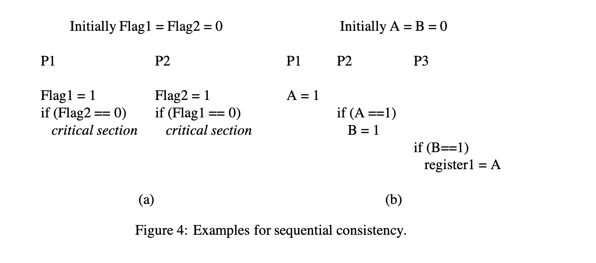
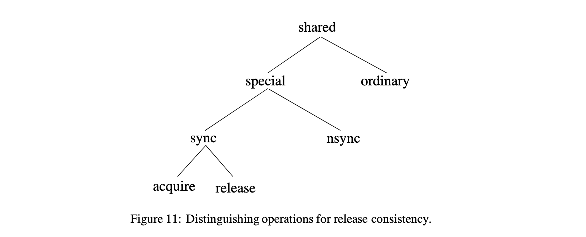

# Shared MemoryConsistency Models: A Tutorial
> Sarita V. Adve Kourosh Gharachorloo

[TOC]

## Abstract
Parallel systems that support the shared memory abstraction are becoming widely accepted in many areas of computing. Writing correct and efficient programs for such systems requires a formal specification of memory semantics, called a memory consistency model. The most intuitive model---sequential consistency---greatly restricts the use of many performance optimizations commonly used by uniprocessor hardware and compiler designers, thereby reducing the benefit of using a multiprocessor. To alleviate this problem, many current multiprocessors support more relaxed consistency models. Unfortunately, the models supported by various systems differ from each other in subtle yet important ways. Furthermore, precisely defining the semantics of each model often leads to complex specifications that are difficult to understand for typical users and builders of computer systems.

支持共享内存抽象的并行系统在许多计算领域正被广泛接受。为这类系统编写正确有效的程序，需要对内存语义进行正式的规范，称为内存一致性模型。最直观的模型---顺序一致性---极大地限制了单处理器硬件和编译器设计者常用的许多性能优化的使用，从而减少了使用多处理器的好处。为了缓解这个问题，目前许多多核处理器支持更宽松的一致性模型。不幸的是，各种系统支持的模型在细微而重要的方面存在差异。此外，精确定义每个模型的语义往往导致复杂的规范，对于计算机系统的典型用户和建设者来说，很难理解。

The purpose of this tutorial paper is to describe issues related to memory consistency models in a way that would be understandable to most computer professionals. We focus on consistency models proposed for hardware-based shared-memory systems. Many of these models are originally specified with an emphasis on the system optimizations they allow. We retain the system-centric emphasis, but use uniform and simple terminology to describe the different models. We also briefly discuss an alternate programmer-centric view that describes the models in terms of program behavior rather than specific system optimizations.

这篇教程论文的目的是以大多数计算机专业人员可以理解的方式来描述与内存一致性模型有关的问题。我们重点讨论为基于硬件的共享内存系统提出的一致性模型。这些模型中的许多最初都是以它们所允许的系统优化为重点来指定的。我们保留了以系统为中心的重点，但使用统一和简单的术语来描述不同的模型。我们还简要地讨论了另一种以程序员为中心的观点，即用程序行为而不是具体的系统优化来描述这些模型。

## 1 Introduction
The shared memory or single address space abstraction provides several advantages over the message passing (or private memory) abstraction by presenting a more natural transition from uniprocessors and by simplifying difficult programming tasks such as data partitioning and dynamic load distribution. For this reason, parallel systems that support shared memory are gaining wide acceptance in both technical and commercial computing.

与消息传递（或私有内存）抽象相比，共享内存或单一地址空间抽象提供了若干优势，它提供了从单处理器的更自然的过渡，并简化了困难的编程任务，如数据分区和动态负载分配。由于这个原因，支持共享内存的并行系统在技术和商业计算中都得到了广泛的认可。

To write correct and efficient shared memory programs, programmers need a precise notion of how memory behaves with respect to read and write operations from multiple processors. For example, consider the shared memory program fragment in Figure 1, which represents a fragment of the LocusRoute program from the SPLASH application suite. The figure shows processor P1 repeatedly allocating a task record, updating a data field within the record, and inserting the record into a task queue. When no more tasks are left, processor P1 updates a pointer, Head, to point to the first record in the task queue. Meanwhile, the other processors wait for Head to have a non-null value, dequeue the task pointed to by Headwithin a critical section, and finally access the data field within the dequeued record. What does the programmer expect from the memory system to ensure correct execution of this program fragment? One important requirement is that the value read from the data field within a dequeued record should be the same as that written by P1 in that record. However, in many commercial shared memory systems, it is possible for processors to observe the old value of the data field (i.e., the value prior to P1’s write of the field), leading to behavior different from the programmer’s expectations.

为了编写正确有效的共享内存程序，程序员需要对内存在多个处理器的读写操作方面的行为有一个精确的概念。例如，考虑图 1 中的共享内存程序片段，它代表了 SPLASH 应用套件中 LocusRoute 程序的一个片段。图中显示处理器 P1 重复分配一个任务记录，更新记录中的数据字段，并将记录插入任务队列中。当没有更多的任务时，处理器 P1 更新一个指针，Head，指向任务队列中的第一个记录。同时，其他处理器等待 Head 有一个非空值，在一个临界区从队列中取出 Head 所指向的任务，最后访问被出队的记录中的数据字段。程序员期望从内存系统中得到什么，以确保这个程序片段的正确执行？一个重要的要求是，从出队记录中的数据字段中读取的值应该与 P1 在该记录中写入的值相同。然而，在许多商业共享内存系统中，处理器有可能观察到数据字段的旧值（即在 P1 写入字段之前的值），导致与程序员预期不同的行为。

```
    Initially all pointers = null, all integers = 0.
    // P1
    while (there are more tasks) {
        Task = GetFromFreeList();
        Task -> Data = ...;
        insert Task in task queue
    }
    Head = head of task queue;

    // P2, P3, ..., Pn
    while (MyTask == null) {
        Begin Critical Section
        if (Head != null) {
            MyTask = Head;
            Head = Head->Next;
        }
        End Critical Section
    }
    ... = MyTask->Data;

    // Figure 1: What value can a read return?
```

The memory consistency model of a shared-memory multiprocessor provides a formal specification of how the memory system will appear to the programmer, eliminating the gap between the behavior expected by the programmer and the actual behavior supported by a system. Effectively, the consistency model places restrictions on the values that can be returned by a read in a shared-memory program execution. Intuitively, a read should return the value of the “last” write to the same memory location. In uniprocessors, “last” is precisely defined by program order, i.e., the order in which memory operations appear in the program. This is not the case in multiprocessors. For example, in Figure 1, the write and read of the Data field within a record are not related by program order because they reside on two different processors. Nevertheless, an intuitive extension of the uniprocessor model can be applied to the multiprocessor case. This model is called sequential consistency. Informally, sequential consistency requires that all memory operations appear to execute one at a time, and the operations of a single processor appear to execute in the order described by that processor’s program. Referring back to the program in Figure 1, this model ensures that the reads of the data field within a dequeued record will return the new values written by processor P1.

共享内存多处理器的内存一致性模型为程序员提供了内存系统的正式规范，消除了程序员期望的行为和系统支持的实际行为之间的差距。有效地，一致性模型对共享内存程序执行中的读取所能返回的值进行了限制。直观地说，读应该返回 "最后"写到同一内存位置的值。在单处理器中，"最后"是由程序顺序精确定义的，也就是说，内存操作在程序中出现的顺序。而在多处理器中，情况并非如此。例如，在图 1 中，记录中数据字段的写和读与程序顺序没有关系，因为它们位于两个不同的处理器上。尽管如此，单处理器模型的直观扩展可以应用于多处理器的情况。这个模型被称为顺序一致性。非正式地，**顺序一致性要求所有内存操作看起来是一次执行一个**，而单个处理器的操作看起来是按照该处理器程序描述的顺序执行。回到图 1 中的程序，这个模型保证了在一个出队的记录中对数据字段的读取将返回由处理器 P1 写入的新值。

Sequential consistency provides a simple and intuitive programming model. However, it disallows many hardware and compiler optimizations that are possible in uniprocessors by enforcing a strict order among shared memory operations. For this reason, a number of more relaxed memory consistency models have been proposed, including some that are supported by commercially available architectures such as Digital Alpha, SPARC V8 and V9, and IBM PowerPC. Unfortunately, there has been a vast variety of relaxed consistency models proposed in the literature that differ from one another in subtle but important ways. Furthermore, the complex and non-uniform terminology that is used to describe these models makes it difficult to understand and compare them. This variety and complexity also often leads to misconceptions about relaxed memory consistency models, some of which are described in Figure 2.

顺序一致性提供了一个简单而直观的编程模型。然而，它不允许许多硬件和编译器的优化，而这些优化在单处理器中通过强制执行共享内存操作的严格顺序是可以实现的。由于这个原因，人们提出了许多更宽松的内存一致性模型，包括一些被商业化的架构支持的模型，如 Digital Alpha、SPARC V8 和 V9 以及 IBM PowerPC。不幸的是，文献中提出了大量的宽松一致性模型，它们在细微但重要的方面彼此不同。此外，用于描述这些模型的复杂而不统一的术语使人难以理解和比较。这种多样性和复杂性也常常导致人们对松弛内存一致性模型的误解，下表中描述了其中的一些误解。

Myth                          | Reality
----------------------------- | -----------------------------------------
A memory consistency model only applies to systems that allow multiple copies of shared data; e.g.,through caching. (内存一致性模型只适用于允许共享数据的多个副本的系统；例如，通过缓存。) | Figure 5 illustrates serveral counter-examples.
Most current systems are sequentially consistent. | Figure 9 mentions several commercial systems that are not sequen-tially consistent.
The memory consistency model only affects the design of the hardware. | The article describes how the memory consistency model affects many aspects of system design, including optimizations allowed in the compiler.
The relationship of cache coherence protocols to memory consistency models: (i) a cache coherence protocol inherently supports sequential consistency, (ii) the memory consistency model depends on whether the system supports an invalidate or update based coherence protocol. (缓存一致性协议与内存一致性模型的关系。(i) 缓存一致性协议本质上支持顺序一致性，(ii) 内存一致性模型取决于系统是否支持基于无效或更新的一致性协议。) | The article discusses how the cache coherence protocol is only a part of the memory consistency model. Other aspects include the order in which a processor issues memory operations to the memory system, and whether a write executes atomically. The article also discusses how a given memory consistency model can allow both an invalidate or an update coherence protocol.
The memory model for a system may be defined solely by specifying the behavior of the processor (or the memory system). | The article describes how the memory consistency model is affected by the behavior of both the processor and the memory system.
Relaxed memory consistency models may not be used to hide read latency. | Many of the models described in this article allow hiding both read and write latencies.
Relaxed consistency models require the use of extra synchronization. | Most of the relaxed models discussed in this article do not require extra synchronization in the program. In particular, the programmer centric framework only requires that operations be distinguished or labeled correctly. Other models provide safety nets that allow the programmer to enforce the required constraints for achieving correctness.
Relaxed memory consistency models do not allow chaotic (or asynchronous) algorithms. | The models discussed in this article allow chaotic (or asynchronous) algorithms. With system-centric models, the programmer can reason about the correctness of such algorithms by considering the optimizations that are enabled by the model. The programmer-centric approach simply requires the programmer to explicitly identify the operations that are involved in a race. For many chaotic algorithms, the former approach may provide higher performance since such algorithms do not depend on sequential consistency for correctness. (本文讨论的模型允许混沌（或异步）算法。通过以系统为中心的模型，程序员可以通过考虑模型启用的优化来推理这种算法的正确性。以程序员为中心的方法只需要程序员明确地识别参与竞赛的操作。对于许多混乱的算法，前一种方法可能会提供更高的性能，因为这种算法的正确性并不依赖于顺序一致性。)

The goal of this tutorial article is to provide a description of sequential consistency and other more relaxed memory consistency models in a way that would be understandable to most computer professionals. Such an understanding is important if the performance enhancing features that are being incorporated by system designers are to be correctly and widely used by programmers. To achieve this goal, we describe the semantics of different models using a simple and uniform terminology. We focus on consistency models proposed for hardware-based shared-memory systems. The original specifications of most of these models emphasized the system optimizations allowed by these models. We retain this system-centric emphasis in our descriptions to enable capturing the original semantics of the models. We also briefly describe an alternative, programmer-centric view of relaxed consistency models. This view describes models in terms of program behavior, rather than in terms of hardware or compiler optimizations. Readers interested in further pursuing a more formal treatment of both the system-centric and programmer-centric views may refer to our previous work [1, 6, 8].

这篇教程文章的目的是以大多数计算机专业人员能够理解的方式来描述顺序一致性和其他更宽松的内存一致性模型。如果系统设计者加入的性能提升功能要被程序员正确和广泛地使用，这样的理解就很重要。为了实现这个目标，我们使用一个简单而统一的术语来描述不同模型的语义。我们专注于为基于硬件的共享内存系统提出的一致性模型。大多数这些模型的原始规范强调这些模型所允许的系统优化。我们在描述中保留了这种以系统为中心的强调，以便能够捕捉到这些模型的原始语义。我们还简要地描述了另一种以程序员为中心的松弛一致性模型的观点。这种观点从程序行为的角度来描述模型，而不是从硬件或编译器优化的角度。对进一步追求以系统为中心和以程序员为中心的观点的更正式处理感兴趣的读者可以参考我们以前的工作[1, 6, 8]。

The rest of this article is organized as follows. We begin with a short note on who should be concerned with the memory consistency model of a system. We next describe the programming model offered by sequential consistency, and the implications of sequential consistency on hardware and compiler implementations. We then describe several relaxed memory consistency models using a simple and uniform terminology. The last part of the article describes the programmer-centric view of relaxed memory consistency models.

本文的其余部分组织如下。我们首先简要说明了谁应该关注系统的内存一致性模型。接下来我们描述了顺序一致性所提供的编程模型，以及顺序一致性对硬件和编译器实现的影响。然后，我们使用简单统一的术语描述了几种宽松的内存一致性模型。文章的最后部分描述了以程序员为中心的宽松内存一致性模型的观点。

## 2 Memory Consistency Models - Who Should Care?
As the interface between the programmer and the system, the effect of the memory consistency model is pervasive in a shared memory system. The model affects programmability because programmers must use it to reason about the correctness of their programs. The model affects the performance of the system because it determines the types of optimizations that may be exploited by the hardware and the system software. Finally, due to a lack of consensus on a single model, portability can be affected when moving software across systems supporting different models.

作为程序员和系统之间的接口，内存一致性模型的影响在共享内存系统中是无处不在的。该模型影响到编程能力，因为程序员必须用它来推理他们程序的正确性。该模型影响了系统的性能，因为它决定了硬件和系统软件可能利用的优化类型。最后，由于缺乏对单一模型的共识，当在支持不同模型的系统间移动软件时，可移植性会受到影响。

A memory consistency model specification is required for every level at which an interface is defined between the programmer and the system. At the machine code interface, the memory model specification affects the designer of the machine hardware and the programmer who writes or reasons about machine code. At the high level language interface, the specification affects the programmers who use the high level language and the designers of both the software that converts high-level language code into machine code and the hardware that executes this code. Therefore, the programmability, performance, and portability concerns may be present at several different levels. 

在程序员和系统之间定义接口的每一个层次都需要一个内存一致性模型规范。在机器代码界面，内存模型规范影响到机器硬件的设计者和编写机器代码的程序员。在高级语言界面，该规范影响到使用高级语言的程序员和将高级语言代码转换为机器代码的软件以及执行该代码的硬件的设计者。因此，可编程性、性能和可移植性问题可能存在于几个不同的层面。

In summary, the memory model influences the writing of parallel programs from the programmer’s perspective, and virtually all aspects of designing a parallel system (including the processor, memory system, interconnection network, compiler, and programming languages) from a system designer’s perspective.

总之，从程序员的角度来看，内存模型影响着并行程序的编写，从系统设计者的角度来看，几乎影响着设计并行系统的所有方面（包括处理器、内存系统、互连网络、编译器和编程语言）。

## 3 Memory Semantics in Uniprocessor Systems
Most high-level uniprocessor languages present simple sequential semantics for memory operations. These semantics allow the programmer to assume that all memory operations will occur one at a time in the sequential order specified by the program (i.e., program order). Thus, the programmer expects a read will return the value of the last write to the same location before it by the sequential program order. Fortunately, the illusion of sequentiality can be supported efficiently. For example, it is sufficient to only maintain uniprocessor data and control dependences, i.e., execute two operations in program order when they are to the same location or when one controls the execution of the other. As long as these uniprocessor data and control dependences are respected, the compiler and hardware can freely reorder operations to different locations. This enables compiler optimizations such as register allocation, code motion, and loop transformations, and hardware optimizations, such as pipelining, multiple issue, write buffer bypassing and forwarding, and lockup-free caches, all of which lead to overlapping and reordering of memory operations. Overall, the sequential semantics of uniprocessors provide the programmer with a simple and intuitive model and yet allow a wide range of efficient system designs.

大多数高级单处理器语言为内存操作提供了简单的顺序语义。这些语义允许程序员假设所有的内存操作将按照程序指定的顺序（即程序顺序）一次发生。因此，程序员希望读会返回最后一次写的值，按照程序顺序写到之前的同一位置。幸运的是，顺序性的假象可以得到有效支持。例如，只需维持单处理器的数据和控制依赖，即当两个操作到同一位置或一个控制另一个的执行时，按程序顺序执行即可。只要这些单处理器数据和控制依赖得到尊重，编译器和硬件可以自由地将操作重新排序到不同位置。这使得编译器可以进行优化，如寄存器分配、代码运动和循环转换，以及硬件优化，如流水线、多发、写缓冲区绕过和转发以及无锁缓存，所有这些都导致了内存操作的重叠和重新排序。总的来说，单处理器的顺序语义为程序员提供了一个简单而直观的模型，但又允许广泛的高效系统设计。

## 4 Understanding Sequential Consistency
The most commonly assumed memory consistency model for shared memory multiprocessors is sequential consistency, formally defined by Lamport as follows [16].

共享内存多处理器最常见的内存一致性模型是顺序一致性，由 Lamport 正式定义如下[16]。
> Definition: [A multiprocessor system is sequentially consistent if] the result of any execution is the same as if the operations of all processors were executed in some sequential order, and the operations of each individual processor appear in this sequence in the order specified by its program.

> 定义。[如果]任何执行的结果与所有处理器的操作按某种顺序执行的结果相同，并且每个单独的处理器的操作按其程序指定的顺序出现在这个序列中，则多处理器系统是顺序一致的。

There are two aspects to sequential consistency: (1) maintaining program order among operations from individual processors, and (2) maintaining a single sequential order among operations from all processors. The latter aspect makes it appear as if a memory operation executes atomically or instantaneously with respect to other memory operations.

顺序一致性有两个方面。(1)在各个处理器的操作之间保持程序顺序，以及(2)在所有处理器的操作之间保持一个单一的顺序。后一个方面使得一个内存操作相对于其他内存操作看起来是原子或瞬时执行的。

Sequential consistency provides a simple view of the system to programmers as illustrated in Figure 3. Conceptually, there is a single global memory and a switch that connects an arbitrary processor to memory at any time step. Each processor issues memory operations in program order and the switch provides the global serialization among all memory operations.

顺序一致性向程序员提供了一个简单的系统视图，如图 3 所示。从概念上讲，有一个单一的全局存储器和一个开关，它在任何时间步骤上将任意的处理器与存储器相连。每个处理器按程序顺序发出内存操作，开关提供所有内存操作之间的全局序列化。


Figure 4 provides two examples to illustrate the semantics of sequential consistency. Figure 4(a) illustrates the importance of program order among operations from a single processor. The code segment depicts an implementation of Dekker’s algorithm for critical sections, involving two processors (P1 and P2) and two flag variables (Flag1 and Flag2) that are initialized to 0. When P1 attempts to enter the critical section, it updates Flag1 to 1, and checks the value of Flag2. The value 0 for Flag2 indicates that P2 has not yet tried to enter the critical section; therefore, it is safe for P1 to enter. This algorithm relies on the assumption that a value of 0 returned by P1’s read implies that P1’s write has occurred before P2’s write and read operations. Therefore, P2’s read of the flag will return the value 1, prohibiting P2 from also entering the critical section. Sequential consistency ensures the above by requiring that program order among the memory operations of P1 and P2 be maintained, thus precluding the possibility of both processors reading the value 0 and entering the critical section.

图 4 提供了两个例子来说明顺序一致性的语义。图 4(a) 说明了单个处理器的操作中程序顺序的重要性。该代码段描述了 Dekker 关键部分算法的实现，涉及两个处理器（P1 和 P2）和两个初始化为 0 的标志变量（Flag1 和 Flag2）。当 P1 试图进入关键部分时，它将 Flag1 更新为 1，并检查 Flag2 的值。Flag2 的值为 0 表示 P2 还没有尝试进入关键部分；因此，P1 进入是安全的。这个算法依赖于这样的假设：P1 的读返回的值为 0，意味着 P1 的写在 P2 的写和读操作之前发生。因此，P2 对标志的读取将返回值 1，禁止 P2 也进入关键部分。顺序一致性通过要求保持 P1 和 P2 的内存操作之间的程序顺序来确保上述情况，从而排除了两个处理器都读到 0 值并进入关键部分的可能性。



Figure 4(b) illustrates the importance of atomic execution of memory operations. The figure shows three processors sharing variables A and B, both initialized to 0. Suppose processor P2 returns the value 1 (written by P1) for its read of A, writes to variable B, and processor P3 returns the value 1 (written by P2) for B. The atomicity aspect of sequential consistency allows us to assume the effect of P1’s write is seen by the entire system at the same time. Therefore, P3 is guaranteed to see the effect of P1’s write in the above execution and must return the value 1 for its read of A (since P3 sees the effect of P2’s write after P2 sees the effect of P1’s write to A).

图 4(b) 说明了内存操作的原子执行的重要性。假设处理器 P2 在读取 A 时返回值 1（由 P1 写入），并写入变量 B，处理器 P3 为 B 返回值 1（由 P2 写入）。因此，P3 被保证在上述执行中看到 P1 的写的效果，并且必须为它对 A 的读取返回值 1（因为 P3 在 P2 看到 P1 对 A 的写的效果后看到了 P2 的写的效果）。

## 5 Implementing Sequential Consistency
This section describes how the intuitive abstraction of sequential consistency shown in Figure 3 can be realized in a practical system. We will see that unlike uniprocessors, preserving the order of operations on a per-location basis is not sufficient for maintaining sequential consistency in multiprocessors.

本节介绍如何在实际系统中实现图 3 所示的顺序一致性的直观抽象概念。我们将看到，与单处理器不同的是，在每个位置上保留操作顺序并不足以维持多处理器的顺序一致性。

We begin by considering the interaction of sequential consistency with common hardware optimizations. To separate the issues of program order and atomicity, we first describe implementations of sequential consistency in architectures without caches and next consider the effects of caching shared data. The latter part of the section describes the interaction of sequential consistency with common compiler optimizations.

我们首先考虑顺序一致性与常见硬件优化的相互作用。为了分离程序的顺序和原子性问题，我们首先描述了在没有缓存的架构中顺序一致性的实现，接下来考虑缓存共享数据的影响。本节的后半部分描述了顺序一致性与常见编译器优化的相互作用。

### 5.1 Architectures Without Caches
We have chosen three canonical hardware optimizations as illustrative examples of typical interactions that arise in implementing sequential consistency in the absence of data caching. A large number of other common hardware optimizations can lead to interactions similar to those illustrated by our canonical examples. As will become apparent, the key issue in correctly supporting sequential consistency in an environment without caches lies in maintaining the program order among operations from each processor. Figure 5 illustrates the various interactions discussed below. The terms t1, t2, t3, ... indicate the order in which the corresponding memory operations execute at memory.

我们选择了三个典型的硬件优化作为例子，说明在没有数据缓存的情况下实现顺序一致性时出现的典型交互作用。大量其他常见的硬件优化可以导致类似于我们的典型例子所说明的互动。显然，在没有缓存的环境中，正确支持顺序一致性的关键问题在于维持每个处理器的操作之间的程序顺序。图 5 说明了下面讨论的各种相互作用。术语t1, t2, t3, ...表示相应的内存操作在内存中执行的顺序。


#### 5.1.1 Write Buffers with Bypassing Capability
The first optimization we consider illustrates the importance of maintaining program order between a write and a following read operation. Figure 5(a) shows an example bus-based shared-memory system with no caches. Assume a simple processor that issues memory operations one-at-a-time in program order. The only optimization we consider (compared to the abstraction of Figure 3) is the use of a write buffer with bypassing capability. On a write, a processor simply inserts the write operation into the write buffer and proceeds without waiting for the write to complete. Subsequent reads are allowed to bypass any previous writes in the write buffer for faster completion. This bypassing is allowed as long as the read address does not match the address of any of the buffered writes. The above constitutes a common hardware optimization used in uniprocessors to effectively hide the latency of write operations.

我们考虑的第一个优化说明了在写操作和后续读操作之间保持程序顺序的重要性。图 5(a) 显示了一个没有缓存的基于总线的共享内存系统的例子。假设有一个简单的处理器，按照程序顺序一次一次地发出内存操作。我们考虑的唯一优化（与图 3 的抽象相比）是使用一个具有绕过能力的写缓冲器。在写操作中，处理器只需将写操作插入到写缓冲区，然后继续进行，而不需要等待写操作完成。随后的读允许绕过写缓冲区中的任何先前的写，以便更快地完成。只要读的地址与任何缓冲写的地址不匹配，就允许这种绕过。上述构成了单处理器中常用的硬件优化，有效地隐藏了写操作的延迟。

To see how the use of write buffers can violate sequential consistency, consider the program in Figure 5(a). The program depicts Dekker’s algorithm also shown earlier in Figure 4(a). As explained earlier, a sequentially consistent system must prohibit an outcome where both the reads of the flags return the value 0. However, this outcome can occur in our example system. Each processor can buffer its write and allow the subsequent read to bypass the write in its write buffer. Therefore, both reads may be serviced by the memory system before either write is serviced, allowing both reads to return the value of 0.

为了了解写缓冲区的使用是如何违反顺序一致性的，请考虑图 5（a）中的程序。该程序描述了图 4(a) 中所示的 Dekker 算法。正如前面所解释的，一个顺序一致的系统必须禁止一个结果，即两个标志的读取都返回值 0。然而，这种结果在我们的例子系统中可能发生。每个处理器都可以对其写进行缓冲，并允许随后的读绕过其写缓冲器中的写。因此，在任何一个写被服务之前，两个读都可能被内存系统服务，允许两个读都返回 0 的值。

The above optimization is safe in a conventional uniprocessor since bypassing (between operations to different locations) does not lead to a violation of uniprocessor data dependence. However, as our example illustrates, such a reordering can easily violate the semantics of sequential consistency in a multiprocessor environment.

上述优化在传统的单处理器中是安全的，因为绕过（在不同位置的操作之间）不会导致违反单处理器的数据依赖性。然而，正如我们的例子所说明的，在多处理器环境下，这种重新排序很容易违反顺序一致性的语义。

#### 5.1.2 Overlapping Write Operations
The second optimization illustrates the importance of maintaining program order between two write operations. Figure 5(b) shows an example system with a general (non-bus) interconnection network and multiple memory modules. A general interconnection network alleviates the serialization bottleneck of a bus-based design, and multiple memory modules provide the ability to service multiple operations simultaneously. We still assume processors issue memory operations in program order and proceed with subsequent operations without waiting for previous write operations to complete. The key difference compared to the previous example is that multiple write operations issued by the same processor may be simultaneously serviced by different memory modules.

第二个优化说明了在两个写操作之间保持程序顺序的重要性。图 5(b) 显示了一个具有一般（非总线）互连网络和多个内存模块的系统实例。一般的互连网络缓解了基于总线设计的序列化瓶颈，而多个内存模块提供了同时为多个操作服务的能力。我们仍然假设处理器按照程序顺序发出内存操作，并在不等待先前的写操作完成的情况下继续进行后续操作。与之前的例子相比，关键的区别在于，由同一个处理器发出的多个写操作可以同时由不同的内存模块提供服务。

The example program fragment in Figure 5(b) illustrates how the above optimization can violate sequential consistency; the example is a simplified version of the code shown in Figure 1. A sequentially consistent system guarantees that the read of Data by P2 will return the value written by P1. However, allowing the writes on P1 to be overlapped in the system shown in Figure 5(b) can easily violate this guarantee. Assume the Data and Head variables reside in different memory modules as shown in the figure. Since the write to Head may be injected into the network before the write to Data has reached its memory module, the two writes could complete out of program order. Therefore, it is possible for another processor to observe the new value of Head and yet obtain the old value of Data. Other common optimizations, such as coalescing writes to the same cache line in a write buffer (as in the Digital Alpha processors), can also lead to a similar reordering of write operations.

图 5(b) 中的例子程序片段说明了上述优化是如何违反顺序一致性的；该例子是图 1 所示代码的简化版本。一个顺序一致的系统保证了 P2 对 Data 的读取将返回 P1 所写的值。然而，在图 5(b) 所示的系统中，允许对 P1 的写操作重叠，很容易违反这一保证。假设 Data 和 Head 变量驻留在不同的内存模块中，如图所示。由于对 Head 的写入可能在对 Data 的写入到达其内存模块之前就被注入网络，这两个写入可能在程序顺序之外完成。因此，另一个处理器有可能观察到 Head 的新值，却获得 Data 的旧值。其他常见的优化，如在写缓冲区内对同一高速缓存行的联合写（如 Digital Alpha 处理器），也会导致类似的写操作的重新排序。

Again, while allowing writes to different locations to be reordered is safe for uniprocessor programs, the above example shows that such reordering can easily violate the semantics of sequential consistency. One way to remedy this problem is to wait for a write operation to reach its memory module before allowing the next write operation from the same processor to be injected into the network. Enforcing the above order typically requires an acknowledgement response for writes to notify the issuing processor that the write has reached its target. The acknowledgement response is also useful for maintaining program order from a write to a subsequent read in systems with general interconnection networks.

同样，虽然允许对不同位置的写操作进行重新排序对单处理器程序来说是安全的，但上面的例子表明，这种重新排序很容易违反顺序一致性的语义。补救这个问题的方法之一是等待一个写操作到达其内存模块，然后再允许来自同一处理器的下一个写操作注入网络。执行上述顺序通常需要对写操作进行确认响应，以通知发出的处理器写操作已经到达其目标。在具有一般互连网络的系统中，确认响应对于维持从写到后续读的程序秩序也很有用。

#### 5.1.3 Non-Blocking Read Operations
The third optimization illustrates the importance of maintaining program order between a read and a following read or write operation. We consider supporting non-blocking reads in the system represented by Figure 5(b) and repeated in Figure 5(c). While most early RISC processors stall for the return value of a read operation (i.e., blocking read), many of the current and next generation processors have the capability to proceed past a read operation by using techniques such as non-blocking (lockup-free) caches, speculative execution, and dynamic scheduling.

第三项优化说明了在读和后续读或写操作之间保持程序顺序的重要性。我们考虑在图 5(b) 所代表的系统中支持非阻塞式读，并在图 5(c) 中重复。虽然大多数早期的 RISC 处理器为读操作的返回值而停滞不前（即阻塞性读），但许多当前和下一代的处理器都有能力通过使用非阻塞性（无锁）缓存、推测执行和动态调度等技术在读操作之后继续进行。

Figure 5(c) shows an example of how overlapping reads from the same processor can violate sequential consistency. The program is the same as the one used for the previous optimization. Assume P1 ensures that its writes arrive at their respective memory modules in program order. Nevertheless, if P2 is allowed to issue its read operations in an overlapped fashion, there is the possibility for the read of Data to arrive at its memory module before the write from P1 while the read of Head reaches its memory module after the write from P1, which leads to a non-sequentially-consistent outcome. Overlapping a read with a following write operation can also present problems analogous to the above; this latter optimization is not commonly used in current processors, however.

图 5(c) 显示了一个例子，说明从同一处理器的重叠读取会违反顺序一致性。该程序与之前优化所使用的程序相同。假设 P1 确保其写操作按程序顺序到达各自的内存模块。然而，如果允许 P2 以重叠的方式发出它的读操作，那么 Data 的读就有可能在 P1 的写之前到达其内存模块，而 Head 的读则在 P1 的写之后到达其内存模块，这就导致了非顺序一致性的结果。将读操作与后续的写操作重叠也会出现与上述类似的问题；然而，后一种优化在目前的处理器中并不常用。

### 5.2 Architectures With Caches
The previous section described complications that arise due to memory operation reordering when implementing the sequential consistency model in the absence of caches. Caching (or replication) of shared data can present similar reordering behavior that would violate sequential consistency. For example, a first level write through cache can lead to reordering similar to that allowed by a write buffer with bypassing capability, because reads that follow a write in program order may be serviced by the cache before the write completes. Therefore, an implementation with caches must also take precautions to maintain the illusion of program order execution for operations from each processor. Most notably, even if a read by a processor hits in the processor’s cache, the processor typically cannot read the cached value until its previous operations by program order are complete.

上一节描述了在没有缓存的情况下实现顺序一致性模型时，由于内存操作的重新排序而产生的复杂情况。共享数据的缓存（或复制）会出现类似的重排行为，这将违反顺序一致性。例如，通过缓存的第一级写会导致类似于具有绕过能力的写缓冲器所允许的重新排序，因为在程序顺序上紧随写的读可能在写完成之前就被缓存所服务。因此，有缓存的实现也必须采取预防措施，以保持每个处理器的操作的程序顺序执行的假象。最值得注意的是，即使一个处理器的读取在该处理器的缓存中命中，该处理器通常也不能读取缓存中的值，直到其之前的程序顺序的操作完成。

The replication of shared data introduces three additional issues. First, the presence of multiple copies requires a mechanism, often referred to as the cache coherence protocol, to propagate a newly written value to all cached copies of the modified location. Second, detecting when a write is complete (to preserve program order between a write and its following operations) requires more transactions in the presence of replication. Third, propagating changes to multiple copies is inherently a non-atomic operation, making it more challenging to preserve the illusion of atomicity for writes with respect to other operations. We discuss each of these three issues in more detail below.

共享数据的复制引入了三个额外的问题。首先，多个副本的存在需要一种机制，通常被称为缓存一致性协议，将一个新写入的值传播到所有修改位置的缓存副本中。第二，检测一个写的完成时间（以保持一个写和它的后续操作之间的程序顺序）在复制的情况下需要更多的事务。第三，向多个副本传播变化本身就是一个非原子性的操作，这使得保持写操作相对于其他操作的原子性的假象更具挑战性。下面我们将详细讨论这三个问题。

#### 5.2.1 Cache Coherence and Sequential Consistency
Several definitions for cache coherence (also referred to as cache consistency) exist in the literature. The strongest definitions treat the term virtually as a synonym for sequential consistency. Other definitions impose extremely relaxed ordering guarantees. Specifically, one set of conditions commonly associated with a cache coherence protocol are: (1) a write is eventually made visible to all processors, and (2) writes to the same location appear to be seen in the same order by all processors (also referred to as serialization of writes to the same location) [13]. The above conditions are clearly not sufficient for satisfying sequential consistency since the latter requires writes to all locations (not just the same location) to be seen in the same order by all processors, and also explicitly requires that operations of a single processor appear to execute in program order.

文献中存在几个关于缓存一致性（也被称为缓存一致性）的定义。最强的定义实际上是将该术语作为顺序一致性的同义词。其他的定义则规定了极为宽松的顺序保证。具体来说，一组通常与高速缓存一致性协议相关的条件是。(1)一个写最终被所有的处理器看到，以及(2)对同一位置的写似乎被所有的处理器以相同的顺序看到（也被称为对同一位置的写的序列化）。上述条件显然不足以满足顺序一致性，因为后者要求对所有位置（不仅仅是同一位置）的写入被所有处理器以相同的顺序看到，并且还明确要求单个处理器的操作看起来是按程序顺序执行的。

We do not use the term cache coherence to define any consistency model. Instead, we view a cache coherence protocol simply as the mechanism that propagates a newly written value to the cached copies of the modified location. The propagation of the value is typically achieved by either invalidating (or eliminating) the copy or updating the copy to the newly written value. With this view of a cache coherence protocol, a memory consistency model can be interpreted as the policy that places an early and late bound on when a new value can be propagated to any given processor.

我们不使用缓存一致性这个术语来定义任何一致性模型。相反，我们认为缓存一致性协议仅仅是将新写入的值传播到修改位置的缓存副本的机制。该值的传播通常是通过废止（或消除）副本或更新副本到新写入的值来实现的。有了这种缓存一致性协议的观点，内存一致性模型可以被解释为对新值何时能被传播到任何给定的处理器的早期和晚期约束的策略。

#### 5.2.2 Detecting the Completion of Write Operations
As mentioned in the previous section, maintaining the program order from a write to a following operation typically requires an acknowledgement response to signal the completion of the write. In a system without caches, the acknowledgement response may be generated as soon as the write reaches its target memory module. However, the above may not be sufficient in designs with caches. Consider the code in Figure 5(b), and a system similar to the one depicted in the same figure but enhanced with a write through cache for each processor. Assume that processor P2 initially has Data in its cache. Suppose P1 proceeds with its write to Head after its previous write to Data reaches its target memory but before its value has been propagated to P2 (via an invalidation or update message). It is now possible for P2 to read the new value of Head and still return the old value of Data from its cache, a violation of sequential consistency. This problem can be avoided if P1 waits for P2’s cache copy of Data to be updated or invalidated before proceeding with the write to Head.

正如上一节所提到的，维持从写操作到后续操作的程序顺序通常需要一个确认响应来表示写操作的完成。在没有缓存的系统中，确认响应可以在写操作到达其目标内存模块时立即产生。然而，在有缓存的设计中，上述情况可能是不够的。考虑图 5(b) 中的代码，以及一个类似于同图中描述的系统，但每个处理器都有一个写通缓存。假设处理器 P2 最初在其缓存中拥有数据。假设 P1 在其先前对 Data 的写到达目标内存之后，但在其值被传播到 P2 之前（通过无效或更新消息），继续对 Head 进行写。现在 P2 有可能读取 Head 的新值，但仍然从其缓存中返回 Data 的旧值，这违反了顺序一致性。如果 P1 等待 P2 的 Data 缓存副本被更新或失效，然后再继续向 Head 写入，这个问题就可以避免了。

Therefore, on a write to a line that is replicated in other processor caches, the system typically requires a mechanism to acknowledge the receipt of invalidation or update messages by the target caches. Furthermore, the acknowledgement messages need to be collected (either at the memory or at the processor that issues the write), and the processor that issues the write must be notified of their completion. A processor can consider a write to be complete only after the above notification. A common optimization is to acknowledge the invalidation or update message as soon as it is received by a processing node and potentially before the actual cache copy is affected; such a design can still satisfy sequential consistency as long as certain ordering constraints are observed in processing the incoming messages to the cache [6].

因此，在对其他处理器缓存中复制的行进行写入时，系统通常需要一种机制来确认目标缓存对无效或更新消息的接收。此外，确认信息需要被收集（无论是在内存还是在发出写入的处理器），并且发出写入的处理器必须被通知完成。一个处理器只有在接到上述通知后，才能认为一个写入已经完成。一个常见的优化是在处理节点收到无效或更新消息后立即确认，并有可能在实际的缓存拷贝受到影响之前确认；只要在处理进入缓存的消息时遵守某些顺序约束，这样的设计仍然可以满足顺序一致性[6]。

#### 5.2.3 Maintaining the Illusion of Atomicity for Writes
While sequential consistency requires memory operations to appear atomic or instantaneous, propagating changes to multiple cache copies is inherently a non-atomic operation. We motivate and describe two conditions that can together ensure the appearance of atomicity in the presence of data replication. The problems due to non-atomicity are easier to illustrate with with update-based protocols; therefore, the following examples assume such a protocol.

虽然顺序一致性要求内存操作看起来是原子性的或瞬时的，但向多个缓存副本传播变化本身就是一种非原子性的操作。我们提出并描述了两个条件，这两个条件可以在数据复制的情况下共同确保原子性的出现。由于非原子性引起的问题更容易用基于更新的协议来说明；因此，下面的例子假设了这样一个协议。

To motivate the first condition, consider the program in Figure 6. Assume all processors execute their memory operations in program order and one-at-a-time. It is possible to violate sequential consistency if the updates for the writes of A by processors P1 and P2 reach processors P3 and P4 in a different order. Thus, processors P3 and P4 can return different values for their reads of A (e.g., register1 and register2 may be assigned the values 1 and 2 respectively), making the writes of A appear non-atomic. The above violation of sequential consistency is possible in systems that use a general interconnection network (e.g., Figure 5(b)), where messages travel along different paths in the network and no guarantees are provided on the order of delivery. The violation can be avoided by imposing the condition that writes to the same location be serialized; i.e., all processors see writes to the same location in the same order. Such serialization can be achieved if all updates or invalidates for a given location originate from a single point (e.g., the directory) and the ordering of these messages between a given source and destination is preserved by the network. An alternative is to delay an update or invalidate from being sent out until any updates or invalidates that have been issued on behalf of a previous write to the same location are acknowledged.

为了激发第一个条件，考虑图 6 中的程序。假设所有的处理器都按照程序的顺序一次执行他们的内存操作。如果处理器 P1 和 P2 对 A 的写的更新以不同的顺序到达处理器 P3 和 P4，那么就有可能违反顺序一致性。因此，处理器 P3 和 P4 可以为他们对 A 的读取返回不同的值（例如，寄存器 1 和寄存器 2 可能分别被分配为 1 和 2 的值），使 A 的写入出现非原子性。在使用一般互连网络的系统中，上述违反顺序一致性的情况是可能的（例如，图 5(b)），信息在网络中沿着不同的路径旅行，并且没有提供关于传递顺序的保证。违反规定的情况可以通过以下条件来避免：对同一位置的写入是串行化的；即所有处理器以相同的顺序看到对同一位置的写入。如果一个给定位置的所有更新或失效都来自一个点（例如目录），并且这些消息在给定源和目的地之间的顺序被网络保留，那么这种序列化就可以实现。另一种方法是推迟更新或失效的发送，直到代表先前写到同一地点的任何更新或失效被确认。


To motivate the second condition, consider the program fragment in Figure 4(b), again with an update protocol. Assume all variables are initially cached by all processors. Furthermore, assume all processors execute their memory operations in program order and one-at-a-time (waiting for acknowledgements as described above), and writes to the same location are serialized. It is still possible to violate sequential consistency on a system with a general network if (1) processor P2 reads the new value of A before the update of A reaches processor P3, (2) P2’s update of B reaches P3 before the update of A, and (3) P3 reads the new value of B and then proceeds to read the value of A from its own cache (before it gets P1’s update of A). Thus, P2 and P3 appear to see the write of A at different times, making the write appear non-atomic. An analogous situation can arise in an invalidation-based scheme.

为了激发第二个条件，考虑图 4(b)中的程序片段，同样有一个更新协议。假设所有变量最初都被所有处理器缓存。此外，假设所有的处理器都按照程序顺序一次执行他们的内存操作（如上所述，等待确认），并且对同一位置的写入是序列化的。如果（1）处理器 P2 在 A 的更新到达处理器 P3 之前读取了 A 的新值，（2）P2 对 B 的更新在 A 的更新之前到达 P3，以及（3）P3 读取了 B 的新值，然后继续从自己的缓存中读取 A 的值（在它得到 P1 对 A 的更新之前），那么在具有一般网络的系统上仍然可能违反顺序一致性。因此，P2 和 P3 似乎在不同的时间看到了对 A 的写入，这使得写入看起来是非原子性的。一个类似的情况会出现在一个基于无效的方案中。

The above violation of sequential consistency occurs because P2 is allowed to return the value of the write to A before P3 has seen the update generated by this write. One possible restriction that prevents such a violation is to prohibit a read from returning a newly written value until all cached copies have acknowledged the receipt of the invalidation or update messages generated by the write. This condition is straightforward to ensure with invalidation-based protocols. Update-based protocols are more challenging because unlike invalidations, updates directly supply new values to other processors. One solution is to employ a two phase update scheme. The first phase involves sending updates to the processor caches and receiving acknowledgements for these updates. In this phase, no processor is allowed to read the value of the updated location. In the second phase, a confirmation message is sent to the updated processor caches to confirm the receipt of all acknowledgements. A processor can use the updated value from its cache once it receives the confirmation message from the second phase. However, the processor that issued the write can consider its write complete at the end of the first phase.

上述违反顺序一致性的情况发生了，因为 P2 被允许在 P3 看到这个写所产生的更新之前将写的值返回给 A。防止这种违反的一个可能的限制是禁止读返回一个新写的值，直到所有的缓存副本都确认收到由写产生的无效或更新消息。这个条件在基于失效的协议中是很容易保证的。基于更新的协议更具挑战性，因为与失效不同，更新直接向其他处理器提供新值。一个解决方案是采用两阶段的更新方案。第一阶段包括向处理器缓存发送更新，并接收对这些更新的确认。在这个阶段，不允许任何处理器读取更新位置的值。在第二阶段，向更新的处理器缓存发送确认信息，以确认收到所有确认信息。一个处理器一旦收到第二阶段的确认消息，就可以使用其缓存中的更新值。然而，发出写操作的处理器可以在第一阶段结束时认为其写操作已经完成。

### 5.3 Compilers
The interaction of the program order aspect of sequential consistency with the compiler is analogous to that with the hardware. Specifically, for all the program fragments discussed so far, compiler-generated reordering of shared memory operations will lead to violations of sequential consistency similar to hardware-generated reorderings. Therefore, in the absence of more sophisticated analysis, a key requirement for the compiler is to preserve program order among shared memory operations. This requirement directly restricts any uniprocessor compiler optimization that can result in reordering memory operations. These include simple optimizations such as code motion, register allocation, and common sub-expression elimination, and more sophisticated optimizations such as loop blocking or software pipelining.

顺序一致性的程序顺序方面与编译器的互动类似于与硬件的互动。具体来说，对于到目前为止讨论的所有程序片段，编译器产生的共享内存操作的重新排序将导致违反顺序一致性，与硬件产生的重新排序类似。因此，在没有更复杂的分析的情况下，对编译器的一个关键要求是保留共享内存操作中的程序顺序。这一要求直接限制了任何可能导致内存操作重新排序的单处理器编译器优化。这些优化包括简单的优化，如代码移动、寄存器分配和普通子表达式的消除，以及更复杂的优化，如循环阻塞或软件流水线。

In addition to a reordering effect, optimizations such as register allocation also lead to the elimination of certain shared memory operations that can in turn violate sequential consistency. Consider the code in Figure 5(b). If the compiler register allocates the location Head on P2 (by doing a single read of Head into a register and then reading the value within the register), the loop on P2 may never terminate in some executions (if the single read on P2 returns the old value of Head). However, the loop is guaranteed to terminate in every sequentially consistent execution of the code. The source of the problem is that allocating Head in a register on P2 prohibits P2 from ever observing the new value written by P1.

除了重新排序的效果外，诸如寄存器分配的优化也导致了某些共享内存操作的消除，而这些操作又会违反顺序一致性。考虑一下图 5(b)中的代码。如果编译器在 P2 上分配了 Head 的位置（通过对 Head 进行一次读入寄存器，然后读取寄存器内的值），在某些执行中，P2 上的循环可能永远不会终止（如果 P2 上的一次读入返回Head 的旧值）。然而，在代码的每个顺序一致的执行中，循环被保证终止。问题的根源在于，在 P2 的寄存器中分配 Head，使得 P2 无法观察到 P1 写入的新值。

In summary, the compiler for a shared memory parallel program can not directly apply many common optimizations used in a uniprocessor compiler if sequential consistency is to be maintained. The above comments apply to compilers for explicitly parallel programs; compilers that parallelize sequential code naturally have enough information about the resulting parallel program they generate to determine when optimizations can be safely applied.

总之，如果要保持顺序一致性，共享内存并行程序的编译器不能直接应用单处理器编译器中使用的许多常见优化。上述评论适用于显式并行程序的编译器；将顺序代码并行化的编译器自然有足够的信息来确定它们生成的并行程序何时可以安全地应用优化。

### 5.4 Summary for Sequential Consistency
From the above discussion, it is clear that sequential consistency constrains many common hardware and compiler optimizations. Straightforward hardware implementations of sequential consistency typically need to satisfy the following two requirements. First, a processor must ensure that its previous memory operation is complete before proceeding with its next memory operation in program order. We call this requirement the program order requirement. Determining the completion of a write typically requires an explicit acknowledgement message from memory. Additionally, in a cache-based system, a write must generate invalidate or update messages for all cached copies, and the write can be considered complete only when the generated invalidates and updates are acknowledged by the target caches. The second requirement pertains only to cache-based systems and concerns write atomicity. It requires that writes to the same location be serialized (i.e., writes to the same location be made visible in the same order to all processors) and that the value of a write not be returned by a read until all invalidates or updates generated by the write are acknowledged (i.e., until the write becomes visible to all processors). We call this the write atomicity requirement. For compilers, an analog of the program order requirement applies to straightforward implementations. Furthermore, eliminating memory operations through optimizations such as register allocation can also violate sequential consistency.

从上面的讨论中可以看出，顺序一致性制约着许多常见的硬件和编译器的优化。顺序一致性的直接硬件实现通常需要满足以下两个要求。首先，处理器必须确保在进行下一个程序顺序的内存操作之前，其前一个内存操作已经完成。我们把这个要求称为程序顺序要求。确定一个写操作的完成通常需要一个来自内存的明确的确认信息。此外，在一个基于缓存的系统中，一个写操作必须为所有的缓存副本产生无效或更新信息，并且只有当产生的无效和更新信息被目标缓存确认时，写操作才能被视为完成。第二个要求只与基于缓存的系统有关，涉及到写的原子性。它要求对同一位置的写被序列化（即，对同一位置的写以相同的顺序对所有处理器可见），并且在由写产生的所有无效或更新被确认之前（即，直到写对所有处理器可见），写的值不会被读返回。我们称这为写的原子性要求。对于编译器来说，程序顺序的类似要求适用于直接的实现。此外，通过优化（如寄存器分配）来消除内存操作也会违反顺序一致性。

A number of techniques have been proposed to enable the use of certain optimizations by the hardware and compiler without violating sequential consistency; those having the potential to substantially boost performance are discussed below. 

已经提出了一些技术，以使硬件和编译器在不违反顺序一致性的情况下使用某些优化；下面将讨论那些有可能大幅提高性能的技术。

We first discuss two hardware techniques applicable to sequentially consistent systems with hardware support for cache coherence [10]. The first technique automatically prefetches ownership for any write operations that are delayed due to the program order requirement (e.g., by issuing prefetch-exclusive requests for any writes delayed in the write buffer), thus partially overlapping the service of the delayed writes with the operations preceding them in program order. This technique is only applicable to cache-based systems that use an invalidation-based protocol. The second technique speculatively services read operations that are delayed due to the program order requirement; sequential consistency is guaranteed by simply rolling back and reissuing the read and subsequent operations in the infrequent case that the read line gets invalidated or updated before the read could have been issued in a more straightforward implementation. This latter technique is suitable for dynamically scheduled processors since much of the roll back machinery is already present to deal with branch mispredictions. The above two techniques will be supported by several next generation microprocessors (e.g., MIPS R10000, Intel P6), thus enabling more efficient hardware implementations of sequential consistency.

我们首先讨论两种适用于有硬件支持缓存一致性的顺序一致系统的硬件技术[10]。第一种技术为任何由于程序顺序要求而延迟的写操作自动预取所有权（例如，通过对写缓冲区中任何延迟的写操作发出预取专属请求），从而使延迟的写操作的服务与程序顺序中前面的操作部分地重叠。这种技术只适用于使用基于无效协议的高速缓存系统。第二种技术是推测性地服务于由于程序顺序要求而被延迟的读操作；通过简单地回滚并重新发布读操作和后续操作来保证顺序一致性，这种情况并不多见，即在一个更直接的实现中，在读操作被发布之前，读行就已经失效或更新了。后一种技术适用于动态调度的处理器，因为许多回滚机制已经存在，以处理分支的错误预测。上述两种技术将被一些下一代微处理器（如 MIPS R10000、Intel P6）所支持，从而使顺序一致性的硬件实现更加有效。

Other latency hiding techniques, such as non-binding software prefetching or hardware support for multiple contexts, have been shown to enhance the performance of sequentially consistent hardware. However, the above techniques are also beneficial when used in conjunction with relaxed memory consistency.

其他延迟隐藏技术，如非约束性软件预取或硬件对多上下文的支持，已被证明可以提高顺序一致的硬件的性能。然而，上述技术在与宽松的内存一致性结合使用时也是有益的。

Finally, Shasha and Snir developed a compiler algorithm to detect when memory operations can be reordered without violating sequential consistency [18]. Such an analysis can be used to implement both hardware and compiler optimizations by reordering only those operation pairs that have been analyzed to be safe for reordering by the compiler. The algorithm by Shasha and Snir has exponential complexity [15]; more recently, a new algorithm has been proposed for SPMD programs with polynomial complexity [15]. However, both algorithms require global dependence analysis to determine if two operations from different processors can conflict (similar to alias analysis); this analysis is difficult and often leads to conservative information which can decrease the effectiveness of the algorithm.

最后，Shasha 和 Snir 开发了一种编译器算法来检测何时可以对内存操作进行重新排序而不违反顺序一致性[18]。这样的分析可以用来实现硬件和编译器的优化，只对那些被编译器分析为可以安全地重新排序的操作对进行重新排序。Shasha 和 Snir 的算法具有指数级的复杂度[15]；最近，有人提出了一种新的算法，用于 SPMD 程序，具有多项式复杂度[15]。然而，这两种算法都需要进行全局依赖性分析，以确定来自不同处理器的两个操作是否会发生冲突（类似于别名分析）；这种分析是困难的，往往会导致保守的信息，从而降低算法的有效性。

It remains to be seen if the above hardware and compiler techniques can approach the performance of more relaxed consistency models. The remainder of this article focuses on relaxing the memory consistency model to enable many of the optimizations that are constrained by sequential consistency.

上述硬件和编译器技术是否能接近更宽松的一致性模型的性能，还有待观察。本文的其余部分着重于放松内存一致性模型，以实现许多受顺序一致性限制的优化。

## 6 Relaxed Memory Models
As an alternative to sequential consistency, several relaxed memory consistency models have been proposed in both academic and commercial settings. The original descriptions for most of these models are based on widely varying specification methodologies and levels of formalism. The goal of this section is to describe these models using simple and uniform terminology. The original specifications of these models emphasized system optimizations enabled by the models; we retain the system-centric emphasis in our descriptions of this section. We focus on models proposed for hardware shared-memory systems; relaxed models proposed for software-supported shared-memory systems are more complex to describe and beyond the scope of this paper. A more formal and unified system-centric framework to describe both hardware and software based models, along with a formal description of several models within the framework, appears in our previous work [8, 6].

作为顺序一致性的替代方案，学术界和商业界都提出了几种宽松的内存一致性模型。大多数这些模型的原始描述都是基于广泛不同的规范方法和形式主义水平。本节的目标是使用简单和统一的术语来描述这些模型。这些模型的原始规范强调了模型所带来的系统优化；我们在本节的描述中保留了以系统为中心的强调。我们专注于为硬件共享内存系统提出的模型；为软件支持的共享内存系统提出的宽松模型描述起来更加复杂，超出了本文的范围。一个更加正式和统一的以系统为中心的框架来描述基于硬件和软件的模型，以及对框架内几个模型的正式描述，出现在我们以前的工作中[8，6]。

We begin this section by describing the simple methodology we use to characterize the various models, and then describe each model using this methodology.

在这一节中，我们首先描述了我们用来描述各种模型的简单方法，然后用这种方法描述每个模型。

### 6.1 Characterizing Different Memory Consistency Models
We categorize relaxed memory consistency models based on two key characteristics: (1) how they relax the program order requirement, and (2) how they relax the write atomicity requirement.

我们根据两个关键特征对放松的内存一致性模型进行分类。
1. **它们如何放松程序的顺序要求,**
2. **它们如何放松写的原子性要求。**

With respect to program order relaxations, we distinguish models based on whether they relax the order from a write to a following read, between two writes, and finally from a read to a following read or write. In all cases, the relaxation only applies to operation pairs with different addresses. These relaxations parallel the optimizations discussed in Section 5.1. 

**关于程序顺序的放宽**，我们根据它们是否放宽了从一个写到后面一个读的顺序，在两个写之间的顺序，以及从一个读到后面一个读或写的顺序来区分模型。在所有情况下，放松只适用于具有不同地址的操作对。这些放松与第 5.1 节中讨论的优化平行。

With respect to the write atomicity requirement, we distinguish models based on whether they allow a read to return the value of another processor’s write before all cached copies of the accessed location receive the invalidation or update messages generated by the write; i.e., before the write is made visible to all other processors. This relaxation was described in Section 5.2 and only applies to cache-based systems.

**关于写的原子性要求**，我们根据模型是否允许读在被访问位置的所有缓存副本收到写产生的无效或更新消息之前返回另一个处理器的写的值来进行区分；也就是说，在写对所有其他处理器可见之前。这种放松在第 5.2 节中描述过，只适用于基于缓存的系统。

Finally, we consider a relaxation related to both program order and write atomicity, where a processor is allowed to read the value of its own previous write before the write is made visible to other processors. In a cache-based system, this relaxation allows the read to return the value of the write before the write is serialized with respect to other writes to the same location and before the invalidations/updates of the write reach any other processor. An example of a common optimization that is allowed by this relaxation is forwarding the value of a write in a write buffer to a following read from the same processor. For cache-based systems, another common example is where a processor writes to a write-through cache, and then reads the value from the cache before the write is complete. We consider this relaxation separately because it can be safely applied to many of the models without violating the semantics of the model, even though several of the models do not explicitly specify this optimization in their original definitions. For instance, this relaxation is allowed by sequential consistency as long as all other program order and atomicity requirements are maintained [8], which is why we did not discuss it in the previous section. Furthermore, this relaxation can be safely applied to all except one of the models discussed in this section.

最后，我们考虑一个与程序顺序和写的原子性有关的松弛，即允许一个处理器在写被其他处理器看到之前读取它自己之前的写的值。在一个基于缓存的系统中，这种松弛允许读在写被序列化之前，相对于其他写到相同位置的写，在写的无效/更新到达任何其他处理器之前，返回写的值。这种松弛所允许的常见优化的一个例子是将写缓冲区中的写的值转发给同一处理器的后续读。对于基于缓存的系统，另一个常见的例子是，一个处理器写到一个写过的缓存中，然后在写完成之前从缓存中读取值。我们单独考虑这种松弛，因为它可以安全地应用于许多模型而不违反模型的语义，尽管一些模型在其原始定义中没有明确规定这种优化。例如，只要保持所有其他程序的顺序和原子性要求，这种放松是顺序一致性所允许的[8]，这就是为什么我们在上一节没有讨论它。此外，这种松弛可以安全地应用于本节讨论的所有模型，除了一个模型。

Figure 7 summarizes the relaxations discussed above. Relaxed models also typically provide programmers with mechanisms for overriding such relaxations. For example, explicit fence instructions may be provided to override program order relaxations. We generically refer to such mechanisms as the safety net for a model, and will discuss the types of safety nets provided by each model. Each model may provide more subtle ways of enforcing specific ordering constraints; for simplicity, we will only discuss the more straightforward safety nets.

图 7 总结了上面讨论的放宽情况。放松的模型通常也为程序员提供了覆盖这种放松的机制。例如，可以提供明确的屏障指令来覆盖程序顺序的放松。我们一般把这种机制称为模型的安全网，并将讨论每个模型所提供的安全网的类型。每个模型都可能提供更微妙的方式来执行特定的顺序约束；为了简单起见，我们将只讨论更直接的安全网。


Figure 8 provides an overview of the models described in the remaining part of this section. The figure shows whether a straightforward implementation of the model can efficiently exploit the program order or write atomicity relaxations described above, and mentions the safety nets provided by each model. The figure also indicates when the above relaxations are detectable by the programmer; i.e., when they can affect the results of the program. Figure 9 gives examples of commercial systems that allow the above relaxations. For simplicity, we do not attempt to describe the semantics of the models with respect to issues such as instruction fetches or multiple granularity operations (e.g., byte and word operations) even though such semantics are defined by some of these models.

图 8 提供了本节剩余部分所描述的模型的概述。该图显示了模型的直接实现是否可以有效地利用上述的程序顺序或写入原子性的放松，并提到了每个模型提供的安全网。该图还指出了上述放松何时可以被程序员发现；也就是说，何时可以影响程序的结果。图 9 给出了允许上述放松的商业系统的例子。为了简单起见，我们不试图描述这些模型在指令获取或多粒度操作（例如，字节和字操作）等问题上的语义，尽管这些模型中的一些定义了这样的语义。


The following sections describe each model in more detail and discuss the implications of each model on hardware and compiler implementations. Throughout this discussion, we implicitly assume that the following constraints are satisfied. First, we assume all models require a write to eventually be made visible to all processors and for writes to the same location to be serialized. These requirements are trivially met if shared data is not cached, and are usually met by a hardware cache coherence protocol in the presence of shared data caching. Second, we assume all models enforce uniprocessor data and control dependences. Finally, models that relax the program order from reads to following write operations must also maintain a subtle form of multiprocessor data and control dependences [8, 1]; this latter constraint is inherently upheld by all processor designs we are aware of and can also be easily maintained by the compiler.

下面几节将更详细地描述每种模型，并讨论每种模型对硬件和编译器实现的影响。在整个讨论中，我们隐含地假设以下约束得到了满足。首先，我们假设所有的模型都要求一个写最终被所有的处理器看到，并且写到同一位置的数据被序列化。如果不对共享数据进行缓存，这些要求很容易满足，而且在存在共享数据缓存的情况下，通常由硬件缓存一致性协议满足。其次，我们假设所有模型都执行单处理器数据和控制依赖。最后，将程序顺序从读放宽到写操作之后的模型也必须保持一种微妙的多处理器数据和控制依赖关系[8, 1]；后一种约束是我们所知的所有处理器设计所固有的，也可以很容易地由编译器维护。

### 6.2 Relaxing the Write to Read Program Order
The first set of models we discuss relax the program order constraints in the case of a write followed by a read to a different location. These models include the IBM 370 model, the SPARC V8 total store ordering model (TSO), and the processor consistency model (PC) (this differs from the processor consistency model defined by Goodman). 

我们讨论的第一组模型是在写完后又读到不同位置的情况下放松程序顺序约束。这些模型包括 IBM 370 模型，SPARC V8 总存储排序模型（TSO），以及处理器一致性模型（PC）（这与 Goodman 定义的处理器一致性模型不同）。

The key program order optimization enabled by these models is to allow a read to be reordered with respect to previous writes from the same processor. As a consequence of this reordering, programs such as the one in Figure 5(a) can fail to provide sequentially consistent results. However, the violations of sequential consistency illustrated in Figure 5(b) and Figure 5(c) cannot occur due to the enforcement of the remaining program order constraints.

这些模型实现的关键程序顺序优化是允许读与来自同一处理器的先前的写进行重新排序。作为这种重新排序的结果，像图 5(a) 中的程序可能无法提供顺序上一致的结果。然而，图 5(b) 和图 5(c) 所示的违反顺序一致性的情况不会发生，因为执行了其余的程序顺序约束。

The three models differ in when they allow a read to return the value of a write. The IBM 370 model is the strictest because it prohibits a read from returning the value of a write before the write is made visible to all processors. Therefore, even if a processor issues a read to the same address as a previous pending write from itself, the read must be delayed until the write is made visible to all processors. The TSO model partially relaxes the above requirement by allowing a read to return the value of its own processor’s write even before the write is serialized with respect to other writes to the same location. However, as with sequential consistency, a read is not allowed to return the value of another processor’s write until it is made visible to all other processors. Finally, the PC model relaxes both constraints, such that a read can return the value of any write before the write is serialized or made visible to other processors. Figure 10 shows example programs that illustrate these differences among the above three models. 

这三种模式的不同之处在于它们何时允许读返回写的值。IBM 370 模型是最严格的，因为它禁止读在写被所有处理器看到之前返回写的值。因此，即使一个处理器向与它自己先前的一个待定写入地址相同的地址发出一个读，该读也必须被延迟，直到该写入对所有处理器可见。TSO 模型部分地放松了上述要求，它允许一个读返回它自己的处理器的写的值，甚至在写相对于其他写到同一位置的写被序列化之前。然而，与顺序一致性一样，一个读不允许返回另一个处理器的写的值，直到它对所有其他处理器可见。最后，PC 模型放松了这两个约束，这样，在写被序列化或被其他处理器看到之前，读可以返回任何写的值。图 10 显示了说明上述三种模型之间的这些差异的例子程序。


We next consider the safety net features for the above three models. To enforce the program order constraint from a write to a following read, the IBM 370 model provides special serialization instructions that may be placed between the two operations. Some serialization instructions are special memory instructions that are used for synchronization (e.g., compare&swap), while others are non-memory instructions such as a branch. Referring back to the example program in Figure 5(a), placing a serialization instruction after the write on each processor provides sequentially consistent results for the program even when it is executed on the IBM 370 model. 

我们接下来考虑上述三种模型的安全网特征。为了执行从写到后续读的程序顺序约束，IBM 370 模型提供了特殊的序列化指令，可以放在这两个操作之间。一些序列化指令是用于同步的特殊内存指令（例如，比较&交换），而另一些是非内存指令，例如分支。回到图 5(a) 中的示例程序，在每个处理器上的写操作之后放置一条序列化指令，即使在 IBM 370 模型上执行，也能为程序提供顺序一致的结果。

In contrast to IBM 370, the TSO and PC models do not provide explicit safety nets. Nevertheless, programmers can use read-modify-write operations to provide the illusion that program order is maintained between a write and a following read. For TSO, program order appears to be maintained if either the write or the read is already part of a read-modify-write or is replaced by a read-modify-write. To replace a read with a read-modify-write, the write in the read-modify-write must be a “dummy” write that writes back the read value. Similarly, replacing a write with a read-modify-write requires writing back the desired value regardless of what the read returns. Therefore, the above techniques are only applicable in designs that provide such flexibility for read-modify-write instructions. For PC, program order between a write and a following read appears to be maintained if the read is replaced by or is already part of a read-modify-write. In contrast to TSO, replacing the write with a read-modify-write is not sufficient for imposing this order in PC. The difference arises because TSO places more stringent constraints on the behavior of read-modify-writes; specifically, TSO requires that no other writes to any location appear to occur between the read and the write of the read-modify-write, while PC requires this for writes to the same location only.

与 IBM 370 相比，TSO 和 PC 模型不提供明确的安全网。然而，程序员可以使用读-修改-写操作来提供一种假象，即在写和随后的读之间保持程序顺序。对于 TSO 来说，如果写或读已经是读-修改-写的一部分，或者被读-修改-写所取代，那么程序秩序似乎就得到了维护。为了用读-修改-写来取代读，读-修改-写中的写必须是一个 "假 "写，写回读值。同样地，用读-修改-写替换一个写，需要写回所需的值，而不管读返回什么。因此，上述技术只适用于为读-修改-写指令提供这种灵活性的设计。对于 PC 来说，如果读被读-修改-写所取代或者已经是读-修改-写的一部分，那么写和后面的读之间的程序顺序似乎可以保持。与 TSO 相反，在 PC 中，用读-修改-写指令取代写指令并不足以强加这种顺序。这种差异的产生是因为 TSO 对读-修改-写的行为进行了更严格的限制；具体来说，TSO 要求在读和写之间没有其他对任何位置的写出现，而 PC 只要求对同一位置的写出现。

We next consider the safety net for enforcing the atomicity requirement for writes. IBM 370 does not need a safety net since it does not relax atomicity. For TSO, a safety net for write atomicity is required only for a write that is followed by a read to the same location in the same processor; the atomicity can be achieved by ensuring program order from the write to the read using read-modify-writes as described above. For PC, a write is guaranteed to appear atomic if every read that may return the value of the write is part of, or replaced with, a read-modify-write.

我们接下来考虑强制执行写的原子性要求的安全网。IBM 370 不需要安全网，因为它没有放松原子性。对于 TSO来说，只有在写之后对同一处理器中的相同位置进行读的情况下，才需要为写的原子性提供安全网；原子性可以通过使用上述的读-修改-写来确保从写到读的程序顺序来实现。对于 PC 来说，如果每一个可能返回写的值的读都是读-修改-写的一部分，或者被读-修改-写所取代，那么就可以保证写看起来是原子性的。

The reasoning for how read-modify-write operations ensure the required program order or atomicity in the above models is beyond the scope of this paper [7]. There are some disadvantages to relying on a read-modify-write as a safety net in models such as TSO and PC. First, a system may not implement a general read-modify-write that can be used to appropriately replace any read or write. Second, replacing a read by a read-modify-write incurs the extra cost of performing the write (e.g., invalidating other copies of the line). Of course, these safety nets do not add any overhead if the specific read or write operations are already part of read-modify-write operations. Furthermore, most programs do not frequently depend on the write to read program order or write atomicity for correctness.

关于读-修改-写操作如何确保上述模型中所要求的程序顺序或原子性的推理，超出了本文的范围[7]。在 TSO 和 PC 这样的模型中，依靠读-修改-写作为安全网有一些缺点。首先，一个系统可能没有实现一个通用的读-修改-写，可以用来适当地替换任何读或写。其次，用读-改-写来替代读，会产生执行写的额外成本（例如，使该行的其他副本无效）。当然，如果特定的读或写操作已经是读-修改-写操作的一部分，这些安全网就不会增加任何开销。此外，大多数程序的正确性并不经常依赖于写到读的程序顺序或写的原子性。

Relaxing the program order from a write followed by a read can improve performance substantially at the hardware level by effectively hiding the latency of write operations [9]. For compiler optimizations, however, this relaxation alone is not beneficial in practice. The reason is that reads and writes are usually finely interleaved in a program; therefore, most reordering optimizations effectively result in reordering with respect to both reads and writes. Thus, most compiler optimizations require the full flexibility of reordering any two operations in program order; the ability to only reorder a write with respect to a following read is not sufficiently flexible.

放宽程序顺序，先写后读，可以通过有效地隐藏写操作的延迟，在硬件层面上大幅提高性能[9]。然而，对于编译器的优化来说，这种放松在实践中并没有好处。原因是，在程序中，读和写通常是细微交错的；因此，大多数重排序优化都会有效地导致对读和写的重排序。因此，大多数编译器的优化需要完全灵活地对程序中的任何两个操作进行重新排序；只对一个写相对于后面的读进行重新排序的能力并不足够灵活。

### 6.3 Relaxing the Write to Read and Write to Write Program Orders
The second set of models further relax the program order requirement by eliminating ordering constraints between writes to different locations. The SPARC V8 partial store ordering model (PSO) is the only example of such a model that we describe here. The key additional hardware optimization enabled by PSO over the previous set of models is that writes to different locations from the same processor can be pipelined or overlapped and are allowed to reach memory or other cached copies out of program order. With respect to atomicity requirements, PSO is identical to TSO by allowing a processor to read the value of its own write early, and prohibiting a processor from reading the value of another processor’s write before the write is visible to all other processors. Referring back to the programs in Figures 5(a) and (b), PSO allows non-sequentially consistent results.

第二组模型通过消除对不同位置的写入之间的排序约束，进一步放松了程序的顺序要求。SPARC V8 部分存储排序模型（PSO）是我们在此描述的这种模型的唯一例子。与前一组模型相比，PSO 实现的关键的额外硬件优化是，从同一个处理器写到不同的位置可以是流水线式的或重叠的，并且允许不按程序顺序到达内存或其他缓存副本。在原子性要求方面，PSO 与 TSO 相同，允许一个处理器提前读取自己的写值，并禁止一个处理器在所有其他处理器看到写值之前读取另一个处理器的写值。回到图 5（a）和（b）中的程序，PSO 允许非顺序一致的结果。

The safety net provided by PSO for imposing the program order from a write to a read, and for enforcing write atomicity, is the same as TSO. PSO provides an explicit STBAR instruction for imposing program order between two writes. One way to support a STBAR in an implementation with FIFO write buffers is to insert the STBAR in the write buffer, and delay the retiring of writes that are buffered after a STBAR until writes that were buffered before the STBAR have retired and completed. A counter can be used to determine when all writes before the STBAR have completed—a write sent to the memory system increments the counter, a write acknowledgement decrements the counter, and the counter value 0 indicates that all previous writes are complete. Referring back to the program in Figure 5(b), inserting a STBAR between the two writes ensures sequentially consistent results with PSO.

PSO 提供了一个安全网，用于强制执行从写到读的程序顺序，以及强制执行写的原子性，与 TSO 相同。PSO 提供了一个明确的 STBAR 指令，用于在两个写之间强制执行程序顺序。在具有 FIFO 写缓冲区的实现中支持STBAR 的一种方法是在写缓冲区中插入 STBAR，并将 STBAR 之后缓冲的写延迟到 STBAR 之前缓冲的写已经退役并完成。一个计数器可以用来确定在 STBAR 之前的所有写操作何时完成--发送到存储系统的写操作会增加该计数器，写确认会减少该计数器，而计数器的值为 0 表示之前的所有写操作已经完成。回到图 5(b) 中的程序，在两个写操作之间插入一个 STBAR，可以确保 PSO 的结果顺序一致。

As with the previous set of models, the optimizations allowed by PSO are not sufficiently flexible to be useful to a compiler.

与前一组模型一样，PSO 所允许的优化不够灵活，对编译器没有用。

### 6.4 Relaxing All Program Orders
The final set of models we consider relax program order between all operations to different locations. Thus, a read or write operation may be reordered with respect to a following read or write to a different location. We discuss the weak ordering (WO) model, two flavors of the release consistency model (RCsc/RCpc), and three models proposed for commercial architectures: the Digital Alpha, SPARC V9 relaxed memory order (RMO), and IBM PowerPC models. Except for Alpha, the above models also allow the reordering of two reads to the same location. Referring back to Figure 5, the above models violate sequential consistency for all the code examples shown in the figure.

我们考虑的最后一组模型是在所有对不同位置的操作之间放松程序顺序。因此，一个读或写操作可以相对于接下来的读或写到不同的位置而重新排序。我们讨论了弱排序（WO）模型、两种风味的释放一致性模型（RCsc/RCpc），以及为商业架构提出的三种模型：Digital Alpha、SPARC V9 放松内存顺序（RMO）和 IBM PowerPC 模型。除了 Alpha，上述模型也允许对同一位置的两次读取进行重新排序。回到图 5，对于图中所示的所有代码例子，上述模型都违反了顺序一致性。

The key additional program order optimization allowed relative to the previous models is that memory operations following a read operation may be overlapped or reordered with respect to the read operation. In hardware, this flexibility provides the possibility of hiding the latency of read operations by implementing true non-blocking reads in the context of either static (in-order) or dynamic (out-of-order) scheduling processors, supported by techniques such as non-blocking (lockup-free) caches and speculative execution [11].

相对于以前的模型，允许的关键的额外程序顺序优化是，读操作之后的内存操作可以相对于读操作重叠或重新排序。在硬件上，这种灵活性提供了隐藏读操作延迟的可能性，通过在静态（顺序内）或动态（顺序外）调度处理器的背景下实现真正的非阻塞读，由非阻塞（无锁）缓存和推测执行等技术支持[11]。

All of the models in this group allow a processor to read its own write early. However, RCpc and PowerPC are the only models whose straightforward implementations allow a read to return the value of another processor’s write early. It is possible for more complex implementations of WO, RCsc, Alpha, and RMO to achieve the above. From the programmer’s perspective, however, all implementations of WO, Alpha, and RMO must preserve the illusion of write atomicity.1 RCsc is a unique model in this respect; programmers cannot rely on atomicity since complex implementations of RCsc can potentially violate atomicity in a way that can affect the result of a program. 

这一组中的所有模型都允许一个处理器提前读取自己的写。然而，RCpc 和 PowerPC 是唯一的模型，它们的直接实现允许一个读提前返回另一个处理器的写的值。WO、RCsc、Alpha 和 RMO 的更复杂的实现有可能实现上述内容。然而，从程序员的角度来看，WO、Alpha 和 RMO的所有实现都必须保持写原子性的假象。1 RCsc 在这方面是一个独特的模型；程序员不能依赖原子性，因为RCsc的复杂实现有可能违反原子性，影响程序的结果。

The above models may be separated into two categories based on the type of safety net provided. The WO, RCsc, and RCpc models distinguish memory operations based on their type, and provide stricter ordering constraints for some types of operations. On the other hand, the Alpha, RMO, and PowerPC models provide explicit fence instructions for imposing program orders between various memory operations. The following describes each of these models in greater detail, focusing on their safety nets. Implications for compiler implementations for the models in this group are discussed at the end of this section.

上述模型可以根据所提供的安全网的类型分成两类。WO、RCsc 和 RCpc 模型根据它们的类型来区分内存操作，并为某些类型的操作提供更严格的排序约束。另一方面，Alpha、RMO 和 PowerPC 模型提供了明确的栅栏指令，用于在各种内存操作之间施加程序顺序。下面将更详细地描述这些模型中的每一个，重点是它们的安全网。本节末尾将讨论这组模型的编译器实现的影响。

#### 6.4.1 Weak Ordering (WO)
The weak ordering model classifies memory operations into two categories: data operations and synchronization operations. To enforce program order between two operations, the programmer is required to identify at least one of the operations as a synchronization operation. This model is based on the intuition that reordering memory operations to data regions between synchronization operations does not typically affect the correctness of a program.

弱排序模型将内存操作分为两类：数据操作和同步操作。为了在两个操作之间强制执行程序顺序，程序员需要将其中至少一个操作确定为同步操作。这个模型是基于这样的直觉：在同步操作之间对数据区域的内存操作进行重新排序通常不会影响程序的正确性。

Operations distinguished as synchronization effectively provide a safety net for enforcing program order. We briefly describe a simple way to support the appropriate functionality in hardware. Each processor can provide a counter to keep track of its outstanding operations. This counter is incremented when the processor issues an operation and is decremented when a previously issued operation completes. Each processor must ensure that a synchronization operation is not issued until all previous operations are complete, which is signaled by a zero value for the counter. Furthermore, no operations are issued until the previous synchronization operation completes. Note that memory operations between two synchronization operations may still be reordered and overlapped with respect to one another.

与同步化相区别的操作有效地提供了一个执行程序秩序的安全网。我们简单地描述了一种在硬件中支持适当功能的简单方法。每个处理器可以提供一个计数器来跟踪其未完成的操作。这个计数器在处理器发出一个操作时被递增，而在之前发出的操作完成后被递减。每个处理器必须确保在所有以前的操作完成之前不发出同步操作，这是以计数器的零值作为信号。此外，在之前的同步操作完成之前，不会发出任何操作。请注意，两个同步操作之间的内存操作仍然可能被重新排序并相互重叠。

The weak ordering model ensures that writes always appear atomic to the programmer; therefore, no safety net is required for write atomicity.

弱排序模型确保写在程序员看来总是原子性的；因此，写的原子性不需要安全网。

#### 6.4.2 Release Consistency (RCsc/RCpc)
Compared to weak ordering, release consistency provides further distinctions among memory operations. Figure 11 pictorially depicts this classification of memory operations. Operations are first distinguished as ordinary or special. These two categories loosely correspond to the data and synchronization categories in WO. Special operations are further distinguished as sync or nsync operations. Syncs intuitively correspond to synchronization operations, whereas nsyncs correspond to asynchronous data operations or special operations that are not used for synchronization. Finally, sync operations are further distinguished as acquire or release operations. Intuitively, an acquire is a read memory operation that is performed to gain access to a set of shared locations (e.g., a lock operation or spinning for a flag to be set). A release is a write operation that is performed to grant permission for accessing a set of shared locations (e.g., an unlock operation or setting of a flag).

与弱排序相比，释放一致性在内存操作之间提供了进一步的区分。图 11 形象地描述了这种内存操作的分类。操作首先被区分为普通或特殊。这两个类别松散地对应于 WO 中的数据和同步类别。特殊操作被进一步区分为同步或无同步操作。同步操作直观地对应于同步操作，而 nsyncs 则对应于异步数据操作或不用于同步的特殊操作。最后，同步操作被进一步区分为获取或释放操作。直观地讲，获取是一种读取内存的操作，执行这种操作是为了获得对一组共享位置的访问（例如，锁定操作或旋转一个标志被设置）。释放是一个写操作，它被执行以授予访问一组共享位置的权限（例如，一个解锁操作或设置一个标志）。



There are two flavors of release consistency that differ based on the program orders they maintain among special operations. The first flavor maintains sequential consistency among special operations (RCsc), while the second flavor maintains processor consistency among such operations (RCpc). Below, we depict the program order constraints for these two models for operations to different locations. In our notation, A -> B implies that if operation type A precedes operation type B in program order, then program order is enforced between the two operations. For RCsc, the constraints are as follows:

有两种类型的释放一致性，根据它们在特殊操作中保持的程序顺序而有所不同。第一种保持特殊操作之间的顺序一致性（RCsc），而第二种则保持这种操作之间的处理器一致性（RCpc）。下面，我们描述了这两种模式对不同位置的操作的程序顺序约束。在我们的符号中，A->B 意味着如果操作类型 A 在程序顺序上先于操作类型B，那么这两个操作之间的程序顺序是强制的。对于 RCsc，约束条件如下。

+ acquire -> all, all -> release, and special -> special

For RCpc, the write to read program order among special operations is eliminated:

对于RCpc来说，特殊操作中的写到读的程序顺序被取消了。

+ acquire -> all, all -> release, and special -> special except for a special write followed by a special read.

Therefore, enforcing program order between a pair of operations can be achieved by distinguishing or labeling appropriate operations based on the above information. For RCpc, imposing program order from a write to a read operation requires using read-modify-write operations analogous to the PC model. Further, if the write being ordered is ordinary, then the write in the read-modify-write needs to be a release; otherwise, the write in the read-modify-write can be any special write. Similarly, to make a write appear atomic with RCpc, read-modify-write operations can be used to replace the appropriate operations analogous to the PC model. As mentioned earlier, writes may also appear non-atomic in more complex implementations of RCsc. Preserving the atomicity of a write can be achieved by labeling sufficient operations as special; however, explaining how this can be done precisely is difficult within the simple framework presented in this article. We should note that the RCsc model is also accompanied by a higher level abstraction (described in Section 7) that relieves the need for the programmer to directly reason with the lower level specification for a large class of programs [13].

因此，在一对操作之间强制执行程序顺序可以通过基于上述信息区分或标记适当的操作来实现。对于 RCpc 来说，从一个写操作到一个读操作强制执行程序顺序需要使用类似于 PC 模型的读-修改-写操作。此外，如果被排序的写是普通的，那么读-修改-写中的写就需要是一个释放；否则，读-修改-写中的写可以是任何特殊的写。同样地，为了使一个写出现在 RCpc 的原子上，可以用读-修改-写操作来替代类似于 PC 模型的适当操作。如前所述，在 RCsc 的更复杂的实现中，写也可能出现非原子性。保持写的原子性可以通过将足够多的操作标记为特殊操作来实现；然而，在本文介绍的简单框架内，要精确解释如何做到这一点是很困难的。我们应该注意到，RCsc 模型还伴随着一个更高层次的抽象（在第 7 节中描述），它使程序员不必直接对一大类程序的低层次规范进行推理[13]。

#### 6.4.3 Alhpa, RMO, and PowerPC
The Alpha, RMO, and PowerPC models all provide explicit fence instructions as their safety nets. 

Alpha、RMO 和 PowerPC 模型都提供了明确的屏障指令作为其安全网。

The Alpha model provides two different fence instructions, the memory barrier (MB) and the write memory barrier (WMB). The MB instruction can be used to maintain program order from any memory operations before the MB to any memory operations after the MB. The WMB instruction provides this guarantee only among write operations. The Alpha model does not require a safety net for write atomicity.

Alpha 模型提供了两种不同的栅栏指令，即内存屏障（MB）和写内存屏障（WMB）。MB 指令可以用来维持程序顺序，从 MB 之前的任何内存操作到 MB 之后的任何内存操作。WMB 指令只在写操作中提供这种保证。Alpha 模型不需要写原子性的安全网。

The SPARC V9 RMO model provides more flavors of fence instructions. Effectively, a MEMBAR instruction can be customized to order a combination of previous read and write operations with respect to future read and write operations; a four bit encoding is used to specify any combination of read to read, read to write, write to read, and write to write orderings. The fact that a MEMBAR can be used to order a write with respect to a following read alleviates the need for using read-modify-writes to achieve this order, as is required in the SPARC V8 TSO or PSO models. Similar to TSO and PSO, the RMO model does not require a safety net for write atomicity.

SPARC V9 RMO 模型提供了更多口味的屏障指令。有效地，MEMBAR 指令可以被定制为以前的读和写操作与未来的读和写操作的组合；一个四位编码被用来指定读到读、读到写、写到读和写到写的任何组合。事实上，MEMBAR 可以被用来对后续的读进行写的排序，这就减轻了使用读-修改-写来实现这种排序的需要，这在SPARC V8 TSO 或 PSO 模型中是需要的。与 TSO 和 PSO 类似，RMO 模型不需要一个安全网来保证写的原子性。

The PowerPC model provides a single fence instruction, called the SYNC instruction. For imposing program order, the SYNC instruction behaves similar to the MB instruction of the Alpha model with one exception. The exception is that even if a SYNC is placed between two reads to the same location, it is possible for the second read to return the value of an older write than the first read; i.e., the reads appear to occur out of program order. This can create subtle correctness problems in programs, and may require the use of read-modify-write operations (analogous to their use for PC and RCpc) to enforce program order between two reads to the same location. PowerPC also differs from Alpha and RMO in terms of atomicity in that it allows a write to be seen early by another processor’s read; therefore, analogous to PC and RCpc, read-modify-write operations may need to be used to make a write appear atomic.

PowerPC 模型提供了一个单一的屏障指令，称为 SYNC 指令。对于强制执行程序的顺序，SYNC 指令的行为类似于 Alpha 模型的 MB 指令，但有一个例外。这个例外是，即使 SYNC 指令被放置在对同一位置的两次读取之间，第二次读取也有可能返回比第一次读取更早的写入值；也就是说，读取似乎不按程序顺序发生。这可能会在程序中产生微妙的正确性问题，可能需要使用读-修改-写操作（类似于 PC 和 RCpc 的使用）来强制执行对同一位置的两次读取的程序顺序。PowerPC 在原子性方面也与 Alpha 和 RMO 不同，因为它允许一个写被另一个处理器的读提前看到；因此，与 PC 和 RCpc 类似，可能需要使用读-修改-写操作来使一个写看起来是原子性的。

#### 6.4.4 Compiler Optimizations
Unlike the models in the previous sections, the models that relax all program orders provide sufficient flexibility to allow common compiler optimizations on shared memory operations. In models such as WO, RCsc and RCpc, the compiler has the flexibility to reorder memory operations between two consecutive synchronization or special operations. Similarly, in the Alpha, RMO, and PowerPC models, the compiler has full flexibility to reorder operations between consecutive fence instructions. Since most programs use these operations or instructions infrequently, the compiler gets large regions of code where virtually all optimizations that are used for uniprocessor programs can be safely applied.

与前面几节中的模型不同，放宽所有程序顺序的模型提供了足够的灵活性，允许对共享内存操作进行常见的编译器优化。在 WO、RCsc 和 RCpc 等模型中，编译器可以灵活地在两个连续的同步或特殊操作之间重新排序内存操作。同样地，在 Alpha、RMO 和 PowerPC 模型中，编译器可以完全灵活地在连续的屏障指令之间重新排序操作。由于大多数程序不经常使用这些操作或指令，编译器得到的代码区域很大，几乎所有用于单处理器程序的优化都可以安全地应用。

## 7 An Alternate Abstraction for Relaxed Memory Models
The flexibility provided by the relaxed memory models described in the previous section enables a wide range of performance optimizations that have been shown to improve performance substantially [9, 11, 6]. However, the higher performance is accompanied by a higher level of complexity for programmers. Furthermore, the wide range of models supported by different systems requires programmers to deal with various semantics that differ in subtle ways and complicates the task of porting programs across these systems. The programming complexity arises due to the system-centric specifications that are typically provided by relaxed memory models. Such specifications directly expose the programmer to the reordering and atomicity optimizations that are allowed by a model, and require the programmer to consider the behavior of the program in the presence of such optimizations in order to reason about its correctness. This provides an incentive to devise a higher level abstraction for programmers that provides a simpler view of the system, and yet allows system designers to exploit the same types of optimizations.

上一节中描述的宽松的内存模型所提供的灵活性使得一系列的性能优化成为可能，这些优化已经被证明可以大幅提高性能[9, 11, 6]。然而，更高的性能伴随着对程序员来说更高的复杂性。此外，不同系统所支持的广泛的模型要求程序员处理各种语义，这些语义在细微处有所不同，并使在这些系统中移植程序的任务变得复杂。编程的复杂性是由于以系统为中心的规范而产生的，这些规范通常由宽松的内存模型提供。这样的规范直接将程序员暴露在模型所允许的重排序和原子性的优化中，并要求程序员考虑程序在这些优化中的行为，以便推理其正确性。这就促使我们为程序员设计一个更高层次的抽象，提供一个更简单的系统视图，但又允许系统设计者利用相同类型的优化。

For the relaxed models we have described, the programmer can ensure correctness for a program by using sufficient safety nets (e.g., fence instructions, more conservative operation types, or read-modify-write operations) to impose the appropriate ordering and atomicity requirements on memory operations. The difficult problem is identifying the ordering constraints that are necessary for correctness. For example, consider the program in Figure 1 executing on a model such as weak ordering (WO). In this example, it is sufficient to maintain only the following orders for correctness: (1) on P1, maintain program order between the write to Head and operations before the write to Head, and (2) on other processors, maintain the program order from the read of Head to the following operations. The write and read of Head actually behave as synchronization operations, and by identifying them as such, the appropriate program orders will be automatically maintained by a model like WO. Recognizing this issue, many models such as WO are accompanied by informal conditions for what programmers must do to ensure “correct” behavior. For example, weak ordering requires that programmers should identify all synchronization operations. However, the informal nature of these conditions makes them ambiguous when they are applied over a wide range of programs (e.g., which operations should really be identified as synchronization). Therefore, in a lot of cases, the programmer must still resort to reasoning with low level reordering optimizations to determine whether sufficient orders are enforced.

对于我们所描述的宽松模型，程序员可以通过使用足够的安全网（如屏障指令、更保守的操作类型或读-改-写操作）对内存操作施加适当的顺序和原子性要求来确保程序的正确性。困难的问题是确定正确性所需的排序约束。例如，考虑图 1 中的程序在诸如弱排序（WO）的模型上执行。在这个例子中，为了正确性，只需要保持以下的顺序就足够了。(1) 在 P1 上，保持写到 Head 和写到 Head 之前的操作之间的程序顺序，(2) 在其他处理器上，保持从读 Head 到以下操作的程序顺序。对 Head 的写和读实际上表现为同步操作，通过识别它们，像 WO 这样的模型将自动维护适当的程序顺序。认识到这个问题，许多像 WO 这样的模型都附有非正式的条件，说明程序员必须做什么来确保 "正确 "的行为。例如，弱排序要求程序员应该识别所有的同步操作。然而，这些条件的非正式性质使得它们在应用于广泛的程序时变得模糊不清（例如，哪些操作真正应该被识别为同步操作）。因此，在很多情况下，程序员仍然必须借助于低级别的重排序优化进行推理，以确定是否执行了足够的命令。

Instead of exposing performance-enhancing optimizations directly to the programmer as is done by a system-centric specification, a programmer-centric specification requires the programmer to provide certain information about the program. This information is then used by the system to determine whether a certain optimization can be applied without violating the correctness of the program. To provide a formal programmer-centric specification, we need to first define the notion of “correctness” for programs. An obvious choice for this is sequential consistency since it is a natural extension of the uniprocessor notion of correctness and the most commonly assumed notion of correctness for multiprocessors. Second, the information required from the programmer must be defined precisely.

以程序员为中心的规范不是像以系统为中心的规范那样直接向程序员暴露性能增强的优化，而是要求程序员提供关于程序的某些信息。然后，系统会使用这些信息来确定是否可以在不违反程序正确性的情况下应用某种优化。为了提供一个正式的以程序员为中心的规范，我们需要首先定义程序的 "正确性"的概念。顺序一致性是一个明显的选择，因为它是单处理器正确性概念的自然延伸，也是多处理器最常用的正确性概念。第二，必须准确定义程序员所需的信息。

In summary, with the programmer-centric approach, a memory consistency model is described in terms of program-level information that must be provided by the programmer. Systems based on the model exploit the information to perform optimizations without violating sequential consistency. Our previous work has explored various programmer-centric approaches. For example, the data-race-free-0 (DRF0) approach explores the information that is required to allow optimizations similar to those enabled by weak ordering [2]. The properly-labeled (PL) approach was provided along with the definition of release consistency (RCsc) as a simpler way to reason about the type of optimizations exploited by RCsc [13]. Programmer-centric approaches for exploiting more aggressive optimizations are described in our other work [7, 3, 1, 6]; a unified framework for designing programmer-centric models has also been developed and used to explore the design space of such models [1].

总之，在以程序员为中心的方法中，内存一致性模型被描述为必须由程序员提供的程序级信息。基于该模型的系统利用这些信息来执行优化，而不违反顺序一致性。我们以前的工作已经探索了各种以程序员为中心的方法。例如，无数据链（DRF0）方法探索了允许类似于弱排序所带来的优化所需的信息[2]。正确标记（PL）方法是与释放一致性（RCsc）的定义一起提供的，作为推理RCsc所利用的优化类型的更简单方法[13]。我们的其他工作[7, 3, 1, 6]描述了以程序员为中心的方法来利用更积极的优化；还开发了一个统一的框架来设计以程序员为中心的模型，并用于探索这种模型的设计空间[1]。

To illustrate the programmer-centric approach more concretely, the next section describes the type of program-level information that may be provided by the programmer to enable optimizations similar to those exploited by the weak ordering model. We then describe how such information can actually be conveyed by the programmer to the system.

为了更具体地说明以程序员为中心的方法，下一节描述了可以由程序员提供的程序级信息的类型，以实现与弱排序模型所利用的类似的优化。然后我们描述了这些信息如何由程序员实际传达给系统。

### 7.1 An Example Programmer-Centric Framework
Recall that weak ordering is based on the intuition that memory operations can be classified as data and synchronization, and data operations can be executed more aggressively than synchronization operations. A key goal of the programmer-centric approach is to formally define the operations that should be distinguished as synchronization.

回顾一下，弱排序是基于这样的直觉：内存操作可以分为数据和同步，数据操作可以比同步操作更积极地执行。以程序员为中心的方法的一个关键目标是正式定义应该被区分为同步的操作。

An operation must be defined as a synchronization operation if it forms a race with another operation in any sequentially consistent execution; other operations can be defined as data. Given a sequentially consistent execution, an operation forms a race with another operation if the two operations access the same location, at least one of the operations is a write, and there are no other intervening operations between the two operations under consideration. Consider the example in Figure 12 (same as the example in Figure 5(b)). In every sequentially consistent execution of this program, the write and read of Data will always be separated by the intervening operations of the write and read of Head. Therefore, the operations on Data are data operations. However, the operations on Head are not always separated by other operations; therefore, they are synchronization operations. Note that the programmer only reasons about sequentially consistent executions of the program and does not deal with any reordering optimizations in order to provide the above information.

如果一个操作在任何顺序一致的执行中与另一个操作形成竞赛，那么该操作必须被定义为同步操作；其他操作可以被定义为数据。给定一个顺序一致的执行，如果两个操作访问相同的位置，至少有一个操作是写的，并且在考虑的两个操作之间没有其他干预操作，那么一个操作就会与另一个操作形成竞赛。考虑图 12 中的例子（与图 5（b）中的例子相同）。在这个程序的每一次顺序一致的执行中，对 Data 的写和读总是被 Head 的写和读的中间操作分开。因此，对 Data 的操作是数据操作。然而，对 Head 的操作并不总是被其他操作分开，因此，它们是同步操作。请注意，程序员只是对程序的顺序一致的执行进行推理，并没有为了提供上述信息而处理任何重新排序的优化。

From the system design viewpoint, operations distinguished as synchronization need to be executed conservatively, while operations distinguished as data can be executed aggressively. In particular, the optimizations enabled by the weak ordering model can be safely applied. Furthermore, the information also enables more aggressive optimizations than exploited by weak ordering [2, 13, 1].

从系统设计的角度来看，区分为同步的操作需要保守地执行，而区分为数据的操作可以积极地执行。特别是，可以安全地应用弱排序模型所带来的优化。此外，该信息还可以实现比弱排序更积极的优化[2, 13, 1]。

As shown in Figure 13, the programmer-centric framework requires the programmer to identify all operations that may be involved in a race as synchronization operations. Other operations may be distinguished as either data or synchronization. Therefore, an operation may be conservatively distinguished as a synchronization operation if the programmer is not sure whether the particular operation is involved in a race or not. This “don’t-know” option is important for the following reasons. A programmer can trivially ensure correctness by conservatively distinguishing all operations as synchronization; of course, this forgoes any performance gains but potentially allows a faster path to an initial working program. Another potential benefit of the don’t-know option is that it allows the programmer to incrementally tune performance by providing accurate information for a subset of the memory operations (in performance-critical areas of the program), and simply providing conservative information for the remaining operations. Of course, correctness is not guaranteed if the programmer incorrectly distinguishes a race operation as data.

如图 13 所示，以程序员为中心的框架要求程序员将所有可能参与竞赛的操作都标识为同步操作。其他操作可以被区分为数据操作或同步操作。因此，如果程序员不确定某个操作是否参与了竞赛，可以保守地将该操作区分为同步操作。这个 "不知道 "的选项很重要，原因如下。程序员可以通过保守地将所有操作区分为同步操作来确保正确性；当然，这放弃了任何性能上的提升，但有可能允许以更快的速度获得一个初始工作程序。不知道选项的另一个潜在好处是，它允许程序员通过为内存操作的一个子集（在程序的性能关键区域）提供准确的信息，并为其余的操作提供保守的信息来逐步调整性能。当然，如果程序员错误地将一个竞赛操作区分为数据，那么正确性就得不到保证。


Providing the appropriate information to the system requires a mechanism at the programming language level to distinguish memory operations, and also a mechanism for passing this information in some form to the hardware level. We describe such mechanisms in the next section.

向系统提供适当的信息需要在编程语言层面上有一个区分内存操作的机制，同时也需要有一个将这些信息以某种形式传递给硬件层面的机制。我们在下一节中描述这种机制。

### 7.2 Mechanisms for Distinguishing Memory Operations
This section describes several possible mechanisms for conveying the information required by the programmer-centric framework described in the previous section.

本节描述了几种可能的机制，用于传达上一节描述的以程序员为中心的框架所要求的信息。

#### 7.2.1 Conveying Information at the Programming Language Level
We consider programming languages with explicit parallel constructs. The parallel programming support provided by the language may range from high level parallelism constructs such as doall loops to low level use of memory operations for achieving synchronization. Therefore, the mechanism for conveying information about memory operations depends on the support for parallelism provided by the language.

我们考虑具有明确并行结构的编程语言。语言所提供的并行编程支持可能包括高水平的并行结构，如 doall 循环，以及低水平的使用内存操作来实现同步。因此，传达内存操作信息的机制取决于语言提供的对并行的支持。

Many languages specify high level paradigms for parallel tasks and synchronization, and restrict programmers to using these paradigms. For example, consider a language that only allows parallelism to be expressed through doall loops. Correct use of doall loops implies that no two parallel iterations of the loop should access the same location if at least one of the accesses is a write. Thus, the information about memory operations is implicitly conveyed since none of the operations in the high level program are involved in a race.

许多语言为并行任务和同步规定了高水平的范式，并限制程序员使用这些范式。例如，考虑一种只允许通过doall 循环来表达并行性的语言。正确地使用 doall 循环意味着，如果至少有一个访问是写的，那么循环的两个并行迭代就不应该访问同一个位置。因此，关于内存操作的信息是隐含的，因为高级程序中没有一个操作涉及到竞赛。

At a slightly lower level, the language may provide a library of common synchronization routines, and the programmer is restricted to achieve synchronization by calls to such routines. In this case, the programmer must use sufficient such synchronization calls to eliminate any races between other operations in the program. Therefore, similar to the case with doall loops, the information about all memory operations visible to the programmer (i.e., excluding operations used within the synchronization routines) is implicitly conveyed. Of course, the compiler or writers of library routines must still ensure that the operation types (i.e., synchronization or data) for additional operations introduced to implement constructs such as doall loops or other synchronization routines are conveyed to the lower levels such as the hardware.

在稍低的层次上，该语言可能提供一个通用的同步例程库，程序员被限制通过调用这些例程来实现同步。在这种情况下，程序员必须使用足够的这种同步调用来消除程序中其他操作之间的任何竞赛。因此，与 doall 循环的情况类似，程序员可见的所有内存操作的信息（即不包括在同步例程中使用的操作）是隐含地传达的。当然，编译器或库例程的编写者仍然必须确保为实现 doall 循环或其他同步例程等结构而引入的额外操作的操作类型（即同步或数据）被传达给较低层次，如硬件。

Finally, the programmer may be allowed to directly use memory operations visible at the program level for synchronization purposes (e.g., using a memory location as a flag variable). In this case, the programmer must explicitly convey information about operation types. One way to do this is to associate this information with the static instructions at the program level. For example, the language may provide constructs that identify specific static regions of code to be synchronization (or data); then all dynamic operations generated from that region of code are implicitly identified as synchronization (or data). Another option is to associate the data or synchronization attribute with a shared variable or address. For example, the language may provide additional type declarations that allow the programmer to identify variables that are used for synchronization purposes.

最后，可以允许程序员直接使用在程序级别上可见的内存操作来达到同步的目的（例如，使用内存位置作为标志变量）。在这种情况下，程序员必须明确地传达有关操作类型的信息。一种方法是将这些信息与程序级别的静态指令联系起来。例如，语言可以提供结构，将代码的特定静态区域识别为同步（或数据）；然后，从该代码区域产生的所有动态操作都隐含地识别为同步（或数据）。另一种选择是将数据或同步属性与共享变量或地址相关联。例如，语言可以提供额外的类型声明，允许程序员识别用于同步目的的变量。

The type and generality of the mechanisms provided by the programming language affects the ease of use for conveying the required information. For example, in the method where type declarations are used to indicate the operation type, a default where all operations are considered data (unless indicated otherwise) can be beneficial since data operations are more frequent. On the other hand, making the synchronization type the default makes it simpler to bring up an initial working program, and can potentially decrease errors by requiring programmers to explicitly declare the more aggressive data operations.

编程语言所提供的机制的类型和通用性影响到传达所需信息的易用性。例如，在使用类型声明来表示操作类型的方法中，默认所有操作都被视为数据（除非另有说明），这可能是有益的，因为数据操作更频繁。另一方面，将同步类型作为默认值，可以更简单地调出一个初始工作程序，并且通过要求程序员明确声明更积极的数据操作，可以潜在地减少错误。

#### 7.2.2 Conveying Information to the Hardware
The information conveyed at the programming language level must ultimately be provided to the underlying hardware. Therefore, the compiler is often responsible for appropriately translating the higher level information to a form that is supported by the hardware.

在编程语言层面传达的信息最终必须提供给底层硬件。因此，编译器通常负责将高层信息适当地翻译成硬件支持的形式。

Similar to the mechanisms used at the programming language level, information about memory operations may be associated with either specific address ranges or with the memory instruction corresponding to the operation. One way to associate the information with specific address ranges is to treat operations to specific pages as data or synchronization operations. Associating the information with a specific memory instruction can be done in one of two ways. The first option is to provide multiple flavors of memory instructions (e.g., by providing extra opcodes) to distinguish memory operations. The second option is to use any unused high order bits of the virtual memory address to achieve this (i.e., address shadowing). Finally, some memory instructions, such as compare-and-swap or load-locked/store-conditional, may be treated as synchronization by default.

与编程语言层面使用的机制类似，关于内存操作的信息可以与特定的地址范围或与操作对应的内存指令相关联。将信息与特定的地址范围联系起来的一种方法是将对特定页面的操作视为数据或同步操作。将信息与特定的内存指令联系起来，可以通过两种方式之一来完成。第一种方法是提供多种口味的内存指令（例如，通过提供额外的操作码）来区分内存操作。第二种方法是使用虚拟内存地址中任何未使用的高阶位来实现（即地址阴影）。最后，一些内存指令，如比较和交换或加载锁定/存储条件，可能被默认为同步处理。

Most commercial systems do not provide the above functionality for directly communicating information about memory operations to the hardware. Instead, this information must be transformed to explicit fence instructions supported at the hardware level to impose sufficient ordering constraints. For example, to provide the semantics of synchronization operations of weak ordering on hardware that supports Alpha-like memory barriers, the compiler can precede and follow every synchronization operation with a memory barrier.

大多数商业系统不提供上述功能，以直接将内存操作的信息传达给硬件。相反，这些信息必须转化为硬件层面支持的显式屏障指令，以施加足够的排序约束。例如，为了在支持类似 Alpha 的内存屏障的硬件上提供弱排序的同步操作的语义，编译器可以在每个同步操作之前和之后设置一个内存屏障。

## 8 Discussion
There is strong evidence that relaxed memory consistency models provide better performance than is possible with sequential consistency by enabling a number of hardware optimizations [9, 11, 6]. The increase in processor speeds relative to memory and communication speeds will only increase the potential benefit from these models. In addition to providing performance gains at the hardware level, relaxed memory consistency models also play a key role in enabling important compiler optimizations. The above reasons have led many commercial architectures, such as Digital Alpha, Sun SPARC, and IBM PowerPC, to support relaxed memory models. Furthermore, nearly all other architectures also support some form of explicit fence instructions that indicates a commitment to support relaxed memory models in the future. Unfortunately, the existing literature on memory consistency models is vast and complex, with most of it targeted towards researchers in this area rather than typical users or builders of computer systems. This article used a uniform and intuitive terminology to cover several issues related to memory consistency models representative of those used in industry today, with the goal of reaching the wider community of computer professionals.

有强有力的证据表明，宽松的内存一致性模型通过实现一系列的硬件优化，提供了比顺序一致性更好的性能[9, 11, 6]。相对于内存和通信速度而言，处理器速度的提高只会增加这些模型的潜在收益。除了在硬件层面上提供性能收益，宽松的内存一致性模型在实现重要的编译器优化方面也起到了关键作用。上述原因导致许多商业架构，如 Digital Alpha、Sun SPARC 和 IBM PowerPC，都支持宽松的内存模型。此外，几乎所有其他架构也都支持某种形式的显式栅栏指令，这表明在未来支持宽松内存模型的承诺。不幸的是，现有的关于内存一致性模型的文献是庞大而复杂的，其中大部分是针对该领域的研究人员，而不是计算机系统的典型用户或构建者。本文使用了统一而直观的术语，涵盖了与当今工业界所使用的内存一致性模型有关的几个问题，目的是让更多的计算机专业人员了解。

One disadvantage of relaxed memory consistency models is the increase in programming complexity. Much of this complexity arises because many of the specifications presented in the literature expose the programmer to low level performance optimizations that are enabled by the model. Our previous work has addressed this issue by defining models using a higher level abstraction; this abstraction provides the illusion of sequential consistency as long as the programmer provides correct program-level information about memory operations. Meanwhile, language standardization efforts such as High Performance Fortran have led to high-level memory models that are different from sequential consistency. For example, the forall statement of High Performance Fortran, which specifies a computation for a set of array indices, has a copy-in/copy-out semantics, where the computation for one index is not affected by values produced by the computation of other indices. Overall, the choice of the best memory consistency model is far from resolved and would benefit from more active collaboration between language and hardware designers.

放松的内存一致性模型的一个缺点是增加了编程的复杂性。这种复杂性在很大程度上是由于文献中提出的许多规范将程序员暴露在模型所允许的低级别的性能优化中。我们以前的工作通过使用更高层次的抽象来定义模型来解决这个问题；这种抽象提供了顺序一致性的假象，只要程序员提供关于内存操作的正确程序级信息。同时，语言的标准化工作，如高性能 Fortran，导致了与顺序一致性不同的高层内存模型。例如，高性能 FORTRAN 的forall 语句指定了一组数组索引的计算，它有一个复制进/复制出的语义，其中一个索引的计算不会受到其他索引计算产生的值的影响。总的来说，最佳内存一致性模型的选择还远远没有解决，并且将受益于语言和硬件设计者之间更积极的合作。
