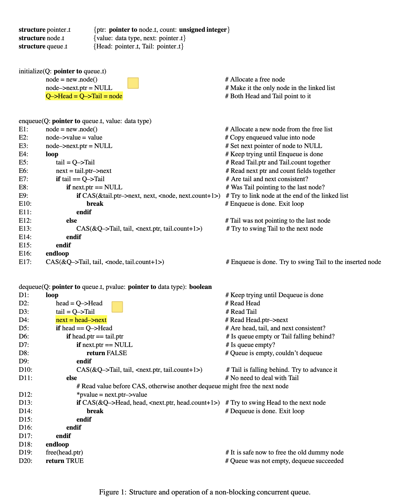
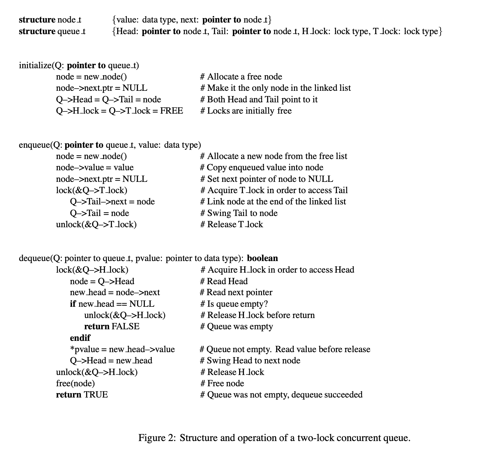

> 这篇文章翻译自 Michael Scott 在 1996 年发表的论文 
> Simple, Fast, and Practical Non-Blocking and Blocking Concurrent Queue Algorithms

# 简单、快速、实用 的非阻塞和阻塞并发队列算法

## Abstract
Drawing ideas from previous authors, we present a new non-blocking concurrent queue algorithm and a new two-lock queue algorithm in which one enqueue and one dequeue can proceed concurrently. Both algorithms are simple, fast, and practical; we were surprised not to find them in the literature. Experiments on a 12-node SGI Challenge multiprocessor indicate that the new non-blocking queue consistently outperforms the best known alternatives; it is the clear algorithm of choice for machines that provide a universal atomic primitive (e.g. compare and swap or load linked/store conditional). The two-lock concurrent queue outperforms a single lock when several processes are competing simultaneously for access; it appears to be the algorithm of choice for busy queues on machines with non-universal atomic primitives (e.g. test and set). Since much of the motivation for non-blocking algorithms is rooted in their immunity to large, unpredictable delays in process execution, we report experimental results both for systems with dedicated processors and for systems with several processes multiprogrammed on each processor.

借鉴前人的观点，我们提出了一种新的非阻塞并发队列算法和一种新的双锁队列算法，其中一个入队操作和一个出队操作可以并发进行。两种算法都简单、快速、实用。在文献中没有找到它们我们表示很意外。在 12 节点 SGI Challenge 多处理机上的实验表明，新的非阻塞队列的性能始终优于已知的方案；它是提供通用原子原语的机器的明确算法选择（例如，compare_and_swap 或 load_linked/store/conditional)。当多个进程同时竞争访问权限时，双锁并发队列的性能优于单锁；它可能是具有非通用原子原语的机器上繁忙队列的首选算法。由于非阻塞算法的许多动机都源于它们对进程执行中大的、不可预测的延迟的免疫力，因此我们报告了具有专用处理器的系统和具有多个进程的系统的实验结果。

> Keywords: concurrent queue, lock-free, non-blocking, compare and swap, multiprogramming.
> 关键词：并发队列，无锁，非阻塞，compare.and.swap，多道程序

## 1 简介
Concurrent FIFO queues are widely used in parallel applications and operating systems. To ensure correctness, concurrent access to shared queues has to be synchronized. Generally, algorithms for concurrent data structures, including FIFO queues, fall into two categories: blocking and non-blocking. Blocking algorithms allow a slow or delayed process to prevent faster processes from completing operations on the shared data structure indefinitely. Nonblocking algorithms guarantee that if there are one or more active processes trying to perform operations on a shared data structure, some operation will complete within a finite number of time steps. On asynchronous (especially multiprogrammed) multiprocessor systems, blocking algorithms suffer significant performance degradation when a process is halted or delayed at an inopportune moment. Possible sources of delay include processor scheduling preemption, page faults, and cache misses. Non-blocking algorithms are more robust in the face of these events.

并发的 FIFO 队列被广泛应用于并行应用程序和操作系统之中。为了确保正确性，并发访问共享队列必须被同步。通常，包括 FIFO 在内的并发数据结构算法分为两类：**阻塞和非阻塞**。阻塞算法允许一个慢进程或延迟进程去阻止一个更快的进程无限期地完成共享数据结构上的操作。非阻塞算法保证，如果有一个或多个活动进程试图对共享数据结构执行操作，则某些操作将在有限的时间滴答内完成。在异步（特别是多多道程序）多处理器系统中，当进程在不合适的时刻停止或延迟时，阻塞算法的性能会显著下降。延迟的可能来源包括处理器调度抢占、缺页错误和缓存未命中。非阻塞算法在面对这些事件时更加健壮。

Many researchers have proposed lock-free algorithms for concurrent FIFO queues. Hwang and Briggs [7], Sites [17], and Stone [20] present lock-free algorithms based on compare_and_swap. These algorithms are incompletely specified; they omit details such as the handling of empty or single-item queues, or concurrent enqueues and dequeues. Lamport [9] presents a wait-free algorithm that restricts concurrency to a single enqueuer and a single dequeuer.

许多研究人员已经提出了并发 FIFO 队列的无锁算法。Hwang and Briggs [7], Sites [17], and Stone [20] 提出了基于 compare_and_swap 的无锁算法。这些算法是完全指定的；它们忽略了诸如处理空队列或单个条目队列，或并发入队和出队等细节。Lamport[9]提出了一种无等待算法，该算法将并发性限制为单个入队器和单个出队器。

Gottlieb et al. [3] and Mellor-Crummey [11] present algorithms that are lock-free but not non-blocking: they do not use locking mechanisms, but they allow a slow process to delay faster processes indefinitely.

Gottlieb 等人[3]和 Mellor-Crummey[11] 提出了无锁但不是非阻塞的算法：它们没有使用锁机制，但允许缓慢的进程无限期地延迟较快的进程。

Treiber [21] presents an algorithm that is non-blocking but inefficient: a dequeue operation takes time proportional to the number of the elements in the queue. Herlihy [6]; Prakash, Lee, and Johnson [15]; Turek, Shasha, and Prakash [22]; and Barnes [2] propose general methodologies for generating non-blocking versions of sequential or concurrent lock-based algorithms. However, the resulting implementations are generally inefficient compared to specialized algorithms.

Treiber[21] 提出了一种非阻塞但效率低下的算法：出列操作所需的时间与队列中元素的数量成比例。Herlihy[6]；Prakash, Lee, and Johnson[15]；Turek, Shasha, and Prakash [22]; and Barnes [2]] 提出了生成基于顺序或并发锁的算法的非阻塞版本的一般方法。然而，与专用算法相比，结果实现通常效率低下。

Massalin and Pu [10] present lock-free algorithms based on a double compare and swap primitive that operates on two arbitrary memory locations simultaneously, and that seems to be available only on later members of the Motorola 68000 family of processors. Herlihy and Wing [4] present an array-based algorithm that requires infinite arrays. Valois [23] presents an array-based algorithm that requires either an unaligned compare and swap (not supported on any architecture) or a Motorola-like double compare_and_swap.

Massalin 和 Pu[10] 提出了基于双重比较和交换原语的无锁算法，该原语可同时在两个任意内存位置上运行，并且似乎仅适用于 Mo-torola 68000 系列处理器的后期成员。Herlihy 和 Wing[4] 提出了一种基于阵列的算法，需要无限的 ar 射线。Valois[23] 提出了一种基于阵列的算法，该算法需要未对齐的比较和交换（不支持任何体系结构）或类似于 Motorola 的双重比较和交换。

Stone [18] presents a queue that is lock-free but non-linearizable and not non-blocking. It is non-linearizable because a slow enqueuer may cause a faster process to enqueue an item and subsequently observe an empty queue, even though the enqueued item has never been dequeued. It is not non-blocking because a slow enqueue can delay dequeues by other processes indefinitely. Our experiments also revealed a race condition in which a certain interleaving of a slow dequeue with faster enqueues and dequeues by other process(es) can cause an enqueued item to be lost permanently. Stone also presents [19] a non-blocking queue based on a circular singly-linked list. The algorithm uses one anchor pointer to manage the queue instead of the usual head and tail. Our experiments revealed a race condition in which a slow dequeuer can cause an enqueued item to be lost permanently.

Stone[18] 提出了一个无锁但非线性且非阻塞的队列。它是非线性的，因为一个缓慢的排队者可能会导致一个更快的进程将一个条目排队，并随后观察到一个空队列，即使排队的项目从未被排队。它不是非阻塞的，因为缓慢的排队可以无限期地延迟其他进程的排队。我们的实验还揭示了一种竞争条件，在这种竞争条件下，缓慢的排队与较快的排队以及其他进程（es）的排队的某种交错会导致排队项目永久丢失。Stone还提出了一种基于循环单链表的非阻塞队列[19]。该算法使用一个锚指针来管理队列，而不是通常的头和尾。我们的实验揭示了一种竞赛条件，在这种情况下，一个缓慢的出列者可能会导致一个入队的项目永久丢失。

Prakash, Lee, and Johnson [14, 16] present a linearizable non-blocking algorithm that requires enqueuing and dequeuing processes to take a snapshot of the queue in order to determine its “state” prior to updating it. The algorithm achieves the non-blocking property by allowing faster processes to complete the operations of slower processes instead of waiting for them.

Prakash、Lee和Johnson[14,16] 提出了一种可线性化的非阻塞算法，该算法要求排队和退队过程对队列进行快照，以便在更新之前确定其“状态”。该算法允许更快的进程完成较慢进程的操作，而不是等待，从而实现了无阻塞特性。

Valois [23, 24] presents a list-based non-blocking algorithm that avoids the contention caused by the snapshots of Prakash et al.’s algorithm and allows more concurrency by keeping a dummy node at the head (dequeue end) of a singly-linked list, thus simplifying the special cases associated with empty and single-item queues (a technique suggested by Sites [17]). Unfortunately, the algorithm allows the tail pointer to lag behind the head pointer, thus preventing dequeuing processes from safely freeing or reusing dequeued nodes. If the tail pointer lags behind and a process frees a dequeued node, the linked list can be broken, so that subsequently enqueued items are lost. Since memory is a limited resource, prohibiting memory reuse is not an acceptable option. Valois therefore proposes a special mechanism to free and allocate memory. The mechanism associates a reference counter with each node. Each time a process creates a pointer to a node it increments the node’s reference counter atomically. When it does not intend to access a node that it has accessed before, it decrements the associated reference counter atomically. In addition to temporary links from process-local variables, each reference counter reflects the number of links in the data structure that point to the node in question. For a queue, these are the head and tail pointers and linked-list links. A node is freed only when no pointers in the data structure or temporary variables point to it.

Valois[23,24]提出了一种基于列表的非阻塞算法，该算法避免了 Prakash 等人算法快照引起的争用，并通过在单链表的头部（出列端）保留一个虚拟节点来实现更多并发性，从而简化了与空队列和单项队列相关的特殊情况（站点[17]建议的一种技术）。不幸的是，该算法使尾部指针落后于头部指针，从而防止退出队列的进程安全地释放或者重用出队的结点。如果尾部指针落后，并且进程释放了一个已出列的节点，则链表可能会被破坏，从而导致随后的入列项丢失。由于内存是一种有限的资源，禁止内存重用是不可接受的选择。因此，Valois 提出了一种特殊的机制来释放和分配内存。该机制将引用计数器与每个节点相关联。每次进程创建指向节点的指针时，它都会自动递增节点的引用计数器。当它不打算访问它以前访问过的节点时，它会自动递减关联的引用计数器。除了来自过程局部变量的临时链接外，每个参考计数器还反映数据结构中指向相关节点的链接数。对于队列，这些是头指针和尾指针以及链表链接。只有当数据结构中没有指针或临时变量指向某个节点时，才会释放该节点。

We discovered and corrected [13] race conditions in the memory management mechanism and the associated non-blocking queue algorithm. Even so, the memory management mechanism and the queue that employs it are impractical: no finite memory can guarantee to satisfy the memory requirements of the algorithm all the time. Problems occur if a process reads a pointer to a node (incrementing the reference counter) and is then delayed. While it is not running, other processes can enqueue and dequeue an arbitrary number of additional nodes. Because of the pointer held by the delayed process, neither the node referenced by that pointer nor any of its successors can be freed. It is therefore possible to run out of memory even if the number of items in the queue is bounded by a constant. In experiments with a queue of maximum length 12 items, we ran out of memory several times during runs of ten million enqueues and dequeues, using a free list initialized with 64,000 nodes.

我们发现并纠正了内存管理机制和相关的非阻塞队列算法中的[13]竞争条件。即便如此，内存管理机制和使用它的队列都是不正确的：没有有限的内存可以保证始终满足算法的内存需求。如果进程读取指向节点的指针（增加引用计数器），然后延迟，则会出现问题。虽然它没有运行，但其他进程可以将任意数量的额外节点加入队列或退出队列。由于延迟进程持有指针，因此无法释放该指针引用的节点及其任何后续节点。因此，即使队列中的项目数以常量为界，也有可能耗尽内存。在最大长度为12个项目的队列的实验中，我们使用一个由 64000 个节点初始化的空闲列表，在运行一千万个排队和退队的过程中，内存多次用完。

Most of the algorithms mentioned above are based on compare and swap, and must therefore deal with the ABA problem: if a process reads a value A in a shared location, computes a new value, and then attempts a compare and swap operation, the compare and swap may succeed when it should not, if between the read and the compare and swap some other process(es) change the A to a B and then back to an A again. The most common solution is to associate a modification counter with a pointer, to always access the counter with the pointer in any read-modify-compare and swap sequence, and to increment it in each successful compare and swap. This solution does not guarantee that the ABA problem will not occur, but it makes it extremely unlikely. To implement this solution, one must either employ a double-word compare and swap, or else use array indices instead of pointers, so that they may share a single word with a counter. Valois’s reference counting technique guarantees preventing the ABA problem without the need for modification counters or the double-word compare and swap. Mellor-Crummey’s lock-free queue [11] requires no special precautions to avoid the ABA problem because it uses compare and swap in a fetch and store-modify-compare and swap sequence rather than the usual read-modify-compare and swap sequence. However, this same feature makes the algorithm blocking.

上述大多数算法都基于 compare.and.swap，因此必须处理 ABA 问题：如果进程读取共享位置中的值a，计算新值，然后尝试比较和交换操作，则比较和交换可能会在不应该的情况下成功，如果在读取和比较和交换之间有其他进程，则将 A 更改为 B，然后再次返回 A。最常见的解决方案是将修改计数器与指针相关联，在任何读-修改比较和交换序列中始终使用指针访问计数器，并在每次成功比较和交换中递增计数器。这种解决方案并不能保证ABA问题不会发生，但却极不可能发生。要实现此解决方案，必须使用双字（double-word） compare.and.swap，或者使用数组索引而不是指针，以便它们可以与计数器共享单字（single word)。Valois 的参考计数技术保证了在不需要修改计数器或双字比较和交换的情况下防止ABA 问题。Mellor Crummey 的无锁队列[11]不需要特别的预防措施来避免 ABA 问题因为它在获取和存储修改比较和交换序列中使用比较和交换，而不是通常的读取修改比较和交换序列。然而，同样的特性使得算法阻塞。

In section 2 we present two new concurrent FIFO queue algorithms inspired by ideas in the work described above. Both of the algorithms are simple and practical. One is non-blocking; the other uses a pair of locks. Correctness of these algorithms is discussed in section 3. We present experimental results in section 4. Using a 12-node SGI Challenge multiprocessor, we compare the new algorithms to a straightforward single-lock queue, Mellor-Crummey’s blocking algorithm [11], and the non-blocking algorithms of Prakash et al. [16] and Valois [24], with both dedicated and multiprogrammed workloads. The results confirm the value of non-blocking algorithms on multiprogrammed systems. They also show consistently superior performance on the part of the new lock-free algorithm, both with and without multiprogramming. The new two-lock algorithm cannot compete with the non-blocking alternatives on a multiprogrammed system, but outperforms a single lock when several processes compete for access simultaneously. Section 5 summarizes our conclusions.

在第 2 节中，我们介绍了两种新的并发 FIFO 队列算法，其灵感来源于上述工作中的思想。这两种算法都简单实用。**一是无阻塞；另一个使用一对锁**。第 3 节讨论了这些算法的正确性。我们在第 4 节中给出了实验结果。
使用 12 节点 SGI Challenge 多处理机，我们将新算法与直接的单锁队列、Mellor Crummey的阻塞算法[11]以及Prakash等人[16]和Valois[24]的非阻塞算法进行了比较，并对专用和多道程序工作负载进行了比较。结果证实了非阻塞算法在多道程序系统中的价值。无论有无多道程序设计，它们在新的无锁算法方面都表现出了始终如一的优越性能。在多道程序系统中，新的双锁算法不能与非阻塞方案竞争，但在多个进程同时竞争访问时，其性能优于单锁算法。第 5 节总结了我们的结论。

## 2 Algorithms
Figure 1 presents commented pseudo-code for the non-blocking queue data structure and operations. The algorithm implements the queue as a singly-linked list with Head and Tail pointers. As in Valois’s algorithm, Head always points to a dummy node, which is the first node in the list. Tail points to either the last or second to last node in the list. The algorithm uses compare and swap, with modification counters to avoid the ABA problem. To allow dequeuing processes to free dequeued nodes, the dequeue operation ensures that Tail does not point to the dequeued node nor to any of its predecessors. This means that dequeued nodes may safely be re-used. 

图 1 给出了非阻塞队列数据结构和操作的注释伪代码。该算法将队列实现为带有头指针和尾指针的单链表。在 Valois 的算法中，Head 总是指向一个虚拟节点，它是列表中的第一个节点。尾部指向列表中的最后一个或倒数第二个节点。该算法使用比较和交换以及修改计数器来避免 ABA 问题。为了允许出列进程释放出列节点，出列操作确保 Tail 既不指向出列节点，也不指向其任何它们的前驱结点。这意味着可以安全地重新使用排队的节点。

To obtain consistent values of various pointers we rely on sequences of reads that re-check earlier values to be sure they haven’t changed. These sequences of reads are similar to, but simpler than, the snapshots of Prakash et al. (we need to check only one shared variable rather than two). A similar technique can be used to prevent the race condition in Stone’s blocking algorithm. We use Treiber’s simple and efficient non-blocking stack algorithm [21] to implement a non-blocking free list.

为了获得不同指针的一致值，我们依赖于读取序列，这些读取序列会重新检查先前的值，以确保它们没有改变。这些读取序列类似于 Prakash 等人的快照，但比快照更简单（我们只需要检查一个共享变量，而不是两个）。类似的技术可以用来防止 Stone 阻塞算法中的竞争条件。我们使用 Treiber 简单高效的非阻塞堆栈算法[21]来实现非阻塞列表。

Figure 2 presents commented pseudo-code for the two-lock queue data structure and operations. The algorithm employs separate Head and Tail locks, to allow complete concurrency between enqueues and dequeues. As in the non-blocking queue, we keep a dummy node at the beginning of the list. Because of the dummy node, enqueuers never have to access Head, and dequeuers never have to access Tail, thus avoiding potential deadlock problems that arise from processes trying to acquire the locks in different orders.

图 2 显示了双锁队列数据结构和操作的注释伪代码。该算法采用单独的头锁和尾锁，以允许排队和退队之间完全并发。与非阻塞队列一样，我们在列表的开始处保留一个虚拟节点。由于虚拟节点的存在，入队者永远不必访问 Head，而出队者永远不必访问 Tail，从而避免了由于进程试图以不同顺序获取锁而产生的潜在死锁问题。

## 3 Correctness

### 3.1 Safety
The presented algorithms are safe because they satisfy the following properties:
1. The linked list is always connected.
2. Nodes are only inserted after the last node in the linked list.
3. Nodes are only deleted from the beginning of the linked list.
4. Head always only deleted from the beginning of the linked list.
5. Tail always points to a node in the linked list.

所提出的算法是安全的，因为它们满足以下特性：
1. 链接列表始终处于连接状态。
2. 节点仅插入到链接列表中最后一个节点之后。
3. 节点仅从链接列表的开头删除。
4. 头部始终指向链接列表中的第一个节点。
5. 尾部始终指向链接列表中的节点。

nitially, all these properties hold. By induction, we show that they continue to hold, assuming that the ABA problem never occurs.
1. The linked list is always connected because once a node is inserted, its next pointer is not set to NULL before it is freed, and no node is freed until it is deleted from the beginning of the list (property 3).
2. In the lock-free algorithm, nodes are only inserted at the end of the linked list because they are linked through the Tail pointer, which always points to a node in the linked-list (property 5), and an inserted node is linked only to a node that has a NULL next pointer, and the only such node in the linked list is the last one (property 1). In the lock-based algorithm nodes are only inserted at the end of the linked list because they are inserted after the node pointed to by Tail, and in this algorithm Tail always points to the last node in the linked list, unless it is protected by the tail lock.
3. Nodes are deleted from the beginning of the list, because they are deleted only when they are pointed to by Head and Head always points to the first node in the list (property 4).
4. Head always points to the first node in the list, because it only changes its value to the next node atomically (either using the head lock or using compare_and_swap). When this happens the node it used to point to is considered deleted from the list. The new value of Head cannot be NULL because if there is one node in the linked list the dequeue operation returns without deleting any nodes.
5. Tail always points to a node in the linked list, because it never lags behind Head, so it can never point to a deleted node. Also, when Tail changes its value it always swings to the next node in the list and it never tries to change its value if the next pointer is NULL.

最初，所有这些属性都有效。通过归纳，我们证明了假设 ABA 问题从未发生，它们仍然成立。

1. 链表始终处于连接状态，因为一旦插入节点，其下一个指针在释放之前不会设置为 NULL，并且在从列表开头删除节点之前，不会释放任何节点（特性 3）
2. 在无锁算法中，节点仅插入到链表的末尾，因为它们通过尾部指针链接，尾部指针始终指向链表中的节点（特性 5），而插入的节点仅链接到 next 指针域为空的节点，并且链表中唯一这样的节点是最后一个（特性 1）。在基于锁的算法中，节点仅插入到链表的末尾，因为它们插入到尾部指向的节点之后，在该算法中，尾部始终指向链表中的最后一个节点，除非它受到尾部锁的保护。
3. 节点从列表的开头删除，因为只有当它们被 Head 指向并且 Head 始终指向列表中的第一个节点时，才会删除它们（特性 4）。
4. Head 始终指向列表中的第一个节点，因为它只在原子上将其值更改为下一个节点（使用 Head 锁或使用比较和交换）。发生这种情况时，它用来指向的节点将被视为从列表中删除。Head 的新值不能为 NULL，因为如果链表中有一个节点，则出列操作将返回而不删除任何节点。
5. 尾部始终指向链接列表中的节点，因为它从不落后于头部，所以它永远不能指向已删除的节点。此外，当 Tail 更改其值时，它总是转到列表中的下一个节点，并且如果下一个指针为 NULL，它从不尝试更改其值。

### 3.2 Linearizability
The presented algorithms are linearizable because there is a specific point during each operation at which it is considered to “take effect” [5]. An enqueue takes effect when the allocated node is linked to the last node in the linked list. A dequeue takes effect when Head swings to the next node. And, as shown in the previous subsection (properties 1, 4, and 5), the queue variables always reflect the state of the queue; they never enter a transient state in which the state of the queue can be mistaken (e.g. a non-empty queue appears to be empty).

所提出的算法是可线性化的，因为在每个操作过程中都有一个特定的点，在该点上它被认为是“生效”[5]。当分配的节点链接到链接列表中的最后一个节点时，排队生效。当头部转到下一个节点时，出列生效。并且，如前一小节（特性1、4和5）所示，队列变量始终反映队列的状态；它们从不进入队列状态可能出错的瞬态（例如，非空队列似乎为空）。

### 3.3 Liveness 

#### The Lock-Free Algorithm is Non-Blocking
The lock-free algorithm is non-blocking because if there are non-delayed processes attempting to perform operations on the queue, an operation is guaranteed to complete within finite time.

无锁算法是非阻塞的，因为如果有非延迟进程试图在队列上执行操作，则可以保证操作在有限时间内完成。

An enqueue operation loops only if the condition in line E7 fails, the condition in line E8 fails, or the compare and swap in line E9 fails. A dequeue operation loops only if the condition in line D5 fails, the condition in line D6 holds (and the queue is not empty), or the compare and swap in line D13 fails.

We show that the algorithm is non-blocking by showing that a process loops beyond a finite number of times only if another process completes an operation on the queue.

仅当第 E7 行中的条件失败、第 E8 行中的条件失败或第 E9 行中的比较和交换失败时，排队操作才会循环。仅当第 D5 行中的条件失败、第 D6 行中的条件保持不变（且队列不为空）或第 D13 行中的比较和交换失败时，出列操作才会循环。

我们通过显示一个进程仅当另一个进程在队列上完成一个操作时才循环超过有限次数来证明该算法是非阻塞的。

+ The condition in line E7 fails only if Tail is written by an intervening process after executing line E5. Tail always points to the last or second to last node of the linked list, and when modified it follows the next pointer of the node it points to. Therefore, if the condition in line E7 fails more than once, then another process must have succeeded in completing an enqueue operation.
+ The condition in line E8 fails if Tail was pointing to the second to last node in the linked-list. After the compare and swap in line E13, Tail must point to the last node in the list, unless a process has succeeded in enqueuing a new item. Therefore, if the condition in line E8 fails more than once, then another process must have succeeded in completing an enqueue operation.
+ The compare and swap in line E9 fails only if another process succeeded in enqueuing a new item to the queue.
+ The condition in line D5 and the compare and swap in line D13 fail only if Head has been written by another process. Head is written only when a process succeeds in dequeuing an item.
+ The condition in line D6 succeeds (while the queue is not empty) only if Tail points to the second to last node in the linked list (in this case it is also the first
node). After the compare and swap in line D10, Tail must point to the last node in the list, unless a process succeeded in enqueuing a new item. Therefore, if the condition of line D6 succeeds more than once, then another process must have succeeded in completing an enqueue operation (and the same or another process succeeded in dequeuing an item).

+ 只有在执行第 E5 行后，由中间进程写入 Tail 时，第 E7 行中的条件才会失败。尾部始终指向链表的最后一个或倒数第二个节点，修改时，它将跟随它所指向的节点的下一个指针。因此，如果第 E7 行中的条件失败不止一次，则另一个进程必须成功完成排队操作。
+ 如果 Tail 指向链表中倒数第二个节点，则第 E8 行中的条件失败。在第 E13 行中进行比较和交换之后，Tail 必须指向列表中的最后一个节点，除非某个进程成功地将新项排队。因此，如果第 E8 行中的条件多次失败，则另一个进程必须已成功完成排队操作。
+ 只有当另一个进程成功地将一个新项目加入队列时，第 E9 行中的比较和交换才会失败。
+ 只有当 Head 被另一个进程写入时，D5 行中的条件和 D13 行中的比较和交换才会失败。只有当一个进程成功地将一个项目出列时，才会写入 Head。
+ 只有当尾部指向链表中倒数第二个节点（在本例中也是第一个节点）时，第 D6 行中的条件才会成功（队列不为空）。在第 D10 行中进行比较和交换之后，Tail 必须指向列表中的最后一个节点，除非进程成功地将新项排队。因此，如果第 D6 行的条件不止一次成功，则另一个进程必须成功完成排队操作（并且同一个或另一个进程成功地将一个项目出列）。

#### The Two-Lock Algorithm is Livelock-Free
The two-lock algorithm does not contain any loops. Therefore, if the mutual exclusion lock algorithm used for locking and unlocking the head and tail locks is livelock-free, then the presented algorithm is livelock-free too. There are many mutual exclusion algorithms that are livelock-free [12].

双锁算法不包含任何循环。因此，如果用于锁定和解锁头锁和尾锁的互斥锁算法是无 livelock 的，那么所提出的算法也是无 livelock 的。有许多互斥算法是无活锁的[12]。

## 四、性能
（暂缓）

## 五、结论
Queues are ubiquitous in parallel programs, and their performance is a matter of major concern. We have presented a concurrent queue algorithm that is simple, nonblocking, practical, and fast. We were surprised not to find it in the literature. It seems to be the algorithm of choice for any queue-based application on a multiprocessor with universal atomic primitives (e.g. compare and swap or load linked/store conditional).

队列在并行程序中无处不在，其性能是一个主要问题。提出了一种简单、无阻塞、实用、快速的并发队列算法。我们很意外没有在文献中找到它。它似乎是具有通用原子原语（例如比较和交换或加载链接/存储条件）的多处理器上任何基于队列的应用程序的首选算法。

We have also presented a queue with separate head and tail pointer locks. Its structure is similar to that of the non-blocking queue, but it allows only one enqueue and one dequeue to proceed at a given time. Because it is based on locks, however, it will work on machines with such simple atomic primitives as test and set. We recommend it for heavily-utilized queues on such machines (For a queue that is usually accessed by only one or two processors, a single lock will run a little faster.)

我们还提供了一个具有单独的头和尾指针锁的队列。它的结构类似于非阻塞队列，但它只允许在给定的时间进行一个入队和一个出队。然而，由于它是基于锁的，所以它将在具有诸如 test 和 set 这样简单的原子原语的机器上工作。我们建议将其用于此类机器上使用率较高的队列（对于通常仅由一个或两个处理器访问的队列，单个锁的运行速度会稍快一些）。

This work is part of a larger project that seeks to evaluate the tradeoffs among alternative mechanisms for atomic update of common data structures. Structures under consideration include stacks, queues, heaps, search trees, and hash tables. Mechanisms include single locks, data-structure-specific multi-lock algorithms, general-purpose and special-purpose non-blocking algorithms, and function shipping to a centralized manager (a valid technique for situations in which remote access latencies dominate computation time).

这项工作是一个更大项目的一部分，该项目旨在评估通用数据结构原子更新的替代机制之间的权衡。正在考虑的结构包括堆栈、队列、堆、搜索树和哈希表。机制包括单锁、特定于数据结构的多锁算法、通用和专用非阻塞算法，以及将功能传送到集中式管理器（对于远程访问延迟主导计算时间的情况，这是一种有效的技术）。

In related work [8, 25, 26], we have been developing general-purpose synchronization mechanisms that cooperate with a scheduler to avoid inopportune preemption. Given that immunity to processes delays is a primary benefit of non-blocking parallel algorithms, we plan to compare these two approaches in the context of multiprogrammed systems.

在相关工作[8,25,26]中，我们一直在开发通用同步机制，与调度器协作，以避免不合时宜的抢占。鉴于进程延迟免疫性是非阻塞并行算法的主要优点，我们计划在多道程序系统的环境中比较这两种方法。

# 引用
1. T. E. Anderson. The Performance of Spin Lock Alternatives for Shared-Memory Multiprocessors. IEEE Transactions on Parallel and Distributed Systems, 1(1):6–16, January 1990.
2. G. Barnes. A Method for Implementing Lock-Free Data Structures. In Proceedings of the Fifth Annual ACM Symposium on Parallel Algorithms and Architectures, Velen, Germany, June – July 1993.
3. A. Gottlieb, B. D. Lubachevsky, and L. Rudolph. Basic Techniques for the Efficient Coordination of Very Large Numbers of Cooperating Sequential Processors. ACM Transactions on Programming Languages and Systems, 5(2):164–189, April 1983.
4. M. P. Herlihy and J. M. Wing. Axions for Concurrent Objects. In Proceedings of the 14th ACM Symposium on Principles of Programming Languages, pages 13– 26, January 1987.
5. M. P. Herlihy and J. M. Wing. Linearizability: A Correctness Condition for Concurrent Objects. ACM Transactions on Programming Languages and Systems, 12(3):463–492, July 1990.
6. M. Herlihy. A Methodology for Implementing Highly Concurrent Data Objects. ACM Transactions on Programming Languages and Systems, 15(5):745–770, November 1993.
7. K. Hwang and F. A. Briggs. Computer Architecture and Parallel Processing. McGraw-Hill, 1984.
8. L. Kontothanassis and R. Wisniewski. Using Scheduler Information to Achieve Optimal Barrier Synchronization Performance. In Proceedings of the Fourth ACM Symposium on Principles and Practice of Parallel Programming, May 1993.
9. L. Lamport. Specifying Concurrent Program Modules. ACM Transactions on Programming Languages and Systems, 5(2):190–222, April 1983.
10. H. Massalin and C. Pu. A Lock-Free Multiprocessor OS Kernel. Technical Report CUCS-005-91, Computer Science Department, Columbia University, 1991.
11. J. M. Mellor-Crummey. Concurrent Queues: Practical Fetch-and-Φ Algorithms. TR 229, Computer Science Department, University of Rochester, November 1987.
12. J. M. Mellor-Crummey and M. L. Scott. Algorithms for Scalable Synchronization on Shared-Memory Multiprocessors. ACM Transactions on Computer Systems, 9(1):21–65, February 1991.
13. M. M. Michael and M. L. Scott. Correction of a Memory Management Method for Lock-Free Data Structures. Technical Report 599, Computer Science Department, University of Rochester, December 1995.
14. S. Prakash, Y. H. Lee, and T. Johnson. A Non-Blocking Algorithm for Shared Queues Using Compare-and Swap. In Proceedings of the 1991 International Conference on Parallel Processing, pages II:68–75, 1991.
15. S. Prakash, Y. H. Lee, and T. Johnson. Non-Blocking Algorithms for Concurrent Data Structures. Technical Report 91-002, University of Florida, 1991.
16. S. Prakash, Y. H. Lee, and T. Johnson. A Nonblocking Algorithm for Shared Queues Using Compare-and-Swap. IEEE Transactions on Computers, 43(5):548–559, May 1994.
17. R. Sites. Operating Systems and Computer Architecture. In H. Stone, editor, Introduction to Computer Architecture, 2nd edition, Chapter 12, 1980. Science Research Associates.
18. J. M. Stone. A Simple and Correct Shared-Queue Algorithm Using Compare-and-Swap. In Proceedings Supercomputing ’90, November 1990.
19. J. M. Stone. A Non-Blocking Compare-and-Swap Algorithm for a Shared Circular Queue. In S. Tzafestas et al., editors, Parallel and Distributed Computing in Engineering Systems, pages 147–152, 1992. Elsevier Science Publishers.
20. H. S. Stone. High Performance Computer Architecture. Addison-Wesley, 1993.
21. R. K. Treiber. Systems Programming: Coping with Parallelism. In RJ 5118, IBM Almaden Research Center, April 1986.
22. J. Turek, D. Shasha, and S. Prakash. Locking without Blocking: Making Lock Based Concurrent Data Structure Algorithms Nonblocking. In Proceedings of the 11th ACM SIGACT-SIGMOD-SIGART Symposium on Principles of Database Systems, pages 212–222, 1992.
23. J. D. Valois. Implementing Lock-Free Queues. In
Seventh International Conference on Parallel and Distributed Computing Systems, Las Vegas, NV, October 1994.
24. J. D. Valois. Lock-Free Data Structures. Ph.D. dissertation, Rensselaer Polytechnic Institute, May 1995.
25. R. W. Wisniewski, L. Kontothanassis, and M. L. Scott. Scalable Spin Locks for Multiprogrammed Systems. In Proceedings of the Eighth International Parallel Processing Symposium, pages 583– 589, Cancun, Mexico, April 1994. Earlier but expanded version available as TR 454, Computer Science Department, University of Rochester, April 1993.
26. R. W. Wisniewski, L. I. Kontothanassis, and M. L. Scott. High Performance Synchronization Algorithms for Multiprogrammed Multiprocessors. In
Proceedings of the Fifth ACM Symposium on Principles and Practice of Parallel Programming, Santa Barbara, CA, July 1995.