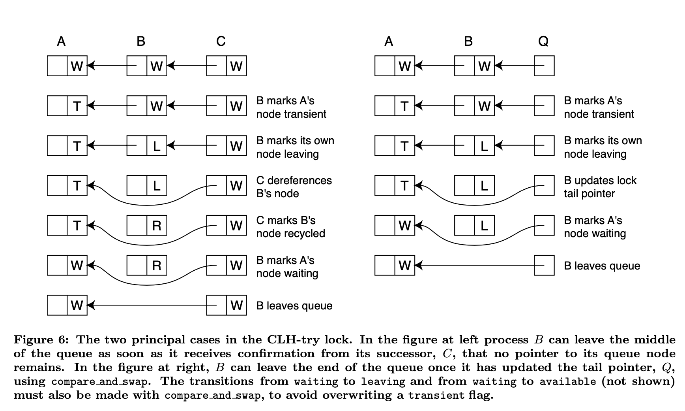
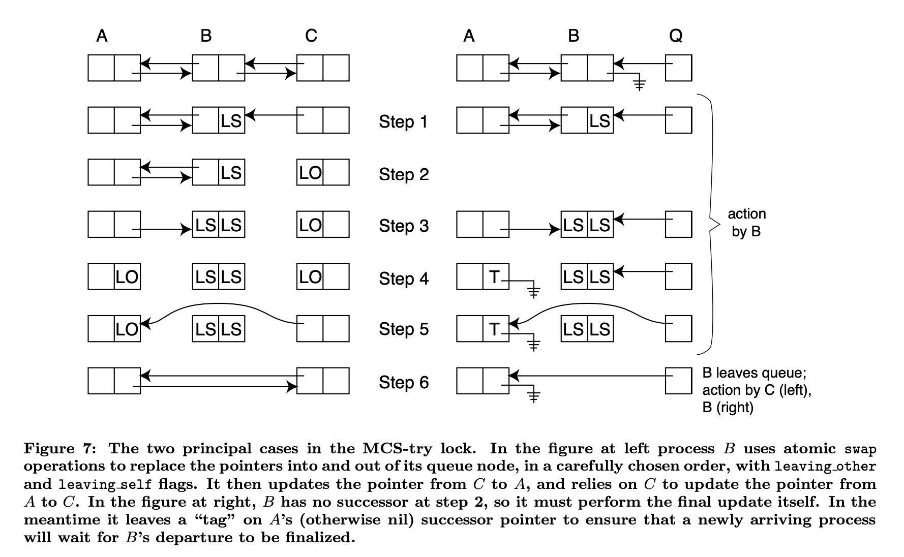

# Scalable Queue-Based Spin Locks With Timeout
> Michael L. Scott and William N. Scherer III

## Abstract
Queue-based spin locks allow pragrams with busy-wait synchronization to scale to very large multiprocessors, without fear of starvation or performance-destroying contention. So-called try locks, traditionally based on non-scalable test-and-set locks, allow a process to abandon its attempt to acquire a lock after a given amount of time. The process can then pursue an alternative code path, or yield the processor to some other process.

基于队列的自旋锁允许具有忙等待同步的程序扩展到非常大的多处理器，而不用担心饥饿或竞争破坏性能。所谓的 try locks, 传统上基于不可伸缩的 test-and-set 锁，允许进程在给定的时间后放弃获取锁的尝试。然后，该进程可以采用另一种代码路径，或者将处理器让给其他进程。

We demonstrate that it is possible to obtain both scalability and bounded waiting, using variants of the queue-based locks of Craig, Landin, and Hagersten, and of MellorCrummey and Scott. A process that decides to stop waiting for one of these new locks can "link itself out of line" atomically. Single-processor experiments reveal performance penalties of 50-100% for the CLH and MCS try locks in comparison to their standard versions; this marginal cost decreases with larger numbers of processors.

我们证明，使用Craig、Landin和 Hagersten 以及 Mellor-Crummey 和 Scott的基于队列的锁的变体，可以同时获得可伸缩性和有界等待。一个决定停止等待这些新锁中的一个的进程可以在原子上“链接自身”。单处理器实验表明，与标准版本相比，CLH 和 MCS try lock 的性能损失为 50-100%；这种边际成本随着处理器数量的增加而降低。

We have also compared our queue-based locks to a traditional test-and-test_and_set lock with exponential backoff and timeout. At modest (non-zero) levels of contention, the queued locks sacrifice cache locality for fairness, resulting in a worst-case 3X performance penalty. At high levels of contention, however, they display a 1.5-2X performance advantage, with significantly more regular timings and significantly higher rates of acquisition prior to timeout.

我们还将基于队列的锁与具有指数退避和超时的经典的 test-and-test_and_set 锁进行了比较。在适度（非零）争用级别下，排队锁会牺牲缓存位置以实现公平性，从而导致最坏情况下 3 倍的性能损失。然而，在高竞争级别下，它们显示出 1.5-2 倍的性能优势，在超时之前，它们的定时明显更规则，捕获速率也明显更高。

## 1 Introduction
Spin locks are widely used for mutual exclusion on shared-memory multiprocessors. Traditional test_and_set-based spin locks are vulnerable to memory and interconnect contention, and do not scale well to large machines. Queue-based spin locks avoid contention by arranging for every waiting process to spin on a separate, local flag in memory.

自旋锁广泛用于共享内存多处理器上的互斥。传统的基于 test_and_set 的自旋锁容易受到内存和互连争用的影响，并且不能很好地扩展到大型机器。基于队列的旋转锁通过将每个等待进程安排在内存中单独的本地标志上旋转来避免争用。

Several researchers (ourselves among them) have conjectured that any program that routinely encounters high levels of lock contention is unlikely to scale well to large machines. Conversely, in any program that scales well, the overhead of spin locks may not be a serious concern. The problem with this argument is that infrequent pathological events can be a serious problem to users. An improvement in worst case performance from, say, 2 to 10% efficiency may be enormously valuable, even if typical efficiency is more like 80%. With the increasing popularity of medium-scale (20-100 processor) server-class machines, we believe that scalable spin locks will prove increasingly important.

一些研究人员（我们自己也是其中之一）推测，任何经常遇到高级别锁争用的程序都不可能很好地扩展到大型机器。相反，在任何扩展良好的程序中，自旋锁的开销可能不是一个严重的问题。这种观点的问题在于，罕见的病理事件对用户来说可能是一个严重的问题。在最坏的情况下，将效率从 2% 提高到 10% 可能是非常有价值的，即使典型的效率更接近 80%。随着中规模（20-100 处理器）服务器级机器的日益普及，我们相信可扩展的自旋锁将变得越来越重要。

In a traditional test_and_set spin lock, processes are mutually anonymous. In a queue-based lock, they are not: each waiting process is linked to its predecessor and successor in the queue. In previous work, members of our group considered the possibility that a spinning process might be preempted, thereby unecessarily delaying processes farther down the queue. In the current paper we consider the possibility that a spinning process may "become impatient" and wish to leave the queue before acquiring the lock.

在传统的 test_and_set 自旋锁中，进程是相互匿名的。在基于队列的锁中，它们不是：每个等待进程都链接到队列中的前置进程和后续进程。在以前的工作中，我们小组的成员考虑了旋转进程可能被抢占的可能性，从而不必要地延迟队列下游的进程。在当前的文件中，我们考虑的可能性，正在自旋的进程可能会变得“急躁”，并希望离开队列之前，获取锁。

Timout-capable spin locks, sometimes referred to as "try-locks", are important for several reasons:
1. A process in a soft real-time application may need to bound the time it spends waiting for a lock. If the timeout expires, the process can choose to announce an error or to pursue an alternative code path that does not require the lock.
2. Absent special OS support, a user-level process in a multiprogrammed environment may be preempted while holding a lock. Timeout allows other processes waiting for the lock to give up, yield the processor, and try again when rescheduled.
3. In a parallel database system, timeout provides a viable strategy for deadlock recovery. A process that waits "too long" for a lock can assume that deadlock has occurred, abort the current transaction, and retry.

支持 Timout 的旋转锁（有时称为“尝试锁”）非常重要，原因如下：
1. 软实时应用程序中的进程可能需要限制其等待锁的时间。如果超时过期，则进程可以选择宣布错误或执行不需要锁的替代代码路径。
2. 如果没有特殊的操作系统支持，多道程序环境中的用户级进程可能在持有锁时被抢占。超时允许其他进程等待锁放弃，放弃处理器，并在重新调度时重试。
3. 在并行数据库系统中，超时为死锁恢复提供了一种可行的策略。等待锁定时间“过长”的进程可以假定已发生死锁，中止当前事务，然后重试。

We are aware of commercially significant signal processing applications that use timeout for reason (1), and parallel database servers that use timeout for reasons (2) and (3). In the latter case, timeout may be the deciding factor in making spin locks usable in user-level code.

我们知道商业上重要的信号处理应用程序使用超时原因（1），并行数据库服务器使用超时原因（2）和（3）。在后一种情况下，超时可能是使旋转锁在用户级代码中可用的决定性因素。

In constrast to the problem of preemption among spinning processes, timeout does not require interaction between the scheduler and the synchronization algorithm. It is complicated, however, by the fact that a timed-out process may attempt to acquire the lock again, possibly many times, before the point at which it would have acquired the lock if it had stayed in line. The possibility of multiple aborted acquisition attempts suggests that a timed-out process must remove itself from the queue entirely, leaving nothing behind; otherwise we would be unable to bound the space or time requirements of the algorithm.

与旋转进程之间的抢占问题相比，超时不需要调度器和同步算法之间的交互。然而，由于超时进程可能会在其保持一致的情况下可能会获得锁的时间点之前再次尝试获取锁，这一点很复杂。多次中断采集尝试的可能性表明，超时进程必须完全从队列中移除自己，不留下任何东西；否则，我们将无法限制算法的空间或时间要求。

We have developed so-called "try lcok" (timeout capable) versions of our MCS queue-based lock and of the CLH queue-based lock of Craig and Landin and Hagersten. After presenting additional background information in section 2, we describe our new locks in section 3. Both new locks employ swap and compare_and_swap instructions, and can be implemented on any shared-memory machine, with or without cache coherence, that provides these operations or their equivalent. In section 4 we present performance results obtained on a 56-processor Sun Wildfire machine. We conclude with a summary of recommendations in section 5.

我们已经开发了我们的基于 MCS 队列的锁和 Craig、Landin 和 Hagersten 的基于 CLH 队列的锁的所谓“try lcok”（支持超时）版本。在第 2 节介绍了其他背景信息之后，我们将在第 3 节介绍我们的新锁。这两种新锁都采用交换和 compare_and_swap 指令，并且可以在任何共享内存机器上实现，无论是否具有缓存一致性，都可以提供这些操作或其等效操作。在第 4 节中，我们介绍了在 56 处理器 Sun Wildfire 机器上获得的性能结果。我们在第 5 节中总结了建议。

## 2 Background

Programmers face several choices when synchronizing processes on a shared-memory multiprocessor. The most basic choice is between spinning (busy-waiting), in which processes actively poll for a desired condition, and blocking, in which processes yield the processor in expectation that they will be made runnable again when the desired condition holds. Spinning is the method of choice when the expected wait time is small, or when there is no other productive use for the processor.

在共享内存多处理器上同步进程时，程序员面临多种选择。最基本的选择是在旋转（忙等待）和阻塞（阻塞）之间，前者是进程主动轮询所需条件，后者是进程让出处理器，期望在满足所需条件时使其再次可运行。当预期等待时间很小时，或者处理器没有其他生产用途时，旋转是一种选择方法。

The most basic busy-wait mechanism is a test-and-set lock, in which a process desiring entry to a critical section repeatedly attempts to change a "locked" flag from false to true, using an atomic hardware primitive. Unfortunately, test-and-set locks lead to increasing amounts of contention for memory and bus or interconnect bandwidth as the number of competing processors grows. This contention can be reduced somewhat by polling with ordinary read operations, rather than atomic test_and_set operations; polls are then satisfied from local caches during critical sections, with a burst of refill traffic whenever the lock is released. The cost of the burst can be further reduced using Ethernet-style exponential backoff. Figure 1 shows code for a test-and-test_and_set (TATAS) lock with exponential backoff.

最基本的忙等待机制是 test-and-set 锁定，在该机制中，希望进入临界区的进程使用原子硬件原语反复尝试将“锁定”标志从 false 更改为 true。不幸的是，随着竞争处理器数量的增加，test_and_set 锁会导致对内存和总线或互连带宽的争夺量增加。通过使用普通读取操作而不是原子 test_and_set 操作进行轮询，可以在一定程度上减少这种争用；然后，在临界区，通过本地缓存满足轮询要求，每次释放锁时，都会有一个突发的重新填充流量。使用以太网式指数退避可以进一步降低突发的成本。图 1 显示了具有指数回退的 test-and-test_and_set（TATAS）锁的代码。

```
    typedef unsigned long bool;
    typedef volatile bool tatas_lock;

    void tatas_acquire(tatas_lock *L) {
        if (tas(L)) {
            int b = BACKOFF_BASE;
            do {
                for (i = b; i; i--);            // delay
                b = min(b * BACKOFF_FACTOR, BACKOFF_CAP);
                if (*L) contine;                // spin with reads
            } while (tas(L));
        }
    }

    void tatas_release(tatas_lock *L) {
        *L = 0;
    }

    Figure 1: Test-and-test_and_set (TATAS) lock with exponential backoff. Parameters BACKOFF_BASE, BACKOFF_FACTOR, and BACKOFF_CAP must be tuned by trial and error for each individual machine architecture.
```

### 2.1 Queue-based locks
Even with exponential backoff, test-and-test_and_set locks still induce significant contention, leading to irregular timings and compromised memory performance on large machines. Queue-based spin locks eliminate these problems by arranging for every competing process to spin on a different memory location. To ensure scalability, each location must be local to the spinning process, either by virtue of hardware cache coherence or as a result of explicit local allocation on a non-cache-coherent machine.

即使采用指数退避，test-and-test_and_set 锁仍然会导致严重的争用，从而导致不规则的计时，并影响大型计算机上的内存性能。基于队列的自旋锁通过安排每个竞争进程在不同的内存位置上自旋来消除这些问题。为了确保可伸缩性，每个位置都必须是旋转过程的本地位置，无论是由于硬件缓存一致性，还是由于非缓存一致性机器上的显式本地分配。

Several researchers, working independently and roughly concurrently, developed queue-based spin locks in the late 1980s. Anderson and Graunke and Thakkar embed their queues in per-lock arrays, requiring space per lock proportional to the maximum number of processes that may compete for access concurrently. Anderson’s lock uses atomic fetch_and_increment instructions to assign slots in the array to waiting processes; Graunke and Thakkar’s lock uses swap instead. Our MCS lock, co-designed with John MellorCrummey, employs a linked list with pointers from each process to its successor; it relies on swap and compare_and_swap, and has the advantage of requiring total space linear in the number of locks and the number of competing processes. (The lock can be re-written to use only swap, but at the expense of FIFO ordering: in the swap-only version of mcs_release there is a timing window that may allow newly arriving processes to jump ahead of processes already in the queue.) The MCS lock is naturally suited to local-only spinning on both cache-coherent and non-cache-coherent machines. The Anderson and Graunke/Thakkar locks must be modified to employ an extra level of indirection on non-cache-coherent machines.

20 世纪 80 年代末，几位研究人员独立且大致并行地开发了基于队列的旋转锁。Anderson、Graunke 和 Thakkar 将队列嵌入到每个锁阵列中，每个锁需要的空间与可能同时竞争访问的最大进程数成比例。Anderson 的锁使用原子fetch_and_increment 指令将数组中的插槽分配给等待的进程；Graunke 和 Thakkar 的锁使用交换。我们的MCS 锁与 John MellorCrummey 共同设计，使用一个链表，从每个进程指向其后续进程；它依赖于交换和 compare_and_swap，并且具有要求锁的数量和竞争进程的数量的总空间线性的优点。（可以重新写入锁以仅使用交换，但以牺牲 FIFO 顺序为代价：在 mcs_release 的仅交换版本中，有一个计时窗口，允许新到达的进程跳到队列中已经存在的进程之前。）MCS 锁自然适用于缓存相关和非缓存相关机器上的仅本地旋转。必须修改 Anderson 和 Graunke/Thakkar 锁，以便在非缓存相关机器上使用额外级别的间接寻址。

```
    typedef struct mcs_qnode {
        volatile bool waiting;
        volatile struct mcs_qnode *volatile next;
    } msc_qnode;

    typedef volatile mcs_qnode *mcs_qnode_ptr;
    typedef mcs_qnode_ptr mcs_lock;     //initialized to nil

    void mcs_acquire(mcs_lock *L, mcs_qnode_ptr I) {
        I->next = nil;
        mcs_qnode_ptr pred = swap(L, I);
        if (pred == nil) return;         // lock was free
        I.waiting = true;               // word on which to spin
        pred->next = I;                 // make pred point to me
        while (I->waiting);             // spin
    }

    void mcs_release(mcs_lock *L, mcs_qnode_ptr I) {
        mcs_qnode_ptr succ;
        if (!(succ = I->next)) {        // I seem to have no succ.
            // try to fix global pointer
            if (compare_and_store(L, I, nil)) return;
            do {
                succ = I->next;
            } while(!succ);             // wait for successor
        }
        succ->waiting = false;
    }

    Figure 2: The MCS queue-based spin lock. 
    Parameter I points to a qnode record allocated (in an enclosing scope) in shared
    memory locally-accessible to the invoking processor.
```

The CLH lock, developed about three years later by Craig and, independently, Landin and Hagersten, also em- ploys a linked list, but with pointers from each process to its predecessor. The CLH lock relies on atomic swap, and may outperform the MCS lock on cache-coherent machines. Like the Anderson and Graunke/Thakkar locks, it requires an extra level of indirection to avoid spinning on remote lo- cations on a non-cache-coherent machine. Code for the MCS and CLH locks appears in Figures 2, 3, and 4.

大约三年后，由 Craig 以及独立的 Landin 和 Hagersten 开发的 CLH 锁也使用了一个链表，但每个进程都有指向其前身的指针。CLH 锁依赖于原子交换，在缓存一致性机器上可能优于 MCS 锁。与 Anderson 和 Graunke/Thakkar 锁一样，它需要额外的间接级别，以避免在非缓存相干机器上的远程位置上旋转。MCS 和 CLH锁的代码如图2、3和4所示。

```
    typedef struct clh_qnode {
        volatile bool waiting;
        voaltile struct clh_qnode *volatile prev;
    } clh_qnode;

    typedef volatile clh_qnode *clh_qnode_ptr;
    typedef clh_qunode_ptr clh_lock;
        // initialized to point to an unowned qnode

    void clh_acquire(clh_lock *L, clh_qnode_ptr I) {
        I->waiting = true;
        clh_qnode_ptr pred = I->prev = swap(L, I);
        while (pred->waiting);          // spin
    }

    void clh_release(clh_qnode_ptr *I) {
        chl_qnode_ptr pred = (*I)->prev;
        (*I)->waiting = false;
        *I = pred;                      // take pred's qnode
    }

    Figure 3: The CLH queue-based spin lock. Parameter I points to qnode recore or,
    int clh_release, to a pointer to a qnode record. The qnode "belongs" to the calling process,
    but may be in main memory anywhere in the system,
    and generally change identity as a result of releasing the lock.

```

```
    typedef struct clh_numa_qnode {
        volatile bool *w_ptr;
        volatile struct clh_qnode *volatile prev;
    } clh_numa_qnode;

    typedef volatile clh_numa_qnode *clh_numa_qnode_ptr;
    typedef clh_numa_qnode_ptr clh_numa_lock;
        // initialized to point to an unowned qnode

    const bool *granted = 0x1;

    void clh_numa_acquire(clh_numa_lock *L, clh_numa_qnode_ptr I) {
        volatile bool waiting = true;
        I->w_ptr = nil;
        clh_numa_qnode_ptr pred = I->prev = swap(L, I);
        volatile bool *p = swap(&pred->w_ptr, &waiting);
        if (p == granted) return;
        while (waiting);            // spin
    }

    void clh_numa_release(clh_numa_qnode_ptr *I) {
        clh_numa_qnode_ptr pred = (*I)->prev;
        volatile bool *p = swap(&((*I)->w_ptr), granted);
        if (p) *p = false;
        *I = pred;                  // take pred's qnode
    }

    Figure 4: Alternative version of the CLH lock, with an extra level of indirection
            to avoid remote spinning on a non-cache-coherent machine.
```

### 2.2 Atomic primitives
In this paper we make reference to several atomic operations. Swap(address, value) atomically writes a memory location and returns its original contents. Compare_and_swap(address, expected value, new value) atomically checks the contents of a memory location to see if it matches an expected value and, if so, replaces it with a new value. In either event it returns the original contents. We also use an alternative form, compare_and_store, that instead returns a Boolean value indicating whether the comparison succeeded. Fetch_and_increment(address) atomically increments the contents of a memory location and returns the original contents.

在本文中，我们参考了几种原子操作。Swap(address、value）以原子方式写入内存位置并返回其原始内容。Compare_and_swap(address、expected value, new value）以原子方式检查内存位置的内容，以查看它是否与预期值匹配，如果匹配，则用新值替换它。无论哪种情况，它都返回原始内容。我们还使用了另一种形式，compare_and_store，它返回一个布尔值，指示比较是否成功。Fetch_and_increment(address）以原子方式递增内存位置的内容并返回原始内容。

Compare_and_swap first appeared in the IBM 370 instruction set. Swap_and_compare and swap are provided by Sparc V9. Several recent processors, including the Alpha, MIPS, and PowerPC, provide a pair of instructions, load_linked and store_conditional, that can be implemented naturally and efficiently as part of an invalidation-based cache-coherence protocol, and which together provide the rough equivalent of compare_and_swap. Both compare_and_swap and load_linked/store_conditional are universal atomic operations, in the sense that they can be used without locking (but at the cost of some global spinning) to implement any other atomic operation. Fetch_and_increment, together with a host of other atomic operations, is supported directly but comparatively inefficiently on the x86.

Compare_and_swap 最早出现在 IBM 370 指令集中。Swap_and_scompare 和 Swap 由 Sparc V9提供。最近的几个处理器，包括 Alpha、MIPS 和 PowerPC，提供了一对指令、load_linked 和 store_conditional，可以作为基于失效的缓存一致性协议的一部分自然高效地实现，它们一起提供了 compare_and_swap 的大致等价物。compare_and_swap 以及 load_linked/store_conditional 都是通用的原子操作，从这个意义上讲，它们可以在不锁定的情况下（但以一些全局旋转为代价）用于实现任何其他原子操作。在 x86 上直接支持 Fetch_and_increment 以及许多其他原子操作，但效率相对较低。

## Try locks

```
    //return value indicates whether lock was acquired

    bool tatas_try_acquire(tatas_lock *L, hrtime_r T) {
        if (tas(L)) {
            hrtime_t start = gethrtime();
            int b = BACKOFF_BASE;
            do {
                if (gethrtime() - start > T) return false;
                for (i = b; i; i--);            // delay
                b = min(b * BACKOFF_FACTOR, BACKOFF_CAP);
                if (*L) continue;               // spin with reads
            } while (tas(L));
        }
    }

    Figure 5: The standard TATAS-try lock. Type definitions an release code are the same as in Figure 1.

```

As noted in section 1, a process may wish to bound the time it may wait for a lock, in order to accommodate soft real-time constraints, to avoid waiting for a preempted peer, or to recover from transaction deadlock. Such a bound is easy to achieve with a test_and_set lock (see Figure 5): processes are anonymous and complete with on another chaotically. Things are not so simple, however, in a queue-based lock: a waiting process is linked into a data structure on which other processes depend; it cannot simply leave.

如第1节所述，一个进程可能希望限制其等待锁定的时间，以适应软实时约束，避免等待抢占对等方，或从事务死锁中恢复。使用 test_and_set 锁很容易实现这样的界限（参见图5）：进程是匿名的，并且在另一个进程上完成。然而，在基于队列的锁中，事情并不是那么简单：等待的进程链接到其他进程依赖的数据结构中；它不能简单地离开。

A similar problem occurs in multiprogrammed systems when a process stops spinning because it has been preempted. Our previous work in scheduler-conscious synchronization arranged to mark the queue node of a preempted process so that the process releasing the lock would simply pass it over. Upon being rescheduled, a skipped-over process would have to reenter the queue. A process that had yet to reach the head of the queue when rescheduled would retain its original position.

当进程由于被抢占而停止旋转时，多道程序系统中也会出现类似的问题。我们以前在有计划程序意识的同步方面的工作安排为标记抢占进程的队列节点，以便释放锁的进程可以简单地传递它。重新调度时，跳过的进程必须重新进入队列。重新调度时尚未到达队列头的进程将保留其原始位置。

Craig proposes (in narrative form) a similar “mark the node” strategy for queue-based try locks. Specifically, he suggests that a timed-out process leave its queue node behind, where it will be reclaimed by another process when it reaches the head of the queue. Unfortunately, this strategy does not work nearly as well for timeout as it does for preemption. The problem is that a timed-out process is not idle: it may want to acquire other locks. Because we have no bound on how long it may take for a marked queue node to reach the head of the queue, we cannot guarantee that the same queue node will be available the next time the process tries to acquire a lock. As Craig notes, the total space required for P processes and L locks rises from O(P + L) with the original CLH lock to O(P × L) in a mark-the-node try lock. We also note that the need to skip over abandoned queue nodes increases the worst case lock release time from O(1) to O(P).

Craig（以叙述形式）为基于队列的 try 锁提出了类似的“标记节点”策略。具体地说，他建议一个超时的进程将其队列节点留在后面，当它到达队列的头部时，它将被另一个进程回收。不幸的是，这种策略在超时时的效果不如在抢占时的效果好。问题是超时进程不是空闲的：它可能想要获取其他锁。由于我们对标记的队列节点到达队列头部所需的时间没有限制，因此我们无法保证下一次进程尝试获取锁时，相同的队列节点将可用。正如 Craig 所指出的，P 进程和 L 锁所需的总空间从原始 CLH 锁的 O（P + L）上升到节点 try 锁的 O（P × L）。我们还注意到，跳过废弃队列节点的需要将最坏情况下的锁释放时间从 O（1）增加到 O（P）。

We have addressed these space and time problems in new try-lock versions of both the CLH and MCS locks. In fairness to Craig, the code presented here requires a compare_and_swap operation; his work was predicated on the assumption that only swap was available. A different version of the MCS-try lock, also using only swap, has been developed by Vitaly Oratovsky and Michael O’Donnell of Mercury Computer Corp. Their lock has the disadvantage that newly arriving processes that have not specified a timeout interval (i.e. that are willing to wait indefinitely) will bypass any already-waiting processes whose patience is more limited. A process that specifies a timeout may thus fail to acquire a lock—may in fact never acquire a lock, even if it repeatedly becomes available before the expiration of the timeout interval—so long as processes that have not specified a time-out continue to arrive.

我们已经在 CLH 和 MCS 锁的新 try-lock 版本中解决了这些空间和时间问题。公平地说，Craig，这里的代码需要一个 compare_and_swap 操作；他的工作是建立在只有 swap 可用的假设之上的。Mercury Computer Corp. 的 Vitaly Oratovsky 和 Michael O'Donnell 开发了另一个版本的 MCS 尝试锁，也只使用 swap。它们的锁的缺点是，没有指定超时间隔的新到达进程（即，愿意无限期等待的进程）将绕过耐心更有限的任何已经等待的进程。因此，指定超时的进程可能无法获取锁，事实上可能永远不会获取锁，即使它在超时时间间隔到期之前重复变为可用，只要未指定超时的进程继续到达。

### 3.1 The CLH-try lock
In the standard CLH lock, a process leaves its queue node behind when releasing the lock. In its place it takes the node abandoned by its predecessor. For a try lock, we must arrange for a process that times out to leave with its own queue node. Otherwise, as noted above, we might need O(P × L) queue nodes in the system as a whole.

在标准 CLH 锁中，进程在释放锁时会将其队列节点留在后面。它取而代之的是它的前一个节点放弃的节点。对于try 锁，我们必须安排一个超时的进程离开它自己的队列节点。否则，如上所述，整个系统中可能需要 O（P×L）个队列节点。

It is relatively easy for a process B to leave the middle of the queue. Since B’s intended successor C (the process behind it in the queue) is already spinning on B’s queue node, B can simply mark the node as “leaving”. C can then dereference the node to find B’s predecessor A, and mark B’s node as “recycled”, whereupon B can safely leave. There is no race between A and B because A never inspects B’s queue node.

进程 B 相对容易离开队列的中间位置。由于 B 的预期后续 C（队列中它后面的进程）已经在 B 的队列节点上旋转，B 可以简单地将节点标记为“离开”。然后，C 可以取消对该节点的引用，找到 B 的前一个节点 A，并将 B 的节点标记为“已回收”，从而 B 可以安全地离开。A 和 B 之间没有竞争，因为 A 从不检查 B 的队列节点。

Complications arise when the departing process B is the last process in the queue. In this case B must attempt to modify the queue’s tail pointer to refer to A’s queue node instead of its own. We can naturally express the attempt with a compare_and_swap operation. If the compare_and_swap fails we know that another process C has arrived. At this point we might hope to revert to the previous (middle-of-the-queue) case. Unfortunately, it is possible that C may successfully leave the queue after B’s compare_and_swap, at which point B may wait indefinitely for a handshake that never occurs. We could protect against the indefinite wait by repeatedly re-checking the queue’s tail pointer, but that would constitute spinning on a non-local location, something we want to avoid.

当离开进程 B 是队列中的最后一个进程时，会出现复杂情况。在这种情况下，B 必须尝试修改队列的尾部指针，以引用 A 的队列节点，而不是它自己的队列节点。我们自然可以用 compare_and_swap 操作来表示尝试。如果compare_and_swap 失败，我们知道另一个进程 C 已经到达。此时，我们可能希望恢复到前面（队列中间）的情况。不幸的是，在 B 的 compare_and_swap 之后，C 可能会成功地离开队列，此时 B 可能会无限期地等待永远不会发生的握手。我们可以通过反复检查队列的尾部指针来防止无限期等待，但这将构成在非本地位置上的旋转，这是我们想要避免的。

Our solution is to require C to handshake with B in a way that prevents B from trying to leave the queue while C is in the middle of leaving. Code for this solution can be found on-line at www.cs.rochester.edu/u/scott/synchronization/pseudocode/timeout.html#clh-try. It comprises about 95 lines of C. The two principal cases (B in the middle of the queue and at the end) are illustrated in Figure 6.

我们的解决方案是要求 C 与 B 握手，以防止 B 在 C 离开时试图离开队列。此解决方案的代码可在 www.cs.rochester.edu/u/scott/synchronization/pseudocode/timeout.html#clh-try。查看。它包括大约95 行。图 6 中示出了两个主要情况（B 在队列中间和末端）。

Like the standard CLH lock, the CLH-try lock depends on cache coherence to avoid remote spinning. In the CLH-try lock it is actually possible for two processes to end up spinning on the same location. In the fourth line of the right hand side of Figure 6, if process A calls clh release, it will spin until the transient flag reverts to waiting. If a new process C arrives at about this time, it, too, will begin to spin on the flag in A’s queue node. When B finally updates the flag, its write will terminate both spins.

与标准 CLH 锁一样，CLH try 锁依赖于缓存一致性以避免远程旋转。在 CLH try lock中，两个进程实际上可能在同一个位置结束旋转。在图 6 右侧的第四行中，如果进程 A 调用 clh release，它将旋转直到瞬态标志恢复为 waiting。如果一个新进程 C 大约在此时到达，它也将开始在 a 的队列节点中的标志上旋转。当 B 最终更新标志时，其写入将终止两次旋转。



#### CLH queue-based spin lock with timeout
```
    typedef enum { waiting,      // lock is held
                   available,    // lock is free
                   leaving,      // node owner is giving up
                   transient,    // successor is giving up
                   recycled}     // no pointers to node remain
                clh_status;
    typedef struct clh_qnode {
        volatile clh_status status;
        volatile struct clh_qnode *volatile prev;
    } clh_qnode;

    typedef volatile clh_qnode *clh_qnode_ptr;
    typedef clh_qnode_ptr clh_try_lock;

    bool clh_try_acquire(clh_try_lock *L, clh_qnode_ptr I, hrtime_t T)
    {
        hrtime_t start;
        clh_status stat;
        
        I->status = waiting;
        clh_qnode_ptr pred = swap(L, I);
        
        // check lock once before querying timer -- optimization
        if (pred->status == available) {
            I->prev = pred;
            return true;
        }
        start = gethrtime();       // high resolution clock
  
        while (gethrtime() - start < T) {
            stat = pred->status;
            if (stat == available) {
                I->prev = pred;
                return true;
            }
            if (stat == leaving) {
                clh_qnode_ptr temp = pred->prev;
                pred->status = recycled;
                pred = temp;
            }
            // stat might also be transient,
            // if somebody left the queue just before I entered
        }
  
        // timed out
  
        while (1) {
            while (pred->status == transient);  // spin
            stat = swap(&pred->status, transient);
            if (stat == available) {
                I->prev = pred;
                return true;
            }
  
            if (stat == leaving) {
                clh_qnode_ptr temp = pred->prev;
                pred->status = recycled;
                pred = temp;
                continue;
            }
            break;          // stat == waiting
        }
        I->prev = pred;     // so successor can find it
  
        // indicate leaving, so successor can't leave
        while (1) {
            stat = compare_and_swap(&I->status, waiting, leaving);
            if (stat == waiting) break;
            while (I->status != waiting);       // spin
        }
  
        // if last process in line, link self out
        if (compare_and_store(L, I, pred)) {
            pred->status = waiting;
            return false;
        }
  
        // not last in line
        while (1) {
            stat = I->status;
            if (stat == recycled) {
                pred->status = waiting;
                return false;
            }
        }
    }

    void clh_release(clh_qnode_ptr *I)
    {
        clh_qnode_ptr pred = (*I)->prev;
        while (!compare_and_store(&(*I)->status, waiting, available)) {
            // can't set my node to available if it's currently transient
            while ((*I)->status == transient);  // spin
        }
        *I = pred;
    }
```

### 3.2 The MCS-try lock
A feature of the standard MCS lock is that each process spins on its own queue node, which may be allocated in local memory even on a non-cache-coherent machine. To leave the queue, therefore, a process B must update the successor pointer in the queue node of its predecessor A so that it points to B’s successor C, if any, rather than to B. If C later chooses to leave the queue as well, it will again need to update A’s queue node, implying that B must tell it where A’s queue node resides. Pointers to both predecessors and successors must therefore reside in the queue nodes in memory, where they can be read and written by neighboring processes. These observations imply that an MCS-try lock must employ a doubly linked queue, making it substantially more complex than the CLH-try lock. The benefit of the complexity is better memory locality on a non-cache-coherent machine. (We believe we could construct a version of the CLH-try lock, starting from the code in Figure 4, that would avoid remote spins on a non-cache-coherent ma-chine, but it would require more atomic operations on its critical path, and would be unlikely to be competitive with the MCS-try lock.)

标准 MCS 锁的一个特性是每个进程在其自己的队列节点上旋转，即使在非缓存相关机器上，也可以在本地内存中分配队列节点。因此，为了离开队列，进程 B 必须更新其前身 a 的队列节点中的后续指针，以便它指向 B 的后续 C（如果有），而不是 B。如果 C 以后也选择离开队列，它将再次需要更新 a 的队列节点，这意味着 B 必须告诉它 a 的队列节点所在的位置。因此，指向前置进程和后继进程的指针必须驻留在内存中的队列节点中，相邻进程可以在那里读写它们。这些观察结果表明，MCS try 锁必须采用双链接队列，这使得它比 CLH try 锁更加复杂。这种复杂性的好处是在非缓存相关机器上有更好的内存局部性。（我们相信，我们可以从图 4 中的代码开始构建一个版本的 CLH 尝试锁，这将避免非缓存一致性机器上的远程自旋，但它在其关键路径上需要更多的原子操作，并且不太可能与 MCS 尝试锁竞争。）

As in the CLH-try lock there are two principal cases to consider for the MCS-try lock, depending on whether the departing process B is currently in the middle or at the end of the queue. These cases are illustrated in Figure 7. While waiting to be granted the lock, a process ordinarily spins on its predecessor pointer. In the middle-of-the-queue case, departing process B first replaces the four pointers into and out of its queue node, respectively, with leaving other and leaving self flags (shown as LO and LS in the figure). It then updates C’s predecessor pointer, and relies on C to update A’s successor pointer. In the end-of-the-queue case, B “tags” A’s nil successor pointer to indicate that additional changes are pending. Absent any race conditions, B eventually clears the tag using compare and swap.

正如在 CLH 尝试锁中，有两个主要情况要考虑 MCS 尝试锁，这取决于离开进程 B 当前在中间还是在队列的末尾。这些情况如图 7 所示。当等待被授予锁时，进程通常在其前一个指针上旋转。在队列中间的情况下，离开进程 B 首先用离开其他和离开自我标志（如图中的 LO 和 LS 所示）分别替换进入和离开其队列节点的四个指针。然后它更新 C 的前置指针，并依赖 C 更新 A 的后续指针。在队列的末尾，B “标记” A 的 nil 后继指针，以指示其他更改正在挂起。在没有任何竞争条件的情况下，B 最终使用比较和交换清除标记。

Unfortunately, there are many potential races that have to be resolved. The process at the head of the queue may choose to grant the lock to its successor while the successor is attempting to leave the queue. Two neighboring processes may decide to leave the queue at approximately the same time. A process that is at the end of the queue in step 2 may discover in step 5 that it now has a successor. A complete discussion of these races and how we resolve them is too lengthy to include here. In general, the order of updates to pointers is chosen to ensure that (1) no process ever returns from mcs_try_acquire until we are certain that no pointers to its queue node remain, and (2) if two adjacent processes decide to leave concurrently, the one closer to the front of the queue leaves first. Code for the MCS-try lock is available on-line at www.cs.rochester.edu/u/scott/synchronization/pseudocode/timeout.html#mcs-try.

不幸的是，有许多潜在的竞争需要解决。当后继进程试图离开队列时，队列头部的进程可以选择将锁授予后继进程。两个相邻进程可能会决定大约同时离开队列。在步骤 2 中位于队列末尾的进程可能在步骤 5 中发现它现在有一个后续进程。关于这些种族以及我们如何解决它们的完整讨论太长了，无法在这里包括在内。通常，选择指针更新的顺序是为了确保（1）在确定没有指向其队列节点的指针保留之前，任何进程都不会从 mcs_try_acquire 返回，（2）如果两个相邻进程决定同时离开，则靠近队列前端的进程将首先离开。MCS try 锁的代码可在 www.cs.rochester.edu/u/scott/synchronization/pseudocode/timeout.html#mcs-try 查看。



#### MCS queue-based spin lock with timeout
```
    
    typedef struct mcs_qnode {
        volatile struct mcs_qnode *volatile prev;
        volatile struct mcs_qnode *volatile next;
    } mcs_qnode;
  
    typedef volatile mcs_qnode *mcs_qnode_ptr;
    typedef mcs_qnode_ptr mcs_try_lock;
  
    /* 
      We assume that all valid qnode pointers are word-aligned addresses
      (so the two low-order bits are zero) and are larger than 0x10.  We
      use low-order bits 01 to indicate restoration of a prev pointer that
      had temporarily been changed.  We also use it to indicate that a next
      pointer has been restored to nil, but the process that restored it
      has not yet fixed the global tail pointer.  We use low-order bits of
      10 to indicate that a lock has been granted (If it is granted to a
      process that had been planning to leave, the process needs to know
      who its [final] predecessor was, so it can synch up and allow that
      predecessor to return from release).  Those two bits are mutually
      exclusive, though we don't take advantage of the fact.  We use bogus
      pointer values with low-order 0 bits to indicate that a process or
      its neighbor intends to leave, or has recently done so. 
    */
  
    
    #define nil             ((qnode_ptr) 0x0)
    #define leaving_self    ((qnode_ptr) 0x4)
    #define leaving_other   ((qnode_ptr) 0x8)
    #define gone            ((qnode_ptr) 0xc)
  
    #define restored_tag    ((unsigned long) 0x1)
    #define transient_tag   restored_tag
    #define granted_tag     ((unsigned long) 0x2)
    #define is_restored(p)  ((unsigned long) (p) & restored_tag)
    #define is_transient(p) is_restored(p)
    #define is_granted(p)   ((unsigned long) (p) & granted_tag)
    #define restored(p)     ((qnode_ptr)((unsigned long) (p) |      restored_tag))
    #define transient(p)    restored(p)
    #define granted(p)      ((qnode_ptr)((unsigned long) (p) | granted_tag))
    #define cleaned(p)      ((qnode_ptr)(((unsigned long) (p)) & ~0x3))
    #define is_real(p)      (!is_granted(p) && ((unsigned long) (p) > 0x10))
  
    /* 
      prev pointer has changed from pred to temp, and we know temp is
      a real (though possibly restored) pointer.  If temp represents a
      new predecessor, update pred to point to it, clear restored flag, if
      any on prev pointer, and set next field of new predecessor (if not
      restored) to point to me.  In effect, RELINK is step 6.
    */
  
    #define RELINK                                                    \
          do {                                                        \
              if (is_restored(temp)) {                                \
                  (void) compare_and_swap(&I->prev,                   \
                          temp, cleaned(temp));                       \
                      /* remove tag bit from pointer, if it hasn't    \
                          been changed to something else */           \
                  temp = cleaned(temp);                               \
              } else {                                                \
                  pred = temp;                                        \
                  temp = swap(&pred->next, I);                        \
                  if (temp == leaving_self) {                         \
                      /* Wait for precedessor to notice I've set its  \
                          next pointer and move on to step 2          \
                          (or, if I'm slow, step 5). */               \
                      do {                                            \
                          temp = I->prev;                             \
                      } while (temp == pred);                         \
                      continue;                                       \
                  }                                                   \
              }                                                       \
              break;                                                  \
          } while (is_real(temp));
  
    bool mcs_try_acquire(mcs_try_lock *L, qnode_ptr I, hrtime_t T) {
        qnode_ptr pred;
        qnode_ptr succ;
        qnode_ptr temp;
        hrtime_t start = gethrtime();       // high resolution clock
  
        I->next = nil;
        pred = swap(L, I);
        if (pred == nil) {                  // lock was free
              return true;
        }
        // else queue was non-empty
        I->prev = transient(nil);           // word on which to spin
        // Make predecessor point to me, but preserve transient tag if set.
        do {
            temp = pred->next;
        } while (!compare_and_store(&pred->next, temp, 
            (is_transient(temp) ? transient(I) : I)));
        
        /* Old value (temp) can't be granted, because predecessor sets that
          only via CAS from a legitimate pointer value.  Might be nil
          (possibly transient) or leaving_self, though. */
        
        if (is_transient(temp)) {
            while (I->prev == transient(nil));  // spin
              /* Wait for process that used to occupy my slot in the queue
                  to clear the transient tag on our (common) predecessor's
                  next pointer.  The predecessor needs this cleared so it
                  knows when it's safe to return and deallocate its qnode.
                  I need to know in case I ever time out and try to leave:
                  the previous setting has to clear before I can safely
                  set it again. */
            /* Store pred for future reference, if predecessor has not
              modified my prev pointer already. */
            
            (void) compare_and_swap(&I->prev, nil, pred);
        } else if (temp == leaving_self) {
            /* I've probably got the wrong predecessor.
              Must wait to learn id of real one, *without timing out*. */
            do {
                temp = I->prev;
            } while (temp == transient(nil));
            if (is_real(temp)) {
                RELINK
            }
        } else {
            /* Store pred for future reference, if predecessor has not
              modified my prev pointer already. */
          (void) compare_and_swap(&I->prev, transient(nil), pred);
        }
  
        while (1) {
            do {
                if (gethrtime() - start > T) {
                    goto timeout;       // 2-level break
                }
                temp = I->prev;
            } while (temp == pred);     // spin
            if (is_granted(temp)) {     // this test is an optimization
                break;
            }
            if (temp == leaving_other) {
                // Predecessor is leaving;
                // wait for identity of new predecessor.
                do {
                    temp = I->prev;
                } while (temp == leaving_other);
            }
            if (is_granted(temp)) {
                break;
            }
            RELINK
        }
        // Handshake with predecessor.
        pred = cleaned(temp);
        pred->next = nil;
        return true;
  
        timeout:    // Timeout has expired; try to leave.
  
        /* Step 1: Atomically identify successor (if any)
          and indicate intent to leave. */
        while (1) {
            do {
                do {
                    succ = I->next;
                } while (is_transient(succ));
            } while (!compare_and_store(&I->next, succ, leaving_self));
              // don't replace a transient value
            if (succ == gone) {
                succ = nil;
            }
            if (succ == nil) {
                /* No visible successor; we'll end up skipping steps 2 and
                  doing an alternative step 6. */
                break;
            }
            if (succ == leaving_other) {
                // Wait for new successor to complete step 6.
                do {
                    temp = I->next;
                } while (temp == leaving_self);
                continue;
            }
            break;
        }
  
        /* Step 2: Tell successor I'm leaving.
            This takes precedence over successor's desire to leave. */
        if (succ != nil) {
            temp = swap(&succ->prev, leaving_other);
            if (temp == leaving_self) {
                /* Successor is also trying to leave, and beat me to the
                  punch.  Must wait until it tries to modify my next
                  pointer, at which point it will know I'm leaving, and
                  will wait for me to finish. */
                do {
                    temp = I->next;
                } while (temp != succ);
                    /* I'm waiting here for my successor to fail step 4.
                      Once it realizes I got here first, it will change my
                      next pointer to point back to its own qnode. */
            }
        }
  
        /* Step 3: Atomically identify predecessor
            and indicate intent to leave. */
        while (1) {
            qnode_ptr n;
            temp = swap(&I->prev, leaving_self);
            if (is_granted(temp)) {
                goto serendipity;
            }
            if (temp == leaving_other) {
                // Predecessor is also trying to leave; it takes precedence.
                do {
                    temp = I->prev;
                } while (temp == leaving_self || temp == leaving_other);
                if (is_granted(temp)) {
                    /* I must have been asleep for a while.  Predecessor won
                      the race, then experienced serendipity itself, restored
                      my prev pointer, finished its critical section, and
                      released. */
                    goto serendipity;
                }
                RELINK
                continue;
            }
            if (temp != pred) {
                RELINK
                /* I'm about the change pred->next to leaving_other or
                  transient(nil), so why set it to I first?  Because other-
                  wise there is a race.  I need to avoid the possibility
                  that my (new) predecessor will swap leaving_self into its
                  next field, see leaving_other (left over from its old
                  successor), and assume I won the race, after which I come
                  along, swap leaving_other in, get leaving_self back, and
                  assume my predecessor won the race. */
            }
  
            // Step 4: Tell predecessor I'm leaving.
            if (succ == nil) {
                n = swap(&pred->next, transient(nil));
            } else {
                n = swap(&pred->next, leaving_other);
            }
            if (is_granted(n)) {
                // Predecessor is passing me the lock; wait for it to do so.
                do {
                    temp = I->prev;
                } while (temp == leaving_self);
                goto serendipity;
            }
            if (n == leaving_self) {
                /* Predecessor is also trying to leave.  I got to step 3
                  before it got to step 2, but it got to step 1 before
                  I got to step 4.  It will wait in Step 2 for me to
                  acknowledge that my step 4 has failed. */
                pred->next = I;
                // Wait for new predecessor
                // (completion of old predecessor's step 5)
                do {
                    temp = I->prev;
                } while (temp == leaving_self /* what I set */
                    || temp == leaving_other /* what pred will set in step 2 */ );
                if (is_granted(temp)) {
                    goto serendipity;
                }
                RELINK
                continue;
            }
            break;
        }
  
        if (succ == nil) {
            // Step 5: Try to fix global pointer.
            if (compare_and_store(L, I, pred)) {
                // Step 6: Try to clear transient tag.
                temp = compare_and_swap(&pred->next, transient(nil), gone);
                if (temp != transient(nil)) {
                    pred->next = cleaned(temp);
                    /* New successor got into the timing window, and is now
                        waiting for me to signal it. */
                    temp = cleaned(temp);
                    (void) compare_and_swap(&temp->prev, transient(nil), nil);
                }
            } else {
                /* Somebody has gotten into line.  It will discover that
                    I'm leaving and wait for me to tell it who the real
                    predecessor is (see pre-timeout loop above). */
                do {
                  succ = I->next;
                } while (succ == leaving_self);
                pred->next = leaving_other;
                succ->prev = pred;
            }
        } else {
            // Step 5: Tell successor its new predecessor.
            succ->prev = pred;
        }
        // Step 6: Count on successor to introduce itself to predecessor.
  
        return false;
  
    serendipity:    // I got the lock after all;
        // temp contains a granted value read from my prev pointer.
  
        // Handshake with predecessor:
        pred = cleaned(temp);
        pred->next = nil;
        if (succ == nil) {
            // I don't think I have a successor.  Try to undo step 1.
            if ((temp = compare_and_swap(&I->next, leaving_self, succ))
                  != leaving_self) {
                /* I have a successor after all.  It will be waiting for me
                  to tell it who its real predecessor is.  Since it's me
                  after all, I have to tag the value so successor will
                  notice change. */
                // Undo step 2:
                temp->prev = restored(I);
            }
        } else {
            /* I have a successor, which may or may not have been trying
                to leave.  In either case, I->next is now correct. */
            // Undo step 1:
            I->next = succ;
            // Undo step 2:
            succ->prev = restored(I);
        }
        return true;
    }
  
    void mcs_release(mcs_try_lock *L, qnode_ptr I) {
        qnode_ptr succ;
        qnode_ptr temp;
  
        while (1) {
            succ = I->next;
            if (succ == leaving_other || is_transient(succ)) {
                // successor is leaving, but will update me.
                continue;
            }
            if (succ == gone) {
                if (compare_and_store(&I->next, gone, nil)) {
                    succ = nil;
                } else {
                    continue;
                }
            }
            if (succ == nil) {
                // Try to fix global pointer.
                if (compare_and_store(L, I, nil)) {
                    /* Make sure anybody who happened to sneak in and leave
                        again has finished looking at my qnode. */
                    do {
                        temp = I->next;
                    } while (is_transient(temp));
                    return;     // I was last in line.
                }
                do {
                    temp = I->next;
                } while (temp == nil);
                continue;
            }
            if (compare_and_store(&I->next, succ, granted(nil))) {
                /* I have atomically identified my successor and
                    indicated that I'm releasing; now tell successor it
                    has the lock. */
                temp = swap(&succ->prev, granted(I));
                /* Handshake with successor to make sure it won't try to
                    access my qnode any more (might have been leaving). */
                do {
                    temp = I->next;
                } while (temp != nil);
                return;
            }
            /* Else successor changed.  Continue loop.  Note that every
                iteration sees a different (real) successor, so there isn't
                really a global spin */
        }
    }
```

### 3.3 Correctness
Synchronization algorithms are notoriously subtle. Correctness proofs for such algorithms tend to be less subtle, but more tedious and significantly longer than the original code. We have not attempted to construct such a proof for either of our algorithms; for the MCS-try lock in particular, which runs to more than 360 lines of C code, it appears a daunting exercise.

同步算法是出了名的微妙。这种算法的正确性证明往往不那么微妙，但比原始代码更乏味，而且要长得多。我们没有试图为我们的两种算法构造这样的证明；特别是对于 MCS 的 try-lock，它可以运行 360 多行 C 代码，这似乎是一个令人望而生畏的练习。

Testing, of course, cannot demonstrate the absence of bugs, but it can significantly decrease their likelihood. We have tested both our algorithms extensively, under a variety of loads and schedules, and did indeed find and fix several bugs. We are reasonably confident of our code, but acknowl- edge the possibility that bugs remain.

当然，测试不能证明没有 bug，但它可以显著降低 bug 出现的可能性。我们已经在各种负载和时间表下对这两种算法进行了广泛的测试，确实发现并修复了几个 bug。我们对我们的代码有相当的信心，但也承认错误仍然存在的可能性。

There is a third possible approach to verification. We are in the process of constructing a simulation testbed that will allow us, for a given set of processes, to exhaustively explore all possible interleavings of execution paths. We plan to verify that these interleavings preserve all necessary correctness invariants for the operation of a queue-based lock, and to argue that they cover all the “interesting” states that could arise with any larger set of processes.

还有第三种可能的核查方法。我们正在构建一个模拟试验台，该试验台将允许我们，对于给定的一组进程，彻底地探索所有可能的执行路径交错。我们计划验证这些交错为基于队列的锁的操作保留所有必要的正确性不变量，并论证它们涵盖了任何更大进程集可能出现的所有“有趣”状态。

## 4 Performance results
(暂缓)

## 5 Conclusions
We have shown that it is possible, given standard atomic operations, to construct queue-based locks in which a process can time out and abandon its attempt to acquire the lock. Our algorithms provide reasonable performance on both small and large cache-coherent multiprocessors. Our future plans include tests on the non-cache-coherent Cray T3E; here we expect the MCS-try lock to perform particularly well.

我们已经证明，在给定标准原子操作的情况下，可以构造基于队列的锁，进程可以在其中超时并放弃获取锁的尝试。我们的算法在小型和大型缓存相干多处理器上都提供了合理的性能。我们未来的计划包括测试非缓存相干 Cray T3E；在这里，我们期望 MCS try lock 的性能特别好。

In the decade since our original comparison of spin lock algorithms, ratios of single-processor latencies have remained remarkably stable. On a 16MHz Sequent Symmetry multiprocessor, a TATAS lock without contention consumed 7μs in 1991. The MCS lock consumed 9μs, a difference of 28%. On a 336 MHz Sun Enterprise machine, a TATAS lock without contention takes 137ns today. The MCS lock takes 172ns, a difference of 25%. The CLH lock, which we did not test in 1991, is tied with TATAS on a single processor.

自我们最初比较自旋锁算法以来的十年中，单处理器延迟的比率一直保持非常稳定。1991年，在 16MHz 序列对称多处理器上，无争用的 TATAS 锁消耗了 7μs。MCS 锁消耗 9μs，差异 28%。在 336MHz 的 Sun Enterprise 机器上，一个没有争用的 TATAS 锁现在需要 137ns。MCS 锁需要 172ns，相差25%。我们在1991 年没有测试 CLH 锁，它与 TATAS 在一个处理器上绑定。

With two or more processes competing for access to a lock, the numbers have changed more significantly over the years. In 1991 the TATAS lock (with backoff) ran slightly slower than the MCS lock at modest levels of contention. Today it appears to run in less than a third of the time of all the queue-based locks. Why then would one consider a queue-based lock?

随着两个或两个以上的进程争夺一个锁的使用权，这些年来，数字发生了更大的变化。在 1991 年，TATAS 锁（带退避）在适度的争用水平上比 MCS 锁运行得稍慢。今天，它运行的时间似乎不到所有基于队列的锁的三分之一。那么为什么人们会考虑基于队列的锁呢？

The answer is three-fold. First, the performance advantage of the TATAS lock is exaggerated in our experiments by the use of back-to-back critical sections, allowing a single processor to leverage cache locality and acquire the lock repeatedly. Second, TATAS does not scale well. Once processes on the Wildfire machine are scattered across multiple banks, and must communicate through the central crossbar, iteration time for TATAS rises to 50–100% above that of the queue-based locks. Third, even with patience as high as 2ms—200 times the average lock-passing time—the TATAS algorithm with timeout fails to acquire the lock about 20% of the time. This failure rate suggests that a regular TATAS lock (no timeout) will see significant variance in acquisition times—in other words, significant unfairness. The queue based locks, by contrast, guarantee that processes acquire the lock in order of their requests.

答案有三个方面。首先，在我们的实验中，使用背对背的关键部分夸大了 TATAS 锁的性能优势，允许单个处理器利用缓存位置并重复获取锁。其次，TATAS 的规模不太大。一旦 Wildfire 机器上的进程分散在多个银行，并且必须通过中央交叉杆进行通信，TATAS 的迭代时间将比基于队列的锁的迭代时间增加 50–100%。第三，即使耐心高达平均锁传递时间的 2ms-200 倍，带超时的 TATAS 算法也无法获得大约 20% 的锁。该故障率表明，常规TATAS 锁（无超时）将在获取时间上出现显著差异，换句话说，是显著的不公平。相反，基于队列的锁保证进程按照其请求的顺序获取锁。

For small-scale multiprocessors the TATAS lock remains the most attractive overall performer, provided that its back- off parameters have been tuned to the underlying hardware. Queue-based locks are attractive for larger machines, or for cases in which fairness and regularity of timing are particularly important. The CLH lock, both with and without timeout, has better overall performance on cache-coherent machines. The version with timeout is also substantially simpler than the MCS-try lock. One disadvantage of the CLH lock is its need for an initial queue node in each currently unheld lock. In a system with a very large number of locks this overhead might be an important consideration. Because the queue nodes of the MCS lock can be allocated statically in the local memory of the processors that spin on them, the MCS-try lock is likely to outperform the CLH-try lock on a non-cache-coherent machine. It is also likely, we believe, to be faster than a hypothetical try lock based on the CLH-NUMA lock.

对于小规模的多处理器来说，TATAS 锁仍然是最具吸引力的整体执行器，前提是它的回退参数已经调整到底层硬件。基于队列的锁对于较大的机器很有吸引力，或者对于公平性和定时规则性特别重要的情况。CLH 锁（有超时和无超时）在缓存一致性计算机上具有更好的总体性能。带有超时的版本也比 MCS try lock 简单得多。CLH 锁的一个缺点是它需要在每个当前未命中的锁中有一个初始队列节点。在具有大量锁的系统中，此开销可能是一个重要的考虑因素。由于MCS锁的队列节点可以在其上旋转的处理器的本地内存中静态分配，因此在非缓存相关机器上，MCS try 锁的性能可能优于 CLH try 锁。我们认为，它也可能比基于 CLH-NUMA 锁的假设 try 锁更快。