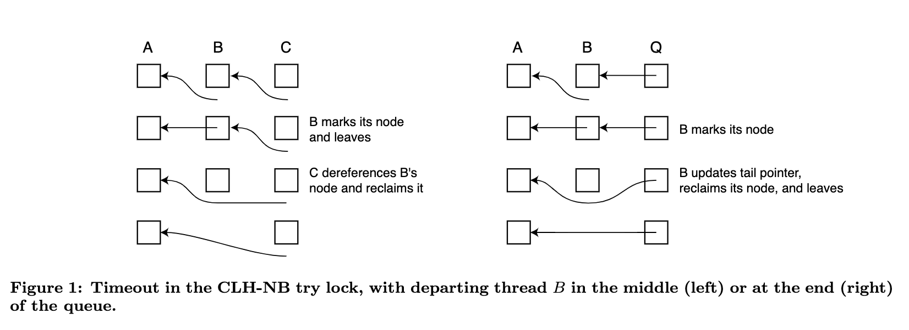

# Non-Blocking Timeout in Scalable Queue-Based Spin Locks
> by 2002. Michael L.Scott 

## Abstract
Queue-based spin locks allow programs with busy-wait synchronization to scale to very large multiprocessors, without fear of starvation or performance-destroying contention. Timeout-capable spin locks allow a thread to abandon its attempt to acquire a lock; they are used widely in real-time systems to avoid overshooting a deadline, and in database systems to recover from transaction deadlock and to tolerate preemption of the thread that holds a lock.

基于队列的自旋锁允许具有忙时同步的程序扩展到非常大的多处理器，而不必担心饥饿或破坏性能的争夺。具有超时功能的自旋锁允许线程放弃获取锁的尝试；它们被广泛用于实时系统，以避免超出最后期限，也被用于数据库系统，以恢复交易死锁和容忍持有锁的线程的抢占。

In previous work we showed how to incorporate timeout in scalable queue-based locks. Technological trends suggest that this combination will be of increasing commerial importance. Our previous solutions, however, require a thread that is timing out to handshake with its neighbors in the queue, a requirement that may lead to indefinite delay in a preemptively multiprogrammed system.

在以前的工作中，我们展示了如何将超时纳入可扩展的基于队列的锁中。技术趋势表明，这种组合将具有越来越大的商业重要性。然而，我们以前的解决方案需要一个正在超时的线程与队列中的邻居握手，这一要求可能会导致在一个可抢占的多道程序的系统中出现无限的延迟。

In the current paper we present new queue-based locks in which the timeout code is non-blocking. These locks sacrifice the constant worst-case space per thread of our previous algorithms, but allow us to bound the time that a thread may be delayed by preemption of its peers. We present empirical results indicating that space needs are modest in practice, and that performance scales well to large machines. We also conjecture that constant per-thread space cannot be guaranteed together with non-blocking timeout in a queue-based lock.

在本文中，我们提出了新的基于队列的锁，其中的超时代码是非阻塞的。这些锁牺牲了我们以前算法中每个线程的恒定最坏情况下的空间，但允许我们约束一个线程可能因其同伴的抢占而被延迟的时间。我们提出的经验结果表明，空间需求在实践中是适度的，而且性能可以很好地扩展到大型机器。我们还猜想，在基于队列的锁中，恒定的每线程空间不能与非阻塞超时一起保证。

## Introduction
Spin locks are widely used for mutual exclusion on shared-memory multiprocessors. Traditional test_and_set-based spin locks are vulnerable to memory and interconnect contention, and do not scale well to large machines. Queue-based spin locks [2, 5, 7, 14, 16] avoid contention by arranging for every waiting thread to spin on a separate, local flag in memory. Over the past ten years queue-based locks have been incorporated into a variety of academic and commercial operating systems, including Compaq’s Tru64, IBM’sK42 and multiprocessor Linux systems, the Alewife [1] and Hurricane [20] systems, and parallel real-time software from Mercury Computer Systems.

自旋锁被广泛用于共享内存多处理器上的相互排斥。传统的基于 test_and_set 的自旋锁很容易受到内存和互连的争夺，并且不能很好地扩展到大型机器上。基于队列的自旋锁[2, 5, 7, 14, 16]通过安排每个等待的线程在内存中的一个单独的本地标志上自旋，来避免争夺。在过去的十年中，基于队列的锁已经被纳入各种学术和商业操作系统，包括康柏的 Tru64、IBM 的 K42 和多处理器 Linux 系统、Alewife[1]和 Hurricane[20]系统，以及 Mercury 计算机系统的并行实时软件。

Outside the operating system, non-scalable test-and-set locks have come to be widely used in commercially important applications, notably database systems such as Oracle’s Parallel Server and IBM’s DB2. Many of these applications depend critically on the ability of a thread that waits “too long” to time out and abandon its attempt to acquire a lock. Timeout-capable “try locks” allow a real-time application to signal an error condition or pursue an alternative code path. In a database system, they provide a simple means of recovering from transaction deadlock.

在操作系统之外，不可扩展的 test-and-set 锁已被广泛用于重要的商业应用中，特别是数据库系统，如Oracle 的并行服务器和 IBM 的 DB2。这些应用中的许多都关键性地依赖于线程的能力，即等待 "太长时间 "而超时并放弃其获取锁的尝试。具有超时能力的 "尝试锁 "允许实时应用程序发出错误信号或追求其他代码路径。在数据库系统中，它们提供了一种简单的恢复交易死锁的方法。

Unfortunately, until recently it was not clear how to combine scalability and timeout. The problem is that while threads competing for a test-and-set lock are mutually anonymous, and can abandon their spins without anyone being the wiser, threads in a queue-based lock are linked into an explicit data structure. A timed-out thread must somehow introduce its neighbors in the queue to one another, even in cases where the neighbors may also be timing out.

不幸的是，直到最近，人们还不清楚如何将可扩展性和超时结合起来。问题是，虽然竞争 test-and-set 锁的线程是相互匿名的，并且可以在没有人知道的情况下放弃他们的旋转，但基于队列的锁中的线程被链接到一个明确的数据结构。一个超时的线程必须以某种方式把它在队列中的邻居介绍给对方，即使在邻居也可能超时的情况下。

In a recent paper [19] we introduced timeout-capable queue-based try locks based on our MCS lock [16] and on the related CLH lock, due to Craig [5] and to Landin and Hagersten [14]. These locks perform well on large machines, and require only O(L +T ) total space for L locks and T threads. Unfortunately, they require that a departing thread “hand-shake” with its neighbors in the queue in order to determine when all the references to a queue node have been updated, and the node can be reclaimed. This handshaking is not a problem in a system with one thread per processor, but it may indefinitely delay timeout in a multiprogrammed system, because a neighbor thread may be preempted, and thus unable to cooperate. This delay is unacceptable in a real-time system, where it may lead to deadlines being missed, and highly undesirable in a database system, where it may
significantly impact performance.

在最近的一篇论文[19]中，我们在我们的 MCS 锁[16]和相关的 CLH 锁的基础上引入了可超时的基于队列的尝试锁，这是由 Craig[5] 和 Landin 及 Hagersten [14]提出的。这些锁在大型机器上表现良好，L 个锁和 T 个线程只需要 O(L+T)的总空间。不幸的是，它们要求离开的线程与队列中的邻居 "握手"，以确定何时所有对队列节点的引用都已更新，而该节点可以被回收。这种握手在每个处理器只有一个线程的系统中不是问题，但在一个多程序系统中，它可能会无限期地延迟超时，因为邻居线程可能被抢占，从而无法合作。这种延迟在实时系统中是不可接受的，因为它可能会导致错过最后期限，而在数据库系统中则非常不可取，因为它可能会
显著影响性能。

The problem of preemption in critical sections has received considerable attention over the years. Alternative strategies include avoidance, recovery, and tolerance. The latter approach is appealing for commercial applications because it does not require modification of the kernel interface: if a thread waits “too long” for a lock, it assumes that the lock holder has been preempted. It abandons its attempt, yields the processor to another thread (assuming there are plenty) and tries again at a later time. In database systems timeout serves the dual purpose of deadlock recovery and preemption tolerance.

多年来，临界区的抢占问题已经得到了相当的关注。可供选择的策略包括避免、恢复和容忍。后一种方法对商业应用很有吸引力，因为它不需要修改内核接口：如果一个线程等待一个锁的时间 "太长"，它就会认为锁持有者已经被抢占了。它就会放弃尝试，把处理器让给另一个线程（假设有很多线程），然后在稍后的时间再尝试。在数据库系统中，超时起到了死锁恢复和抢占容忍的双重作用。

In this paper we introduce a pair of queue-based spin locks—the CLH-NB try lock and the MCS-NB try lock—in which timeout is non-blocking: a thread that decides to abandon its attempt to acquire a lock can do so without the assistance of any other thread, allowing it to strictly bound the time it spends waiting (successfully or unsuccessfully) for a lock. In order to minimize space overhead, we attempt to reclaim queue nodes as soon as possible, but—the price of preemption safety—there are pathological schedules in which our algorithms may require unbounded space.

在本文中，我们介绍了一对基于队列的自旋锁--CLH-NB try lock 和 MCS-NB try lock，其中超时是无阻塞的：一个决定放弃尝试获取锁的线程可以在没有任何其他线程的帮助下这样做，允许它严格约束它花在等待（成功或不成功）锁的时间。为了最大限度地减少空间开销，我们试图尽快回收队列节点，但是--抢占式安全的代价--在一些病态的时间表中，我们的算法可能需要无限制的空间。

We introduce our algorithms in section 2. We also conjecture that it is impossible in any queue based lock to combine non-blocking timeout with an O(L + T ) space bound. In section 3 we compare the performance of our new locks to existing test and set and queue-based locks on large-scale and multiprogrammed multiprocessors. With threads on 64 processors attempting to acquire a lock simultaneously, we identify cases in which a traditional test-and-set lock (with backoff) takes more than six times as long as our CLH-NB try lock per lock acquisition attempt, while failing (timing out) more than 22 times as often. In experiments with more threads than processors, we also demonstrate clearly the performance advantage of non-blocking timeout. We return in section 4 to a summary of conclusions and directions for future work.

我们在第 2 节中介绍了我们的算法。我们还猜想，在任何基于队列的锁中，都不可能将非阻塞超时与 O(L+T)空间约束相结合。在第 3 节中，我们将我们的新锁与现有的测试和设置以及基于队列的锁在大规模和多程序的多处理器上的性能进行比较。在 64 个处理器上的线程同时试图获取一个锁的情况下，我们发现传统的测试和设置锁（带后退）每次获取锁的时间是我们的 CLH-NB 尝试锁的 6 倍多，而失败（超时）的次数是 22 倍多。在线程多于处理器的实验中，我们也清楚地证明了非阻塞超时的性能优势。我们在第 4 节中总结了结论和未来工作的方向。

## 2 Algorithms
In the subsections below we describe a pair of queue-based spin locks in which a waiting thread, once it decides to leave the queue, can do so within a bounded number of its own time steps. The CLH-NB try lock is the simpler of the two, but relies on cache coherence. The MCS-NB try lock can be expected to scale better on non-cache-coherent machines. Code for the first of these locks can be found in the appendix. Code for both is also on-line: www.cs.rochester.edu/~scott/synchronization/pseudocode/nb_timeout.html. Informal correctness arguments can be found in the technical report version of this paper [18]. We are currently working to increase our confidence in these arguments through use of an exhaustive model-checking tool.

在下面的小节中，我们描述了一对基于队列的自旋锁，其中一个等待的线程一旦决定离开队列，就可以在其自身时间步数的限定范围内这样做。CLH-NB 尝试锁是这两种锁中比较简单的一种，但它依赖于缓存一致性。MCS-NB 尝试锁可望在非缓存一致性机器上有更好的扩展。其中第一个锁的代码可以在附录中找到。两者的代码也都在网上：www.cs.rochester.edu/~scott/synchronization/pseudocode/nb_timeout.html。非正式的正确性论证可以在本文的技术报告版本中找到。我们目前正在努力通过使用一个详尽的模型检查工具来增加我们对这些论点的信心。

In the original CLH and MCS locks, and in the CLH try and MCS try locks, space management for queue nodes is delegated to the callers of the acquire and release operations, and the queue node passed to MCS release or returned from CLH release is guaranteed to be available for immediate reuse once the release operation completes. For reasons discussed in section 2.4, no such guarantee seems possible for locks with non-blocking time-out. We therefore choose in the CLH-NB try and MCS-NB try locks to perform dynamic space allocation within the acquire and release operations. To allow the release operation to find the queue node allocated by the acquire operation, we arrange for acquire to write a reference to that node into an extra field (a head pointer) of the lock variable itself, once the lock is held. A serendipitous side effect of this strategy is that the CLH-NB try and MCS-NB try locks can employ a standard API, making them suitable for linking with binary-only commercial applications.

在最初的 CLH 和 MCS 锁中，以及在 CLH try 和 MCS try 锁中，队列节点的空间管理被委托给获取和释放操作的调用者，一旦释放操作完成，传递给 MCS 释放或从 CLH 释放返回的队列节点被保证可以立即重用。由于第 2.4 节中讨论的原因，对于非阻塞超时的锁来说，似乎不可能有这样的保证。因此，在 CLH-NB try和 MCS-NB try 锁中，我们选择在获取和释放操作中执行动态空间分配。为了让释放操作能够找到由获取操作分配的队列节点，我们安排获取操作将该节点的引用写入锁变量本身的一个额外字段（头部指针）中，一旦锁被持有。这个策略的一个偶然的副作用是，CLH-NB try 和 MCS-NB try 锁可以采用标准的API，使它们适合于与仅有二进制的商业应用相联系。

### 2.1 CLH-NB try lock
Our first new algorithm is based on the lock of Craig [5] and of Landin and Hagersten [14]. A lock variable takes the form of a tail pointer for a singly linked list of queue nodes. A thread that wishes to acquire the lock allocates a node, swaps it into the tail pointer, and then spins on a flag in the node ahead of it in line, which was returned by the swap.

我们的第一个新算法是基于 Craig 以及 Landin 和 Hagersten 的锁。锁定变量的形式是一个队列节点的单链列表的尾部指针。希望获得锁的线程分配一个节点，将其交换到尾部指针中，然后在排在它前面的节点上旋转一个标志，这个标志是由交换返回的。

We have modified this lock to allow non-blocking timeout. In our version individual queue nodes contain only a single pointer. When nil this pointer indicates that the thread spinning on the node must wait. When set to AVAILABLE (a value we assume to be different from any valid reference), the pointer indicates that the lock is available to the thread spinning on the node. When neither nil nor AVAILABLE, the pointer contains a reference to the previous node in the list, and (in a departure from the original version of the lock) indicates that the thread that allocated the node containing the pointer has timed out. Up until its decision to time out, a thread maintains its reference to the node on whichit is spinning in a local variable, rather than its queue node (indicated in the figure by starting the tail of an arrow in the empty space below a queue node).

我们修改了这个锁，以允许非阻塞式超时。在我们的版本中，单个队列节点只包含一个指针。当为零时，这个指针表示在该节点上旋转的线程必须等待。当设置为AVAILABLE（我们认为这个值与任何有效的引用不同）时，该指针表示该锁对在该节点上旋转的线程是可用的。当既不是nil也不是AVAILABLE时，指针包含对列表中前一个节点的引用，并且（与锁的原始版本不同）表明分配包含指针的节点的线程已经超时。直到它决定超时，一个线程在一个局部变量中保持它对它正在旋转的节点的引用，而不是它的队列节点（在图中通过在队列节点下面的空白处开始一个箭头的尾部表示）。

In the event of timeout two principal cases arise, illustrated in figure 1. In the left-hand portion of the figure, departing thread B is in the middle of the queue, spinning on the pointer in the node allocated by thread A. When B times out it indicates its intent to leave by storing into its own queue node a reference to A’s node. Thread C, which is spinning on B’s node, notices this change. It updates its own local pointer to refer to A’s node instead of B’s, and then reclaims B’s node.

在超时的情况下，会出现两种主要情况，如图 1 所示。在图的左边部分，离开的线程 B 在队列的中间，在线程 A 分配的节点的指针上旋转。当 B 超时时，它通过在自己的队列节点中存储对 A 的节点的引用来表明其离开的意图。正在 B 的节点上旋转的线程 C 注意到这个变化。它更新了自己的本地指针，以引用 A 的节点而不是 B 的节点，然后重新获得 B 的节点。



Unfortunately, B cannot be certain that C exists. The case where it does not is illustrated in the right-hand side of figure 1. After writing the reference to A’s queue node into its own queue node, B performs a compare and swap on the queue tail pointer, in an attempt to change it from a reference to B’s node into a reference to A’s node. In the middle-of-the-queue case (left) this operation will fail. In the end-of-the-queue case (right) it succeeds, and B knows that it can reclaim its own queue node. In either case B can return as soon as it has attempted the compare and swap; it does not have to wait for C. If the compare and swap failed, B’s queue node will not be available for reuse until it is reclaimed by C, or by some other, later thread, if C has also timed out.

不幸的是，B 不能确定 C 是否存在。图 1 的右侧显示了它不存在的情况。在把对 A 的队列节点的引用写入自己的队列节点后，B 对队列尾部指针进行了比较和交换，试图把它从对 B 的节点的引用变成对 A 的节点的引用。在队列中间的情况下（左边），这个操作会失败。在队列结束的情况下（右图），它成功了，而且 B 知道它可以重新获得自己的队列节点。如果比较和交换失败，B 的队列节点将不能被重新使用，直到它被 C 回收，或者被其他更晚的线程回收，如果 C 也超时了。

In our realization of the CLH-NB try lock (see appendix) we have made one additional departure from the original CLH lock. By analogy to the end-of-queue case for time-out, we can eliminate the extra, “dummy” node in an uncontended lock by performing a compare and swap in the release operation. This extra atomic operation increases the overhead of every critical section, but reduces by one word the size of an unheld lock. Of course, we added a word to the lock in order to hold the head pointer that allows us to use a standard API; in effect, we have chosen to expend a bit of time in order to “buy back” this extra space.

在我们对 CLH-NB 尝试锁的实现中（见附录），我们对原来的 CLH 锁做了一个额外的改变。通过与超时的队列结束情况进行类比，我们可以通过在释放操作中进行比较和交换来消除无争议锁中额外的 "假 "节点。这个额外的原子操作增加了每个关键部分的开销，但却减少了一个字的未持有锁的大小。当然，我们在锁上增加了一个字，以保持头部指针，使我们能够使用标准的API；实际上，我们选择花费一点时间，以 "买回 "这个额外的空间。

Because reclaimed queue nodes may be reused, we must be careful to avoid the so-called ABA problem, in which a reference to a newly allocated node is mistaken for a reference to a previously reclaimed node. Specifically, once thread B writes a reference to X into node Y , B’s successor may reclaim Y . If Y ’s space is recycled quickly and used for some new queue node Y ′, which is used in an attempt to acquire the same lock for which Y was used, B’s compare and swap may succeed when it should not. We can avoid this possibility, in this particular case, by using a memory allocator in which a given block of storage is always allocated by the same thread. Then Y ’s space, which was allocated by B, will be reused only by B, and only after B has attempted the compare and swap in which the ABA problem arises. Code for our space management routines appears in the appendix.

因为回收的队列节点可能会被重新使用，我们必须注意避免所谓的 ABA 问题，即对新分配的节点的引用被误认为是对先前回收的节点的引用。具体来说，一旦线程 B 将对 X 的引用写入节点Y中，B 的继任者就可能回收Y。如果 Y 的空间被迅速回收并用于一些新的队列节点 Y′，而该节点被用来试图获得 Y 被使用的相同的锁，那么 B 的比较和交换可能会成功，而它不应该。在这种特殊情况下，我们可以通过使用内存分配器来避免这种可能性，在这种分配器中，一个给定的存储块总是由同一个线程分配。那么，由 B 分配的Y的空间将只被B重新使用，而且只在 B 尝试了 ABA 问题出现的比较和交换之后。我们的空间管理程序的代码出现在附录中。

### 2.2 MCS-NB try lock
(暂缓)

## 4 Conclusions
We have shown that it is possible, given standard atomic operations, to construct queue-based locks in which a thread can time out and abandon its attempt to acquire the lock. Our previous algorithms guaranteed immediate reclamation of abandoned queue nodes, but required that a departing thread obtain the cooperation of its neighbors. Our new algorithms incorporate non-blocking timeout code, and can safely be used in the presence of preemption (assuming, of course, that the processor can be put to other use while waiting for the preempted lock holder to be rescheduled).

我们已经证明，鉴于标准的原子操作，有可能构建基于队列的锁，其中一个线程可以超时并放弃其获取锁的尝试。我们之前的算法保证了被放弃的队列节点的立即回收，但需要离开的线程获得其邻居的合作。我们的新算法包含了非阻塞超时代码，并且可以在存在抢占的情况下安全地使用（当然，假设在等待被抢占的锁持有者被重新安排时，处理器可以被投入其他用途）。

The price of non-blocking timeout is an unbounded worst-case requirement for space. We have argued, however, that large amounts of space are unlikely to be required in practice, and our experimental results support this argument.

非阻塞超时的代价是对空间的无限制的最坏情况要求。然而，我们认为在实践中不太可能需要大量的空间，而我们的实验结果也支持这一论点。

Results obtained on a 64-processor Sun Enterprise 10000 indicate that traditional test-and-set locks, which support timeout trivially, do not scale to large machines, even when designed to back off in the presence of contention. Techno- logical trends would appear to be making queue-based locks increasingly important, and a timeout mechanism significantly increases the scope of their applicability. On a single processor, without contention, the CLH-NB try lock takes about twice as long as the plain (no timeout) CLH lock, which in turn takes about twice as long as a conventional test-and-set lock (with or without timeout). The significance of this single-processor overhead is unclear: unless threads all access different locks, a lock that sees little contention is probably lightly used, and its overhead is unlikely to have a significant impact on overall program run time.

在 64 个处理器的 Sun Enterprise 10000 上获得的结果表明，传统的测试和设置锁（支持简单的超时）不能扩展到大型机器，即使设计成在出现争用的情况下退缩。技术逻辑趋势似乎正在使基于队列的锁变得越来越重要，而超时机制大大增加了它们的适用范围。在单个处理器上，如果没有竞争，CLH-NB 尝试锁所需时间是普通（无超时）CLH 锁的两倍，而后者所需时间又是传统测试和设置锁（有或无超时）的两倍。这种单处理器开销的意义还不清楚：除非线程都访问不同的锁，否则一个很少出现争执的锁可能被轻度使用，其开销不太可能对整个程序运行时间产生重大影响。

With 64 processors attempting to acquire the lock simultaneously, however, we were able to identify cases in which attempts to acquire a test-and-set lock (with backoff) took more than six times as long as attempts to acquire a CLH-NB try lock, while failing (timing out) more than 22 times as often (82% of the time, v. 3.7% for the CLH-NB try lock). While one of course attempts in any parallel program to avoid high lock contention, conversations with colleagues in industry indicate that pathological cases do indeed arise in practice,  particularly in transaction processing systems, and graceful performance degradation in these cases is of significant concern to customers.

然而，在64个处理器同时尝试获取锁的情况下，我们能够识别出这样的情况：尝试获取一个测试和设置的锁（带后退）所花费的时间是尝试获取一个 CLH-NB 尝试锁的六倍多，而失败（超时）的频率是 22 倍多（82%的时间，而CLH-NB尝试锁只有3.7%）。虽然人们在任何并行程序中都试图避免高锁争用，但与工业界同事的谈话表明，在实践中确实出现了病态的情况，特别是在交易处理系统中，在这些情况下，优雅的性能下降是客户的重大关切。

For small-scale multiprocessors we continue to recommend a simple test-and-set lock with backoff. Queue-based locks, however, are attractive for larger machines, or for cases in which fairness and regularity of timing are particularly important. The CLH lock, both with and without timeout, has better overall performance than the MCS lock on cache-coherent machines. The CLH-NB try lock is also substantially simpler than the MCS-NB try lock. We would expect the relative performance of the queue-based locks to be reversed on a non-cache-coherent machine, even if the CLH-NB try lock were modified to ensure local-only spinning, using an extra level of indirection.

对于小规模的多核处理器，我们仍然建议使用简单的测试和设置的后退式锁。然而，基于队列的锁对于大型机器，或者对于时间的公平性和规律性特别重要的情况是有吸引力的。CLH锁，无论是有还是没有超时，在缓存一致的机器上都比 MCS 锁具有更好的整体性能。CLH-NB 尝试锁也比 MCS-NB 尝试锁简单得多。我们希望基于队列的锁在非缓存一致性机器上的相对性能是相反的，即使CLH-NB尝试锁被修改以确保只在本地旋转，使用一个额外的代理级别。

The provision for timeout in scalable queue-based locks makes spin locks a viable mechanism for user-level synchronization on large multiprogrammed systems. In future work we hope to evaluate our algorithms in the context of commercial OLTP codes. We also plan to develop variants that block in the scheduler on timeout, cooperate with the scheduler to avoid preemption while in a critical section or adapt dynamically between test and set and queue-based locking in response to observed contention. In a related vein, we are developing a tool to help verify the correctness of locking algorithms by transforming source code automatically into input for a model checker.

在可扩展的基于队列的锁中对超时的规定使得自旋锁成为大型多程序系统中用户级同步的可行机制。在未来的工作中，我们希望能在商业 OLTP 代码的背景下评估我们的算法。我们还计划开发一些变体，这些变体在超时时在调度器中阻塞，与调度器合作以避免在关键部分的抢占，或者在测试和设置以及基于队列的锁之间动态地适应观察到的争夺。与此相关，我们正在开发一种工具，通过将源代码自动转化为模型检查器的输入，帮助验证锁定算法的正确性。

## Appendix

### Code For Algorithms
The following page contains slightly stylized C code for the queue node space management routines and the CLH-NB try lock. Code for the MCS-NB try lock (1.5 pages) would not fit in the conference proceedings. It can be found on-line at www.cs.rochester.edu/~scott/synchronization/pseudocode/nb_timeout.html. Compilable source code for Sparc V9/Solaris can be found at ftcp.cs.rochester.edu/pub/packages/scalable_synch/nb_timeout.tar.gz. 

下面这一页包含了队列节点空间管理例程和 CLH-NB 尝试锁的略微风格化的 C 代码。MCS-NB尝试锁的代码（1.5页）不适合在会议记录中出现。它可以在网上找到：www.cs.rochester.edu/~scott/synchronization/pseudocode/nb_timeout.html。Sparc V9/Solaris 的可编译源代码可以在ftcp.cs.rochester.edu/pub/packages/scalable_synch/nb_timeout.tar.gz找到。

```
// Code to manage a local but shared pool of qnodes.
// All nodes are allocated by, and used by, a given thread, and may
// reside in local memory on an ncc-numa machine. The nodes belonging
// to a given thread form a circular singly linked list. The head
// pointer points to the node must recently successfully allocated.
// A thread allocates from its own pool by seaching forward from the
// pointer for a node that's marked "unused". A thread (any thread)
// deallocates a node by marking it "unused".

typedef struct local_qnode {
    union {
        clh_nb_qnode cnq;               // members of this union are
        mcs_nb_qnode mnq;               // never accessed by name
    } real_qnode;
    volatile bool allocated;
    struct local_qnode *next_in_pool;
} local_qnode;

typedef struct {
    local_qnode *try_this_one;          // pointer into circular list
    local_qnode initial_qnode;
} local_head_node;

inline local_qnode *alloc_local_qnode(local_head_node *hp) 
{
    local_qnode *p = hp->try_this_one;
    if (!p->allocated) {
        p->allocated = true;
        return p;
    } else {
        local_qnode *q = p->next_in_pool;
        while (q != p) {
            if (!q->allocated) {
                hp->try_this_one = q;
                q->allocated = true;
                return q;
            } else {
                q = q->next_in_pool;
            }
        }
        // All qnodes are in use. Allocate new one and link into list.
        special_events[mallocs]++;
        q = (local_qnode *) malloc(sizeof(local_qnode));
        q->next_in_pool = p->next_in_pool;
        p->next_in_pool = q;
        hp->try_this_one = q;
        q->allocated = true;
        return q;
    }
}

#define free_local_qnode(p) ((p)->allocated = false)

typedef struct clh_nb_qnode {
    struct clh_nb_qnode *volatile prev;
} clh_nb_qnode;

typedef struct {
    clh_nb_qnode *volatile tail;
    clh_nb_qnode *lock_holder;      // node allocated by lock holder
} clh_nb_lock;

#define AVAILABLE ((clh_nb_qnode*) 1)

#define cqn_swap(p, v) (clh_nb_qnode *) \
    swap((volatile unsigned long*) (p), (unsigned long) (v))

#define compare_and_store(p, o, n)  \
    (cas(volatile unsigned long *) (p), \
        (unsigned long) (o), (unsigned long) (n)  \
            == (unsigned long) (o))

#define alloc_qnode() (clh_nb_qnode *) alloc_local_qnode(my_head_node_ptr())
#define free_qnode(p) free_local_qnode((local_qnode *) p)

bool clh_nb_try_acquire(clh_nb_lock *L, hrtime_t T)
{
    clh_nb_qnode *I = alloc_qnode();

    I->prev = 0;
    clh_nb_qnode pred = cqn_swap(&L->tail, I);
    if (!pred) {
        // lock was free and uncontested; just return
        L->lock_holder = I;
        return true;
    }

    if (pred->prev == AVAILABLE) {
        // lock was free; just return
        L->lock_holder = I;
        free_qnode(pred);
        return true;
    }

    hrtime_t start = START_TIME;

    while (CUR_TIME - start < T) {
        clh_nb_qnode *pred_pred = pred->prev;
        if (pred_pred == AVAILABLE) {
            L->lock_holder = I;
            free_qnode(pred);
            return true;
        } else if (pred_pred) {
            free_qnode(pred);
            pred = pred_pred;
        }
    }

    // timed out; reclaim or abandon own node

    if (compare_and_store(&L->tail, I, pred)) {
        // last process in line
        free_qnode(I);
    } else {
        I->prev = pred;
    }
    return false;
}

void clh_nb_try_release(clh_nb_lock *L)
{
    clh_nb_qnode *I = L->lock_holder;
    if (compare_and_store(&L->tail, I, 0)) {
        // no competition for lock; reclaim qnode
        free_qnode(I);
    } else {
        I->prev = AVAILABLE;
    }
}

```