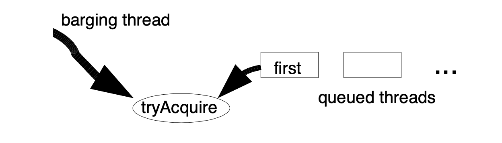

# The java.util.concurrent Synchronizer Framework
> Doug Lea

## Abstract
Most synchronizer (locks, barriers, etc.) in the J2SE1.5 java.util.concurrent package are constructed using a small framework based on class AbstractQueuedSynchronizer. This framework provides common mechanics for atomically managing synchronization state, blocking and unblocking threads, and queuing. The paper describes the rationale, design, implementation, usage, and performance of this framework.

J2SE1.5 中的大多数同步器（锁、安全栅等）。java.util.concurrent 包是使用基于类AbstractQueuedSynchronizer 的小型框架构建的。该框架提供了原子化管理同步状态、阻塞和取消阻塞线程以及排队的通用机制。本文描述了该框架的基本原理、设计、实现、使用和性能。

## 1. Introduction
Java release J2SE-1.5 introduces package java.util.concurrent, a collection of medium-level concurrency support classes created via Java Community Process (JCP) Java Specification Request (JSR) 166. Among these components are a set of synchronizers – abstract data type (ADT) classes that maintain an internal synchronization state (for example, representing whether a lock is locked or unlocked), operations to update and inspect that state, and at least one method that will cause a calling thread to block if the state requires it, resuming when some other thread changes the synchronization state to permit it. Examples include various forms of mutual exclusion locks, read-write locks, semaphores, barriers, futures, event indicators, and handoff queues.

Java 版本 J2SE-1.5 引入了 java.util.concurrent 包，通过 Java 社区进程（JCP）Java 规范请求（JSR）166 创建的中级并发支持类的集合。在这些组件中有一组同步器–维护内部同步状态（例如，表示锁是锁定的还是解锁的）的抽象数据类型（ADT）类、更新和检查该状态的操作，以及在状态需要时导致调用线程阻塞的至少一个方法，当其他线程更改同步状态以允许同步时恢复。示例包括各种形式的互斥锁、读写锁、信号量、屏障、futures、事件指示器和切换队列。

As is well-known (see e.g., [2]) nearly any synchronizer can be used to implement nearly any other. For example, it is possible to build semaphores from reentrant locks, and vice versa. However, doing so often entails enough complexity, overhead, and inflexibility to be at best a second-rate engineering option. Further, it is conceptually unattractive. If none of these constructs are intrinsically more primitive than the others, developers should not be compelled to arbitrarily choose one of them as a basis for building others. Instead, JSR166 establishes a small framework centered on class AbstractQueuedSynchronizer, that provides common mechanics that are used by most of the provided synchronizers in the package, as well as other classes that users may define themselves.

众所周知（参见[2]）几乎任何同步器都可以用来实现几乎任何其他同步器。例如，可以从可重入锁构建信号量，反之亦然。然而，这样做往往需要足够的复杂性、开销和灵活性，充其量只能成为二流工程选项。此外，它在概念上没有吸引力。如果这些构造本质上都不比其他构造更原始，那么不应该强迫开发人员任意选择其中一个作为构建其他构造的基础。相反，JSR166 建立了一个以类 AbstractQueuedSynchronizer 为中心的小型框架，该框架提供了包中大多数提供的同步器所使用的通用机制，以及用户可以自己定义的其他类。

The remainder of this paper discusses the requirements for this framework, the main ideas behind its design and implementation, sample usages, and some measurements showing its performance characteristics.

本文的其余部分讨论了该框架的需求、设计和实现背后的主要思想、示例用法以及显示其性能特征的一些度量。

## 2 Requirements

### 2.1 Functionality
Synchronizers possess two kinds of methods [7]: at least one acquire operation that blocks the calling thread unless/until the synchronization state allows it to proceed, and at least one release operation that changes synchronization state in a way that may allow one or more blocked threads to unblock.

同步器有两种方法：至少一种 acquire 操作阻止调用线程，除非/直到同步状态允许其继续，以及至少一种 release 操作，以允许一个或多个被阻止线程解除阻止的方式更改同步状态。

The java.util.concurrent package does not define a single unified API for synchronizers. Some are defined via common interfaces (e.g., Lock), but others contain only specialized versions. So, acquire and release operations take a range of names and forms across different classes. For example, methods Lock.lock, Semaphore.acquire, CountDownLatch.await, and FutureTask.get all map to acquire operations in the framework. However, the package does maintain consistent conventions across classes to support a range of common usage options. When meaningful, each synchronizer supports:
+ Nonblocking synchronization attempts (for example, tryLock) as well as blocking versions.
+ Optional timeouts, so applications can give up waiting.
+ Cancellability via interruption, usually separated into one version of acquire that is cancellable, and one that isn't.

java.util.concurrent 包没有为同步器定义单一的统一API。有些是通过公共接口（如锁）定义的，但另一些仅包含专用版本。因此，获取和发布操作在不同的类中采用一系列名称和形式。例如，方法 Lock.lock，Semaphore.acquire, CountDownLatch.await，FutureTask.get。在框架中全部都映射到 acquire 操作。但是，该包在类之间保持一致的约定，以支持一系列常见的使用选项。如果有意义，每个同步器支持：
+ 非阻塞同步尝试（例如 tryLock ）以及阻塞版本。
+ 可选超时，因此应用程序可以放弃等待。
+ 通过中断的可取消性，通常分为一个可取消版本和一个不可取消版本。

Synchronizers may vary according to whether they manage only exclusive states – those in which only one thread at a time may continue past a possible blocking point – versus possible shared states in which multiple threads can at least sometimes proceed. Regular lock classes of course maintain only exclusive state, but counting semaphores, for example, may be acquired by as many threads as the count permits. To be widely useful, the framework must support both modes of operation.

同步器可能会有所不同，这取决于它们是否只管理排他状态（一次只有一个线程可以继续通过可能的阻塞点），而不是多个线程至少有时可以继续的可能共享状态。当然，常规锁类只维护独占状态，但是计数信号量可以由计数允许的尽可能多的线程获取。为了广泛使用，该框架必须支持这两种操作模式。

The java.util.concurrent package also defines interface Condition, supporting monitor-style await/signal operations that may be associated with exclusive Lock classes, and whose implementations are intrinsically intertwined with their associated Lock classes.

java.util.concurrent 包还定义了 Condition 接口，支持监视器样式的等待/信号操作，这些操作可能与独占锁类关联，并且其实现本质上与它们关联的锁类交织在一起。

### 2.2 Performance Goals
Java built-in locks (accessed using synchronized methods and blocks) have long been a performance concern, and there is a sizable literature on their construction (e.g., [1], [3]). However, the main focus of such work has been on minimizing space overhead (because any Java object can serve as a lock) and on minimizing time overhead when used in mostly-single-threaded contexts on uniprocessors. Neither of these are especially important concerns for synchronizers: Programmers construct synchronizers only when needed, so there is no need to compact space that would otherwise be wasted, and synchronizers are used almost exclusively in multithreaded designs (increasingly often on multiprocessors) under which at least occasional contention is to be expected. So the usual JVM strategy of optimizing locks primarily for the zero-contention case, leaving other cases to less predictable "slow paths" is not the right tactic for typical multithreaded server applications that rely heavily on java.util.concurrent.

Java 内置锁（使用同步方法和块访问）长期以来一直是性能问题，关于它们的构造有大量文献（例如，[1]，[3]）。然而，这类工作的主要重点是最小化空间开销（因为任何 Java 对象都可以充当锁），以及在单处理器上的单线程上下文中使用时最小化时间开销。对于同步器来说，这两个都不是特别重要的问题：程序员只在需要时构造同步器，因此不需要压缩否则会浪费的空间，同步器几乎只用于多线程设计中（在多处理器上越来越频繁），在这种设计中至少会出现偶尔的争用。因此，通常的 JVM 策略主要针对零争用情况优化锁，而将其他情况留给不太可预测的“慢路径”对于严重依赖 java.util.concurrent 的典型多线程服务器应用程序来说不是正确的策略。

Instead, the primary performance goal here is scalability: to predictably maintain efficiency even, or especially, when synchronizers are contended. Ideally, the overhead required to pass a synchronization point should be constant no matter how many threads are trying to do so. Among the main goals is to minimize the total amount of time during which some thread is permitted to pass a synchronization point but has not done so. However, this must be balanced against resource considerations, including total CPU time requirements, memory traffic, and thread scheduling overhead. For example, spinlocks usually provide shorter acquisition times than blocking locks, but usually waste cycles and generate memory contention, so are not often applicable.

相反，这里的主要性能目标是可伸缩性：即使在使用同步器的情况下，也能以可预测的方式保持效率。理想情况下，传递同步点所需的开销应该是恒定的，无论有多少线程试图这样做。主要目标之一是最小化允许某些线程通过同步点但尚未通过的总时间。但是，这必须与资源考虑因素相平衡，包括总 CPU 时间需求、内存流量和线程调度开销。例如，自旋锁通常比阻塞锁提供更短的获取时间，但通常会浪费周期并产生内存争用，因此通常不适用。

These goals carry across two general styles of use. Most applications should maximize aggregate throughput, tolerating, at best, probabilistic guarantees about lack of starvation. However in applications such as resource control, it is far more important to maintain fairness of access across threads, tolerating poor aggregate throughput. No framework can decide between these conflicting goals on behalf of users; instead different fairness policies must be accommodated.

这些目标有两种通用的使用风格。大多数应用程序都应该最大限度地提高总吞吐量，最多只能容忍概率性的饥饿保证。然而，在资源控制等应用程序中，更重要的是保持跨线程访问的公平性，容忍低聚合吞吐量。没有一个框架能够代表用户在这些相互冲突的目标之间做出决定；相反，必须适应不同的公平政策。

No matter how well-crafted they are internally, synchronizers will create performance bottlenecks in some applications. Thus, the framework must make it possible to monitor and inspect basic operations to allow users to discover and alleviate bottlenecks. This minimally (and most usefully) entails providing a way to determine how many threads are blocked.

无论同步器在内部设计得多么精巧，它们都会在某些应用程序中造成性能瓶颈。因此，该框架必须能够监视和检查基本操作，以允许用户发现并缓解瓶颈。这需要提供一种方法来确定有多少线程被阻塞，这是最少用的（也是最有用的）。

## 3 Design And Implementation
The basic ideas behind a synchronizer are quite straightforward. An acquire operation proceeds as:

同步器背后的基本思想非常简单。一个 acquire 操作进行如下操作：

```
    while (synchronization state does not allow acquire) {
        enqueue current thread if not already queued;
        possibly block current thread;
    }
    dequeue current thread if it was queued;
```

And a release operation is:

```
    update synchronization state;
    if (state may permit a blocked thread to acquire)
        unblock one or more queued threads;
```

Support for these operations requires the coordination of three basic components:
+ Atomically managing synchronization state
+ Blocking and unblocking threads
+ Maintaining queues

支持这些操作需要协调三个基本组成部分：
+ 原子化管理同步状态
+ 阻塞和取消阻塞线程
+ 维护队列

It might be possible to create a framework that allows each of these three pieces to vary independently. However, this would neither be very efficient nor usable. For example, the information kept in queue nodes must mesh with that needed for unblocking, and the signatures of exported methods depend on the nature of synchronization state.

也许可以创建一个框架，允许这三个部分中的每一个独立地变化。然而，这既不是很有效也不是很有用。例如，队列节点中保存的信息必须与解锁所需的信息相匹配，导出方法的签名取决于同步状态的性质。

The central design decision in the synchronizer framework was to choose a concrete implementation of each of these three components, while still permitting a wide range of options in how they are used. This intentionally limits the range of applicability, but provides efficient enough support that there is practically never a reason not to use the framework (and instead build synchronizers from scratch) in those cases where it does apply.

同步器框架中的核心设计决策是选择这三个组件中每一个的具体实现，同时仍然允许在如何使用它们方面有广泛的选择。这有意地限制了适用性的范围，但提供了足够有效的支持，因此在框架确实适用的情况下，几乎没有理由不使用框架（而是从头开始构建同步器）。

### 3.1 Synchronization State
Class AbstractQueuedSynchronizer maintains synchronization state using only a single (32bit) int, and exports getState, setState, and compareAndSetState operations to access and update this state. These methods in turn rely on java.util.concurrent.atomic support providing JSR133 (Java Memory Model) compliant volatile semantics on reads and writes, and access to native compare-and-swap or load-linked/store-conditional instructions to implement compareAndSetState, that atomically sets state to a given new value only if it holds a given expected value.

类 AbstractQueuedSynchronizer 仅使用单个（32位）int 维护同步状态，并输出 getState、setState 和 compareAndSetState 操作以访问和更新此状态。这些方法反过来又依赖于 java.util.concurrentl.atomic 支持在读写时提供符合 JSR133（Java 内存模型）的 volatile 语义。并访问本机 compare-and-swap 或 load-linked/store-conditional 指令以实现 compareAndSetState，该指令仅在持有给定的预期值时，才会原子地将状态设置为给定的新值。

Restricting synchronization state to a 32bit int was a pragmatic decision. While JSR166 also provides atomic operations on 64bit long fields, these must still be emulated using internal locks on enough platforms that the resulting synchronizers would not perform well. In the future, it seems likely that a second base class, specialized for use with 64bit state (i.e., with long control arguments), will be added. However, there is not now a compelling reason to include it in the package. Currently, 32 bits suffice for most applications. Only one java.util.concurrent synchronizer class, CyclicBarrier, would require more bits to maintain state, so instead uses locks (as do most higher-level utilities in the package).

将同步状态限制为 32 位 int 是一个务实的决定。虽然 JSR166还 提供 64 位长字段上的原子操作，但仍必须在足够多的平台上使用内部锁来模拟这些操作，以使生成的同步器不能很好地执行。在将来，可能会添加第二个基类，专门用于 64 位状态（即长控制参数）。然而，现在没有一个令人信服的理由将其包括在一揽子计划中。目前，32位足以满足大多数应用。只有一个 java.util.concurrent 的同步类 CyclicBarrier 需要更多位来维护状态，因此使用锁（包中的大多数高级实用程序也是如此）。

Concrete classes based on AbstractQueuedSynchronizer must define methods tryAcquire and tryRelease in terms of these exported state methods in order to control the acquire and release operations. The tryAcquire method must return true if synchronization was acquired, and the tryRelease method must return true if the new synchronization state may allow future acquires. These methods accept a single int argument that can be used to communicate desired state; for example in a reentrant lock, to re-establish the recursion count when re-acquiring the lock after returning from a condition wait. Many synchronizers do not need such an argument, and so just ignore it.

基于 AbstractQueuedSynchronizer 的具体类必须根据这些导出的状态方法定义方法 tryAcquire 和tryRelease，以便控制获取和释放操作。如果获取了同步，则 tryAcquire 方法必须返回true；如果新的同步状态可能允许将来的获取，则 tryRelease 方法必须返回true。这些方法接受一个 int 参数，可以用来传递所需的状态；例如，在可重入锁中，在从条件等待返回后重新获取锁时重新建立递归计数。许多同步器不需要这样的参数，所以忽略它。

### 3.2 Blocking
Until JSR166, there was no Java API available to block and unblock threads for purposes of creating synchronizers that are not based on built-in monitors. The only candidates were Thread.suspend and Thread.resume, which are unusable because they encounter an unsolvable race problem: If an unblocking thread invokes resume before the blocking thread has executed suspend, the resume operation will have no effect.

在 JSR166 之前，没有 Java API 可用于阻塞和取消阻塞线程，以创建不基于内置监控器的同步器。唯一的候选人是 Thread.suspend 和 Thread.resume，由于遇到无法解决的争用问题而无法使用：如果取消阻塞线程在阻塞线程执行 suspend 之前调用 resume，那么 resume 操作将无效。

The java.util.concurrent.locks package includes a LockSupport class with methods that address this problem. Method LockSupport.park blocks the current thread unless or until a LockSupport.unpark has been issued. (Spurious wakeups are also permitted.) Calls to unpark are not "counted", so multiple unparks before a park only unblock a single park. Additionally, this applies per-thread, not per-synchronizer. A thread invoking park on a new synchronizer might return immediately because of a "leftover" unpark from a previous usage. However, in the absence of an unpark, its next invocation will block. While it would be possible to explicitly clear this state, it is not worth doing so. It is more efficient to invoke park multiple times when it happens to be necessary.

java.utl.concurrent.locks 包有一个LockSupport类，其中包含解决此问题的方法。 除非或直到 LockSupport.unpark 调用（也允许出现虚假唤醒。），否则 LockSupport.park 将阻止当前线程。（对unpark的调用不“计数”，因此在一个 park 之前的多个 unpark 只能解除对单个 park 的阻止。此外，这适用于每个线程，而不是每个同步器。在一个新的同步器上调用 park 的线程可能会立即返回，这是因为以前使用过的“剩余”unpark 操作。但是，如果没有 unpark，它的下一次调用将被阻塞。虽然可以明确清除此状态，但不值得这样做。在需要时多次调用 park 更有效。

This simple mechanism is similar to those used, at some level, in the Solaris-9 thread library [11], in WIN32 "consumable events", and in the Linux NPTL thread library, and so maps efficiently to each of these on the most common platforms Java runs on. (However, the current Sun Hotspot JVM reference implementation on Solaris and Linux actually uses a pthread condvar in order to fit into the existing runtime design.) The park method also supports optional relative and absolute timeouts, and is integrated with JVM Thread.interrupt support — interrupting a thread unparks it.

这个简单的机制在某种程度上类似于 Solaris-9 线程库[11]、WIN32“可消费事件”和 Linux NPTL 线程库中使用的机制，因此可以有效地映射到 Java 运行的最常见平台上的每个线程库。（但是，当前Solaris和Linux上的Sun Hotspot JVM 参考实现实际上使用了 pthread condvar，以适应现有的运行时设计。）park 方法还支持可选的相对和绝对超时，并与 JVM 线程集成。中断支持-中断线程将对其进行解压。

### 3.3 Queues
The heart of the framework is maintenance of queues of blocked threads, which are restricted here to FIFO queues. Thus, the framework does not support priority-based synchronization.

该框架的核心是维护阻塞线程的队列，这里仅限于 FIFO 队列。因此，该框架不支持基于优先级的同步。

These days, there is little controversy that the most appropriate choices for synchronization queues are non-blocking data structures that do not themselves need to be constructed using lower-level locks. And of these, there are two main candidates: variants of Mellor-Crummey and Scott (MCS) locks [9], and variants of Craig, Landin, and Hagersten (CLH) locks [5][8][10]. Historically, CLH locks have been used only in spinlocks. However, they appeared more amenable than MCS for use in the synchronizer framework because they are more easily adapted to handle cancellation and timeouts, so were chosen as a basis. The resulting design is far enough removed from the original CLH structure to require explanation.

现在，对于同步队列最合适的选择是无阻塞的数据结构几乎没有争议，这些数据结构本身不需要使用较低级别的锁来构造。其中，有两种主要的候选者：Mellor-Crummey and Scott（MCS）锁的变体，以及 Craig, Landin, and Hagersten（CLH）锁的变体。历史上，CLH 锁仅用于旋转锁。然而，它们似乎比 MCS 更适合在同步器框架中使用，因为它们更容易适应处理取消和超时，因此被选为基础。由此产生的设计与原始 CLH 结构相距甚远，因此需要进行解释。

A CLH queue is not very queue-like, because its enqueuing and dequeuing operations are intimately tied to its uses as a lock. It is a linked queue accessed via two atomically updatable fields, head and tail, both initially pointing to a dummy node.

CLH 队列不是很像队列，因为它的排队和退队操作与其作为锁的用途密切相关。它是一个链接队列，通过两个原子上可更新的字段（head 和 tail）访问，这两个字段最初都指向一个虚拟节点。

```
    // A new node, node, is enqueued using an atomic operation:
    do {
        pred = tail;
    } while (!tail.compareAndSet(pred, node));

    // The release status for each node is kept in its predecessor node.
    // So, the "spin" of a spinlock looks like:

    while (pred.status != RELEASED);        // spin

    // A dequeue opertion after this spin simply entails setting the head field
    // to the node that just got the lock:

    head = node;
```

Among the advantages of CLH locks are that enqueuing and dequeuing are fast, lock-free, and obstruction free (even under contention, one thread will always win an insertion race so will make progress); that detecting whether any threads are waiting is also fast (just check if head is the same as tail); and that release status is decentralized, avoiding some memory contention.

CLH 锁的优点之一是排队和退队速度快、无锁、无障碍（即使在争用情况下，一个线程始终会赢得插入竞争，因此会取得进展）；检测是否有线程正在等待也很快（只需检查头和尾是否相同）；释放状态是分散的，避免了一些内存争用。

In the original versions of CLH locks, there were not even links connecting nodes. In a spinlock, the pred variable can be held as a local. However, Scott and Scherer[10] showed that by explicitly maintaining predecessor fields within nodes, CLH locks can deal with timeouts and other forms of cancellation: If a node's predecessor cancels, the node can slide up to use the previous node's status field.

在 CLH 锁的原始版本中，甚至没有连接节点的链接。在自旋锁中，pred 变量可以作为局部变量保存。然而，Scott 和 Scherer 表明，通过显式维护节点内的前置字段，CLH 锁可以处理超时和其他形式的取消：如果节点的前驱结点取消了，则节点可以向上滑动以使用前一个节点的状态字段。

The main additional modification needed to use CLH queues for blocking synchronizers is to provide an efficient way for one node to locate its successor. In spinlocks, a node need only change its status, which will be noticed on next spin by its successor, so links are unnecessary. But in a blocking synchronizer, a node needs to explicitly wake up (unpark) its successor.

使用 CLH 队列阻止同步器所需的主要附加修改是为一个节点提供一种有效的方法来定位其后续节点。在自旋锁中，节点只需更改其状态，后续节点在下一次自旋时会注意到该状态，因此不需要链接。但是在阻塞同步器中，节点需要显式地唤醒（取消解析）其后续节点。

An AbstractQueuedSynchronizer queue node contains a next link to its successor. But because there are no applicable techniques for lock-free atomic insertion of double-linked list nodes using compareAndSet, this link is not atomically set as part of insertion; it is simply assigned:

AbstractQueuedSynchronizer队列节点包含指向其后续节点的 next 链接。但是，由于没有使用compareAndSet 对双链表节点进行无锁原子插入的适用技术，因此该链接不是原子地设置为插入的一部分；它被简单地指定为：
```
    pred.next = node;
```

after the insertion. This is reflected in all usages. The next link is treated only as an optimized path. If a node's successor does not appear to exist (or appears to be cancelled) via its next field, it is always possible to start at the tail of the list and traverse backwards using the pred field to accurately check if there really is one.

插入之后。这反映在所有用法中。下一个链接仅被视为优化路径。如果节点的后续节点通过其下一个字段似乎不存在（或似乎被取消），则始终可以从列表的末尾开始，并使用 pred 字段向后遍历，以准确检查是否确实存在后续节点。

A second set of modifications is to use the status field kept in each node for purposes of controlling blocking, not spinning. In the synchronizer framework, a queued thread can only return from an acquire operation if it passes the tryAcquire method defined in a concrete subclass; a single "released" bit does not suffice. But control is still needed to ensure that an active thread is only allowed to invoke tryAcquire when it is at the head of the queue; in which case it may fail to acquire, and (re)block. This does not require a per-node status flag because permission can be determined by checking that the current node's predecessor is the head. And unlike the case of spinlocks, there is not enough memory contention reading head to warrant replication. However, cancellation status must still be present in the status field.

第二组修改是使用每个节点中保存的状态字段来控制阻塞，而不是旋转。在同步器框架中，排队的线程只有通过在具体子类中定义的 tryAcquire 方法，才能从 acquire 操作返回；单个“释放”位是不够的。但是仍然需要控制，以确保活动线程仅允许在其位于队列头部时调用 tryAcquire；在这种情况下，它可能无法获取和（重新）阻止。这不需要每个节点的状态标志，因为可以通过检查当前节点的前置节点是否为头来确定权限。与自旋锁的情况不同，没有足够的内存争用读取头来保证复制。但是，取消状态必须仍然存在于状态字段中。

The queue node status field is also used to avoid needless calls to park and unpark. While these methods are relatively fast as blocking primitives go, they encounter avoidable overhead in the boundary crossing between Java and the JVM runtime and/or OS. Before invoking park, a thread sets a "signal me" bit, and then rechecks synchronization and node status once more before invoking park. A releasing thread clears status. This saves threads from needlessly attempting to block often enough to be worthwhile, especially for lock classes in which lost time waiting for the next eligible thread to acquire a lock accentuates other contention effects. This also avoids requiring a releasing thread to determine its successor unless the successor has set the signal bit, which in turn eliminates those cases where it must traverse multiple nodes to cope with an apparently null next field unless signalling occurs in conjunction with cancellation.

队列节点状态字段还用于避免对 park 和 unpark 进行不必要的调用。虽然这些方法与阻塞原语相比速度相对较快，但它们在 Java 与 JVM 运行时和/或操作系统之间的边界交叉中遇到了可避免的开销。在调用 park 之前，线程设置一个“signal me”位，然后在调用 park 之前再次检查同步和节点状态。释放线程将清除状态。这可以避免线程不必要地尝试频繁地阻塞，尤其是对于锁类，在锁类中，等待下一个符合条件的线程获取锁的时间损失会加剧其他争用效应。这还避免了要求释放线程确定其后继线程，除非后继线程设置了信号位，这反过来又消除了它必须遍历多个节点以处理明显为空的下一个字段的情况，除非信号与取消一起发生。

Perhaps the main difference between the variant of CLH locks used in the synchronizer framework and those employed in other languages is that garbage collection is relied on for managing storage reclamation of nodes, which avoids complexity and overhead. However, reliance on GC does still entail nulling of link fields when they are sure to never to be needed. This can normally be done when dequeuing. Otherwise, unused nodes would still be reachable, causing them to be uncollectable.

同步器框架中使用的 CLH 锁变体与其他语言中使用的 CLH 锁变体之间的主要区别可能在于，依赖垃圾收集来管理节点的存储回收，从而避免了复杂性和开销。然而，依赖 GC 仍然需要在确定永远不需要链接字段时将其置零。这通常可以在出队时完成。否则，未使用的节点仍然可以访问，从而导致它们无法收集。

Some further minor tunings, including lazy initialization of the initial dummy node required by CLH queues upon first contention, are described in the source code documentation in the J2SE1.5 release.

J2SE1.5 版本中的源代码文档中描述了一些进一步的微调，包括 CLH 队列在第一次争用时所需的初始虚拟节点的延迟初始化。

Omitting such details, the general form of the resulting implementation of the basic acquire operation (exclusive, noninterruptible, untimed case only) is:

省略这些细节，基本 acquire 操作的最终实现的一般形式（仅限独占、不可中断、不计时的情况）为：

```
    if (!tryAcquire(arg)) {
        node = create and enqueue new node;
        pred = node's effective predecessor;
        while (pred is not head node || !tryAcquire(arg)) {
            if (pred's signal bit is set)
                park();
            else 
                compareAndSet pred's signal bit to true;
            pred = node's effective predcessor;
        }
        head = node;
    }
```

And the release operation is:

```
    if (tryRelease(arg) && head node's signal bit is set) {
        compareAndSet head's signal bit to false;
        unpark head's successor, if one exists
    }
```

The number of iterations of the main acquire loop depends, of course, on the nature of tryAcquire. Otherwise, in the absence of cancellation, each component of acquire and release is a constant-time O(1) operation, amortized across threads, disregarding any OS thread scheduling occuring within park.

当然，主 acquire 循环的迭代次数取决于 tryAcquire 的性质。否则，在没有取消的情况下，acquire 和release 的每个组件都是一个固定时间的 O（1）操作，在线程之间摊销，而不考虑 park 中发生的任何 OS 线程调度。

Cancellation support mainly entails checking for interrupt or timeout upon each return from park inside the acquire loop. A cancelled thread due to timeout or interrupt sets its node status and unparks its successor so it may reset links. With cancellation, determining predecessors and successors and resetting status may include O(n) traversals (where n is the length of the queue). Because a thread never again blocks for a cancelled operation, links and status fields tend to restabilize quickly.

取消支持主要包括在每次从 acquire 循环内的 park 返回时检查中断或超时。由于超时或中断而取消的线程将设置其节点状态并取消其后续线程的连接，以便重置链接。对于取消，确定前导和后继以及重置状态可能包括 O（n）次遍历（其中 n 是队列的长度）。因为一个线程再也不会为一个被取消的操作阻塞，链接和状态字段往往会很快重新稳定。

### 3.4 Condition Queues
The synchronizer framework provides a ConditionObject class for use by synchronizers that maintain exclusive synchronization and conform to the Lock interface. Any number of condition objects may be attached to a lock object, providing classic monitor-style await, signal, and signalAll operations, including those with timeouts, along with some inspection and monitoring methods.

synchronizer 框架提供了一个 ConditionObject 类，供保持独占同步并符合锁接口的同步器使用。任何数量的条件对象都可以附加到锁对象，提供经典的监视器样式 wait、signal 和 signalAll 操作，包括超时操作，以及一些检查和监视方法。

The ConditionObject class enables conditions to be efficiently integrated with other synchronization operations, again by fixing some design decisions. This class supports only Java-style monitor access rules in which condition operations are legal only when the lock owning the condition is held by the current thread (See [4] for discussion of alternatives). Thus, a ConditionObject attached to a ReentrantLock acts in the same way as do built-in monitors (via Object.wait etc), differing only in method names, extra functionality, and the fact that users can declare multiple conditions per lock.

ConditionObject 类通过修复一些设计决策，使条件能够与其他同步操作有效集成。此类仅支持 Java 风格的监视器访问规则，其中只有当拥有条件的锁由当前线程持有时，条件操作才是合法的（有关替代方法的讨论，请参见[4]）。因此，连接到 ReentrantLock 的 ConditionObject 的行为方式与内置监控器相同（通过Object.wait等），只是在方法名称、额外功能以及用户可以为每个锁声明多个条件这一事实上有所不同。

A ConditionObject uses the same internal queue nodes as synchronizers, but maintains them on a separate condition queue. The signal operation is implemented as a queue transfer from the condition queue to the lock queue, without necessarily waking up the signalled thread before it has re-acquired its lock.

ConditionObject 使用与同步器相同的内部队列节点，但在单独的条件队列中维护它们。信号操作作为从条件队列到锁队列的队列传输来实现，而不必在信号线程重新获取其锁之前唤醒它。

```
// The basic await operation is:

    create and add new node to condition queue;
    release lock;
    block until node is on lock queue;
    re-acquire lock;

// And the signal operation is:

    transfer the first node from condition queue to lock queue;
```

Because these operations are performed only when the lock is held, they can use sequential linked queue operations (using a nextWaiter field in nodes) to maintain the condition queue. The transfer operation simply unlinks the first node from the condition queue, and then uses CLH insertion to attach it to the lock queue.

由于这些操作仅在持有锁时执行，因此它们可以使用顺序链接队列操作（使用节点中的 nextWaiter 字段）来维护队列条件。transfer 操作只是将第一个节点与条件队列断开链接，然后使用 CLH 插入将其附加到锁队列。

The main complication in implementing these operations is dealing with cancellation of condition waits due to timeouts or Thread.interrupt. A cancellation and signal occuring at approximately the same time encounter a race whose outcome conforms to the specifications for built-in monitors. As revised in JSR133, these require that if an interrupt occurs before a signal, then the await method must, after re-acquiring the lock, throw InterruptedException. But if it is interrupted after a signal, then the method must return without throwing an exception, but with its thread interrupt status set.

实现这些操作的主要复杂性是处理由于超时或线程打断导致的条件等待的取消。大约同时发生的取消和信号遇到一场竞争，其效果和内置监视器的规范一致。正如 JSR133 中所修订的，这些要求如果中断发生在信号之前，那么等待方法必须在重新获取锁后抛出 InterruptedException。但是，如果它在一个信号后被中断，那么该方法必须返回而不抛出异常，但其线程中断状态已设置。

To maintain proper ordering, a bit in the queue node status records whether the node has been (or is in the process of being) transferred. Both the signalling code and the cancelling code try to compareAndSet this status. If a signal operation loses this race, it instead transfers the next node on the queue, if one exists. If a cancellation loses, it must abort the transfer, and then await lock re-acquisition. This latter case introduces a potentially unbounded spin. A cancelled wait cannot commence lock re-acquisition until the node has been successfully inserted on the lock queue, so must spin waiting for the CLH queue insertion compareAndSet being performed by the signalling thread to succeed. The need to spin here is rare, and employs a Thread.yield to provide a scheduling hint that some other thread, ideally the one doing the signal, should instead run. While it would be possible to implement here a helping strategy for the cancellation to insert the node, the case is much too rare to justify the added overhead that this would entail. In all other cases, the basic mechanics here and elsewhere use no spins or yields, which maintains reasonable performance on uniprocessors.

为了保持正确的顺序，队列节点状态中的一个位记录节点是否已经（或正在）传输。信令代码和取消代码都尝试比较设置此状态。如果一个信号操作失去了这场竞争，它将转移队列上的下一个节点（如果存在）。如果取消失败，它必须中止传输，然后等待锁重新获取。后一种情况引入了潜在的无界自旋。在节点成功插入锁队列之前，取消的等待无法开始锁重新获取，因此必须旋转等待，等待信令线程执行的 CLH 队列插入比较数据集成功。这里很少需要旋转，而且需要一根线。yield提供一个调度提示，表示其他线程（理想情况下是执行信号的线程）应该运行。虽然在这里可以实现一种帮助策略来取消插入节点的操作，但这种情况非常罕见，无法证明这会带来额外的开销。在所有其他情况下，这里和其他地方的基本机制都不使用自旋或产量，这在单处理器上保持了合理的性能。

## 4 Usage
Class AbstractQueuedSynchronizer ties together the above functionality and serves as a "template method pattern" [6] base class for synchronizers. Subclasses define only the methods that implement the state inspections and updates that control acquire and release. However, subclasses of AbstractQueuedSynchronizer are not themselves usable as synchronizer ADTs, because the class necessarily exports the methods needed to internally control acquire and release policies, which should not be made visible to users of these classes. All java.util.concurrent synchronizer classes declare a private inner AbstractQueuedSynchronizer subclass and delegate all synchronization methods to it. This also allows public methods to be given names appropriate to the synchronizer.

类 AbstractQueuedSynchronizer 将上述功能联系在一起，并充当同步器的“模板方法模式”基类。子类仅定义实现控制获取和发布的状态检查和更新的方法。但是，AbstractQueuedSynchronizer 的子类本身不能用作同步器 ADT，因为该类必须导出内部控制获取和发布策略所需的方法，而这些策略不应该对这些类的用户可见。所有 java.util.concurrent 同步器类声明一个私有的内部 AbstractQueuedSynchronizer 子类，并将所有同步方法委托给它。这还允许为公共方法指定适合同步器的名称。

For example, here is a minimal Mutex class, that uses synchronization state zero to mean unlocked, and one to mean locked. This class does not need the value arguments supported for synchronization methods, so uses zero, and otherwise ignores them.

例如，这里有一个最小互斥类，它使用同步状态 0 表示解锁，使用同步状态 1 表示锁定。此类不需要同步方法支持的值参数，因此使用零，否则将忽略它们。

```
    class Mutex {
        class Sync extends AbstractQueuedSynchronizer {
            public boolean tryAcquire(int ignore) {
                return compareAndSetState(0, 1);
            }

            public boolean tryRelease(int ingore) {
                setState(0);
                return true;
            }
        }

        private final Sync sync = new Sync();
        public void lock() {
            sync.acquire(0);
        }
        public void unlock() {
            sync.release(0);
        }
    }
```

A fuller version of this example, along with other usage guidance may be found in the J2SE documentation. Many variants are of course possible. For example, tryAcquire could employ "test-and-test-and-set" by checking the state value before trying to change it.

J2SE 文档中可以找到该示例的更完整版本以及其他使用指南。当然，许多变体都是可能的。例如，tryAcquire 可以通过在尝试更改状态值之前检查状态值来使用“test and test and set”。

It may be surprising that a construct as performance-sensitive as a mutual exclusion lock is intended to be defined using a combination of delegation and virtual methods. However, these are the sorts of OO design constructions that modern dynamic compilers have long focussed on. They tend to be good at optimizing away this overhead, at least in code in which synchronizers are invoked frequently.

令人惊讶的是，像互斥锁这样对性能敏感的构造是打算使用委托和虚拟方法的组合来定义的。然而，这些是现代动态编译器长期关注的 OO 设计结构。它们往往擅长优化这种开销，至少在频繁调用同步器的代码中是如此。

Class AbstractQueuedSynchronizer also supplies a number of methods that assist synchronizer classes in policy control. For example, it includes timeout and interruptible versions of the basic acquire method. And while discussion so far has focussed on exclusive-mode synchronizers such as locks, the AbstractQueuedSynchronizer class also contains a parallel set of methods (such as acquireShared) that differ in that the tryAcquireShared and tryReleaseShared methods can inform the framework (via their return values) that further acquires may be possible, ultimately causing it to wake up multiple threads by cascading signals.

类 AbstractQueuedSynchronizer 还提供了许多方法来帮助同步器类进行策略控制。例如，它包括基本获取方法的超时和可中断版本。虽然到目前为止的讨论主要集中在独占模式同步器（如锁）上，AbstractQueuedSynchronizer 类还包含一组并行方法（如 acquireShared），它们的不同之处在于tryAcquireShared 和 tryReleaseShared 方法可以通知框架（通过它们的返回值）进一步获取是可能的，最终导致它通过级联信号唤醒多个线程。

Although it is not usually sensible to serialize (persistently store or transmit) a synchronizer, these classes are often used in turn to construct other classes, such as thread-safe collections, that are commonly serialized. The AbstractQueuedSynchronizer and ConditionObject classes provide methods to serialize synchronization state, but not the underlying blocked threads or other intrinsically transient bookkeeping. Even so, most synchronizer classes merely reset synchronization state to initial values on deserialization, in keeping with the implicit policy of built-in locks of always deserializing to an unlocked state. This amounts to a no-op, but must still be explicitly supported to enable deserialization of final fields.

虽然序列化（持久存储或传输）同步器通常是不明智的，但这些类通常反过来用于构造其他类，例如通常序列化的线程安全集合。AbstractQueuedSynchronizer 和 ConditionObject 类提供序列化同步状态的方法，但不提供底层阻塞线程或其他本质上暂时的簿记。即便如此，大多数同步器类只是在反序列化时将同步状态重置为初始值，这与始终反序列化为解锁状态的内置锁的隐式策略保持一致。这相当于无操作，但仍必须明确支持以启用最终字段的反序列化。

### 4.1 Controlling Fairness
Even though they are based on FIFO queues, synchronizers are not necessarily fair. Notice that in the basic acquire algorithm (Section 3.3), tryAcquire checks are performed before queuing. Thus a newly acquiring thread can “steal” access that is "intended" for the first thread at the head of the queue.

即使它们基于 FIFO 队列，同步器也不一定公平。请注意，在基本 acquire 算法（第 3.3 节）中，tryAcquire 检查是在排队之前执行的。因此，新获取的线程可以“窃取”队列头的第一个线程的“预期”访问权。

This barging FIFO strategy generally provides higher aggregate throughput than other techniques. It reduces the time during which a contended lock is available but no thread has it because the intended next thread is in the process of unblocking. At the same time, it avoids excessive, unproductive contention by only allowing one (the first) queued thread to wake up and try to acquire upon any release. Developers creating synchronizers may further accentuate barging effects in cases where synchronizers are expected to be held only briefly by defining tryAcquire to itself retry a few times before passing back control.

这种讨价还价 FIFO 策略通常比其他技术提供更高的总吞吐量。它减少了争用锁可用但没有线程拥有它的时间，因为预期的下一个线程正在解锁。同时，它通过只允许一个（第一个）排队的线程醒来并在任何发布时尝试获取来避免过度的、非生产性的争用。创建同步器的开发人员可以通过定义 tryAcquire 使其自身在传递回控制之前重试几次，从而进一步强调在同步器仅被短暂保持的情况下的碰撞效应。



Barging FIFO synchronizers have only probablistic fairness properties. An unparked thread at the head of the lock queue has an unbiased chance of winning a race with any incoming barging thread, reblocking and retrying if it loses. However, if incoming threads arrive faster than it takes an unparked thread to unblock, the first thread in the queue will only rarely win the race, so will almost always reblock, and its successors will remain blocked. With briefly-held synchronizers, it is common for multiple bargings and releases to occur on multiprocessors during the time the first thread takes to unblock. As seen below, the net effect is to maintain high rates of progress of one or more threads while still at least probabilistically avoiding starvation.

闯入 FIFO 同步器只有概率公平性属性。位于锁队列头部的 unparked 线程有公正的机会赢得与任何闯入的线程的竞争，如果失败，则重新锁定并重试。但是，如果传入线程到达的速度快于取消阻塞所需的时间，队列中的第一个线程将很少赢得比赛，因此几乎总是重新锁定，其后续线程将保持阻塞状态。对于短暂保持的同步器，在第一个线程解除阻塞期间，在多处理器上发生多个触发和释放是很常见的。如下所示，净效果是保持一个或多个线程的高进度，同时至少有可能避免饥饿。

When greater fairness is required, it is a relatively simple matter to arrange it. Programmers requiring strict fairness can define tryAcquire to fail (return false) if the current thread is not at the head of the queue, checking for this using method getFirstQueuedThread, one of a handful of supplied inspection methods.

当需要更大的公平性时，安排它是一件相对简单的事情。如果当前线程不在队列的头部，需要严格公平性的程序员可以定义 tryAcquire 失败（返回false），并使用 getFirstQueuedThread 方法检查此方法，getFirstQueuedThread 是提供的少数检查方法之一。

A faster, less strict variant is to also allow tryAcquire to succeed if the the queue is (momentarily) empty. In this case, multiple threads encountering an empty queue may race to be the first to acquire, normally without enqueuing at least one of them. This strategy is adopted in all java.util.concurrent synchronizers supporting a "fair" mode.

一个更快、更不严格的变体是，如果队列（暂时）为空，也允许 tryAcquire 成功。在这种情况下，遇到空队列的多个线程可能会争先恐后地抢先获取，通常不会让其中至少一个线程排队。这种策略被应用于所有 java.util.concurrent 的同步器支持的公平模式。

While they tend to be useful in practice, fairness settings have no guarantees, because the Java Language Specification does not provide scheduling guarantees. For example, even with a strictly fair synchronizer, a JVM could decide to run a set of threads purely sequentially if they never otherwise need to block waiting for each other. In practice, on a uniprocessor, such threads are likely to each run for a time quantum before being pre-emptively context-switched. If such a thread is holding an exclusive lock, it will soon be momentarily switched back, only to release the lock and block now that it is known that another thread needs the lock, thus further increasing the periods during which a synchronizer is available but not acquired. Synchronizer fairness settings tend to have even greater impact on multiprocessors, which generate more interleavings, and hence more opportunities for one thread to discover that a lock is needed by another thread.

虽然公平性设置在实践中往往很有用，但没有任何保证，因为 Java 语言规范不提供调度保证。例如，即使使用严格公平的同步器，JVM 也可以决定纯粹按顺序运行一组线程，如果它们不需要阻塞等待彼此的话。在实践中，在单处理器上，这样的线程在被抢先切换上下文之前，很可能每个线程都会运行一段时间。如果这样一个线程持有一个排他锁，那么它很快就会被短暂地切换回来，只会在知道另一个线程需要锁的情况下释放锁并阻塞，从而进一步增加同步器可用但未获取的时间段。同步器公平性设置往往会对多处理器产生更大的影响，多处理器会生成更多的交错，因此一个线程有更多机会发现另一个线程需要锁。

Even though they may perform poorly under high contention when protecting briefly-held code bodies, fair locks work well, for example, when they protect relatively long code bodies and/or with relatively long inter-lock intervals, in which case barging provides little performance advantage and but greater risk of indefinite postponement. The synchronizer framework leaves such engineering decisions to its users.

即使在保护短暂持有的代码体时，公平锁在高争用情况下的性能可能很差，但公平锁工作得很好，例如，当它们保护相对较长的代码体和/或相对较长的锁间间隔时，在这种情况下，闯入策略提供的性能优势很小，但无限期延迟的风险更大。同步器框架将此类工程决策留给用户。

### 4.2 Synchronizers
Here are sketches of how java.util.concurrent synchronizer classes are defined using this framework:

这里是 java.util.concurrent 框架已经定义好的同步器类的概述：

The ReentrantLock class uses synchronization state to hold the (recursive) lock count. When a lock is acquired, it also records the identity of the current thread to check recursions and detect illegal state exceptions when the wrong thread tries to unlock. The class also uses the provided ConditionObject, and exports other monitoring and inspection methods. The class supports an optional "fair" mode by internally declaring two different AbstractQueuedSynchronizer subclasses (the fair one disabling barging) and setting each ReentrantLock instance to use the appropriate one upon construction.

ReentrantLock 类使用同步状态保存（递归）锁计数。当获得锁时，它还记录当前线程的标识，以检查递归，并在错误线程尝试解锁时检测非法状态异常。该类还使用提供的 ConditionObject，并输出其他监视和检查方法。该类通过在内部声明两个不同的 AbstractQueuedSynchronizer 子类（fair one 禁用 barging）并将每个ReentrantLock 实例设置为在构造时使用适当的实例，从而支持可选的“fair”模式。

The ReentrantReadWriteLock class uses 16 bits of the synchronization state to hold the write lock count, and the remaining 16 bits to hold the read lock count. The WriteLock is otherwise structured in the same way as ReentrantLock. The ReadLock uses the acquireShared methods to enable multiple readers.

ReentrantReadWriteLock 类使用同步状态的 16 位保存写锁计数，其余 16 位保存读锁计数。WriteLock 的结构与 ReentrantLock 相同。ReadLock 使用 acquireShared 方法启用多个读者。

The Semaphore class (a counting semaphore) uses the synchronization state to hold the current count. It defines acquireShared to decrement the count or block if nonpositive, and tryRelease to increment the count, possibly unblocking threads if it is now positive.

Semaphore 类（计数信号量）使用同步状态保存当前计数。它定义 acquireShared 以减少计数或块（如果为非正），tryRelease 以增加计数，如果为正，则可能取消阻止线程。

The CountDownLatch class uses the synchronization state to represent the count. All acquires pass when it reaches zero.

CountDownLatch 类使用同步状态来表示计数。当它达到零时，所有获得都通过。

The FutureTask class uses the synchronization state to represent the run-state of a future (initial, running, cancelled, done). Setting or cancelling a future invokes release, unblocking threads waiting for its computed value via acquire.

FutureTask 类使用同步状态来表示未来的运行状态（初始、运行、取消、完成）。设置或取消 future 会调用release，取消阻塞线程，通过 acquire 等待其计算值。

The SynchronousQueue class (a CSP-style handoff) uses internal wait-nodes that match up producers and consumers. It uses the synchronization state to allow a producer to proceed when a consumer takes the item, and vice-versa.

SynchronousQueue类（CSP风格的切换）使用内部等待节点来匹配生产者和消费者。它使用同步状态允许生产者在消费者获取商品时继续，反之亦然。

Users of the java.util.concurrent package may of course define their own synchronizers for custom applications. For example, among those that were considered but not adopted in the package are classes providing the semantics of various flavors of WIN32 events, binary latches, centrally managed locks, and tree-based barriers.

java.util.concurrent 包的用户当然可以为自定义应用程序定义自己的同步器。例如，包中考虑但未采用的类包括提供各种类型的 WIN32 事件、二进制锁存、集中管理锁和基于树的屏障的语义的类。

## 5 Performance
（暂缓）