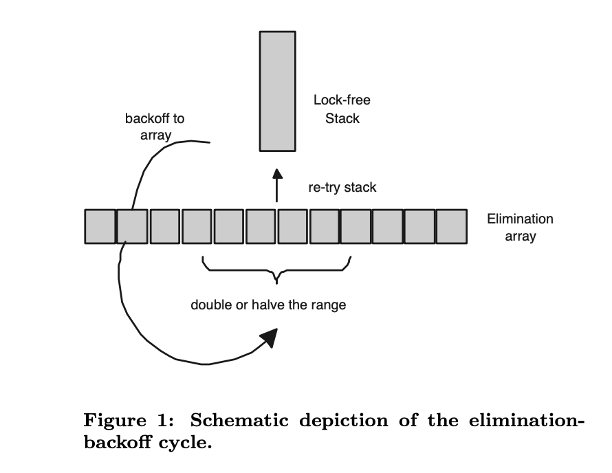
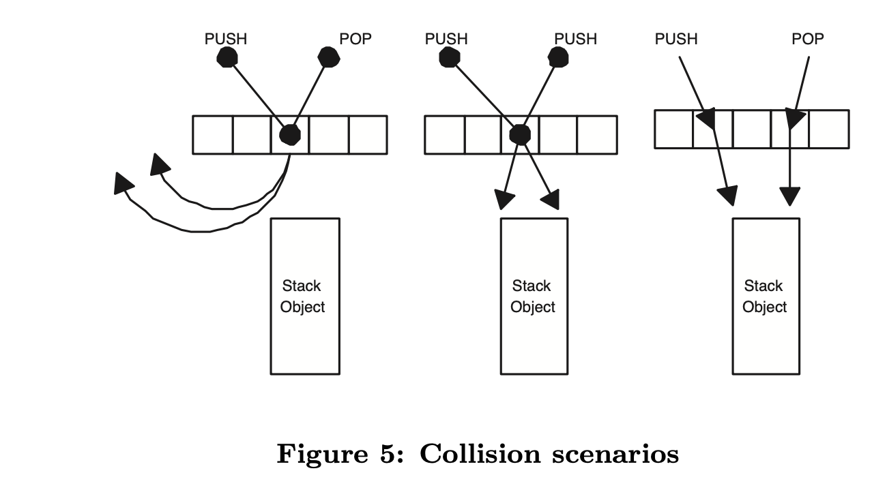

# A Scalable Lock-free Stack Algorithm
> Danny Hendler, Nir SHavit, Lena Yerushalmi

## Abstract
The literature describes two high performance concurrent stack algorithms based on combining funnels and elimination trees. Unfortunately, the funnels are linearizable but blocking, and the elimination trees are non-blocking but not linearizable. Neither is used in practice since they perform well only at exceptionally high loads. The literature also describes a simple lock-free linearizable stack algorithm that works at low loads but does not scale as the load increases. The question of designing a stack algorithm that is non-blocking, linearizable, and scales well throughout the concurrency range, has thus remained open.

文献描述了两种基于漏斗树和消除树相结合的高性能并发栈算法。不幸的是，漏斗是可线性化但阻塞的，而消除树是非阻塞但不可线性化的。两者都没有在实践中使用，因为它们仅在极高负载下表现良好。文献还描述了一种简单的无锁线性化堆栈算法，该算法在低负载下工作，但不会随着负载的增加而扩展。因此，设计一个非阻塞、可线性化且在整个并发范围内具有良好扩展性的堆栈算法的问题仍然是一个悬而未决的问题。

This paper presents such a concurrent stack algorithm. It is based on the following simple observation: that a single elimination array used as a backoff scheme for a simple lock-free stack is lock-free, linearizable, and scalable. As our empirical results show, the resulting elimination-backoff stack performs as well as the simple stack at low loads, and increasingly outperforms all other methods (lock-based and non-blocking) as concurrency increases. We believe its simplicity and scalability make it a viable practical alternative to existing constructions for implementing concurrent stacks.

本文提出了这样一种并发的栈算法。它基于以下简单的观察：一个单一的消除数组作为简单的无锁栈的退避方案是无锁的、可线性化的和可扩展的。正如我们的经验结果所显示的，所产生的消除-退避堆栈在低负载时的表现与简单的栈一样好，并且随着并发性的增加，越来越优于所有其他方法（基于锁和非阻塞）。我们相信它的简单性和可扩展性使其成为实现并发栈的现有结构的一个可行的实际替代方案。

## 1 Introduction
Shared stacks are widely used in parallel applications and operating systems. As shown in, LIFO-based scheduling not only reduces excessive task creation, but also prevents threads from attempting to dequeue and execute a task which depends on the results of other tasks. A concurrent shared stack is a data structure that supports the usual push and pop operations with linearizable LIFO semantics. Linearizability guarantees that operations appear atomic and can be combined with other operations in a modular way.

共享栈广泛应用于并行应用程序和操作系统中。如中所示，基于后进先出的调度不仅减少了过多的任务创建，而且还防止线程尝试退出队列并执行依赖于其他任务结果的任务。并发共享堆栈是一种数据结构，支持具有线性化后进先出语义的常用推送和弹出操作。线性化保证了操作具有原子性，并且可以以模块化的方式与其他操作组合。

When threads running a parallel application on a shared memory machine access the shared stack object simultaneously, a synchronization protocol must be used to ensure correctness. It is well known that concurrent access to a single object by many threads can lead to a degradation in performance. Therefore, in addition to correctness, synchronization methods should offer efficiency in terms of scalability and robustness in the face of scheduling constraints. Scalability at high loads should not however come at the price of good performance in the more common low contention cases.

当在共享内存机器上运行并行应用程序的线程同时访问共享栈对象时，必须使用同步协议来确保正确性。众所周知，多线程并发访问单个对象会导致性能下降。因此，除了正确性之外，同步方法还应该在可伸缩性和健壮性方面提供效率，以应对调度约束。然而，在更常见的低争用情况下，高负载下的可伸缩性不应以良好性能为代价。

Unfortunately, the two known methods for parallelizing shared stacks do not meet these criteria. The combining funnels of Shavit and Zemach are linearizable LIFO stacks that offer scalability through combining, but perform poorly at low loads because of the combining overhead. They are also blocking and thus not robust in the face of scheduling constraints. The elimination trees of Shavit and Touitou are non-blocking and thus robust, but the stack they provide is not linearizable, and it too has large overheads that cause it to perform poorly at low loads. On the other hand, the results of Michael and Scott show that the best known low load method, the simple linearizable lock-free stack of Treiber, scales poorly due to contention and an inherent sequential bottleneck.

不幸的是，用于并行化共享栈的两种已知方法不符合这些标准。Shavit 和 Zemach 的组合漏斗是可线性化的后进先出栈，通过组合提供可伸缩性，但由于组合开销，在低负载下性能较差。它们也是阻塞的，因此在面对调度约束时并不健壮。Shavit 和 Touitou 的消除树是非阻塞的，因此是健壮的，但是它们提供的堆栈是不可线性化的，并且它也有很大的开销，这导致它在低负载下性能不佳。另一方面，Michael 和 Scott 的结果表明，最著名的低负载方法，Treiber 的简单线性化无锁堆栈，由于争用和固有的顺序瓶颈，扩展性较差。

This paper presents the elimination backoff stack, a new concurrent stack algorithm that overcomes the combined drawbacks of all the above methods. The algorithm is linearizable and thus easy to modularly combine with other algorithms, it is lock-free and hence robust, it is parallel and hence scalable, and it utilizes its parallelization construct adaptively, which allows it to perform well at low loads. The elimination backoff stack is based on the following simple observation: that a single elimination array, used as a backoff scheme for a lock-free stack, is both lock-free and linearizable. The introduction of elimination into the backoff process serves a dual purpose of adding parallelism and reducing contention, which, as our empirical results show, allows the elimination-backoff stack to outperform all algorithms in the literature at both high and low loads. We believe its simplicity and scalability make it a viable practical alternative to existing constructions for implementing concurrent stacks.

本文提出了一种新的并行堆栈算法——消除回退堆栈，它克服了上述方法的综合缺点。该算法是可线性化的，因此易于与其他算法模块化组合，它是无锁的，因此具有鲁棒性，它是并行的，因此具有可扩展性，并且它自适应地利用其并行结构，这使得它能够在低负载下表现良好。消除回退堆栈基于以下简单观察：单个消除数组（用作无锁栈的回退方案）是无锁且可线性化的。在退避过程中引入消除具有增加并行性和减少争用的双重目的，正如我们的实证结果所示，这使得消除退避栈在高负载和低负载下都优于文献中的所有算法。我们相信它的简单性和可扩展性使它成为实现并发栈的现有构造的可行的实用替代方案。

### 1.1 Background
Generally, algorithms for concurrent data structures fall into two categories: blocking and non-blocking. There are several lock-based concurrent stack implementations in the literature. Typically, lock-based stack algorithms are expected to offer limited robustness as they are susceptible to long delays and priority inversions.

通常，并发数据结构的算法分为两类：阻塞和非阻塞。文献中有几种基于锁的并发栈实现。通常，基于锁的栈算法预计会提供有限的鲁棒性，因为它们容易受到长延迟和优先级反转的影响。

Treiber proposed the first non-blocking implementation of concurrent list-based stack. He represented the stack as a singly-linked list with a top pointer and used compare-and-swap (CAS) to modify the value of the top atomically. No performance results were reported by Treiber for his nonblocking stack. Michael and Scott in compared Treiber’s stack to an optimized non-blocking algorithm based on Herlihy’s general methodology, and to lock-based stacks. They showed that Treiber’s algorithm yields the best overall performance, and that the performance gap increases as the amount of multiprogramming in the system increases. However, from their performance data it is clear that because of its inherent sequential bottleneck, the Treiber stack offers little scalability.

Treiber 提出了第一个基于并发列表的栈的非阻塞实现。他将栈表示为带有顶部指针的单链表，并使用比较和交换（CAS）以原子方式修改顶部的值。Treiber 没有报告其非阻塞栈的性能结果。Michael 和 Scott 将 Treiber 的栈与基于 Herlihy 一般方法的优化非阻塞算法以及基于锁的栈进行了比较。他们表明，Treiber 算法的总体性能最好，性能差距随着系统中多道程序数量的增加而增大。然而，从他们的性能数据可以清楚地看出，由于固有的顺序瓶颈，Treiber 堆栈提供的可伸缩性很小。

Shavit and Touitou introduced elimination trees, scalable tree like data structures that behave “almost” like stacks. Their elimination technique (which we will elaborate on shortly as it is key to our new algorithm) allows highly distributed coupling and execution of operations with reverse semantics like the pushes and pops on a stack. Elimination trees are lock-free, but not linearizable. In a similar fashion, Shavit and Zemach introduced combining funnels, and used them to provide scalable stack implementations. Combining funnels employ both combining [5, 6] and elimination to provide scalability. They improve on elimination trees by being linerarizable, but unfortunately they are blocking. As noted earlier, both and are directed at high-end scalability, resulting in overheads which severely hinder their performance under low loads.

Shavit 和 Touitou 引入了消除树（elimination trees），这是一种可伸缩的树状数据结构，其行为“几乎”像栈。它们的消除技术（我们将很快详细介绍，因为它是我们新算法的关键）允许高度分布式耦合和操作的执行，具有相反的语义，如栈上的 push 和 pops。消除树是无锁的，但不能线性化。以类似的方式，Shavit 和 Zemach 引入了组合漏斗，并使用它们提供可伸缩的栈实现。组合漏斗采用组合和消除来提供可伸缩性。它们通过线性化改进了消除树，但不幸的是它们被阻塞了。如前所述，和都是针对高端可扩展性的，这导致了开销，严重影响了它们在低负载下的性能。

The question of designing a practical lock-free linearizable concurrent stack that will perform well at both high and low loads has thus remained open.

因此，设计一个在高负载和低负载下都能很好运行的实用无锁线性化并发栈的问题仍然没有解决。

### 1.2 The New Algorithm
Consider the following simple observation due to Shavit and Touitou: if a push followed by a pop are performed on a stack, the data structure’s state does not change (similarly for a pop followed by a push). This means that if one can cause pairs of pushes and pops to meet and pair up in separate locations, the threads can exchange values without having to touch a centralized structure since they have anyhow “eliminated” each other’s effect on it. Elimination can be implemented by using a collision array in which threads pick random locations in order to try and collide. Pairs of threads that “collide” in some location run through a lock-free synchronization protocol, and all such disjoint collisions can be performed in parallel. If a thread has not met another in the selected location or if it met a thread with an operation that cannot be eliminated (such as two push operations), an alternative scheme must be used. In the elimination trees of, the idea is to build a tree of elimination arrays and use the diffracting tree paradigm of Shavit and Zemach to deal with non-eliminated operations. However, as we noted, the overhead of such mechanisms is high, and they are not linearizable.

考虑以下 Shavit 和 Touitou 的简单观察：如果在堆栈上执行 push，紧跟着 pop，则数据结构的状态不会改变（类似于 pop 和 push）。这意味着，如果一对推送和弹出可以在不同的位置相遇和配对，那么线程可以交换值，而不必接触集中式结构，因为它们无论如何都“消除”了彼此对它的影响。消除可以通过使用冲突数组来实现，在该数组中，线程选择随机位置以尝试和冲突。在某个位置“碰撞”的线程对通过无锁同步协议运行，所有这些不相交的碰撞都可以并行执行。如果一个线程在所选位置没有遇到另一个线程，或者它遇到了一个具有无法消除的操作（例如两个推送操作）的线程，则必须使用替代方案。在消除树中，想法是建立消除数组树，并使用 Shavit 和 Zemach 的衍射树范式处理非消除操作。然而，正如我们所注意到的，这种机制的开销很高，并且它们不能线性化。

The new idea (see Figure 1) in this paper is strikingly simple: use a single elimination array as a backoff scheme on a shared lock-free stack. If the threads fail on the stack, they attempt to eliminate on the array, and if they fail in eliminating, they attempt to access the stack again and so on. The surprising result is that this structure is linearizable: any operation on the shared stack can be linearized at the access point, and any pair of eliminated operations can be linearized when they met. Because it is a back-off scheme, it delivers the same performance as the simple stack at low loads. However, unlike the simple stack it scales well as load increases because (1) the number of successful eliminations grows, allowing many operations to complete in parallel, and (2) contention on the head of the shared stack is reduced beyond levels achievable by the best exponential backoff schemes [1] since scores of backed off operations are eliminated in the array and never re-attempt to access the shared structure.

本文的新想法（见图 1 ）非常简单：在一个共享的无锁堆栈上使用一个单一的消除数组作为退避方案。如果线程在栈上失败了，它们就试图在数组上消除，如果它们消除失败了，它们就试图再次访问栈，如此反复。令人惊讶的结果是，这种结构是可线性化的：共享堆栈上的任何操作都可以在访问点上线性化，任何一对消除的操作在相遇时都可以线性化。因为它是一个退避方案，所以它在低负载时能提供与简单堆栈相同的性能。然而，与简单堆栈不同的是，随着负载的增加，它的扩展性很好，因为（1）成功消除的数量增加，允许许多操作并行完成，以及（2）共享堆栈头部的争用减少，超过了最好的指数退避方案所能达到的水平，因为几十个退避操作在数组中被消除了，永远不会再尝试访问共享结构。



### 1.3 Performance
We compared our new elimination-backoff stack algorithm to a lock-based implementation using Mellor-Crummey and Scott’s MCS-lock and to several non-blocking implementations: the linearizable Treiber algorithm with and without backoff and the elimination tree of Shavit and Touitou. Our comparisons were based on a collection of synthetic microbenchmarks executed on a 14-node shared memory machine. Our results, presented in Section 4, show that the elimination-backoff stack outperforms all three methods, and specifically the two lock-free methods, exhibiting almost three times the throughput at peak load. Unlike the other methods, it maintains constant latency throughout the concurrency range, and performs well also in experiments with unequal ratios of pushs and pops.

我们将新的消除回退堆栈算法与使用 Mellor Crummey 和 Scott 的 MCS 锁的基于锁的实现以及几种非阻塞实现进行了比较：带和不带回退的线性化 Treiber 算法以及 Shavit 和 Touitou 的消除树。我们的比较基于一组在14 节点共享内存机器上执行的合成微基准。我们的结果（见第 4 节）表明，消除回退栈优于所有三种方法，特别是两种无锁方法，在峰值负载下表现出几乎三倍的吞吐量。与其他方法不同，它在整个并发范围内保持恒定的延迟，并且在不同推送和弹出比率的实验中也表现良好。

The remainder of this paper is organized as follows. In the next section we describe the new algorithm in depth. In Section 3, we give the sketch of adaptive strategies we used in our implementation. In Section 4, we present our empirical results. Finally, in Section 5, we provide a proof that our algorithm has the required properties of a stack, is linearizable, and lock-free.

本文的其余部分组织如下。在下一节中，我们将深入描述新算法。在第 3 节中，我们给出了我们在实现中使用的自适应策略的草图。在第 4 节中，我们给出了我们的实证结果。最后，在第 5 节中，我们证明了我们的算法具有堆栈所需的属性、可线性化和无锁。

## 2 The Elimination Backoff Stack

### 2.1 Data Structures
We now present our elimination backoff stack algorithm. Figure 2 specifies some type definitions and global variables.

我们现在介绍我们的消除回退栈算法。图 2 指定了一些类型定义和全局变量。

```
    struct Cell {
        Cell *pnext;
        void *pdata;
    };

    struct ThreadInfo {
        u_int id;
        char op;
        Cell cell;
        int spin;
    };

    struct Simple_Stack {
        Cell *ptop;
    };

    Simple_Stack S;
    void **location;
    int *collision;

    Figure 2: Types and Structures
```

Our central stack object follows Treiber and is implemented as a singly-linked list with a top pointer. The elimination layer follows Shavit and Touitou and is built of two arrays: a global location[1..n] array has an element per thread p ∈ {1..n}, holding the pointer to the ThreadInfo structure, and a global collision[1..size] array, that holds the ids of the threads trying to collide. Each ThreadInfo record contains the thread id, the type of the operation to be performed by the thread (push or pop), and the node for the operation. The spin variable holds the amount of time the thread should delay while waiting to collide.

我们的主要堆栈对象遵循 Treiber，实现为带有顶部指针的单链表。消除层位于 Shavit 和 Touitou 之后，由两个数组组成：全局位置 [1..n] 数组每个线程有一个元素 p ∈ {1..n}，包含指向 ThreadInfo 结构的指针，以及一个全局冲突 [1..size] 数组，该数组包含试图冲突的线程的ID。

### 2.2 Elimination Backoff Stack Code
```
       void StackOp(ThreadInfo* pInfo) {
P1:        if (TryPerformStackOp(p) == FALSE)
P2:            LesOP(p);
P3:        return;
       }

       void LesOp(ThreadInfo *p) {
S1:        while (1) {
S2:            location[mypid] = p;
S3:            pos = GetPosition(p);
S4:            him = collision[pos];
S5:            while(!CAS(&collision[pos], him, mypid))
S6:                him = collision[pos];
S7:            if (him != EMPTY) {
S8:                q = location[him];
S9:                if (q != NULL && q->id == him && q->op != p->op) {
S10:                    if (CAS(&location[mypid], p, NULL)) {
S11:                        if (TryCollision(p, q) == TRUE)
S12:                            return;
S13:                        else 
S14:                            goto stack;
                        }
S15:                    else {
S16:                        FinishCollision(p);
S17:                        return;
                        }
                    }
                }
S18:            delay(p->spin);
S19:            if (!CAS(&location[mypid], p, NULL)) {
S20:                FinishCollision(p);
S21:                return;
                }
        stack:
S22:            if (TryPerformStackOp(p) == TRUE)
                    return;
            }
        }

        boolean TryPerformStackOp(ThreadInfo *p) {
            Cell *phead, *pnext;
T1:        if (p->op == PUSH) {
T2:            phead = S.ptop;
T3:            p->cell.pnext = phead;
T4:            if (CAS(&S.ptop, phead, &p->cell))
T5:                return TRUE;
T6:            else 
T7:                return FALSE;
            }

T8:        if (p->op == POP) {
T9:            phead = S.ptop;
T10:            if (phead == NULL) {
T11:                p->cell = EMPTY;
T12:                return TRUE;
                }
T13:            pnext = phead->pnext;
T14:            if (CAS(&S.ptop, phead, pnext)) {
T15:                p->cell = *phead;
T16:                return TRUE;
                }
T17:            else {
T18:                p->cell = EMPTY;
T19:                return FALSE;
                }
            }
        }

        void FinishCollision(ProcessInfo *p) {
F1:         if (p->op == POP_OP) {
F2:             p->pcell = location[mypid]->pcell;
F3:             location[mypid] = NULL;
            }
        }

    Figure 3: Elimination Backoff Stack Code - part1
```

```
    void TryCollision(ThreadInfo *p, ThreadInfo *q) {
        if (p->op == PUSH) {
            if (CAS(&location[him], q, p))
                return TRUE;
            else 
                return FALSE;
        }
        
        if (p->op == POP) {
            if (CAS(&location[him], q, NULL)) {
                p->cell = q->cell;
                location[mypid] = NULL;
                return TRUE
            }
            else
                return FALSE;
        }
    }

    Figure 4: Elimination Backoff Stack Code - part 2
```

We now provide the code of our algorithm. It is shown in Figures 3 and 4. As can be seen from the code, first each thread tries to perform its operation on the central stack object (line P1). If this attempt fails, a thread goes through the collision layer in the manner described below.

我们现在提供算法的代码。如图 3 和图 4 所示。从代码中可以看出，首先每个线程尝试在中央栈对象上执行其操作（第 P1 行）。如果此尝试失败，线程将以下面描述的方式穿过冲突层。

Initially, thread p announces its arrival at the collision layer by writing its current information to the location array (line S2). It then chooses the random location in the collision array (line S3). Thread p reads into him the id of the thread written at collision[pos] and tries to write its own id in place (lines S4 and S5). If it fails, it retries until success (lines S5 and S6).

最初，线程 p 通过将其当前信息写入 location 数组（第 S2 行）来宣布其到达碰撞层。然后选择碰撞数组中的随机位置（第 S3 行）。线程 p 读入在 collsion[pos] 处写入的线程 id，并尝试将其自己的 id 写入到位（第 S4 行和第 S5 行）。如果失败，则重试直到成功（第 S5 行和第 S6 行）。



After that, there are three main scenarios for thread actions, according to the information the thread has read. They are illustrated in Figure 5. If p reads an id of the existing thread q (i.e., him != EMPTY), p attempts to collide with q. The collision is accomplished by p first executing a read operation (line S8) to determine the type of the thread being collided with. As two threads can collide only if they have opposing operations, if q has the same operation as p, p waits for another collision (line S18). If no other thread collides with p during its waiting period, p clears its entry in the location array and tries to perform its operation on the central stack object. If p’s entry cannot be cleared, it follows that p has been collided with, in which case p completes its operation and returns.

然后，根据线程读取的信息，线程操作有三个主要场景。它们如图 5 所示。如果 p 读取现有线程 q 的 id（即，him != EMPTY），p 尝试与 q 冲突。冲突通过 p 首先执行读取操作（行 S8）来完成，以确定与之冲突的线程的类型。由于两个线程只有在具有相反的操作时才可能发生冲突，因此如果 q 与 p 具有相同的操作，p 将等待另一个冲突（第 S18 行）。如果在等待期间没有其他线程与 p 发生冲突，p 将清除其在位置数组中的条目，并尝试在中央堆栈对象上执行其操作。如果 p 的条目不能被清除，则表明 p 已被碰撞，在这种情况下，p 完成其操作并返回。

If q does have a complementary operation, p tries to eliminate by performing two CAS operations on the location array. The first clears p’s entry, assuring no other thread will collide with it during its collision attempt (this eliminates race conditions). The second attempts to mark q’s entry as “collided with p”. If both CAS operations succeed, the collision is successful. Therefore p can return (in case of a pop operation it stores the value of the popped cell).

如果 q 确实有一个互补运算，p 尝试通过对位置阵列执行两个 CAS 运算来消除。第一个清除 p 的条目，确保在其冲突尝试期间没有其他线程与它冲突（这消除了争用条件）。第二次尝试将 q 的条目标记为“与 p 碰撞”。如果两个CAS 操作都成功，则冲突成功。因此 p 可以返回（在 pop 操作的情况下，它存储弹出单元格的值）。

If the first CAS fails, it follows that some other thread r has already managed to collide with p. In that case the thread p acts as in case of a successful collision, mentioned above. If the first CAS succeeds but the second fails, then the thread with whom p is trying to collide is no longer available for collision. In that case, p tries to perform the operation on the central stack object, returns in case of suc- cess, and repeatedly goes through the collision layer in case of failure.

如果第一个 CAS 失败，那么其他一些线程 r 已经成功地与 p 冲突。在这种情况下，线程 p 的行为与上面提到的成功冲突的情况相同。如果第一个 CAS 成功，但第二个 CAS 失败，则 p 尝试与之碰撞的线程将不再可用于碰撞。在这种情况下，p 尝试对中央堆栈对象执行操作，成功时返回，失败时重复通过冲突层。

### 2.3 Memory Management and ABA Issues
In our implementation we use a very simple memory management mechanism - a pool of cells available for restricted use (similar to the pool introduced in [22]). When a thread needs a cell to perform a push operation on a stack, it removes a cell from the pool and uses it. When a thread pops a cell from the stack, it returns the cell to the pool. Note that the cells are returned only by threads that performed pop operations, thus insuring correctness in lines C8 and F2. Without this assumption we would need to copy the contents of the cell and not just its address. Though outside the scope of this paper, we note that one can use techniques such as those of Trieber, or more general techniques such as SMR or ROP, to detect when a cell in the pool can be reused.

在我们的实现中，我们使用了一个非常简单的内存管理机制—一个可供限制使用的单元池（类似于[22]中介绍的池）。当线程需要一个单元格来对堆栈执行推送操作时，它会从池中删除一个单元格并使用它。当线程从堆栈中弹出一个单元格时，它会将该单元格返回到池中。请注意，单元格仅由执行 pop 操作的线程返回，从而确保第 C8 行和第 F2 行的正确性。如果没有这个假设，我们将需要复制单元格的内容，而不仅仅是它的地址。虽然超出了本文的范围，但我们注意到可以使用 Trieber 等技术，或者更通用的技术，如 SMR 或 ROP，来检测池中的单元何时可以重用。

As our algorithm is based on the compare-and-swap (CAS) operation, it must deal with the “ABA problem”. If a thread reads the top of the stack, computes a new value, and then attempts a CAS on the top of the stack, the CAS may succeed when it should not, if between the read and the CAS some other thread(s) change the value to the previous one again. The simplest and most common ABA-prevention mechanism is to include a tag with the target memory location such that both are manipulated together atomically, and the tag is incremented with updates of the target location. The CAS operation is sufficient for such manipulation, as most current architectures that support CAS (Intel x86, Sun SPARC) support their operation on aligned 64-bit blocks. One can also use general techniques to eliminate ABA issues through memory managements such as SMR or ROP.

由于我们的算法基于比较和交换（CAS）操作，因此必须处理“ABA问题”。如果线程读取堆栈顶部，计算一个新值，然后尝试在堆栈顶部执行 CAS，则 CAS 可能会在不应该的情况下成功，如果在读取和 CAS 之间有其他线程将该值再次更改为上一个值。最简单也是最常见的 ABA 预防机制是包含一个带有目标内存位置的标记，这样两个标记都可以一起进行原子操作，并且标记会随着目标位置的更新而增加。CAS 操作足以进行此类操作，因为大多数支持 CAS 的当前体系结构（Intel x86、Sun SPARC）都支持在对齐的 64 位块上进行操作。还可以使用通用技术通过内存管理（如 SMR 或 ROP）来消除 ABA 问题。

## 3 Adaptative elimination backoff
The classical approach to handling load is backoff, and specifically exponential backoff. In a regular backoff scheme, once contention in detected on the central stack, threads back off in time. Here, threads will back off in both time and space, in an attempt to both reduce the load on the centralized data structure and to increase the probability of concurrent colliding. Our backoff parameters are thus the width of the collision layer, and the delay at the layer.

处理负载的经典方法是退避，特别是指数退避。在一个常规的后退方案中，一旦检测到中央栈上的竞争，线程就会及时后退。在这里，线程在时间和空间上都会后退，以试图减少集中式数据结构的负载，并增加并发碰撞的概率。因此，我们的退避参数是碰撞层的宽度，以及碰撞层的延迟。

The elimination backoff stack has a simple structure that naturally fits with a localized adaptive policy for setting parameters similar to the strategy used by Shavit and Zemach for combining funnels in. Decisions on parameters are made locally by each thread, and the collision layer does not actually grow or shrink. Instead, each thread independently chooses a subrange of the collision layer it will map into, centered around the middle of the array, and limited by the maximal array width. It is possible for threads to have different ideas about the collision layer’s width, and particulary bad scenarios might lead to bad performance, but as we will show, the overall performance is superior to that of exponential backoff schemes. Our policy is to first attempt to access the central stack object, and only if that fails to back off to the elimination array. This allows us, in case of low loads, to avoid the collision array altogether, thus achieving the latency of a simple stack (in comparison, are at best three times slower than a simple stack).

消除退避栈有一个简单的结构，自然适合于设置参数的局部自适应策略，类似于 Shavit 和 Zemach 用于组合漏斗的策略。关于参数的决定是由每个线程在本地做出的，并且碰撞层实际上并没有增长或缩小。相反，每个线程独立地选择它将映射到的碰撞层的一个子范围，以数组的中间为中心，并受最大数组宽度的限制。线程有可能对碰撞层的宽度有不同的想法，特别糟糕的情况可能会导致糟糕的性能，但正如我们将显示的，整体性能优于指数退避方案。我们的策略是首先尝试访问中央栈对象，只有在失败时才退到消除阵列。这使得我们在低负载的情况下，可以完全避免碰撞数组，从而实现简单堆栈的延迟（相比之下，最多比简单堆栈慢三倍）。

One way of adaptively changing the width of the collision layer is the following. Each thread t keeps a value, 0 < factor < 1, by which it multiplies the collision layer width to choose the interval into which it will randomly map to try and collide (e.g. if factor=0.5 only half the width is used). When t fails to collide because it did not encounter another thread, it increments a private counter. When the counter exceeds some limit, factor is halved, and the counter is being reset to its initial value. If, on the other hand, t encountered some other thread u, performing an opposite operation-type, but fails to collide with it (the most probable reason being that some other thread v succeeded in colliding with u before t), the counter is being decremented, and when it reaches 0, factor is doubled, and the counter is being reset to its initial value.

适应性地改变碰撞层宽度的一种方法是如下。每个线程 t 保持一个值，0 < 因子 < 1，它乘以碰撞层的宽度来选择它将随机映射到的区间来尝试碰撞（例如，如果因子 = 0.5，只使用一半的宽度）。当 t 因为没有遇到另一个线程而碰撞失败时，它就会增加一个私有计数器。当计数器超过某个极限时，因子减半，计数器被重置为其初始值。另一方面，如果 t 遇到了其他线程 u，执行了一个相反的操作类型，但未能与之碰撞（最可能的原因是其他线程 v 在 t 之前成功地与 u 碰撞），计数器被递减，当它达到0时，因子被加倍，并且计数器被重置为其初始值。

The second part of our strategy is the dynamic update of the delay time for attempting to collide in the array, a technique used by Shavit and Zemach for diffracting trees in. One way of doing that is the following. Each thread t keeps a value spin which holds the amount of time that t should delay while waiting to be collided. The spin value may change within a predetermined range. When t successfully collides, it increments a local counter. When the counter exceeds some limit, t doubles spin. If t fails to collide, it decrements the local counter. When the counter decreases bellow some limit, spin is halved. This localized version of exponential backoff serves a dual role: it increases the chance of successful eliminations, and it plays the role of a backoff mechanism on the central stack structure.

我们策略的第二部分是动态更新试图在数组中碰撞的延迟时间，这是 Shavit 和 Zemach 用于衍射树中的技术。做到这一点的一个方法是如下。每个线程 t 都保持一个值 spin，它持有 t 在等待被碰撞时应该延迟的时间量。自旋值可以在一个预定的范围内变化。当 t 成功碰撞时，它会增加一个本地计数器。当计数器超过某个限制时，t 将自旋加倍。如果 t 碰撞失败，它就递减本地计数器。当计数器减少到某个极限时，自旋就减半了。这种指数退避的局部版本有双重作用：它增加了成功消除的机会，并在中央栈结构上发挥了退避机制的作用。

There are obviously other conceivable ways of adaptively updating these parameters, and this is a subject for further research.

显然还有其他可想而知的适应性更新这些参数的方法，这是一个有待进一步研究的课题。

## 4 Performance
 (暂缓) 

## 5 Correctness Proof
（暂缓）