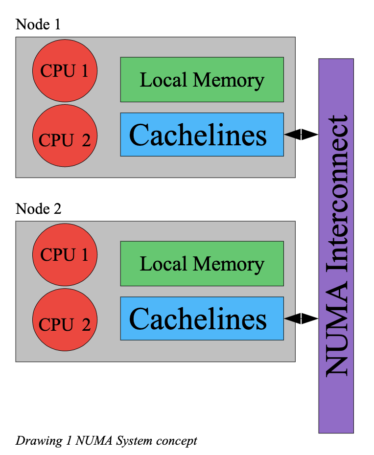
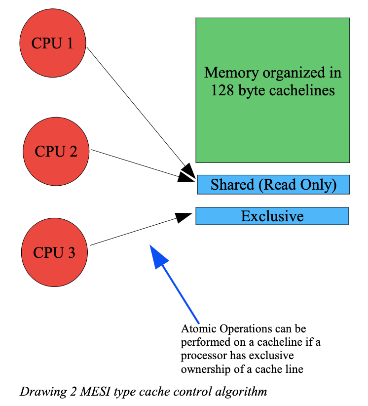
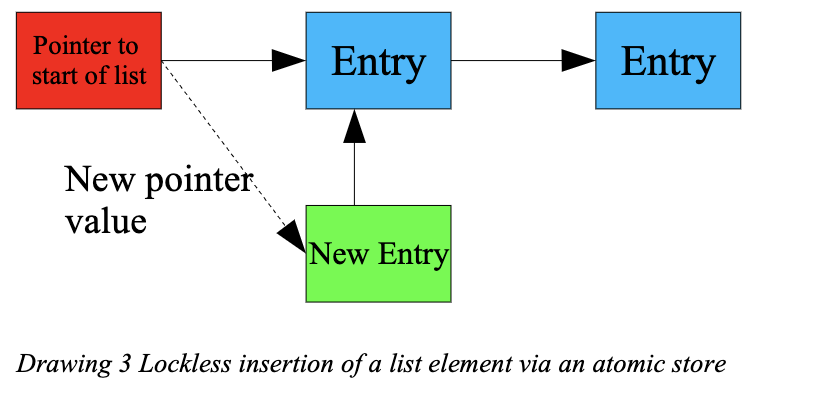
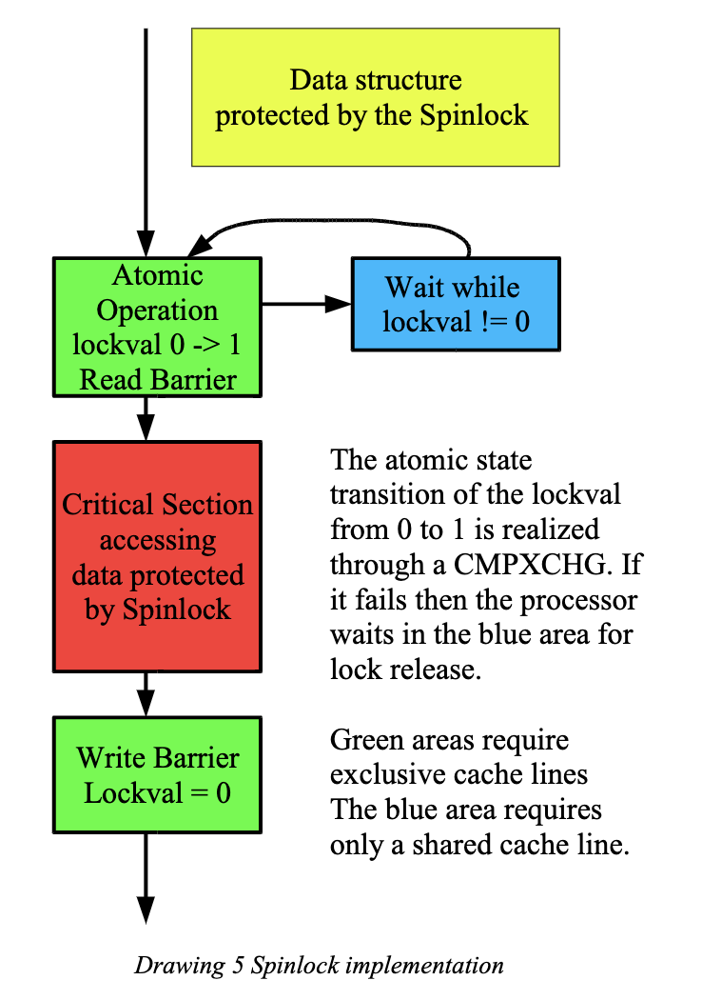
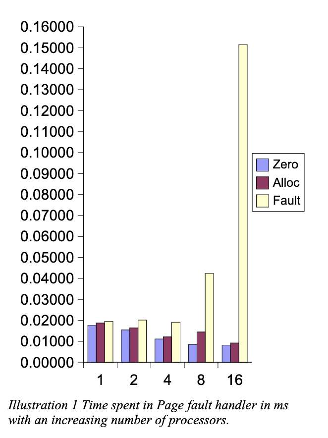

# Effective Synchronization on Linux/NUMA Systems
> by Gelato Conference 2005

Effective locking is necessary for satisfactory performance on large Itanium based NUMA systems. Synchronization of parallel executing streams on NUMA machines is currently realized in the Linux kernel through a variety of mechanisms which include atomic operations, locking and ordering of memory accesses. Various synchronization methods may also be combined in order to increase performance. The talk presents the realization of basic synchronization in Linux on Itanium and then investigates more complex locking schemes.

在基于 Itanium 的大型 NUMA 系统上，有效的锁定对于满意的性能是必要的。NUMA 机器上并行执行流的同步目前在 Linux 内核中通过各种机制实现，包括原子操作、锁定和内存访问的排序。各种同步方法也可以结合起来，以提高性能。本讲座介绍了 Linux 在 Itanium 上实现基本同步的情况，然后研究了更复杂的锁定方案。

The current Linux locking mechanisms rely heavily on a simple spinlock implementation that may be fitting for systems of up to 8 processors. However, spinlocks cause excessive cache line bouncing if more processors are contending for a lock. Some approaches that have so far been made to solve the contention issue are presented and it is then suggested to use an implementation for Linux   of the approach first proposed by Zoran Radovic which he called "Hierarchical Backoff Locks".

目前的 Linux 锁定机制在很大程度上依赖于一个简单的自旋锁实现，它可能适合于多达 8 个处理器的系统。然而，如果有更多的处理器在争夺一个锁的话，自旋锁会引起过多的缓存线跳动。本文介绍了迄今为止为解决争夺问题而采取的一些方法，然后建议在 Linux 中使用 Zoran Radovic 首次提出的方法，他称之为 "分层退锁"。

[TOC]

## Introduction
It seems that the computing industry has hit a wall improving the speed of processors through increasing the clock frequency of the processor. Current technology leads to temperature problems at high clock rates. Heat problems are now effectively limiting the ability to increase the number of cycles a processor can process. The way to further increase the computing speed of processors is by parallelizing processing. The Itanium instruction set was already designed with such parallelization in mind. However, mainstream computers use IA32 compatible hardware and are designed for an instruction set not optimized for parallelization. The best solution to parallelize processing is to put multiple processors on one chip. Intel and AMD have now begun to ship multi-core processors. Itanium multi-core chips are also expected later in 2005.

似乎计算行业已经碰壁，通过提高处理器的时钟频率来提高处理器的速度。目前的技术导致了高时钟频率下的温度问题。热量问题现在有效地限制了增加处理器可以处理的周期数量的能力。进一步提高处理器计算速度的方法是通过并行化处理。Itanium 指令集的设计已经考虑到了这种并行化。然而，主流计算机使用的是与 IA32 兼容的硬件，其设计的指令集没有针对并行化进行优化。并行处理的最佳解决方案是将多个处理器放在一个芯片上。英特尔和 AMD 现在已经开始出货多核处理器。预计 2005 年晚些时候，Itanium 多核芯片也会出现。

Multi-core processors have significant implications for operating software design since the overwhelming number of systems sold in the future can be reasonably expected to be equipped with multi-core processors. Multi-core processors typically have the characteristics of a NUMA system since communication between the cores on the processor chip (and maybe memory directly connected to one core) is more efficient than off-chip communication to other processors and otherwise connected memory. The AMD multi-core design uses core specific memory and I/O controllers leading to varying memory access times depending on which core in a processor is used to access memory. These characteristics are typical for NUMA systems. It is likely that the number of processors on a chip will increase rapidly. IBM already has a chip with 9 (sort of) processors and other vendors seem to be planning processors with 4 and 8 cores. Effective synchronization algorithms that function well on NUMA systems may become an important core requirement in operating systems. So the issues that SGI has been dealing with all along are likely to occur in the standard hardware of the future.

多核处理器对操作软件的设计有重大影响，因为可以合理地预期未来销售的绝大多数系统都会配备多核处理器。多核处理器通常具有 NUMA 系统的特点，因为处理器芯片上的内核之间的通信（也许还有直接连接到一个内核的存储器）比与其他处理器和其他连接的存储器的片外通信更有效率。AMD 公司的多核设计使用特定内核的内存和 I/O 控制器，导致不同的内存访问时间，这取决于处理器中的哪个内核被用来访问内存。这些特征是NUMA 系统的典型特征。芯片上的处理器数量可能会迅速增加。IBM 公司已经有了一个具有 9 个（类似）处理器的芯片，其他供应商似乎也在计划具有 4 个和 8 个内核的处理器。在 NUMA 系统上运行良好的有效同步算法可能会成为操作系统的一个重要的核心要求。因此，SGI 一直在处理的问题很可能会出现在未来的标准硬件中。

Here we will discuss the existing synchronization mechanism for Itanium processors and their use to implement the various locking mechanisms available in Linux. This will first include a discussion of the nature of atomic operations on Itanium systems, then an investigation of the various primitives used to realize locking, a description of the implementation of Linux kernel locking mechanisms and a discussion of advanced combinations of various locking techniques in order to increase performance. The performance implications of the current locking schemes will be discussed based on results of performance benchmarks done with the page fault handler. The result is that current algorithms are effective only for up to 4 processors. Spinlock contention becomes a scalability problem for larger configurations.

在这里，我们将讨论 Itanium 处理器现有的同步机制，以及利用它们来实现 Linux 中的各种锁定机制。这首先包括讨论 Itanium 系统上原子操作的性质，然后调查用于实现锁定的各种原语，描述 Linux 内核锁定机制的实现，并讨论各种锁定技术的高级组合，以提高性能。将根据用页面故障处理程序做的性能基准测试的结果来讨论当前锁定方案的性能影响。其结果是，目前的算法只对 4 个处理器有效。对于更大的配置，自旋锁的争夺成为一个可扩展性问题。

In the final section we investigate a new way to handle locks first proposed by Zoran Radovic called HBO locks. Performance tests show that his algorithm can address the contention issues arising in a NUMA system with a large number of processors in an more effective way while preserving the efficiency of the existing code for the uncontended case.

在最后一节，我们研究了一种由 Zoran Radovic 首先提出的处理锁的新方法，称为 HBO 锁。性能测试表明，他的算法能够以更有效的方式解决有大量处理器的 NUMA 系统中出现的争用问题，同时保留了现有代码在非争用情况下的效率。

## Basic Atomicity
NUMA systems are basically multiprocessor systems with a hardware cache consistency scheme.2 Access to non local devices and memory is provided via a NUMA interlink designed for high speed inter node communication. However, the speed with which memory may be accessed varies according to the communication distance via the NUMA interlink and the particular hardware characteristics of the device or memory, hence NUMA which means Non-Uniform Memory Architecture.

NUMA 系统基本上是具有硬件缓存一致性方案的多处理器系统。 对非本地设备和内存的访问是通过为高速节点间通信设计的 NUMA 互连提供的。然而，访问内存的速度根据通过 NUMA 互连的通信距离和设备或内存的特定硬件特性而变化，因此 NUMA 意味着非统一内存架构。



The NUMA interlink uses a hardware cache consistency protocol to provide a coherent view of memory in the system as a whole to all processors. The hardware consistency protocol allows access to memory in chunks of a cache line. On the Itanium this cache line size is typically 128 byte. The following diagram shows the concept of a multiprocessor system with a MESI type hardware cache consistency protocol.3 Note that this model is simplified so that we can focus on the characteristics important for locking. A variety of implementations of protocols to obtain consistency over NUMA exists but all NUMA systems that I am currently aware of follow the basic principles that we are using here.

NUMA 互连使用硬件缓存一致性协议，向所有处理器提供系统整体的内存一致性视图。硬件一致性协议允许以高速缓存线的块状形式访问内存。在 Itanium 上，这个高速缓存行的大小通常是 128 字节。下图显示了一个具有 MESI 型硬件缓存一致性协议的多处理器系统的概念。 请注意，这个模型是简化的，这样我们就可以把重点放在对锁定很重要的特征上。在 NUMA上 获得一致性的协议存在多种实现方式，但是目前我所知道的所有NUMA 系统都遵循我们在这里使用的基本原则。

The typical NUMA system contains nodes with a variety of resources. A node usually contains a few processors, some memory and maybe I/O devices. Access from the local processors to local memory is very fast. Access to memory in other nodes is possible through the NUMA interlink but is slower since traffic has to flow across a bus. All memory accesses are managed through the hardware cache consistency protocol to insure a coherent view of memory for all processors in the system.

典型的 NUMA 系统包含有各种资源的节点。一个节点通常包含几个处理器，一些内存，也许还有 I/O 设备。从本地处理器到本地内存的访问是非常快的。通过 NUMA 互连可以访问其他节点的内存，但速度较慢，因为流量必须在总线上流动。所有的内存访问都是通过硬件缓存一致性协议来管理的，以确保系统中所有处理器对内存有一个一致的看法。

A program running on a NUMA system can be optimized by insuring that memory used is local memory. However, if programs are larger than the memory available on a single node or if a program uses  more processors than are available on one node then operation over the interlink becomes necessary. The more use a program makes of the interconnect the more important the speed and the efficient use of the NUMA interlink becomes for the overall performance of the system.

在 NUMA 系统上运行的程序可以通过保证使用的内存是本地内存来进行优化。然而，如果程序大于单个节点上的可用内存，或者程序使用的处理器多于一个节点上的可用处理器，那么通过互连的操作就变得很有必要。程序对互连的使用越多，速度和对 NUMA 互连的有效使用对系统的整体性能就越重要。

### 2.1 Cache lines


Each processor can obtain access to a selection of cache lines via the cache coherency protocol. The contents of the cache line are then locally available through the cache of cache lines in the node. A cache line may be either be acquired as a shared cache line that only allows read access or as an exclusive cache line. An exclusive cache line is resource intensive because it must be guaranteed that no other accesses occur to this cache line while one processor has ownership of the cache line. Write access is only allowed on a cache line that is held with exclusive access otherwise multiple updates could be committed simultaneously to memory. This guarantees a cache line level atomicity of writes across the hardware consistency domain.

每个处理器可以通过高速缓存一致性协议获得对高速缓存行的选择访问。然后，缓存线的内容可以通过节点中的缓存线在本地获得。一个高速缓存线既可以作为只允许读访问的共享高速缓存线，也可以作为独占高速缓存线获得。独占高速缓存线是资源密集型的，因为它必须保证在一个处理器拥有高速缓存线的所有权时，没有其他的访问发生在这个高速缓存线上。只有在独占的高速缓存线上才允许写入，否则就会有多个更新被同时提交到内存。这保证了在硬件一致性域中写的缓存线级别的原子性。

It is therefore useful to organize data structures in such a way that they fit into a cache line. One cache line can then be acquired by a processor and all related data can be processed from the same cache line without any additional memory operations.

因此，以这样的方式组织数据结构，使其适合于一个高速缓存线是非常有用的。然后，一个处理器可以获得一个高速缓存线，所有相关的数据都可以从同一个高速缓存线进行处理，而不需要任何额外的内存操作。

It is advantageous to insure that code uses as many shared cache lines as possible because then multiple nodes may cache in the data locally allowing simultaneous access to the same data. Exclusive cache lines may require negotiations and a transfer across the NUMA link before data may be accessed.

确保代码使用尽可能多的共享缓存线是有利的，因为这样多个节点可以在本地缓存数据，允许同时访问相同的数据。独占的高速缓存线可能需要协商，并在访问数据之前通过 NUMA 链接进行传输。

Conversion of cache lines between shared and exclusive modes are expensive since a shared line may be held by multiple processors. The copies that other processors are holding must be invalidated if one processor wants to hold the line as exclusive. This means that the other processors will have to perform additional operations to reacquire the cache line if they need to access data in the cache line again.

缓存线在共享和独占模式之间的转换是昂贵的，因为一个共享线可能被多个处理器持有。如果一个处理器想持有该行作为独占行，其他处理器持有的副本必须无效。这意味着其他处理器如果需要再次访问缓存行中的数据，就必须执行额外的操作来重新获取缓存行。

If two processors keep reading and writing the same cache line then the exclusive access to the cache line has to be renegotiated again and again. The ownership of the cache line and the content of the cache line seem to bounce back and forth between multiple processors. This is called a bouncing cache line. The constant renegotiation of the ownership of the cache line may cause lots of traffic across the NUMA link which may become a performance bottleneck.

如果两个处理器一直在读写同一个高速缓存行，那么对高速缓存行的排他性访问就必须一次又一次地进行重新协商。缓存线的所有权和缓存线的内容似乎在多个处理器之间来回跳动。这就是所谓的弹跳式缓存线。缓存线所有权的不断重新协商可能会导致 NUMA 链路上出现大量的流量，这可能会成为性能瓶颈。

An atomic read/write cycle of a cache line can potentially be used for atomic changes to memory since a cache line must be held for exclusive access before any write can take place. However, the processor must intentionally perform such an atomic read modify write cycle which requires the use of special atomic semaphore instructions. These bypass most of the typical optimizations performed by a processor. Without the atomic semaphore operations the cache lines may change at any time during the normal flow of processing.

缓存行的原子读/写周期有可能被用于对内存的原子修改，因为在任何写入发生之前，缓存行必须被保持为独占访问。然而，处理器必须有意地执行这样的原子读修改写循环，这需要使用特殊的原子信号指令。这些指令绕过了大部分由处理器执行的典型优化。如果没有原子信号操作，在正常的处理过程中，缓存线可能会随时改变。

### 2.2 Atomic nature of processor operations
The processor interfaces with the cache in a way that guarantees the atomicity of certain operations. For the Itanium the guarantee is that operations up to 64 bit—to properly aligned memory locations—are atomic without any other special measures. This means that if multiple processors attempt to store a 64 bit value to a properly aligned 64 bit memory location then the memory location will later contain the value stored into that location by one or the other processor but will not contain a few bits from one processor and a few bits from another processor. Again note that this behavior is only guaranteed if the 64 bit value is aligned on an 8 byte boundary. A misaligned 64 bit store is not guaranteed to be atomic. Concurrent stores may yield some bytes set by one processor and some by another.

处理器与高速缓存的连接方式保证了某些操作的纯洁性。对于 Itanium 来说，保证 64 位以内的操作到正确对齐的内存位置是原子性的，不需要任何其他特殊措施。这意味着，如果多个处理器试图将一个 64 位的值存储到一个正确对齐的 64 位内存位置，那么该内存位置以后将包含由一个或另一个处理器存储到该位置的值，但不会包含一个处理器的几个位和另一个处理器的几个位。请注意，只有当 64 位的值在 8 个字节的边界上对齐时，才能保证这种行为。一个错位的 64 位存储不能保证是原子性的。并发存储可能会产生一些由一个处理器设置的字节和一些由另一个处理器设置的字节。

Note that the Itanium is capable of handling data structures that are longer than 64 bit (like for example 10 byte floating point numbers or 16 byte stores). These are typically also atomic but special considerations (f.e. Atomicity may not be guaranteed if the write back cache is enabled) may apply for these under some circumstances.5 If these restrictions are not followed then storing two 10 byte floating point numbers concurrently from multiple CPUs may (in some rare cases) yield a mixture of the two.

请注意，Itanium 能够处理长于 64 位的数据结构（例如 10 字节的浮点数或 16 字节的存储）。这些通常也是原子性的，但是在某些情况下，特殊的考虑（例如，如果启用了回写缓存，原子性可能得不到保证）可能适用于这些。如果不遵循这些限制，那么从多个 CPU 同时存储两个 10 字节的浮点数可能（在一些罕见的情况下）产生一个混合的结果。

### 2.3 Utilizing operational atomicity for list processing
Loads and stores of 64 bit values are atomic as explained above. Addresses are 64 bit entities on Itanium. This means that addresses can be safely replaced or read from memory without additional measures (which may not be a surprising at all but there are processors around that are challenged in this area). The Linux kernel contains a set of RCU list functions that utilize the atomicity of loads and stores to allow the lock-less management of lists.

如上所述，64 位数值的加载和存储是原子性的。在 Itanium 上，地址是 64 位的实体。这意味着地址可以被安全地替换或从内存中读出，而不需要额外的措施（这可能根本不令人惊讶，但周围有一些处理器在这方面受到挑战）。Linux 内核包含一组 RCU 列表函数，利用加载和存储的原子性，允许对列表进行无锁管理。

To illustrate how this works: Here is an insertion of an element into a linear list accomplished in a SMP safe way just by utilizing the atomic nature of 64 bit operations.

为了说明它是如何工作的。下面是一个在线性列表中插入一个元素的操作，通过利用 64 位操作的原子性，以SMP 安全的方式完成。



Consider the following list with two entries. The entries are linked by pointer to the next entry and there is a global variable that contains a pointer to the start of the list. It must be safe at all times to scan the list for a lock-less implementation to be considered viable.

考虑下面这个有两个条目的列表。这些条目通过指针连接到下一个条目，有一个全局变量包含一个指向列表开始的指针。为了使无锁实现被认为是可行的，在任何时候扫描该列表都必须是安全的。

The writer first prepares a new element to be put in the list and points the next pointer to the first element of the list. At this point scans through the list will not reach that new element.

写者首先准备一个新的元素放到列表中，并将下一个指针指向列表的第一个元素。在这一点上，对列表的扫描将不会到达那个新元素。

The writer then stores the address of the new element into the global variable pointing to the start of the list. This operation is a 64 bit store and atomic and therefore the other processors scanning the list will either scan two list element if the other processors see the old start pointer or three list elements after the other processors see the new start pointer. The list itself will never be inconsistent from the view of any processor scanning the list.

然后写入器将新元素的地址存储到指向列表开始的全局变量中。这个操作是一个 64 位的存储和原子操作，因此扫描列表的其他处理器要么扫描两个列表元素，如果其他处理器看到旧的起始指针，要么在其他处理器看到新的起始指针后扫描三个列表元素。从任何扫描列表的处理器的角度来看，列表本身不会不一致。

Note that this only works for one writer and multiple readers. Some mechanism must exist to insure that multiple writers do not manipulate the list at the same time.

请注意，这只适用于一个写者和多个读者。必须有一些机制来保证多个写者不会同时操作这个列表。

### 2.4 Barriers and acquire/release
The example given above will only work if some barriers are put into place to insure that changes to memory become visible in the proper order. The order in which the Itanium processor reads from memory or writes to memory is undetermined to allow the processor to optimize memory accesses. In the example here we need to be sure that the new entry (which contains the old pointer to the start of the list!) becomes visible to other processors before the new pointer to the start of the list becomes visible. We need a write barrier between the setup of the new entry and the update of the pointer. The write barrier insures that all writes before the barrier become visible to other processors before any writes after the barrier.

上面的例子只有在设置了一些障碍以确保对内存的改变以适当的顺序可见时才会起作用。Itanium 处理器从内存中读取或写入内存的顺序是不确定的，以使处理器能够优化内存访问。在这里的例子中，我们需要确保新的条目（包含列表开始的旧指针！）在列表开始的新指针变得可见之前对其他处理器可见。我们需要在设置新条目和更新指针之间设置一个写屏障。写入屏障保证了在屏障之前的所有写入都在屏障之后的任何写入之前对其他处理器可见。

Without write ordering the new start pointer value could become visible to other processors before the content of the new entry. The structure may appear to another processor to contain completely invalid data, the pointer from the new entry to the next entry may appear to be NULL (in which case the processor scanning the list will only find one element on the list and not three!) or garbage which may lead to invalid memory accesses.

如果没有写入顺序，新的开始指针值可能会在新条目的内容之前被其他处理器看到。这个结构在另一个处理器看来可能包含完全无效的数据，从新条目到下一个条目的指针可能看起来是 NULL（在这种情况下，扫描列表的处理器只会发现列表中的一个元素，而不是三个！）或垃圾，这可能导致无效的内存访问。

There is a similar mechanism for read called a read barrier. It insures that data read after the barrier are actually retrieved after the read operations before the barrier. Both types of barriers require the compiler to generate additional code to either reload data from memory or to insure that data is written to memory. The read and write barriers are Linux functions that are mapped to the same Itanium memory fence instruction. However, their function may be different on other platforms and therefore we need to keep the distinction although the Itanium processor does not do anything different.

有一个类似的读机制，叫做读屏障。它确保在屏障之后读取的数据实际上是在屏障之前的读取操作之后检索的。这两种类型的屏障都需要编译器生成额外的代码，以便从内存中重新加载数据或确保数据被写入内存。读和写障碍是 Linux 的功能，被映射到相同的 Itanium 内存屏障指令。然而，它们的功能在其他平台上可能是不同的，因此，尽管 Itanium 处理器没有做任何不同的事情，我们还是需要保持这种区别。

Some of the barrier behavior can be encoded in a memory reference on Itanium. In that case a load or store is said to have acquire or release semantics. A memory operation with acquire semantics will insure that the access is visible before all subsequent accesses. Release semantics imply that all prior memory accesses are made visible before the memory access in the instruction. These semantics will obviously not affect values cached in registers by the code generated through the compiler. This means that the compilers must also in these cases cooperate to have the proper effect. The Linux barriers insure that this occurs.  If assembly is used then one needs to make sure that the compiler gets somehow informed about how code has to be generated.

在 Itanium 上，一些障碍行为可以被编码为内存引用。在这种情况下，加载或存储被称为具有获取或释放语义。一个具有获取语义的内存操作将确保在所有后续访问之前，访问是可见的。释放语义意味着所有先前的内存访问在指令中的内存访问之前都是可见的。这意味着在这些情况下，编译器也必须合作以产生适当的效果。Linux 的屏障确保了这一点的发生。 如果使用汇编，那么就需要确保编译器以某种方式被告知代码是如何生成的。

Linux provides a series of list operations that allow lock less handling of double-linked lists called RCU lists (defined in include/linux/list.h). Drawing 4 shows the implementation of list_add_rcu using barriers and atomic stores. The prev and next pointer of the new element are set to point to the previous and next element. With that it is ensured that any scan of the list that encounters the new element can continue.

Linux 提供了一系列的列表操作，允许对被称为 RCU 列表的双链接列表进行无锁处理（定义在 include/linux/list.h）。图 4 (下方代码) 显示了 list_add_rcu 使用屏障和原子存储的实现。新元素的前一个和后一个指针被设置为指向前一个和后一个元素。这样就可以保证任何遇到新元素的列表扫描都可以继续进行。

```
    void __list_and_rcu(struct list_head *new, 
        struct list_head *prev, struct list_head *next)
    {
        new->next = next;
        new->prev = prev;
        smp_wmb();
        next->prev = new;
        prev->next = new;
    }

    void list_add_rcu(struct list_head *new, struct list_head *head)
    {
        __list_add_rcu(new, head, head->next);
    }

    // Drawing 4 RCU add_list implementation
```

Then a write barrier follows to insure that the pointers in the new element are visible before any changes to the list. The list is changed by pointing the next and prev element pointers to the new item. Other readers of the list will either scan the list without the element or with the element. If the new element is encountered by another processor then it is guaranteed that the pointers of the new item are also visible.

然后是一个写屏障，以确保在对列表进行任何改变之前，新元素中的指针是可见的。列表的改变是通过将下一个和上一个元素的指针指向新的项目。列表的其他读者要么扫描没有元素的列表，要么扫描有元素的列表。如果新元素被其他处理器遇到，那么保证新项目的指针也是可见的。

There are additional operations that allow the lock less removal of elements from the list (list_del_rcu) and the scanning of the lists (list_for_each_entry_rcu). The lock less removal from the list is not without difficulties since there is no way to guarantee that all processors no longer see links to the list element to be removed. The real freeing of an element has to be deferred until it is known that no one is browsing the list anymore. For that purpose two functions exist to track concurrent scans of the lists:

还有一些额外的操作，允许不加锁地从列表中移除元素（list_del_rcu）和扫描列表（list_for_each_entry_rcu）。从列表中去掉锁并不是没有困难的，因为没有办法保证所有的处理器都不再看到要去掉的列表元素的链接。一个元素的真正释放必须推迟到知道没有人再浏览这个列表时进行。为此，有两个函数用来跟踪列表的并发扫描。

```
    rcu_read_lock()
    rcu_read_unlock()
```

These are not real lock operations. The functions are used to maintain a counter of the number of active readers. If the number of readers reaches zero then it is guaranteed that no link to the list element exists anymore and the freed list element can be finally deallocated.

这些都不是真正的锁操作。这些函数是用来维护一个活动的读者数量的计数器。如果读者的数量达到了零，那么就可以保证不再存在与列表元素的链接，被释放的列表元素就可以最终被取消分配。

Only one writer can be active at any one time if RCU type lists are used. To insure a single writer additional locking is required.

如果使用 RCU 类型的列表，在任何时候都只能有一个写手在活动。为了确保只有一个写作者，需要额外的锁定。

Barriers and the regular loads and stores (which are atomic) are the most efficient means for synchronization in a NUMA system since they do not require slow atomic semaphore instructions. However, the elements to control atomicity discussed so far cannot guarantee that a single processor knows that only itself caused a state change in a memory location. For example it is not possible to insure that one processor is the only one that replaces a zero in one memory location by a. We have no way to insure that only one processor writes to a memory location.

在 NUMA 系统中，屏障和常规的加载和存储（是原子性的）是最有效的同步手段，因为它们不需要缓慢的原子信号指令。然而，到目前为止讨论的控制原子性的元素不能保证单个处理器知道只有它自己引起了一个内存位置的状态变化。例如，我们不可能保证只有一个处理器将一个内存位置的 0 替换成 a。

## 3 Atomic semaphore instructions
The Itanium processor provides a number of atomic read modify write operations called Semaphore Instructions. Semaphore instructions are expensive because they acquire an exclusive cache line and then do a read modify write cycle on a cache line atomically. The processor cannot optimize memory access in the same way as done for other Itanium instructions. Semaphore instruction are always non-speculative. This means that atomic semaphore instructions result in pipeline stalls. All semaphore operations require the full amount of cycles necessary to access memory (which may be quite a large number for distant memory!) plus 5 clocks. A non semaphore instruction referencing memory may only consume 1 clock or even be parallelizable with another instruction.

Itanium 处理器提供了一些原子式的读修改写操作，称为 Semaphore 指令。Semaphore 指令是昂贵的，因为它们获得了一个独占的高速缓存线，然后在高速缓存线上进行原子式的读修改写循环。处理器不能像其他 Itanium 指令那样对内存访问进行优化。隐匿指令总是非选择性的。这意味着原子信号指令会导致流水线停顿。所有的 semaphore 操作都需要访问内存所需的全部周期（对于远端内存来说，这可能是一个相当大的数字！）加上 5 个时钟。一个引用内存的非 semaphore 指令可能只消耗 1 个时钟，甚至可以和另一个指令并行。

However, atomic semaphore operations are necessary in order to effect state transitions by a single processor and these state changes are an essential element to realize locks. Without semaphore instructions multiple processors may change a memory location but there is no way for the processor to tell that it was the unique processor whose store effected the change.

然而，为了实现单个处理器的状态转换，原子信号操作是必要的，这些状态变化是实现锁的一个重要因素。如果没有 semaphore 指令，多个处理器可能会改变一个内存位置，但是处理器没有办法知道是哪个唯一的处理器的存储实现了改变。

Semaphore instructions must have either release or acquire semantics and always do the read before the write. There will be no other accesses to the same memory region between the read and the write of a semaphore instruction.

Semaphore 指令必须具有释放或获取的语义，并且总是在写之前进行读取。在 semaphore 指令的读和写之间，不会有其他对同一内存区域的访问。

### 3.1 Compare and exchange
The compare and exchange instruction allows one to specify the content that a memory location is expected to have and a new value that is to be placed into that memory location. The atomic operation is performed in the following way. First an exclusive cache line is acquired and all status changes to the cache line are stopped. Then the contents of the memory location are compared with the expected value. If the memory location has the expected value then the new value is written to the memory location. Only then is the cache line allowed to change state or be acquired by another processor. This allows an atomic state transition for a memory location.

比较和交换指令允许人们指定一个内存位置预期具有的内容和一个要放入该内存位置的新值。原子操作是以下列方式进行的。首先，一个排他性的高速缓存线被获取，所有对高速缓存线的状态变化被停止。然后将内存位置的内容与预期值进行比较。如果内存位置有预期的值，那么新的值就被写到内存位置上。只有在这时，缓存线才被允许改变状态或被其他处理器获取。这允许一个内存位置的原子状态转换。

The CMPXCHG operation returns the value of the memory location before the new value was stored in it. The operation is successful, if the value returned is the expected old value. If the expected value was returned then we can be sure that no other process raced with this process and only this processor effected the state transition from the old value to the new value.

CMPXCHG 操作返回新值存储之前的内存位置的值。如果返回的值是预期的旧值，则该操作是成功的。如果返回的是预期的值，那么我们可以确定没有其他进程与这个进程进行竞赛，只有这个处理器实现了从旧值到新值的状态转换。

The uniqueness of the state transition for one processor is typically used for locking because we can insure that only one processor successfully accomplishes the state transition on a certain memory location. If the other processors wait until they can do the same state transition then it can be made certain that only one processor obtains exclusive access to some resources and others are excluded from a resource protected by this mechanism.

一个处理器的状态转换的唯一性通常用于锁定，因为我们可以保证只有一个处理器成功地完成了某个内存位置的状态转换。如果其他处理器等到他们可以完成同样的状态转换，那么就可以确定只有一个处理器获得对某些资源的排他性访问，其他处理器被排除在这个机制保护的资源之外。

### 3.2 Fetchadd
Fetchadd adds a value to a memory location atomically and returns the result. Fetchadd is one way to realize counters without having counter values protected by other locking mechanisms. Normal counter updates are subject to race conditions since incrementing a counter implies loading the counter value, incrementing a register value and then writing the result back to memory. 

Fetchadd 将一个值原子化地添加到一个内存位置，并返回结果。Fetchadd 是实现计数器的一种方式，而不需要用其他锁定机制来保护计数器的值。正常的计数器更新是受竞赛条件影响的，因为增加一个计数器意味着加载计数器值，增加一个寄存器值，然后把结果写回内存。

Another use of fetchadd is to realize usage counters. Usage counters are incremented for each user of the structure. If a user no longer needs the structure then the usage counter is decremented via fetchadd. We can check if this was the last user of the structure since fetchadd also returns the result. If the result is zero then the structure can be freed.

fetchadd 的另一个用途是实现使用计数器。使用量计数器对结构的每个用户都是递增的。如果一个用户不再需要该结构，那么使用计数器将通过 fetchadd 减去。我们可以检查这是否是该结构的最后一个用户，因为 fetchadd 也返回结果。如果结果为零，那么该结构就可以被释放了。

### 3.3 Xchg
The xchg instruction is rarely used today. Historically it was the first atomic instruction that became available for synchronization in multi-processing environments since it was already implemented for single processor systems.Creative uses of xchg led to the initial locking algorithms. Xchg can be used to atomically replace a value and check the value later. This is useful if a state change needs to be made and if the code can then deal with the prior condition encoded in the state variable.

xchg 指令今天已经很少使用了。从历史上看，它是第一个可用于多处理环境同步的原子指令，因为它已经在单处理器系统中实现了。xchg 的创造性使用导致了最初的锁定算法。Xchg 可以用来原子化地替换一个值，然后再检查这个值。如果需要进行状态改变，并且代码可以处理状态变量中编码的先前条件，那么这就很有用。

## 4 Spinlocks

### 4.1 Purpose
Spinlocks are implemented in the Linux kernel to protect data structures and allow the holders of the lock exclusive access to the structures that are protected by a spinlock. Spinlocks are designed to be fast and simple. Only limited nesting of locks is allowed (any nesting needs to be properly documented!), there is no deadlock prevention mechanism and no explicit management of contention. A variety of spinlock types exists to deal with concurrent interrupts or bottom handlers. These specialized versions of the spinlocks are not discussed here since they would complicate the descriptions too much.

自旋锁是在 Linux 内核中实现的，用于保护数据结构，并允许锁的持有者独占访问受自旋锁保护的结构。自旋锁被设计为快速和简单。只允许锁的有限嵌套（任何嵌套都需要有正确的文档！），没有死锁预防机制，也没有明确的竞争管理。有多种自旋锁类型存在，以处理并发的中断或底层处理程序。这里不讨论这些专门的自旋锁版本，因为它们会使描述过于复杂。

The two spinlock functions mainly used to delimit critical sections are:

主要用于划分临界区的两个自旋锁函数是。

```
    spin_lock(spinlock_t *lock);
    spin_unlock(spinlock_t *lock);
```

A typical code example showing the use of a spinlock:

```
    spin_lock(&mmlist_lock);
    list_add(&dst_mm->mmlist, &src_mm->mmlist);
    spin_unlock(&mmlist_lock);
```

The mmlist_lock is acquired that protects the mmlist. Then an operation on mmlist is performed (another list element is added)--this is the critical section that has cannot be run concurrently—and the lock is released again (note that the list discussed here is not an RCU list!). The spinlock insures that there are no concurrent operations on the list. This includes concurrent writers and readers which the lock less list operation discussed earlier could not provide.

mmlist_lock 被获取，它保护着 mmlist。然后对mmlist进行操作（添加另一个列表元素）--这是不能同时运行的临界区，然后锁被再次释放（注意，这里讨论的列表不是 RCU 列表！）。自旋锁保证了列表上没有并发的操作。这包括先前讨论的无锁列表操作所不能提供的并发写手和读者。

### 4.2 Implementation

Please keep in mind in the following discussion that spinlocks protect data structures. There is typically an implied understanding as to which data elements a spinlock protects which should be documented somewhere in comments near the declaration of the spinlock. For example here is a snippet from the definition of the task_struct:

在下面的讨论中，请记住自旋锁保护的是数据结构。对于自旋锁所保护的数据元素，通常有一个隐含的理解，应该在自旋锁声明附近的注释中予以记录。例如，这里有一个来自 task_struct 定义的片段。

```

/* Protection of (de-)allocation: mm, files, fs, tty, keyrings */
        spinlock_t alloc_lock;
/* Protection of proc_dentry: nesting proc_lock, dcache_lock, write_lock_irq(&tasklist_lock); */
        spinlock_t proc_lock;
/* context-switch lock */
        spinlock_t switch_lock;

```



A frequent misunderstanding is to think that spinlocks protect a critical section. Multiple critical section may exist that may manipulate the same data and therefore use the same lock to obtain exclusive access to the data structure for a variety of purposes.

一个常见的误解是认为自旋锁保护一个关键部分。可能存在多个关键部分，它们可能操作相同的数据，因此使用同一个锁来获得对数据结构的独占访问，以达到各种目的。

Spinlocks are realized on Itanium using a single 32 bit value that is either 0 (unlocked) or 1 (locked). The state change from 0 -> 1 is done using a CMPXCHG. Then a read barrier is needed to insure that data protected by the lock—which may have changed while the lock was acquired—is reread by the processor so that the state after the possible completion of another critical section can be obtained.

自旋锁在 Itanium 上是用一个 32 位的值来实现的，这个值要么是 0（解锁）要么是 1（锁定）。从 0->1的状态变化是通过 CMPXCHG 完成的。然后，需要一个读屏障来确保被锁保护的数据--在获得锁的时候可能已经发生了变化--被处理器重新读取，以便在另一个关键部分可能完成后可以获得状态。

Unlocking is simply a write barrier to insure that modifications done within the lock are visible to others before the lock appears to be available. Then a zero is written to the lock.

解锁只是一个写屏障，以确保在锁内所做的修改在锁出现之前对其他人是可见的。然后，一个零被写入锁。

If an attempt to acquire the lock using CMPXCHG fails then we enter into a wait loop. A CMPXCHG requires the processor to acquire the cache line containing the lock for exclusive access. If the operation fails then it is likely that the other processor holding the lock will read or write to data in the cache line and thus exclusive access must be transferred back to the processor holding the lock leading to the cache line bouncing back and forth.

如果使用 CMPXCHG 获取锁的尝试失败，那么我们将进入一个等待循环。CMPXCHG 要求处理器获取包含锁的高速缓存行进行独占访问。如果操作失败，那么持有锁的另一个处理器很可能会读取或写入缓存线中的数据，因此独占访问必须转回持有锁的处理器，导致缓存线来回跳动。

If the CMPXCHG would simply be retried on failure then there is a high likelihood that the cache line will continually bounce between the processor holding the lock and the processor (actually processors because multiple processors may want the lock!) trying to acquire the lock until the lock is acquired by another processor.

如果 CMPXCHG 在失败时被重试，那么很有可能缓存线会在持有锁的处理器和试图获得锁的处理器（实际上是处理器，因为多个处理器可能想要这个锁！）之间不断跳动，直到锁被其他处理器获得。

In order to limit cache line bouncing, retries simply read the lock value and wait using regular load instruction while the contents of the lock value is not zero. If the contents are zero then another CMPXCHG is attempted to acquire the lock. Reading the lock value is possible through a shared cache line. Multiple processors can then simultaneously wait for changes to the lock state using a shared cache line. The idea is to avoid any additional cache line bouncing after the first CMPXCHG.

为了限制缓存线的跳动，重试只是读取锁值，并在锁值的内容不为零时使用常规的加载指令等待。如果内容为零，则尝试另一个 CMPXCHG 来获取该锁。读取锁值是可以通过共享的高速缓存线进行的。多个处理器可以同时使用共享高速缓存线来等待锁状态的变化。这个想法是为了避免在第一个 CMPXCHG 之后出现任何额外的缓存线跳动。

However, any write to the cache line by the holder of the spinlock requires the acquisition of the exclusive access to the cache line again. Then the processors attempting to acquire the lock will immediately force the cache line back into shared mode since they are all spinning in a read loop. So a different kind of cache line bounce is incurred at each write to the cache line. In heavily contended environments it may be better to locate the lock in a different cache line from the data protected by the lock.

然而，任何由自旋锁持有者对高速缓存线的写入都需要再次获得对高速缓存线的独占访问。然后，试图获取锁的处理器将立即迫使高速缓存线回到共享模式，因为它们都在读循环中旋转。所以在每次写缓存线的时候都会产生不同的缓存线反弹。在竞争激烈的环境中，把锁放在与被锁保护的数据不同的高速缓存行中可能会更好。

If a heavily contended lock is released then it is likely that multiple nodes will see the lock becoming zero while doing simple reads. The nodes will acquire the same shared cache line with the lock value being zero. All processors will then try a CMPXCHG simultaneously to acquire the lock which will result in multiple cache line bounces because each processor requires exclusive access to the cache line to perform the atomic semaphore operation before being able to start spinning using a read. After each CMPXCHG each processor then needs to acquire the cache line again in shared mode.

如果一个严重争夺的锁被释放，那么很可能多个节点在做简单的读取时看到锁变成了零。这些节点将在锁值为零的情况下获得相同的共享缓存线。然后所有的处理器将同时尝试 CMPXCHG 来获取锁，这将导致多个缓存线的跳动，因为每个处理器都需要独占访问缓存线来执行原子信号操作，然后才能开始使用读取来旋转。在每个CMPXCHG 之后，每个处理器都需要以共享模式再次获取缓存线。

### 4.3 Effectiveness
There are many advantages to the existing spinlock implementation. Spinlocks are very effective due to their simplicity. A single instruction is typically sufficient to acquire and release the lock. The scheme is known to work well for a limited number of processors.

现有的自旋锁实现有很多优点。自旋锁由于其简单性而非常有效。一条指令通常就足以获得和释放锁。众所周知，该方案对于有限数量的处理器来说效果很好。

However, spinlocks are usually only held for very brief periods. Release and reacquisition is frequent. The acquisition and release will always require all participating processors to acquire exclusive access to the cache line. A large number of processors contending for the same lock increases the traffic on the NUMA interconnect until the cache line negotiation activity saturates the link which will lead to a significant drop in performance of the whole system.

然而，旋锁通常只保持非常短暂的时间。释放和重新获取是很频繁的。获取和释放总是需要所有参与的处理器获得对高速缓存线的独占访问。大量的处理器争夺同一个锁，会增加 NUMA 互连上的流量，直到缓存线协商活动使链路饱和，这将导致整个系统的性能显著下降。



Illustration 1 shows the time spent in the page fault handler for anonymous page faults. The page fault handler typically acquires the page_table_lock twice. Yellow is the total time spent in the fault handler per fault. Red is the time spend allocating a page (which may include acquiring yet another spinlock that we will not consider for this discussion) and blue is the time spend zeroing the page. For one and two processors the time spent in the fault handler is dominated by the necessity to zero a page before providing the application access to it. The situation slightly changes for 4 processors when the time spent apart from zeroing and allocating increases. This is the time spend trying to acquire the page_table_lock.

插图 1 显示了匿名页故障处理程序中花费的时间。页面故障处理程序通常会获取两次 page_table_lock。黄色是每次故障处理程序中花费的总时间。红色是分配页面的时间（可能包括获取另一个自旋锁，我们在此讨论中不考虑），蓝色是清空页面的时间。对于 1 个和 2 个处理器来说，在故障处理程序中花费的时间主要是在为应用程序提供访问页之前必须对其进行清零。对于 4 个处理器来说，情况略有变化，因为除了归零和分配之外，花费的时间也在增加。这就是试图获取 page_table_lock 的时间。

If 8 processors are contending for the lock then more than 50% of processing time is spent acquiring the lock, meaning the processors are busy causing cache lines to bounce back and forth without making much progress in doing the work that they are expected to do. The time spent on lock acquisition increases exponentially as the number of processors increase. The diagram does not contain bars for more than 16 processors because they would no longer fit onto the page.

如果有 8 个处理器在争夺锁，那么超过 50% 的处理时间都花在了获取锁上，这意味着处理器的忙碌导致缓存线来回跳动，而在做他们应该做的工作时却没有什么进展。随着处理器数量的增加，用于获取锁的时间呈指数增长。图中不包含超过 16 个处理器的条形图，因为它们不再适合放在页面上。

Spinlocks are only efficient up to 4 processors. Beyond 4 processors the system will spend significant resources on lock acquisition. Most of that time will be spend bouncing the cache line containing the lock around. This includes acquisition of exclusive access to the cache line as well as converting the cache line to shared mode.

自旋锁只在 4 个处理器以内有效。超过 4 个处理器，系统将花费大量的资源来获取锁。其中大部分时间将用于弹跳包含锁的缓存线。这包括获得对缓存线的独占访问权以及将缓存线转换为共享模式。

## 5 Reader/Writer Spinlocks

### 5.1 Purpose
Reader-Writer spinlocks allow multiple readers on the same data structure or one single writer. This is useful if a protected structure is frequently read and only rarely written. For example the Linux task list is protected by a rwlock. Multiple processes may be scanning the task list or a single process may modify the task list.

读者-写者自旋锁允许在同一个数据结构上有多个读者或一个写者。如果一个受保护的结构经常被读取而很少被写入，这就很有用。例如，Linux 的任务列表是由 rwlock 保护的。多个进程可能正在扫描任务列表，或者单个进程可能修改任务列表。

### 5.2 Implementation
The implementation of rwlocks for Itanium also uses a single 32 bit value. The lock value is incremented for each reader. If the lock value is positive then the lock value counts the number of active readers. If a writer is active then bit 31 is set and the 32 bit signed value is negative. The lock is unused if the lock value is zero.

Itanium 的 rwlocks 的实现也使用一个 32 位的值。锁定值对每个读者都是递增的。如果锁值是正的，那么锁值就会计算出活动的读者的数量。如果一个写者处于活动状态，那么第 31 位被设置，32 位符号值为负。如果锁值为零，则该锁未被使用。

Lock operations for the writer can be realized like the regular spinlock lock and unlock operations. However, 0x8000 is written into the counter instead of 1 setting bit 31. The write unlock simply resets this bit by using a CMPXCHG. It cannot write zero to the lock value since the readers may do some incrementing and decrementing with the lock value—even while the writer has bit 31 set—and the writer should not disturb the reader count. The CMPXCHG adds another atomic semaphore operation to the lock. This means that the performance for the write lock is worse than regular spinlocks since two CMPXCHG operations are performed instead of one.

对写入器的锁定操作可以像常规自旋锁的锁定和解锁操作一样实现。然而，0x8000 被写进计数器，而不是 1 设置位 31。写解锁只是通过使用 CMPXCHG 来重置这个位。它不能将零写入锁值，因为读者可能会对锁值进行一些增减操作--甚至在写者设置了第 31 位的时候，写者也不应该干扰读者的计数。CMPXCHG 在锁上增加了另一个原子信号操作。这意味着写锁的性能要比普通的自旋锁差，因为要执行两个 CMPXCHG 操作而不是一个。

Readers increment the lock value and then check if the lock value is negative. If it is not negative then the read lock was successfully acquired. The unlock is simply a decrement of the lock value. However, both the increment and decrement are expensive semaphore operations which make a reader lock more expensive than a regular spinlock even in the uncontended case.

读取器增加锁值，然后检查锁值是否为负值。如果它不是负值，那么读锁就成功获得了。解锁仅仅是对锁值的递减。然而，增量和减量都是昂贵的信号操作，这使得读者锁比普通的自旋锁更昂贵，即使在没有争用的情况下。

If the lock value is negative after increment then bit 31 is set and we know that a writer is holding the lock. The reader undoes the increment by decrementing the lock value and then waits until the counter is greater than zero. This means that the reader uses two atomic semaphore operations for a failed lock under contention which creates more opportunities for cache line bouncing.

如果增量后的锁值是负的，那么第 31 位被设置，我们就知道有一个写者在持有这个锁。读取器通过递减锁值来撤销增量，然后等待直到计数器大于 0。这意味着读者在争夺下对一个失败的锁使用了两个原子信号操作，这为缓存线跳转创造了更多的机会。

In general the performance behavior of reader writer locks will be worse than the performance of regular spinlocks.

一般来说，读写器锁的性能行为会比普通自旋锁的性能差。

## 6 Seqlocks
Seqlocks are the most scalable form of locks that is useful if there are a large number of readers. The readers do not need to write to memory at all to handle this type of “lock”. Maybe one should not talk about acquiring a lock at all. Readers compare a counter before and after a critical section. If the counter did not change in the critical section then no writer was active and the outcome produced by the critical section is valid. If it has changed then the results of the critical section is discarded and it is run again.

Seqlocks 是最可扩展的锁的形式，如果有大量的读者，这种锁就很有用。读者根本不需要写到内存来处理这种类型的 "锁"。也许人们根本就不应该谈论获得锁的问题。读取器在关键部分之前和之后比较一个计数器。如果计数器在关键部分没有变化，那么就没有写者在活动，关键部分产生的结果是有效的。如果它发生了变化，那么关键部分的结果将被丢弃，并重新运行。

A seqlock contains a spinlock which is used for mutual exclusion between writers. Writers increment the counter once on lock acquisition resulting in an odd count value. The readers know that the writer is in the critical section if they encounter an odd value and rerun the critical section. Writers increment the counter again on unlock so that it becomes even. The lock acquisition needs two atomic semaphore operations. One to acquire the spinlock and another to increment the counter. The write unlock requires one semaphore operation to increment the counter and a store to unlock the spinlock. This means that the seqlock writer is less effective than regular spinlocks or rwlocks.

一个 seqlock 包含一个自旋锁，用于写入者之间的相互排斥。写入者在获得锁时将计数器递增一次，从而产生一个奇数值。读取器如果遇到奇数值就知道写入器处于关键部分，并重新运行关键部分。写作者在解锁时再次增加计数器，使其变成偶数。锁的获取需要两个原子信号操作。一个用于获取自旋锁，另一个用于增加计数器。写解锁需要一个信号操作来增加计数器和一个存储来解锁自旋锁。这意味着 seqlock 写入器比普通的自旋锁或 rwlocks的 效率要低。

The readers can defer execution by repeatedly executing the critical section. This is good if writers are rare. In an uncontended case all that is involved in the lock are two memory read operations and two memory barriers. If there is or was a writer active while the reader critical section was executed then we know that the result is invalid and we need to repeat the critical section.

读者可以通过反复执行关键部分而推迟执行。如果写者很少，这就很好。在一个没有争议的情况下，所有涉及到的锁是两个内存读取操作和两个内存屏障。如果在执行读者关键部分的时候，有或者曾经有一个写者在活动，那么我们知道结果是无效的，我们需要重复执行关键部分。

The seqlock is mainly used for time retrieval in Linux. For the Itanium I was able to avoid any writes during the reading of time information clock so that clock access became highly scalable. All processors may maintain their own copies of cache lines containing the relevant information.

seqlock 在 Linux 中主要用于时间检索。对于 Itanium，我能够避免在读取时间信息时钟期间的任何写操作，这样时钟访问就变得高度可扩展。所有的处理器都可以维护自己的包含相关信息的缓存行副本。

The problem with seqlocks is that the reader cannot really do anything in the critical section apart from reading values since the critical section must be repeatable. The critical section for read may race with the critical section for write. It is therefore problematic for the writer or reader to perform updates of pointer structures, allocate memory etc.

seqlocks 的问题是，由于关键部分必须是可重复的，所以读者在关键部分除了读值之外不能真正做任何事情。读取的关键部分可能会与写入的关键部分竞争。因此，对于写者或读者来说，执行指针结构的更新、分配内存等都是有问题的。

Performance wise this is an ideal type of lock since readers never require an exclusive cache line. Ideally the writer acquires an exclusive cache line which contains the spinlock and the counter as well as the data managed once in a while and updates the information.

从性能上讲，这是一种理想的锁，因为读者永远不需要独占缓存行。理想情况下，写入者会获取一个包含自旋锁、计数器以及数据管理的独占缓存行，并不时地更新信息。

## 7 Atomic varibles and usage counters
Linux provides a facilty to define variables of type atomic_t. Variables of that type cannot be handled using regular C operators but need to be manipulated using accessors. The idea is that these variables can be safely manipulated in a multiprocessing environment without needing the protection of a spinlock.

Linux 提供了一个定义 atomic_t 类型的变量的能力。这种类型的变量不能用常规的 C 操作符来处理，而是需要用访问器来操作。我们的想法是，这些变量可以在多进程环境中安全操作，而不需要自旋锁的保护。

Here is a list of the most frequently used macros to mainpulate atomic variables.

下面是一个最常用的宏的列表，用于主控原子变量。

```
    atomic_t x;
    ATOMIC_INIT(x);
    y = atomic_read(x);
    atomic_set(x, 789);
    atomic_add(35, x);
    if (atomic_dec_and_test(x)) {...}
```

An atomic_t works just like a regular integer but the operations are guaranteed to be atomic in a multiprocessing environment. The cost of the operations on Itanium varies. Initialization, read and store of atomic variables have the same cost as a regular variable since they use the atomicity of loads and stores. However, adding and incrementing an atomic variable uses a fetchadd instruction which is much slower than a regular increment as discussed earlier.  The same is valid for atomic_dec_and_test . Atomic operations may need memory barriers to convince the compiler to write variables to memory or refetch them and to insure that other processors see the right values when checking an atomic variable. These issues make the handlig of atomic variables much more complex than spinlocks.

atomic_t 的工作方式与普通的整数一样，但在多进程环境中，操作被保证为原子操作。在 Itanium 上操作的成本是不同的。原子变量的初始化、读取和存储与普通变量的成本相同，因为它们使用的是加载和存储的原子性。然而，添加和增加一个原子变量需要使用 fetchadd 指令，这比前面讨论的普通增量要慢得多。 同样的情况也适用于 atomic_dec_and_test。原子操作可能需要内存屏障来说服编译器将变量写入内存或重新获取，并确保其他处理器在检查原子变量时看到正确的值。这些问题使得原子变量的处理比自旋锁要复杂得多。

There are other atomic operations that can be performed on arbitrary variables. These are atomic bit operations set_bit , clear_bit, change_bit, test_and_set_bit, test_and_clear_bit, test_and_change_bit. All of these do a loop around a load and a cmpxchg on the same cache line. A cache line may be first acquired in shared mode and then converted to exclusive. A regular cmpxchg would be more efficient since the cache line is only acquired once as an exclusive cacheline.

还有其他可以在任意变量上进行的原子操作。这些是原子位操作 set_bit , clear_bit, change_bit, test_and_set_bit, test_and_clear_bit, test_and_change_bit。所有这些操作都是在同一个缓存行上进行循环加载和 cmpxchg。一个缓存行可能首先以共享模式获得，然后转换为独占模式。普通的 cmpxchg会更有效，因为缓存行只被获取一次，成为独占缓存行。

One frequent technique used in the Linux kernel to find out when to free an object is to keep a usage counter in the object. An atomic value is defined in the structure and initialized to 1. When an additional pointer is set up to the object the counter is incremented using atomic_inc.

在 Linux 内核中经常使用的一种技术是在对象中保留一个使用计数器，以找出何时释放一个对象。一个原子值被定义在该结构中，并被初始化为 1。当一个额外的指针被设置到该对象上时，该计数器就会使用 atomic_inc 进行递增。

When a reference is removed then the reference counter is decremented while checking if it reaches zero via the atomic_dec_and_test instruction. Dec and test is performed using the fetchadd semaphore operation on Itanium so that it is guaranteed that only one processor sees the reference counter become zero. That processor then knows that it is the only one still holding a reference to the structure and can safely free it.

当一个引用被移除时，引用计数器被递减，同时通过 atomic_dec_and_test 指令检查它是否达到零。在Itanium 上使用 fetchadd semaphore 操作来进行递减和测试，这样就可以保证只有一个处理器看到引用计数器为零。然后，该处理器知道它是唯一一个仍然持有对该结构的引用的处理器，可以安全地释放它。

The example in drawing 8 shows the use of atomic_dec_and_test to free a memory descriptor for a process. It may be necessary to acquire another spinlock during removal in order to safely free this element from a list.

图 8 中的例子显示了使用 atomic_dec_and_test 来释放一个进程的内存描述符。在移除过程中可能需要获得另一个自旋锁，以便安全地从列表中释放这个元素。

```
    /*
     *  Decrement the use count and release all resources for an mm.
     */
     void mmput(struct mm_struct *mm)
     {
         if (atomic_dec_and_test(&mm->mm_users)) {
             exit_aio(mm);
             exit_mmap(mm);
             if (!list_empty(&mm->mmlist)) {
                 spin_lock(&mmlist_lock);
                 list_del(&mm->mmlist);
                 spin_unlock(&mmlist_lock);
             }
             put_swap_token(mm);
             mmdrop(mm);
         }
     }
     EXPORT_SYMBOL_GPL(mmput);

     // Drawing 8 Example of atomic_dec_and_test to free a struct from 
     // the code for the removal of the reference to a memory descriptor.
```

The use of fetchadd for increment and decrement is an expensive operation since fetchadd requires exclusive cache lines and causes pipeline stalls. If references to objects are frequently established and then removed again then these cache lines may start bouncing and will become a performance bottleneck. This is known for example to happen for the routing information of the Linux IP stack and in the page fault handler if more than 64 processors are simultaneously allocating memory.

使用 fetchadd 进行增量和减量是一个昂贵的操作，因为 fetchadd 需要独占的缓存线并导致管道停滞。如果对对象的引用经常被建立，然后又被删除，那么这些缓存线就会开始跳动，并成为性能瓶颈。例如，如果有超过 64 个处理器同时分配内存，Linux IP 堆栈的路由信息和页面故障处理程序就会发生这种情况。

## 8 Disabling interrupts, preemption and split counters
A simple form of guaranteeing “atomicity” of operations can be had by disabling interrupts or preemption if the variables in use are only accessible from a single processor. Each processor has a special section of variables that are reserved for its own use exclusively called the per cpu variables. Variables defined per cpu are placed in this area. It is safe to assume that no other processor accesses these.

如果所使用的变量只能从一个处理器中访问，那么可以通过禁用中断或抢占来保证操作的 "原子性"，这是一种简单的形式。每个处理器都有一个特殊的变量区域，专门保留给它自己使用，称为每个 cpu 变量。每个 cpu 定义的变量被放置在这个区域。可以假设没有其他处理器访问这些变量。

One way to avoid the overhead of using semaphore instructions to increment and decrement a counter is to split a counter into per cpu variables. Individual counters can then be incremented using regular load and store instructions to cache lines that are not shared between processors. However, in order to obtain a global count, one then needs to loop over all per cpu areas and add up all the processor specific counters. This method may also be used in some situations to avoid cache line bouncing on usage counters. One runs into issues with the atomicity of the check for zero references. Since no locking is available there is also no protection against races. The results of adding up all the counters may only be approximate.

避免使用信号指令来增加和减少计数器的开销的一种方法是将计数器分成每个 cpu 的变量。然后，可以使用常规的加载和存储指令对处理器之间不共享的高速缓存行进行单个计数器的递增。然而，为了获得一个全局的计数，我们需要在所有每个 cpu 区域进行循环，并将所有处理器特定的计数器相加。这种方法在某些情况下也可以用来避免缓存线在使用计数器上的跳动。在检查零引用的原子性方面遇到了问题。由于没有锁，所以也就没有对竞赛的保护。把所有的计数器加起来的结果可能只是近似的。

## 9 Combination of locking techniques
One may combine several of the locking techniques. The lock less list operation using the RCU mechanism described needs spinlocks to insure exclusivity for writers. The seqlocks use a spinlock in the same way.

人们可以结合几种锁定技术。使用所述 RCU 机制的无锁列表操作需要自旋锁来保证写入者的独占性。seqlocks 也以同样的方式使用自旋锁。

Another example for combining locking techniques are the modifications that I have proposed in order to make atomic operations on page table entries possible. This is accomplished by changing the locking from only relying on the page_table_lock to a combination of atomic operations plus the use of the page table spinlock.

另一个结合锁技术的例子是我提出的修改，以使页表项的原子操作成为可能。这是通过改变锁定方式来实现的，从只依赖 page_table_lock 到结合原子操作和使用 page table spinlock。

In the Linux kernel the page_table_spinlock is acquired for any operation on the page table in order to serialize updates to the page table. However, the system also acquires a read lock on mmap_sem when processes makes small changes to memory mappings which includes changing individual entries. Mmap_sem is acquired for larger changes to the memory maps as a write lock. We can therefore rely on the mmap_sem for protection against large scale remapping of page table entries. The role of the page_table_lock is therefore only essential for small modifications of page table entries.

在 Linux 内核中，page_table_spinlock 被用于对页表的任何操作，以便对页表进行序列化更新。然而，当进程对内存映射进行小的改变时，系统也会获取 mmap_sem 的读锁，包括改变单个条目。Mmap_sem 在对内存映射进行较大的改变时，会作为一个写锁被获取。因此，我们可以依靠 mmap_sem 来保护页表项的大规模重映射。因此，page_table_lock 的作用只对页表项的小规模修改至关重要。

One can now redefine the role of the page_table_lock to only offer protection against modifications to a page table entry in the sense of replacing a valid entry with another but the replacement of an empty page table entry with a valid entry without the page_table_lock. Then it must also be guaranteed that an empty page table entry can always be populated even when a read lock of the mmap_sem and the page_table_lock is held.

现在我们可以重新定义 page_table_lock 的作用，它只提供对页表项的修改的保护，即用另一个有效的页表项替换另一个有效的页表项，但在没有 page_table_lock 的情况下，用一个有效的页表项替换一个空的页表项。那么就必须保证，即使 mmap_sem 和 page_table_lock 的读锁被持有，空的页表项也总是可以被填充。

This means that all code using the page_table_lock must now insure that a page table entry is never sporadically set to empty. Also if a page table entry is empty then the code using the page_table_lock must not assume that the page table entry will stay empty but must use atomic operations to replace values in order to guard against other processors concurrently changing the value without obtaining the lock. Holding the page_table_lock now only insures that a valid page entry is not changed. It no longer protects from empty page table entries becoming populated.

这意味着所有使用 page_table_lock 的代码现在必须确保页表项不会被零星地设置为空。同时，如果一个页表项是空的，那么使用 page_table_lock 的代码不能假设页表项会一直是空的，而是必须使用原子操作来替换值，以防止其他处理器在没有获得锁的情况下同时改变值。持有 page_table_lock 现在只能保证有效的页面条目不被改变。它不再保护空的页表项被填充。

This solution to the contention problem allows for the removal of the use of the page_table_lock from the anonymous fault handler which will then make the page fault handler scale linearly as seen on the diagram.

这种对争用问题的解决方法允许从匿名故障处理程序中删除对 page_table_lock 的使用，这将使页面故障处理程序以线性方式扩展，如图中所示。

Modifying lock semantics requires a change in the way an important lock is handled in the memory subsystem and is typically seen as an invasive change. The patch that does the modifications proposed here has so far not been accepted for inclusion into the Linux kernel.

修改锁的语义需要改变内存子系统中处理重要锁的方式，通常被看作是一种侵入性的改变。到目前为止，做了这里提出的修改的补丁还没有被接受纳入 Linux 内核。

## 10 Locking approaches not used in Linux
There are a variety of approaches that have been proposed over time to solve the contention issues. These range from simple back off algorithms to complex queuing logic.

随着时间的推移，人们提出了各种方法来解决争用问题。这些方法包括从简单的退避算法到复杂的排队逻辑。

The obvious first measure has always been a back off algorithm since the main issue encountered in large NUMA systems is contention on the NUMA interlink. A back off algorithm keeps the interlink free and allows useful work to go forward. The interlink is a type of a network and the obvious choice here is to use an exponential ethernet style back off algorithm. However, that carries the risk of long waiting periods. So there needs to be a cap on the maximum allowed back off period.

显而易见的第一项措施一直是退避算法，因为在大型 NUMA 系统中遇到的主要问题是 NUMA 互连上的争夺。后退算法可以保持链路的自由，并允许有用的工作继续进行。互连是一种网络类型，这里的明显选择是使用指数式以太网风格的后退算法。然而，这有可能造成漫长的等待时间。因此，需要对允许的最大回退期设置一个上限。

For an exhaustive list of locking approaches have a look at Radovic's writings mentioned in the bibliography. We only discuss two approaches here. MCS queue locks because they are often mentioned and hardware specific locks because they may hold some promise.

关于锁定方法的详尽清单，请看书目中提到的 Radovic 的著作。我们在这里只讨论两种方法。MCS 队列锁，因为它们经常被提及；硬件专用锁，因为它们可能有一些前景。

### 10.1 Queue locks
Queue locks are often mentioned because they are seen to address the issue of contention by serializing the lock acquisition. Queue locks allow the proper ordering and prioritization of processes trying to acquire the lock. The simple spinlock implementation favors the fastest. Whoever grabs the lock first can proceed first. Remote nodes may be at a disadvantage. Queue locks can insure that the lock is acquired in the proper sequence to insure that all processes obtain the lock in order. Queue locks allow fair lock acquisition. Queue locks can also insure that each processor spins on a different cache line reducing cache line bouncing significantly.

队列锁经常被提及，因为它们被认为是通过序列化锁的获取来解决争夺问题。队列锁允许对试图获取锁的进程进行适当的排序和优先排序。简单的自旋锁实现有利于最快的人。谁先抓到锁，谁就可以先进行。远程节点可能处于不利地位。队列锁可以确保以适当的顺序获得锁，以确保所有进程按顺序获得锁。队列锁允许公平获取锁。队列锁还可以确保每个处理器在不同的缓存线上旋转，大大减少缓存线的跳动。

However, queue locks typically require much more effort than simple spinlocks and will slow down the system for the uncontended case. Efforts have been made to combine queue locks with a spinlock mechanism in order to simplify the uncontended case.

然而，队列锁通常需要比简单的自旋锁多得多的努力，并且会使系统在无争议的情况下变慢。人们已经努力将队列锁与自旋锁机制结合起来，以简化无争议的情况。

The most widely known of the queue based locking approaches are the MCS locks. John Stultz has done an implementation for Linux in 2002.

在基于队列的锁定方法中，最广为人知的是 MCS 锁。John Stultz 在 2002 年为 Linux 做了一个实现。

The problem with queue locks is that lists of processors have to be managed. This hurts the uncontended lock case significantly and also generally leads to lower performance during contention due to complex list handling. We do not want to hurt the uncontended case with our modifications nor can we afford to do complex list processing which in turn may require its own locking scheme to synchronize the lists between multiple processors.

队列锁的问题是必须对处理器的列表进行管理。这极大地损害了无争议锁的情况，而且由于复杂的列表处理，通常也会导致竞争期间的性能降低。我们不想用我们的修改来伤害无争议的情况，也不能做复杂的列表处理，这反过来可能需要自己的锁方案来同步多个处理器之间的列表。

### 10.2 Hardware specific locks
The main performance limitations for spinlocks result from the use of the MESI scheme to negotiate cache lines. Cache lines contain much more information than necessary for the spinlock itself and thus some optimized hardware based solution could be more efficient if smaller size entities could be handled by specialized hardware without having to deal with bouncing cache lines. Hardware logic may also use a different algorithm from the cache line based approach of the hardware coherency protocols.

自旋锁的主要性能限制来自于使用 MESI 方案来协商高速缓存线。缓存线包含的信息比自旋锁本身所需的要多得多，因此，如果较小尺寸的实体可以由专门的硬件来处理，而不必处理弹跳的缓存线，那么一些基于硬件的优化方案可能会更有效。硬件逻辑也可以使用与硬件一致性协议的基于缓存线的方法不同的算法。

However, the performance of those operations must be able to compete with the atomic primitives available in the Itanium chip which is difficult to do with an I/O mapped hardware device given the speed advantage that instructions of the processor enjoy since they are realized in the processor core.

然而，这些操作的性能必须能够与 Itanium 芯片中的原子基元竞争，鉴于处理器的指令是在处理器核心中实现的，因此处理器的指令享有速度上的优势，这在 I/O 映射的硬件设备中很难做到。

## 11 An HBO implementation for Linux
If there is lock contention limiting the scalability of Linux then the approach used so far has been to change the way the spinlocks are used in the Linux kernel. Locks can be broken up into multiple locks, the algorithm may be changed to avoid locks (like the approach taken for the atomic page table entry operations discussed above) and so on. While these are all valid approaches: Why not see a general problem with spinlocks under contention for systems with more than 4 processors and seek a modification to the spinlock algorithm itself to address contention? What we need is a back off algorithm that results in processors staying off the NUMA interlink for awhile to allow other processors to finish their work avoiding useless cache line bouncing while not hurting the uncontended case.

如果有锁竞争限制了 Linux 的可扩展性，那么到目前为止使用的方法是改变 Linux 内核中使用自旋锁的方式。锁可以被分解成多个锁，算法可以被改变以避免锁（就像上面讨论的原子页表入口操作的方法）等等。虽然这些都是有效的方法。为什么不看到有 4 个以上处理器的系统在争夺下的自旋锁的普遍问题，而寻求对自旋锁算法本身的修改来解决争夺问题？我们需要的是一种后退算法，使处理器在 NUMA 互连上停留一段时间，以允许其他处理器完成他们的工作，避免无用的缓存线跳动，同时不损害未争用的情况。

Zoran Radovic has developed an algorithm to deal with lock contention in large NUMA systems and I have implemented his algorithm on Itanium. Radovic calls his algorithm a Hierarchical Back off Algorithm, short HBO.

Zoran Radovic 开发了一种算法来处理大型 NUMA 系统中的锁争用问题，我已经在 Itanium 上实现了他的算法。Radovic 把他的算法称为分层退锁算法，简称 HBO。

### 11.1 NUMA awareness
The standard Linux Spinlock implementation uses 0 to signify that a spinlock is unlocked and 1 for a lock in the locked state. The lock value is a 32 bit entity and we could put more information into that lock value. So instead of simply writing 1 to the lock, we write the node id (plus one so that node 0 is not confused with a lock not taken) to the lock. This means that the node number of the processor holding the lock will be available during contention and the processor trying to acquire the lock can adapt its behavior according to the distance to the node of the processor holding the lock. Operations over the NUMA link are more expensive and thus should not be tried  as often as intra node lock attempts.

标准的 Linux 自旋锁实现使用 0 来表示自旋锁已解锁，1 表示锁处于锁定状态。锁值是一个 32 位的实体，我们可以把更多的信息放到这个锁值中。因此，我们不是简单地把 1 写到锁上，而是把节点 ID（加上 1，这样节点 0 就不会与未被采取的锁相混淆）写到锁上。这意味着持有锁的处理器的节点号在争夺过程中是可用的，试图获取锁的处理器可以根据与持有锁的处理器的节点的距离来调整其行为。在 NUMA 链路上的操作是比较昂贵的，因此不应该像节点内锁的尝试那样经常尝试。

The optimal back off period for local contention was found to be 3 microseconds and around 8 microseconds for remote contentions. The different back off periods favor the local locks over remote locks in order to avoid moving the cache line with the lock around too much. For every failure to obtain the lock the back off period is increased by 50% until a limit is reached.

我们发现本地争夺的最佳延迟时间是 3 微秒，远程争夺的延迟时间是 8 微秒左右。不同的后退期有利于本地锁而不是远程锁，以避免带锁的高速缓存行被过度移动。每当获得锁的失败，退锁期就会增加 50%，直到达到一个极限。

### 11.2 Limiting off node contention
The lock address will be checked against a node specific local lock block address before a CMPXCHG is performed to acquire the lock. If the lock address is equal to the local block value then the processor will spin on that instead of on the lock. The local lock block address is node specific. It will be in the processor cache allowing a comparison with only minimal overhead.

在执行 CMPXCHG 获取锁之前，将根据节点特定的本地锁块地址来检查锁的地址。如果锁的地址等于本地块的值，那么处理器将在该地址上而不是在锁上旋转。本地锁块地址是针对节点的。它将在处理器的缓存中，只允许用最小的开销进行比较。

If a processor from one node finds that it cannot acquire a remote lock then it will set the local lock block address. Other processors from the same node will then be hindered to acquire the same off node lock. This limits off node lock acquisition attempts in heavily contended environments.

如果一个节点的处理器发现它不能获得一个远程锁，那么它将设置本地锁块地址。来自同一节点的其他处理器就会受到阻碍，无法获得相同的节点外锁。这限制了在严重竞争环境下的节点外锁获取尝试。

### 11.3 Starvation and anger levels
The back off algorithm may lead to starvation. Ownership of the lock may stay on one node if the local processors are continually accessing the same lock. At some point it will become more advantageous to move the lock since processes are stalling on remote nodes for too long. For that purpose off node lock acquisition first goes through a series of back offs. But if the node does not acquire the lock in a certain number of attempts it increases its “anger level”. Finally—when the anger level has reached a predetermined limit (50 attempts in our test cases —it  will remotely access the block address of the remote node and set that to the lock to be acquired. That will make the processors on the remote node spin when trying to acquire the lock the next time and the node will loose ownership of the lock to the angry node which will clear the block address of the remote node after having acquired the lock. This means that the lock ownership will be transferred to another node and then multiple processors waiting for the lock on the new node may proceed. Ideally—if the lock logic is properly tuned—the approach may lead to repeated moves of the lock between nodes. Hopefully all the local pending locks will be processed before moving to the next node thereby minimizing traffic on the NUMA Link.

后退算法可能会导致饿死。如果本地处理器不断地访问同一个锁，锁的所有权可能会留在一个节点上。在某些时候，移动锁会变得更加有利，因为进程在远程节点上停滞的时间过长。为此，关闭节点的锁获取首先要经过一系列的回避。但如果节点在一定次数的尝试中没有获得锁，它就会增加其 "愤怒水平"。最后，当愤怒程度达到预定的限度（在我们的测试案例中为 50 次尝试），它将远程访问远程节点的块地址，并将其设置为要获取的锁。这将使远程节点上的处理器在下一次试图获取锁时旋转，并且该节点将失去对锁的所有权，而愤怒的节点将在获取锁后清除远程节点的块地址。这意味着锁的所有权将被转移到另一个节点，然后在新节点上等待锁的多个处理器可以继续进行。理想情况下--如果锁的逻辑调整得当--这种方法可能会导致锁在节点之间的反复移动。希望在移动到下一个节点之前，所有本地待处理的锁将被处理，从而最大限度地减少NUMA链接上的流量。

The uncontended case is inlined in order to make lock acquisition as fast as standard spinlocks. There is an additional load and compare and the need to load the node id which creates overhead but this overhead was not measurable in the test cases that I have tried.

为了使锁的获取和标准的自旋锁一样快，对未受关注的情况进行了内联。有一个额外的加载和比较，以及需要加载节点 ID，这产生了开销，但在我所尝试的测试案例中，这种开销是无法衡量的。

If contention arises then functions will be called to deal with the reason for the contention. These functions may contain more extensive logic and perform the exponential back off and contain the anger logic. The current implementation also contains a /proc interface that allows the tuning of the back off periods as well as a look at statistics regarding lock acquisition. If this ever would need to be implemented in production systems then additional tuning would certainly have to be done.

如果出现争用，那么将调用函数来处理争用的原因。这些函数可能包含更广泛的逻辑，执行指数回退，并包含愤怒的逻辑。目前的实现还包含一个 /proc 接口，允许调整后退周期，以及查看关于锁获取的统计数据。如果这需要在生产系统中实施，那么肯定需要进行额外的调整。

## 12 Conclusion
The existing implementation of spinlocks is not very suitable for large scale NUMA machines that may experience heavy spinlock contention. The proposed logic for the HBO locks is more complex than the simple spinlocks in Linux. It adds the overhead of an additional load before the CMPXCHG in the non contented case. However, there is no performance loss because all locking uses the same load address and the load is made from a cached entry.

现有的自旋锁的实现不太适合大规模的 NUMA 机器，可能会出现严重的自旋锁争夺。建议的 HBO 锁的逻辑比Linux 中的简单自旋锁更复杂。在不满足的情况下，它在 CMPXCHG 之前增加了一个额外的负载的开销。然而，没有性能损失，因为所有的锁都使用相同的负载地址，而且负载是由一个缓存条目产生的。

The performance win for high contention begins to be significant with 16 processors and grows more and more for more and more processors. Using HBO locks may yield a nice performance boost for large scale systems.

在 16 个处理器的情况下，高争用的性能优势开始显著，并且在处理器越来越多的情况下会越来越大。使用 HBO 锁可能会对大规模系统产生良好的性能提升。