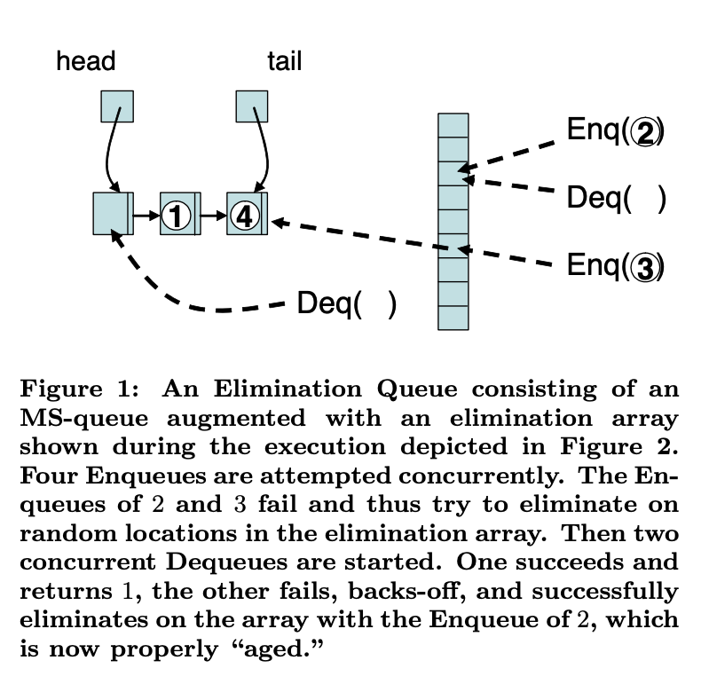
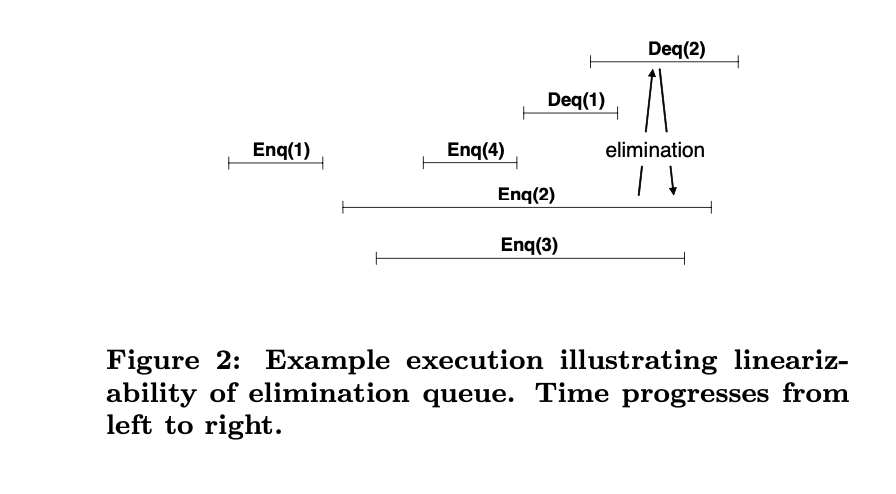

# Using Elimination to Implement Scalable and Lock-Free FIFO Queues
> Mark Moir Daniel Nussbaum Ori Shalev Nir Shavit

## Abstract
This paper shows for the first time that elimination, a scaling technique formerly applied only to counters and LIFO structures, can be applied to FIFO data structures, specifically, to linearizable FIFO queues. We show how to transform existing nonscalable FIFO queue implementations into scalable implementations using the elimination technique, while preserving lock-freedom and linearizablity.

本文首次表明，消去法（一种以前仅适用于计数器和后进先出结构的缩放技术）可以应用于FIFO数据结构，特别是可线性化的 FIFO 队列。我们展示了如何使用消除技术将现有的不可伸缩 FIFO 队列实现转换为可伸缩实现，同时保持锁自由度和线性度。

We apply our transformation to the FIFO queue algorithm of Michael and Scott, which is included in the Java Concurrency Package. Empirical evaluation on a state-of-the-art CMT multiprocessor chip shows that by using elimination as a backoff technique for the Michael and Scott queue algorithm, we can achieve comparable performance at low loads, and improved scalability as load increases.

我们将我们的转换应用于 Michael 和 Scott的 FIFO 队列算法，该算法包含在 Java 并发包中。在最先进的 CMT 多处理器芯片上进行的实证评估表明，通过使用消除技术作为 Michael 和 Scott 队列算法的退避技术，我们可以在低负载下获得相当的性能，并随着负载的增加提高可扩展性。

## 1 Introduction
Elimination is a parallelization technique that has shown promise in designing scalable shared counters [2, 20] and Last-In-First-Out (LIFO) structures such as pools and stacks [7, 20]. This paper shows the first example of applying elimination to First-In-First-Out (FIFO) structures, specifically, to one of the most fundamental and widely studied concurrent data structures in the literature: the concurrent FIFO queue [6, 9, 10, 12, 14, 17, 18, 19, 22, 23, 24, 25].

消除是一种并行化技术，在设计可伸缩的共享计数器和后进先出（LIFO）结构（如池和堆栈）方面显示出良好的前景。本文展示了将消去法应用于先进先出（FIFO）结构的第一个示例，特别是应用于文献中最基本、研究最广泛的并发数据结构之一：并发 FIFO 队列。

### 1.1 Scalability of Concurrent Queues
The state of the art in concurrent FIFO queues employs data structures that support lock-free Enqueue and Dequeue operations with the usual FIFO queue semantics. The most widely known current FIFO queue implementation is the lock-free FIFO queue due to Michale and Scott (henceforth MS-queue), which is included as part of the Java Concurrency Package. On shared-memory multiprocessors, this queue imporoves on all previous algorithms and even outperforms lock-based queues. Its key feature is that concurrent accesses to the head and tail of the queue do not interfere with each other as long as the queue is non-empty. A recent paper by Ladan-Mozes and Shavit introduced an optimistic queue that improves on the performance of the MS-queue in various situations by reducing the number of expensive compare-and-swap (CAS) operations performed. Unfortunately, like all previous FIFO queue algorithms, these state-of-the-art algorithms do not scale. In all previous FIFO queue algorithms, all concurrent Enqueue and Dequeue operations synchronize on a small number of memory locations, such as a head or tail variable, and/or a common memory location such as the next empty array element. Such algorithms can only allow one Enqueue and one Dequeue operation to complete in parallel, and therefore cannot scale to large numbers of concurrent operations.

并发 FIFO 队列中的最新技术采用了支持无锁入队列和出队列操作的数据结构，具有通常的 FIFO 队列语义。目前最广为人知的 FIFO 队列实现是 Michale 和 Scott（以下简称MS-queue）提出的无锁 FIFO 队列，它是 Java 并发包的一部分。在共享内存多处理器上，此队列优于所有以前的算法，甚至优于基于锁的队列。它的关键特性是，只要队列不为空，对队列头部和尾部的并发访问就不会相互干扰。Ladan Mozes 和 Shavit 最近的一篇论文介绍了一种乐观队列，该队列通过减少执行的昂贵比较和交换（CAS）操作的数量，提高了 MS 队列在各种情况下的性能。不幸的是，像所有以前的 FIFO 队列算法一样，这些最先进的算法无法扩展。在所有以前的 FIFO 队列算法中，所有并发的入队列和出队列操作都在少量内存位置（如头部或尾部变量）和/或公共内存位置（如下一个空数组元素）上同步。这种算法只允许一个排队和一个出列操作并行完成，因此无法扩展到大量并发操作。

We show how existing nonscalable queue implementations--including both of the above state-of-the-art queues -- can be modified to support scalable FIFO elimination; this yields the first scalable non-blocking FIFO queue algorithms.

我们展示了如何修改现有的不可伸缩队列实现——包括上述两种最先进的队列——以支持可伸缩 FIFO 消除；这产生了第一个可扩展的非阻塞 FIFO 队列算法。

### 1.2 Elimination
Elimination is a technique introduced by Shavit and Touitou to achieve scalability in shared pool and counter implementations. A recent paper by Hendler et. al showed how elimination can be used as a backoff technique that achieves scalability for LIFO stacks while preserving linearizability. (Linearizability is a standard correctness condition for shared data structures; it is defined in the next section.) The introduction of elimination into the backoff mechanism serves the dual purpose of allowing operations to complete in parallel and reducing contention for the underlying stack data structure.

消除是 Shavit 和 Touitou 引入的一种技术，用于在共享池和计数器实现中实现可伸缩性。Hendler 等人最近的一篇论文展示了如何将消除作为一种退避技术，在保持线性化能力的同时实现后进先出堆栈的可伸缩性。（可线性化是共享数据结构的标准正确性条件；将在下一节中定义。）在退避机制中引入消除机制有两个目的，一是允许并行完成操作，二是减少对底层堆栈数据结构的争用。

Elimination works by allowing opposing operations such as pushes and pops to exchange values in a pairwise distributed fashion without synchronizing on a centralized data structure. This technique is straightforward in LIFO ordered structures. As noticed by Shavit and Touitou : a stack’s state remains the same after a push followed by a pop are performed. This means that if pairs of pushes and pops can meet and pair up in separate random locations of an “elimination array”, then the threads can exchange values without having to access a centralized stack structure. However, this approach seemingly contradicts the very essence of FIFO ordering in a queue: a Dequeue operation must take the oldest value currently waiting in the queue. It apparently cannot eliminate with a concurrent Enqueue.

消除的工作原理是允许相反的操作（如 push 和 pop）以成对分布的方式交换值，而无需在集中式数据结构上进行同步。这种技术在后进先出有序结构中非常简单。正如 Shavit 和 Touitou 所注意到的：在执行 push 之后，堆栈的状态保持不变。这意味着，如果 push 和 pop 对可以在“消除数组”的单独随机位置相遇和配对，那么线程可以交换值，而无需访问集中的堆栈结构。然而，这种方法似乎与队列中 FIFO 排序的本质相矛盾：出列操作必须采用队列中当前等待的最旧值。它显然不能通过并发排队来消除。

We show that, despite this inherent difficulty, any FIFO queue implementation that can support additional NumDeqs and NumEnqs operations (explained later), can be transformed into a scalable elimination queue, while preserving lock-freedom and linearizablity. It is easy to modify MS-queue and optimistic-queue to support these operations.

我们表明，尽管存在这种固有的困难，但任何能够支持额外 NumDeqs 和 NumEnqs 操作（稍后解释）的 FIFO队列实现都可以转换为可伸缩的消除队列，同时保持锁自由度和线性化。可以很容易地修改 MS 队列和乐观队列以支持这些操作。

### 1.3 FIFO Elimiation
How can elimination be achieved with a FIFO queue? Our key observation is that the FIFO order of Enqueue and Dequeue does not prohibit elimination, it only restricts it to particular combinations of operations. Specifically, a Dequeue operation can eliminate an Enqueue if the values inserted by all Enqueues preceding that Enqueue have already been Dequeued. Thus, if an Enqueue operation has “aged” to the point where the values of all Enqueues preceding it have been Dequeued, it can eliminate with a concurrent Dequeue operation. In this case, we “pretend” that the eliminated Enqueue completed successfully earlier, and that, because of the aging, its value is now at the head of the queue, and can therefore now be dequeued.

如何使用 FIFO 队列实现消除？我们的主要观察结果是，排队和出列的 FIFO 顺序并不禁止消除，它仅将其限制在特定的操作组合中。具体地说，如果队列前面的所有队列插入的值都已退出队列，则出列操作可以消除该队列。因此，如果一个排队操作已经“老化”到它前面的所有排队的值都已被出队的地步，它可以通过并发的出队操作来消除。在这种情况下，我们“假装”已消除的排队提前成功完成，并且由于老化，其值现在位于队列的最前面，因此现在可以退出队列。

A variety of FIFO queue implementations can be based on this technique. In general, it is preferable to access the underlying (central) queue data structure directly under low load, because elimination partners are harder to find; and to attempt to eliminate under high load, because elimination partners will be easier to find, and excessive contention for the central queue will result in nonscalable performance.

各种 FIFO 队列实现都可以基于此技术。通常，最好在低负载下直接访问底层（中心）队列数据结构，因为消除伙伴更难找到；并尝试在高负载下消除，因为消除伙伴将更容易找到，并且对中心队列的过度争用将导致不可伸缩的性能。

One intuitively appealing way to use elimination is to incorporate it into the backoff mechanism for the central queue. It is well known that backoff techniques are necessary to alleviate the poor scalability of existing FIFO queue algorithms under high load. If an operation uses time that would otherwise be spent backing off to successfully eliminate, then the eliminated operations finish sooner, and also reduce contention on the central queue, because they do not have to retry after backing off. We describe our technique using this approach, and later discuss some potential disadvantages of this approach and some alternatives.

使用消除的一种直观的吸引人的方法是将其合并到中央队列的退避机制中。众所周知，退避技术是缓解现有 FIFO 队列算法在高负载下可扩展性差的必要手段。如果一个操作使用了本应花费在退出上的时间来成功消除，则被消除的操作会更快完成，并且还减少了中心队列上的争用，因为它们不必在退出后重试。我们描述了使用这种方法的技术，然后讨论了这种方法的一些潜在缺点和一些替代方案。

Our implementation uses a single “elimination array” to support a backoff scheme on a shared lock-free queue. We started with MS-queue, and modified the queue so that processes can query it to determine how many Enqueue and Dequeue operations have succeeded in the past, and this information is used to determine when an Enqueue operation has been properly “aged”, and can therefore be eliminated. Figure 1 shows an example execution. Enqueue and Dequeue operations that fail to complete on the central queue due to interference from concurrent operations back off to the array to try to achieve elimination between a Dequeue operation and a sufficiently aged Enqueue operation. If the elimination is successful, they exchange values; otherwise, they again attempt to access the central queue. We have proved that this structure is linearizable; we present a detailed overview of our proof in Section 3.

我们的实现使用单个“消除数组”来支持共享无锁队列上的退避方案。我们从 MS queue 开始，并修改了队列，以便进程可以查询它，以确定过去有多少排队和退队操作成功，并且此信息用于确定排队操作何时已正确“老化”，因此可以消除。图 1 显示了一个执行示例。由于并发操作的干扰而无法在中央队列上完成的入队和出队操作将返回到阵列，以尝试在出队操作和充分老化的入队操作之间实现消除。如果消除成功，它们交换值；否则，它们将再次尝试访问中心队列。我们已经证明了这种结构是线性的；我们将在第 3 节中详细概述我们的证明。



Because our algorithm works as a backoff scheme, it can deliver the same performance as the simple queue at low loads. However, unlike the simple queue, its throughput increases as load increases because (1) the number of success- ful eliminations grows, allowing many operations to complete in parallel, and (2) contention on the shared queue is reduced beyond levels achievable by the best exponential backoff schemes since many backed off operations are eliminated in the array.

因为我们的算法作为退避方案工作，所以它可以在低负载下提供与简单队列相同的性能。但是，与简单队列不同，它的吞吐量随着负载的增加而增加，这是因为（1）成功消除的数量增加，允许许多操作并行完成，（2）由于在阵列中消除了许多退避操作，因此共享队列上的争用减少到最佳指数退避方案所能达到的水平之外。

### 1.4 Performance
Recent initiatives by leading processor manufacturers make it clear that the next generation of high-performance computer chips will be chip-multi-threaded (CMT). CMTs have multiple cores with multiple computation strands on a single chip. Effective data structures for multiprocessor chips should achieve scalability through parallelism, while imposing low overhead when concurrency is low.

领先处理器制造商最近的举措表明，下一代高性能计算机芯片将是芯片多线程（CMT）。CMT 在一个芯片上有多个核和多条计算链。多处理器芯片的有效数据结构应通过并行性实现可伸缩性，同时在并发性较低时施加较低的开销。

We compared an elimination-backoff version of the MS-queue with the original MS-queue on a Sun Niagara-based system. Niagara is a CMT multiprocessor chip with 8 computing cores and 4 interleaved strands per core. Our empirical results show that our new elimination-backoff MS-queue performs comparably with MS-queue at low levels of concurrency, and then increasingly outperforms MS-queue as the number of threads increases. We believe that the parallelism afforded by the elimination technique will enable FIFO queues to scale to very large systems, while the MS-queue algorithm clearly will not.

我们在基于 Sun Niagara 的系统上比较了 MS 队列的消除退避版本和原始 MS 队列。Niagara 是一种 CMT多处理器芯片，具有 8 个计算核和每个核 4 条交叉股。我们的实证结果表明，我们的新消除退避 MS 队列在低并发级别上的性能与 MS 队列相当，并且随着线程数的增加，其性能会越来越优于 MS 队列。我们相信，消除技术提供的并行性将使 FIFO 队列能够扩展到非常大的系统，而 MS 队列算法显然不会。

## 2 The New Algorithm
Our scalable FIFO queue algorithm is based on ideas sim- ilar to those of Hendler et. al. However, elimination for a FIFO queue is substantially more difficult than for a stack, because we cannot simply eliminate any Enqueue-Dequeue pair. The reason is that, while a push followed by a pop on a stack has no net effect on the stack, the same is not true for a FIFO queue. For example, if a queue contains a single value 1, then after an Enqueue of 2 and a Dequeue, the queue contains 2, regardless of the order of these operations. Thus, because the queue changes, we cannot simply eliminate the Enqueue and Dequeue. Note that if the queue were empty, we could eliminate an Enqueue-Dequeue pair, because in this case the queue is unchanged by an Enqueue immediately followed by a Dequeue. Our algorithm exploits this observation, but also goes further, allowing elimination of Enqueue-Dequeue pairs even when the queue is not empty.

我们的可扩展 FIFO 队列算法基于与 Hendler 等人类似的思想。然而，消除 FIFO 队列比消除堆栈要困难得多，因为我们不能简单地消除任何排队-出列对。原因是，虽然堆栈上的 push 后 pop 对堆栈没有任何净影响，但对于 FIFO 队列来说，情况并非如此。例如，如果一个队列包含一个值 1，那么在一个 2 的入队和一个出队之后，该队列包含 2，而不管这些操作的顺序如何。因此，由于队列的变化，我们不能简单地消除排队和退队。请注意，如果队列为空，我们可以消除一个排队-出列对，因为在这种情况下，队列由一个紧接着一个出列的排队保持不变。我们的算法利用了这一观察结果，但也更进一步，即使队列不是空的，也允许消除排队-出列对。

To understand why it is acceptable in some cases to eliminate Enqueue-Dequeue pairs even when the queue is not empty, one must understand the linearizability correctness condition, which requires that we can order all operations in such a way that the operations in this order respect the FIFO queue semantics, but also so that no process can detect that the operations did not actually occur in this order. If one operation completes before another begins, then we must order them in this order. Otherwise, if the two are concurrent, we are free to order them however we wish.

为了理解为什么在某些情况下，即使队列不是空的，也可以消除排队-出队对，必须理解线性化正确性条件，这要求我们可以以这样的方式对所有操作进行排序，即按此顺序进行的操作尊重 FIFO 队列语义，但也使任何进程都无法检测到操作实际上不是按此顺序发生的。如果一个操作在另一个操作开始之前完成，那么我们必须按此顺序对它们进行排序。否则，如果两者同时存在，我们可以随意排序。

Key to our approach is the observation that we really want to use elimination when the load on the queue is high. In such cases, if an Enqueue operation is unsuccessful in an attempt to access the queue, it will generally backoff before retrying. If in the meantime all values that were in the queue when the Enqueue began are dequeued, then we can “pretend” that the Enqueue did succeed in adding its value to the tail of the queue earlier, and that it now has reached the head and can be dequeued by an eliminating Dequeue. Thus, we use time spent backing off to “age” the unsuccessful Enqueue operations so that they become “ripe” for elimination. Because this time has passed, we ensure that the Enqueue operation is concurrent with Enqueue operations that succeed on the central queue, and this allows us to order the Enqueue before some of them, even though it never succeeds on the central queue. The key is to ensure that Enqueues are eliminated only after sufficient aging.

我们的方法的关键是观察到，当队列上的负载较高时，我们确实希望使用消除。如果入队操作在尝试访问队列时失败，通常会在重试前退避。如果在此期间，队列开始时队列中的所有值都已出列，那么我们可以“假装”队列确实成功地将其值添加到队列的尾部，并且它现在已到达队列的头部，可以通过消除出列来出列。因此，我们使用后退所花费的时间来“老化”不成功的排队操作，以便它们变得“成熟”以便消除。由于这段时间已经过去，我们确保入队操作与在中心队列上成功的人队操作并发，这允许我们在其中一些操作之前对排队进行排序，即使它在中心队列上从未成功。关键是要确保只有在充分老化后才能消除排队现象。

To understand how the aging process works, consider the execution of Figure 2 on the queue structure shown in Figure 1. Figure 2 describes the time intervals of the operations depicted in Figure 1, starting from an empty queue. As can be seen, in this execution, first 1 is enqueued into an empty queue, then concurrent Enqueue attempts of 2, 3 and 4 begin. The Enqueue of 4 succeeds in adding 4 to the queue, but causes the attempts to enqueue 2 and 3 to fail, so they back off; the queue now contains 1 followed by 4. At this point two Dequeues are started. The first successfully takes the value 1 from the queue, causing the second to fail, which therefore backs off. After 1 is dequeued, the backed-off Dequeue can eliminate with the Enqueue of 2 even though the head of the queue at this point contains 4. This is because the Enqueue of 2 has waited long enough so that all values enqueued completely before it, namely 1, are no longer in the queue. We can thus order the Enqueue of 2 after the Enqueue of 1 and before the Enqueue of 4, even though no process has yet dequeued 4 from the central queue.

为了理解老化过程是如何工作的，考虑图 1 所示的队列结构上的图 2 的执行。图 2 描述了图 1 中描述的操作的时间间隔，从一个空队列开始。可以看出，在这个执行过程中，首先将 1 排队到一个空队列中，然后开始2、3 和 4 的并发排队尝试。4 的排队成功地将 4 添加到队列中，但导致排队 2 和 3 的尝试失败，因此它们退出；队列现在包含 1 和 4。此时将启动两个出列。第一个成功地从队列中获取值 1，导致第二个失败，从而退出。1 退出队列后，即使此时的队列头包含 4 个队列，也可以使用 2 的队列消除退后的退出队列。这是因为 2 的排队等待时间足够长，因此在它之前完全排队的所有值（即1）都不再在队列中。因此，我们可以在 1 的排队之后和 4 的排队之前对 2 的排队进行排序，即使还没有进程从中心队列中退出 4。



### 2.1 The transformed central queue
How can a Dequeue detect that an Enqueue has aged sufficiently? One approach is to enhance the central queue with additional operations that allow a Dequeue that wishes to eliminate with an Enqueue to determine that all items inserted by Enqueue operations that completed before the candidate Enqueue operation began have already been dequeued. We now describe an abstract counting queue, which supports detection of aging for elimination. Most lock-free queue implementations (including MS-queue) can be easily adapted to implement the required semantics.

A counting queue provides EnqueueAttempt and DequeueAttempt operations, with the same semantics as Enqueue and Dequeue, except that they can return a special value “fail” in case of interference from concurrent operations. It also provides NumDeqs and NumEnqs operations, which report how many Dequeue and Enqueue operations respectively have succeeded so far. A straightforward transformation of the MS-queue to provide these operations is outlined in an appendix.

### 2.2 The Elimination Queue in Detail
The data structures used in our example code are shown at the top of Figure 3. The node_t type contains a value to be Enqueued and a serial number. In our presentation, nodes serve two purposes. First, they are passed to EnqueueAttempt to communicate the value to be enqueued to the central queue implementation. Depending on the implementation, the central queue may also use the node, and the node may include other fields not shown here. The other purpose of the node is for elimination; the value is the value to be passed from an eliminated Enqueue operation to the corresponding eliminated Dequeue operation, and the serial number is used to determine when it is safe to eliminate an Enqueue-Dequeue pair, as explained in more detail below. A FIFO queue (type queue t) consists of a counting queue and an elimination array. We assume two “special” values of type pnode t: “EMPTY” and “DONE”, which can be distinguished from “real” node pointers. These values might be values that cannot be node addresses (for example due to alignment assumptions), or two special nodes can be allocated for this purpose.

示例代码中使用的数据结构如图 3 顶部所示。node_t 类型包含要排队的值和序列号。在我们的演示中，节点有两个用途。首先，它们被传递给 EnqueueAttempt，将要排队的值传递给中央队列实现。根据实现，中心队列也可以使用该节点，并且该节点可以包括此处未显示的其他字段。节点的另一个用途是消除；该值是从已消除的排队操作传递到相应的已消除的出列操作的值，序列号用于确定何时消除排队出列对是安全的，如下所述。FIFO 队列（队列 t 类型）由计数队列和消除数组组成。我们假设 pnode t 类型的两个“特殊”值：“EMPTY”和“DONE”，这两个值可以与“real”节点指针区别开来。这些值可能是不能作为节点地址的值（例如，由于对齐假设），或者可以为此分配两个特殊节点。

```
    structure node_t { value: valtype, seq: uint}
    structure ptrctr_t {node: pointer to node_t, ver: uint}
    structure Queue_t {Q: counting_queue_t, Collisions: array of ptrctr_t}

    Enqueue(Q: pointer to Queue_t, value: valtype)
1:      uint seen_tail = NumEnqs(Q)
2:      pointer to node_t node = new_node(value)
3:      loop
4:          if DecideWhetherToAccessQueue() and EnqueueAttempt(Q, node)
            then 
5:              return
6:          else 
7:              if TryToEliminateEnqueue(Q, node, seen_tail)
                then
8:                  return
9:              end if
10:          end if
11:     end loop

    TryToEliminateEnqueue(Q: pointer to Queue_t, pointer to node_t, seen_tail:uint) : boolean

1:        node->seq = seen_tail;
2:        i = random(collision_array_size)
3:      (colnode, ver) = Q->Collisions[i]
4:      if colnode == EMPTY then
5:          if CAS(&Q->Collisions[i], (EMPTY, ver), <node, ver + 1>) then
6:          ShortDelay()
7:              colnode = Q->Collisions[i].node
8:              if (colnode == DONE) or
                  (not CAS(&Q->Collisions[i], <colnode, ver+1>, <EMPTY, ver+1>)) then
9:                Q->Collisions[i] = <EMPTY, ver + 1>
10:                  return true
11:             end if
12:         end if
13:     end if
14:     return false


        Figure 3: Data structures and Enqueue operation
```

An Enqueue operation begins by determining how many Enqueue operations have already completed on the central queue. This information is used to determine when the Enqueue has aged sufficiently to allow elimination with a Dequeue operation. The Enqueue operation then allocates a node initialized with the value to be enqueued, and then repeatedly attempts either to Enqueue the value using the central queue, or to find a Dequeue operation with which to eliminate, depending on guidance from the heuristic implemented by DecideWhetherToAccessQueue. The operation returns when it succeeds using either approach. The structure of a Dequeue operation is similar. We defer a detailed discussion of node management to a full version of the paper.

排队操作首先确定中央队列上已完成的排队操作数。此信息用于确定排队时间是否足够长，以允许通过出列操作进行消除。然后，排队操作分配一个用要排队的值初始化的节点，然后根据 DecideWhetoAccessQueue 实现的启发式的指导，重复尝试使用中心队列将值排队，或查找要消除的排队操作。当使用任一方法成功时，操作返回。出列操作的结构类似。我们将节点管理的详细讨论推迟到论文的完整版本。

It remains to describe the elimination mechanism. TryToEliminateEnqueue stores the the number of previous Enqueues on the central queue (recorded earlier) in the thread’s node, and then attempts to find an empty slot in the elimination array. It does this by choosing a slot at random, and then determining if the slot contains EMPTY. If not, the elimination attempt fails. Otherwise, the thread attempts to replace the EMPTY value with a pointer to its node using compare-and-swap (CAS). If this CAS fails, then the elimination attempt fails. Otherwise, the Enqueue has installed its node into the elimination array, so it waits for a short time, hoping that a Dequeue finds the node and elimnates. If it does so, it changes the node pointer to DONE, as explained below. Therefore, the Enqueue operation can detect elimination by checking to see if the node pointer has been changed to DONE. If so, the Enqueue has been eliminated, so it can return. Otherwise, the thread uses CAS to attempt to change its entry in the elimination array back to EMPTY, so that it can return to the main Enqueue procedure to retry. If this CAS fails, it can only be because a Dequeue operation has changed the node to DONE, so again the Enqueue is successfully eliminated in this case.

还有待于描述消除机制。TryToEliminateQueue 在线程的节点中存储中心队列（前面记录的）上以前的队列数，然后尝试在消除数组中查找空插槽。它通过随机选择一个插槽，然后确定该插槽是否包含空插槽来实现这一点。否则，排除尝试将失败。否则，线程会尝试使用比较和交换（CAS）将空值替换为指向其节点的指针。如果此CAS 失败，则消除尝试失败。否则，队列已将其节点安装到消除数组中，因此它会等待很短的时间，希望退出队列找到节点并删除。如果这样做，它会将节点指针更改为 DONE，如下所述。因此，排队操作可以通过检查节点指针是否已更改为 DONE 来检测消除。如果是这样，排队已被消除，因此它可以返回。否则，线程将使用CAS尝试将其在消除数组中的条目更改回空，以便返回主排队过程重试。如果此 CAS 失败，这只能是因为出列操作已将节点更改为“完成”，因此在此情况下再次成功消除排队。

When a Dequeue operation attempts to eliminate, it chooses a slot in the elimination array at random, and checks to see if there is an Enqueue waiting to eliminate in that slot (if the node pointer is not DONE or EMPTY, then there is an elimination attempt in progress by an Enqueue operation). If not, the attempt to eliminate fails. Otherwise, the Dequeue attempts to change the node pointer to DONE, indicating to that Enqueue operation that the elimination was successful. If it does, it simply returns the value from the node. However, as explained earlier, it is not always safe to eliminate with an Enqueue operation. The Dequeue operation that hopes to eliminate must first confirm that the number of Dequeues performed on the central queue is at least the number of Enqueues performed before the candidate Enqueue operation began. This check is performed by comparing the number recorded in the node by the Enqueue to the result of calling NumDeqs on the central queue.

当出列操作尝试消除时，它会随机选择消除数组中的一个插槽，并检查该插槽中是否有等待消除的排队（如果节点指针未完成或为空，则排队操作正在进行消除尝试）。如果没有，则尝试消除失败。否则，出列将尝试将节点指针更改为 DONE，向该入列操作指示删除已成功。如果是，它只从节点返回值。然而，正如前面所解释的，通过排队操作消除冲突并不总是安全的。希望消除的出列操作必须首先确认在中心队列上执行的出列数量至少是候选入列操作开始之前执行的入列数量。此检查是通过比较 Enqueue 在节点中记录的号码与在中心队列上调用NUMDEQ 的结果来执行的。

Finally, in order to avoid the ABA problem, pointers in the elimination array are augmented with version numbers, which are incremented each time a node is installed into the elimination array. This avoids the following potential problem. A Dequeue could read a pointer from the elimination array and determine that the Enqueue is safe to eliminate. However, before the Dequeue performs its CAS to “claim” the value to return, the node could be removed from the elimination array, recycled, and reused in the elimination array by another Enqueue operation that is not yet safe to eliminate, and the Dequeue’s CAS could succeed, thereby causing elimination with the ineligible Enqueue.

最后，为了避免 ABA 问题，消除数组中的指针增加了版本号，每次将节点安装到消除数组中时，版本号都会增加。这样可以避免以下潜在问题。出列可以从消除数组中读取指针，并确定可以安全地消除该出列。但是，在出列执行其 CAS “声明”要返回的值之前，可以通过另一个尚未安全消除的排队操作将节点从消除数组中移除、回收并在消除数组中重新使用，出列的 CAS 可能会成功，从而导致使用不合格的排队进行消除。

### 2.3 Heuristics for Elimination
Our FIFO elimination technique allows threads to choose dynamically between accessing the central queue and attempting to eliminate. Our presentation assumes a function DecideWhetherToAccessQueue, which returns true if we should attempt the operation on the central queue, and false if we should try to eliminate. This function can implement any heuristic choice, and may additionally incorporate traditional backoff techniques by delaying for some time before returning. However, the heuristic should always eventually attempt to complete on the central queue in order to ensure lock-freedom. Below we discuss considerations in designing such heuristics, and in seeking elimination partners.

我们的 FIFO 消除技术允许线程在访问中心队列和尝试消除队列之间进行动态选择。我们的演示假定一个函数decidewhetoaccessqueue，如果我们尝试对中心队列执行操作，它将返回 true，如果我们尝试消除，它将返回 false。此函数可以实现任何启发式选择，并且还可以通过在返回之前延迟一段时间来结合传统退避技术。但是，为了确保锁的自由，启发式应该始终尝试在中心队列上完成。下面，我们将讨论设计此类启发式算法以及寻找消除伙伴时的考虑事项。

Under high load, elimination is preferable, because using the nonscalable central queue will result in poor performance. Under low load, finding an eligible operation with which to eliminate may take too long, and the number of “aged” enqueues is most likely low. Furthermore, because load is low, accessing the central queue should be fast.

在高负载下，最好使用消除，因为使用不可缩放的中心队列将导致性能不佳。在低负载情况下，找到要消除的合格操作可能需要很长时间，而且“老化”排队的数量很可能很低。此外，由于负载较低，访问中心队列应该很快。

The DecideWhetherToAccessQueue heuristic is in our im- plementation is designed to use elimination as a backoff mechanism for the central queue. Thus, every operation alternates between attempting to complete on the central queue and attempting to eliminate some number of times. As the experiments presented in Section 4 show, on a Niagara-based Sun FireTMT200 system, the resulting algorithm performs comparably at low load and outperforms MS-queue with backoff at high load because the eliminated operations relieve contention on the central queue. We expect that the margin of improvement would continue to increase with increasingly larger machines. However, to achieve a truly scalable queue, the following factors must be considered.

DecideWhetoAccessQueue 启发式在我们的实现中被设计为使用消除作为中心队列的退避机制。因此，每个操作在尝试在中心队列上完成和尝试消除某些次数之间交替进行。正如第4节中的实验所示，在基于尼亚加拉的Sun FireTMT200系统上，生成的算法在低负载下的性能相当，并且在高负载下的退避性能优于 MS 队列，因为消除的操作减轻了中心队列上的争用。我们预计，随着机器越来越大，改进幅度将继续增加。但是，要实现真正可伸缩的队列，必须考虑以下因素。

First, we must consider the scalability of the elimination mechanism itself. An important consideration is locality: it is preferable to eliminate with an operation that is “nearby” in the machine in order to avoid communication bottlenecks. In our experiments, local groups of processors shared (logical) elimination arrays that were allocated in local memory (in architectures having a notion of memory that is local to processors), rather than choosing slots at random in a single elimination array, as presented in our pseudocode above. In experiments artificially constructed to allow maximum elimination and to always avoid the central queue, we have determined that our elimination mechanism scales up very well on a 144-core Sun FireTME25K system. However, our elimination-as-backoff implementation did not exhibit such good scalability on this machine. We speculate on the reasons for this below, and discuss possible remedies.

首先，我们必须考虑消除机制本身的可扩展性。一个重要的考虑因素是局部性：最好使用机器中“附近”的操作来消除，以避免通信瓶颈。在我们的实验中，本地处理器组共享在本地内存中分配的（逻辑）消除阵列（在具有处理器本地内存概念的体系结构中），而不是在单个消除阵列中随机选择插槽，如上面的伪代码所示。在人工构建的实验中，为了最大限度地消除并始终避免中心队列，我们确定我们的消除机制在144核Sun FireTME25K系统上扩展得非常好。然而，我们的取消作为退避实现在这台机器上并没有表现出如此好的可伸缩性。我们在下面推测原因，并讨论可能的补救措施。

If every operation always accesses the central queue before attempting to eliminate, as it does in an elimination-as-backoff scheme, then throughput will not scale in large machines under high load. Ideally, in order to achieve true scalability, we would like to avoid the need for synchronizing on the central queue. This can happen only if the central queue remains empty (so that NumEnqs and NumDeqs operations access only cached read-only state of the central queue). Therefore, if we wish to achieve scalable performance under high load in arbitrarily large machines, we must use a heuristic that attempts to make the central queue empty (for example by favoring elimination for Enqueues more than for Dequeues until the central queue is empty), and then causes all operations to eliminate. Of course, in reality it will not always be possible to achieve this ideal, but these considerations may be useful in designing effective heuristics for adapting to high load. We have not had time to evaluate these ideas but we hope to do so for a full version of this paper. Based on our experience with the artificial experiments discussed above, we are optimistic that an implementation based on these techniques will significantly outperform MS-queue in larger machines.

如果每个操作总是在尝试消除之前访问中心队列，就像在消除作为退避方案中一样，那么吞吐量将不会在高负载的大型机器中扩展。理想情况下，为了实现真正的可伸缩性，我们希望避免在中央队列上进行同步。只有在中心队列保持为空（以便NumEnqs和NumDeqs操作仅访问中心队列的缓存只读状态）时，才会发生这种情况。因此，如果我们希望在任意大的机器上实现高负载下的可扩展性能，我们必须使用一种启发式方法，尝试使中心队列为空（例如，在中心队列为空之前，更倾向于取消排队，而不是取消排队），然后使所有操作都取消。当然，在现实中并不总是能够实现这一理想，但这些考虑因素在设计适应高负载的有效启发式算法时可能有用。我们还没有时间对这些想法进行评估，但我们希望对本文的完整版本进行评估。根据我们在上面讨论的人工实验中的经验，我们乐观地认为基于这些技术的实现将在更大的机器上显著优于MS队列。

A variety of strategies for adapting to load on the elimination array are possible. For example, backoff on the elimination array in both time and space can be considered, as in [7, 21]. In such arrangements, operations attempt to eliminate on a location chosen at random from a sub-range of the elimination array that grows or shrinks based on perception of the load. Such approaches can dynamically “spread the load” over relevant parts of the elimination array so that operations seeking to eliminate are dense enough to find each other, but spread out enough that they do not interfere excessively with other elimination attempts. Dynamic backoff techniques can also be used to control how long an Enqueue waits in the elimination array for a partner Dequeue operation, etc. We have not explored the space of possible adaptation techniques in detail; this paper provides a proof of concept for using elimination to implement scalable FIFO queues, but not an exhaustive study of possible ways to apply the technique.

可以采用多种策略来适应消除阵列上的负载。例如，可以考虑消除阵列在时间和空间上的退避，如所示。在这种布置中，操作尝试在从消除阵列的子范围中随机选择的位置上消除，该消除阵列基于对负载的感知而增大或减小。这种方法可以动态地将负载“分散”到消除阵列的相关部分，以便寻求消除的操作足够密集，可以找到彼此，但分散程度足够大，不会过度干扰其他消除尝试。动态退避技术还可用于控制排队者在消除阵列中等待伙伴退队操作的时间等。我们尚未详细探讨可能的适应技术的空间；本文提供了使用消去法实现可伸缩 FIFO 队列的概念证明，但没有详尽研究应用该技术的可能方法。

## 3 Overview of correctness proof
（暂缓）

## 4 Performance
（暂缓）

## 5 Concluding Remarks
We have shown that, with care, the elimination technique already known to be useful for making stacks, pools and counters scalable, can also be applied to FIFO queues. Our preliminary performance results indicate that this technique improves performance even with relatively small numbers of concurrent threads and we are optimistic that the improvement due to elimination will only increase with larger numbers of concurrent threads.

我们已经证明，谨慎地使用消除技术，可以使堆栈、池和计数器具有可伸缩性，也可以应用于 FIFO 队列。我们的初步性能结果表明，即使在并发线程数量相对较少的情况下，该技术也可以提高性能，我们乐观地认为，由于消除而产生的性能改进只会随着并发线程数量的增加而增加。

Future work includes evaluating different heuristics for deciding whether to access the central queue or to eliminate in order to effectively adapt to a range of loads.

未来的工作包括评估不同的启发式算法，以决定是访问中心队列还是消除队列，从而有效地适应一系列负载。