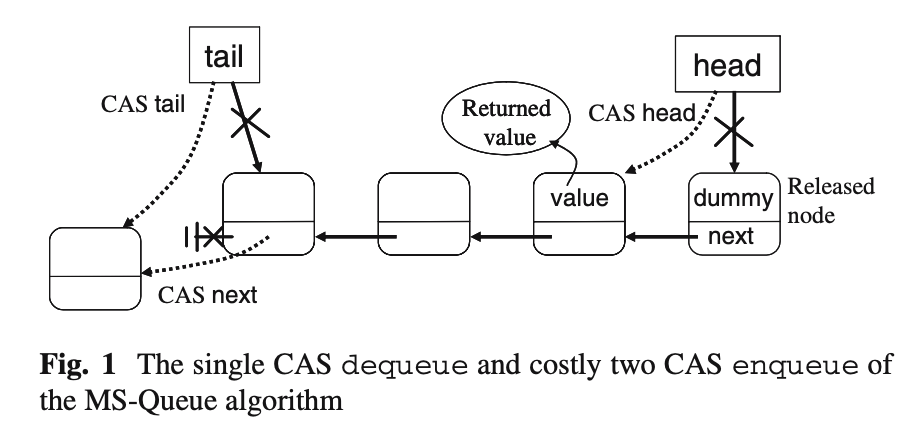
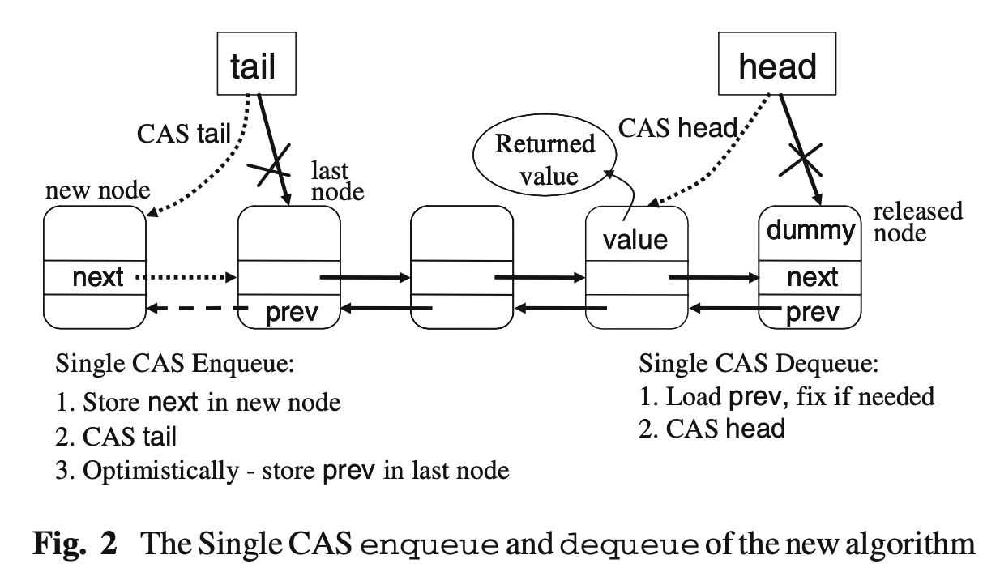

# An optimistic approach to lock-free fifo queues
> by Edya Ladan-Mozes, Nir Shavit

## Abstract
First-in-first-out (FIFO) queues are among the most fundamental and highly studied concurrent data structures. The most effective and practical dynamic-memory concurrent queue implementation in the literature is the lock-free FIFO queue algorithm of Michael and Scott, included in the standard Java Concurrency Package. This work presents a new dynamic-memory concurrent lock-free FIFO queue algorithm that in a variety of circumstances performs better than the Michael and Scott queue. The key idea behind our new algorithm is a novel way of replacing the singlylinked list of Michael and Scott, whose pointers are inserted using a costly compare-and-swap (CAS) operation, by an “optimistic” doubly - linked list whose pointers are updated using a simple store, yet can be “fixed” if a bad ordering of events causes them to be inconsistent. We believe it is the first example of such an “optimistic” approach being applied to a real world data structure.

先进先出（FIFO）队列是最基本和最受研究的并发数据结构之一。文献中最有效和实用的动态内存并发队列实现是 Michael 和 Scott 的无锁 FIFO 队列算法，包含在标准 Java 并发包中。这项工作提出了一种新的动态内存并发无锁 FIFO 队列算法，该算法在各种情况下的性能都优于 Michael 和 Scott 队列。我们新算法背后的关键思想是一种新颖的方法，将 Michael 和 Scott的 单链表替换为“乐观”双链表，该双链表的指针通过一个简单的存储更新。Michael 和 Scott 的单链表的指针是通过一个昂贵的比较和交换（CAS）操作插入的，但是，如果事件顺序不正确导致它们不一致，则可以“修复”。我们相信这是第一个将这种“乐观”方法应用于现实世界数据结构的例子。

## Introduction
First-in-first-out (FIFO) queues are among the most fundamental and highly studied concurrent data structures, and are an essential building block of concurrent data structure libraries such as JSR-166, the Java Concurrency Package. A concurrent queue is a linearizable structure that supports enqueue and dequeue operations with the usual FIFO semantics. This work focuses on queues with dynamic memory allocation.

先进先出（FIFO）队列是最基本、研究最深入的并发数据结构之一，是并发数据结构库（如 Java 并发包JSR-166）的基本构建块。并发队列是一种可线性化的结构，它支持具有通常 FIFO 语义的入队列和出队列操作。这项工作主要关注具有动态内存分配的队列。

The most effective and practical dynamic-memory concurrent FIFO queue implementation is the lock-free FIFO queue algorithm of Michael and Scott (henceforth the MS-queue). On shared-memory multiprocessors, this compare-and-swap (CAS) based algorithm is superior to all former dynamic-memory queue implementations including lock-based queues, and has been included as part of the Java Concurrency Package. Its key feature is that it allows uninterrupted parallel access to the head and tail of the queue.

最有效和实用的动态内存并发FIFO队列实现是 Michael 和 Scott 的无锁 FIFO 队列算法（以下简称 MS队列）。在共享内存多处理器上，此基于比较和交换（CAS）的算法优于所有以前的动态内存队列实现，包括基于锁的队列，并且已作为 Java 并发包的一部分。它的关键特性是允许不间断地并行访问队列的头部和尾部。

This paper presents a new dynamic-memory lock-free FIFO queue algorithm that in a variety of benchmarks performs better than the MS-queue. It is perhaps the first practical example of the “optimistic” approach to reduction of synchronization overhead in concurrent data structures. At the core of this approach is the ability to use simple stores instead of CAS operations in common executions, and fix the data structure in the uncommon cases when bad executions cause structural inconsistencies.

本文提出了一种新的动态内存无锁 FIFO 队列算法，该算法在各种基准测试中的性能都优于 MS 队列。这可能是减少并发数据结构中同步开销的“乐观”方法的第一个实际例子。这种方法的核心是能够在常见执行中使用简单存储而不是 CAS 操作，并在错误执行导致结构不一致的罕见情况下修复数据结构。

### 1.1 The optimistic queue algorithm
As with many finely tuned high performance algorithms (see for example CLH Versus MCS locks), the key to our new algorithm’s performance is in saving a few costly operations along the commonly used execution paths.

与许多经过微调的高性能算法一样（例如，请参见 CLH 与 MCS 锁），我们新算法性能的关键在于沿常用执行路径节省一些昂贵的操作。



Figure 1 describes the MS-queue algorithm which is based on concurrent manipulation of a singly-linked list. Its main source of inefficiency is that while its dequeue operation requires a single successful CAS in order to complete, the enqueue operation requires two such successful CASs. This may not seem important, until one realizes that it increases the chances of failed CAS operations, and that on modern multiprocessors, even the successful CAS operations take an order-of-magnitude longer to complete than a load or a store, since they are implemented by taking exclusive ownership of a cache line and a flushing of the processor’s write buffer.

图 1 描述了 MS 队列算法，该算法基于单链表的并发操作。其效率低下的主要原因是，虽然其出列操作需要一个成功的 CAS 才能完成，但入队操作需要两个成功的 CAS。这似乎并不重要，直到人们意识到它增加了 CAS 操作失败的可能性，并且在现代多处理器上，即使是成功的 CAS 操作也比加载或存储要花费一个数量级的时间来完成，因为它们是通过独占缓存行和刷新处理器的写缓冲区来实现的。

The key idea in our new algorithm is to (literally) approach things from a different direction... by logically reversing the direction of enqueues and dequeues to/from the list. If enqueues were to add elements at the beginning of the list, they would require only a single CAS, since one could first direct the new node’s next pointer to the node at the beginning of the list using only a store operation, and then CAS the tail pointer to the new node to complete the insertion. However, this re-direction would leave us with a problem at the end of the list: dequeues would not be able to traverse the list “backwards” to perform a linked-list removal.

我们新算法的关键思想是（从字面上）从不同的方向处理问题。。。通过逻辑反转列表中的上列和下列方向。如果队列要在列表的开头添加元素，那么它们只需要一个 CAS，因为可以首先使用存储操作将新节点的下一个指针指向列表开头的节点，然后将尾部指针指向新节点以完成插入。然而，这种重新定向会在列表末尾给我们留下一个问题：出列将无法“向后”遍历列表以执行链表删除。



Our solution, depicted in Fig. 2, is to maintain a doubly linked list, but to construct the “backwards” direction, the path of prev pointers needed by dequeues, in an optimistic fashion using only stores (and no memory barriers). This doubly linked list may seem counter-intuitive given the extensive and complex work of maintaining the doubly linked lists of lock-free deque algorithms using double-compare-and-swap operations. However, we are able to store and follow the optimistic prev pointers in a highly efficient manner.

我们的解决方案，如图 2 所示，是维护一个双链接列表，但要以乐观的方式，仅使用存储（而不使用内存屏障），构建“向后”方向，即出列所需的 prev 指针路径。考虑到使用双重比较和交换操作维护无锁 deque 算法的双重链表的广泛而复杂的工作，这种双重链表似乎有违直觉。然而，我们能够以高效的方式存储并跟踪乐观的 prev 指针。

If a prev pointer is found to be inconsistent, we run a fixList method along the chain of next pointers which is guaranteed to be consistent. Since prev pointers become inconsistent as a result of long delays, not as a result of contention, the frequency of calls to fixList is low. The result is a FIFO queue based on a doubly linked list where pointers in both directions are set using simple stores, and both enqueues and dequeues require only a single suc- cessful CAS operation to complete.

如果发现上一个指针不一致，我们将沿着保证一致的下一个指针链运行一个固定列表方法。由于长延迟而不是争用导致 prev 指针变得不一致，因此调用修复列表的频率较低。结果是一个基于双链表的 FIFO 队列，其中两个方向上的指针都使用简单的存储设置，而排队和出队都只需要一次成功的 CAS 操作即可完成。

### 1.2 Optimistic synchronization
Optimistically replacing CAS with loads/stores was first suggested by Moir et al. who show how one can replace the use of CAS with simple loads in good executions, using CAS only if a bad execution is incurred. However, while they show a general theoretical transformation, we show a practical example of a highly concurrent data structure whose actual performance is enhanced by using the optimistic approach. 

Moir 等人首先提出乐观地用加载/存储替换 CAS。他们展示了如何在良好的执行中用简单的加载替换 CAS 的使用，只有在出现错误的执行时才使用 CAS。然而，虽然它们展示了一般的理论转换，但我们展示了一个高度并发的数据结构的实际示例，其实际性能通过使用乐观方法得到了增强。

Our optimistic approach joins several recent algorithms tailored to the good executions while dealing with the bad ones in a more costly fashion. Among these is the obstruction-freedom methodology of Herlihy et al. and the lock-elision approach by Rajwar and Goodman that use backoff and locking (respectively) to deal with bad cases resulting from contention. Our approach is different in that inconsistencies occur because of long delays, not as a result of contention. We use a special mechanism to fix these inconsistencies, and our resulting algorithm is lock-free.

我们的乐观方法结合了一些最近的算法，这些算法适合于好的执行，同时以更昂贵的方式处理坏的执行。其中包括 Herlihy 等人的障碍自由法以及 Rajwar 和 Goodman 的锁省略法，它们分别使用退避和锁定来处理由争用引起的坏情况。我们的方法不同之处在于，不一致是由于长时间延迟而产生的，而不是由于争用。我们使用一种特殊的机制来修复这些不一致性，我们得到的算法是无锁的。

Independently of our work, Lea has recently used an optimistic approach to implement the “successor pointers” direction of the linked list in a CLH lock. A short survey of related work can be found in Sect. 7.

独立于我们的工作，Lea 最近使用了一种乐观的方法来实现 CLH 锁中链表的“后续指针”方向。有关相关工作的简短调查，请参见第7节。

### 1.3 Performance
We compared our new lock-free queue algorithm to the most efficient lock-based and lock-free dynamic memory queue implementations in the literature, the two-lock-queue and lock-free MS-queue of Michael and Scott. We used Michael and Scott’s C code and compared it to our new FIFO queue algorithm on a 16-processors shared-memory machine using a collection of benchmarks, including the key benchmark used by Michael and Scott. Our empirical results, presented in Sect. 4, show that in our benchmarks the new algorithm performs better than the MS-queue. This improved performance on our tested architecture is not surprising, as our enqueues require fewer costly CAS operations, and as our benchmarks show, generate significantly fewer failed CAS operations. We also found that our algorithm performs better when pre-backoff and validation are performed on the head pointer before it is CASed in the dequeue operation.

我们将新的无锁队列算法与文献中最有效的基于锁和无锁的动态内存队列实现进行了比较，即 Michael 和 Scott 的双锁队列和无锁 MS 队列。我们使用了 Michael 和 Scott 的 C 代码，并使用一组基准测试（包括 Michael 和 Scott 使用的关键基准测试）将其与 16 处理器共享内存机器上的新 FIFO 队列算法进行了比较。我们的实证结果，见第 4 节。在我们的基准测试中，新算法的性能优于 MS 队列。我们经过测试的体系结构上的这种性能改进并不令人惊讶，因为我们的排队需要更少昂贵的 CAS 操作，并且正如我们的基准测试所示，生成的失败 CAS 操作显著减少。我们还发现，在出列操作中对头指针执行预退避和验证时，我们的算法性能更好。

The new algorithm uses the same dynamic memory pool structure as the MS-queue. It fits with memory recycling methods such as ROP or Hazard Pointers, and it can be written in garbage-collected programming languages without the need for a memory pool or ABA-tags (see Sect. 3.6). We thus believe it can serve as a viable alternative to the MS-queue on certain architectures. We note however that our algorithm is significantly more sensitive to tuning parameters than the MS-queue, and is thus not the right solution for users who are looking for an out-of-the-box solution. Finally, we note that our benchmarking was conducted on a specific multiprocessor architecture, and one may well find that on other architectures such as new multicore machines with their reduced cost for CAS operations, the practical value in using our new algorithm may be diminished. This question remains to be answered.

新算法使用与 MS 队列相同的动态内存池结构。它适合于诸如 ROP 或危险指针之类的内存回收方法，并且可以用垃圾回收编程语言编写，而不需要内存池或 ABA 标记（参见第3.6节）。因此，我们相信，在某些体系结构上，它可以作为 MS 队列的可行替代方案。然而，我们注意到，我们的算法比 MS 队列对调优参数更加敏感，因此对于正在寻找现成解决方案的用户来说，它不是正确的解决方案。最后，我们注意到，我们的基准测试是在一个特定的多处理器体系结构上进行的，人们可能会发现，在其他体系结构上，例如 CAS 操作成本降低的新多核机器上，使用我们的新算法的实用价值可能会降低。这个问题还有待回答。

## 2 The Algorithm in Detail
The efficiency of our new algorithm rests on implementing a queue using a doubly - linked list, which, as we show, allows enqueue and dequeue operations to be performed using a single CAS per operation. Our algorithm guarantees that this list is always connected and ordered by the order of enqueue operations in one direction. The other direction is optimistic and may be inaccurate at various points of the execution, but can be returned to an accurate state when needed.

我们的新算法的效率取决于使用双链表实现队列，正如我们所展示的，它允许在每个操作中使用单个 CAS 执行入队列和出队列操作。我们的算法保证这个列表总是按照一个方向上排队操作的顺序连接和排序的。另一个方向是乐观的，在执行的各个点上可能不准确，但在需要时可以返回到准确的状态。

In our algorithm we employ CAS synchronization operations in addition to normal load and store operations. The CAS operation, CAS(a, p,n), atomically compares the value at memory location a to p and if they are the same it writes n to a and returns true, otherwise it returns false. Since our algorithm uses CAS for synchronization, ABA issues arise. In Sect. 2.2, we describe the enqueue and dequeue operations ignoring ABA issues. The tagging mechanism we added to overcome the ABA problem is similar to the one used in and is explained in more detail in Sect. 3. The code in this section includes this tagging mechanism.

在我们的算法中，除了正常的加载和存储操作外，我们还采用了 CAS 同步操作。CAS 操作 CAS(a，p，n）以原子方式比较内存位置 a 和 p 处的值，如果它们相同，则将 n 写入 a 并返回 true，否则返回 false。由于我们的算法使用 CAS 进行同步，因此会出现 ABA 问题。在 2.2 节中，我们描述了忽略 ABA 问题的入队和出队操作。我们为克服 ABA 问题而添加的标记机制与中使用的机制类似，第 3 节将对此进行更详细的解释。本节中的代码包括此标记机制。

### 2.1 The optimisic queue data structure

```
    struct pointer_t {
        <ptr, tag>: <node_t *, unsigned integer>
    };

    struct node_t {
        data_type value;
        pointer_t next;
        pointer_t prev;
    };

    struct queue_t {
        pointer_t tail;
        pointer_t head;
    };

    void init_queue(queue_t *q) {
        node_t * nd = new_node();   # Allocate a new node
        nd->next = <null, 0>;       # next points to null with tag 0
        q->tail = <nd, 0>;          # tail points to nd with tag 0   
        q->head = <nd, 0>;          # head points to nd with tag 0
    }

    Fig.3 Types, structures and initialization
```

Our shared queue data structure (see Fig.3) consists of a head pointer, a tail pointer, and nodes. Each node contains a value, a next pointer and a prev pointer. When a new node is created, its next and prev pointers are initialized to a null value. When the queue is first initialized, a dummy node, a node whose value is not counted as a value in the queue, is created and both head and tail are set to point to it. During the execution, the tail always points to the last (youngest) node inserted to the queue and the head always points to a dummy node. The node that contains the first (oldest) value in the queue is the node whose next pointer points to that dummy node. When the queue becomes empty, both head and tail point to the same node now considered to be a dummy.

我们的共享队列数据结构（见图 3）由 head 指针、tail 指针和 node 组成。每个节点包含一个 value、一个 next 指针和一个 prev 指针。创建新节点时，其 next 和prev 指针将初始化为空值。当队列首次初始化时，将创建一个 dummy 节点，该节点的值未计为队列中的值，并将头部和尾部都设置为指向它。在执行过程中，tail 指针始终指向插入队列的最后一个（最年轻的）节点，head 指针始终指向 dummy 节点。队列中包含第一个（最早）值的节点是其 next 指针指向该 dummy 节点的节点。当队列变为空时，head 指针和 tail 指针都指向同一个节点，现在被认为是虚拟节点。

### 2.2 The optimistic queue operations
A FIFO queue supports two operations (which we will alternately call methods, especially when discussing their implementation code): enqueue and dequeue. The enqueue methos inserts a value to the queue and the dequeue method deletes the oldest value from the queue.

FIFO 队列支持两种操作（我们将交替调用方法，特别是在讨论其实现代码时）：enqueue and dequeue。enqueue 方法向队列插入一个值，而 dequeue 方法从队列中删除最早的值。

```
    void enqueue(queue_t *q, data_type val)
E01:    pointer_t tail
E02:    node_t *nd = new_node()             # Allocate a new node
E03:    nd->value = val                     # Set enqueued value
E04:    while (TRUE) {                      # Do till success
E05:        tail = q->tail                  # Read the tail
E06:        nd->next = <tail.ptr, tail.tag + 1>                 # Set node's next ptr
E07:        if CAS(&(q->tail), tail, <nd, tail.tag + 1>) {      # Try to CAS the tail
E08:            (tail.ptr)->prev = <nd, tail.tag>               # Success, write prev
E09:            break                                           # Enqueue done!
E10:        }
E11:    }

        Fig.4 The enqueue operation
```

The code of the enqueue method appears in Fig.4, and the code of the dequeue method appears in Fig.5. To insert a value, the enqueue method creates a new node that contains the value (E02-E03), and then tries to insert this node into the queue. The enqueue reads the current tail of queue (E05), and sets the new node's next pointer to point to that same node (E06). Then it tries to atomically modify the tail to point to this new node using a CAS operation (E07). If the CAS succeeded, the new node was inserted into the queue, and the enqueue process updates the prev pointer of the node pointed-to by the tail read in E05, and exits (E08-E09). Otherwise the enqueue retries.

enqueue 方法的代码如图 4 所示，dequeue 方法的代码如图 5 所示。要插入值，enqueue 方法将创建一个包含该值的新节点（E02-E03），然后尝试将该节点插入队列。队列读取队列的当前尾部（E05），并将新节点的下一个指针设置为指向同一节点（E06）。然后，它尝试使用 CAS操作（E07）以原子方式修改尾部以指向这个新节点。如果 CAS 成功，则将新节点插入队列，排队进程更新 E05 中读取的尾部指向的节点的 prev 指针，并退出（E08-E09）。否则 enqueue 重试。

```
    data_type dequeue(queue_t *q) 
D01:    pointer_t tail, head, firstNodePrev
D02:    data_type val
D03:    while (TRUE) {                                      # Try till success or empty
D04:        head = q->head                                  # Read the head
D05:        tail = q->tail                                  # Read the tail
D06:        firstNodePrev = (head.ptr)->prev                # Read first node prev
D07:        if (head == q->head) {                          # Check consistency
D08:            if (tail != head) {                         # Queue not empty?
D09:                if (firstNodePrev.tag != head.tag) {    # Tags not equal?
D10:                    fixList(q, tail, head)              # Call fixList
D11:                    continue                            # Re-iterate (D04)
D12:                }
D13:                val = (firstNodePrev.ptr)->value        # Read the value to return
D14:                if CAS(&(q->head), head, <firstNodePrev.ptr, head.tag + 1>) {   # CAS
D15:                    free(head.ptr)                      # Free the node at head
D16:                    return val                          # Dequeue done!
D17:                }
D18:            }
D19:            else {                                      # Only one node
D20:                return NULL                             # Empty queue, done!
D21:            }
D22:        }
D23:    }

        Fig.5  The dequeue operation
```

To delete a node, a dequeue method reads the current head and tail of the queue (D04-D05), and the prev pointer of the node pointed-to by the head (D06). To verify that these head and tail existed together in some state of the queue, the dequeue method checks that the head was not changed since it was last read in D05 (D07).

要删除节点，dequeue 方法将读取队列的当前头部和尾部（D04-D05）以及头部（D06）指向的节点的 prev 指针。为了验证这些头部和尾部在队列的某个状态下同时存在，dequeue 方法检查头部自上次在 D05（D07）中读取以来是否没有更改。

In Lines D09-D11 the dequeue method verifies that the prev pointer is correctly set, as will be explained in Sects. 2.3 and 3. If this condition is satisfied, then the dequeue method reads the value stored in the node pointed-to by the prev pointer (D13) and then tries to CAS the head to point to that same node (D14). If it succeeded, then the node previously pointed by the head is freed (D15) and the value read in Line D13 is returned (D16). If it failed, it repeats the above steps.

在第 D09-D11 行中，dequeue 方法验证 prev 指针是否正确设置，如第 2.3和 3节所述。如果满足此条件，则“出列”方法读取 prev 指针（D13）指向的节点中存储的值，然后尝试将头 CAS 指向同一节点（D14）。如果成功，则释放头部先前指向的节点（D15），并返回第 D13 行中读取的值（D16）。如果失败，则重复上述步骤。

### 2.3 Updating the prev pointer
We now explain how we update the prev pointers of the nodes in a consistent and lock-free manner using only simple store operations. In this section we ignore ABA problems and memory integrity issues. These issues are discussed in Sect. 3.

现在，我们将解释如何仅使用简单的存储操作，以一致且无锁的方式更新节点的 prev 指针。在本节中，我们将忽略 ABA 问题和内存完整性问题。这些问题将在第 3 节中讨论。

The prev pointer of a node is optimistically stored immediately after the successful insertion of a new node (E08). In Line E08, an enqueue method updates the prev pointer of the node previously pointed by the tail to point to the new node it inserted in Line E07. Once this write is completed, the prev pointer points to its preceding node in the list.

成功插入新节点（E08）后，立即乐观地存储节点的上一个指针。在第 E08 行中，排队方法更新先前由尾部指向的节点的 prev指针，以指向插入第 E07 行的新节点。写入完成后，prev 指针将指向列表中的前一个节点。

Unfortunately, the storing of the prev pointer by an inserting process might be delayed for various reasons. Thus a dequeuing method that tries to remove a node from the queue might see a null value in the prev pointer instead of a correct value.

不幸的是，由于各种原因，插入过程存储 prev 指针可能会延迟。因此，尝试从队列中删除节点的出列方法可能会在 prev 指针中看到 null 值，而不是正确的值。

```
F01:    void fixList(queue_t *q, pointer_t tail, pointer_t head)
F02:    pointer_t curNode, curNodeNext
F03:    curNode = tail                                          # Set curNode to tail
F04:    while ((head == q->head) && (curNode != head)) {        # While not at head
F05:        curNodeNext = (curNode.ptr)->next                   # Read curNode next
F06:        (curNodeNext.ptr)->prev = <curNode.ptr, curNode.tag - 1>;   # Fix
F07:        curNode = <curNodeNext.ptr, curNode.tag - 1>        # Advance curNode
F08:    }

    Fig.6  The fixList procedure
```

To fix the prev pointer and to enable the dequeue method to proceed, the dequeuing process invokes the fixList procedure in Line D10. In the fixList procedure we use the fact that the next pointer of each node is set only by the method that inserted that node, and never changes until the node is dequeued. Thus it is possible to reconstruct the necessary prev pointer from the sequence of the next pointers. Figure 6 provides the code of the fixList procedure. The fixing mechanism walks through the entire list from the tail to the head along the chain of next pointers (F04–F05, F07), and corrects the prev pointers accordingly (F06). As can be seen, the fixing mechanism requires only simple load and store operations. Though the fixing mechanism traverses the whole list, our experiments show that this linear complexity is mitigated by the fact that it is rarely called and is inexpensive in its per node overhead. For efficiency, the fixList procedure stops if the head was changed (F04), which means that another process already completed the fixList procedure.

为了修复 prev 指针并使出列方法能够继续，出列过程调用第 D10 行中的 fixList 过程。在 fixList 过程中，我们使用这样一个事实：每个节点的下一个指针仅由插入该节点的方法设置，并且在该节点退出队列之前不会更改。因此，可以从下一个指针的序列中重构所需的 prev 指针。图 6 提供了修复列表过程的代码。固定机制沿着下一个指针链（F04–F05，F07）从尾部到头部遍历整个列表，并相应地修正上一个指针（F06）。可以看出，固定机制只需要简单的加载和存储操作。虽然修复机制遍历整个列表，但我们的实验表明，这种线性复杂性由于很少调用而得到缓解，而且每个节点的开销也很低。为了提高效率，如果更改了头部（F04），修复列表过程将停止，这意味着另一个进程已经完成了修复列表过程。

## 3 The ABA problem and memory integrity
An ABA situation can occur when a process read some part of the shared memory in a given state and then was suspended for a while. When it wakes up, the location it read could be in an identical state, though many insertions and deletions could have changed the state of the queue in the interim period. The process may then incorrectly succeed in performing a CAS operation, bringing the data structure to an inconsistent state. In our algorithm, another type of an ABA problem can occur due to long delays: a slow process can write incorrect information to the prev pointer of a node that was already deleted from the queue, or one that was inserted again. To identify such situations and eliminate ABA, we use a standard tagging-mechanism approach [19, 21] and extend its use as explained in Sects. 3.1, 3.2 and 3.3. In Sects. 3.4 and 3.5 we discuss the roll-over problem and memory integrity issues that arise from the need to handle tags and ABA situations.

当进程在给定状态下读取共享内存的某些部分，然后暂停一段时间时，可能会出现 ABA 情况。当它醒来时，它读取的位置可能处于相同的状态，尽管许多插入和删除操作可能会在过渡期间更改队列的状态。然后，该进程可能会错误地成功执行 CAS 操作，从而使数据结构处于不一致状态。在我们的算法中，另一种类型的 ABA 问题可能由于长延迟而发生：缓慢的进程可能会将错误信息写入已从队列中删除或再次插入的节点的 prev 指针。为了识别这种情况并消除 ABA，我们使用了一种标准的标记机制方法，并扩展了其使用范围，如第 3.1、3.2 和 3.3 节所述。在 3.4 和 3.5 中。我们讨论了由于需要处理标签和 ABA 情况而产生的翻滚问题和内存完整性问题。

### 3.1 The tagging mechanism
In our tagging-mechanism, each pointer (tail, head, next, and prev) is added a tag field, a part of the address that is used to timestamp the reference stored in the variable. The size of this tag, as we discuss shortly, is architecture dependent. When the queue is initialized, the tags of the tail and head pointers are initialized to zero. The tag of the next pointer of the dummy node that the tail and head are initially set to point to is also initialized to zero. When a new node is created, the next and prev tags are initialized to a predefined null value.

在我们的标记机制中，每个指针（tail、head、next 和 prev）都添加了一个标记字段，这是地址的一部分，用于为存储在变量中的引用添加时间戳。正如我们稍后讨论的，这个标签的大小取决于架构。初始化队列时，尾指针和头指针的标记被初始化为零。尾部和头部最初设置为指向的虚拟节点的下一个指针的标记也初始化为零。创建新节点时，next 和 prev 标记将初始化为预定义的空值。

As can be seen from the code, the tag of each pointer is atomically read and/or modified by any operation (load, store, or CAS) on a reference pointer.

从代码中可以看出，每个指针的标记都是通过引用指针上的任何操作（load、store 或 CAS）自动读取和/或修改的。

We apply the following tag manipulation rules:

+ When the tail or head is CASed, its tag is incremented by 1. 
+ When a new node is inserted into the queue, the tag of its next pointer is set by the enqueueing process to be one greater than the current tag of the tail. Thus, once this process successfully CAS the tail, these tags will be equal.
+ When the prev is stored by an enqueueing process, its tag is set to equal the tag of the next pointer in the same node.

我们应用以下标记操作规则：
+ 当尾部或头部被 CAS 更新时，其标记将递增 1。
+ 将新节点插入队列时，入队进程将其 next 指针的标记设置为比尾部的当前标记大一个。因此，一旦这个过程成功地 CAS 更新尾部，这些标记将是相等的。
+ 当 prev 由入队进程存储时，其标记设置为等于同一节点中 next 指针的标记。

These modifications of the tags prevent a situation in which a CAS on the tail or head succeeds incorrectly. We now explain how this is achived.

这些标签的修改可以防止尾部或头部的 CAS 错误地成功。我们现在解释一下这是如何实现的。

### 3.2 Preventing the ABA problem in the tail and head pointers
Consider a situation in which an enqueue method executed by a process P read that the tail points to node A and then was suspended. By the time it woke up, A was deleted, B was inserted and A was inserted again. Without the tagging mechanism, process P would have incorrectly succeeded in performing the CAS, since it had no way to distinguish the two states of the data structure from one another. The tagging mechanism, however, will cause the tag of the tail pointing to A to differ (because it was incremented twice) from the tag originally read by P. Hence, P’s incorrect enqueue will fail when attempting to CAS the tail.

考虑一种情况，在这种情况下，进程 P 执行的队列方法读取尾部指向节点 A，然后被挂起。当它醒来时，A被删除，B 被插入，A 再次被插入。如果没有标记机制，进程 P 将错误地成功执行 CAS，因为它无法区分数据结构的两种状态。然而，标记机制将导致指向 A 的尾部标记与 P 最初读取的标记不同（因为它增加了两次）。因此，P 的错误排队将在尝试 CAS 尾部时失败。

### 3.3 Detecting and fixing the ABA problem in the prev pointer
Adding a tag to the tail and head pointers and incrementing it each time these pointers are CASed, readily prevents ABA situations resulting from incorrect successful CAS operations. This is not the case in ABA situations that result from out-of-date stores to prev pointers. Since the prev pointers and their tags are only stored, and can be stored by any process (for example, a process that executes the fixList method), the ABA problem can also occur while modifying the prev pointers. Recall that according to our tagging rules stated above the tags of the next pointer and the prev pointer in the same node are set to be equal. Thus, if there is a situation in which they are not equal, then this is an inconsistency.

在尾指针和头指针上添加一个标记，并在每次对这些指针进行大小写时增加标记，可以很容易地防止由于 CAS 操作不正确而导致的 ABA 情况。在 ABA 情况下，情况并非如此，这种情况是由于对上一个指针的存储过期而导致的。由于 prev 指针及其标记只被存储，并且可以由任何进程（例如，执行 fixList 方法的进程）存储，因此在修改 prev 指针时也可能发生 ABA 问题。回想一下，根据上述标记规则，同一节点中的 next 指针和 prev 指针的标记设置为相等。因此，如果有一种情况是它们不相等，那么这就是不一致。

The following example illustrates this type of ABA situation concerning the prev pointer. Assume that an enqueue method executed by process P inserted a node into the queue, and stopped before it modified the prev pointer of the successor node A (see Sect. 2.2). Then node A was deleted and inserted again. When P wakes up, it writes the pointer and the tag to the prev pointer of A. The tag value exposes this inconsistency since it is smaller than the one expected.

以下示例说明了与 prev 指针有关的这种 ABA 情况。假设进程 P 执行的排队方法将一个节点插入队列，并在修改后续节点 a 的 prev 指针之前停止（参见第2.2节）。然后删除节点 A 并再次插入。当 P 唤醒时，它将指针和标记写入 A 的 prev 指针。标记值暴露了这种不一致性，因为它小于预期值。

The detection and fixing of an incorrect prev pointer is based of the following properties that are maintained by the tagging mechanism:

不正确的 prev 指针的检测和修复基于标记机制维护的以下属性：

Propoerty 1: The tag of the next pointer should be equal to the tag of the prev pointer in the same node.

属性1：next 指针的标记应等于同一节点中 prev 指针的标记。

Propoerty 2: The tag of the head pointer equals the tag of the next pointer of the node it points to.

属性2：head 指针的标记等于它指向的节点的 next 指针的标记。

If these properties are maintained, it follows that in a correct state, the tag of the head should equal the tag of the prev pointer of the node the head pointed-to. If these tags are different, we can conclude that an ABA problem occurred, and call the fixList method to fix the prev pointer.

如果保留这些属性，则在正确状态下，头部的标记应等于头部指向的节点的上一个指针的标记。如果这些标记不同，我们可以断定发生了 ABA 问题，并调用 fixList 方法来修复 prev 指针。

These properties follow from the use of the tagging mechanism given a proper initialization of the queue as described in Sect. 3.1, together with the fact that the next pointer of a node, including its tag, is never changed during the execution until this node is deleted. Note that for the same reasons, Property 2 applies also to the tail pointer and the node it points to, and that if the head and tail point to the same node, their tags are equal (Lemma 13).

这些属性源于使用标记机制，并按照第 3.1 节所述对队列进行了适当的初始化。以及一个节点的下一个指针（包括其标记）在执行过程中永远不会更改，直到删除该节点。请注意，出于同样的原因，属性 2 也适用于尾部指针及其指向的节点，如果头部和尾部指向同一节点，则它们的标记相等（引理13）。

Property 1 will be proved in Sect. 5 by Lemma 11 and Property 2 will be proved in Lemma 12.

属性 1 将在第 5 节引理 11 中证明。属性 2 将被引理 12 证明。

As can be seen from the code, the fixing of a prev pointer after it was corrupted is performed in the fixList procedure (Fig. 6). The fixing mechanism walks through the entire list from the tail to the head along the next pointers of the nodes, correcting prev pointers if their tags are not consistent. This fixing mechanism further extends the use of the tagging mechanism, making use of the fact that (1) the next pointers are set locally by the enqueue method, (2) they never change until the node is deleted from the queue, and (3) that consecutive nodes must have consecutive tags for the next and prev pointers.

从代码中可以看出，在修复列表过程中执行了 prev 指针损坏后的修复（图 6）。修正机制沿着节点的下一个指针从尾部到头部遍历整个列表，如果上一个指针的标记不一致，则修正上一个指针。该固定机制进一步扩展了标记机制的使用，利用以下事实：（1）下一个指针由排队方法本地设置，（2）在节点从队列中删除之前，它们不会更改，以及（3）连续节点必须具有下一个和上一个指针的连续标记。

### 3.4 The rolling-over of tags
Most of the current computer architectures support atomic operations such as CAS only on a single computer word. To allow the pointer and its tag to be modified atomically they must reside in the same word. Thus, in our implementation as well as in [19], the computer’s words in which the tail, head, next, and prev pointers are stored are logically divided into two equal parts. The first part is used to store a pointer, and the second is used to store the tag.

当前大多数计算机体系结构只支持单个计算机字上的原子操作，如 CAS。要允许指针及其标记原子化修改，它们必须位于同一个字中。因此，在我们的实现以及[19]中，存储尾部、头部、下一个和上一个指针的计算机字在逻辑上被分成两个相等的部分。第一部分用于存储指针，第二部分用于存储标记。

Since the pointer occupies only half of the computer word, it cannot store a real memory location. Rather, (as in [19]), our implementation uses a pre-allocated pool of nodes. The first part of each pointer points to a node in this pool. The pool forms a closed system of nodes which, as we will prove, allows us to maintain memory integrity.

由于指针只占计算机字的一半，它无法存储实际的内存位置。相反，（如[19]中所述），我们的实现使用预先分配的节点池。每个指针的第一部分都指向该池中的一个节点。池形成了一个封闭的节点系统，正如我们将要证明的那样，它允许我们保持内存的完整性。

Inconsistencies can result from tags “wrapping around.” First, if by the time a slow process wrote to a prev pointer the tags rolled-over in such a way that the tag of the prev pointer it wrote equals the tag of the next pointer in the same node (as in a correct setting), then the tag is correct but the pointer points incorrectly, and we cannot detect that. Secondly, it is possible that a slow process reads a pointer and its tag before being suspended. By the time it wakes up, the tags have rolled-over so that the same pointer and the same tag it read are encountered again, then the queue data structure becomes inconsistent.

标签“环绕”可能导致不一致首先，如果当一个缓慢的进程写入上一个指针时，标记以这样的方式滚动，即它写入的上一个指针的标记等于同一节点中下一个指针的标记（如在正确的设置中），那么标记是正确的，但指针指向错误，我们无法检测到。其次，可能是一个缓慢的进程在挂起之前读取指针及其标记。当它醒来时，标记已滚动，因此再次遇到同一指针和它读取的同一标记，那么队列数据结构将变得不一致。

In practice, on today’s 64-bits architectures, there are 232−1 numbers that can be used for tag values, and assuming one of the operations is performed each microsecond, a thread must be delayed for more than an hour in order for the tags to roll-over. We can have the operating system abort such unreasonably delayed threads after an appropriate time limit. This will prevent any process from seeing the same value twice due to tags roll-over.

实际上，在今天的 64 位体系结构上，有 232 位−1可用于标记值的数字，并且假设每微秒执行一个操作，则线程必须延迟一小时以上才能使标记滚动。我们可以让操作系统在适当的时间限制后中止这些不合理延迟的线程。这将防止任何进程由于标记滚动而两次看到相同的值。

### 3.5 Preserving memory integrity
Memory integrity issues arise in our algorithm since any process can write to the prev pointer of any node it encountered during its execution using a simple store operation, even if at the actual writing time this node is no longer in the queue.

内存完整性问题出现在我们的算法中，因为任何进程都可以使用简单的存储操作写入它在执行过程中遇到的任何节点的 prev 指针，即使在实际写入时该节点不再在队列中。

The external pool in which nodes are pre-allocated, as described in Sect. 3.4, is a standard approach to preserving memory integrity. The queue and external pool form a closed system in which non-interference is kept. That is, when a delayed process writes to a prev pointer of some node, it might corrupt this prev pointer (and in Sect. 3.3 we explained how the algorithm overcomes such corruption). However, as we show, at that point the node containing this pointer will be either in the queue, or in the pool and out of use, and overwriting it will not break the memory integrity.

预分配节点的外部池，如第 3.4 节所述。是保存内存完整性的标准方法。队列和外部池形成一个封闭系统，在该系统中保持无干扰。也就是说，当一个延迟进程写入某个节点的 prev 指针时，它可能会损坏这个 prev 指针（在第3.3节中，我们解释了算法如何克服这种损坏）。但是，正如我们所展示的，此时包含该指针的节点要么在队列中，要么在池中，并且不再使用，覆盖它不会破坏内存完整性。

Note that since a pre-allocated pool of nodes is used, the size of the value field stored in each node is fixed. In our implementation, as in [19], the value field is limited to the size of a word. In order to use the queue for other (even different) data types, the value field can store a pointer to the memory location of that data.

请注意，由于使用了预先分配的节点池，因此每个节点中存储的值字段的大小是固定的。在我们的实现中，如[19]所示，值字段的大小限制为一个字。为了将队列用于其他（甚至不同）数据类型，value 字段可以存储指向该数据的内存位置的指针。

### 3.6 Garbage collected lanuages -- a simple solution
In garbage-collected languages such as the Java programming language, the ABA problem does not occur and memory integrity is preserved, altogether eliminating the need to use tags.

在垃圾收集语言（如Java编程语言）中，ABA 问题不会发生，并且内存完整性得到保留，完全消除了使用标记的需要。

In garbage-collected languages a node will not be collected as long as some process has a pointer to it implying that the same memory space cannot be simultaneously re-allocated to both the queue or to some other application. That means that if any process has a pointer to a node, this node will not be re-inserted to the queue or used by any other application until the last process releases the pointer to that node. Thus, garbage collection actually provides us the property of non-interference and eliminates the memory integrity problem as described in Sect. 3.5

在垃圾收集语言中，只要某个进程有指向某个节点的指针，这意味着同一内存空间不能同时重新分配给队列或其他应用程序，就不会收集该节点。这意味着，如果任何进程具有指向某个节点的指针，则在最后一个进程释放指向该节点的指针之前，该节点不会重新插入队列或被任何其他应用程序使用。因此，垃圾收集实际上为我们提供了无干扰的特性，并消除了内存完整性问题，如第 3.5 节所述。

Let us examine the ABA problem that occurred in the head and tail pointer in non-garbage collected languages as explained in Sect. 3.2. In that case, a process read some location in the shared memory in a given state and then was suspended for a while. When it woke up, the location it read was in an identical state, however many insertions and deletions already happened in the interim. In garbage-collected languages such situation cannot occur. Until the process that was suspended releases the pointer to the node, the memory space of this node cannot be re-used, and therefore, an identical state of the data structure cannot occur.

让我们检查一下在非垃圾收集语言中头和尾指针中出现的 ABA 问题，如第 3.2 节所述。 在这种情况下，进程在给定状态下读取共享内存中的某个位置，然后暂停一段时间。当它醒来时，它读取的位置处于相同的状态，但在此期间已经发生了许多插入和删除操作。在垃圾收集语言中，这种情况不会发生。在挂起的进程释放指向该节点的指针之前，该节点的内存空间不能重复使用，因此，数据结构的状态不能相同。

The same "solution" applies to the ABA problem in the prev pointer as explained in Sect. 3.3. If an enqueue process did not update the prev pointer of the node pointed by the new node it just inserted to the queue, then this prev pointer is null. When a dequeue process encounters this null value (instead of checking tags for equality in Line D10), it calls the fixList method. Since this node was not re-used before all processes released their pointer to it in the previous use of this memory location, the processes that currently can have a pointer to it are:

相同的“解决方案”适用于上一个指针中的 ABA 问题，如第 3.3 节所述。如果排队进程没有更新它刚刚插入到队列中的新节点所指向的节点的 prev 指针，则此 prev 指针为 null。当一个出列进程遇到这个空值（而不是在第 D10 行检查标记是否相等）时，它调用 fixList 方法。由于在以前使用此内存位置时，在所有进程释放指向该节点的指针之前，该节点未被重新使用，因此当前可以有指向该节点的指针的进程包括：

+ The enqueue process that inserted that node.
+ The enqueue process that inserted the successive node.
+ All dequeuing processes that started to run the fixList method after this node was inserted to the queue.

+ 插入该节点的排队进程。
+ 插入连续节点的排队进程。
+ 将此节点插入队列后开始运行修复列表方法的所有出列进程。

Note that the process that inserted this node does not try to update its prev pointer. The process that inserted the successive node tries to store a reference to the node it just inserted in this prev pointer. The fixList method, as before, traverses the chain of next pointers, which cannot be changed after a node was inserted to the queue, and updates the prev pointers accordingly. Therefore all these processes attempt to write the exact same value to this pointer, and this value points to the node inserted after it, as required. Even after the node is deleted from the queue, its memory is not re-used as long as any of the above processes did not release a pointer to it.

请注意，插入此节点的进程不会尝试更新其 prev 指针。插入后续节点的进程尝试将对它刚刚插入的节点的引用存储在此 prev 指针中。与前面一样，fixList 方法遍历下一个指针链，在将节点插入队列后不能更改下一个指针链，并相应地更新上一个指针。因此，所有这些进程都试图将完全相同的值写入该指针，并且根据需要，该值指向在该指针之后插入的节点。即使从队列中删除了节点，只要上述任何进程没有释放指向它的指针，它的内存也不会被重用。

It follows that garbage collection eliminates the need for the tagging mechanism and for the external pool of pre-allocated nodes, allowing us to use a full word to store a pointer to a node. We note that using memory recycling methods such as [7,20] in languages that are not garbage-collected will also eliminate the memory integrity problem and thus the need for ABA tags.

因此，垃圾收集消除了标记机制和预分配节点的外部池的需要，允许我们使用一个完整的字来存储指向节点的指针。我们注意到，在非垃圾收集的语言中使用[7,20]等内存回收方法也将消除内存完整性问题，从而消除对 ABA 标记的需要。

A concise version of Java code for the queue data structure and the enqueue and dequeue methods appears in Sect. 6. Our Java based version of the algorithm follows that of the ConcurrentLinkedQueue class in the Java concurrency package, which implements the MS-queue algorithm. Following the notation used in ConcurrentLinkedQueue, the enqueue operation is called offer and the dequeue operation is called poll.

关于队列数据结构以及排队和出列方法的 Java 代码的简明版本见第 6 节。我们基于Java的算法版本遵循Java并发包中 ConcurrentLinkedQueue 类的版本，该类实现了 MS 队列算法。按照ConcurrentLinkedQueue 中使用的表示法，排队操作称为 offer，出队操作称为poll。

## 4 Performance
(暂缓)

## 5 Correctness proof
This section contains a proof that our algorithm has the desired properties of a lock-free FIFO queues.

(暂缓)

## 6 Code in the Java programming language of our new algorithm
This section presents a short version of the Java code for the queue data structure and the enqueue and dequeue methods. The Java Concurrency package implements the MS-queue algorithm in the class ConcurrentLinkedQueue. We followed this implementation and modified it to support our new algorithm. Following the notation used in the Java programming language, the enqueue operation is called offer and the dequeue operation is called poll.

本节介绍了队列数据结构以及排队和出列方法的 Java 代码的简短版本。Java 并发包在ConcurrentLinkedQueue 类中实现 MS 队列算法。我们遵循这个实现并修改它以支持我们的新算法。按照 Java 编程语言中使用的符号，排队操作称为 offer，出队操作称为 poll。

```
    public class OptimisticLinkedQueue<E> extends AbstractQueue<E> implements Queue<E>, java.io.Serializable {

        private static class Node<E> {
            private volatile E item;
            private volatile Node<E> next;
            private volatile Node<E> prev;

            Node(E x) {
                item = x;
                next = null;
                prev = null;
            }

            Node(E x, Node<E> n) {
                item = x;
                next = n;
                prev = null;
            }

            public E getItem() {
                return item;
            }

            public void setItem(E item) {
                this.item = item;
            }

            public void setNext(Node<E> next) {
                this.next = next;
            }

            public Node<E> getNext() {
                return next;
            }

            public void setPrev(Node<E> prev) {
                this.prev = prev;
            }

            public Node<E> getPrev() {
                return prev;
            }
        }

        private static final AtomicReferenceFieldUpdater<OptimisticLinkedQueue, Node> tailUpdater = AtomicReferenceFieldUpdater.newUpdater(OptimisticLinkedQueue.class, Node.class, "tail");

        private static final AtomicReferenceFieldUpdater<OptimisticLinkedQueue, Node> headUpdater = AtomicReferenceFieldUpdater.newUpdater(OptimisticLinkedQueue.class, Node.class, "head");

        private boolean casTail(Node<E> cmp, Node<E> val) {
            return tailUpdater.compareAndSet(this, cmp, val);
        }

        private boolean casHead(Node<E> cmp, Node<E> val) {
            return headUpdater.compareAndSet(this, cmp, val);
        }

        /**
        * Pointer to the head node, initialized to a dummy node.
        * The first actual node is at head.getPrev().
        */
        private transient volatile Node<E> head = new Node<>(null, null);

        /**
        * Pointer to last node on list
        */
        private transient volatile Node<E> tail = head;

        /**
        * Creates a <tt> ConcurrentLinkedQueue</tt> that is initially empty.
        */
        public OptimisticLinkedQueue() {
        }

        /**
        * Enqueues the specified element at the tail of the queue.
        */
        @Override
        public boolean offer(E e) {
            if (e == null) throw new NullPointerException();
            Node<E> n = new Node<>(e, null);
            for (; ; ) {
                Node<E> t = tail;
                n.setNext(t);
                if (casTail(t, n)) {
                    t.setPrev(n);
                    return true;
                }
            }
        }

        /**
        * Dequeues an element from the queue. After a successful casHead,
        * the prev and next pointers of the dequeued node are set to null
        * to allow garbage collection.
        */
        @Override
        public E poll() {
            for (; ; ) {
                Node<E> h = head;
                Node<E> t = tail;
                Node<E> first = h.getPrev();
                if (h == head) {
                    if (h != t) {
                        if (first == null) {
                            continue;
                        }
                        E item = first.getItem();
                        if (casHead(h, first)) {
                            h.setNext(null);
                            h.setPrev(null);
                            return item;
                        }
                    } else {
                        return null;
                    }
                }
            }
        }

        /**
        * Fixing the backwords pointers when needed
        */
        private void fixList(Node<E> t, Node<E> h) {
            Node<E> curNodeNext;
            Node<E> curNode = t;
            while (h == this.head && curNode != h) {
                curNodeNext = curNode.getNext();
                curNodeNext.setPrev(curNode);
                curNode = curNodeNext.getNext();
            }
        }
    }

```

## 7 Related work
There are many linearizable [9] concurrent FIFO queue algorithms in the literature. A survey can be found in [22]. These algorithms can be categorized according to whether they are blocking or non-blocking; and whether they are based on static allocation of a circular array, or on a dynamic allocation of nodes in a linked-list. Our linearizable algorithm belongs to the group of non-blocking dynamically allocated FIFO queues.

文献中有许多可线性化的[9]并发 FIFO 队列算法。调查可在[22]中找到。这些算法可以根据是阻塞还是非阻塞进行分类；以及它们是基于循环数组的静态分配，还是基于链表中节点的动态分配。我们的线性化算法属于非阻塞动态分配FIFO队列组。

In [5], Gottlieb, Lubachevsky, and Rudolph present a statically-allocated blocking FIFO queue that does not use locks. A process must wait until its turn to insert/delete a value to/from the queue, and a faster process can be delayed by a slower one indefinitely.

在[5]中，Gottlieb、Lubachevsky和Rudolph提出了一个静态分配的阻塞 FIFO 队列，该队列不使用锁。进程必须等到轮到它向队列中插入/删除值时再从队列中插入/删除值，速度较快的进程可能会被速度较慢的进程无限期延迟。

Treiber [29] presents several dynamically-allocated implementations of FIFO queues that are non-blocking. The drawback of his solutions is that they require a dequeue process to traverse the entire list in order to delete a node.

Treiber[29]介绍了几种动态分配的 FIFO 队列实现，这些队列是非阻塞的。他的解决方案的缺点是，它们需要一个出列过程来遍历整个列表，以便删除节点。

Stone [28] presents an algorithm that requires only one CAS per enqueue or dequeue operation. When a node is enqueued, the tail is set to point to the new node, and the link of the previous node (pointed-to by the old tail), is set to point to the new node. To dequeue a node, a process follows the chain of links, and tries to CAS the head accordingly. However, this implementation is blocking since an enqueuer can block dequeuers if its update of the previous link is delayed. It is also non-linearizable, since a slow enqueuer can observe an empty queue, even though a faster enqueuer already inserted a node into the queue.

Stone[28]提出了一种算法，该算法在每次入队或出队操作中只需要一个 CAS。当节点排队时，尾部设置为指向新节点，上一个节点的链接（由旧尾部指向）设置为指向新节点。要将节点出列，进程将遵循链接链，并尝试相应地对头部进行 CAS。但是，此实现是阻塞的，因为如果前一个链接的更新延迟，入队器可以阻塞出队器。它也是非线性的，因为速度慢的排队者可以观察到空队列，即使速度快的排队者已经在队列中插入了节点。

In [24], Prakash, Lee, and Johnson present a FIFO queue algorithm that is non-blocking, uses two CAS operations for an enqueue and one for a dequeue. It requires a snapshot of the current state of the queue on two variables in both enqueue and dequeue operations. To be non-blocking, in cases when more than one CAS is needed, an intermediate state is detected, and faster processes can complete the work of slower ones.

在[24]中，Prakash、Lee 和 Johnson 提出了一种 FIFO 队列算法，该算法是非阻塞的，使用两个 CAS操作进行排队，一个用于出队。它需要一个队列当前状态的快照，该快照位于入队列和出队列操作中的两个变量上。为了实现非阻塞，当需要多个 CAS 时，会检测到中间状态，更快的进程可以完成较慢进程的工作。

Valois [32] presents two new non-blocking algorithms, one using dynamic allocation and the other using static allocation. The dynamic allocation algorithm eliminates the need for the snapshots used in [24] and solves the synchronization and contention problems when the queue becomes empty by setting the head to point to the last node dequeued and not to the node currently at the front of the queue. As in [24], this algorithm also requires two CAS operations to perform an enqueue, and one CAS operation to perform a dequeue. In this algorithm, the tail can lag behind the head, implying that dequeued nodes cannot be simply freed, rather, a reference counting mechanism is needed. As described by Michael and Scott [19], this mechanism causes fairly quick memory consumption, hence it is impractical. Valois also presents two other alternatives: the first one in which the tail does not always point to the last or second to last node, and the second one in which only a successful enqueue process updates the tail. The first alternative causes processes to spend time on traversing the list. The second alternative causes the algorithm to become blocking. The static allocation array implementation described is simple but requires unaligned CAS operations and is thus impractical on real-world multiprocessor machines.

Valois[32]提出了两种新的非阻塞算法，一种使用动态分配，另一种使用静态分配。动态分配算法消除了对[24]中使用的快照的需要，并通过将头部设置为指向最后一个退出队列的节点而不是当前位于队列前端的节点，解决了队列变空时的同步和争用问题。如[24]中所述，该算法还需要两个 CAS 操作来执行排队，一个CAS 操作来执行出列。在该算法中，尾部可能落后于头部，这意味着不能简单地释放出队节点，而是需要一种引用计数机制。正如 Michael 和 Scott[19]所描述的，这种机制会导致相当快的内存消耗，因此是不切实际的。Valois 还提出了另外两个备选方案：第一个方案中，尾部并不总是指向最后一个或第二个到最后一个节点；第二个方案中，只有成功的排队过程才会更新尾部。第一种选择会导致进程花时间遍历列表。第二种选择会导致算法阻塞。所描述的静态分配阵列实现很简单，但需要未对齐的 CAS 操作，因此在实际的多处理器机器上是不切实际的。

The linearizable shared FIFO queue presented by Michael and Scott in [19] is the most popular lock-free (and hence non-blocking) dynamically-allocated queue known in the literature. It is based on a single-linked list, where nodes are inserted at the tail and deleted from the head. An enqueue operation requires two CAS operations, and a dequeue requires one CAS operation (as in [24,32]). As in the Prakash, Lee, and Johnson algorithm, this algorithm uses a snapshot. However, it is a simpler one, applied only to one variable. As in Valois algorithm, it requires a dummy node that is always kept at the head of the queue. Thus, the value that is dequeued from the queue is always the one in the node followed by the node pointed-to by the head.

Michael 和 Scott 在[19]中提出的线性化共享 FIFO 队列是文献中已知的最流行的无锁（因此是非阻塞）动态分配队列。它基于一个单链表，其中节点在尾部插入，从头部删除。排队操作需要两个 CAS 操作，而出队操作需要一个 CAS 操作（如[24,32]所示）。与 Prakash、Lee 和 Johnson 算法一样，该算法使用快照。然而，它是一个更简单的方法，只适用于一个变量。与 Valois 算法一样，它需要一个始终保持在队列头部的虚拟节点。因此，从队列中退出队列的值始终是节点中的值，后跟头部指向的节点。

Tsigas and Zhang present in [30] another implementation of a statically-allocated non-blocking queue. By letting the tail and head lag at most m nodes behind the actual last/first node, each of their enqueue operations requires 1+1/m CAS operations on average and a dequeue requires only one CAS operation.

Tsigas和Zhang在[30]中介绍了静态分配非阻塞队列的另一种实现。通过让尾部和头部最多落后于实际的最后/第一个节点m个节点，它们的每个排队操作平均需要1+1/m CAS操作，而一个出列只需要一个CAS操作。

Scherer and Scott [26] present a dual-data-structure version of a FIFO queue, in which performance improvements are derived by splitting the dequeue operation into a request operation and a follow-up operation, which are linearized separately, while preserving the correct FIFO order. This dual-queue presents different semantics since dequeue operations wait for the queue to become non-empty and the queue determines the order in which pending requests are granted.

Scherer 和 Scott[26]提出了FIFO队列的双数据结构版本，通过将出列操作分为请求操作和后续操作（分别线性化），并保持正确的 FIFO 顺序，从而提高了性能。这种双重队列提供了不同的语义，因为出列操作等待队列变为非空，队列确定授予挂起请求的顺序。

Blocking FIFO queues are discussed in several papers regarding spin locks. The most well known are the MCS-lock [17] and CLH-lock [4,16] algorithms. Though these algorithms are blocking, there is an interesting point in which our algorithm is similar to the CLH-lock algorithm. All queue algorithms involve two operations — setting a tail pointer and setting a node-to-node pointer. In the CLH-lock, as in our new algorithm, each thread reads the shared tail pointer (or lock pointer) without modifying it, and then “optimistically” points its private node’s pointer to the proposed predecessor. Only then does it compete with others to insert its node into the queue, making it public. The single CAS operation is needed only for setting the tail pointer and not for the node-to-node pointer which is set privately. On the other hand, in the MS-queue, the new node is first inserted into the queue and made public (as in the MCS-lock), and only then is the second pointer updated. This implies, for the MS-queue, that a strong synchronization operation must be used for setting both the a tail pointer and the node-to-node pointer.

阻塞FIFO队列在几篇关于自旋锁的论文中进行了讨论。最著名的是 MCS 锁[17]和CLH锁[4,16]算法。虽然这些算法都是阻塞的，但有一点很有趣，我们的算法类似于 CLH lock算法。所有队列算法都涉及两个操作：设置尾部指针和设置节点到节点指针。在 CLH 锁中，就像在我们的新算法中一样，每个线程在不修改它的情况下读取共享尾部指针（或锁指针），然后“乐观地”将其私有节点的指针指向建议的前一个。只有这样，它才会与其他人竞争，将其节点插入队列，使其公开。单个 CAS 操作仅用于设置尾部指针，而不用于私自设置的节点到节点指针。另一方面，在 MS 队列中，新节点首先插入队列并公开（如在 MCS 锁中），然后才更新第二个指针。这意味着，对于 MS 队列，必须使用强同步操作来设置尾部指针和节点到节点指针。

All dynamically-allocated non-blocking algorithms face the problem of allocating and releasing nodes, and with it the ABA problem [7, 20]. Valois [32] has used reference counting to solve the problem. Herlihy et al. [7] and Michael [20] present generic memory management mechanisms that can be applied in the implementation of many non-blocking data structures. In [6], Herlihy et al. present two ways in which the ROP technique can be applied to the MS-queue.

所有动态分配的非阻塞算法都面临分配和释放节点的问题，以及 ABA 问题[7,20]。Valois[32]使用了引用计数来解决这个问题。Herlihy 等人[7]和Michael[20]提出了通用内存管理机制，可应用于许多非阻塞数据结构的实现。在[6]中，Herlihy等人提出了将 ROP 技术应用于 MS 队列的两种方法。

In our algorithm we optimistically build a doubly-linked list. The design of such doubly-linked lists is discussed in the literature in the context of double-ended queues. In [2], a double-ended queue implementation is presented. This implementation uses a DCAS operation, currently not supported on real-world multiprocessor machines.

在我们的算法中，我们乐观地构建了一个双链表。在双端队列的上下文中，文献中讨论了这种双链表的设计。在[2]中，介绍了一种双端队列实现。此实现使用DCAS操作，这在现实世界的多处理器计算机上目前不受支持。

In [8], an obstruction-free double-ended queue is presented, based only on CAS operations. The obstruction-free requirement (a non-blocking condition that is weaker than lock-freedom) optimistically assumes that each process will have enough time in which it executes in isolation, and has a mechanism to overcome interference if it occurs. By weakening the non-blocking progress requirement, they are able to present a simple and practical implementation of double-ended queue.

在[8]中，提出了一种仅基于 CAS 操作的无障碍双端队列。无障碍要求（一种弱于锁定自由的非阻塞条件）乐观地假设每个进程将有足够的时间独立执行，并且有一种机制在发生干扰时克服干扰。通过削弱无阻塞进度要求，他们能够提供一个简单实用的双端队列实现。