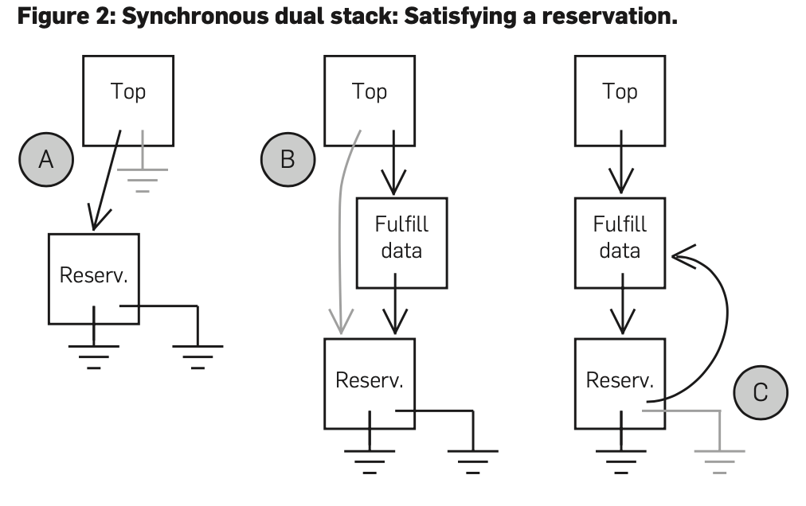

# Scalable Synchronous Queues
> By William N. Scherer III, Doug Lea, and Michael L. Scott

## Abstract 
In a thread-safe concurrent queue, consumers typically wait for producers to make data available. In a synchronous queue, producers similarly wait for consumers to take the data. We present two new nonblocking, contention-free synchronous queues that achieve high performance through a form of duallsism: The underlying data structure may hold both data and, symmetrically, requests.

**在线程安全并发队列中，消费者通常等待生产者提供数据。在同步队列中，生产者同样等待消费者获取数据。我们提出了两种新的非阻塞、无争用的同步队列，它们通过一种二元论形式实现了高性能：底层数据结构可以同时保存数据和对称的请求。**

We present performance results on 16-processor SPARC and 4-processor Opteron machines. We compare our algorithms to commonly used alternatives from the literature and from the Java SE 5.0 class java.util.concurrent.SynchronousQueue both directly in synthetic microbenchmarks and indirectly as the core of Java's ThreadPoolExecutor mechanism. Our new algorithms consistently outperform the JavaSE 5.0 SynchronousQueue by factors of three in unfair mode and 14 in fair mode; this translates to factors of two and ten for the ThreadPoolExecutor. Out synchronous queues have been adopted for inclusion in Java 6.

**我们给出了 16 处理器 SPARC 和 4 处理器 Opteron 机器的性能结果。我们将我们的算法与文献和JavaSE 5.0 类中常用的替代方案进行比较, java.util.concurrent.SynchronousQueue 既可以直接在合成的微基准中使用，也可以间接作为 Java 的 ThreadPoolExecutor 机制的核心。我们的新算法在不公平模式下的性能始终比 Java SE 5.0 SynchronousQueue 高出三倍，在公平模式下高出 14 倍；这转化为 ThreadPoolExecutor 的因子 2 和 10。我们的同步队列已经被用于 Java6 中。**

## 1. Introduction 
Mechanisms to transfer data between threads are among the most fundamental building blcoks of concurrent systems. Shared memory transfers are typically effected via a concurrent data structure that may be known variously as a buffer, a channel, or a concurrent queue. This structure serves to "pair up" producers and consumers. It can also serve to smooth out fluctuations in their relative rates of progress by buffering unconsumed data. This buffering, in systems that provide it, is naturally asymmetric: A consumer that tries to take data from an empty concurrent queue will wait for a producer to perform a  matching put operation; however, a producer need not wait to perform a put unless space has run out. That is, producers can "run ahead" of consumers, but consumers cannot "run ahead" of producers.

**在线程之间传输数据的机制是并发系统最基本的构建块之一。共享内存传输通常通过并发数据结构实现，该数据结构可以被称为缓冲区、通道或并发队列。这种结构用于“配对”生产者和消费者。它还可以通过缓冲未使用的数据来平滑其相对进度的波动。在提供缓冲的系统中，这种缓冲自然是不对称的：试图从空并发队列获取数据的使用者将等待生产者执行匹配的 put 操作；但是，除非空间已用完，否则生产者不必等待执行put。也就是说，生产者可以“先于”消费者，但消费者不能“先于”生产者。**

A synchronous queue provides the "pairing up" function without the buffering; it is entirely symmetric: Producers and consumers wait for one another, "shake hands", and leave in pairs, For decades, synchronous queues have played a prominent role in both the theory and practice of concurrent programming. They constitute the central synchronization primitive of Hoare's CSP and of languages derived from it, and are closely related to the renderzvous of Ada. They are also widely used in message-passing software and in stream-style "hand-off" algorithms. (In this paper we focus on synchronous queues within a multithreaded program, not across address spaces or distributed nodes.)

**同步队列提供“配对”功能，无需缓冲；它是完全对称的：生产者和消费者彼此等待，“握手”，然后结对离开。几十年来，同步队列在并发编程的理论和实践中都扮演着重要的角色。它们构成了 Hoare 的 CSP 及其衍生语言的中心同步原语，并与 Ada 的会合密切相关。它们还广泛应用于消息传递软件和流式“切换”算法中。（在本文中，我们关注多线程程序中的同步队列，而不是跨地址空间或分布式节点的同步队列。）**

Unfortunately, design-level tractability of synchronous queues has often come at the price of poor performance. "Textbook" algorithms for put and take may repeatedly suffer from contention (slowdown due to conflicts with other threads for access to a cache line) and/or blocking (loops or scheduling operations that wait for activity in another thread). Listing 1, for example, shows one of the most commonly used implementations, due to Hanson. It employs three separate semaphores, each of which is a potenial source of contention and (in acquire operations) blocking.

**不幸的是，同步队列的设计级可跟踪性往往以性能差为代价。put 和 take 的“教科书”算法可能会反复遭受争用（由于与其他线程在访问缓存行时发生冲突而导致的速度减慢）和/或阻塞（等待其他线程中活动的循环或调度操作）。例如，清单 1 显示了 Hanson 最常用的实现之一。它使用三个独立的信号量，每个信号量都是争用和（在获取操作中）阻塞的潜在来源。**

The synchronization burden of algorithms like Hanson's is especially significant on modern multicore and multiprocessor machines, where the OS scheduler may take thousands of cycles to block or unblock threads. Even an uncontended semaphore operation usually requires special read-modify-write or memory barrier (fence) instructions, each of which can take tens of cycles.

**像 Hanson 这样的算法的同步负担在现代多核和多处理器机器上尤其重要，在这些机器上，OS调度器可能需要数千个周期来阻塞或解除阻塞线程。即使是非竞争信号量操作通常也需要特殊的读-修改-写或内存屏障（fence）指令，每个指令可能需要几十个周期。**

```
    /**
        Listing 1: Hanson's synchronous queue. Semaphore sync indicates whether item is valid (initally, no); send holds 1 minus the number of pending puts; recv holds 0 minus the number of pending takes.
    */

    public class HansonSQ<E> {
        E item = null;
        Semaphore sync = new Semaphore(0);
        Semaphore send = new Semaphore(1);
        Semaphore recv = new Semaphore(0);

        public E take() {
            recv.acquire();
            E x = item;
            sync.release();
            send.release();
            return x;
        }

        public void put(E x) {
            send.acquire();
            item = x;
            recv.release();
            sync.acquire();
        }
    }
```

+ Semaphores are the original mechanism for scheduler-based synchronization (they date from the mid-1960s). Each semaphore contains a counter and alist of waiting threads. An acquire operation decrements the counter and then waits for it to be nonnegative. A release operation increments the counter and unblocks a waiting thread if the result is nonpositive. In effect, a semaphore functions as a non-synchronous concurrent queue in which the transferred data is null.
+ Read-modify-write instructions (e.g., compare_and_swap [CAS]) facilitate constructing concurrent algorithms via atomic memeory updates. Fences enforce ordering constraints on memeory operations.

+ **信号量是基于调度器的同步的原始机制（可以追溯到20世纪60年代中期）。每个信号量都包含一个计数器和等待线程列表。acquire 操作递减计数器，然后等待其为非负。如果结果为非正，则释放操作会增加计数器并取消阻止等待的线程。实际上，信号量的作用是在传输的数据为空的非同步并发队列。**
+ **CAS 指令 有助于通过原子内存更新构建并发算法。屏障对 memeory 操作强制执行顺序约束。**

It is also difficult to extend Listing 1 and other "classic" synchronous queue algorithms to provide additional functionality. Many applications require poll and offer operations, which take an item only if a producer is already present, or put an item only if a consumer is already waiting (otherwise, these operations return an error). Similarly, many applications require the ability to time out if producers or consumers do not appear within a certain patience interval or if the waitting thread is asynchronously interrupted. In the java.util.concurrent library, one of the ThreadPoolExecutor implementations uses all of these capabilities: Producers deliver tasks to waiting worker threads if immediately availabel, but otherwise create new workder threads. Conversely, worker threads terminate themselves if no work appears within a given keep-alive period (or if the pool is shut down via an interrupt).

**扩展清单 1 和其他“经典”同步队列算法以提供附加功能也很困难。许多应用程序需要 poll 和 offer 操作，这些操作仅在生产者已在场时获取项目，或仅在消费者已在等待时放置项目（否则，这些操作将返回错误）。类似地，如果生产者或消费者没有在一定的耐心间隔内出现，或者如果等待线程异步中断，许多应用程序都需要超时。在 java.util.concurrent 库中，其中一个 ThreadPoolExecutor 实现使用了所有这些功能：生产者将任务交付给等待的工作线程（如果立即可用），但在其他情况下创建新的 worker线程。相反，如果在给定的 keep-alive 期内没有工作出现（或者如果池通过中断关闭），工作线程将自行终止。**

Additionally, applications using synchronous queues vary in their need for fairness: Given multiple waiting producers, it may or may not be important to an application whether the one waiting the longest (or shorest) will be the next to pair up with the next arriving consumer (and vice versa). Since these choices amount to application-level policy decisions, algorithms should minimize imposed constraints. For example, while fairness is often considered a virtue, a thread pool normally runs faster if the most-recently-used waiting worker thread usually receives incoming work, due to the footprint retained in the cache and the translation lookaside buffer.

**此外，使用同步队列的应用程序对公平性的需求各不相同：给定多个等待生产者，对于应用程序来说，等待时间最长（或最短）的生产者是否是下一个与下一个到达的消费者配对（反之亦然）可能很重要，也可能不重要。由于这些选择相当于应用程序级别的策略决策，因此算法应该最小化施加的约束。例如，虽然公平性通常被认为是一种美德，但如果最近使用的等待工作线程通常接收到传入的工作，则线程池通常运行得更快，这是因为缓存和转换查找缓冲区(TLB 快表)中保留了内存占用。**

In this paper we present synchronous queue algorithms that combine a rich programming interface with very low intrinsic overhead. Our algorithms avoid all blocking other than that intrinsic to notion of synchronous handoff: A producer thread must wait until a consumer appears (and vice versa); there is no other way for one thread's delay to impede another's progress. We describe two algorithmic variants: a fair algorithm that ensures strict FIFO ordering and an unfair algorithm that makes no guarantees about ordering (but is actually based on a LIFO stack). Section 2 of this paper presents the background for our approach. Section 3 describes the algorithms and Section 4 presents empirical performance data. We conclude and discuss potenial extensions to this work in Section 5.

**在本文中，我们提出了同步队列算法，它结合了丰富的编程接口和非常低的内在开销。我们的算法避免了除同步切换概念固有的阻塞之外的所有阻塞：生产者线程必须等待消费者出现（反之亦然）；对于一个线程的延迟来说，没有其他方法可以阻碍另一个线程的进程。我们描述了两种算法变体：确保严格FIFO排序的公平算法和不保证排序的不公平算法（但实际上是基于后进先出堆栈）。本文第 2 节介绍了我们的方法的背景。第 3 节介绍了算法，第 4 节介绍了经验性能数据。我们将在第 5 节总结并讨论这项工作的潜在扩展。**

## 2. Background 背景

### 2.1 Nonblocking synchronization
Concurrent dat structures are commonly protected with locks, which enforce mutual exclusion on critical sections executed by different threads. A naive synchonours queue might be protected by a single lock, forcing all put and take operations to execute serially. (A thread that blocked waiting for a peer would of course release the lock, allowing the peer to execute the matching operation.) With a bit of care and a second lock, we might allow one producer and one consumer to execute concurrently in many cases.

**并发数据结构通常使用锁进行保护，锁对不同线程执行的临界区强制执行互斥。一个简单的同步队列可能由一个锁保护，强制所有 put 和 take 操作以串行方式执行。（阻塞等待对等线程的线程当然会释放锁，从而允许对等线程执行匹配操作。）稍微小心一点，再加上第二个锁，我们可能会允许一个生产者和一个消费者在许多情况下同时执行。**

Unfortunately, locks suffer from several serious problems. Among other things, they introduce blocking beyond that required by data structure semantics: If thread A holds a lock that thread B needs, then B must wait, even if A has been preempted and will not run again for quite a while. A multi- programmed system with thread priorities or asynchronous events may suffer spurious deadlocks due to priority inver- sion: B needs the lock A holds, but A cannot run, because B is a handler or has higher priority.

**不幸的是，锁有几个严重的问题。除此之外，它们还引入了数据结构语义所要求的阻塞：如果线程 A 持有线程 B 所需的锁，那么 B 必须等待，即使 A 已被抢占并且在相当长一段时间内不会再次运行。具有线程优先级或异步事件的多编程系统可能由于优先级转换而遭受虚假死锁：B 需要 A 持有的锁，但 A 无法运行，因为 B 是处理程序或具有更高的优先级。**

Nonblocking concurrent objects address these problems by avoiding mutual exclusion. Loosely speaking, their methods ensure that the object’s invariants hold after every single instruction, and that its state can safely be seen—and manipulated—by other concurrent threads. Unsurprisingly, devising such methods can be a tricky business, and indeed the number of data structures for which correct nonblocking implementations are known is fairly small.

**非阻塞并发对象通过避免互斥来解决这些问题。松散地说，他们的方法确保对象的不变量在每条指令后都保持不变，并且它的状态可以被其他并发线程安全地看到和操纵。毫不奇怪，设计这样的方法可能是一件棘手的事情，事实上，已知正确的非阻塞实现的数据结构数量相当少。**

Linearizability is the standard technique for demonstrating that a nonblocking implementation of an object is correct (i.e., that it continuously maintains object invariants). Informally, linearizability “provides the illusion that each operation... takes effect instantaneously at some point between its invocation and its response.”, abstract Orthogonally, nonblocking implementations may provide guarantees of various strength regarding the progress of method calls. In a wait-free implementation, every contending thread is guaranteed to complete its method call within a bounded number of its own execution steps. Wait-free algorithms tend to have unacceptably high overheads in practice, due to the need to finish operations on other threads’ behalf. In a lock-free implementation, some contending thread is guaranteed to complete its method call within a bounded number of any thread’s steps. The algorithms we present in this paper are all lock-free. Some algorithms provide a weaker guarantee known as obstruction freedom; it ensures that a thread can complete its method call within a bounded number of steps in the absence of contention, i.e., if no other threads execute competing methods concurrently.

**线性化是证明对象的非阻塞实现是正确的（即，它持续保持对象不变量）的标准技术。非正式地说，线性化“提供了一种错觉，即每个操作……在其调用和响应之间的某个点瞬间生效。”，从正交角度来看，非阻塞实现可以提供关于方法调用进度的各种强度的保证。在无等待实现中，保证每个争用线程在其自身执行步骤的有限数量内完成其方法调用。由于需要代表其他线程完成操作，无等待算法在实践中往往具有不可接受的高开销。在无锁实现中，某些争用线程保证在任何线程步骤的有限数量内完成其方法调用。本文提出的算法都是无锁的。一些算法提供了一个较弱的保证，称为障碍自由；它确保了在没有争用的情况下（即，如果没有其他线程同时执行争用的方法），线程可以在一定数量的步骤内完成其方法调用。**

### 2.2 Dual data structures
In traditional nonblocking implementations of concurrent objects, every method is total: It has no preconditions that must be satisfied before it can complete. Operations that might normally block before completing, such as dequeuing from an empty queue, are generally totalized to simply return a failure code when their preconditions are not met. By calling the totalized method in a loop until it succeeds, one can simulate the partial operation. This simulation, however, does not necessarily respect our intuition for object semantics. For example, consider the following sequence of events for threads A, B, C, and D:

**在并发对象的传统非阻塞实现中，每个方法都是完整的：它没有必须满足的前提条件才能完成。通常在完成之前可能会阻塞的操作（例如从空队列中退出队列）通常被累加，以便在不满足其先决条件时仅返回故障代码。通过在循环中调用 totalized方法 直到成功，可以模拟部分操作。然而，这种模拟并不一定尊重我们对对象语义的直觉。例如，考虑线程A、B、C和D的以下事件序列：**
```
    A calls dequeue
    B calls dequeue
    C enqueues a 1
    D enqueues a 2
    B’s call returns the 1 
    A’s call returns the 2
```

If thread A’s call to dequeue is known to have started before thread B’s call, then intuitively, we would think that A should get the first result out of the queue. Yet, with the call-in-a-loop idiom, ordering is simply a function of which thread happens to retry its dequeue operation first once data becomes available. Further, each invocation of the totalized method introduces performance-degrading contention for memory–interconnect bandwidth.

**如果已知线程 A 对出列的调用是在线程 B 调用之前开始的，那么直觉上，我们认为 A 应该从队列中获得第一个结果。然而，使用循环调用习惯用法，ordering is simply a function of which (一旦数据可用，线程会首先重试其出列操作)。此外，每次调用 totalized 方法都会导致内存（互连带宽）性能下降。**

As an alternative, suppose we could register a request for a hand-off partner. Inserting this reservation could be done in a nonblocking manner, and checking to see whether a partner has arrived to fulfill our reservation could consist of reading a Boolean flag in the request data structure. A dual data structure, takes precisely this approach: Objects may contain both data and reservations. We divide partial methods into separate, first-class request and follow-up operations, each of which has its own invocation and response. A total queue, for example, would provide dequeue_request and dequeue_followup methods (Listing 2). By analogy with Lamport’s bakery algorithm, the request operation returns a unique ticket that represents the reservation and is then passed as an argument to the follow-up method. The follow-up, for its part, returns either the desired result (if one is matched to the ticket) or, if the method’s precondition has not yet been satisfied, an error indication.

**作为替代方案，假设我们可以注册一个移交合作伙伴的请求。插入此保留可以以非阻塞方式完成，检查合作伙伴是否已到达以完成我们的保留可以包括读取请求数据结构中的 Boolean 标志。双重数据结构正是采用这种方法：对象可能同时包含数据和保留。我们将部分方法分为单独的一级请求和后续操作，每个操作都有自己的调用和响应。例如，total 队列将提供 dequeue_request 和 dequeue_fllowup 方法（清单2）。与 Lamport 的 bakery 算法类似，请求操作返回一个表示预订的唯一 ticket，然后作为参数传递给后续方法。后续操作则返回所需的结果（如果一个结果与 ticket 匹配），或者，如果尚未满足方法的前提条件，则返回错误指示。**

The key difference between a dual data structure and a “totalized” partial method is that linearization of the p_request call allows the dual data structure to determine the fulfillment order for pending requests. In addition, unsuccessful follow-ups, unlike unsuccessful calls to totalized methods, are readily designed to avoid bus or memory contention. For programmer convenience, we provide demand methods, which wait until they can return successfully. Our implementations use both busy-wait spinning and scheduler-based suspension to effect waiting in threads whose preconditions are not met.

**双重数据结构和“总计”部分方法之间的关键区别在于，p_request 调用的线性化允许双重数据结构确定未决请求的实现顺序。此外，不成功的后续操作与对总计方法的不成功调用不同，它易于设计以避免总线或内存争用。为了方便程序员，我们提供了 demand 方法，这些方法将等待它们成功返回。我们的实现使用忙等待旋转和基于调度器的暂停来实现在不满足前提条件的线程中的等待。**

```
Listing 2: Combined operations dequeue pseudocode (enqueue is symmetric)

    datum dequeue(SynchronousQueue Q) {
        reservation r = Q.dequeue_reserve();
        do {
            datum d = Q.dequeue_followup(r);
            if (failed != d) return d;
            /* else deley -- spinning and/or scheduler-based */
        } while (!timed_out());
        if (Q.dequeue_abort(r)) return failed;
        return Q.dequeue_followup(r);
    }

```

When reasoning about progress, we must deal with the fact that a partial method may wait for an arbitrary amount of time (perform an arbitrary number of unsuccessful follow-ups) before its precondition is satisfied. Clearly it is desirable that requests and follow-ups be nonblocking. In practice, good system performance will also typically require that unsuccessful follow-ups not interfere with other threads’ progress. We define a data structure as contention-free if none of its follow-up operations, in any execution, performs more than a constant number of remote memory accesses across all unsuccessful invocations with the same request ticket. On a machine with an invalidation-based cache coherence protocol, a read of location o by thread t is said to be remote if o has been written by some thread other than t since t last accessed it; a write by t is remote if o has been accessed by some thread other than t since t last wrote it. On a machine that cannot cache remote locations, an access is remote if it refers to memory allocated on another node. Compared to the local-spin property, contention freedom allows operations to block in ways other than busy-wait spinning; in particular, it allows other actions to be performed while waiting for a request to be satisfied.

**在对进展进行推理时，我们必须处理这样一个事实，即部分方法在满足其前提条件之前可能会等待任意时间（执行任意数量的不成功后续操作）。显然，请求和后续行动应该是非阻塞的。实际上，良好的系统性能通常还要求不成功的后续操作不会干扰其他线程的进度。我们将数据结构定义为无争用的，如果在任何执行中，它的后续操作都不使用相同的请求票证在所有不成功的调用中执行超过常量的远程内存访问。在使用基于失效的缓存一致性协议的机器上，如果自 t 上次访问位置 o 以来，该位置 o 已由 t 以外的某个线程写入，则 t 线程对该位置 o 的读取称为远程读取；如果自 t 上次写入 o 后，o 已被 t 以外的某个线程访问，则 t 的写入是远程的。在无法缓存远程位置的计算机上，如果访问是指在另一个节点上分配的内存，则访问是远程的。与本地自旋特性相比，争用自由允许操作以非忙等待自旋的方式阻塞；特别是，它允许在等待请求满足时执行其他操作。**

## 3. Algorithm descriptions
In this section we discuss various implementations of synchronous queues. We start with classic algorithms used extensively in production software, then we review newer implementations that improve upon them. Finally, we describe new algorithms.

**在本节中，我们将讨论同步队列的各种实现。我们从生产软件中广泛使用的经典算法开始，然后回顾改进它们的新实现。最后，我们描述了我们的新算法。**

### 3.1 Classic synchronous queues

```
Listing 3: Native synchronous queue


00.    public class NaiveSQ<E> {
01.        boolean putting = false;
02.        E item = null;
03.
04.        public synchronized E take() {
05.            while (item == null)
06.                wait();
07.            E e = item;
08.            item = null;
09.            notifyAll();
10.            return e;
11.        }
12.
13.        public synchronized E put(E e) {
14.            if (e == null) return;
15.            while (putting)
16.                wait();
17.            putting = true;
18.            item = e;
19.            notifyAll();
20.            while (item != null)
21.                wait();
22.            putting = false;
23.            notifyAll();
24.        }
25.    }
```

Perhaps the simplest implementation of synchronous queues is the naive monitor-based algorithm that appears in Listing 3. In this implementation, a single monitor serializes access to a single item and to a putting flag that indicates whether a producer has currently supplied data. Producers wait for the flag to be clear (lines 15–16), set the flag (17), insert an item (18), and then wait until a consumer takes the data (20–21). Consumers await the presence of an item (05–06), take it (07), and mark it as taken (08) before returning. At each point where their actions might potentially unblock another thread, producer and consumer threads awaken all possible candidates (09, 20, 24). Unfortunately, this approach results in a number of wake-ups quadratic in the number of waiting producer and consumer threads; coupled with the high cost of blocking or unblocking a thread, this results in poor performance.

**同步队列最简单的实现可能是清单 3 中显示的基于监视器的算法。在此实现中，单个监视器序列化对单个项的访问，并序列化对 putting 标志的访问，putting 标志指示生产者当前是否提供了数据。生产者等待清除标志（第 15-16 行），设置标志（17），插入项目（18），然后等待消费者获取数据（20-21）。消费者等待数据的出现（05-06），接受数据（07），并在返回前将数据标记为已接受数据（08）。在其操作可能会解锁另一个线程的每一点上，生产者和消费者线程都会唤醒所有可能的候选线程（09、20、24）。不幸的是，这种方法导致了大量等待的生产者和消费者线程数量的二次唤醒；再加上阻塞或取消阻塞线程的高成本，这将导致性能低下。**

Hanson’s synchronous queue (Listing 1) improves upon the naive approach by using semaphores to target wakeups to only the single producer or consumer thread that an operation has unblocked. However, as noted in Section 1, it still incurs the overhead of three separate synchronization events per transfer for each of the producer and consumer; further, it normally blocks at least once per operation. It is possible to streamline some of these synchronization points in common execution scenarios by using a fast-path acquire sequence; this was done in early releases of the dl.util.concurrent package which evolved into java.util.concurrent.

**Hanson 的同步队列（清单1）改进了朴素的方法，使用信号量将唤醒目标仅指向操作已解除阻止的单个生产者或消费者线程。然而，如第 1 节所述，对于生产者和消费者中的每一个，每次传输仍会产生三个单独的同步事件的开销；此外，通常每个操作至少阻塞一次。通过使用快速路径获取序列，可以简化常见执行场景中的一些同步点；这是在早期版本的 dl.util.concurrent 包中完成的，已演变成现在 java.util.concurrent.**

### 3.2 The Java SE 5.0 synchronous queue

```
Listing 4: The Java SE 5.0 SynchronousQueue class, fair (queue-based) version. 
The unfair version uses stacks instead of queues, but is otherwise identical. 
(For clariy, we have omitted details of the way in which AbstractQueuedSynchronizers are used, 
and code to generalize waitingProducers and waitingConsumers to either stacks or queues.)

00      public class Java5SQ<E> {
01          ReentrantLock qlock = new ReentrantLock();
02          Queue waitingProducers = new Queue();
03          Queue waitingConsumers = new Queue();
04
05          static class Node 
06            extends AbstractQueuedSynchronizer {
07              E item;
08              Node next;
09
10              Node(Object x) { item = x; }
11              void waitForTake() { /* (uses AQS) */ }
12              E waitForPut() { /* (uses AQS) */ }
13          }
14
15          public E take() {
16              Node node;
17              boolean mustWait;
18              qlock.lock();
19              node = waitingProducers.pop();
20              if(mustWait = (node == null))
21                  node = waitingConsumers.push(null);
22              qlock.unlock();
23
24              if (mustWait)
25                  return node.waitForPut();
26              else
27                  return node.item;
28              }            
29
30          public void put(E e) {
31              Node node;
32              boolean mustWait;
33              qlock.lock();
34              node = waitingConsumers.pop();
35              if (mustWait = (node == null))
36                  node = waitingProducers.push(e);
37              qlock.unlock();
38
39              if (mustWait)
40                  node.waitForTake();
41              else
42                  node.item = e;
43          }
44      }

```

The Java SE 5.0 synchronous queue (Listing 4) uses a pair of queues (in fair mode; stacks for unfair mode) to separately hold waiting producers and consumers. This approach echoes the scheduler data structures of Anderson et al;.1 it improves con- siderably on semaphore-based approaches. When a producer or consumer finds its counterpart already waiting, the new arrival needs to perform only one synchronization operation: acquiring a lock that protects both queues (line 18 or 33). Even if no counterpart is waiting, the only additional synchroniza- tion required is to await one (25 or 40). A transfer thus requires only three synchronization operations, compared to the six incurred by Hanson’s algorithm. In particular, using a queue instead of a semaphore allows producers to publish data items as they arrive (line 36) instead of having to first awaken after blocking on a semaphore; consumers need not wait.

**JavaSE 5.0 同步队列（清单4）使用一对队列（在公平模式下；堆栈用于不公平模式）分别容纳等待的生产者和消费者。这种方法与 Anderson 等人的调度器数据结构相呼应；。它全面改进了基于信号量的方法。当生产者或消费者发现其对应方已在等待时，新到达者只需执行一个同步操作：获取一个保护两个队列的锁（第18行或第33行）。即使没有对手在等待，唯一需要的额外同步是等待一个（25或40）。因此，一次传输只需要三次同步操作，而汉森算法需要六次同步操作。特别是，使用队列而不是信号量允许生产者在数据项到达时发布数据项（第36行），而不必在阻塞信号量后首先唤醒；消费者不必等待。**

### 3.3 Combining dual data structures with synchronous queues
A key limitation of the Java SE 5.0 SynchronousQueue class is its reliance on a single lock to protect both queues. Coarsegrained synchronization of this form is well known for introducing serialization bottlenecks; by creating nonblocking implementations, we eliminate a major impediment to scalability.

**JavaSE 5.0 SynchronousQueue 类的一个关键限制是它依赖一个锁来保护两个队列。这种形式的粗粒度同步以引入序列化瓶颈而闻名；通过创建非阻塞实现，我们消除了可伸缩性的主要障碍。**

Our new algorithms add support for time-out and for bidirectional synchronous waiting to our previous nonblocking dual queue and dual stack algorithms (those in turn were derived from the classic Treiber stack and the M&S queue). The nonsynchronous dual data structures already block when a consumer arrives before a producer; our challenge is to arrange for producers to block until a consumer arrives as well. In the queue, waiting is accomplished by spinning until a pointer changes from null to non-null, or vice versa; in the stack, it is accomplished by pushing a “fulfilling” node and arranging for adjacent matching nodes to “annihilate” one another.

**我们的新算法为我们以前的非阻塞双队列和双堆栈算法（这些算法又源自经典的 Treiber 堆栈和 M&S 队列）添加了对超时和双向同步等待的支持。当消费者在生产者之前到达时，非同步双数据结构已经阻塞；我们面临的挑战是安排生产者在消费者到来之前进行封锁。在队列中，等待是通过旋转来完成的，直到指针从null 变为非 null，反之亦然；在堆栈中，它是通过推动一个“实现”节点并安排相邻的匹配节点彼此“消灭”来实现的。**

We describe basic versions of the synchronous dual queue and stack in the sections “The synchronous dual queue” and “The synchronous dual stack,” respectively. The section “Time-out” then sketches the manner in which we add time-out support. The section “Pragmatics” discusses additional pragmatic issues. Throughout the discussion, we present fragments of code to illustrate particular features; full source is available online at http://gee.cs.oswego .edu /cgi-bin /viewcvs.cgi/jsr166/src/main/java/util/concurrent/ SynchronousQueue.java.

**我们分别在 “The synchronous dual queue” 和 “The synchronous dual stack” 部分描述了同步双队列和堆栈的基本版本。“Time-out” 一节随后概述了我们添加超时支持的方式。“Pragmatics”一节讨论了其他语用问题。在整个讨论过程中，我们展示了代码片段以说明特定的功能；完整资料来源可在以下网址获得：http://gee.cs.oswego.edu/cgi-bin/viewcvs.cgi/jsr166/src/main/java/util/concurrent/SynchronousQueue.java**

#### The Synchronous Dual Queue

```
Listing 5: Synchronous dual queue: Spin-based enqueue; dequeue is symmetric except for the direction of data transfer. 
The various cas field (old, new) operations attempt to change field from old to new, and return a success/failure indication. 
On modern processors they can be implemented with a single atomic compare_and_swap instruction, or its equivalent.

00    Class Node { E data; Node next; ...}
01
02    void enqueue(E e) {
03        Node offer = new Node(e, Data);
04
05        while (true) {
06            Node t = tail;
07            Node h = head;
08            if (h == t || !t.isRequest()) {
09                Node n = t.next;
10                if (t == tail) {
11                    if (null != n) {
12                        casTail(t, n);
13                    } else if (t.casNext(n, offer)) {
14                        casTail(t, offer);
15                        while (offer.data == e)
16                            /* spin */;
17                        h = head;
18                        if (offer == h.next)
19                            casHead(h, offer);
20                        return;
21                    }
22                }
23            } else {
24                Node h = h.next;
25                if (t != tail || h != head || n == null)
26                    continue; // inconsistent snapshot
27                boolean success = n.casData(null, e);
28                casHead(h, n);
29                if (success)
30                    return;
31            }
32        }
33    }

```

We represent the synchronous dual queue as a singly linked list with head and tail pointers. The list may contain data nodes or request nodes (reservations), but never both at once. Listing 5 shows the enqueue method. (Except for the direction of data transfer, dequeue is symmetric.) To enqueue, we first read the head and tail pointers (lines 06–07). From here, there are two main cases. The first occurs when the queue is empty (h == t) or contains data (line 08). We read the next pointer for the tailmost node in the queue (09). If all values read are mutually consistent (10) and the queue’s tail pointer is current (11), we attempt to insert our offering at the tail of the queue (13–14). If successful, we wait until a consumer signals that it has claimed our data (15–16), which it does by updating our node’s data pointer to null. Then we help remove our node from the head of the queue and return (18–20). The request linearizes in this code path at line 13 when we successfully insert our offering into the queue; a successful follow-up linearizes when we notice at line 15 that our data has been taken.

**我们将同步双队列表示为带有头指针和尾指针的单链表。该列表可能包含数据节点或请求节点（保留），但决不能同时包含这两个节点。清单 5 显示了入队方法。（除数据传输方向外，出列是对称的。）为了排队，我们首先读取了头指针和尾指针（第06-07行）。从这里开始，有两个主要情况。第一个发生在队列为空（h == t）或包含数据（第08行）时。我们读取队列中最后一个节点的下一个指针（09）。如果读取的所有值都是相互一致的（10），并且队列的尾部指针是当前的（11），那么我们将尝试在队列的尾部插入我们的 offering（13–14）。如果成功，我们将等待消费者发出信号，表明它已声明了我们的数据（15–16），这是通过将节点的数据指针更新为 null 实现的。然后，我们帮助从队列的头部移除节点并返回（18-20）。当我们成功地将数据节点插入队列时，请求在第 13 行的代码路径中线性化；当我们注意到在第 15 行已获取数据时，成功的后续线性化。**

The other case occurs when the queue consists of reservations, and is depicted in Figure 1. After originally reading the head node (step A), we read its successor (line 24/step B) and verify consistency (25). Then, we attempt to supply our data to the headmost reservation (27/C). If this succeeds, we dequeue the former dummy node (28/D) and return (30). If it fails, we need to go to the next reservation, so we dequeue the old dummy node anyway (28) and retry the entire operation (32, 05). The request linearizes in this code path when we successfully supply data to a waiting consumer at line 27; the follow-up linearization point occurs immediately thereafter.

**另一种情况发生在队列由请求结点组成时，如图 1 所示。最初读取头部结点（步骤A）后，我们读取其后续节点（第 24 行/步骤 B）并验证一致性（25）。然后，我们尝试将数据提供给最前端的保留结点（27/C）。如果成功，我们将前一个虚拟节点（28/D）退出队列并返回（30）。如果失败，我们需要转到下一个保留结点，因此我们将旧的虚拟节点退出队列（28），然后重试整个操作（32，05）。当我们在第 27 行成功地向等待的消费者提供数据时，请求在此代码路径中线性化；随后立即出现后续线性化点。**


#### The Synchronous Dual Stack
We represent the synchronous dual stack as a singly linked list with head pointer. Like the dual queue, the stack may contain either data or reservations, except that in this case there may, temporarily, be a single node of the opposite type at the head.

**我们将同步双堆栈表示为带有头指针的单链表。与双队列一样，堆栈可能包含数据结点或保留结点，但在这种情况下，头部可能暂时存在一个相反类型的单个节点。**

```
Listing 6: Synchronous dual stack: Spin-based annihilating push; 
pop is symmetric except for the direction of data transfer. 
(For clarity, code for time-out is omitted.)


00    Class Node { E data; Node next, match; ...}
01
02    void push (E e) {
03        Node f, d = new Node(e, Data);
04
05        while (true) {
06            Node h = head;
07            if (null == h || h.isData()) {
08                d.next = h;
09                if (!casHead(h, d))
10                    continue;
11                while (d.match == null)
12                    /* spin */;
13                h = head;
14                if (null != h && d == h.next)
15                    casHead(h, d.next);
16                return;
17            } else if (h.isRequest()) {
18                f = new Node(e, Data | Fulfilling, h);
19                if (!casHead(h, f))
20                    continue;
21                h = f.next;
22                Node n = h.next;
23                h.casMatch(null, f);
24                casHead(f, n);
25                return;
26            } else {  // h is fulfilling
27                Node n = h.next;
28                Node nn = n.next;
29                n.casMatch(null, h);
30                casHead(h, nn);
31            }
32        }
33    }
```

Code for the push operation appears in Listing 6. (Except for the direction of data transfer, pop is symmetric.) We begin by reading the node at the top of the stack (line 06). The three main conditional branches (beginning at lines 07, 17, and 26) correspond to the type of node we find.

**push 操作的代码如清单 6 所示。（除数据传输方向外，pop 是对称的。）我们首先读取堆栈顶部的节点（第 06 行）。三个主要条件分支（从第 07、17 和 26 行开始）对应于我们找到的节点类型。**

The first case occurs when the stack is empty or contains only data (line 07). We attempt to insert a new datum (09), and wait for a consumer to claim that datum (11–12) before returning. The reservation linearizes in this code path when we push our datum at line 09; a successful follow-up linear- izes when we notice that our data has been taken at line 11.

**第一种情况发生在堆栈为空或仅包含数据结点时（第 07 行）。我们尝试插入一个新的数据（09），并等待消费者在返回之前声明该数据（11-12）。当我们将基准推到第 09 行时，保留在该代码路径中线性化；当我们注意到我们的数据已在第 11 行采集时，成功的后续线性化。**

The second case occurs when the stack contains (only) reservations (17). We attempt to place a fulfilling datum on the top of the stack (19); if we succeed, any other thread that wishes to perform an operation must now help us fulfill the request before proceeding to its own work. We then read our way down the stack to find the successor node to the reservation we are fulfilling (21–22) and mark the reservation fulfilled (23). Note that our CAS could fail if another thread helps us and performs it first. Finally, we pop both the reservation and our fulfilling node from the stack (24) and return. The reservation linearizes in this code path at line 19, when we push our fulfilling datum above a reservation; the follow-up linearization point occurs immediately thereafter.

**第二种情况发生在堆栈包含（仅）保留结点（17）时。我们试图在堆栈顶部放置一个符合要求的数据（19）；如果我们成功了，任何希望执行操作的其他线程现在都必须帮助我们完成请求，然后才能继续自己的工作。然后，我们沿着堆栈往下读，找到我们正在实现的保留的后续节点（21–22），并标记保留已实现（23）。请注意，如果另一个线程帮助我们并首先执行，我们的 CAS 可能会失败。最后，我们从堆栈（24）中弹出保留和履行节点并返回。当我们将实现数据推到保留之上时，保留在第 19 行的代码路径中线性化；随后立即出现后续线性化点。**

The remaining case occurs when we find another thread’s fulfilling datum or reservation (26) at the top of the stack. We must complete the pairing and annihilation of the top two stack nodes before we can continue our own work. We first read our way down the stack to find the data or reservation for which the fulfilling node is present (27–28) and then we mark the underlying node as fulfilled (29) and pop the paired nodes from the stack (30).

**当我们在堆栈顶部找到另一个线程的实现数据或保留（26）时，就会出现剩余的情况。在继续我们自己的工作之前，我们必须完成顶部两个堆栈节点的配对和消除。我们首先沿着堆栈往下读，找到满足节点所在的数据或保留（27–28），然后将底层节点标记为满足（29），并从堆栈中弹出成对节点（30）。**



Referring to Figure 2, when a consumer wishes to retrieve data from an empty stack, it first must insert a reservation (step A). It then waits until its data pointer (branching to the right) is non-null. Meanwhile, if a producer appears, it satisfies the consumer in a two-step process. First (step B), it pushes a fulfilling data node at the top of the stack. Then, it swings the reservation’s data pointer to its fulfilling node (step C). Finally, it updates the top-of-stack pointer to match the reservation node’s next pointer (step D, not shown). After the producer has completed step B, other threads can help update the reservation’s data pointer (step C); and the consumer thread can additionally help remove itself from the stack (step D).

**参考图2，当使用者希望从空堆栈检索数据时，它首先必须插入保留（步骤a）。然后等待，直到其数据指针（向右分支）为非空。同时，如果一个生产者出现，它将通过两步过程满足消费者。首先（步骤B），它在堆栈顶部推送一个数据节点。然后，它将保留的数据指针摆动到其实现节点（步骤C）。最后，它更新栈顶指针以匹配保留节点的下一个指针（步骤D，未显示）。生产者完成步骤B后，其他线程可以帮助更新保留的数据指针（步骤C）；消费者线程还可以帮助将自己从堆栈中移除（步骤D）。**

#### Time-Out
Although the algorithms presented in the sections “The Synchronous Dual Queue” and “The Synchronous Dual Stack” are complete implementations of synchronous queues, real systems require the ability to specify limited patience so that a producer (or consumer) can time out if no consumer (producer) arrives soon enough to pair up. As noted earlier, Hanson’s synchronous queue offers no simple way to do this. Space limitations preclude discussion of the relatively straightforward manner in which we add time-out support to our synchronous queue; interested readers may find this information in our original publication.

**尽管 “The Synchronous Dual Queue” 和 “The Synchronous Dual Stack” 部分中介绍的算法是同步队列的完整实现，但实际系统需要能够指定有限的耐心，以便在没有消费者（生产者）及时到达配对时，生产者（或消费者）可以超时。如前所述，Hanson 的同步队列没有提供简单的方法来实现这一点。由于空间限制，我们无法讨论向同步队列添加超时支持的相对简单的方式；感兴趣的读者可以在我们的原始出版物中找到这些信息。**

#### Pragmatics
Our synchronous queue implementations reflect a few additional pragmatic considerations to maintain good performance. First, because Java does not allow us to set flag bits in pointers (to distinguish among the types of pointed-to nodes), we add an extra word to nodes, in which we mark mode bits. We chose this technique over two primary alternatives. The class java.util.concurrent.AtomicMarkableReference allows direct association of tag bits with a pointer, but exhibits very poor performance. Using runtime type identification (RTTI) to distinguish between multiple subclasses of the Node classes would similarly allow us to embed tag bits in the object type information. While this approach performs well in isolation, it increases long-term pressure on the JVM’s memory allocation and garbage collection routines by requiring construction of a new node after each contention failure.

**我们的同步队列实现反映了一些额外的实用注意事项，以保持良好的性能。首先，因为 Java 不允许我们在指针中设置标志位（以区分指向节点的类型），所以我们向节点添加一个额外的字，在其中标记模式位。我们选择了这种技术，而不是两种主要的选择。java.util.concurrent.AtomicMarkableReference 允许标记位与指针直接关联，但性能非常差。使用运行时类型标识（RTTI）来区分节点类的多个子类将类似地允许我们在对象类型信息中嵌入标记位。虽然这种方法在隔离状态下表现良好，但由于每次争用失败后都需要构造一个新节点，因此增加了JVM内存分配和垃圾收集例程的长期压力。**

Time-out support requires careful management of memory ownership to ensure that canceled nodes are reclaimed properly. Automatic garbage collection eases the burden in Java. We must, however, take care to “forget” references to data, nodes, and threads that might be retained for a long time by blocked threads (preventing the garbage collector from reclaiming them).

**超时支持需要仔细管理内存所有权，以确保正确回收已取消的节点。自动垃圾收集减轻了 Java 中的负担。但是，我们必须注意“忘记”对数据、节点和线程的引用，这些引用可能会被阻塞的线程保留很长时间（防止垃圾收集器回收它们）。**

The simplest approach to time-out involves marking nodes as “canceled,” and abandoning them for another thread to eventually unlink and reclaim. If, however, items are offered at a very high rate, but with a very low time-out patience, this “abandonment” cleaning strategy can result in a long-term build-up of canceled nodes, exhausting memory supplies and degrading performance. It is important to effect a more sophisticated cleaning strategy. Space limitations preclude further discussion here, but interested readers may find more details in the conference version of this paper.

**最简单的超时方法是将节点标记为“已取消”，然后将其放弃给另一个线程以最终取消链接并回收。但是，如果项目以非常高的速率提供，但超时耐心非常低，那么这种“放弃”清理策略可能会导致被取消节点的长期累积，耗尽内存供应并降低性能。重要的是实施更复杂的清洁策略。由于篇幅有限，此处无法进行进一步讨论，但感兴趣的读者可以在本文的会议版本中找到更多细节。**

For sake of clarity, the synchronous queues of Figures 5 and 6 blocked with busy-wait spinning to await a counterpart consumer. In practice, however, busy-wait is useless overhead on a uniprocessor and can be of limited value on even a small-scale multiprocessor. Alternatives include descheduling a thread until it is signaled, or yielding the processor within a spin loop. In practice, we mainly choose the spin-then-yield approach, using the park and unpark methods contained in java.util.concurrent.locks.LockSupport to remove threads from and restore threads to the ready list. On multiprocessors (only), nodes next in line for fulfillment spin briefly (about one-quarter the time of a typical context switch) before parking. On very busy synchronous queues, spinning can dramatically improve throughput because it handles the case of a near-simultaneous “flyby” between a producer and consumer without stalling either. On less busy queues, the amount of spinning is small enough not to be noticeable.

**为了清楚起见，图 5 和图 6 中的同步队列被繁忙的等待旋转阻塞，以等待对应的消费者。然而，在实践中，繁忙等待在单处理器上是无用的开销，即使在小规模的多处理器上也是有限的。替代方案包括重新调度线程，直到发出信号为止，或者在旋转循环中产生处理器。在实践中，我们主要使用 java.util.concurrent.locks.LockSupport 中包含的 park 和 unpark 方法，选择先 spin-then-yield 的方法。从就绪列表中删除线程并将线程恢复到就绪列表。在多处理器（仅限）上，下一个排队等待实现的节点在停止前短暂旋转（大约是典型上下文切换时间的四分之一）。在非常繁忙的同步队列上，旋转可以显著提高吞吐量，因为它可以处理生产者和消费者之间几乎同时发生的“飞越”情况，而不会出现停滞。在不太繁忙的队列中，旋转的数量很小，以至于不明显。**

## Experimental Resuls
We present results for several microbenchmarks and one “real-world” scenario. The microbenchmarks employ threads that produce and consume as fast as they can; this represents the limiting case of producer-consumer applications as the cost to process elements approaches zero. We consider producer-consumer ratios of 1 : N, N : 1, and N : N.

我们展示了几个微基准点和一个“真实世界”场景的结果。微基准测试使用的线程能够以最快的速度生产和消费；这代表了生产者-消费者应用程序的极限情况，因为处理元素的成本接近于零。我们认为生产者-消费者比率为1：N，N：1，和N:N。

Our “real-world” scenario instantiates synchronous queues as the core of the Java SE 5.0 class java.util.concurrent.ThreadPoolExecutor, which in turn forms the backbone of many Java-based server applications. Our benchmark produces tasks to be run by a pool of worker threads managed by the ThreadPoolExecutor.

我们的“真实世界”场景将同步队列实例化为 JavaSE 5.0 类 java.util.concurrent.ThreadPoolExecutor，它又形成了许多基于 Java 的服务器应用程序的主干。我们的基准测试生成由 ThreadPoolExecutor 管理的工作线程池运行的任务。

We obtained results on a SunFire V40z with four 2.4GHz AMD Opteron processors and on a SunFire 6800 with 16 1.3GHz Ultra-SPARC III processors. On both machines, we used Sun’s Java SE 5.0 HotSpot VM and we varied the level of concurrency from 2 to 64. We tested each bench- mark with both the fair and unfair (stack-based) versions of the Java SE 5.0 java.util.concurrent.SynchronousQueue, Hanson’s synchronous queue, and our new nonblocking algorithms.

我们在配备四个 2.4GHz AMD Opteron 处理器的 SunFire V40z 和配备 16 个 1.3GHz Ultra SPARC III 处理器的 SunFire 6800 上获得了结果。在这两台机器上，我们都使用 Sun 的 JavaSE5.0 HotSpot 虚拟机，并将并发级别从 2 更改为 64。我们使用Java SE 5.0 java.util.concurrent.SynchronousQueue、Hanson的同步队列和我们新的非阻塞算法。公平和不公平（基于堆栈）版本测试了每个基准点。

Figure 3 displays the rate at which data is transferred from multiple producers to multiple consumers; Figure 4 displays the rate at which data is transferred from a single producer to multiple consumers; Figure 5 displays the rate at which a single consumer receives data from multiple producers. Figure 6 presents execution time per task for our ThreadPoolExecutor benchmark.

图 3 显示了数据从多个生产者传输到多个消费者的速率；图 4 显示了数据从单个生产者传输到多个消费者的速率；图 5 显示了单个消费者从多个生产者接收数据的速率。图 6 显示了 ThreadPoolExecutor基准测试中每个任务的执行时间。

As can be seen from Figure 3, Hanson’s synchronous queue and the Java SE 5.0 fair-mode synchronous queue both perform relatively poorly, taking 4 (Opteron) to 8 (SPARC) times as long to effect a transfer relative to the faster algo- rithms. The unfair (stack-based) Java SE 5.0 synchronous queue in turn incurs twice the overhead of either the fair or unfair version of our new algorithm, both versions of which are comparable in performance. The main reason that the Java SE 5.0 fair-mode queue is so much slower than unfair is that the fair-mode version uses a fair-mode entry lock to ensure FIFO wait ordering. This causes pileups that block the threads that will fulfill waiting threads. This difference supports our claim that blocking and contention surrounding the synchronization state of synchronous queues are major impediments to scalability.

从图3可以看出，Hanson的同步队列和 Java SE 5.0 公平模式同步队列的性能都相对较差，相对于速度更快的算法，需要4（Opteron）到 8（SPARC）倍的时间才能实现传输。不公平的（基于堆栈的）JavaSE5.0 同步队列反过来会产生两倍于我们新算法的公平或不公平版本的开销，这两个版本的性能相当。JavaSE 5.0 公平模式队列比不公平队列慢得多的主要原因是公平模式版本使用公平模式入口锁来确保 FIFO 等待顺序。这会导致阻塞将执行等待线程的线程的堆。这种差异支持我们的观点，即围绕同步队列的同步状态的阻塞和争用是可伸缩性的主要障碍。

When a single producer struggles to satisfy multiple con- sumers (Figure 4), or a single consumer struggles to receive data from multiple producers (Figure 5), the disadvantages of Hanson’s synchronous queue are accentuated. Because the singleton necessarily blocks for every operation, the time it takes to produce or consume data increases notice- ably. Our new synchronous queue consistently outperforms the Java SE 5.0 implementation (fair vs. fair and unfair vs. unfair) at all levels of concurrency.

当一个生产者努力满足多个消费者（图4）或一个消费者努力从多个生产者接收数据（图5）时，Hanson 同步队列的缺点就更加突出了。因为每个操作都需要单例阻塞，所以生成或使用数据所需的时间会显著增加。在所有并发级别上，我们新的同步队列始终优于 JavaSE 5.0 实现（公平与公平、不公平与不公平）。

Finally, in Figure 6, we see that the performance differentials from java.util.concurrent’s SynchronousQueue translate directly into overhead in the ThreadPoolExecutor: Our new fair version outperforms the Java SE 5.0 implementation by factors of 14 (SPARC) and 6 (Opteron); our unfair version outperforms Java SE 5.0 by a factor of three on both platforms. Interestingly, the relative performance of fair and unfair versions of our new algorithm differs between the two platforms. Generally, unfair mode tends to improve locality by keeping some threads “hot” and others buried at the bottom of the stack. Conversely, however, it tends to increase the number of times threads are scheduled and descheduled. On the SPARC, context switches have a higher relative overhead compared to other factors; this is why our fair synchronous queue eventually catches and surpasses the unfair version’s performance. In contrast, the cost of context switches is relatively smaller on the Opteron, so the trade-off tips in favor of increased locality and the unfair version performs best.

最后，在图 6 中，我们看到性能与 java.util.concurrent.SynchronousQueue 直接转化为ThreadPoolExecutor 中的开销：我们新的 fair 版本比 Java SE 5.0实现的性能好 14倍（SPARC）和 6倍（Opteron）；我们的版本在两种平台上的性能都比 JavaSE 5.0 高出三倍。有趣的是，我们的新算法的公平版本和不公平版本在两个平台之间的相对性能不同。通常，不公平模式倾向于通过保持某些线程“热”而将其他线程埋在堆栈底部来改进局部性。相反，它倾向于增加线程的调度和取消调度次数。在 SPARC 上，与其他因素相比，上下文切换具有更高的相对开销；这就是为什么我们的公平同步队列最终捕获并超过了不公平版本的性能。相比之下，Opteron 上上下文切换的成本相对较小，因此有利于增加局部性和不公平版本的权衡技巧表现最好。

Across all benchmarks, our fair synchronous queue universally outperforms all other fair synchronous queues and our unfair synchronous queue outperforms all other unfair synchronous queues, regardless of preemption or level of concurrency.

在所有基准测试中，我们的公平同步队列总体上优于所有其他公平同步队列，我们的不公平同步队列优于所有其他不公平同步队列，无论抢占或并发级别如何。

## Conclusion
In this paper, we have presented two new lock-free and contention-free synchronous queues that outperform all previously known algorithms by a wide margin. In striking contrast to previous implementations, there is little performance cost for fairness.

在本文中，我们提出了两种新的无锁和无争用的同步队列，它们的性能大大优于所有以前已知的算法。与以前的实现形成鲜明对比的是，公平性几乎没有性能成本。

In a head-to-head comparison, our algorithms consistently outperform the Java SE 5.0 SynchronousQueue by a factor of three in unfair mode and up to a factor of 14 in fair mode. We have further shown that this performance differential translates directly to factors of two and ten when substituting our new synchronous queue in for the core of the Java SE 5.0 ThreadPoolExecutor, which is itself at the heart of many Java-based server implementations. Our new synchronous queues have been adopted for inclusion in Java 6.

在头对头的比较中，我们的算法在不公平模式下的性能相当于 Java SE 5.0 SynchronousQueue 的三倍，在公平模式下的性能相当于 Java SE 5.0 SynchronousQueue 的14倍。我们还进一步表明，在将新的同步队列替换为Java SE 5.0 ThreadPoolExecutor的核心时，这种性能差异直接转化为 2 和 10 的系数，而Java SE 5.0 ThreadPoolExecutor 本身就是许多基于 Java 的服务器实现的核心。我们的新同步队列已被采用，以包含在 Java6 中。

More recently, we have extended the approach described in this paper to TransferQueues. TransferQueues permit producers to enqueue data either synchronously or asynchronously. TransferQueues are useful for example in supporting messaging frameworks that allow messages to be either synchronous or asynchronous. The base synchronous support in TransferQueues mirrors our fair synchronous queue. The asynchronous additions differ only by releasing producers before items are taken.

最近，我们将本文中描述的方法扩展到了 TransferQueues。TransferQueues 允许生产者同步或异步地将数据排队。例如，TransferQueues 在支持允许消息同步或异步的消息传递框架方面非常有用。TransferQueues 中的基本同步支持反映了我们的公平同步队列。异步添加的不同之处仅在于在获取数据之前释放生产者。

Although we have improved the scalability of the synchronous queue, there may remain potential for improvement in some contexts. Most of the inter-thread contention in enqueue and dequeue operations occurs at the memory containing the head (and, for fair queues, tail). Reducing such contention by spreading it out is the idea behind elimination techniques introduced by Shavit and Touitou. These may be applied to components featuring pairs of operations that collectively effect no change to a data structure, for example, a concurrent push and pop on a stack. Using elimination, multiple locations (comprising an arena) are employed as potential targets of the main atomic instructions underlying these operations. If two threads meet in one of these lower-traffic areas, they cancel each other out. Otherwise, the threads must eventually fall back (usually, in a tree-like fashion) to try the main location.

尽管我们改进了同步队列的可伸缩性，但在某些情况下仍有改进的潜力。入队和出队操作中的大多数线程间争用发生在包含头部（以及，对于公平队列，尾部）的内存中。Shavit 和 Touitou 引入的消除技术背后的思想是通过传播来减少这种争论。这些可应用于具有成对操作的组件，这些操作共同不会对数据结构产生任何更改，例如，堆栈上的并发推送和弹出。使用消去法，多个位置（包括一个竞技场）被用作这些操作背后的主要原子指令的潜在目标。如果两个线程在其中一个流量较低的区域相遇，它们会相互抵消。否则，线程最终必须后退（通常以树状方式）以尝试主位置。

Elimination techniques have been used by Hendler et al.4 to improve the scalability of stacks, and by us18 to improve the scalability of the swapping channels in the java.util.concurrent Exchanger class. Moir et al. have also used elimination in concurrent queues, although at the price of weaker ordering semantics than desired in some applications due to stack-like (LIFO) operation of the elimination arena.Similar ideas could be applied to our synchronous queues. However, to be worthwhile here, the reduced contention benefits would need to outweigh the delayed release (lower throughput) experienced when threads do not meet in arena locations. In preliminary work, we have found elimination to be beneficial only in cases of artificially extreme contention. We leave fuller exploration to future work.

Hendler 等人使用消除技术来提高堆栈的可伸缩性，us 使用消除技术来提高 java.util.concurrent.Exchanger 类中交换通道的可伸缩性。Moir 等人也在并发队列中使用了消除，尽管由于消除竞技场的堆栈式（LIFO）操作，其代价是排序语义比某些应用程序中所期望的要弱。类似的想法也可以应用于我们的同步队列。然而，为了在这里有所价值，减少争用的好处需要超过线程在竞技场位置不相遇时所经历的延迟释放（较低的吞吐量）。在前期工作中，我们发现只有在人为极端争论的情况下，消除才是有益的。我们把更充分的探索留给未来的工作。