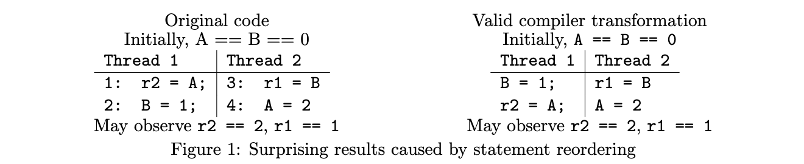

# JSR-133: Java™ Memory Model and Thread Specification
> August 24, 2004

This document is the JSR-133 specification, the Java™ Memory Model and Thread Specification (JMM), as developed by the JSR-133 expert group. This specification is part of the JSR-176 umbrella for the Tiger (5.0) release of the Java™ platform, and the normative contents of this specification will be incorporated into The Java™ Language Specification (JLS), The Java™ Virtual Machine Specification (JVMS), and the specification for classes in the java.lang package. This JSR-133 specification will not be further maintained or changed through the JCP. All future updates, corrections and clarifications to the normative text will occur in those other documents.

本文档是 JSR-133 规范，即 Java™ 内存模型和线程规范（JMM），由 JSR-133 专家组制定。本规范是 Java™ 平台 Tiger (5.0) 版本的 JSR-176 保护伞的一部分，本规范的规范性内容将被纳入《Java™ 语言规范》（JLS）、《Java™ 虚拟机规范》（JVMS）以及 java.lang 包中的类规范。本 JSR-133 规范将不会通过JCP 进一步维护或修改。对规范文本的所有未来更新、修正和澄清都将发生在这些其他文件中。

The normative contents of this specification are contained in Sections 5, 7, 9.2, 9.3, 11, 12,14, 15 and 16. The other sections, as well as portions of the above mentioned sections, contain non-normative text that is intended to explain and clarify the normative text. In case of a conflict between the normative text and the non-normative text, the normative text stands. 

本规范的规范性内容包含在第5、7、9.2、9.3、11、12、14、15 和 16 节。其他章节以及上述章节的部分内容包含了非规范性文本，旨在解释和澄清规范性文本。如果规范性文本和非规范性文本之间发生冲突，则以规范性文本为准。

The discussion and development of this specification has been unusually detailed and technical, involving insights and advances in a number of academic topics. This discussion is archived (and continues) at the JMM web site. The web site provides additional information that may help in understanding how this specification was arrived at; it is located at http://www.cs.umd.edu/~pugh/java/memoryModel/

本规范的讨论和发展是异常详细和技术性的，涉及一些学术课题的见解和进展。这种讨论在 JMM 网站上被存档（并继续进行）。该网站提供了额外的信息，可能有助于理解本规范是如何达成的；它位于 http://www.cs.umd.edu/~pugh/java/memoryModel/。

That web site and mailing list will continue to be updated and maintained, and further updates and expansion of non-normative text intended to help people understand the JSR-133 specification will be available from that web site.

该网站和邮件列表将继续被更新和维护，旨在帮助人们理解 JSR-133 规范的非规范性文本的进一步更新和扩展将在该网站上提供。

Two changes from the original specification in the JLS are most likely to require that JVM™ implementations be changed:

在 JLS 中，有两处对原始规范的修改最有可能要求改变 JVM™ 的实现。

+ The semantics of volatile variables have been strengthened to have acquire and release semantics. In the original specification, accesses to volatile and non-volatile variables could be freely ordered. (volatile 变量的语义已被加强，具有获取和释放的语义。在最初的规范中，对 volatile 变量和 volatile 变量的访问可以自由排序。)
+ The semantics of final fields have been strengthened to allow for thread-safe immutatability without explicit synchronization. This may require steps such as store-store barriers at the end of constructors in which final fields are set. ( final 字段的语义得到了加强，允许在没有显式同步的情况下实现线程安全的不变性。这可能需要一些步骤，比如在设置最终字段的构造函数的末尾设置 store-store 屏障。)

[TOC]

## 1 Introduction
Java™ virtual machines support multiple threads of execution. Threads are represented by the Thread class. The only way for a user to create a thread is to create an object of this class; each thread is associated with such an object. A thread will start when the start() method is invoked on the corresponding Thread object.

Java™ 虚拟机支持多个执行线程。线程由 Thread 类表示。用户创建线程的唯一方法是创建这个类的一个对象；每个线程都与这样一个对象相关。一个线程将在相应的 Thread 对象上调用 start() 方法时启动。

The behavior of threads, particularly when not correctly synchronized, can be confusing and counterintuitive. This specification describes the semantics of multithreaded programs written in the Java™ programming language; it includes rules for which values may be seen by a read of shared memory that is updated by multiple threads. As the specification is similar to the memory models for different hardware architectures, these semantics are referred to as the Java memory model.

线程的行为，特别是在没有正确同步的情况下，可能会令人困惑和反直觉。本规范描述了用 Java™ 编程语言编写的多线程程序的语义；它包括由多个线程更新的共享内存的读取可以看到哪些值的规则。由于该规范与不同硬件架构的内存模型相似，这些语义被称为 Java 内存模型。

These semantics do not describe how a multithreaded program should be executed. Rather, they describe the behaviors that multithreaded programs are allowed to exhibit. Any execution strategy that generates only allowed behaviors is an acceptable execution strategy.

这些语义并没有描述一个多线程程序应该如何执行。相反，它们描述的是多线程程序被允许表现出来的行为。任何只产生允许行为的执行策略都是可接受的执行策略。

### 1.1 Locks
There are multiple mechanisms for communicating between threads. The most basic of these methods is synchronization, which is implemented using monitors. Each object is associated with a monitor, which a thread can lock or unlock. Only one thread at a time may hold a lock on a monitor. Any other threads attempting to lock that monitor are blocked until they can obtain a lock on that monitor.

有多种机制用于线程之间的通信。这些方法中最基本的是同步，它是通过监视器实现的。每个对象都与一个监视器相关联，线程可以锁定或解锁该监视器。一次只有一个线程可以持有一个监视器的锁。任何试图锁定该监视器的其他线程都会被阻断，直到它们能够获得该监视器上的锁。

A thread t may lock a particular monitor multiple times; each unlock reverses the effect of one lock operation.

一个线程 t 可以多次锁定一个特定的监视器；每次解锁都会逆转一次锁定操作的效果。

The synchronized statement computes a reference to an object; it then attempts to perform a lock action on that object’s monitor and does not proceed further until the lock action has successfully completed. After the lock action has been performed, the body of the synchronized statement is executed. If execution of the body is ever completed, either normally or abruptly, an unlock action is automatically performed on that same monitor.

同步语句计算对一个对象的引用；然后尝试对该对象的监视器执行锁定操作，在锁定操作成功完成之前，不会再继续进行。在锁动作执行完毕后，同步语句的主体被执行。如果主体的执行完成了，不管是正常的还是突然的，都会在同一个监视器上自动执行一个解锁动作。

A synchronized method automatically performs a lock action when it is invoked; its body is not executed until the lock action has successfully completed. If the method is an instance method, it locks the monitor associated with the instance for which it was invoked (that is, the object that will be known as this during execution of the body of the method). If the method is static, it locks the monitor associated with the Class object that represents the class in which the method is defined. If execution of the method’s body is ever completed, either normally or abruptly, an unlock action is automatically performed on that same monitor.

一个 被 synchronized 修饰的方法在被调用的时候会自动执行一个锁定动作；在锁定动作成功完成之前，其主体不会被执行。如果该方法是一个实例方法，它将锁定与它被调用的实例相关的监视器（也就是说，在执行该方法的主体时，该对象将被作为监视器）。如果该方法是静态的，它将锁定与代表该方法所定义的类的类对象相关的监视器。如果方法主体的执行完成了，无论是正常的还是突然的，都会在同一个监视器上自动执行解锁操作。

The semantics neither prevents nor requires detection of deadlock conditions. Programs where threads hold (directly or indirectly) locks on multiple objects should use conventional techniques for deadlock avoidance, creating higher-level locking primitives that don’t deadlock, if necessary.

该语义既不阻止也不要求检测死锁条件。线程在多个对象上持有（直接或间接）锁的程序应该使用传统的技术来避免死锁，必要时创建不会死锁的更高级别的锁原语。

Other mechanisms, such as reads and writes of volatile variables and classes provided in the java.util.concurrent package, provide alternative mechanisms for synchronization.

其他机制，如 volatile 变量的读写和 java.util.concurrent 包中提供的类，为同步提供了替代机制。

### 1.2 Notation in Examples
The Java memory model is not fundamentally based in the object oriented nature of the Java programming language. For conciseness and simplicity in our examples, we often exhibit code fragments without class or method definitions, or explicit dereferencing. Most examples consist of two or more threads containing statements with access to local variables, shared global variables or instance fields of an object. We typically use variables names such as r1 or r2 to indicate variables local to a method or thread. Such variables are not accessible by other threads.

Java 内存模型并不是从根本上建立在 Java 编程语言的面向对象的性质上。在我们的例子中，为了简明扼要，我们经常展示没有类或方法定义的代码片段，也没有明确的取消引用。大多数例子由两个或更多的线程组成，包含访问局部变量、共享全局变量或对象的实例字段的语句。我们通常使用 r1 或 r2 这样的变量名称来表示某个方法或线程的本地变量。这些变量不能被其他线程访问。

## 2 Incorrectly Synchronized Programs Exhibit Suprising Behaviors



The semantics of the Java programming language allow compilers and microprocessors to perform optimizations that can interact with incorrectly synchronized code in ways that can produce behaviors that seem paradoxical.

Java 编程语言的语义允许编译器和微处理器进行优化，这些优化可以与不正确的同步代码进行互动，从而产生看起来自相矛盾的行为。

Consider, for example, Figure 1. This program uses local variables r1 and r2 and shared variables A and B. It may appear that the result r2 == 2, r1 == 1 is impossible. Intuitively, either instruction 1 or instruction 3 should come first in an execution. If instruction 1 comes first, it should not be able to see the write at instruction 4. If instruction 3 comes first, it should not be able to see the write at instruction 2.

例如，考虑一下图 1。这个程序使用了局部变量 r1 和 r2 以及共享变量 A 和 B，看起来结果 r2 == 2，r1 == 1 是不可能的。直观地说，在执行过程中，指令 1 或指令 3 都应该先执行。如果指令 1 在先，它就不应该看到指令 4 的写入。如果指令 3 在先，它就不能看到指令 2 的写入。

If some execution exhibited this behavior, then we would know that instruction 4 came before instruction 1, which came before instruction 2, which came before instruction 3, which came before instruction 4. This is, on the face of it, absurd. 

如果一些执行程序表现出这种行为，那么我们就会知道，指令 4 在指令 1 之前，而指令 1 在指令 2 之前，指令 2 在指令 3 之前，而指令 3 在指令 4 之前。从表面上看，这是很荒谬的。

However, compilers are allowed to reorder the instructions in either thread, when this does not affect the execution of that thread in isolation. If instruction 1 is reordered with instruction 2, then it is easy to see how the result r2 == 2 and r1 == 1 might occur.

然而，编译器允许对任何一个线程的指令进行重新排序，只要这不影响该线程的单独执行。如果指令 1 与指令 2 被重新排序，那么很容易就会出现 r2 == 2 和 r1 == 1 的结果。

To some programmers, this behavior may seem “broken”. However, it should be noted that this code is improperly synchronized:

对一些程序员来说，这种行为可能看起来是 "坏了"。然而，应该注意的是，这段代码是不适当的同步。

+ there is a write in one thread.
+ a read of the same variable by another thread.
+ and the write and read are not ordered by synchronization.

When this occurs, it is called a data race. When code contains a data race, counterintuitive results are often possible.

当这种情况发生时，它被称为数据竞争。当代码包含数据竞争时，往往会出现反直觉的结果。

Several mechanisms can produce the reordering in Figure 1. The just-in-time compiler and the processor may rearrange code. In addition, the memory hierarchy of the architecture on which a virtual machine is run may make it appear as if code is being reordered. For the purposes of simplicity, we shall simply refer to anything that can reorder code as being a compiler. Source code to bytecode transformation can reorder and transform programs, but must do so only in the ways allowed by this specification.

有几种机制可以产生图 1 中的重新排序。及时编译器和处理器可以重新排列代码。此外，运行虚拟机的架构的内存层次可能会使它看起来好像代码被重新排序。为了简单起见，我们将简单地把能够重新排列代码的东西称为编译器。源代码到字节码的转换可以重新排序和转换程序，但必须只以本规范允许的方式进行。


Another example of surprising results can be seen in Figure 2. This program is also incorrectly synchronized; it accesses shared memory without enforcing any ordering between those accesses.

另一个令人奇怪的结果的例子可以在图 2 中看到。这个程序也是不正确的同步化；它在访问共享内存时没有强制执行这些访问之间的任何排序。

One common compiler optimization involves having the value read for r2 reused for r5: they are both reads of r1.x with no intervening write.

一个常见的编译器优化涉及到将为 r2 读取的值重新用于 r5：它们都是对 r1.x 的读取，中间没有写入。

Now consider the case where the assignment to r6.x in Thread 2 happens between the first read of r1.x and the read of r3.x in Thread 1. If the compiler decides to reuse the value of r2 for the r5, then r2 and r5 will have the value 0, and r4 will have the value 3. From the perspective of the programmer, the value stored at p.x has changed from 0 to 3 and then changed back.

现在考虑这样的情况：线程 2 中对 r6.x 的赋值发生在线程 1 中第一次读 r1.x 和读 r3.x 之间。如果编译器决定为 r5 重用 r2 的值，那么 r2 和 r5 的值是 0，而 r4 的值是 3。从程序员的角度来看，存储在 p.x 的值已经从 0 变成了 3，然后又变回来。

Although this behavior is surprising, it is permitted by most JVM implementations. However, it was forbidden by the original Java memory model in the JLS and JVMS: this was one of the first indications that the original JMM needed to be replaced.

虽然这种行为令人奇怪，但它是被大多数 JVM 实现所允许的。然而，在 JLS 和 JVMS 中，它被最初的 Java 内存模型所禁止：这是最初的 JMM 需要被替换的迹象之一。

## 3 Informal Semantics 
A program must be correctly synchronized to avoid the kinds of counterintuitive behaviors that can be observed when code is reordered. The use of correct synchronization does not ensure that the overall behavior of a program is correct. However, its use does allow a programmer to reason about the possible behaviors of a program in a simple way; the behavior of a correctly synchronized program is much less dependent on possible reorderings. Without correct synchronization, very strange, confusing and counterintuitive behaviors are possible.

一个程序必须正确地同步化，以避免在代码重新排序时可能出现的各种反直觉行为。使用正确的同步化并不能确保程序的整体行为是正确的。然而，它的使用确实允许程序员以一种简单的方式来推理程序的可能行为；一个正确同步的程序的行为对可能的重新排序的依赖性要小很多。如果没有正确的同步化，就可能出现非常奇怪、混乱和反直觉的行为。

**There are two key ideas to understanding whether a program is correctly synchronized:**

要了解一个程序是否正确同步，有两个关键想法。

Conflicting Accesses. Two accesses (reads of or writes to) the same shared field or array element are said to be conflicting if at least one of the accesses is a write.

**相互冲突的访问。如果至少有一个访问是写的，那么对同一个共享字段或数组元素的两个访问（读或写）就被认为是冲突的。**

Happens-Before Relationship. Two actions can be ordered by a happens-before relationship. If one action happens-before another, then the first is visible to and ordered before the second. It should be stressed that a happens-before relationship between two actions does not imply that those actions must occur in that order in a Java platform implementation. The happens-before relation mostly stresses orderings between two actions that conflict with each other, and defines when data races take place. There are a number of ways to induce a happens-before ordering, including:

**Happens-Before 关系**。两个动作可以通过 happens-before 关系来排序。如果一个动作发生在另一个动作之前，那么第一个动作对第二个动作是可见的，并排序在第二个动作之前。应该强调的是，两个动作之间的 happens-before 关系并不意味着这些动作在 Java 平台的实现中必须以这种顺序出现。happens-before 关系主要强调两个动作之间相互冲突的顺序，并定义了数据竞争在什么时候发生。有许多方法可以诱导 happens-before 的排序，包括。

+ Each action in a thread happens-before every subsequent action in that thread. (**一个线程中的每个动作都发生在该线程的每个后续动作之前**。)
+ An unlock on a monitor happens-before every subsequent lock on that monitor.(**监视器上的 unlock 发生在该监视器的每一个后续 lock 之前**。)
+ A write to a volatile field happens-before every subsequent read of that volatile.(**对一个 volatile 字段的写入发生在对该 volatile 的每一次后续读取之前**。)
+ A call to start() on a thread happens-before any actions in the started thread. (**在一个线程上对 start() 的调用发生在被启动线程的任何行动之前**。)
+ All actions in a thread happen-before any other thread successfully returns from a join() on that thread. (**一个线程中的所有行动都发生在任何其他线程从该线程的 join() 中成功返回之前。**)
+ If an action a happens-before an action b, and b happens before an action c, then a happens-before c. (**如果一个动作 a 发生在一个动作 b 之前，而 b 发生在一个动作 c 之前，那么 a 发生在 c 之前**。)

Happens-before is defined more thoroughly in Section 5.

第 5 节对 Happens-before 进行了更详尽的定义。

When a program contains two conflicting accesses that are not ordered by a happens-before relationship, it is said to contain a data race. A correctly synchronized program is one that has no data races (Section 3.1 contains a subtle but important clarification).

当一个程序包含两个相互冲突的访问，而这两个访问又不是按 happens-before 的关系排序的，那么就可以说它包含了数据竞争。一个正确的同步程序是一个没有数据竞争的程序（第 3.1 节包含一个微妙但重要的澄清）。


A more subtle example of incorrectly synchronized code can be seen in Figure 3, which shows two different executions of the same program, both of which contain conflicting accesses to shared variables X and Y. The two threads in the program lock and unlock a monitor M1. In the execution shown in Figure 3a, there is a happens-before relationship between all pairs of conflicting accesses. However, in the execution shown in Figure 3b, there is no happens-before ordering between the conflicting accesses to X. Because of this, the program is not correctly synchronized.

图 3 显示了同一个程序的两个不同的执行过程，其中都包含了对共享变量 X 和 Y 的冲突访问，程序中的两个线程锁定和解锁了一个监视器 M1。在图 3a 所示的执行中，所有成对的冲突访问之间都存在 happens-before 的关系。然而，在图 3b 所示的执行过程中，对 X 的冲突访问之间没有 happens-before 的顺序，因此，程序没有正确同步。

If a program is correctly synchronized, then all executions of the program will appear to be sequentially consistent. This is an extremely strong guarantee for programmers. Once programmers are able to determine that their code contains no data races, they do not need to worry that reorderings will affect them.

如果一个程序被正确地同步了，那么该程序的所有执行都会显得顺序一致。这对程序员来说是一个极其有力的保证。一旦程序员能够确定他们的代码不包含数据竞争，他们就不需要担心重新排序会影响他们。

### 3.1 Sequential Consistency
Sequential consistency is a very strong guarantee that is made about visibility and ordering in an execution of a program. Within a sequentially consistent execution, there is a total order over all individual actions (such as reads and writes) which is consistent with the order of the program.

顺序一致性是对程序执行中的可见性和顺序的一种非常有力的保证。在一个顺序一致的执行中，所有单独的动作（如读和写）都有一个总的顺序，与程序的顺序一致。

Each individual action is atomic and is immediately visible to every thread. If a program has no data races, then all executions of the program will appear to be sequentially consistent. As noted before, sequential consistency and/or freedom from data races still allows errors arising from groups of operations that need to be perceived atomically and are not.

**每个单独的动作都是原子性的，对每个线程都是立即可见的。如果一个程序没有数据竞争，那么该程序的所有执行都会显得顺序一致**。如前所述，顺序一致性和/或无数据竞争的自由仍然允许因需要原子感知的操作组而产生的错误，而这些操作并不是。

If we were to use sequential consistency as our memory model, many of the compiler and processor optimizations that we have discussed would be illegal. For example, in Figure 2, as soon as the write of 3 to p.x occurred, subsequent reads of that location would be required to see that value.

如果我们使用顺序一致性作为我们的内存模型，那么我们所讨论的许多编译器和处理器的优化都是非法的。例如，在图 2 中，一旦对 p.x 写入 3，随后对该位置的读取就需要看到这个值。

Having discussed sequential consistency, we can use it to provide an important clarification regarding data races and correctly synchronized programs. A data race occurs in an execution of a program if there are conflicting actions in that execution that are not ordered by synchronization. A program is correctly synchronized if and only if all sequentially consistent executions are free of data races. Programmers therefore only need to reason about sequentially consistent executions to determine if their programs are correctly synchronized.

在讨论了顺序一致性之后，我们可以用它来对数据竞争和正确同步的程序进行重要的澄清说明。如果在一个程序的执行过程中出现了不按同步顺序排列的冲突动作，就会发生数据竞争。当且仅当所有顺序一致的执行都不存在数据竞赛时，程序才是正确同步的。因此，程序员只需要对顺序一致的执行进行推理，以确定他们的程序是否正确同步。

A fuller treatment of memory model issues for non-final fields is given in Sections 4–6.

第 4-6 节将对非 final 字段的内存模型问题进行更全面的处理。

### 3.2 Final Fields
Fields declared final are initialized once, but never changed under normal circumstances. The detailed semantics of final fields are somewhat different from those of normal fields. In particular, compilers have a great deal of freedom to move reads of final fields across synchronization barriers and calls to arbitrary or unknown methods. Correspondingly, compilers are allowed to keep the value of a final field cached in a register and not reload it from memory in situations where a non-final field would have to be reloaded.

声明为 final 的字段被初始化一次，但在正常情况下不会改变。final 字段的详细语义与普通字段的语义有些不同。特别是，编译器有很大的自由，可以跨越同步屏障和对任意或未知方法的调用来读取 final 字段。相应地，编译器可以将 final 字段的值保存在寄存器中，在非 final 字段必须被重新加载的情况下，不从内存中重新加载它。

Final fields also allow programmers to implement thread-safe immutable objects without synchronization. A thread-safe immutable object is seen as immutable by all threads, even if a data race is used to pass references to the immutable object between threads. This can provide safety guarantees against misuse of an immutable class by incorrect or malicious code.

final 的字段也允许程序员在没有同步的情况下实现线程安全的不可变的对象。一个线程安全的不可变对象被所有线程视为不可变的，即使在线程之间使用数据竞争来传递对不可变对象的引用。这可以提供安全保障，防止不正确的或恶意的代码滥用不可变的类。

Final fields must be used correctly to provide a guarantee of immutability. An object is considered to be completely initialized when its constructor finishes. A thread that can only see a reference to an object after that object has been completely initialized is guaranteed to see the correctly initialized values for that object’s final fields.

必须正确使用 final 字段以提供不变性的保证。当一个对象的构造函数完成时，它就被认为是完全初始化了。一个线程只有在一个对象被完全初始化后才能看到对该对象的引用，并保证能看到该对象 final 字段的正确初始化值。

The usage model for final fields is a simple one. Set the final fields for an object in that object’s constructor. Do not write a reference to the object being constructed in a place where another thread can see it before the object’s constructor is finished. If this is followed, then when the object is seen by another thread, that thread will always see the correctly constructed version of that object’s final fields. It will also see versions of any object or array referenced by those final fields that are at least as up-to-date as the final fields are.

final 字段的使用模式是一个简单的模式。在一个对象的构造函数中为该对象设置 final 字段。在对象的构造函数完成之前，不要把正在构造的对象的引用写到其他线程可以看到的地方。如果这样做了，那么当该对象被其他线程看到时，该线程将始终看到该对象 final 字段的正确构造版本。它还将看到由这些 final 字段引用的任何对象或数组的版本，这些版本至少与 final 字段一样是最新的。

```
    class FinalFieldExample {
        final int x;
        int y;
        static FinalFieldExample f;

        public FinalFieldExample() {
            x = 3;
            y = 4;
        }

        static void writer() {
            f = new FinalFieldExample();
        }

        static void reader() {
            if (f != null) {
                int i = f.x;    // guaranteed to see 3
                int j = f.y;    // could see 0
            }
        }
    }

    // Figure 4: Example illustrating final field semantics
```
Figure 4 gives an example that demonstrates how final fields compare to normal fields. The class FinalFieldExample has a final int field x and a non-final int field y. One thread might execute the method writer(), and another might execute the method reader(). Because writer() writes f after the object’s constructor finishes, the reader() will be guaranteed to see the properly initialized value for f.x: it will read the value 3. However, f.y is not final; the reader() method is therefore not guaranteed to see the value 4 for it.

图 4 给出了一个例子，演示了 final 字段与普通字段的比较。类 FinalFieldExample 有一个 final 的 int 字段 x 和一个非 final 的 int 字段 y。一个线程可能执行 writer() 方法，另一个线程可能执行 reader() 方法。因为 writer() 在对象的构造函数完成后写入了 f，reader() 将被保证看到 f.x 的正确初始化值：它将读取值 3。然而，f.y 不是 final 字段；因此 reader() 方法不能保证看到它的值 4。

```
    // Thread 1
    Global.s = "/tmp/usr".substring(4);

    // Thread 2
    String myS = Global.s;
    if (myS.equals("/tmp"))
        System.out.println(myS);

    // Figure 5: Without final fields or synchronization, it is possible for this code to print /usr
```
Final fields are designed to allow for necessary security guarantees. Consider the code in Figure 5. String objects are intended to be immutable and string operations do not perform synchronization. While the String implementation does not have any data races, other code could have data races involving the use of Strings, and the memory model makes weak guarantees for programs that have data races. In particular, if the fields of the String class were not final, then it would be possible (although unlikely) that Thread 2 could initially see the default value of 0 for the offset of the string object, allowing it to compare as equal to "/tmp". A later operation on the String object might see the correct offset of 4, so that the String object is perceived as being "/usr". Many security features of the Java programming language depend upon Strings being perceived as truly immutable, even if malicious code is using data races to pass String references between threads.

final 的字段被设计为允许必要的安全保证。考虑一下图 5 中的代码。字符串对象的目的是不可改变的，字符串操作不执行同步。虽然字符串的实现没有任何数据竞赛，但其他代码可能有涉及使用字符串的数据竞赛，而内存模型对有数据竞赛的程序做了弱的保证。特别是，如果 String 类的字段不是 final 的，那么线程 2 有可能（尽管不太可能）最初看到字符串对象的偏移量的默认值为 0，允许它比较为等于"/tmp"。后来对字符串对象的操作可能会看到正确的偏移量 4，因此字符串对象被认为是"/usr"。Java 编程语言的许多安全特性都依赖于字符串被认为是真正不可改变的，即使恶意代码使用数据竞赛在线程之间传递字符串引用。

This is only an overview of the semantics of final fields. For a more detailed discussion, which includes several cases not mentioned here, consult Section 9.

这只是对 final 字段语义的一个概述。关于更详细的讨论，包括这里没有提到的几种情况，请参考第 9 节。

## 4 What is a Memory Model?
A memory model describes, given a program and an execution trace of that program, whether the execution trace is a legal execution of the program. For the Java programming language, the memory model works by examining each read in an execution trace and checking that the write observed by that read is valid according to certain rules.

内存模型描述，给定一个程序和该程序的执行轨迹，该执行轨迹是否是该程序的合法执行。对于 Java 编程语言来说，内存模型的工作原理是检查执行轨迹中的每一个读，并检查该读所观察到的写是否符合某些规则。

The memory model describes possible behaviors of a program. An implementation is free to produce any code it likes, as long as all resulting executions of a program produce a result that can be predicted by the memory model. This provides a great deal of freedom to perform a myriad of code transformations, including the reordering of actions and removal of unnecessary synchronization.

内存模型描述了一个程序的可能行为。只要程序的所有执行结果都能产生内存模型所能预测的结果，实现者就可以自由地产生任何它喜欢的代码。这为执行大量的代码转换提供了很大的自由度，包括重新安排动作的顺序和去除不必要的同步。

A high level, informal overview of the memory model shows it to be a set of rules for when writes by one thread are visible to another thread. Informally, a read r can usually see the value of any write w such that w does not happen-after r and w is not seen to be overwritten by another write w′(from r’s perspective).

对内存模型的高度、非正式的概述表明，它是一套关于一个线程的写操作何时对另一个线程可见的规则。非正式地，一个读 r 通常可以看到任何写的 w 的值，这样 w 就不会发生在读 r 之后，而且 w 不会被另一个写的 w′ 覆盖（从 r 的角度）。

When we use the term “read” in this memory model, we are only referring to actions that read fields or array elements. The semantics of other operations, such as reads of array lengths, executions of checked casts, and invocations of virtual methods, are not directly affected by data races. The JVM implementation is responsible for ensuring that a data race cannot cause incorrect behavior such as returning the wrong length for an array or having a virtual method invocation cause a segmentation fault.

当我们在这个内存模型中使用术语 "读取 "时，我们只指读取字段或数组元素的操作。其他操作的语义，如读取数组的长度、执行检查过的转换和调用虚拟方法，并不直接受到数据竞竞争的影响。JVM 的实现负责确保数据竞赛不会导致不正确的行为，比如为数组返回错误的长度，或者让虚拟方法的调用导致分段故障。

The memory semantics determine what values can be read at every point in the program. The actions of each thread in isolation must behave as governed by the semantics of that thread, with the exception that the values seen by each read are determined by the memory model. When we refer to this, we say that the program obeys intra-thread semantics.

内存语义决定了在程序的每一个点上可以读取哪些值。每个线程的行为都必须是由该线程的语义所支配的，但例外的是，每个读到的值都由内存模型决定。当我们提到这一点时，我们说程序服从线程内的语义。

## 5 Definitions
n this section we define in more detail some of the informal concepts we have presented.

在本节中，我们将更详细地定义我们所提出的一些非正式概念。

### Shared variables/Heap memory 
Memory that can be shared between threads is called shared or heap memory. All instance fields, static fields and array elements are stored in heap memory. We use the term variable to refer to both fields and array elements. Variables local to a method are never shared between threads and are unaffected by the memory model.

线程之间可以共享的内存被称为共享或堆内存。所有的实例字段、静态字段和数组元素都存储在堆内存中。我们使用术语变量来指代字段和数组元素。方法的局部变量永远不会在线程之间共享，并且不受内存模型的影响。

### Inter-thread Actions. 
An inter-thread action is an action performed by one thread that can be detected or directly influenced by another thread. Inter-thread actions include reads and writes of shared variables and synchronization actions, such as locking or unlocking a monitor, reading or writing a volatile variable, or starting a thread. Also included are actions that interact with the external world (external actions), and actions that cause a thread to go into an infinite loop (thread divergence actions). For more information on these actions, consult Section 7.1.
 
线程间动作是由一个线程执行的、可以被另一个线程检测到或直接影响的动作。线程间动作包括共享变量的读写和同步动作，如锁定或解锁一个监视器，读写一个 volatile 变量，或启动一个线程。还包括与外部世界互动的动作（外部动作），以及导致线程进入无限循环的动作（线程分歧动作）。关于这些动作的更多信息，请参考第7.1节。

We do not need to concern ourselves with intra-thread actions (e.g., adding two local variables and storing the result in a third local variable). As previously mentioned, the behavior of each thread in isolation needs to obey the correct intra-thread semantics.

我们不需要关心线程内的行为（例如，添加两个局部变量并将结果存储在第三个局部变量中）。如前所述，每个线程的孤立行为需要服从正确的线程内语义。

Every inter-thread action is associated with information about the execution of that action. All actions are associated with the thread in which they occur and the program order in which they occur within that thread. Additional information associated with an action include:

每个线程间的行动都与该行动的执行信息相关联。所有的动作都与它们发生的线程和它们在该线程中发生的程序顺序有关。与一个动作相关的其他信息包括。

+ write. The variable written to and the value written. (写。写入的变量和写入的值。)
+ read. The variable read and the write seen (from this, we can determine the value seen). (读。读取的变量和看到的写（从这一点上，我们可以确定看到的值）。)
+ lock. The monitor which is locked. (锁定。被锁定的显示器。)
+ unlock. The monitor which is unlocked. (解锁。被解锁的显示器。)

For brevity’s sake, we usually refer to inter-thread actions as simply actions.

为了简洁起见，我们通常把线程间的行动简单地称为行动。

### Program Order
Among all the inter-thread actions performed by each thread t, the program order of t is a total order that reflects the order in which these actions would be performed according to the intra-thread semantics of t.

在每个线程 t 执行的所有线程间动作中，t 的程序顺序是一个总的顺序，反映了根据 t 的线程内语义执行这些动作的顺序。

### Intra-thread semantics
Intra-thread semantics are the standard semantics for single threaded programs, and allow the complete prediction of the behavior of a thread based on the values seen by read actions within the thread. To determine if the actions of thread t in an execution are legal, we simply evaluate the implementation of thread t as it would be performed in a single threaded context, as defined in the rest of the JLS.

线程内语义是单线程程序的标准语义，它允许根据线程内的读操作所看到的值来完全预测线程的行为。为了确定线程 t 在执行中的行为是否合法，我们只需评估线程 t 的执行情况，因为它将在单线程的上下文中执行，正如 JLS 的其他部分所定义的那样。

Each time the evaluation of thread t generates an inter-thread action, it must match the inter-thread action a of t that comes next in program order. If a is a read, then further evaluation of t uses the value seen by a as determined by the memory model.

每次线程 t 的评估产生一个线程间动作时，它必须与程序顺序中接下来的 t 的线程间动作 a 匹配。如果 a 是读，那么对 t 的进一步评估就会使用由内存模型决定的 a 所看到的值。

Simply put, intra-thread semantics are what determine the execution of a thread in isolation; when values are read from the heap, they are determined by the memory model.

简单地说，线程内语义是决定线程孤立执行的东西；当从堆中读取数值时，它们由内存模型决定。

### Synchronization Actions
Synchronization actions include locks, unlocks, reads of and writes to volatile variables, actions that start a thread, and actions that detect that a thread is done. Any action that is the start or end-point of a synchronizes-with edge is a synchronization action. Such actions are listed in more detail below under happens-before edges.

同步动作包括锁、解锁、对 volatile 变量的读和写、启动线程的动作，以及检测线程是否完成的动作。任何作为synchronizes-with 边的起点或终点的动作都是一个同步动作。这类动作将在下面的 happens-before 边中详细列出。

### Synchronization Order
Every execution has a synchronization order. A synchronization order is a total order over all of the synchronization actions of an execution.

每个执行都有一个同步顺序。同步顺序是一个执行中所有同步动作的总顺序。

### Happens-Before and Synchronizes-With Edges
If we have two actions x and y, we use x hb→ y to mean that x happens-before y. If x and y are actions of the same thread and x comes before y in program order, then x hb→ y.

Synchronization actions also induce happens-before edges. We call the resulting directed edges synchronized-with edges. They are defined as follows:

同步动作也会引起 happens-before 的边。我们称由此产生的有向边为同步边。它们的定义如下。

+ An unlock action on monitor m synchronizes-with all subsequent lock actions on m (where subsequent is defined according to the synchronization order). (监视器 m 上的解锁动作与 m 上所有后续的锁动作同步（其中后续是根据同步顺序定义的）。)
+ A write to a volatile variable v synchronizes-with all subsequent reads of v by any thread (where subsequent is defined according to the synchronization order). (对volatile 变量 v 的写入与任何线程对 v 的后续读取都是同步的（其中后续是根据同步顺序定义的）。)
+ An action that starts a thread synchronizes-with the first action in the thread it starts. (一个启动线程的动作会与它所启动的线程中的第一个动作同步。)
+ The final action in a thread T1 synchronizes-with any action in another thread T2 that detects that T1 has terminated. T2 may accomplish this by calling T1.isAlive() or doing a join action on T1. (一个线程 T1 的最终动作与另一个线程 T2 的任何动作同步，该动作检测到 T1 已经终止。T2 可以通过调用 T1.isAlive() 或对 T1 做一个 join 动作来实现。)
+ If thread T1 interrupts thread T2, the interrupt by T1 synchronizes-with any point where any other thread (including T2) determines that T2 has been interrupted. This can be done by having an InterruptedException thrown or by invoking Thread.interrupted or Thread.isInterrupted. (如果线程 T1 中断了线程 T2，那么 T1 的中断就会与任何其他线程（包括 T2）确定 T2 被中断的地方同步。这可以通过抛出一个 InterruptedException 或调用 Thread.interrupted 或 Thread.isInterrupted 来实现。)
+ The write of the default value (zero, false or null) to each variable synchronizes-with to the first action in every thread. Although it may seem a little strange to write a default value to a variable before the object containing the variable is allocated, conceptually every object is created at the start of the program with its default initialized values. Consequently, the default initialization of any object happens-before any other actions (other than default writes) of a program. (向每个变量写入默认值（零、假或空），与每个线程的第一个动作同步。虽然在包含变量的对象被分配之前就向该变量写入默认值似乎有点奇怪，但从概念上讲，每个对象都是在程序开始时以其默认初始化值创建的。因此，任何对象的默认初始化都发生在程序的任何其他动作（除默认写入外）之前。)
+ At the invocation of a finalizer for an object, there is an implicit read of a reference to that object. There is a happens-before edge from the end of a constructor of an object to that read. Note that all freezes for this object (see Section 9.2) happen-before the starting point of this happens-before edge . (在调用一个对象的最终处理程序时，有一个对该对象的引用的隐式读取。从一个对象的构造函数的结束到该读取有一条发生前的边。注意，这个对象的所有冻结（见第 9.2 节）都发生在这个发生前边的起点之前。)

If an action x synchronizes-with a following action y, then we also have x hb→ y. Further more, happens-before is transitively closed. In other words, if x hb→ y and y hb→ z, then x hb→ z. 

如果一个动作 x 与后面的动作 y 同步，那么我们也有 x hb→ y。此外，happen-before 是具有传递性。换句话说，如果 x hb→ y 和 y hb→ z，那么 x hb→ z。

It should be noted that the presence of a happens-before relationship between two actions does not necessarily imply that they have to take place in that order in an implementation. If the reordering produces results consistent with a legal execution, it is not illegal. For example, the write of a default value to every field of an object constructed by a thread need not happen before the beginning of that thread, as long as no read ever observes that fact. 

**应该注意的是，两个动作之间存在 happens-before 的关系并不一定意味着它们在执行中必须以这个顺序发生**。如果重新排序产生的结果与合法的执行相一致，那么它就不是非法的。例如，向一个线程构建的对象的每个字段写入默认值，不需要在该线程开始之前发生，只要没有读到这个事实。

More specifically, if two actions share a happens-before relationship, they do not necessarily have to appear to have happened in that order to any code with which they do not share a happens-before relationship. Writes in one thread that are in a data race with reads in another thread may, for example, appear to occur out of order to those reads. 

更具体地说，如果两个动作共享一个 happens-before 的关系，它们不一定要在任何不共享 happens-before 关系的代码中以该顺序发生。例如，一个线程中的写操作如果与另一个线程中的读操作存在数据竞争，那么对于这些读操作来说，可能会出现不按顺序发生的情况。

The wait methods of class Object have lock and unlock actions associated with them; their happens-before relationships are defined by these associated actions. These methods are described further in Section 14.

Object 类的 wait 方法有与之相关的锁定和解锁动作；它们的发生前关系由这些相关的动作来定义。这些方法将在第 14 节进一步描述。

## 6 Approximations to a Java Memory Model
In Section 3.1, we described sequential consistency. It is too strict for use as the Java memory model, because it forbids standard compiler and processor optimizations. This section reviews sequential consistency, and presents another model, called the happens-before memory model. This model is closer to fulfilling the needs of the Java memory model, but it is too weak; it allows unacceptable violations of causality. The problems with causality are described in Section 6.3.

在第 3.1 节，我们描述了顺序一致性。它对于作为 Java 内存模型使用来说过于严格，因为它禁止标准的编译器和处理器优化。这一节回顾了顺序一致性，并提出了另一种模型，称为 happens-before 内存模型。这个模型更接近于满足 Java 内存模型的需要，但它太弱了；它允许不可接受的违反因果关系的情况。关于因果关系的问题将在第 6.3 节描述。

In Section 7, we present the Java memory model, a formal model that strengthens the happens-before memory model to provide adequate guarantees of causality.

在第 7 节中，我们提出了 Java 内存模型，这是一个形式化的模型，加强了 happens-before 内存模型，以提供充分的因果关系保证。

### 6.1 Sequential Consistency Memory Model
Formally, in sequential consistency, all actions occur in a total order (the execution order) that is consistent with program order; furthermore, each read r of a variable v sees the value written by the write w to v such that:

从形式上看，在顺序一致性中，所有的动作都是以与程序顺序一致的总顺序（执行顺序）发生的；此外，对一个变量 v 的每一次读 r 都会看到由写 w 写到 v 的值，这样。

+ w comes before r in the execution order, and (在执行顺序中，w 先于 r 发生)
+ there is no other write w' such that w comes before w' and w' comes before r in the execution order. (在执行顺序中，不存在 w’ 使得 w 先于 w‘ 并且 w’ 先于 r 发生)

### 6.2 Happens-Before Memory Model
Before presenting the Java memory model in full, we will present a simpler memory model, called the happens-before memory model.

在全面介绍 Java 内存模型之前，我们将介绍一个更简单的内存模型，称为 happens-before 内存模型。

This model involves several properties/requirements:

这个模型涉及几个属性/要求。

+ There is a total order over all synchronization actions, known as the synchronization order. This order is consistent with program order and with mutual exclusion of locks. (在所有的同步行动上有一个总的顺序，被称为同步顺序。这个顺序与程序顺序和锁的互斥是一致的。)
+ Synchronization actions induce synchronizes-with edges between matched actions, as described in Section 5. (同步动作在匹配的动作之间引起 synchronizes-with 边，如第 5 节所述。)
+ The transitive closure of the synchronizes-with edges and program order gives a partial order known as the happens-before order, as described in Section 5. (synchronizes-with 边 和程序顺序的反式闭合给出了一个部分顺序，即所谓的 happen-before 顺序，如第五节所述。)
+ The values that can be seen by a non-volatile read are determined by a rule known as happens-before consistency. (非 volatile 读取所能看到的值是由一个称为 happens-before 的规则决定的。)
+ The value seen by a volatile read are determined by a rule known as synchronization order consistency. (volatile 读取所看到的值是由一个被称为同步顺序一致性的规则决定的。)

Happens-before consistency says that a read r of a variable v is allowed to observe a write w to v if, in the happens-before partial order of the execution trace:

**Happens-before 一致性规则说的是，如果在执行跟踪的 happens-before 部分顺序中，允许对变量 v 的读 r 观察对 v 的写 w**。

+ r is not ordered before w (i.e., it is not the case that r hb→ w), and (r 不在 w 之前排序（即不存在r hb→ w 的情况），并且 )
+ there is no intervening write w′to v (i.e., no write w′to v such that w hb→ w′hb→ r). (没有中间的写 w′ 到 v（即没有写w′到v，使得 w hb→ w′ hb→ r）。)

Synchronization order consistency says that each read r of a volatile variable v returns the last write to v to come before it in the synchronization order.

**同步顺序一致性说的是，对 valatile 变量 v 的每一次读 r 都会返回同步顺序中在它之前的对 v 的最后一次写。**

For example, the behavior shown in Figure 1 is allowed by the happens-before memory model. There are no synchronizes-with or happens-before edges between threads, and each read is allowed to see the write by the other thread.

例如，图 1 所示的行为是 happens-before 内存模型所允许的。线程之间没有 synchronizes-with 或 happen-before 边，每个读都允许看到其他线程的写。

### 6.3 Causality
The happens-before memory model represents a necessary, but not sufficient, set of constraints. All behaviors allowed by the Java memory model are also allowed by the Happens-before memory model, but the happens-before memory model allows unacceptable behaviors – those that violate the requirements we have established. These can all be viewed as violations of causality in an unacceptable way. In this section, we talk about some of the ways in which the Happens-before model is unsatisfactory, and ways in which it can be tweaked to provide the necessary guarantees.

happens-before 内存模型代表了一套必要的，但不是充分的约束。Java 内存模型所允许的所有行为也被Happens-before 内存模型所允许，但是 Happens-before 内存模型允许不可接受的行为--那些违反我们所建立的要求的行为。这些都可以看作是以不可接受的方式对因果关系的违反。在这一节中，我们将谈论 Happens-before 模型不令人满意的一些方式，以及可以对其进行调整以提供必要的保证的方法。

#### 6.3.1 Happens-Before is too Weak
The most significant weakness for the Happens-before model is that it allows values to appear “out of thin air”. This can be seen by a detailed examination of Figure 6.

Happens-before 模型最显著的弱点是，它允许数值"凭空"出现。通过对图 6 的详细检查可以看出这一点。

The code shown in Figure 6 is correctly synchronized. This may seem surprising, since it doesn’t perform any synchronization actions. Remember, however, that a program is correctly synchronized if, when it is executed in a sequentially consistent manner, there are no data races. If this code is executed in a sequentially consistent way, each action will occur in program order, and neither of the writes will occur. Since no writes occur, there can be no data races: the program is correctly synchronized.

图 6 中所示的代码是正确的同步化。这似乎令人奇怪，因为它并没有执行任何同步操作。然而，请记住，如果一个程序以顺序一致的方式执行时，没有数据竞争，那么这个程序就是正确的同步。如果这段代码以顺序一致的方式执行，每个动作都会按程序顺序发生，而且都不会发生写操作。由于没有写操作发生，所以不可能有数据竞争：程序是正确同步的。

Since this program is correctly synchronized, the only behaviors we can allow are sequentially consistent behaviors (by “sequentially consistent behaviors”, we mean any behavior that appears externally to have the same results as a sequentially consistent execution). However, there is an execution of this program that under the happens-before memory model in which r1 == r2 == 1. Just as before, since there are no synchronizes-with or happens-before edges, each read is allowed to see the write by the other thread.

由于这个程序是正确同步的，我们唯一可以允许的行为是顺序一致的行为（"顺序一致的行为"，我们指的是任何在外部看来与顺序一致的执行有相同结果的行为）。然而，这个程序有一个执行，在 happens-before 内存模型下，r1 == r2 == 1。就像以前一样，由于没有 synchronizes-with 或 happen-before 边，每个读都被允许看到其他线程的写。

We refer to the issue of when a write can seem to occur before a read that it depends on as causality, because it involves the question of whether a write is causing itself to occur. In Figure 6. the reads cause the writes to occur, and the writes cause the reads see the values that they see. There is no “first cause” for the actions. Our memory model therefore needs an acceptable and consistent way of determining which such apparent causal loops are allowed.

我们把一个写似乎可以在它所依赖的读之前发生的问题称为因果关系，因为它涉及到一个写是否导致自身发生的问题。在图 6 中，读会导致写的发生，而写会导致读看到它们所看到的值。这些行动没有 "第一原因"。因此，我们的内存模型需要一种可接受的、一致的方式来确定哪些明显的因果循环是允许的。


Even when a program is incorrectly synchronized, there are certain behaviors that violate causality in a way that is considered unacceptable. An example of this is given in Figure 7; the behavior r1 == r2 == 42 is allowed by the happens-before memory model, but unacceptable.

即使程序的同步是不正确的，也有某些行为违反了因果关系，被认为是不可接受的。图 7 给出了一个例子；r1 == r2 == 42 的行为是 happens-before 内存模型所允许的，但却是不可接受的。

#### 6.3.2 Causality is Subtle
The notion of causality is not a simple one, as it is not simple to determine which actions cause others to occur. The Java memory model allows the behavior shown in Figure 8, even though that example also seems to involve a case of circular causality. This behavior must be allowed, because a compiler can

因果关系的概念不是一个简单的概念，因为要确定哪些行为会导致其他行为的发生并不简单。Java 内存模型允许图 8 中所示的行为，尽管这个例子似乎也涉及到循环因果关系的情况。这种行为必须被允许，因为编译器可以

+ eliminate the redundant read of a, replacing r2 = a with r2 = r1, then
+ determine that the expression r1 == r2 is always true, eliminating the conditional branch 3, and finally
+ move the write 4: b = 2 early.

After the compiler does the redundant read elimination, the assignment 4: b = 2 is guaranteed to happen; the second read of a will always return the same value as the first. Thus, simple compiler optimizations can lead to an apparent causal loop. There must therefore be no causal relationship between the reads of a and the write to b, even though a cursory examination of the code might indicate that one exists. Note that intra-thread semantics and out-of-thin-air safety guarantee that if r1 6= r2, then Thread 1 will not write to b, and r3 == 1 .

在编译器进行多余的读取消除后，保证了赋值 4：b = 2 的发生；对 a 的第二次读取将总是返回与第一次相同的值。因此，简单的编译器优化可以导致一个明显的因果循环。因此，在对 a 的读取和对 b 的写入之间一定没有因果关系，尽管粗略地检查一下代码就会发现存在这种关系。请注意，线程内语义和空中安全保证，如果 r1 ≠ r2，那么线程 1 就不会写到 b，而 r3 == 1 。


Figure 9 shows another example in which the compiler should be allowed to perform a global analysis that eliminates a relationship that appears at first glance to be causal. In order for r1 == r2 == r3 == 1, Thread 1 would seemingly need to write 1 to y before reading x. However, a compiler could use an interthread analysis to determine that the only possible values for x and y are 0 or 1. Knowing this, the compiler can determine that r2 is always 1. Thus, the write of 1 to y is not affected by the read of x and the write can be performed early.

图 9 显示了另一个例子，在这个例子中，应该允许编译器进行全局分析，以消除乍看之下似乎是因果关系的关系。为了使 r1 == r2 == r3 == 1，线程 1 似乎需要在读取 x 之前向 y 写 1。然而，编译器可以使用线程间分析来确定 x 和 y 的唯一可能值是 0 或 1。知道了这一点，编译器可以确定 r2 总是 1。因此，写 1 到 y 的过程不会受到读 x 的影响，并且可以提前进行写。

#### 6.3.3 An Approach to Causality
The Java memory model takes as input a given execution, and a program, and determines whether that execution is a legal execution of the program. It does this by gradually building a set of “committed” actions that reflect which actions we know can be executed by the program without requiring a “causal loop”. Usually, the next action to be committed will reflect the next action that can be performed by a sequentially consistent execution. However, to reflect reads that see later in the program order of other threads writes, we allow some actions to be committed earlier than other actions that happen-before them.

Java 内存模型将一个给定的执行和程序作为输入，并确定该执行是否是程序的合法执行。它通过逐步建立一套 "已承诺 "的动作，反映出我们知道哪些动作可以由程序执行而不需要 "因果循环"。通常，下一个被承诺的动作将反映出可以由顺序一致的执行所执行的下一个动作。然而，为了反映在程序中看到其他线程写的顺序较晚的读，我们允许一些行动比发生在它们之前的其他行动更早地被提交。

Obviously, some actions may be committed early and some may not. If, for example, one of the writes in Figure 6 were committed before the read of that variable, the read could see the write, and the “out-of-thin-air” result could occur. Informally, we allow an action to be committed early if we know that the action can occur without assuming some data race occurs. In Figure 6, we cannot perform either write early, because the writes cannot occur unless the reads see the result of a data race. In Figure 8, on the other hand, we know that the write to b can happen regardless of whether a data race occurs.

很明显，有些动作可能会提前提交，有些则不会。例如，如果图 6 中的一个写操作在读取该变量之前被提交，那么读取可以看到该写操作，而 "空中楼阁"的结果就可能发生。非正式地，如果我们知道一个动作可以在不假设发生某种数据竞争的情况下发生，我们就允许该动作提前提交。在图 6 中，我们不能提前执行任何一个写操作，因为写操作不能发生，除非读操作看到了数据竞争的结果。另一方面，在图 8 中，我们知道无论数据竞争是否发生，对 b 的写入都可以发生。

## 7 Formal Specification of the Java Memory Model
This section provides the formal specification of the Java memory model (excluding final fields, which are described in Section 9).

### 7.1 Actions and Executions
An action a is described by a tuple (t, k, v, u), comprising:

```
    t - the thread performing the action
    k - the kind of action: volatile read, volatile write, (non-volatile) read,
        (non-volatile) write, lock, unlock, special synchronization action, 
        external actions, and thread divergence actions. Volatile reads, 
        volatile writes, locks and unlocks are synchronization actions, 
        as are special synchronization actions such as starting a thread, 
        the synthetic first or last action of a thread, and actions that detect
        that a thread has terminated, as described in Section 5.
    v - the variable or monitor involved in the action
    u - an arbitrary unique identifier for the action
```

An execution E is described by a tuple

```
    (P, A, po→, so→, W, V, sw→ , hb→)
```

comprising:

```
    P - a program
    A - a set of actions
    po→ - program order, which for each thread t, is a total order over all actions performed by t in A
    so→ - synchronization order, which is a total order over all synchronization actions in A
    W - a write-seen function, which for each read r in A, gives W (r), the write action seen by r in E. 
        （对于 A 中每一个读取 r，给定一个 W(r)。 即 r 在 E 中看到的写动作)
    V - a value-written function, which for each write w in A, gives V (w), the value written by w in E.
    sw→ - synchronizes-with, a partial order over synchronization actions.
    hb→ - happens-before, a partial order over actions
```

Note that the synchronizes-with and happens-before are uniquely determined by the other components of an execution and the rules for well-formed executions.

请注意，synchronizes-with 和 happen-before 是由一个执行的其他组件和良好形式的执行规则唯一决定的。

Two of the action types require special descriptions, and are detailed further in Section 7.5. These actions are introduced so that we can explain why such a thread may cause all other threads to stall and fail to make progress.

其中有两个动作类型需要特殊的描述，在第 7.5 节中会进一步详细说明。引入这些动作是为了让我们能够解释为什么这样的线程可能会导致所有其他线程停滞，无法取得进展。

**external actions** 
An external action is an action that may be observable outside of an execution, and may have a result based on an environment external to the execution. An external action tuple contains an additional component, which contains the results of the external action as perceived by the thread performing the action. This may be information as to the success or failure of the action, and any values read by the action.

外部动作是一个可以在执行之外观察到的动作，并且可能有一个基于执行之外的环境的结果。一个外部动作元组包含一个额外的组件，它包含执行该动作的线程所感知的外部动作的结果。这可能是关于行动的成功或失败的信息，以及行动所读取的任何值。

Parameters to the external action (e.g., which bytes are written to which socket) are not part of the external action tuple. These parameters are set up by other actions within the thread and can be determined by examining the intra-thread semantics. They are not explicitly discussed in the memory model.

外部动作的参数（例如，哪些字节被写到哪个套接字）不是外部动作元组的一部分。这些参数是由线程内的其他动作设置的，可以通过检查线程内的语义来确定。它们在内存模型中没有被明确讨论。

In non-terminating executions, not all external actions are observable. Non-terminating executions and observable actions are discussed in Section 7.5.

在非终止执行中，并非所有的外部行为都是可观察的。第 7.5 节将讨论非终止执行和可观察的行动。

**thread divergence action**
A thread divergence action is only performed by a thread that is in an infinite loop in which no memory, synchronization or external actions are performed. If a thread performs a thread divergence action, that action is followed in program order by an infinite sequence of additional thread divergence actions.

线程发散动作仅由处于无限循环中的线程执行，在无限循环中没有执行任何内存、同步或外部动作。如果一个线程执行了一个线程分歧动作，那么该动作在程序顺序上会被其他线程分歧动作的无限序列所跟随。

### 7.2 Definitions
1. Definition of synchronizes-with. Section 5 defines synchronizes-with edges. The source of a synchronizes-with edge is called a release, and the destination is called an acquire. (synchronizes-with 的定义。第 5 节定义了 synchronizes-with 边。一个 synchronizes-with 边的源头被称为释放，而目的地被称为获取。)
2. Definition of happens-before. The happens-before order is given by the transitive closure of the synchronizes-with and program order orders. This is discussed in detail in Section 5. (happens-before 的定义。happens-before 命令是由synchronizes-with 和 program order 命令的反义闭合给出的。这将在第 5 节详细讨论。)
3. Definition of sufficient synchronization edges. A set of synchronization edges is sufficient if it is the minimal set such that you can take the transitive closure of those edges with program order edges, and determine all of the happens-before edges in the execution. This set is unique. (充分同步边的定义。如果一个同步边的集合是最小的集合，即你可以将这些边与程序顺序边进行反式闭合，并确定执行中所有的发生在之前的边，那么这个同步边的集合就是充分的。这个集合是唯一的。)
4. Restrictions of partial orders and functions. We use f |d to denote the function given by restricting the domain of f to d: for all x ∈ d, f (x) = f |d(x) and for all x 6∈ d, f |d(x) is undefined. Similarly, we use e→ |d to represent the restriction of the partial order e→ to the elements in d: for all x, y ∈ d, x e→ y if and only if x e→ |d y. If either x 6∈ d or y 6∈ d, then it is not the case that x e→ |d y. (部分命令和函数的限制。我们用f |d来表示将f的域限制为d所给出的函数：对于所有x∈d，f (x) = f |d(x)，对于所有x 6∈d，f |d(x)是未定义的。同样，我们用e→|d来表示偏序e→对d中元素的限制：对于所有x，y∈d，当且仅当x e→|d y，x e→ y。)

### 7.3 Well-Formed Executions
We only consider well-formed executions. An execution E = (P, A, po→, so→, W, V, sw→, hb→) is well formed if the following conditions are true:

我们只考虑形式良好的执行。如果以下条件为真，一个执行 E = (P, A, po→, so→, W, V, sw→, hb→)是形成良好的。

1. Each read of a variable x sees a write to x. All reads and writes of volatile variables are volatile actions. For all reads r ∈ A, we have W (r) ∈ A and W (r).v = r.v. The variable r.v is volatile if and only if r is a volatile read, and the variable w.v is volatile if and only if w is a volatile write.
2. Synchronization order is consistent with program order and mutual exclusion. Having synchronization order is consistent with program order implies that the happens-before order, given by the transitive closure of synchronizes-with edges and program order, is a valid partial order: reflexive, transitive and antisymmetric. Having synchronization order consistent with mutual exclusion means that on each monitor, the lock and unlock actions are correctly nested.
3. The execution obeys intra-thread consistency. For each thread t, the actions performed by t in A are the same as would be generated by that thread in program-order in isolation, with each write w writing the value V (w), given that each read r sees / returns the value V (W (r)). Values seen by each read are determined by the memory model. The program order given must reflect the program order in which the actions would be performed according to the intrathread semantics of P , as specified by the parts of the JLS that do not deal with the memory model.
4. The execution obeys synchronization-order consistency. Consider all volatile reads r ∈ A. It is not the case that r so→ W (r). Additionally, there must be no write w such that w.v = r.v and W (r) so→ w so→ r.
5. The execution obeys happens-before consistency. Consider all reads r ∈ A. It is not the case that r hb→ W (r). Additionally, there must be no write w such that w.v = r.v and W (r) hb→ w hb→ r.

1. 对一个变量 x 的每一次读都会看到对 x 的写。所有对 volatile 变量的读和写都是 volatile 动作。对于所有读 r ∈ A，我们有 W(r) ∈ A 和 W(r).v = r.v。当且仅当 r 是一个 volatile 读时，变量 r.v 是 volatile 的，而当且仅当 w 是一个 volatile 写时，变量 w.v 是 volatile 的。
2. 同步顺序与程序顺序和互斥一致。同步顺序与程序顺序一致意味着由 synchronizes-with 边和程序顺序的反式闭合给出的发生在之前的顺序是一个有效的部分顺序：反身、反式和反对称。同步顺序与互斥一致意味着在每个监视器上，锁定和解锁动作是正确嵌套的。
3. 执行服从线程内的一致性。对于每个线程 t 来说，t 在 A 中执行的动作与该线程在孤立情况下按程序顺序产生的动作相同，每个写 w 写出的值为 V(w），鉴于每个读 r 看到/返回的值为 V(W(r))。每个读所看到的值是由内存模型决定的。给出的程序顺序必须反映出根据 P 的线程内语义执行动作的程序顺序，这是由JLS 中不涉及内存模型的部分所规定。
4. 执行服从于同步顺序的一致性。考虑所有 volatile 读 r ∈ A，不存在 r so→ W(r) 的情况。此外，必须没有写 w，使得 w.v = r.v，并且 W(r) so→ w so→ r。
5. 执行服从于 happens-before 的一致性。考虑到所有的读 r ∈ A，不存在 r hb→ W(r) 的情况。此外，必须没有写 w，使得 w.v = r.v，并且 W(r) hb→ w hb→ r。

### 7.4 Causality Requirements for Executions
(暂缓)

### 7.5 Observable Behavior and Nonterminating Executions
For programs that always terminate in some bounded finite period of time, their behavior can be understood (informally) simply in terms of their allowable executions. For programs that can fail to terminate in a bounded amount of time, more subtle issues arise.

对于总是在某个有界的有限时间内终止的程序，它们的行为可以（非正式地）简单地理解为它们的可执行性。对于那些在一定时间内不能终止的程序，就会出现更微妙的问题。

The observable behavior of a program is defined by the finite sets of external actions that the program may perform. A program that, for example, simply prints “Hello” forever is described by a set of behaviors that for any non-negative integer i, includes the behavior of printing “Hello” i times.

一个程序的可观察行为是由该程序可能执行的有限的外部行为集定义的。例如，一个简单地永远打印 "Hello"的程序是由一组行为描述的，对于任何非负整数 i，包括打印 "Hello" i 次的行为。

Termination is not explicitly modeled as a behavior, but a program can easily be extended to generate an additional external action “executionTermination” that occurs when all threads have terminated.

终止没有被明确地建模为一种行为，但一个程序可以很容易地被扩展以生成一个额外的外部动作"executionTermination"，该动作在所有线程都终止时发生。

We also define a special hang action. If a behavior is described by a set of external actions including a hang action, it indicates a behavior where after the (non-hang) external actions are observed, the program can run for an unbounded amount of time without performing any additional external actions or terminating. Programs can hang:

我们还定义了一个特殊的挂起动作。如果一个行为是由包括挂起动作在内的一组外部动作描述的，那么它就表示一种行为，在观察到（非挂起）外部动作后，程序可以运行不受限制的时间，而不执行任何额外的外部动作或终止。程序可以挂起。

+ if all non-terminated threads are blocked, and at least one such blocked thread exists, or (如果所有的非终结线程都被阻塞了，并且至少有一个这样的阻塞线程存在，)
+ if the program can perform an unbounded number of actions without performing any external actions. (如果程序可以在不执行任何外部行动的情况下执行无限制数量的行动。)

A thread can be blocked in a variety of circumstances, such as when it is attempting to acquire a lock or perform an external action (such as a read) that depends on an external data. If a thread is in such a state, Thread.getState will return BLOCKED or WAITING. An execution may result in a thread being blocked indefinitely and the execution not terminating. In such cases, the actions generated by the blocked thread must consist of all actions generated by that thread up to and including the action that caused the thread to be blocked indefinitely, and no actions that would be generated by the thread after that action. 

一个线程可以在各种情况下被阻塞，例如当它试图获得一个锁或执行一个依赖于外部数据的外部动作（如读取）时。如果一个线程处于这种状态，Thread.getState 将返回 BLOCKED 或 WAITING。一个执行可能会导致线程被无限期地阻塞，并且执行不会终止。在这种情况下，被阻塞的线程产生的动作必须包括该线程产生的所有动作，直到并包括导致该线程被无限期阻塞的动作，以及该线程在该动作之后将产生的任何动作。

To reason about observable behaviors, we need to talk about sets of observable action. If O is a set of observable actions for E, then set O must be a subset of A, and must contain only a finite number of actions, even if A contains an infinite number of actions. Furthermore, if an action y ∈ O, and either x hb→ y or x so→ y, then x ∈ O. Note that a set of observable actions is not restricted to containing external actions. Rather, only external actions that are in a set of observable actions are deemed to be observable external actions.

为了推理可观察行为，我们需要谈论可观察行动的集合。如果 O 是 E 的可观察行为集，那么 O 集一定是 A 的一个子集，而且一定只包含有限数量的行为，即使 A 包含无限数量的行为。此外，如果一个动作 y ∈ O，并且 x hb→ y或者 x so→ y，那么 x ∈ O。注意，一个可观察动作集并不限于包含外部动作。相反，只有在可观察行动集合中的外部行动才被认为是可观察的外部行动。

A behavior B is an allowable behavior of a program P if and only if B is a finite set of external actions and either

一个行为 B 是程序 P 的可允许行为，当且仅当 B 是一个有限的外部行为集，并且是

+ There exists an execution E of P , and a set O of observable actions for E, and B is the set of external actions in O (if any threads in E end in a blocked state and O contains all actions in E, then B may also contain a hang action), or
+ There exists a set O of actions such that
  + B consists of a hang action plus all the external actions in O and
  + for all K ≥ |O|, there exists an execution E of P and a set of actions O′such that:
    + Both O and O′are subsets of A that fulfill the requirements for sets of observable actions.
    + O ⊆ O′⊆ A
    + |O′| ≥ K
    + O′− O contains no external actions

+ 存在一个 P 的执行 E，以及 E 的可观察行动集合 O，B 是 O 中的外部行动集合（如果 E 中的任何线程以阻塞状态结束，并且 O 包含 E 中的所有行动，那么 B 也可能包含一个挂起行动），或者

Note that a behavior B does not describe the order in which the external actions in B are observed, but other (implicit and unstated) constraints on how the external actions are generated and performed may impose such constraints.

请注意，一个行为 B 并不描述观察 B 中的外部行动的顺序，但关于外部行动如何产生和执行的其他（隐含的和未声明的）约束可能会施加这种约束。

## 8 Illustrative Test Cases and Behaviors
In this section, we give a number of examples of behaviors that are either allowed or prohibited by the Java memory model. Most of these are either examples that show violations of our informal notion of causality, and thus are prohibited, or examples that seem to be a violation of causality but can result from standard compiler optimizations, and are in fact allowed.

在本节中，我们给出了一些 Java 内存模型所允许或禁止的行为的例子。其中大部分是违反我们非正式的因果关系概念的例子，因此是被禁止的，或者是看起来违反了因果关系，但可能是标准编译器优化的结果，实际上是允许的。


As an example of how the memory model works, consider Figure 10. Note that there are initially two writes of the default values to x and y. We wish to get the result r1 == r2 == 1, which can be obtained if a compiler reorders the statements in Thread 1.

作为内存模型工作方式的一个例子，请看图 10。我们希望得到的结果是 r1 == r2 == 1，如果编译器重新排列线程 1 中的语句，就可以得到这个结果。

The set of actions C0 is the empty set, and there is no execution E0.

行动集 C0 是空集，不存在执行 E0。

Execution E1 will therefore be an execution where all reads see writes that happen-before them, as per rule 6. For this program, both reads must see the value 0 in E1. We first commit the initial writes of 0 to x and y as well as the write of 1 to y by Thread 1; these writes are contained in the set C1.

因此，根据规则 6，执行 E1 将是一个所有读数看到发生在它们之前的写数的执行。在这个程序中，两个读数都必须在 E1 中看到值 0。我们首先提交对 x 和 y 的初始写入，以及线程 1 对 y 的写入；这些写入都包含在 C1 集合中。

We wish to add r2 = y seeing 1. C1 could not contain this action, regardless of what write it saw: neither write to y had been committed. C2 may contain this action; however, the read of y must return 0 in E2, because of rule 6. Execution E2 is therefore identical to E1.

In E3, r2 = y can see any conflicting write that occurs in C2 which is happens-before consistent for it to see (by rule 7, and our happens-before consistency criterion). The write this read sees is the write of 1 to y in Thread 1, which was committed in C1. We commit one additional action in C3: a write of 1 to x by x = r2.

我们希望增加 r2 = y 看到 1。C1 不能包含这个动作，不管它看到什么写：对 y 的写都没有被提交。C2可以包含这个动作；然而，由于规则 6，在 E2 中对 y 的读取必须返回 0。因此，执行 E2 与 E1 是相同的。

C4 contains r1 = x, but it still sees 0 in E4, because of rule 6. In our final execution E, however, rule 7 allows r1 = x to see the write of 1 to x that was committed in C3.

C4 包含了 r1 = x，但是由于规则 6，它在 E4 中仍然看到 0。然而，在我们的最终执行 E 中，规则 7 允许 r1 = x 看到在 C3 中提交的对 x 的 1 的写入。

For a table showing when given actions are committed, consult Figure 11.

关于显示给定行动何时承诺的表格，请参考图 11。

### 8.1 Surprising Behaviors Allowed by the Memory Model


Figure 12 shows a small but interesting example. The behavior r1 == 2 and r2 == 1 is a legal behavior, although it may be difficult to see how it could occur. A compiler would not reorder the statements in each thread; this code must never result in r1 == 1 or r2 == 2. However, the behavior r1 == 2 and r2 == 1 might be allowed by a processor architecture that performs the writes early, but in a way that they were not visible to local reads that came before them in program order. This behavior, while surprising, is allowed by the Java memory model. To get this result in the memory model, we commit both writes followed by both reads.

图 12 显示了一个小而有趣的例子。行为 r1 == 2 和 r2 == 1 是一个合法的行为，尽管可能很难看到它是如何发生的。编译器不会对每个线程中的语句进行重新排序；这段代码决不能导致 r1 == 1 或 r2 == 2。 然而，r1 == 2 和 r2 == 1 的行为可能被一个处理器架构所允许，该架构提前执行写操作，但其方式是它们对程序顺序在它们之前的本地读取不可见。这种行为虽然令人惊讶，但却为 Java 内存模型所允许。为了在内存模型中得到这个结果，我们提交了两个写操作，然后是两个读操作。


As was discussed in Section 6.3.2, the behavior shown in Figure 13 is allowed by simple compiler optimizations. To get this result under the model, we commit:

正如第 6.3.2 节中所讨论的，图 13 所示的行为是由简单的编译器优化所允许的。为了在模型下得到这个结果，我们按如下方式提交。

```
    In C1: default writes and the write b = 2
    In C2: the read r3 = b
    In C3: the write a = r3, writing the value 2.
    In C4: both reads of a
```


Another unusual example can be seen in Figure 14. This behavior would seem impossible, because Thread 2 should not be able to decide which assignment statement it will execute until after it has read b. However, the fact that r2 is 1 suggests that the write a = 1 was performed before the read r1 = a.

另一个不寻常的例子可以在图 14 中看到。这种行为似乎是不可能的，因为线程 2 应该在读取 b 之后才能决定执行哪条赋值语句。然而，r2 为 1 的事实表明，在读取 r1 = a 之前，写 a = 1 已经执行。

This behavior can result from a compiler detecting that in every execution some statement will perform a = 1. Thus, the action may be performed early, even though we don’t know in advance which statement would have caused the action to occur. This may cause r1 to see 1, b to be written to by Thread 1, Thread 2 to see b == 1, and a to be written to in a different place from the one it was originally. The memory model gets the result in question by committing the write to a first.

这种行为可能是由于编译器检测到在每次执行中，一些语句会执行 a = 1。因此，动作可能会提前执行，尽管我们事先不知道哪个语句会导致该动作的发生。这可能会导致 r1 看到 1，b 被线程 1 写入，线程 2 看到b == 1，a 被写到与原来不同的地方。存储器模型通过先将写到 a 的内容提交，得到了相关的结果。


Figure 15 was also discussed in Section 6.3.2. To get the result r1 == r2 == r3 == 1, a compiler uses an interthread analysis to determine that the only possible values for x and y are 0 or 1. It then performs the write to y early. The memory model validates this execution in exactly the same way it validates the execution in Figure 10. Since the program writes the same value to y regardless of whether it reads 0 or 1 for x, the write is allowed to be committed before the read of x.

图 15 也在第 6.3.2 节中讨论过。为了得到结果 r1 == r2 == r3 == 1，编译器使用线程间分析来确定x 和 y 的唯一可能值是 0 或 1。然后它提前执行了对 y 的写入。内存模型验证这个执行的方式与验证图 10 中的执行的方式完全相同。因为无论程序读到的 x 是 0 还是 1，都会向 y 写入相同的值，所以允许在读到 x 之前提交写入。


Now consider the code in Figure 16. A compiler could determine that the only values ever assigned to x are 0 and 42. From that, the compiler could deduce that, at the point where we execute r1 = x, either we had just performed a write of 42 to x, or we had just read x and seen the value 42. In either case, it would be legal for a read of x to see the value 42. It could then change r1 = x to r1 = 42; this would allow y = r1 to be transformed to y = 42 and performed earlier, resulting in the behavior in question. In this case, the write to y is committed first.

现在考虑图 16 中的代码。编译器可以确定，曾经分配给 x 的唯一数值是 0 和 42。由此，编译器可以推断出，在我们执行 r1 = x 的时候，要么我们刚刚对 x 进行了 42 的写入，要么我们刚刚读取 x 并看到了 42 这个值。无论哪种情况，读 x 看到 42 这个值都是合法的。然后，它可以将 r1 = x 改为 r1 = 42；这将允许 y = r1 被转换为 y = 42 并提前执行，从而导致相关的行为。在这种情况下，对 y 的写入首先被提交。

### 8.2 Behaviors Prohibited by the Memory Model


The examples in Figures 17 and 18 are similar to the example in Figure 7, with one major distinction. In Figure 7, the value 42 could never be written to x in any sequentially consistent execution. In the examples in Figures 17 and 18, 42 is only sometimes written to x. Could it be legal for the reads in Threads 1 and 2 to see the value 42 even if Thread 4 does not write that value?

图 17 和 18 的例子与图 7 的例子相似，但有一个主要区别。在图 7 中，值 42 在任何顺序一致的执行中都不可能被写入 x。在图 17 和图 18 的例子中，42 只是有时被写入 x。即使线程 4 不写这个值，线程 1 和线程 2 的读数看到 42 这个值是否合法？


Note that the major difference between these two examples is the fact that in Figure 17, the writes in Threads 1 and 2 are dependent on data flow from the reads, and in Figure 18, the writes are dependent on control flow from the reads. For these purposes, the Java memory model does not make a distinction between control and data dependence.

请注意，这两个例子的主要区别在于，在图 17 中，线程 1 和线程 2 的写依赖于来自读的数据流，而在图 18 中，写依赖于来自读的控制流。为了这些目的，Java 内存模型并没有对控制和数据的依赖性进行区分。

This is a potential security issue; if 42 represents a reference to an object that Thread 4 controls, but does not want Threads 1 and 2 to see without Thread 4’s first seeing 1 for z, then Threads 1 and 2 can be said to manufacture the reference out of thin air.

这是一个潜在的安全问题；如果 42 代表一个线程 4 控制的对象的引用，但不希望线程 1 和 2 在没有线程 4 首先看到 1 的情况下看到 z，那么线程 1 和 2 可以说是凭空制造了这个引用。

While the security implications of allowing these behaviors are uncertain, the JLS sides with the principle of having safe, simple and unsurprising semantics when possible, and the Java memory model prohibits the behaviors shown in Figures 17 and 18.

虽然允许这些行为的安全影响是不确定的，但 JLS 在可能的情况下会支持安全、简单和不令人奇怪的语义原则，而且 Java 内存模型禁止图 17 和图 18 中所示的行为。

## 9 Final Field Semantics
Final fields were discussed briefly in Section 3.2. Such fields are initialized once and not changed. The semantics both allow for aggressive compiler optimization of reads of such fields, and allow final fields to be used to guarantee thread safety for immutable objects without requiring synchronization.

final 字段在第 3.2 节简要讨论过。这样的字段被初始化一次，不会改变。这种语义既允许编译器对这种字段的读取进行积极的优化，也允许 final 字段被用来保证不可变的对象的线程安全，而不需要同步化。

### 9.1 Goals and Requirements for Final Field Semantics
Final field semantics are based around several competing goals:
+ The value of a final field is not intended to change. The compiler should not have to reload a final field because a lock was obtained, a volatile variable was read, or an unknown method was invoked. In fact, the compiler is allowed to hoist reads within thread t of a final field f of an object X to immediately after the very first read of a reference to X by t; the thread never need reload that field.
+ Objects that have only final fields and are not made visible to other threads during construction should be perceived as immutable even if references to those objects are passed between threads via data races.
  + Storing a reference to an object X into the heap during construction of X does not necessarily violate this requirement. For example, synchronization could ensure that no other thread could load the reference to X during construction. Alternatively, during construction of X, a reference to X could be stored into another object Y ; if no references to Y are made visible to other threads until after construction of X is complete, then final field guarantees still hold.
+ Making a field f final should impose minimal compiler/architectural cost when reading f .
+ The semantics must allow for situations such as deserialization, in which final fields of an object are modified after construction of the object is complete.

Final 字段的语义是基于以下几个竞争目标来设计的：
+ final 字段的值是不打算改变的。编译器不应该因为获得了一个锁，读取了一个 volatile 变量，或者调用了一个未知的方法而重新加载一个 final 字段。事实上，编译器允许在线程 t 内将对对象 X 的 final 字段 f 的读取提升到紧随 t 对 X 的引用的第一次读取之后；线程永远不需要重新加载该字段。
+ 只有 final 字段并且在构建过程中不被其他线程看到的对象应该被视为不可变的，即使这些对象的引用通过数据竞争在线程之间传递。
  + 在构建 X 的过程中，将对象 X 的引用存储到堆中并不一定违反这一要求。例如，同步化可以确保在构建期间没有其他线程可以加载对 X 的引用。另外，在构建 X 的过程中，对 X 的引用可以被存储到另一个对象 Y 中；如果在构建 X 完成之前，其他线程看不到对 Y 的引用，那么最终的字段保证仍然成立。
+ 在读取 f 时，将一个字段 f 作为 final 字段应该会带来最小的编译器/架构成本。
+ 该语义必须允许诸如反序列化的情况，即在对象的构造完成后，对象的 final 字段被修改。

The final field semantics provide supplemental and alternative rules for determining which writes happen-before a read. For reads of a final instance field by a thread other than the thread that constructs it, only the orderings determined by these rules apply. For non-final fields, the rules supplement the normal rules.

final 字段语义提供了补充和替代规则，以确定哪些写发生在读之前。对于由构建 final 实例字段的线程以外的线程读取 final 实例字段，只有由这些规则确定的顺序适用。对于非 final 字段，这些规则是对正常规则的补充。

If a reference to an object is shared with other threads during the initial construction of an object, most of the guarantees for final fields of that object can go kerflooey; this includes cases in which other parts of a program continue to use the original value of this field.

如果在一个对象的初始构建过程中，对一个对象的引用与其他线程共享，那么对该对象的 final 字段的大部分保证都会出现问题；这包括程序的其他部分继续使用该字段的原始值的情况。

#### 9.1.1 Post-Construction Modification of Final Fields

In some cases (e.g., deserialization) the system will need to change the final fields of an object after construction. Final fields can be changed via reflection and other implementation dependent means. The only pattern in which this has reasonable semantics is one in which an object is constructed and then the final fields of the object are updated. The object should not be made visible to other threads, nor should the final fields be read, until all updates to the final fields of the object are complete. Freezes of a final field occur both at the end of the constructor in which the final field is set, and immediately after each modification of a final field via reflection or other special mechanism.

在某些情况下（例如，反序列化），系统需要在构造后改变对象的 final 字段。final 字段可以通过反射和其他依赖于实现的方式来改变。唯一具有合理语义的模式是构建了一个对象，然后更新了该对象的 final 字段。在对对象的 final 字段的所有更新完成之前，该对象不应该被其他线程看到，也不应该被读取 final 字段。final 字段的冻结既发生在设置 final 字段的构造函数的末尾，也发生在通过反射或其他特殊机制对 final 字段的每次修改之后。

Even then, there are a number of complications. If a final field is initialized to a compile-time constant in the field declaration, changes to the final field may not be observed, since uses of that final field are replaced at compile time with the compile-time constant.

即使这样，也有一些复杂的问题。如果一个 final 字段在字段声明中被初始化为一个编译时常数，那么对 final 字段的改变可能不会被观察到，因为对该 final 字段的使用在编译时被替换成了编译时常数。

Static final fields can only be written during class initialization, and may not be modified by reflection.

静态的 final 字段只能在类的初始化过程中被写入，并且不能被反射修改。

Another problem is that the semantics is designed to allow aggressive optimization of final fields. Within a thread, it is permissible to reorder reads of a final field with calls to methods that may change final fields via reflection.

另一个问题是，语义被设计为允许对 final 字段进行积极的优化。在一个线程中，允许通过调用可能通过反射改变 final 字段的方法来重新安排 final 字段的读取顺序。

```
    class A {
        final int x;
        A() {
            x = 1;
        }
        int f() {
            return d(this, this);
        }

        int d(A a1, A a2) {
            int i = a1.x;
            g(a1);
            int j = a2.x;
            return j - i;
        }
        
        static void g(A a) {
            // uses reflection to change a.x to 2
        }
    }

    // Figure 19: Example of reordering of final field reads and reflective change
```

For example, consider the code fragment in Figure 19. In the d() method, the compiler is allowed to reorder the reads of x and the call to g() freely. Thus, A().f() could return -1, 0 or 1.

例如，考虑图 19 中的代码片段。在 d() 方法中，编译器被允许对 x 的读取和对 g() 的调用自由地重新排序。因此，A().f() 可以返回 -1、0 或 1。

To ensure that this problem cannot arise, an implementation may provide a way to execute a block of code in a final field safe context. If an object is constructed within a final field safe context, the reads of a final field of that object will not be reordered with modifications of that final field that occur within that final field safe context. For example, it might be desirable for a clone method or the ObjectInputStream.readObject method to be performed within a final field safe context. This would mean that if reflection was used to modify, post-construction a final field of an object constructed by such an method, the correct guarantees would exist.

为了确保这个问题不会出现，一个实现可以提供一种方法，在一个 final 字段安全上下文中执行一个代码块。如果一个对象是在 final 字段安全上下文中构造的，那么对该对象的 final 字段的读取将不会与在该 final 字段安全上下文中发生的对该 final 字段的修改重新排序。例如，克隆方法或ObjectInputStream.readObject 方法最好是在一个 final 字段安全上下文中执行。这将意味着如果反射被用来修改由这种方法构造的对象的 final 字段，正确的保证将存在。

A final field safe context has additional protections. If a thread has seen an incorrectly published reference to an object (allowing that thread to see the default value of a final field) and then, within a final field safe context, reads a properly published reference to the object, those reads will be guaranteed to see the correct value of the final field.

一个 final 字段安全上下文有额外的保护措施。如果一个线程看到了对一个对象的错误发布的引用（允许该线程看到一个 final 字段的默认值），然后在一个 final 字段安全上下文中，读取一个正确发布的对该对象的引用，这些读取将被保证看到最终字段的正确值。

One place where use of a final field safe context would be appropriate is in an executor or thread pool. By executing each Runnable in a separate final field safe context, the executor could guarantee that incorrect access by one Runnable to a object o won’t remove final field guarantees for other Runnables handled by the same executor.

一个适合使用 final 字段安全上下文的地方是在一个执行器或线程池中。通过在一个单独的 final 字段安全上下文中执行每个Runnable，执行器可以保证一个 Runnable 对一个对象 O 的错误访问不会消除由同一执行器处理的其他Runnable的 final 字段保证。

In an implementation, a compiler should not, in general, move an access to a final field into or out of a final field safe context. Such accesses can be moved around the execution of such a context, so long as the object is not constructed within that context.

在执行中，一般来说，编译器不应该将对 final 字段的访问移入或移出 final 字段安全上下文。只要对象不是在该上下文中构造的，这样的访问可以在执行这样的上下文时被移动。

### 9.2 Formal Semantics of Final Fields
The formal semantics for final instance fields are as follows. A freeze action on a final field f of an object o takes place when a constructor for o in which f is written exits, either abruptly or normally.

final 实例字段的形式语义如下。当 o 有对 f 的写操作的构造函数退出时(无论正常退出还是异常退出)，就会发生对对象 o 的final 字段 f 的冻结动作。

Reflection and other special mechanisms (such as deserialization) can be used to change final fields after the constructor for the object completes. The setX(...) methods of the Field class in java.lang.reflect may be used to this effect. If the underlying field is final, this method throws an IllegalAccessException unless setAccessible(true) has succeeded for this field and the field is non-static. If a final field is changed via such a special mechanism, a freeze of that field is considered to occur immediately after the modification.

反射和其他特殊机制（如反序列化）可以用来在对象的构造函数完成后改变 final 字段。java.lang.reflect 中 Field 类的 setX(...) 方法可以用来达到这个效果。如果底层字段是 final 字段，这个方法会抛出一个 IllegalAccessException，除非 setAccessible(true) 对这个字段已经成功，而且这个字段是非静态的。如果一个 final 字段通过这样的特殊机制被改变，该字段的冻结将被视为在修改后立即发生。

#### 9.2.1 Final Field Safe Contexts
An implementation may provide a way to execute a block of code in a final field safe context. For example, it might be possible to designate a method as executing in a final field safe context. The scope of the final field safe context would be the same as the scope of the method execution, and parameters passed to the method would be parameters to the final field safe context.

一个实现可以提供一种方法来在 final 字段安全上下文中执行一个代码块。例如，可以指定一个方法在一个final 字段安全上下文中执行。final 字段安全上下文的范围将与方法执行的范围相同，传递给方法的参数将是最终字段安全上下文的参数。

The actions performed within a final field safe context are immediately followed in program order by a synthetic action marking the end of the final field safe context.

在 final 字段安全上下文中执行的动作，在程序顺序上紧接着一个标志着 final 字段安全上下文结束的合成动作。

The dereference chains and memory chains described in Section 9.2.2 must satisfy the constraints described in that section whether or not actions executed in a final field safe context are considered to occur in a separate thread. As far as determining whether normal happens-before orderings are used in determining which writes can be seen by a read of a final field, as described in Section 9.2.2, a final field safe context is always considered to be a separate thread.

无论在 final 字段安全上下文中执行的操作是否被认为是发生在一个单独的线程中，第 9.2.2 节中描述的推理链和内存链都必须满足该节中描述的约束。就确定是否使用正常的发生在前的顺序来确定哪些写入可以被最终字段的读取所看到而言，如第 9.2.2 节所述，final 字段安全上下文总是被认为是一个单独的线程。

With one exception, final field safe contexts do not affect any part of the semantics other than those described in Sections 9.2.1 - 9.2.2. For example, the actions in the final field safe context still occur in program order with the actions outside the final field safe context. The exception is that each finalizer takes place in a separate final field safe context.

除了一个例外，除了第 9.2.1-9.2.2 节中描述的那些，final 字段安全上下文不影响语义的任何部分。例如，final 字段安全上下文中的动作仍然与 final 字段安全上下文外的动作按程序顺序发生。例外的情况是，每个终结器都是在一个单独的 final 字段安全上下文中发生的。

#### 9.2.2 Replacement and/or Supplemental Ordering Constraints
For each execution, the behavior of reads is influenced by two additional partial orders, dereference chain (dc→) and memory chain (mc→), which are considered to be part of the execution (and thus, fixed for any particular execution). These partial orders must satisfy the following constraints (which need not have a unique solution):

对于每个执行，读的行为受到两个额外的部分命令的影响，即推断链（dc→）和内存链（mc→），它们被认为是执行的一部分（因此，对于任何特定的执行都是固定的）。这些部分命令必须满足以下约束（不需要有唯一的解决方案）。

+ Dereference Chain. If an action a is a read or write of a field or element of an object o by a thread t that did not construct o and the address of o was not passed as a parameter to a final field safe context containing a, then there must exist some read r by thread t that sees the address of o such that r dc→ a. ( 如果一个动作 a 是一个线程 t 对对象 o 的一个字段或元素的读或写，而这个线程 t 并没有构造 o，并且 o 的地址也没有作为参数传递给包含 a 的 final 字段安全上下文，那么一定存在一些线程 t 的读 r，它看到了 o 的地址，使得 r dc→ a。)
+ Memory Chain There are several constraints on the memory chain ordering:
  + If r is a read that sees a write w, then it must be the case that w mc→ r. (  + 如果 r 是一个看到写 w 的读，那么一定是 w mc→ r 的情况。)
  + If r and a are actions such that r dc→ a, then it must be the case that r mc→ a. (如果 r 和 a 是行动，使 r dc→ a，那么一定是 r mc→ a的情况。)
  + If w is a write of the address of an object o by a thread t that did not construct o and the address of o was not passed as a parameter to a final field safe context containing a, then there must exist some read r by thread t that sees the address of o such that r mc→ w. (如果 w 是一个没有构造 o 的线程 t 对一个对象 o 的地址的写，并且 o 的地址没有作为参数传递给包含 a 的 final 字段安全上下文，那么一定存在一些线程 t 的读 r，它看到了 o 的地址，使得 r mc→ w。)
  + If r is a read of a final instance field of an object constructed within a final field safe context ending with the synthetic action a such that a po→ r, then it must be the case that a mc→ r. (如果 r 是在以合成动作 a 结束的 final 字段安全上下文中构建的对象的 final 实例字段的读，使 a po→ r，那么一定是 a mc→ r 的情况。)

With the addition of the semantics for final fields, we use a different set of ordering constraints for determining which writes occur before a read, for purposes of determining which writes can be seen by a read.

随着 final 字段语义的增加，我们使用一套不同的排序约束来确定哪些写入发生在读之前，目的是确定哪些写入可以被读看到。

We start with normal happens-before orderings, except in cases where the read is a read of a final instance field and either the write occurs in a different thread from the read or the write occurs via a special mechanism such as reflection.

我们从普通的 happens-before 的顺序开始，除了在读是对 final 实例字段的读，并且写发生在与读不同的线程中，或者写是通过反射等特殊机制发生的情况。

In addition, we use orderings derived from the use of final instance fields. Given a write w, a freeze f , an action a (that is not a read of a final field), a read r1 of the final field frozen by f and a read r2 such that w hb→ f hb→ a mc→ r1 dc→ r2, then when determining which values can be seen by r2, we consider w hb→ r2 (but these orderings do not transitively close with other hb→ orderings). Note that the dc→ order is reflexive, and r1 can be the same as r2. Note that these constraints can arise regardless of whether r2 is a read of a final or non-final field.

此外，我们使用从 final 实例字段的使用中得到的排序。给定一个写 w，一个冻结 f，一个动作 a（不是对 final 字段的读），一个对 f 冻结的 final 字段的读 r1 和一个读 r2，使得 w hb→ f hb→ a mc→ r1 dc→ r2，那么在确定哪些值可以被 r2 看到时，我们考虑 w hb→ r2（但这些排序不会与其他 hb→ 排序过渡接近）。注意 dc→ 顺序是反身的，r1 可以和 r2 一样。请注意，无论 r2 是 final 字段还是非 final 字段的读操作，这些约束都会出现。

We use these orderings in the normal way to determine which writes can be seen by a read: a read r can see a write w if r is ordered before w, and there is no intervening write w′ordered after w but before r.

我们以普通的方式使用这些排序来确定哪些写可以被读看到：如果 r 被排序在 w 之前，并且没有间隔的写w′ 被排序在 w 之后但在 r 之前，则读 r 可以看到写 w。

#### 9.2.3 Static Final Fields
The rules for class initialization ensure that any thread that reads a static field will be synchronized with the static initialization of that class, which is the only place where static final fields can be set. Thus, no special rules in the JMM are needed for static final fields.

类初始化的规则确保任何读取 static 字段的线程都将与该类的静态初始化同步，这是可设置 static final 字段的唯一地方。因此，对于 static final 字段，JMM 中不需要特殊的规则。

Static final fields may only be modified in the class initializer that defines them, with the exception of the java.lang.System.in, java.lang.System.out, and java.lang.System.err static fields, which can be modified by the java.lang.System.setIn, java.lang.System.setOut, and java.lang.System.setErr methods.

static final 字段只能在定义它们的类初始化器中修改，但 java.lang.System.in、java.lang.System.out 和 java.lang.System.err 静态字段除外，它们可以通过java.lang.System.setIn、java.lang.System.setOut 和 java.lang.System.setErr 方法修改。

### 9.3 JVM Rules For Final Field Use
The original JVM specification rules concerning updates of final fields were ambiguous, unlike those of the JLS. The specification for acceptable classfiles is clarified/changed by this specification to be much closer to that of the JLS.

最初的 JVM 规范中关于 final 字段更新的规则是模糊的，与 JLS 的规则不同。本规范对可接受的classfiles 的规范进行了澄清/修改，使之更接近于 JLS 的规范。

A putfield instruction that updates a final field must occur in an <init> method of the class that declares the final field. Otherwise, an IllegalAccessError is thrown.

更新一个 final 字段的 putfield 指令必须发生在声明 final 字段的类的 <init> 方法中。否则，将抛出一个 IllegalAccessError。

A putstatic instruction that updates a final static field must occur in an <clinit> method of the class that declares the final static field. Otherwise, an IllegalAccessError is thrown.

更新 final static 字段的 putstatic 指令必须发生在声明 final static 字段的类的<clinit>方法中。否则，将抛出一个 IllegalAccessError。

## 10 Illustrative Test Cases and Behaviors of Final Fields
In order to determine if a read of a final field is guaranteed to see the initialized value of that field, you must determine that there is no way to construct a partial order mc→ without providing the chain f hb→ a mc→ r1 from the freeze f of that field to the read r1 of that field.

为了确定对一个 final 字段的读取是否能保证看到该字段的初始化值，你必须确定，如果不提供从该字段的冻结 f 到该字段的读取 r1 的链 f hb→ a mc→ r1，就没有办法构造一个部分命令 mc→。


An example of where this can go wrong can be seen in Figure 20. An object o is constructed in Thread 1 and read by Threads 2 and 3. Dereference and memory chains for the read of r4.f in Thread 2 can pass through any reads by Thread 2 of a reference to o. On the chain that goes through the global variable p, there is no action that is ordered after the freeze operation. If this chain is used, the read of r4.f will not be correctly ordered with regards to the freeze operation. Therefore, r5 is not guaranteed to see the correctly constructed value for the final field.

在图 20 中可以看到一个可能出错的例子。一个对象 o 在线程 1 中被构建，并被线程 2 和 3 读取。线程 2 中读取 r4.f 的析构和内存链可以通过线程 2 对 o 的引用的任何读取。在通过全局变量 p 的链上，在冻结操作后没有任何动作被排序。如果使用这条链，对 r4.f 的读取将不能正确地与冻结操作相关联。因此，r5 不能保证看到 final 字段的正确构造值。

The fact that r5 does not get this guarantee reflects legal transformations by the compiler. A compiler can analyze this code and determine that r2.f and r4.f are reads of the same final field. Since final fields are not supposed to change, it could replace r5 = r4.f with r5 = r3 in Thread 2.

r5 没有得到这个保证的事实反映了编译器的合法转换。编译器可以分析这段代码并确定 r2.f 和 r4.f 是对同一个 final 字段的读取。由于 final 字段不应该改变，它可以将 r5 = r4.f 替换为线程 2 中的 r5 = r3。

Formally, this is reflected by the dereference chain ordering (r2 = p) dc→ (r5 = r4.f), but not ordering (r4 = q) dc→ (r5 = r4.f). An alternate partial order, where the dereference chain does order (r4 = q) dc→ (r5 = r4.f) is also valid. However, in order to get a guarantee that a final field read will see the correct value, you must ensure the proper ordering for all possible dereference and memory chains.

从形式上看，这反映在推理链的排序（r2 = p）dc→（r5 = r4.f），但没有排序（r4 = q）dc→（r5 = r4.f）。另一种部分排序，即脱引链确实排序（r4 = q）dc→（r5 = r4.f）也是有效的。然而，为了保证final 字段读取会看到正确的值，你必须确保所有可能的解除引用和内存链的正确顺序。

In Thread 3, unlike Thread 2, all possible chains for the read of r6.f include the write to q in Thread 1. The read is therefore correctly ordered with respect to the freeze operation, and guaranteed to see the correct value.

在线程 3 中，与线程 2 不同，读 r6.f 的所有可能的链包括在线程 1 中对 q 的写。因此，相对于冻结操作而言，读取的顺序是正确的，并保证能看到正确的值。

In general, if a read R of a final field x in thread t2 is correctly ordered with respect to a freeze F in thread t1 via memory chains, dereference chains, and happens-before, then the read is guaranteed to see the value of x set before the freeze F . Furthermore any reads of elements of objects that were only reached in thread t2 by following a reference loaded from x are guaranteed to occur after all writes w such that w hb→ F.

一般来说，如果在线程 t2 中对 final 字段 x 的读取 R 通过内存链、推理链和发生在之前，相对于线程t1 中的冻结 F 是正确排序的，那么该读取就能保证在冻结 F 之前看到 x 的值设置。此外，任何对在线程t2 中只有通过跟随从 x 加载的引用才能到达的对象的元素的读取都被保证在所有写 w 之后发生，从而使 w hb→ F。


Figures 22 and 23 show an example of the transitive guarantees provided by final fields. For this example, there is no dereference chain in Thread 2 that would permit the reads through a t be traced back to an incorrect publication of p. Since the final field a must be read correctly, the program is not only guaranteed to see the correct value for a, but also guaranteed to see the correct value for contents of the array.

图 22 和 23 显示了一个由 final 字段提供的反转保证的例子。在这个例子中，在线程 2 中没有解除引用链，这将允许通过 a 的读取被追溯到 p 的不正确的发布。

Figures 24 and 25 show two interesting characteristics of one example. First, a reference to an object with a final field is stored (by r2.x = r1) into the heap before the final field is frozen. Since the object referenced by r2 isn’t reachable until the store p = r2, which comes after the freeze, the object is correctly published, and guarantees for its final fields apply.

图 24 和 25 显示了一个例子的两个有趣的特征。首先，在 final 字段被冻结之前，对一个具有 final 字段的对象的引用被存储（由 r2.x = r1）到堆中。由于 r2 所引用的对象在存储 p = r2 之前是不可及的，而存储 p = r2 是在冻结之后，所以该对象被正确地发布，并且对其 final 字段的保证也适用。

This example also shows the use of rule (c) for memory chains. The memory chain that guarantees that Thread 3 sees the correctly initialized value for f passes through Thread 2. In general, this allows for immutability to be guaranteed for an object regardless of which thread writes out the reference to that object.

这个例子也显示了规则（c）在内存链中的应用。保证线程 3 看到 f 的正确初始化值的内存链通过了线程 2。一般来说，这允许保证一个对象的不变性，无论哪个线程写出该对象的引用。

## 11 Word Tearing
One implementation consideration for Java virtual machines is that every field and array element is considered distinct; updates to one field or element must not interact with reads or updates of any other field or element. In particular, two threads that update adjacent elements of a byte array separately must not interfere or interact and do not need synchronization to ensure sequential consistency.

Java 虚拟机的一个实现考虑是，每个字段和数组元素都被认为是独立的；对一个字段或元素的更新不得与任何其他字段或元素的读取或更新发生交互。特别是，两个分别更新一个字节数组的相邻元素的线程必须不相互干扰或相互作用，不需要同步以确保顺序一致性。

Some processors (notably early Alphas) do not provide the ability to write to a single byte. It would be illegal to implement byte array updates on such a processor by simply reading an entire word, updating the appropriate byte, and then writing the entire word back to memory. This problem is sometimes known as word tearing, and on processors that cannot easily update a single byte in isolation some other approach will be required. Figure 26 shows a test case to detect word tearing.

一些处理器（特别是早期的 Alphas）不提供写到单个字节的能力。在这样的处理器上，通过简单地读取整个字，更新适当的字节，然后将整个字写回内存，来实现字节数组的更新是非法的。这个问题有时被称为 "字撕裂"，在那些不容易单独更新一个字节的处理器上，将需要采取一些其他的方法。图 26 显示了一个检测字撕裂的测试案例。

```
    public class WordTearing extends Thread {
        static final int LENGTH = 8;
        static final int ITERS = 1000000;
        static byte[] counts = new byte[LENGTH];
        static Thread[] threads = new Thread[LENGTH];
        final int id;
        WordTearing(int i) {
            id = i;
        }

        public void run() {
            byte v = 0;
            for (int i = 0; i < ITERS; i++) {
                byte v2 = counts[id];
                if (v != v2) {
                    System.err.println("Word-Tearing found: " + "counts[" + id 
                        + "] = " + v2 + ", should be " + v);
                    return;
                }
                v++;
                counts[id] = v;
            }
        }

        public static void main(String[] args) {
            for (int i = 0; i < LENGTH; ++i)
                (threads[i] = new WordTearing(i)).start();
        }
    }

    // Figure 26: Bytes must not be overwritten by writes to adjacent bytes
```

## 12 Non-atomic Treatment of double and long
Some Java™ implementations may find it convenient to divide a single write action on a 64-bit long or double value into two write actions on adjacent 32 bit values. For efficiency’s sake, this behavior is implementation specific; Java™ virtual machines are free to perform writes to long and double values atomically or in two parts.

一些Java™实现可能会发现，将一个 64 位长值或双倍值的单一写操作分成两个相邻的 32 位值的写操作是很方便的。为了提高效率，这种行为是特定的实现；Java™ 虚拟机可以自由地以原子方式或分两部分来执行对长数值和双数值的写入。

For the purposes of this memory model, a single write to a non-volatile long or double value is treated as two separate writes: one to each 32-bit half. This can result in a situation where a thread sees the first 32 bits of a 64 bit value from one write, and the second 32 bits from another write. Write and reads of volatile long and double values are always atomic. Writes to and reads of references are always atomic, regardless of whether they are implemented as 32 or 64 bit values.

在这个内存模型中，对一个非易失性的长值或双值的单次写入被视为两个独立的写入：一个写入32位的一半。这可能会导致这样一种情况：一个线程从一次写入中看到一个64位值的前32位，而从另一次写入中看到后32位。写入和读取易失性的long和double值始终是原子性的。对引用的写和读总是原子的，不管它们是作为32位还是64位的值来实现。

VM implementors are encouraged to avoid splitting their 64-bit values where possible. Programmers are encouraged to declare shared 64-bit values as volatile or synchronize their programs correctly to avoid possible complications.

我们鼓励虚拟机实现者尽可能地避免拆分他们的 64 位值。我们鼓励程序员将共享的 64 位值声明为 volatile，或者正确地同步他们的程序，以避免可能的复杂情况。

## 13 Fairness
The JLS specification does not guarantee preemptive multithreading or any kind of fairness guarantee: there is no hard guarantee that any thread will surrender the CPU and allow other threads to be scheduled. The lack of such a guarantee is partially due to the fact that any such guarantee would be complicated by issues such as thread priorities and real-time threads (in Real-time Java virtual machine implementations). Most Java virtual machine implementations will provide some sort of fairness guarantee, but the details are implementation specific and are treated as a quality of service issue, rather than a rigid requirement.

JLS 规范并不保证抢占式多线程或任何形式的公平性保证：没有硬性保证任何线程会交出 CPU 并允许其他线程被调度。缺乏这种保证的部分原因是，任何这样的保证都会因为线程优先级和实时线程（在实时 Java 虚拟机实现中）等问题而变得复杂。大多数 Java 虚拟机实现将提供某种公平性保证，但细节是具体实施的，并被视为服务质量问题，而不是硬性要求。

An example of how this issue can impact a program can be seen in Figure 27. Due to the lack of fairness, it is legal for the CPU running Thread 1 never to surrender the CPU to Thread 2: thus the program may never terminate. Since this behavior is legal, it is also legal for a compiler to hoist the synchronized block outside the while loop, which has the same effect.

在图 27 中可以看到这个问题如何影响程序的一个例子。由于缺乏公平性，运行线程 1 的 CPU 从未将 CPU 交给线程 2 是合法的：因此程序可能永远不会终止。既然这种行为是合法的，那么编译器将同步块吊在 while 循环之外也是合法的，这具有同样的效果。

This is a legal but undesirable compiler transformation. In general, the compiler is allowed to perform lock coarsening (e.g., if the compiler sees two successive calls to synchronized methods on the same object, it doesn’t have to give up the lock between calls). The exact tradeoffs here are subtle, and improved performance needs to be balanced by the longer delays threads will suffer in trying to acquire a lock.

这是一种合法但不可取的编译器转换。一般来说，编译器被允许执行锁的粗化（例如，如果编译器看到对同一对象的同步方法有两个连续的调用，它不必在调用之间放弃锁）。这里的确切权衡是微妙的，性能的提高需要与线程在试图获得锁时遭受的较长延迟相平衡。


However, there are some limitations on compiler transformations that reduce fairness. For example, in Figure 28, if we observe the print message from Thread 2, and no threads other than Threads 1 and 2 are running, then Thread 1 must see the write to v, print its message and terminate. This prevents the compiler from hoisting the volatile read of v out of the loop in Thread 1.

然而，编译器的转换有一些限制，会降低公平性。例如，在图 28 中，如果我们观察到线程 2 的打印消息，而除了线程 1 和 2 之外没有其他线程在运行，那么线程 1 必须看到对 v 的写入，打印其消息并终止。这就防止了编译器把对 v 的 volatile 读取从线程 1 的循环中提升出来。

The fact that Thread 1 must terminate if the print by Thread 2 is observed follows from the rules on observable actions described in Section 7.5. If the print by Thread 2 is in a set of observable actions O, then the write to v and all reads of v that see the value 0 must also be in O. Additionally, the program cannot perform an unbounded amount of additional actions that are not in O. Therefore, the only observable behavior of this program in which the program hangs (runs forever without performing additional external actions) is one in which it performs no observable external actions other than hanging. This includes the print action.

如果线程 2 的打印被观察到，则线程 1 必须终止，这一事实来自于第 7.5 节中描述的可观察动作的规则。如果线程 2 的打印动作在可观察的动作集合 O 中，那么写到 v 和所有读到值 0 的 v 也必须在 O 中。此外，程序不能执行不在 O 中的额外动作的数量不受限制。这包括打印动作。

## 14 Wait Sets and Notification
Every object, in addition to having an associated lock, has an associated wait set. A wait set is a set of threads. When an object is first created, its wait set is empty. Elementary actions that add threads to and remove threads from wait sets are atomic. Wait sets are manipulated solely through the methods Object.wait, Object.notify , and Object.notifyAll.

每个对象，除了有一个相关的锁之外，还有一个相关的等待集。一个等待集是一个线程集。当一个对象第一次被创建时，它的等待集是空的。向等待集添加线程和从等待集移除线程的基本动作是原子性的。等待集只能通过 Object.wait、Object.notify 和 Object.notifyAll 等方法来操作。

Wait set manipulations can also be affected by the interruption status of a thread, and by the Thread class methods dealing with interruption. Additionally, Thread class methods for sleeping and joining other threads have properties derived from those of wait and notification actions.

等待集的操作也会受到线程的中断状态以及处理中断的 Thread 类方法的影响。此外，Thread 类中用于睡眠和加入其他线程的方法具有从等待和通知操作中派生的属性。

### 14.1 Wait 
Wait actions occur upon invocation of wait(), or the timed forms wait(long millisecs) and wait(long millisecs, int nanosecs). A call of wait(long millisecs) with a parameter of zero, or a call of wait(long millisecs, int nanosecs) with two zero parameters, is equivalent to an invocation of wait().

等待动作发生在调用 wait() 或定时形式的 wait(long millisecs) 和 wait(long millisecs, int nanosecs)。调用参数为 0 的 wait(long millisecs)，或调用两个参数为 0 的 wait(long millisecs, int nanosecs)，相当于调用 wait()。

Let thread t be the thread executing the wait method on object m, and let n be the number of lock actions by t on m that have not been matched by unlock actions. One of the following actions occurs.

让线程 t 是在对象 m 上执行等待方法的线程，让 n 是 t 在 m 上进行的没有被解锁动作匹配的锁定动作的数量。下面的行动之一发生了。

+ An IllegalMonitorStateException is thrown if n is zero (i.e., thread t does not already possess the lock for target m). (如果 n 为零（即线程 t 尚未拥有目标 m 的锁），则抛出一个 IllegalMonitorStateException。)
+ If this is a timed wait and the nanosecs argument is not in the range of 0-999999 or the millisecs argument is negative, an IllegalArgumentException is thrown. (如果这是一个定时等待，并且纳秒参数不在 0-999999 的范围内，或者毫秒参数是负数，就会抛出一个 IllegalArgumentException。)
+ If thread t is interrupted, an InterruptedException is thrown and t’s interruption status is set to false. (如果线程 t 被中断，会抛出一个InterruptedException，t 的中断状态被设置为 false。)
+ Otherwise, the following sequence occurs:
  1. Thread t is added to the wait set of object m, and performs n unlock actions on m. (线程 t 被添加到对象 m 的等待集，并对 m 执行 n 个解锁动作。)
  2. Thread t does not execute any further instructions until it has been removed from m’s wait set. The thread may be removed from the wait set due to any one of the following actions, and will resume sometime afterward. (线程 t 不执行任何进一步的指令，直到它被从 m 的等待集中移除。线程可能由于以下任何一个动作而被从等待集中移除，并将在之后的某个时间恢复。)
    + A notify action being performed on m in which t is selected for removal from the wait set. (正在对 m 进行的通知动作，其中 t 被选为从等待集中删除。)
    + A notifyAll action being performed on m. (一个正在对 m 进行的 notifyAll动作。)
    + An interrupt action being performed on t. (正在对 t 进行的中断操作。)
    + If this is a timed wait, an internal action removing t from m’s wait set that occurs after at least millisecs milliseconds plus nanosecs nanoseconds elapse since the beginning of this wait action. (如果这是一个定时的等待，一个从 m 的等待集合中移除 t 的内部动作，该动作发生在从这个等待动作开始后的至少毫秒毫秒加纳秒之后)
    + An internal action by the JVM implementation. Implementations are permitted, although not encouraged, to perform “spurious wake-ups” – to remove threads from wait sets and thus enable resumption without explicit instructions to do so. Notice that this provision necessitates the coding practice of using wait only within loops that terminate only when some logical condition that the thread is waiting for holds. (JVM 实现的一个内部动作。允许（但不鼓励）实现执行 "假性唤醒"--将线程从等待集中移除，从而在没有明确指令的情况下实现恢复操作。请注意，这一规定需要在循环中使用等待，只有当线程所等待的某些逻辑条件成立时才会终止。)
  
    Each thread must determine an order over the events that could cause it to be removed from a wait set. That order does not have to be consistent with other orderings, but the thread must behave as though those events occurred in that order. For example, if a thread t is in the wait set for m, and then both an interrupt of t and a notification of m occur, there must be an order over these events. If the interrupt is deemed to have occurred first, then t will eventually return from wait by throwing InterruptedException, and some other thread in the wait set for m (if any exist at the time of the notification) must receive the notification. If the notification is deemed to have occurred first, then t will eventually return normally from wait with an interrupt still pending. (每个线程必须确定一个可能导致其从等待集中被移除的事件的顺序。这个顺序不一定要与其他顺序一致，但线程必须表现得好像这些事件是按照这个顺序发生的。例如，如果一个线程 t 在 m 的等待集中，然后 t 的中断和 m 的通知都发生了，这些事件必须有一个顺序。如果中断被认为是先发生的，那么 t 最终将通过抛出 InterruptedException 从等待中返回，而在 m 的等待集合中的其他线程（如果在通知发生时存在任何线程）必须接收通知。如果通知被认为是先发生的，那么 t 最终将从等待中正常返回，而中断仍在等待中。)
    3. Thread t performs n lock actions on m. (线程 t 对 m 执行 n 个锁动作。)
    4. If thread t was removed from m’s wait set in step 2 due to an interrupt, t’s interruption status is set to false and the wait method throws InterruptedException. (如果线程 t 在步骤 2 中由于中断而被从 m 的等待集中移除，t 的中断状态被设置为 false，并且等待方法抛出 InterruptedException。)

### 14.2 Notification
Notification actions occur upon invocation of methods notify and notifyAll. Let thread t be the thread executing either of these methods on Object m, and let n be the number of lock actions by t on m that have not been matched by unlock actions. One of the following actions occurs.

通知动作发生在调用方法 notify 和 notifyAll 时。让线程 t 是在对象 m 上执行这些方法的线程，让 n 是 t 在 m 上进行的没有被解锁动作匹配的锁动作的数量。以下动作之一发生。

+ If n is zero an IllegalMonitorStateException is thrown. This is the case where thread t does not already possess the lock for target m. (如果 n 为零，就会抛出IllegalMonitorStateException。这种情况下，线程 t 并不拥有目标 m 的锁。)
+ If n is greater than zero and this is a notify action, then, if m’s wait set is not empty, a thread u that is a member of m’s current wait set is selected and removed from the wait set. (There is no guarantee about which thread in the wait set is selected.) This removal from the wait set enables u’s resumption in a wait action. Notice however, that u’s lock actions upon resumption cannot succeed until some time after t fully unlocks the monitor for m. (如果 n 大于 0，并且这是一个通知动作，那么，如果 m 的等待集不是空的，一个作为 m 当前等待集成员的线程 u 被选中并从等待集中移除。(不保证在等待集合中的哪个线程被选中。)从等待集合中移除使 u 在等待动作中恢复。然而，请注意，在 t 为 m 完全解锁监视器后的一段时间内，u 在恢复后的锁动作不能成功。)
+ If n is greater than zero and this is a notifyAll action, then all threads are removed from m’s wait set, and thus resume. Notice however, that only one of them at a time will lock the monitor required during the resumption of wait. (如果 n 大于 0，并且这是一个 notifyAll 动作，那么所有线程都会从 m 的等待集中移除，从而恢复。但是请注意，每次只有其中一个会锁定恢复等待期间所需的监视器。)

### 14.3 Interruptions
Interruption actions occur upon invocation of method Thread.interrupt, as well as methods defined to invoke it in turn, such as ThreadGroup.interrupt. Let t be the thread invoking U.interrupt, for some thread u, where t and u may be the same. This action causes u’s interruption status to be set to true.

中断动作发生在调用方法 Thread.interrupt 以及定义为依次调用它的方法，如 ThreadGroup.interrupt。让 t 是调用 U.interrupt 的线程，对于某个线程 u，t 和 u 可能是相同的。这个动作导致 u 的中断状态被设置为真。

Additionally, if there exists some object m whose wait set contains u, u is removed from m’s wait set. This enables u to resume in a wait action, in which case this wait will, after re-locking m’s monitor, throw InterruptedException.

此外，如果存在某个对象 m，其等待集包含 u，那么 u 就会从 m 的等待集中移除。这使得 u 能够在一个等待动作中恢复，在这种情况下，这个等待将在重新锁定 m 的监视器后，抛出 InterruptedException。

Invocations of Thread.isInterrupted can determine a thread’s interruption status. The static method Thread.interrupted may be invoked by a thread to observe and clear its own interruption status.

对 Thread.isInterrupted 的调用可以确定一个线程的中断状态。静态方法 Thread.interrupted 可以被一个线程调用，以观察和清除它自己的中断状态。

### 14.4 Interactions of Waits, Notification and Interruption
The above specifications allow us to determine several properties having to do with the interaction of waits, notification and interruption. If a thread is both notified and interrupted while waiting, it may either:

上述规范使我们能够确定与等待、通知和中断的交互有关的几个属性。如果一个线程在等待时既被通知又被打断，那么它可能是：1:

+ return normally from wait, while still having a pending interrupt (in other works, a call to Thread.interrupted would return true)
+ return from wait by throwing an InterruptedException

+ 从等待中正常返回，同时仍有一个待处理的中断（在其他工作中，对 Thread.interrupted 的调用将返回true）。
+ 抛出一个InterruptedException，从等待中返回

The thread may not reset its interrupt status and return normally from the call to wait.

线程可能不会重置其中断状态并从调用等待中正常返回。

Similarly, notifications cannot be lost due to interrupts. Assume that a set s of threads is in the wait set of an object m, and another thread performs a notify on m. Then either
+ at least one thread in s must return normally from wait. By “return normally”, we mean it must return without throwing InterruptedException, or
+ all of the threads in s must exit wait by throwing InterruptedException

同样地，通知也不能因为中断而丢失。假设一组线程 s 在一个对象 m 的等待集中，而另一个线程对 m 执行了一个通知，那么要么
+ s 中至少有一个线程必须从等待中正常返回。我们所说的 "正常返回"，是指它必须在不抛出InterruptedException 的情况下返回，或
+ s 中的所有线程必须通过抛出 InterruptedException 退出等待。

Note that if a thread is both interrupted and woken via notify, and that thread returns from wait by throwing an InterruptedException, then some other thread in the wait set must be notified.

请注意，如果一个线程既被中断又通过 notify 被唤醒，并且该线程通过抛出一个InterruptedException 从等待中返回，那么等待集合中的其他一些线程必须被通知。

## 15 Sleep and Yeild 
Thread.sleep causes the currently executing thread to sleep (temporarily cease execution) for the specified duration, subject to the precision and accuracy of system timers and schedulers. The thread does not lose ownership of any monitors, and resumption of execution will depend on scheduling and the availability of processors on which to execute the thread.

Thread.sleep 使当前执行的线程在指定的持续时间内睡眠（暂时停止执行），这取决于系统定时器和调度器的精度和准确性。该线程不会失去对任何监视器的所有权，恢复执行将取决于调度和执行该线程的处理器的可用性。

Neither a sleep for a period of zero time nor a yield operation need have observable effects.

无论是零时间段的 sleep 还是 yield 操作，都不需要有可观察的效果。

It is important to note that neither Thread.sleep nor Thread.yield have any synchronization semantics. In particular, the compiler does not have to flush writes cached in registers out to shared memory before a call to sleep or yield, nor does the compiler have to reload values cached in registers after a call to sleep or yield. For example, in the following (broken) code fragment, assume that this.done is a non-volatile boolean field:

值得注意的是，Thread.sleep 和 Thread.yield 都没有任何同步语义。特别是，在调用 sleep 或 yield 之前，编译器不必将缓存在寄存器中的写入物冲到共享内存中，也不必在调用 sleep 或 yield 之后重新加载缓存在寄存器中的值。例如，在下面的（破碎的）代码片段中，假设 this.done 是一个非 volatile 布尔字段。

```
    while (!this.done)
        Thread.sleep(1000);
```

The compiler is free to read the field this.done just once, and reuse the cached value in each execution of the loop. This would mean that the loop would never terminate, even if another thread changed the value of this.done.

编译器可以自由地读取字段 this.done 一次，并在循环的每次执行中重复使用缓存的值。这就意味着，即使另一个线程改变了 this.done 的值，循环也不会终止。

## 16 Finalization
This appendix details changes to Section 12.6 of The JavaTM Language Specification, which deals with finalization. The relevant portions are reproduced here.

本附录详细说明了对《Java™ 语言规范》第 12.6 节的修改，该节涉及到最终确定。相关部分转载于此。

The class Object has a protected method called finalize; this method can be overridden by other classes. The particular definition of finalize that can be invoked for an object is called the finalizer of that object. Before the storage for an object is reclaimed by the garbage collector, the Java virtual machine will invoke the finalizer of that object.

对象类有一个叫做 finalize 的保护方法；这个方法可以被其他类重载。可以为一个对象调用的 finalize 的特定定义被称为该对象的 finalizer。在一个对象的存储空间被垃圾收集器回收之前，Java 虚拟机将调用该对象的终结器。

Finalizers provide a chance to free up resources that cannot be freed automatically by an automatic storage manager. In such situations, simply reclaiming the memory used by an object would not guarantee that the resources it held would be reclaimed.

终结者提供了一个机会来释放那些不能被自动存储管理器自动释放的资源。在这种情况下，简单地回收一个对象所使用的内存并不能保证它所持有的资源会被回收。

The JLS does not specify how soon a finalizer will be invoked, except to say that it will occur before the storage for the object is reused. Also, the language does not specify which thread will invoke the finalizer for any given object. It is guaranteed, however, that the thread that invokes the finalizer will not be holding any user-visible synchronization locks when the finalizer is invoked. If an uncaught exception is thrown during the finalization, the exception is ignored and finalization of that object terminates.

JLS 并没有指定一个终结者将在多长时间内被调用，只是说它将在对象的存储被重新使用之前发生。另外，该语言也没有指定哪个线程将调用任何给定对象的最终处理程序。然而，可以保证的是，在调用最终处理程序时，调用最终处理程序的线程不会持有任何用户可见的同步锁。如果在终结器过程中抛出一个未捕获的异常，该异常将被忽略，该对象的终结器将被终止。

It should also be noted that the completion of an object’s constructor happens-before the execution of its finalize method (in the formal sense of happens-before).

还应该注意的是，一个对象的构造函数的完成发生在其 finalize 方法的执行之前（在形式意义上的发生之前）。

It is important to note that many finalizer threads may be active (this is sometimes needed on large SMPs), and that if a large connected data structure becomes garbage, all of the finalize methods for every object in that data structure could be invoked at the same time, each finalizer invocation running in a different thread.

需要注意的是，许多 finalizer 线程可能处于活动状态（这在大型 SMP 上有时是需要的），如果一个大型连接的数据结构成为垃圾，该数据结构中每个对象的所有 finalize 方法都可能同时被调用，每个finalizer 调用在不同的线程中运行。

The finalize method declared in class Object takes no action.

在 Object 类中声明的 finalize 方法不采取任何行动。

The fact that class Object declares a finalize method means that the finalize method for any class can always invoke the finalize method for its superclass. This should always be done, unless it is the programmer’s intent to nullify the actions of the finalizer in the superclass. Unlike constructors, finalizers do not automatically invoke the finalizer for the superclass; such an invocation must be coded explicitly.)

Object 类声明了一个 finalize 方法，这意味着任何类的 finalize 方法都可以调用其超类的finalize 方法。除非程序员想让超类中的终结器的动作无效，否则应该总是这样做。与构造函数不同，最终处理程序不会自动调用超类的最终处理程序；这种调用必须明确编码。）

For efficiency, an implementation may keep track of classes that do not override the finalize method of class Object, or override it in a trivial way, such as:

为了提高效率，一个实现可以跟踪那些没有覆盖 Object 类的 finalize 方法的类，或者以一种微不足道的方式覆盖它，例如：。

```
    protected void finalize() throws Throwable {
        super.finalize();
    }
```

We encourage implementations to treat such objects as having a finalizer that is not overridden, and to finalize them more efficiently, as described in Section 16.1.

我们鼓励实现者将这类对象视为具有不被重写的终结器，并更有效地终结它们，如第 16.1 节所述。

A finalizer may be invoked explicitly, just like any other method.

一个终结者可以被明确地调用，就像其他方法一样。

The package java.lang.ref describes weak references, which interact with garbage collection and finalization. As with any API that has special interactions with the language, implementors must be cognizant of any requirements imposed by the java.lang.ref API. This specification does not discuss weak references in any way. Readers are referred to the API documentation for details.

java.lang.ref 包描述了弱引用，它与垃圾收集和最终化相互作用。与任何与语言有特殊交互的 API 一样，实现者必须认识到 java.lang.ref API 所提出的任何要求。本规范没有以任何方式讨论弱引用。读者可以参考 API 文档以了解细节。

### 16.1 Implementing Finalization
Every object can be characterized by two attributes: it may be reachable, finalizer-reachable, or unreachable, and it may also be unfinalized, finalizable, or finalized.

每个对象都可以由两个属性来描述：它可能是可到达的、可完成的或不可到达的，它也可能是未完成的、可完成的或已完成的。

A reachable object is any object that can be accessed in any potential continuing computation from any live thread. Any object that may be referenced from a field or array element of a reachable object is reachable. Finally, if a reference to an object is passed to a JNI method, then the object must be considered reachable until that method completes.

可达对象是在任何潜在的持续计算中可以从任何实时线程访问的任何对象。任何可以从可达对象的字段或数组元素中引用的对象都是可达对象。最后，如果一个对象的引用被传递给一个 JNI 方法，那么该对象必须被认为是可及的，直到该方法完成。

Optimizing transformations of a program can be designed that reduce the number of objects that are reachable to be less than those which would na ̈ıvely be considered reachable. For example, a compiler or code generator may choose to set a variable or parameter that will no longer be used to null to cause the storage for such an object to be potentially reclaimable sooner.

可以设计程序的优化转换，以减少可达对象的数量，使其少于那些被认为是可达的对象。例如，编译器或代码生成器可以选择将不再使用的变量或参数设置为空，以使该对象的存储空间可能更早被回收。

Another example of this occurs if the values in an object’s fields are stored in registers. The program then may access the registers instead of the object, and never access the object again. This would imply that the object is garbage.

另一个例子是，如果一个对象的字段中的值被存储在寄存器中，就会出现这种情况。然后，程序可能会访问寄存器而不是对象，并且永远不会再访问该对象。这将意味着该对象是垃圾。

Note that this sort of optimization is only allowed if references are on the stack, not stored in the heap. For example, consider the Finalizer Guardian pattern:

请注意，只有当引用是在堆栈上，而不是存储在堆中时，这种优化才是允许的。例如，考虑 Finalizer Guardian 模式。

```
    class Foo {
        private final Object finalizerGuardian = new Object() {
            protected void finalize() throws Throwable {
                /* finalize outer Foo object */
            }
        }
    }
```

The finalizer guardian forces a super.finalize to be called if a subclass overrides finalize and does not explicitly call super.finalize.

如果一个子类覆盖了 finalize 而没有明确地调用 super.finalize，finalizer 监护人就会强制调用super.finalize。

If these optimizations are allowed for references that are stored on the heap, then the compiler can detect that the f inalizerGuardian field is never read, null it out, collect the object immediately, and call the finalizer early. This runs counter to the intent: the programmer probably wanted to call the Foo finalizer when the Foo instance became unreachable. This sort of transformation is therefore not legal: the inner class object should be reachable for as long as the outer class object is reachable.

如果允许对存储在堆上的引用进行这些优化，那么编译器可以检测到f inalizerGuardian 字段从未被读取，将其置空，立即收集对象，并提前调用 finalizer。这与意图相悖：程序员可能想在 Foo 实例无法到达时调用 Foo 终结者。因此，这种转换是不合法的：只要外类对象可达，内类对象就应该是可达的。

Transformations of this sort may result in invocations of the finalize method occurring earlier than might be otherwise expected. In order to allow the user to prevent this, we enforce the notion that synchronization may keep the object alive. If an object’s finalizer can result in synchronization on that object, then that object must be alive and considered reachable whenever a lock is held on it.

这类转换可能会导致调用 finalize 方法的时间比预期的要早。为了让用户防止这种情况，我们强制执行同步可以保持对象存活这一概念。如果一个对象的终结器可以导致该对象的同步化，那么该对象必须是活的，并被认为是可达到的，只要有锁在它上面。

Note that this does not prevent synchronization elimination: synchronization only keeps an object alive if a finalizer might synchronize on it. Since the finalizer occurs in another thread, in many cases the synchronization could not be removed anyway. 

请注意，这并不能阻止同步化的消除：同步化只是在终结者可能对其进行同步的情况下保持一个对象的活力。由于终结者发生在另一个线程中，所以在很多情况下，无论如何都无法消除同步。

A finalizer-reachable object can be reached from some finalizable object through some chain of references, but not from any live thread. An unreachable object cannot be reached by either means. 

一个可终结者可到达的对象可以通过一些引用链从一些可终结的对象中到达，但不能从任何活线程中到达。一个不可触及的对象不能通过任何一种方式被触及。

An unfinalized object has never had its finalizer automatically invoked; a finalized object has had its finalizer automatically invoked. A finalizable object has never had its finalizer automatically invoked, but the Java virtual machine may eventually automatically invoke its finalizer. An object cannot be considered finalizable until all of its constructors have finished. The constructor for class Object must be invoked and complete normally in order for the object to be finalizable; other constructors may terminate by throwing exceptions. Every pre-finalization write to a field of an object must be visible to the finalization of that object. Furthermore, none of the pre-finalization reads of fields of that object may see writes that occur after finalization of that object is initiated.

一个未最终化的对象从来没有自动调用过它的最终化器；一个最终化的对象已经自动调用了它的最终化器。一个可最终化的对象从来没有自动调用过它的最终化器，但是 Java 虚拟机最终可能会自动调用它的最终化器。在一个对象的所有构造函数都完成之前，它不能被认为是可最终化的。对象类的构造器必须被调用并正常完成，以便该对象可被最终确定；其他构造器可能通过抛出异常来终止。对一个对象的字段的每一个预最终化的写入必须对该对象的最终化可见。此外，对该对象字段的任何最终化前的读取都不能看到在该对象的最终化启动后发生的写入。

### 16.2 Interaction with the Memory Model
t must be possible for the memory model to decide when it can commit actions that take place in a finalizer. This section describes the interaction of finalization with the memory model.

内存模型必须能够决定何时能够提交在终结器中发生的动作。本节描述了最终化与内存模型的交互。

Finalizers interact in a special way with final field semantics. Each finalizer takes place in a final field safe context (as described in Section 9.2.1). Additionally, as described in Section 5, each finalizer begins with a logical read of a reference to the object being finalized. The memory chain for that final field (see Section 9.2) passes through that read, providing immutability guarantees to the finalizer.

终结器以一种特殊的方式与最终字段语义交互。每个终结者都是在一个终结字段的安全上下文中进行的（如第9.2.1节所述）。此外，如第 5 节所述，每个终结器都以对被终结对象的引用的逻辑读取开始。该最终字段的内存链（见第9.2节）通过该读取，为最终处理程序提供不变性保证。

Each execution has a number of reachability decision points, labeled di. Each action either comes-before di or comes-after di. Other than as explicitly mentioned, comes before in this section is unrelated to all other orderings in the memory model.

每个执行都有若干个可及性决策点，标记为di。每个动作要么在di之前，要么在di之后。除了明确提到的以外，本节中的 "在前 "与内存模型中的所有其他排序无关。

If r is a read that sees a write w and r comes-before di, then w must come-before di. If x and y are synchronization actions on the same variable or monitor such that x so→ y and y comes-before di, then x must come-before di.

如果 r 是一个看到写 w 的读，并且 r 在 di 之前，那么 w 必须在 di 之前。如果 x 和 y 是同一变量或监视器上的同步动作，并且 x so→y，y 在 di 之前，那么 x 必须在 di 之前。

At each reachability decision point, some set of objects are marked as unreachable, and some subset of those objects are marked as finalizable. These reachability decision points are also the points at which References are checked, enqueued and cleared according to the rules provided in the specifications for java.lang.ref.

在每个可达性决策点上，一些对象的集合被标记为不可达，而这些对象的一些子集被标记为可完成。这些可达性决策点也是 Reference 根据 java.lang.ref.规范中提供的规则被检查、排队和清除的点。

As described in Section 9.2.1, each finalizer takes place in a final field safe context.

如第 9.2.1 节所述，每个终结器都是在一个终结字段的安全上下文中进行的。

**Reachability**
The only objects that are considered definitely reachable at a point di are those that can be shown to be reachable by the application of these rules:

+ An object B is definitely reachable at di from a static field if there is a write w1 to a static field v of a class C such that the value written by w1 is a reference to B, the class C is loaded by a reachable classloader and there does not exist a write w2 to v s.t. ¬(w2 hb→ w1), and both w1 and w2 come-before di.
+ An object B is definitely reachable from A at di if there is a write w1 to an element v of A such that the value written by w1 is a reference to B and there does not exist a write w2 to v s.t. ¬(w2 hb→ w1), and both w1 and w2 come-before di.
+ If an object C is definitely reachable from an object B, object B is definitely reachable from an object A, then C is definitely reachable from A. 

唯一被认为在某点 di 肯定可以到达的对象是那些可以通过应用这些规则证明是可以到达的对象。
+ 如果有一个写到类C的静态字段 v 的 w1，使得 w1 所写的值是对 B 的引用，类 C 被一个可到达的类加载器加载，并且不存在一个写到 v 的 w2 s.t. ¬（w2 hb→w1），并且 w1 和 w2 都在 di 之前，则对象B从静态字段肯定可到达。
+ 如果存在一个写给 A 的元素 v 的 w1，使得 w1 所写的值是对 B 的引用，并且不存在一个写给 v 的w2，那么在 di 时，对象 B 绝对可以从 A 到达，并且 w1 和 w2 都在 di 之前。
+ 如果一个对象 C 肯定可以从一个对象 B 到达，对象 B 肯定可以从一个对象 A 到达，那么 C 肯定可以从 A 到达。 

An action a is an active use of X if and only if
+ it reads or writes an element of X
+ it locks or unlocks X and there is a lock action on X that happens-after the invocation of the finalizer for X.
+ it writes a reference to X
+ it is an active use of an object Y , and X is definitely reachable from Y 

一个行动 a 是 X 的主动使用，当且仅当
+ 它读取或写入 X 的一个元素
+ 它锁定或解锁 X，并且有一个对 X 的锁定动作发生--在调用 X 的终结者之后。
+ 它写了一个对 X 的引用
+ 它是对一个对象 Y 的主动使用，并且 X 肯定可以从 Y 到达。

If an object X is marked as unreachable at di,
+ X must not be definitely reachable at di from static fields,
+ All active uses of X in a thread t that come-after di must occur in the finalizer invocation for X or as a result of thread t performing a read that comes-after di of a reference to X.
+ All reads that come-after di that see a reference to X must see writes to elements of objects that were unreachable at di, or see writes that came after di. 

如果一个对象X在di被标记为无法到达。
+ X一定不是从静态领域肯定可以到达的。
+ 在一个线程 t 中对 X 的所有主动使用都必须发生在对 X 的 finalizer 调用中，或者作为线程 t 对 X 的引用进行读取的结果，即在 di 之后。
+ 所有在di之后看到对X的引用的读必须看到对在di时无法到达的对象元素的写，或者看到在di之后的写。

If an object X marked as finalizable at di, then
+ X must be marked as unreachable at di,
+ di must be the only place where X is marked as finalizable,
+ actions that happen-after the finalizer invocation must come-after di

如果一个对象X在di处被标记为可最终确定，那么
+ X必须被标记为在di无法到达。
+ di必须是X被标记为可最终确定的唯一地方。
+ 在调用终结者之后发生的行动必须在二者之后发生。


