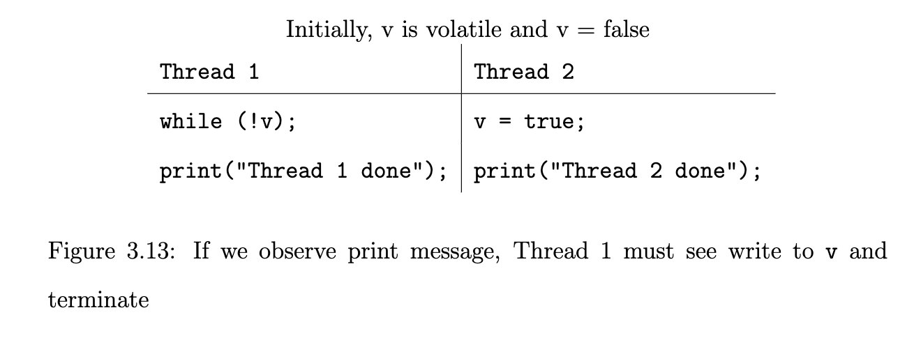
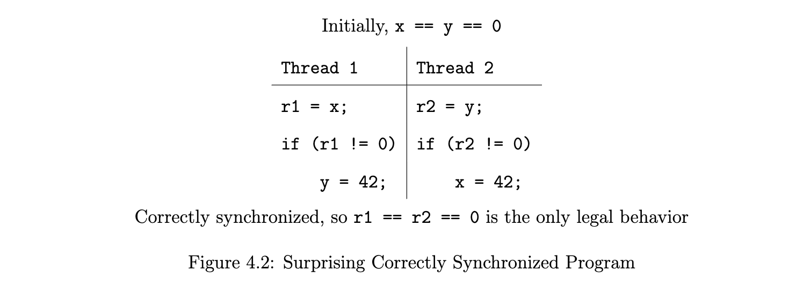
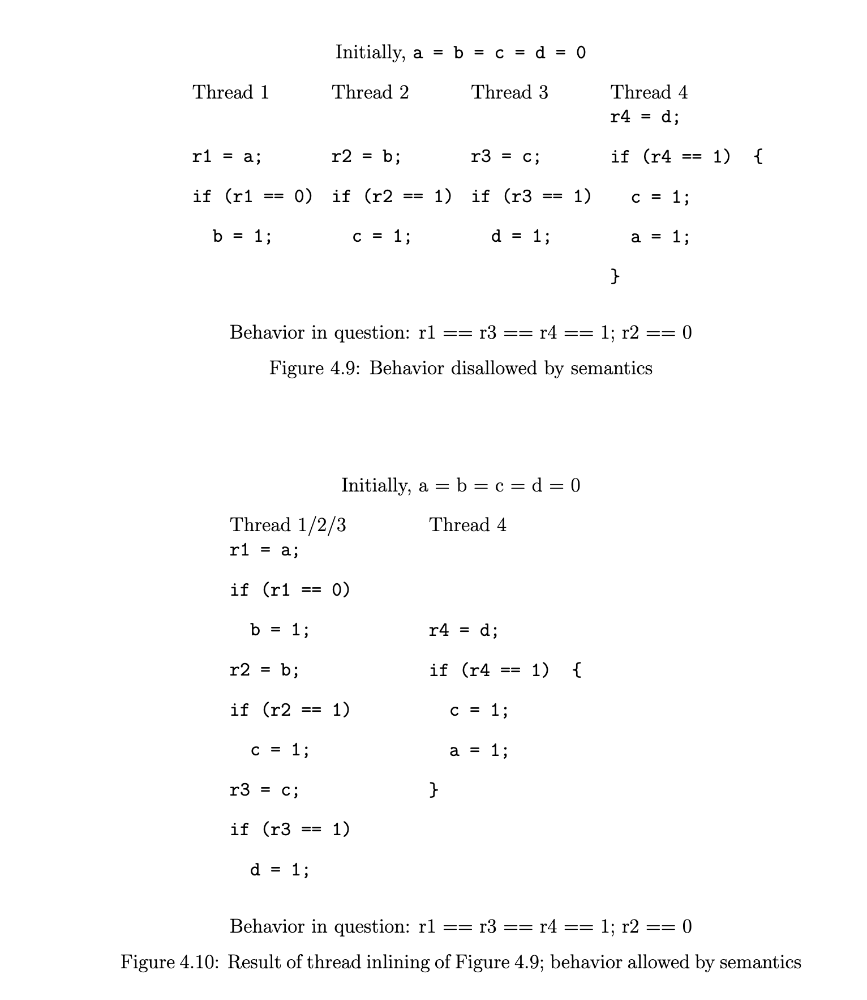

# The Java Memory Model
> Jeremy Manson 2004

## Abstract
After many years, support for multithreading has been integrated into main-stream programming languages. Inclusion of this feature brings with it a need for a clear and direct explanation of how threads interact through memory. Programmers need to be told, simply and clearly, what might happen when their programs execute. Compiler writers need to be able to work their magic without interfering with the promises that are made to programmers. 

经过多年的发展，对多线程的支持已经被纳入主流的编程语言。这一功能的加入带来了对线程如何通过内存进行交互的清晰而直接的解释的需求。程序员需要简单明了地被告知，当他们的程序执行时可能发生什么。编译器编写者需要能够在不干扰对程序员的承诺的情况下发挥他们的魔力。

Java’s original threading specification, its memory model, was fundamentally flawed. Some language features, like volatile fields, were under-specified: their treatment was so weak as to render them useless. Other features, including fields without access modifiers, were over-specified: the memory model prevents almost all optimizations of code containing these “normal” fields. Finally, some features, like final fields, had no specification at all beyond that of normal fields; no additional guarantees were provided about what will happen when they are used.

Java 最初的线程规范，即它的内存模型，从根本上来说是有缺陷的。一些语言特性，如 volatile 字段，规范不足：对它们的处理太弱，以至于使它们毫无用处。其他特征，包括没有访问修饰符的字段，被过度规定了：内存模型阻止了对包含这些 "正常 "字段的代码的几乎所有优化。最后，一些特征，比如 final 字段，除了正常字段之外，根本没有任何规范；没有提供关于使用它们时将发生什么的额外保证。

This work has attempted to remedy these limitations. We provide a clear and concise definition of thread interaction. It is sufficiently simple for programmers to work with, and flexible enough to take advantage of compiler and processor-level optimizations. We also provide formal and informal techniques for verifying that the model provides this balance. These issues had never been addressed for any programming language: in addressing them for Java, this dissertation provides a framework for all multithreaded languages. The work described in this dissertation has been incorporated into the version 5.0 of the Java programming language.

这项工作试图弥补这些限制。我们提供了一个清晰简洁的线程交互定义。它对程序员来说足够简单，也足够灵活，可以利用编译器和处理器级的优化。我们还提供了正式和非正式的技术来验证该模型是否提供了这种平衡。这些问题从未在任何编程语言中得到解决：在为 Java 解决这些问题时，本论文为所有多线程语言提供了一个框架。本论文中所描述的工作已经被纳入 Java 编程语言的 5.0 版本中。

[TOC]

## 1 Introduction
Much of the work done in modern computer science focuses on one of two goals. A tremendous amount of effort has been funneled into ensuring that these two goals are met. Unfortunately, in modern programming environments, these goals can conflict with each other in surprising ways.

现代计算机科学中的大部分工作都集中在两个目标中的一个。为了确保这两个目标的实现，人们付出了巨大的努力。不幸的是，在现代编程环境中，这些目标会以惊人的方式相互冲突。

First, we want to make sure that programs run quickly. At the high level, this involves data structure and algorithm design. At a lower level, this involves investing a great deal of time and effort reordering code to ensure that it is run in the most efficient way possible.

首先，我们要确保程序能够快速运行。在高层次上，这涉及到数据结构和算法设计。在较低的层次上，这涉及到投入大量的时间和精力重新排序代码，以确保其以最有效的方式运行。

For modern compilers and processors, this lower level is crucial. Speculative execution and instruction reordering are two tools that have been integral to the explosion in computer power over the last several decades. Most compiler optimizations, including instruction scheduling, register allocation, common subexpression elimination and redundant read elimination, can be thought of as relying on instruction reordering to some extent. For example, when a redundant read is removed, the compiler is, in effect, moving the redundant read to where the first read is performed. In similar ways, processor optimizations such as the use of write buffers and out-of-order completion / issue reflect reorderings.

对于现代编译器和处理器来说，这个较低的层次是至关重要的。投机执行和指令重排是过去几十年来计算机功率爆炸不可或缺的两种工具。大多数编译器的优化，包括指令调度、寄存器分配、普通子表达式的消除和冗余读取的消除，都可以被认为是在某种程度上依赖于指令重排。例如，当冗余读取被消除时，编译器实际上是把冗余读取移到了第一次读取的地方。以类似的方式，处理器的优化，如使用写缓冲区和失序完成/问题反映了重新排序。

Our second goal is to ensure that both programmers and computers understand what we are telling them to do. Programmers make dozens of assumptions about the way code is executed. Sometimes those assumptions are right, and sometimes they are wrong. In the background, at a lower level than our programming efforts, compilers and architectures are spending a lot of time creating an environment where our code is transformed; it is optimized to run on the system. Our assumptions about the way code is executing can be easily violated.

我们的第二个目标是确保程序员和计算机都能理解我们告诉他们要做什么。程序员对代码的执行方式做了几十种假设。有时这些假设是正确的，有时则是错误的。在后台，在比我们的编程努力更低的层次上，编译器和架构正在花费大量的时间创造一个环境，在那里我们的代码被转化；它被优化以在系统上运行。我们对代码执行方式的假设可能很容易被违反。

It is fairly easy (by comparison) for a processor, dealing with a single thread of instructions, to avoid messing around too much with our notions of how instructions are scheduled. It simply needs to ensure that when an instruction is performed early, that instruction doesn’t affect any of the instructions past which it was moved. Programmers will generally not need to reason about potential reorderings when they write single-threaded programs. This model actually allows for a wide variety of program transformations.

对于一个处理单线程指令的处理器来说，避免在我们关于如何安排指令的概念上做太多的手脚是相当容易的（相比之下）。它只需要确保当一条指令被提前执行时，该指令不会影响任何它被移过去的指令。程序员在编写单线程程序时一般不需要对潜在的重排进行推理。这个模型实际上允许多种多样的程序转换。

The real difficulty comes when there is more than one thread of instructions executing at the same time, and those threads are interacting. The processor can ensure that the actions in each thread appear to happen in the correct order in isolation. However, if more than one thread is executing, the limiting factors we impose for single-threaded execution are not enough – because of the need for code optimization, we can start to see bizarre side effects.

当有一个以上的指令线程同时执行，并且这些线程是相互作用的时候，真正的困难就来了。处理器可以确保每个线程的动作在孤立的情况下以正确的顺序发生。然而，如果不止一个线程在执行，我们为单线程执行施加的限制因素就不够了--由于需要进行代码优化，我们可以开始看到奇怪的副作用。

This is not necessarily a problem. For most modern multithreaded programming patterns, the programmer ensures that there are ordering constraints by explicitly communicating between threads. Within these specified constraints, it is possible to reorder code with a great deal of freedom. However, this begs the question of how that communication works, and what happens in a program when it is missing.

这不一定是个问题。对于大多数现代的多线程编程模式，程序员通过明确地在线程之间进行通信来确保有排序约束。在这些指定的约束条件下，有可能以很大的自由度重新排列代码。然而，这就引出了一个问题：这种通信是如何工作的，以及当通信缺失时，程序中会发生什么。

Obviously, we have to spend some time specifying these issues. We need a lingua franca, which we usually call a memory model, because it describes how programs interact with memory. The memory model for whatever language the programmer is using defines what kind of reorderings may be perceived, down to the level of machine code. In a high-level interpreted language, like Java or C#, it defines the reorderings the compiler can perform when translating to bytecode, the virtual machine can perform when translating to machine code, and the processor can perform when executing that machine code. A simple example of how reorderings can be perceived can be seen in Figure 1.1 [Pug99]. One common compiler optimization involves having the value read for r2 reused for r5: they are both reads of r1.x with no intervening write. Now consider the case where the assignment to r6.x in Thread 2 happens between the first read of r1.x and the read of r3.x in Thread 1. If the compiler decides to reuse the value of r2 for the r5, then r2 and r5 will have the value 0, and r4 will have the value 3. From the perspective of the programmer, the value stored at p.x has changed from 0 to 3 and then changed back. It was this surprising example the first motivated this work.

很明显，我们必须花一些时间来说明这些问题。我们需要一种语言符号，我们通常称之为内存模型，因为它描述了程序与内存的交互方式。无论程序员使用的是什么语言，其内存模型都定义了什么样的重新排序可以被感知，直至机器代码的水平。在高级解释语言中，如 Java 或 C#，它定义了编译器在翻译成字节码时可以执行的重新排序，虚拟机在翻译成机器码时可以执行的重新排序，以及处理器在执行该机器码时可以执行的重新排序。图 1.1 中可以看到一个关于如何看待重新排序的简单例子。一个常见的编译器优化涉及到将读给 r2 的值重新用于 r5：它们都是对 r1.x 的读，没有中间的写。现在考虑这样的情况：线程 2 中对 r6.x 的赋值发生在线程 1 中第一次读 r1.x 和读 r3.x 之间。如果编译器决定为 r5 重用 r2 的值，那么 r2 和 r5 的值为 0，而 r4 的值为 3。从程序员的角度来看，存储在 p.x 的值已经从 0 变成了 3，然后又变回来。正是这个令人惊讶的例子首先激发了这项工作。


This example is a relatively simple one; if the examples were all so simple, a memory model could be defined in terms of allowable reorderings. Not a great deal of subtlety would be required. However, this is not the case; we have to deal with the notion of a causal loop.

这个例子是一个相对简单的例子；如果所有的例子都如此简单，那么可以用允许的重新排序来定义一个内存模型。不需要太多微妙的东西。然而，情况并非如此；我们必须处理因果循环的概念。


Consider Figure 1.2. We have two threads of execution, both of which read from one variable and then write to another. If these actions are executed out of their program order, we could imagine that, for example, the number 42 was written to x in Thread 2, then read from x in Thread 1, written to y in Thread 1, then read from y in Thread 2, justifying the initial write to x. Where did the value 42 come from?

请看图 1.2。我们有两个执行线程，都是从一个变量中读取，然后写到另一个变量。如果这些动作不按程序顺序执行，我们可以想象，例如，数字 42 在线程 2 中被写入 x，然后在线程 1 中从 x 中读出，在线程 1 中被写入 y，然后在线程 2 中从 y 中读出，证明了最初写入 x 的理由。数值 42 又是从何而来？

This example may seem glib and unrealistic to some. However, a complete semantics for a programming language memory model would have to make a decision whether or not to allow it. In this case, the causal loop leads to an undesirable behavior: one which we wish to disallow.

这个例子在一些人看来可能是轻率的、不现实的。然而，一个完整的编程语言内存模型的语义学将不得不做出是否允许它的决定。在这种情况下，因果循环导致了一种不受欢迎的行为：我们希望不允许这种行为。


Another example of a causal loop – this time, one that describes an acceptable behavior – can be seen in Figure 1.3. In order to see the result r1 == r2 == r3 == 1, it would seem as if Thread 1 would need to write 1 to y before reading x. It also seems as if Thread 1 can’t know what value r2 will be until after x is read.

另一个因果循环的例子--这次是描述一个可接受的行为--可以在图 1.3 中看到。为了看到结果 r1 == r2 == r3 == 1，似乎线程 1 需要在读取 x 之前向 y 写 1。似乎线程 1 也不能知道 r2 是什么值，直到读完 x 之后。

In fact, a compiler could perform an inter-thread analysis that shows that only the values 0 and 1 will be written to x. Knowing that, the compiler can determine that the statement containing the logical or operator (—) will result in Thread 1’s always writing 1 to y. Thread 1 may, therefore, write 1 to y before reading x. The write to y is not dependent on the values seen for x.

事实上，编译器可以进行线程间分析，显示只有 0 和 1 的值会被写入 x。知道了这一点，编译器可以确定包含逻辑或运算符（-）的语句将导致线程 1 的总是写 1 到 y。

It is clear, therefore, that sometimes causal loops are acceptable, and other times, they are not. The fundamental problem with these sorts of examples is that there is no “first cause” from which we can reason. We have to think some more about cause and effect. The progress we have made in this area – the deep thinking about what sort of behaviors are desirable in a multithreaded program – is one of the most important contributions of this dissertation.

因此，很明显，有时因果循环是可以接受的，而其他时候则是不可以的。这类例子的根本问题是，没有 "第一原因"，我们可以从中推理。我们必须对因果关系多做一些思考。我们在这一领域取得的进展--对多线程程序中什么样的行为是可取的深入思考--是本论文最重要的贡献之一。

### 1.1 Why Solve This Problem ?
In the past, multithreaded languages have not defined a full semantics for multithreaded code. Ada, for example, simply defines unsynchronized code as “erroneous” [Ada95]. The reasoning behind this is that since such code is incorrect (on some level), no guarantees should be made for that code. What it means for code to be correctly synchronized should be fully defined; after that, nothing.

在过去，多线程语言没有为多线程代码定义完整的语义。例如，Ada 只是将不同步的代码定义为 "错误的"[Ada95]。这背后的理由是，既然这样的代码是不正确的（在某种程度上），那么就不应该对该代码进行保证。正确同步的代码意味着什么，应该被完全定义；之后就没有了。

This is the same strategy that some languages take with array bounds overflow – unpredictable results may occur, and it is the programmer’s responsibility to avoid these scenarios.

这与一些语言对数组边界溢出采取的策略相同--可能会出现不可预测的结果，而避免这些情况是程序员的责任。

The problem with this strategy is one of security and safety. In an ideal world, all programmers would write correct code all of the time. However, this rarely happens. Programs frequently contain errors; not only does this cause code to misbehave, but it also allows attackers an easy way into a program. Buffer overflows, in particular, are frequently used to compromise a program’s security. Program semantics must be carefully defined: otherwise, it becomes harder to track down errors, and easier for attackers to take advantage of those errors. If programmers don’t know what their code is doing, programmers won’t be able to know what their code is doing wrong.

这种策略的问题是安全和保障的问题。在一个理想的世界里，所有的程序员都会一直写出正确的代码。然而，这很少发生。程序经常包含错误；这不仅导致代码行为失常，而且还让攻击者有了进入程序的便捷途径。尤其是缓冲区溢出，经常被用来破坏程序的安全性。程序语义必须被仔细定义：否则，追踪错误就变得更难，攻击者也更容易利用这些错误。如果程序员不知道他们的代码在做什么，程序员就无法知道他们的代码做错了什么。

### 1.2 Approach
The approach taken in this dissertation was done in two overlapping stages. First, we gathered requirements from an experienced community of professional software engineers, hardware architects and compiler / virtual machine designers. In the coming chapters, you may notice references to guarantees and optimizations that are “reasonable” or “unreasonable”; these notions came from long discussions with this group. The requirements that were gathered are largely described in Chapters 2 and 3. When the requirements were gathered, we designed a model that reflected those requirements (Chapters 4 and 5), and verified that the final specification met the requirements (Chapter 6).

本论文所采取的方法分两个重叠的阶段进行。首先，我们从一个由专业软件工程师、硬件架构师和编译器/虚拟机设计师组成的经验丰富的社区收集需求。在接下来的章节中，你可能会注意到对 "合理 "或 "不合理 "的保证和优化的提及；这些概念来自于与这个群体的长期讨论。第 2 章和第 3 章主要描述了所收集的需求。当需求被收集后，我们设计了一个反映这些需求的模型（第 4 章和第 5 章），并验证了最终的规范是否满足需求（第 6 章）。

The requirements largely centered around two goals:

这些要求主要围绕着两个目标。

+ We needed to define, in a careful way, how programmers could ensure that actions taken by one thread would be seen in a reasonable way by other threads. (我们需要以谨慎的方式定义，程序员如何确保一个线程所采取的行动会被其他线程以合理的方式看到。)
+ We needed to define, in a careful way, what could happen if programmers did not take care to ensure that threads were communicating in the proscribed manners.(如果程序员不注意确保线程以规定的方式进行通信，会发生什么。)

The first bullet (arguably the more simple of the two goals) required a careful and complete definition of what constitutes synchronization, which allows threads to communicate. Locking, described in Chapter 2, is the most obvious way for two threads to communicate. However, other mechanisms are necessary. For example, it is often the case that we want threads to communicate without the overhead of mutual exclusion. To address this, we introduced the notion of a volatile field (Chapter 3) : this supplants the more traditional memory barrier as a basic memory coherence operation. Finally, we wanted to present a way that a programmer could ensure object immutability regardless of data races: the resulting semantics for final fields are outlined in Chapter 7.

第一条（可以说是两个目标中更简单的一条）需要仔细和完整地定义什么是同步，它允许线程进行通信。第二章中描述的锁定是两个线程进行通信的最明显方式。然而，其他机制也是必要的。例如，通常情况下，我们希望线程在没有相互排斥开销的情况下进行通信。为了解决这个问题，我们介绍了 volatile 字段的概念（第三章）：它取代了更传统的内存屏障，成为基本的内存一致性操作。最后，我们希望提出一种方法，使程序员能够确保对象的不变性，而不考虑数据竞争：第七章中概述了 final 字段的语义。

The second bullet is somewhat more complex. The fundamental question is described above: what kind of causal loops are acceptable, and what kind must be disallowed? This question frames the discussion of causality (Chapter 4).

第二项内容要复杂一些。基本问题如上所述：什么样的因果循环是可以接受的，什么样的因果循环是必须被禁止的？这个问题是讨论因果关系的框架（第四章）。

### 1.3 Development
A final note: this work has been done in the context of the Java programming language [GJS96]; Java is used as a running example. One of the goals of the designers of the Java programming language was that multithreaded programs written in Java would have consistent and well-defined behavior. This would allow Java programmers to understand how their programs might behave; it would also allow Java platform architects to develop their platforms in a flexible and efficient way, while still ensuring that Java programs ran on them correctly.

最后说明一下：这项工作是在 Java 编程语言的背景下完成的；Java 被用作一个运行实例。Java 编程语言的设计者的目标之一是，用 Java 编写的多线程程序会有一致的、定义明确的行为。这将使 Java 程序员能够理解他们的程序可能的行为；也使 Java 平台架构师能够以灵活有效的方式开发他们的平台，同时还能确保 Java 程序在平台上正确运行。

Unfortunately, Java’s original memory model was not defined in a way that allowed programmers and architects to understand the requirements for a Java system. For example, it disallowed the program transformation seen in Figure 1.1. For more details on this, see Chapter 8.

不幸的是，Java 最初的内存模型的定义方式并不允许程序员和架构师理解对 Java 系统的要求。例如，它不允许在图 1.1 中看到的程序转换。关于这方面的更多细节，请参见第 8 章。

The work described in this dissertation has been adapted to become part of Java Specification Request (JSR) 133 [Jav04], a new memory model for Java, which is included in the 5.0 release of the Java programming language.

本论文中所描述的工作已经被改编成为 Java 规范请求（JSR）133 的一部分，这是一个新的 Java 内存模型，包含在 Java 编程语言的 5.0 版本中。

## 2 Building Blocks
In order to reason about cause and effect in a programming lanuage, we have to do two things:

为了用编程语言来推理因果关系，我们必须做两件事。

1. Provide a clear model for concurrent programmers to write correct code. (1. 为并发的程序员提供一个清晰的模型来编写正确的代码。)
2. Provide a clear model for platform architects to optimize code. (2. 为平台架构师提供一个清晰的模型来优化代码。)

There has been a lot of work in defining, conceptually, how threads interact through memory. In order to develop a memory model that fulfills out requirements, it is necessary to review some concepts and vocabulary first. This chapter provides that review.

在从概念上定义线程如何通过内存进行交互方面，已经有很多工作。为了开发一个符合要求的内存模型，有必要先回顾一些概念和词汇。本章提供了这种回顾。

### 2.1 Code is Reordered
The most commonly assumed memory model is sequential consistency [Lam79]. Sequential consistency specifies that memory actions will appear to execute one at a time in a single total order; actions of a given thread must appear in this total order in the same order in which they appear in the program prior to any optimizations (the program order). This model basically reflects an interleaving of the actions in each thread; under sequential consistency, a read must return the value written most recently to the location being read in the total order.

最常见的假设内存模型是顺序一致性。顺序一致性规定，内存动作将以单一的总顺序一次执行；给定线程的动作必须在这个总顺序中出现，与它们在任何优化之前出现在程序中的顺序相同（程序顺序）。这个模型基本上反映了每个线程中动作的交错；在顺序一致性下，读取必须返回最近写入总顺序中被读取位置的值。

While this is an intuitive extension of the single threaded model, sequential consistency restricts the use of many system optimizations. In general, a sequentially consistent system will not have much freedom to reorder memory statements within a thread, even if there are no conventional data or control dependences between the two statements.

虽然这是对单线程模型的直观扩展，但顺序一致性限制了许多系统优化的使用。一般来说，一个顺序一致的系统不会有太多的自由来重新排列线程内的内存语句，即使两个语句之间没有传统的数据或控制依赖。

Many of the important optimizations that can be performed on a program involve reordering program statements. For example, superscalar architectures frequently reorder instructions to ensure that the execution units are all in use as much as possible. Even optimizations as ubiquitous as common subexpression elimination and redundant read elimination can be seen as reorderings: each evaluation of the common expression is conceptually “moved” to the point at which it is evaluated for the first time.

许多可以对程序进行的重要优化涉及到对程序语句的重新排序。例如，超标量架构经常对指令进行重新排序，以确保执行单元都尽可能地被使用。甚至像消除普通子表达式和消除冗余读数这样无处不在的优化也可以被看作是重新排序：普通表达式的每一次评估在概念上都被 "移动 "到它第一次被评估的地方。

Many different aspects of a system may affect reorderings. For example, the just-in-time compiler and the processor may perform reorderings. The memory hierarchy of the architecture on which a virtual machine is run may make it appear as if code is being reordered. Source code to bytecode transformation can also reorder and transform programs. For the purposes of simplicity, we shall simply refer to anything that can reorder code as being a compiler.

一个系统的许多不同方面可能会影响重新排序。例如，及时编译器和处理器可以进行重新排序。运行虚拟机的架构的内存层次可能会使它看起来像代码被重新排序。源代码到字节码的转换也可以对程序进行重新排序和转换。为了简单起见，我们将简单地把能够重新排序代码的东西称为编译器。

In a single threaded program, a compiler can (and, indeed, must) be careful that these program transformations not interfere with the possible results of the program. We refer to this as a compiler’s maintaining of the intra-thread semantics of the program – a thread in isolation has to behave as if no code transformations occurred at all.

在一个单线程程序中，编译器可以（事实上也必须）注意这些程序转换不会干扰程序的可能结果。我们把这称为编译器对程序的线程内语义的维护--一个孤立的线程必须表现得像根本没有发生代码转换一样。


However, it is much more difficult to maintain a sequentially consistent semantics while optimizing multithreaded code. Consider Figure 2.1. It may appear that the result r2 == 2, r1 == 1 is impossible. Intuitively, if r2 is 2, then instruction 4 came before instruction 1. Further, if r1 is 1, then instruction 2 came before instruction 3. So, if r2 == 2 and r1 == 1, then instruction 4 came before instruction 1, which comes before instruction 2, which came before instruction 3, which comes before instruction 4. This is a cyclic execution, which is, on the face of it, absurd.

然而，在优化多线程代码的同时保持顺序一致的语义要困难得多。考虑一下图 2.1。看起来，结果 r2 == 2，r1 == 1 是不可能的。直观地说，如果 r2 是 2，那么指令 4 就在指令 1 之前。此外，如果 r1 是 1，那么指令 2 就在指令 3 之前。所以，如果 r2 == 2，r1 == 1，那么指令 4 在指令 1 之前，指令 1 在指令 2 之前，指令 2 在指令 3 之前，指令 3 在指令 4 之前。这是一个循环执行的过程，从表面上看，这很荒唐。

On the other hand, we must consider the fact that a compiler can reorder the instructions in each thread (as seen in Figure 2.2. If instruction 3 does not come before instruction 4, and instruction 1 does not come before instruction 2, then the result r2 == 2 and r1 == 1 is perfectly reasonable.

另一方面，我们必须考虑一个事实，即编译器可以对每个线程的指令进行重新排序（如图 2.2 所示。如果指令 3 不在指令 4 之前，而指令 1 不在指令 2 之前，那么结果 r2 == 2，r1 == 1 是完全合理的。

### 2.2 Synchronization and Happens-Before
To some programmers, the behavior demonstrated in Figure 2.1 may seem “broken”. However, multithreaded programming languages provide built-in mechanisms to provide constraints when two threads interact: such mechanisms are referred to as synchronization. The code in Figure 2.1 does not use these mechanisms.

对于一些程序员来说，图 2.1 中展示的行为可能看起来是 "坏的"。然而，多线程编程语言提供了内置的机制，在两个线程交互时提供约束：这种机制被称为同步。图 2.1 中的代码并没有使用这些机制。

The Java programming language provides multiple mechanisms for synchronizing threads. The most common of these methods is locking, which is implemented using monitors. Each object in Java is associated with a monitor, which a thread can lock or unlock. Only one thread at a time may hold a lock on a monitor. Any other threads attempting to lock that monitor are blocked until they can obtain a lock on that monitor. A thread may lock a particular monitor multiple times; each unlock reverses the effect of one lock operation.

Java 编程语言为同步线程提供了多种机制。这些方法中最常见的是锁定，它是用监视器实现的。Java 中的每个对象都与一个监视器相关联，线程可以锁定或解锁该监视器。一次只有一个线程可以持有一个监视器的锁。任何其他试图锁定该监视器的线程都会被阻塞，直到他们能够获得该监视器的锁。一个线程可以多次锁定一个特定的监视器；每次解锁都会逆转一次锁定操作的效果。

There is a total order over all synchronization operations, called the synchronization order. We say that an unlock action on monitor m synchronizes-with all lock actions on m that come after it (or are subsequent to it) in the synchronization order.

**所有的同步操作都有一个总的顺序，称为同步顺序。我们说，监视器 m 上的一个 unlock 操作与 m 上的所有 lock 操作同步，这些 lock 操作在同步顺序中排在它之后（或在它之后）。**

We say that one action happens-before another [Lam78] in three cases:

我们说，在三种情况下，一个动作发生在另一个动作之前。

+ **if the first action comes before the second in program order**, or (如果在程序顺序上第一个动作在第二个动作之前，或)
+ **if the first action synchronizes-with the second**, or (如果第一个动作与第二个动作同步)
+ if you can reach the second by following happens-before edges from the first (in other words, **happens-before is transitive**). (如果你能从第一个边上沿着 happen-before 边到达第二个边（换句话说，happen-before是传递性的）)

Note that all of this means that happens-before is a partial order: it is reflexive, transitive and anti-symmetric. There are more happens-before edges, as described in Chapter 5 – we will just focus on these for now. We now have the key to understanding why the behavior in Figure 2.1 is legal. Here is what we observe: 

请注意，所有这些都意味着 happen-before 是一个局部秩序：它是反身的、传递的和反对称的。还有更多的happen-before 边，如第五章所述，我们现在只关注这些边。我们现在有了理解为什么图 2.1 中的行为是合法的关键。下面是我们观察到的情况。

+ there is a write in one thread,
+ there is a read of the same variable by another thread and
+ the write and read are not ordered by happens-before.

In general, when there are two accesses (reads of or writes to) the same shared field or array element, and at least one of the accesses is a write, we say that the accesses conflict (regardless of whether there is a data race on those accesses) [SS88]. When two conflicting accesses are not ordered by happens-before, they are said to be in a data race. When code contains a data race, counterintuitive results are often possible.

**一般来说，当有两个访问（读或写）相同的共享字段或数组元素，并且至少有一个访问是写的，我们说这些访问是冲突的（不管这些访问是否存在数据竞争）。当两个相互冲突的访问没有按照 happen-before 排序时，我们就说它们处于数据竞争中。当代码中含有数据竞争时，往往会出现反直觉的结果。**

We use the discussion of data races to define what it means for a program to be correctly synchronized. A program is correctly synchronized if and only if all sequentially consistent executions are free of data races. The code in Figure 2.1, for example, is incorrectly synchronized.

我们利用对数据竞争的讨论来定义一个程序正确同步的含义。当且仅当所有顺序一致的执行都不存在数据竞争时，程序才是正确的同步。例如，图 2.1 中的代码是不正确的同步化。

When a program is not correctly synchronized, errors tend to crop up in three intertwined ways. Atomicity deals with which actions and sets of actions have indivisible effects. This is the aspect of concurrency most familiar to programmers: it is usually thought of in terms of mutual exclusion. Visibility determines when the effects of one thread can be seen by another. Ordering determines when actions in one thread can be seen to occur out of order with respect to another. In the rest of this chapter, we discuss how those problems can arise.

当一个程序没有被正确地同步化时，错误往往会以三种相互交织的方式出现。原子性是指哪些动作和动作集具有不可分割的效果。这是程序员最熟悉的并发性方面：它通常被认为是相互排斥的。可见性决定了一个线程的效果何时能被另一个线程看到。顺序决定了何时可以看到一个线程中的动作相对于另一个线程不按顺序发生。在本章的其余部分，我们将讨论这些问题是如何产生的。

### 2.3 Atomicity
If an action is (or a set of actions are) atomic, its result must be seen to happen “all at once”, or indivisibly. Atomicity is the traditional bugbear of concurrent programming. Enforcing it means using locking to enforce mutual exclusion. 

**如果一个动作是（或一组动作是）原子性的，它的结果必须被看作是 "一次性 "发生的，或不可分割的。原子性是并发编程的传统问题。执行它意味着使用锁来执行互斥。**

The Java programming language has some minor issues related to the atomicity of individual actions. Specifically, writes of 64-bit scalar values (longs and doubles) are allowed to take place in two separate atomic 32 bit “chunks”. If a thread is scheduled between the separate writes, it may see the first half of the 64-bit value, but not the second. In other circumstances, we assume that all individual read and write actions take place atomically. This is not an aspect of the memory model that we shall address in any greater depth.

Java 编程语言有一些与单个动作的原子性有关的小问题。具体来说，64 位标量值（long and doubles）的写入被允许在两个独立的 32 位原子 "块 "中进行。如果一个线程被安排在两个独立的写操作之间，它可能会看到 64 位值的前半部分，但不会看到后半部分。在其他情况下，我们假设所有单独的读和写动作都是原子化的。这不是我们要深入讨论的内存模型的一个方面。

Atomicity can also be enforced on a sequence of actions. A program can be free from data races without having this form of atomicity. However, enforcing this kind of atomicity is frequently as important to program correctness as enforcing freedom from data races. Consider the Java code in Figure 2.3. Since all accesses to the shared variable balance are guarded by synchronization, the code is free of data races.

原子性也可以在一连串的行动中被强制执行。一个程序可以在没有这种形式的原子性的情况下摆脱数据竞争。然而，对于程序的正确性来说，执行这种原子性常常与执行无数据竞争一样重要。考虑一下图 2.3 中的 Java 代码。由于对共享变量 balance 的所有访问都受到同步的保护，所以该代码是没有数据竞赛的。

```
    class BrokenBankAccount {
        private int balance;

        synchronized int getBalance() {
            return balance;
        }

        synchronized void setBalance(int x) throws IllegalStateException {
            balance = x;
            if (balance < 0) {
                throw new IllegalStateException("Negative Balance");
            }
        }

        void deposit(int x) {
            int b = getBalance();
            setBalance(b + x);
        }

        void withdraw(int x) {
            int b = getBalance();
            setBalance(b - x);
        }
    }

    // Figure 2.3 : Atomicity example
```

Now assume that one thread calls deposit(5) and another calls withdraw(5); there is an initial balance of 10. Ideally, at the end of these two calls, there would still be a balance of 10. However, consider what would happen if:

现在假设一个线程调用 deposit(5)，另一个线程调用 withdraw(5)；有一个初始余额为 10。理想情况下，在这两次调用结束后，仍然有 10 的余额。然而，考虑一下会发生什么，如果。

+ The deposit() method sees a value of 10 for the balance, then
+ The withdraw() method sees a value of 10 for the balance and withdraws 5, leaving a balance of 5, and finally
+ The deposit() method uses the balance it originally saw (10) to calculate a new balance of 15.

As a result of this lack of atomicity, the balance is 15 instead of 10. This effect is often referred to as a lost update because the withdrawal is lost. A programmer writing multi-threaded code must use synchronization carefully to avoid this sort of error. In the Java programming language, if the deposit() and withdraw() methods are declared synchronized, it will ensure that locks are held for their duration: the actions of those methods will be seen to take place atomically.

由于缺乏原子性，余额是 15 而不是 10。这种影响通常被称为丢失的更新，因为提款被丢失了。编写多线程代码的程序员必须谨慎使用同步，以避免这种错误。在 Java 编程语言中，如果 deposit() 和 withdraw()方法被声明为同步的，它将确保锁在其持续时间内被保持：这些方法的行动将被视为以原子方式发生。

Note that atomicity guarantees from synchronization are relative. By synchronizing on an object, you can guarantee that a sequence of actions is perceived to happen atomically by other threads that synchronize on the same object. But threads that do not synchronize on that object may not see the actions occur atomically.

请注意，同步化的原子性保证是相对的。通过在一个对象上进行同步，你可以保证一连串的动作被在同一对象上同步的其他线程认为是原子发生的。但不在该对象上同步的线程可能不会看到这些动作以原子方式发生。

Atomicity is the most well-studied problem when using synchronization. It is a common mistake to think that it is the only problem; it is not. In the rest of this chapter, we look at two other important issues that may crop up when writing multithreaded code.

原子性是使用同步时研究得最多的问题。认为它是唯一的问题是个常见的错误；其实不然。在本章的其余部分，我们将探讨在编写多线程代码时可能出现的另外两个重要问题。

### 2.4 Visibility
If an action in one thread is visible to another thread, then the result of that action can be observed by the second thread. In order to guarantee that the results of one action are observable to a second action, then the first must happen before the second.

**如果一个线程中的一个动作对另一个线程是可见的，那么这个动作的结果就可以被第二个线程观察到。为了保证一个动作的结果可以被第二个动作观察到，那么第一个动作必须在第二个动作之前发生。**

Consider the code in Figure 2.4. Now imagine that two threads are created; one thread calls work, and at some point, the other thread calls stopWork on the same object. Because there is no happens-before relationship between the two threads, the thread in the loop may never see the update to done performed by the other thread. In practice, this may happen if the compiler detects that no writes are performed to done in the first thread; the compiler may hoist the read of done out of the loop, transforming it into an infinite loop.

考虑一下图 2.4 中的代码。现在想象一下，有两个线程被创建；一个线程调用 work，在某一时刻，另一个线程对同一个对象调用 stopWork。因为两个线程之间没有发生之前的关系，循环中的线程可能永远不会看到另一个线程执行的更新。在实践中，如果编译器检测到在第一个线程中没有对 done 进行写操作，这种情况就会发生；编译器可能会把对 done 的读取从循环中提升出来，把它变成一个无限的循环。

```
    class LoopMayNeverEnd {
        boolean done = false;

        void work() {
            while (!done) {
                // do work
            }
        }

        void stopWork() {
            done = true;
        }
    }

    // Figure2.4: Visibility example
```

To ensure that this does not happen, there must be a happens-before relationship between the two threads. In LoopMayNeverEnd, this can be achieved by declaring done to be volatile. Conceptually, all actions on volatiles happen in a single total order, and each write to a volatile field happens-before any read of that volatile that occurs later in that order.

为了确保这种情况不会发生，两个线程之间必须有一个发生在前的关系。在 LoopMayNeverEnd 中，这可以通过声明 done 为 volatile 来实现。从概念上讲，对 volatile 的所有操作都是以一个总的顺序发生的，对 volatile 字段的每一次写入都发生在该顺序中后来发生的对该 volatile 的任何读取之前。

There is a side issue here; some architectures and virtual machines may execute this program without providing a guarantee that the thread that executes work will ever give up the CPU and allow other threads to execute. This would prevent the loop from ever terminating because of scheduling guarantees, not because of a lack of visibility guarantees. For more discussion of this issue, see Section 3.6.

这里有一个附带的问题；一些架构和虚拟机可能会执行这个程序，而不提供执行工作的线程是否会放弃 CPU 而允许其他线程执行的保证。这将使循环永远不会因为调度保证而终止，而不是因为缺乏可见性保证。关于这个问题的更多讨论，见第 3.6 节。

### 2.5 Ordering
Ordering constraints govern the order in which multiple actions are seen to have happened. The ability to perceive ordering constraints among actions is only guaranteed to actions that share a happens-before relationship with them. We have already seen a violation of ordering in Figure 2.1; here is another.

有序性约束是指多个动作被视为已经发生的顺序。感知动作之间的有序性约束的能力只对那些与之共享 happens-before 关系的动作有保证。我们已经在图 2.1 中看到了违反排序的情况；这里是另一个。

```
    class BadlyOrdered {
        boolean a = false;
        boolean b = false;

        void threadOne() {
            a = true;
            b = true;
        }

        boolean threadTwo() {
            boolean r1 = b;     // sees true
            boolean r2 = a;     // sees false
            boolean r3 = a;     // sees true
            return (r1 && !r2) && r3;   // returns true
        }
    }

    // Figure 2.5: Ordering example
```

The code in Figure 2.5 shows an example of where the lack of ordering constraints can produce surprising results. Consider what happens if threadOne() gets invoked in one thread and threadTwo() gets invoked on the same object in another. Would it be possible for threadTwo() to return the value true? If threadTwo() returns true, it means that the thread saw both updates by threadOne, but that it saw the change to b before the change to a.

图 2.5 中的代码显示了一个例子，说明缺乏有序性约束会产生令人奇怪的结果。考虑一下，如果在一个线程中调用 threadOne()，而在另一个线程中对同一对象调用 threadTwo() 会发生什么。threadTwo() 是否有可能返回值为 true？如果 threadTwo() 返回 true，这意味着线程看到了 threadOne 的两个更新，但它在 a 的变化之前看到了 b 的变化。

The Java memory model allows this result, illustrating a violation of the ordering that a user might have expected. This code fragment is not correctly synchronized (the conflicting accesses are not ordered by a happens-before ordering).

Java 内存模型允许这种结果，说明违反了用户可能期望的有序性。这个代码片段没有被正确地同步（冲突的访问没有被 happens-before 的有序性规则来排序）。

If ordering is not guaranteed, then the assignments to a and b in threadOne() can be seen to be performed out of order. Compilers have substantial freedom to reorder code in the absence of synchronization. For example, the compiler is allowed to freely reorder the writes in threadOne or the reads in threadTwo.

如果不保证排序，那么 threadOne() 中对 a 和 b 的赋值就会被视为不按顺序执行。在没有同步的情况下，编译器有很大的自由来重新排序代码。例如，编译器可以自由地对线程一中的写或线程二中的读进行重新排序。

To avoid this behavior, programmers must ensure that their code is correctly synchronized.

为了避免这种行为，程序员必须确保他们的代码是正确同步的.

### 2.6 Discussion
The discussion in this chapter centers around some of the basic issues of memory semantics. We have given some form to the problem: we have outlined the basic ideas behind memory models, synchronization and happens-before, and we have seen how misinterpretation of how multithreading works can lead to problems with atomicity, visibility and ordering. However, this skirts the major issue: how can we define multithreaded semantics in a way that allows programmers to avoid these pitfalls, but still allows compiler designers and computer architects to optimize run time?

本章的讨论围绕内存语义的一些基本问题展开。我们已经给出了问题的一些形式：我们已经概述了内存模型、同步和 happen-before 背后的基本思想，我们已经看到了对多线程如何工作的误解会导致原子性、可见性和有序性的问题。然而，这避开了主要的问题：我们如何才能以一种允许程序员避免这些陷阱的方式来定义多线程语义，但仍然允许编译器设计者和计算机架构师优化运行时间？

To answer this question, we still need to gather more requirements. What kinds of compiler optimizations do we need? What guarantees are sufficient for correctly synchronized code? What guarantees are sufficient for incorrectly synchronized code? In the chapters ahead, we address these questions.

为了回答这个问题，我们仍然需要收集更多的需求。我们需要什么样的编译器优化？对于正确的同步化代码，有哪些保证是足够的？对于不正确的同步化代码，有哪些保证是足够的？在接下来的章节中，我们将讨论这些问题。

## 3 In Which Some Motivations Are Given
The last chapter outlined some informal properties that all concurrent programs have, and some ways in which those properties could be used incorrectly, leading to broken code. This chapter outlines some of the informal requirements that the memory model has – in other words, ways in which these broken programs can be tamed.

上一章概述了所有并发程序都具有的一些非正式属性，以及这些属性可能被错误地使用，导致破损代码的一些方式。本章概述了内存模型所具有的一些非正式要求--换句话说，这些破损的程序可以被驯服的方法。

Many compiler writers and programmers contributed to the discussions that led to the conclusions in this chapter. These conclusions were only reached after a great deal of thinking, staring at white boards, and spirited debate. A careful balance had to be maintained. On one hand, it was necessary for the model to allow programmers to be able to reason carefully and correctly about their multithreaded code. On the other, it was necessary for the model to allow compiler writers, virtual machine designers and hardware architects to optimize code ruthlessly, which makes predicting the results of a multithreaded program less straightforward.

许多编译器的作者和程序员对导致本章结论的讨论做出了贡献。这些结论是在经过了大量的思考、盯着白板和激烈的辩论之后才得出的。必须保持一种谨慎的平衡。一方面，这个模型有必要让程序员能够对他们的多线程代码进行仔细和正确的推理。另一方面，这个模型必须允许编译器编写者、虚拟机设计者和硬件架构师无情地优化代码，这使得预测一个多线程程序的结果变得不那么简单了。

At the end of this process, a consensus emerged as to what the informal requirements for a programming language memory model are. As the requirements emerged, a memory model took shape. Most of these requirements have relatively simple to understand motivations – obvious guarantees that need to be made, optimizations that need to be allowed, and so on. These are documented in this chapter. The other requirements – those relating to causality – are more complicated. The causality requirements, together with the memory model, are described in full in Chapter 4.

在这个过程的最后，对于编程语言内存模型的非正式要求是什么，出现了一个共识。随着这些要求的出现，内存模型逐渐成形。这些需求中的大多数都有相对简单的理解动机--需要做出的明显保证，需要允许的优化，等等。这些都记录在本章中。其他的要求--那些与因果关系有关的要求--则更为复杂。因果关系的要求，连同内存模型，将在第四章中全面描述。

### 3.1 Guarantees for Correctly Synchronized Programs
It is very difficult for programmers to reason about the kinds of transformations that compilers perform. One of the goals of the Java memory model is to provide programmers a mechanism that allows them to avoid having to do this sort of reasoning.

对于程序员来说，要推理出编译器所进行的各种转换是非常困难的。Java 内存模型的目标之一是为程序员提供一种机制，使他们能够避免进行这种推理。

```
    // Initially, 
    x == y == 0
    // Thread 1
    1: r2 = x;
    2: y = 1;

    // Thread 2
    3: r1 = y;
    4: x = 2;

    // May return t2 == 2, r1 == 1

    // Figure 3.2: Behaves Surprisingly
```

For example, in the code in Figure 3.2, the programmer can only see the result of the reordering because the code is improperly synchronized. Our first goal is to ensure that this is the only reason that a programmer can see the result of a reordering.

例如，在图 3.2 的代码中，程序员只能看到重新排序的结果，因为代码的同步性不恰当。我们的第一个目标是确保这是程序员能看到重新排序的结果的唯一原因。

Prior work [Adv93, Gha96, AH90] has shown that one of the best guarantees that can be provided is that reorderings should only be visible when code is incorrectly synchronized. This is a strong guarantee for programmers, whose assumptions about how multithreaded code behaves almost always include sequential consistency (as defined in Section 2.1). Our first guarantee for programmers (which we call DRF), therefore, applies to correctly synchronized programs (as defined in Section 2.2):

之前的工作 [Adv93, Gha96, AH90] 表明，可以提供的最好的保证之一是，只有当代码被错误地同步化时，重排才是可见的。这对程序员来说是一个强有力的保证，他们对多线程代码行为方式的假设几乎总是包括顺序一致性（如第 2.1 节所定义的）。因此，我们对程序员的第一个保证（我们称之为 DRF）适用于正确的同步程序（如第 2.2 节所定义）。

DRF **Correctly synchronized programs have sequentially consistent semantics.**

DRF **正确的同步程序具有顺序一致的语义。**

Given this requirement, programmers need only worry about code transformations having an impact on their programs’ results if those program contain data races.

鉴于这一要求，程序员只需担心代码转换会对他们的程序结果产生影响，如果这些程序包含数据竞争。

This requirement leads to some interesting corner cases. For example, the code shown in Figure 3.1 ( [Adv93]) is correctly synchronized. This may seem surprising, since it doesn’t perform any synchronization actions. Remember that a program is correctly synchronized if, when it is executed in a sequentially consistent manner, there are no data races. If this code is executed in a sequentially consistent way, each action will occur in program order, and neither of the writes to x or y will occur. Since no writes occur, there can be no data races: the program is correctly synchronized.

这个要求导致了一些有趣的角落案例。例如，图 3.1 所示的代码（[Adv93]）是正确同步的。这似乎令人奇怪，因为它并没有执行任何同步动作。请记住，如果一个程序以顺序一致的方式执行时，不存在数据竞争，那么它就是正确的同步。如果这段代码以顺序一致的方式执行，每个动作都会按程序顺序发生，对 x 或 y 的写入都不会发生。因为没有写操作发生，所以不可能有数据竞赛：程序是正确同步的。

```
    // Initially, x == y == 0
    // Thread 1
    r1 = x;
    if (r1 != 0)
        y = 42;

    // Thread 2
    r2 = y;
    if (r1 != 0)
        x = 42;

    
    // Correctly synchronized, so r1 == r2 == 0 is the only legal behavior
    // Figure 3.1: Surprising Correctly Synchronized Program
```
This disallows some subtle program transformations. For example, an aggressive write speculation could predict that the write to y of 42 was going to occur, allowing Thread 2’s read of y to see that write. This would cause the write of 42 to x to occur, allowing the read of x to see 42; this would cause the write to y to occur, justifying the speculation! This sort of transformation is not legal; as a correctly synchronized program, only sequentially consistent results should be allowed.

这就不允许一些微妙的程序转换。例如，一个积极的写推测可以预测到写到 y 的 42 会发生，允许线程 2 对 y 的读取看到这个写。这将导致对 x 的 42 的写入发生，允许对 x 的读取看到 42；这将导致对 y 的写入发生，证明了猜测的合理性！这种转变是不合法的。这种转换是不合法的；作为一个正确的同步程序，应该只允许顺序一致的结果。

### 3.2 Simple Reordering
In earlier chapters, we outlined how important it is for compilers to reorder program actions – it is the engine that drives most optimizations. Our first requirement, therefore, is that we always allow statements that are not control or data dependent on each other in a program to be reordered:

在前面的章节中，我们概述了编译器对程序动作重新排序的重要性--它是驱动大多数优化的引擎。因此，我们的第一个要求是，我们总是允许在程序中互不依赖控制或数据的语句被重新排序。

**Reorder1** **Independent adjacent statements can be reordered.**

**Reorder1**: **独立的相邻语句可以被重新排序。**

Note that Reorder1 actually allows the reordering of statements that were not adjacent in the original program: it is simply necessary to perform repeated reorderings until the statement appears in the desired location.

**请注意，Reorder1 实际上允许对原程序中不相邻的语句进行重新排序：只需要重复执行重新排序，直到语句出现在所需的位置。**

In a multithreaded context, doing this may lead to counter-intuitive results, like the one in Figure 2.1 (reprinted here as Figure 3.2). Remember that the key notion behind this figure is that the actions in each thread are reordered; once this happens, even a machine that executes code in a sequentially consistent way can result in the behavior shown. However, it should be noted again that that code is improperly synchronized: there is no ordering of the accesses by synchronization. When synchronization is missing, weird and bizarre results are allowed.

在多线程的情况下，这样做可能会导致反直觉的结果，就像图 2.1（在此作为图 3.2 重印）。请记住，这个图背后的关键概念是每个线程中的动作被重新排序；一旦发生这种情况，即使是以顺序一致的方式执行代码的机器也会导致所示行为。然而，应该再次指出的是，那段代码是不恰当的同步化：没有通过同步化对访问进行排序。当同步性缺失时，就会出现怪异的、离奇的结果。

```
    Initially, x == y == 0
    // Thread 1
    1: r2 = x;
    2: y = 1;

    //Thread 2
    3: r1 = y;
    4: x = 2;

    // May return r2 == 2, r1 == 1
    // Figure 3.2: Behaves Surprisingly
```

The Reorder1 guarantee ensures that independent actions can be reordered regardless of the order in which they appear in the program. It does not guarantee that two independent actions can always be reordered. For example, actions cannot generally be reordered out of locking regions.

Reorder1 保证确保独立的动作可以被重新排序，无论它们在程序中出现的顺序如何。它并不保证两个独立的动作总是可以被重新排序。例如，动作一般不能从锁定区域中重新排序。

The reordering in Figure 3.2 does not interfere too heavily with our notion of cause and effect. Specifically, there is no reason to think that the first action in either of these threads has an effect on the second – causality is still served.

图 3.2 中的重新排序并没有对我们的因果概念造成太大干扰。具体来说，我们没有理由认为这些线程中的第一个动作对第二个动作有影响--因果关系仍在发挥作用。

### 3.3 Transformations that Involve Dependencies
In Section 3.2, we gave Reorder1, which is a guarantee that independent actions can be reordered. Reorder1 is a strong guarantee, but not quite strong enough. Sometimes, compilers can perform transformations that have the effect of removing dependencies.

在第 3.2 节中，我们给出了 Reorder1，它是对独立行动可以被重新排序的保证。Reorder1 是一个强大的保证，但还不够强大。有时，编译器可以进行具有消除依赖关系效果的转换。


For example, the behavior shown in Figure 3.3 is allowed. This behavior may seem cyclic, as the write to y is control dependent on the reads of x, which see a write to x that is data dependent on a read of y which must see the aforementioned write to y. However, the compiler should be allowed to

例如，图 3.3 中所示的行为是允许的。这种行为看起来是循环的，因为对 y 的写依赖于对 x 的读，而对 x 的写又依赖于对 y 的读，而对 y 的读又必须看到上述对 y 的写，因此，编译器应该允许

+ eliminate the rebundant read of a, replacing r2 = a with r2 = r1, then 
+ determine that the expression r1 == r2 is always true, aliminating the conditional branch 3, and finally
+ move the write 4: b = 2 early.

After the compiler does the redundant read elimination, the assignment 4: b = 2 is guaranteed to happen; the second read of a will always return the same value as the first. Without this information, the assignment seems to cause itself to happen. With this information, there is no dependency between the reads and the write. Thus, dependence-breaking optimizations can also lead to apparent cyclic executions.

在编译器消除了多余的读数之后，赋值 4：b = 2 保证会发生；a 的第二次读数将总是返回与第一次相同的值。如果没有这些信息，这个赋值似乎会导致自己发生。有了这些信息，读和写之间就没有依赖性了。因此，打破依赖性的优化也会导致明显的循环执行。

Note that intra-thread semantics guarantee that if r1 ≠ r2, then Thread 1 will not write to b and r3 == 1. In that case, either r1 == 0 and r2 == 1, or r1 == 1 and r2 == 0.

请注意，线程内语义保证，如果 r1 ≠ r2，那么线程 1 就不会向 b 写，并且 r3 == 1。 在这种情况下，要么r1 == 0，r2 == 1，要么 r1 == 1，r2 == 0。

Figure 3.4 shows another surprising behavior. In order to see the result r1 == r2 == r3 == 1, it would seem as if Thread 1 would need to write 1 to y before reading x. It also seems as if Thread 1 can’t know what value r2 will be until after x is read.

图 3.4 显示了另一个令人奇怪的行为。为了看到结果 r1 == r2 == r3 == 1，似乎线程 1 需要在读取 x 之前向 y 写 1。

In fact, a compiler could perform an inter-thread analysis that shows that only the values 0 and 1 will be written to x. Knowing that, the compiler can determine that the operation with the bitwise or will always return 1, resulting in Thread 1’s always writing 1 to y. Thread 1 may, therefore, write 1 to y before reading x. The write to y is not dependent on the values seen for x. This kind of analysis of the program reveals that there is no real dependency in Thread 1.

事实上，编译器可以进行线程间分析，表明只有 0 和 1 的值会被写入 x。知道了这一点，编译器可以确定，用比特或的操作将总是返回 1，导致线程 1 的总是写 1 到 y。


A similar example of an apparent dependency can be seen in the code in Figure 3.5. As it does for Figure 3.4, a compiler can determine that only the values 0 and 1 are ever written to x. As a result, the compiler can remove the dependency in Thread 2 and move the write to x to the start of that thread. If the resulting code were executed in a sequentially consistent way, it would result in the circular behavior described.

在图 3.5 的代码中可以看到一个类似的明显依赖性的例子。如同图 3.4 一样，编译器可以确定只有 0 和 1 的值被写入 x。因此，编译器可以删除线程 2 中的依赖关系，并将对 x 的写入移到该线程的开始。如果所产生的代码是以顺序一致的方式执行的，那么它将导致所述的循环行为。

It is clear, then, that compilers can perform many optimizations that remove dependencies. So we make another guarantee:

那么，很明显，编译器可以进行许多消除依赖性的优化。所以我们再做一个保证。

Reorder2 If a compiler can detect that an action will always happen (with the same value written to the same variable), it can be reordered regardless of apparent dependencies.

**Reorder2** **如果编译器可以检测到一个动作会一直发生（向同一个变量写入相同的值），那么就可以重新排序，而不考虑明显的依赖关系。**

Like Reorder1, this guarantee does not allow an implementation to reorder actions around synchronization actions arbitrarily. As was mentioned before, actions can usually not be moved outside locking regions. Another example of this will be shown later (Figure 3.11).

和 Reorder1 一样，这个保证也不允许实现在同步动作周围任意地重新排序动作。如前所述，动作通常不能被移到锁定区域之外。这方面的另一个例子将在后面展示（图3.11）。

Even though Reorder1 and Reorder2 are strong guarantees for compilers, they are not a complete set of allowed reorderings. They are simply a set that is always guaranteed to be allowed. More transformations are possible; it is simply necessary to ensure that the results are allowable by the memory model.

尽管 Reorder1 和 Reorder2 是编译器的有力保证，但它们并不是一个完整的允许重排的集合。它们只是一个总是被保证允许的集合。更多的转换是可能的；只是需要确保结果是内存模型所允许的。

#### 3.3.1 Reordering Not Visible to Current Thread


Figure 3.6 contains a small but interesting example. The behavior r1 == 2 and r2 == 1 is a legal behavior, although it may be difficult to see how it could occur. A compiler would not reorder the statements in each thread; this code must never result in r1 == 1 or r2 == 2. However, the behavior r1 == 2 and r2 == 1 might be allowed by an optimizer that performs the writes early, but does so without allowing them to be visible to local reads that came before them in program order. This behavior, while surprising, is allowed by several processor memory architectures, and therefore is one that should be allowed by a programming language memory model.

图 3.6 包含了一个小而有趣的例子。行为 r1 == 2 和 r2 == 1 是一个合法的行为，尽管可能很难看到它是如何发生的。编译器不会对每个线程中的语句进行重新排序；这段代码决不能导致 r1 == 1 或 r2 == 2。然而，r1 == 2 和 r2 == 1 的行为可能被一个优化器所允许，该优化器提前执行写操作，但不允许它们在程序顺序中被之前的本地读所看到。这种行为虽然令人奇怪，但却是一些处理器内存架构所允许的，因此也是编程语言内存模型所应该允许的行为。

### 3.4 Synchronization
We haven’t really discussed how programmers can use explicit synchronization (in whatever form we give it) to make sure their code is correctly synchronized. In general, we use synchronization to enforce the happens-before relationships that we briefly discussed in Chapter 2. The typical way of doing this is by using locking. Another way is to use volatile variables.

我们还没有真正讨论过程序员如何使用显式同步（无论我们赋予它什么形式）来确保他们的代码是正确同步的。一般来说，我们使用同步来强制执行我们在第 2 章中简单讨论过的 happens-before 关系。典型的方法是使用 locking。另一种方式是使用 volatile 变量。

The properties of volatile variables arose from the need to provide a way to communicate between threads without the overhead of ensuring mutual exclusion. A very simple example of their use can be seen in Figure 3.7. If ready were not volatile, the write to it in Thread 1 could be reordered with the write to x. This might result in r1 containing the value 0. We define volatiles so that this reordering cannot take place; if Thread 2 reads true for ready, it must also read 1 for x. Communicating between threads in this way is clearly useful for non-blocking algorithms (such as, for example, wait free queues [MS96]). Volatiles are discussed in more detail in Section 3.5.2.

volatile 变量的特性是由于需要提供一种线程之间的通信方式，而不需要确保相互排斥的开销。在图 3.7 中可以看到一个非常简单的使用例子。如果 ready 不是 volatile 的，那么在线程 1 中对它的写入可能会与对 x 的写入重新排序，这可能会导致 r1 包含值 0。我们定义了 volatiles，这样就不会发生这种重新排序的情况；如果线程 2 为 ready 读取 true，它也必须为 x 读取 1。第 3.5.2 节将更详细地讨论 Volatiles。

Locks and unlocks work in a way similar to volatiles: actions that take place before an unlock must also take place before any subsequent locks on that monitor. The resulting property reflects the way synchronization is used to communicate between threads, the happens-before property:

lock 和 unlock 的工作方式类似于 volatile：在 unlock 之前发生的动作也必须在该监视器的任何后续 lock 之前发生。由此产生的属性反映了同步用于线程间通信的方式，即 happen-before 属性。

**HB** Volatile writes are ordered before subsequent volatile reads of the same variable. Unlocks are ordered before subsequent locks of the same monitor.

**HB** volatile write 在同一变量的后续 volatile read 之前。unlock 是在同一监视器的后续 lock 之前进行的。

The word subsequent is defined as it was in Chapter 2 (reiterated here for your convenience). Synchronization actions include locks, unlocks, and reads of and writes to volatile variables. There is a total order over all synchronization actions in an execution of a program; this is called the synchronization order. An action y is subsequent to another action x if x comes before y in the synchronization order.

后续这个词的定义和第二章一样（为方便起见在此重申）。同步动作包括 lock、unlock 以及对 volatile 变量的读和写。在程序的执行过程中，所有的同步动作都有一个总的顺序，这就是所谓的同步顺序。如果一个动作 y 在同步顺序中排在 y 之前，那么它就是另一个动作 x 的后续动作。

The happens-before relationship between two actions described in Chapter 2 is what enforces an ordering between those actions. For example, if one action occurs before another in the program order for a single thread, then the first action happens-before the second. The program has to be executed in a way that does not make it appear to the second that it occurred out of order with respect to the first.

第 2 章中描述的两个动作之间的 happens-before 的关系是在这些动作之间强制执行的一种排序。例如，如果在单个线程的程序顺序中，一个动作发生在另一个动作之前，那么第一个动作发生在第二个动作之前。程序的执行方式必须不会让第二个动作看起来与第一个动作的顺序不一致。

This notion may seem at odds with the results shown in many of our examples (for example, Figure 3.2).

这个概念似乎与我们许多例子中显示的结果不一致（例如，图 3.2）。

However, a “reordering” is only visible in these examples if we are reasoning about both threads. The two threads do not share a happens-before relationship, so we do not reason about both. The individual threads can only be examined in isolation. When this happens, no reordering is visible; the only mystery is where the values seen by the reads are written.

然而，只有当我们对两个线程进行推理时，"重新排序 "才会在这些例子中显现。这两个线程并没有共享一个 happens-before 的关系，所以我们并不对这两个线程进行推理。单独的线程只能被孤立地检查。当这种情况发生时，看不到任何重新排序；唯一神秘的是读到的值被写在哪里。

The basic principle at work here is that threads in isolation will appear to behave as if they are executing in program order; however, the memory model will tell you what values can be seen by a particular read.

这里起作用的基本原则是，孤立的线程看起来会像按程序顺序执行一样；但是，内存模型会告诉你，一个特定的读取可以看到哪些值。

Synchronization actions create happens-before relationships between threads. We call such relationships synchronizes-with relationships. In addition to the happens-before relationship between actions in a single thread, we also have (in accordance with HB):

同步行动在线程之间建立了 happens-before 的关系。我们把这种关系称为同步关系（synchronizes-with relationship）。除了单个线程中的行动之间的 happen-before 关系之外，我们还有（根据 HB）。

+ An unlock on a particular monitor happens-before a lock on that monitor that comes after it in the synchronization order. (一个特定监视器上的 unlock 发生在该监视器上的 lock 之前，而该监视器在同步顺序中排在它之后。)
+ A write to a volatile variable happens-before a read of that volatile variable that comes after it in the synchronization order. (对一个 volatile 变量的写发生在对该 volatile 变量的读之前，而该 volatile 变量在同步顺序中排在它之后。)
+ A call to start a thread happens-before the actual start of that thread. (一个线程的 start 调用发生在该线程的实际启动之前。)
+ The termination of a thread happens-before a join performed on that thread. (一个线程的终止发生在对该线程进行 join 之前。)
+ Happens-before is transitive. That is, if a happens-before b, and b happens-before c, then a happens-before c. (Happens-before是传递性的。也就是说，如果 a 发生在 b 之前，而 b 发生在 c 之前，那么 a 就发生在 c 之前。)

### 3.5 Additional Synchronization Issues

#### 3.5.1 Optimizations Based on Happens-Before
Notice that lock and unlock actions only have happens-before relationships with other lock and unlock actions on the same monitor. Similarly, accesses to a volatile variable only create happens-before relationships with accesses to the same volatile variable.

请注意，lock 和 unlock 动作只与同一监视器上的其他 lock 和 unlock 动作有 happens-before 的关系。同样地，对 volatile 变量的访问只与对同一 volatile 变量的访问建立 happens-before 的关系。

A happens-before relationship can be thought of as an ordering edge with two points; we call the start point a release, and the end point an acquire. Unlocks and volatile writes are release actions, and locks and volatile reads are acquire actions. 

一个 happens-before 的关系可以被认为是一个有两个点的排序边；我们把开始点称为 release，结束点称为 acquire。unlock 和 volatile write 是 release 动作，而 lock 和 volatile read 是 acquire 动作。

##### Synchronization Removal
There have been many optimizations proposed ([Ruf00, CGS+99]) that have tried to remove excess, or “redundant” synchronization. One of the requirements of the Java memory model was that redundant synchronization (such as locks that are only accessed in a single thread) could be removed.

已经有许多优化建议（[Ruf00, CGS+99]），试图去除多余的或 "冗余的"同步。Java 内存模型的一个要求是，可以去除多余的同步（比如只在单个线程中访问的锁）。

One possible memory model would require that all synchronization actions have happens-before relationships with all other synchronization actions. If we forced all synchronization actions to have happens-before relationships with each other, none of them could ever be described as redundant – they would all have to interact with the synchronization actions in other threads, regardless of what variable or monitor they accessed. Java does not support this; it does not simplify the programming model sufficiently to warrant the additional synchronization costs.

一种可能的内存模型要求所有的同步动作与所有其他的同步动作都有 happens-before 的关系。如果我们强迫所有的同步动作都与其他同步动作有 happens-before 的关系，那么没有一个动作可以被描述为多余的--它们都必须与其他线程的同步动作进行交互，无论它们访问的是什么变量或监视器。Java 不支持这一点；它没有充分简化编程模型以保证额外的同步成本。

This is therefore another of our guarantees:

因此，这也是我们的另一项保证。

**RS** 
Synchronization actions that only introduce redundant happens-before edges can be treated as if they don’t introduce any happens-before edges.

只引入多余的 happens-before 的同步动作可以被视为不引入任何 happens-before 边。

This is reflected in the definition of happens-before. For example, a lock that is only accessed in one thread will only introduce happens-before relationships that are already captured by the program order edges. This lock is redundant, and can therefore be removed.

这反映在 happen-before 的定义中。例如，一个只在一个线程中被访问的锁，只会引入已经被程序顺序边缘捕获的 happens-before 关系。这个锁是多余的，因此可以被删除。

##### Lock Coarsening


One transformation that is frequently effective in increasing concurrency is computation lock coarsening [DR98]. If a computation frequently acquires and releases the same lock, then computation lock coarsening can coalesce those multiple locking regions into a single region. This requires the ability to move accesses that occur outside a locking region inside of it, as seen in Figure 3.8.

在提高并发性方面经常有效的一个转变是计算锁粗化[DR98]。如果一个计算经常获取和释放同一个锁，那么计算锁粗化可以将这些多个锁区域凝聚成一个区域。这需要有能力将发生在锁区之外的访问移到锁区之内，如图 3.8 所示。

An acquire ensures an ordering with a previous release. Consider an action that takes place before an acquire. It may or may not have been visible to actions that took place before the previous release, depending on how the threads are scheduled. If we move the access to after the acquire, we are simply saying that the access is definitely scheduled after the previous release. This is therefore a legal transformation.

一个 acquire 动作确保了与前一个 release 动作的排序。考虑一个发生在"获取"之前的动作。它可能对发生在前一个发布之前的动作可见，也可能不可见，这取决于线程是如何安排的。如果我们把这个访问移到获取之后，我们只是说这个访问肯定被安排在之前的发布之后。因此，这是一个合法的转换。

This is reflected in Figure 3.8. The write to x could have been scheduled before or after the last unlock of someLock. By moving it inside the synchronized block, the compiler is merely ensuring that it was scheduled after that unlock.

这反映在图 3.8 中。对 x 的写可能被安排在 someLock 的最后一次 unlock 之前或之后。通过把它移到同步块内，编译器只是确保它被安排在该 unlock 之后。

Similarly, the release ensures an ordering with a subsequent acquire. Consider an action that takes place after a release. It may or may not be visible to particular actions after the subsequent acquire, depending on how the threads are scheduled. If we move the access to before the release, we are simply saying that the access is definitely scheduled before the next acquire. This is therefore also a legal transformation. This can also be seen in Figure 3.8, where the write to y is moved up inside the synchronized block.

同样地，release 确保了与后续 acquire 的排序。考虑一个发生在 release 之后的动作。它可能会也可能不会被随后的 acquire 后的特定动作所看到，这取决于线程是如何安排的。如果我们把访问移到释放之前，我们只是说这个访问肯定被安排在下一次 acquire 之前。因此，这也是一种合法的转换。这也可以从图 3.8 中看出，对 y 的写入被移到了同步块内。

All of this is simply a roundabout way of saying that accesses to normal variables can be reordered with a following volatile read or monitor enter, or a preceding volatile write or monitor exit, This implies that normal accesses can be moved inside locking regions, but not out of them; for this reason, we sometimes call this property roach motel semantics.

所有这些只是一种迂回的说法，即对普通变量的访问可以通过后面的 volatile read 或 monitor enter，或前面的 volatile write 或 monitor exit 重新排序，这意味着普通访问可以在锁定区域内移动，但不能在锁定区域外移动；由于这个原因，我们有时把这个属性称为蟑螂旅馆语义。

It is relatively easy for compilers to ensure this property; indeed, most do already. Processors, which also reorder instructions, often need to be given memory barrier instructions to execute at these points in the code to ensure that they do not perform the reordering. Processors often provide a wide variety of these barrier instructions – which of these is required, and on what platform, is discussed in greater detail in Chapter 8 and in [Lea04].

对于编译器来说，确保这一特性是相对容易的；事实上，大多数编译器已经做到了。处理器也会对指令进行重新排序，通常需要在代码中的这些点上执行内存屏障指令，以确保它们不进行重新排序。处理器经常提供各种各样的屏障指令--其中哪些指令是需要的，以及在什么平台上需要，将在第 8 章和[Lea04]中详细讨论。


Figure 3.9 gives us another interesting glimpse into the guarantees we provide to programmers. The reads of v1 and v2 should be seen in the same order by both Thread 3 and Thread 4; if they are not, the behavior r1 == 1, r3 == 2, r2 == r4 == 0 can be observed. Specifically, Thread 3 sees the write to v1, but not the write to v2; Thread 4 sees the write to v2, but not the write to v1).

图 3.9 让我们对我们提供给程序员的保证有了另一个有趣的了解。线程 3 和线程 4 对 v1 和 v2 的读取应该以相同的顺序看到；如果不是这样，可以观察到 r1 == 1, r3 == 2, r2 == r4 == 0 的行为。具体来说，线程 3 看到了对 v1 的写入，但没有对 v2 的写入；线程 4 看到了对 v2 的写入，但没有对 v1 的写入）。

The memory model prohibits this behavior: it does not allow writes to volatiles to be seen in different orders by different threads. In fact, it makes a much stronger guarantee:

内存模型禁止这种行为：它不允许不同线程以不同的顺序看到对 volatile 的写入。事实上，它做了一个更有力的保证。

**VolatileAtomicity**
All accesses to volatile variables are performed in a total order.

所有对 volatile 变量的访问都是按照总的顺序进行的。

This is clear cut, implementable, and has the unique property that the original Java memory model not only came down on the same side, but was also clear on the subject.

这一点很明确，可以实现，而且有一个独特的特性，即原来的 Java 内存模型不仅站在同一阵营，而且在这个问题上也很明确。

#### 3.5.2 Additional Guarantees for Volatiles
Another issue that arises with volatiles has come to be known as strong versus weak volatility. There are two possible interpretations of volatile, according to the happens-before order:

volatile 产生的另一个问题已被称为强 volatile 与弱 volatile。根据 happens-before 的顺序，对 volatile 有两种可能的解释。

+ Strong interpretation. There is a happens-before relationship from each write to each subsequent read of that volatile. (强解释)
+ Weak interpretation. There is a happens-before relationship from each write to each subsequent read of that volatile that sees that write. This interpretation reflects the ordering constraints on synchronization variables in the memory model referred to as weak ordering [DSB86, AH90]. (弱解释。从每一个写到每一个看到该写的 volatile 的后续读，都有一个 happens-before 的关系。这种解释反映了内存模型中同步变量的排序约束，被称为弱排序。)


In Figure 3.10, under the weak interpretation, the read of v in each thread might see its own volatile write. If this were the case, then the happens-before edges would be redundant, and could be removed. The resulting code could behave much like the simple reordering example in Figure 3.2.

在图 3.10 中，根据弱解释，每个线程对 v 的读取可能会看到它自己的 volatile 写入。如果是这样的话，那么 happens-before 边就是多余的，可以被删除。由此产生的代码可能表现得很像图 3.2 中的简单重排例子。

To avoid confusion stemming from when multiple writer threads are communicating to reader threads via a single volatile variable, Java supports the strong interpretation.

为了避免在多个写者线程通过单一的 volatile 变量与读者线程进行通信时产生的混乱，Java 支持强解释。

**StrongVolatile**
There must be a happens-before relationship from each write to each subsequent read of that volatile.

从每一个写到该 volatile 的每一个后续读，必须有一个 happens-before 的关系。

#### 3.5.3 Optimizers Must Be Careful
Optimizers have to consider volatile accesses as carefully as they consider locking. In Figure 3.11, we have a correctly synchronized program. When executed in a sequentially consistent way, Thread 2 will loop until Thread 1 writes to v or b. Since the only value available for the read of a to see is 0, r1 will have that value. As a result, the value 1 will be written to v, not b. There will therefore be a happens-before relationship between the read of a in Thread 1 and the write to a in Thread 2.

优化人员必须像考虑锁定一样仔细考虑 volatile 访问。在图 3.11 中，我们有一个正确的同步程序。当以顺序一致的方式执行时，线程 2 将循环，直到线程 1 写到 v 或 b。因此，线程 1 中对 a 的读取和线程 2 中对 a 的写入之间会有一个先行发生的关系。


Even though we know that the write to a will always happen, we cannot reorder that write with the loop. If we did perform that reordering, Thread 1 would be able to see the value 1 for a, and perform the write to b. Thread 2 would see the write to b and terminate the loop. Since b is not a volatile variable, there would be no ordering between the read in Thread 1 and the write in Thread 2. There would therefore be data races on both a and b.

尽管我们知道对 a 的写入总是会发生的，但我们不能用循环来重新排序该写入。如果我们真的进行了重新排序，线程 1 将能够看到 a 的值 1，并执行对 b 的写入。由于 b 不是一个 volatile 变量，在线程 1 的读和线程 2 的写之间没有排序。因此，在 a 和 b 上都会有数据竞赛。

The result of this would be a correctly synchronized program that does not behave in a sequentially consistent way. This violates DRF, so we do not allow it. The need to prevent this sort of reordering caused many difficulties in formulating a workable memory model. 

这样做的结果是，一个正确的同步程序并没有以顺序一致的方式行事。这违反了 DRF，所以我们不允许这样做。由于需要防止这种重新排序，在制定一个可行的内存模型时遇到了很多困难。

Compiler writers need to be very careful when reordering code past all synchronization points, not just those involving locking and unlocking.

编译器编写者在重排经过所有同步点的代码时需要非常小心，而不仅仅是那些涉及锁定和解锁的代码。

### 3.6 Infinite Executions, Fairness and Observable Behavior
The Java specification does not guarantee preemptive multithreading or any kind of fairness guarantee. There is no hard guarantee that any thread will surrender the CPU and allow other threads to be scheduled. The lack of such a guarantee is partially due to the fact that any such guarantee would be complicated by issues such as thread priorities and real-time threads (in real-time Java implementations). Most Java implementations will provide some sort of fairness guarantee, but the details are implementation specific and are treated as a quality of service issue, rather than a rigid requirement.

Java 规范不保证抢占式多线程或任何形式的公平性保证。没有硬性保证任何线程会交出 CPU 并允许其他线程被安排。缺乏这种保证的部分原因是，任何这样的保证都会因为线程优先级和实时线程（在实时 Java 实现中）等问题而变得复杂。大多数 Java 实现将提供某种公平性保证，但细节是具体实施的，并被视为服务质量问题，而不是一个刚性要求。


To many, it may seem as if this is not a memory model issue. However, the issues are closely related. An example of their interrelation can be seen in Figure 3.12. Due to the lack of fairness, it is legal for the CPU running Thread 1 never to surrender the CPU to Thread 2; thus the program may never terminate. Since this behavior is legal, it is also legal for a compiler to hoist the synchronized block outside the while loop, which has the same effect.

对许多人来说，这似乎不是一个内存模型问题。然而，这些问题是密切相关的。在图 3.12 中可以看到它们之间相互关系的例子。由于缺乏公平性，运行线程 1 的 CPU 从未将 CPU 交给线程 2 是合法的；因此程序可能永远不会终止。既然这种行为是合法的，那么编译器将同步块吊在 while 循环之外也是合法的，这具有相同的效果。

This is a legal compiler transformation, but an undesirable one. As mentioned in Section 3.5.1, the compiler is allowed to perform lock coarsening (e.g., if the compiler sees two successive calls to synchronized methods on the same object, it doesn’t have to give up the lock between calls). The exact tradeoffs here are subtle, and improved performance needs to be balanced by the longer delays threads will suffer in trying to acquire a lock.
 
这是一个合法的编译器转换，但却是一个不理想的转换。正如第 3.5.1 节中提到的，编译器被允许执行锁的粗化（例如，如果编译器看到对同一对象的同步方法有两个连续的调用，它不必在调用之间放弃锁）。这里的确切权衡是微妙的，性能的提高需要与线程在试图获取锁时遭受的较长延迟相平衡。



However, there should be some limitations on compiler transformations that reduce fairness. For example, in Figure 3.13, if we observe the print message from Thread 2, and no threads other than Threads 1 and 2 are running, then Thread 1 must see the write to v, print its message and terminate. This prevents the compiler from hoisting the volatile read of v out of the loop in Thread 1. This motivates another requirement:

然而，对于降低公平性的编译器转换，应该有一些限制。例如，在图 3.13 中，如果我们观察到线程 2 的打印消息，而除了线程 1 和 2 之外没有其他线程在运行，那么线程 1 必须看到对 v 的写入，打印其消息并终止。这可以防止编译器将 v 的 volatile read 移出线程 1 的循环中。这促使了另一个要求 : 

**Observable** 
The only reason that an action visible to the external world (e.g., a file read / write, program termination) might not be externally observable is if there is an infinite sequence of actions that might happen before it or come before it in the synchronization order.

对外部世界可见的动作（如文件读/写、程序终止）可能无法被外部观察到的唯一原因是，在同步顺序中，有一个无限的动作序列可能发生在它之前或在它之前。

#### 3.6.1 Control Dependence
As a result of some of these requirements, the new Java memory model makes subtle but deep changes to the way in which implementors must reason about Java programs. For example, the standard definition of control dependence assumes that execution always proceeds to exit. This must not be casually assumed in multithreaded programs.

由于其中的一些要求，新的 Java 内存模型对实现者必须推理 Java 程序的方式做了细微但深刻的改变。例如，控制依赖性的标准定义假定执行总是进行到退出。在多线程程序中，这不能被随意假设。


Consider the program in Figure 3.14. Under the traditional definitions of control dependence, neither of the writes in either thread are control dependent on the loop guards. This might lead a compiler to decide that the writes could be moved before the loops. However, this would be illegal in Java. This program is correctly synchronized: in all sequentially consistent executions, neither thread writes to shared variables and there are no data races (this figure is very similar to Figure 3.1). A compiler must create a situation where the loops terminate.

考虑一下图 3.14 中的程序。根据控制依赖的传统定义，两个线程中的写操作都不依赖于循环守护的控制。这可能导致编译器决定将写操作移到循环之前。然而，这在 Java 中是不合法的。这个程序是正确同步的：在所有顺序一致的执行中，两个线程都没有写到共享变量，也没有数据竞争（此图与图 3.1 非常相似）。编译器必须创造一个循环终止的情况。

The notion of control dependence that correctly encapsulates this is called weak control dependence [PC90] in the context of program verification. This property has also been restated as loop control dependence [BP96] in the context of program analysis and transformation.

在程序验证的背景下，正确封装了这一点的控制依赖性的概念被称为弱控制依赖性[PC90]。在程序分析和转换的背景下，这一属性也被重述为循环控制依赖性[BP96]。

## 4 Causality - Approaching a Java Memory Model
In Section 2.1, we described sequential consistency. It is too strict for use as the Java memory model, because it forbids standard compiler and processor optimizations. We must formulate a better memory model. In this chapter, we address this need by carefully examining the necessary guarantees for unsynchronized code. In other words, we address the question: what is acceptable behavior for a multithreaded program? Answering this question allows us to synthesize our requirements and formulate a workable memory model.

在第 2.1 节中，我们描述了顺序一致性。作为 Java 的内存模型，它太严格了，因为它禁止了标准的编译器和处理器优化。我们必须制定一个更好的内存模型。在本章中，我们通过仔细研究非同步代码的必要保证来满足这一需求。换句话说，我们要解决的问题是：对于一个多线程程序来说，什么是可接受的行为？回答了这个问题，我们就可以综合我们的要求，制定一个可行的内存模型。

### 4.1 Sequential Consistency Memory Model
Section 2.1 discusses the implications of sequential consistency. For convenience, it is presented again here, and formalized.

第 2.1 节讨论了顺序一致性的含义。为方便起见，这里再次提出，并加以形式化。

In sequential consistency, all actions occur in a total order (the execution order). The actions in the execution order occur in the same order they do in the program (that is to say, they are consistent with program order). Furthermore, each read r of a variable v sees the value written by the write w to v such that:

在顺序一致性中，所有的动作都以一个总的顺序（执行顺序）出现。执行顺序中的动作以它们在程序中的相同顺序发生（也就是说，它们与程序顺序一致）。此外，对一个变量 v 的每一次读 r 都会看到由写 w 写到 v 的值，这样。

+ w comes before r in the execution order, and (在执行顺序中，w 排在 r 之前，并且)
+ there is no other write w' such that w comes before w' and w' comes before r in the execution order. (+ 没有其他的写 w'，使得 w 在 w' 之前，而 w' 在执行顺序中在 r 之前。)

### 4.2 Happens-Before Memory Model
We can describe a simple, interesting memory model using the HB guarantee introduced in Chapter 3 by abstracting a little from locks and unlocks. We call this model the happens-before memory model. Many of the requirements of our simple memory model are built out of the requirements in Chapters 2 and 3:

我们可以使用第三章介绍的 HB 保证来描述一个简单的、有趣的内存模型，从锁和解锁中抽象出一点。我们把这个模型称为 happens-before 内存模型。我们的简单内存模型的许多要求是由第 2 章和第 3 章的要求建立起来的。

+ There is a total order over all synchronization actions, called the synchronization order (Section 2.2). (**在所有的同步行动上有一个总的次序，称为同步次序**（第 2.2 节）。)
+ Sychronization actions induce synchronizes-with edges between matched actions. Together with program order, these two relationships form the happens-before order (Section 3.4). (同步动作在匹配的动作之间产生了 synchronizes-with edges。这两种关系与程序顺序一起构成了 happens-before 的顺序（第 3.4 节）。)
+ A volatile read sees the value written by the previous volatile write in the synchronization order (Section 3.4).

The only additional constraint on the Happens-Before Memory Model is that the value seen by a normal read is determined by happens-before consistency. Formally, we say that it is happens-before consistent for a read r of a variable v to see a write w to v if:

对 Happens-before 内存模型的唯一额外约束是，普通读取所看到的值是由发生前一致性决定的。从形式上看，我们说，对于一个变量 v 的读 r 来说，在以下情况下看到对 v 的写 w 是发生前一致的。

+ w is ordered before r by happens-before and there is no intervening write w′ to v (i.e., w hb-> r and there is no w' such that w hb-> w' hb-> r) or
+ w and r are not ordered by happens-before (i.e., it is not the case that w hb->r or r hb-> w).

Less formally, it is happens-before consistent for a read to see a write in an execution of a program in two cases. First, a read is happens-before consistent if the write happens-before the read and there is no intervening write to the same variable. So, if a write of 1 to x happens-before a write of 2 to x, and the write of 2 happens-before a read of x, then that read cannot see the value 1. Alternatively, it can be happens-before consistent for the read to see the write if the read is not ordered by happens-before with the write.

不太正式地说，在两种情况下，在一个程序的执行过程中，读与写是发生前一致的。首先，如果写发生在读之前，并且没有对同一变量的中间写，那么读就是发生前一致的。因此，如果对 x 的写 1 发生在对 x 的写 2 之前，而对 2 的写又发生在对 x 的读之前，那么这个读就不能看到值 1。另外，如果读没有与写发生顺序一致，那么读就可以看到写的情况。


As an example, consider Figure 4.1 (the same as Figures 3.2 and 2.1). The code in this figure has two writes and two reads; the reads are not ordered by happens-before with the write of the same variable. Therefore, it is happens-before consistent for the reads to see the writes.

作为一个例子，考虑图 4.1（与图 3.2 和 2.1 相同）。该图中的代码有两个写和两个读；读的顺序与写同一个变量的顺序不一样。因此，读与写是一致的。

If all of the reads in an execution see writes which it is happens-before consistent for them to see, then we say that execution is happens-before consistent. Note that happens-before consistency implies that every read must see a write that occurs somewhere in the program.

如果在一个执行过程中，所有的读都看到了写，而这些写在发生之前是一致的，那么我们就说这个执行是发生之前的一致。请注意，"发生前一致性 "意味着每个读必须看到程序中某个地方发生的写。

As far as first approximations go, the Happens-Before Memory Model is not a bad one. It provides some necessary guarantees. For example, the result of the code in Figure 4.1 is happens-before consistent: the reads are not prevented from seeing the writes by any happens-before relationship.

就第一个近似值而言，Happens-Before 内存模型并不是一个糟糕的模型。它提供了一些必要的保证。例如，图 4.1 中代码的结果是 happens-before 一致的：读没有被任何 happens-before 关系阻止看到写。



Unfortunately, happens-before consistency is not a good memory model; it simply isn’t sufficient. Figure 4.2 (the same as Figure 3.1) shows an example where happens-before consistency does not produce the desired results. Remember that this code is correctly synchronized: if it is executed under sequential consistency, neither the write to y nor the write to x can occur, because the reads of those variable will see the value 0. Therefore, there are no data races in this code. However, under the happens-before memory model, if both writes occur, it is happens-before consistent for the reads to see those writes. Even though this is a correctly synchronized program, under happens-before consistency, executions that are not sequentially consistent are legal. Therefore, happens-before consistent executions can violate our DRF guarantee.

不幸的是，happens-before 一致性并不是一个好的内存模型，它根本不够用。图 4.2（与图 3.1 相同）显示了一个例子，在这个例子中，happens-before 一致性并没有产生预期的结果。请记住，这段代码是正确同步的：如果在顺序一致性下执行，对 y 的写和对 x 的写都不可能发生，因为这些变量的读会看到值 0。因此，这段代码中不存在数据竞争。然而，在 happens-before 内存模型下，如果两个写都发生了，那么读就会看到这些写，这就是 happens-before 的一致性。尽管这是一个正确的同步程序，但在 happens-before 一致性下，非顺序一致性的执行是合法的。因此，happens-before 一致性的执行会违反我们的 DRF 保证。

Nevertheless, happens-before consistency provides a good outer bound for our model; based on HB, all executions must be happens-before consistent.

然而，happens-before 一致性为我们的模型提供了一个很好的外部约束；基于 HB，所有的执行必须是发生前一致的。

### 4.3 Causality

**Basic Notions**
So, the happens-before memory model provides necessary constraints on our final memory model, but it is not complete. We saw why this was when examining Figure 4.2, in which the writes are control dependent on the reads. A similar example can be seen in Figure 4.3. In this case, the writes will always happen, and the values written are data dependent on the reads.

因此，happens-before 的内存模型为我们最终的内存模型提供了必要的约束，但它并不完整。我们在研究图 4.2 时看到了这一点的原因，在该图中，写是依赖于读的控制。在图 4.3 中可以看到一个类似的例子。在这种情况下，写总是会发生的，而所写的值是依赖于读的数据的。


The happens-before memory model also allows the undesirable result in this case. Say that the value 42 was written to x in Thread 2. Then, under the happens-before memory model, it would be legal for the read of x in Thread 1 to see that value. The write to y in Thread 1 would then write the value 42. It would therefore be legal for the read of y in Thread 2 to see the value 42. This allows the value 42 to be written to x in Thread 2. The undesirable result justifies itself, using a circular sort of reasoning.

在这种情况下， happens-before 内存模型也允许出现不理想的结果。假设值 42 是在线程 2 中写给 x的。然后，根据 happens-before 的内存模型，在线程 1 中读取 x 是合法的，可以看到这个值。然后，线程 1 中对 y 的写入会写入 42 这个值。因此，在线程 2 中读到的 y 的值是合法的，即 42。这就允许将值 42 写入线程 2 的 x 中。这个不理想的结果是使用了循环推理来进行自我证明的。

This is no longer a correctly synchronized program, because there is a data race between Thread 1 and Thread 2. However, as it is in many ways a very similar example, we would like to provide a similar guarantee. In this case, we say that the value 42 cannot appear out of thin air.

这不再是一个正确的同步程序，因为线程 1 和线程 2 之间存在着数据竞争。然而，由于它在许多方面是一个非常相似的例子，我们希望提供一个类似的保证。在这种情况下，我们说 42 这个值不能凭空出现。

In fact, the behavior shown in Figure 4.3 may be even more of a cause for concern than the behavior shown in Figure 4.2. If, for example, the value that was being produced out of thin air was a reference to an object which the thread was not supposed to have, then such a transformation could be a serious security violation. There are no reasonable compiler transformations that produce this result.

事实上，图 4.3 所示的行为可能比图 4.2 所示的行为更值得关注。例如，如果凭空产生的值是对一个线程不应该拥有的对象的引用，那么这样的转换可能是一种严重的安全侵犯。没有任何合理的编译器转换能产生这种结果。


An example of this can be seen in Figure 4.4. Let’s assume that there is some object o which we do not wish Thread 1 or Thread 2 to see. o has a self-reference stored in the field f. If our compiler were to decide to perform an analysis that assumed that the reads in each thread saw the writes in the other thread, and saw a reference to o, then r1 = r2 = r3 = o would be a possible result. The value did not spring from anywhere – it is simply an arbitrary value pulled out of thin air.

在图 4.4 中可以看到这样一个例子。假设有某个对象 o，我们不希望线程 1 或线程 2 看到它。o 有一个存储在字段 f 中的自我引用。如果我们的编译器决定进行分析，假设每个线程中的读看到另一个线程中的写，并看到对 o 的引用，那么 r1 = r2 = r3 = o 将是一个可能的结果。这个值并不是从哪里冒出来的--它只是一个凭空拉出来的任意值。

Determining what constitutes an out-of-thin-air read is complicated. A first (but inaccurate) approximation would be that we don’t want reads to see values that couldn’t be written to the variable being read in some sequentially consistent execution. Because the value 42 is never written in Figure 4.3, no read can ever see it.

确定什么是凭空产生的读是很复杂的。第一个（但不准确的）近似值是，我们不希望读到那些在某些顺序一致的执行中不能写入被读变量的值。因为在图 4.3 中，42 这个值从未被写入，所以任何读都不可能看到它。

The problem with this solution is that a program can contain writes whose program statements don’t occur in any sequentially consistent executions. Imagine, as an example, a write that is only performed if the value of r1 + r2 is equal to 3 in Figure 4.1. This write would not occur in any sequentially consistent execution, but we would still want a read to be able to see it.

这个解决方案的问题是，一个程序可以包含写，其程序语句不会出现在任何顺序一致的执行中。举个例子，想象一下，在图 4.1 中，只有当 r1 + r2 的值等于 3 时才会进行写操作。这个写在任何顺序一致的执行中都不会出现，但我们仍然希望读能够看到它。

One way to think about these issues is to consider when actions can occur in an execution. The transformations we have examined all involve moving actions earlier than they would otherwise have occurred. For example, to get the out-of-thin-air result in Figure 4.3, we have, in some sense, moved the write of 42 to y in Thread 1 early, so that the read of y in Thread 2 can see it and allow the write to x to occur. The read of x in Thread 1 then sees the value 42, and justifies the execution of the write to y.

思考这些问题的一种方式是考虑在执行中何时可以发生行动。我们所研究的转换都涉及到将动作提前到它们本来会发生的时间。例如，为了得到图 4.3 中的凭空产生的结果，在某种意义上，我们已经提前将线程 1 中的 42 写入 y，以便线程 2 中对 y 的读取可以看到它，并允许对 x 的写入发生。然后，线程 1 中对 x 的读取看到了 42 这个值，并证明了对 y 的写入的执行。

If we assume that the key to these issues is to consider when actions can be moved early, then we must consider this issue carefully. The question to answer is, what is it that causes an action to occur? When can the action be performed early? One potential answer to this question involves starting at the point where we want to execute the action, and then considering what would happen if we carried on the execution in a sequentially consistent way from that point. If we did, and it would have been possible for the action to have occurred afterward, then perhaps the action can be considered to be caused. 

如果我们假设这些问题的关键是考虑什么时候可以提前移动行动，那么我们必须仔细考虑这个问题。要回答的问题是，是什么导致了行动的发生？什么时候可以提前进行行动？这个问题的一个潜在答案涉及到从我们想要执行行动的那一点开始，然后考虑如果我们从这一点开始以顺序一致的方式进行执行会发生什么。如果我们这样做了，而且行动有可能在之后发生，那么也许可以认为该行动是被引起的。

In the above case, we identify whether an action can be performed early by identifying some well-behaved execution in which it takes place, and using that execution to justify performing the action. Our model therefore builds an execution iteratively; it allows an action (or a group of actions) to be committed (in essence, performed early) if it occurs in some well-behaved execution that also contains the actions committed so far. Obviously, this needs a base case: we simply assume that no actions have been committed.

在上述情况下，我们通过确定一个行动发生在某个良好的执行中，并使用该执行来证明执行该行动的合理性，来确定该行动是否可以被提前执行。因此，我们的模型以迭代的方式建立了一个执行；它允许一个行动（或一组行动）被承诺（实质上是提前执行），如果它出现在某个良好的执行中，而该执行也包含迄今为止承诺的行动。显然，这需要一个基础案例：我们简单地假设没有行动被提交。

The resulting model can therefore be described with two, iterative, phases. Starting with some committed set of actions, generate all the possible “well-behaved” executions. Then, use those well-behaved executions to determine further actions that can be reasonably performed early. Commit those actions. Rinse and repeat until all actions have been committed.

因此，产生的模型可以用两个迭代的阶段来描述。从一些承诺的行动集开始，产生所有可能的 "良好的 "执行。然后，使用这些行为良好的执行来确定可以早期合理执行的进一步行动。提交这些行动。不断重复，直到所有的行动都被提交。

Identifying what entails a “well-behaved” execution is crucial to our model, and key to our notions of causality. If we had, for example, a write that was control dependent on the value of r1 + r2 being equal to 3 in Figure 4.1, we would know that write could have occurred in an execution of the program that behaves in a sequentially consistent way after the result of r1 + r2 is determined.

识别什么是"行为良好"的执行是我们模型的关键，也是我们因果关系概念的关键。例如，在图 4.1中，如果我们有一个取决于 r1 + r2 的值等于 3 的写，我们就会知道这个写可能发生在程序的执行中，在 r1 + r2 的结果被确定后，它的行为是按顺序一致的。

We can apply this notion of well-behavedness to our other example, as well. In Figure 4.1, the writes to x and y can occur first because they will always occur in sequentially consistent executions. In Figure 3.3, the write to b can occur early because it occurs in a sequentially consistent execution when r1 and r2 see the same value. In Figure 4.3, the writes of 42 to y and x cannot happen, because they do not occur in any sequentially consistent execution. This, then, is our first (but not only) “out of thin air” guarantee:

我们也可以把这个行为良好的概念应用于我们的另一个例子。在图 4.1 中，对 x 和 y 的写可以先发生，因为它们总是发生在顺序一致的执行中。在图 3.3 中，对 b 的写入可以提前发生，因为当 r1 和 r2 看到相同的值时，它发生在顺序一致的执行中。在图 4.3 中，写到 y 和 x 的 42 不能发生，因为它们没有发生在任何顺序一致的执行中。那么，这就是我们的第一个（但不是唯一的）"凭空 "保证。

**ThinAir1**
A write can occur earlier in an execution than it appears in program order. However, that write must have been able to occur without the assumption that any subsequent reads see non-sequentially consistent values.

在一个执行过程中，写可以比它在程序顺序中出现的时间更早。然而，该写必须能够在不假设任何后续读取看到非顺序一致值的情况下发生。

This is only a first approximation to causality: it, too, is a good starting point, but does not cover all of our bases.

这只是对因果关系的第一种近似：它也是一个很好的起点，但没有涵盖我们所有的基础。

#### 4.3.1 When Actions Can Occur

**Disallowing Some Results**
It is difficult to define the boundary between the kinds of results that are reasonable and the kind that are not. The example in Figure 4.3 provides an example of a result that is clearly unacceptable, but other examples may be less straightforward.

很难界定哪种结果是合理的，哪种是不合理的。图 4.3 中的例子提供了一个明显不可接受的结果的例子，但其他的例子可能就不那么简单了。

The examples in Figures 4.5 and 4.6 are similar to the examples in Figures 4.2 and 4.3, with one major distinction. In those examples, the value 42 could never be written to x in any sequentially consistent execution. Thus, our ThinAir1 guarantee prevented the value 42 from appearing. In the examples in Figures 4.5 and 4.6, 42 can be written to x in some sequentially consistent executions (specifically, ones in which the write to z in Thread 3 occurs before the read of z in Thread 4). Should these new examples also get an out-of-thin-air guarantee, even though they are not covered by our previous guarantee? In other words, could it be legal for the reads in Threads 1 and 2 to see the value 42 even if Thread 4 does not write that value?

图 4.5 和 4.6 的例子与图 4.2 和 4.3 的例子相似，但有一个主要区别。在这些例子中，值 42 在任何顺序一致的执行中都不可能被写入 x 中。因此，我们的 ThinAir1 保证阻止了 42 值的出现。在图 4.5 和 4.6 的例子中，42 可以在一些顺序一致的执行中被写入 x（特别是那些线程 3 中对 z 的写入发生在线程 4 中对 z 的读取之前）。这些新的例子是否也应该得到一个无中生有保证，尽管它们没有被我们之前的保证所覆盖？换句话说，即使线程 4 没有写值，线程 1 和线程 2 的读数看到 42 这个值也是合法的吗？

This is a potential security issue. Consider what happens if, instead of 42, we write a reference to an object that Thread 4 controls, but does not want Threads 1 and 2 to see without Thread 4’s first seeing 1 for z. If Threads 1 and 2 see this reference, they can be said to manufacture it out-of-thin-air.

这是一个潜在的安全问题。考虑一下，如果我们不写 42，而是写一个线程 4 控制的对象的引用，但不希望线程 1 和 2 在没有线程 4 首先看到 1 的情况下看到 z，会发生什么。

This sort of behavior is not known to result from any combination of known reasonable and desirable optimizations. However, there is also some question as to whether this reflects a real and serious security requirement. In Java, the semantics usually side with the principle of having safe, simple and unsurprising semantics when possible. Thus, the Java memory model prohibits the behaviors shown in Figures 4.5 and 4.6.

据了解，这种行为不是由任何已知的合理和理想的优化组合产生的。然而，对于这是否反映了真正的、严肃的安全要求，也存在一些疑问。在 Java 中，语义学通常偏向于在可能的情况下拥有安全、简单和不令人奇怪的语义学原则。因此，Java 内存模型禁止图 4.5 和 4.6 中所示的行为。


**Allowing Other Results**
Now consider the code in Figure 4.7. A compiler could determine that the only values ever assigned to x are 0 and 42. From that, the compiler could deduce that, at the point where we execute r1 = x, either we had just performed a write of 42 to x, or we had just read x and seen the value 42. In either case, it would be legal for a read of x to see the value 42. By the principle we articulated as Reorder2, it could then change r1 = x to r1 = 42; this would allow y = r1 to be transformed to y = 42 and performed earlier, resulting in the behavior in question.

现在考虑图 4.7 中的代码。编译器可以确定，曾经分配给 x 的唯一数值是 0 和 42。由此，编译器可以推断出，在我们执行 r1 = x 的时候，要么我们刚刚对 x 进行了 42 的写入，要么我们刚刚读取 x 并看到了42 这个值。无论哪种情况，读 x 看到 42 这个值都是合法的。根据我们在 Reorder2 中阐述的原则，它可以将 r1 = x 改为 r1 = 42；这将允许 y = r1 被转换为 y = 42 并提前执行，从而导致相关的行为。


This is a reasonable transformation that needs to be balanced with the out-of-thin-air requirement. Notice that the code in Figure 4.7 is quite similar to the code in Figures 4.5 and 4.6. The difference is that Threads 1 and 4 are now joined together; in addition, the write to x that was in Thread 4 is now performed in every sequentially consistent execution – it is only when we try to get non-sequentially consistent results that the write does not occur. The ThinAir1 guarantee is therefore not strong enough to encapsulate this notion.

这是一个合理的转变，需要与空气外的要求相平衡。请注意，图 4.7 中的代码与图 4.5 和 4.6 中的代码非常相似。不同的是，线程 1 和线程 4 现在被连接在一起；此外，原来在线程 4 中的对 x 的写入现在在每个顺序一致的执行中都会被执行--只有当我们试图得到非顺序一致的结果时，写入才不会发生。因此，ThinAir1 的保证不够强大，无法封装这一概念。

The examples in Figure 4.5 and 4.6 are significantly different from the example in Figure 4.7. One way of articulating this difference is that in Figure 4.7, we know that r1 = x can see 42 without reasoning about what might have occurred in another thread because of a data race. In Figures 4.5 and 4.6, we need to reason about the outcome of a data race to determine that r1 = x can see 42. 

图 4.5 和 4.6 中的例子与图 4.7 中的例子明显不同。阐述这种差异的一种方式是，在图 4.7 中，我们知道 r1 = x 可以看到 42，而不需要推理另一个线程中可能因为数据竞争而发生了什么。在图 4.5 和 4.6中，我们需要推理数据竞争的结果来确定 r1 = x 可以看到 42。

This, then, is another, stronger way of differentiating out-of-thin-air reads. A read is not considered to be out-of-thin-air if you can determine whether it happens without considering data races that influenced its execution. This is also our second out-of-thin-air principle:

那么，这是另一种更有力的区分凭空读取的方法。如果你能在不考虑影响其执行的数据竞争的情况下确定一个读是否发生，那么这个读就不被认为是凭空产生。这也是我们的第二个"空中楼阁"原则。

**ThinAir2**
An action can occur earlier in an execution than it appears in program order. However, that write must have been able to occur in the execution without assuming that any additional reads see values via a data race.

**一个动作可以在执行中比它在程序顺序中出现的时间更早。然而，在执行过程中，该写必须能够发生，而不需要假设任何额外的读通过数据竞争看到值。**

We can use ThinAir2 as a basic principle to reason about multithreaded programs. Consider Figures 4.5 and 4.6. We want to determine if a write of 42 to y can be performed earlier than its original place in the program. We therefore examine the actions that happen-before it. Those actions (a read of x, and the initial actions) do not allow for us to determine that a write of 42 to y occurred. Therefore, we cannot move the write early. 

我们可以用 ThinAir2 作为基本原则来推理多线程程序。考虑一下图 4.5 和 4.6。我们想确定写 42 到 y 的操作是否可以比它在程序中的原始位置提前执行。因此，我们检查在它之前发生的动作。这些动作（对 x 的读取，以及初始动作）不允许我们确定 42 到 y 的写入发生。因此，我们不能提前移动这个写操作。


As another example, consider the code in Figure 4.8. In this example, the only way in which r2 could be set to 1 is if r1 was not 0. In this case, r3 would have to be 1, which means r2 would have to be 1. The value 1 in such an execution clearly comes out of thin air. The only way in which the unacceptable result could occur is if a write of 1 to one of the variables were performed early. However, we cannot reason that a write of 1 to x or y will occur without reasoning about data races. Therefore, this result is impossible. The memory model that results from this causality constraint is our final model. We build executions based on the notion that they must be “well- behaved” (as described in Section 4.3). However, the executions must be “well-behaved” based on the notion that additional reads cannot see any values from data races: a “well-behaved” execution requires that all reads see writes that happen-before them. The model is presented formally in the next chapter.

作为另一个例子，考虑图 4.8 中的代码。在这个例子中，r2 可能被设置为 1 的唯一方法是 r1 不是 0。在这种情况下，r3 必须是 1，这意味着 r2 必须是 1。在这样的执行中，1 这个值显然是凭空出现的。出现这种不可接受的结果的唯一方法是，提前对其中一个变量进行了 1 的写入。然而，如果不对数据竞赛进行推理，我们无法推理出对 x 或 y 的1的写入会发生。因此，这种结果是不可能的。从这个因果关系约束中产生的内存模型是我们的最终模型。我们根据它们必须是 "行为良好 "的概念来建立执行（如 4.3 节所述）。然而，执行必须是 "行为良好 "的，基于额外的读取不能看到数据竞赛的任何值的概念：一个 "行为良好 "的执行要求所有的读取看到发生在它们之前的写入。该模型将在下一章正式介绍。

### 4.4 Some Things That Are Potentially Surprising about This Memory Model
Many of the requirements and goals for the Java memory model were straightforward and non-controversial (e.g., DRF). Other decisions about the requirements generated quite a bit of discussion; the final decision often came down to a matter of taste and preference rather than any concrete requirement. This section describes some of the implications of the memory model that are not a result of requirements, but, rather, more artifacts of our reasoning.

Java 内存模型的许多要求和目标都是直接的，没有争议的（例如，DRF）。其他关于需求的决定产生了相当多的讨论；最后的决定往往归结为品味和偏好的问题，而不是任何具体的需求。本节描述了内存模型的一些影响，这些影响不是需求的结果，而是我们推理的更多人工制品。

#### 4.4.1 Isolation
Sometimes, when debugging a program, we are given an execution trace of that program in which the error occurred. Given a particular execution of a program, the debugger can create a partition of the threads and variables in the program so that if a thread accessed a variable in that execution, then the thread and variable are in the same partition. Monitors can be considered variables for the purposes of this discussion.

有时，在调试一个程序时，我们会得到一个发生错误的程序的执行轨迹。给定一个程序的特定执行，调试器可以创建一个程序中线程和变量的分区，这样，如果一个线程在该执行中访问了一个变量，那么该线程和变量就在同一个分区中。在此讨论中，监控器可被视为变量。

Given this partitioning, you can explain the behavior in the execution of the threads in each partition without having to examine the behavior or code for the other threads. If a thread or a set of threads is isolated from the other threads in an execution, the programmer can reason about that isolated set separately from the other threads. This is called the isolation principle: 

鉴于这种分区，你可以解释每个分区的线程在执行中的行为，而不必检查其他线程的行为或代码。如果一个线程或一组线程在执行中与其他线程隔离，程序员就可以对这个隔离的线程集进行推理，而不需要对其他线程进行推理。这就是所谓的隔离原则。

**Isolation**
Consider a partition P of the threads and variables in the program so that if a thread accessed a variable in that execution, then the thread and variable are in the same partition. Given P , you can explain the behavior in the execution of the threads in each partition without having to examine the behavior or code for the other threads.

考虑对程序中的线程和变量进行分区 P，这样，如果一个线程在该执行中访问了一个变量，那么该线程和变量就在同一个分区中。鉴于 P，你可以解释每个分区中的线程在执行中的行为，而不需要检查其他线程的行为或代码。

How is this helpful? Consider the code in Figure 4.6. If we allowed the unacceptable execution, then we could say that the actions in Threads 3 and 4 affected the actions in Threads 1 and 2, even though they touched none of the same variables. Reasoning about this would be difficult, at best.

这有什么帮助？考虑一下图 4.6 中的代码。如果我们允许不可接受的执行，那么我们可以说线程 3 和 4 中的动作影响了线程 1 和 2 中的动作，尽管它们没有触及相同的变量。对这一点进行推理，充其量也是困难的。


The Isolation principle closely interacts with our out-of-thin-air properties. If a thread A does not access the variables accessed by a thread B, then the only way A could have really affected B is if A might have accessed those variables along another program path not taken. The compiler might speculate that the other program path would be taken, and that speculation might affect B. The speculation could only really affect B if B could happen at the same time as A. This would imply a data race between A and B, and we would be speculating about that race; this is something ThinAir2 is designed to avoid. Isolation is not necessarily a property that should be required in all memory models. It seems to capture a property that is useful and important, but all of the implications of it are not understood well enough for us to decide if it must be true of any acceptable memory model.

隔离原则与我们的空气外属性密切互动。如果一个线程 A 没有访问线程 B 所访问的变量，那么 A 真正影响到 B 的唯一方法就是 A 可能沿着另一条未被采用的程序路径访问这些变量。编译器可能会推测出另一条程序路径，而这种推测可能会影响到 B。只有当 B 与 A 同时发生时，这种推测才会真正影响到 B。隔离并不一定是所有内存模型中都需要的属性。它似乎捕捉到了一个有用且重要的属性，但我们对它的所有含义还不甚了解，无法决定它是否必须是任何可接受的内存模型的事实。

#### 4.4.2 Thread Inlining


One behavior that is disallowed by a straightforward interpretation of the out-of-thin-air property that we have developed is shown in Figure 4.9. An implementation that always scheduled Thread 1 before Thread 2 and Thread 2 before Thread 3 could conceivably decide that the write to d by Thread 3 could be performed before anything in Thread 1 (as long as the guard r3 == 1 evaluates to true). This could lead to a result where the write to d occurs, then Thread 4 writes 1 to c and a. The write to b does not occur, so the read of b by Thread 2 sees 0, and does not write to c. The read of c in Thread 3 then sees the write by Thread 4.

图 4.9 显示了一种被我们所开发的"空气外"属性的直接解释所禁止的行为。一个总是把线程 1 安排在线程 2 之前，把线程 2 安排在线程 3 之前的实现，可以想象到线程 3 对 d 的写可以在线程 1 的任何事情之前执行（只要防护措施 r3 == 1评估为真）。这可能会导致这样的结果：写到d的过程发生了，然后线程 4 向 c 和 a 写了 1。写到 b 的过程没有发生，所以线程 2 对 b 的读取看到了 0，并且没有写到 c。

However, this requires reasoning that Thread 3 will see a value for c that is given by a data race. A straightforward interpretation of ThinAir2 therefore disallows this.

然而，这需要推理出线程 3 将看到一个由数据竞争给出的 c 的值。因此，对 ThinAir2 的直截了当的解释不允许这样做。

In Figure 4.10, we have another example, similar to the one in Figure 4.9, where Threads 1, 2 and 3 are combined (or “inlined”). We can use the samereasoning that we were going to use for Figure 4.9 to decide that the write to d can occur early. Here, however, it does not clash with ThinAir2: we are only reasoning about the actions in the combined Thread 1/2/3. The behavior is therefore allowed in this example.

在图 4.10 中，我们有一个与图 4.9 类似的例子，其中线程 1、2 和 3 被合并（或 "内联"）。我们可以使用与图 4.9 相同的推理来决定对 d 的写入可以提前发生。然而，在这里，它与 ThinAir2 没有冲突：我们只对合并的线程 1/2/3 中的动作进行推理。因此，该行为在本例中是允许的。

As a result of this distinction, it is clear that when a compiler performs thread inlining, the resulting thread is not necessarily allowed to be treated in the same way as a thread that was written “inline” in the first place. Thus, a compiler writer must be careful when considering inlining threads. When a compiler does decide to inline threads, as in this example, it may not be possible to utilize the full flexibility of the Java memory model when deciding how the resulting code can execute.

由于这一区别，很明显，当编译器执行线程内联时，所产生的线程不一定被允许以与一开始就写成 "内联 "的线程相同的方式对待。因此，编译器编写者在考虑内联线程时必须谨慎。当编译器确实决定内联线程时，就像在这个例子中一样，在决定结果代码如何执行时，可能无法利用 Java 内存模型的全部灵活性。


Another example of how thread inlining is generally disallowed can be seen from Figures 4.11 and 4.12. The behavior in Figure 4.11 is very similar to that shown in Figure 4.6. Given that our isolation principle states that the behavior in Figure 4.6 is unacceptable, it seems reasonable to prohibit both.

从图 4.11 和 4.12 中可以看到另一个例子，说明线程内联通常是不允许的。图 4.11 中的行为与图 4.6 中的行为非常相似。鉴于我们的隔离原则规定，图 4.6 中的行为是不可接受的，因此禁止这两种行为似乎是合理的。

Figure 4.12 shows a code fragment very similar to that of Figure 4.11. However, for the code in Figure 4.12, we must allow the behavior that was prohibited in Figure 4.11. We do this because that behavior can result from well understood and reasonable compiler transformations.

图 4.12 显示了一个与图 4.11 非常相似的代码片段。然而，对于图 4.12 中的代码，我们必须允许图 4.11 中被禁止的行为。我们这样做是因为该行为可以从被充分理解和合理的编译器转换中产生。

+ The compiler can deduce that the only legal values for x and y are 0 and 1
+ The compiler can then replace the read of x on line 4 with a read of 1, because either
  + 1 was read from x on line 1 and there was no intervening write, or
  + 0 was read from x on line 1, 1 was assigned to x on line 3, and there was no intervening write.
+ Via forward substitution, the compiler is allowed to transform line 5 to y = 1. Because there are no dependencies, this line can be made the first action performed by Thread 1.

After these transformations are performed, a sequentially consistent execution of the program will result in the behavior in question. The fact that the behavior in Figure 4.11 is prohibited and the behavior in Figure 4.12 is allowed is, perhaps, surprising. However, this is another example of inlining: we could derive Figure 4.12 from Figure 4.11 by combining Threads 1 and 2 into a single thread.

在进行了这些转换之后，程序的顺序一致的执行将导致有关的行为。图 4.11 中的行为是被禁止的，而图 4.12 中的行为是被允许的，这一事实也许是令人惊讶的。然而，这又是一个内联的例子：我们可以通过将线程 1 和 2 合并成一个线程，从图 4.11 导出图 4.12。

This is an example where adding happens-before relationships can increase the number of allowed behaviors. This property can be seen as an extension of the way in which causality is handled in the Java memory model (as per, for example, ThinAir1 and ThinAir2). The happens-before relationship is used to express causality between two actions; if an additional happens-before relationship is inserted, the causal relationships change.

这是一个增加 happens-before 关系可以增加允许行为数量的例子。这个属性可以看作是 Java 内存模型中处理因果关系的方式的扩展（例如，按照 ThinAir1 和 ThinAir2）。happens-before 关系被用来表达两个行为之间的因果关系；如果插入一个额外的 happens-before 关系，因果关系就会改变。
