# The Java Memory Model
> Jeremy Manson 2004

[TOC]

## 5 The Java Memory Model
This chapter provides the formal specification of the Java memory model (excluding final fields, which are described in Chapter 7).

本章提供了 Java 内存模型的形式化规范（不包括 final 字段，这在第 7 章中描述）。

### 5.1 Actions and Executions
An action a is described by a tuple （t, k, v, u), comprising:
+ t - the thread performing the action
+ k - the kind of action: volatile read, volatile write, (normal or non-volatile) read, (normal or non-volatile) write, lock, unlock or other synchronization action. Volatile reads, volatile writes, locks and unlocks are synchronization actions, as are the (synthetic) first and last action of a thread, actions that start a thread or detect that a thread has terminated, as described in Section 5.2. There are also external actions, and thread divergence actions
+ v - the (runtime) variable or monitor involved in the action
+ u - an arbitrary unique identifier for the action

An execution E is described by a tuple
```
    (P, A, po→, so→, W, V, sw→, hb→)
```

comprising:
+ P - a program
+ A - a set of actions
+ po→ - program order, which for each thread t, is a total order over all actions performed by t in A
+ so→ - synchronization order, which is a total order over all synchronization actions in A
+ W - a write-seen function, which for each read r in A, gives W(r), the write action seen by r in E.
+ V - a value-written function, which for each write w in A, gives V(w), the value written by w in E.
+ sw→ - synchronizes-with, a partial order over synchronization actions.
+ hb→ - happens-before, a partial order over actions

Note that the synchronizes-with and happens-before are uniquely determined by the other components of an execution and the rules for well-formed executions. Two of the action types require special descriptions, and are detailed further in Section 5.5. These actions are introduced so that we can explain why such a thread may cause all other threads to stall and fail to make progress.

请注意，synchronizes-with 和 happen-before 是由一个执行的其他组件和良好形式的执行规则唯一决定的。其中有两个动作类型需要特殊的描述，在第 5.5 节中会进一步详细说明。引入这些动作是为了让我们能够解释为什么这样的线程可能会导致所有其他线程停滞，无法取得进展。

**external actions**
An external action is an action that may be observable out-side of an execution, and has a result based on an environment external to the execution. An external action tuple contains an additional component, which contains the results of the external action as perceived by the thread performing the action. This may be information as to the success or failure of the action, and any values read by the action.

外部动作是一个可以在执行之外观察到的动作，它的结果是基于执行的外部环境。一个外部动作元组包含一个额外的组件，它包含执行该动作的线程所感知的外部动作的结果。这可能是关于行动的成功或失败的信息，以及行动所读取的任何值。

Parameters to the external action (e.g., which bytes are written to which socket) are not part of the external action tuple. These parameters are set up by other actions within the thread and can be determined by examining the intra-thread semantics. They are not explicitly discussed in the memory model.

外部动作的参数（例如，哪些字节被写到哪个套接字）不是外部动作元组的一部分。这些参数是由线程内的其他动作设置的，可以通过检查线程内的语义来确定。它们在内存模型中没有被明确讨论。

In non-terminating executions, not all external actions are observable. Non-terminating executions and observable actions are discussed in Section 5.5.

在非终止执行中，并非所有的外部行为都是可观察的。第5.5节将讨论非终结性执行和可观察的行动。

**thread divergence action**
A thread divergence action is only performed by a thread that is in an infinite loop in which no memory, synchronization or external actions are performed. If a thread performs a thread divergence action, that action is followed in program order by an infinite number of additional thread divergence actions.

线程发散动作仅由处于无限循环中的线程执行，在无限循环中没有执行任何内存、同步或外部动作。如果一个线程执行了一个线程分歧动作，那么该动作在程序顺序上会被无数个额外的线程分歧动作所跟随。

### 5.2 Definitions
1. **Definition of synchronizes-with.** The source of a synchronizes-with edge is called a release, and the destination is called an acquire. They are defined as follows : (synchronizes-with边的源头被称为释放，而目的被称为获取。它们的定义如下。)
   + An unlock action on monitor m synchronizes-with all subsequent lock actions on m (where subsequent is defined according to the synchronization order) (监视器 m 上的解锁动作与 m 上所有后续的锁动作同步（其中后续是根据同步顺序定义的）。)
   + A write to a volatile variable v synchronizes-with all subsequent reads of v by any thread (where subsequent is defined according to the synchronization order). (对 volatile 变量 v 的写与任何线程对 v 的所有后续读都是同步的（其中后续是根据同步顺序定义的）。)
   + An action that starts a thread synchronizes-with the first action in the thread it starts. (一个启动线程的动作会与它所启动的线程中的第一个动作同步。)
   + The final action in a thread T1 synchronizes-with any action in another thread T2 that detects that T1 has terminated. T2 may accomplish this by calling T1.isAlive() or doing a join action on T1. (一个线程 T1 的最终动作与另一个线程 T2 的任何动作同步，该动作检测到 T1 已经终止。T2 可以通过调用 T1.isAlive() 或对 T1 做一个join 动作来实现。)
   + If thread T1 interrupts thread T2, the interrupt by T1 synchronizes-with any point where any other thread (including T2) determines that T2 has been interrupted (by invoking Thread.interrupted, invoking Thread.isInterrupted, or by having an InterruptedException thrown). (如果线程 T1 中断了线程 T2，那么 T1 的中断与任何其他线程（包括 T2）确定 T2 被中断（通过调用 Thread.interrupted，调用 Thread.isInterrupted，或通过抛出 InterruptedException）的任何点同步。)
   + The write of the default value (zero, false or null) to each variable synchronizes-with to the first action in every thread. Although it may seem a little strange to write a default value to a variable before the object containing the variable is allocated, conceptually every object is created at the start of the program with its default initialized values. Consequently, the default initialization of any object happens-before any other actions (other than default writes) of a program. (向每个变量写入默认值（零、假或空），与每个线程的第一个动作同步。虽然在包含变量的对象被分配之前就向该变量写入默认值似乎有点奇怪，但从概念上讲，每个对象都是在程序开始时以其默认初始化值创建的。因此，任何对象的默认初始化都发生在程序的任何其他动作（除默认写入外）之前。)
   + At the invocation of a finalizer for an object, there is an implicit read of a reference to that object. There is a happens-before edge from the end of a constructor of an object to that read. Note that all freezes for this object (see Section 7.1) happen-before the starting point of this happens-before edge. (在调用一个对象的最终处理程序时，有一个对该对象的引用的隐式读取。从一个对象的构造函数的结束到该读取有一条发生前的边。请注意，这个对象的所有冻结（见第 7.1 节）都发生在这个发生前边缘的起点之前。)
2. **Definition of happens-before.** If we have two actions x and y, we use x hb-> y to mean that x happens-before y. If x and y are actions of the same thread and x comes before y in program order, then x hb-> y. If an action x synchronizes-with a following action y, then we also have x hb-> y. Further more, happens-before is transitively closed. In other words, if x hb-> y and y hb-> z, then x hb-> z. (如果我们有两个动作 x 和 y，我们用 x hb→ y来表示 x 发生在 y 之前。如果 x 和 y 是同一个线程的动作，并且 x 在程序顺序中排在 y 之前，那么x hb→ y。换句话说，如果 x hb→ y和 y hb→ z，那么 x hb→ z。)
3. **Definition of sufficient synchronization edges.** A set of synchronization edges is sufficient if it is the minimal set such that if the transitive closure of those edges with program order edges is taken, all of the happens-before edges in the execution can be determined. This set is unique. (如果一个同步边的集合是最小的集合，即如果这些边与程序顺序边的反式闭合，可以确定执行中所有的发生在前的边，那么这个同步边的集合就是充分的。这个集合是唯一的。)
4. **Restrictions of partial orders and functions.** We use f |d to denote the function given by restricting the domain of f to d: for all x ∈ d, f (x) = f |d(x) and for all x not ∈ d, f |d(x) is undefined. Similarly, we use e→ |d to represent the restriction of the partial order e→ to the elements in d: for all x, y ∈ d, x e→ y if and only if x e→ |d y. If either x 6∈ d or y 6∈ d, then it is not the case that x e→ |d y. (我们用 f |d来表示将 f 的域限制为 d 而给出的函数：对于所有x ∈ d，f(x) = f |d(x)，对于所有不 ∈ d 的 x，f |d(x) 是未定义的。同样，我们用 e→|d 来表示偏序e→ 对 d 中元素的限制：对于所有 x，y ∈ d，当且仅当 x e→|d y，x e→y。)

### 5.3 Well-Formed Executions
We only consider well-formed executions. An execution E =（P, A, po→, so→, W, V, sw→, hb→〉 is well formed if the following conditions are true: 

我们只考虑形式良好的执行。如果以下条件为真，一个执行E =（P, A, po→, so→, W, V, sw→, hb→〉是形成良好的。

1. **Each read of a variable x sees a write to x. All reads and writes of volatile variables are volatile actions.** For all reads r ∈ A, we have W(r) ∈ A and W(r).v = r.v. The variable r.v is volatile if and only if r is a volatile read, and the variable w.v is volatile if and only if w is a volatile write.

对变量 x 的每一次读都会看到对 x 的写。所有对 volatile 变量的读和写都是 volatile 动作。对于所有读 r ∈ A，我们有 W(r) ∈ A 和 W(r).v = r.v。当且仅当 r 是一个 volatile 读时，变量 r.v 是volatile 的，而当且仅当 w 是一个 volatile 写时，变量 w.v 是易失性的。

2. **Synchronization order is consistent with program order and mutual exclusion.** Having synchronization order is consistent with program order implies that the happens-before order, given by the transitive closure of synchronizes-with edges and program order, is a valid partial order: reflexive, transitive and antisymmetric. Having synchronization order consistent with mutual exclusion means that on each monitor, the lock and unlock actions are properly nested.

**同步顺序与程序顺序和互斥一致。**同步顺序与程序顺序一致意味着，由 synchronizes-with 边和程序顺序的反式闭合给出的发生在前的顺序是一个有效的部分顺序：反身、反式和反对称。同步顺序与互斥一致意味着在每个监视器上，锁定和解锁的动作是正确嵌套的。

3. **The execution obeys intra-thread consistency.** For each thread t, the actions performed by t in A are the same as would be generated by that thread in program-order in isolation, with each write w writing the value V(w), given that each read r sees / returns the value V(W(r)). Values seen by each read are determined by the memory model. The program order given must reflect the program order in which the actions would be performed according to the intrathread semantics of P , as specified by the parts of the Java language specification that do not deal with the memory model.

**执行服从线程内的一致性。**对于每个线程 t 来说，t 在 A 中执行的动作与该线程在孤立情况下按程序顺序产生的动作相同，每个写 w 写出的值是 V(w)，鉴于每个读 r 看到/返回的值是 V(W(r))。每个读所看到的值是由内存模型决定的。给出的程序顺序必须反映根据 P 的线程内语义执行动作的程序顺序，这是由 Java语言规范中不涉及内存模型的部分规定的。

4. **The execution obeys synchronization-order consistency**. Consider all volatile reads r ∈ A. It is not the case that r so→ W (r). Additionally, there must be no write w such that w.v = r.v and W (r) so→ w so→ r.

**执行服从于同步顺序一致性**。考虑所有不稳定的读 r ∈ A，不存在 r 所以 →W（r）的情况。此外，一定没有写 w，使得 w.v = r.v，并且 W (r) so→ w so→ r。

5. The execution obeys happens-before consistency. Consider all reads r ∈ A. It is not the case that r hb→ W (r). Additionally, there must be no write w such that w.v = r.v and W (r) hb→ w hb→ r.

执行服从于发生前的一致性。考虑到所有的读r∈A，不存在r hb→W（r）的情况。此外，一定没有写w，使得w.v = r.v，并且W (r) hb→ w hb→ r。

### 5.4 Causality Requirements for Executions
(暂缓)

### 5.5 Observable Behavior and Nonterminating Executions
For programs that always terminate in some bounded finite period of time, theirbehavior can be understood (informally) simply in terms of their allowable executions. For programs that can fail to terminate in a bounded amount of time,more subtle issues arise. 

对于总是在某个有界的有限时间内终止的程序，它们的行为可以简单地从它们的可执行性方面来理解（非正式地）。对于那些不能在一定时间内终止的程序，会出现更微妙的问题。

The observable behavior of a program is defined by the finite sets of external actions that the program may perform. A program that, for example, simply prints “Hello” forever is described by a set of behaviors that for any non-negative integer i, includes the behavior of printing “Hello” i times.

一个程序的可观察行为是由该程序可能执行的有限的外部行为集定义的。例如，一个简单地永远打印 "Hello"的程序是由一组行为描述的，对于任何非负整数i，包括打印 "Hello" i 次的行为。

Termination is not explicitly modeled as a behavior, but a program can easily be extended to generate an additional external action “executionTermination” that occurs when all threads have terminated. 

终止没有被明确地建模为一种行为，但一个程序可以很容易地被扩展以生成一个额外的外部动作 "executionTermination"，该动作在所有线程都终止时发生。

We also define a special hang action. If a behavior is described by a set of external actions including a hang action, it indicates a behavior where after the (non-hang) external actions are observed, the program can run for an unbounded amount of time without performing any additional external actions or terminating. Programs can hang:

我们还定义了一个特殊的挂起动作。如果一个行为是由包括挂起动作在内的一组外部动作描述的，那么它就表示一种行为，在观察到（非挂起）外部动作后，程序可以运行不受限制的时间，而不执行任何额外的外部动作或终止。程序可以挂起。

+ if all non-terminated threads are blocked, and at least one such blocked thread exists, or (如果所有非终结线程都被阻塞，并且至少存在一个这样的阻塞线程，或)
+ if the program can perform an unbounded number of actions without performing any external actions. (如果程序可以在不执行任何外部行动的情况下执行无限制数量的行动。)

A thread can be blocked in a variety of circumstances, such as when it is attempting to acquire a lock or perform an external action (such as a read) that depends on an external data. If a thread is in such a state, Thread.getState will return BLOCKED or WAITING. An execution may result in a thread being blocked indefinitely and the execution not terminating. In such cases, the actions generated by the blocked thread must consist of all actions generated by that thread up to and including the action that caused the thread to be blocked indefinitely, and no actions that would be generated by the thread after that action。 (一个线程可以在各种情况下被阻塞，例如当它试图获得一个锁或执行一个依赖于外部数据的外部动作（如读取）时。如果一个线程处于这种状态，Thread.getState 将返回 BLOCKED 或 WAITING。一个执行可能会导致线程被无限期地阻塞，并且执行不会终止。在这种情况下，被阻塞的线程产生的动作必须包括该线程产生的所有动作，直到并包括导致该线程被无限期阻塞的动作，以及该线程在该动作之后将产生的任何动作。)

### 5.6 Formalizing Observable Behavior
(暂缓)

### 5.7 Examples
There are a number of examples of behaviors that are either allowed or prohibited by the Java memory model. Most of these are either deliberately prohibited examples that show violations of the causality rules, or permissible examples that seem to be a violation of causality, but can result from standard compiler optimizations. In this section, we examine how some of these examples can be worked through the formalism.

有一些行为的例子是 Java 内存模型所允许或禁止的。其中大多数是故意禁止的例子，显示了对因果关系规则的违反，或者是允许的例子，似乎是对因果关系的违反，但可以由标准的编译器优化产生。在这一节中，我们将研究如何通过形式主义来处理这些例子中的一些。

#### 5.7.1 Simple Reordering

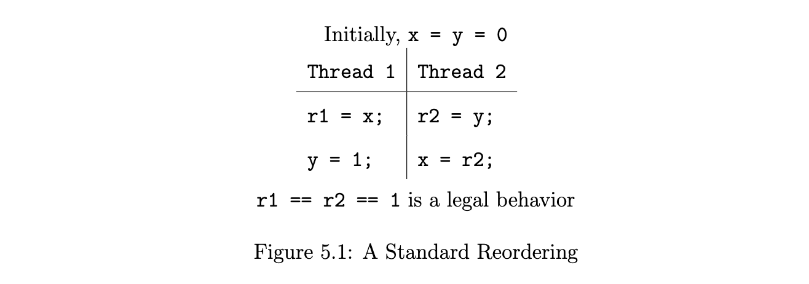

As a first example of how the memory model works, consider Figure 5.1. Note that there are initially writes of the default value 0 to x and y. We wish to get the result r1 == r2 == 1, which can be obtained if a compiler reorders the statements in Thread 1. This result is consistent with the happens-before memory model, so we only have to ensure that it complies with the causality rules in Section 5.4.

作为内存模型工作方式的第一个例子，请看图 5.1。我们希望得到的结果是 r1 == r2 == 1，如果编译器重新排列线程 1 中的语句，就可以得到这个结果。这个结果与发生在内存模型之前是一致的，所以我们只需要确保它符合第 5.4 节中的因果关系规则。

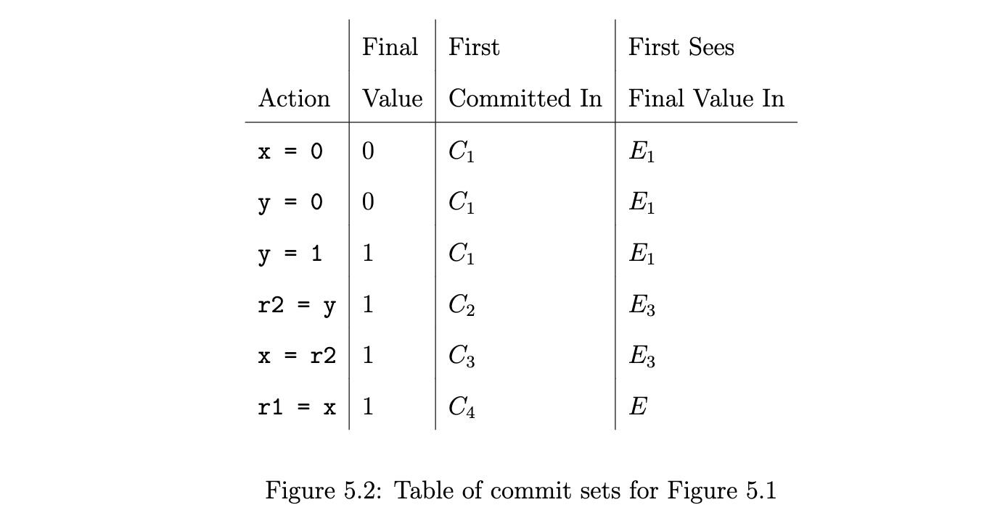

The set of actions C0 is the empty set, and there is no execution E0. As a result of this, execution E1 will be an execution where all reads see writes that happen-before them, as per Rule 6. In E1, both reads must see the value 0. We first commit the initial writes of 0 to x and y, as well as the write of 1 to y by Thread 1; these writes are contained in the set C1.

行动集 C0 是空集，不存在执行 E0。因此，根据规则 6，执行 E1 将是一个所有读都看到在它们之前发生的写的执行。在 E1 中，两个读数都必须看到 0 这个值。我们首先提交对 x 和 y 的初始写入，以及线程 1 对 y 的写入；这些写入都包含在 C1 集合中。

We wish the action r2 = y to see the value 1. C1 cannot contain this action seeing this value: neither write to y had been committed. C2 may contain this action; however, the read of y must return 0 in E2, because of Rule 6. Execution E2 is therefore identical to E1.

我们希望动作 r2 = y 看到的值是 1。C1 不能包含这个看到这个值的动作：对 y 的写没有被提交。C2 可以包含这个动作；然而，由于规则 6，在 E2 中对 y 的读取必须返回 0。因此，执行 E2 与 E1 是相同的。

n E3, by Rule 7, r2 = y can see any conflicting write that occurs in C2 (as long as that write is happens-before consistent). This action can now see the write of 1 to y in Thread 1, which was committed in C1. We commit one additional action in C3: a write of 1 to x by x = r2.

在 E3 中，根据规则 7，r2 = y 可以看到 C2 中发生的任何冲突的写（只要该写在发生之前是一致的）。这个动作现在可以看到线程 1 中写给 y 的 1，这在 C1 中被提交。我们在 C3 中提交了一个额外的动作：由x = r2 写 1 到 x。

C4, as part of E4, contains the read r1 = x; it still sees 0, because of Rule 6. In our final execution E = E5, however, Rule 7 allows r1 = x to see the write of 1 to x that was committed in C3.

C4，作为 E4 的一部分，包含了读 r1 = x；由于规则 6，它仍然看到 0。然而，在我们的最终执行 E = E5 中，规则 7 允许 r1 = x 看到在 C3 中提交的对 x 的 1 的写入。

#### 5.7.2 Correctly Synchronized Programs
It is easy to see how most of the guarantees that we wished to provide for volatile variables are fulfilled; Section 5.2 explicitly provides most of them. A slightly more subtle issue (mentioned in Section 3.5.3) is reproduced as Figure 5.3. This code is correctly synchronized: in all sequentially consistent executions, the read of a by Thread 1 sees the value 0; the volatile variable v is therefore written, and there is a happens-before relationship between that read of a by Thread 1 and the write to a in Thread 2.

很容易看出我们希望为 volatile 变量提供的大部分保证是如何实现的；第 5.2 节明确规定了其中的大部分。一个稍微微妙的问题（在第 3.5.3 节中提到）被复制为图 5.3。这段代码是正确同步的：在所有顺序一致的执行中，线程 1 对 a 的读取看到的值是 0；因此 volatile 变量 v 被写入，线程 1 对 a 的读取和线程 2 对 a 的写入之间存在 happens-before 的关系。

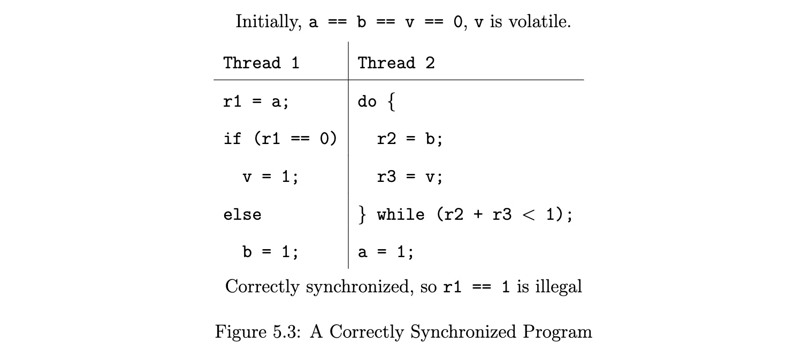

In order for the read of a to see the value 1 (and therefore result in a non-sequentially consistent execution), the write to a must be committed before the read. We may commit that write first, in E1. We then would try to commit the read of a by Thread 1, seeing the value 1. However, Rule 2 requires that the happens-before orderings between an action being committed and the actions already committed remain the same when the action is committed. In this case, we are trying to commit the read, and the write is already committed, so the read must happen-before the write in E2. This makes it impossible for the read to see the write.

为了让对 a 的读取看到值 1（因此导致非顺序一致的执行），对 a 的写入必须在读取之前提交。我们可以在 E1 中首先提交该写。然后，我们将尝试通过线程 1 提交对 a 的读取，看到值 1。然而，规则 2 要求，当动作被提交时，正在提交的动作和已经提交的动作之间的发生前顺序保持一致。在这种情况下，我们试图提交读，而写已经被提交，所以在 E2 中读必须发生在写之前。这使得读不可能看到写。

Note that in addition to this, Rule 8 states that any release-acquire pair that happens-before the write to a when that write is committed must be present in Ci. This requirement implies that the volatile accesses would have to be added to Ci. Since they have to be present in the final execution for the write to take place early, the data race is not possible.

请注意，除此之外，规则 8 规定，当写提交时，任何发生在写之前的释放-获取对必须存在于 Ci 中。这个要求意味着 volatile 访问必须被添加到 Ci 中。由于它们必须存在于最终执行中，才能提前进行写入，所以数据竞赛是不可能的。

Rule 8 is not redundant; it has other implications. For example, consider the code in Figure 5.4. We wish to prohibit the behavior where the read of v returns 0, but Threads 1 and 2 return the value 1. Because v is volatile, Rule 8 protects us. In order to commit one of the writes in Threads 1 or 2, the release-acquire pair of (v = 1, r3 = v) must be committed before the reads in Threads 1 and 2 can see the value 1 – r3 must be equal to 1.

规则 8 并不是多余的，它还有其他含义。例如，考虑图 5.4 中的代码。我们希望禁止这样的行为：对 v 的读取返回 0，但线程 1 和 2 返回值 1。因为 v 是易失性的，规则 8 保护了我们。为了提交线程 1 或 2 中的一个写，必须在线程1和2中的读看到值 1 之前提交释放-获取对（v=1，r3=v）-r3 必须等于1。

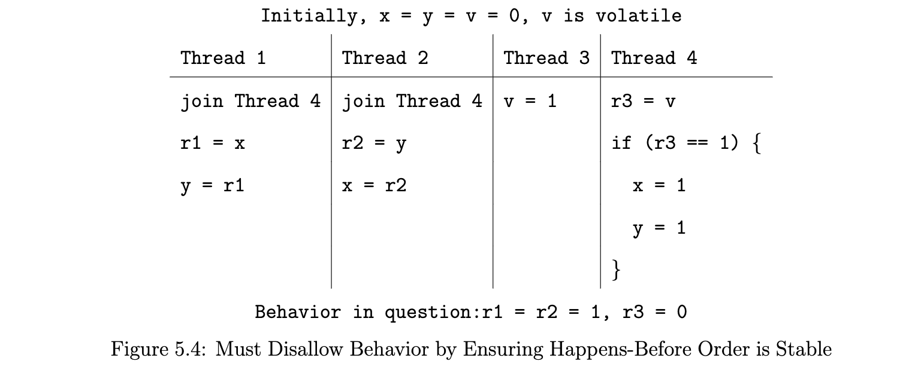

Note that if v were not volatile, the read in Thread 4 would have to be committed to see the write in Thread 3 before the reads in Threads 1 and 2 could see the value 1 (by Rule 6).

请注意，如果 v 不是易失性的，线程 4 的读必须在线程 1 和 2 的读看到值 1 之前提交给线程 3 的写（根据规则6）。

#### 5.7.3 Observable Actions
Figure 5.5 is the same as Figure 3.13 in Section 3.6. Our requirement for this program was that if we observe the print message from Thread 2, and no other threads other than Threads 1 and 2 run, then Thread 1 must see the write to v, print its message and terminate. The compiler should not be able to hoist the volatile read of v out of the loop in Thread 1.

图 5.5 与第 3.6 节的图 3.13 相同。我们对这个程序的要求是，如果我们观察到线程 2 的打印信息，并且除了线程 1 和 2 之外没有其他线程运行，那么线程 1 必须看到对 v 的写入，打印其信息并终止。编译器不应该能够把对 v 的 volatile 读取从线程 1 的循环中提升出来。

The fact that Thread 1 must terminate if the print by Thread 2 is observed follows from the rules on observable actions described in Section 5.5. If the print by Thread 2 is in a set of observable actions O, then the write to v and all reads of v that see the value 0 must also be in O. Additionally, the program cannot perform an unbounded amount of additional actions that are not in O. Therefore, the only observable behavior of this program in which the program hangs (runs forever without performing additional external actions) is one in which it performs no observable external actions other than hanging. This includes the print action.

如果线程 2 的打印被观察到，那么线程 1 必须终止，这一事实来自于第 5.5 节中描述的可观察动作的规则。如果线程 2 的打印动作在可观察的动作集合 O 中，那么写到 v 和所有读到值 0 的 v 也必须在 O 中。此外，程序不能执行不在 O 中的额外的动作。这包括打印动作。

## 6 Simulation and Verification
In Chapter 3, we looked at the informal requirements for our memory model, exposing the principles that guided its development. In Chapter 5, we provided a formal specification for the model. However, as the maxim goes, you cannot proceed formally from an informal specification. How do we know that the formal specification meets our informal criteria?

The answer is clearly verification. For the Java memory model, we did two types of verification. The first was a simulator, which was useful for determining that the behavior of the model was correct on individual test cases. The other was a set of proofs that the properties that we specified (in Chapter 3) for our memory model did, in fact, hold true for it.

This chapter is broken into two parts. Section 6.1 describes the simulator: how it works and its runtime complexity. Section 6.2 recapitulates the properties that we outlined for our memory model, and discusses how we ensured that those properties were realized.

### 6.1 Simulator
As shown in Chapters 3 and 4, the informal requirements for our memory model were motivated by a dozen (or so) test cases. When developing the memory model, we actually formulated dozens of these test cases, each of which was created specifically to demonstrate a particular property that our model had to have. Every change we made to the model could conceivably affect any number of those properties; we needed a way to review the test cases systematically. Being computer scientists, we naturally developed the idea of simulating the model. 

如第3章和第4章所示，我们的内存模型的非正式需求是由十几个（或更多）测试案例所激发的。在开发内存模型时，我们实际上制定了几十个这样的测试用例，每一个都是专门为了证明我们的模型必须具有的特定属性而创建。我们对模型所做的每一个改变都可能影响到这些属性中的任何一个；我们需要一种方法来系统地审查测试案例。作为计算机科学家，我们自然产生了模拟模型的想法。

The simulator can be used in a number of ways. For example, you could feed a program P into the simulator to obtain a set of results R. Then, you can apply a compiler transformation by hand to convert P into P ′, and feed P ′into the simulator, giving a set of results R′. The transformation from P to P ′is legal if and only if R′⊆ R. The insight here is that while a compiler can do transformations that eliminate possible behaviors (e.g., performing forward substitution or moving memory references inside a synchronized block), transformations must not introduce new behaviors.

模拟器可以以多种方式使用。例如，你可以把一个程序P送入模拟器，得到一组结果R。然后，你可以手工应用编译器的转换，把P转换成P′，并把P′送入模拟器，得到一组结果R′。从P到P′的转换是合法的，当且仅当R′⊆R。这里的启示是，虽然编译器可以做消除可能行为的转换（例如，执行正向替换或在同步块内移动内存引用），但转换不能引入新的行为。

The simulator provides three important benefits:
+ It gives us confidence that the formal model means what we believe, and that we believe what it means。
+ As we fine tuned and modified the formal model, we gained confidence that we were only changing the things we intended to change.
+ The formal model is not easy to understand; it is likely that only a subset of the people who need to understand the Java memory model will understand the formal description of model. People such as JVM implementors and authors of books and articles on thread programming may find the simulator a useful tool for understanding the memory model.

#### 6.1.1 Simulating Causality
The simulator is built on top of a global system that executes one operation from one thread in each step, in program order. This is used to provide all possible interleavings of a given program, when the actions appear in the interleavings in the same order in which they occur in the program. This framework has been useful in simulating several versions of the model [MP01a, MP01b].

模拟器建立在一个全局系统之上，该系统在每个步骤中按程序顺序从一个线程执行一个操作。这被用来提供一个给定程序的所有可能的交织，当这些操作以它们在程序中出现的相同顺序出现在交织中时。这个框架在模拟该模型的几个版本中非常有用[MP01a, MP01b]。

Although this is a useful framework, it does not allow for the full flexibility of the model. As discussed in Chapter 4, the difficulty in developing a sufficient model lies in determining which actions can occur early (out of program order).The notion of causality underlies this; how can an action be performed early (or presciently) while also ensuring that the action is not causing itself to occur?

虽然这是一个有用的框架，但它并不允许模型的全部灵活性。正如第四章所讨论的，开发一个充分的模型的困难在于确定哪些行动可以提前发生（超出程序顺序）。因果关系的概念是这一问题的基础；如何在提前（或预知）执行一个行动的同时还能确保该行动不会导致自身发生？

A basic simulator that executes instructions in program order does not have to deal with causality, because no actions are performed early. However, it is also incomplete, because it does not provide results of executions with prescient actions. A na ̈ıve solution would be to attempt to perform all actions early, at every possible place where they might be performed. However, this is far too computationally expensive. The single greatest difficulty in developing a simulator is in determining where prescient actions may be executed.

一个按程序顺序执行指令的基本模拟器不必处理因果关系，因为没有提前执行的动作。然而，它也是不完整的，因为它不提供有预知行动的执行结果。一个简单的解决方案是试图在每一个可能执行的地方提前执行所有的动作。然而，这在计算上是非常昂贵的。开发模拟器的最大困难是确定在哪里可以执行预知行动。

An early version of the simulator was able to use some heuristics to decide where early reads could occur, but it largely relied on manual placement [MP02]. However, this is an incomplete approach; that simulator could not generate and verify all legal executions.

早期版本的模拟器能够使用一些启发式方法来决定早期读取可能发生的位置，但它主要依赖于人工放置[MP02]。然而，这是一个不完整的方法；该模拟器不能生成和验证所有合法的执行。

However, this is not as computationally expensive as it sounds. Remember that the formal model is given an execution E to verify, and takes an iterative, two phase approach (as mentioned in Chapters 4 and 5):
1. Starting with some set of actions that are ensured to occur (the “committed” actions), generate all possible executions that include those actions, and in which all reads that are not committed see writes that happen-before them.
2. Given those resulting executions, determine what actions can be added to the set of “committed” actions: these represent additional actions that can be performed early.

This process is repeated until there are no actions left to be added to the set of committed actions. If the resulting execution E′is the same as the execution E provided, then E′is a legal execution. The simulator therefore simply generates all sets of legal executions.

The tricky part, of course, is picking the next actions to commit, while still preventing the execution time from being too long. A simple answer to this can be found in the model itself. The “obvious” extension (as mentioned in the first bullet above) is to include all executions where reads see only writes that happen before those reads. The only executions that this does not produce are ones where a read r is in a data race with a write w, and r returns the value of w. It is therefore simply a matter of detecting writes that are involved in data races with r, and committing those writes so that r can see them. As an optimization, we only commit those writes that can actually allow the read to see a value that it did not see in the justifying execution.

To detect data races, the simulator uses a technique commonly used for dynamic on-the-fly data race detection [Sch89, NR86, DS90]. The technique is quite simple; it works by examining the partial ordering induced by the happens-before relationship (referred to as a partially-ordered execution graph in the literature).

If two accesses in the graph are not strictly ordered with respect to each other, and one is a write, then they are in a data race. This is easily supported by the simulator, which needs to keep track of the happens-before relationships anyway. The simulator simply commits writes that are in data races, then commits reads in the same data races that see those writes. It then executes all inter-leavings the program, ensuring that uncommitted reads can only see the result of writes that happen-before them (as described in Chapter 5). Additionally, it should be noted that when actions in a data race are committed, acquire and release actions that happen-before them also have to be committed (as per Rule 8 in Section 5.4).

Most of the other functional details are easy to extract from the definition of the model as found in Chapter 5. One additional point is worth noting. While the simulator is generating executions, it is important that it ensure that those executions obey the well-formedness criteria listed in Section 5.3. The simulator must, for example, ensure that volatile variables read the correct values and that intra-thread consistency is maintained.

#### 6.1.2 Simulator Performance
(暂缓)

### 6.2 Proofs
(暂缓)

## 7 Immutable Objects
In Java, a final field is (intuitively) written to once, in an object’s constructor, and never changed. The original Java memory model contained no mention of final fields. However, programmers frequently treated them as immutable. This resulted in a situation where programmers passed references between threads to objects they thought were immutable without synchronization. In this chapter, we cover how our memory model deals with final fields.

在 Java 中，最终字段（直观地）只被写入一次，在对象的构造函数中，并且永远不会改变。最初的 Java 内存模型中没有提到最终字段。然而，程序员经常把它们当作不可变的。这就导致了这样一种情况：程序员在线程之间传递对对象的引用，他们认为这些对象是不可变的，而没有同步。在本章中，我们将介绍我们的内存模型是如何处理 final 字段的。

One design goal for the Java memory model was to provide a mechanism whereby an object can be immutable if all of its fields are declared final. This immutable object could be passed from thread to thread without worrying about data races. This relatively simple goal proved remarkably difficult, as this chapter describes.

Java 内存模型的一个设计目标是提供一种机制，如果一个对象的所有字段都被声明为 final，那么它就可以是不可变的。这种不可变的对象可以在线程之间传递，而不必担心数据竞赛。这个相对简单的目标被证明是非常困难的，正如本章所描述的。

Figure 7.1 gives an example of a typical use of final fields in Java. An object of type FinalFieldExample is created by the thread that invokes writer(). That thread then passes the reference to a reader thread without synchronization. A reader thread reads both fields x and y of the newly constructed object.

图 7.1 给出了一个在 Java 中使用 final 字段的典型例子。一个 FinalFieldExample 类型的对象是由调用 writer() 的线程创建的。然后，该线程将该引用传递给一个读者线程，而不进行同步。读者线程读取新构造的对象的字段 x 和 y。

Under Java’s original memory model, it was possible to reorder the write to f with the invocation of the constructor. Effectively, the code:

在 Java 最初的内存模型下，可以通过构造函数的调用来重新安排对 f 的写入。有效地，代码。

```
    r1 = new FinalFieldExample;
    r1.x = 3;
    r1.y = 4;
    f = r1;

    // would be changed to :

    r1 = new FinalFieldExample;
    f = r1;
    r1.x = 3;
    r1.y = 4;
```

This reordering allowed the reader thread to see the default value for the final field and for the non-final (or normal field). One requirement for Java’s memory model is to make such transformations illegal; it is now required that the assignment to f take place after the constructor completes.

这种重新排序允许读者线程看到最终字段和非最终字段（或正常字段）的默认值。Java 的内存模型的一个要求是使这种转换不合法；现在要求对 f 的赋值发生在构造函数完成之后。

A more serious example of how this can affect a program is shown in Figure 7.2. String objects are intended to be immutable; methods invoked on Strings do not perform synchronization. This class is often implemented as a pointer to a character array, an offset into that array, and a length. This approach allows a character array to be reused for multiple String objects. However, this can create a dangerous security hole.

图 7.2 显示了一个更严重的例子，说明这可能会影响程序。字符串对象的目的是不可改变的；对字符串调用的方法不执行同步。这个类通常被实现为一个指向字符数组的指针、该数组的偏移量和长度。这种方法允许一个字符数组被重复用于多个 String 对象。然而，这可能会产生一个危险的安全漏洞。

```
    class FinalFieldExample {
        final int x;
        int y;
        static FinalFieldExample f;

        public FinalFieldExample() {
            x = 3;
            y = 4;
        }

        static void writter() {
            f = new FinalFieldExample();
        }

        static void reader() {
            if (f != null) {
                int i = f.x;
                int j = f.y;
            }
        }
    }

    // A reader must never see x == 0
    
    // Figure 7.1: Example Illustrating Final Field Semantics
```

```
    // Thread 1
    Global.s = "/tmp/usr".substring(4);

    // Thread 2
    String myS = Global.s;
    if (myS.equals("/tmp"))
        System.out.println(myS);

    // Figure 7.2: Without final fields or synchronization, it is possible for this code to print /usr
```

In particular, if the fields of the String class are not declared final, then it would be possible for Thread 2 initially to see the default value of 0 for the offset of the String object, allowing it to compare as equal to "/tmp". A later operation on the String object might see the correct offset of 4, so that the String object is perceived as being "/usr". This is clearly a danger; many security features of the Java programming language depend upon Strings being perceived as truly immutable.

特别是，如果 String 类的字段没有被声明为 final，那么线程 2 就有可能在最初看到 String 对象的偏移量的默认值为 0，允许它比较为等于 "/tmp"。后来对字符串对象的操作可能会看到正确的偏移量4，因此字符串对象被认为是"/usr"。这显然是一种危险；Java 编程语言的许多安全特性都依赖于字符串被认为是真正不可改变的。

In the rest of this chapter, we discuss the way in which final fields were formalized in the Java memory model. Section 7.1 lays out the full, informal requirements for the semantics of final fields. The bulk of the document discusses the motivation; the full semantics of final fields are presented in Section 7.3. Finally, we present some implementation issues in Section 7.5.

在本章的其余部分，我们将讨论最终字段在 Java 内存模型中被正式化的方式。第 7.1 节列出了对最终字段语义的完整、非正式的要求。该文件的大部分内容讨论了动机；最终字段的完整语义在第 7.3 节中介绍。最后，我们在第 7.5 节中介绍了一些实现问题。

### 7.1 Informal Semantics
The detailed semantics of final fields are somewhat different from those of normal fields. In particular, we provide the compiler with great freedom to move reads of final fields across synchronization barriers and calls to arbitrary or unknown methods. Correspondingly, we also allow the compiler to keep the value of a final field cached in a register and not reload it from memory in situations where a non-final field would have to be reloaded.

final 字段的详细语义与普通字段的语义有些不同。特别是，我们为编译器提供了很大的自由度，使 final 字段的读取可以跨越同步障碍和对任意或未知方法的调用。相应地，我们也允许编译器将 final 字段的值缓存在寄存器中，在非 final 字段必须被重新加载的情况下，不从内存中重新加载它。

Final fields also provide a way to create thread-safe immutable objects that do not require synchronization. A thread-safe immutable object is seen as immutable by all threads, even if a data race is used to pass references to the immutable object between threads.

final 字段还提供了一种方法来创建不需要同步的线程安全的不可变对象。一个线程安全的不可变对象会被所有线程视为不可变的，即使线程之间使用数据竞赛来传递对不可变对象的引用。

The original Java semantics did not enforce an ordering between the writer and the reader of the final fields for the example in Figure 7.1. Thus, the read was not guaranteed to see the write.

在图 7.1 的例子中，原始的 Java 语义并没有强制要求写者和读者对最终字段进行排序。因此，读取者不能保证能看到写入者。

In the abstract, the guarantees for final fields are as follows. When we say an object is “reachable” from a final field, that means that the field is a reference, and the object can be found by following a chain of references from that field. When we say the “correctly initialized” value of a final field, we mean both the value of the field itself, and, if it is a reference, all objects reachable from that field.

在抽象的情况下，对最终字段的保证是如下的。当我们说一个对象可以从一个最终字段 "到达"时，这意味着该字段是一个引用，并且该对象可以通过跟随该字段的引用链而被找到。当我们说一个最终字段的 "正确初始化"值时，我们指的是字段本身的值，以及如果它是一个引用，从该字段可到达的所有对象。

+ At the end of an object’s constructor, all of its final fields are “frozen” by an implicit “freeze” action. The freeze for a final field takes place at the end of the constructor in which it was set. In particular, if one constructor invokes another constructor, and the invoked constructor sets a final field, the freeze for the final field takes place at the end of the invoked constructor. (在一个对象的构造函数结束时，它的所有 final 字段都被一个隐含的 "冻结"动作所"冻结"。一个 final 字段的冻结发生在设置该字段的构造函数的末尾。特别是，如果一个构造函数调用另一个构造函数，而被调用的构造函数设置了一个 final 字段，final 字段的冻结发生在被调用的构造函数的末尾。)
+ If a thread only reads references to an object that were written after the last freeze of its final fields, that thread is always guaranteed to see the frozen value of the object’s final fields. Such references are called correctly published, because they are published after the object is initialized. There may be objects that are reachable by following a chain of references from such a final field. Reads of those objects will see values at least as up to date as they were when the freeze of the final field was performed. (如果一个线程只读取一个对象的引用，而这些引用是在其 final 字段最后一次冻结后写的，那么这个线程总是能保证看到该对象 final 字段的冻结值。这样的引用被称为正确发布，因为它们是在对象被初始化后发布的。可能有一些对象可以通过跟随这样一个 final 字段的引用链而到达。对这些对象的读取将看到至少与 final 字段冻结时一样最新的值。)
+ Conversely, if a thread reads a reference to an object written before a freeze, that thread is not automatically guaranteed to see the correctly initialized value of the object’s final fields. Similarly, if a thread reads a reference to an object reachable from the final field without reaching it by following pointers from that final field, the thread is not automatically guaranteed to see the value of that object when the field was frozen. (反之，如果一个线程读取一个在冻结前写的对象的引用，该线程不能自动保证看到该对象 final 字段的正确初始化值。同样，如果一个线程读取了一个可从 final 字段到达的对象的引用，而没有通过跟随该 final 字段的指针到达该对象，那么该线程不能自动保证看到该字段被冻结时该对象的值。)
+ If a thread is not guaranteed to see a correct value for a final field or anything reachable from that field, the guarantees can be enforced by a normal happens-before relationship. In other words, those guarantees can be enforced by normal synchronization techniques. (如果一个线程不能保证看到一个最终字段的正确值或任何可从该字段到达的东西，这些保证可以通过正常的发生在前的关系来执行。换句话说，这些保证可以通过正常的同步技术来执行。)
+ When you freeze a final which points to an object, then freeze a final field of that object, there is a happens-before relationship between the first freeze and the second. (当你冻结一个指向对象的 final，然后冻结该对象的 final 字段时，在第一次冻结和第二次冻结之间存在一个 happens-before 的关系。)

#### 7.1.1 Complications
Retrofitting the semantics to the existing Java programming language requires that we deal with a number of complications:

将语义改造成现有的 Java 编程语言，需要我们处理一些复杂的问题。

+ Serialization is the writing of an object to an input or output stream, usually so that object can be stored or passed across a network. When the object is read, that is called deserialization . Using serialization in Java to read an object requires that the object first be constructed, then that the final fields of the object be initialized. After this, deserialization code is invoked to set the object to what is specified in the serialization stream. This means that the semantics must allow for final fields to change after objects have been constructed. (序列化是将一个对象写入一个输入或输出流，通常是为了使该对象能够被存储或在网络上传递。当该对象被读取时，这被称为反序列化。在 Java 中使用序列化来读取一个对象，需要首先构建该对象，然后初始化该对象的 final 字段。在这之后，反序列化代码被调用，将对象设置为序列化流中指定的内容。这意味着语义必须允许 final 字段在对象被构造后发生变化。)
  Although our semantics allow for this, the guarantees we make are some-what limited; they are specialized to deserialization. These guarantees are not intended to be part of a general and widely used mechanism for changing final fields. In particular, you cannot make a call to native code to modify final fields; the use of this technique will invalidate the semantics of the VM. (尽管我们的语义允许这样做，但我们所做的保证在某种程度上是有限的；它们是专门针对反序列化的。这些保证并不打算成为改变最终字段的普遍和广泛使用的机制的一部分。特别是，你不能调用本地代码来修改最终字段；使用这种技术将使虚拟机的语义失效。)
  
  To formalize the semantics for multiple writes / initializations of a final field, we allow multiple freezes. A second freeze action might, for example, take place after deserialization is complete. (为了正式确定一个最终字段的多次写入/初始化的语义，我们允许多次冻结。例如，第二个冻结动作可能发生在反序列化完成之后。)
+ System.in, System.out and System.err are static final fields that allow access to the system’s stdin, stdout and stderr files. Since programs often redirect their input and output, these fields are defined to be mutable by public methods. Thus, we give these three fields (and only these three fields) different semantics. This is discussed in detail in Section 7.3. (System.in、System.out 和System.err 是静态的最终字段，允许访问系统的 stdin、stdout 和 stderr 文件。由于程序经常重定向其输入和输出，这些字段被定义为可被公共方法改变。因此，我们赋予这三个字段（而且只有这三个字段）不同的语义。这将在第 7.3 节详细讨论。)

### 7.2 Motivating Examples

#### 7.2.1 A Simple Example

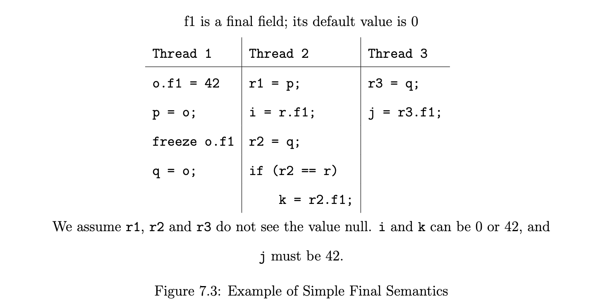

Consider Figure 7.3. We will not start out with the complications of multiple writes to final fields; a freeze, for the moment, is simply what happens at the end of a constructor. Although r1, r2 and r3 can see the value null, we will not concern ourselves with that; that just leads to a null pointer exception.

请看图 7.3。我们不会从对最终字段进行多次写入的复杂情况开始；目前，冻结只是在构造函数结束时发生的情况。尽管 r1、r2 和 r3 可以看到 null 这个值，但我们将不关心这个问题；这只会导致一个空指针异常。

The reference q is correctly published after the end of o’s constructor. Our semantics guarantee that if a thread only sees correctly published references to o, that thread will see the correct value for o’s final fields. We therefore want to construct a special happens-before relationship between the freeze of o.f1 and the read of it as q.f1 in Thread 3.

引用 q 在 o 的构造函数结束后被正确发布。我们的语义保证，如果一个线程只看到正确发布的对 o 的引用，该线程将看到 o 的 final 字段的正确值。因此，我们想在 o.f1 的冻结和线程 3 中作为 q.f1 的读取之间构建一个特殊的 happens-before 的关系。

The read of p.f1 in Thread 2 is a different case. Thread 2 sees p, an incorrectly published reference to object o; it was made visible before the end of o’s constructor. A read of p.f1 could easily see the default value for that field, if a compiler decided to reorder the write to p with the write to o.f1. No read of p.f1 should be guaranteed to see the correctly constructed value of the final field.

线程 2 中对 p.f1 的读取是一个不同的情况。线程 2 看到的是 p，一个错误地发布给对象 o 的引用；它是在 o 的构造函数结束前就可见的。如果编译器决定将对 p 的写入与对 o.f1 的写入重新排序，那么对 p.f1的读取就很容易看到该字段的默认值。不应保证对 p.f1 的读取能看到最终字段的正确构造值。

What about the read of q.f1 in Thread 2? Is that guaranteed to see the correct value for the final field? A compiler could determine that p and q point to the same object, and therefore reuse the same value for both p.f1 and q.f1 for that thread. We want to allow the compiler to remove redundant reads of final fields wherever possible, so we allow k to see the value 0.

在线程 2 中读取 q.f1 的情况如何？是否能保证看到最终字段的正确值？编译器可以确定 p 和 q 指向同一个对象，因此对该线程的 p.f1 和 q.f1 都重复使用同一个值。我们想让编译器尽可能地消除对最终字段的冗余读取，所以我们允许 k 看到 0 这个值。

One way to conceptualize this is by thinking of an object being “tainted’ for a thread if that thread reads an incorrectly published reference to the object. If an object is tainted for a thread, the thread is never guaranteed to see the object’s correctly constructed final fields. More generally, if a thread t reads an incorrectly published reference to an object o, thread t forever sees a tainted version of o without any guarantees of seeing the correct value for the final fields of o.

一种概念化的方法是，如果一个线程读取了一个错误发布的对象的引用，那么这个对象对该线程来说就是 "污点"。如果一个对象对一个线程来说是有污点的，那么这个线程就不能保证能看到这个对象正确构造的最终字段。更一般地说，如果一个线程t读取了对一个对象o的不正确发布的引用，那么线程t就会永远看到o的一个污点版本，而不能保证看到o的最终字段的正确值。

In Figure 7.3, the object is not tainted for Thread 3, because Thread 3 only sees the object through p. Thread 2 sees the object through both both the q reference and the p reference, so it is tainted.

在图7.3中，对象对线程 3 来说不是污点，因为线程 3 只通过 p 看到对象。线程 2 通过 q 引用和 p 引用看到对象，所以它是污点。

#### 7.2.2 Informal Guarantees for Objects Reachable from Final Fields

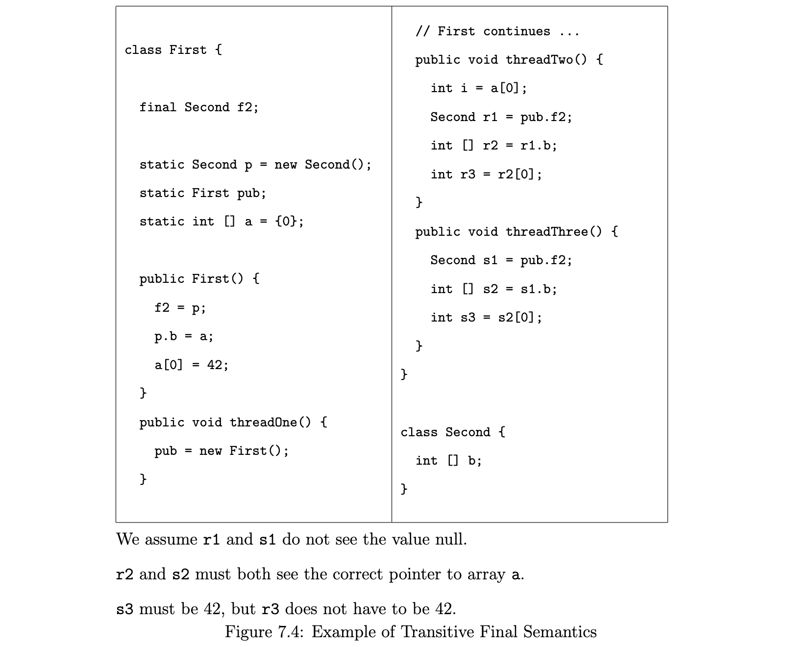

In Figure 7.4, the final field o.f2 is a reference instead of being a scalar (as it was in Section 7.2.1). It would not be very useful if we only guaranteed that the values read for references were correct, without also making some guarantees about the objects pointed to by those references. In this case, we need to make guarantees for f2, the object p to which it points and the array pointed to by p.b. Thread 1 executes threadOne, Thread 2 executed threadTwo, and Thread 3 executed threadThree.

在图7.4 中，最后的字段 o.f2 是一个引用，而不是一个标量（就像在 7.2.1 节中那样）。如果我们只保证为引用读取的值是正确的，而不对这些引用所指向的对象做一些保证，那就不是很有用了。在这种情况下，我们需要对 f2、它所指向的对象 p 和 p.b 所指向的数组做出保证。线程 1 执行 threadOne，线程 2 执行threadTwo，线程 3 执行 threadThree。

We make a very simple guarantee: if a final reference is published correctly, and its correct value was guaranteed to be seen by an accessing thread (as described in Section 7.2.1), everything transitively reachable from that final reference is also guaranteed to be up to date as of the freeze. In Figure 7.4, o’s reference to p, p’s reference to a and the contents of a are all guaranteed to be seen by Thread 3. We call this idiom a dereference chain.

我们做了一个非常简单的保证：如果一个最终引用被正确地发布了，并且它的正确值被保证能被访问线程看到（如第 7.2.1 节所述），那么从该最终引用可转达的所有内容也被保证在冻结时是最新的。在图 7.4 中，o 对 p 的引用、p 对 a 的引用以及 a 的内容都保证被线程 3 看到。我们把这个成语叫做推理链。

We make one exception to this rule. In Figure 7.4, Thread 2 reads a[0] through two different references. A compiler might determine that these references are the same, and reuse i for r3. Here, a reference reachable from a final field is read by a thread in a way that does not provide guarantees; it is not read through the final field. If this happens, the thread “gives up” its guarantees from that point in the dereference chain; the address is now tainted. In this example, the read of a[0] in Thread 2 can return the value 0.

我们对这一规则做了一个例外。在图 7.4 中，线程 2 通过两个不同的引用读取 a[0]。编译器可能会确定这些引用是相同的，并为 r3 重复使用 i。在这里，一个可从 final 字段到达的引用被线程以一种不提供保证的方式读取；它没有通过最终字段读取。如果发生这种情况，线程就会 "放弃 "对解指链中那一点的保证；该地址现在是有污点的。在这个例子中，线程 2 中对 a[0] 的读取可以返回值 0。

The definition of reachability is a little more subtle than might immediately be obvious. Consider Figure 7.5. It may seem that the final field p.g, read as k.g in Thread 2, can only be reached through one dereference chain. However, consider the read of pub.x. A global analysis may indicate that it is feasible to reuse its value for j. o.f and p.g may then be read without the guarantees that are provided when they are reached from pub.y. As with normal fields, an apparent dependency can be broken by a compiler analysis (see Section 3.3 for more discussion of how this affects normal fields).

可达性的定义比可能立即显现出来的更微妙。请看图 7.5。看起来最终的字段 p.g，在线程 2 中读作 k.g，只能通过一个推断链到达。然而，考虑对 pub.x 的读取。全局分析可能表明，为 j 重用它的值是可行的。 o.f 和 p.g 可以在没有保证的情况下被读取，当它们从 pub.y 到达时。

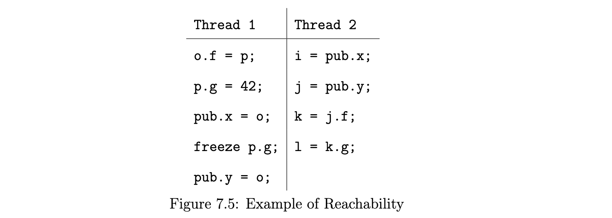

The upshot of this is that a reachability chain is not solely based on syntactic rules about where dereferences occur. There is a link in a dereference chain from any dynamic read of a value to any action that dereferences that value, no matter where the dereference occurs in the code.

这样做的结果是，可及性链并不仅仅是基于关于脱引发生位置的语法规则。从一个值的任何动态读取到任何解除引用该值的动作，在解除引用链中都有一个链接，无论解除引用发生在代码的什么地方。

#### 7.2.3 Additional Freeze Passing
In this section, we will discuss some of the other ways that a read can be guaranteed to see a freeze.

##### Freezes Are Passed Between Threads

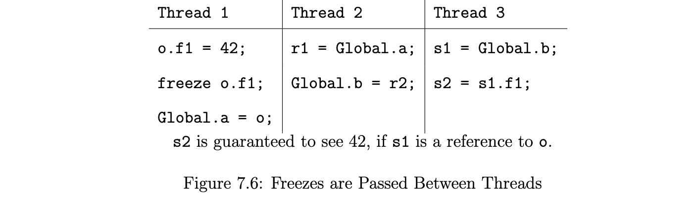

Figure 7.6 gives an example of another guarantee we provide. If s1 is a reference to o, should s2 have to see 42? The answer to this lies in the way in which Thread 3 saw the reference to o.

Thread 1 correctly published a reference to o, which Thread 2 then observed. Had Thread 2 then read a final field of o, it would have seen the correct value for that field; the thread would have to have ensured that it saw all of the updates made by Thread 1. To do this on SMP systems, Thread 2 does not need to know that it was Thread 1 that performed the writes to the final variable, it needs only to know that updates were performed. On systems with weaker memory constraints (such as DSMs), Thread 2 would need this information; we shall discuss implementation issues for these machines later.

How does this impact Thread 3? Like Thread 2, Thread 3 cannot see a reference to o until the freeze has occurred. Any implementation that allows Thread 2 to see the writes to o that occurred prior to the freeze will therefore allow Thread 3 to see all of the writes prior to the freeze. There is therefore no reason not to provide Thread 3 with the same guarantees with which we provide Thread 2.

##### Semantics’ Interaction with Happens-Before Edges

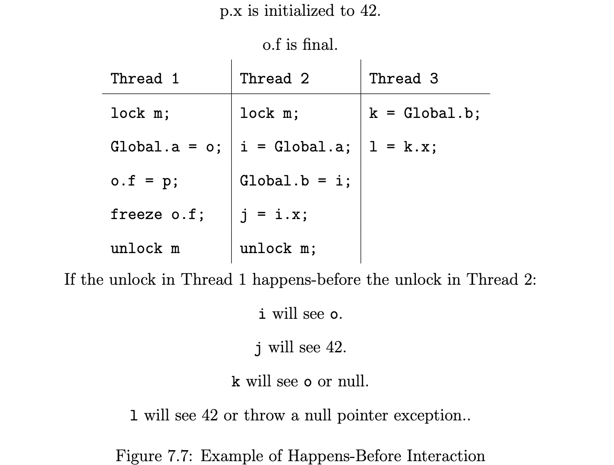

Now consider Figure 7.7. We want to describe the interaction between ordinary happens-before relationships and final field guarantees. In Thread 1, o is published incorrectly (before the freeze). However, if the code in Thread 1 happens-before the code in Thread 2, the normal happens-before relationships ensure that Thread 2 will see all of the correctly published values. As a result, j will be 42.

What about the reads in Thread 3? We assume that k does not see a null value: should the normal guarantees for final fields be made? We can answer this by noting that the write to Global.b in Thread 2 is the same as a correct publication of o, as it is guaranteed to happen after the freeze. We therefore make the same guarantees for any read of Global.b that sees o as we do for a read of any other correct publication of o.

#### 7.2.4 Reads and Writes of Final Fields in the Same Thread
Up to this point, we have only made guarantees about the contents of final fields for reads that have seen freezes of those final fields. This implies that a read of a final field in the same thread as the write, but before a freeze, might not see the correctly constructed value of that field.

Sometimes this behavior is acceptable, and sometimes it is not. We have four examples of how such reads could occur in Figure 7.8. In three of the examples, a final field is written via deserialization; in one, it is written in a constructor.

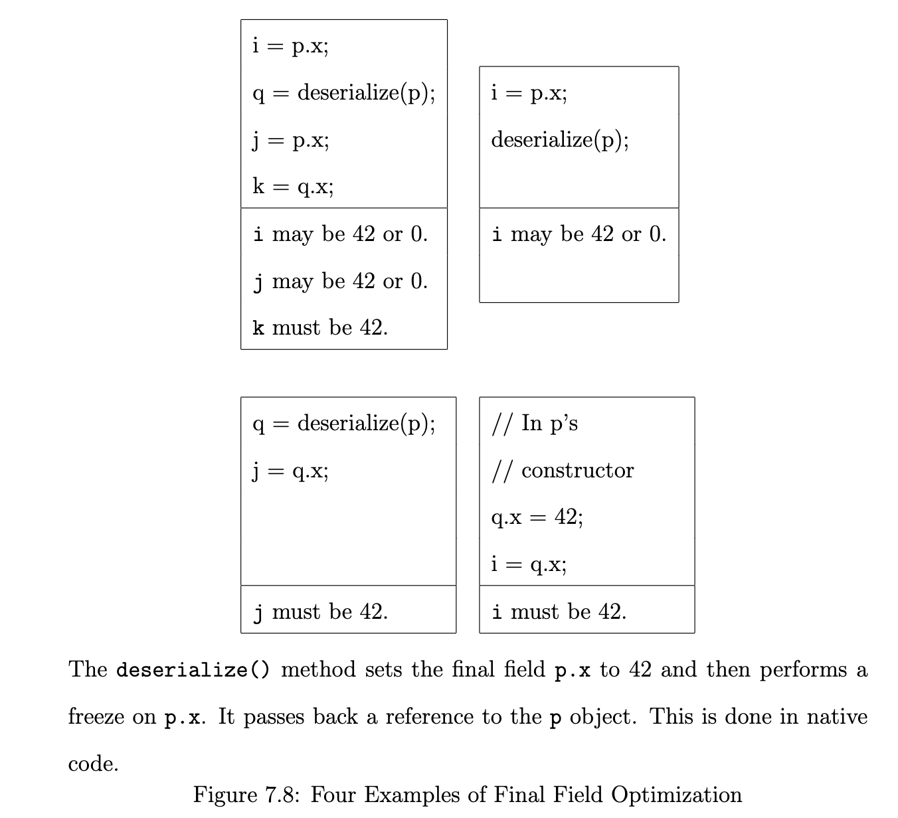

We wish to preserve the ability of compiler writers to optimize reads of final fields wherever possible. When the programs shown in Figure 7.8 access p.x before calling the deserialize() method, they may see the uninitialized value of p.x. However, because the compiler may wish to reorder reads of final fields around method calls, we allow reads of p.x to see either 0 or 42, the correctly written value.

On the other hand, we do want to maintain the programmer’s ability to see the correctly constructed results of writes to final fields. We have a simple metric: if the reference through which you are accessing the final field was not used before the method that sets the final field, then you are guaranteed to see the last write to the final field. We call such a reference a new reference to the object.

This rule allows us to see the correctly constructed value for q.x. Because
the reference deserialize() returns is a new reference to the same object, it
provides the correct guarantees.

For cases where a final field is set once in the constructor, the rules are simple: the reads and writes of the final field in the constructing thread are ordered according to program order.

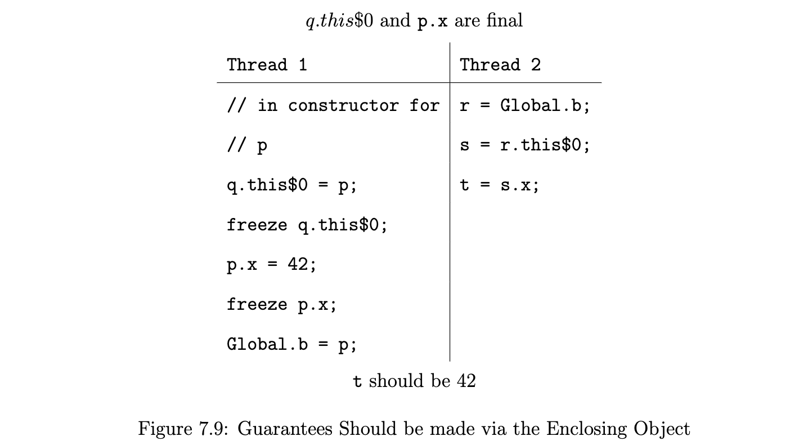

We must treat the cases (such as deserialization) where a final field can be modified after the constructor is completed a little differently.

#### 7.2.5 Guarantees Made by Enclosing Objects
Consider Figure 7.9. In Java, objects can be logically nested inside each other – when an inner object is constructed, it is given a reference to the outer object, which is denoted in bytecode by $0. In Thread 1, the inner object q is constructed inside the constructor for p. This allows a reference to p to be written before the freeze of p.x. The reference is now tainted, according to the intuition we have built up so far: no other thread reading it will be guaranteed to see the correctly constructed values for p.x.

However, Thread 2 is guaranteed not to see the final fields of p until after p’s constructor completes, because it can only see them through the correctly published variable Global.b. Therefore, it is not unreasonable to allow this thread to be guaranteed to see the correct value for p.x.

In general, we the semantics to reflect the notion that a freeze for an object o is seen by a thread reading a final field o.f if o is only read through a dereference chain starting at a reference that was written after the freeze of o.f.

### 7.3 Full Semantics
The semantics for final fields are as follows. A freeze action on a final field f of an object o takes place when a constructor for o in which f is written exits, either normally or abruptly (because of an exception). 

Reflection and other special mechanisms (such as deserialization) can be used to change final fields after the constructor for the object completes. The set(...) method of the Field class in java.lang.reflect may be used to this effect. If the underlying field is final, this method throws an IllegalAccessException unless setAccessible(true) has succeeded for this field and the field is non-static. If a final field is changed via such a special mechanism, a freeze of that field is considered to occur immediately after the modification.

#### Final Field Safe Contexts

An implementation may provide a way to execute a block of code in a final field safe context. Actions executed in a final field safe context are considered to occur in a separate thread for the purposes of Section 7.3, although not with respect to other aspects of the semantics. The actions performed within a final field safe context are immediately followed in program order by a synthetic action marking the end of the final field safe context.

#### Replacement and/or Supplemental Ordering Constraints
For each execution, the behavior of reads is influenced by two additional partial orders, dereference chain ( dc→) and memory chain (mc→), which are considered to be part of the execution (and thus, fixed for any particular execution). These partial orders must satisfy the following constraints (which need not have a unique solution):

+ Dereference Chain. If an action a is a read or write of a field or element of an object o by a thread t that did not construct o, then there must exist some read r by thread t that sees the address of o such that r dc→ a.
+ Memory Chain. There are several constraints on the memory chain ordering:
  + If r is a read that sees a write w, then it must be the case that w mc→ r.
  + If r and a are actions such that r dc→ a, then it must be the case that r mc→ a.
  + If w is a write of the address of an object o by a thread t that did not construct o, then there must exist some read r by thread t that sees the address of o such that r mc→ w.
  + If r is a read of a final instance field of an object constructed within a final field safe context ending with the synthetic action a such that a po→ r, then it must be the case that a mc→ r.

With the addition of the semantics for final fields, we use a different set of ordering constraints for determining which writes occur before a read, for purposes of determining which writes can be seen by a read.

We start with normal happens-before orderings, except in cases where the read is a read of a final instance field and either the write occurs in a different thread from the read or the write occurs via a special mechanism such as reflection.

In addition, we use orderings derived from the use of final instance fields. Given a write w, a freeze f , an action a (that is not a read of a final field), a read r1 of the final field frozen by f and a read r2 such that w hb→ f hb→ a mc→ r1 dc→ r2, then when determining which values can be seen by r2, we consider w hb→ r2 (but these orderings do not transitively close with other hb→ orderings). Note that the dc→ order is reflexive, and r1 can be the same as r2. Note that these constraints can arise regardless of whether r2 is a read of a final or non-final field.

We use these orderings in the normal way to determine which writes can be seen by a read: a read r can see a write w if r is ordered before w, and there is no intervening write w′ordered after w but before r.

#### Static Final Fields

The rules for class initialization ensure that any thread that reads a static field will be synchronized with the static initialization of that class, which is the only place where static final fields can be set. Thus, no special rules in the JMM are needed for static final fields.

Static final fields may only be modified in the class initializer that defines them, with the exception of the java.lang.System.in, java.lang.System.out, and java.lang.System.err static fields, which can be modified respectively by the java.lang.System.setIn, java.lang.System.setOut, and java.lang.System.setErr methods.

### 7.4 