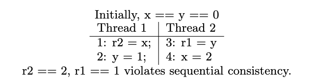
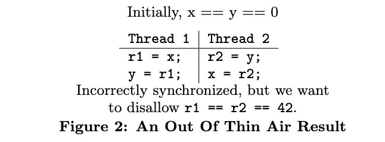
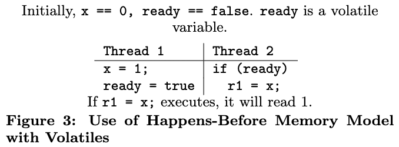
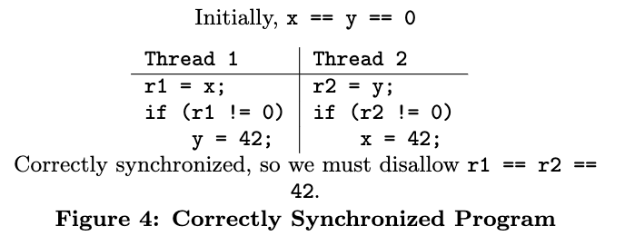
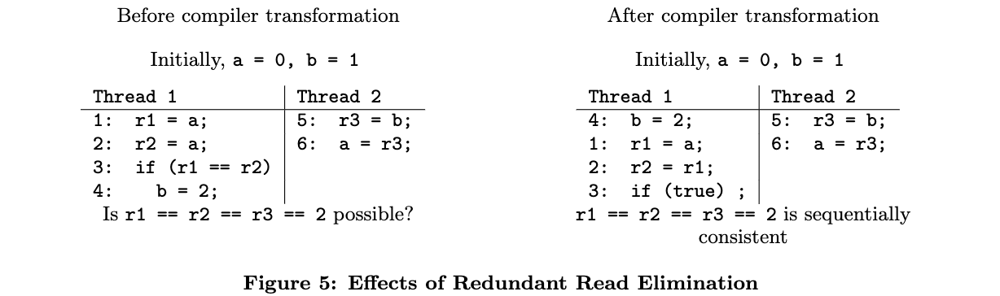
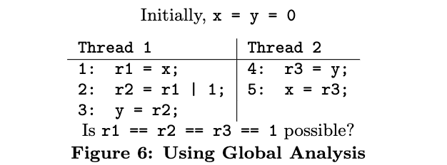

# The Java Memory Model
> Jeremy Manson and William Pugh Sarita V. Adve

[TOC]

## Abstract
This paper describes the new Java memory model, which has been revised as part of Java 5.0. The model specifies the legal behaviors for a multithreaded program; it defines the semantics of multithreaded Java programs and partially determines legal implementations of Java virtual machines and compilers.

本文介绍了新的 Java 内存模型，作为 Java 5.0 的一部分，该模型已被修订。该模型规定了多线程程序的合法行为；它定义了多线程 Java 程序的语义，并部分确定了 Java 虚拟机和编译器的合法实现。

The new Java model provides a simple interface for correctly synchronized programs – it guarantees sequential consistency to data-race-free programs. Its novel contribution is requiring that the behavior of incorrectly synchronized programs be bounded by a well defined notion of causality. The causality requirement is strong enough to respect the safety and security properties of Java and weak enough to allow standard compiler and hardware optimizations. To our knowledge, other models are either too weak because they do not provide for sufficient safety/security, or are too strong because they rely on a strong notion of data and control dependences that precludes some standard compiler transformations.

新的 Java 模型为正确同步的程序提供了一个简单的接口--它保证了无数据链程序的顺序一致性。它的新贡献是要求不正确的同步程序的行为被一个定义良好的因果关系概念所约束。因果关系的要求足够强，以尊重 Java 的安全和保障属性，同时也足够弱，允许标准的编译器和硬件优化。据我们所知，其他模型要么太弱，因为它们没有提供足够的安全/保障，要么太强，因为它们依赖于一个强大的数据和控制依赖性的概念，从而排除了一些标准的编译器转换。

Although the majority of what is currently done in compilers is legal, the new model introduces significant differences, and clearly defines the boundaries of legal transformations. For example, the commonly accepted definition for control dependence is incorrect for Java, and transformations based on it may be invalid.

尽管目前在编译器中所做的大部分工作都是合法的，但新的模型引入了显著的差异，并明确定义了合法转换的边界。例如，普遍接受的控制依赖的定义对 Java 来说是不正确的，基于它的转换可能是无效的。

In addition to providing the official memory model for Java, we believe the model described here could prove to be a useful basis for other programming languages that currently lack well-defined models, such as C++ and C#.

除了为 Java 提供官方的内存模型外，我们相信这里描述的模型可以被证明是其他编程语言的一个有用的基础，这些语言目前缺乏定义明确的模型，如 C++ 和 C#。

## 1 Introduction
The memory model for a multithreaded system specifies how memory actions (e.g., reads and writes) in a program will appear to execute to the programmer, and specifically, which value each read of a memory location may return. Every hardware and software interface of a system that admits multithreaded access to shared memory requires a memory model. The model determines the transformations that the system (compiler, virtual machine, or hardware) can apply to a program written at that interface. For example, given a program in machine language, the memory model for the machine language / hardware interface will determine theoptimizations the hardware can perform.

多线程系统的内存模型规定了程序中的内存操作（例如，读和写）在程序员看来是如何执行的，特别是每次读取一个内存位置可能会返回哪个值。每一个允许多线程访问共享内存的系统的硬件和软件接口都需要一个内存模型。该模型决定了系统（编译器、虚拟机或硬件）可以应用于在该接口编写的程序的转换。例如，给定一个机器语言的程序，机器语言/硬件接口的内存模型将决定硬件可以执行的优化。

For a high-level programming language such as Java, the memory model determines the transformations the compiler may apply to a program when producing bytecode, the transformations that a virtual machine may apply to bytecode when producing native code, and the optimizations that hardware may perform on the native code.

对于像 Java 这样的高级编程语言，内存模型决定了编译器在产生字节码时可应用于程序的转换，虚拟机在产生本地代码时可应用于字节码的转换，以及硬件可对本地代码进行的优化。

The model also impacts the programmer; the transformations it allows (or disallows) determine the possible outcomes of a program, which in turn determines which design patterns for communicating between threads are legal. Without a well-specified memory model for a programming language, it is impossible to know what the legal results are for a program in that language. For example, a memory model is required to determine what, if any, variants of double checked locking [37] are valid within a particular language.

该模型也影响着程序员；它所允许（或不允许）的转换决定了程序的可能结果，这反过来又决定了线程间通信的设计模式是合法的。如果没有一个明确的编程语言的内存模型，就不可能知道该语言的程序的合法结果是什么。例如，需要一个内存模型来确定哪些（如果有的话）双检查锁的变体在特定语言中是有效的。

### 1.1 Background
Over the last two decades, there has been a tremendous amount of work in the area of memory models at the hardware interface [2, 3, 4, 12, 14, 17, 31, 40, 43], but little at the programming language level. Programming languages present two challenges that do not occur in the hardware world. First, many programming languages, such as Java, have strong safety and security properties that must be respected. Second, the ability of a compiler to perform global and subtle analysis in order to transform a program is essentially unlimited, while hardware systems tend to use a more circumscribed scope in performing optimizations.

在过去的二十年里，在硬件接口的内存模型领域有大量的工作[2, 3, 4, 12, 14, 17, 31, 40, 43]，但在编程语言层面却很少。编程语言提出了两个在硬件世界中没有出现的挑战。首先，许多编程语言，如Java，有很强的安全和保障属性，必须得到尊重。第二，编译器进行全局和细微分析以改造程序的能力基本上是无限的，而硬件系统在进行优化时往往使用一个更有限的范围。

Previous work [33, 34] has shown that the original semantics for multithreaded Java [18, §17] had serious problems. To address these issues, the Java memory model has recently undergone a major revision. The new model now provides greater flexibility for implementors, a clear notion of what it means to write a correct program, and clear semantics for both correct and incorrect programs. Despite this fundamental change, it is largely, although not entirely, consistent with previous good programming practice and existing JVM implementations and hardware.

以前的工作[33, 34]表明，多线程 Java 的原始语义[18, §17]有严重的问题。为了解决这些问题，Java 内存模型最近进行了一次重大修订。现在的新模型为实现者提供了更大的灵活性，为编写正确的程序提供了明确的概念，并为正确和不正确的程序提供了清晰的语义。尽管有了这一根本性的变化，但它在很大程度上（尽管不是完全）与以前的良好编程实践和现有的 JVM 实现和硬件相一致。

The memory model must strike a balance between ease-of-use for programmers and implementation flexibility for system designers. The model that is easiest to understand, sequential consistency [26], specifies that memory actions must appear to execute one at a time in a single total order; actions of a given thread must appear in this total order in the same order in which they appear in the program (called program order).

内存模型必须在程序员的易用性和系统设计师的实施灵活性之间取得平衡。最容易理解的模型是顺序一致性[26]，它规定内存动作必须以单一的总顺序一次执行；一个给定线程的动作必须以它们在程序中出现的相同顺序出现在这个总顺序中（称为程序顺序）。

Whether sequential consistency by itself is an appropriate model for high-level language programmers is a subject of debate: it makes it easier for the programmer to write subtle and complicated concurrent algorithms that do not use explicit synchronization. Unfortunately, such algorithms are often designed or implemented incorrectly, and some would argue that almost all programmers should be discouraged from writing subtle and complicated synchronization-free concurrent algorithms.

顺序一致性本身对于高级语言程序员来说是否是一个合适的模型，这是一个争论的话题：它使程序员更容易编写不使用显式同步的微妙而复杂的并发算法。不幸的是，这种算法的设计或实现往往是不正确的，有人会说，几乎所有的程序员都应该被阻止编写微妙而复杂的无同步并发算法。

Sequential consistency substantially restricts the use of many compiler and hardware transformations. In general, sequential consistency restricts the reordering of any pair of memory statements within a thread, even if there are no data or control dependences between the statements (see Figure 1). This can be a serious limitation since many important optimizations involve reordering program statements. Even optimizations as ubiquitous as common subex-pression elimination and redundant read elimination can be seen as reorderings: each evaluation of the common expression is conceptually “moved” to the point at which it is evaluated for the first time. In a sequentially consistent system, no compiler or processor reorderings should become visible to the programmer.

顺序一致性大大限制了许多编译器和硬件转换的使用。一般来说，顺序一致性限制了线程内任何一对内存语句的重新排序，即使这些语句之间没有数据或控制依赖（见图 1）。这可能是一个严重的限制，因为许多重要的优化涉及程序语句的重新排序。即使是像常见的子表达式消除和冗余读取消除这样无处不在的优化，也可以被看作是重新排序：常见表达式的每一次评估在概念上都被 "移动 "到它第一次被评估的地方。在一个顺序一致的系统中，任何编译器或处理器的重新排序都不应被程序员看到。

Recently, hardware designers have developed techniques that alleviate some of the limitations of sequential consistency by reordering accesses speculatively [16, 35]. The reordered accesses are committed only when they are known to not be visible to the programmer. Compiler techniques to determine when reorderings are safe have also been proposed [38, 42], but are not yet comprehensively evaluated or implemented in commercial compilers.

最近，硬件设计者开发了一些技术，通过推测性地重新排序访问来缓解顺序一致性的一些限制[16, 35]。重新排序的访问只有在程序员知道它们不可见的情况下才会提交。也有人提出了确定重新排序是否安全的编译器技术[38, 42]，但是还没有在商业编译器中得到全面的评估或实施。

A common method to overcome the limitations of sequential consistency is the use of relaxed memory models, which allow more optimizations [12, 17, 19, 31, 40, 43]. Many of these models were originally motivated by hardware optimizations and are described in terms of low-level system attributes such as buffers and caches. Generally, these models have been hard to reason with and, as we show later, do not allow enough implementation flexibility either. 

克服顺序一致性限制的常见方法是使用宽松的内存模型，它允许更多的优化[12, 17, 19, 31, 40, 43]。许多这样的模型最初是由硬件优化引起的，并以低级别的系统属性来描述，如缓冲区和缓存。一般来说，这些模型很难推理，而且，正如我们后面所显示的，也不允许有足够的实现灵活性。

To achieve both programming simplicity and implementation flexibility, alternative models, referred to as data-race-free models [2, 4, 6] or properly-labeled models [14, 15], have been proposed. This approach exploits the observation that good programming practice dictates that programs be correctly synchronized (data-race-free); a data race is often a With sequential consistency, the result r2 == 2, r1 == 1 is impossible. Such a result would imply that statement 4 came before 1 (because r2 == 2), 1 came before 2 (due to program order), 2 came before 3 (because r1 == 1), 3 came before 4 (due to program order), and so 4 came before 4. Such a cycle is prohibited by sequential consistency. However, if the hardware or the compiler reorder the instructions in each thread, then statement 3 may not come before 4, and/or 1 may not come before 2, making the above result possible. Thus, sequential consistency restricts reordering instructions in a thread, even if they are not data or control dependent.

为了实现编程的简单性和实施的灵活性，人们提出了其他的模型，被称为无数据竞争模型或适当标记的模型。这种方法利用了这样的观察，即良好的编程实践决定了程序要正确地同步（无数据竞争）；数据竞争通常是一种顺序一致性，结果 r2 == 2, r1 == 1 是不可能的。这样的结果意味着语句 4 在 1 之前（因为 r2 == 2），1 在 2 之前（由于程序的顺序），2 在 3 之前（因为 r1 == 1），3 在 4 之前（由于程序的顺序），所以 4 在 4 之前。这样的循环是被顺序一致性所禁止的。然而，如果硬件或编译器对每个线程的指令进行重新排序，那么语句 3 可能不会在 4 之前出现，和/或 1 可能不会在 2 之前出现，使上述结果成为可能。因此，顺序一致性限制了线程中指令的重新排序，即使它们不依赖于数据或控制。

**Figure 1: A Violation of Sequential Consistency.**

symptom of a bug. The data-race-free models formalize correct programs as those that are data-race-free, and guarantee the simple semantics of sequential consistency for such programs. For full implementation flexibility, these models do not provide any guarantees for programs that contain data races. This approach allows standard hardware and compiler optimizations, while providing a simple model for programs written according to widely accepted practice.

错误的症状。无数据竞争模型将正确的程序形式化为那些无数据竞争的程序，并保证这类程序的简单语义的顺序一致性。为了充分实现灵活性，这些模型不为包含数据竞争的程序提供任何保证。这种方法允许标准的硬件和编译器优化，同时为按照广泛接受的做法编写的程序提供一个简单的模型。

### 1.2 The Java Memory Model
The new Java model adopts the data-race-free approach for correct programs – correct programs are those that are data-race-free; such programs are guaranteed sequential consistency. Unfortunately, if a model leaves the semantics for incorrect programs unspecified, it allows violations of safety and security properties that are necessary for Java programs.

新的 Java 模型对正确的程序采用了无数据竞争的方法--正确的程序是那些无数据竞争的程序；这样的程序被保证了顺序一致性。不幸的是，如果一个模型没有指定不正确程序的语义，它就会允许违反 Java 程序所需的安全和保障属性。

A key contribution of the revision effort has been to show that the safety and security properties of Java require prohibiting a class of executions that contain data races and have not been previously characterized. The challenge is to characterize and prohibit this class of executions without prohibiting standard compiler and hardware transformations or unduly complicating the model. In earlier relaxed models, such executions were either allowed, or were only prohibited by enforcing traditional control and data dependences. We show that the latter approach restricts standard compiler optimizations and is not viable for Java.

修订工作的一个重要贡献是表明，Java 的安全和保障属性需要禁止一类包含数据竞争的执行，而这些执行以前没有被描述过。我们面临的挑战是，在不禁止标准编译器和硬件转换或不适当地使模型复杂化的情况下，描述和禁止这类执行。在早期的宽松模型中，这类执行要么被允许，要么只能通过强制执行传统的控制和数据依赖来禁止。我们表明，后一种方法限制了标准的编译器优化，对 Java 来说是不可行的。

The revised Java model is based on a new technique that prohibits the necessary executions while allowing standard optimizations. Our technique builds legal executions iteratively. In each iteration, it commits a set of memory actions;actions can be committed if they occur in some well-behaved execution that also contains the actions committed in previous iterations. A careful definition of “well-behaved executions” ensures that the appropriate executions are prohibited and standard compiler transformations are allowed. To our knowledge, this is the only model with this property.

修订后的 Java 模型是基于一种新的技术，**它禁止必要的执行，同时允许标准的优化**。我们的技术迭代地建立合法的执行。在每次迭代中，它都会提交一组内存操作；如果这些操作出现在一些良好的执行中，并且也包含在之前的迭代中提交的操作，就可以提交。对 "良好的执行 "的仔细定义确保了适当的执行被禁止，而标准的编译器转换被允许。据我们所知，这是唯一具有这种属性的模型。

This paper focuses on the semantics for ordinary reads and writes, locks, and volatile variables in the Java memory model. It also covers the memory semantics for interaction with the outside world, and infinite executions. For space reasons, we omit discussion of two important issues in the Java memory model: the treatment of final fields, and finalization / garbage collection. We discuss the rest of the model in detail; the full specification is available elsewhere [20].

本文重点介绍了 Java 内存模型中普通读写、锁和 volatile 变量的语义。它还包括与外界互动的内存语义，以及无限执行。由于篇幅原因，我们省略了对 Java 内存模型中两个重要问题的讨论：final 字段的处理，以及最终化/垃圾回收。我们将详细讨论该模型的其余部分；完整的规范可在其他地方找到[20]。

The revision process for the Java model involved continual feedback and participation from the broader Java community; we refer the reader to the Java memory model mailing list archives for more information on the evolution of the model [21].

Java 模型的修订过程涉及到更广泛的 Java 社区的持续反馈和参与；我们请读者参阅 Java 内存模型邮件列表档案，以了解更多关于该模型演变的信息。

While this model was developed for Java, many of the issues that are addressed apply to every multithreaded language. It is our hope that the work presented here can be leveraged to provide the right balance of safety and efficiency for future programming languages.

虽然这个模型是为 Java 开发的，但其中所涉及的许多问题都适用于每一种多线程语言。我们希望这里介绍的工作能够被利用起来，为未来的编程语言提供安全和效率的正确平衡。

## 2 Requirements For the Java Memory Model
Our major design goal was to provide a balance between (1) sufficient ease of use and (2) transformations and optimizations used in current (and ideally future) compilers and hardware.

我们的主要设计目标是在
（1）足够的易用性
（2）当前（最好是未来）编译器和硬件中使用的转换和优化之间提供一个平衡。

Given that current hardware and compilers employ transformations that violate sequential consistency, it is currently not possible to provide a sequentially consistent programming model for Java. The memory model for Java is therefore a relaxed model.

鉴于目前的硬件和编译器采用了违反顺序一致性的转换，目前不可能为 Java 提供一个顺序一致的编程模型。因此，Java 的内存模型是一个宽松的模型。

A detailed description of the requirements for the Java model and their evolution can be found elsewhere [30]. Here we provide a brief overview.

对 Java 模型的要求及其演变的详细描述可以在其他地方找到[30]。这里我们提供一个简单的概述。

### 2.1 Correctly Synchronized Programs
It is difficult for programmers to reason about specific hardware and compiler transformations. For ease of use, we therefore specify the model so that programmers do not have to reason about hardware or compiler transformations or even our formal semantics for correctly synchronized code. We follow the data-race-free approach to define a correctly synchronized program (data-race-free) and correct semantics for such programs (sequential consistency). The following definitions formalize these notions.

程序员很难推理出具体的硬件和编译器的转换。因此，为了便于使用，我们指定了模型，使程序员不必推理硬件或编译器的转换，甚至不必推理我们对正确同步代码的形式语义。我们遵循无数据竞争的方法来定义一个正确的同步程序（无数据链）和这种程序的正确语义（顺序一致性）。下面的定义将这些概念正式化。

+ Conflicting Accesses: A read of or write to a variable is an access to that variable. Two accesses to the same shared field or array element are said to be conflicting if at least one of the accesses is a write.
+ Synchronization Actions: Synchronization actions include locks, unlocks, reads of volatile variables, and writes to volatile variables.
+ Synchronization Order: Each execution of a program is associated with a synchronization order, which is a total order over all synchronization actions. To define data-race-free programs correctly, we are allowed to consider only those synchronization orders that are also consistent with program order and where a read to a volatile variable v returns the value of the write to v that is ordered last before the read by the synchronization order. These latter requirements on the synchronization order are explicitly imposed as a synchronization order consistency requirement in the rest of the paper.
+ Synchronizes-With Order: For two actions x and y, we use x sw→ y to mean that x synchronizes-with y. An unlock action on monitor m synchronizes-with all subsequent lock actions on m that were performed by any thread, where subsequent is defined according to the synchronization order. Similarly, a write to a volatile variable v synchronizes-with all subsequent reads of v by any thread. There are additional synchronized-with edges in Java [20] that are not discussed here for brevity.
+ Happens-Before Order: For two actions x and y, we use x hb→ y to mean that x happens-before y. Happens-before is the transitive closure of program order and the synchronizes-with order.
+ Data Race: Two accesses x and y form a data race in an execution of a program if they are from different threads, they conflict, and they are not ordered by happens-before.
+ Correctly Synchronized or Data-Race-Free Program: A program is said to be correctly synchronized or data-race-free if and only if all sequentially consistent executions of the program are free of data races.

+ 冲突性访问。对一个变量的读或写是对该变量的一个访问。如果对同一共享字段或数组元素的两次访问中至少有一次是写，则被认为是冲突的。
+ 同步动作。同步动作包括 lock、unlock、对 volatile 变量的读和对 volatile 变量的写。
+ Synchronization Order。一个程序的每一次执行都与一个同步顺序相关联，它是所有同步动作的总顺序。为了正确定义无数据竞争程序，我们只允许考虑那些与程序顺序也一致的同步顺序，以及对 volatile 变量 v 的读会返回对 v 的写的值，而这个写的顺序在同步顺序中排在读之前。后面这些对同步顺序的要求在本文的其余部分中被明确地作为同步顺序一致性要求。
+ Synchronizes-With Order。对于两个动作 x 和 y，我们用 x sw→y 来表示 x 与 y Synchronizes-With。对监视器 m 的解锁动作与任何线程对 m 进行的所有后续锁动作同步，其中后续是根据 synchronizes order 定义的。同样地，对 volatile 变量 v 的写操作与随后任何线程对 v 的所有读操作都是同步的。在 Java 中，还有一些额外的 synchronized-with 边缘，为了简洁起见，这里不做讨论。
+ Happens-Before 顺序。对于两个动作 x 和 y，我们用 x hb→ y 来表示 x 发生在 y 之前， happens-before 在程序顺序和 Synchronizes-With 顺序的有传递性。
+ 数据竞争：如果两个访问 x 和 y 来自不同的线程，它们发生了冲突，并且它们没有按照 happens-before 排序，那么在程序的执行过程中就形成了数据竞争。
+ 正确的同步化或无数据竞争程序。当且仅当程序的所有顺序一致的执行都不存在数据竞赛时，该程序才被称为正确同步或无数据竞赛。

The first requirement for the Java model is to ensure sequential consistency for correctly synchronized or data-race-free programs as defined above. Programmers then need only worry about code transformations having an impact on their programs’ results if those programs contain data races.

对 Java 模型的第一个要求是确保上述正确同步或无数据竞争的程序的顺序一致性。然后，程序员只需要担心代码转换会对他们的程序的结果产生影响，如果这些程序包含数据竞争的话。

As an example, the code in Figure 1 is incorrectly synchronized. Any sequentially consistent execution of the code contains conflicting accesses to x and y and these conflicting accesses are not ordered by happens-before (since there is no synchronization in the program). A way to make this program correctly synchronized is to declare x and y as volatile variables; then the program is assured of sequentially consistent results with the Java model.

作为一个例子，图 1 中的代码是不正确的同步化。该代码的任何顺序一致的执行都包含对 x 和 y 的冲突访问，而且这些冲突访问并不是按照 happens-before 排序的（因为程序中没有同步）。使这个程序正确同步的方法是将 x 和 y 声明为 volatile 变量；然后程序就能保证与 Java 模型的顺序一致的结果。

### 2.2 Out-of-Thin-Air Guarantees for Incorrect Programs
The bulk of the effort for the revision, and our focus here, was on understanding the requirements for incorrectly synchronized code. The previous strategy of leaving the semantics for incorrect programs unspecified is inconsistent with Java’s security and safety guarantees. Such a strategy has been used in some prior languages. For example, Ada simply defines unsynchronized code as “erroneous” [1]. The reasoning behind this is that since such code is incorrect (on some level), no guarantees should be made when it occurs. This is similar to the strategy that some languages take with array bounds overflow – unpredictable results may occur, and it is the programmer’s responsibility to avoid these scenarios.

此次修订的主要工作，也是我们在这里的重点，是了解对不正确的同步代码的要求。以前对不正确程序的语义不作规定的策略，与 Java 的安全保障不一致。这样的策略在之前的一些语言中也有使用。例如，Ada 简单地将不同步的代码定义为 "错误的"。这背后的推理是，既然这样的代码是不正确的（在某种程度上），那么当它发生时就不应该有任何保证。这类似于一些语言对数组边界溢出采取的策略--可能会出现不可预测的结果，避免这些情况的发生是程序员的责任。

The above approach does not lend itself to the writing of secure and safe code. In an ideal world, every programmer would write correct code all of the time. In our world, programs frequently contain errors; not only does this cause code to misbehave, but it can also allows attackers to violate safety assumptions in a program (as is true with buffer overflows). Our earlier work has described the dangers of such scenarios in more detail [28].

上述方法并不适合编写安全可靠的代码。在一个理想的世界里，每个程序员都会一直编写正确的代码。在我们的世界里，程序经常包含错误；这不仅会导致代码行为失常，而且还会让攻击者违反程序中的安全假设（如缓冲区溢出的情况）。我们早期的工作已经更详细地描述了这种情况的危险性。

Program semantics must be completely defined: if programmers don’t know what their code is doing, they won’t be able to know what their code is doing wrong. The second broad requirement of the Java model is to provide a clear and definitive semantics for how code should behave when it is not correctly written, but without substantially affecting current compilers and hardware.

程序语义必须被完全定义：如果程序员不知道他们的代码在做什么，他们将无法知道他们的代码做错了什么。Java 模型的第二个广泛的要求是提供一个清晰明确的语义，即当代码写得不正确时，它应该如何表现，但不能对当前的编译器和硬件产生实质性影响。

Figure 2 contains a common example of an program for which careful semantics are required. It is incorrectly synchronized; all sequentially consistent executions of this program exhibit data races between Threads 1 and 2. However, we need to provide a strong guarantee for this code: we need to ensure that a value such as 42 will not appear out of thin air in r1 and r2.

图 2 包含了一个需要谨慎语义的程序的常见例子。它是不正确的同步；这个程序的所有顺序一致的执行都在线程 1 和 2 之间表现出数据竞赛。然而，我们需要为这段代码提供强有力的保证：我们需要确保像 42 这样的值不会凭空出现在 r1 和 r2 中。

There are no current optimizations that would permit such an out-of-thin-air result. However, in a future aggressive system, Thread 1 could speculatively write the value 42 to y, which would allow Thread 2 to read 42 for y and write it out to x, which would allow Thread 1 to read 42 for x, and justify its original speculative write of 42 for y. A self-justifying write speculation like that one can create serious security violations and needs to be disallowed. For example, this would be a serious problem if the value that was produced out of thin air was a reference to an object that the thread was not supposed to have (because of, for example, security guarantees).

目前没有任何优化措施可以允许这样的空头结果。然而，在未来的侵略性系统中，线程 1 可以投机性地将 42 的值写入 y，这将允许线程 2 读取 42 的 y 并将其写入 x，这将允许线程 1 读取 42 的 x，并证明其最初投机性地写入 42 的 y 是合理的。例如，如果凭空产生的值是对一个线程不应该拥有的对象的引用，这将是一个严重的问题（因为，例如，安全保证）。

Characterizing precisely what constitutes an out-of-thin-air violation is complicated. Not all speculations that appear to be self-justifying are security violations, and some can even arise out of current compiler transformations. How we characterize the appropriate set of violations is at the core of the new Java model, and discussed further in Section 4.2.

准确地表征什么是空穴来风的违规行为是很复杂的。并非所有看似自圆其说的推测都是安全违规，有些甚至可以从当前的编译器转换中产生。我们如何表征适当的违规行为集是新 Java 模型的核心，并在第 4.2 节进一步讨论。

## 3 Happens-before Memory Model
Before presenting the Java model in full, we present a simpler memory model, called the happens-before memory model.

在全面介绍 Java 模型之前，我们先介绍一个更简单的内存模型，称为 happens-before 内存模型。

Each legal execution under this model has several properties/requirements (Section 5 provides a more formal version of the requirements):

这个模型下的每一个法律执行都有几个属性/要求（第 5 节提供了一个更正式的要求版本）。

+ There is a synchronization order over synchronization actions, synchronization actions induce synchronizes-with edges between matched actions, and the transitive closure of the synchronizes-with edges and program order gives an order known as the happens-before order (as described in Section 2.1).
+ For each thread t, the actions t performs in the execution are the same as those that t would generate in program order in isolation, given the values seen by the reads of t in the execution.
+ A rule known as happens-before consistency (see below) determines the values a non-volatile read can see.
+ A rule known as synchronization order consistency (see below) determines the value a volatile read can see.

+ 在同步动作上有一个同步顺序，同步动作在匹配的动作之间引起同步与边，同步化与边和程序顺序的反式闭合给出了一个被称为发生前顺序的顺序（如 2.1 节所述）。
+ 对于每个线程 t 来说，t 在执行中所执行的动作与 t 在孤立的情况下在程序顺序中产生的动作是一样的，考虑到 t 在执行中的读数所看到的值。
+ 一个被称为 happens-before 一致性的规则（见下文）决定了一个非 volatile 读可以看到的值。
+ 一个被称为同步顺序一致性的规则（见下文）决定了一个 volatile 读可以看到的值。

Happens-before consistency says that a read r of a variable v is allowed to observe a write w to v if, in the happens-before partial order of the execution:
+ r does not happen-before w (i.e., it is not the case that r hb→ w) – a read cannot see a write that happens-after it, and
+ there is no intervening write w′to v, ordered by happens-before (i.e., no write w′to v such that w hb→ w′hb→ r) – the write w is not overwritten along a happens-before path.

Happens-before 一致性说的是，如果在执行的部分顺序中，一个变量 v 的读 r 被允许观察到对 v 的写 w。
+ r 不发生在 w 之前（即，r hb→ w的情况不存在）--读不能看到发生在它之后的写，并且
+ 没有中间的写 w′ 到 v，按 happen-before 排序（即没有写 w′ 到 v，使得 w hb→ w′ hb→ r）--写 w 没有沿着 happen-before 路径被覆盖。

Synchronization order consistency says that (i) synchronization order is consistent with program order and (ii) each read r of a volatile variable v sees the last write to v to come before it in the synchronization order.

同步顺序的一致性是指：(i)同步顺序与程序顺序一致；(ii)对 volatile 变量 v 的每一次读 r 在同步顺序中看到最后一次对 v 的写在它之前。

The happens-before memory model is a simple approximation to the semantics we want for the Java memory model. For example, the happens-before memory model allows the behavior shown in Figure 1. There are no synchronizes-with or happens-before edges between threads, and each read is allowed to return the value of the write by the other thread.

happens-before 内存模型是对我们想要的 Java 内存模型语义的一个简单近似。例如， happens-before 内存模型允许图 1 中所示的行为。线程之间没有 synchronizes-with 或happen-before 边，每次读取都允许返回其他线程的写入值。

Figure 3 provides an example of how to use the happens-before memory model to restrict the values a read can return. Notice that ready is a volatile boolean variable. There is therefore a happens-before edge from the write ready = true to any read that sees that write.

图 3 提供了一个例子，说明如何使用 happens-before 内存模型来限制读可以返回的值。请注意，ready是一个 volatile 布尔变量。因此，从写 ready = true 到任何看到该写的读，都有一条 happens-before 边。

Assume Thread 2’s read of ready sees the write to ready. Thread 1’s write of x must happen-before Thread 2’s read of x (because of program order), and Thread 2’s read must return the new value of x. In more detail: the initial value of x is assumed to happen-before all actions. There is a path of happens-before edges that leads from the initial write, through the write to x, to the read of x. On this path, the initial write is seen to be overwritten. Thus, if the read of ready in Thread 2 sees true, then the read of x must see the value 1.

假设线程 2 对 ready 的读取看到了对 ready 的写入。线程 1 对 x 的写必须发生在线程 2 对 x 的读之前（因为程序的顺序），线程 2 的读必须返回 x 的新值。 更详细地说：x 的初始值被假定为发生在所有动作之前。有一条 happen-before 边的路径，从最初的写，经过对 x 的写，到对 x 的读，在这条路径上，最初的写被看作是被覆盖的。因此，如果在线程 2 中对准备好的东西的读取为真，那么对 x 的读取必须看到值 1。

If ready were not volatile, one could imagine a compiler transformation that reordered the two writes in Thread 1, resulting in a read of true for ready, but a read of 0 for x.

如果 ready 不是 volatile 的，我们可以想象一个编译器的转换，将线程 1 中的两个写操作重新排序，导致 ready 的读数为 true，但 x 的读数为 0。

## 4 Causality
Although it is simple, the happens-before memory model (as discussed in Section 3) allows unacceptable behaviors. Notice that the behavior we want to disallow in Figure 2 is consistent with the happens-before memory model. If both write actions write out the value 42, and both reads see those writes, then both reads see values that they are allowed to see.

虽然它很简单，但发生在之前的内存模型（如第 3 节所讨论的）允许不可接受的行为。请注意，图 2 中我们想要禁止的行为与发生在之前的内存模型是一致的。如果两个写操作都写出了 42 这个值，并且两个读都看到了这些写，那么两个读都看到了他们被允许看到的值。

The happens-before memory model also does not fulfill our requirement that correctly synchronized programs have sequentially consistent semantics (first observed in [6, 7]).

发生在之前的内存模型也不能满足我们的要求，即正确的同步程序具有顺序一致的语义（首次在[6，7]中观察到）。

For example, the code shown in Figure 4 [2] is correctly synchronized. This may seem surprising, since it doesn’t perform any synchronization actions. Remember, however, that a program is correctly synchronized if, when it is executed in a sequentially consistent manner, there are no data races. If this code is executed in a sequentially consistent way, each action will occur in program order, and neither of the writes will occur. Since no writes occur, there can be no data races: the program is correctly synchronized.

例如，图 4 中所示的代码是正确的同步化。这似乎令人惊讶，因为它并没有执行任何同步动作。然而，请记住，如果一个程序以顺序一致的方式执行时，不存在数据竞争，那么它就是正确的同步。如果这段代码以顺序一致的方式执行，每个动作都会按程序顺序发生，而且都不会发生写操作。由于没有写操作发生，所以不可能有数据竞争：程序是正确同步的。

For the above program, the only sequentially consistent result is r1 == r2 == 0; this is therefore the only result that we want to allow under the Java model. However, as the result in Figure 2, the result of r1 == r2 == 42 for Figure 4 is consistent with the happens-before memory model. If both writes occur, and both reads see them, then the if guards are both true, and both reads see writes that they are allowed to see. As mentioned, this violates the guarantee that we wish to make of sequential consistency for correctly synchronized programs.

对于上述程序，唯一顺序一致的结果是 r1 == r2 == 0；因此这也是我们在 Java 模型下想要允许的唯一结果。然而，正如图 2 中的结果，图 4 的 r1 == r2 == 42 的结果与 happens-before 的内存模型一致。如果两个写都发生了，而且两个读都看到了，那么 if 守护都是真的，而且两个读都看到了他们被允许看到的写。如前所述，这违反了我们希望对正确同步程序的顺序一致性的保证。

Regardless of these weaknesses, the happens-before memory model provides a good outer bound for our model; all of our executions must be consistent with it.

不管这些弱点如何，happens-before 内存模型为我们的模型提供了一个很好的外部约束；我们所有的执行都必须与它保持一致。

### 4.1 Data and Control Dependencies
The missing link between our desired semantics and the happens-before memory model is one of causality. In Figures 2 and 4, actions which caused the illegal writes to occur were, themselves, caused by the writes. This kind of circular causality seems undesirable in general, and these examples are prohibited in the Java memory model.

我们所期望的语义和 happens-before 内存模型之间缺少的环节是因果关系。在图 2 和图 4 中，导致非法写入的行为本身就是由写入引起的。这种循环的因果关系一般来说是不可取的，这些例子在 Java 内存模型中是被禁止的。

In both of those examples, a write that is data or control dependent on a read appears to occur before that read, and then causes the read to return a value that justifies that write. In Figure 2, the value written by the write is used to justify the value that it does write. In Figure 4, the occurrence of the write is used to justify the fact that the write will execute.

在这两个例子中，一个依赖于读的数据或控制的写似乎发生在该读之前，然后导致读返回一个证明该写的值。在图 2 中，写的值被用来证明它所写的值是正确的。在图 4 中，写的发生被用来证明写将执行的事实。

Unfortunately, the notion of “cause” is a tricky one, and cannot employ the notion of data and control dependencies.

不幸的是，"原因 "的概念是一个棘手的问题，不能采用数据和控制依赖性的概念。

For example, the Java memory model allows the behavior shown in Figure 5, even though that example also seems to involve a case of circular causality. This behavior must be allowed, because a compiler can 
+ eliminate the redundant read of a, replacing r2 = a with r2 = r1, then
+ determine that the expression r1 == r2 is always true, eliminating the conditional branch 3, and finally
+ move the write 4: b = 2 early.

例如，Java 内存模型允许图 5 所示的行为，尽管这个例子似乎也涉及循环因果关系的情况。这种行为必须被允许，因为编译器可以 
+ 消除对 a 的冗余读取，用 r2 = r1 替换 r2 = a，然后
+ 确定表达式 r1 == r2 总是真的，消除条件分支 3，最后
+ 提前移动写 4：b = 2。

After the compiler does the redundant read elimination, the assignment 4: b = 2 is guaranteed to happen; the second read of a will always return the same value as the first. Without this information, the assignment seems to cause itself to happen. With this information, there is no dependency between the reads and the write. For this transformed program (illustrated in Figure 5(b)), the outcome r1 == r2 == r3 == 2 is sequentially consistent and could be produced on many commercial systems. Thus, dependence-breaking optimizations can also result in executions containing apparent “causal cycles”.

在编译器消除了多余的读数之后，赋值 4：b = 2 保证会发生；a 的第二次读数将总是返回与第一次相同的值。如果没有这些信息，这个赋值似乎会导致自己发生。有了这些信息，读和写之间就没有依赖性了。对于这个转换后的程序（如图5(b)所示），结果r1 == r2 == r3 == 2在顺序上是一致的，可以在许多商业系统上产生。因此，打破依赖性的优化也可以导致包含明显 "因果循环 "的执行。

Figure 6 shows another example in which the compiler should be allowed to perform a global analysis that eliminates a data dependence. For the behavior in Figure 6 to occur, it would seem that the write to y must occur before the read of x, which would seem to violate the data dependence of the write to y on the read of x. However, a compiler could use an interthread analysis to determine that the only possible values for x and y are 0 or 1. Knowing this, the compiler can determine that r2 is always 1. This breaks the data dependence, allowing a write of the constant value 1 to y before the read of x by thread 1. The Java model allows both this analysis and the behavior in Figure 6.

图 6 显示了另一个例子，在这个例子中，应该允许编译器进行全局分析，消除数据依赖性。为了使图 6 中的行为发生，似乎对 y 的写必须发生在对 x 的读之前，这似乎违反了对 y 的写对 x 的读的数据依赖性。然而，编译器可以使用线程间分析来确定 x 和 y 的唯一可能值是 0 或 1。知道了这一点，编译器可以确定 r2 总是 1。这就打破了数据的依赖性，允许在线程 1 读取 x 之前，将常量值 1 写入 y。Java 模型同时允许这种分析和图 6 中的行为。

### 4.2 Causality and the Java Memory Model
The key question now becomes how to formalize the notion of causality so we restrict causal violations of the type in Figures 2 and 4, but allow outcomes of the type in Figure 5.

现在的关键问题是如何将因果关系的概念形式化，以便我们限制图 2 和图 4 中类型的因果违反，但允许图 5 中类型的结果。

We address these issues by considering when actions can occur in an execution. Both Figures 4 and 5 involve moving actions (specifically, writes) earlier than they otherwise would have occurred under pure sequential consistency.

我们通过考虑行动在执行中何时发生来解决这些问题。图 4 和图 5 都涉及到将行动（特别是写）提前，否则在纯粹的顺序一致性下会发生。

One difference between the acceptable and unacceptable results is that in Figure 5, the write that we perform early 4: b = 2 would also have occurred if we had carried on the execution in a sequentially consistent way, accessing the same location and writing the same value. In Figure 4, the early write could never write the same value (42) in any sequentially consistent execution. These observations provide an intuition as to when an action should be allowed to occur in a legal Java execution.

可接受和不可接受的结果之间的一个区别是，在图 5 中，如果我们以顺序一致的方式继续执行，访问相同的位置并写入相同的值，那么我们早期执行的写 4：b = 2 也会发生。在图 4 中，早期的写入在任何顺序一致的执行中都不可能写入相同的值（42）。这些观察提供了一种直觉，即在合法的 Java 执行中，何时应该允许一个动作发生。

To justify performing the writes early in Figures 5 and 6, we find a well-behaved execution in which those writes took place, and use that execution to perform the justification. Our model therefore builds an execution iteratively; it allows an action (or a group of actions) to be committed if it occurs in some well-behaved execution that also contains the actions committed so far.

为了证明图 5 和图 6 中早期的写操作是合理的，我们找到一个良好的执行，在这个执行中发生了这些写操作，并使用这个执行来进行论证。因此，**我们的模型以迭代的方式建立了一个执行；它允许一个动作（或一组动作）被提交，如果它发生在某个良好的执行中，而这个执行也包含了到目前为止所提交的动作。**

Identifying what constitutes a “well-behaved” execution is the key to our notion of causality. We distinguished the early writes in Figures 2 and 4 from the early writes in Figures 5 and 6 by considering whether those writes could occur in a sequentially consistent execution. While it may appear intuitive to use the notion of a sequentially consistent execution to justify the occurrence of early writes, this notion turns out to be too relaxed in some subtle cases.

确定什么是 "良好的 "执行是我们因果关系概念的关键。我们将图 2 和图 4 中的早期写入与图 5 和图 6 中的早期写入区分开来，考虑这些写入是否会发生在一个顺序一致的执行中。虽然使用顺序一致的执行概念来证明早期写入的发生似乎很直观，但在一些微妙的情况下，这个概念被证明是过于宽松的。

After trying several possibilities for formalizing the “well-behaved” executions that could justify early writes, we converged on the following. We observed that early execution of an action does not result in an undesirable causal cycle if its occurrence is not dependent on a read returning a value from a data race. This insight led to our notion of a “well-behaved execution”: a read that is not yet committed must return the value of a write that is ordered before it by happens-before.

在尝试了几种可能性来正式确定可以证明提前写入的 "行为良好 "的执行方式后，我们趋向于以下观点。我们观察到，如果一个动作的早期执行不依赖于从数据竞争中返回数值的读取，则不会导致不良的因果循环。这个洞察力导致了我们的 "良好的执行 "的概念：**一个尚未提交的读必须返回一个写的值，而这个写是通过happen-before 排序在它之前。**

We can use a “well-behaved” execution to “justify” further executions where writes occur early. Given a well-behaved execution, we may commit any of the uncommitted writes that occur in it (with the same address and value). We also may commit any uncommitted reads that occur in such an execution, but additionally require that the read return the value of a previously committed write in both the justifying execution and the execution being justified (we allow these writes to be different). 

我们可以用一个 "表现良好"的执行来 "证明 "那些提前发生写操作的进一步执行。**考虑到一个表现良好的执行，我们可以提交其中发生的任何未提交的写（具有相同的地址和值）。我们也可以提交在这种执行中发生的任何未提交的读，但另外要求读返回在证明执行和被证明执行中先前提交的写的值（我们允许这些写是不同的）**。

To keep consistency among the successive justifying executions, we also require that across all justifying executions, the happens-before and synchronization order relations among committed accesses remains the same, and the values returned by committed reads remain the same.

为了保持连续的论证执行之间的一致性，我们还要求在所有的论证执行中，承诺的访问之间的 happens-before 和同步顺序关系保持不变，承诺的读取所返回的值也保持不变。

Our choice of justifying executions ensures that the occurrence of a committed action and its value does not depend on an uncommitted data race. We build up a notion of causality, where actions that are committed earlier may cause actions that are committed later to occur. This approach ensures that later commits of accesses involved in data races will not result in an undesirable cycle.

我们选择的证明执行的方法确保了已承诺的行动及其价值的发生不依赖于未承诺的数据竞赛。我们建立了一个因果关系的概念，即先前提交的行动可能会导致后来提交的行动发生。这种方法确保后来提交的涉及数据竞争的访问不会导致不良的循环。

Consider again the executions with undesirable causal behaviors in Figure 2 and 4. To get the undesirable behavior, the actions in those executions must all read and write the value 42. This implies that some action must read or write the value 42 in an execution where reads only return values of writes that happen-before them. However, there is no such execution, so we are unable to commit any of the actions in those executions. 

再考虑一下图 2 和图 4 中具有不理想因果行为的执行。为了得到不理想的行为，这些执行中的行动必须全部读和写 42 这个值。这意味着在一个执行中，某些动作必须读或写 42 号值，而在这个执行中，读只返回发生在它们之前的写的值。然而，并不存在这样的执行，所以我们无法提交这些执行中的任何行动。

On the other hand, given the code in Figure 5, there is an execution where all reads return values from writes that happen-before them and where the write 4: b = 2 occurs. This is any execution where both r1 and r2 read the value 0 for a. Thus, we can commit 4: b = 2. This allows us to commit a read of b by Thread 2 that returns the value 2. We use the same justifying execution for this – the read returns the value 1 in the justifying execution (since this does not involve a race), but can return the value 2 in the execution being justified (since the write of b to 2 is already committed). Using a similar procedure, we can commit the rest of the accesses. Thus, the model allows the execution in Figure 5, but not those in Figure 4 and 2.

另一方面，考虑到图 5 中的代码，有一个执行，所有的读都从发生在它们之前的写返回值，并且在那里发生了写 4：b = 2。这就是任何执行，其中 r1 和 r2 都读取了 a 的值 0。因此，我们可以提交 4：b = 2。这允许我们提交线程 2 对 b 的读取，返回值为 2。我们使用相同的验证执行--在验证执行中，读返回值 1（因为这不涉及竞争），但在被验证的执行中可以返回值 2（因为 b 的写入 2 已经被提交）。使用一个类似的程序，我们可以提交其余的访问。因此，该模型允许图 5 中的执行，但不允许图 4 和 2 中的执行。

The next section presents the model, as we have discussed it, using a formal notation. The causality constraints are presented in Section 5.4.

下一节介绍了我们所讨论的模型，并使用了正式的符号。因果关系的约束在第5.4节提出。

## 5-10
(中间部分和其他文档重复，暂缓)

## 11 Conclusion
In this paper, we have outlined the necessary properties for a programming language memory model, and outlined how those properties can be achieved. The resulting model balances two crucial needs: it allows implementors flexibility in their ability to perform code transformations and optimizations, and it also provides a clear and simple programming model for those writing concurrent code.

在本文中，我们概述了编程语言内存模型的必要属性，并概述了如何实现这些属性。由此产生的模型平衡了两个关键需求：它允许实现者灵活地进行代码转换和优化，同时也为编写并发代码的人提供了一个清晰而简单的编程模型。

The model meets the needs of programmers in several key ways:
+ For data-race-free programs, it allows programmers to reason about their programs using the simple semantics of sequential consistency, oblivious to any compiler and hardware transformations.
+ It provides a clear definition for the behavior of programs in the presence of data races, including the most comprehensive treatment to date of the dangers of causality and how they can be avoided.

该模型在几个关键方面满足了程序员的需求。
+ 对于无数据竞争的程序，它允许程序员使用顺序一致性的简单语义来推理他们的程序，而对任何编译器和硬件的转换视而不见。
+ 它为存在数据竞争的程序的行为提供了明确的定义，包括迄今为止对因果关系的危险以及如何避免这些危险的最全面处理。

This paper clarifies and formalizes these needs, balancing them carefully with a wide variety of optimizations and program transformations commonly performed by compilers and processor architectures. It also provides proof techniques to ensure that the model reflects this balancing act accurately and carefully. It is this balance that has given us the necessary confidence to use this model as the foundation for concurrency in the Java programming language.

本文对这些需求进行了澄清和形式化，将其与编译器和处理器架构通常进行的各种优化和程序转换进行了仔细的平衡。它还提供了证明技术，以确保该模型准确而谨慎地反映这种平衡行为。正是这种平衡给了我们必要的信心，将这个模型作为 Java 编程语言中并发的基础。
