# ASM 4.0 -- A Java bytecode engineering library

[TOC]

# 1. Introduction

## 1.1 Motivations
Program analysis, generation and transformation are useful techniques that can be used in many situations:

程序分析、生成和转换是有用的技术，可以在许多情况下使用。

+ Program analysis, which can range from a simple syntaxic parsing to a full semantic analysis, can be used to find potential bugs in applications, to detect unused code, to reverse engineer code, etc. (程序分析，范围从简单的语法解析到全面的语义分析，可用于发现应用程序中的潜在错误，检测未使用的代码，进行代码逆向工程，等等。)
+ Program generation is used in compilers. This include traditional compilers, but also stub or skeleton compilers used for distributed programming, Just in Time compilers, etc. (程序生成被用于编译器中。这包括传统的编译器，但也包括用于分布式编程的存根或骨架编译器，及时编译器，等等。)
+ Program transformation can be used to optimize or obfuscate programs, to insert debugging or performance monitoring code into applications, for aspect oriented programming, etc. (程序转换可用于优化或混淆程序，在应用程序中插入调试或性能监测代码，用于面向方面的编程，等等。)

All these techniques can be used for any programming language, but this is more or less easy to do, depending on the language. In the case of Java they can be used on Java source code or on compiled Java classes. One of the advantages of working on compiled classes is that, obviously, the source code is not needed. Program transformations can therefore be used on any applications, including closed source and commercial ones. Another advantage of working on compiled code is that it becomes possible to analyze, generate or transform classes at runtime, just before they are loaded into the Java Virtual Machine (generating and compiling source code at runtime is possible, but this is really slow and requires a full Java compiler). The advantage is that tools such as stub compilers or aspect weavers become transparent to users.

所有这些技术都可以用于任何编程语言，但这或多或少都很容易做到，这取决于语言的不同。就 Java 而言，它们可以用在 Java 源代码或编译的 Java 类上。在编译的类上工作的一个优点是，显然不需要源代码。因此，程序转换可以用于任何应用程序，包括封闭源代码和商业应用程序。在编译后的代码上工作的另一个好处是，在运行时分析、生成或转换类成为可能，就在它们被加载到 Java 虚拟机之前（在运行时生成和编译源代码是可能的，但这真的很慢，而且需要一个完整的 Java 编译器）。这样做的好处是，像存根编译器或方面编织器这样的工具对用户来说是透明的。

Due to the many possible usages of program analysis, generation and transfor- mation techniques, many tools to analyze, generate and transform programs have been implemented, for many languages, Java included. ASM is one of these tools for the Java language, designed for runtime – but also offline – class generation and transformation. The ASM1 library was therefore designed to work on compiled Java classes. It was also designed to be as fast and as small as possible. Being as fast as possible is important in order not to slow down too much the applications that use ASM at runtime, for dynamic class generation or transformation. And being as small as possible is important in order to be used in memory constrained environments, and to avoid bloating the size of small applications or libraries using ASM.

由于程序分析、生成和转换技术有许多可能的用途，许多分析、生成和转换程序的工具已经被实现，包括 Java 在内的许多语言。ASM 是 Java 语言的这些工具之一，设计用于运行时--但也是离线--类的生成和转换。因此，ASM1 库被设计为在已编译的 Java 类上工作。它还被设计成尽可能快、尽可能小。尽可能快是很重要的，因为它不会使在运行时使用 ASM 进行动态类生成或转换的应用程序变得太慢。尽可能的小是很重要的，因为它可以在内存受限的环境中使用，并避免使用 ASM 的小型应用程序或库的体积膨胀。

ASM is not the only tool for generating and transforming compiled Java classes, but it is one of the most recent and efficient. It can be downloaded from http://asm.objectweb.org. Its main advantages are the following:

ASM 并不是生成和转换已编译的 Java 类的唯一工具，但它是最新和最有效的工具之一。它可以从 http://asm.objectweb.org 下载。它的主要优点有以下几点。

+ It has a simple, well designed and modular API that is easy to use.
+ It is well documented and has an associated Eclipse plugin.
+ It provides support for the latest Java version, Java 7.
+ It is small, fast, and very robust.
+ Its large user community can provide support for new users.
+ Its open source license allows you to use it in almost any way you want.

## 1.2 Overview

### 1.2.1 Scope
The goal of the ASM library is to generate, transform and analyze compiled Java classes, represented as byte arrays (as they are stored on disk and loaded in the Java Virtual Machine). For this purpose ASM provides tools to read, write and transform such byte arrays by using higher level concepts than bytes, such as numeric constants, strings, Java identifiers, Java types, Java class structure elements, etc. Note that the scope of the ASM library is strictly limited to reading, writing, transforming and analyzing classes. In particular the class loading process is out of scope.

ASM 库的目标是生成、转换和分析编译的 Java 类，以字节数组的形式表示（因为它们存储在磁盘上并在 Java 虚拟机中加载）。为此，ASM 提供了一些工具，通过使用比字节更高层次的概念，如数字常量、字符串、Java 标识符、Java 类型、Java 类结构元素等，来读取、写入和转换这种字节数组。请注意，ASM 库的范围严格限制在读、写、转换和分析类方面。特别是类的加载过程不在范围之内。

### 1.2.2 Model
The ASM library provides two APIs for generating and transforming compiled classes: the core API provides an event based representation of classes, while the tree API provides an object based representation.

**ASM 库提供了两个用于生成和转换编译类的 API：core API 提供了基于事件的类表示，而 tree API 提供了基于对象的表示。**

With the event based model a class is represented with a sequence of events, each event representing an element of the class, such as its header, a field, a method declaration, an instruction, etc. The event based API defines the set of possible events and the order in which they must occur, and provides a class parser that generates one event per element that is parsed, as well as a class writer that generates compiled classes from sequences of such events.

**在基于事件的模型中，一个类用一连串的事件来表示，每个事件都代表了该类的一个元素，比如它的头、一个字段、一个方法声明、一个指令等等**。基于事件的 API 定义了可能的事件集和它们必须出现的顺序，并提供了一个类分析器，它为每个被分析的元素生成一个事件，以及一个类编写器，它从这些事件的序列中生成编译的类。

With the object based model a class is represented with a tree of objects, each object representing a part of the class, such as the class itself, a field, a method, an instruction, etc. and each object having references to the objects that represent its constituents. The object based API provides a way to convert a sequence of events representing a class to the object tree representing the same class and, vice versa, to convert an object tree to the equivalent event sequence. In other words the object based API is built on top of the event based API.

**在基于对象的模型中，一个类用一棵对象树来表示，每个对象代表该类的一个部分，如该类本身、一个字段、一个方法、一个指令等，每个对象都有对代表其组成部分的对象的引用**。基于对象的 API 提供了一种方法，将代表一个类的事件序列转换为代表同一类的对象树，反之亦然，将对象树转换为等同的事件序列。换句话说，基于对象的 API 是建立在基于事件的 API 之上的。

These two APIs can be compared to the Simple API for XML (SAX) and Document Object Model (DOM) APIs for XML documents: the event based API is similar to SAX, while the object based API is similar to DOM. The object based API is built on top of the event based one, like DOM can be provided on top of SAX.

这两个 API 可以与 XML 文档的简单 API（SAX）和文档对象模型（DOM）API 相比较：基于事件的 API 类似于 SAX，而基于对象的 API 则类似于 DOM。基于对象的 API 是建立在基于事件的 API 之上的，就像 DOM 可以提供在 SAX 之上。

ASM provides both APIs because there is no best API. Indeed each API has its own advantages and drawbacks:

ASM 同时提供两种 API，因为没有最好的 API。事实上，每个 API 都有自己的优点和缺点。

+ The event based API is faster and requires less memory than the object based API, since there is no need to create and store in memory a tree of objects representing the class (the same difference also exists between SAX and DOM). (基于事件的 API 比基于对象的 API 速度更快，所需内存更少，因为不需要在内存中创建和存储代表类的对象树（SAX 和 DOM 之间也存在同样的区别）。)
+ However implementing class transformations can be more difficult with the event based API, since only one element of the class is available at any given time (the element that corresponds to the current event), while the whole class is available in memory with the object based API. (然而，使用基于事件的 API 实现类的转换可能更困难，因为在任何时候只有一个类的元素是可用的（对应于当前事件的元素），而使用基于对象的 API 整个类在内存中是可用的。)

Note that the two APIs manage only one class at a time, and independently of the others: no information about the class hierarchy is maintained, and if a class transformation affects other classes, it is up to the user to modify these other classes.

请注意，这两个 API 一次只管理一个类，而且是独立于其他类的：没有维护关于类层次结构的信息，如果一个类的转换影响到其他的类，就要看用户是否修改这些其他的类。

### 1.2.2 Architecture
ASM applications have a strong architectural aspect. Indeed the event based API is organized around event producers (the class parser), event consumers (the class writer) and various predefined event filters, to which user defined producers, consumers and filters can be added. Using this API is therefore a two step process:

ASM 应用程序有一个强大的架构方面。事实上，基于事件的 API 是围绕着事件生产者（类分析器）、事件消费者（类编写者）和各种预定义的事件过滤器组织的，用户定义的生产者、消费者和过滤器可以被添加到其中。因此，使用这个 API 是一个两步过程。

+ assembling event producer, filter and consumer components into possibly complex architectures, (将事件生产者、过滤器和消费者组件组装成可能复杂的架构。)
+ and then starting the event producers to run the generation or transformation process. (然后启动事件生产者来运行生成或转换过程。)

The object based API also has an architectural aspect: indeed class generator or transformer components that operate on object trees can be composed, the links between them representing the order of transformations. 

基于对象的 API 也有一个架构方面：实际上，对对象树进行操作的类生成器或转化器组件可以被组成，它们之间的链接代表了转化的顺序。

Although most component architectures in typical ASM applications are quite simple, it is possible to imagine complex architectures like the following, where arrows represent event based or object based communications between class parsers, writers or transformers, with possible conversions between the event based and object based representations anywhere in the chain:

尽管典型的 ASM 应用中的大多数组件架构是非常简单的，但也可以想象像下面这样复杂的架构，其中箭头代表类分析器、写入器或转换器之间基于事件或基于对象的通信，在链中的任何地方都有可能在基于事件和基于对象的表示之间进行转换。

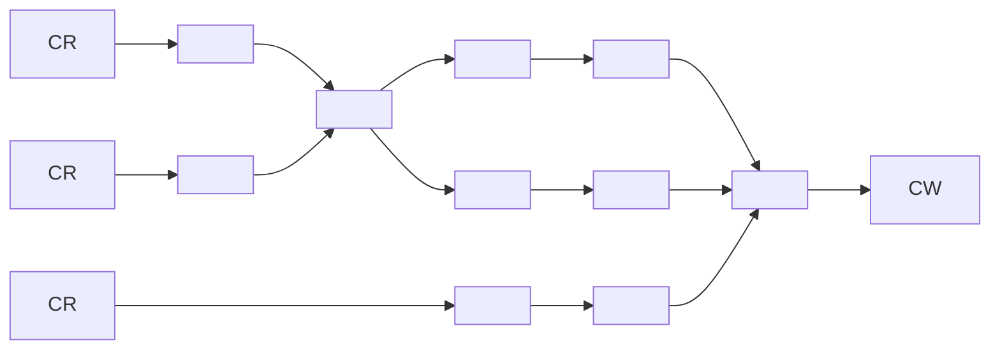

## 1.3 Organization
The ASM library is organized in several packages that are distributed in several jar files:

ASM 库被组织在几个包中，这些包被分布在几个 jar 文件中。

+ **the org.objectweb.asm** and org.objectweb.asm.signature packages define the event based API and provide the class parser and writer components. They are contained in the asm.jar archive. (org.objectweb.asm 和 org.objectweb.asm.signature 包定义了基于事件的 API，并提供了类分析器和写程序组件。它们包含在 asm.jar 档案中。)
+ **the org.objectweb.asm.util** package, in the asm-util.jar archive, provides various tools based on the core API that can be used during the development and debuging of ASM applications. (org.objectweb.asm.util 包，在 asm-util.jar 归档中，提供了基于核心 API 的各种工具，可以在 ASM 应用程序的开发和调试中使用。)
+ **the org.objectweb.asm.commons** package provides several useful predefined class transformers, mostly based on the core API. It is contained in the asm-commons.jar archive. (org.objectweb.asm.commons 包提供了几个有用的预定义类转换器，大部分是基于核心 API 的。它包含在 asm-commons.jar 档案中。)
+ **the org.objectweb.asm.tree** package, in the asm-tree.jar archive, defines the object based API, and provides tools to convert between the event based and the object based representations. (org.objectweb.asm.tree 包，在 asm-tree.jar 档案中，定义了基于对象的 API，并提供了在基于事件和基于对象的表示法之间转换的工具。)
+ **the org.objectweb.asm.tree.analysis** package provides a class analysis framework and several predefined class analyzers, based on the tree API. It is contained in the asm-analysis.jar archive. (org.objectweb.asm.tree.analysis 包提供了一个类分析框架和几个预定义的类分析器，基于 tree API。它包含在 asm-analysis.jar 档案中。)

This document is organized in two parts. The first part covers the core API, i.e. the asm, asm-util and asm-commons archives. The second part covers the tree API, i.e. the asm-tree and asm-analysis archives. Each part contains at least one chapter for the API related to classes, one chapter for the API related to methods, and one chapter for the API related to annotations, generic types, etc. Each chapter covers the programming interfaces as well as the related tools and predefined components. The source code of all the examples is available on the ASM web site.

本文件分为两部分。第一部分包括 core API，即 asm, asm-util 和 asm-commons 包。第二部分包括 tree API，即 asm-tree 和 asm-analysis 包。每一部分至少包含一章与类有关的 API，一章与方法有关的 API，以及一章与注解、通用类型等有关的 API。每一章都涵盖了编程接口以及相关的工具和预定义组件。所有例子的源代码都可以在 ASM 网站上找到。

This organization makes it easier to introduce class file features progressively, but sometimes required to spread the presentation of a single ASM class in several sections. It is therefore recommanded to read this document in sequential order. For a reference guide about the ASM API, please use the Javadoc.

这种组织方式使得逐步介绍类文件的功能更加容易，但有时需要将一个 ASM 类的介绍分散到几个部分。因此，建议按顺序阅读本文档。关于 ASM API 的参考指南，请使用 Javadoc。

# Core API

## 2. Classes
This chapter explains how to generate and transform compiled Java classes with the core ASM API. It starts with a presentation of compiled classes and then presents the corresponding ASM interfaces, components and tools to generate and transform them, with many illustrative examples. The content of methods, annotations and generics are explained in the next chapters.

本章解释了如何用核心 ASM API 生成和转换编译的 Java 类。它首先介绍了编译类，然后介绍了相应的 ASM 接口、组件和工具来生成和转换它们，并有许多说明性的例子。方法、注解和泛型的内容将在接下来的章节中解释。

### 2.1 Structure

#### 2.1.1 Overview
The overall structure of a compiled class is quite simple. Indeed, unlike natively compiled applications, a compiled class retains the structural information and almost all the symbols from the source code. In fact a compiled class contains:

编译后的类的整体结构是非常简单的。事实上，与本地编译的应用程序不同，编译后的类保留了源代码中的结构信息和几乎所有的符号。事实上，一个已编译的类包含。

+ A section describing the modifiers (such as public or private), the name, the super class, the interfaces and the annotations of the class. (描述修饰语（如 public 或 private）、名称、超类、接口和类的注释的部分。)
+ One section per field declared in this class. Each section describes the modifiers, the name, the type and the annotations of a field. (本类中声明的每个字段有一个部分。每一节都描述了一个字段的修饰语、名称、类型和注释。)
+ One section per method and constructor declared in this class. Each section describes the modifiers, the name, the return and parameter types, and the annotations of a method. It also contains the compiled code of the method, in the form of a sequence of Java bytecode instructions. (本类中声明的每个方法和构造函数有一个部分。每一节都描述了方法的修饰语、名称、返回和参数类型，以及注释。它还包含该方法的编译代码，以 Java 字节码指令序列的形式。)

There are however some differences between source and compiled classes:

然而，源码类和编译类之间有一些区别。

+ A compiled class describes only one class, while a source file can contain serveral classes, For instance a source file describing a class with one inner class is compiled in two class files: one for the main class and one for the inner class. However the main class file contains references to its inner classes, and inner classes defined inside methods contain a reference to their enclosing method. (例如，一个描述有一个内类的源文件被编译成两个类文件：一个是主类，一个是内类。然而，主类文件包含对其内层类的引用，定义在方法中的内层类包含对其包围方法的引用。)
+ A compiled class does not contain comments, of course, but can contain class, field, method and code attributes that can be used to associate additional information to these elements. Since the introduction of annotations in Java 5, which can be used for the same purpose, attributes have become mostly useless. (编译后的类当然不包含注释，但可以包含类、字段、方法和代码属性，这些属性可以用来给这些元素关联附加信息。自从在 Java 5 中引入了注解，可以用于同样的目的后，属性大多变得无用了。)
+ A compiled class does not contain a package and import section, so all type names must be fully qualified. (编译后的类不包含包和导入部分，所以所有的类型名必须是完全合格的。)

Another very important structural difference is that a compiled class contains a constant pool section. This pool is an array containing all the numeric, string and type constants that appear in the class. These constants are defined only once, in the constant pool section, and are referenced by their index in all other sections of the class file. Hopefully ASM hides all the details related to the constant pool, so you will not have to bother about it. Figure 2.1 summarizes the overall structure of a compiled class. The exact structure is described in the Java Virtual Machine Specification, section 4.

另一个非常重要的结构性差异是，一个已编译的类包含一个常量池部分。这个池是一个数组，包含了所有出现在类中的数字、字符串和类型常量。这些常量只在常量池部分定义一次，并在类文件的所有其他部分通过其索引进行引用。希望 ASM 隐藏了所有与常量池相关的细节，所以你不必为此而烦恼。图 2.1 总结了一个编译后的类的整体结构。具体的结构在《Java 虚拟机规范》第 4 节中有描述。

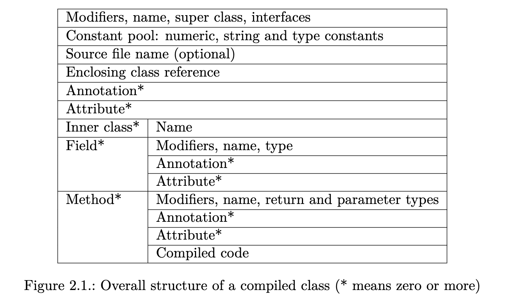

Another important difference is that Java types are represented differently in compiled and source classes. The next sections explain their representation in compiled classes.

另一个重要的区别是，Java 类型在编译类和源码类中的表示方式不同。接下来的章节将解释它们在编译类中的表现。

#### 2.1.2 Internal names
In many situations a type is constrained to be a class or interface type. For instance the super class of a class, the interfaces implemented by a class, or the exceptions thrown by a method cannot be primitive types or array types, and are necessarily class or interface types. These types are represented in compiled classes with internal names. The internal name of a class is just the fully qualified name of this class, where dots are replaced with slashes. For example the internal name of String is java/lang/String.

在许多情况下，一个类型被限制为一个类或接口类型。例如，一个类的超类，一个类实现的接口，或者一个方法抛出的异常不能是原始类型或数组类型，而必须是类或接口类型。这些类型在编译后的类中用内部名称表示。一个类的内部名称只是这个类的全称，其中点被替换为斜线。例如，String 的内部名称是 java/lang/String。

#### 2.1.3 Type descriptors
Internal names are used only for types that are constrained to be class or interface types. In all other situations, such as field types, Java types are represented in compiled classes with type descriptors (see Figure 2.2).

内部名称只用于那些被限制为类或接口类型的类型。在所有其他情况下，如字段类型，Java 类型在编译的类中用类型描述符表示（见图 2.2）。

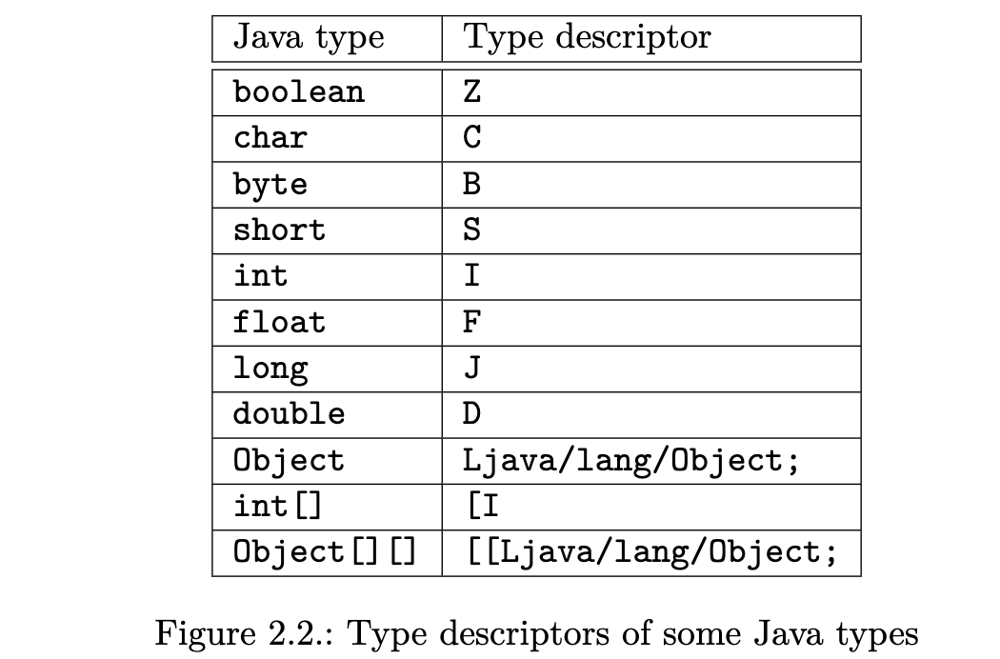

The descriptors of the primitive types are single characters: Z for boolean, C for char, B for byte, S for short, I for int, F for float, J for long and D for double. The descriptor of a class type is the internal name of this class, preceded by L and followed by a semicolon. For instance the type descriptor of String is Ljava/lang/String;. Finally the descriptor of an array type is a square bracket followed by the descriptor of the array element type.

原始类型的描述符是单个字符。Z 代表布尔型，C 代表 char，B 代表 byte，S 代表 short，I 代表 int，F 代表 float，J 代表 long，D 代表 double。一个类类型的描述符是这个类的内部名称，前面是L，后面是分号。例如，String 的类型描述符是 Ljava/lang/String;。最后，数组类型的描述符是一个方括号，后面是数组元素类型的描述符。

#### 2.1.4 Method descriptors
A method descriptor is a list of type descriptors that describe the parameter types and the return type of a method, in a single string. A method descriptor starts with a left parenthesis, followed by the type descriptors of each formal parameter, followed by a right parenthesis, followed by the type descriptor of the return type, or V if the method returns void (a method descriptor does not contain the method’s name or the argument names).

方法描述符是一个类型描述符的列表，在一个字符串中描述了一个方法的参数类型和返回类型。方法描述符以左括号开始，然后是每个正式参数的类型描述符，接着是右括号，然后是返回类型的类型描述符，如果方法返回无效，则是 V（方法描述符不包含方法的名称或参数名称）。

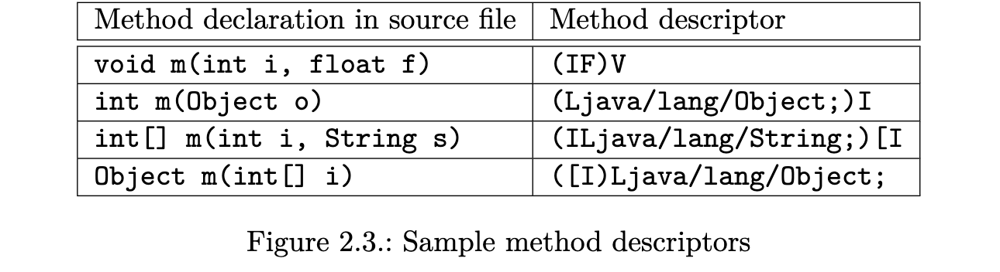

Once you know how type descriptors work, understanding method descriptors is easy. For instance (I)I describes a method that takes one argument of type int, and returns an int. Figure 2.3 gives several method descriptor examples.

一旦你知道类型描述符是如何工作的，理解方法描述符就很容易了。例如，(I)I 描述了一个方法，它接受一个 int 类型的参数，并返回一个 int。图 2.3 给出了几个方法描述符的例子。

### 2.2 Interfaces and components

#### 2.2.1 Presentation
The ASM API for generating and transforming compiled classes is based on the ClassVisitor abstract class (see Figure 2.4). Each method in this class corresponds to the class file structure section of the same name (see Figure 2.1). Simple sections are visited with a single method call whose arguments describe their content, and which returns void. Sections whose content can be of arbitrary length and complexity are visited with a initial method call that returns an auxiliary visitor class. This is the case of the visitAnnotation, visitField and visitMethod methods, which return an AnnotationVisitor, a FieldVisitor and a MethodVisitor respectively.

用于生成和转换编译类的 ASM API 是基于 ClassVisitor 抽象类的（见图 2.4）。这个类中的每个方法都对应于同名的类文件结构部分（见图 2.1）。简单的部分被访问，只需调用一个方法，其参数描述其内容，并返回 void。内容可以是任意长度和复杂程度的部分是通过一个初始方法调用来访问的，该方法返回一个辅助的访问者类。这就是 visitAnnotation、visitField 和 visitMethod 方法的情况，它们分别返回一个 AnnotationVisitor、一个 FieldVisitor 和一个 MethodVisitor。

```java
    public abstract class ClassVisitor {
        public ClassVisitor(int api);
        public ClassVisitor(int api, ClassVisitor cv);
        public void visit(int version, int access, String name,
        String signature, String superName, String[] interfaces);
        public void visitSource(String source, String debug);
        public void visitOuterClass(String owner, String name, String desc);
        AnnotationVisitor visitAnnotation(String desc, boolean visible);
        public void visitAttribute(Attribute attr);
        public void visitInnerClass(String name, String outerName,
        String innerName, int access);
        public FieldVisitor visitField(int access, String name, String desc,
        String signature, Object value);
        public MethodVisitor visitMethod(int access, String name, String desc,
        String signature, String[] exceptions);
        void visitEnd();
    }

    // Figure 2.4.: The ClassVisitor class
```

The same principles are used recursively for these auxiliary classes. For example each method in the FieldVisitor abstract class (see Figure 2.5) corresponds to the class file sub structure of the same name, and visitAnnotation returns an auxiliary AnnotationVisitor, as in ClassVisitor. The creation and usage of these auxiliary visitors is explained in the next chapters: indeed this chapter is restricted to simple problems that can be solved with the ClassVisitor class alone.

同样的原则被递归地用于这些辅助类。例如，FieldVisitor 抽象类（见图 2.5）中的每个方法都对应于同名的类文件子结构，visitAnnotation 返回一个辅助的 AnnotationVisitor，如同 ClassVisitor。这些辅助访问者的创建和使用将在接下来的章节中解释：事实上，本章仅限于仅用 ClassVisitor 类就能解决的简单问题。

```java
    public abstract class FieldVisitor {
        public FieldVisitor(int api);
        public FieldVisitor(int api, FieldVisitor fv);
        public AnnotationVisitor visitAnnotation(String desc, boolean visible);
        public void visitAttribute(Attribute attr);
        public void visitEnd();
    }
    
    // Figure 2.5.: The FieldVisitor class
```

The methods of the ClassVisitor class must be called in the following order, specified in the Javadoc of this class:

ClassVisitor 类的方法必须按照该类的 Javadoc 中规定的以下顺序调用。

```java
    visit visitSource? visitOuterClass? ( visitAnnotation | visitAttribute )*
    ( visitInnerClass | visitField | visitMethod )*
    visitEnd
```

This means that visit must be called first, followed by at most one call to visitSource, followed by at most one call to visitOuterClass, followed by any number of calls in any order to visitAnnotation and visitAttribute, followed by any number of calls in any order to visitInnerClass, visitField and visitMethod, and terminated by a single call to visitEnd.

这意味着必须**首先调用 visit，然后最多调用 visitSource，接着最多调用 visitOuterClass，接着以任何顺序调用 visitAnnotation 和 visitAttribute，接着以任何顺序调用 visitInnerClass、visitField 和 visitMethod，最后以一次调用 visitEnd 结束。**

ASM provides three core components based on the ClassVisitor API to generate and transform classes:

ASM 提供了三个基于 ClassVisitor API 的核心组件来生成和转换类。

+ The **ClassReader** class parses a compiled class given as a byte array, and calls the corresponding visitXxx methods on the ClassVisitor instance passed as argument to its accept method. It can be seen as an event producer. (ClassReader 类解析了一个以字节数组形式给出的已编译的类，并在作为参数传递给其接受方法的 ClassVisitor 实例上调用相应的 visitXxx 方法。它可以被看作是一个事件生产者。)
+ The **ClassWriter** class is a subclass of the ClassVisitor abstract class that builds compiled classes directly in binary form. It produces as output a byte array containing the compiled class, which can be retrieved with the toByteArray method. It can be seen as an event consumer. (ClassWriter 类是 ClassVisitor 抽象类的一个子类，它直接以二进制形式构建编译后的类。它产生一个包含编译类的字节数组作为输出，可以用toByteArray 方法检索。它可以被看作是一个事件消费者。)
+ The **ClassVisitor** class delegates all the method calls it receives to another ClassVisitor instance. It can be seen as an event filter. (ClassVisitor 类将它收到的所有方法调用委托给另一个 ClassVisitor 实例。它可以被看作是一个事件过滤器。)

The next sections show with concrete examples how these components can be used to generate and transform classes.

接下来的章节用具体的例子展示了这些组件如何被用来生成和转换类。

#### 2.2.2 Parsing classes
The only required component to parse an existing class is the ClassReader component. Let’s take an example to illustrate this. Suppose that we would like to print the content of a class, in a similar way as the javap tool. The first step is to write a subclass of the ClassVisitor class that prints information about the classes it visits. Here is a possible, overly simplified implementation:

解析一个现有的类，唯一需要的组件是 ClassReader 组件。让我们举个例子来说明这一点。假设我们想打印一个类的内容，其方式与 javap 工具类似。第一步是写一个 ClassVisitor 类的子类，打印它所访问的类的信息。下面是一个可能的、过于简化的实现。

```java
    public class ClassPrinter extends ClassVisitor {
        public ClassPrinter() {
            super(ASM4);
        }

        public void visit(int version, int access, String name, String signature, String superName, String[] interfaces) {
            System.out.println(name + " extends " + superName + " {");
        }

        public void visitSource(String source, String debug) {
        }

        public void visitOuterClass(String owner, String name, String desc) {
        }

        public AnnotationVisitor visitAnnotation(String desc, boolean visible) {
            return null;
        }

        public void visitAttribute(Attribute attr) {
        }

        public void visitInnerClass(String name, String outerName, String innerName, int access) {
        }

        public FieldVisitor visitField(int access, String name, String desc, String signature, Object value) {
            System.out.println(" " + desc + " " + name);
            return null;
        }

        public MethodVisitor visitMethod(int access, String name, String desc, String signature, String[] exceptions) {
            System.out.println(" " + name + desc);
            return null;
        }

        public void visitEnd() {
            System.out.println("}");
        }
}
```

The second step is to combine this ClassPrinter with a ClassReader component, so that the events produced by the ClassReader are consumed by our ClassPrinter:

第二步是将这个 ClassPrinter 与一个 ClassReader 组件结合起来，以便 ClassReader 产生的事件被我们的 ClassPrinter 所消耗。

```java
    ClassPrinter cp = new ClassPrinter();
    ClassReader cr = new ClassReader("java.lang.Runnable");
    cr.accept(cp, 0);
```

The second line creates a ClassReader to parse the Runnable class. The accept method called at the last line parses the Runnable class bytecode and calls the corresponding ClassVisitor methods on cp. The result is the following output:

第二行创建一个 ClassReader 来解析 Runnable 类。最后一行调用的 accept 方法解析了 Runnable 类的字节码，并调用 cp 上相应的 ClassVisitor 方法。结果是下面的输出。

```java
    java/lang/Runnable extends java/lang/Object {
        run()V
    }
```

Note that there are several ways to construct a ClassReader instance. The class that must be read can be specified by name, as above, or by value, as a byte array or as an InputStream. An input stream to read the content of a class can be obtained with the ClassLoader’s getResourceAsStream method with:

注意，有几种方法可以构造一个 ClassReader 实例。必须被读取的类可以通过名字来指定，如上所述，也可以通过值来指定，如一个字节数组或一个 InputStream。读取一个类的内容的输入流可以通过 ClassLoader 的 getResourceAsStream 方法获得，方法是：

```java
    cl.getResourceAsStream(classname.replace(’.’, ’/’) + ".class");
```

#### 2.2.3 Generating classes
The only required component to generate a class is the ClassWriter component. Let’s take an example to illustrate this. Consider the following interface:

生成一个类唯一需要的组件是 ClassWriter 组件。让我们举个例子来说明这一点。考虑一下下面的接口。

```java
    package pkg;
    public interface Comparable extends Mesurable {
        int LESS = -1;
        int EQUAL = 0;
        int GREATER = 1;
        int compareTo(Object o);
    }
```

It can be generated with six method calls to a ClassVisitor:

```java
    ClassWriter cw = new ClassWriter(0);
    cw.visit(V1_5, ACC_PUBLIC + ACC_ABSTRACT + ACC_INTERFACE, "pkg/Comparable", null, "java/lang/Object", new String[] { "pkg/Mesurable" });
    cw.visitField(ACC_PUBLIC + ACC_FINAL + ACC_STATIC, "LESS", "I", null, new Integer(-1)).visitEnd();
    cw.visitField(ACC_PUBLIC + ACC_FINAL + ACC_STATIC, "EQUAL", "I", null, new Integer(0)).visitEnd();
    cw.visitField(ACC_PUBLIC + ACC_FINAL + ACC_STATIC, "GREATER", "I", null, new Integer(1)).visitEnd();
    cw.visitMethod(ACC_PUBLIC + ACC_ABSTRACT, "compareTo", "(Ljava/lang/Object;)I", null, null).visitEnd();
    cw.visitEnd();
    byte[] b = cw.toByteArray();
```

The first line creates a ClassWriter instance that will actually build the byte array representation of the class (the constructor argument is explained in the next chapter).

第一行创建了一个 ClassWriter 实例，它将实际建立类的字节数组表示（构造函数参数将在下一章解释）。

The call to the visit method defines the class header. The V1_5 argument is a constant defined, like all other ASM constants, in the ASM Opcodes interface. It specifies the class version, Java 1.5. The ACC_XXX constants are flags that correspond to Java modifiers. Here we specify that the class is an interface, and that it is public and abstract (because it cannot be instantiated). The next argument specifies the class name, in internal form (see section 2.1.2). Recall that compiled classes do not contain a package or import section, so all class names must be fully qualified. The next argument corresponds to generics (see section 4.1). In our case it is null because the interface is not parameterized by a type variable. The fifth argument is the super class, in internal form (interface classes implicitly inherit from Object). The last argument is an array of the interfaces that are extended, specified by their internal names.

对访问方法的调用定义了类头。V1_5 参数是一个常数，像所有其他 ASM 常数一样，在 ASM 操作码接口中定义。它指定了类的版本，即 Java 1.5。ACC_XXX 常量是对应于 Java 修改器的标志。这里我们指定该类是一个接口，并且它是公共的和抽象的（因为它不能被实例化）。下一个参数指定了内部形式的类名（见 2.1.2 节）。回顾一下，编译后的类不包含包或导入部分，所以所有的类名必须是完全限定的。下一个参数对应的是泛型（见第 4.1 节）。在我们的例子中，它是空的，因为接口没有被一个类型变量所参数化。第五个参数是内部形式的超类（接口类隐含地继承于 Object）。最后一个参数是被扩展的接口数组，由其内部名称指定。

The next three calls to visitField are similar, and are used to define the three interface fields. The first argument is a set of flags that correspond to Java modifiers. Here we specify that the fields are public, final and static. The second argument is the name of the field, as it appears in source code. The third argument is the type of the field, in type descriptor form. Here the fields are int fields, whose descriptor is I. The fourth argument corresponds to generics. In our case it is null because the field types are not using generics. The last argument is the field’s constant value: this argument must be used only for truly constant fields, i.e. final static fields. For other fields it must be null. Since there are no annotations here, we call the visitEnd method of the returned FieldVisitor immediately, i.e. without any call to its visitAnnotation or visitAttribute methods.

接下来对 visitField 的三次调用是类似的，用来定义三个接口字段。第一个参数是一组对应于 Java 修改器的标志。这里我们指定这些字段是 pulic、final 的和 static 的。第二个参数是字段的名称，正如它在源代码中出现的那样。第三个参数是字段的类型，以类型描述符的形式。这里的字段是 int 字段，其描述符是 I。第四个参数对应于泛型。在我们的例子中，它是空的，因为字段类型没有使用泛型。最后一个参数是字段的常量值：这个参数必须只用于真正的常量字段，即最终静态字段。对于其他字段，它必须为空。因为这里没有注释，所以我们立即调用返回的 FieldVisitor 的 visitEnd 方法，也就是说，不需要调用其 visitAnnotation 或 visitAttribute 方法。

The visitMethod call is used to define the compareTo method. Here again the first argument is a set of flags that correspond to Java modifiers. The second argument is the method name, as it appears in source code. The third argument is the descriptor of the method. The fourth argument corresponds to generics. In our case it is null because the method is not using generics. The last argument is an array of the exceptions that can be thrown by the method, specified by their internal names. Here it is null because the method does not declare any exception. The visitMethod method returns a MethodVisitor (see Figure 3.4), which can be used to define the method’s annotations and attributes, and most importantly the method’s code. Here, since there are no annotations and since the method is abstract, we call the visitEnd method of the returned MethodVisitor immediately.

visitMethod 调用是用来定义 compareTo 方法的。这里的第一个参数是一组对应于 Java 修改器的标志。第二个参数是方法名称，就像它在源代码中出现的那样。第三个参数是该方法的描述符。第四个参数对应的是泛型。在我们的例子中，它是空的，因为该方法没有使用泛型。最后一个参数是该方法可以抛出的异常数组，由其内部名称指定。这里它是空的，因为该方法没有声明任何异常。visitMethod 方法返回一个 MethodVisitor（见图 3.4），它可以用来定义方法的注释和属性，最重要的是方法的代码。在这里，由于没有注释，而且该方法是抽象的，我们立即调用返回的 MethodVisitor 的 visitEnd 方法。

Finally a last call to visitEnd is used to inform cw that the class is finished and a call to toByteArray is used to retrieve it as a byte array.

最后，对 visitEnd 的调用被用来通知 cw 该类已经完成，对 byteArray 的调用被用来将其作为字节数组来检索。

**Using generated classes**
The previous byte array can be stored in a Comparable.class file for future use. Alternatively it can be loaded dynamically with a ClassLoader. One method is to define a ClassLoader subclass whose defineClass method is public:

前面的字节数组可以存储在一个 Comparable.class 文件中，以便将来使用。或者，它可以用 ClassLoader 动态加载。一种方法是定义一个 ClassLoader 子类，其 defineClass 方法是公开的。

```java
    class MyClassLoader extends ClassLoader {
        public Class defineClass(String name, byte[] b) {
            return defineClass(name, b, 0, b.length);
        }
    }
```

Then the generated class can be loaded directly with:

```java
    Class c = myClassLoader.defineClass("pkg.Comparable", b);
```

Another method to load a generated class, which is probably cleaner, is to define a ClassLoader subclass whose findClass method is overridden in order to generate the requested class on the fly:

另一种加载生成的类的方法，可能更干净，是定义一个 ClassLoader 子类，其 findClass 方法被重载，以便在飞行中生成所请求的类。

```java
    class StubClassLoader extends ClassLoader {
        @Override
        protected Class findClass(String name) throws ClassNotFoundException {
            if (name.endsWith("_Stub")) {
                ClassWriter cw = new ClassWriter(0);
                ...
                byte[] b = cw.toByteArray();
                return defineClass(name, b, 0, b.length);
            }
            return super.findClass(name);
        }
    }
```

In fact the way of using your generated classes depends on the context, and is out of scope of the ASM API. If you are writing a compiler, the class generation process will be driven by an abstract syntax tree representing the program to be compiled, and the generated classes will be stored on disk. If you are writing a dynamic proxy class generator or aspect weaver you will use, in one way or another, a ClassLoader.

事实上，使用你生成的类的方式取决于上下文，而且不在 ASM API 的范围内。如果你正在编写一个编译器，类的生成过程将由代表要编译的程序的抽象语法树驱动，生成的类将被存储在磁盘上。如果你正在编写一个动态代理类生成器或方面编织器，你将以这种或那种方式使用 ClassLoader。

#### 2.2.4 Transforming classes
So far the ClassReader and ClassWriter components were used alone. The events were produced “by hand” and consumed directly by a ClassWriter or, symetrically, they were produced by a ClassReader and consumed “by hand”, i.e. by a custom ClassVisitor implementation. Things start to become really interesting when these components are used together. The first step is to direct the events produced by a ClassReader to a ClassWriter. The result is that the class parsed by the class reader is reconstructed by the class writer:

到目前为止，ClassReader 和 ClassWriter 组件被单独使用。事件是由 "手工" 产生并由 ClassWriter 直接消费的，或者说，它们是由 ClassReader 产生并由 "手工" 消费的，也就是由一个自定义的 ClassVisitor 实现。当这些组件被一起使用时，事情开始变得非常有趣。第一步是将由 ClassReader 产生的事件引导到 ClassWriter。其结果是，由 ClassReader 解析的类被 ClassWriter 重构。

```java
    byte[] b1 = ...;
    ClassWriter cw = new ClassWriter(0);
    ClassReader cr = new ClassReader(b1);
    cr.accept(cw, 0);
    byte[] b2 = cw.toByteArray(); // b2 represents the same class as b1
```

This is not really interesting in itself (there are easier ways to copy a byte array!), but wait. The next step is to introduce a ClassVisitor between the class reader and the class writer:

这本身其实并不有趣（有更简单的方法来复制一个字节数组！），但请等待。下一步是在类读者和类写者之间引入一个 ClassVisitor。

```java
    byte[] b1 = ...;
    ClassWriter cw = new ClassWriter(0);
    // cv forwards all events to cw
    ClassVisitor cv = new ClassVisitor(ASM4, cw) { };
    ClassReader cr = new ClassReader(b1);
    cr.accept(cv, 0);
    byte[] b2 = cw.toByteArray(); // b2 represents the same class as b1
```

The architecture corresponding to the above code is depicted in Figure 2.6, where components are represented with squares, and events with arrows (with a vertical time line as in sequence diagrams).

图 2.6 描述了与上述代码相对应的架构，其中组件用方块表示，事件用箭头表示（与顺序图中的垂直时间线一样）。

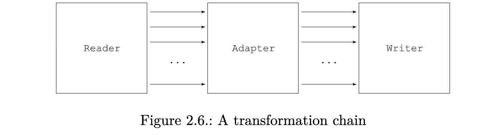

The result does not change, however, because the ClassVisitor event filter does not filter anything. But it is now sufficient to filter some events, by overriding some methods, in order to be able to transform a class. For example, consider the following ClassVisitor subclass:

然而，结果并没有改变，因为 ClassVisitor 事件过滤器并没有过滤任何东西。但是现在通过重写一些方法来过滤一些事件就足够了，以便能够改造一个类。例如，考虑下面这个 ClassVisitor 子类。

```java
    public class ChangeVersionAdapter extends ClassVisitor {
        public ChangeVersionAdapter(ClassVisitor cv) {
            super(ASM4, cv);
        }

        @Override
        public void visit(int version, int access, String name, String signature, String superName, String[] interfaces) {
            cv.visit(V1_5, access, name, signature, superName, interfaces);
        }
    }
```

This class overrides only one method of the ClassVisitor class. As a consequence all calls are forwarded unchanged to the class visitor cv passed to the constructor, except calls to the visit method, which are forwarded with a modified class version number. The corresponding sequence diagram is shown in Figure 2.7.

这个类只重写了 ClassVisitor 类的一个方法。因此，所有的调用都被转发到传递给构造函数的类访问者 cv，除了对访问方法的调用，它被转发到一个修改过的类版本号。相应的序列图如图 2.7 所示。


By modifying other arguments of the visit method you can implement other transformations than just changing the class version. For instance you can add an interface to the list of implemented interfaces. It is also possible to change the name of the class, but this requires much more than just changing the name argument in the visit method. Indeed the name of the class can appear in many different places inside a compiled class, and all these occurrences must be changed to really rename the class.

通过修改访问方法的其他参数，你可以实现其他转换，而不仅仅是改变类的版本。例如，你可以在实现的接口列表中添加一个接口。也可以改变类的名称，但这需要比仅仅改变访问方法中的名称参数更多的东西。事实上，类的名字可以出现在一个已编译的类中的许多不同的地方，所有这些出现的地方都必须被改变才能真正地重命名这个类。

**Optimization**
The previous transformation changes only four bytes in the original class. However, with the above code, b1 is fully parsed and the corresponding events are used to construct b2 from scratch, which is not very efficient. It would be much more efficient to copy the parts of b1 that are not transformed directly into b2, without parsing these parts and without generating the corresponding events. ASM automatically performs this optimization for methods:

前面的转换只改变了原始类中的四个字节。然而，通过上述代码，b1 被完全解析，相应的事件被用来从头构建 b2，这不是很有效率。将 b1 中未被转换的部分直接复制到 b2 中，而不解析这些部分，也不生成相应的事件，这样会更有效率。ASM 自动为方法进行了这种优化。

+ If a ClassReader component detects that a MethodVisitor returned by the ClassVisitor passed as argument to its accept method comes from a ClassWriter, this means that the content of this method will not be transformed, and will in fact not even be seen by the application. (如果一个 ClassReader 组件检测到作为参数传递给它的 accept 方法的 ClassVisitor 所返回的 MethodVisitor 来自 ClassWriter，这意味着这个方法的内容将不会被转换，事实上甚至不会被应用程序看到。)
+ In this case the ClassReader component does not parse the content of this method, does not generate the corresponding events, and just copies the byte array representation of this method in the ClassWriter. (在这种情况下，ClassReader 组件不解析这个方法的内容，不产生相应的事件，而只是在 ClassWriter 中复制这个方法的字节数表示。)

This optimization is performed by the ClassReader and ClassWriter components if they have a reference to each other, which can be set like this:

**如果 ClassReader 和 ClassWriter 组件有彼此的引用，就会进行这种优化，可以像这样设置。**

```java
    byte[] b1 = ...
    ClassReader cr = new ClassReader(b1);
    ClassWriter cw = new ClassWriter(cr, 0);
    ChangeVersionAdapter ca = new ChangeVersionAdapter(cw);
    cr.accept(ca, 0);
    byte[] b2 = cw.toByteArray();
```

Thanks to this optimization the above code is two times faster than the previous one, because ChangeVersionAdapter does not transform any method. For common class transformations, which transform some or all methods, the speedup is smaller, but is still noticeable: it is indeed of the order of 10 to 20%. Unfortunately this optimization requires to copy all the constants defined in the original class into the transformed one. This is not a problem for tranformations that add fields, methods or instructions, but this leads to bigger class files, compared to the unoptimized case, for transformations that remove or rename many class elements. It is therefore recommanded to use this optimization only for “additive” transformations.

**由于这一优化，上述代码比之前的代码快了 2 倍，因为 ChangeVersionAdapter 并没有转换任何方法。对于普通的类的转换，即转换一些或所有的方法，速度会小一些，但仍然是明显的：确实是 10-20% 的数量级。不幸的是，这种优化需要将原始类中定义的所有常量复制到转换后的类中。这对于增加字段、方法或指令的转换来说不是问题，但是与未优化的情况相比，对于删除或重命名许多类元素的转换来说，这将导致更大的类文件。因此，我们建议只对 "加法" 转换使用这种优化。**

**Using transformed classes**
The transformed class b2 can be stored on disk or loaded with a ClassLoader, as described in the previous section. But class transformations done inside a ClassLoader can only transform the classes loaded by this class loader. If you want to transform all classes you will have to put your transformation inside a ClassFileTransformer, as defined in the java.lang.instrument package (see the documentation of this package for more details):

转化后的类 b2 可以存储在磁盘上或用 ClassLoader 加载，如上一节所述。但是在 ClassLoader 中进行的类转换只能转换由这个类加载器加载的类。如果你想转换所有的类，你必须把你的转换放在一个 ClassFileTransformer 里面，就像在 java.lang.instrument 包中定义的那样（更多细节请看这个包的文档）。

```java
    public static void premain(String agentArgs, Instrumentation inst) {
        inst.addTransformer(new ClassFileTransformer() {
            public byte[] transform(ClassLoader l, String name, Class c,ProtectionDomain d, byte[] b) throws IllegalClassFormatException {
                ClassReader cr = new ClassReader(b);
                ClassWriter cw = new ClassWriter(cr, 0);
                ClassVisitor cv = new ChangeVersionAdapter(cw);
                cr.accept(cv, 0);
                return cw.toByteArray();
            }
        });
    }
```

#### 2.2.5. Removing class members
The method used to transform the class version in the previous section can of course be applied to other methods of the ClassVisitor class. For instance, by changing the access or name argument in the visitField and visitMethod methods, you can change the modifiers or the name of a field or of a method. Furthermore, instead of forwarding a method call with modified arguments, you can choose to not forward this call at all. The effect is that the corresponding class element is removed.

上一节中用来转换类的版本的方法当然也可以应用于 ClassVisitor 类的其他方法。例如，通过改变 visitField 和 visitMethod 方法中的访问参数或名称参数，你可以改变一个字段或一个方法的修改器或名称。此外，你可以选择不转发带有修改参数的方法调用，而是根本不转发这个调用。其效果是，相应的类元素被移除。

For example the following class adapter removes the information about outer and inner classes, as well as the name of the source file from which the class was compiled (the resulting class remains fully functional, because these elements are only used for debugging purposes). This is done by not forwarding anything in the appropriate visit methods:

例如，下面的类适配器删除了外层和内层类的信息，以及编译该类的源文件的名称（产生的类仍然是完全有效的，因为这些元素只用于调试目的）。这是通过在适当的访问方法中不转发任何东西来实现的。

```java
    public class RemoveDebugAdapter extends ClassVisitor {
        public RemoveDebugAdapter(ClassVisitor cv) {
            super(ASM4, cv);
        }

        @Override
        public void visitSource(String source, String debug) {
        }

        @Override
        public void visitOuterClass(String owner, String name, String desc) {
        }

        @Override
        public void visitInnerClass(String name, String outerName, String innerName, int access) {
        }
    }
```

This strategy does not work for fields and methods, because the visitField and visitMethod methods must return a result. In order to remove a field or method, you must not forward the method call, and return null to the caller. For example the following class adapter removes a single method, specified by its name and by its descriptor (the name is not sufficient to identify a method, because a class can contain several methods of the same name but with different parameters):

这个策略对字段和方法不起作用，因为 visitField 和 visitMethod 方法必须返回一个结果。为了删除一个字段或方法，你必须不转发方法调用，并向调用者返回 null。例如，下面的类适配器删除了一个单一的方法，由其名称和描述符指定（名称不足以识别一个方法，因为一个类可以包含几个同名但有不同参数的方法）。

```java
    public class RemoveMethodAdapter extends ClassVisitor {
        private String mName;
        private String mDesc;
        public RemoveMethodAdapter(ClassVisitor cv, String mName, String mDesc) {
            super(ASM4, cv);
            this.mName = mName;
            this.mDesc = mDesc;
        }
        @Override
        public MethodVisitor visitMethod(int access, String name,
        String desc, String signature, String[] exceptions) {
            if (name.equals(mName) && desc.equals(mDesc)) {
                // do not delegate to next visitor -> this removes the method
                return null;
            }
            return cv.visitMethod(access, name, desc, signature, exceptions);
        }
    }
```

#### 2.2.6 Adding class members
Instead of forwarding fewer calls than you receive, you can “forward” more, which has the effect of adding class elements. The new calls can be inserted at several places between the original method calls, provided that the order in which the various visitXxx methods must be called is respected (see section 2.2.1).

你可以 "转发 "更多的调用，而不是转发比你收到的更少的调用，这有增加类元素的效果。新的调用可以插在原始方法调用之间的几个地方，**前提是必须遵守各种 visitXxx 方法的调用顺序**（见 2.2.1 节）。

For instance, if you want to add a field to a class you have to insert a new call to visitField between the original method calls, and you must put this new call in one of the visit method of your class adapter. You cannot do this in the visit method, for example, because this may result in a call to visitField followed by visitSource, visitOuterClass, visitAnnotation or visitAttribute, which is not valid. You cannot put this new call in the visitSource, visitOuterClass, visitAnnotation or visitAttribute methods, for the same reason. The only possibilities are the visitInnerClass, visitField, visitMethod or visitEnd methods.

例如，**如果你想给一个类添加一个字段，你必须在原来的方法调用之间插入一个对 visitField 的新调用**，而且你必须把这个新调用放在你的类适配器的一个访问方法中。例如，你不能在 visit() 中这样做，因为这可能会导致对 visitField 的调用后面跟着 visitSource、visitOuterClass、visitAnnotation 或 visitAttribute，这是无效的。你不能把这个新的调用放在 visitSource、visitOuterClass、visitAnnotation 或 visitAttribute 方法中，原因也是如此。**唯一的可能性是 visitInnerClass、visitField、visitMethod 或 visitEnd 方法。**

If you put the new call in the visitEnd method the field will always be added (unless you add explicit conditions), because this method is always called. If you put it in visitField or visitMethod, several fields will be added: one per field or method in the original class. Both solutions can make sense; it depends on what you need. For instance you can add a single counter field to count the invocations on an object, or one counter per method, to count the invocations of each method separately.

**如果你把新的调用放在 visitEnd 方法中，字段将总是被添加（除非你添加明确的条件）**，因为这个方法总是被调用。如果你把它放在 visitField 或 visitMethod 中，就会有几个字段被添加：原始类中的每个字段或方法都有一个。这两种解决方案都有意义；这取决于你需要什么。例如，你可以添加一个单独的计数器字段来计算对一个对象的调用，或者每个方法一个计数器，分别计算每个方法的调用。

Note: in fact the only truly correct solution is to add new members by making additional calls in the visitEnd method. Indeed a class must not contain duplicate members, and the only way to be sure that a new member is unique is to compare it with all the existing members, which can only be done once they have all been visited, i.e. in the visitEnd method. This is rather constraining. Using generated names that are unlikely to be used by a programmer, such as _counter$ or _4B7F_ is sufficient in practice to avoid duplicate members without having to add them in visitEnd. Note that, as discussed in the first chapter, the tree API does not have this limitation: it is possible to add new members at any time inside a transformation with this API.

注意：事实上，唯一真正正确的解决方案是通过在 visitEnd 方法中进行额外的调用来添加新成员。事实上，一个类不能包含重复的成员，确定一个新成员是唯一的方法是将其与所有现有的成员进行比较，而这只能在它们都被访问过后进行，即在 visitEnd 方法中。这是很有限制性的。使用不太可能被程序员使用的生成的名字，比如 _counter$ 或 _4B7F_ ，在实践中足以避免重复的成员，而不必在 visitEnd 中添加它们。请注意，正如第一章所讨论的，树形 API 没有这个限制：可以在任何时候用这个 API 在转换中添加新的成员。

In order to illustrate the above discussion, here is a class adapter that adds a
field to a class, unless this field already exists:

为了说明上述讨论，这里有一个类适配器，它添加了一个

```java
    public class AddFieldAdapter extends ClassVisitor {
        private int fAcc;
        private String fName;
        private String fDesc;
        private boolean isFieldPresent;

        public AddFieldAdapter(ClassVisitor cv, int fAcc, String fName, String fDesc) {
            super(ASM4, cv);
            this.fAcc = fAcc;
            this.fName = fName;
            this.fDesc = fDesc;
        }
        @Override
        public FieldVisitor visitField(int access, String name, String desc, String signature, Object value) {
            if (name.equals(fName)) {
                isFieldPresent = true;
            }
            return cv.visitField(access, name, desc, signature, value);
        }
        @Override
        public void visitEnd() {
            if (!isFieldPresent) {
                FieldVisitor fv = cv.visitField(fAcc, fName, fDesc, null, null);
                if (fv != null) {
                    fv.visitEnd();
                }
            }
            cv.visitEnd();
        }
    }
```

The field is added in the visitEnd method. The visitField method is not overridden to modify existing fields or to remove a field, but just to detect if the field we want to add already exists or not. Note the fv != null test in the visitEnd method, before calling fv.visitEnd(): this is because, as we have seen in the previous section, a class visitor can return null in visitField.

该字段在 visitEnd 方法中被添加。visitField 方法没有被重写来修改现有的字段或删除一个字段，而只是检测我们要添加的字段是否已经存在。注意在 visitEnd 方法中，在调用 fv.visitEnd() 之前的 fv != null 测试：这是因为，正如我们在上一节中看到的，一个类访问者可以在 visitField 中返回 null。

#### 2.2.7 Transformation chains
So far we have seen simple transformation chains made of a ClassReader, a class adapter, and a ClassWriter. It is of course possible to use more complex chains, with several class adapters chained together. Chaining several adapters allows you to compose several independent class transformations in order to do complex transformations. Note also that a transformation chain is not necessarily linear. You can write a ClassVisitor that forwards all the method calls it receives to several ClassVisitor at the same time:

到目前为止，我们已经看到了由一个 ClassReader、一个类适配器和一个 ClassWriter 组成的简单的转换链。当然，也可以使用更复杂的链，将几个类适配器串联起来。将几个适配器串联起来可以让你组成几个独立的类转换，以便进行复杂的转换。还要注意，一个转换链不一定是线性的。你可以写一个 ClassVisitor，将它收到的所有方法调用同时转发给几个 ClassVisitor。

```java
    public class MultiClassAdapter extends ClassVisitor {
        protected ClassVisitor[] cvs;
        public MultiClassAdapter(ClassVisitor[] cvs) {
            super(ASM4);
            this.cvs = cvs;
        }
        @Override 
        public void visit(int version, int access, String name, String signature, String superName, String[] interfaces) {
            for (ClassVisitor cv : cvs) {
                cv.visit(version, access, name, signature, superName, interfaces);
            }
        }
        ...
    }
```

Symmetrically several class adapters can delegate to the same ClassVisitor (this requires some precautions to ensure, for example, that the visit and visitEnd methods are called exactly once on this ClassVisitor). Thus a transformation chain such as the one shown in Figure 2.8 is perfectly possible.

对称地，几个类适配器可以委托给同一个 ClassVisitor（这需要一些预防措施，例如，确保 visit 和 visitEnd 方法在这个 ClassVisitor 上正好被调用一次）。因此，像图 2.8 中所示的转换链是完全可能的。


### 2.3 Tools
In addition to the ClassVisitor class and to the related ClassReader and ClassWriter components, ASM provides, in the org.objectweb.asm.util package, several tools that can be useful during the development of a class generator or adapter, but which are not needed at runtime. ASM also provides a utility class for manipulating internal names, type descriptors and method descriptors at runtime. All these tools are presented below.

除了 ClassVisitor 类和相关的 ClassReader 和 ClassWriter组件外，ASM 还在 org.objectweb.asm.util 包中提供了一些工具，这些工具在类生成器或适配器的开发过程中可能很有用，但在运行时并不需要。ASM 还提供了一个实用类，用于在运行时操作内部名称、类型描述符和方法描述符。下面将介绍所有这些工具。

#### 2.3.1 Type
As you have seen in the previous sections, the ASM API exposes Java types as they are stored in compiled classes, i.e. as internal names or type descriptors. It would be possible to expose them as they appear in source code, to make code more readable. But this would require systematic conversions between the two representations in ClassReader and ClassWriter, which would degrade performances. This is why ASM does not transparently transform internal names and type descriptors to their equivalent source code form. However it provides the Type class for doing that manually when necessary. 

正如你在前面的章节中所看到的，ASM API 按照它们存储在编译后的类中的样子来暴露 Java 类型，即作为内部名称或类型描述符。为了使代码更具可读性，有可能按照它们在源代码中出现的样子来公开它们。但是这需要在 ClassReader 和 ClassWriter 中的两种表示法之间进行系统转换，这将降低性能。这就是为什么 ASM 不透明地将内部名称和类型描述符转换为其等效的源代码形式。然而，它提供了 Type 类，以便在必要时手动进行转换。

A Type object represents a Java type, and can be constructed either from a type descriptor or from a Class object. The Type class also contains static variables representing the primitive types. For example Type.INT_TYPE is the Type object representing the int type.

**一个 Type 对象代表一个 Java 类型，可以从一个类型描述符或从一个 Class 对象构建。Type 类还包含代表原始类型的静态变量。例如，Type.INT_TYPE 是代表 int 类型的 Type 对象。**

The getInternalName method returns the internal name of a Type. For example Type. getType(String.class).getInternalName() gives the internal name of the String class, i.e. "java/lang/String". This method must be used only for class or interface types.

getInternalName 方法返回一个 Type 的内部名称。例如，Type.getType(String.class).getInternalName() 给出 String 类的内部名称，即 "java/lang/String"。这个方法必须只用于类或接口类型。

The getDescriptor method returns the descriptor of a Type. So, for example, instead of using "Ljava/lang/String;" in your code you could use Type.getType(String.class).getDescriptor(). Or, instead of using I, you could use Type.INT_TYPE.getDescriptor().

getDescriptor 方法返回一个 Type 的描述符。因此，例如，你可以使用 Type.getType(String.class).getDescriptor()，而不是在代码中使用 "Ljava/lang/String;"。或者，你可以使用 Type.INT_TYPE.getDescriptor()而不是使用 I，。

A Type object can also represent a method type. Such objects can be constructed either from a method descriptor or from a Method object. The getDescriptor method then returns the method descriptor corresponding to this type. In addition, the getArgumentTypes and getReturnType methods can be used to get the Type objects corresponding to the argument types and return types of a method. For instance Type.getArgumentTypes("(I)V") returns an array containing the single element Type.INT_TYPE. Similarly, a call to Type.getReturnType("(I)V") returns the Type.VOID_TYPE object.

一个 Type 对象也可以代表一个方法类型。这样的对象可以从一个方法描述符或从一个方法对象构建。然后，getDescriptor 方法返回与该类型相对应的方法描述符。此外，getArgumentTypes 和 getReturnType 方法可以用来获取对应于方法的参数类型和返回类型的 Type 对象。例如，Type.getArgumentTypes("(I)V") 返回一个包含单个元素 Type.INT_TYPE 的数组。类似地，调用 Type.getReturnType("(I)V") 返回 Type.VOID_TYPE 对象。

#### 2.3.2 TraceClassVisitor
In order to check that a generated or transformed class is conforming to what you expect, the byte array returned by a ClassWriter is not really helpful because it is unreadable by humans. A textual representation would be much easier to use. This is what the TraceClassVisitor class provides. This class, as its name implies, extends the ClassVisitor class, and builds a textual representation of the visited class. So, instead of using a ClassWriter to generate your classes, you can use a TraceClassVisitor, in order to get a readable trace of what is actually generated. Or, even better, you can use both at the same time. Indeed the TraceClassVisitor can, in addition to its default behavior, delegate all calls to its methods to another visitor, for instance a ClassWriter:

为了检查一个生成的或转换的类是否符合你的期望，由 ClassWriter 返回的字节数组并没有真正的帮助，因为它是人类无法阅读的。一个文本表示法会更容易使用。这就是 TraceClassVisitor 类所提供的。这个类，正如它的名字所暗示的，扩展了 ClassVisitor 类，并建立了一个被访问类的文本表示。因此，你可以使用 TraceClassVisitor，而不是使用 ClassWriter 来生成你的类，以便获得实际生成的可读跟踪。或者，更好的是，你可以同时使用两者。事实上，TraceClassVisitor 除了其默认行为外，还可以将对其方法的所有调用委托给另一个访问者，例如 ClassWriter。

```java
    ClassWriter cw = new ClassWriter(0);
    TraceClassVisitor cv = new TraceClassVisitor(cw, printWriter);
    cv.visit(...);
    ...
    cv.visitEnd();
    byte b[] = cw.toByteArray();
```

This code creates a TraceClassVisitor that delegates all the calls it receives to cw, and that prints a textual representation of these calls to printWriter. For example, using a TraceClassVisitor in the example of section 2.2.3 would give:

这段代码创建了一个 TraceClassVisitor，它将所有收到的调用委托给 cw，并将这些调用的文本表述打印给 printWriter。例如，在第 2.2.3 节的例子中使用 TraceClassVisitor 会得到。

```java
    // class version 49.0 (49)
    // access flags 1537
    public abstract interface pkg/Comparable implements pkg/Mesurable {
        // access flags 25
        public final static I LESS = -1
        // access flags 25
        public final static I EQUAL = 0
        // access flags 25
        public final static I GREATER = 1
        // access flags 1025
        public abstract compareTo(Ljava/lang/Object;)I
    }
```

Note that you can use a TraceClassVisitor at any point in a generation or transformation chain, and not only just before a ClassWriter, in order to see what happens at this point in the chain. Note also that the textual representation of classes generated by this adapter can be used to compare classes easily, with String.equals().

请注意，你可以在生成或转换链中的任何一点使用 TraceClassVisitor，而不仅仅是在 ClassWriter 之前，以查看在该链中的这一点上发生了什么。还要注意的是，由这个适配器生成的类的文本表示法可以用 String.equals() 来轻松地比较类。

#### 2.3.3 CheckClassAdapter
The ClassWriter class does not check that its methods are called in the appropriate order and with valid arguments. It is therefore possible to generate invalid classes that will be rejected by the Java Virtual Machine verifier. In order to detect some of these errors as soon as possible, it is possible to use the CheckClassAdapter class. Like TraceClassVisitor, this class extends the ClassVisitor class, and delegates all calls to its method to another ClassVisitor, for instance a TraceClassVisitor or a ClassWriter. However, instead of printing a textual representation of the visited class, this class checks that its methods are called in the appropriate order, and with valid arguments, before delegating to the next visitor. In case of errors an IllegalStateException or IllegalArgumentException is thrown.

ClassWriter 类并不检查其方法是否以适当的顺序和有效的参数被调用。因此有可能产生无效的类，这些类将被 Java 虚拟机验证器拒绝。为了尽快发现其中的一些错误，可以使用 CheckClassAdapter 类。像 TraceClassVisitor 一样，这个类扩展了 ClassVisitor 类，并将对其方法的所有调用委托给另一个 ClassVisitor，例如 TraceClassVisitor 或 ClassWriter。然而，在委托给下一个访问者之前，这个类不是打印被访问类的文本表示，而是检查其方法是否以适当的顺序和有效的参数被调用。如果出现错误，会抛出 IllegalStateException 或 IllegalArgumentException。

In order to check a class, print a textual representation of this class, and finally create a byte array representation, you should use something like:

为了检查一个类，打印这个类的文本表示，最后创建一个字节数组表示，你应该使用类似的方法。

```java
    ClassWriter cw = new ClassWriter(0);
    TraceClassVisitor tcv = new TraceClassVisitor(cw, printWriter);
    CheckClassAdapter cv = new CheckClassAdapter(tcv);
    cv.visit(...);
    ...
    cv.visitEnd();
    byte b[] = cw.toByteArray();
```

Note that if you chain these class visitors in a different order, the operations they perform will be done in a different order too. For example, with the following code, the checks will take place after the trace:

请注意，如果你以不同的顺序连锁这些类访问者，它们所执行的操作也将以不同的顺序进行。例如，在下面的代码中，检查将发生在跟踪之后。

```java
    ClassWriter cw = new ClassWriter(0);
    CheckClassAdapter cca = new CheckClassAdapter(cw);
    TraceClassVisitor cv = new TraceClassVisitor(cca, printWriter);
```

Like with TraceClassVisitor, you can use a CheckClassAdapter at any point in a generation or transformation chain, and not only just before a ClassWriter, in order to check classes at this point in the chain.

就像 TraceClassVisitor 一样，你可以在生成或转换链的任何一点使用 CheckClassAdapter，而不仅仅是在 ClassWriter 之前，以便检查链中这一点的类。

#### 2.3.4 ASMifier
This class provides an alternative backend for the TraceClassVisitor tool (which by default uses a Textifier backend, producing the kind of output shown above). This backend makes each method of the TraceClassVisitor class print the Java code that was used to call it. For instance calling the visitEnd() method prints cv.visitEnd();. The result is that, when a TraceClassVisitor visitor with an ASMifier backend visits a class, it prints the source code to generate this class with ASM. This is useful if you use this visitor to visit an already existing class. For instance, if you don’t know how to generate some compiled class with ASM, write the corresponding source code, compile it with javac, and visit the compiled class with the ASMifier. You will get the ASM code to generate this compiled class!

该类为 TraceClassVisitor 工具提供了一个替代的后端（默认使用 Textifier 后端，产生如上所示的输出）。这个后端使 TraceClassVisitor 类的每个方法都打印出用于调用它的 Java 代码。例如，调用 visitEnd() 方法会打印出 cv.visitEnd();。其结果是，当带有 ASMifier 后端的 TraceClassVisitor 访问者访问一个类时，它打印出用 ASM 生成这个类的源代码。如果你用这个访问者访问一个已经存在的类，这很有用。例如，如果你不知道如何用 ASM 生成一些已编译的类，可以编写相应的源代码，用 javac 编译，然后用 ASMifier 访问已编译的类。你将得到生成这个编译类的 ASM 代码!

The ASMifier class can be used from the command line. For example using:

```
    java -classpath asm.jar:asm-util.jar \
    org.objectweb.asm.util.ASMifier \
    java.lang.Runnable
```

produces code that, after indentation, reads:
```java
    package asm.java.lang;
    import org.objectweb.asm.*;
    public class RunnableDump implements Opcodes {
        public static byte[] dump() throws Exception {
            ClassWriter cw = new ClassWriter(0);
            FieldVisitor fv;
            MethodVisitor mv;
            AnnotationVisitor av0;
            cw.visit(V1_5, ACC_PUBLIC + ACC_ABSTRACT + ACC_INTERFACE, "java/lang/Runnable", null, "java/lang/Object", null);
            {
                mv = cw.visitMethod(ACC_PUBLIC + ACC_ABSTRACT, "run", "()V",
                null, null);
                mv.visitEnd();
            }
            cw.visitEnd();
            return cw.toByteArray();
        }
    }

```

## 3. Methods
This chapter explains how to generate and transform compiled methods with the core ASM API. It starts with a presentation of compiled methods and then presents the corresponding ASM interfaces, components and tools to generate and transform them, with many illustrative examples.

本章解释了如何使用核心 ASM API 生成和转换编译方法。它首先介绍了编译方法，然后介绍了相应的 ASM 接口、组件和工具来生成和转换这些方法，并有许多说明性的例子。

### 3.1 Structure
Inside compiled classes the code of methods is stored as a sequence of bytecode instructions. In order to generate and transform classes it is fundamental to know these instructions and to understand how they work. This section gives an overview of these instructions which should be sufficient to start coding simple class generators and transformers. For a complete definition you should read the Java Virtual Machine Specification.

在已编译的类中，方法的代码是以字节码指令的序列形式存储的。为了生成和转换类，最基本的是要知道这些指令并了解它们的工作原理。本节给出了这些指令的概述，这些指令应该足以开始编写简单的类生成器和转换器的代码。要获得完整的定义，你应该阅读《Java 虚拟机规范》。

#### 3.1.1 Execution model
Before presenting the bytecode instructions it is necessary to present the Java Virtual Machine execution model. As you know Java code is executed inside threads. Each thread has its own execution stack, which is made of frames. Each frame represents a method invocation: each time a method is invoked, a new frame is pushed on the current thread’s execution stack. When the method returns, either normally or because of an exception, this frame is popped from the execution stack and execution continues in the calling method (whose frame is now on top of the stack).

在介绍字节码指令之前，有必要介绍一下 Java 虚拟机的执行模型。正如你所知，Java 代码是在线程中执行的。每个线程都有自己的执行堆栈，它由框架组成。每一帧代表一个方法的调用：每当一个方法被调用，一个新的帧就会被推到当前线程的执行栈上。当方法返回时，不管是正常返回还是由于异常返回，这个帧都会从执行堆栈中弹出，然后继续在调用方法中执行（其帧现在在堆栈的顶部）。

Each frame contains two parts: a local variables part and an operand stack part. The local variables part contains variables that can be accessed by their index, in random order. The operand stack part, as its name implies, is a stack of values that are used as operands by bytecode instructions. This means that the values in this stack can only be accessed in Last In First Out order. Do not confuse the operand stack and the thread’s execution stack: each frame in the execution stack contains its own operand stack.

**每个栈帧包含两个部分：局部变量部分和操作数栈部分**。本地变量部分包含了可以通过其索引以随机顺序访问的变量。操作数堆栈部分，顾名思义，是一个堆栈，其中的值被字节码指令用作操作数。这意味着这个堆栈中的值只能按后进先出的顺序访问。不要混淆操作数堆栈和线程的执行堆栈：执行堆栈中的每一帧都包含自己的操作数堆栈。

The size of the local variables and operand stack parts depends on the method’s code. It is computed at compile time and is stored along with the bytecode instructions in compiled classes. As a consequence, all the frames that correspond to the invocation of a given method have the same size, but frames that correspond to different methods can have different sizes for their local variables and operand stack parts.

本地变量和操作数栈部分的大小取决于方法的代码。它在编译时被计算出来，并与编译后的类中的字节码指令一起存储。因此，所有对应于某个方法的调用的框架都有相同的大小，但对应于不同方法的框架，其局部变量和操作数堆栈部分的大小可能不同。

Figure 3.1 shows a sample execution stack with 3 frames. The first frame contains 3 local variables, its operand stack has a maximum size of 4, and it contains two values. The second frame contains 2 local variables, and two values in its operand stack. Finally the third frame, on top of the execution stack, contains 4 local variables and two operands.

图 3.1 显示了一个有 3 个框架的执行栈样本。第一帧包含 3 个局部变量，它的操作数堆栈的最大尺寸为 4，并且包含两个值。第二帧包含 2 个局部变量，它的操作数栈中有两个值。最后第三帧，在执行栈的顶部，包含 4 个局部变量和两个操作数。

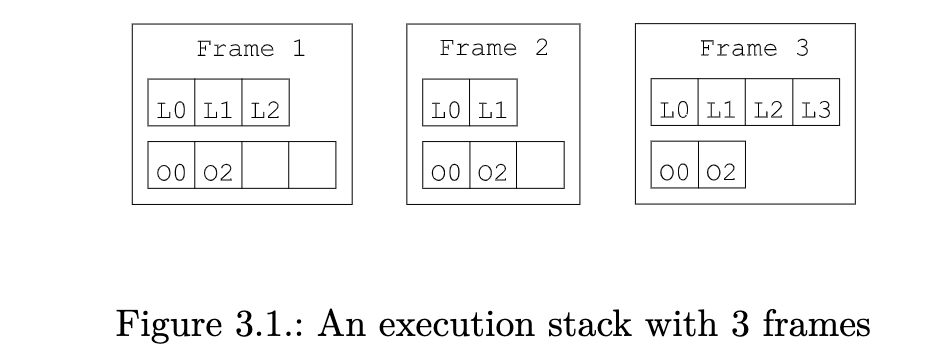

When it is created, a frame is initialized with an empty stack, and its local variables are initialized with the target object this (for non static methods) and with the method’s arguments. For instance, calling the method a.equals(b) creates a frame with an empty stack and with the first two local variables initialized to a and b (other local variables are uninitialized).

当它被创建时，一个栈帧被初始化为一个空栈，其局部变量被初始化为目标对象 this（对于非静态方法）和方法的参数。例如，调用方法 a.equals(b) 会创建一个空栈的栈帧，其前两个局部变量被初始化为 a 和 b（其他局部变量未被初始化）。

Each slot in the local variables and operand stack parts can hold any Java value, except long and double values. These values require two slots. This complicates the management of local variables: for instance the ith method argument is not necessarily stored in local variable i. For example, calling Math.max(1L, 2L) creates a frame with the 1L value in the first two local variable slots, and with the value 2L in the third and fourth slots.

**局部变量和操作数堆栈部分的每个槽可以容纳任何 Java 值，除了 long 和 double 值。这些值需要两个槽位**。例如，调用 Math.max(1L, 2L) 会创建一个栈帧，在前两个局部变量槽中有 1L 值，在第三和第四个槽中有 2L 值。

#### 3.1.2 Bytecode instructions
A bytecode instruction is made of an opcode that identifies this instruction,
and of a fixed number of arguments:

一个字节码指令是由一个操作码组成的，这个操作码可以识别这个指令。

+ The opcode is an unsigned byte value – hence the bytecode name - and is identified by a mnemonic symbol. For example the opcode value 0 is designed by the mnemonic symbol NOP, and corresponds to the instruction that does nothing.
+ The arguments are static values that define the precise instruction behavior. They are given just after the opcode. For instance the GOTO label instruction, whose opcode value is 167, takes as argument label, a label that designates the next instruction to be executed. Instruction arguments must not be confused with instruction operands: argument values are statically known and are stored in the compiled code, while operand values come from the operand stack and are known only at runtime.
+ **操作码是一个无符号的字节值--因此被称为字节码--并由一个助记符标识**。例如，操作码值 0 是由记忆符号 NOP 设计的，它对应于不做任何事情的指令。
+ 参数是定义精确指令行为的静态值。它们就在操作码的后面。例如，操作码为 167 的 GOTO 标签指令，其参数 label 是一个指定下一条指令的标签，将被执行。指令参数不能与指令操作数相混淆：参数值是静态已知的，存储在编译后的代码中，而操作数来自操作数堆栈，只有在运行时才知道。

The bytecode instructions can be divided in two categories: a small set of instructions is designed to transfer values from the local variables to the operand stack, and vice versa; the other instructions only act on the operand stack: they pop some values from the stack, compute a result based on these values, and push it back on the stack.

字节码指令可以分为两类：**一小部分指令被设计用来将数值从局部变量转移到操作数栈**，反之亦然；**其他指令只作用于操作数栈**：它们从栈中取出一些数值，根据这些数值计算出一个结果，并将其推回栈。

The ILOAD, LLOAD, FLOAD, DLOAD, and ALOAD instructions read a local variable and push its value on the operand stack. They take as argument the index i of the local variable that must be read. ILOAD is used to load a boolean, byte, char, short, or int local variable. LLOAD, FLOAD and DLOAD are used to load a long, float or double value, respectively (LLOAD and DLOAD actually load the two slots i and i +1). Finally ALOAD is used to load any non primitive value, i.e. object and array references. Symmetrically the ISTORE, LSTORE, FSTORE, DSTORE and ASTORE instructions pop a value from the operand stack and store it in a local variable designated by its index i.

ILOAD, LLOAD, FLOAD, DLOAD, 和 ALOAD 指令读取一个局部变量并将其值推到操作数栈上。它们把必须读取的局部变量的索引 i 作为参数。ILOAD 用于加载一个布尔值、字节、char、short 或 int 的局部变量。LLOAD、FLOAD 和 DLOAD 分别用来加载一个长的、浮动的或双倍的值（LOAD 和 DLOAD 实际上是加载两个槽 i 和 i+1）。最后 ALOAD 用于加载任何非原始值，即对象和数组引用。对称地，STORE、LSTORE、FSTORE、DSTORE 和 ASTORE 指令从操作数堆栈中弹出一个值，并将其存储在由其索引 i 指定的局部变量中。

As you can see the xLOAD and xSTORE instructions are typed (in fact, as you will see below, almost all instructions are typed). This is used to ensure that no illegal conversion is done. Indeed it is illegal to store a value in a local variable and then to load it with a different type. For instance the ISTORE 1 ALOAD 1 sequence is illegal – it would allow to store an arbitrary memory address in local variable 1, and to convert this address to an object reference! It is however perfectly legal to store in a local variable a value whose type differ from the type of the current value stored in this local variable. This means that the type of a local variable, i.e. the type of the value stored in this local variable, can change during the execution of a method.

正如你所看到的，xLOAD 和 xSTORE 指令是类型化的（事实上，正如你将在下面看到的，几乎所有指令都是类型化的）。这是为了确保不做非法转换。事实上，将一个值存储在一个局部变量中，然后用不同的类型加载它是非法的。例如， ISTORE 1 ALOAD 1 序列是非法的--它允许在局部变量 1 中存储一个任意的内存地址，并将这个地址转换为一个对象引用！但是，在局部变量 1 中存储数据是完全合法的。然而，在局部变量中存储一个数值是完全合法的，其类型与存储在该局部变量中的当前数值的类型不同。这意味着局部变量的类型，即存储在这个局部变量中的值的类型，可以在一个方法的执行过程中改变。

As said above, all other bytecode instructions work on the operand stack only. They can be grouped in the following categories (see appendix A.1): 

如上所述，所有其他字节码指令只在操作数栈上工作。它们可以被归为以下几类（见附录A.1）。

+ **Stack**
    These instructions are used to manipulate values on the stack: POP pops the value on top of the stack, DUP pushes a copy of the top stack value, SWAP pops two values and pushes them in the reverse order, etc. (这些指令是用来操作堆栈上的值的。POP 弹出堆栈顶部的值，DUP 推入堆栈顶部值的副本，SWAP 弹出两个值并按相反顺序推入，等等。)
+ **Constants** 
    These instructions push a constant value on the operand stack: ACONST_NULL pushes null, ICONST_0 pushes the int value 0, FCONST_0 pushes 0f, DCONST_0 pushes 0d, BIPUSH b pushes the byte value b, SIPUSH s pushes the short value s, LDC cst pushes the arbitrary int, float, long, double, String, or class1 constant cst, etc. (这些指令将一个常量值推到操作数栈上。ACONST_NULL 推送 null，ICONST_0 推送 int 值 0，FCONST_0 推送 0f，DCONST_0 推送 0d，BIPUSH b 推送字节值 b，SIPUSH s 推送短值 s，LDC cst 推送任意的 int、float、long、double、String 或class1 常量 cst，等等。)
+ **Arithmetic and logic** 
    These instructions pop numeric values from the operand stack combine them and push the result on the stack. They do not have any argument. xADD, xSUB, xMUL, xDIV and xREM correspond to the +, -, *, / and % operations, where x is either I, L, F or D. Similarly there are other instructions corresponding to <<, >>, >>>, |, & and ^, for int and long values.  
    (这些指令从操作数堆栈中弹出数值，将其合并，并将结果推到堆栈上。xADD、xSUB、xMUL、xDIV 和 xREM 对应于 +、-、*、/ 和 % 操作，其中 x 是 I、L、F 或 D。同样，还有其他指令对应于 <<、>>、>>、|、& 和 ^，用于 int 和 long 值。)
+ **Casts** 
    These instructions pop a value from the stack, convert it to another type, and push the result back. They correspond to cast expressions in Java. I2F, F2D, L2D, etc. convert numeric values from one numeric type to another. CHECKCAST t converts a reference value to the type t. Objects These instructions are used to create objects, lock them, test their type, etc. For instance the NEW type instruction pushes a new object of type type on the stack (where type is an internal name). (这些指令从堆栈中取出一个值，将其转换为另一种类型，并将结果推回。它们对应于 Java 中的转换表达式。I2F, F2D, L2D 等指令将数字值从一种数字类型转换为另一种。CHECKCAST t 将一个引用值转换为类型 t。 对象这些指令用于创建对象，锁定对象，测试其类型等。例如，NEW type 指令在堆栈上推送一个新的 type 类型的对象（其中 type 是一个内部名称）。)
+ **Fields** 
    These instructions read or write the value of a field. GETFIELD owner name desc pops an object reference, and pushes the value of its name field. PUTFIELD owner name desc pops a value and an object reference, and stores this value in its name field. In both cases the object must be of type owner, and its field must be of type desc. GETSTATIC and PUTSTATIC are similar instructions, but for static fields. (这些指令读取或写入一个字段的值。GETFIELD owner name desc 弹出一个对象引用，并推送其 name 字段的值。PUTFIELD owner name desc 弹出一个值和一个对象引用，并将这个值存储在它的 name 字段中。在这两种情况下，对象必须是所有者类型，其字段必须是 Desc 类型。GETSTATIC 和 PUTSTATIC 是类似的指令，但用于静态字段。)
+ **Methods** 
    These instructions invoke a method or a constructor. They pop as many values as there are method arguments, plus one value for the target object, and push the result of the method invocation. INVOKEVIRTUAL owner name desc invokes the name method defined in class owner, and whose method descriptor is desc. INVOKESTATIC is used for static methods, INVOKESPECIAL for private methods and constructors, and INVOKEINTERFACE for methods defined in interfaces. Finally, for Java 7 classes, INVOKEDYNAMIC is used for the new dynamic method invocation mechanism. (这些指令调用一个方法或一个构造函数。它们弹出与方法参数相同数量的值，加上目标对象的一个值，并推送方法调用的结果。INVOKEVIRTUAL owner name desc 调用定义在类 owner 中的 name 方法，其方法描述符为 desc。INVOKESTATIC 用于静态方法，INVOKESPECIAL 用于私有方法和构造函数，INVOKEINTERFACE 用于接口中定义的方法。最后，对于 Java 7 类，INVOKEDYNAMIC 被用于新的动态方法调用机制。)
+ **Arrays** 
    These instructions are used to read and write values in arrays. The xALOAD instructions pop an index and an array, and push the value of the array element at this index. The xASTORE instructions pop a value, an index and an array, and store this value at that index in the array. Here x can be I, L, F, D or A, but also B, C or S. (这些指令用于读取和写入数组中的值。xALOAD 指令弹出一个索引和一个数组，并推送该索引处的数组元素的值。xASTORE 指令弹出一个值，一个索引和一个数组，并将这个值存储在数组的该索引处。这里 x 可以是 I、L、F、D 或 A，也可以是 B、C 或 S。)
+ **Jumps**
    These instructions jump to an arbitrary instruction if some condition is true, or unconditionally. They are used to compile if, for, do, while, break and continue instructions. For instance IFEQ label pops an int value from the stack, and jumps to the instruction designed by label if this value is 0 (otherwise execution continues normally to the next instruction). Many other jump instructions exist, such as IFNE or IFGE. Finally TABLESWITCH and LOOKUPSWITCH correspond to the switch Java instruction. (如果某些条件为真，或无条件，这些指令会跳转到一个任意的指令。它们被用来编译 if、for、do、while、break 和 continue 指令。例如，IFEQ label 从堆栈中弹出一个 int 值，如果这个值为 0，则跳转到 label 设计的指令（否则继续正常执行到下一条指令）。还有许多其他的跳转指令，如 IFNE 或 IFGE。最后 TABLESWITCH 和 LOOKUPSWITCH 对应于切换 Java 指令。)
+ **Return** 
    Finally the xRETURN and RETURN instructions are used to terminate the execution of a method and to return its result to the caller. RETURN is used for methods that return void, and xRETURN for the other methods. (最后， xRETURN 和 RETURN 指令被用来终止一个方法的执行，并将其结果返回给调用者。RETURN 用于返回void 的方法，而 xRETURN 用于其他方法。)

#### 3.1.3 Examples
Lets look at some basic examples to get a more concrete sense of how bytecode instructions work. Consider the following bean class:

让我们看看一些基本的例子，以便更具体地了解字节码指令的工作原理。考虑一下下面这个 bean 类。

```java
    package pkg;
    public class Bean {
        private int f;
        public int getF() {
            return this.f;
        }
        public void setF(int f) {
            this.f = f;
        }
    }
```

The bytecode of the getter method is:

```java
    ALOAD 0
    GETFIELD pkg/Bean f I
    IRETURN
```

The first instruction reads the local variable 0, which was initialized to this during the creation of the frame for this method call, and pushes this value on the operand stack. The second instruction pops this value from the stack, i.e. this, and pushes the f field of this object, i.e. this.f. The last instruction pops this value from the stack, and returns it to the caller. The successive states of the execution frame for this method are shown in Figure 3.2.

第一条指令读取局部变量 0，它在为这个方法调用创建框架时被初始化为 this，并将这个值推到操作数栈上。第二条指令从堆栈中弹出这个值，即 this，并推送这个对象的 f 字段，即 this.f。最后一条指令从堆栈中弹出这个值，并将其返回给调用者。这个方法的执行框架的连续状态如图 3.2 所示。

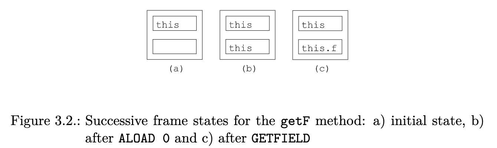

The bytecode of the setter method is:

```java
    ALOAD 0
    ILOAD 1
    PUTFIELD pkg/Bean f I
    RETURN
```

The first instruction pushes this on the operand stack, as before. The second instruction pushes the local variable 1, which was initialized with the f argument value during the creation of the frame for this method call. The third instruction pops these two values and stores the int value in the f field of the referenced object, i.e. in this.f. The last instruction, which is implicit in the source code but which is mandatory in the compiled code, destroys the current execution frame and returns to the caller. The successive states of the execution frame for this method are shown in Figure 3.3.

第一条指令和之前一样，将其推到操作数栈中。第二条指令推送局部变量 1，该变量在为这个方法调用创建框架时被初始化为 f 参数值。第三条指令弹出这两个值，并将 int 值存储在被引用对象的 f 字段中，即存储在 this.f 中。最后一条指令，在源代码中是隐含的，但在编译后的代码中是必须的，它销毁了当前的执行框架并返回给调用者。这个方法的执行框架的连续状态如图 3.3 所示。

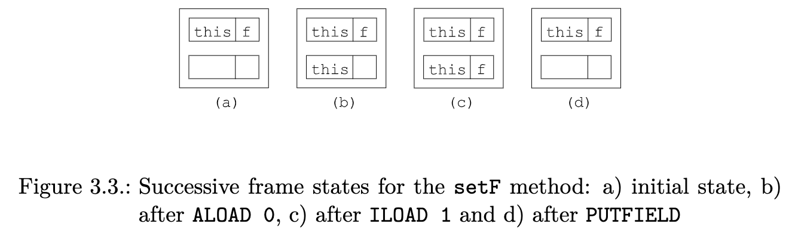

The Bean class also has a default public constructor which is generated by the compiler, since no explicit constructor was defined by the programmer. This default public constructor is generated as Bean() { super(); }. The bytecode of this constructor is the following:

Bean 类也有一个默认的公共构造函数，它是由编译器生成的，因为程序员没有定义明确的构造函数。这个默认的公共构造函数被生成为 Bean() { super(); }。这个构造函数的字节码如下。

```java
    ALOAD 0
    INVOKESPECIAL java/lang/Object <init> ()V
    RETURN
```

The first instruction pushes this on the operand stack. The second instruction pops this value from the stack, and calls the <init> method defined in the Object class. This corresponds to the super() call, i.e. a call to the constructor of the super class, Object. You can see here that constructors are named differently in compiled and source classes: in compiled classes they are always named <init>, while in source classes they have the name of the class in which they are defined. Finally the last instruction returns to the caller.

第一条指令把这个值推到操作数栈上。第二条指令将这个值从堆栈中弹出，并调用 Object 类中定义的<init> 方法。这与 super() 调用相对应，即调用超类 Object 的构造函数。在这里你可以看到构造函数在编译类和源码类中的命名是不同的：在编译类中它们总是被命名为<init>，而在源码类中它们的名字是它们被定义的类。最后一条指令返回给调用者。

Now let us consider a slightly more complex setter method:

现在让我们考虑一个稍微复杂的 setter 方法。

```java
    public void checkAndSetF(int f) {
        if (f >= 0) {
            this.f = f;
        } else {
            throw new IllegalArgumentException();
        }
    }
```

The bytecode for this new setter method is the following:

这个新的 setter 方法的字节码如下。

```java
        ILOAD 1
        IFLT label
        ALOAD 0
        ILOAD 1
        PUTFIELD pkg/Bean f I
        GOTO end
    label:
        NEW java/lang/IllegalArgumentException
        DUP
        INVOKESPECIAL java/lang/IllegalArgumentException <init> ()V
        ATHROW
    end:
        RETURN
```

The first instruction pushes the local variable 1, initialized to f, on the operand stack. The IFLT instruction pops this value from the stack, and compares it to 0. If it is Less Than (LT) 0, it jumps to the instruction designated by the label label, otherwise it does nothing and the execution continues to the next instruction. The next three instructions are the same instructions as in the setF method. The GOTO instruction unconditionally jumps to the instruction designated by the end label, which is the RETURN instruction. The instructions between the label and end labels create and throw an exception: the NEW instruction creates an exception object and pushes it on the operand stack. The DUP instruction duplicates this value on the stack. The INVOKESPECIAL instruction pops one of these two copies and calls the exception constructor on it. Finally the ATHROW instruction pops the remaining copy and throws it as an exception (so the execution does not continue to the next instruction).

第一条指令将初始化为 f 的局部变量 1 推到操作栈上。IFLT 指令将这个值从堆栈中弹出，并与 0 进行比较，如果小于（LT）0，则跳转到标签 label 指定的指令，否则不做任何操作，继续执行下一条指令。接下来的三条指令与 setF 方法中的指令相同。GOTO 指令无条件地跳转到 end label 指定的指令，也就是 RETURN 指令。在标签和结束标签之间的指令创建并抛出一个异常：NEW 指令创建一个异常对象并将其推到操作数堆栈中。DUP 指令将这个值复制到堆栈上。INVOKESPECIAL 指令弹出这两个副本中的一个，并对其调用异常构造函数。最后，ATHROW 指令弹出剩余的副本并将其作为一个异常抛出（因此执行不会继续到下一条指令）。

#### 3.1.4 Exception handlers
There is no bytecode instruction to catch exceptions: instead the bytecode of a method is associated with a list of exception handlers that specify the code that must be executed when an exception is thrown in a given part of a method. An exception handler is similar to a try catch block: it has a range, which is a sequence of instructions that corresponds to the content of the try block, and a handler, which corresponds to the content of the catch block. The range is specified by a start and end labels, and the handler with a start label. For example the source code below:

没有字节码指令来捕获异常：相反，一个方法的字节码与一个异常处理程序的列表相关联，这些异常处理程序指定了在一个方法的特定部分抛出异常时必须执行的代码。异常处理程序类似于 try catch 块：它有一个范围，是与 try 块内容相对应的指令序列，还有一个处理程序，与 catch 块的内容相对应。范围由开始和结束标签指定，而处理程序由开始标签指定。例如，下面的源代码。

```java
    public static void sleep(long d) {
        try {
            Thread.sleep(d);
        } catch (InterruptedException e) {
            e.printStackTrace();
        }
    }
```

can be compiled into:

```java
    TRYCATCHBLOCK try catch catch java/lang/InterruptedException
    try:
        LLOAD 0
        INVOKESTATIC java/lang/Thread sleep (J)V
        RETURN
    catch:
        INVOKEVIRTUAL java/lang/InterruptedException printStackTrace ()V
        RETURN
```

The code between the try and catch labels corresponds to the try block, while the code after the catch label corresponds to the catch block. The TRYCATCHBLOCK line specifies an exception handler that covers the range between the try and catch labels, with a handler starting at the catch label, and for exceptions whose class is a subclass of InterruptedException. This means that if such an exception is thrown anywhere between try and catch the stack is cleared, the exception is pushed on this empty stack, and execution continues at catch.

try 和 catch 标签之间的代码对应于 try 块，而 catch 标签之后的代码对应于 catch 块。TRYCATCHBLOCK 行指定了一个异常处理程序，它覆盖了 try 标签和 catch 标签之间的范围，处理程序从 catch 标签开始，并且是针对类为 InterruptedException 的子类的异常。这意味着如果这样的异常在 try 和 catch 之间的任何地方被抛出，堆栈就会被清空，异常被推到这个空堆栈上，然后在 catch 处继续执行。

#### 3.1.5 Frames
Classes compiled with Java 6 or higher contain, in addition to bytecode instructions, a set of stack map frames that are used to speed up the class verification process inside the Java Virtual Machine. A stack map frame gives the state of the execution frame of a method at some point during its execution. More precisely it gives the type of the values that are contained in each local variable slot and in each operand stack slot just before some specific bytecode instruction is executed.

用 Java 6 或更高版本编译的类，除了字节码指令外，还包含一组栈映射帧，用于加快 Java 虚拟机内的类验证过程。栈映射帧给出了一个方法在执行过程中的某个时刻的执行框架的状态。更准确地说，它给出了在执行某些特定的字节码指令之前，每个局部变量槽和每个操作数栈槽中所包含的值的类型。

For example, if we consider the getF method of the previous section, we can define three stack map frames giving the state of the execution frame just before ALOAD, just before GETFIELD, and just before IRETURN. These three stack map frames correspond to the three cases shown in Figure 3.2 and can be described as follows, where the types between the first square brackets correspond to the local variables, and the others to the operand stack:

例如，如果我们考虑上一节的 getF 方法，我们可以定义三个栈映射帧，给出执行帧的状态，在 ALOAD 之前，在 GETFIELD 之前，在 IRETURN 之前。这三个栈映射帧对应于图 3.2 所示的三种情况，可以描述如下，其中第一个方括号之间的类型对应于局部变量，其他类型对应于操作数栈。

```java
    State of the execution frame before Instruction
    [pkg/Bean] [] ALOAD 0
    [pkg/Bean] [pkg/Bean] GETFIELD
    [pkg/Bean] [I] IRETURN
```

We can do the same for the checkAndSetF method:

```java
    State of the execution frame before Instruction
    [pkg/Bean I] [] ILOAD 1
    [pkg/Bean I] [I] IFLT label
    [pkg/Bean I] [] ALOAD 0
    [pkg/Bean I] [pkg/Bean] ILOAD 1
    [pkg/Bean I] [pkg/Bean I] PUTFIELD
    [pkg/Bean I] [] GOTO end
    [pkg/Bean I] [] label :
    [pkg/Bean I] [] NEW
    [pkg/Bean I] [Uninitialized(label)] DUP
    [pkg/Bean I] [Uninitialized(label) Uninitialized(label)] INVOKESPECIAL
    [pkg/Bean I] [java/lang/IllegalArgumentException] ATHROW
    [pkg/Bean I] [] end :
    [pkg/Bean I] [] RETURN
```

This is similar to the previous method, except for the Uninitialized(label) type. This is a special type that is used only in stack map frames, and that designates an object whose memory has been allocated but whose constructor has not been called yet. The argument designates the instruction that created this object. The only possible method that can be called on a value of this type is a constructor. When it is called, all the occurrences of this type in the frame are replaced with the real type, here IllegalArgumentException. Stack map frames can use three other special types: UNINITIALIZED_THIS is the initial type of local variable 0 in constructors, TOP corresponds to an undefined value, and NULL corresponds to null.

这与前面的方法类似，除了 Uninitialized(label) 类型。这是一个特殊的类型，只在栈映射帧中使用，它指定了一个内存已被分配但其构造函数尚未被调用的对象。该参数指定了创建该对象的指令。唯一可以在这种类型的值上调用的方法是一个构造函数。当它被调用时，帧中所有该类型的出现都被替换为真正的类型，这里是 IllegalArgumentException。栈映射帧可以使用其他三种特殊类型。UNINITIALIZED_THIS 是构造函数中局部变量 0 的初始类型，TOP 对应的是未定义的值，NULL 对应的是空。

As said above, starting from Java 6, compiled classes contain, in addition to bytecode, a set of stack map frames. In order to save space, a compiled method does not contain one frame per instruction: in fact it contains only the frames for the instructions that correspond to jump targets or exception handlers, or that follow unconditional jump instructions. Indeed the other frames can be easily and quickly inferred from these ones.

如上所述，从 Java 6 开始，编译后的类除了字节码之外，还包含一组栈映射帧。为了节省空间，编译后的方法不包含每条指令的栈帧：**事实上，它只包含对应于跳转目标或异常处理程序的指令的栈帧，或者跟随无条件跳转指令的栈帧**。事实上，其他的栈帧可以很容易和快速地从这些栈帧中推断出来。

In the case of the checkAndSetF method, this means that only two frames are stored: one for the NEW instruction, because it is the target of the IFLT instruction, but also because it follows the unconditional jump GOTO instruction, and one for the RETURN instruction, because it is the target of the GOTO instruction, and also because it follows the “unconditional jump” ATHROW instruction.

在 checkAndSetF 方法中，这意味着**只有两个帧被存储**：**一个是 NEW 指令**，因为它是 IFLT 指令的目标，但也因为它紧随无条件跳转的 GOTO 指令；**一个是 RETURN 指令**，因为它是 GOTO 指令的目标，也因为它紧随 "无条件跳转" 的 ATHROW 指令。

In order to save even more space, each frame is compressed by storing only its difference compared to the previous frame, and the initial frame is not stored at all, because it can easily be deduced from the method parameter types. In the case of the checkAndSetF method the two frames that must be stored are equal and are equal to the initial frame, so they are stored as the single byte value designated by the F_SAME mnemonic. These frames can be represented just before their associated bytecode instruction. This gives the final bytecode for the checkAndSetF method:

为了节省更多的空间，每一帧都被压缩，只存储它与前一帧的差异，而初始帧根本不被存储，因为它很容易从方法的参数类型中推断出来。在 checkAndSetF 方法中，必须存储的两个帧是相等的，并且与初始帧相等，所以它们被存储为 F_SAME 助记符指定的单字节值。这些帧可以在其相关的字节码指令之前表示。这就给出了 checkAndSetF 方法的最终字节码。

```java
        ILOAD 1
        IFLT label
        ALOAD 0
        ILOAD 1
        PUTFIELD pkg/Bean f I
        GOTO end
    label:
        F_SAME
        NEW java/lang/IllegalArgumentException
        DUP
        INVOKESPECIAL java/lang/IllegalArgumentException <init> ()V
        ATHROW
    end:
        F_SAME
        RETURN
```

### 3.2 Interfaces and components

#### 3.2.1 Presentation
```java
    abstract class MethodVisitor { // public accessors ommited
        MethodVisitor(int api);
        MethodVisitor(int api, MethodVisitor mv);
        AnnotationVisitor visitAnnotationDefault();
        AnnotationVisitor visitAnnotation(String desc, boolean visible);
        AnnotationVisitor visitParameterAnnotation(int parameter, String desc, boolean visible);
        void visitAttribute(Attribute attr);
        void visitCode();
        void visitFrame(int type, int nLocal, Object[] local, int nStack, Object[] stack);
        void visitInsn(int opcode);
        void visitIntInsn(int opcode, int operand);
        void visitVarInsn(int opcode, int var);
        void visitTypeInsn(int opcode, String desc);
        void visitFieldInsn(int opc, String owner, String name, String desc);
        void visitMethodInsn(int opc, String owner, String name, String desc);
        void visitInvokeDynamicInsn(String name, String desc, Handle bsm, Object... bsmArgs);
        void visitJumpInsn(int opcode, Label label);
        void visitLabel(Label label);
        void visitLdcInsn(Object cst);
        void visitIincInsn(int var, int increment);
        void visitTableSwitchInsn(int min, int max, Label dflt, Label[] labels);
        void visitLookupSwitchInsn(Label dflt, int[] keys, Label[] labels);
        void visitMultiANewArrayInsn(String desc, int dims);
        void visitTryCatchBlock(Label start, Label end, Label handler, String type);
        void visitLocalVariable(String name, String desc, String signature, Label start, Label end, int index);
        void visitLineNumber(int line, Label start);
        void visitMaxs(int maxStack, int maxLocals);
        void visitEnd();
    }

    // Figure 3.4.: The MethodVisitor class
```

The ASM API for generating and transforming compiled methods is based on the MethodVisitor abstract class (see Figure 3.4), which is returned by the ClassVisitor’s visitMethod method. In addition to some methods related to annotations and debug information, which are explained in the next chapter, this class defines one method per bytecode instruction category, based on the number and type of arguments of these instructions (these categories do not correspond to the ones presented in section 3.1.2). These methods must be called in the following order (with some additional constraints specified in the Javadoc of the MethodVisitor interface):

用于生成和转换编译方法的 ASM API 是基于 MethodVisitor 抽象类的（见图 3.4），它由 ClassVisitor 的 visitMethod 方法返回。除了一些与注解和调试信息有关的方法（将在下一章解释），这个类还根据这些指令的参数数量和类型，为每个字节码指令类别定义了一个方法（这些类别与 3.1.2 节中介绍的类别不一致）。这些方法必须按照以下顺序调用（在 MethodVisitor 接口的 Javadoc 中指定了一些额外的约束）。

```
    visitAnnotationDefault?
    ( visitAnnotation | visitParameterAnnotation | visitAttribute )*
    ( visitCode
        ( visitTryCatchBlock | visitLabel | visitFrame | visitXxxInsn |
            visitLocalVariable | visitLineNumber )*
        visitMaxs )?
    visitEnd
```

This means that annotations and attributes, if any, must be visited first, followed by the method’s bytecode, for non abstract methods. For these methods the code must be visited in sequential order, between exactly one call to visitCode and exactly one call to visitMaxs.

这意味着对于非抽象方法，必须先访问注释和属性（如果有的话），然后是方法的字节码。对于这些方法，必须按顺序访问代码，在对 visitCode 的一次调用和对 visitMaxs 的一次调用之间。

The visitCode and visitMaxs methods can therefore be used to detect the start and end of the method’s bytecode in a sequence of events. Like for classes, the visitEnd method must be called last, and is used to detect the end of a method in a sequence of events.

因此，visitCode 和 visitMaxs 方法可以用来检测事件序列中方法的字节码的开始和结束。与类一样， visitEnd 方法必须最后调用，用于检测事件序列中方法的结束。

The ClassVisitor and MethodVisitor classes can be combined in order to generate complete classes:

ClassVisitor 和 MethodVisitor 类可以被结合起来，以便生成完整的类。

```java
    ClassVisitor cv = ...;
    cv.visit(...);
    MethodVisitor mv1 = cv.visitMethod(..., "m1", ...);
    mv1.visitCode();
    mv1.visitInsn(...);
    ...
    mv1.visitMaxs(...);
    mv1.visitEnd();
    MethodVisitor mv2 = cv.visitMethod(..., "m2", ...);
    mv2.visitCode();
    mv2.visitInsn(...);
    ...
    mv2.visitMaxs(...);
    mv2.visitEnd();
    cv.visitEnd();
```

Note that it is not necessary to finish one method in order to start visiting another one. In fact MethodVisitor instances are completely independent and can be used in any order (as long as cv.visitEnd() has not been called):

请注意，没有必要在完成一个方法后再开始访问另一个方法。事实上，MethodVisitor 实例是完全独立的，可以以任何顺序使用（只要 cv.visitEnd() 没有被调用）。

```java
    ClassVisitor cv = ...;
    cv.visit(...);
    MethodVisitor mv1 = cv.visitMethod(..., "m1", ...);
    mv1.visitCode();
    mv1.visitInsn(...);
    ...
    MethodVisitor mv2 = cv.visitMethod(..., "m2", ...);
    mv2.visitCode();
    mv2.visitInsn(...);
    ...
    mv1.visitMaxs(...);
    mv1.visitEnd();
    ...
    mv2.visitMaxs(...);
    mv2.visitEnd();
    cv.visitEnd();
```

ASM provides three core components based on the MethodVisitor API to generate and transform methods: (ASM 提供了三个基于 MethodVisitor API 的核心组件来生成和转换方法。)
+ The ClassReader class parses the content of compiled methods and calls the corresponding methods on the MethodVisitor objects returned by the ClassVisitor passed as argument to its accept method. (ClassReader 类解析已编译方法的内容，并在作为参数传递给其接受方法的 ClassVisitor 返回的 MethodVisitor 对象上调用相应的方法。)
+ The ClassWriter’s visitMethod method returns an implementation of the MethodVisitor interface that builds compiled methods directly in binary form. (ClassWriter 的 visitMethod 方法返回一个 MethodVisitor 接口的实现，直接以二进制形式构建编译的方法。)
+ The MethodVisitor class delegates all the method calls it receives to another MethodVisitor instance. It can be seen as an event filter. (MethodVisitor 类将它收到的所有方法调用委托给另一个 MethodVisitor 实例。它可以被看作是一个事件过滤器。)

**ClassWriter options**
As we have seen in section 3.1.5, computing the stack map frames for a method is not very easy: you have to compute all the frames, find the frames that correspond to jump targets or that follow unconditional jumps, and finally compress these remaining frames. Likewise, computing the size of the local variables and operand stack parts for a method is easier but still not very easy.

正如我们在第 3.1.5 节中所看到的，计算一个方法的栈映射帧并不容易：你必须计算所有的栈帧，找到对应于跳转目标或无条件跳转的帧，最后压缩这些剩余的帧。同样地，计算一个方法的局部变量和操作数堆栈部分的大小也比较容易，但仍然不是很容易。

Hopefully ASM can compute this for you. When you create a ClassWriter you can specify what must be automatically computed:

希望 ASM 可以为你计算这个。当你创建一个 ClassWriter 时，你可以指定必须自动计算的内容。

+ with **new ClassWriter(0)** nothing is automatically computed. You have to compute yourself the frames and the local variables and operand stack sizes.
+ with **new ClassWriter(ClassWriter.COMPUTE_MAXS)** the sizes of the local variables and operand stack parts are computed for you. You must still call visitMaxs, but you can use any arguments: they will be ignored and recomputed. With this option you still have to compute the frames yourself.
+ with **new ClassWriter(ClassWriter.COMPUTE_FRAMES)** everything is computed automatically. You don’t have to call visitFrame, but you must still call visitMaxs (arguments will be ignored and recomputed).

+ 如果使用 new ClassWriter(0)，没有什么是自动计算的。你必须自己计算框架、局部变量和操作数栈的大小。
+ 使用 new ClassWriter(ClassWriter.COMPUTE_MAXS)，局部变量和操作数堆栈部分的大小会为你计算。你仍然必须调用 visitMaxs，但你可以使用任何参数：它们将被忽略并重新计算。有了这个选项，你仍然必须自己计算栈帧。
+ 使用 new ClassWriter(ClassWriter.COMPUTE_FRAMES) 一切都会自动计算。你不必调用visitFrame，但你仍然必须调用 visitMaxs（参数将被忽略并重新计算）。

Using these options is convenient but this has a cost: the COMPUTE_MAXS option makes a ClassWriter 10% slower, and using the COMPUTE_FRAMES option makes it two times slower. This must be compared to the time it would take to compute this yourself: in specific situations there are often easier and faster algorithms for computing this, compared to the algorithm used in ASM, which must handle all cases.

使用这些选项很方便，但这也是有代价的：COMPUTE_MAXS 选项使 ClassWriter 慢了 10%，而使用COMPUTE_FRAMES 选项使它慢了 2 倍。这必须与自己计算的时间相比较：在特定的情况下，通常有更容易和更快的算法来计算这个问题，而 ASM 中使用的算法必须处理所有情况。

Note that if you choose to compute the frames yourself, you can let the ClassWriter class do the compression step for you. For this you just have to visit your uncompressed frames with visitFrame(F_NEW, nLocals, locals, nStack, stack), where nLocals and nStack are the number of locals and the operand stack size, and locals and stack are arrays containing the corresponding types (see the Javadoc for more details).

注意，如果你选择自己计算栈帧，你可以让 ClassWriter 类为你做压缩步骤。为此你只需要用 visitFrame(F_NEW, nLocals, locals, nStack, stack) 访问你未压缩的栈帧，其中 nLocals 和 nStack 是 locals 的数量和操作数栈的大小，locals 和 stack 是包含相应类型的数组（更多细节见 Javadoc）。

Note also that, in order to compute frames automatically, it is sometimes necessary to compute the common super class of two given classes. By default the ClassWriter class computes this, in the getCommonSuperClass method, by loading the two classes into the JVM and by using the reflection API. This can be a problem if you are generating several classes that reference each other, because the referenced classes may not yet exist. In this case you can override the getCommonSuperClass method to solve this problem.

还要注意的是，为了自动计算框架，有时需要计算两个给定类的共同超类。默认情况下，ClassWriter 类在getCommonSuperClass 方法中，通过将两个类加载到 JVM 并使用反射 API 来计算。如果你正在生成几个相互引用的类，这可能是一个问题，因为被引用的类可能还不存在。在这种情况下，你可以重写 getCommonSuperClass 方法来解决这个问题。

#### 3.2.2 Generating methods
The bytecode of the getF method defined in section 3.1.3 can be generated with the following method calls, if mv is a MethodVisitor:

如果 mv 是一个 MethodVisitor，3.1.3 节中定义的 getF 方法的字节码可以通过以下方法调用生成。

```java
    mv.visitCode();
    mv.visitVarInsn(ALOAD, 0);
    mv.visitFieldInsn(GETFIELD, "pkg/Bean", "f", "I");
    mv.visitInsn(IRETURN);
    mv.visitMaxs(1, 1);
    mv.visitEnd();
```

The first call starts the bytecode generation. It is followed by three calls that generate the three instructions of this method (as you can see the mapping between the bytecode and the ASM API is quite simple). The call to visitMaxs must be done after all the instructions have been visited. It is used to define the sizes of the local variables and operand stack parts for the execution frame of this method. As we saw in section 3.1.3, these sizes are 1 slot for each part. Finally the last call is used to end the generation of the method.

第一个调用开始生成字节码。接下来是三个调用，生成这个方法的三个指令（你可以看到字节码和 ASM API之间的映射非常简单）。对 visitMaxs 的调用必须在所有指令都被访问过后进行。它被用来定义这个方法的执行框架的局部变量和操作数栈部分的大小。正如我们在 3.1.3 节中所看到的，这些大小是每个部分的 1 个槽。最后，最后一个调用被用来结束方法的生成。

The bytecode of the setF method and of the constructor can be generated in a similar way. A more interesting example is the checkAndSetF method:

setF 方法和构造函数的字节码可以以类似的方式生成。一个更有趣的例子是 checkAndSetF 方法。

```java
    mv.visitCode();
    mv.visitVarInsn(ILOAD, 1);
    Label label = new Label();
    mv.visitJumpInsn(IFLT, label);
    mv.visitVarInsn(ALOAD, 0);
    mv.visitVarInsn(ILOAD, 1);
    mv.visitFieldInsn(PUTFIELD, "pkg/Bean", "f", "I");
    Label end = new Label();
    mv.visitJumpInsn(GOTO, end);
    mv.visitLabel(label);
    mv.visitFrame(F_SAME, 0, null, 0, null);
    mv.visitTypeInsn(NEW, "java/lang/IllegalArgumentException");
    mv.visitInsn(DUP);
    mv.visitMethodInsn(INVOKESPECIAL,
    "java/lang/IllegalArgumentException", "<init>", "()V");
    mv.visitInsn(ATHROW);
    mv.visitLabel(end);
    mv.visitFrame(F_SAME, 0, null, 0, null);
    mv.visitInsn(RETURN);
    mv.visitMaxs(2, 2);
    mv.visitEnd();
```

Between the visitCode and visitEnd calls you can see method calls that map exactly to the bytecode shown at the end of section 3.1.5: one call per instruction, label or frame (the only exceptions are the declaration and construction of the label and end Label objects).

在 visitCode 和 visitEnd 调用之间，你可以看到与 3.1.5 节末尾所示的字节码完全对应的方法调用：每条指令、标签或帧有一个调用（唯一的例外是标签和结束标签对象的声明和构造）。

Note: a Label object designates the instruction that follows the visitLabel call for this label. For example end designates the RETURN instruction, and not the frame that is visited just after, since this is not an instruction. It is perfectly legal to have several labels designating the same instruction, but a label must designate exactly one instruction. In other words it is possible to have successive calls to visitLabel with different labels, but a label used in an instruction must be visited exactly once with visitLabel. A last constraint is that labels can not be shared: each method must have its own labels.

注意：一个 Label 对象指定该标签的 visitLabel 调用后的指令。例如，end 指定 RETURN 指令，而不是紧接着被访问的帧，因为这不是一个指令。有几个标签指定同一个指令是完全合法的，但一个标签必须准确地指定一个指令。换句话说，可以用不同的标签连续调用 visitLabel，但一条指令中使用的标签必须用 visitLabel 访问一次。最后一个约束是，标签不能被共享：每个方法必须有自己的标签。

#### 3.2.3 Transforming methods
You should now have guessed that methods can be transformed like classes, i.e. by using a method adapter that forwards the method calls it receives with some modifications: changing arguments can be used to change individual instructions, not forwarding a received call removes an instruction, and inserting calls between the received ones adds new instructions. The MethodVisitor class provides a basic implementation of such a method adapter, which does nothing else than just forwarding all the method calls it receives.

你现在应该已经猜到了，方法可以像类一样被转换，即通过使用一个方法适配器来转发它收到的方法调用，并进行一些修改：改变参数可以用来改变单个指令，不转发收到的调用会删除一个指令，而在收到的调用之间插入新的指令。MethodVisitor 类提供了这样一个方法适配器的基本实现，它除了转发它所收到的所有方法调用外，没有做别的。

In order to understand how method adapters can be used, let’s consider a very simple adapter that removes the NOP instructions inside methods (they can be removed without problems since they do nothing):

为了理解如何使用方法适配器，让我们考虑一个非常简单的适配器，它可以移除方法中的 NOP 指令（它们可以被移除而没有问题，因为它们什么都不做）。

```java
    public class RemoveNopAdapter extends MethodVisitor {
        public RemoveNopAdapter(MethodVisitor mv) {
            super(ASM4, mv);
        }
        @Override
        public void visitInsn(int opcode) {
            if (opcode != NOP) {
                mv.visitInsn(opcode);
            }
        }
    }
```

This adapter can be used inside a class adapter as follows:

```java
    public class RemoveNopClassAdapter extends ClassVisitor {
        public RemoveNopClassAdapter(ClassVisitor cv) {
            super(ASM4, cv);
        }
        @Override
        public MethodVisitor visitMethod(int access, String name, String desc, String signature, String[] exceptions) {
            MethodVisitor mv;
            mv = cv.visitMethod(access, name, desc, signature, exceptions);
            if (mv != null) {
                mv = new RemoveNopAdapter(mv);
            }
            return mv;
        }
    }
```

In other words the class adapter just builds a method adapter encapsulating the method visitor returned by the next class visitor in the chain, and returns this adapter. The effect is the construction of a method adapter chain that is similar to the class adapter chain (see Figure 3.5).

换句话说，类适配器只是建立了一个方法适配器，封装了链中下一个类访问者返回的方法访问者，并返回这个适配器。其结果是构建了一个与类适配器链类似的方法适配器链（见图 3.5）。

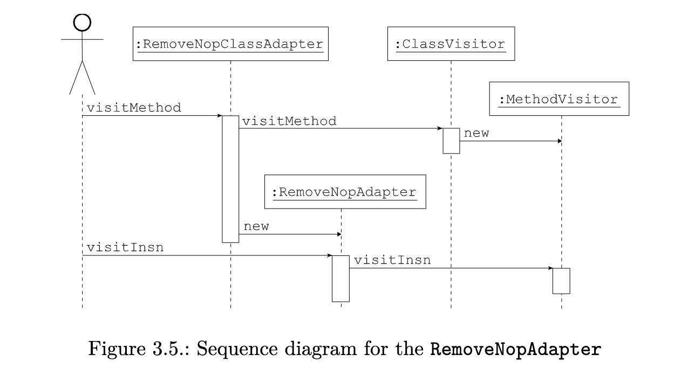

Note however that this is not mandatory: it is perfectly possible to build a method adapter chain that is not similar to the class adapter chain. Each method can even have a different method adapter chain. For instance the class adapter could choose to remove NOPs only in methods and not in constructors. This can be done as follows:

但是请注意，这并不是强制性的：建立一个与类适配器链不相似的方法适配器链是完全可能的。每个方法甚至可以有一个不同的方法适配器链。例如，类适配器可以选择只在方法中而不是构造函数中移除 NOP。这可以按以下方式进行。

```java
    ...
    mv = cv.visitMethod(access, name, desc, signature, exceptions);
    if (mv != null && !name.equals("<init>")) {
        mv = new RemoveNopAdapter(mv);
    }
    ...
```

In this case the adapter chain is shorter for constructors. On the contrary, the adapter chain for constructors could have been longer, with several method adapters chained together created inside visitMethod. The method adapter chain can even have a different topology than the class adapter chain. For instance the class adapter chain could be linear, while the method adapter chain has branches:

在这种情况下，构造函数的适配器链就比较短。相反，构造函数的适配器链可能更长，在 visitMethod 内创建的几个方法适配器链在一起。方法适配器链甚至可以有与类适配器链不同的拓扑结构。例如，类适配器链可以是线性的，而方法适配器链有分支。

```java
    public MethodVisitor visitMethod(int access, String name, String desc, String signature, String[] exceptions) {
        MethodVisitor mv1, mv2;
        mv1 = cv.visitMethod(access, name, desc, signature, exceptions);
        mv2 = cv.visitMethod(access, "_" + name, desc, signature, exceptions);
        return new MultiMethodAdapter(mv1, mv2);
    }
```

Now that we have seen how method adapters can be used and combined inside a class adapter, let’s see how to implement more interesting adapters than RemoveNopAdapter.

现在我们已经看到了方法适配器如何在类适配器中使用和组合，让我们看看如何实现比 RemoveNopAdapter 更有趣的适配器。

#### 3.2.4 Stateless transformations
Let’s suppose we want to measure the time spent in each class of a program. We need to add a static timer field in each class, and we need to add the execution time of each method of this class to this timer field. In other words we want to transform a class such as C:

假设我们想测量一个程序中每个类所花费的时间。我们需要在每个类中添加一个静态的定时器字段，并且我们需要将这个类中每个方法的执行时间添加到这个定时器字段中。换句话说，我们要改造一个诸如 C 的类。

```java
    public class C {
        public void m() throws Exception {
            Thread.sleep(100);
        }
    }
```

into this:

```java
    public class C {
        public static long timer;
        public void m() throws Exception {
            timer -= System.currentTimeMillis();
            Thread.sleep(100);
            timer += System.currentTimeMillis();
        }
    }
```

In order to have an idea of how this can be implemented in ASM, we can compile these two classes and compare the output of TraceClassVisitor on these two versions (either with the default Textifier backend, or with an ASMifier backend). With the default backend we get the following differences (in bold):

为了了解如何在 ASM 中实现这一点，我们可以编译这两个类，并比较 TraceClassVisitor 在这两个版本上的输出（要么使用默认的 Textifier 后端，要么使用 ASMifier 后端）。使用默认的后端，我们得到以下差异（用粗体字表示）。

<pre>
    <b> GETSTATIC C.timer : J </b>
    <b> INVOKESTATIC java/lang/System.currentTimeMillis()J </b>
    <b> LSUB </b>
    <b> PUTSTATIC C.timer : J </b>
     LDC 100
     INVOKESTATIC java/lang/Thread.sleep(J)V
    <b> GETSTATIC C.timer : J </b>
    <b> INVOKESTATIC java/lang/System.currentTimeMillis()J </b>
    <b> LADD </b>
    <b> PUTSTATIC C.timer : J </b>
     RETURN
     MAXSTACK = <b>4</b>
     MAXLOCALS = 1
</pre>

We see that we must add four instructions at the beginning of the method, and four other instructions before the return instruction. We also need to update the maximum operand stack size. The beginning of the method’s code is visited with the visitCode method. We can therefore add the first four instructions by overriding this method in our method adapter:

我们看到，我们必须在方法的开头增加四条指令，在返回指令之前再增加四条指令。我们还需要更新最大操作数栈的大小。方法代码的开头是用 visitCode 方法访问的。因此，我们可以通过在我们的方法适配器中重写这个方法来添加前四条指令。

```java
    public void visitCode() {
        mv.visitCode();
        mv.visitFieldInsn(GETSTATIC, owner, "timer", "J");
        mv.visitMethodInsn(INVOKESTATIC, "java/lang/System", "currentTimeMillis", "()J");
        mv.visitInsn(LSUB);
        mv.visitFieldInsn(PUTSTATIC, owner, "timer", "J");
    }
```

where owner must be set to the name of the class that is being transformed. We must now add four other instructions before any RETURN, but also before any xRETURN or before ATHROW, which are all the instructions that terminate the method’s execution. These instructions do not have any argument, and are therefore visited in the visitInsn method. We can then override this method in order to add our instructions:

其中所有者必须被设置为被转换的类的名称。现在我们必须在任何 RETURN 之前，也在任何 xRETURN 或ATHROW 之前添加另外四条指令，这些都是终止方法执行的指令。这些指令没有任何参数，因此在 visitInsn 方法中被访问。然后我们可以重写这个方法，以便添加我们的指令。

```java
    public void visitInsn(int opcode) {
        if ((opcode >= IRETURN && opcode <= RETURN) || opcode == ATHROW) {
            mv.visitFieldInsn(GETSTATIC, owner, "timer", "J");
            mv.visitMethodInsn(INVOKESTATIC, "java/lang/System", "currentTimeMillis", "()J");
            mv.visitInsn(LADD);
            mv.visitFieldInsn(PUTSTATIC, owner, "timer", "J");
        }
        mv.visitInsn(opcode);
    }
```

Finally we must update the maximum operand stack size. The instructions that we add push two long values, and therefore require four slots on the operand stack. At the beginning of the method the operand stack is initially empty, so we know that the four instructions added at the beginning require a stack of size 4. We also know that our inserted code leaves the stack state unchanged (because it pops as many values as it pushes). As a consequence, if the original code requires a stack of size s, the maximum stack size needed by the transformed method is max(4, s). Unfortunately we also add four instructions before the return instructions, and here we do not know the size of the operand stack just before these instructions. We just know that it is less than or equal to s. As a consequence we can just say that the code added before the return instructions may require an operand stack of size up to s + 4. This worst case scenario rarely happens in practice: with common compilers the operand stack before a RETURN contains only the return value, i.e. it has a size of 0, 1 or 2 at most. But if we want to handle all possible cases, we need to use the worst case scenario2. We must then override the visitMaxs method as follows:

最后，我们必须更新最大的操作数栈大小。我们添加的指令推送了两个 long 值，因此需要在操作数栈上有四个槽。在方法的开始，操作数栈最初是空的，所以我们知道在开始时添加的四条指令需要一个大小为 4 的栈。我们还知道，我们插入的代码使堆栈状态保持不变（因为它弹出的值和推入的值一样多）。因此，如果原始代码需要一个大小为 s 的堆栈，那么转换后的方法需要的最大堆栈大小为 max(4, s)。不幸的是，我们还在返回指令之前增加了四条指令，这里我们不知道在这些指令之前的操作数栈的大小。因此，我们可以说，在返回指令之前添加的代码可能需要一个最大为 s + 4 的操作数栈。这种最坏的情况在实践中很少发生：在常见的编译器中，RETURN 之前的操作数栈只包含返回值，也就是说，它的大小最多为 0、1 或 2。但是如果我们想处理所有可能的情况，我们需要使用最坏的情况 2。那么我们必须重写 visitMaxs 方法，如下。

```java
    public void visitMaxs(int maxStack, int maxLocals) {
        mv.visitMaxs(maxStack + 4, maxLocals);
    }
```

Of course it is possible to not bother about the maximum stack size and rely on the COMPUTE_MAXS option that, in addition, will compute the optimal value and not a worst case value. But for such simple transformations it does not cost much effort to update maxStack manually.

当然，也可以不关心最大堆栈大小，而依靠 COMPUTE_MAXS 选项，此外，它将计算最佳值，而不是最坏的情况下的值。但是对于这种简单的转换，手动更新 maxStack 并不费力。

Now an interesting question is: what about stack map frames? The original code did not contain any frame, nor the transformed one, but is this due to the specific code we used as example? are there some situations where frames must be updated? The answer is no because 1) the inserted code leaves the operand stack unchanged, 2) the inserted code does not contain jump instructions and 3) the jump instructions – or, more formally, the control flow graph – of the original code is not modified. This means that the original frames do not change, and since no new frames must be stored for the inserted code, the compressed original frames do not change either.

现在一个有趣的问题是：栈映射帧怎么办？原来的代码不包含任何帧，改造后的也不包含，但这是由于我们作为例子的特定代码造成的吗？是否有一些情况下必须更新帧？答案是否定的，因为 
1）插入的代码使操作数堆栈保持不变，
2）插入的代码不包含跳转指令，
3）原代码的跳转指令--或者更正式地说，控制流图--没有被修改。
这意味着原始帧没有变化，而且由于插入的代码不需要存储新的帧，所以压缩的原始帧也没有变化。

We can now put all the elements together in associated ClassVisitor and MethodVisitor subclasses:

我们现在可以把所有的元素放在相关的 ClassVisitor 和 MethodVisitor 子类中。

```java
    public class AddTimerAdapter extends ClassVisitor {
        private String owner;
        private boolean isInterface;

        public AddTimerAdapter(ClassVisitor cv) {
            super(ASM4, cv);
        }

        @Override 
        public void visit(int version, int access, String name, String signature, String superName, String[] interfaces) {
            cv.visit(version, access, name, signature, superName, interfaces);
            owner = name;
            isInterface = (access & ACC_INTERFACE) != 0;
        }

        @Override 
        public MethodVisitor visitMethod(int access, String name,
        String desc, String signature, String[] exceptions) {
            MethodVisitor mv = cv.visitMethod(access, name, desc, signature,exceptions);
            if (!isInterface && mv != null && !name.equals("<init>")) {
                mv = new AddTimerMethodAdapter(mv);
            }
            return mv;
        }

        @Override public void visitEnd() {
            if (!isInterface) {
                FieldVisitor fv = cv.visitField(ACC_PUBLIC + ACC_STATIC, "timer","J", null, null);
                if (fv != null) {
                    fv.visitEnd();
                }
            }
            cv.visitEnd();
        }

        class AddTimerMethodAdapter extends MethodVisitor {
            public AddTimerMethodAdapter(MethodVisitor mv) {
                super(ASM4, mv);
            }

            @Override 
            public void visitCode() {
                mv.visitCode();
                mv.visitFieldInsn(GETSTATIC, owner, "timer", "J");
                mv.visitMethodInsn(INVOKESTATIC, "java/lang/System","currentTimeMillis", "()J");
                mv.visitInsn(LSUB);
                mv.visitFieldInsn(PUTSTATIC, owner, "timer", "J");
            }

            @Override 
            public void visitInsn(int opcode) {
                if ((opcode >= IRETURN && opcode <= RETURN) || opcode == ATHROW) {
                    mv.visitFieldInsn(GETSTATIC, owner, "timer", "J");
                    mv.visitMethodInsn(INVOKESTATIC, "java/lang/System","currentTimeMillis", "()J");
                    mv.visitInsn(LADD);
                    mv.visitFieldInsn(PUTSTATIC, owner, "timer", "J");
                }
                mv.visitInsn(opcode);
            }

            @Override 
            public void visitMaxs(int maxStack, int maxLocals) {
                mv.visitMaxs(maxStack + 4, maxLocals);
            }
        }
    }
```

The class adapter is used to instantiate the method adapter (except for constructors), but also to add the timer field and to store the name of the class that is being transformed in a field that can be accessed from the method adapter.

类适配器用于实例化方法适配器（构造函数除外），也用于添加计时器字段，并将被转换的类的名称存储在一个可以从方法适配器中访问的字段中。

#### 3.2.5. Statefull transformations
The transformation seen in the previous section is local and does not depend on the instructions that have been visited before the current one: the code added at the beginning is always the same and is always added, and likewise for the code inserted before each RETURN instruction. Such transformations are called stateless transformations. They are simple to implement but only the simplest transformations verify this property.

**在上一节中看到的转换是局部的，不依赖于在当前指令之前已经访问过的指令：在开始时添加的代码总是相同的，并且总是被添加，同样，在每个 RETURN 指令之前插入的代码也是如此。这样的转换被称为无状态转换**。它们实现起来很简单，但只有最简单的转换才能验证这一特性。

More complex transformations require memorizing some state about the instructions that have been visited before the current one. Consider for example a transformation that removes all occurrences of the ICONST_0 IADD sequence, whose empty effect is to add 0. It is clear that when an IADD instruction is visited, it must be removed only if the last visited instruction was an ICONST_0.

更复杂的转换需要记忆一些关于在当前指令之前已经访问过的指令的状态。例如，考虑一个删除所有出现的ICONST_0 IADD 序列的转换，它的空效果是加 0。很明显，当 IADD 指令被访问时，只有当最后访问的指令是 ICONST_0 时，它才必须被删除。

This requires storing state inside the method adapter. For this reason such transformations are called statefull transformations.

**这需要在方法适配器中存储状态。由于这个原因，这种转换被称为全状态转换。**

Let’s look in more details at this example. When an ICONST_0 is visited, it must be removed only if the next instruction is an IADD. The problem is that the next instruction is not yet known. The solution is to postpone this decision to the next instruction: if it is an IADD then remove both instructions, otherwise emit the ICONST_0 and the current instruction.

让我们更详细地看看这个例子。当一个 ICONST_0 被访问时，只有当下一条指令是 IADD 时，它才必须被删除。问题是，下一条指令还不知道。解决的办法是将这个决定推迟到下一条指令：如果是 IADD，那么就删除这两条指令，否则就发出 ICONST_0 和当前指令。

In order to implement transformations that remove or replace some instruction sequence, it is convenient to introduce a MethodVisitor subclass whose visitXxx Insn methods call a common visitInsn() method:

为了实现删除或替换某些指令序列的转换，引入一个 MethodVisitor 子类是很方便的，其 visitXxx Insn 方法会调用一个普通的 visitInsn() 方法。

```java
    public abstract class PatternMethodAdapter extends MethodVisitor {
        protected final static int SEEN_NOTHING = 0;
        protected int state;
        public PatternMethodAdapter(int api, MethodVisitor mv) {
            super(api, mv);
        }

        @Override
        public void visitInsn(int opcode) {
            visitInsn();
            mv.visitInsn(opcode);
        }

        @Override 
        public void visitIntInsn(int opcode, int operand) {
            visitInsn();
            mv.visitIntInsn(opcode, operand);
        }
        ...
        protected abstract void visitInsn();
    }
```

Then the above transformation can be implemented like this:

```java
    public class RemoveAddZeroAdapter extends PatternMethodAdapter {
        private static int SEEN_ICONST_0 = 1;
        public RemoveAddZeroAdapter(MethodVisitor mv) {
            super(ASM4, mv);
        }

        @Override 
        public void visitInsn(int opcode) {
            if (state == SEEN_ICONST_0) {
                if (opcode == IADD) {
                    state = SEEN_NOTHING;
                    return;
                }
            }
            visitInsn();
            if (opcode == ICONST_0) {
                state = SEEN_ICONST_0;
                return;
            }
            mv.visitInsn(opcode);
        }

        @Override 
        protected void visitInsn() {
            if (state == SEEN_ICONST_0) {
                mv.visitInsn(ICONST_0);
            }
            state = SEEN_NOTHING;
        }
    }
```

The visitInsn(int) method first tests if the sequence has been detected. In this case it reinitializes state and returns immediately, which has the effect of removing the sequence. In the other cases it calls the common visitInsn method, which emits an ICONST_0 if this was the last visited instruction. Then, if the current instruction is an ICONST_0, it memorizes this fact and returns, in order to postpone the decision about this instruction. In all other cases the current instruction is forwarded to the next visitor.

visitInsn(int) 方法首先测试是否已经检测到序列。在这种情况下，它重新初始化状态并立即返回，这具有删除序列的效果。在其他情况下，它调用普通的 visitInsn 方法，如果这是最后一个被访问的指令，它将发出一个 ICONST_0。然后，如果当前指令是 ICONST_0，它将记住这一事实并返回，以便推迟对该指令的决定。在所有其他情况下，当前指令被转发给下一个访问者。

**Labels and frames**
As we have seen in the previous sections, labels and frames are visited just before their associated instruction. In other words they are visited at the same time as instructions, although they are not instructions themselves. This has an impact on transformations that detect instruction sequences, but this impact is in fact an advantage. Indeed, what happens if one of the instructions we remove is the target of a jump instruction? If some instruction may jump to the ICONST_0, this means that there is a label designating this instruction. After the removal of the two instructions this label will designate the instruction that follows the removed IADD, which is what we want. But if some instruction may jump to the IADD, we can not remove the instruction sequence (we can not be sure that before this jump a 0 was pushed on the stack). Hopefully, in this case, there must be a label between the ICONST_0 and the IADD, which can easily be detected.

正如我们在前几节中所看到的，标签和帧在其相关指令之前就被访问。换句话说，它们与指令同时被访问，尽管它们本身并不是指令。这对检测指令序列的转换有影响，但这种影响实际上是一种优势。事实上，如果我们删除的指令之一是一个跳转指令的目标，会发生什么？如果某些指令可能跳到 ICONST_0，这意味着有一个标签指定了这个指令。在删除这两条指令后，这个标签将指定被删除的 IADD 后的指令，这就是我们想要的。但是，如果某些指令可能跳转到 IADD，我们就不能删除该指令序列（我们不能确定在跳转之前，堆栈上是否推了一个 0）。希望在这种情况下，在 ICONST_0 和 IADD 之间一定有一个标签，它可以很容易地被检测。

The reasoning is the same for stack map frames: if a stack map frame is visited between the two instructions, we can not remove them. Both cases can be handled by considering labels and frames as instructions in the pattern matching algorithm. This can be done in PatternMethodAdapter (note that visitMaxs also calls the common visitInsn method; this is used to handle the case where the end of the method is a prefix of the sequence that must be detected):

对于栈映射帧来说，道理是一样的：如果在两条指令之间有一个栈映射帧被访问，我们就不能删除它们。这两种情况都可以通过在模式匹配算法中将标签和帧视为指令来处理。这可以在 PatternMethodAdapter 中完成（注意，visitMaxs 也会调用常见的 visitInsn 方法；这是用来处理方法的末端是必须检测的序列的前缀的情况）。

```java
    public abstract class PatternMethodAdapter extends MethodVisitor {
        ...
        @Override 
        public void visitFrame(int type, int nLocal, Object[] local, int nStack, Object[] stack) {
            visitInsn();
            mv.visitFrame(type, nLocal, local, nStack, stack);
        }

        @Override 
        public void visitLabel(Label label) {
            visitInsn();
            mv.visitLabel(label);
        }

        @Override 
        public void visitMaxs(int maxStack, int maxLocals) {
            visitInsn();
            mv.visitMaxs(maxStack, maxLocals);
        }
    }
```

As we will see in the next chapter, a compiled method may contain information about source file line numbers, used for instance in exception stack traces. This information is visited with the visitLineNumber method, which is also called at the same time as instructions. Here however the presence of line numbers in the middle of an instruction sequence does not have any impact on the possibility to transform or remove it. The solution is therefore to ignore them completely in the pattern matching algorithm.

正如我们将在下一章看到的，一个被编译的方法可能包含关于源文件行号的信息，例如在异常堆栈跟踪中使用。这些信息是通过 visitLineNumber 方法访问的，该方法也是与指令同时调用的。然而，在这里，指令序列中间的行号的存在对转换或删除它的可能性没有任何影响。因此，解决方案是在模式匹配算法中完全忽略它们。

**A more complex example**
The previous example can be easily generalized to more complex instruction sequences. Consider for example a transformation that removes self field assignments, generally due to typos, such as f = f; or, in bytecode, ALOAD 0 ALOAD 0 GETFIELD f PUTFIELD f. Before implementing this transformation, it is preferable to design the state machine to recognize this sequence (see Figure 3.6).

前面的例子可以很容易地被推广到更复杂的指令序列中。例如，考虑一个删除自我字段赋值的转换，一般是由于打字错误，如 f = f；或者，在字节码中，ALOAD 0 ALOAD 0 GETFIELD f PUTFIELD f。

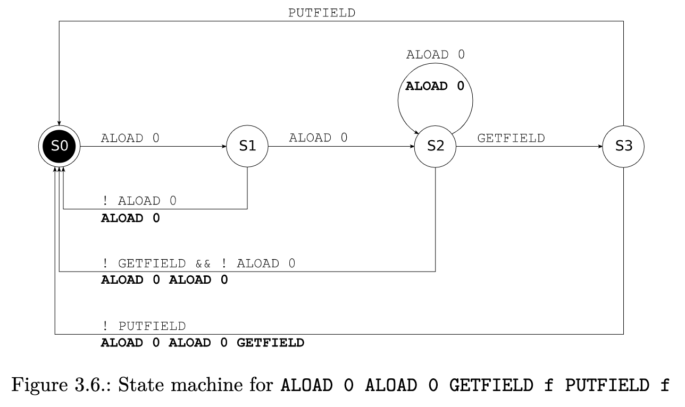

Each transition is labeled with a condition (the value of the current instruction) and an action (an instruction sequence that must be emitted, in bold). For instance the transition from S1 to S0 happens if the current instruction is not an ALOAD 0. In this case the ALOAD 0 that was visited to arrive at this state is emitted. Note the transition from S2 to itself: this happens when three or more consecutive ALOAD 0 are found. In this case we stay in the state where two ALOAD 0 have been visited, and we emit the third one. Once the state machine has been found, writing the corresponding method adapter is straightforward (the 8 switch cases correspond to the 8 transitions in the diagram):

每个转换都有一个条件（当前指令的值）和一个动作（必须发射的指令序列，用粗体表示）。例如，如果当前指令不是 ALOAD 0，那么从 S1 到 S0 的转换就会发生，在这种情况下，为了达到这个状态而访问的 ALOAD 0 被发射出来。注意从 S2 到自身的转换：当发现三个或更多的连续的 ALOAD 0 时发生。在这种情况下，我们停留在已经访问过两个 ALOAD 0 的状态中，并发射第三个 ALOAD 0。一旦找到了状态机，编写相应的方法适配器就很简单了（ 8 个开关情况对应于图中的 8 个转换）。

```java
    class RemoveGetFieldPutFieldAdapter extends PatternMethodAdapter {
        private final static int SEEN_ALOAD_0 = 1;
        private final static int SEEN_ALOAD_0ALOAD_0 = 2;
        private final static int SEEN_ALOAD_0ALOAD_0GETFIELD = 3;
        private String fieldOwner;
        private String fieldName;
        private String fieldDesc;
        public RemoveGetFieldPutFieldAdapter(MethodVisitor mv) {
            super(mv);
        }

        @Override
        public void visitVarInsn(int opcode, int var) {
            switch (state) {
                case SEEN_NOTHING: // S0 -> S1
                    if (opcode == ALOAD && var == 0) {
                        state = SEEN_ALOAD_0;
                        return;
                    }
                    break;
                case SEEN_ALOAD_0: // S1 -> S2
                    if (opcode == ALOAD && var == 0) {
                        state = SEEN_ALOAD_0ALOAD_0;
                        return;
                    }
                    break;
                case SEEN_ALOAD_0ALOAD_0: // S2 -> S2
                    if (opcode == ALOAD && var == 0) {
                        mv.visitVarInsn(ALOAD, 0);
                        return;
                    }
                    break;
            }
            visitInsn();
            mv.visitVarInsn(opcode, var);
        }

        @Override
        public void visitFieldInsn(int opcode, String owner, String name, String desc) {
            switch (state) {
                case SEEN_ALOAD_0ALOAD_0: // S2 -> S3
                    if (opcode == GETFIELD) {
                        state = SEEN_ALOAD_0ALOAD_0GETFIELD;
                        fieldOwner = owner;
                        fieldName = name;
                        fieldDesc = desc;
                        return;
                    }
                    break;
                case SEEN_ALOAD_0ALOAD_0GETFIELD: // S3 -> S0
                    if (opcode == PUTFIELD && name.equals(fieldName)) {
                        state = SEEN_NOTHING;
                        return;
                    }
                    break;
            }
            visitInsn();
            mv.visitFieldInsn(opcode, owner, name, desc);
        }

        @Override 
        protected void visitInsn() {
            switch (state) {
                case SEEN_ALOAD_0: // S1 -> S0
                    mv.visitVarInsn(ALOAD, 0);
                    break;
                case SEEN_ALOAD_0ALOAD_0: // S2 -> S0
                    mv.visitVarInsn(ALOAD, 0);
                    mv.visitVarInsn(ALOAD, 0);
                    break;
                case SEEN_ALOAD_0ALOAD_0GETFIELD: // S3 -> S0
                    mv.visitVarInsn(ALOAD, 0);
                    mv.visitVarInsn(ALOAD, 0);
                    mv.visitFieldInsn(GETFIELD, fieldOwner, fieldName, fieldDesc);
                    break;
            }
            state = SEEN_NOTHING;
        }
    }
```

Note that, for the same reasons as in the AddTimerAdapter case in section 3.2.4, the statefull transformations presented in this section do not need to transform stack map frames: the original frames stay valid after the transformation. They don’t even need to transform the local variables and operand stack size. Finally it must be noted that statefull transformations are not limited to transformations that detect and transform instruction sequences. Many other types of transformation are also statefull. This is the case, for instance, of the method adapters presented in the next section.

请注意，出于与第 3.2.4 节中 AddTimerAdapter 案例相同的原因，本节介绍的全状态转换不需要转换栈映射帧：原始帧在转换后仍然有效。他们甚至不需要转换局部变量和操作数栈的大小。最后必须指出的是，全状态转换并不限于检测和转换指令序列的转换。许多其他类型的转换也是有状态的。例如，下一节中介绍的方法适配器就是这种情况。

### 3.3 Tools
The org.objectweb.asm.commons package contains some predefined method adapters that can be useful to define your own adapters. This section presents three of them and shows how they can be used with the AddTimerAdapter example of section 3.2.4. It also shows how the tools seen in the previous chapter can be used to ease method generation or transformation.

org.objectweb.asm.commons 包包含一些预定义的方法适配器，它们对于定义你自己的适配器很有用。本节介绍了其中的三个，并展示了它们如何与第 3.2.4 节的 AddTimerAdapter 示例一起使用。它还展示了如何使用前一章中的工具来简化方法的生成或转换。

#### 3.3.1 Basic tools
The tools presented in section 2.3 can also be used for methods.

2.3 节中介绍的工具也可用于方法。

**Type**
Many bytecode instructions, such as xLOAD, xADD or xRETURN, depend on the type to which they are applied. The Type class provides a getOpcode method that can be used to get, for these instructions, the opcode corresponding to a given type. This method takes as parameter an opcode for the int type, and returns the opcode for the type on which it is called. For instance t.getOpcode(IMUL) returns FMUL if t is equal to Type.FLOAT_TYPE.

许多字节码指令，如 xLOAD、xADD 或 xRETURN，取决于它们所应用的类型。Type 类提供了一个 getOpcode 方法，对于这些指令，可以用来获得与给定类型相对应的操作码。这个方法把 int 类型的操作码作为参数，并返回它所调用的类型的操作码。例如，如果 t 等于 Type.FLOAT_TYPE，t.getOpcode(IMUL) 返回 FMUL。

**TraceClassVisitor**
This class, which has already been presented in the previous chapter, prints a textual representation of the classes it visits, including a textual representation of their methods, in a form very similar to the one used in this chapter. It can therefore be used to trace the content of generated or transformed methods at any point in a transformation chain. For example:

这个类在上一章已经介绍过了，它打印出它所访问的类的文本表示，包括其方法的文本表示，其形式与本章中使用的非常相似。因此，它可以被用来在转换链的任何一点上追踪生成或转换的方法的内容。比如说。

```
    java -classpath asm.jar:asm-util.jar \
    org.objectweb.asm.util.TraceClassVisitor \
    java.lang.Void
```

prints

```java
    // class version 49.0 (49)
    // access flags 49
    public final class java/lang/Void {
        // access flags 25
        // signature Ljava/lang/Class<Ljava/lang/Void;>;
        // declaration: java.lang.Class<java.lang.Void>
        public final static Ljava/lang/Class; TYPE
        // access flags 2
        private <init>()V
            ALOAD 0
            INVOKESPECIAL java/lang/Object.<init> ()V
            RETURN
            MAXSTACK = 1
            MAXLOCALS = 1
        // access flags 8
        static <clinit>()V
            LDC "void"
            INVOKESTATIC java/lang/Class.getPrimitiveClass (...)...
            PUTSTATIC java/lang/Void.TYPE : Ljava/lang/Class;
            RETURN
            MAXSTACK = 1
            MAXLOCALS = 0
    }
```

This shows how to generate a static block static { ... }, namely with a <clinit> method (for CLass INITializer). Note that if you want to trace the content of a single method at some point in a chain, instead of tracing all the content of its class, you can use TraceMethodVisitor instead of TraceClassVisitor (in this case you must specify the backend explicitly; here we use a Textifier):

这显示了如何生成一个静态块 static { ... }，即有一个 <clinit> 方法（用于 CLass INITializer）。请注意，如果你想追踪链条中某一点的单个方法的内容，而不是追踪其类的所有内容，你可以使用 TraceMethodVisitor 而不是 TraceClassVisitor（在这种情况下，你必须明确指定后端；这里我们使用一个 Textifier）。

```java
    public MethodVisitor visitMethod(int access, String name, String desc, String signature, String[] exceptions) {
        MethodVisitor mv = cv.visitMethod(access, name, desc, signature,exceptions);
        if (debug && mv != null && ...) { // if this method must be traced
            Printer p = new Textifier(ASM4) {
                @Override
                public void visitMethodEnd() {
                    print(aPrintWriter); // print it after it has been visited
                }
            };
            mv = new TraceMethodVisitor(mv, p);
        }
        return new MyMethodAdapter(mv);
    }
```

This code prints the method after transformation by MyMethodAdapter.

这段代码打印了由 MyMethodAdapter 转换后的方法。

**CheckClassAdapter**
This class, which has already been presented in the previous chapter, checks that the ClassVisitor methods are called in the appropriate order, and with valid arguments, and it does the same for the MethodVisitor methods. It can therefore be used to check that the MethodVisitor API is correctly used at any point in a transformation chain. Like with TraceMethodVisitor, you can use the CheckMethodAdapter class to check a single method instead of checking all its class:

这个类在上一章已经介绍过了，它检查 ClassVisitor 方法是否以适当的顺序和有效的参数被调用，它对MethodVisitor 方法也是如此。因此，它可以用来检查 MethodVisitor API 在转换链的任何一点上是否被正确使用。像 TraceMethodVisitor 一样，你可以使用 CheckMethodAdapter 类来检查一个单一的方法，而不是检查它的所有类。

```java
    public MethodVisitor visitMethod(int access, String name, String desc, String signature, String[] exceptions) {
        MethodVisitor mv = cv.visitMethod(access, name, desc, signature,exceptions);
        if (debug && mv != null && ...) { // if this method must be checked
            mv = new CheckMethodAdapter(mv);
        }
        return new MyMethodAdapter(mv);
    }
```

This code checks that MyMethodAdapter uses the MethodVisitor API correctly. Note however that this adapter will not check that the bytecode is correct: for instance it will not detect that ISTORE 1 ALOAD 1 is invalid. In fact this kind of error can be detected, if you use the other constructor of CheckMethodAdapter (see the Javadoc), and if you provide valid maxStack and maxLocals arguments in visitMaxs.

这段代码检查 MyMethodAdapter 是否正确使用 MethodVisitor API。但是请注意，这个适配器不会检查字节码是否正确：例如，它不会检测到 ISTORE 1 ALOAD 1 是无效的。事实上，如果你使用CheckMethodAdapter 的其他构造函数（见 Javadoc），并且在 visitMaxs 中提供有效的 maxStack 和 maxLocals 参数，就可以检测到这种错误。

**ASMifier**
This class, which has already been presented in the previous chapter, also works with the content of methods. It can be used to know how to generate some compiled code with ASM: just write the corresponding source code in Java, compile it with javac, and use the ASMifier to visit this class. You will get the ASM code to generate the bytecode corresponding to your source code.

这个类在上一章已经介绍过了，它也可以处理方法的内容。它可以用来了解如何用 ASM 生成一些编译后的代码：只要用 Java 编写相应的源代码，用 javac 进行编译，然后用 ASMifier 访问这个类。你将得到 ASM 代码来生成与你的源代码对应的字节码。

#### 3.2.2 AnalyzerAdapter
This method adapter computes the stack map frames before each instruction, based on the frames visited in visitFrame. Indeed, as explained in section 3.1.5, visitFrame is only called before some specific instructions in a method, in order to save space, and because “the other frames can be easily and quickly inferred from these ones”. This is what this adapter does. Of course it only works on classes that contain precomputed stack map frames, i.e. compiled with Java 6 or higher (or previously upgraded to Java 6 with an ASM adapter using the COMPUTE_FRAMES option).

这个方法适配器根据 visitFrame 中访问的帧来计算每条指令前的栈映射帧。事实上，正如 3.1.5 节所解释的，visitFrame 只在方法中的某些特定指令之前被调用，以节省空间，并且因为 "其他的帧可以很容易和快速地从这些帧中推断出来"。这就是这个适配器的作用。当然，它只适用于包含预计算栈映射帧的类，即用 Java 6 或更高版本编译的类（或者之前用 ASM 适配器用 COMPUTE_FRAMES 选项升级到 Java 6）。

In the case of our AddTimerAdapter example, this adapter could be used to get the size of the operand stack just before the RETURN instructions, thereby allowing to compute an optimal transformed value for maxStack in visitMaxs (in fact this method is not recommended in practice, because it is much less efficient than using COMPUTE_MAXS):

在我们的 AddTimerAdapter 例子中，这个适配器可以用来获取 RETURN 指令前的操作数栈的大小，从而允许在 visitMaxs 中计算 maxStack 的最佳转换值（事实上这种方法在实践中不被推荐，因为它比使用 COMPUTE_MAXS 效率低得多）。

```java
    class AddTimerMethodAdapter2 extends AnalyzerAdapter {
        private int maxStack;
        public AddTimerMethodAdapter2(String owner, int access,
        String name, String desc, MethodVisitor mv) {
            super(ASM4, owner, access, name, desc, mv);
        }

        @Override public void visitCode() {
            super.visitCode();
            mv.visitFieldInsn(GETSTATIC, owner, "timer", "J");
            mv.visitMethodInsn(INVOKESTATIC, "java/lang/System", "currentTimeMillis", "()J");
            mv.visitInsn(LSUB);
            mv.visitFieldInsn(PUTSTATIC, owner, "timer", "J");
            maxStack = 4;
        }

        @Override public void visitInsn(int opcode) {
            if ((opcode >= IRETURN && opcode <= RETURN) || opcode == ATHROW) {
                mv.visitFieldInsn(GETSTATIC, owner, "timer", "J");
                mv.visitMethodInsn(INVOKESTATIC, "java/lang/System", "currentTimeMillis", "()J");
                mv.visitInsn(LADD);
                mv.visitFieldInsn(PUTSTATIC, owner, "timer", "J");
                maxStack = Math.max(maxStack, stack.size() + 4);
            }
            super.visitInsn(opcode);
        }

        @Override public void visitMaxs(int maxStack, int maxLocals) {
            super.visitMaxs(Math.max(this.maxStack, maxStack), maxLocals);
        }
    }
```

The stack field is defined in the AnalyzerAdapter class, and contains the types in operand stack. More precisely, in a visitXxx Insn, and before the overridden method is called, this list contains the state of the operand stack just before this instruction. Note that the overridden methods must be called so that the stack field is correctly updated (hence the use of super instead of mv in the original code).

栈字段定义在 AnalyzerAdapter 类中，包含操作数堆栈中的类型。更准确地说，在 visitXxx Insn 中，在重载方法被调用之前，这个列表包含了操作数堆栈的状态，就在这条指令之前。注意，必须调用重载方法，以便正确地更新栈字段（因此在原始代码中使用 super 而不是 mv）。

Alternatively the new instructions can be inserted by calling the methods of the super class: the effect is that the frames for these instructions will be computed by AnalyzerAdapter. Since, in addition, this adapter updates the arguments of visitMaxs based on the frames it computes, we do not need to update them ourselves:

另外，新的指令可以通过调用超类的方法来插入：其效果是，这些指令的框架将由 AnalyzerAdapter 来计算。此外，由于这个适配器会根据它计算的帧来更新 visitMaxs 的参数，所以我们不需要自己去更新它们。

```java
    class AddTimerMethodAdapter3 extends AnalyzerAdapter {
        public AddTimerMethodAdapter3(String owner, int access, String name, String desc, MethodVisitor mv) {
            super(ASM4, owner, access, name, desc, mv);
        }

        @Override public void visitCode() {
            super.visitCode();
            super.visitFieldInsn(GETSTATIC, owner, "timer", "J"); 
            super.visitMethodInsn(INVOKESTATIC, "java/lang/System",  "currentTimeMillis", "()J");
            super.visitInsn(LSUB);
            super.visitFieldInsn(PUTSTATIC, owner, "timer", "J");
        }
        @Override public void visitInsn(int opcode) {
            if ((opcode >= IRETURN && opcode <= RETURN) || opcode == ATHROW) {
                super.visitFieldInsn(GETSTATIC, owner, "timer", "J");
                super.visitMethodInsn(INVOKESTATIC, "java/lang/System", "currentTimeMillis", "()J");
                super.visitInsn(LADD);
                super.visitFieldInsn(PUTSTATIC, owner, "timer", "J");
            }
            super.visitInsn(opcode);
        }
    }
```

#### 3.3.3 LocalVariablesSorter
This method adapter renumbers the local variables used in a method in the order they appear in this method. For instance in a method with two parameters, the first local variable read or written whose index is greater than or equal to 3 – the first three local variables correspond to this and to the two method parameters, and can therefore not be changed – is assigned index 3, the second one is assigned index 4, and so on. This adapter is useful to insert new local variables in a method. Without this adapter it would be necessary to add new local variables after all the existing ones, but unfortunately their number is not known until the end of the method, in visitMaxs.

这个方法适配器按照一个方法中使用的局部变量在这个方法中出现的顺序对其进行重新编号。例如，在一个有两个参数的方法中，第一个被读取或写入的局部变量的索引大于或等于 3 -- 前三个局部变量对应于这个和两个方法参数，因此不能被改变--被分配索引 3，第二个被分配索引 4，以此类推。这个适配器对于在一个方法中插入新的局部变量非常有用。如果没有这个适配器，就必须在所有现有的局部变量之后添加新的局部变量，但不幸的是，它们的数量直到方法结束时才会知道，在 visitMaxs 中。

In order to show how this adapter can be used, let’s suppose that we want to use a local variable to implement AddTimerAdapter:

为了说明如何使用这个适配器，让我们假设我们想用一个局部变量来实现 AddTimerAdapter。

```java
public class C {
    public static long timer;
    
    public void m() throws Exception {
        long t = System.currentTimeMillis();
        Thread.sleep(100);
        timer += System.currentTimeMillis() - t;
    }
}
```

This can be done easily by extending LocalVariablesSorter, and by using the newLocal method defined in this class:

这可以通过扩展 LocalVariablesSorter，并使用该类中定义的 newLocal 方法来轻松实现。

```java
    class AddTimerMethodAdapter4 extends LocalVariablesSorter {
        private int time;
        public AddTimerMethodAdapter4(int access, String desc, MethodVisitor mv) {
            super(ASM4, access, desc, mv);
        }

        @Override public void visitCode() {
            super.visitCode();
            mv.visitMethodInsn(INVOKESTATIC, "java/lang/System", "currentTimeMillis", "()J");
            time = newLocal(Type.LONG_TYPE);
            mv.visitVarInsn(LSTORE, time);
        }

        @Override public void visitInsn(int opcode) {
            if ((opcode >= IRETURN && opcode <= RETURN) || opcode == ATHROW) {
                mv.visitMethodInsn(INVOKESTATIC, "java/lang/System", "currentTimeMillis", "()J");
                mv.visitVarInsn(LLOAD, time);
                mv.visitInsn(LSUB);
                mv.visitFieldInsn(GETSTATIC, owner, "timer", "J");
                mv.visitInsn(LADD);
                mv.visitFieldInsn(PUTSTATIC, owner, "timer", "J");
            }
            super.visitInsn(opcode);
        }

        @Override
        public void visitMaxs(int maxStack, int maxLocals) {
            super.visitMaxs(maxStack + 4, maxLocals);
        }
    }
```

Note that the original frames associated to the method become invalid when the local variables are renumbered, and a fortiori when new local variables are inserted. Hopefully it is possible to avoid recomputing these frames from scratch: indeed no frames must be added or removed, and it “suffices” to reorder the content of local variables in the original frames to get the frames of the transformed method. LocalVariablesSorter takes care of that automatically. If you also need to do incremental stack map frame updates for one of your method adapters, you can inspire yourself from the source of this class.

请注意，当局部变量被重新编号时，与该方法相关的原始帧就会失效，更不用说当插入新的局部变量时了。希望有可能避免从头开始重新计算这些帧：事实上，不需要添加或删除帧，只需要重新排列原始帧中的局部变量内容，就可以得到转换后的方法的帧。LocalVariablesSorter 会自动处理这些。如果你也需要为你的一个方法适配器做增量栈映射帧的更新，你可以从这个类的源头启发自己。

As you can see above using a local variable does not solve the problem we had in the original version of this class, concerning the worst case value for maxStack. If you want to use an AnalyzerAdapter to solve that, in addition to a LocalVariablesSorter, you must use these adapters through delegation instead of via inheritance (since multiple inheritance is not possible):

正如你在上面看到的，使用局部变量并不能解决我们在这个类的原始版本中遇到的问题，关于 maxStack 的最坏情况值。如果你想使用 AnalyzerAdapter 来解决这个问题，除了 LocalVariablesSorter 之外，你必须通过委托而不是通过继承来使用这些适配器（因为多重继承是不可能的）。

```java
class AddTimerMethodAdapter5 extends MethodVisitor {
    public LocalVariablesSorter lvs;
    public AnalyzerAdapter aa;
    private int time;
    private int maxStack;
    public AddTimerMethodAdapter5(MethodVisitor mv) {
        super(ASM4, mv);
    }

    @Override public void visitCode() {
        mv.visitCode();
        mv.visitMethodInsn(INVOKESTATIC, "java/lang/System", "currentTimeMillis", "()J");
        time = lvs.newLocal(Type.LONG_TYPE);
        mv.visitVarInsn(LSTORE, time);
        maxStack = 4;
    }

    @Override 
    public void visitInsn(int opcode) {
        if ((opcode >= IRETURN && opcode <= RETURN) || opcode == ATHROW) {
            mv.visitMethodInsn(INVOKESTATIC, "java/lang/System", "currentTimeMillis", "()J");
            mv.visitVarInsn(LLOAD, time);
            mv.visitInsn(LSUB);
            mv.visitFieldInsn(GETSTATIC, owner, "timer", "J");
            mv.visitInsn(LADD);
            mv.visitFieldInsn(PUTSTATIC, owner, "timer", "J");
            maxStack = Math.max(aa.stack.size() + 4, maxStack);
        }
        mv.visitInsn(opcode);
    }

    @Override 
    public void visitMaxs(int maxStack, int maxLocals) {
        mv.visitMaxs(Math.max(this.maxStack, maxStack), maxLocals);
    }
}
```

In order to use this adapter you must chain a LocalVariablesSorter to an AnalyzerAdapter, itself chained to your adapter: the first adapter will sort local variables and update frames accordingly, the analyzer adapter will compute intermediate frames taking into account the renumbering done in the previous adapter, and your adapter will have access to these renumbered intermediate frames. This chain can be constructed as follows in visitMethod:

为了使用这个适配器，你必须将一个 LocalVariablesSorter 链到一个 AnalyzerAdapter 上，这个适配器本身也被链到你的适配器上：第一个适配器将对局部变量进行排序并相应地更新帧，分析器适配器将计算中间框架，并考虑到在前一个适配器中所做的重新编号，而你的适配器将可以访问这些重新编号的中间帧。这个链条可以在 visitMethod 中构建如下。

```java
    mv = cv.visitMethod(access, name, desc, signature, exceptions);
    if (!isInterface && mv != null && !name.equals("<init>")) {
        AddTimerMethodAdapter5 at = new AddTimerMethodAdapter5(mv);
        at.aa = new AnalyzerAdapter(owner, access, name, desc, at);
        at.lvs = new LocalVariablesSorter(access, desc, at.aa);
        return at.lvs;
    }
```

#### 3.3.4 AdviceAdapter
This method adapter is an abstract class that can be used to insert code at the beginning of a method and just before any RETURN or ATHROW instruction. Its main advantage is that it also works for constructors, where code must not be inserted just at the beginning of the constructor, but after the call to the super constructor. In fact most of the code of this adapter is dedicated to the detection of this super constructor call.

这个方法适配器是一个抽象的类，可以用来在一个方法的开头和任何 RETURN 或 ATHROW 指令之前插入代码。它的主要优点是它也适用于构造函数，在构造函数中，代码不能仅仅插入在构造函数的开头，而是在调用超级构造函数之后。事实上，这个适配器的大部分代码都是用于检测这个超级构造函数的调用。

If you look carefully at the AddTimerAdapter class in section 3.2.4, you will see that the AddTimerMethodAdapter is not used for constructors, because of this problem. By inheriting from AdviceAdapter this method adapter can be improved to work on constructors too (note that AdviceAdapter inherits from LocalVariablesSorter, so we could also easily use a local variable):

如果你仔细看一下 3.2.4 节中的 AddTimerAdapter 类，你会发现 AddTimerMethodAdapter 并不用于构造函数，就是因为这个问题。通过继承 AdviceAdapter，这个方法适配器可以被改进为也适用于构造函数（注意 AdviceAdapter 继承自 LocalVariablesSorter，所以我们也可以轻松地使用局部变量）。

```java
    class AddTimerMethodAdapter6 extends AdviceAdapter {
        public AddTimerMethodAdapter6(int access, String name, String desc, MethodVisitor mv) {
            super(ASM4, mv, access, name, desc);
        }

        @Override protected void onMethodEnter() {
            mv.visitFieldInsn(GETSTATIC, owner, "timer", "J");
            mv.visitMethodInsn(INVOKESTATIC, "java/lang/System",
            "currentTimeMillis", "()J");
            mv.visitInsn(LSUB);
            mv.visitFieldInsn(PUTSTATIC, owner, "timer", "J");
        }

        @Override protected void onMethodExit(int opcode) {
            mv.visitFieldInsn(GETSTATIC, owner, "timer", "J");
            mv.visitMethodInsn(INVOKESTATIC, "java/lang/System",
            "currentTimeMillis", "()J");
            mv.visitInsn(LADD);
            mv.visitFieldInsn(PUTSTATIC, owner, "timer", "J");
        }
        
        @Override 
        public void visitMaxs(int maxStack, int maxLocals) {
            super.visitMaxs(maxStack + 4, maxLocals);
        }
    }
```

## 4. Metadata
This chapter explains how to generate and transform compiled Java classes metadata, such as annotations, with the core API. Each section starts with a presentation of one type of metadata, and then presents the corresponding ASM interfaces, components and tools to generate and transform these metadata, with some illustrative examples.

本章解释了如何用核心 API 生成和转换编译的 Java 类元数据，比如注解。每一节都从介绍一种类型的元数据开始，然后介绍相应的 ASM 接口、组件和工具来生成和转换这些元数据，并有一些说明性的例子。

### 4.1 Generics
Generic classes such as List<E>, and classes using them, contain information about the generic types they declare or use. This information is not used at runtime by the bytecode instructions, but it can be accessed via the reflection API. It is also used by compilers, for separate compilation.

像 List<E> 这样的泛型类，以及使用它们的类，包含了它们声明或使用的泛型的信息。这些信息在运行时不被字节码指令所使用，但可以通过反射 API 来访问。它也被编译器使用，用于单独编译。

#### 4.1.1 Structure
For backward compatibility reasons the information about generic types is not stored in type or method descriptors (which were defined long before the introduction of generics in Java 5), but in similar constructs called type, method and class signatures. These signatures are stored in addition to descriptors in class, field and method declarations when a generic type is involved (generic types do not affect the bytecode of methods: the compiler uses them to perform static type checks, but then compiles methods as if they were not used, by reintroducing type casts where necessary).

出于向后兼容的原因，关于泛型的信息并不存储在类型或方法描述符中（这些描述符早在 Java 5 中引入泛型之前就被定义了），而是存储在被称为类型、方法和类签名的类似结构中。当涉及到泛型时，这些签名除了存储在类、字段和方法声明中的描述符之外（泛型并不影响方法的字节码：编译器使用它们来执行静态类型检查，但随后编译方法时就像没有使用它们一样，必要时重新引入类型转换）。

Unlike type and method descriptors, and due to the recursive nature of generic types (a generic type can be parameterized by a generic type – consider for example List<List<E>>) the grammar of type signatures is quite complex. It is given by the following rules (see the Java Virtual Machine Specification for a complete description of these rules):

与类型和方法描述符不同，由于泛型的递归性质（一个泛型可以被一个泛型所参数化--例如考虑List<List<E>>），类型签名的语法相当复杂。它由以下规则给出（关于这些规则的完整描述，请参见《Java 虚拟机规范》）。

```java
    TypeSignature: Z | C | B | S | I | F | J | D | FieldTypeSignature
    FieldTypeSignature: ClassTypeSignature | [ TypeSignature | TypeVar
    ClassTypeSignature: L Id ( / Id )* TypeArgs? ( . Id TypeArgs? )* ;
    TypeArgs: < TypeArg+ >
    TypeArg: * | ( + | - )? FieldTypeSignature
    TypeVar: T Id ;
```

The first rule says that a type signature is either a primitive type descriptor or a field type signature. The second rule defines a field type signature as a class type signature, an array type signature, or a type variable. The third rule defines class type signatures: they are class type descriptors with possible type arguments, between angle brackets, after the main class name or after the inner class names (prefixed with dots). The remaining rules define type arguments and type variables. Note that a type argument can be a complete field type signature, with its own type arguments: type signatures can therefore be very complex (see Figure 4.1).

第一条规则说，一个类型签名是原始类型描述符或字段类型签名。第二条规则将字段类型签名定义为类类型签名、数组类型签名或类型变量。第三条规则定义了类类型签名：它们是带有可能的类型参数的类类型描述符，在角括号之间，在主类名称或内类名称之后（前缀为点）。其余的规则定义了类型参数和类型变量。请注意，一个类型参数可以是一个完整的字段类型签名，有自己的类型参数：因此类型签名可以非常复杂（见图 4.1）。

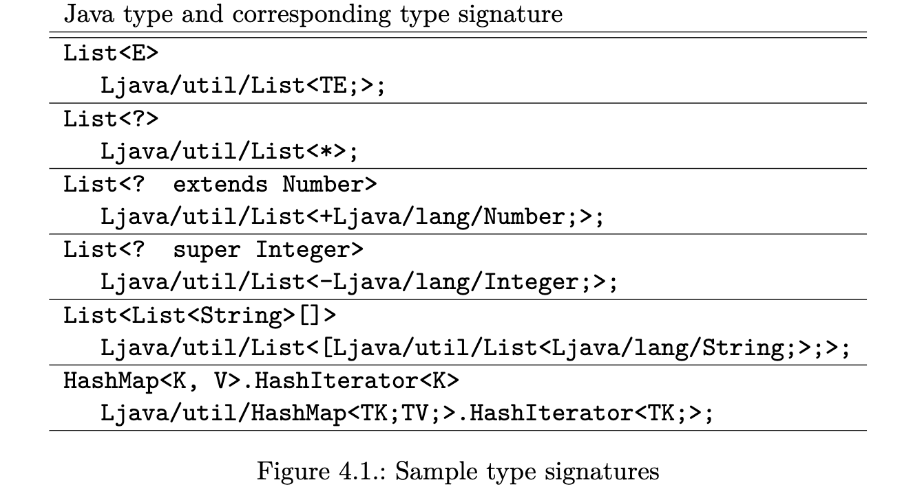

Method signatures extend method descriptors like type signatures extend type descriptors. A method signature describes the type signatures of the method parameters and the signature of its return type. Unlike method descriptors, it also contains the signatures of the exceptions thrown by the method, preceded by ^, and can also contain optional formal type parameters between angle brackets:

方法签名扩展了方法描述符，就像类型签名扩展了类型描述符一样。方法签名描述了方法参数的类型签名和其返回类型的签名。与方法描述符不同的是，它还包含了由该方法抛出的异常的签名，前面是^，并且还可以包含角括号中的可选正式类型参数。

```
    MethodTypeSignature:
    TypeParams? ( TypeSignature* ) ( TypeSignature | V ) Exception*
    Exception: ^ClassTypeSignature | ^TypeVar
    TypeParams: < TypeParam+ >
    TypeParam: Id : FieldTypeSignature? ( : FieldTypeSignature )*
```

For example the method signature of the following generic static method, parameterized by the type variable T:

例如，以下通用静态方法的方法签名，以类型变量 T 为参数。

```
    static <T> Class<? extends T> m (int n)
```

is the following method signature:

是以下方法的签名。

```
    <T:Ljava/lang/Object;>(I)Ljava/lang/Class<+TT;>;
```

Finally a class signature, which must not be confused with a class type signature, is defined as the type signature of its super class, followed by the type signatures of the implemented interfaces, and with optional formal type parameters:

最后，一个类的签名（不能与类的类型签名相混淆）被定义为其超类的类型签名，然后是实现的接口的类型签名，并有可选的形式类型参数。

```
    ClassSignature: TypeParams? ClassTypeSignature ClassTypeSignature*
```

For example the class signature of a class declared as C<E> extends List<E>
is <E:Ljava/lang/Object;>Ljava/util/List<TE;>;.

例如，一个声明为 C<E> 扩展为 List<E> 的类的签名

#### 4.1.2 Interfaces and components
Like for descriptors, and for the same efficiency reasons (see section 2.3.1), the ASM API exposes signatures as they as stored in compiled classes (the main occurences of signatures are in the visit, visitField and visitMethod methods of the ClassVisitor class, as an optional class, type or method signature argument respectively). Hopefully it also provides some tools to generate and transform signatures, in the org.objectweb.asm.signature package, based on the SignatureVisitor abstract class (see Figure 4.2).

像描述符一样，出于同样的效率原因（见第 2.3.1 节），ASM API 暴露了存储在编译类中的签名（签名的主要出现在 ClassVisitor 类的 visit、visitField 和 visitMethod 方法中，分别作为一个可选的类、类型或方法签名参数）。希望它也提供一些工具来生成和转换签名，在 org.objectweb.asm.signature 包中，基于 SignatureVisitor 抽象类（见图 4.2）。

```java
    public abstract class SignatureVisitor {
        public final static char EXTENDS = ’+’;
        public final static char SUPER = ’-’;
        public final static char INSTANCEOF = ’=’;
        public SignatureVisitor(int api);
        public void visitFormalTypeParameter(String name);
        public SignatureVisitor visitClassBound();
        public SignatureVisitor visitInterfaceBound();
        public SignatureVisitor visitSuperclass();
        public SignatureVisitor visitInterface();
        public SignatureVisitor visitParameterType();
        public SignatureVisitor visitReturnType();
        public SignatureVisitor visitExceptionType();
        public void visitBaseType(char descriptor);
        public void visitTypeVariable(String name);
        public SignatureVisitor visitArrayType();
        public void visitClassType(String name);
        public void visitInnerClassType(String name);
        public void visitTypeArgument();
        public SignatureVisitor visitTypeArgument(char wildcard);
        public void visitEnd();
    }

    // Figure 4.2: The SignatureVisitor class
```

This abstract class is used to visit type signatures, method signatures and class signatures. The methods used to visit type signatures are in bold, and must be called in the following order, which reflects the previous grammar rules (note that two of them return a SignatureVisitor: this is due to the recursive definition of type signatures):

这个抽象类被用来访问类型签名、方法签名和类签名。用于访问类型签名的方法用粗体表示，必须按以下顺序调用，这反映了前面的语法规则（注意，其中两个方法返回一个 SignatureVisitor：这是由于类型签名的递归定义）。

```
    visitBaseType | visitArrayType | visitTypeVariable |
    ( visitClassType visitTypeArgument*
    ( visitInnerClassType visitTypeArgument* )* visitEnd ) )
```

The methods used to visit method signatures are the following:

用于访问方法签名的方法有以下几种。

```
    ( visitFormalTypeParameter visitClassBound? visitInterfaceBound* )*
    visitParameterType* visitReturnType visitExceptionType*
```

Finally the methods used to visit class signatures are:

最后，用于访问类签名的方法是。

```
    ( visitFormalTypeParameter visitClassBound? visitInterfaceBound* )*
    visitSuperClass visitInterface*
```

Most of these methods return a SignatureVisitor: it is intended to visit a type signature. Note that, unlike with the MethodVisitors returned by a ClassVisitor, the SignatureVisitors returned by a SignatureVisitor must not be null, and must be used sequentially: in fact no method of the parent visitor must be called before a nested signature is fully visited.

这些方法大多返回一个 SignatureVisitor：它的目的是访问一个类型签名。注意，与 ClassVisitor 返回的 MethodVisitor 不同，SignatureVisitor 返回的 SignatureVisitor 不能是空的，而且必须依次使用：事实上，在完全访问嵌套签名之前，不得调用父级访问者的任何方法。

Like for classes, the ASM API provides two components based on this API: the SignatureReader component parses a signature and calls the appropriate visit methods on a given signature visitor, and the SignatureWriter component builds a signature based on the method calls it received.

像对类一样，ASM API 提供了两个基于该 API 的组件：SignatureReader 组件解析签名并调用给定签名访问者的适当访问方法，SignatureWriter 组件根据它收到的方法调用建立签名。

These two classes can be used to generate and transform signatures by using the same principles as with classes and methods. For example, let’s suppose you want to rename the class names that appear in some signatures. This can be done with the following signature adapter, which forwards all the method calls it receives unchanged, except for the visitClassType and visitInnerClassType methods (we suppose here that sv methods always return this, which is the case of SignatureWriter):

这两个类可以通过使用与类和方法相同的原则来生成和转换签名。例如，我们假设你想重命名出现在一些签名中的类名。这可以用下面的签名适配器来完成，它转发所有它收到的方法调用，除了 visitClassType 和 visitInnerClassType 方法外，没有任何改变（我们在这里假设 sv 方法总是返回这个，这就是 SignatureWriter 的情况）。

```java
    public class RenameSignatureAdapter extends SignatureVisitor {
        private SignatureVisitor sv;
        private Map<String, String> renaming;
        private String oldName;
        public RenameSignatureAdapter(SignatureVisitor sv,
        Map<String, String> renaming) {
            super(ASM4);
            this.sv = sv;
            this.renaming = renaming;
        }

        public void visitFormalTypeParameter(String name) {
            sv.visitFormalTypeParameter(name);
        }

        public SignatureVisitor visitClassBound() {
            sv.visitClassBound();
            return this;
        }

        public SignatureVisitor visitInterfaceBound() {
            sv.visitInterfaceBound();
            return this;
        }

        ...
        public void visitClassType(String name) {
            oldName = name;
            String newName = renaming.get(oldName);
            sv.visitClassType(newName == null ? name : newName);
        }

        public void visitInnerClassType(String name) {
            oldName = oldName + "." + name;
            String newName = renaming.get(oldName);
            sv.visitInnerClassType(newName == null ? name : newName);
        }

        public void visitTypeArgument() {
            sv.visitTypeArgument();
        }

        public SignatureVisitor visitTypeArgument(char wildcard) {
            sv.visitTypeArgument(wildcard);
            return this;
        }

        public void visitEnd() {
            sv.visitEnd();
        }
    }
```

Then the result of the following code is "LA<TK;TV;>.B<TK;>;":

那么以下代码的结果是 "LA<TK;TV;>.B<TK;>;"。

```java
    String s = "Ljava/util/HashMap<TK;TV;>.HashIterator<TK;>;";
    Map<String, String> renaming = new HashMap<String, String>();
    renaming.put("java/util/HashMap", "A");
    renaming.put("java/util/HashMap.HashIterator", "B");
    SignatureWriter sw = new SignatureWriter();
    SignatureVisitor sa = new RenameSignatureAdapter(sw, renaming);
    SignatureReader sr = new SignatureReader(s);
    sr.acceptType(sa);
    sw.toString();
```

#### 4.1.3 Tools
The TraceClassVisitor and ASMifier classes, presented in section 2.3, print the signatures contained in class files in their internal form. They can be used to find the signature corresponding to a given generic type in the following way: write a Java class with some generic types, compile it, and use these command line tools to find the corresponding signatures.

2.3 节中介绍的 TraceClassVisitor 和 ASMifier 类，以其内部形式打印类文件中包含的签名。它们可以通过以下方式找到与给定的通用类型相对应的签名：编写一个带有一些通用类型的 Java 类，将其编译，并使用这些命令行工具来找到相应的签名。

### 4.2 Annotations
Class, field, method and method parameter annotations, such as @Deprecated or @Override, are stored in compiled classes if their retention policy is not RetentionPolicy.SOURCE. This information is not used at runtime by the bytecode instructions, but it can be accessed via the reflection API if the retention policy is RetentionPolicy.RUNTIME. It can also be used by compilers.

如果编译后的类的保留策略不是 RetentionPolicy.SOURCE，那么类、字段、方法和方法参数注释，如@Deprecated 或 @Override，将被存储在编译后的类中。这些信息在运行时不会被字节码指令使用，但如果保留策略是 RetentionPolicy.RUNTIME，则可以通过反射 API 访问。它也可以被编译器使用。

#### 4.2.1 Structure
Annotations in source code can have various forms, such as @Deprecated, @Retention(RetentionPolicy.CLASS) or @Task(desc="refactor", id=1). Internally, however, all annotations have the same form and are specified by an annotation type and by a set of name value pairs, where values are restricted to:

源代码中的注释可以有多种形式，比如 @Deprecated、@Retention(RetentionPolicy.CLASS) 或@Task(desc="refactor", id=1)。然而，在内部，所有的注释都有相同的形式，并由一个注释类型和一组名称价值对来指定，其中价值被限制为：。

+ primitive, String or Class values,
+ enum values,
+ annotation values,
+ arrays of the above values

Note that an annotation can contain other annotations, or even annotation arrays. Annotations can therefore be quite complex.

请注意，一个注解可以包含其他注解，甚至是注解数组。因此，注释可以是相当复杂的。

#### 4.2.2 Interfaces and components
The ASM API for generating and transforming annotations is based on the AnnotationVisitor abstract class (see Figure 4.3).

用于生成和转换注释的 ASM API 是基于 AnnotationVisitor 抽象类的（见图 4.3）。

```java
    public abstract class AnnotationVisitor {
        public AnnotationVisitor(int api);
        public AnnotationVisitor(int api, AnnotationVisitor av);
        public void visit(String name, Object value);
        public void visitEnum(String name, String desc, String value);
        public AnnotationVisitor visitAnnotation(String name, String desc);
        public AnnotationVisitor visitArray(String name);
        public void visitEnd();
    }

    // Figure 4.3.: The AnnotationVisitor class
```

The methods of this class are used to visit the name value pairs of an annotation (the annnotation type is visited in the methods that return this type, i.e. the visitAnnotation methods). The first method is used for primitive, String and Class values (the later being represented by Type objects), and the others are used for enum, annotation and array values. They can be called in any order, except visitEnd:

这个类的方法用于访问注解的名称值对（注解类型在返回该类型的方法中被访问，即 visitAnnotation 方法）。第一个方法用于原始值、字符串和类值（后者由类型对象表示），其他方法用于枚举、注解和数组值。它们可以以任何顺序被调用，除了 visitEnd。

```java
    ( visit | visitEnum | visitAnnotation | visitArray )* visitEnd
```

Note that two methods return an AnnotationVisitor: this is because annotations can contain other annotations. Also unlike with the MethodVisitors returned by a ClassVisitor, the AnnotationVisitors returned by these two methods must be used sequentially: in fact no method of the parent visitor must be called before a nested annotation is fully visited.

注意两个方法返回一个 AnnotationVisitor：这是因为注解可以包含其他注解。同样与 ClassVisitor 返回的 MethodVisitors 不同，这两个方法返回的 AnnotationVisitors 必须依次使用：事实上，在嵌套注解被完全访问之前，不得调用父级访问者的方法。

Note also that the visitArray method returns an AnnotationVisitor to visit the elements of an array. However, since the elements of an array are not named, the name arguments are ignored by the methods of the visitor returned by visitArray, and can be set to null.

还要注意的是，visitArray 方法返回一个 AnnotationVisitor 来访问一个数组的元素。然而，由于数组中的元素没有被命名，名称参数被 visitArray 返回的访问者的方法所忽略，并且可以被设置为空。

**Adding, removing and detecting annotations**
Like for fields and methods, an annotation can be removed by returning null in the visitAnnotation methods:

像字段和方法一样，一个注释可以通过在 visitAnnotation 方法中返回 null 来移除。

```java
    public class RemoveAnnotationAdapter extends ClassVisitor {
        private String annDesc;

        public RemoveAnnotationAdapter(ClassVisitor cv, String annDesc) {
            super(ASM4, cv);
            this.annDesc = annDesc;
        }

        @Override
        public AnnotationVisitor visitAnnotation(String desc, boolean vis) {
            if (desc.equals(annDesc)) {
                return null;
            }
            return cv.visitAnnotation(desc, vis);
        }
    }
```

Adding a class annotation is more difficult because of the constraints in which the methods of the ClassVisitor class must be called. Indeed all the methods that may follow a visitAnnotation must be overridden to detect when all annotations have been visited (method annotations are easier to add, thanks to the visitCode method):

添加一个类注解是比较困难的，因为 ClassVisitor 类的方法必须在其中被调用的限制。事实上，所有可能跟在 visitAnnotation 后面的方法都必须被重写，以检测所有注释是否被访问过（方法注释更容易添加，这要感谢 visitCode 方法）。

```java
    public class AddAnnotationAdapter extends ClassVisitor {
        private String annotationDesc;
        private boolean isAnnotationPresent;

        public AddAnnotationAdapter(ClassVisitor cv, String annotationDesc) {
            super(ASM4, cv);
            this.annotationDesc = annotationDesc;
        }

        @Override public void visit(int version, int access, String name,
        String signature, String superName, String[] interfaces) {
            int v = (version & 0xFF) < V1_5 ? V1_5 : version;
            cv.visit(v, access, name, signature, superName, interfaces);
        }

        @Override public AnnotationVisitor visitAnnotation(String desc, boolean visible) {
            if (visible && desc.equals(annotationDesc)) {
                isAnnotationPresent = true;
            }
            return cv.visitAnnotation(desc, visible);
        }

        @Override 
        public void visitInnerClass(String name, String outerName, String innerName, int access) {
            addAnnotation();
            cv.visitInnerClass(name, outerName, innerName, access);
        }

        @Override
        public FieldVisitor visitField(int access, String name, String desc, String signature, Object value) {
            addAnnotation();
            return cv.visitField(access, name, desc, signature, value);
        }

        @Override
        public MethodVisitor visitMethod(int access, String name, String desc, String signature, String[] exceptions) {
            addAnnotation();
            return cv.visitMethod(access, name, desc, signature, exceptions);
        }

        @Override
        public void visitEnd() {
            addAnnotation();
            cv.visitEnd();
        }

        private void addAnnotation() {
            if (!isAnnotationPresent) {
                AnnotationVisitor av = cv.visitAnnotation(annotationDesc, true);
                if (av != null) {
                    av.visitEnd();
                }
                isAnnotationPresent = true;
            }
        }
    }
```

Note that this adapter upgrades the class version to 1.5 if it was less than that. This is necessary because the JVM ignores annotations in classes whose version is less than 1.5.

请注意，如果类的版本低于 1.5，这个适配器会将其升级到 1.5。这是必要的，因为 JVM 会忽略那些版本小于 1.5 的类的注释。

The last and probably most frequent use case of annotations in class and method adapters is to use annotations in order to parameterize a transformation. For instance you could transform field accesses only for fields that have a @Persistent annotation, add logging code only to methods that have a @Log annotation, and so on. All these use cases can easily be implemented because annotations must be visited first: class annotations must be visited before fields and methods, and method and parameter annotations must be visited before the code. It is therefore sufficient to set a flag when the desired annotation is detected, and to use it later on in the transformation, as is done in the above example with the isAnnotationPresent flag.

类和方法适配器中注解的最后一种，也可能是最常见的使用情况，就是使用注解来参数化一个转换。例如，你可以只对有 @Persistent 注解的字段的访问进行转换，只对有 @Log 注解的方法添加日志代码，等等。所有这些用例都可以很容易地实现，因为注释必须先被访问：类的注释必须在字段和方法之前被访问，而方法和参数的注释必须在代码之前被访问。因此，在检测到所需的注解时设置一个标志就足够了，并在以后的转换中使用它，就像上面的例子中使用 isAnnotationPresent 标志那样。

#### 4.2.3 Tools
The TraceClassVisitor, CheckClassAdapter and ASMifier classes, presented in section 2.3, also support annotations (like for methods, it is also possible to use TraceAnnotationVisitor or CheckAnnotationAdapter to work at the level of individual annotations instead of at the class level). They can be used to see how to generate some specific annotation. For example using:

第 2.3 节中介绍的 TraceClassVisitor、CheckClassAdapter 和 ASMifier 类也支持注解（像对方法一样，也可以使用 TraceAnnotationVisitor 或 CheckAnnotationAdapter 在单个注解的水平上工作，而不是在类的水平上）。它们可以被用来查看如何生成一些特定的注解。例如，使用。

```
    java -classpath asm.jar:asm-util.jar \
    org.objectweb.asm.util.ASMifier \
    java.lang.Deprecated
```

prints code that, after minor refactoring, reads:

打印出的代码，经过小幅重构后，读作 : 

```java
    package asm.java.lang;
    import org.objectweb.asm.*;
    public class DeprecatedDump implements Opcodes {
        public static byte[] dump() throws Exception {
            ClassWriter cw = new ClassWriter(0);
            AnnotationVisitor av;
            cw.visit(V1_5, ACC_PUBLIC + ACC_ANNOTATION + ACC_ABSTRACT
            + ACC_INTERFACE, "java/lang/Deprecated", null,
            "java/lang/Object",
            new String[] { "java/lang/annotation/Annotation" });
            {
                av = cw.visitAnnotation("Ljava/lang/annotation/Documented;", true);
                av.visitEnd();
            }
            {
                av = cw.visitAnnotation("Ljava/lang/annotation/Retention;", true);
                av.visitEnum("value", "Ljava/lang/annotation/RetentionPolicy;", "RUNTIME");
                av.visitEnd();
            }
            cw.visitEnd();
            return cw.toByteArray();
        }
    }
```

This code shows how two create an annotation class, with the ACC_ANNOTATION flag, and shows how to create two class annotations, one without value, and one with an enum value. Method and parameter annotations can be created in a similar way, with the visitAnnotation and visitParameterAnnotation methods defined in the MethodVisitor class.

这段代码展示了如何创建一个注释类，带有 ACC_ANNOTATION 标志，并展示了如何创建两个类的注释，一个没有值，另一个带有枚举值。方法和参数注解可以用类似的方式创建，使用 MethodVisitor 类中定义的visitAnnotation 和 visitParameterAnnotation 方法。

### 4.3 Debug
Classes compiled with javac -g contain the name of their source file, a mapping between source line numbers and bytecode instructions, and a mapping betwen local variable names in source code and local variable slots in bytecode. This optional information is used in debuggers and in exception stack traces when it is available.

#### 4.3.1 Structure
The source file name of a class is stored in a dedicated class file structure section (see Figure 2.1).

用 javac -g 编译的类包含其源文件的名称，源文件行号和字节码指令之间的映射，以及源代码中的局部变量名称和字节码中的局部变量槽之间的映射。这些可选的信息在调试器和异常堆栈跟踪中使用，如果它是可用的。

The mapping between source line numbers and bytecode instructions is stored as a list of (line number, label) pairs in the compiled code section of methods. For example if l1, l2 and l3 are three labels that appear in this order, then the following pairs:

源代码行号和字节码指令之间的映射被存储为方法的编译代码部分的（行号，标签）对列表。例如，如果 l1、l2 和 l3 是三个标签，按这个顺序出现，那么下面的对。

```
    (n1, l1)
    (n2, l2)
    (n3, l3)
```

mean that instructions between l1 and l2 come from line n1, that instructions between l2 and l3 come from line n2, and that instructions after l3 come from line n3. Note that a given line number can appear in several pairs. This is because the instructions corresponding to expressions that appear on a single source line may not be contiguous in the bytecode. For example for (init; cond; incr) statement; is generaly compiled in the following order: init statement incr cond.

表示 l1 和 l2 之间的指令来自 n1 行，l2 和 l3 之间的指令来自 n2 行，l3 之后的指令来自 n3 行。注意，一个给定的行号可以出现在几对中。这是因为出现在一个源行上的表达式所对应的指令在字节码中可能不是连续的。例如，对于 (init; cond; incr) 语句，一般是按以下顺序编译的：init 语句 incr cond.

The mapping between local variable names in source code and local variable slots in bytecode is stored as a list of (name, type descriptor, type signature, start, end, index) tuples in the compiled code section of methods. Such a tuple means that, between the two labels start and end, the local variable in slot index corresponds to the local variable whose name and type in source code are given by the first three tuple elements. Note that the compiler may use the same local variable slot to store distinct source local variables with different scopes. Conversely a unique source local variable may be compiled into a local variable slot with a non contiguous scope. For instance it is possible to have a situation like this:

源代码中的局部变量名称和字节码中的局部变量槽之间的映射被存储为方法的编译代码部分中的（名称、类型描述符、类型签名、开始、结束、索引）元组列表。这样的元组意味着，在两个标签 start 和 end 之间，插槽 index 中的局部变量对应于局部变量，其在源代码中的名称和类型由前三个元组元素给出。请注意，编译器可以使用同一个局部变量槽来存储不同作用域的源局部变量。反之，一个独特的源局部变量可以被编译到一个具有非连续作用域的局部变量槽中。例如，有可能会出现这样的情况。

```
    l1:
        ... // here slot 1 contains local variable i
    l2:
        ... // here slot 1 contains local variable j
    l3:
        ... // here slot 1 contains local variable i again
    end:
```

The corresponding tuples are:

相应的图元是。

```
    ("i", "I", null, l1, l2, 1)
    ("j", "I", null, l2, l3, 1)
    ("i", "I", null, l3, end, 1)
```

#### 4.3.2 Interfaces and components
The debug information is visited with three methods of the ClassVisitor and MethodVisitor classes:

调试信息是通过 ClassVisitor 和 MethodVisitor 类的三个方法来访问的。

+ the source file name is visited with the visitSource method of the ClassVisitor class;  (源文件名是用 ClassVisitor 类的 visitSource 方法访问的。)
+ the mapping between source line numbers and bytecode instructions is visited with the visitLineNumber method of the MethodVisitor class, one pair at a time; (源码行号和字节码指令之间的映射是用 MethodVisitor 类的 visitLineNumber 方法来访问的，一次一对。
)
+ the mapping between local variable names in source code and local variable slots in bytecode is visited with the visitLocalVariable method of the MethodVisitor class, one tuple at a time. (我们用 MethodVisitor 类的 visitLocalVariable 方法访问源代码中的局部变量名和字节码中的局部变量槽之间的映射，一次一个元组。)

The visitLineNumber method must be called after the label passed as argument has been visited. In practice it is called just after this label, which makes it very easy to know the source line of the current instruction in a method visitor:
(visitLineNumber 方法必须在作为参数传递的标签被访问后被调用。在实践中，它就在这个标签之后被调用，这使得我们很容易知道方法访问者中的当前指令的源行。)

```java
    public class MyAdapter extends MethodVisitor {
        int currentLine;
        public MyAdapter(MethodVisitor mv) {
            super(ASM4, mv);
        }

        @Override
        public void visitLineNumber(int line, Label start) {
            mv.visitLineNumber(line, start);
            currentLine = line;
        }
        ...
    }
```

Similarly the visitLocalVariable method must be called after the labels passed as argument have been visited. Here are example method calls that correspond to the pairs and tuples presented in the previous section:

同样，visitLocalVariable 方法必须在作为参数传递的标签被访问过后才能调用。下面是与上一节介绍的对和图元相对应的方法调用示例。

```
    visitLineNumber(n1, l1);
    visitLineNumber(n2, l2);
    visitLineNumber(n3, l3);
    visitLocalVariable("i", "I", null, l1, l2, 1);
    visitLocalVariable("j", "I", null, l2, l3, 1);
    visitLocalVariable("i", "I", null, l3, end, 1);
```

**Ignoring debug information**
In order to visit line numbers and local variable names, the ClassReader class may need to introduce “artificial” Label objects, in the sense that they are not needed by jump instructions, but only to represent the debug information. This can introduce false positives in situations such as the one explained in section 3.2.5, where a Label in the middle of an instruction sequence was considered to be a jump target, and therefore prevented this sequence from being removed.

为了访问行号和局部变量名，ClassReader 类可能需要引入 "人工" Label 对象，从这个意义上说，它们不是跳转指令所需要的，而只是用来表示调试信息。这可能会在一些情况下引入误报，比如在 3.2.5 节中解释的情况，在一个指令序列中间的 Label 被认为是一个跳转目标，因此阻止了这个序列被删除。

In order to avoid these false positives it is possible to use the SKIP_DEBUG option in the ClassReader.accept method. With this option the class reader does not visit the debug information, and does not create artificial labels for it. Of course the debug information will be removed from the class, so this option can be used only if this is not a problem for your application.

为了避免这些误报，可以在 ClassReader.accept 方法中使用 SKIP_DEBUG 选项。有了这个选项，类阅读器就不会访问调试信息，也不会为其创建人工标签。当然，调试信息将从类中删除，所以这个选项只能在对你的应用程序没有问题的情况下使用。

Note: the ClassReader class provides other options such as SKIP_CODE to skip the visit of compiled code (this can be useful if you just need the class structure), SKIP_FRAMES to skip the stack map frames, and EXPAND_FRAMES to uncompress these frames.

注意：ClassReader 类提供了其他选项，如 SKIP_CODE 跳过对编译代码的访问（如果你只需要类的结构，这可能很有用），SKIP_FRAMES 跳过堆栈图框架，EXPAND_FRAMES 解压缩这些框架。

#### 4.3.3 Tools
Like for generic types and annotations, you can use the TraceClassVisitor, CheckClassAdapter and ASMifier classes to find how to work with debug information.

像对通用类型和注解一样，你可以使用 TraceClassVisitor、CheckClassAdapter 和 ASMifier 类来寻找如何处理调试信息。

## 5. Backward compatibility

### 5.1 Introduction
New elements have been introduced in the past in the class file format, and new elements will continue to be added in the future (e.g., for modularity, annotations on Java types, etc). Up to ASM 3.x, each such change led to backward incompatible changes in the ASM API, which is not good. To solve these problems, a new mechanism has been introduced in ASM 4.0. Its goal is to ensure that all future ASM versions will remain backward compatible with any previous version, down to ASM 4.0, even when new features will be introduced to the class file format. This means that a class generator, a class analyzer or a class adapter written for one ASM version, starting from 4.0, will still be usable with any future ASM version. However, this property can not be ensured by ASM alone. It requires users to follow a few simple guidelines when writing their code. The goal of this chapter is to present these guidelines, and to give an idea of the internal mechanism used in the ASM core API to ensure backward compatibility.

过去在类文件格式中已经引入了新的元素，未来还会继续添加新的元素（例如，为了模块化，对 Java 类型的注释等）。直到 ASM 3.x，每一个这样的变化都会导致 ASM API 向后不兼容的变化，这是不可取的。为了解决这些问题，在 ASM 4.0 中引入了一个新机制。它的目标是确保所有未来的 ASM 版本将与任何以前的版本保持向后兼容，直到 ASM 4.0，即使新的功能将被引入到类文件格式。这意味着从 4.0 开始，为一个 ASM 版本编写的类生成器、类分析器或类适配器将仍然可以用于任何未来的 ASM 版本。然而，这一特性不能仅由 ASM 来保证。它要求用户在编写代码时遵循一些简单的准则。本章的目标是介绍这些准则，并对 ASM 核心 API 中用于确保向后兼容的内部机制给出一个概念。

Note: the backward compatibility mechanism introduced in ASM 4.0 required to change the ClassVisitor, FieldVisitor, MethodVisitor, etc from interfaces to abstract classes, with a constructor taking an ASM version as argument. If your code was implemented for ASM 3.x, you can upgrade it to ASM 4.0 by replacing implements with extends in your code analyzers and adapters, and by specifying an ASM version in their constructors. In addition, ClassAdapter and MethodAdapter have been merged into ClassVisitor and MethodVisitor. To convert your code, you simply need to replace ClassAdapter with ClassVisitor, and MethodAdapter with MethodVisitor. Also, if you defined custom FieldAdapter or AnnotationAdapter classes, you can now replace them with FieldVisitor and AnnotationVisitor.

注意：ASM 4.0 中引入的向后兼容机制要求将 ClassVisitor、FieldVisitor、MethodVisitor 等从接口改为抽象类，其构造函数以 ASM 版本作为参数。如果你的代码是为 ASM 3.x 实现的，你可以把它升级到 ASM 4.0，方法是在你的代码分析器和适配器中用 extends 代替 implements，并在其构造函数中指定 ASM 版本。此外，ClassAdapter 和 MethodAdapter 已经被合并为 ClassVisitor 和MethodVisitor。要转换你的代码，你只需要用 ClassVisitor 替换 ClassAdapter，用MethodVisitor 替换 MethodAdapter。另外，如果你定义了自定义的 FieldAdapter 或AnnotationAdapter 类，你现在可以用 FieldVisitor 和 AnnotationVisitor 来替换它们。

#### 5.1.1 Backward compatibility contract
Before presenting the user guidelines to ensure backward compatibility, we define here more precisely what we mean by “backward compatibility”.

在介绍确保向后兼容的用户指南之前，我们在此更准确地定义 "向后兼容" 的含义。

First of all, it is important to study how new class file features impact code generators, analyzers and adapters. That is, independently of any implementation and binary compatibility issues, does a class generator, analyzer or adapter designed before the introduction of these new features remains valid after these modifications? Said otherwise, if we suppose that the new features are simply ignored and passed untouched through a transformation chain designed before their introduction, does this chain remains valid? In fact the impact differs for class generators, analyzers and adapters:

首先，研究新的类文件特征如何影响代码生成器、分析器和适配器是很重要的。也就是说，独立于任何实现和二进制兼容性问题，在引入这些新特性之前设计的类生成器、分析器或适配器在这些修改之后是否仍然有效？换句话说，如果我们假设这些新特性被简单地忽略，并通过在其引入之前设计的转换链而不被触动，那么这个转换链是否仍然有效？事实上，对类生成器、分析器和适配器的影响是不同的。

+ class generators are not impacted: they generate code with some fixed class version, and these generated classes will remain valid with future JVM versions, because the JVM ensures backward binary compatibility. (类生成器不受影响：它们生成的代码有一些固定的类版本，这些生成的类在未来的 JVM 版本中仍然有效，因为 JVM 确保向后的二进制兼容性。)
+ class analyzers may or may not be impacted. For instance, a code that analyzes the bytecode instructions, written for Java 4, will probably still work with Java 5 classes, despite the introduction of annotations. But this same code will probably no longer work with Java 7 classes, because it can not ignore the new invokedynamic instruction. (类分析器可能会或可能不会受到影响。例如，为 Java 4 编写的分析字节码指令的代码，尽管引入了注解，但可能仍然适用于 Java 5 类。但同样的代码可能不再适用于 Java 7类，因为它不能忽略新的 invokedynamic 指令。)
+ class adapters may or may not be impacted. A dead code removal tool is not impacted by the introduction of annotations, or even by the new invokedynamic instruction. On the other hand, a class renaming tool is impacted by both. (类适配器可能会也可能不会受到影响。一个死代码清除工具不会受到注释的引入的影响，甚至不会受到新的invokedynamic 指令的影响。另一方面，一个类的重命名工具会受到两者的影响。)

This shows that new class file features can have an unpredictable impact on existing class analyzers or adapters. If the new features are simply ignored and passed unchanged through an analysis or transformation chain, sometimes this chain will run without errors and produce a valid result, sometimes it will run without errors but will produce an invalid result, and sometimes it will fail during execution. The second case is particularly problematic, since it breaks the analysis or transformation chain semantics without the user being aware of this. This can lead to hard to find bugs. To solve this, instead of ignoring the new features, we think it is preferable to raise an error as soon as an unknown feature is encountered in an analysis or transformation chain. The error signals that this chain may or may not work with the new class format, and that its author must analyze the situation to update it if necessary.

这表明，新的类文件特征会对现有的类分析器或适配器产生不可预知的影响。如果新的特征被简单地忽略，并通过分析或转换链不变地传递，有时这个链会无错误地运行并产生有效的结果，有时会无错误地运行但会产生无效的结果，有时会在执行过程中失败。第二种情况是特别有问题的，因为它破坏了分析或转换链的语义，而用户却没有意识到这一点。这可能会导致难以发现的 bug。为了解决这个问题，我们认为最好是在分析或转换链中遇到未知特征时立即引发一个错误，而不是忽略新的特征。这个错误预示着这个链可能会也可能不会与新的类格式一起工作，如果有必要的话，它的作者必须分析情况来更新它。

All this leads to the definition of the following backward compatibility contract:

所有这些都导致了以下后向兼容合同的定义。

+ ASM version X is written for Java classes whose version is less than or equal to x. It cannot generate classes with a version y > x, and it must fail if given as input, in ClassReader.accept, a class whose version is greater than x. (ASM 版本 X 是为版本小于或等于 x 的 Java 类编写的，它不能生成版本 y > x 的类，如果在 ClassReader.accept 中给出一个版本大于 x 的类作为输入，它必须失败。)
+ code written for ASM X and following the guidelines presented below must continue to work, unmodified, with input classes up to version x, with any future version Y > X of ASM. (为 ASM X 编写并遵循以下准则的代码必须继续工作，未经修改，输入类的版本为 x，未来任何版本 Y>X 的 ASM 都可以使用。)
+ code written for ASM X and following the guidelines presented below must continue to work, unmodified, with input classes whose declared version is y but that only use features defined in versions older or equal to x, with ASM Y or any future version. (为 ASM X 编写并遵循以下准则的代码必须继续工作，未经修改，其输入类的声明版本为 y，但只使用早于或等于 x 的版本中定义的功能，与 ASM Y 或任何未来的版本。)
+ code written for ASM X and following the guidelines presented below must fail if given as input a class that uses features introduced in class versions y > x, with ASM X or any other future version. (为 ASM X 编写并遵循以下准则的代码必须失败，如果输入的类使用了类版本 y > x 中引入的功能，而 ASM X 或任何其他未来版本。)

Note that the last three points do not concern class generators, which do not have class inputs.

请注意，最后三点不涉及类生成器，它没有类的输入。

#### 5.1.2. An example
In order to illustrate the user guidelines and the internal ASM mechanism ensuring backward compatibility, we suppose in this chapter that two new imaginary attributes will be added to Java 8 classes, one to store the class author(s), and one to store its license. We also suppose that these new attributes will be exposed via two new methods in ClassVisitor, in ASM 5.0:

为了说明用户指南和确保向后兼容的 ASM 内部机制，我们在本章中假设两个新的假想属性将被添加到 Java 8 类中，一个用于存储类的作者，另一个用于存储其许可证。我们还假设这些新的属性将通过 ASM 5.0 中ClassVisitor 的两个新方法暴露。

```java
    void visitLicense(String license);
```

to visit the license, and a new version of visitSource to visit the author at the same time as the source file name and debug information: 

来访问许可证，以及一个新版本的 visitSource 来同时访问作者的源文件名和调试信息。

```java
    void visitSource(String author, String source, String debug);
```

The old visitSource method remains valid, but is declared deprecated in ASM 5.0:

旧的 visitSource 方法仍然有效，但在 ASM 5.0 中被宣布废弃。

```java
    @Deprecated void visitSource(String source, String debug);
```

The author and license attributes are optional, i.e., calling visitLicense is not mandatory, and author can be null in a visitSource call.

作者和许可证属性是可选的，也就是说，调用 visitLicense 不是强制性的，作者在 visitSource 调用中可以为空。

### 5.2 Guidelines
This section presents the guidelines that you must follow when using the core ASM API, in order to ensure that your code will remain valid with any future ASM versions (in the sense of the above contract).

本节介绍了你在使用核心 ASM API 时必须遵循的准则，以确保你的代码在任何未来的 ASM 版本中保持有效（在上述契约的意义上）。

First of all, if you write a class generator, you don’t have any guideline to follow. For example, if you write a class generator for ASM 4.0, it will probably contain a call like visitSource(mySource, myDebug), and of course no call to visitLicense. If you run it unchanged with ASM 5.0, this will call the deprecated visitSource method, but the ASM 5.0 ClassWriter will internally redirect this to visitSource(null, mySource, myDebug), yielding the expected result (but a bit less efficiently than if you upgrade your code to call the new method directly). Likewise, the absence of a call to visitLicense will not be a problem (the generated class version will not have changed either, and classes of this version are not expected to have a license attribute).

首先，如果你写一个类生成器，你没有任何准则可循。例如，如果你为 ASM 4.0 写了一个类生成器，它可能会包含像 visitSource(mySource, myDebug) 这样的调用，当然也没有调用 visitLicense。如果你用 ASM 5.0 运行它而不作任何改变，这将调用已被废弃的 visitSource 方法，但 ASM 5.0 ClassWriter 会在内部将其重定向到 visitSource(null, mySource, myDebug)，产生预期的结果（但比你升级代码直接调用新方法的效率低一点）。同样地，没有对 visitLicense 的调用也不会成为问题（生成的类的版本也不会改变，而且这个版本的类也不会有 license 属性）。

If, on the other hand, you write a class analyzer or a class adapter, i.e. if you override the ClassVisitor class (or any other similar class like FieldVisitor or MethodVisitor), you must follow a few guidelines, presented below.

另一方面，如果你写一个类分析器或类适配器，即如果你覆盖 ClassVisitor 类（或任何其他类似的类，如 FieldVisitor 或 MethodVisitor），你必须遵循一些准则，如下所示。

#### 5.2.1. Basic rule
We consider here the simple case of a class extending directly ClassVisitor (the discussion and guidelines are the same for the other visitor classes; the case of indirect subclasses is discussed in the next section). In this case there is ony one guideline:

我们在这里考虑一个直接扩展 ClassVisitor 的简单情况（讨论和指南对其他访问者类是一样的；间接子类的情况将在下一节讨论）。在这种情况下，只有一条准则。

Guideline 1: to write a ClassVisitor subclass for ASM version X, call the ClassVisitor constructor with this exact version as argument, and never override or call methods that are deprecated in this version of the ClassVisitor class (or that are introduced in later versions).

准则1：要为 ASM 版本 X 编写一个 ClassVisitor 子类，请以这个确切的版本作为参数调用 ClassVisitor 构造函数，并且永远不要覆盖或调用在这个版本的 ClassVisitor 类中被废弃的方法（或在以后的版本中引入的方法）。

And that’s it. In our example scenario (see section 5.1.2), a class adapter written for ASM 4.0 must therefore look like this:

而这就是了。在我们的例子中（见第 5.1.2 节），为 ASM 4.0 编写的类适配器必须看起来像这样。

```java
    class MyClassAdapter extends ClassVisitor {
        public MyClassAdapter(ClassVisitor cv) {
            super(ASM4, cv);
        }
        ...
        public void visitSource(String source, String debug) { // optional
            ...
            super.visitSource(source, debug); // optional
        }
    }
```

Once updated for ASM 5.0, visitSource(String, String) must be removed, and the class must thus look like this:

一旦为 ASM 5.0 更新，visitSource(String, String) 必须被删除，因此该类必须看起来像这样。

```java
    class MyClassAdapter extends ClassVisitor {
        public MyClassAdapter(ClassVisitor cv) {
            super(ASM5, cv);
        }
        ...
        public void visitSource(String author, String source, String debug) { // optional
            ...
            super.visitSource(author, source, debug); // optional
        }

        public void visitLicense(String license) { // optional
            ...
            super.visitLicense(license); // optional
        }
    }
```

How does this work? Internally, ClassVisitor is implemented as follows in ASM 4.0:

它是如何工作的？在内部，ClassVisitor 在 ASM 4.0 中实现如下。

```java
    public abstract class ClassVisitor {
        int api;
        ClassVisitor cv;
        public ClassVisitor(int api, ClassVisitor cv) {
            this.api = api;
            this.cv = cv;
        }
        ...
        public void visitSource(String source, String debug) {
            if (cv != null) cv.visitSource(source, debug);
        }
    }
```

In ASM 5.0, this code becomes:

```java
    public abstract class ClassVisitor {
        ...
        public void visitSource(String source, String debug) {
            if (api < ASM5) {
                if (cv != null) cv.visitSource(source, debug);
            } else {
                visitSource(null, source, debug);
            }
        }
        public void visitSource(Sring author, String source, String debug) {
            if (api < ASM5) {
                if (author == null) {
                    visitSource(source, debug);
                } else {
                    throw new RuntimeException();
                }
            } else {
                if (cv != null) cv.visitSource(author, source, debug);
            }
        }
        public void visitLicense(String license) {
            if (api < ASM5) throw new RuntimeException();
            if (cv != null) cv.visitSource(source, debug);
        }
    }
```

If MyClassAdapter 4.0 extends ClassVisitor 4.0, everything works as expected. If we upgrade to ASM 5.0 without changing our code, MyClassAdapter 4.0 will now extend ClassVisitor 5.0. But the api field will still be ASM4 < ASM5, and it is easy to see that in this case ClassVisitor 5.0 behaves like ClassVisitor 4.0 when calling visitSource(String, String). In addition, if the new visitSource method is called with a null author, the call will be redirected to the old version. Finally, if a non null author or license is found in the input class, the execution will fail, as defined in our contract (either in the new visitSource method or in visitLicense).

如果 MyClassAdapter 4.0 扩展了 ClassVisitor 4.0，一切都会如期进行。如果我们在不改变代码的情况下升级到 ASM 5.0，MyClassAdapter 4.0 现在将扩展 ClassVisitor 5.0。但是 api 字段仍将是 ASM4 < ASM5，而且很容易看到在这种情况下，ClassVisitor 5.0 在调用 visitSource(String, String) 时的行为与 ClassVisitor 4.0 一样。此外，如果在调用新的 visitSource 方法时，作者为空，调用将被重定向到旧版本。最后，如果在输入类中发现一个非空的作者或许可证，执行将失败，正如我们的合同中所定义的（在新的 visitSource 方法或 visitLicense 中）。

If we upgrade to ASM 5.0, and update our code at the same time, we now have MyClassAdapter 5.0 extending ClassVisitor 5.0. The api field is now ASM5, and visitLicense and the new visitSource methods behave then by simply delegating calls to the next visitor cv. In addition, the old visitSource method now redirect calls to the new visitSource method, which ensures that if an old class adapter is used before our own in a transformation chain, MyClassAdapter 5.0 will not miss this visit event.

如果我们升级到 ASM 5.0，并同时更新我们的代码，我们现在有 MyClassAdapter 5.0 扩展ClassVisitor 5.0。现在 api 字段是 ASM5，visitLicense 和新的 visitSource 方法的行为是简单地委托调用下一个访问者 cv。此外，旧的 visitSource 方法现在重定向调用到新的 visitSource 方法，这确保了如果在转换链中在我们自己的类适配器之前使用旧的类适配器，MyClassAdapter 5.0 将不会错过这个访问事件。

ClassReader will always call the latest version of each visit method. Thus, no indirection will occur if we use MyClassAdapter 4.0 with ASM 4.0, or MyClassAdapter 5.0 with ASM 5.0. It is only if we use MyClassAdapter 4.0 with ASM 5.0 that an indirection occurs in ClassVisitor (at the 3rd line of new visitSource method). Thus, although old code will still work with new ASM versions, it will run a little slower. Upgrading it to use the new API will restore its performance.

ClassReader 将始终调用每个访问方法的最新版本。因此，如果我们将 MyClassAdapter 4.0 与 ASM 4.0 一起使用，或将 MyClassAdapter 5.0 与 ASM 5.0 一起使用，都不会发生指示性问题。只有当我们使用 MyClassAdapter 4.0 和 ASM 5.0 时，才会在 ClassVisitor 中发生定向（在新的 visitSource 方法的第三行）。因此，尽管旧的代码仍然可以在新的 ASM 版本中工作，但它的运行速度会慢一点。升级到使用新的 API 将恢复其性能。

#### 5.2.2 Inheritance rule
The above guideline is sufficient for a direct subclass of ClassVisitor or any other similar class. For indirect subclasses, i.e. if you define a subclass A1 extending ClassVisitor, itself extended by A2, ... itself extended by An, then all these subclasses must be written for the same ASM version. Indeed, mixing different versions in an inheritance chain could lead to several versions of the same method – like visitSource(String,String) and visitSource(String,String,String) – overriden at the same time, with potentially different behaviors, resulting in wrong or unpredictable results. If these classes come from different sources, each updated independently and released separately, this property is almost impossible to ensure. This leads to a second guideline:

对于 ClassVisitor 或其他类似的类的直接子类，上述准则已经足够了。对于间接子类，即如果你定义了一个扩展 ClassVisitor 的子类 A1，它本身被 A2 扩展，...它本身被 An 扩展，那么所有这些子类必须为同一个 ASM 版本编写。事实上，在继承链中混合不同的版本可能会导致同一方法的多个版本--比如 visitSource(String,String) 和 visitSource(String,String,String) --同时被重写，可能会有不同的行为，导致错误或不可预测的结果。如果这些类来自不同的来源，各自独立更新并分别发布，那么这个属性几乎不可能保证。这就导致了第二条准则。

Guideline 2: do not use inheritance of visitors, use delegation instead (i.e., visitor chains). A good practice is to make your visitor classes final by default to ensure this.

准则 2：不要使用访问者的继承，而要使用委托（即访问者链）。一个好的做法是，默认情况下使你的访问者类成为最终的，以确保这一点。

In fact there are two exceptions to this guideline:

事实上，这条准则有两个例外。

+ you can use inheritance of visitors if you fully control the inheritance chain yourself, and release all the classes of the hierarchy at the same time. You must then ensure that all the classes in the hierarchy are written for the same ASM version. Still, make the leaf classes of your hierarchy final. (如果你自己完全控制了继承链，你可以使用访问者的继承，并同时释放层次结构的所有类。然后你必须确保层次结构中的所有类是为同一个 ASM 版本编写的。还是要让你的层次结构的叶子类成为最终的。)
+ you can use inheritance of “visitors” if no class except the leaf ones override any visit method (for instance, if you use intermediate classes between ClassVisitor and the concrete visitor classes only to introduce convenience methods). Still, make the leaf classes of your hierarchy final (unless they do not override any visit method either; in this case provide a constructor taking an ASM version as argument so that subclasses can specify for which version they are written). (你可以使用 "访问者"的继承，如果除了叶子类之外没有任何类覆盖任何访问方法（例如，如果你在 ClassVisitor 和具体访问者类之间使用中间类来引入方便的方法）。尽管如此，还是要让你的层次结构中的叶子类成为最终类（除非它们也没有覆盖任何访问方法；在这种情况下，提供一个以 ASM 版本为参数的构造函数，以便子类可以指定它们是为哪个版本编写的）。)

## Tree API
（暂缓）