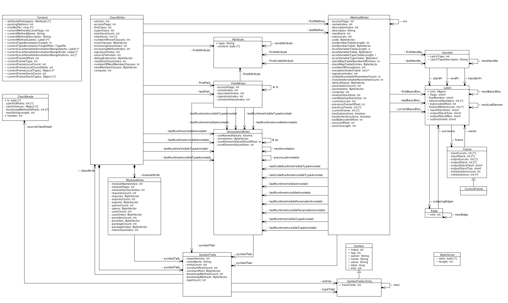

# ASM 6 Developer Guide For Developer

by Eric Bruneton (last update 04/05/2018)

## 1 Introduction
This guide is primarily intended for ASM users that would like to contribute to the ASM code base, although it can be of interest for other users as well. It explains the organization of the code, the main data structures and the most complex algorithms. It also explains the strategies that have been used to optimize ASM performances as well as to minimize its code size, and illustrates this through a concrete example.

本指南主要是为那些想为 ASM 代码库做贡献的 ASM 用户准备的，尽管其他用户也可能对它感兴趣。它解释了代码的组织，主要的数据结构和最复杂的算法。它还解释了用于优化 ASM 性能以及最小化其代码大小的策略，并通过一个具体的例子加以说明。

## 2 Installation
This section explains how to compile the ASM source code, how to test it, and how to build a distribution, which is the first thing to know before contributing to this project. It assumes you have already downloaded the ASM source code, which can be done with git clone https://gitlab.ow2.org/asm/asm.git, or by downloading a snapshot of the git repository from https://gitlab.ow2.org/asm/asm.

本节解释了如何编译 ASM 的源代码，如何测试它，以及如何建立一个发行版，这是为这个项目做贡献之前首先要知道的事情。它假定你已经下载了 ASM 源代码，可以用 
```
    git clone https://gitlab.ow2.org/asm/asm.git，
```
或者从 https://gitlab.ow2.org/asm/asm ，下载 git 仓库的快照。

### 2.1 Overview
The ASM sources are organized in several directories, with one directory per distribution artifact (asm.jar, asm-util.jar, etc), plus a few other directories for building, testing and benchmarking them:

ASM 源被组织在几个目录中，每个分发工件有一个目录（asm.jar，asm-util.jar，等等），另外还有一些其他目录用于构建、测试和基准测试。

+ asm, asm-analysis, asm-commons, asm-tree, asm-util, and asm-xml contain the sources of the corresponding artifacts, together with their unit tests. They use the standard Maven directory layout, which is also the default layout used by Gradle. (asm、asm-analysis、asm-commons、asm-tree、asm-util 和 asm-xml 包含了相应工件的来源，以及它们的单元测试。它们使用标准的 Maven 目录布局，这也是 Gradle 使用的默认布局。)
+ asm-test contains base classes which are used in the previous projects to implement the unit tests, as well as precompiled Java classes which are used as test cases in these projects. (asm-test 包含基类，这些基类在以前的项目中被用来实现单元测试，以及预编译的 Java 类，这些类在这些项目中被用作测试案例。)
+ benchmarks defines some JMH benchmarks to measure the performance of ASM, and to compare it to previous versions (to make sure there are no performance regressions) and to other bytecode manipulation libraries. (基准定义了一些 JMH 基准来衡量 ASM 的性能，并将其与以前的版本进行比较（以确保没有性能退步）以及与其他字节码操作库进行比较。)
+ gradle contains the Gradle wrapper and the Linux and Windows scripts to invoke it. (gradle 包含 Gradle 包装器以及调用它的 Linux 和 Windows 脚本。)
+ tools contains two Gradle projects which are used to build the ASM artifacts: a retrofitter tool used to retrofit classes compiled with Java 6 into Java 5 class files, and a BND plugin to generate a module-info.class for each ASM artifact. Both tools use ASM itself. (工具包含两个 Gradle 项目，用于构建 ASM 工件：一个 retrofitter 工具用于将用 Java 6 编译的类改造成 Java 5 的类文件，一个 BND 插件用于为每个 ASM 工件生成模块信息 .class。这两个工具都使用 ASM 本身。)

The build.gradle file defines the targets that are used to build, test and package the ASM source code. These targets are presented in the following sections. (build.gradle 文件定义了用于构建、测试和打包 ASM 源代码的目标。这些目标将在以下章节中介绍。)

### 2.2 Building
To build everything, use gradle/gradlew build from the main directory. To build a single project, for instance asm-tree, use gradle/gradlew :asm-tree:build. This compiles the code, run the unit tests, and perform other checks to make sure that the code is properly formatted, that it is binary backward compatible with previous ASM versions, and that it is fully covered by unit tests.

要构建所有东西，从主目录中使用 gradle/gradlew build。要构建一个项目，例如 asm-tree，使用gradle/gradlew :asm-tree:build。这将编译代码，运行单元测试，并进行其他检查，以确保代码格式正确，与以前的 ASM 版本二进制向后兼容，并完全由单元测试覆盖。

Note: if the source code formatting verification fails, you can fix this by reformatting it with gradle/gradlew googleJavaFormat.

注意：如果源代码格式化验证失败，你可以用 gradle/gradlew googleJavaFormat 重新格式化来解决这个问题。

### 2.3 Running tests
To test everything, use gradle/gradlew test from the main directory. To test a single project, for instance asm-util, use gradle/gradlew :asm-util:test.

要测试所有东西，从主目录中使用 gradle/gradlew test。要测试单个项目，例如 asm-util，使用gradle/gradlew :asm-util:test。

Test coverage reports can be generated with gradle/gradlew jacocoTestReport. The result is available in the build/reports/jacoco directory of each project.

测试覆盖率报告可以用 gradle/gradlew jacocoTestReport 生成。其结果可在每个项目的 build/reports/jacoco 目录中找到。

### 2.4 Creating a distribution
A binary distribution, containing the compiled artifacts with their Javadoc and sources jar, a POM and digital signatures, can be generated with gradle/gradlew uploadArchives. The result is generated in the /tmp/myRepo directory.

可以用 gradle/gradlew uploadArchives 生成一个二进制发布，包含编译后的工件及其 Javadoc 和sources jar，POM 和数字签名。结果会在 /tmp/myRepo 目录下生成。

Note: the version number used in the files produced when creating a distribution is defined in the header part of the build.gradle file.

注意：创建发行版时产生的文件中使用的版本号在 build.gradle 文件的头部分定义。

## 3 Code review
This section presents the ASM source code organization, the main data structures and the most complex algorithms, which is the next important thing to know, after the installation and building procedures, in order to contribute to this project.

本节介绍了 ASM 的源代码组织，主要的数据结构和最复杂的算法，这是在安装和构建程序之后需要了解的下一个重要内容，以便为这个项目作出贡献。

ASM is organized in several packages:

+ **org.objectweb.asm** is the core package. It defines the ASM visitor API and provides the ClassReader and ClassWriter classes to read and write compiled Java classes. This package does not depend on the other ones and can be used alone.
+ **org.objectweb.asm.signature** provides an API to read and write generics signatures. It is independent of the core package but complements it.
+ **org.objectweb.asm.tree** provides a DOM-like API on top of the SAX-like API provided by the core package. It can be used to implement complex class transformations, for which the core package would be too complicated to use.
+ **org.objectweb.asm.tree.analysis** provides a static bytecode analysis framework on top of the tree package. It can be used in addition to the tree package to implement really complex class transformations that need to know the state of the stack map frames for each instruction.
+ **org.objectweb.asm.commons** provides some useful class adapters that are based on the core and tree packages. These adapters can be used as is or can be extended to implement more specific class transformations.
+ **org.objectweb.asm.util** provides some useful class visitors and adapters that can be used for debugging purposes. It is generally not needed at runtime.
org.objectweb.asm.xml is deprecated. It provided the ability to convert classes to and from XML.

From an implementation point of view the core package is the most complex one. The tree, util and xml packages are very simple (they just convert classes from one high level representation to another one, which is much simpler than converting classes from their byte array form to a high level representation one or vice versa). The signature package is also quite simple (it consists in a parser and a pretty printer for a small grammar). In fact the only packages that are not completely trivial, except the core package, are the commons and analysis packages. But the algorithms used in the analysis package are similar to the one explained in section 3.5. This explains why the rest of this guide is focused on the core package only.

从实现的角度来看，核心包是最复杂的一个。tree 包、util 包和 xml 包非常简单（它们只是将类从一种高级表示法转换为另一种表示法，这比将类从其字节数组形式转换为高级表示法或反之要简单得多）。签名包也很简单（它包括一个解析器和一个小型语法的漂亮打印机）。事实上，除了核心包之外，唯一不完全琐碎的包是共用包和分析包。但分析包中使用的算法与第 3.5 节中解释的算法类似。这就解释了为什么本指南的其余部分只关注核心包。


## 3.2 Main data structures

### 3.2.1 Object model
The core package is made of 28 classes and interfaces. If we exclude the Opcodes interface, the 5 abstract visitor classes ( AnnotationVisitor, ClassVisitor, FieldVisitor, MethodVisitor and ModuleVisitor) and the 6 utility classes (ConstantDynamic, Constants, Handle, Type, TypePath and TypeReference), this leaves only 16 classes, which are depicted in the figure below.

核心包由 28 个类和接口组成。如果我们排除 Opcodes 接口、5 个抽象访问者类（AnnotationVisitor、ClassVisitor、FieldVisitor、MethodVisitor 和 ModuleVisitor）和 6 个实用类（ConstantDynamic、Constants、Handle、Type、TypePath 和 TypeReference），这就只剩下 16个类，如下图所示。



The conversion of compiled classes to visit events is done by only one class, namely the ClassReader class, which uses the auxiliary class Context. The inverse process is done by the other 14 classes, which are organized around the ClassWriter class:

从已被编译的类到访问事件的转换只由一个类完成，即 ClassReader 类，它使用了辅助类 Context。反过来的过程是由其他 14 个类完成的，这些类是围绕着 ClassWriter 类组织的。

+ Classes:
  + the ClassWriter class is the main entry point. It contains fields that describe the class version, access flags, name, etc. It also contains references to other objects that represent the constant pool, the fields, the methods, the annotations and the attributes of the class. (ClassWriter 类是主要的进入点。它包含描述类的版本、访问标志、名称等字段。它还包含对其他对象的引用，这些对象代表了类的常量池、字段、方法、注解和属性。)
+ Constant pool:
  + the SymbolTable class is used to represent the constant pool and the bootstrap methods, as well as an ASM specific type table used to compute stack map frames. These structures are represented both in byte array form and as a hash set of Symbol instances, in order to efficiently test if a given constant pool item, bootstrap method or type has already been added to the symbol table. This class is referenced from the ClassWriter, AnnotationWriter, FieldWriter, MethodWriter and ModuleWriter classes, since classes, annotations, fields, methods and modules need to add the constants they reference to the constant pool and/or the bootstrap methods. (符号表类被用来表示常量池和引导方法，以及用于计算堆栈映射框架的 ASM 特定类型表。这些结构既以字节数组的形式表示，也以符号实例的哈希集表示，以便有效地测试一个给定的常量池项目、引导方法或类型是否已经被添加到符号表中。这个类被 ClassWriter、AnnotationWriter、FieldWriter、MethodWriter 和 ModuleWriter 类所引用，因为类、注释、字段、方法和模块需要将它们引用的常量添加到常量池和/或引导方法中。)
  + the Symbol class is used to represent a single constant pool item, a single bootstrap method or a single ASM specific type used to compute stack map frames. (符号类被用来代表一个单一的常量池项目，一个单一的引导方法或一个用于计算堆栈图框的单一ASM 特定类型。)
+ Fields:
  + the FieldWriter class is used to write fields. It contains fields that describe the field's name, type, signature, value, etc. It also contains references to other objects that represent the field's annotations and attributes. (FieldWriter 类是用来写字段的。它包含描述字段的名称、类型、签名、值等的字段。它还包含对其他对象的引用，这些对象代表字段的注释和属性。)
+ Methods:
  + the MethodWriter class is used to write methods. It contains fields that describe the method's name, signature, exceptions, etc. It also contains references to other objects that represent the method's annotations and attributes. The method's code is stored in a byte array that is constructed during the visit of bytecode instructions. The labels used to reference instructions are stored in a linked list of Label instructions. (MethodWriter 类是用来写方法的。它包含描述方法的名称、签名、异常等字段。它还包含对其他对象的引用，这些对象代表了方法的注释和属性。方法的代码被存储在一个字节数组中，这个字节数组是在访问字节码指令的过程中构建的。用于引用指令的标签被存储在 Label 指令的链接列表中。)
  + the Label class is used to reference instructions, but also to represent basic blocks, which are used for the automatic computation of the maximum stack size and of the stack map frame table of a method. (Label 类用于引用指令，同时也代表基本块，用于自动计算最大堆栈大小和一个方法的堆栈图框架表。)
  + the Handler class is used to represent try catch blocks. Each handler references three Label objects that define the start and end of the try block, and the start of the catch block. (Handler 类用于表示 try catch 块。每个处理程序引用三个 Label 对象，它们定义了尝试块的开始和结束，以及捕获块的开始。)
  + the Frame and CurrentFrame classes are used for the automatic computation of the stack map frames of a method. (Frame 和 CurrentFrame 类用于自动计算一个方法的堆栈图帧。)
  + the Edge class is used to represent the control flow graph of a method, which is a graph of basic blocks, i.e. of Label objects. An Edge is an edge between two Label objects in this graph. (Edge 类用于表示一个方法的控制流图，它是一个基本块的图，也就是 Label 对象的图。一个 Edge 是这个图中两个 Label 对象之间的一个边。)
+ Modules:
  + the ModuleWriter class is used to write the Module, ModulePackages and ModuleMainClass class attributes, which are related to modules (a Java module definition is compiled into a class file containing these attributes). (ModuleWriter 类用于编写 Module、ModulePackages 和 ModuleMainClass 类属性，这些属性与模块有关（一个 Java 模块定义被编译成一个包含这些属性的类文件）。)
+ Annotations:
  + the AnnotationWriter class is used to write annotations. This class is referenced from the ClassWriter, FieldWriter and MethodWriter classes, since classes, fields and methods can have annotations. (AnnotationWriter 类被用来写注解。这个类被 ClassWriter、FieldWriter 和 MethodWriter 类所引用，因为类、字段和方法都可以有注解。)
+ Attributes:
  + the Attribute class is used to read and write non standard class attributes. It must be subclassed for each specific non standard attribute that must be read and written. This class is referenced from the ClassWriter, FieldWriter and MethodWriter classes, since classes, fields and methods can have attributes. (Attribute 类是用来读写非标准类属性的。它必须为每个必须被读写的特定非标准属性进行子类化。这个类被 ClassWriter、FieldWriter 和 MethodWriter 类所引用，因为类、字段和方法可以有属性。)
+ Resources:
  + the ByteVector class is used to serialize the class elements while they are visited. It is used to represent the constant pool, the annotation values, the method's code, the stack map tables, the line number tables, etc. (ByteVector 类是用来在访问类元素时进行序列化的。它被用来表示常量池、注释值、方法的代码、堆栈图表、行号表等。)

### 3.2.2 Collections
The core package does not use any java.util class. Instead, lists, sets and graphs are encoded in dedicated fields of their elements:

核心包不使用任何 java.util 类。相反，列表、集合和图形是在其元素的专用字段中编码的。

Lists are represented as linked lists whose links are stored directly in the list elements themselves. For instance a list of FieldWriter objects is represented as the FieldWriter objects themselves, linked through their fv field. Likewise for MethodWriter, AnnotationWriter, Label, etc. The advantage of this method, compared to using separate objects to store the linked list itself (as in java.util.LinkedList) is that it saves memory. The drawback is that a given element cannot belong to several lists at the same time, but this is not a problem in the ASM case.

列表被表示为链接列表，其链接直接存储在列表元素本身。例如，一个 FieldWriter 对象的列表被表示为FieldWriter 对象本身，通过它们的 fv 字段链接。同样，MethodWriter、AnnotationWriter、Label 等也是如此。与使用单独的对象来存储链接列表本身（如java.util.LinkedList）相比，这种方法的优点是可以节省内存。缺点是一个给定的元素不能同时属于几个列表，但在 ASM 情况下这不是一个问题。

The only hash set used in the core package, in the SymbolTable class, is implemented with an array of SymbolTable.Entry instances (a subclass of Symbol) that can be chained together through their next field (to handle the case of hash collisions). In other words, as for lists, the hash set structure is embedded in the hash set elements themselves. The advantages and drawbacks are the same (saves memory but elements cannot belong to several hash sets at once).

核心包中唯一使用的哈希集，在 SymbolTable 类中，是用 SymbolTable.Entry 实例（Symbol 的一个子类）的数组来实现的，这些实例可以通过它们的下一个字段连锁起来（以处理哈希碰撞的情况）。换句话说，与列表一样，哈希集结构被嵌入到哈希集元素本身。其优点和缺点都是一样的（节省内存，但元素不能同时属于几个哈希集）。

Similarly, the control flow graph (see section 3.5) data structure is embedded in the graph nodes themselves, i.e. in the Label objects.

同样，控制流图（见第 3.5 节）的数据结构被嵌入到图的节点本身，即 Label 对象中。

Since Label objects must be stored in several data structures at the same time, they have several distinct fields that encode these data structures:

由于 Label 对象必须同时存储在几个数据结构中，它们有几个不同的字段来编码这些数据结构。

+ the nextBasicBlock field is used to encode the list of labels of a method, in the order they are visited. (nextBasicBlock 字段用于编码一个方法的标签列表，按其访问顺序排列)
+ the outgoingEdges field is used to store the list of Edge objects (linked through their nextEdge field) that represent the control flow graph data structure. (outgoingEdges 字段用于存储代表控制流图数据结构的 Edge 对象（通过其 nextEdge 字段链接）的列表。)
+ the nextListElement field is used to store temporary lists of labels in the algorithms used to compute the maximum stack size and stack map frames of methods (see section 3.5.1). (nextListElement 字段被用来在用于计算方法的最大堆栈大小和堆栈映射框架的算法中存储临时的标签列表（见 3.5.1 节）。)
  
## 3.3 Main algorithms

### 3.3.1 ClassReader
The ClassReader algorithm is quite straightforward. It is summarized below.

ClassReader的算法是非常直接的。它总结如下。

+ parse the constant pool and the bootstrap methods (in the constructor):
  + store the start offset of each constant pool item in cpInfoOffsets
  + store the start offset of each bootstrap method in bootstrapMethodOffsets
  + store the size of the longest string constant in maxStringLength
+ parse the class (in the accept and read* methods):
  + parse the header
  + parse the class attributes. Depending on the complexity of the attribute:
    + either parse it and store its value in a local variable (for attributes containing a simple value),
    + or store its start offset in a local variable (for attributes with a complex structure)
  + call the visit methods corresponding to the detected attributes. For complex attributes, which were not parsed in the previous step (such as annotations), parse them and visit them at the same time: i.e. parse one part, visit it, parse the next part, visit it, etc.
  + for each field (in the readField method):
    + parse the header
    + parse the field attributes. Depending on the attribute:
      + either parse it and store its value in a local variable,
      + or store its start offset in a local variable
    + call visitField
    + call the visit methods corresponding to the detected attributes. For complex attributes, which were not parsed in the previous step (such as annotations), parse them and visit them at the same time: i.e. parse one part, visit it, parse the next part, visit it, etc.
    + call visitEnd
  + for each method (in the readMethod method):
    + parse the header
    + parse the method attributes. Depending on the attribute:
      + either parse it and store its value in a local variable,
      + or store its start offset in a local variable
    + call visitMethod
    + if the returned visitor is a MethodWriter, and if its ClassWriter's constant pool was copied from this reader (see section 3.3.2), the method bytes can be copied as is: then skip all steps below.
    + call the visit methods corresponding to the detected attributes. For complex attributes, which were not parsed in the previous step (such as annotations), parse them and visit them at the same time: i.e. parse one part, visit it, parse the next part, visit it, etc.
    + for the special case of the Code attribute (in the readCode method):
      + find the labels and store them in the Context.currentMethodLabels array
        + look for labels in the code
        + look for labels in the exception handlers
        + look for labels in the line number and local variable tables
        + look for labels in the other code attributes
      + if there is a stack map table, parse the first frame
      + parse the instructions
        + if there is a stack map frame for this offset, call visitFrame, and parse the next frame
        + if there is a label for this offset, call visitLabel
        + if there is a line number entry for this offset, call visitLineNumber
        + call visitXxxInsn
      + call visitAttribute for each non standard code attribute parsed during second step
      + call visitMaxs
      + call visitEnd
    + call visitEnd
  + call visitEnd

Some points are interesting to note:

有几点是值得注意的。

+ the visit of line numbers and stack map frames is interleaved with the visit of instructions. In the case of stack map frames, not only the visit, but also the parsing of the stack map table and of the method's code is interleaved. The advantage, compared to a parsing of the stack map table followed by a parsing of the method's code, is that no complex data structure is needed to store the parsed frames for the second step.
行号和堆栈图框架的访问与指令的访问是交错进行的。在堆栈地图框架的情况下，不仅是访问，而且堆栈地图表和方法代码的解析也是交错进行的。与先解析堆栈图表再解析方法代码相比，其优点是不需要复杂的数据结构来存储第二步解析的框架。

+ constant pool items are parsed every time they are referenced, except for Utf8 and ConstantDynamic items, whose values are cached in the cpInfoValues array. Not also that a single char array is reused to parse these items. It must be large enough to parse the longest string, hence the computation of maxStringLength in the constructor.
除了 Utf8 和 ConstantDynamic 项目，它们的值被缓存在 cpInfoValues 数组中，常量池项目每次被引用时都会被解析。也不是说一个 char 数组被重复使用来解析这些项目。它必须大到足以解析最长的字符串，因此在构造函数中计算了 maxStringLength。

### 3.3.2 ClassWriter, AnnotationWriter, FieldWriter, MethodWriter and ModuleWriter
Since the visit of the class members can be interleaved (it is possible to start visiting a field, then start visiting a method, go back to visit annotations of the field, continue with some instructions of the method, visit attributes of the field, add new instructions to the method, and so on), it is not possible to construct the class file's byte array in a sequential order, from beginning to end. Instead it is necessary to use several byte vectors that can grow simultaneously. This is why there are several writer classes, unlike for the reader case.

由于对类成员的访问可以交错进行（有可能开始访问一个字段，然后开始访问一个方法，回去访问字段的注释，继续方法的一些指令，访问字段的属性，为方法添加新的指令，等等），所以不可能按照从头到尾的顺序来构造类文件的字节数。相反，有必要使用几个可以同时增长的字节向量。这就是为什么有几个写作者类，与读者的情况不同。

The ClassWriter class is the main entry point. It contains the class header elements and the lists of its fields and methods, as well as a SymbolTable instance, containing the constant pool items and the bootstrap methods of the class. This symbol table uses a hash set of Symbol objects, in order to avoid adding the same item several times in the constant pool or in the bootstrap methods array. The symbol table can be created from an existing class by passing a ClassReader argument to its constructor. This allows unchanged methods to be copied as is from a class reader to a class writer, without visiting their content (see section 3.3.1).

ClassWriter 类是主要的进入点。它包含了类的头元素和它的字段和方法的列表，以及一个 SymbolTable 实例，包含了类的常量池项目和引导方法。这个符号表使用一个 Symbol 对象的哈希集，以避免在常量池或引导方法数组中多次添加相同的项目。符号表可以通过向其构造函数传递一个 ClassReader 参数从一个现有的类中创建。这允许将未改变的方法原封不动地从一个类的读取器复制到一个类的写入器，而不访问它们的内容（见 3.3.1 节）。

The AnnotationWriter, FieldWriter and ModuleWriter classes are quite simple: they convert visit events to a byte array representation, by using the class writer's SymbolTable in order to add constant pool items when necessary. The most complex writer class is the MethodWriter class, because it manages advanced features such as the automatic computation of the maximum stack size and number of local variables of a method, the automatic computation of its stack map frames, as well as the automatic management of short versus long jump instructions. Without these features, each visitXxxInsn method would be very simple, i.e. it would just add the bytecode representation of an instruction to the code byte vector.

AnnotationWriter、FieldWriter 和 ModuleWriter 类非常简单：它们将访问事件转换为字节数组表示，通过使用类写作者的 SymbolTable，以便在必要时添加常量池项目。最复杂的写入器类是 MethodWriter 类，因为它管理着一些高级功能，如自动计算最大堆栈大小和方法的局部变量数量，自动计算其堆栈映射框架，以及自动管理短跳与长跳指令。如果没有这些功能，每个 visitXxxInsn 方法将非常简单，也就是说，它只是将指令的字节码表示添加到代码字节向量中。

Instead, in order to be able to automatically compute the maximum stack size, the maximum number of local variables and the stack map frames, each visitXxxInsn method does the following:

相反，为了能够自动计算最大堆栈大小、局部变量的最大数量和堆栈映射框架，每个 visitXxxInsn 方法都做了以下工作。

+ append the instruction to the code byte vector
+ if (currentBasicBlock != null) // if some automatic computation is needed
  + if (compute == COMPUTE_ALL_FRAMES || compute == COMPUTE_INSERTED_FRAMES)
    + simulate the execution of this instruction on the stack frame
  + else // compute == COMPUTE_MAX_STACK_AND_LOCAL
    + simulate the execution of this instruction on the stack height
  + keep track of the local variables used, if any
  + keep track of the successors of this instruction
  + update currentBasicBlock

The maximum stack size or the stack map frames are actually computed in the computeMaxStackAndLocal and computeAllFrames methods, by using the control flow graph constructed in the visitXxxInsn methods (see section 3.5 for more details).

最大的堆栈大小或堆栈图帧实际上是在 computeMaxStackAndLocal 和 computeAllFrames 方法中计算的，通过使用 visitXxxInsn 方法中构建的控制流图（更多细节见 3.5 节）。

### 3.3.3 Label
From a user point of view the Label class is used to reference instructions. Internally it is used to store the bytecode offset of an instruction (i.e. the bytecode array index of the first byte of the instruction), and to compute relative bytecode offsets (i.e. the difference between the bytecode offsets of two instructions). It is also used to represent basic blocks, which are used for the automatic computation of the maximum stack size and of the stack map frames of a method (see section 3.5).

从用户的角度来看，Label 类是用来引用指令的。在内部，它被用来存储指令的字节码偏移量（即指令第一个字节的字节码数组索引），以及计算相对字节码偏移量（即两条指令的字节码偏移量之差）。它也被用来表示基本块，用于自动计算最大堆栈大小和方法的堆栈映射框架（见3.5节）。

Jump instructions such as IFEQ or GOTO are stored in bytecode as an opcode followed by a relative bytecode offset to the target instruction (this relative offset is the difference between the bytecode offset of the target instruction and the bytecode offset of the jump instruction). This relative offset can be computed easily in the case of a backward jump (i.e. a jump to an instruction that is before the jump instruction in the bytecode), but it cannot be computed at all in the case of a forward jump (i.e. a jump to an instruction that is after the jump instruction) since, in this case, the target instruction has not been visited yet, and so its bytecode offset is unknown. The case of forward jumps is solved in the following way:

像 IFEQ 或 GOTO 这样的跳转指令在字节码中被存储为一个操作码，后面是目标指令的相对字节码偏移量（这个相对偏移量是目标指令的字节码偏移量和跳转指令的字节码偏移量之间的差异）。在后向跳转（即跳转到字节码中跳转指令之前的指令）的情况下，这个相对偏移量可以很容易地计算出来，但是在前向跳转（即跳转到跳转指令之后的指令）的情况下，它根本无法计算出来，因为在这种情况下，目标指令还没有被访问，所以它的字节码偏移量是未知的。前向跳转的情况按以下方式解决。

The jump instruction is written with a (temporary) relative offset equal to 0.
The target Label object is updated to memorize the fact that this jump instruction makes a forward reference to this label (the forwardReferences array in Label is used for that).

目标 Label 对象被更新，以记住这个跳转指令对这个标签做了一个前向引用（Label 中的forwardReferences 数组被用于此）。

When this label is visited, i.e. when its bytecode offset becomes known, all the forward jump instructions to this label (given by forwardReferences) are updated, to replace the temporary relative offsets with their real values, which can now be computed.

当这个标签被访问时，即当它的字节码偏移量被知道时，所有到这个标签的前向跳转指令（由forwardReferences 给出）都被更新，以用它们的实际值替换临时的相对偏移量，现在可以计算出来。

### 3.3.4 toByteArray
The toByteArray method in ClassWriter puts together all the pieces constructed in the various writer classes in order to get the full byte representation of the class. This is done in two steps:

ClassWriter 中的 toByteArray 方法把在各个写入器类中构建的所有部分放在一起，以获得该类的完整字节表示。这分两步完成。

the size of the class is computed by summing the size of all the pieces, which is given by the getSize method (this method can add items to the constant pool, which modifies its size; this is why the constant pool size is added only at the very end).

类的大小是通过所有片断的大小相加来计算的，这是由 getSize 方法给出的（这个方法可以向常量池添加项目，从而修改其大小；这就是为什么常量池的大小只在最后添加）。

a byte vector of this size is allocated, and the pieces are copied into this vector in the right order. This is done by calling the putXxx method on each piece (e.g. putFieldInfo on each FieldWriter).

一个这个大小的字节向量被分配，并且这些碎片被按正确的顺序复制到这个向量中。这是通过在每一块上调用putXxx 方法来完成的（例如，在每个 FieldWriter 上调用 putFieldInfo）。

### 3.4 (后续暂缓)
(暂缓)