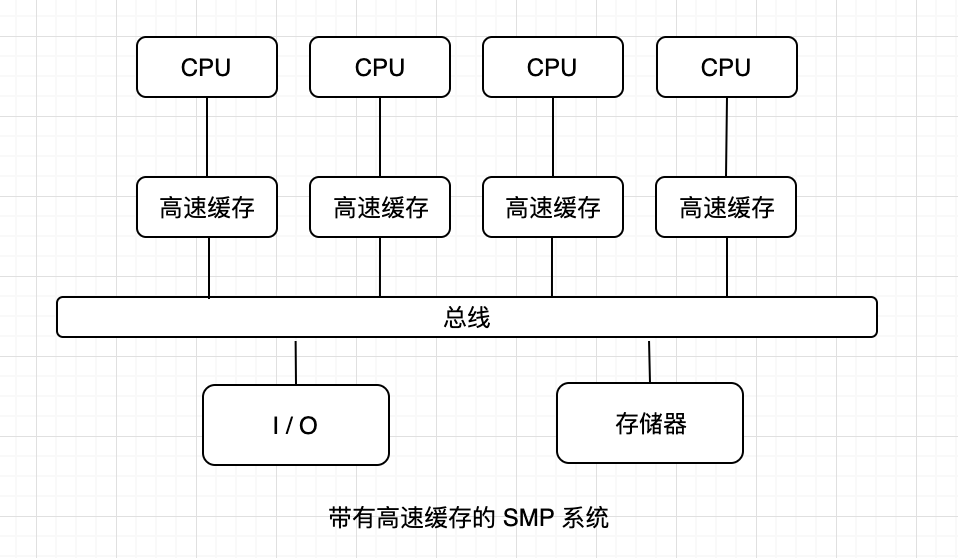
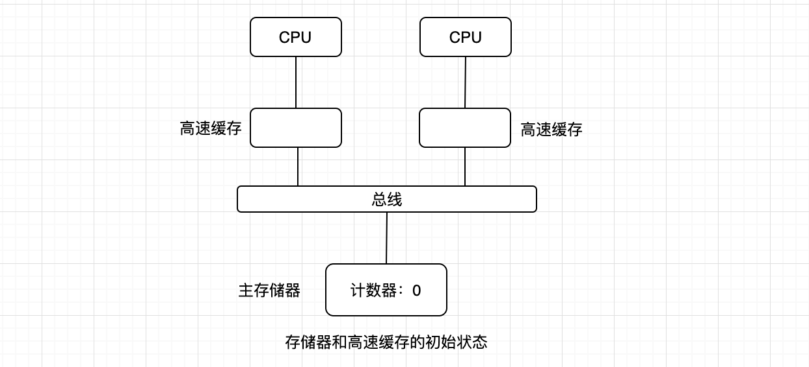
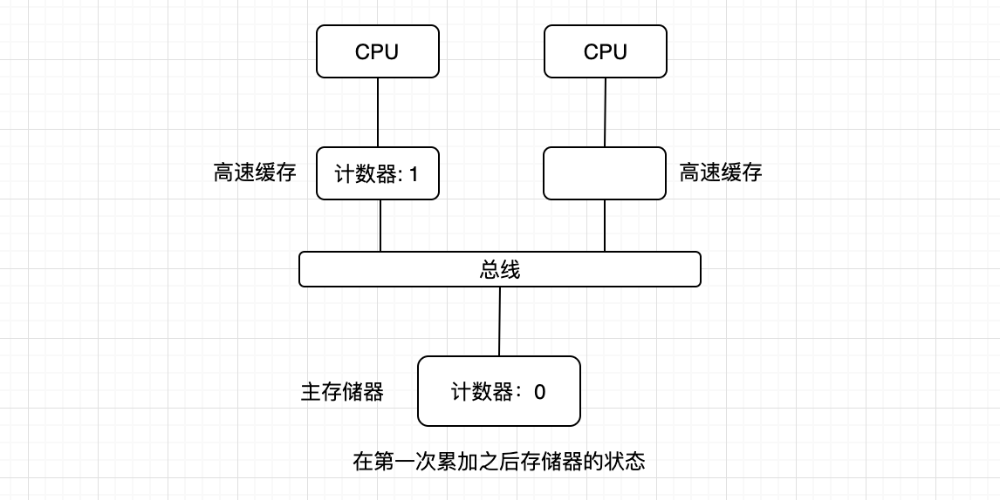
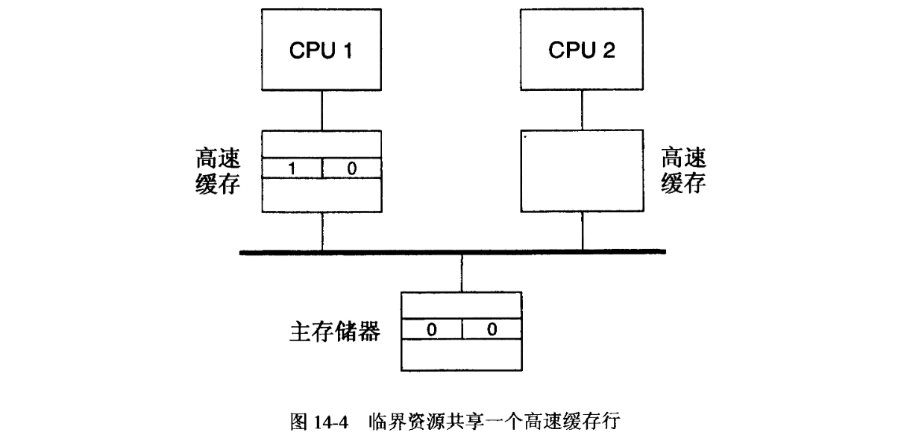
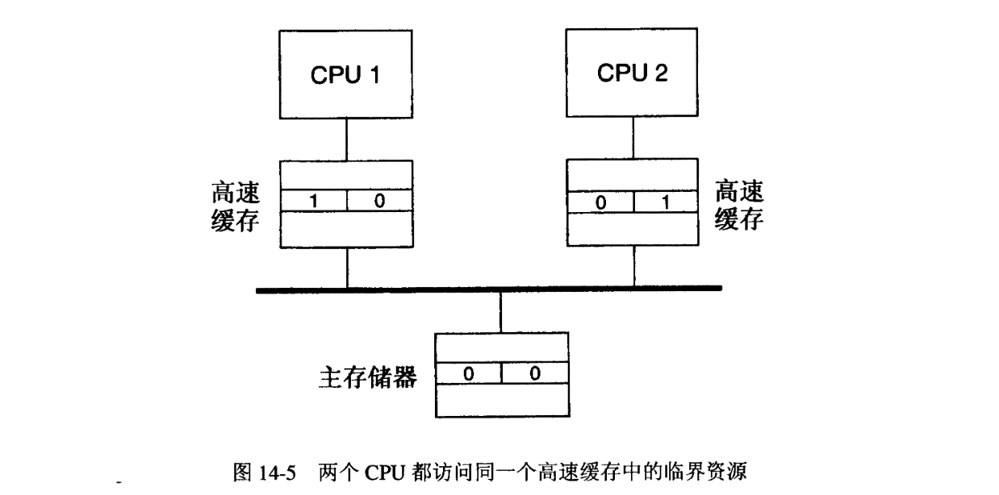
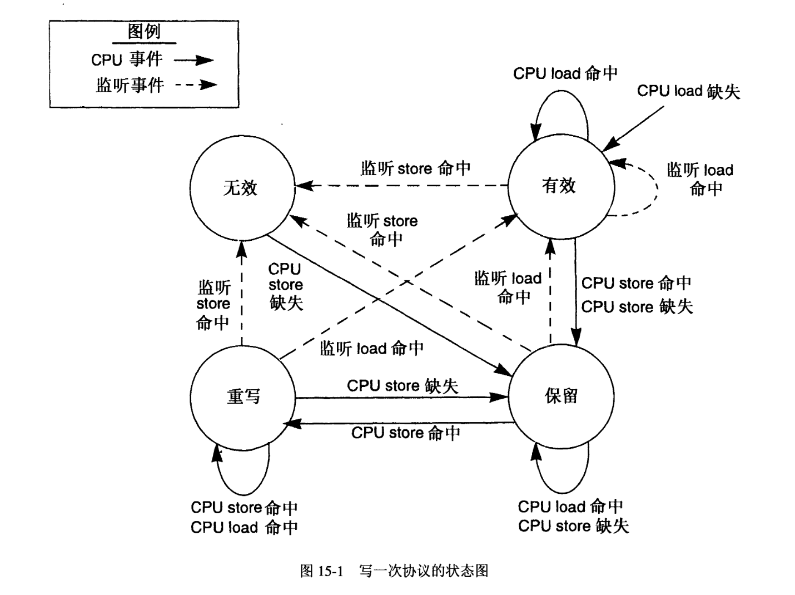
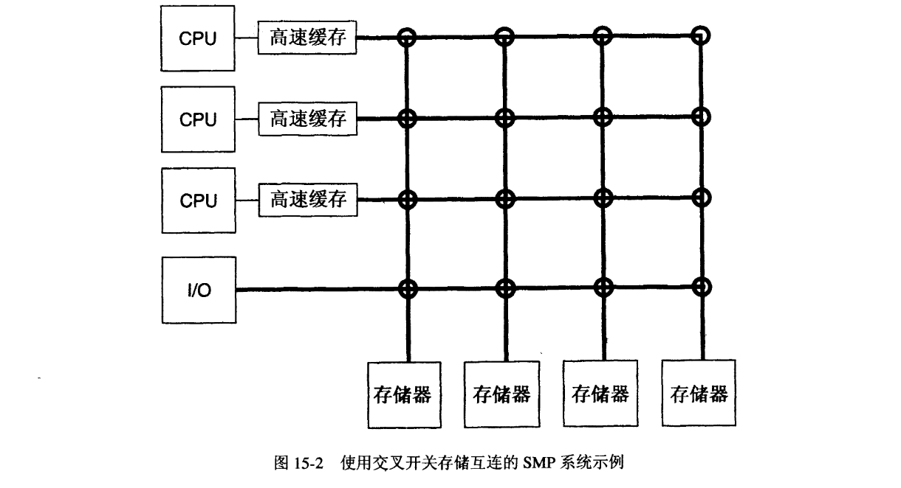
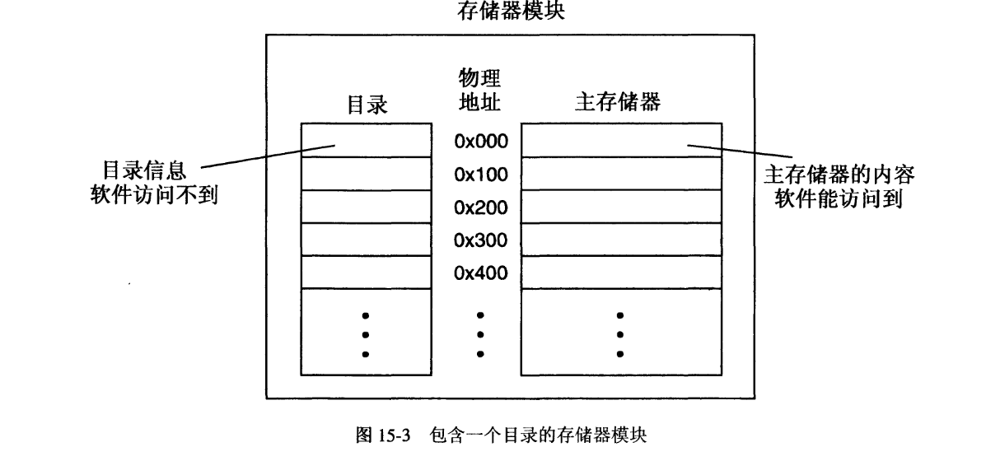
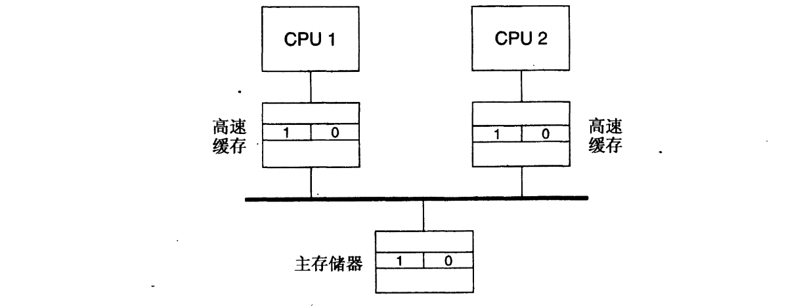
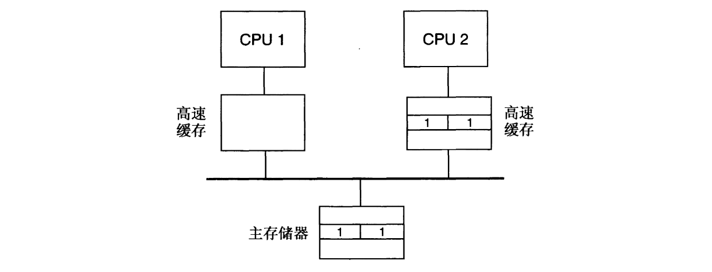

# 第三部分 带有高速缓存的多处理机系统

[TOC]

## 1 MP 高速缓存一致性概述
本节介绍在多处理机系统中使用高速缓存。先介绍 SMP 系统常用的组织结构，接着讨论 MP 高速缓存机制给操作系统带来的问题，然后我们展示如何使用软件技术来解决这些问题。解决 MP 高速缓存问题的硬件技术则在下一节介绍。

### 1.1 引言
高速缓存通过利用局部引用特性来提供一条减少存储器平均存取时间的途径。当然，多处理机也非常需要有这样的好处，因此成了给这些系统增加高速缓存的动机。带有高速缓存的典型 SMP 系统如下图所示。



在这种组织结构中，每个 CPU 都有一块私有的高速缓存，这是在 SMP 系统中最常用的方法。虽然 CPU 还是有可能使用某种形式的共享高速缓存，比如让两个或者两个以上的 CPU 连接到一块公共的高速缓存上，或者在总线和主存储器之间放一块高速缓存，但是使用私有的高速缓存具有几个优点。首先，将高速缓存直接连接到 CPU 使得在高速缓存中命中时存取时延最小。这免去了如果高速缓存处于靠近主存储器单元的位置时需要的一次总线操作。既然往往 90% 或更高的处理器引用都是在高速缓存中命中的，那么这样做就等同于节省了总线交易量（正如将要看到的那样，维护一致性需要一些额外的总线交易，这稍稍降低了实际的节约量）。减少总线操作反过来又降低了对总线和存储器带宽的需要量，从而有可能比没有高速缓存时，或者比使用和主存储器相关联的共享高速缓存时，使系统支持更多的处理器，减少总线操作也有助于减少总线争用，从而能迅速存取主存储器。最后，任何类型的共享高速缓存都会在访问它的 CPU 之间造成一定的争用。访问一块私有高速缓存则不会有这样的争用发生。结果，带有高速缓存的 MP 系统能够比不带高速缓存的 MP 系统性能更好。

私有高速缓存的组织结构已经成为现代微处理器的设计人员所倡导，因为这些系统中的大多数都包含有片上的私有高速缓存。MIPS R400、Intel 80486 和 Pentium 以及 T1 SPARC 处理器都是例子。因为大多数商业的 SMP 系统都是使用这些微处理器制造的，所以本书剩下来的内容就着眼于私有高速缓存的设计。在 Silicon Graphics、Sequent Computer Systems、DEC、IBM、Pyramid Technology、Sun Microsystems 等公司的系统中都已经采用了私有高速缓存的设计。

正如将会在下一节里看到的那样，设计人员一般喜欢物理高速缓存，或者是能物理索引的虚拟高速缓存（如 Intel i860 XP 的片上高速缓存)。每个 CPU 也可能有独立的指令和数据高速缓存，或者是一种层次结构的高速缓存，但是会认为连接到每个 CPU 的高速缓存是一样的。虽然可以设计一个系统，其中每个 CPU 都带有不同组成的高速缓存，但是实际的 SMP 系统通常都是采用相同的 CPU /高速缓存模块来构建的。高速缓存组织结构相同也简化了操作系统的复杂性，因为它的设计只需要处理一种高速缓存的类型。

注意，有了高速缓存并不会改变 SMP 体系结构的主要性质。这样的系统仍然是紧密耦合的，使用了一个能够全局访问的共享存储器单元，而且仍然表现除了对那个单元存取的对称性。但是，正如将看到的那样，增加私有缓存会影响到系统的存储模型。可以采用硬件或者软件技术（或者二者的结合）来恢复成一种熟悉的存储模型，如顺序存储模型。

MP 的操作系统必须解决好系统完整性、性能以及外部编程模型等领域内的问题。对于带有高速缓存的 MP 系统上的内核来说也是如此。就好比必须对操作系统加以修改以处理多处理机一样，也必须对它进行修改，使之能够在有多块高速缓存存在的情况下正确地执行。根据高速缓存硬件设计的不同，这可能需要比第一部分介绍的高速缓存基本维护任务更多的工作，这些附加的工作也可能会影响到系统的性能。最后还认定，高速缓存的出现不会影响到外部编程模型。考虑到本书的目的，在第二部分中描述的系统上正确运行的任何用户程序无需修改就能在这里描述的系统上正确执行。另外，高速缓存对于用户程序来说是不可见的。

因此，管理带有高速缓存的一个 MP 系统，其挑战性涵盖了维护高速缓存一致性的所有方面，以及互斥和同步的所有领域。现在完成这些工作都必须要保证它们在多个高速缓存之上是同步的。

### 1.2 高速缓存一致性问题
如果软件不可能访问到过时的数据，那么就称高速缓存同主存储器是一致的。例如，通过适时冲洗高速缓存的软件技术，或者通过利用具有总线监视功能的物理高速缓存的硬件，就能做到这一点。在 MP 系统上，多个 CPU 可能要同时存取共享的数据，对于支持顺序模型的 MP 系统来说，如果从任何处理器对任何共享存储位置的读取总是返回那个位置最近写入的值，那么就称该系统的高速缓存是一致的。如前所述，术语”高速缓存一致性（cache consistency）“和”高速缓存一致性（cache coherency)" 可以互相使用。

用下面的例子可以引出在 MP 系统上维护高速缓存一致性的问题。假定一个双 CPU 系统使用了不带总线监视功能的写回/写分配物理高速缓存，或者能够维护高速缓存一致性的任何特殊硬件。假定两种高速缓存初始为空（也就是说，所有的高速缓存行都标记为无效）。考虑一个这样的进程，它睡眠一秒钟，累加计数器一次，然后再睡眠，周而复始。假定这是系统中唯一正在进行的活动，所以没有别的什么会干扰高速缓存的内容。如果计数器初始为 0，那么在进程第一次运行之前，高速缓存和存储器的状态如下图所示。



如果进程运行在 CPU1 (左) 上，当它试图累加计数器的时候，不会在高速缓存中命中。这将让它从存储器里读取到 0，将这个值加 1 再写回到高速缓存中。因为是物理高速缓存，所以在现场切换的时候不会冲洗它们，于是，当进程再度睡眠的时候，存储器的状态如下图所示。



如果进程下一次醒来后在 CPU1 上运行，那么它在高速缓存中可以命中计数器变量，并且正确地将其值更新为 2。但是，如果它是在 CPU2 上运行的，那么它在 CPU2 的高速缓存中不会命中计数器变量，并且从主存储器中读取到了过时的值。之所以出现这样的情况，是因为没有采取任何措施来保持两块高速缓存的一致性。绝对不应该允许像这样的不一致性出现。

乍一看，似乎改用写直通高速缓存机制可能会解决这个问题，因为那样一来，存储器始终会更新。但是，这不足以完全解决一致性问题。如果在 CPU1 最初把计数器增加到 1 的时候就已经采用了写直通方式，那么主存储器和 CPU1 上的高速缓存都包含有计数器的值 1。如果接下来进程在 CPU2 上运行，那么当它没有在高速缓存中命中的时候，实际上它是在主存储器里读取到正确值的。它也会把更新后的值 2 写回到主存储器，于是存储器里的值也是正确的。但是，如果进程现在又在 CPU1 上运行，那么它会在计数器的过时值上产生一次高速缓存命中。CPU1 仍然高速缓存着值 1，因为从 CPU2 到存储器的写直通操作对 CPU1 的高速缓存没有影响。

举第二个例子，考虑这样的情况，两个处理器同时试图访问并修改共享数据，就像经典的 Dekker 算法一样，再假定采用了写直通高速缓存机制，高速缓存初始为空。如果两个处理器同时进入 lock 函数，获得了同一个锁，那么 Dekker 算法就不能正常起作用。在这种情况下，每个 CPU 都把它的锁状态设为 LOCKED；但是，使用写回高速缓存机制则意味着另一个 CPU 不能立即看到这些保存操作的结果。它们都从存储器中取得另一个 CPU 锁状态的过时值，并且认为自旋锁是空闲的。于是，两个处理器都认为它们已经得到了自旋锁。注意，写回高速缓存的出现和上一章里 SPARC store 缓存的出现非常类似。高速缓存改变了 MP 系统的存储模型，使之类似于 PSO。但是有一点不同，store 缓冲的内容保证会在不确定的一段时间内被写入到主存储器。采用写回高速缓存的情况下，保存在高速缓存中的数据会一直留在哪里，直到将来的一次高速缓存缺失期间显式地冲洗或者替换它为止。因此，在一段不确定长度的时间里，主存储器的内容一直是过时的。

和以前一样，使用写直通高速缓存机制不会完全解决采用 Dekker 算法时的一致性问题。如果第二个 CPU 试图获得由第一个 CPU 占有的锁，那么它将从主存储器中读取到另一个处理器正确的锁状态，看到那个锁正在用，于是它要么在另一个 CPU 的锁状态上自旋，要么在锁的 turn 字段上自旋。当这个锁被释放的时候，如果使用了写直通高速缓存机制，那么存储器中的这些字段便会被更新。但是试图获得锁的 CPU 已经在高速缓存中缓存了这些字段的值，它将继续在这些过时的值上自旋下去。因为写入主存储器的操作不会影响到那个 CPU 的高速缓存中的内容，所以在有什么东西让过时的高速缓存行变得无效或者被替换掉了，比如发生了一次中断，中断处理程序引用到了索引到相同高速缓存行的存储器之前，它一直都在自旋。如果没有什么让过时的高速缓存行变得无效，那么处理器将会永远自旋下去。

接下来，考虑当一个处理器试图重新获得它以前释放的锁时会发生什么情况。假定在处理器释放了锁之后，另一个 CPU 得到了这个锁，并且仍然占据着它。当调用 lock 重新获得锁的时候，它将 CPU 的锁状态字段设为 LOCKED 状态，并且检查另一个 CPU 的状态。因为在前面它获得锁的时候，它已经检查过这个状态，所以到处理器重新获得锁的时候，另一个 CPU 的状态可能仍然缓存在高速缓存中。如果仍然缓存着，那么缓存的状态肯定过时了，因为另一个处理器在获得锁的时候，已经把它的状态设为 LOCKED 了，重新获得锁的处理器将会看到这个错误的、过时的数据，于是认为锁还是空闲的。这违反了锁的语义，必须予以避免。

打开自旋锁也会有高速缓存一致性问题。如果采用了写回高速缓存机制，释放锁的保存操作没有被立即送到主存储器，从而造成另一个试图获得锁的处理器使用了过时的值。同样，即使采用了写直通高速缓存机制，另一个处理器以前已经在高速缓存中缓存了这些字段的值，对主存储器的写操作现在已经让它们过时了。于是在锁释放以后，那个处理器会以为锁仍然被占据着。

在任何时候，只要有一个以上的 CPU 存取和修改数据，那么这些基本的高速缓存一致性问题就会以各种方式显现出来。注意，这个说法既包括用户数据，也包括内核数据。为了解决这个问题，需要一种技术来保持高速缓存内容的一致性。这能以软件或者硬件的方式做到。软件解决方案包括适时冲洗高速缓存，以防止过时的数据被访问到。例如，通过在 CPU 每次做现场切换的时候将高速缓存的内容写回主存储器（如果使用了写回高速缓存机制的话），并使高速缓存无效，就能修正我们这里研究过的第一个例子。这会让进程每次醒来的时候发送高速缓存缺失，从而让它从主存储器中读取计数器的当前值。遗憾的是，这样做丧失了物理高速缓存的主要优点之一，既免去了现场切换时的冲洗时间。正因为如此，人们已经发明出硬件技术来自动地保持高速缓存和主存储器的一致性。扩展总线监视的概念，使得高速缓存不仅监视总线上的 I/O DMA 交易，而且也监视其他高速缓存的活动，就能达到上述目的。

为了全面理解 MP 高速缓存一致性的复杂性，下面几小节将首先介绍软件上的高速缓存一致性技术。因为纯软件技术的复杂性和糟糕的性能，所以在实际中很少采用，但是它们清楚地演示了必须要解决的问题。随后的讨论适合于所有类型的高速缓存，无论它们是虚拟或者物理索引的，还是虚拟或者物理标记的。硬件高速缓存一致性在下一节介绍。


### 1.3 软件高速缓存一致性
当通过软件技术来维护高速缓存一致性的时候，要注意的第一种情况是，对于只读数据来说，不需要特殊对待。因为这类数据绝不会改变，被高速缓存的任何副本都将于主存储器中的副本相吻合，因此默认就是一致的。特别地，正常的程序正文（指令）和内核正文都属于这类数据（当然不包括能自我修改的代码）。于是，在上一节中程序累加计数器的例子里，为了保持一致性，在现场切换的时候，只有进程的数据需要从高速缓存中冲洗掉。如果系统使用独立的指令和数据高速缓存，那么可以不管指令高速缓存。

但是，要注意，在进程退出的时候，不能免去内核执行冲洗指令高速缓存的任务。在采用物理高速缓存的情况下，第 6 章中介绍的所有管理措施都必须执行。但是，现在必须对系统中所有的高速缓存中都执行一遍。例如，当上一个例子中的进程退出时，留在两个处理器的高速缓存中的指令必须在重用其对应的物理页面之前冲洗掉。在硬件没有保持高速缓存一致性功能的系统上，只能从高速缓存连接的 CPU 冲洗它。所以，如果进程在 CPU1 上退出，那个 CPU 必须通知 CPU2 冲洗它的高速缓存。根据硬件的不同，这可以有多种方式来实现。例如，有些系统支持 CPU 间的中断（inter-CPU interrupt），这种机制允许一个 CPU 向另一个 CPU 发送中断。使用这种机制时，可以向主存储器写入一则消息，指出要采取什么样的措施。也可以有各种优化措施。例如，如果进程从来不在 CPU2 上运行，那么在进程退出的时候，不需要那个 CPU 冲洗它的高速缓存。因此，内核能够跟踪每个进程运行在哪个多处理器上，以减少需要其他处理器完成的高速缓存冲洗量。

另一种可能是使用 7.4 节介绍的滞后的高速缓存无效操作。如果采用了物理高速缓存，那么使高速缓存无效操作能够被推迟到将脏列表（dirty list）的内容移入清洁列表（ clean list) 时再进行。此刻，所有的 CPU都得到通知，冲洗它们的高速缓存，旋即清理干净了高速缓存中的全部过时项。

当多个处理器存取和修改共享数据时，会出现 MP 高速缓存一致性的主要问题。接下来的两小节介绍解决这些问题所必需的附加管理措施。处理共享数据有两种主要的方案：使用无高速缓存的操作，以及有选择性地冲洗共享数据。这些技术都可以运用到第一部分介绍的 4 种高速缓存结构上。

#### 1.3.1 共享数据不被高速缓存
在这种方法中，MP 一致性问题首先是通过绝不允许能够为一个以上 CPU 修改的数据被高速缓存来消除的。在 ELXSI SYSTEM  6400  （一种在 20世纪 80年代中期的系统）上就使用了这项技术。为了实现这个目的，高速缓存必须指示一种无高速缓存的模式（uncached mode)。正如在第一部分里提到的那样，大多数体系结构都允许以页面为单位指定这项要求。因此，必须把处理器之间共享和修改的数据组织到和只读数据分开的页面中。如果使用了层次结构的高速缓存，那么它们都必须把这些共享数据当做无高速缓存的数据来对待。

除了只读数据和共享数据之外，在 MP 系统中还有第三类数据: 处理器的私有数据。这是一次只能由一个 CPU 存取和修改的数据。如果像下面这样地进行冲洗，那么它也可以被高速缓存。和用户进程相关的正文、数据和堆栈就是处理器私有数据的一个例子。在传统的 UNIX 系统中，进程里只有一条控制线程，因此进程一次只能在一个处理上执行。除了在调试进程期间之外，系统中的其他处理器都不能访问它的地址空间，所以当它正在运行的时候，可以安全地高速缓存它的地址空间（调试进程的情况和多线程进程的情况一样，以后介绍）。如果执行一次现场切换，并且进程在不同的处理器上运行，那么它以前运行的处理器的高速缓存必须先行冲洗（使主存储器有效，而使高速缓存无效），以此按 1.2 节指出的那样保持一致性。以这种方式将一个进程从一个处理器移到另一个处理器的动作称为进程迁移（process migration）。

对于使用虚拟高速缓存的系统来说，每次现场切换期间，无论如何都要冲洗高速缓存，所以在进程迁移的情况下就不需要额外的冲洗。但是，对于其他高速缓存组织结构来说，必须按照刚才介绍的那样进行冲洗。注意，这样做抵消了这些高速缓存的主要优点之一: 避免在现场切换时刻的冲洗操作。通过把一个进程和一个特殊的处理器绑定起来，意味着在每次现场切换时不允许进程迁移，就能够部分地挽回这一优势。在现场切换期间，只有上次运行这个进程的处理器才能选择它。于是这就解决了一致性问题（以这种方式绑定进程也称为处理器绑定（processor affinity))。如果所有的进程都永久性地绑定到单个处理器上，那么负载在系统中所有的处理器上极有可能是不均衡的。因此，把进程绑定到处理器上的系统也必须定期地解除绑定，把负载重新均匀分布到各个处理器上。当完成类似这样的负载均衡歉意（load-balancing migration) 时，必须冲洗高速缓存，但是这样的冲洗发生的频率要比每次现场切换都冲洗要低。注意，在采用主从处理器机内核实现时，除了很短的一段时间之外，很难做到处理器绑定，因为为了执行系统调用，进程必须迁移到主处理器上。因此，处理器绑定更适合于多线程内核。

如果系统允许在一个地址空间中有多个线程，那么就不能允许这些线程同时在多个处理器上执行，因为共享的地址空间不会保持一致。从高速缓存一致性的角度来看，调试进程的情况非常像线程，因为另一个进程获得许可，可以访问其他进程的地址空间（通常是通过特殊的系统调用）。当单独使用软件上的高速缓存一致性技术时，在这些情况下，没有高效的解决方案。一种方法是，使得进程的整个地址空间都不被高速缓存。于是，任何处理器都可以在任何时刻执行任何线程，而不会有一致性问题，代价是为了无高速缓存操作而造成的性能损失。类似地，可以让一个进程的地址空间在调试器开始访问它的地方不被高速缓存。另一种方法是，将一个进程内的所有线程绑定到一个处理器上（类似地，强行让调试器和它正在调试的进程同在一个处理器上）。于是，地址空间可以被高速缓存，但是一次只能执行一个线程。在这种情况下，所有的线程都随着进程一起迁移。

使用共享存储器或者映射文件的两个进程必须像对待线程那样进行处理。如果共享存储器被高速缓存了，那么为了保持一致性，一定不允许这样的进程同时在不同的处理器上运行。和线程一样，将这些进程绑定到一个处理器上，就能解决这个问题。另一种方法是，可以使得共享存储页面不被高速缓存，从而允许共享它们的进程在任何地方执行，并且自由地迁移，但是当访问那些页面的时候，性能会降低。

另一种处理器私有数据是与每个进程相关联的内核数据结构。在典型情况下，这些数据包括内核校和 u 区。因为其他进程从来都不会访问这些数据，所以它们可以被高速缓存，只需要在迁移进程的时候被冲洗掉。

虽然任何处理器的私有数据都能被高速缓存，但是共享的内核数据结构必须不予缓存。一定不被高速缓存的特殊数据结构取决于内核实现。例如，如果采用了主从处理机 MP 内核，那么处理器之间共享的数据结构只有运行队列和保护它们的锁。所有其他的内核数据结构都只有主处理器才能访问，所以这些数据结构都能被高速缓存。

多线程内核则不同。在这里，任何处理器都能执行任何部分的内核代码，因而可以访问任何共享的内核数据结构。在这种情形下，所有这样的数据结构都必须不予缓存。例如，每个进程的进程表项包含了可能被其他进程访问的数据。因此，这是一种共享的数据结构，不能被高速缓存。注意，用于实现 MP 原语的所有数据结构，如自旋锁和信号量，也必须不被高速缓存，否则就会出现采用 Dekker 算法时发生的不一致性。

采用不予高速缓存的方法，就能正确地保持一致性，从而保证了操作系统的完整性，并且保持了外部编程模型与单处理机系统的兼容性。这种方法实现起来也相对简单。困难之处在于，在许多情况下，它不能利用处理器上的高速缓存，从而降低了高速缓存给性能带来的好处。因此，我们必须找到一条让更多数据能被高速缓存的途径。

#### 1.3.2 有选择性地冲洗高速缓存
有选择性地冲洗高速缓存是一种允许共享的内核数据在处理器正在使用它的时候被高速缓存的方法。在出现不一致性之前，让内核有选择性地从一个处理器的高速缓存中冲洗掉共享数据，从而保持了一致性。利用所有共享数据都是由某个锁来保护的这一事实，就能使共享数据被高速缓存。一旦某个处理器得到了某个锁，就可以高速缓存相关的内核数据，因为这与其他处理器保证是互斥的。这样一来，该数据结构暂时就变成了处理器的私有数据。但是，当释放了锁以后，另一个处理器就能访问共享数据了；因此，释放锁的处理器必须显示地从它的高速缓存里冲洗掉数据（使主存储器有效，而使高速缓存无效）。这应该正好在释放锁之前完成。当下一个处理器获得锁的时候，主存储器已得到了更新。因为每个处理器在释放锁的时候使它的高速缓存无效，所以如果它随后又再次获得了同一个锁，并且访问共享数据，那么肯定会发生高速缓存缺失。这样就确保了处理器能访问到主存储器中更新过的数据副本，而不是使用以前的访问所对应的过时数据。和以前一样，只读数据和程序正文可以被高速缓存，而无需冲洗。如果系统使用了层次结构的高速缓存，那么处理器释放锁之前，必须将临界资源从处理器上所有的高速缓存中冲洗掉。处理器私有数据（包括用户程序正文、数据和堆栈）则按照上一节那样进行处理。

为了保持一致性，这种方法要依靠锁来提供互斥机制。因为处理器在尝试获得一个自旋锁的时候，它们之间没有互斥，所以自旋锁本身的数据结构从来都不能被高速缓存。这就防止了发生 1.2 节里锁讲述的不一致性。接下来，用于实现更高层次原语的数据结构，如信号量、睡眠锁、事件计数等等，与共享的内核数据结构本身没有什么区别。这意味着它们可以被高速缓存，但是必须在处理器释放自旋锁之前从高速缓存中冲洗掉它们。另一种方法是，可以让它们不被高速缓存。

有选择性的高速缓存冲洗方法的另一个要求是，每个临界资源必须占有一个独立的高速缓存行。如果两个或者两个以上的临界资源要占据同一个高速缓存行，那么就会有处理器可能访问到过时的数据的风险。举个例子，考虑存储器的一个计数器组，其中每个计数器都由一个独立的自旋锁保护。因此，每个计数器都是一个单独的临界资源。假定计数器为 4 字节，而高速缓存行为 8 字节，这意味着一对计数器将占据一个高速缓存行。如果 CPU1 获得了用于组内第一个计数器的锁，那么将出现一次高速缓存缺失，致使既包含第一个计数器也包含第二个计数器的整个高速缓存行被载入到 CPU 的高速缓存中。如果计数器初始为 0，那么在累加之后，高速缓存的内容以及受影响的高速缓存在主存储器里的内容如下图所示。注意，高速缓存使用写回机制（第一个计数器出现在高速缓存行的左边）。



不一致性还没有出现，只要两个 CPU 从不同时访问同在一个高速缓存行内的两个计数器，那么就不会出现不一致性。但是，如果当 CPU1 正在访问第一个计数器的时候， CPU2 获得了第二个计数器的锁，并且累加那个计数器，那么结果如下图所示。



此刻，每个 CPU 都正好高速缓存着另一个 CPU 正在使用的计数器的过时数据。当 CPU 把它们正在使用的临界资源写回存储器并使这些资源无效时，它们也就把同一个临界资源相关的过时数据写回到了存储器。要记住，在每个高速缓存行（或者子行）中只有一个修改位，所以一次写回操作把整个高速缓存行（或者子行）写回到主存储器中。根据 CPU 执行写回操作的顺序不同，不是这个计数器就是另一个计数器在主存储器中的值是错误的。观察到这个问题和 3.3.7 小节中描述的问题相类似，在那一小节里，如果其他数据共享着同一个高速缓存行，那么对位于共享存储区的原始 I/O 缓冲执行 DMA 操作就会造成不一致性。在这两种情况下，如果总线上另一个单元的动作改变了存储器，而又没有更新处理器的私有高速缓存的话，就会造成不一致性。

如果一个处理器试图同时使用一个高速缓存行内的两个临界资源，就会出现另一种类型的不一致性。开始的高速缓存和存储器状态如图 14-5 所示，同时，两个 CPU 都占据着它们各自的锁，假定 CPU1 试图获得计数器组内第二个计数器的自旋锁（CPU2 当前正占据的一个自旋锁）。当 CPU2 释放锁的时候，它已经用新的计数器值更新过主存储器。CPU1 现在能够获得这个锁，但是因为当它访问第一个计数器时已经缓存了第二个计数器的值，所以它将使用它的高速缓存里的过时值，而不是主存储器里的更新值。正因为有这些不一致的问题，所以必须保证每个临界资源位于独立的高速缓存行。在有这样的高速缓存的情况下，即高速缓存行内每个子航都有单独的有效位和修改位，临界资源就只需要占据单独的子行。

要牢记，占有长期互斥锁的进程可能在占据锁的同时在睡眠。如果进程被迁移到另一个处理器，同时还占据着锁，那么在该进程能在新处理器上执行之前，它所访问的任何用户数据或者共享数据都必须被写回主存储器，并且使之在原处理器的高速缓存中无效。这样做的理由见 1.2 节中的说明。

注意，这项技术不能用来允许用户共享的存储区被高速缓存，以及允许不同处理器上的多个进程同时访问用户共享的存储区。单处理机的外部编程模型不要求在用户程序中显式地编写代码执行任何高速缓存冲洗操作，这项技术会强制这样做。因此，应该继续按照上一节介绍的那样处理用户共享存储区，也就是说不予缓存。

观察到这种方法同为了在 SPARC 体系结构上支持 PSO 所采取的方法（参见 13.5 节）相似。它过于依赖于内核的互斥锁，当一个处理器的 store 缓存中有一个针对临界资源的保存操作时，防止其他进程访问存储器内的过时数据。在那种情况下，必须确保在释放锁的保存操作之前，将这些保存操作发送到主存储器。通过插入一条 store-barrier 指令，就能做到这一点，这条指令实质上是在锁被释放之前冲洗掉了 store 缓冲。这个做法实现起来很简单，因为不必准确地知道访问的是临界区内的哪一个数据结构。对于有选择性的高速缓存冲洗来说，这并非易事。

实现这项技术的复杂性随内核多线程化的程度不同而不同。对于主从处理机实现来说，很容易增加额外的高速缓存冲洗操作。细粒度多线程内核处理起来要更复杂，因为必须在释放锁之前修改每个临界区，把相关的临界资源从高速缓存中冲洗掉。还必须把每个临界资源保存到存储器中，这样一来，它就只占唯一一个高速缓存行了。在许多情况下，这需要做一次详细的分析，以判定临界区内的哪些数据访问过了，从而正确地进行冲洗。当然，通过在每次释放锁的时候简单地冲洗掉整个高速缓存就可以避开分析，但是这样做的开销，特别是采用大规模的高速缓存时的开销，会让前面使用的不高速缓存访问的技术更有吸引力。人们也提出过让编译器分析代码所做的数据引用，自动地插入所需高速缓存冲洗操作的技术。这些技术主要用于在缺乏硬件高速缓存一致性的系统上运行的多线程、共享存储的用户程序，一般不在操作系统上运用。

虽然这种方法能暂时允许高速缓存内核数据，但是从操作系统性能的方面看，这项技术的好处仍有疑问，因为在释放锁的时候总是要冲洗共享数据的做法降低了高速缓存命中率。用户程序在迁移的时候还是必须要进行冲洗，所以，它比以前的技术没有多提供什么改进。因为它带来的性能增益小，而且实现这项技术又很复杂，所以还没有商业的多线程系统用到它。

#### 1.3.3 处理其他存储模型
在采用软件上的高速缓存一致性机制时，包含 store 缓冲的体系结构（如 SPARC）会让问题复杂化。然而，采用第一种技术，在访问共享数据时使用不予高速缓存的操作，除了 1.3.1 小节和第 13 章介绍的之外，不需要再多做什么了。因为不对共享数据和锁进行高速缓存，所
以保证了在 store 缓冲中的任何针对共享数据的保存操作都会在释放锁的保存操作之前到达主存储器（要么因为像采用 TSO 那样以 FIFO 次序处理缓冲，要么因为在缓冲里释放锁之前插入一条 store-barrier指令）。

但是，为了正确地保持一致性，有选择地冲洗高速缓存要多留意。在一个带有高速缓存的系统中使用 store 缓冲时，数据从 store 缓冲送入高速缓存，高速缓存可能会把它送入存储器，也可能不会，这取决于高速缓存的体系结构。在所有情况下， store缓冲的内容都被送到存储层次结构里的下一级。但是，在此之后如何处理数据则依赖于那一层的体系结构。对于使用写分配的写回高速缓存机制来说，从 store缓冲来的数据被写入高速缓存，丽主存储器不变。随着 store缓冲请空，写直通高速缓存机制既会更新高速缓存，也会更新主存储器。

所以，譬如说，如果一个系统使用 store 缓冲和一级高速缓存，那么问题则是，在执行有选择地冲洗高速缓存时，针对临界资源的保存操作可能仍然在 store 缓冲中。如果在使用写回高速缓存时出现了这样的情况，那么将会使用来自高速缓存的过时数据，而不是 store 缓冲中的当前数据来更新主存储器。在让高速缓存无效之后，来自 store 缓冲的数据也将到达处理器的高速缓存里。为了使得有选择性的冲洗操作能够起作用，此刻，数据应该只在主存储器中。在锁被释放的时候，其他处理器将访问到主存储器中的过时数据。因此，必须保证在冲洗高速缓存之前先冲洗 store 缓冲。

例如，在 TI SuperSPARC 处理器的情况下，冲洗片上数据高速缓存的操作会导致 store 缓冲的整个内容在继续冲洗之前被送出。它也防止了在完成冲洗操作之前发出更进一步的指令。这就很方便地确保了高速缓存在被冲洗之前是最新的，任何释放锁的保存操作都在高速缓存己被冲洗之后发生。

### 1.4 小结
给 SMP 系统增加高速缓存能够利用局部引用特性的优点提高性能。首选的是私有高速缓存的设计，因为从 CPU 的角度来看，它提供了最小的时延，减少了总线争用和带宽需求。但是，私有高速缓存改变了软件所看到的系统存储模型。除非使用特殊的硬件或者软件技术，否则一个处理器执行的保存操作不会立即被其他处理器看到。这就引发了保持高速缓存一致性的问题。在一个 CPU 发出的上载操作返回的值是系统中任何 CPU 最近对那个位置执行的保存操作所关联的值时，高速缓存就是一致的。

单纯使用软件技术，可以通过两种机制之一保持一致性。第一种机制只是不对有一个以上 CPU 访问和修改的数据进行高速缓存。对任何一个处理器来说是私有的数据，如用户程序的正文、数据和堆拢，以及进程私有的内核数据结构，像内核战和 u 区，可以在进程正运行于－个特殊的 CPU 上时被高速缓存。如果进程在一次现场切换期间被转移到另外一个 CPU 上，那么就必须冲洗前面运行该进程的那个 CPU 的高速缓存，从而保持一致性。这种方法的缺点是它不允许共享的内核数据被高速缓存。

第二种技术即有选择的冲洗，允许共享的内核数据当使用它的处理器在相关的临界区内执行时，被暂时性地高速缓存。在这种情况下，保护临界资源的互斥锁也将防止其他处理器同时访问共享数据，从而防止了不一致的问题。但是，在锁被释放之前，必须从处理器的高速缓存中冲洗掉临界资源。还必须确保每个临界资源占有一个独立的高速缓存行，以防止过时数据被写回到主存储器中。

不管高速缓存的组织结构如何，这两种软件技术都不允许用户的共享存储器被高速缓存，因为这将要求改变外部编程模型。此外，迁移时进程数据也必须冲洗掉，但决不能冲洗自旋锁。这会减少使用带有物理标记的高速缓存组织结构的好处。出于这些原因，纯粹的软件高速缓存一致性方法很少会用到。通过使用额外的硬件来自动保持高速缓存一致性，还是有可能跨越这些界线的。扩展总线监视的概念就能做到这一点，下一节会介绍。


## 2 硬件高速缓存一致性
本节介绍在带有私有高速缓存的 MP 系统上，如何通过使用特殊用途的硬件自动地保持高速缓存一致性。首先给出硬件操作的高层描述，然后说明这给软件带来的影响。给出的例子使用了基于总线的 MP 系统中常见的微处理器。本节集中考察基于总线的系统，因为这些系统是最常见的存储器互连（memory interconnect）类型。其他存储器互连类型的一致性只进行简要介绍。

### 2.1 引言
硬件高速缓存一致性机制用于在无需软件介入的情况下保持处理器之间共享数据的一致性。这是通过扩展 6.2.6 小节中介绍的总线监视概念，使之也监视其他处理器发生的活动来做到的，总线监视保持了 DMA 操作期间的一致性。监视总线和保持高速缓存内容的一致性对软件来说是透明的。虽然这可以用各种各样的方法来实现，但是所有的技术都要实施一套规则，以此来决定共享数据能够在什么时候被高速缓存。**首先，由多个处理器读取的数据可以由各个处理器缓存，因为只要数据是按照只读方式处理的，那么就不会出现不一致性。其次，当一个处理器修改了在各个处理器间共享的数据时，必须用新值使其它处理器高速缓存中的任何已经缓存的副本无效或者被更新。最后，如果一个处理器没有在高速缓存中命中共享数据，由于使用了写回高速缓存机制，该数据在主存储器中的值已过时，那么有改数据最新版本的处理器必须提供它的一个副本给发生缺失的处理器。**这些规则合起来就确保了共享数据的任何缓存副本始终都反映为最新的版本。虽然主存储器的值可能是过时的（如果使用了写回高速缓存机制的话），但是绝不允许过时的数据进入任何高速缓存。这就防止了上一章中介绍的所有不一致问题。

为了落实这些规则，高速缓存可以在系统总线上使用一种高速缓存一致性协议（cache consistency protocol) 彼此进行通信，以跟踪共享数据的位置，防止缓存过时数据。共享数据是以每个高速缓存行行为基础来跟踪的，这要求系统内的所有高速缓存是一样的，因为高速缓存行的大小是保持一致性的单位。此外，使用硬件高速缓存一致性的大多数 MP 系统也使用物理高速缓存。在采用虚拟标记的高速缓存的情况下，硬件没有办法解决使用相同虚拟地址来引用不同数据的处理器之间出现的歧义问题。但是，硬件高速缓存一致性机制可以同也用物理索引的虚拟高速缓存（如 Intel i860 XP 上的高速缓存）一起使用。虽然很少在商业 MP 系统上见到带有物理标记的虚拟索引高速缓存，但也是有可能使用它们的，因为它们在每次交易的时候要求总线既传送数据的虚拟地址，也传送物理地址。

用在基于总线的系统上的协议被称为监听协议 (snooping protocol)，因为每个高速缓存都要监视或者监听其他高速缓存的总线活动。监听协议依赖于这样的事实，即所有的总线交易对于系统内的所有单元都是可见的（因为总线是一个基于广播通信的介质），因而可以由每个处理器的高速缓存进行监听。有些协议要求在高速缓存标记中保存额外的状态信息，以便能够决定要保持一致性所需的操作（后面的小节里将会给出例子）。用于 MP 高速缓存一致性的监听机制和用于 I/O DMA 一致性的监听机制可以组合到一种协议中去，DMA 一致性仅仅是 MP 管理的一个子集。使用特殊的高速缓存一致性协议，可以准确地指定在什么时候，采取什么样的措施。

这些年来人们已经提出了数十种协议，其中许多都是其他协议的变形或者改进。不同的协议需要不同的通信量。需要太多通信量的协议浪费了总线带宽，使总线争用增多，留下来满足普通高速缓存缺失的带宽就更少。因此，设计人员已经在尝试将保持一致性的协议所需的总线通信量减到最小，或者尝试优化某些频繁执行的操作。

总的来说，这些协议可以分为两大类: 写-使无效（write-invalidate）协议和写-更新（write-update) 协议。写-使无效协议在一个处理器修改了已经由其他处理器高速缓存的数据时，向系统内的所有其他高速缓存广播一则使无效消息。写-更新协议在一个处理器修改数据的时候广播它的新值，以便系统内的所有其他高速缓存如果正好缓存了受影响的行，就可以更新它们的值。在这两种情况的任何一种里，都是在一个处理器修改了与其他处理器共享的数据的地方消除过时数据，借此来保持一致性。因为总线使所有的操作串行化了，可以两个试图同时保存同一高速缓存行的处理器会以不确定的次序来串行执行（正如 8.3.2 小节所阐述的那样）。这就确保了在任何时间点上只有一个高速缓存行的当前版本。

使用硬件高速缓存一致性协议增加了系统的复杂性，因此也就增加了成本。其优点在于，共享数据可以被系统内所有的处理器透明地高速缓存，而没有前一章节所讲述的软件高速缓存一致性技术的开销和复杂性。这些优点的好处大大超过了硬件成本，所以几乎在每一种 MP 系统上都能找到硬件高速缓存一致性技术。

除了数据，硬件技术也可以用于保持指令的一致性。带有统一的指令和数据高速缓存的处理器，如 Intel 80486 的片上高速缓存，同时保持了指令和数据的一致性。在这种情况下，保持指令的一致性不需要增加复杂度，因为在高速缓存中，指令就如同数据一样。具有独立的指令和数据高速缓存的处理器如果要保持全部的一致性的话，必须在监听操作期间既检查指令也检查数据。德州仪器公司的 SuperSPARC 、 MIPS R4000和 Intel i860 XP这样的处理器就是以这种方式操作的，这在现在是一种常见的做法（早期带有独立的指令和数据高速缓存的 MP 微处理器经常会不管指令高速缓存的一致性，而把那个任务留给软件，以降低成本和复杂性）。有指令高速缓存的硬件一致性机制的所有处理器并不是都会监视对处理器自己的数据高速缓存的保存操作（例如，处理有自我修改代码的情况）。在这样的系统上，软件仍然必须显式地使指令高速缓存无效，就和它在单处理剂系统上必须要做的一样（参见 2.10 节），从而在这些情况下保持一致性。Intel i860 XP 就是以这种方式操作的。它的数据高速缓存使用写回机制，所以被修改的指令必须首先被写回到主存储器中，然后才能使指令高速缓存无效。有自我修改代码的情况很少，不会给软件造成不适的负担。

随后的几节介绍现代处理机系统使用的高速缓存一致性协议，目的是让软件工程师熟悉概念，从而让他们在遇到其它协议的时候很容易就能理解。同样，后面对讲解也进行了简化，省略了软件不予关注的硬件细节。在介绍完硬件概念之后的几节里，我们再讨论对软件的影响。

### 2.2 写-使无效协议
写-使无效协议通过确保在对一个高速缓存行发送保存操作时，主存储器里只有那一行的一个缓存副本存在，来保证一致性。为了说明这一点，考虑一个高速缓存行尚未被系统中任何处理器修改过的情况。此时，多个处理器可能缓存有这一行的多个副本。在对这一行发生一次保存操作时，除了执行保存操作的处理器上的那个副本之外，所有的副本都变成无效的了，如何实现这一点的细节则取决于使用的高速缓存机制是写直通还是写回，以及协议是如何运行的。下面的几个小节介绍 3 种不同的写-使无效协议。

#### 2.2.1 写直通-使无效协议
最简单的写-使无效协议使用的是写直通高速缓存机制，并被 Motorola MC68040 所采用。68040 有独立的指令和数据高速缓存，每一块都是 4K 大小的物理高速缓存，每行 16 字节。两块高速缓存都监听总线，并且适时地更新它们的内容，以保持一致性。它使用的策略如下。

可能会被系统中任何处理器修改的共享数据必须使用写直通策略进行缓存。当一个处理器在共享数据上发生缺失时，它就从主存储器中读取数据。写直通高速缓存机制的使用，保证了主存储器内的数据副本始终都是最新的，而不管上次修改过它的是哪一个处理器。那么，当多个处理器读取相同的数据时，允许每一个处理器缓存一份该数据的副本。当一个处理器写共享数据的时候，它就被写入主存储器。执行此次写操作的总线交易被系统内的其他高速缓存监听，而且如果被写的地址在这些高速缓存中的任何一个里产生一次命中的话，那么它们就会让自己的那份高速缓存行的副本无效。这就迫使与它们自己关联的 CPU 在下次访问该行的时候，从主存储器中重新读取该行的新内容，以确保它们始终接收到数据最近写入的值。注意，这是和 6.2.6 小节 I/O DMA 一例中保持一致性一样的一组动作。68040 用它来保持 MP 和 I/O 的高速缓存一致性。

因为总线一次仅能由一个处理器使用，所以所有的保存操作都要顺序执行，因此即使共享数据被缓存了，系统也会支持顺序存储模型。这意味着 Dekker 算法能够正常工作，自旋锁也可以被缓存。不需要在内核中编入代码来有选择地冲洗高速缓存，因为现在的使无效操作是由硬件完成的。因此，所有的共享内核数据结构和用户共享存储都可以被缓存。1.7 节里将会完整地讲述硬件缓存一致性给软件带来的好处。

写直通-使无效协议的缺点是，对于任何共享数据的每一次保存操作都需要一次总线交易。将写回高速缓存机制用于处理器私有数据（68040 支持）能够减少总线通信量，但是不能将写回机制用于共享数据。如果在使用写回机制时，一次保存操作命中了一个没有修改过的高速缓存行，那么高速缓存只会更新它的内容，却不会把修改后的数据发送给存储器。所以，没有交易出现，让其他高速缓存能监听到并使这一行在它们那里的副本无效（如果它们那里有这一行的副本的话）。因此，支持写回高速缓存机制需要一种不同的协议。

#### 1.2.2 写一次协议
写回高速缓存机制有一种称为写一次（write-once）的简单变形，可以用于构成一种写回-使无效协议。写一次协议是由 Goodman 提出的，它在历史上被认为是第一种写-使无效协议。Motorola MC88200 支持写一次协议。写一次和正常的写回之间的主要区别在于，首次在保存操作期间命中一个未经修改的高速缓存行时，将更新存储器（也就是说，对一行的首次修改采用写直通）。这就提供了一次总线交易，其他高速缓存能够监听到，并且用于使得它们可能拥有的该行的任何缓存副本都无效。和正常的写回高速缓存机制都一样，当一个处理器没有执行过一次初始的上载操作，就对相同的行执行多次保存操作时，使用写分配策略就能减少总线通信量。

总线可以用来把试图同时向相同的行执行保存操作的多个处理器序列化。假定几个处理器有某一缓存行的一个共享副本，它们都同时向这一行执行保存操作。第一个获得总线的处理器用它自己的保存操作更新了存储器，这让该行其他所有的缓存副本都变成无效。既然其他处理器不再有该行的一个副本了，那么它们的保存操作就会产生一次高速缓存确实。接下来获得总线的处理器则会从主存储器读取更新过的副本，从这个处理器的保存操作插入数据（这可能是行内一个不同于第一个处理器修改的字），并且把这行写回到主存储器中（因为写一次规定在处理器首次向一行进行保存操作时实行写直通策略）。所有要修改这行的处理器都以这种方式顺序执行，但次序不确定。因为只有在当前修改该行的处理器才能缓存该行的一个副本，因此保持了一致性。

当处理器对一行执行第二次保存操作，而且从第一次写直通到存储器一来，其他处理器都还没有访问过这行时，这一行就进入已修改状态。一旦高速缓存行处于已修改状态，那么同一处理器对相同的行后续执行的保存操作都使用正常的写回语义。除非这行被替换了，否则不会为处于已修改状态的行产生总线交易。除非这行被替换了，否则不会为处于已修改状态的行产生总线交易。既然存储器的内容不再是最新的了，所以高速缓存必须也监视总线，了解其他处理器对存储器的读取情况。如果在一次监听期间，另一个高速缓存正在读取的地址命中了已修改的行，那么带有修改后数据的高速缓存必须把它提供给发生缺失的高速缓存，因为主存储器的内容是过时的。MC88200 通过让试图读取该行的处理器放弃总线交易来实现这一功能。于是，有着已修改过的高速缓存行的处理器把这行写回到主存储器中，从而让它自己的副本称为有效的和未经修改的版本。试图读取该行的处理器接着重新尝试读取，这次就接收到了现在主存储器内的最新副本。有些实现选择让处理器在别的处理器正在把高速缓存行写回到主存储器时读取它。这样做节省了一次总线交易，但是实现起来更复杂。不管实现的细节如何，两块高速缓存都能缓存处于有效的未修改状态的高速缓存行。

如果另一个处理器针对一个地址执行保存操作，没有在它的高速缓存中命中，却命中了另一块高速缓存内的一个已修改的高速缓存行，但是接着就让自己的副本无效，因为别的处理器马上就会修改它。这就确保了在修改高速缓存行的任何地方都只有一个它的缓存副本。

当使用正常的写回高速缓存机制时，每个高速缓存行都可以处于 3 种状态之一: 无效（invalid）、有效-未修改（valid-unmodified）和有效-已修改（valid-modified）。为了简洁起见，有效-未修改状态通常也称为有效，而有效-已修改则称为已修改。为了提高写一次协议的性能，加入了一种新状态，每个高速缓存行共有 4 种状态：无效 (invalid)、有效 （valid)、重写（dirty）和保留（reserved）（”重写“一词和”已修改“一词意思一样）。前 3 种是写回高速缓存的正常状态。保留状态是一种新状态，它表明高速缓存行是有效的，而且正好已经被 CPU 写过一词，主存储器的内容是最新的。它意味着这时该行唯一的缓存副本，因此在 CPU 下一次针对它进行保存操作时，它就会转入已修改状态，而不必向其他高速缓存广播一则使无效消息。它还指出该行只被 CPU 写过一次，当该行被替换的时候不必写回到存储器，因为数据在首次执行保存操作时已经写直通到主存储器里了。保留状态消除了不必要的总线交易，提高了性能。

给高速缓存行加入新状态是硬件缓存一致性协议常用的做法。一般用一副状态图来表示状态以及导致从一种状态向另一种状态转移的事件。下图给出了写一次协议的状态图。它描绘出高速缓存的一行响应指定的事件所发生的转移情况。系统中每个高速缓存的每一行都执行这个状态图，但它们之间互相独立。



黑色的弧线表示来自连接到高速缓存的 CPU 的事件所造成的状态转移。例如，如果某一行处于有效状态，CPU 执行了一次上载操作，命中了那一行，那么标有”CPU load 命中“的弧线表明，这一操作最终让告诉换行保持在有效状态。类似地，如果 CPU 向一个地址执行保存操作，命中了一个有效状态的行，那么标有”CPU store 命中“的弧线表明，作为对该事件的响应，高速缓存行转为保留状态。注意，这幅状态图只显示了状态的转移，而没有显示状态转移所关联的动作。例如，除了造成转移到保留状态之外，在重写状态的行上，一次”CPU store 缺失“事件会使该行被写回主存储器，然后用缺失地址所关联的数据替换它。因为这时第一次写数据，所以写一次协议要求以写直通方式把它写入主存储器。在执行完这些操作之后，这行才进入保留状态。

在任何状态下，发生一次”CPU load 缺失“事件都会让高速缓存行被替换，然后进入有效状态。为了简化状态图，只画一个进入有效状态的”CPU load 缺失”弧线，因为不管该行最初的状态是什么都一样。

灰色的弧线表示和总线上监听到的事件相关联的转移。所有的高速缓存都能监听到全部总线交易，并且适时地更新它们的内容。例如，“监听 load 命中”意味着另一个处理器在一次上载操作期间，没有在它自己的高速缓存命中，于是它发出一次总线交易，读取高速缓存行，它正在读的地址命中了这个处理器的高速缓存。监听到没有命中的情况不会改变状态，因此也就不画了。

这幅状态图清楚地表明，其他处理器所执行的任何保存操作（导致出现“监听 store 命中”) 都会致使该行在其他任何包含该行的高速缓存中无效，因为“监听 store 命中”一定会让该行进入无效状态。这就实现了写-使无效高速缓存一致性协议的规则之一，即只存在一行的一个已修改的副本。类似地，在任何（除了无效状态外）状态中出现的“监听 load 命中”事件一定会让高速缓存行转为有效状态。如果它命中了一个重写行，那么该行会被写回主存储器。之所以要这样做是因为多个高速缓存现在都要缓存该行，所以必须更新存储器。多个处理器都能缓存数据，直到它们中有一个修改了它为止。

最后要注意，即使多个事件会导致相同的状态转移发生，但并不意味着伴随该事件，它们也导致发生了相同的操作。例如，如果原来的状态是有效状态的话，“CPU store 命中”和“CPU store 缺失” 都使得状态变为保留状态。在 store 命中的情况下，新数据被插入行中，以写直通方式写入主存储器。对于 store 缺失的情况来说，必须首先从存储器（或者在 snoop 命中的情况下从另一个高速缓存）读取该行，并替换它。然后再把新数据插入行中，以写直通方式写入存储器。

虽然写一次协议允许采用写回高速缓存机制，这免去了每次保存操作都把数据以写直通方式写入主存储器的要求，但是当最初进入的是保留状态时，它仍然要求在纯粹的写回高速缓存机制上多一次写主存储器的操作。这可以用一种更复杂的协议来予以消除，如下一小节要介绍的一种。

#### 2.2.3 MESI 协议
MESI 协议给高速缓存行增加了一种所有权（ownership）的概念。一旦高速缓存行独自拥有了一个高速缓存行，就可以修改它，而不需要先发送一次写直通总线交易。这就提供了效率更高的写回高速缓存机制。这些协议以一个高速缓存行的 4 种状态的首字母而得名：已修改（modified）、独占（exclusive）、共享（shared）和无效（invalid）。Intel Pentium 以及用于 80486 的外部高速缓存控制器都使用了这种类型的协议。它也是 MIPS R4000 上几种可以选择的协议之一。这种协议类型有几种变形，这里介绍其中的一种。

已修改状态等同于写一次协议的重写状态。它意味着相对于主存储器来说，该行已经被修改过了，而且它还暗示其他高速缓存没有该行的副本。因此，在高速缓存中命中的 CPU 保存操作会更新这行，而不必产生任何总线交易。这块高速缓存还必须把数据提供给那些监听操作在这些行上命中的其他高速缓存。

独占状态等同于写一次协议的保留状态。它意味着该行和主存储器保持一致，而且别的高速缓存都没有这行的副本。和写一次的保留状态一样，在独占状态时被 CPU 修改的高速缓存行转入已修改状态，而不会产生一次总线交易。

共享状态意味着该行是有效的，因此 CPU 能够发生 load 命中时读取它。它也意味着该行可以为其它处理器所缓存，于是，如果不首先发出一次总线交易使其它副本无效的话，就不能对它进行修改。

MESI 协议和写一次协议之间的区别在于，在一次 CPU load 缺失期间如何处理状态之间的转移。当发生一次这样的缺失时，CPU 发出一次总线交易，读取该行。当返回数据时，MESI 协议提供一个特殊的总线信号，指出其它高速缓存中是否有副本（在监听操作期间，找到该行副本的每块高速缓存都确认这个信号）。如果没有缓存别的副本，那么就以独占状态读入该行。如果有别的副本存在，则以共享状态读取它。相比之下，写一次协议一定以有效状态载入数据，并且在发送一次总线交易使可能存在的其他副本无效之后，只能转到保留状态。MESI 协议的状态图和上面的状态图类似，不同之处在于，CPU load 缺失后初始进入的要么是独占状态，要么是共享状态。

MESI 协议比写一次协议好的地方在于，CPU 能够修改初始以独占状态载入的数据，而不需要一次总线交易使其它高速缓存内的副本无效，因为已经知道不存在这样的副本。和以前一样，有一个已修改状态行的高速缓存必须在监听操作期间把数据提供给其他高速缓存。即使多个高速缓存可能共享一行的一个只读副本，也同样要通过一次只允许一个高速缓存有该行修改过的副本来保持一致性。

### 1.3 写-更新协议
写-使无效协议通过在一个 CPU 修改一行时使它的其他缓存副本无效来保持一致性。写-更新（write-update）协议则通过在一个 CPU 修改一个被共享的行时更新它的所有缓存副本来保持一致性。下面的例子演示了这类协议。

#### 1.3.1 Firefly 协议
DEC  (Digital Equipment Corporation）公司的 Firefly 多处理机工作站使用了一种写－更新协议。这种协议使用的基本状态和 MESI 相同，但在状态转移期间执行的操作上有些不同。和 MESI 一样，在一次 CPU load 缺失之后，高速缓存行依靠来自系统内其他高速缓存的一个总线信号进入独占或者共享状态。类似地，命中独占或者己修改行的 CPU 保存操作只更新局部的高速缓存，因为它得到保证，别的高速缓存都没有这个数据。

这种协议和 MESI 协议的区别在于，针对处于共享状态的行进行的保存操作会产生一次总线交易，更新系统别处的任何缓存副本，也更新主存储器（在这种情况下，MESI 协议会使其他副本都无效，并且更新存储器，然后转移到独占状态）。注意，在修改处于共享状态的一行时，其他高速缓存可能在缺失期间替换了它们的副本，因此该行可能实际上已经不再是共享的了。替换共享行并不会在总线上得到沟通，所以修改某一共享行的 CPU 必须广播一则更新消息。当它这样做的时候，这行的共享状态被返回给发起更新的高速缓存，就和 load 缺失的情形一样。如果发现别的高速缓存仍然由数据的一份副本，那么该行就留在共享状态。如果没发现，那么该行转移到独占状态。这样一来，如果其他高速缓存不再有该行的副本，就省去了将来发送更新消息的要求。

写-更新协议假定共享数据继续保持共享。写-使无效协议能够造成一种“ping-pong”效应，此时被多个处理器修改的一行会随着每个处理器使其他副本无效的操作而在它们的高速缓存之间来回移动。因为数据在被写入之前频繁读取，所以 MESI 协议要求有一次总线交易在首次缺失时读取该行，还要求有第二次交易在首次写时使其它副本无效。但是，在采用 Firefly 协议的情况下，一旦所有的处理器都获得了它们正在共享的一行的一个副本，那么每次由任何处理器修改该行时，只要有一次总线交易就能更新其它副本。这就有可能将用于大量共享数据的总线通信量减少一般。

但比起 MESI 来说缺点是，对于留在一个 CPU 局部的数据，可能会出现额外的通信量。例如，当一个进程从一个处理器迁移到另一个处理器的时候，它以前运行的处理器上的高速缓存可能仍然缓存着它的部分私有数据，如 u 区和内核堆栈，以及用户程序的正文、数据和堆栈。当新进程引用这个数据的时候，这些行就进入共享状态，并且就呆在哪儿，直到它们在以前的处理器上被替换了为止。因为即使以前的处理器没有进一步引用数据，新处理器也要向以前的处理器发送更新消息，从而浪费了总线带宽，这是我们所不希望的。对于这类数据来说，最好是使老的副本无效，而不是更新它们。

#### 2.3.2 MIPS R4000 更新协议
MIPS R4000 允许操作系统逐页地选择 5 种高速缓存一致性策略中的一种（通过在页表项设置适当的比特位）。在这 5 种协议中有一种是更新协议，它的功能类似于 Firefly 协议。R4000 能够配置成使用附加的第 5 种高速缓存状态--已修改-共享（modified-shared）状态，当更新主存储器的时候它就会起作用。只要向共享数据发送了一次更新，或者当处于已修改状态的行被替换时，Firefly 协议就会更新主存储器。在 R4000 上使用已修改-共享状态时，更新被发到处于共享状态的数据的其他高速缓存，但不更新主存储器。修改该行的高速缓存进入已修改-共享状态，以指出当该行被替换的时候需要写回到主存储器。省去更新主存储器可以简化存储子系统的设计，并且提高更新总线交易的性能。这个思想也用在了 Xerox PARC C Palo Alto Research Center, Palo Alto研究中心）所开发的 Dragon 协议上。

### 2.4 读-改-写操作的一致性
在 8.3 节里，我们定义了原子的读-改-写操作，它在主存储器中读取一个值，修改它，再将它写回，全部过程作为一次原子操作。对于使用写直通一致性协议（如 MC68040 上的写直通-使无效协议）的系统来说，正是如此。这些协议在执行写操作时一定要访问主存储器，让其他的高速缓存能够监听到交易，如果它们有改数据的任何副本的话，就会使之无效。如果开始执行的原子的读-改-写操作，在读取阶段发生了一次高速缓存命中，那么只要它位了完成操作已经获得了对总线的独占使用权，它就可以使用这个值。此刻，从高速缓存中读到的值保证和主存储器里的一样（否则协议以及让它无效了）。一开始就获得总线，防止了在原子操作正在进行当中，其他处理器向相同的存储位置执行保存操作。在对主存储器的写阶段，其他所有的高速缓存都会监听交易，并且让它们可能有的数据副本无效，在它们下次访问的时候，就会因为不能命中数据而从存储器读取到新的值。和没有高速缓存的系统一样，在原子操作开始时发生的读缺失会自动导致从主存储器中读数据、修改并写回存储器。

在使用写回协议的时候，不一定要访问主存储器，只要确保包含读-改-写操作目标的高速缓存行自动得到更新就够了。高速缓存一致性协议接着就能保证一致性，并且防止两个或者两个以上的 CPU 同时对同一行执行原子操作。

为了说明这一点，考虑 TI SuperSPARC  （在 8.3.3 小节中所定义）的原子交换操作。因为 CPU 将要修改的行包含要被交换的字，所以 CPU 的高速缓存必须有该行的唯一一份副本。因为 SuperSPARC 使用 MESI 协议，所以如果这行己经处于己修改或者独占状态，那么由于该 CPU 已经独占了该行，就不需要总线交易。如果发生了缺失，那么高速缓存必须获得该行的一份独占副本。以一次特殊的总线交易指出 CPU 的目的是修改该行，就可以做到。因此，在系统中一个高速缓存向发请求的 CPU 提供该行之后，系统内其他的高速缓存都是它们自己的副本变为无效。如果该行最初处于共享状态，那么久在贡献上广播一则使无效消息，于是该行便进入独占状态。此刻，执行原子读-改-写操作的 CPU 独占该行，所以它可能继续执行交换操作，把寄存器内的值同行内索要的字交换以下。在一切情况下，该行最后都进入已修改状态。如果在交换操作正在进行当中的时候，另一个 CPU 试图访问这行，那么在交换结束之后，占有该行的 CPU 就会把它提供给另一个 CPU。和通常一样，当多个 CPU 同时试图访问同一行时，总线将访问顺序化了，但次序不确定。

MIPS R4000（也是在 8.3.3 小节内介绍的）使用的 load-linked / store-conditional 操作也要依靠硬件高速缓存一致性协议，但是，由于不能保证这对指令的执行是原子的，所以在一对 load-linked/store-conditional操作之间，可能会有其他处理器访问该行。如果发生了这样的情况，那么就认定 store-conditional 操作失败。实现这两条指令的方法有好几种。一种是在进行保存操作之前观察高速缓存行的状态。当执行完一次 load-linked 操作时，CPU 获得的高速缓存行要么处于独占状态，要么处于已修改状态，就好像执行过原子交换操作，然后 CPU 执行上载操作一样。它还会设置行内的标志，指出一对 load-linked/store-conditional 操作正在执行。任何监听到对该行的访问都会造成标志被清除。当执行 store-conditional 操作的时候，它要检查标志是否还在。如果在，那么说明没有别的处理器访问过这行，保存操作能够成功地完成。否则，说明在 load-linked/store-conditional 指令对之间有别的处理器访问过这行，这会造成 store-conditional 失败，因为该行不是以原子方式进行更新的。

在高速缓存中执行原子操作和要求访问主存储器相比，具有减少总线交易的优点，尤其是在要操作的数据已经驻留在高速缓存中，于是可以有助于提高系统整体性能的情况下，更是如此。需要说明的一点是，当采用写回高速缓存的时候，根本没有必要更新存储器。高速缓存一致性协议能确保这些操作在所有情况下的正确性。

### 2.5 多级高速缓存的硬件一致性
当 MP 系统上的每个处理器使用一种层次结构的高速缓存时，也可以将硬件技术用于保持 MP 系统上的高速缓存一致性。MIPS R4000 和 T1  SuperSPARC 都支持多级一致性，它们两者的片上高速缓存之间有一点儿不同。两种处理器使用的片上指令和数据高速缓存都配有片外的二级高速缓存（L2 cache）。两者的二级高速缓存都使用写回策略。对于片上数据高速缓存来说， R4000 使用写回策略，而 SuperSPARC 使用的却是写直通策略。两种处理器都使用包含属性 (inclusion property）来保持一致性。这意味着一级高速缓存（ Ll cache）始终是二级高速缓存的一个子集。为了保持包含属性，只要一级高速缓存中出现了缺失，那么二级高速缓存就会载入数据的一个副本。此外，只要有一个耳机高速缓存行被替换或者使之无效，那么相应的一级高速缓存行要被写回存储器，并使之无效。使用包含机制意味着可以通过只询问二级高速缓存，然后对于在二级高速缓存中命中的监昕操作只访问一级高速缓存的做法来处理监昕机制。没有在二级高速缓存中命中的监听不会对一级高速缓存有影响。这就有助于减少对一级高速缓存的争用，从而让更多的一级高速缓存带宽供 CPU 使用。

为了保持一致性，二级高速缓存要监听其他处理器的总线活动，按照高速缓存一致性协议进行操作。例如，MIPS 和 SPARC 处理器都支持一种写使无效协议。所以，如果二级高速缓存检测到一次写操作，而它己经缓存了要写的行，那么它就让二级高速缓存内的这行无效。因为一级高速缓存有该行的一份副本，所以只要监昕操作在二级高速缓存中命中，那么就要对它进行检查。由于 R4000 上的一级高速缓存是虚拟索引的，所以保存在二级高速缓存行中的一级高速缓存索引，要用来索引可能保存将要无效的数据的一级高速缓存行（ MIPSR4000 上的高速缓存操作在 6.3.2 小节中详述）。 TI SuperSPARC 使用物理索引的一级高速缓
存，所以在二级高速缓存中的监昕操作所使用的物理地址要用来索引一个高速缓存。在两种情况中的任何一种情况下，如果在一个高速缓存中发生一次命中，那么就要使高速缓存行无效。

当正在监听高速缓存，以满足另一个处理器上的高速缓存 load 缺失的时候，首先要检查二级高速缓存。因为 SuperSPARC 在它的一级高速缓存中使用了写直通高速缓存机制，所以可以直接提供监听操作所请求的数据，而不必访问一级高速缓存。R4000 上的情况并非如此，因为它的一级高速缓存使用的是写回高速缓存机制。这要求在这些情况下，也要对它进行已修改数据的检查。

来自 CPU 的保存操作的行为和大家期望的一样。在 SuperSPARC 上，在一级高速缓存中命中的保存操作能够立即以写直通方式写入二级高速缓存，因为包含机制保证了二级高速缓存也会有一份该行的副本。如果它命中了二级高速缓存中一个己修改过的高速缓存行，那么写－使无效协议表明，不需要有总线交易，因为这个处理器是唯一缓存该数据的处理器。如果二级高速缓存中的该行没有被修改过，那么必须在总线上发出一次使无效交易，以清除可能存在的其他任何缓存副本。接着，二级高速缓存行进入己修改状态。因为 R400。在一级高速缓存中使用了写回高速缓存机制，所以当使用 MESI 写－使无效协议时，命中己修改或者独占行的保存操作不需要访问二级高速缓存，也不会产生任何总线交易。在两种处理器中任何一种的一级高速缓存上发生缺失的保存操作，都会导致在二级高速缓存中给该行分配空间（如果它尚未出现的话），并且从主存储器或者其他处理器的高速缓存中读取数据。


### 2.6 其他主要的存储体系结构
使用一条总线作为多个 CPU 和主存储器之间的互连媒介，对于有多达数十个处理器的系统来说，是一种简单而且划算的方法。例如， SGI (Silicon  Graphics）生产的 Challenge 系统就是这样，它能够在一条主存储器总线上支持多达到个处理器。但是，随着总线上处理器数量的增加，争用也会增加，总线成为了瓶颈。此外，电气上的限制因为总线的长度和连到它土面的连接数也抑制了总线的速度。最终的结果是，总线成了大规模 MP 系统性能的限制因素，因此需要一种不同的存储器互连类型。使用的互连类型也影响着硬件高速缓存一致性的实现。

#### 2.6.1 交叉开关互连
为了克服单一总线方法的限制，人们已经提出了其他几种互连方法，并且在一些大规模 MP 系统上得以应用。交叉开关（cross-bar）就是一种这样的方法。它如下图所示。



上图给出了一个有 3 个 CPU（每个 CPU 有一块私有的高速缓存）、1 个 I/O 子系统以及 4 个主存储器模块的 SMP 系统（当然，设计人员能够随意改变处理器、存储器模块以及 I/O 设备的数量，交叉互连也不需要是方形的）。交叉开关的思想是，**提供多条总线，可以同时投入使用，从而减少争用，再就是提供多个存储器模块，可以并行操作，从而提高了存储器的整体带宽。**物理地址空间在诸存储器模块间进行划分，于是与每个地址相关联的数据都保存在一个且仅有一个的位置上。做到这一点的一种方法是，每个模块保存一段连续的物理地址空间。例如，如果每个模块包含 256 M，那么第一个模块为从 OxO 到 Oxfffffff 的物理地址保存数据，第二个模块保存从 OxlOOOOOOO 到 Oxlfffffff 物理地址内的数据，依此类推。虽
然这种方法很简单，但缺点是对邻接地址的访问（因为空间局限性而在短时间内经常发生）会到相同的存储器模块。为了让时钟周期重叠得更好些，许多设计将存储器交错，让物理地址空间在多个模块上横向条带分布。在这种情况下，保存在一个模块中的连续存储量往往等于高速缓存行的大小。例如，如果行的大小是 256 字节，那么物理地址 OxO 到 Oxff 的数据将会被保存在第 1 个模块中，地址 OxlOO 到 Oxlff 在第 2 个模块中， Ox200 到 Ox2ff 在第 3 个模块中， Ox300 到 Ox3ff 在第 4 个模块中，依此类推。物理地址在多个模块间交错分布的确切方式对于软件来说是不可见的，不作进一步考虑。

在交叉开关阵列中的每个圆圈都代表一个开关，它可以由硬件打开和关闭，临时连接两条交叉的总线。在正常情况下，所有的开关都是关闭的，直到有个 CPU 或者 1/0 设备需要访问存储器为止。根据要访问的物理地址，交叉开关的硬件切换开关，将产生请求的单元同适当的存储器模块连接起来，形成一条访问路径。例如，如果图里最上面的 CPU 需要访问最右边的存储器模块，那么交叉开关就在访问期间把右上角的开关打开。当访问结束以后，开关又被关闭。如果有一个以上的 CPU 需要同时访问相同的存储器模块，那么交叉开关硬件就会对这些请求进行仲裁，方式和一条标准总线差不多，即对任何一个存储器模块，一次只允许一项存储访问。同样，在任何一列，一次只能打开一个开关。

即使没有一条公用的总线，这种存储体系结构仍然能够成为 8.2 节所描述的 SMP 系统。CPU 、I/O 和存储器都在彼此很近的距离内紧密地祸合在一起。在交叉网络内的所有存储器都是共享的，能够全局访问。从处理器的角度来看，对存储器的访问是对称的。交叉开关仲裁对模块的同时访问，而且保证公平性。

因为交叉开关一次只允许一个 CPU 或者 1/0 设备被连接到一个给定的存储器模块上，所以它显然能够以和单总线系统相同的方式支持所有类型的原子操作。从每个模块来的垂直总线以不确定的次序把对那个模块的所有存储器访问都顺序化了，就好像一条正常的总线一样。另外， CPU 实现的存储模型也不会由于出现了交叉开关而受到影响。诸如 PSO 这样的模型只会影响 store 被发送到存储器的次序。交叉开关网络如何将数据路由到存储器对存储模型或者软件没有影响。

交叉开关结构的优势在于，它提供了到存储器的多条路径，从而减少了争用。此外，也使并行化有了可能，因为两个或者两个以上的 CPU 可以同时互不干扰地访问不同的存储器。在图中，左边的所有 4 个单元可以同时访问存储器，只要它们使用的物理地址解析到了不同的存储器模块上即可。在单总线系统中是不可能有这样的并行性的。交叉开关也减少了每条总线同时的连接数，这缓解了一些电气上的限制，允许更快的总线速度。总而言之，它能减少争用，并允许增加存储器带宽。

交叉开关的缺点是，多条总线比单总线系统更贵。好处是提高了系统性能。第三个问题在于如何维护高速缓存一致性。由于每个 CPU 有它自己到存储器的路径，而且在一个存储器模块被另一个 CPU 使用的时候，别的 CPU 不能连接到该存储器模块，所以无法使用以监昕保持高速缓存一致性的机制。监听机制依赖于这样的事实，即所有的总线交易对系统内的所有高速缓存都是可见的。没有一条公共的总线就丧失了这一能力。相反，通过使用基于目录的高速缓存机制，硬件就可以自动保持高速缓存的一致性。

#### 2.6.2 基于目录的硬件高速缓存一致性
前面介绍的基于监听的一致性机制都要依靠使用高速缓存行的状态来判断监听操作期间采取什么用的措施。在这点上，维护一致性所需的信息分布在了多个高速缓存上。例如，为了判断一行是否是共享的，所有的高速缓存都必须检查是否命中，然后还必须考察高速缓存行的状态。对于交叉开关的结构来说，将维护一致性所需的信息分布到多个高速缓存上并不合适，因为没有广播能力就意味着不能完成监昕机制。相反，这种存储结构把维护一致性所需的信息集中保存在主存储器模块中。这些信息称为目录（directory），它的目的是指出哪些高速缓存有存储器每一行的副本，以及高速缓存行的状态。

从概念上说，最好把模块内的存储器分成高速缓存行大小的小块，这样来看待主存储器的结构和目录。和每块相关联的是那行的目录信息，如下图所示。在这个例子中，假定行的大小为 256 字节，每个存储器模块保存了物理上连续的多行（也就是说，存储器不是在模块间交错分布的）。



在最简单的情况下，目录的内容是系统内每个高速缓存的缓存标记中状态位的一个副本，这些高速缓存当前缓存对应的物理存储行。这是 .Tang 首先提出的结构（见参考文献［48］）。目录的内容软件不可访问，它们由硬件使用和自动更新，以保持一致性。通过保留高速缓存标记的一个集中副本，硬件不需要向所有的处理器广播存储器访问，就能决定采取什么样的一致性措施。只有对那些有着被引用的存储器行副本的高速缓存才会发生通信。

举个例子，考虑上图所示的 3 CPU 系统。为了简洁起见，假定高速缓存使用写直通策略。这意味着标记中唯一的状态信息就是有效位（高速缓存标记中的地址不认为是状态信息）。因此，每个存储行的目录信息都由 3 个比特位组成，是 3 个高速缓存的有效位的副本。下图显示了目录里一行的内容是怎样的。


对于存储器模块内的每一行来说，如果一个特殊的 CPU 正缓存着该存储器行的一个副本，那么就会设置在相应目录行内针对该 CPU 的有效位。只要高速缓存行的状态发生变化，那么就要更新目录内的比特位。所以，当 CPU 执行一次上载操作，导致目录内适当的比特位被设置的时候，就发生了一次高速缓存缺失。这在存储器模块向 CPU 返回被请求的数据时就完成了。在高速缓存中替换一行的时候，要通知存储器模块，这样就可以清除在该行的目录项内的杳效位（有些实现放弃了这一步，以减少通信量。在这种情况下，目录内的状态位代表了有该行副本的高速缓存的一个超集）。随后访问要替换高速缓存行的数据（可能在不同的存储器模块里），并且针对 CPU 设置在那行的目录项中的有效位。接着数据被返回给高速缓存。

随后使用标准协议来保持高速缓存一致性。对于本例而言，适合采用写直通－使无效协议，国为采用了写直通高速缓存机制。正如在 2.2.1 小节中所讲述的那样，在多个高速缓存读取相同的存储行的同时可能会缓存它们的副本。当一个 CPU 写该行的时候，必须使其他的副本无效。目录项指出了需要向哪些高速缓存发送使无效命令。考虑这样的情形， CPU 1 和 CPU2 缓存有物理地址为 Ox1OO 的行的副本。 CPU 1 现在对那个位置执行一次保存操作。使用写直通意味着新数据将会被立即发送到存储器。一旦那样的话，就会检查存储行 OxlOO 的目录项，并且发现 CPU2 有该行的一个副本。于是硬件会进行仲裁，并且在交叉开关网络上存储器模块和 CPU2 之间建立一条连接。接着存储器模块向它发送一条用于物理地址 OxlOO 的使无效命令，然后 CPU2 让那行从它的高速缓存中无效。同时，存储器模块用来自 CPU 1 的新数据更新那行，并且更新目录，以显示现在只有 CPU 1 才有该行的副本。现在，保存操作就完成了。注意，连接到 CPU 3 的高速缓存决不会被访问到，因为它用于该行的有效位为 off（关闭）。类似地，如果在 CPU 1 执行保存操作的时候，目录指出这个 CPU 有该行的唯一副本，那么就不需要其他的通信来确保一致性。这是基于目录的一致性机制比监昕机制的优势所在，因为目录有助于减少所需的通信量。

总而言之，目录能够在不需要广播操作的情况下保持一致性。以前描述的任何协议都可以用目录（包括写回协议）在一个交互连接存储器结构上实现。除了简单地保持高速缓存标记中状态位的一个确切副本之外，目录中的信息还能以若干不同的方法来组织。之所以这么做是为了减少信息量，以及体现人们更乐意要的一致性操作是什么样的。不管目录的结构如何，目录的操作对于软件来说都是透明的。当然，目录的缺点是，它们需要更多的存储器单元，比在基于总线的系统中能找到的分布式高速缓存要多，因为目录信息是高速缓存标记的冗余副本。

### 2.7 对软件的影响
使用前面介绍的任何一种硬件高速缓存一致性协议，无论是基于总线的系统还是别的存储结构，都能够缓存所有形式的共享数据，并且缓解操作系统冲洗共享数据以维护一致性的负担。首先，考虑用户进程数据的情形。正如 1.2 节描述的那样，当进程从一个处理器向另一个处理器迁移，并且引用了局部高速缓存或者主存储器中的过时数据时，就会出现一致性问题。参考这个例子以及图 1.3 中所示的高速缓存状态，如果进程运行在 CPU 2 上，并且读取计数器的值，然后累加它，那么硬件高速缓存一致性协议将从 CPU 1 的高速缓存中监听到当前的值。当 CPU2 保存累加后的值时，根据采用的协议不同，缓存在 CPU 1 中原来的值不是变得无效了，就是被更新。在使用硬件高速缓存一致性机制的情况下，能够保证进程引用到数据的正确副本，而不管它当前正运行在哪个处理器上，也不管被缓存的数据在什么地方。

类似地，采用硬件一致性机制能够解决在使用 Dekker 算法时出现的高速缓存问题。问题之一是，在使用写回高速缓存机制时，来自一个处理器的保存操作不能立即被别的处理器看到。第二个问题是，一个处理器会访问到它自己的高速缓存中的过时数据，而且在锁己经投入使用的时候还认为锁是空闲的，反之亦然。硬件高速缓存一致性机制通过给每个处理器提供一个最新的共享数据副本（要么是在高速缓存中，要么是在主存储器中），就可以解决这两个问题，它还能防止高速缓存保留过时数据。出于这个原因，所有的自旋锁不管是由 Dekker 算法实现的，还是由原子的读-改-写操作实现的，都可以安全地缓存。

有选择的高速缓存冲洗这种软件一致性技术的额外限制之一就是，分开的临界资源必须占据分开的高速缓存行，否则不同的 CPU 会同时更新同一高速缓存行的不同部分（见1.3.2 小节）。在使用硬件高速缓存一致性机制时，对这一限制不作要求，因为硬件逐行维护一致性。如果一个 CPU 引用了一个独立的临界资源，该资源和别的资源共享一个高速缓存行，而且另一个处理器缓存了这一行，该行处于己修改状态（如图 14-4），那么高速缓存一致性协议将会把己修改数据的一个副本提供给引用该行的 CPU。例如，如果图 1-4 中的 CPU2 在读取由 CPU 1 修改过的数据时，已经使用了写-使无效协议，那么这行将会被写入主存储器，两块高速缓存则以共享状态缓存它。高速缓存和存储器的状态如下图 所示。



如果 CPU2 现在要累加计数器，并且把计数器更新后的值保存在高速缓存行的右边部分，那么写－使无效协议会同时使该行的其他任何副本都无效。这意味着绝对不会出现在上一章节图中所示的情形，因为所有的硬件协议都能够防止两个或者两个以上的高速缓存缓存同一行的不同版本。相反，在 CPU2 更新了它的临界资源之后，将会出现下图所示的情况（假定协议在使无效操作期间更新存储器）。



如果 CPU 1 要在此刻访问它的临界资源，那么它会发生缺失，根据协议的不同，要么从主存储器，要么从 CPU 2 的高速缓存中读取当前的值。

总而言之，硬件高速缓存一致性协议能够处理所有的情形，因此能够减轻操作系统需要直接管理共享数据所造成的负担。和 DMA 总线监视机制一样，就数据一致性而言，大大缓解了存在高速缓存的影响。不管选择第二部分中的哪一种 MP 内核实现，都是如此。

### 2.8 非顺序存储模型的硬件一致性
在 1.3.3 小节里介绍过带有高速缓存的 MP 系统，它的 CPU 支持非顺序存储模型（如 TSO 或者 PSO）可以通过向一级高速缓存发送 store 缓冲的内容来运行。此刻如何处理数据则取决于高速缓存的实现和一致性协议。因为硬件高速缓存一致性技术有效地向软件隐藏了高速缓存的存在，所以除了 13.4 和 13.5 节所介绍的变化之外，内核不需要多做什么，就能运
行在具有高速缓存和非顺序存储模型的 MP 系统上。在 TSO下运行时，使用锁以及获得锁的特殊原子操作，对于大多数算法都会得到正确的结果。当释放锁的时候增加的 store-barrier 指令解决了由 PSO 带来的新问题。和没有高速缓存的 MP 系统一样，原本依赖于顺序定序的算法（如 Dekker算法）不能在采用硬件高速缓存一致性技术的系统上使用。

前面的讨论说明了这样一个重要的事实： store 缓冲和硬件高速缓存一致性技术应该看作是解决系统性能不同方面问题的两种独立的机制。store 缓冲把数据从 CPU 传送到主存储器，从而不会拖延 CPU。硬件高速缓存一致性技术让处理器看到了一致的存储器内容。即使高速缓存要比主存储子系统速度快，但是 store 缓冲仍然很有用处，因为它们能把保存操作期间高速缓存缺失的一些损失屏蔽掉。

### 2.9 软件的性能考虑
如前所述，人们己经发明了不同的高速缓存一致性协议来减少保持一致性所需要的总线通信量。编程人员理解了协议在特定系统上是如何运行的，就能够通过避免产生不必要监昕的操作来进一步减少总线通信量。过多的监昕不但会导致总线争用，而且它还能造成对响应监昕请求的处理器上高速缓存的争用，因为同时会有来自高速缓存自己的 CPU 和来自总线的请求。因此，减少监昕量有助于提高系统的整体性能。下面几小节就介绍几种要予以考虑的例子。

#### 2.9.1 数据结构在高速缓存内对齐
7.5 节中已经介绍过在高速缓存行边界上对齐数据的概念。其目的在于，减少将数据结构载入一个处理器的高速缓存时所需的高速缓存缺失数量（假定数据结构内部有高度的空间局部性）。通过在 MP 系统内对齐数据结构，从 CPU 的角度来看，不仅减少了缺失，而且也减少了监昕操作的数量。临界资源对应的数据结构也适用于此项技术，因为大家知道，一次只能有一个处理器使用临界资源。

举个例子，考虑由一个自旋锁保护的临界资源。假定它的数据结构（包括锁）能够放入一个高速缓存行，而且假定是对齐的。在处理器访问数据结构之前，它要先获得锁。如果自旋锁是采用原子交换操作实现的，它按照 2.4 节介绍的那样操作，那么原子交换会获得高速缓存的一份独占副本来执行它的操作。假定锁是空闲的，处理器立即获得了锁，让高速缓存行处于己修改状态。此刻，CPU 能够访问数据结构，而无需任何进一步的总线交易（假定在缺失期间不会替换该行）。在最好的情况下（锁是空闲的），使用 MESI 协议时，只需要一次交易就能获得该行的一份独占副本。因为多个不同的 CPU 使用着临界资源，所以它能用一次交易就从一个高速缓存迁移到另一个高速缓存。

但是，将数据结构和它的锁组合到同一个高速缓存行中有一个缺点。如果对临界资源争用得很厉害，那么别的 CPU 会试图获得它的锁，从而导致高速缓存行在它们之间移来移去。这就使得使用该资源的 CPU 遇到额外的高速缓存缺失。缓解的办法之一是给锁分配的空间在一个独立的高速缓存行内。这就让一个处理器在使用数据结构的时候，其他处理器不会发生
争用，因为它们在为锁而自旋。遗憾的是，如果多个处理器都试图获得一个锁，而该锁已经被锁住了，那么随着处理器执行原子操作来获得锁，保存该锁的高速缓存行就会在处理器之间弹来弹去。这就导致了不必要的总线争用，而且浪费了带宽，但使用上一节介绍的技术就可以解决这个问题。

在高速缓存里对齐数据结构和临界资源的时候，一般最好对它们进行填充，让它们每个都占用自己的一行（如图 7-10 所示）。这样做不但减少了初始访问数据结构时导致的缺失，而且防止了错误共享（false sharing）现象。当两个或者两个以上的不同临界资源占有同一高速缓存，而且它们又被多个 CPU 同时使用时，就会出现错误共享。这可以在 14.3.2 小节中看到（见图 14-4）。虽然硬件维护了正确的一致性，但是当 CPU 之一写这一行的时候，就出现一次使无效或者更新。这会让该行在处理器之间弹来弹去，造成不必要的总线通信。对数据结构进行填充，使它们对齐并占满单个行，就可以消除错误共享和不必要的总线通信。缺点是浪费了存储器和高速缓存空间。

#### 2.9.2 在获得自旋锁时减少对高速缓存行的争用
图 9-2 所示的自旋锁实现在锁字上重复执行原子读－改－写操作，直到得到了锁为止。对于没有高速缓存的系统来说，这是正确的做法。但是，正如在上一小节讲过的那样，它会造成包含锁字的高速缓存在处理器之间弹来弹去。通过改变获得锁的函数实现，就能防止这种现象。注意，在锁被另一个处理器占有的时候，原子读-改-写操作并不能获得锁。因此，在锁空闲之前，没有必要使用这样一种操作。相反，试图获得一个已经投入使用的锁的其他处理器可以只读取锁的当前状态，而在锁被释放的时候只使用一次原子操作。下面代码给出了 lock 函数的另一种实现，它使用了这项技术。
```
    void lock(volatile lock_t *lock_status)
    {
        while (test_and_set(lock_status) == 1) 
            while (*lock_status == 1);
    }

```

这里，在进入内存循环之前，要做一次得到锁的尝试，然后就等待锁被释放。函数可以写成，在尝试原子操作之前只读一次锁的状态，但是只有在别的 CPU 想要获得锁的时候，锁往往已经在用的情况下，这样做才有好处。这暗示出锁争用的很厉害，在担心高速缓存争用之前先解决这个问题，能够改善系统的性能。

要看到上述代码是怎样影响高速缓存的，可以假定采用了 MESI 协议，而且假定按照 2.4 节讲过的那样处理原子操作。当一个 CPU 企图获得一个已经在使用的锁的时候，函数 test_and_set 让包含该锁的高速缓存行的一个独占副本被送入处理器的高速缓存。处理器发现锁被设置了，于是执行内存循环，直到锁被释放为止。如果和锁相关联的数据结构占用了一个不同的高速缓存行，那么占据所的处理器不会受到它的直接影响，因为其他处理器在获得锁之前不会引用这个数据结构。同时，试图获得锁的处理器会在锁状态字上连续执行上载操作。因为它已经在其高速缓存中有了对应的行，所以不会产生总线通信量。这是理想的情形，因为自旋不会浪费总线带宽或者导致争用，而且这是使用硬件高速缓存一致性协议的明显优点。如果与此同时，第二个 CPU 试图获得锁，它就获得该高速缓存行的一份独占副本，然后也进入内层循环。当第一个 CPU 在内层循环上执行的时候，它将发生高速缓存缺失（因为第二个 CPU “偷”了高速缓存行），并且获得该行的一个共享副本，因为两个 CPU 都是只读该行。现在两个 CPU 都使用高速缓存行的共享副本进行自旋，不会再进一步产生总线通信量。

当最后锁被释放的时候，函数 unlock 更新锁字，这让一致性协议获得了该行的一个独占副本，并且使其它可能存在的副本都变成无效。这就让为锁而自旋的处理器在下一次执行内层循环时发生缺失。第一个获得总线的处理器从释放锁的处理器那里监听到该行已经更新过的副本，而且发现锁是空闲的，它随后就尝试为它自己得到锁。通过在获得高速缓存行的一份独占副本期间屏蔽中断和其他延迟因素，它最有可能在其他处理器之前得到锁。正等候锁的其他处理器在最后能够重新获得高速缓存行的一个副本时，将会发现它仍然是锁住的，于是它们会继续在它们缓存的副本上自旋。这一切的优点是，虽然要试图获得锁，但是往往只有在锁状态发生变化的时候，才会产生总线交易，让处理器在它们其中之一实际获得锁期间，为锁而展开竞争。

#### 2.9.3 一致性协议与数据用途相匹配
有些处理器（如 MIPS R4000）允许为不同的存储页面使用不同的高速缓存一致性协议。将协议与页面内数据的访问方式相匹配，可以减少不必要的总线通信量，并且提高系统性能。R4000 支持 5 种不同的协议：不缓存（ uncached）、不一致（ noncoherent）、独占（ exclusive ）、共享（ shared）和更新（ update）。

不缓存模式迫使针对页面的所有上载和保存操作都要做标记，绕过高速缓存，直达主存储器。处理器的私有高速缓存从不做命中检查，系统内其他的高速缓存不监听这些上载和保存操作产生的总线交易。这种模式主要是在访问 1/0 设备控制和状态寄存器的时候使用。正如在 3.3.2 小节里指出的那样，大块的复制操作也能享受到不缓存的好处。如果己知从复制操作的源和目的地来的数据都不驻留高速缓存，那么将不缓存访问用于复制操作就能防止其他有用的数据被强行送出局部高速缓存。因为在这样的操作期间没有监昕，所以它必须得到保证，要么没有数据的缓存副本存在，要么显式地使它们无效，从而保持高速缓存一致性。

不一致模式让处理器检查它的私有高速缓存，看有没有命中，但是当发生缺失的时候，它直接从主存储器读取数据，而不监昕系统内的其他高速缓存。在这方面，高速缓存的运行就仿佛它是在一个单处理器系统（在这类系统中安装 R4000 时适于采用的模式）里一样。对于访问特殊处理器所私有的高速缓存来说，这种模式很有用。它减少了总线通信量，因为在首次修改一个有效行时，不需要广播使无效命令。而且监昕机制能够干涉 CPU对高速缓存的访问，所以减少了需要监昕的交易数量，也就减少了争用。处理器私有数据的例子包括，诸如在那个 CPU 的异常和中断处理期间所使用的独立堆枝（每个 CPU 都有它自己的堆樵）、每个 CPU 的统计信息、局部运行队列和任何其他私有数据结构这样的东西。它对内核正文（假定内核不使用自我修改的代码）也很有用。它可以用于普通的用户数据（数据、 bss 和堆拢，但不包括共享内存），但是如果进程从一个处理器迁移到另一个处理器，那么必须实施显式的冲洗操作。只要用户正文是只读的，就可以使用它。

独占高速缓存模式的操作就好像是一个 MESI 协议，但是没有共享状态。这里，在独占页面内的所有数据都要由硬件来保持高速缓存一致性，但是在任何时刻，只有一个高速缓存可以有一行的一个副本。所以，如果一个 CPU 因上载操作在它的高速缓存里发生缺失，那么其他高速缓存监昕总线交易：如果在一个高速缓存中命中，它就把数据返回给发生缺失的高速缓存，并且使它自己的副本无效。这种模式对于随进程迁移的数据（如进程的 u 区和内核堆找）有用处。例如，当一个进程迁移时，它可能让 u 区数据缓存在原来的 CPU 上。当它在新的 CPU 上继续执行并且读取这一数据的时候，它能获得的数据处于这样的状态，即能够修改数据丽不会再进一步产生总线通信量。另一方面，在这种情况下，使用 MESI 需要两次总线交易：一次是在首次发生缺失的时候读取该行的一个共享副本，一次是在数据被修改的时候使原来的副本无效。因为 u 区和内核堆校都只会由当前正在运行进程的处理器引用（在调试期间可能有例外），所以独占模式带来的总线交易很少。它也很适合非共享的用户数据（数据、bss 和堆栈），而且能够省去采用不一致模式时所需的显示冲洗操作。

共享模式实现了一种 MESI 协议，它适用于大多数内核数据结构和用户级共享内存。维护一致性采用写－使无效机制。对于可能会由不同处理器上多个进程读取的数据结构来说，它的效果最好，因为行的共享副本可能由每个 CPU 缓存。

最后，更新模式实现了一种写－更新协议。多个高速缓存可能保留有给定数据的共享副本。任何时候只要有一个 CPU 向该行写，那么如果其他 CPU 有该行的副本，它就在总线广播更新。因为它会因每次保存操作而带来一次总线交易，所以这种模式要小心使用。它最适合于始终要由多个 CPU 读取的数据。在这种情况下，同共享模式相比，它减少了总线通信量，因为要更新所有副本只要→次总线交易就够了。除了对数据进行保存操作的那个处理器之外，共享模式会让所有的副本都无效，这接着又要求每个处理器发生缺失，执行一次总线交易读取新的值。适于使用更新模式的数据的例子包括，保存时间的数据以及运行队列的数据结构（如果系统使用一个全局运行队列的话）。此外，把锁保存在使用更新模式的页面内，也能提高性能。如果多个处理器在一个位于共享高速缓存行内的锁上自旋，如图 15-7 中代码的内层循环，那么当发出保存操作来释放锁的时候，其他所有副本都被更新而不是使之无效。如前所述，这样做比 MESI 省总线交易。一旦锁被释放，第一个获得总线的处理器会发出第二个更新，设置锁，这也比写－使无效协议节省总线通信量。

在没有 R4000 那么多选择的系统上，让协议和数据的需要相匹配也是有帮助的。考虑 2.2.1 小节中介绍的 MC68040，它所支持的唯一种硬件高速缓存一致性协议是写直通－使无效协议。写直通的缺点是每次写操作它都要产生一次总线交易。 68040 允许逐页选择是采用写直通还是写回策略，在使用写回策略时不保证高速缓存→致性。但是，在 R4000 上采用不
一致模式的情况下，能够使用写回策略。如果用于非共享的用户数据、u 区和内核堆枝，那么和写直通策略相比，它可以减少总线通信量。从长期来看，在进程迁移时显式地冲洗高速缓存，代价可能不会太大，尤其 68040 的片上数据高速缓存仅为 4K 的情况下更是如此。

### 2.10 小结
硬件高速缓存一致性不需要由软件显式地进行冲洗，就能保持 MP 系统上高速缓存和主存储器间的数据一致性。在基于总线的系统上，这是通过让每个高速缓存监听总线上的交易，根据其他处理器的活动采取适当的措施来实现的。因为总线上使用物理地址，所以只有物理索引的高速缓存才能使用硬件一致性机制。监听和与之相关的操作则对软件透明。

高速缓存一致性协议指出了高速缓存何时需要进行通信，以及它们应该采取什么样的行动。有两大类这样的协议: 写-使无效和写-更新。这两种协议都允许多个高速缓存占有相同数据的共享只读副本区别在于写操作期间所采取的行动。写-使无效协议在一个 CPU 写数据的时候使其它所有的缓存副本无效。这就迫使其它处理器在它们下一次访问的时候发生缺失，并且从修改数据的高速缓存或者主存储器读取更新过的数据。写-更新协议在总线上广播对共享数据的每次写操作，于是其它所有带有该数据副本的高速缓存都能更新它们的内容。在这两种情况的任何一种中，当一个 CPU 修改过时的高速缓存数据时，这些数据就被清除。这些相同的动作也保持了原子存储器操作的一致性。

没有一条公共共享总线的系统（如那些使用交叉开关存储互连的系统）仍然能够通过目录来保持高速缓存的一致性。目录和主存储器相关联，记录着哪个 CPU 正缓存其数据的副本以及高速缓存的状态。这能够让存储器模块决定，为了保持一致性，哪些操作是必要的。接着，它负责和适当的高速缓存进行通信，获得修改过的数据（在采用写回高速缓存机制的情况下），或者使其他高速缓存写过的数据无效，或者更新它们。

为了保持一致性，不同的高速缓存一致性协议产生的总线通信量也会有变化。每种协议最适合于某些特定的情形。如果处理器支持不同的高速缓存一致性协议，那么操作系统就可以使之匹配对数据的期望访问模式。这就减少了总线通信量，因而争用也更少。此外，通过利用协议的工作原理，内核开发人员能够调整内核的算法，以减少总线通信量。这在诸如要获得自旋锁之类的情况下特别有用，因为自旋能够产生快速的存储器操作流。类似地，可以将数据结构对齐高速缓存的边界，并进行填充，以消除额外的缺失和错误共享造成的弹来弹去效应。

最终的结果是，消除了上一章里介绍的保持高速缓存一致性的软件开销。例如，可以缓存用户数据，不必在进程迁移的时候冲洗它。可以缓存自旋锁，在释放保护内核数据结构的锁时，内核不必显式地把它的数据结构写回存储器或者使之无效。同样，效果和单处理机系统上的物理高速缓存是一样的：它们对于软件是透明的。