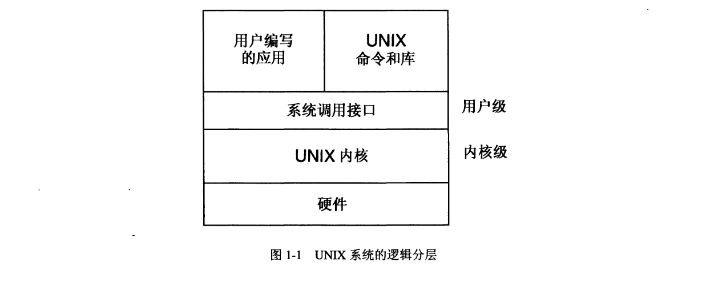
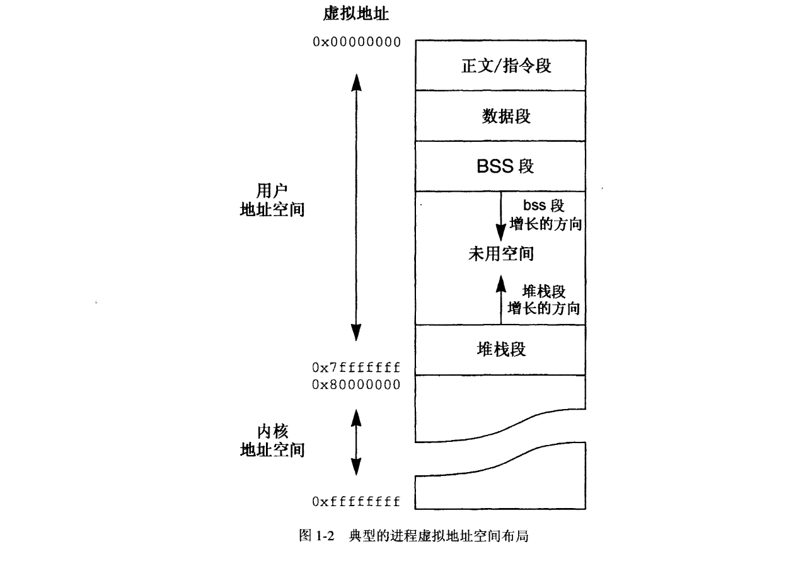
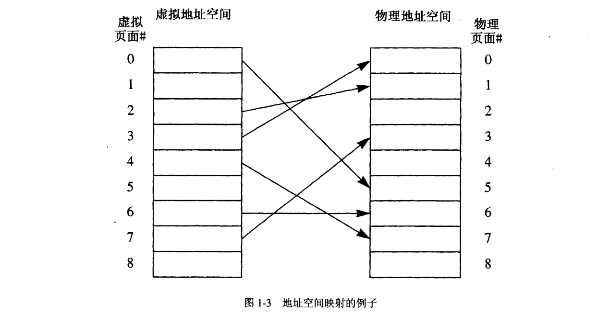
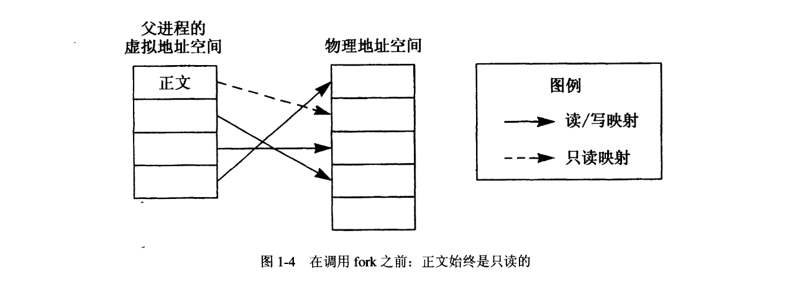
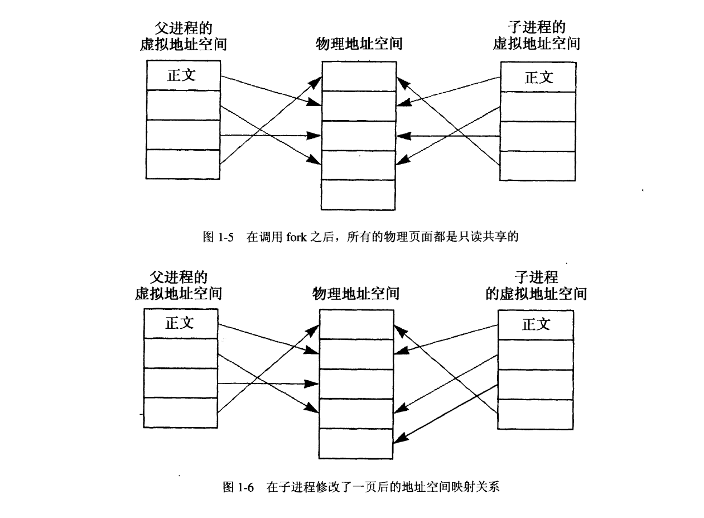
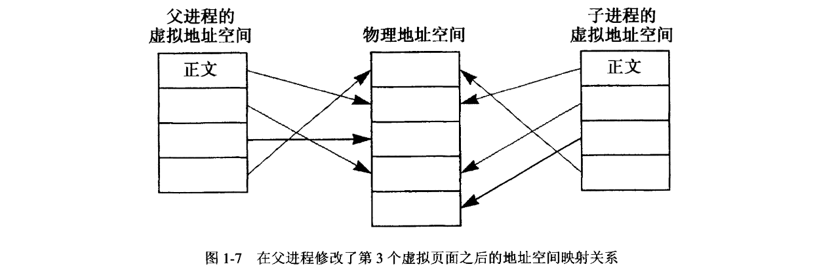

# 第一部分 高速缓存存储系统

## 1. 回顾 Unix 内核原理
本章节回顾了 UNIX 内核原理的有关内容，在以后各章中会用到它们。这里没有完整地讨论这个主题，而是作为那些己经熟悉基本概念和术语的人对这些内容进行的一次复习。本章的内容涉及单处理机系统。多处理机的 UNIX 系统实现是本书第二部分的主题。不熟悉 UNIX 操作系统或者 UNIX 内核原理的读者应该首先从本章末尾给出的参考文献中选出一些阅读。

### 1.1 引言
UNIX 系统是一种多用户、多任务操作系统，它提供了高度的程序可移植性以及丰富的开发工具集合。 UNIX 系统取得成功的一部分原因在于它所提供的可移植的应用程序接口集合 (application interface set）。这一接口集合能够轻而易举地处理把应用程序从一家厂商的系统移植到另一家厂商的问题。 UNIX 取得成功的另一部分原因在于操作系统、命令和库(library）本身的编写都可以轻松地移植到不同的计算机上，从而促进了市场上 UNIX 硬件平台的多样性。

UNIX 系统在逻辑上具有分层的结构，可以分成两个主要部分：内核（kernel) 和用户程序 (user program）。图形化的表示如图 1-1 所示。

内核的用途是与硬件接口并且控制硬件。内核还向用户程序提供一组抽象的系统服务，称为系统调用，使用可移植的接口就能够访问系统调用。内核在内核级（kernel level) 上运行，在这个级别上它能够执行特权操作。这能让内核完全控制硬件和用户级（user-level) 程序，并且提供一个让所有的程序协调共享底层硬件的环境。

UNIX 系统调用服务的定义在很大程度上能够让它们在所有的 UNIX 系统上都显得相同，而不管硬件的特殊性如何。这些抽象概念提供了 UNIX 用户级程序高度的可移植性。文件(file）就是一种内核抽象服务的例子。 UNIX 文件呈现为一个顺序字节流的形式，其中没有记录（record）或者任何其他类型的边界。用户程序可以从文件的任何部分读取任意数量的字节，而无需考虑对齐任何类型的边界。这就使用户程序在存取一个文件的时候不必关注磁盘的物理扇区（ hysical sector）、磁道（track）以及柱面（cylinder）边界。文件抽象如何映射到硬件上的细节问题是由内核来负责处理的。

用户的应用程序、 UNIX 命令以及库（常用例程的集合）都共存于用户级。用户级包含非特权的硬件执行状态。因此，用户级程序是在一个受限的环境中执行的，它受到了内核的控制，防止同时执行的多个程序彼此互相干扰（无论是恶意的还是无意的）。当用户程序通过执行一次系统调用来请求服务的时候，系统调用会转入内核，在那儿它代表发出请求的用户程序执行一次服务。还可以做权限检查来确保程序有权访问被请求的服务。

图 1-1 描绘出了 UNIX 系统以及其他大多数操作系统传统上是如何实现的：它们都是作为单个庞大程序来实现的。随着时间的推移，这种实现一直在向结构化的方向发展，在结构化的方式中，内核服务被分割成了独立的模块（module）。这就增加了实现的灵活性，更易于添加、改变以及移植系统服务，也有可能将一些服务移到内核之外，在特殊的服务器进程中以用户级来运行它们。这就减少了内核自身所必须提供的服务，从而使其缩小为微内核 (micro-kernel) 。因为本书所介绍的概念和技术并不依靠内核的内部组织，所以也就无需进一步深入考虑组织的问题。从现在开始，术语“内核”一词将用来指提供 UNIX 系统服务的东西，而不管它是单个程序还是一组模块。

### 1.2 进程、程序和线程
程序（program）被定义为执行某项任务所需的指令和数据集。进程（process）则是程序加上其执行状态的组合，进程最少要包括所有变量的值、硬件状态（例如，程序计数器、寄存器、条件码等），以及地址空间的内容说明。简而言之，一个进程就是一个执行中的程序。

当一个用户请求运行某个程序的时候，就会创建一个新进程来包含该程序的执行。在进程终止之前，它都存在于系统中，最后它不是自愿终止就是内核使它终止，要么就是用户请求它终止。进程还可以在一定程度上能通过影响诸如进程的调度优先级的系统调用进行控制。

通过进程的抽象概念，内核就让程序有了它自己是在硬件上运行的假象。除非用户程序明确想要和系统中的其他程序以某种方式进行通信（有几种服务可以来完成这个任务），否则它们不需要关心自己与那些程序的交互作用。每个进程都获得了各自的虚拟地址空间（virtual address space），并且（在大多数实现上）按时间片（time-sliced）运行，于是许多进程可以共享硬件，系统上现存的其他进程对于该用户程序是透明的。这使得开发新程序的工作更容易，也有助于确保程序的可移植性。

许多现代的 UNIX 系统提供了一种称为线程（thread）的机制。线程掌握了一个进程内一条执行流的状态。一个线程的状态最少要由硬件状态，往往还有一个堆栈构成。所有的 UNIX 进程内部都至少有一个控制线程（control thread），这个控制线程代表了程序的执行。对于所有的 UNIX 系统，无论是过去的还是现在的系统都是如此。支持线程的系统允许在一个进程内同时有多个控制线程。在这种情况下，每个线程都有其自己的硬件状态，但是所有的线程都在同一个地址空间中执行。在单处理机上，一次只能执行一个线程。在多处理机上，一个进程中的不同线程可以同时在不同的处理机上执行。线程的优点之一就是创建线程的开销要比创建进程的开销小，在一个进程内实现一组协调工作的线程要比实现一组协调工作的独立进程效率更高。一般而言，在进程内部执行的线程数量对于本书所涵盖的主题没有影响。因此，后面章节中只提及进程，它暗含了在进程内部执行的所有线程。

除了几处例外（下面会详细说明），所有的程序，不论是在用户级上还是在内核级上执行的，都出现在某个进程的现场（context）内（大多数传统的 UNIX 内核实现都是如此，但是对于专门的实现则可能不同）。所有的用户程序都在它们自己的进程的现场中运行。当这些用户进程通过系统调用请求内核服务的时候，实现该系统调用的内核代码继续在请求进程的进程现场内执行。这就能让内核方便地访问进程的所有状态及其地址空间。它还提供了一种代表用户程序记录内核执行的当前状态的方式。例如，如果需要挂起一次系统调用的执行来等待 I/O 操作完成，那么内核有关系统调用处理的状态就被保存在进程中。

因为系统的所有活动，无论是在用户级上的还是在内核级上的，都发生在某个进程的现场内，所以 UNIX 内核只调度要执行的进程。当使用传统的分时调度（time-sharing scheduling) 策略的时候，在用户级执行的进程总是被分到时间片内来执行，从而让所有的进程公平地共享 CPU。在内核级执行的进程却不会被分入时间片内执行。只有在当前的内核进程明确允许的情况下，才能切换到在内核级执行的另一个进程。

“所有的系统活动都发生在进程内部”这一规则的一种例外情况就是中断处理程序 (interrupt handler）的执行。中断是由 I/O 设备在它们有状态信息要返回给操作系统的时候所产生的。例如，状态信息可能包括一次 I/O 操作完成的信息。由于中断总是没有警告就发生了，所以它们对于进程的执行来说是异步的。当它们发生的时候，UNIX 内核允许它们中断当前进程的执行。接着，系统执行中断处理程序，直到该程序完成，或者它被一次优先级更高的中断所打断为止。内核级进程如果愿意，它们有权屏蔽中断。之所以这样做，仅仅是为了保护进程级代码和中断处理程序代码所共享的数据结构的完整性。

这一规则的第二种例外情况则伴随流（stream）服务过程而出现。来自 AT&T 的 UNIX 实现 SVR3 (System V  Release  3）中引入了流机制，它提供了一种网络协议实现的框架。虽然详细讨论流超出了本书的范围，但是这里要说明一点，出于性能方面的原因，服务过程是在任何进程的现场之外运行的，就像一个中断处理程序一样。

### 1.3 进程地址空间
内核给每个进程提供了它自己的虚拟地址空间（virtual address space）。在正常情况下，一个进程不能直接访问另一个进程的地址空间：这就提供了一种高度的保护能力，防止来自系统中其他正在执行的进程的干扰。有些实现提供了共享存储器中某些部分的机制。共享存储（shared memory）和映射文件（mapped file）机制都将在本章后面的内容中进行讨论。其他机制（比如 vfork 系统调用和线程）都能在进程间共享部分或者全部地址空间。对于本书的目的来说，这类机制都具有和共享存储同样的问题，所以就不再深入讨论了。几乎所有的 UNIX 系统实现都使用请求调页机制（demand paging）来管理物理存储器的分配。

一个进程的地址空间由 4 个主要部分构成：程序指令、初始化数据、未初始化数据和栈。在 UNIX 的行话中，指令（instruction）也叫做“正文”段，而初始化数据和栈可以分别简称为“数据”段和“栈”段。未初始化数据则叫做“bss”，它的名字来源于一种叫做“ Block Started by Symbol＇’的古老的汇编程序助记符，这个助记符用于分配未初始化的数据空间。初始化数据和未初始化数据之间的区别在于，初始化数据是在程序编译时已经声明有一个初始值的全局和静态程序变量。未初始化数据是没有明确初始值的全局和静态程序变量。对于这些数据，UNIX 系统仅仅依照 C 程序设计语言（UNIX 系统几乎都是用这种语言编写的）的语义在地址空间中分配初始包含 0 的内存。这种方法的优点是未初始化数据不需要在程序文件中占用空间。

大多数使用 32 位虚拟地址的系统都将整个 4GB 的地址空间分给用户程序和内核。虽然每个段的实际起始地址是与实现无关的，但是典型的布局则如图 1-2 所示。通常低 2GB 空间供用户使用，常被叫做用户地址空间（user address space）。高 2GB 空间则为内核保留，不准用户级代码读写，这是内核地址空间（kernel address space）。内核地址空间包括内核的正文和数据结构。当内核正在执行的时候，它就可以访问整个地址空间。这种安排易于让内核在代表用户进程执行一次系统调用的时候可以在用户进程的地址空间中运行。

用户正文段和数据段的大小在程序编译时就固定了，它们只能在执行程序的时候从包含程序的文件中复制到地址空间里。bss 段和栈段能够在运行时刻动态地增长，在它们之间有一段未用的虚拟地址空间来调节增长的壁间。在本书中，栈段始终是向较低的存储地址增长的，对于大多数计算机系统来说都是这样。

bss 段能够借助系统调用 sbrk 增长或者缩小。 bss 段只能向较高的存储地址增长。栈随着需要由内核来动态和透明地控制增长。当试图访问当前分配的栈段以下的未用区时，就发生了一次缺页故障（page fault）。内核检查堆核指针寄存器的内容，如果它包含的地址比栈段顶部当前的地址要小，那么内核就扩大栈段，把栈指针寄存器中的地址包括进来，并且重新执行导致缺页故障的操作。

其他类型的段，比如共享库和共享存储，都可以包含在用户地址空间内。共享库包括附加的正文、数据和 bss 段，它们用于常用的函数和服务。共享存储则在本章的后面介绍。

#### 1.3.1 地址空间映射
内核负责将一个进程的虚拟地址空间映射到计算机的物理地址雪间上。大多数计算机允许任何虚拟页面被映射到存储器中的任何物理页面上。例如，一个进程的虚拟地址空间可以按照图 1-3 所示进行映射。

这幅图中的箭头显示了该进程内的虚拟页面被映射到了哪一个物理页面上。于是，比如说如果进程访问虚拟页面 2，那么对该页面的引用将被映射到物理页面 1 上。从虚拟地址空间到物理地址空间的映射是由存储器管理单元（ Memory Management Unit, MMU）来执行的，MMU 负责进程所使用的全部地址。

每一个进程都有它自己的映射关系，这种映射关系与它相关，而且作为进程的现场的一部分保存起来。在进程运行的时候，内核将进程映射关系的描述提供给 MMU。

注意，不是所有的虚拟页面都需要映射。例如，图 1-3 中的虚拟页面 1、5 和 8就没有被映射到任何物理页面上。它们表示进程的地址空间中没有使用的页面，也可以是当前没有驻留在内存中的页面。如果一个进程试图访问后一种类型的页面，那么内核就要把相关的物理页面调入到内存中，并且把虚拟页面映射到新分配的物理页面上。

同样，不是存储器中所有的物理页面都由一个进程来使用。在图 1-3 中的例子里，物理页面 2、4 和 8 没有从这个进程到它们那里的映射关系。当前正在执行的进程将无法访问它们。这些物理页面可以属于系统中的其他进程，或者干脆就没有使用。无论是哪－种情况，肯定都不允许当前正在执行的进程访问它们。

通过把各个进程中的虚拟页面映射到同一个物理页面上，内核可以让多个进程共享特定的物理页面（这将在以后更详细地进行讨论）。

大多数 MMU 都有给每个映射关系关联一个访问权限（access permission）的能力。最常用的两种权限是读（read）和写（write）。这种功能可以让内核将正文页面（text page）映射为只读（read-only）的，同时允许对数据页面（data page）的读写访问。

### 1.4 现场切换
内核从执行一个进程转为执行另一个进程的操作称为现场切换（context switch）。这项操作包括保存当前进程的状态以便在将来可以恢复、选择一个要执行的新进程，以及把所保存的新进程的状态载入到硬件中。进程在现场切换时刻必须保存和恢复的最少状态是 CPU 寄存器的内容、PC（程序计数器）、栈指针、条件码，以及虚拟地址空间的映射关系。

在同一个进程内从一个线程切换到另一个线程的操作称为线程切换（thread switch）。因为进程不变，所以不需要改变地址空间的映射关系。只有上一段话中列出的寄存器和其他项需要保存和恢复。和进程的现场切换相比，线程切换所减少的开销是使用线程的另一个优点。总体而言，本书所介绍的内容主题都不需要考虑使用线程切换。

如前所述，每个进程都获得了一个独立的虚拟地址空间，远不但给它一个假象，以为它自己独自运行在计算机上，并且把它隔离开来，不受其他进程的干扰。在线程切换期间选择一个要执行的新进程时，必须彻底消除原来进程的地址空间映射，从而让新进程不能访问它。随后，新进程的地址空间被映射进来，于是它可以由这个进程来访问。

根据所用的特定硬件，可能要保存和恢复其他类型的状态。例如，高速缓存可能需要在现场切换时根据它们的实现进行管理（这是接下来几章讨论的主题）。内核必须确保一个进程的现场所要求的所有部分都被保存下来，以便在将来的某个时刻可以恢复它，从而可以继续执行，就好像从未发生过现场切换一样。这是内核保持每个进程都独自在系统上执行的假象这一任务的一个重要方面。

### 1.5 存储管理和进程管理的系统调用
UNIX 系统为创建和消除进程以及为改变进程的地址空间提供了几个系统调用。本节简要回顾这些系统调用的内部操作和语义，因为高速缓存和多处理机对 UNIX 操作系统中处理进程地址空间的部分影响最大。

#### 1.5.1 系统调用 fork
系统调用 fork 创建一个新进程。内核通过准确复制调用 fork 的进程的一个副本来创建一个新进程。调用 fork 的进程称为父进程（parent），新创建的进程称为子进程（child）。子进程不但获得了父进程的地址空间以及包括程序变量、寄存器、 PC 等值在内的进程状态，而且获得了访问父进程拥有的全部 UNIX 系统服务的权利，比如父进程打开的文件。子进程是用一个控制线程创建的，这个控制线程和父进程中调用 fork 的线程是一样的。子进程一旦创建出来，它就独立于父进程而执行。在 fork 调用完成的时候，两个进程是相同的。两个进程现场的唯一区别在于 fork 系统调用本身的返回值。父进程返回的是子进程的进程 ID (pid），而子进程得到的是 0。这就让每个进程能够判断出它是父进程还是子进程。

因为复制一个较大的虚拟地址空间很花时间，所以要进行几种优化。首先，正文段一般由执行同一个程序（和／或共享相同的库）的所有进程只读共享。这意味着正文不需要在物理上复制给子进程。子进程只要共享父进程正在使用的同一个副本就可以了。因为 UNIX 内核不允许在正文段内擅自修改代码，所以才有可能共享正文（当出于调试的目的需要在正文中插入断点的时候，内核首先要创建一份正文的私用副本，以便执行相同程序的其他进程不会受到影响）。图 1-4 中父进程将要执行 fork调用，其正文段是只读的，而它的其他页面可以进行读写访问。

接下来，几乎所有的实现都使用一种称为写时复制（copy-on-write）的技术来避免复制地址空间中剩余部分的大量内容。大多数 UNIX 进程在执行 fork 调用之后会立即调用 exec (在下一小节介绍) 来执行新程序。这一操作丢弃了父进程的地址空间，所以在 fork 期间复制父进程空间而很快又丢弃它的做法会很浪费。相反，数据、bss 和栈都不在物理上进行复制，而是临时在父进程和子进程之间只读共享。这可以用图 1-5 来描述。

注意，两个进程在逻辑上仍然对页面拥有写权限。当父进程或者子进程试图写一个页面的时候就复制单独的页面。这样一来，只有要写入的页面才会按照需要来复制，如果子进程只需要在它执行 exec 或者 exit 之前写入其地址空间的一部分的话，那么就有可能节省大量的复制开销。只读、写时复制共享机制（copy-on-write sharing）只是用作一种高效的实现技术，
对于涉及到的进程来说是透明的。

只要两个进程都没有企图修改数据，那么就会继续保持共享关系。当两个进程中的一个要写入一个只读页面的时候，就发生了一次保护陷阱（protection trap），内核会截获到这个陷阱。内核复制出进程正在尝试修改的单独页面的一个副本，用它来替换该页面在那个进程的地址空间中被共享的副本。这种做法只用于执行写操作的进程，其他进程的地址空间不受影响。采用这种方式时，可以在父进程和子进程之间共享尽可能多的地址空间，而仅仅根据需要复制进程修改页面的副本。这种处理对于两个进程都是透明的，从而造成复制了整个地址空间的假象。图 1-6 给出了图 1-5 中的子进程修改了它的第 3 个虚拟页面之后地址空间的状态。内核把这个页面的内容复制到了一个新的物理页面中，并且重新映射于进程的地址空间，指向该物理页面上。

为了避免复制那些仅有一个映射关系的页面，内核要计算每个物理页面上的只读、写时复制的映射关系数量。所以，如果父进程现在要写入它的第 3 个虚拟页面，那么内核就会知道这个页面上没有其他的映射关系，只要把映射关系改为读写就行了，不需要复制该页。结果如图 1-7 所示。

从应用的角度来看，系统调用 fork 是创建新进程的一种很方便的机制，因为它不带任何参数。因为子进程继承了父进程的全部状态，所以不需要像在其他操作系统中创建新进程那样给系统调用传递一组复杂的参数。子进程根据它从父进程那里得到的状态来判断出它应该执行什么任务。在大多数情况下， fork 的目标是创建一个新进程来执行新程序。要做到这一点，子进程通过打开或者关闭文件（例如，可能为了 I/O 重定向）来准备进程状态，然后用系统调用 exec 来执行新程序。

#### 1.5.2 系统调用 exec
系统调用 exec 改变了一个进程正在执行的程序。只有调用 exec 的进程才会受到影响。exec 的参数是一个文件名（该文件包含要执行的新程序）和一组要传递给新程序的参数和环境变量。执行 exec 系统调用的进程保留它与大多数 UNIX 系统服务相关的状态信息，比如，它打开的文件、它的当前目录和主目录，等等。它的状态中和程序本身有关的部分，比如它的寄存器内容、变量、 PC（程序计数器）以及地址空间，都要用新程序的来替换。更具体地说，原来程序的正文、数据、bss 和栈以及诸如共享存储的其他存储对象都会被丢弃，而要为新程序创建新的虚拟地址空间。新程序的正文和初始化数据则从指定的文件中读入，内核将地址空间内的空间分配给 bss 和栈。进程内单个线程的 PC（程序计数器）被设定在新程序的起始地址。当系统调用执行完毕的时候，原来的程序在进程中就不复存在了，新程序开始执行。新程序可以访问 exec 系统调用之前进程所打开的文件，因为这些文件都是和进程相关联的，而不是和程序相关联的。

如前所述，系统调用 exec 往往在 fork 之后执行。最常见的情形就是 UNIX 系统的命令解释器，它可以创建新进程来运行每条命令。命令解释器调用 fork 创建新进程，然后子进程调用 exec 运行该命令。

#### 1.5.3 系统调用 exit
系统调用 exit 会让调用它的进程（以及它的所有线程）终止执行。该系统调用在程序完成它的执行过程之后，并希望终止的时候使用。一个进程还有可能采用系统调用 kill 来终止另一个进程（假定该进程有适当的权限）。如果发生了无法恢复的错误，系统也可以终止一个进程。在所有的情况下，内核终止一个进程以及在事后进行清理工作的步骤都是相同的。

要终止一个进程，内核必须丢弃进程的地址空间，取消进程正在使用的内核服务，例如，关闭进程留下的任何打开的文件。此刻，进程暂时以一种称为僵进程（zombie）的形式存在，僵进程是一个 UNIX 的术语。这就提供了一种便捷的手段，让父进程在有机会采用系统调用 wait 读取于进程的退出状态之前保持进程之间的父子关系（僵进程与本书的讨论无关，不再深入研究）。最后，释放代表进程本身的内部的内核数据结构。此刻，进程就不复存在了，内核执行一次现场切换，选择另一个要执行的进程。

#### 1.5.4 系统调用 sbrk 和 brk
系统调用 sbrk 和 brk 都是供一个进程用来分配或者收回它的 bss 段空间。这两个系统调用都以 bss 段的 BreaK address（断开地址）而得名。这是在 bss 段内进程能够访问的最大合法地址。断开地址和栈顶部地址之间的虚拟存储区不会被映射到任何物理存储器上，进程无法访问到它们（眼下忽略共享存储和映射文件）。系统调用 sbrk 和 brk 能够让进程改变它的断开地址，从而增长或者缩小 bss 段的大小。系统调用 sbrk 接受一个代表断开地址增量变化的有符号数值作为参数，而系统调用 brk 接受－个成为新断开地址的虚拟地址作为参数。

如果进程请求增大 bss 段，那么内核就分配正好在原来的断开地址之上的虚拟地址，从而让进程能够访问到这部分地址空间。新分配的 bss 内存都被定义用 0 来填写。 bss 段只能向更大的地址增长，它的起始地址是固定不变的。支持新分配的虚拟内存的物理存储器则根据需要来分配，因为它是由进程来引用的。如果缩小了 bss，那么在新老断开地址之间地址范围内的虚拟和物理存储器都将被释放。访问权限也变了，于是进程再也不能访问它了。

#### 1.5.5 共享存储
有些 UNIX 系统的实现提供了一种能够让两个或者两个以上的进程共享一个物理存储器区域的系统服务。这通常叫做共享存储段（shared memory segment）。它是将同一个（或者多个）物理页面映射到两个或者更多进程的虚拟地址空间中来实现的。物理存储器的共享区无需在所有的进程中都出现在相同的虚拟地址上，每个共享区都可以按照其选择将它附加到不同的虚拟地址上。共享存储通常被附加到进程内 bss 和栈段之间未用的虚拟存储区中。

共享存储能够充当一种高速的进程间通信（interprocess communication, IPC）机制，因为进程可以通过其享存储传递数据，既不需要执行系统调用，也不需要牵扯到内核。当一个进程把数据写入共享存储中的时候，共享同一共享存储段的其他进程立即就能访问到这些数据，因为它们都共享相同的物理页面。

#### 1.5.6 输入输出操作
在考虑存储器操作的时候， I/O（输入输出）的影响是很重要的。从用户进程请求 I/O 操作的系统调用有两个: read 和 write。这两个系统调用把数据从进程的地址空间传送到一个文件或者设备（ write），或者反过来（read）。有些 UNIX 实现提供了额外的 I/O 系统调用，比如 readv、writev、getmsg 和 putmsg（就本书所介绍的主题而言，这些系统调用的作用同 read 和 write 是一样的，所以我们只讨论这两个系统调用。I/O 的类有两种：有缓冲的（buffered) 和未缓冲的（unbuffered）。

在内核中，对于特定文件类型的 I/O 是有缓冲的。内核和用户进程地址空间之间的数据通过一个复制操作来传输。缓冲机制（buffering）的优点是它允许用户程序不必知道物理 I/O 设备的特征属性。程序不需要关心块（block）或者记录（record）的大小，或者任何对齐的限制。例如，磁盘往往以扇区（sector）来存取，这意味着 I/O 必须从一个扇区的边界开始，并且包括多个扇区的大小。当一个用户程序读取有缓冲的文件时，它只要指定它希望 I/O 从这个文件内开始的字节偏移量以及它想读取的字节数就可以了。为了保持文件抽象的概念，内核把用户的字节偏移量转换为包含数据的相应扇区。一个或者更多扇区从磁盘读入到内核缓冲区中，用户想要读取的数据部分就被复制到用户的缓冲区中。

未缓冲的 I/O 则绕过了这种复制操作。用户进程可以使用这种类型的 I/O，它在 UNIX 的行话中称为原始 I/O (raw I/O）。术语“原始 I/O”来源于这一事实，即通过一个缓冲区进行复制的数据被认为是经过处理的，或者说加工过的（cooked）。因此，没有复制的数据则被认为是“原始的”。在采用原始 I/O 的情况下，I/O 设备使用 OMA (direct memory access, 直接存储访问）操作直接把数据传送到用户缓冲区。内核在有缓冲的 I/O 期间所缓冲的数据最终也使用 OMA 传送到设备上，或者从设备上传送到缓冲区中。所以，既可以在用户地址空间也可以在内核地址空间执行 DMA 操作。

#### 1.5.7 映射文件
许多 UNIX 系统的实现都提供了将文件映射到一个进程地址空间内的功能。一旦文件被映射到进程地址空间内，这个文件就可以作为地址空间内一段连续的字节区直接访问。这就让进程可以使用内存的上载和保存操作而不是系统调用 read 和 write 来访问文件的内容。映射文件在逻辑上和共享存储器类似：映射到同一文件的多个进程可以选择共享映射，从而让一个进程所做的改动也可以出现在其他进程的地址空间内。

### 1.6 小结
本章节回顾了 UNIX 内核的基本原理。UNIX 系统是一种多用户、多任务的操作系统，它通过向进程提供与机器无关的抽象服务，从而在 UNIX 实现之间提供了高度的程序可移植性。程序的执行被限制在保持程序当前状态的进程内，这些状态包括虚拟地址空间、程序的变量值以及硬件状态。内核给每个进程提供了一个环境，让这个环境显得就好像该进程是系统中正在执行的唯一进程那样。这主要是赋于每个进程自己的虚拟地址空间来实现的。用户程序通过执行系统调用来请求内核的服务。系统调用可以创建新进程（fork），改变进程正在执行的程序（exec），以及终止进程（exit）。还可以使用其他许多系统调用，其中包括动态分配未初始化数据的系统调用（brk/sbrk）、使用共享存储的系统调用，以及执行 I/O 的系统调用（read 和 write）。

## 2. 高速缓存存储系统概述

### 2.1 存储器层次结构

### 2.2 高速缓存基本原理

#### 2.2.1 如何存取高速缓存

#### 2.2.2 虚拟地址还是物理地址

#### 2.2.3 搜索高速缓存

#### 2.2.4 替换策略

#### 2.2.5 写入策略

### 2.3 直接映射高速缓存

### 2.4 双路组相联高速缓存

### 2.5 n 路组相联高速缓存

### 2.6 全相联高速缓存

### 2.7 n 路组相联高速缓存的总结

### 2.8 高速缓存冲洗

### 2.9 无高速缓存操作

### 2.10 独立的指令高速缓存和数据高速缓存

### 2.11 高速缓存的性能

### 2.12 如何区分不同的高速缓存结构

## 3. 虚拟高速缓存

