# 第一部分 高速缓存存储系统

[TOC]

## 1. 回顾 Unix 内核原理
本章节回顾了 UNIX 内核原理的有关内容，在以后各章中会用到它们。这里没有完整地讨论这个主题，而是作为那些己经熟悉基本概念和术语的人对这些内容进行的一次复习。本章的内容涉及单处理机系统。多处理机的 UNIX 系统实现是本书第二部分的主题。不熟悉 UNIX 操作系统或者 UNIX 内核原理的读者应该首先从本章末尾给出的参考文献中选出一些阅读。

### 1.1 引言
UNIX 系统是一种多用户、多任务操作系统，它提供了高度的程序可移植性以及丰富的开发工具集合。 UNIX 系统取得成功的一部分原因在于它所提供的可移植的应用程序接口集合 (application interface set）。这一接口集合能够轻而易举地处理把应用程序从一家厂商的系统移植到另一家厂商的问题。 UNIX 取得成功的另一部分原因在于操作系统、命令和库(library）本身的编写都可以轻松地移植到不同的计算机上，从而促进了市场上 UNIX 硬件平台的多样性。

UNIX 系统在逻辑上具有分层的结构，可以分成两个主要部分：内核（kernel) 和用户程序 (user program）。图形化的表示如图 1-1 所示。

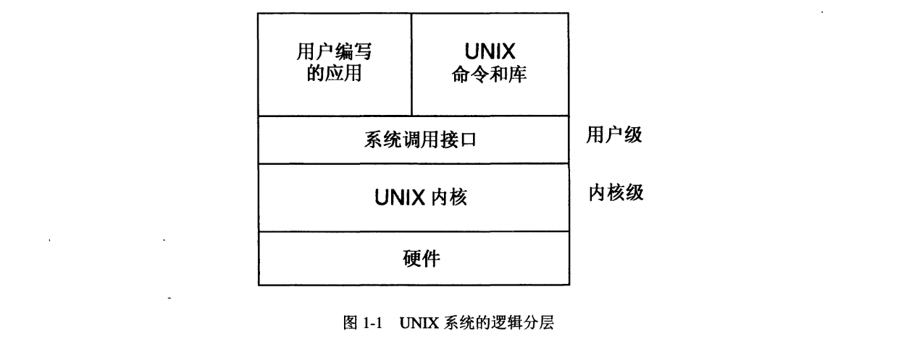

内核的用途是与硬件接口并且控制硬件。内核还向用户程序提供一组抽象的系统服务，称为系统调用，使用可移植的接口就能够访问系统调用。内核在内核级（kernel level) 上运行，在这个级别上它能够执行特权操作。这能让内核完全控制硬件和用户级（user-level) 程序，并且提供一个让所有的程序协调共享底层硬件的环境。

UNIX 系统调用服务的定义在很大程度上能够让它们在所有的 UNIX 系统上都显得相同，而不管硬件的特殊性如何。这些抽象概念提供了 UNIX 用户级程序高度的可移植性。文件(file）就是一种内核抽象服务的例子。 UNIX 文件呈现为一个顺序字节流的形式，其中没有记录（record）或者任何其他类型的边界。用户程序可以从文件的任何部分读取任意数量的字节，而无需考虑对齐任何类型的边界。这就使用户程序在存取一个文件的时候不必关注磁盘的物理扇区（ hysical sector）、磁道（track）以及柱面（cylinder）边界。文件抽象如何映射到硬件上的细节问题是由内核来负责处理的。

用户的应用程序、 UNIX 命令以及库（常用例程的集合）都共存于用户级。用户级包含非特权的硬件执行状态。因此，用户级程序是在一个受限的环境中执行的，它受到了内核的控制，防止同时执行的多个程序彼此互相干扰（无论是恶意的还是无意的）。当用户程序通过执行一次系统调用来请求服务的时候，系统调用会转入内核，在那儿它代表发出请求的用户程序执行一次服务。还可以做权限检查来确保程序有权访问被请求的服务。

图 1-1 描绘出了 UNIX 系统以及其他大多数操作系统传统上是如何实现的：它们都是作为单个庞大程序来实现的。随着时间的推移，这种实现一直在向结构化的方向发展，在结构化的方式中，内核服务被分割成了独立的模块（module）。这就增加了实现的灵活性，更易于添加、改变以及移植系统服务，也有可能将一些服务移到内核之外，在特殊的服务器进程中以用户级来运行它们。这就减少了内核自身所必须提供的服务，从而使其缩小为微内核 (micro-kernel) 。因为本书所介绍的概念和技术并不依靠内核的内部组织，所以也就无需进一步深入考虑组织的问题。从现在开始，术语“内核”一词将用来指提供 UNIX 系统服务的东西，而不管它是单个程序还是一组模块。

### 1.2 进程、程序和线程
程序（program）被定义为执行某项任务所需的指令和数据集。进程（process）则是程序加上其执行状态的组合，进程最少要包括所有变量的值、硬件状态（例如，程序计数器、寄存器、条件码等），以及地址空间的内容说明。简而言之，一个进程就是一个执行中的程序。

当一个用户请求运行某个程序的时候，就会创建一个新进程来包含该程序的执行。在进程终止之前，它都存在于系统中，最后它不是自愿终止就是内核使它终止，要么就是用户请求它终止。进程还可以在一定程度上能通过影响诸如进程的调度优先级的系统调用进行控制。

通过进程的抽象概念，内核就让程序有了它自己是在硬件上运行的假象。除非用户程序明确想要和系统中的其他程序以某种方式进行通信（有几种服务可以来完成这个任务），否则它们不需要关心自己与那些程序的交互作用。每个进程都获得了各自的虚拟地址空间（virtual address space），并且（在大多数实现上）按时间片（time-sliced）运行，于是许多进程可以共享硬件，系统上现存的其他进程对于该用户程序是透明的。这使得开发新程序的工作更容易，也有助于确保程序的可移植性。

许多现代的 UNIX 系统提供了一种称为线程（thread）的机制。线程掌握了一个进程内一条执行流的状态。一个线程的状态最少要由硬件状态，往往还有一个堆栈构成。所有的 UNIX 进程内部都至少有一个控制线程（control thread），这个控制线程代表了程序的执行。对于所有的 UNIX 系统，无论是过去的还是现在的系统都是如此。支持线程的系统允许在一个进程内同时有多个控制线程。在这种情况下，每个线程都有其自己的硬件状态，但是所有的线程都在同一个地址空间中执行。在单处理机上，一次只能执行一个线程。在多处理机上，一个进程中的不同线程可以同时在不同的处理机上执行。线程的优点之一就是创建线程的开销要比创建进程的开销小，在一个进程内实现一组协调工作的线程要比实现一组协调工作的独立进程效率更高。一般而言，在进程内部执行的线程数量对于本书所涵盖的主题没有影响。因此，后面章节中只提及进程，它暗含了在进程内部执行的所有线程。

除了几处例外（下面会详细说明），所有的程序，不论是在用户级上还是在内核级上执行的，都出现在某个进程的现场（context）内（大多数传统的 UNIX 内核实现都是如此，但是对于专门的实现则可能不同）。所有的用户程序都在它们自己的进程的现场中运行。当这些用户进程通过系统调用请求内核服务的时候，实现该系统调用的内核代码继续在请求进程的进程现场内执行。这就能让内核方便地访问进程的所有状态及其地址空间。它还提供了一种代表用户程序记录内核执行的当前状态的方式。例如，如果需要挂起一次系统调用的执行来等待 I/O 操作完成，那么内核有关系统调用处理的状态就被保存在进程中。

因为系统的所有活动，无论是在用户级上的还是在内核级上的，都发生在某个进程的现场内，所以 UNIX 内核只调度要执行的进程。当使用传统的分时调度（time-sharing scheduling) 策略的时候，在用户级执行的进程总是被分到时间片内来执行，从而让所有的进程公平地共享 CPU。在内核级执行的进程却不会被分入时间片内执行。只有在当前的内核进程明确允许的情况下，才能切换到在内核级执行的另一个进程。

“所有的系统活动都发生在进程内部”这一规则的一种例外情况就是中断处理程序 (interrupt handler）的执行。中断是由 I/O 设备在它们有状态信息要返回给操作系统的时候所产生的。例如，状态信息可能包括一次 I/O 操作完成的信息。由于中断总是没有警告就发生了，所以它们对于进程的执行来说是异步的。当它们发生的时候，UNIX 内核允许它们中断当前进程的执行。接着，系统执行中断处理程序，直到该程序完成，或者它被一次优先级更高的中断所打断为止。内核级进程如果愿意，它们有权屏蔽中断。之所以这样做，仅仅是为了保护进程级代码和中断处理程序代码所共享的数据结构的完整性。

这一规则的第二种例外情况则伴随流（stream）服务过程而出现。来自 AT&T 的 UNIX 实现 SVR3 (System V  Release  3）中引入了流机制，它提供了一种网络协议实现的框架。虽然详细讨论流超出了本书的范围，但是这里要说明一点，出于性能方面的原因，服务过程是在任何进程的现场之外运行的，就像一个中断处理程序一样。

### 1.3 进程地址空间
内核给每个进程提供了它自己的虚拟地址空间（virtual address space）。在正常情况下，一个进程不能直接访问另一个进程的地址空间：这就提供了一种高度的保护能力，防止来自系统中其他正在执行的进程的干扰。有些实现提供了共享存储器中某些部分的机制。共享存储（shared memory）和映射文件（mapped file）机制都将在本章后面的内容中进行讨论。其他机制（比如 vfork 系统调用和线程）都能在进程间共享部分或者全部地址空间。对于本书的目的来说，这类机制都具有和共享存储同样的问题，所以就不再深入讨论了。几乎所有的 UNIX 系统实现都使用请求调页机制（demand paging）来管理物理存储器的分配。

一个进程的地址空间由 4 个主要部分构成：程序指令、初始化数据、未初始化数据和栈。在 UNIX 的行话中，指令（instruction）也叫做“正文”段，而初始化数据和栈可以分别简称为“数据”段和“栈”段。未初始化数据则叫做“bss”，它的名字来源于一种叫做“ Block Started by Symbol＇’的古老的汇编程序助记符，这个助记符用于分配未初始化的数据空间。初始化数据和未初始化数据之间的区别在于，初始化数据是在程序编译时已经声明有一个初始值的全局和静态程序变量。未初始化数据是没有明确初始值的全局和静态程序变量。对于这些数据，UNIX 系统仅仅依照 C 程序设计语言（UNIX 系统几乎都是用这种语言编写的）的语义在地址空间中分配初始包含 0 的内存。这种方法的优点是未初始化数据不需要在程序文件中占用空间。

大多数使用 32 位虚拟地址的系统都将整个 4GB 的地址空间分给用户程序和内核。虽然每个段的实际起始地址是与实现无关的，但是典型的布局则如图 1-2 所示。通常低 2GB 空间供用户使用，常被叫做用户地址空间（user address space）。高 2GB 空间则为内核保留，不准用户级代码读写，这是内核地址空间（kernel address space）。内核地址空间包括内核的正文和数据结构。当内核正在执行的时候，它就可以访问整个地址空间。这种安排易于让内核在代表用户进程执行一次系统调用的时候可以在用户进程的地址空间中运行。

用户正文段和数据段的大小在程序编译时就固定了，它们只能在执行程序的时候从包含程序的文件中复制到地址空间里。bss 段和栈段能够在运行时刻动态地增长，在它们之间有一段未用的虚拟地址空间来调节增长的壁间。在本书中，栈段始终是向较低的存储地址增长的，对于大多数计算机系统来说都是这样。

bss 段能够借助系统调用 sbrk 增长或者缩小。 bss 段只能向较高的存储地址增长。栈随着需要由内核来动态和透明地控制增长。当试图访问当前分配的栈段以下的未用区时，就发生了一次缺页故障（page fault）。内核检查堆核指针寄存器的内容，如果它包含的地址比栈段顶部当前的地址要小，那么内核就扩大栈段，把栈指针寄存器中的地址包括进来，并且重新执行导致缺页故障的操作。

其他类型的段，比如共享库和共享存储，都可以包含在用户地址空间内。共享库包括附加的正文、数据和 bss 段，它们用于常用的函数和服务。共享存储则在本章的后面介绍。


#### 1.3.1 地址空间映射
内核负责将一个进程的虚拟地址空间映射到计算机的物理地址雪间上。大多数计算机允许任何虚拟页面被映射到存储器中的任何物理页面上。例如，一个进程的虚拟地址空间可以按照图 1-3 所示进行映射。


这幅图中的箭头显示了该进程内的虚拟页面被映射到了哪一个物理页面上。于是，比如说如果进程访问虚拟页面 2，那么对该页面的引用将被映射到物理页面 1 上。从虚拟地址空间到物理地址空间的映射是由存储器管理单元（ Memory Management Unit, MMU）来执行的，MMU 负责进程所使用的全部地址。

每一个进程都有它自己的映射关系，这种映射关系与它相关，而且作为进程的现场的一部分保存起来。在进程运行的时候，内核将进程映射关系的描述提供给 MMU。

注意，不是所有的虚拟页面都需要映射。例如，图 1-3 中的虚拟页面 1、5 和 8就没有被映射到任何物理页面上。它们表示进程的地址空间中没有使用的页面，也可以是当前没有驻留在内存中的页面。如果一个进程试图访问后一种类型的页面，那么内核就要把相关的物理页面调入到内存中，并且把虚拟页面映射到新分配的物理页面上。

同样，不是存储器中所有的物理页面都由一个进程来使用。在图 1-3 中的例子里，物理页面 2、4 和 8 没有从这个进程到它们那里的映射关系。当前正在执行的进程将无法访问它们。这些物理页面可以属于系统中的其他进程，或者干脆就没有使用。无论是哪－种情况，肯定都不允许当前正在执行的进程访问它们。

通过把各个进程中的虚拟页面映射到同一个物理页面上，内核可以让多个进程共享特定的物理页面（这将在以后更详细地进行讨论）。

大多数 MMU 都有给每个映射关系关联一个访问权限（access permission）的能力。最常用的两种权限是读（read）和写（write）。这种功能可以让内核将正文页面（text page）映射为只读（read-only）的，同时允许对数据页面（data page）的读写访问。

### 1.4 现场切换
内核从执行一个进程转为执行另一个进程的操作称为现场切换（context switch）。这项操作包括保存当前进程的状态以便在将来可以恢复、选择一个要执行的新进程，以及把所保存的新进程的状态载入到硬件中。进程在现场切换时刻必须保存和恢复的最少状态是 CPU 寄存器的内容、PC（程序计数器）、栈指针、条件码，以及虚拟地址空间的映射关系。

在同一个进程内从一个线程切换到另一个线程的操作称为线程切换（thread switch）。因为进程不变，所以不需要改变地址空间的映射关系。只有上一段话中列出的寄存器和其他项需要保存和恢复。和进程的现场切换相比，线程切换所减少的开销是使用线程的另一个优点。总体而言，本书所介绍的内容主题都不需要考虑使用线程切换。

如前所述，每个进程都获得了一个独立的虚拟地址空间，远不但给它一个假象，以为它自己独自运行在计算机上，并且把它隔离开来，不受其他进程的干扰。在线程切换期间选择一个要执行的新进程时，必须彻底消除原来进程的地址空间映射，从而让新进程不能访问它。随后，新进程的地址空间被映射进来，于是它可以由这个进程来访问。

根据所用的特定硬件，可能要保存和恢复其他类型的状态。例如，高速缓存可能需要在现场切换时根据它们的实现进行管理（这是接下来几章讨论的主题）。内核必须确保一个进程的现场所要求的所有部分都被保存下来，以便在将来的某个时刻可以恢复它，从而可以继续执行，就好像从未发生过现场切换一样。这是内核保持每个进程都独自在系统上执行的假象这一任务的一个重要方面。

### 1.5 存储管理和进程管理的系统调用
UNIX 系统为创建和消除进程以及为改变进程的地址空间提供了几个系统调用。本节简要回顾这些系统调用的内部操作和语义，因为高速缓存和多处理机对 UNIX 操作系统中处理进程地址空间的部分影响最大。

#### 1.5.1 系统调用 fork
系统调用 fork 创建一个新进程。内核通过准确复制调用 fork 的进程的一个副本来创建一个新进程。调用 fork 的进程称为父进程（parent），新创建的进程称为子进程（child）。子进程不但获得了父进程的地址空间以及包括程序变量、寄存器、 PC 等值在内的进程状态，而且获得了访问父进程拥有的全部 UNIX 系统服务的权利，比如父进程打开的文件。子进程是用一个控制线程创建的，这个控制线程和父进程中调用 fork 的线程是一样的。子进程一旦创建出来，它就独立于父进程而执行。在 fork 调用完成的时候，两个进程是相同的。两个进程现场的唯一区别在于 fork 系统调用本身的返回值。父进程返回的是子进程的进程 ID (pid），而子进程得到的是 0。这就让每个进程能够判断出它是父进程还是子进程。

因为复制一个较大的虚拟地址空间很花时间，所以要进行几种优化。首先，正文段一般由执行同一个程序（和／或共享相同的库）的所有进程只读共享。这意味着正文不需要在物理上复制给子进程。子进程只要共享父进程正在使用的同一个副本就可以了。因为 UNIX 内核不允许在正文段内擅自修改代码，所以才有可能共享正文（当出于调试的目的需要在正文中插入断点的时候，内核首先要创建一份正文的私用副本，以便执行相同程序的其他进程不会受到影响）。图 1-4 中父进程将要执行 fork调用，其正文段是只读的，而它的其他页面可以进行读写访问。

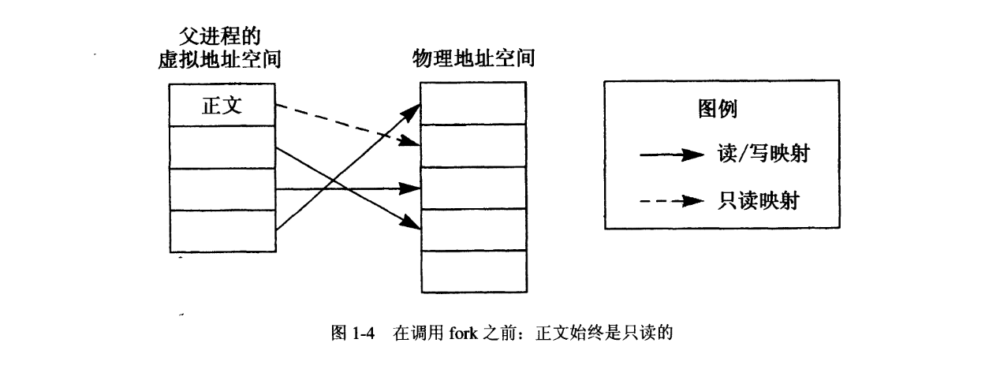

接下来，几乎所有的实现都使用一种称为写时复制（copy-on-write）的技术来避免复制地址空间中剩余部分的大量内容。大多数 UNIX 进程在执行 fork 调用之后会立即调用 exec (在下一小节介绍) 来执行新程序。这一操作丢弃了父进程的地址空间，所以在 fork 期间复制父进程空间而很快又丢弃它的做法会很浪费。相反，数据、bss 和栈都不在物理上进行复制，而是临时在父进程和子进程之间只读共享。这可以用图 1-5 来描述。

注意，两个进程在逻辑上仍然对页面拥有写权限。当父进程或者子进程试图写一个页面的时候就复制单独的页面。这样一来，只有要写入的页面才会按照需要来复制，如果子进程只需要在它执行 exec 或者 exit 之前写入其地址空间的一部分的话，那么就有可能节省大量的复制开销。只读、写时复制共享机制（copy-on-write sharing）只是用作一种高效的实现技术，
对于涉及到的进程来说是透明的。

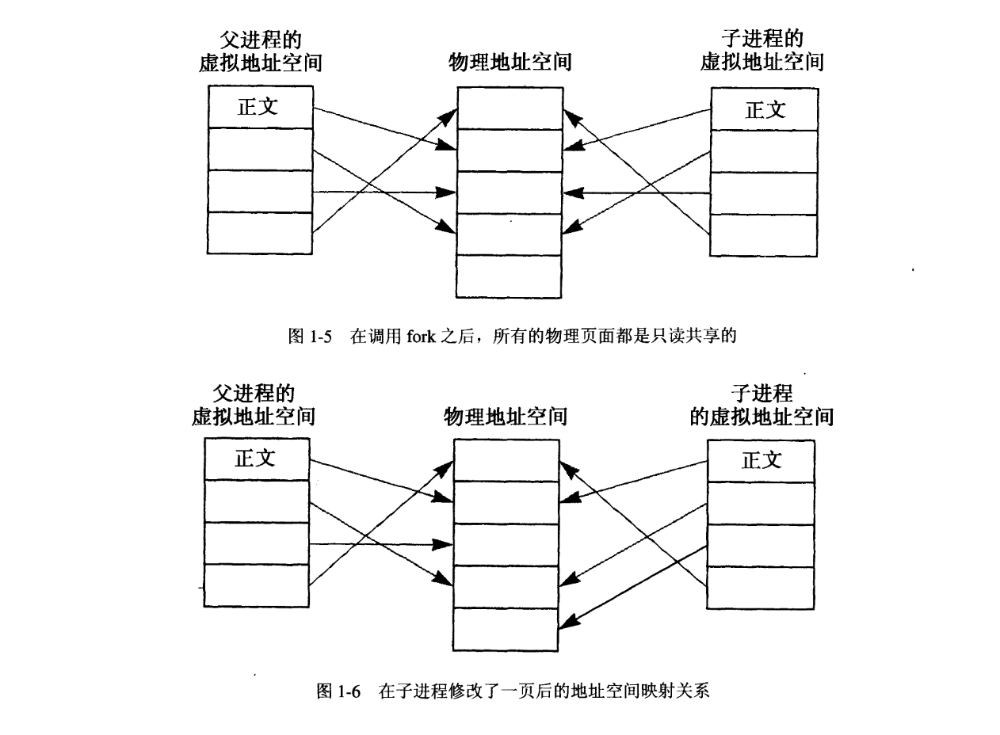

只要两个进程都没有企图修改数据，那么就会继续保持共享关系。当两个进程中的一个要写入一个只读页面的时候，就发生了一次保护陷阱（protection trap），内核会截获到这个陷阱。内核复制出进程正在尝试修改的单独页面的一个副本，用它来替换该页面在那个进程的地址空间中被共享的副本。这种做法只用于执行写操作的进程，其他进程的地址空间不受影响。采用这种方式时，可以在父进程和子进程之间共享尽可能多的地址空间，而仅仅根据需要复制进程修改页面的副本。这种处理对于两个进程都是透明的，从而造成复制了整个地址空间的假象。图 1-6 给出了图 1-5 中的子进程修改了它的第 3 个虚拟页面之后地址空间的状态。内核把这个页面的内容复制到了一个新的物理页面中，并且重新映射于进程的地址空间，指向该物理页面上。

为了避免复制那些仅有一个映射关系的页面，内核要计算每个物理页面上的只读、写时复制的映射关系数量。所以，如果父进程现在要写入它的第 3 个虚拟页面，那么内核就会知道这个页面上没有其他的映射关系，只要把映射关系改为读写就行了，不需要复制该页。结果如图 1-7 所示。


从应用的角度来看，系统调用 fork 是创建新进程的一种很方便的机制，因为它不带任何参数。因为子进程继承了父进程的全部状态，所以不需要像在其他操作系统中创建新进程那样给系统调用传递一组复杂的参数。子进程根据它从父进程那里得到的状态来判断出它应该执行什么任务。在大多数情况下， fork 的目标是创建一个新进程来执行新程序。要做到这一点，子进程通过打开或者关闭文件（例如，可能为了 I/O 重定向）来准备进程状态，然后用系统调用 exec 来执行新程序。

#### 1.5.2 系统调用 exec
系统调用 exec 改变了一个进程正在执行的程序。只有调用 exec 的进程才会受到影响。exec 的参数是一个文件名（该文件包含要执行的新程序）和一组要传递给新程序的参数和环境变量。执行 exec 系统调用的进程保留它与大多数 UNIX 系统服务相关的状态信息，比如，它打开的文件、它的当前目录和主目录，等等。它的状态中和程序本身有关的部分，比如它的寄存器内容、变量、 PC（程序计数器）以及地址空间，都要用新程序的来替换。更具体地说，原来程序的正文、数据、bss 和栈以及诸如共享存储的其他存储对象都会被丢弃，而要为新程序创建新的虚拟地址空间。新程序的正文和初始化数据则从指定的文件中读入，内核将地址空间内的空间分配给 bss 和栈。进程内单个线程的 PC（程序计数器）被设定在新程序的起始地址。当系统调用执行完毕的时候，原来的程序在进程中就不复存在了，新程序开始执行。新程序可以访问 exec 系统调用之前进程所打开的文件，因为这些文件都是和进程相关联的，而不是和程序相关联的。

如前所述，系统调用 exec 往往在 fork 之后执行。最常见的情形就是 UNIX 系统的命令解释器，它可以创建新进程来运行每条命令。命令解释器调用 fork 创建新进程，然后子进程调用 exec 运行该命令。

#### 1.5.3 系统调用 exit
系统调用 exit 会让调用它的进程（以及它的所有线程）终止执行。该系统调用在程序完成它的执行过程之后，并希望终止的时候使用。一个进程还有可能采用系统调用 kill 来终止另一个进程（假定该进程有适当的权限）。如果发生了无法恢复的错误，系统也可以终止一个进程。在所有的情况下，内核终止一个进程以及在事后进行清理工作的步骤都是相同的。

要终止一个进程，内核必须丢弃进程的地址空间，取消进程正在使用的内核服务，例如，关闭进程留下的任何打开的文件。此刻，进程暂时以一种称为僵进程（zombie）的形式存在，僵进程是一个 UNIX 的术语。这就提供了一种便捷的手段，让父进程在有机会采用系统调用 wait 读取于进程的退出状态之前保持进程之间的父子关系（僵进程与本书的讨论无关，不再深入研究）。最后，释放代表进程本身的内部的内核数据结构。此刻，进程就不复存在了，内核执行一次现场切换，选择另一个要执行的进程。

#### 1.5.4 系统调用 sbrk 和 brk
系统调用 sbrk 和 brk 都是供一个进程用来分配或者收回它的 bss 段空间。这两个系统调用都以 bss 段的 BreaK address（断开地址）而得名。这是在 bss 段内进程能够访问的最大合法地址。断开地址和栈顶部地址之间的虚拟存储区不会被映射到任何物理存储器上，进程无法访问到它们（眼下忽略共享存储和映射文件）。系统调用 sbrk 和 brk 能够让进程改变它的断开地址，从而增长或者缩小 bss 段的大小。系统调用 sbrk 接受一个代表断开地址增量变化的有符号数值作为参数，而系统调用 brk 接受－个成为新断开地址的虚拟地址作为参数。

如果进程请求增大 bss 段，那么内核就分配正好在原来的断开地址之上的虚拟地址，从而让进程能够访问到这部分地址空间。新分配的 bss 内存都被定义用 0 来填写。 bss 段只能向更大的地址增长，它的起始地址是固定不变的。支持新分配的虚拟内存的物理存储器则根据需要来分配，因为它是由进程来引用的。如果缩小了 bss，那么在新老断开地址之间地址范围内的虚拟和物理存储器都将被释放。访问权限也变了，于是进程再也不能访问它了。

#### 1.5.5 共享存储
有些 UNIX 系统的实现提供了一种能够让两个或者两个以上的进程共享一个物理存储器区域的系统服务。这通常叫做共享存储段（shared memory segment）。它是将同一个（或者多个）物理页面映射到两个或者更多进程的虚拟地址空间中来实现的。物理存储器的共享区无需在所有的进程中都出现在相同的虚拟地址上，每个共享区都可以按照其选择将它附加到不同的虚拟地址上。共享存储通常被附加到进程内 bss 和栈段之间未用的虚拟存储区中。

共享存储能够充当一种高速的进程间通信（interprocess communication, IPC）机制，因为进程可以通过其享存储传递数据，既不需要执行系统调用，也不需要牵扯到内核。当一个进程把数据写入共享存储中的时候，共享同一共享存储段的其他进程立即就能访问到这些数据，因为它们都共享相同的物理页面。

#### 1.5.6 输入输出操作
在考虑存储器操作的时候， I/O（输入输出）的影响是很重要的。从用户进程请求 I/O 操作的系统调用有两个: read 和 write。这两个系统调用把数据从进程的地址空间传送到一个文件或者设备（ write），或者反过来（read）。有些 UNIX 实现提供了额外的 I/O 系统调用，比如 readv、writev、getmsg 和 putmsg（就本书所介绍的主题而言，这些系统调用的作用同 read 和 write 是一样的，所以我们只讨论这两个系统调用。I/O 的类有两种：有缓冲的（buffered) 和未缓冲的（unbuffered）。

在内核中，对于特定文件类型的 I/O 是有缓冲的。内核和用户进程地址空间之间的数据通过一个复制操作来传输。缓冲机制（buffering）的优点是它允许用户程序不必知道物理 I/O 设备的特征属性。程序不需要关心块（block）或者记录（record）的大小，或者任何对齐的限制。例如，磁盘往往以扇区（sector）来存取，这意味着 I/O 必须从一个扇区的边界开始，并且包括多个扇区的大小。当一个用户程序读取有缓冲的文件时，它只要指定它希望 I/O 从这个文件内开始的字节偏移量以及它想读取的字节数就可以了。为了保持文件抽象的概念，内核把用户的字节偏移量转换为包含数据的相应扇区。一个或者更多扇区从磁盘读入到内核缓冲区中，用户想要读取的数据部分就被复制到用户的缓冲区中。

未缓冲的 I/O 则绕过了这种复制操作。用户进程可以使用这种类型的 I/O，它在 UNIX 的行话中称为原始 I/O (raw I/O）。术语“原始 I/O”来源于这一事实，即通过一个缓冲区进行复制的数据被认为是经过处理的，或者说加工过的（cooked）。因此，没有复制的数据则被认为是“原始的”。在采用原始 I/O 的情况下，I/O 设备使用 OMA (direct memory access, 直接存储访问）操作直接把数据传送到用户缓冲区。内核在有缓冲的 I/O 期间所缓冲的数据最终也使用 OMA 传送到设备上，或者从设备上传送到缓冲区中。所以，既可以在用户地址空间也可以在内核地址空间执行 DMA 操作。

#### 1.5.7 映射文件
许多 UNIX 系统的实现都提供了将文件映射到一个进程地址空间内的功能。一旦文件被映射到进程地址空间内，这个文件就可以作为地址空间内一段连续的字节区直接访问。这就让进程可以使用内存的上载和保存操作而不是系统调用 read 和 write 来访问文件的内容。映射文件在逻辑上和共享存储器类似：映射到同一文件的多个进程可以选择共享映射，从而让一个进程所做的改动也可以出现在其他进程的地址空间内。

### 1.6 小结
本章节回顾了 UNIX 内核的基本原理。UNIX 系统是一种多用户、多任务的操作系统，它通过向进程提供与机器无关的抽象服务，从而在 UNIX 实现之间提供了高度的程序可移植性。程序的执行被限制在保持程序当前状态的进程内，这些状态包括虚拟地址空间、程序的变量值以及硬件状态。内核给每个进程提供了一个环境，让这个环境显得就好像该进程是系统中正在执行的唯一进程那样。这主要是赋于每个进程自己的虚拟地址空间来实现的。用户程序通过执行系统调用来请求内核的服务。系统调用可以创建新进程（fork），改变进程正在执行的程序（exec），以及终止进程（exit）。还可以使用其他许多系统调用，其中包括动态分配未初始化数据的系统调用（brk/sbrk）、使用共享存储的系统调用，以及执行 I/O 的系统调用（read 和 write）。

## 2. 高速缓存存储系统概述
高速缓存存储系统（cache memory system）是高速存储器，它能够利用局部引用特性来提高系统性能。本章解释了高速缓存的基本术语、规划和操作，阐述了高速缓存是如何配合主存储器运行的，以及高速缓存中的数据是如何定位的。本章还介绍了散列算法（hashing algorithm）、缺失处理（miss processing）、写策略（write policy）、替换策略（replacement policy) 以及组相联（set associativity）。本章主要着眼于单处理机系统的高速缓存，多处理机高速缓存将在第三部分中进行介绍。到本章结束的时候，读者会对高速缓存的操作非常熟悉，可以在后面的章节中开始研究操作系统的问题了。

### 2.1 存储器层次结构
高速缓存是一种高速存储系统，它保存有主存储器很小的一个子集的内容。它的物理位置介于主存储器和 CPU 之间。因为它比主存储器速度快，所以如果频繁使用的指令和数据能够保存在高速缓存中供 CPU 存取，那么就有可能提高系统的性能。图 2-1 给出了包含高速缓存的一个计算机系统的逻辑框图。

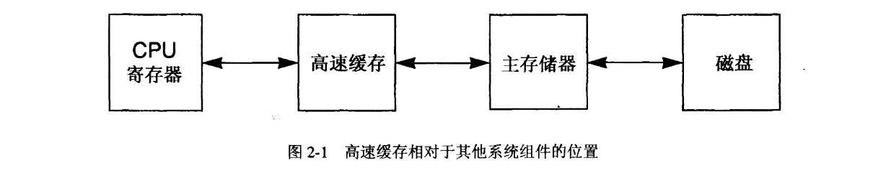

高速缓存利用局部引用特性来改善系统性能。局部引用是大多数程序所表现出来的一种属性，在这些程序中，在一个特定的时间段内，程序指令和数据的一个相当小的子集被频繁地重复引用。如果能够把程序当前的局部引用保存在高速缓存中，那么程序就能执行得更快，因为高速缓存可以比主存储器更快地提供指令和数据。

高速缓存只是存储器层次结构（memory hierarchy）中的一个组成部分。这个存储结构的一端是磁盘存储器，它具有非常高的密度，每比特的位成本很低，而存取速度则（相对）较慢。另一端是 CPU 内的寄存器，在数量上只有几个，寄存器每比特位成本很高，但是存取速度极快。随着我们从磁盘存储器过渡到寄存器，成本逐渐增加，存取速度逐渐加快，而密度却逐渐降低。

虚拟存储器调页系统（paging sytem）已经显示出只占系统中所有进程所使用的全部虚拟存储空间大小若干分之一的主存储器系统是怎样提供良好的整体性能的。局部引用通过只要求一个进程当前的工作集驻留内存使之成为可能，工作集是那些包含有进程当前局部引用位置的存储页面。进程的另一部分地址空间可以保存在磁盘上，直到需要的时候再加载。

局部引用特性延伸到了比工作集更细的粒度上。在一个进程工作集的页面内，肯定会有一组指令和变量在一段极短的时间内被一个程序频繁地重复引用。例如，考虑下面代码片段中计算矩阵 a 和 b 乘积的 C 代码小片段。假定 a 是一个 m x r 矩阵，而 b 是一个 r x n 矩阵， c 的全部元素都初始化为 0 。
```
    // 执行矩阵相乘的代码片段
    for (i = 0; i < m; i++) 
        for (j = 0; j < n; j++)
            for (k = 0; k < r; k++) 
                c[i][j] = c[i][j] + a[i][k] * b[k][j];
    
```

在这段代码执行的同时，它重复引用了 3 个循环内的指令、矩阵的元素以及循环计数器。这就是当这段代码在执行时程序的局部引用。因为矩阵包括的数据比寄存器能保存的数据多，所以如果没有高速缓存，CPU 就不得不重复引用主存储器，从而将这部分程序的执行速度限制在了主存储器的存取时间上。

上述代码片段中有两种类型的局部性：时间的（temporal) 和空间的 (spatial)。时间局部性是程序有可能重复使用近期引用过的项的属性。例如，在执行最里面的一层循环期间，数组 c 的同一个元素会被引用两次，循环变量 i、j 和 k 也是如此。类似地，在所有三层循环中的指令也会被重复引用。所有这些引用都体现出了时间局部性。空间局部性是程序有可能重复使用前面附近引用过的项的属性。由于 C 语言中的数组都是行的顺序保存的，所以数组 a 和 c 都体现出了空间局部性，因为会在后面的迭代中访问到行中的下一个邻接元素。类似地，串行程序的执行表现出了高度的空间局部性。

主存储器系统速度的提高和成本的降低并不能跟上如今高速 CPU 的发展速度。如果 CPU 的速度和主存储器的存取时间远远不能平衡，这意味着存储器要比 CPU 执行指令以及加载和保存数据的能力慢得多，那么 CPU 就会被限制在存储器的速度上。在这样的情况下，提高 CPU 的速度对于改善系统的整体性能来说几乎没有什么帮助，因为存储系统仍然是限制因素。虽然人们可以制造大规模的高速主存储系统，它们的存取时间能够同 CPU 加载和保存数据的能力相媲美，但是这种存储系统对于高端大型机和超级计算机以外的系统来说往往太贵了。当今很多系统设计人员的另一种选择是使用高速缓存。

通过利用细粒度的局部引用特性，高速缓存能够弥补速度较慢的主存储系统和快速 CPU 之间的缺口。在存储器层次结构中，每一级局部引用属性的引用如图 2-1 所示。**正如主存储器保存了程序的一个子集（工作集）那样，寄存器保存了当前运算的操作数，高速缓存保存了正在工作的指令和变量集，在那之上形成了细粒度的局部引用。**由于有了局部引用，高速缓存只需要拥有主存储器的很小一部分就能够发挥效用。由于它的规模相当小，所以实际上可以使用比主存储器所能用的速度更快的存储设备，因为并不需要太多的高速缓存。于是，高速缓存的高速度同局部引用特性的使用相结合就能大大提高系统性能，而且在经济上也很划算。

### 2.2 高速缓存基本原理
因为几乎所有的程序都体现出了局部引用特性，所以在 PC（个人计算机）到超级计算机的各种系统跟上都能找到高速缓存。甚至在现今大多数微处理器芯片和存储器管理单元（memory management unit, MMU）芯片上也可以找到集成的高速缓存。如果在微处理器或者 MMU 芯片上没有包含高速缓存，那么它一般会在 CPU 板（称为外部高速缓存）上。靠近 CPU 降低了 CPU 和高速缓存之间的存取时间。如果高速缓存位于一块独立的板上，访问它需要总线处理的话，那么就会大大增加时延（latency), 从而带来性能上的相应损失。有些系统既使用片上高速缓存，也使用外部高速缓存。

高速缓存的大小从几个字节到数百 K 字节都有，在大规模的系统上甚至有 1Mb 以上的高速缓存。例如，如今的片上高速缓存一般介于 4Kb 到 16 Kb 之间。外部高速缓存要大一些，介于 128Kb 到 4Mb 之间。随着时间的推移，高速缓存的规模正在逐步扩大。例如 Intel 80386 没有片上高速缓存，80486 有 8Kb 的高速缓存，而 Petium 则有两块 8Kb 的高速缓存。外部高速缓存已经从 MIPS R20000 的 64Kb 增加到 R4000 的 4Mb。

一般而言，高速缓存越大，性能提升就越多，因为有更大的一个存储子集被高速缓存起来供高速访问。正如随后的各章中将要看到的那样，高速缓存的规模并不能改变操作系统必须正确管理高速缓存的问题，而只能改变要使用的特定算法。高速缓存的性能将在 2.11 节里进一步讨论。

一个系统可以使用分离的指令高速缓存和数据高速缓存。这能够进一步提高系统的性能，因为 CPU 可以同时从指令高速缓存取得指令，而从数据高速缓存加载或者存储数据（参见 2.10 节）。正如第 6 章将要看到的那样，可以使用多级高速缓存给存储器层次结构增加额外的层次（接下来的几章将几种介绍单级高速缓存）。

#### 2.2.1 如何存取高速缓存
高速缓存的实现使得它们的存在对于用户程序来说基本上甚至完全地被忽略了。大多数实现的目标是隐藏高速缓存管理的全部细节，不论是硬件上的还是操作系统上的高速缓存（在后面的章节中阐述），以便获得用户应用的可移植性。这种方法确保了无需修改程序，应用程序就可以移植到具有不同高速缓存组织、不同高速缓存规模的不同系统上，或者移植到没有高速缓存的系统上，这是如今在市场上的一个重要获益点。如此一来，程序可以像以前那样继续通过地址引用存储器。访问高速缓存不需要特殊的编码技术或者寻址模式。高速缓存可以通过控制高速缓存的硬件自动访问。物理高速缓存（physical cache）这种高速缓存的组织甚至对于操作系统来说都是透明的。这就有可能给原本在设计上没有高速缓存的体系结构，比如（IBM 370 和 IBM PC），增加高速缓存，而且仍然能够和现有的系统软件保持兼容性（物理高速缓存将在第 6 章详细介绍）。

因为高速缓存只保存主存储器的一个子集，所以需要有几种方式来确定当前驻留在高速缓存的应该是存储器的哪些部分。存储器的那些部分就认为被高速缓存了。这一点是通过在高速缓存中用它的主存储器来标记该数据的方法做到的（对于指令高速缓存中的指令来说也是如此）。接着，硬件能够检查高速缓存中的数据标记来判断一个特殊的存储单元是否被高速缓存了。于是，比如说当 CPU 发出一个它想要读取的主存储器地址时，这个地址就被发送给高速缓存，硬件就开始搜索高速缓存来寻找相应的数据（参见下图）。如果在高速缓存中找到了它，那么久称为一次高速缓存命中（cache bit）。如果没有找到相应的数据，那么就称为高速缓存缺失（cache miss）。高速缓存命中与高速缓存缺失的频率之比就称为命中率（bit ratio），它以引用命中的百分比或者命中发生的概率（90% 的命中率和 0.9 的命中概率是等价的）来表达。命中率越高，系统性能就越好。

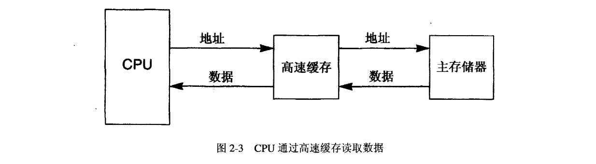

如果发生了一次命中，那么数据被返回给 CPU，就好像它是从主存储器中读取的一样。如果没有命中，那么就把地址传递给主存储系统，在那里访问寻址单元。在这种情况下，数据既返回给 CPU 也返回给高速缓存。在一次缺失之后数据被保存在高速缓存中，以便利用时间局部性。此时也可以把 CPU 读取的一段数据周围的数据都载入高速缓存，从而也能利用到空间局部性（正如后面将要讨论的那样，在高速缓存缺失期间载入的数据量取决于实现）。因为大多数程序都表现出了局部性，所以 90%或者更高的命中率并非罕见。

在高速缓存的设计中，要考虑的重要一点是用一个标记确定多少数据。例如，独立地标记高速缓存中的每一个字节代价太大。**因此，来自主存储器的一个或者更多连续的字被组织到一起形成了一个高速缓存行（line）或者块（block），并且给每一行关联一个标记。所以一个完整的高速缓存行是由一个标记和一段数据组成的，**但是高速缓存行的大小是指数据部分的字节数（一般并不包括标记的大小）。片上的高速缓存行的典型大小范围是从 16 字节到 32 字节。因为行中数据部分的字节是从连续的存储器单元来的，所以标记只需要包括第一个字节的地址即可；其他字节的地址可以用它们在行内的位置来推算。

除了地址之外，一行的标记部分还包括控制信息（control information）。标记部分始终都要加上一位，作为有效位（valid bit），表明相关的高速缓存行是否投入使用以及是否包含有效的数据。有效位必须为置位，且标记必须吻合，才能出现命中。在系统复位或者启动期间初始化高速缓存的时候，所有的有效位都被清除，于是一开始的时候，要到主存储器内引用全部的指令和数据。

在标记中保存的另一个常见的标志是修改位（modified bit）。正如 2.2.5 节所讨论的那样，在 CPU 把数据保存到使用写回高速缓存机制（write-back caching) 的一个高速缓存中的时候就设置这一位。在标记中也可以出现其他依赖于实现的信息，比如键（key），它是第 4 章的主题。

在发生一次高速缓存缺失的时候，就从主存储器中读取填满整个高速缓存行所需要的字节数，并且载入高速缓存。因为反映整行状态的只有一个有效位，所以必须这样做。例如，如果高速缓存行的大小是两个字长，那么在一次高速缓存缺失时不可能只读取 CPU 所引用的那一个字。如果没有读取两个字，那么高速缓存行的一般就会包含无效的数据。一般说来，从主存储器中读取附加的字并不会影响性能，因为大多数现代的主存储系统的设计都能一次读取或者写入多个字。

有些实现选择使用非常长的高速缓存行（128~256 字节或者更多）。**这样做的优点是它减少了标记需占的存储器数量，因为一个标记现在能够涵盖行里数据部分中的字节数更多。因此，为保存同等数量的数据，高速缓存所需的标记更少。长高速缓存行的缺点是，将整个行传入和传出主存储器所需要的时间开始变得明显长了起来。**为了缓解这一问题，有些实现将一个高速缓存行划分成了多个子行（subline），每个子行都有它自己的有效位。于是每个子行都能独立地进行处理，就好像它是一个单独的高速缓存行一样，差别在于只有一个地址标记涵盖一行中所有的子行。这意味着所有的子行包含来自连续主存储器地址中的数据。每个子行的地址由它在整个高速缓存行中的位置和高速缓存行的标记就可以推算得到。幸运的是，子行的使用对于操作系统来说是透明的，所以它不需要称为随后讨论的一个考虑因素。

#### 2.2.2 虚拟地址还是物理地址
高速缓存可以设计成通过数据或者指令的虚拟地址或是物理地址来访问。类似地，标记的设计也可以是连同其他信息一起，要么包括虚拟地址，要么包括物理地址。在设计硬件的时候，选择虚拟地址还是物理地址就确定下来了，并且对高速缓存管理技术有很大的影响，而操作系统必须采用这些技术向用户程序隐藏高速缓存的存在。这些复杂的问题将是后续各章的讨论主题。对于本书剩下的内容来说，不需要考虑访问高速缓存行所采用的地址类型。采用其中一种地址类型对于下面介绍的主题都有相同的影响。接下来的几小节指示简单地称为“地址”。

#### 2.2.3 搜索高速缓存
如果给定 CPU 想要的数据的地址，那么必须快速地搜索高速缓存来查找那个数据，因为高速缓存的全部目的就是要比主存储系统更快地返回数据。搜索技术还必须简单，以便高速硬件的实现既切合实际，又经济划算。比如说，线性搜索技术就不适用于高速缓存，因为除了最小的高速缓存之外，它们对于所有的高速缓存来说都太慢了。它们还难以在硬件上实现，因为它们需要一个状态机（state machine）或者定序器（sequencer）来保存搜索的当前状态。大多数高速缓存代之以使用一种简单的散列表（hash table）技术来进行搜索。

为了搜索一个高速缓存，来自 CPU 的地址经散列处理生成一个索引 (index），这个索引指向高速缓存中的一个或者多个位置，如果相应的数据被高速缓存了，那么就会保存在这些位置上。无论采用什么样的散列算法，都会出现不同的地址产生相同索引值的现象。于是必须用这些位置上的标记（它们包含着那些位置上正在高速缓存的数据的地址）和 CPU 所提供的地址进行比较。果一个标记和来自 CPU 的地址相吻合，那么就发生一次命中：否则，就出现一次缺失。对于高速缓存来说，散列是一种很有用的技术，因为它将搜索限定在了包含一个或者多个位置的小集合中（除了在全相联的高速缓存中之外，这将在以后介绍，在全相联的高速缓存中不使用散列技术）。接下来，硬件会快速地并行搜索这些位置。对于大规模的高速缓存来说，这些技术格外重要，因为在这些高速缓存中只有足够的时间去搜索一小部分高速缓存。上述的所有活动都在硬件中执行，无需软件的介入。

#### 2.2.4 替换策略
因为高速缓存要比主存储器小，所以在高速缓存缺失操作期间载入新数据时有些数据必须丢弃。要丢弃的数据是按照高速缓存的替换策略（replacement policy）来进行选择的（该策略与实现有关）。一旦被选中，那么高速缓存中要丢弃的数据就被新数据所替换。和数据相关联的标记也改成新数据的地址，从而在高速缓存中正确地标识它。

高速缓存所采用的替换策略往往相当简单。虽然在存储管理和虚拟存储调页系统中所看到的页面老化（page aging）和替换（replacement）技术从理论上说也可以应用于高速缓存，但是它们在硬件上实现起来过于复杂。它们经常需要大量的状态或者历史信息，而在高速缓存中使用的昂贵的高速存储器数量有限，没有充足的空间来保存它们。典型的高速缓存替换策略有 LRU (Least Recently Used，最近最少使用）、伪 LRU (pseudo-LRU，一种 LRU 的近似）以及随机替换。这些策略将伴随本章后面讨论的不同高速缓存组织进行介绍。幸运的是，和前面讨论过的那些高速缓存访问的方面一样，替换策略对于软件来说也是透明的。

#### 2.2.5 写入策略
当 CPU 保存数据的时候，大多数实现都把数据直接保存到高速缓存中。将数据保存在高速缓存中有助于改善系统性能的原因有两个。第一，由于时间局部性，被保存的数据在写入之后会被频繁地重新读取，所以就提高了命中率。第二，在高速缓存中使用的速度更快的存储设备保存数据的速度要比主存储器快。这就解放了 CPU，让它能够比其他方式可能的速度更快地开始下二次数据载入或者保存操作。写入高速缓存中的数据也可以同时写入主存储器。高速缓存的写入策略（write policy）也叫做更新策略（update policy），表明了数据是怎样保存到高速缓存和主存储器中的。

要把数据保存到高速缓存中，必须搜索高速缓存，看看高速缓存内是否己经包含有和写入的地址相关的数据。此刻使用了与从高速缓存中读取数据时相同的搜索技术。先考虑在保存期间出现一次命中的情况。在这里，CPU 写入的数据替换了高速缓存行内的老数据，以便利用时间局部性。

虽然高速缓存是用来自 CPU 的新数据更新的，但是该数据可以写入主存储器，也可以不写入主存储器，这取决于所采用的的写入策略。两种可能的写入策略是写直通（write-through) 和写回 (write-back) 也叫做复制回 (copy-back)。如果一个高速缓存正在使用写直通策略，那么来自 CPU 的数据既会写入高速缓存也会写入主存储器。写直通策略得名于存储器层次结构的组成，它必须“直通”过高速缓存到达主存储器。MIPS R2000/R3000 和 Intel 用于 80486 的 82485DX 外部高速缓存控制器都使用写直通高速缓存机制。写直通策略的效果时存储器始终保持在“最新”状态，这意味着在高速缓存中的数据和存在于主存储器内的数据副本完全相同（也叫做和高速缓存保持一致）。这种策略的缺点是每次 CPU 写入操作都需要有一个主存储器周期，有可能会降低系统的速度。

另一种策略是写回（write-back）。此时来自 CPU 的数据还是按照以前那样被写入高速缓存，但是并不写入主存储器，直到在行替换或者操作系统明确要求写回主存储器期间才写入主存储器。这就消除了采用写直通高速缓存机制时，如果在某个地址的数据被高速缓存，同一个地址被写入若干次时所造成的额外的主存储器周期开销。写回策略的缺点是，主存储器中的内容相对于高速缓存而言变成了”过时的“或者说不一致的。为了重获一致性，往往需要操作系统的介入。

例如，考虑采用写回高速缓存的 CPU 在执行一个程序中 i = i + 1 这条语句时会发生什么情况（假定 i 的值以前没有被高速缓存过）。如果在执行这条语句之前，i 在主存储器中的值为 1，那么当 CPU 试图读取 i 的当前值的时候，它就不会在高速缓存中命中，并且要将值 1 载入到高速缓存中，然后返回给给 CPU。如下图 a。接着，CPU 给 i 的值加 1，把 i 的值 2 写回，写入操作导致在高速缓存中发生一次命中，并且 i 在高速缓存中的值被更新为 2。此刻写入操作完成时高速缓存中 i 拥有新值，但主存储器内仍然保持着 i 的旧值 1，如下图 b。在高速缓存内 i 的新值被认为相对于主存储器内的值被”修改“过了。

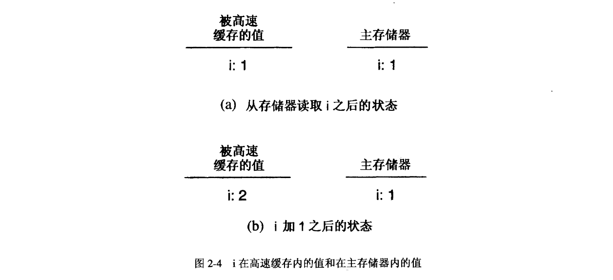

必须确保 i 在主存储器内的过时值不会被程序访问到，否则将会出现无法预测的结果。类似地，也必须确保多处理机系统上的其他进程不会使用过时的存储器内的值（这将在第三部分进行讨论）。只要 i 的新值保存在高速缓存内，那么程序就不会访问到 i 的过时值，因为程序总是可以在访问主存储器之前在高速缓存中命中。被修改的数据将保持被高速缓存，直到该行被替换为止。

在随后的缺失操作期间内的任何时刻，都可以替换写回高速缓存中的数据。被修改的数据不能被简单地丢弃，因为程序最终会在下一次引用时访问到在主存储器内的原来的过时值。因此，在替换之前，要替换的已被修改过的数据会由高速缓存硬件自动地写回到主存储器中。为了区分高速缓存中需要在替换时写回的己修改数据和不需要写回的未修改数据，在每个标记中加入了一个称为修改位（modified bit）的附加位。CPU 写入数据的每一行的标记中，都设置了修改位。只要在读缺失（read-miss）操作期间载入了数据，修改位就会被清除，因为数据仍然和主存储器保持同步。通过跟踪每一行的修改状态，高速缓存只需要在必要时写回高速缓存行，而无需像写直通高速缓存机制那样每次保存操作都要这样做。所以说，写回高速缓存机制的优点就是主存储器写入操作可能更少，总线操作可能更少，整体性能也就可能更好。缺点是操作系统需要好多次地把被修改的行写回存储器，以此来保持数据的完整性。写回高速缓存机制实现起来也要比写直通高速缓存机制的成本更高。一般而言，写回机制的优点大于缺点，所以这项技术得以广泛使用。如，Intel 486、Pentium 的片上高速缓存和 i860 XR、MIPS R4000、Motorola 88200 和 68040 以及 TI MicroSPARC 和 SuperSPARC（如果没有使用外部高速缓存的话）都使用写回高速缓存机制。

前面的讨论只考虑了保存来自 CPU 的数据期间在高速缓存里命中时情况。如果相反没有命中，那么采取的措施则取决于高速缓存是否支持写分配（write-allocate）。在使用写分配机制的时候，CPU 保存的数据在发生高速缓存缺失的情况下始终会被写入高速缓存（也就是说，为数据分配高速缓存行），以便利用时间局部性和空间局部性的优点。要做到这一点，要执行和读缺失期间相同类型的处理。首先，替换策略选择一行要丢弃的数据给保存新数据腾出空间。如果使用写回高速缓存机制，而且所选的要被替代的高速缓存行又被修改过，那么就必须把这一行写入到主存储器中。接着，从主存储器中读取与造成缺失的所有地址相关联的全部高速缓存行。之所以必须读取全部高速缓存行（或者子行），是因为正如 2.2.1 小节所阐述的那样，只有一个有效位涵盖高速缓存行或者子行的状态。一旦读取了一行，那么 CPU 写入的数据就被插入到这一行中，并且设置这一行的高速缓存标记，以便反映出新数据的地址。如果使用了写回高速缓存机制，那么还要设置这一行的修改位。如果 CPU 写入数据的大小等于高速缓存行的大小（例如，把一个字保存在每行一个字的高速缓存中），那么就会跳过主存储器的读取操作，因为该行肯定要被 CPU 的数据所替换。MIPS R2000/R3000 就是这种情况，它使用了 4 字节长的高速缓存行。使用写分配的其他处理器有 SR4000 、Motorola 68040和 88200 、TI SuperSPARC 以及 Intel 80486 (82495DX）的外部高速缓存。

有些高速缓存为了在硬件实现上更简单而放弃了写分配策略的局部好处。在不支持写分配策略的高速缓存中出现保存缺失的时候，数据被独自写入主存储器，而保持高速缓存的内容不变。 Intel 80486 和 TI MicroSPARC 就使用了这种技术。

在大多数情况下，写回高速缓存都使用写分配策略，但是写直通高速缓存则不然。这是因为硬件的成本问题：写分配会增加低成本的写直通方法的成本，因为在一次保存缺失期间必须读取一行再把这一行写入主存储器。写回高速缓存机制能够很好地配合写分配工作：另一方面，如果被写入的行尚未被 CPU 读取，那么就不会被高速缓存起来，从而导致所有这样的存储都被送往主存储器。但是，这也有例外。例如，Intel Pentium 的外部高速缓存控制器（82434LX）能够配置成使用不带写分配的写回策略，MIPS R2000/R3000 使用带有写分配的写直通策略。在 MIPS 芯片的案例中，硬件执行写分配很容易，因为每一个高速缓存行的大小只有 4 字节，从而不需要在发生保存缺失的情况下从存储器中读取一行。

其他的变化也是有可能的。例如，Motorola 88200 上的高速缓存就使用了写回高速缓存机制，但是只要在高速缓存内发生了保存缺失时，就会更新存储器。这称为写一次（write-once），它允许高速缓存行即使刚发生对它的保存也能保持未修改状态，因为主存储器会被更新。幸运的是，对于操作系统来说，诸如这样的变化都是透明的。

现在由下面的各小节探讨几种常见的高速缓存组织，它们将会有助于读者加深对刚介绍过的概念的理解。

### 2.3 直接映射高速缓存
最简单的高速缓存组织就是直接映射（direct mapped）或者单路组相联（one-way set associative）高速缓存（短语“单路组相联”的意思在下一节介绍“双路组相联”的时候就清楚了）。TI MicroSPARC 的片上数据高速缓存使用的就是这种高速缓存组织。它包含有 2Kb 的数据高速缓存，织成 128 个高速缓存行，每行 16 字节。在如图 2-5 所示的这种类型的高
速缓存中，在保存数据的部分高速缓存里，以散列算法用地址计算出每行拥有且仅有一个索引（也就是说，直接映射关系）。高速缓存可以当作是高速缓存中的线性数组，这些行都已散列算法计算得出的结果作为索引。在搜索期间，索引行中的标记要和地址进行比较以发现是否命中。因此，单有索引还是不够的，因为采用任何类型的散列算法都会有许多不同地址计算出相同的索引结果。在出现一次命中的时候，就从高速缓存行中提取数据，送往 CPU。如果标记和地址不匹配，或者有效位没有打开（要记住有效位是和地址一起保存在标记中的控制信息），那么就出现一次缺失，因为在直接映射的高速缓存中，这是能够保存数据的唯一位置。因此没有必要进一步搜索高速缓存。

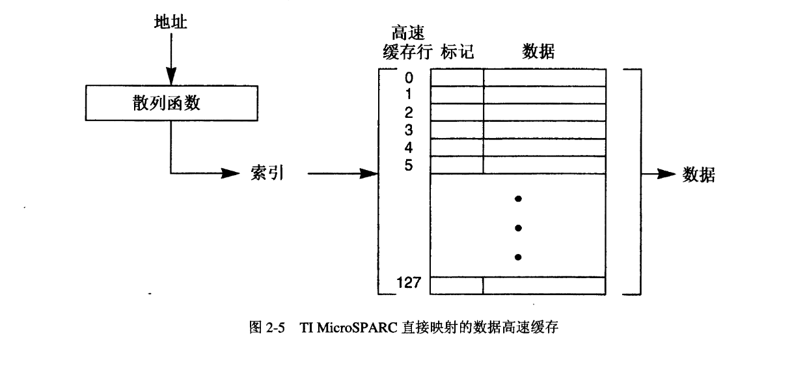

使用直接映射高速缓存机制的其他处理器有 Intel Pentium，它用于其外部高速缓存，以及 MIPS R200O/R3000/R4000所支持的所有高速缓存。

#### 2.3.1 直接映射高速缓存的散列算法
直接映射高速缓存的高速缓存散列算法必须将一个来自 CPU 的给定地址转换为高速缓存中一行的索引值。因为散列算法的计算是在硬件中完成的，所以它必须既简单，速度又快。对于降低成本和获得快速实现来说，简单性是必不可少的。速度非常重要，因为需要索引在适当的高速缓存行上启动读取周期。在比较高速缓存标记，查明是否有一次命中之前，必须完成上面所有的步骤。由于有这些限制因素，所以在高速缓存中使用的散列算法很少会采用算术运算，因为这些操作会花费很长的时间。

最常用的高速缓存散列算法是取模（modulo）函数，这种函数利用了这样的事实，即在直接映射高速缓存中的行数往往是 2 的幂。这就使得散列算法只要从地址中选出若干比特位，选出的比特位数正好等于高速缓存行数以 2 为底的对数，就能直接用它们来作为索引。例如，考虑 TI MicroSPARC 上的数据高速缓存，它有 128 (2 的 7 次方）行，每行 16 字节。这个配置的散列算法应当从地址中选出“位＜10..4＞”，使用这 7 个比特位从高速缓存的 128 行中选出一行（参见图 2-6）。因为每一行高速缓存有 16 字节，所以该地址的低 4 位将选择 CPU 寻址的高速缓存行中的若干字节。因为高速缓存总共有 2K，所以我们能够看到这种选择索引的方法会让所有模 2K 的地址都索引到高速缓存中相同的行（所有和“位＜10..4＞”匹配的地址都生成相同的索引）。这叫做取模散列算法（ modulo hashing algorithm）。

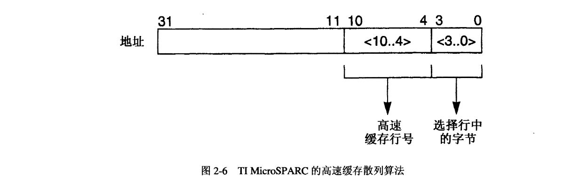

此外，产生相同索引的地址被认为有相同的颜色。如果一个高速缓存的大小是页面大小的倍数，则该高速缓存就被认为其颜色和高速缓存中的页数一样多。如果一组存储页面的地址散列到高速缓存内同一组的高速缓存行上，那么称这组存储页面有相同的颜色。高速缓存颜色是一种用来区分页面如何索引高速缓存的概念。它的用途将在 7工3 小节中进一步讨论（参见图 7-8，该图给出了相对于存储器中页面的高速缓存颜色）。

图 2-7 描述了程序的地址空间是怎样映射到高速缓存的存储器上的。因为在“位＜10..4>"中拥有相同位模式的所有地址都会索引到高速缓存中相同的行，所以地址 0、2048(2K）、4096(4K）、6144(6K）等都将索引或者映射到高速缓存中的 0行，而地址 16、2064(2K+16)、4112(4K+16)、6160(6K+16) 等都映射到 1 行上。正如 2.2.1 小节所阐述的那样，标记将会解决歧义的问题，因为它们指出了被高速缓存的数据的地址。

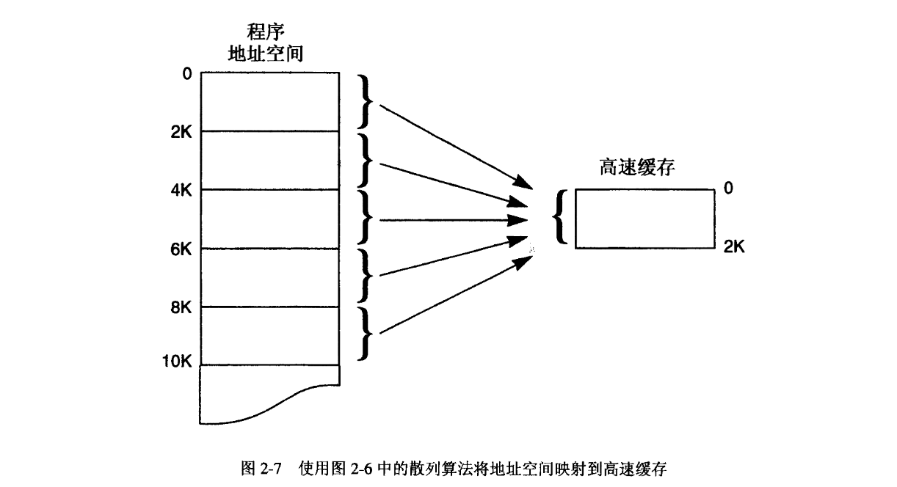

虽然取模散列算法是最常用的方法，但是用来选择高速缓存行的比特位可以取自地址中的任何部分。要看到取模散列方法的优点，下面的例子将使用如图 2-8 所示的另一种散列算法。这两种散列算法之间的区别在于程序中的地址是如何索引高速缓存的。在第一个例子（图2-6）中，连续的程序地址映射到高速缓存中的连续位置，而图 2-8 中的算法则导致整个地址范围（那些在“位＜11..4＞”中有相同值的地址）映射到相同的高速缓存行上。所以从 OxO 到Oxfff 的所有地址都索引到高速缓存中的 0 行，从 OxlOOO 到 Oxlfff 的所有地址都索引到 1 行，依此类推。效果如图 2-9 所示。

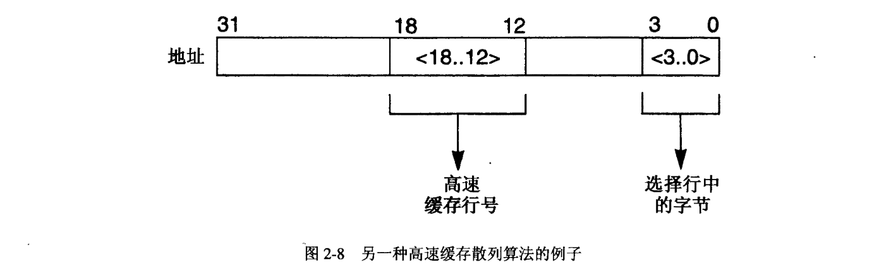

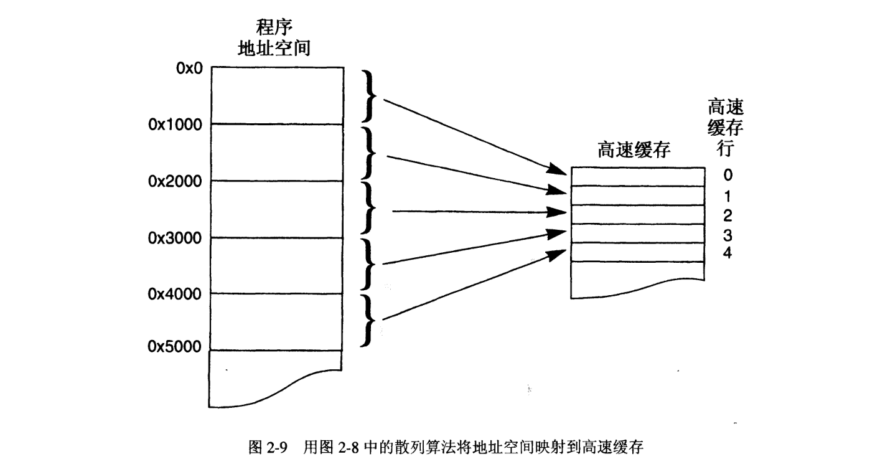

虽然实现这样的映射关系是可能的，但是我们不使用它，因为它导致了高速缓存利用率的低下（这里只给出举例说明）。例如，完全处于从 0x0 到 0x1fff 地址范围内的一个小程序让其所有的引用都映射到了高速缓存的头两行上。当这个程序正在执行的时候，只使用了 2K 高速缓存中的 32 字节。这样一种情况下，可能会有很低的命中率，而从高速缓存感觉不出来性能增益。

通过对比，读者可以看到图 2-6 所示的散列算法提供了一种地址到高速缓存的良好映射关系，能够把空间局部性扩展到最大。出于这个原因，它就是所有使用散列算法的高速缓存存储系统而选择的算法。

#### 2.3.2 直接映射高速缓存的实例
现在我们将迄今为止所介绍的所有概念联系起来，展示出一个查找（look-up）操作发生的完整例子。对于这个例子来说，假定我们有一个字长为 4 字节、有 12 位地址的系统。系统包含的直接映射高速缓存每行 8 字节，共计 8 行（为了简化示例，选择了 12 位的地址和一小块高速缓存。注意，始终都使用八进制的记法）。因为一行中有 8 字节，意味着以”位<2..0>"选择高速缓存行内的字节，而以单独一个比特位 2 就能选择行内的子，因为每行有 8 字节，即 2 个字。根据前面的讨论，最好的散列算法是使用“位<5..3>"作为高速缓存行的索引。索引一个 8 行的高速缓存需要 3 位，直接选择上述的几位选择高速缓存行内的字节，这样做能基于局部引用来充分利用高速缓存。地址中剩下的比特位则用于和高速缓存的标记进行比较（参见图 2-10）。


对于这个例子来说，我们假定高速缓存的初始内容如图 2-11 所示。在这个配置中，标记部分的符号“--”表示这一行无效。在高速缓存行中数据部分的两个字被一条坚线分隔开了。在高速缓存行中的字采用高字节结尾的顺序，这意味着地址最小的字位于高速缓存行的左端。

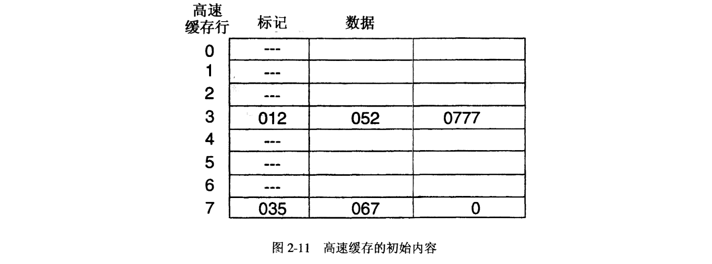

举第一个例子，CPU 将发出一次读取地址 01234 的操作。散列算法选择地址中的“位<5..3＞”，它们给该地址一个行索引值 3（参见图 2-12）。

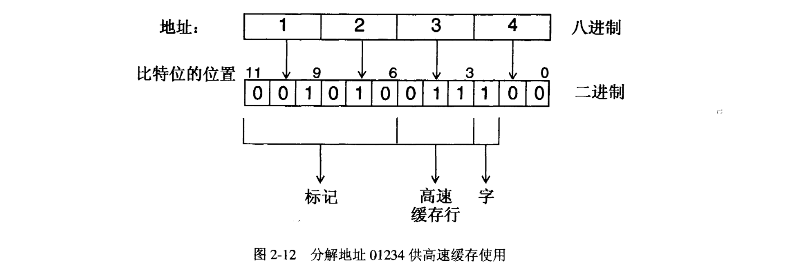

因为这是一个直接映射高速缓存，所以这个索引只和一行有关，如果这个地址的数据都在高速缓存中，那么数据就保存在这一行里。高速缓存控制硬件获得索引值，并且读取高速缓存行 3 的内容。它发现有一个有效标记，并且把这个标记同地址中的标记部分（位＜11..6>.即 012）相比较。地址中的标记部分和被索引的高速缓存行中的标记相吻合，因此就出现一次命中。现在，高速缓存控制器必须从高速缓存行中的数据部分选择正确的字。因为地址中设置了比特位 2，所以 CPU 想要让高端的宇保存在高速缓存行的右边：因而想要的字为 0777。

这里要理解的一件重要的事情是，对于高速缓存的标记来说没有必要包含完整的地址，因为根据地址在高速缓存中的位置就能推算出地址的一部分。这一点之所以重要是因为它减少了高速缓存行中的总比特位数，从而也就降低了高速缓存的成本。一般而言，标记只包括地址中散列算法不使用的比特位。在这个例子中，”位<5..3>"就只选择除了可以保存数据的高速缓存行。于是，用来构成高速缓存行索引的比特位可以从标记中省略。类似地，因为该高速缓存行包含 8 字节，所以地址中的低 3 位 (<2..0>) 也不需要保存在标记中。因此，在标记中只需要保存 "位<11..6>"。

举第二个例子，考虑当 CPU 试图从地址 0130 读取数据时会发生什么情况。散列算法选择“位<5..3>"用于索引，如图 2-13 所示，这几位又等于 3。

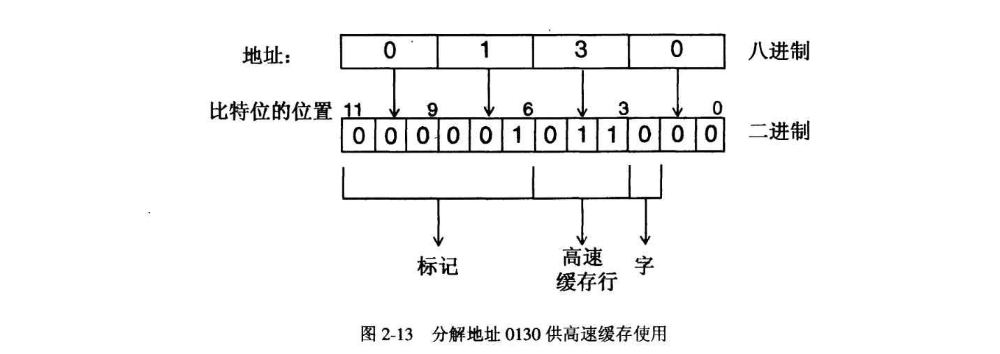

读取高速缓存行 3，并且将来自地址的标记 01 同高速缓存中的标记 012 进行比较。它们并不匹配，所以就发生了一次缺失。现在必须把地址发送到主存储系统来检索数据。接着，主存储器内从地址 0130 开始的两个字载入到有索引的高速缓存行中。因为位 2 是 0，所以需要的是双字中低端的那个字，于是高速缓存行左半部分中的字被返回给 CPU。

举最后一个例子，读取地址 06540 会造成一次缺失，因为被索引的行（高速缓存行 4）没有包含有效的标记，这会自动导致一次缺失。

下表总结了前面的几个例子，还给出了其他几个例子。

地址  | 被索引的行 | 返回的数据
---- | ------   | -----
01234 | 3       | 0777
01230 | 3       | 052
00130 | 3       | 缺失
03574 | 7       | 0
06540 | 4       | 缺失

#### 2.3.3 直接映射高速缓存的缺失处理和替换策略
当出现一次高速缓存缺失的时候，必须从主存储器读取数据并且返回给 CPU。数据还要载入高速缓存，以便在近期内再次引用它，就能立即得到。如果高速缓存行比一个字大，就要从主存储器中多读几个字，以便在高速缓存中载入完整的一行。此时就会造成邻接字被预取（prefetched），从而充分利用了局部引用特性。要读取完整的一行，高速缓存可能需要额外的存储器周期，也可能不需要，这取决于主存储系统的设计。为了获得最佳性能，主存储系统应该以高速缓存行的大小为单元传送数据，这成为突发模式（burst mode）的传送。这种模式能让完整的高速缓存一行在一次存储器操作中传送。没有突发模式，传送必须以更小的单元来执行，从而增加了开销。

一旦主存储器提供了所需的数据，就必须在高速缓存中找到一个位置保存它。这个位置必须经过挑选，以便散列算法在以后的查找操作期间能正确地定位高速缓存的行。在直接映射高速缓存中，这个位置是通过采用散列算法计算行中首字的地址，从而得到该行将会保存在高速缓存中什么地方的行索引值。最初检查的和发生缺失时找到的结果始终都是同一行。新行必须保存在这个位置，因为把它保存在高速缓存中的其他行，以后引用时就不能通过索引找到它。这是直接映射高速缓存唯一可能采用的替换策略。

如果缺失操作期间被替换的高速缓存行以前并不是有效行，那么就可以将新行的数据载入到这一行中，并且设定标记，指出数据的地址。该行的有效位也设为置位（打开）。如果这一行以前保存着不同地址的有效数据，那么这些数据就会被丢弃，并用新行替换它们。如果采用写回高速缓存机制，而且修改了原来的数据，那么在替换它之前必须将它写回存储器，从而不会丢失修改过的数据。

举一个例子，再次考虑 2.3.2 小节里的例子和图 2-11 描绘的高速缓存。如果 CPU 试图读取位于 00130 的字，那么就会发生一次缺失，因为高速缓存内的行 3 缓存的是从地址 01230 到地址 01237 的数据。如果主存储器在地址 00130 处保存的值为 0222，在地址 00134 处保存的值为 0333，那么在处理缺失之后，高速缓存将被更新为下图所示的内容。

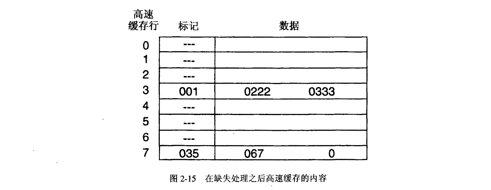

新标记和新数据替换了原来的标记和数据，高速缓存内其余的行则保持不变。CPU 最初请求的数据 0222 在新行写入高速缓存的同时返回给 CPU。

#### 2.3.4 直接映射高速缓存的总结
在直接映射高速缓存中，主存储器内数据的地址和高速缓存内可能保存该地址的位置或者行之间有一一对应的关系。数据在高速缓存内是通过散列该地址来定位的，计算得出了高速缓存中可以保存该数据的唯一一行的索引。直接映射高速缓存既可以使用写直通策略，也可以使用写回策略。

直接映射高速缓存时实现起来最简单的高速缓存，因为在读或者写操作期间只可能有一个搜索命中的位置。这就简化了在控制逻辑，从而让实现的成本更低。遗憾的是，这也是直接映射高速缓存的缺点，因为许多不同的地址都被散列到了同一行上。带有病态引用模式的程序，该模式中局部引用的数据或者指令地址都产生了相同的索引或者一小组索引，那么程序就无法从高速缓存获益，因为命中率非常低。在这样的情况下，高速缓存行在被再次命中之前总是被替换掉，所以这种情形称为高速缓存颠簸（cache thrashing）（这个名字来源于虚拟存储调页系统中出现的相同现象）。下面一节介绍对直接映射高速缓存所做的一种改进，以此减少颠簸，提高命中率。

### 2.4 双路组相联高速缓存
双路组相联高速缓存（two-way set associative cache) 类似于直接映射高速缓存，不同之处在于散列函数算出的索引指向高速缓存中可能保存数据的一组两行高速缓存。在这一组内，每一行高速缓存都有它自己的标记，这意味着高速缓存可以同时保存经散列算法算出相同索引的两个不同地址的数据。Intel Pentium 的片上数据高速缓存就是双路组相联高速缓存。它总共保存有 8K 的数据，每行 32 字节。这意味着高速缓存中总共有 256 行（8192字节 ÷ 32 字节/行），组成 128 组（256 ÷ 2 行/组）。下图描绘出了这样的一个高速缓存。

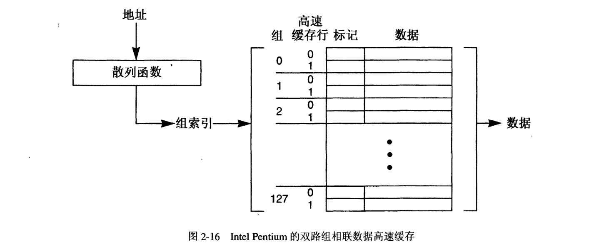

在查找操作期间，散列函数算出的索引指向一组两行可以保存数据的高速缓存。被索引的一组两行高速缓存中的标记和地址同时进行比较，以查看是否命中了两行中的某一行（组内所有行的标记并行比较，从而不会因采用串行比较而降低高速缓存的访问速度〉。双路组相联高速缓存的目的是，减少直接映射高速缓存中两个不同地址经散列计算得出相同的索引值时发生的高速缓存颠簸。在双路组相联高速缓存中，这两个不同的地址都保存在高速缓存中。使用这种类型高速缓存的其他处理器还有 Intel i860 XR 以及 80486 的外部高速缓存。

现在就很清楚为什么直接映射高速缓存也称为单路组相联高速缓存了。 “单路”和“双路”的说法是指每一组中高速缓存行的数量（在高速缓存内所有的组都有相同数量的行）。”相联”一词则是指实际上这一组高速缓存就是以内容编址（content-addressable）的或者说相联（ associative）的一个存储器，因为它是通过对照组内高速缓存行的位置（或者地址〉来检查标记的内容从而判断出一次命中的。直接映射高速缓存是 n 路组相联高速缓存的一种退化形式，因为每一个相联组中只有一行高速缓存。

配合双路组相联高速缓存的散列算法和配合直接映射高速缓存的散列算法相同，区别在于前者所需的比特位数更少，因为对于总量相同的高速缓存存储器来说，双路组相联高速缓存中的组数只有直接映射高速缓存的一半。所以用于图 2-16 中高速缓存的散列算法就只使用“位＜11..5＞”来选择组。和以前一样， “位＜4..0＞”选择高速缓存行内的字节（因为一行有 32 字节）。

替换策略稍微复杂一些。采用直接映射高速缓存时，在一次缺失操作期间，载入的高速缓存行必须放入将被索引的位置，从而可以在未来的查找操作期间找到。这一行就在散列算法所索引的高速缓存行组内。但是采用双路组相联高速缓存时，现在组内有两行都可以选择用来替换。两行中的任何一行都可以被替换，因为组内的两行在查找操作期间都可以搜索到。在理想情况下，最好替换在最长时间内不会被再次引用的行，因为这能提高高速缓存的整体命中率。遗憾的是，没有办法知道程序未来的引用模式。时间局部性表明，在组内宜采取 LRU 替换的做法，所以大多数实现（如 Intel 80486 外部高速缓存）都利用了这种方法。这种做法不但易于实现，而且效果相当不错。给每个组加上一个额外的比特位（称为 MRU，代表“最近使用”）就可以实现这种方法。每次在一组内出现一次命中时， MRU 位就被更新，以反映该组内的哪一行产生了命中。当组内的一行必须被替换的时候，高速缓存首先检查其中是否有一行被标记为无效。如果有，那么就替换那一行。如果两行都是有效的，那么 MRU 位就指出上次使用的是那一行，于是就选择替换另一行。然后再更新 MRU 位来指出被替换的行。

#### 2.4.1 双路组相联高速缓存的总结
双路组相联高速缓存通过索引一组两行可能保存数据的高速缓存行，来尝试获得比直接映射高速缓存更好的高速缓存性能。双路组相联高速缓存实现起来要稍微复杂和昂贵一些，因为必须并行比较一组内两行的标记，而且需要一种更复杂的替换策略。

它相对于直接映射高速缓存的优势在于可以减少高速缓存颠簸的现象。如果在一个进程的局部引用中多个地址得出了同一个索引，那么这两个地址会同时被高速缓存，而直接映射高速缓存却一定要替换该行。注意，双路组相联高速缓存的性能绝对不会低于行数相同的直接映射高速缓存。在最差的情况下，如果程序产生地址的顺序是每个地址索引唯一一行，那么双路组相联高速缓存的性能就和直接映射高速缓存一样。另一方面，如果局部引用是由产生冗余索引的多个地址所构成的，那么双路组相联高速缓存的命中率会更高，因为它能同时高速缓存着产生相同索引的两个不同地址的数据。

### 2.5 n 路组相联高速缓存
组内的行数并没有理论上的限制：在当今的计算机中， 4 路乃至更多路的组相联高速缓存也并非鲜见。例如，Motorola 68040 和 88200、Intel 80486 和 i860 XP 以及 TI SuperSPARC 的数据高速缓存都是 4 路组相联高速缓存。因为在组内并没有索引机制，所以也不要求组的大小一定是 2 的幂。在这一点上的案例就是 TI SuperSPARC 的指令高速缓存，它是 5 路组相联高速缓存。

用于这些高速缓存的散列算法和双路组相联高速缓存所采用的散列算法是相同系列的：使用取模散列函数（modulo hashing function），该函数采用的比特位数等于组数以 2 为底的对数值。

每组两行以上的高速缓存往往并不使用严格的 LRU 替换，因为这样做需要的状态信息太多。常常代之以使用历史信息有限的伪 LRU 算法。除了 68040 之外，所有提到过的处理器都采用了这种技术。 68040 的设计人员选择省略了伪 LRU 算法所需的额外状态信息，而是采用了一种伪随机替换（pseudorandom replacement）策略。

### 2.6 全相联高速缓存
在高速缓存内，组的大小可以增加到使组内的行数等于高速缓存内的全部行数。此时的高速缓存就称为全相联高速缓存（fully associative cache）。在全相联高速缓存中只有一组，它包含高速缓存中所有的行。不需要散列计算或者索引机制，因为只有一组要检查。采用任何 n 路组相联高速缓存时，都是并行搜索组内所有的高速缓存行。顾名思义，全相联高速缓存在每次查找的时候都要在全部高速缓存内进行搜索。

之所以需要全相联高速缓存，是因为它能够把高速缓存颠簸（thrashing）的现象减到最少，原因是在高速缓存中的任何位置都可以保存数据的任何部分。于是，从理论上来说，如果一个程序具有局部引用性的地方小于或者等于高速缓存的大小，那么它就会获得 100% 的命中率，并从高速缓存得到最大可能的性能提升。

全相联高速缓存构建起来要比同等大小、但每组行数较少的高速缓存成本高，因为必须并行搜索高速缓存中的所有行。这就是全相联高速缓存很少用于指令和数据的主要原因。在使用它们的时候 i 通常是小规模、有特殊用途且有高度时间局部性的高速缓存，比如转换后备缓冲器（ translation lookaside buffer, TLB）。TLB 高速缓存最近在 MMU 内使用过虚拟地址到物理地址的转换。小规模、全相联的 TLB 比较实用，因为大多数程序都体现出了局部引用特性，这意味着工作集的转换会被多次使用。此外，因为每一次转换都映射了完整的一页数据，所以只需几个转换就能提供良好的性能。例如， TI Micr呱PARC 使用一个有 32 项的全相联 TLB，而 SuperSPARC 有 64 工页。 Motorola 88200 和所有 MIPS 处理器上的 TLB 也都是全相联高速缓存。

### 2.7 n 路组相联高速缓存的总结
正如现在所看到的那样，从直接映射到全相联的所有高速缓存组织结构都遵循着相同的组成原则：每一种组织结构都有一种用于选择搜索行的算法，每一种组织结构都有一种替换算法，每一种组织结构都可以使用写直通或者写回策略，而主要的区别则在于每一组内行数的不同。在各种组成结构的一端是直接映射高速缓存，它每组只有一行。对于这种类型的高速缓存来说，以散列算法得到相同索引的所有地址必须在高速缓存中竞争一个可以保存它们的位置。直接映射高速缓存的替换策略相当简单，因为唯一的候选替换航就是散列算法索引的那一行。在各种组成结构的另一端是全相联高速缓存，它只有包括高速缓存内所有行的一个组。这种类型的高速缓存不需要散列计算，因为在每次查找操作期间都必须检查所有的行。在组比较大的高速缓存中使用 LRU 替换并不实用，这让随机替换称为常见的方法。

随着组的大小从单路组相联或直接映射高速缓存到全相联高速缓存逐渐增大，目标是减少多个地址散列到相同组时出现的高速预存颠簸现象。增加组的大小允许让其地址产生相同索引的更多数据同时保存到高速缓存中。于是，增加组的大小有可能提高命中率和系统性能。组变大的缺点是增加了硬件成本和复杂性，因为必须并行比较被索引组内所有行的标记。实际情况是，除了最小的高速缓存之外，对所有的高速缓存来说，都要避免使用组太大的高速缓存。


### 2.8 高速缓存冲洗
所有的高速缓存实现都向操作系统提供了从高速缓存中删除数据的能力，这种一般称为高速缓存冲洗（cache flushing）。根据高速缓存组织结构的不同，这对于防止意外引用过时数据、保持高速缓存一致性来说可能是必不可少的功能。一个高速缓存需要冲洗的准确时机则取决于它的组织结构，这是接下来的几章要讨论的主题。**高速缓存冲洗有两种形式：使主存储器有效（validating main memory) 和使高速缓存无效（invalidating cache)。**

使主存储器有效的形式是指在采用写回策略的高速缓存中将修改过的数据写回到主存储器内的做法。正如 2.2.4 小节所讨论的那样，这是由高速缓存在替换一个修改过的行期间自动完成的，但是它也可以由操作系统明确地进行控制。一次显示的使有效操作（validation operation）将把行内的数据写入主存储器，然后将高速缓存内数据的修改位关闭（因为相对于主存储系统内的副本而言不再是修改过的）。使主存储器有效的方法还可以让操作系统随时更新。使用这种方法可以防止主存储器内数据的过时副本被系统中不使用高速缓存的其他部分所引用。如果操作系统指定将一个高速缓存行写回主存储器，而这一行要么不在高速缓存中，要么当前并没有修改过，那么该有效操作对高速缓存什么也不做。这种冲洗类型从不需要采用写直通策略的高速缓存来完成，因为存储器始终和高速缓存中的内容保持同步。

使高速缓存无效的形式是指，如果高速缓存中的数据被修改过，那么无需先将它写回主存储器就把它丢弃的做法。这种功能既可以用于写直通高速缓存，也可以用于写回高速缓存。操作系统使用它来丢弃高速缓存中的过时数据。如果数据在主存储器内的副本更新与高速缓存无关，从而导致被高速缓存的数据副本过时，就会发生这种操作。让该数据在高速缓存中无效会造成下一次引用该数据时出现一次缺失，因此要从主存储器中重新读取该数据的正确副本。

一般而言，采用写回策略的高速缓存允许将独立的使主存储器有效和使高速缓存无效操作组合成单个操作，因为它们是一种常用的序列。在这种情况下，如果高速缓存中出现了该行，而且被修改过，那么就首先完成主存储器有效操作，于是该数据就不会丢失。在此之后往往会跟着进行一次使高速缓存无效操作。

两种高速缓存冲洗形式中的任何一种通常都能够以单行为基础来使用。大多数实现允许操作系统指定要被冲洗的数据的地址。随后在高速缓存中查找这个地址，如果命中则被冲洗掉。如果没有命中，则保持高速缓存不变。MIPS 处理器就是以这种方式工作的。有些实现可以允许一次冲洗一组地址，例如一页甚至整个高速缓存。 TI MicroSPARC和 SuperSPARC 就允许后一种方式，它们称之为“洗净”功能。 Motorola 68040 和 88200支持一次按行、按页面或者整个高速缓存的冲洗。

### 2.9 无高速缓存操作
大多数实现都允许 CPU 绕过高速缓存直接访问主存储器，这称为无高速缓存（uncached) 操作。例如，如果执行一次无高速缓存读取操作，那么即使地址己经在高速缓存中造成一次命中，也还是从主存储器读取数据。在这种情况下，忽略被高速缓存的数据，返回来自主存储器的值。在本章中提到的所有处理器都支持无高速缓存访问，这项功能往往可以通过页表项（page table entry）中的一个标志位来逐页进行选择。

在访问主存储器中其值的改变与 CPU 写操作无关的单元（用 C 程序设计语言来说就是不稳定的单元）时，采用无高速缓存操作就很有用。例如，映射 I/O 设备上状态寄存器的内存应当包含根据设备的状态而变化的值。一般采用无高速缓存访问来访问这类寄存器，因为一旦设备的状态发生变化，状态寄存器中被高速缓存的任何值都是过时的。

无高速缓存访问通常用于任何内存引用。在频繁要求进行高速缓存冲洗来保持高速缓存一致性的情形中，它们也很有用，这种情形可能会降低系统性能。

### 2.10 独立的指令高速缓存和数据高速缓存
将指令高速缓存和数据高速缓存分开的做法目前在计算机系统中相当常见。这种做法能够有效地使高速缓存的带宽加倍，因为它能让 CPU从指令高速缓存预取指令的同时把数据载入或者保存到数据高速缓存中。图 2-17 描绘了这样的一种组织结构。本章提到的所有处理器，除了 Intel 80486 之外，其片上高速缓存都有独立的指令高速缓存和数据高速缓存。

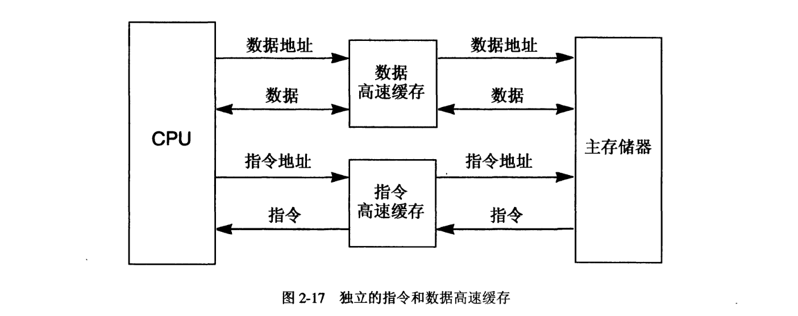

因为两块高速缓存都可以同时访问主存储器（缺失处理或者写操作），所以要由硬件来仲裁高速缓存对主存储器的访问，这对于软件来说是透明的。注意，没有办法直接把数据保存到指令高速缓存中。因此，指令高速缓存时只读高速缓存。

这种组织结构最重要的方面就是缺乏数据高速缓存和指令高速缓存之间的直接互连。如果在指令高速缓存中没有命中某个指令，那么指令高速缓存就无法到数据高速缓存中查找它。指令高速缓存始终都是从主存储器读取指令来完成缺失操作。类似地，数据高速缓存中的缺失也要从主存储器读取。把数据保存到数据高速缓存中不会影响指令高速缓存的内容。虽然这是一种最简单的实现，但是它可能会产生高速缓存的不一致性，因为主存储器的内容可能会高速缓存在一个以上的地方。如果使用单一的、将指令和数据结合在一起的高速缓存，就不会出现这类不一致性。

考虑使用自身能够修改代码的程序的情形。这类程序包括诸如 LISP 解释器这样的程序，因为对于它们来说，部分编译它们正在解释的程序并非鲜见（编译代码通常写入进程的数据区）。如果要执行的指令是在数据区动态生成的，那么有可能出现两种不一致性。第一，如果使用写回高速缓存机制，那么最近写的指令可能尚未写入主存储器。这意味着，如果程序试图执行这些新指令，那么指令高速缓存可能会从内存中取得过时的指令。第二，一旦动态生成的指令高速缓存在指令高速缓存中，那么程序的任何写操作（以此用新指令来替换那些在指令高速缓存中的老指令）都不会对指令高速缓存造成影响。新指令将写入数据高速缓存，并且最终写入主存储器，但是指令高速缓存不知道取得新值。它会继续执行过时的老指令，直到行替换删除这些指令为止。在这种情况下，下一次引用那些指令将会造成一次缺失，并且从主存储器读取新指令。

遗憾的是，操作系统不能把高速缓存藏起来，让这类程序看不到高速缓存的存在，因为操作系统没有办法知道程序什么时候试图执行其数据空间部分。唯一的解决方法是提供特殊的系统调用，以便程序已经产生一组它现在想要执行的指令时就通知操作系统。接着，如果在数据高速缓存中使用了写回高速缓存机制，那么操作系统就使主存储器有效，并且使指令高速缓存的内容无效（在提供特殊指令来冲洗高速缓存的体系结构上，如果应用程序能够直接执行高速缓存冲洗指令，那么就不一定要有特殊的系统调用）。冲洗指令和数据高速缓存通常作为硬件的单独操作来实现。

一般而言，只要操作系统需要使被高速缓存的数据无效来保持一致性，那么它也必须使指令高速缓存无效。各种特定的实例则取决于高速缓存的体系结构，下面的章节将讨论它们。

虽然有可能让构建的系统中的硬件自动保持指令高速缓存上执行写操作的时候检查指令高速缓存，而且还有可能使指令高速缓存无效。这样做需要额外访问指令高速缓存，从而会干扰指令的取操作，并且降低取指令的速度。自身能修改代码的实例很少能值得为其在硬件上增加复杂性。

### 2.11 高速缓存的性能
虽然全面讨论高速缓存的性能超出了本书的范围。还是可以做以下一些观察的。首先，高速缓存的性能不仅取决于高速缓存的设计，而且取决于应用的引用模式。因此，必须小心翼翼地尝试采用基准程序来判定高速缓存的性能和总结结果。虽然很容易编写一个获得 100% 命中率的基准程序，但是把它们运用到实际应用中的时候，这样的结果是毫无意义的。例如，下面的程序会获得 100% 的高速缓存命中率。
```
    while(1);
```

循环执行一次之后，所有的指令引用都会在高速缓存中命中。相反，下面的代码片段给一个数组中的每个元素都乘以常数。因而会得到相当低的高速缓存命中率（假定数组要比高速缓存大）。
```
    for (j = 0; j < YMAX; j++) 
        for (i = 0; i < MAX; i++)
            matrix[i][j] *= c;
```
因为在 C 语言中，数组是按行来保存的，在使用高速缓存的时候，如果数组中一行的大小超过了高速缓存行的长度（假定一开始数组没有被高速缓存），那么每次执行最里面的语句就会出现一次缺失。这样的情形尤其糟糕，因为行很长的高速缓存会读取大量从来都不会用到的数据。互换两层 for 循环会因为控件局部性而提高性能。即使每个元素只读取一次，高速缓存每次都要读取整整一行的事实也意味着引用连续的元素可能会产生一次命中。例如的情况是行很小的高速缓存，像 MIPS R2000/R3000，它们的每个高速缓存行只有 4 字节。如果数组 matrix 的每个元素也是 4 字节，那么就没有空间局部性的好处了。

即使高速缓存的性能是依赖于应用的，在直觉上还是有下面的结论（虽然对于所有应用来说，它们并不一定都对，但是对于包括典型 UNIX 命令在内的许多应用来说，它们都是正确的）。首先，写回策略比写直通策略更可取，因为程序一般会因为时间局部性而多次修改变量。即使它们没有多次修改变量，写回高速缓存机制也往往不会增加任何性能开销，因为写直通一行或者在以后替换行的时候再写回都要花费一个存储器周期。为每一行维护一个修改位以及处理写回增加了复杂性，但这样做是值得的。在最差的情况下，没有时间或者空间局部性可言，有写分配能力的写回策略只会多读一次高速缓存行。完全没有局部性的情形是非常少见的，所以它们不会对性能造成明显的影响。

接下来，增加组的大小一般也会有帮助。对于小规模的高速缓存（1K 或者更小）来说这样的做法特别有用，因为即便多个地址产生了相同的索引，它也能利用更多的高速缓存。对于非常大的高速缓存（1M 或者更多）来说，增大组就没那么重要了，因为随着行数的增加，出现一段数据替换现有的高速缓存数据的可能性也逐渐减小。

由于空间局部性，增加高速缓存行的大小一般也会对高速缓存性能有帮助。高速缓存行太长的缺点是在缺失处理期间读取数据需要靠小。在小规模高速缓存的组织结构中找不到很长的高速缓存行，因为它会意味着高速缓存中没有几个单行了。因此出现替换的频率就更高了。

高速缓存的性能也会收到操作系统的影响。不同的高速缓存组织结构需要不同环境下的高速缓存冲洗机制。有若干种技术可以用来减少必须发送的冲洗量。这很重要，因为频繁的冲洗很花时间，并且减少了有用的数据被高速缓存的时间长度。这些技术将在第 7 章里讨论。

### 2.12 如何区分不同的高速缓存结构
如今能在计算机系统上找到的高速缓存五花八门。最明显的区别则体现在如下几个领域：
+ 高速缓存大小
+ 行大小
+ 组大小
+ 写分配的使用
+ 替换策略
+ 按照虚拟或者物理地址查找
+ 如何标记行（通过虚拟地址、物理地址还是其他信息)
+ 写直通或者写回策略

前 5 项影响高速缓存的性能。而且从保持高速缓存一致性的角度来看，除了一项（组大小）之外，其他的项对操作系统都没有直接影响。必须偶尔考虑以下组的大小，这将在 3.3.2、4.2.2 和 4.2.6 小节中介绍。清单中的最后 3 项也影响性能，但是它们还影响操作系统。这几项决定了操作系统为了向系统上运行的程序完全隐藏高速缓存的存在而需要明确执行的高速缓存冲洗量。

下面的几章介绍了 4 种高速缓存组织结构，而且描述了在什么样的条件下操作系统必须明确执行冲洗。所研究的不同高速缓存组织结构在采用虚拟地址还是物理地址来查找和标记行方面会有些变化。在每种情况下还需要考虑写直通和写回高速缓存机制之间的差异。

## 3. 虚拟高速缓存
虚拟高速缓存以备高速缓存的指令或者数据的虚拟地址来做索引和标记。这就给操作系统带来了许多复杂因素。因为不同的进程可以使用先沟通的虚拟地址。一个进程高速缓存的数据可能被错误地当做属于另一个进程的数据。为了防止出现这种情况，操作系统必须在发生这类歧义之前冲洗高速缓存。本章阐述虚拟高速缓存的操作，歧义（ambiguity）和别名（alias）是如何出现的，以及在一个单处理机环境下的操作系统如何防止它们影响程序的执行。

### 3.1 虚拟高速缓存的操作
在采用虚拟高速缓存的情况下，程序的虚拟地址用来被索引高速缓存和标记数据。这种方法的主要优点是不需要在每次读取或者写入操作的时候把虚拟地址转换为物理地址，就能够存取高速缓存。如下图所示，正在 CPU 上执行的一个程序确定了它希望读取或者保存的数据的虚拟地址，或者是它希望取得的指令的虚拟地址。这个虚拟地址被发送到高速缓存，高速缓存执行一次查找操作，以检查数据是否在高速缓存中。如果在一次读取高速缓存的操作中发生了一次缺失，那么就把存储器管理单元所计算出的物理地址发送给主存储器，主存储器随后返回数据（有些实现和高速缓存查找操作并行地开始地址转换）。接着，数据载入高速缓存，于是将来的引用就可以得到它（局部性），并且被返回给 CPU。

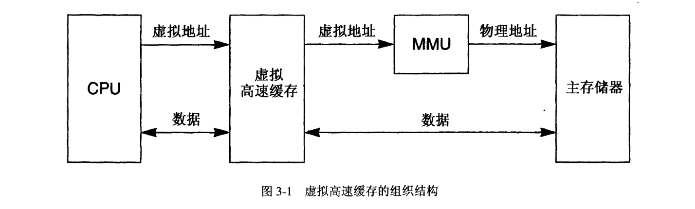

使用虚拟高速缓存的系统可能会在引发高速缓存命中的读取操作期间使用 MMU，也可能不会。例如，Intel i860 系列的处理器就将虚拟高速缓存用于其片上指令高速缓存。这些处理器的 MMU 在取指令期间不会转换在指令高速缓存内引发命中的虚拟地址。这意味着硬件不会显示地确认存取权限。在 Apollo DN4000 和 Sun 3/200 上的虚拟高速缓存也是如此。这些系统遵循上图所示的模型，其中的 MMU 只有在高速缓存中出现一次缺失之后才转换虚拟地址。以这种方式使用虚拟高速缓存的系统明确地假定，如果一个程序在一次缺失操作期间成功地读取了数据，那么它仍然有权在后来的高速缓存命中期间读取该数据。正如后面几小节中阐述的那样，操作系统必须确保程序不再有权读取的数据在高速缓存中无效。

保存的步骤如下：如果采用了写直通策略，那么就把要写入的数据及其虚拟地址传送给高速缓存。虚拟地址立即被送往 MMU 进行转换和检查权限，以确保该进程有权向这个地址写入数据。如果进程有写权限，而且在高速缓存中命中，那么就把新数据插入高速缓存行，并且用 MMU 转换后的地址写入主存储器。如果发生缺失，而且使用了写分配机制，那么高速缓存会先使用转换后的地址从主存储器读取高速缓存行（只有当高速缓存行的大小比 CPU 写入的数据大的时候才行，解释见 2.2.5小节）。接着要保存的新数据被插入高速缓存行，并被写入高速缓存。如果没有采用写分配机制，那么在保存操作造成缺失期间高速缓存的内容不会发生变化。无论是哪一种情况，要保存的数据都会用物理地址写入主存储器。如果这个地址不允许有写权限，那么就向 CPU 触发一次陷阱信号，高速缓存和主存储器都不会有变化。

如果使用写回高速缓存策略，那么确保不违反存取权限操作要复杂一些。假定采用了写分配机制（写回高速缓存一般会采用），而且在一次写操作时高速缓存内没有虚拟地址，那么 MMU 就需要转换地址，并且像以前那样从主存储器取出完整的高速缓存行。这就有机会确认存取权限。如果允许写权限，新数据就从主存储器插入高速缓存行，并且设置该行的修改位。如果没有采用写分配机制，那么在发生一次缺失的时候，就和没有写分配机制的写直通高速缓存一样：数据只被写入主存储器，高速缓存保持不变。

如果在向写回高速缓存中保存数据期间发生了一次高速缓存命中，而且该高速缓存行已经修改过了（由标记中的修改位指示出来），那么就能明确地假定进程仍然有权把数据写入这个地址，因为当初它修改这行的时候必须有写权限。在这种场景里，命中了修改过的行时不需要显示的使操作有效。和以前一样，如果进程的执行期间存取权限变化了，那么操作系统必须冲洗高速缓存。

如果要尝试的写操作命中了高速缓存中没有修改过的行，那么就出现困难了。因为不知道是否有写权限，所以就把该地址发送到 MMU 进行确认。是 Intel i860 XR 的片上虚拟写回数据高速缓存起作用的方式。它的 MMU 检查所有对数据高速缓存访问的存取权限（命中和缺失都检查）。这种确认适合高速缓存查找操作并行进行的，从而防止高速缓存访问的速度降低。如果一次保存操作允许写访问，那么就把新数据插入到高速缓存行，并且设置该行的修改位。在这种情况下根本不需要访问主存储器，因为这一行已经在高速缓存中了。

像 Apollo DN4000 这样，采用写回高速缓存，只在一次缺失之后转换虚拟地址和检查存取权限的实现，通过在标记的控制部分加入一个可写位，克服了在这种情况下串行执行高速缓存查找操作、MMU 确认操作所造成的性能损失。只要在一次高速缓存缺失期间读取了新行，而且进程有权写入相应的地址，那么就设置这一位。这一位是页表内写权限位的一个副本，它能够让高速缓存自身完全处理写入确认，从而节省了多余 MMU 操作的开销。这类实现对于操作系统来说是透明的。

因为写回高速缓存机制把修改过后的数据留在了高速缓存中，所以当一行在缺失处理期间被替换或者显示地被操作系统冲洗掉（指定主存储器应该用修改过的数据进行确认）的时候，就必须把它写回。如果在这些情况下写回操作是必须的，那么高速缓存就把要写回的数据的虚拟地址（保存在标记中）发送给 MMU。一旦计算出了物理地址，就把被修改过的行写入主存储器。


### 3.2 虚拟高速缓存的问题
虚拟高速缓存通过省略地址转换步骤能够加快向 CPU 返回数据的速度，它是操作系统最难以管理的高速缓存类型。问题围绕着这一事实而出现，即虚拟地址用来检索和标记高速缓存行。虚拟地址不能唯一地确定一段数据，因为多个进程可以使用相同范围内的虚拟地址。除非操作系统能够采取步骤来防止它们，否则这会在高速缓存中造成歧义和别名现象。下面两小节将讨论这些问题。

#### 3.2.1 歧义
当不同的数据段在高速缓存中有相同的索引和标记时，就出现了歧义现象。这意味着高速缓存将不能区分两段不同的数据，因为索引和标记时高速缓存仅有的确定数据的手段。引用这样的数据则被称为有歧义。对于一个虚拟高速缓存来说，只要使用的虚拟地址在不同的时间点有不同的物理地址映射关系，就会发生歧义。例如（使用图 3-2 给出的物理存储器的内容），如果在第 1 个时刻，虚拟地址 0x1000 被映射到物理地址 0x5000，那么如果引用这个地址，就会把 5678 读入高速缓存，如图 3-3 所示。再次引用它会在高速缓存中命中，从而不访问主存储器（注意，为了清楚期间，在标记中给出了完整的虚拟地址。实际的实现只会保留散列算法不用的地址中前面部分的比特位）。


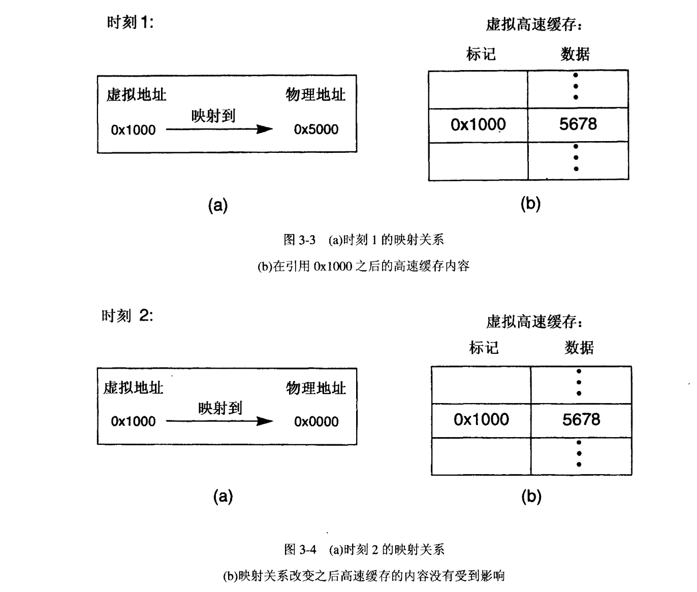

如果在第 2 个时刻，映射关系改到了物理地址 0x0000 上，那么引用虚拟地址 0x1000 还是会返回在物理地址 0x5000 处的数据，因为虚拟地址仍然在高速缓存中产生一次命中（参见图 3-4）。高速缓存查找操作只是基于虚拟地址进行的，所以即使物理地址已经变了，还是给该虚拟地址 0x1000 产生了相同的索引和标记。

结果，程序将继续获得错误的数据（和主存储器内保存的数据不一致），直到包含错误数据的高速缓存行在缺失处理期间被替换，或者显式地从高速缓存中冲洗掉为止。高速缓存不能自动地这样做，因为它只处理虚拟地址，不知道物理地址已经变了。

操作系统负责确保在虚拟地址空间中发生任何变化之前把任何老数据写回到主存储器，从而避免出现歧义。如果让它们发生了，那么程序就会零星地从高速缓存中读取错误的数据，从而导致无法预料和不确定的行为。如果听任操作系统自己的数据出现歧义，那么系统就有可能崩溃，或者至少是运行不正确。

#### 3.2.2 别名
别名也叫做同义（synonym)，**当使用一个以上虚拟地址来指代相同的物理地址时就发生了别名现象**（多个虚拟地址被称为别名）。如果一个进程将同义共享存储区附加在它的地址空间中两个不同的虚拟地址上，或者两个不同的进程在它们各自地址空间的不同地址上使用同一共享存储区，就会发生别名现象。如果每个地址经散列算法计算出不同的行索引，那么相同的数据就会保存在高速缓存中不同的地方。如果两个版本的数据彼此失去同步，就会发生意想不到的结果。

考虑一个进程，它将物理存储器地址 0x3000 处的存储页面映射到虚拟地址 0x2000 和 0x4000，如图 3-5 所示（假定存储页面有 0x1000（4K）字节大）。有了这样的映射关系，程序既能从 0x2000 也能从 0x4000 读取数据，并且会得到相同的结果，因为这两个地址都引用了存储器内相同的物理页面。假定这个例子中的系统有一个直接映射的虚拟高速缓存，它使用虚拟地址的 位<15..4> 作为索引。这意味着地址 0x2000 经散列算法得到高速缓存行 0x200，而 0x4000 则得到行 0x400。如果物理地址 0x3000 处的第一个字为 1234，那么如果进程先后引用了两个虚拟地址 0x2000 和 0x4000，则物理地址 0x3000 处的值就会被读入高速缓存内两个不同的地方（如图 3-6 所示），因为这两个地址产生了不同的索引。

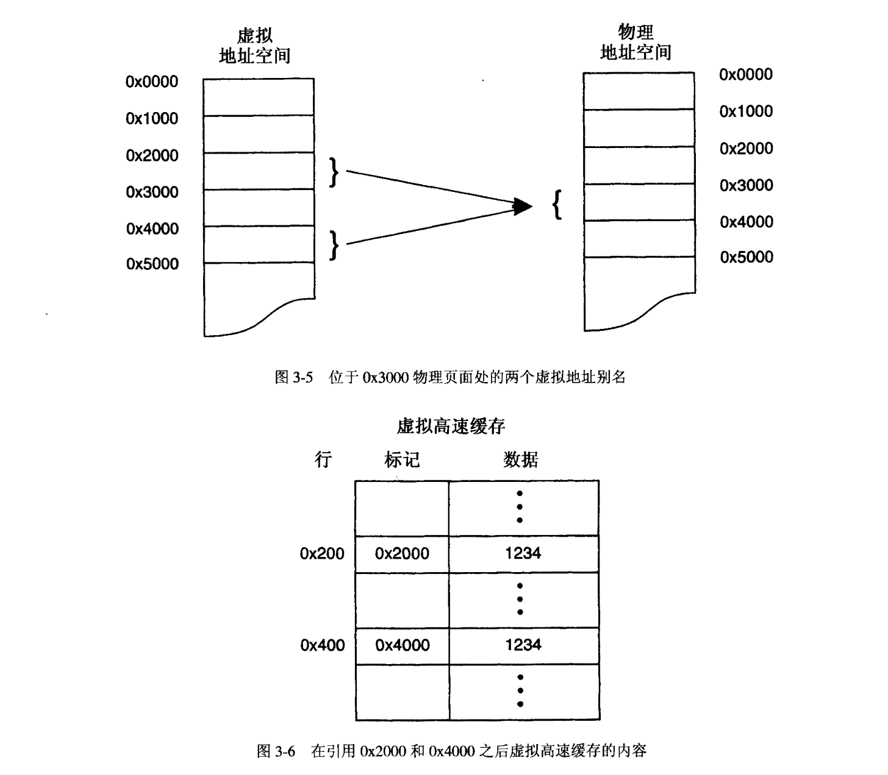

迄今为止，因为使用任何一个地址都返回了正确的数据，所以进程还没有受到错误的影响。在这个进程尝试向两个地址中的一个写入数据之前，它还能继续在这些位置接收正确的数据。如果它现在把 5678 写入虚拟地址 0x2000，那么行 0x200 就会更新，但是位于行 0x400 的别名不会更新，这将导致两个别名没有包含一致的数据。下图描述了这种情况。

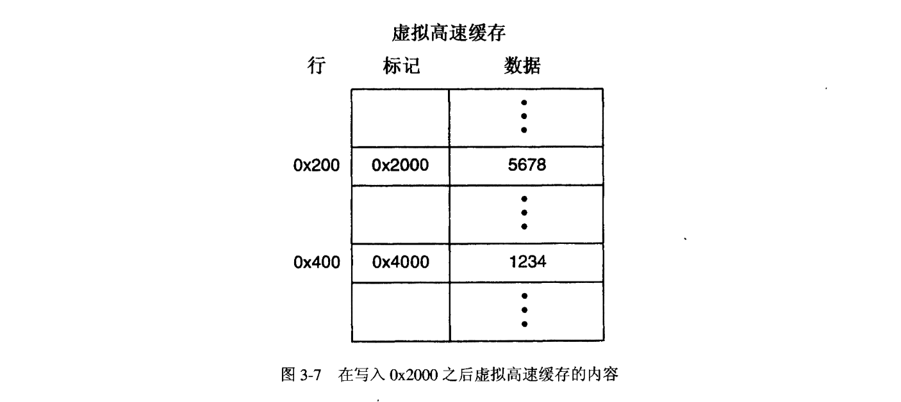

引用虚拟地址 0x4000 将返回物理地址 0x3000 中原来的过时内容。它们会继续这样做，直到这一行在缺失期间被替换或者被显式地冲洗掉为止。高速缓存中的过时数据会在程序执行过程中造成奇怪的和无法预测的行为。如果把进程不同的值写入虚拟地址 0x4000，那么会出现奇怪的结果。进一步的结果会根据高速缓存是使用写直通还是写回策略而有所变化。

如果别名产生了相同的高速缓存行索引，那么别名的影响会完全不同。如果前面例子中所使用的虚拟地址变为 0x2000 和 0x12000，那么两个地址都会索引到高速缓存中的 0x200 行。因为高速缓存是直接映射高速缓存，所以它一次只能保留这两个地址中某一个地址的数据，这样每次都会造成高速缓存缺失（因为虚拟地址和标记的当前值不吻合），而要从物理地址 0x3000 重新读取改制。在这种情况下，进程一定能够得到正确的数据，因为每次引用一个别名都会让高速缓存中包含另一个别名的行被替换。

在执行写操作的时候情况就不同了。如果高速缓存使用写分配机制，那么如果进程轮流向两个别名写入数据，它就可以读取到正确的数据。每次都会发生缺失，要从主存储器重新读取该高速缓存行，如果没有使用写分配机制，那么就会发生不一致的现象。在进程向具有写直通策略的高速缓存中 0x2000 处保存数据时，如果发生了一次命中，那么数据就被保存在高速缓存中，并且写入主存储器。如果下次向 0x12000 保存数据，那么就会发生一次缺失，数据则只写入主存储器。此刻，高速缓存仍然保留着第一次保存的过时数据，如果进程从 0x2000 处读取数据就会造成不一致。

现在考虑如果高速缓存时双路组相联高速缓存而不是直接映射高速缓存的情况。两个地址都算出相同的组索引，但是高速缓存现在能够同时高速缓存这两个别名。但别名索引到直接映射高速缓存内不同行时出现的问题同样会在这里出现。

如前所述，不同的地址空间之间也能有别名现象。在我们的例子中，虚拟地址别名 Ox2000 和 0x4000可以在两个不同的进程中，这两个进程也能造成和单个地址空间时一样的不一致现象。

导致访问不同高速缓存行的别名使得返回给进程的数据是错误的。操作系统必须防止发生这些情况。


### 3.3 管理高速缓存
在 UNIX系统中，当使用虚拟高速缓存的时候，如果没有正确地管理好它们，就可能出现一系列造成歧义和别名的情形。当进程的地址空间发生变化的时候，这些情形就出现了。下面几个小节详细介绍这些情形，以及为了保持虚拟高速缓存和主存储器的－致性内核必须采取的措施。在所有的情况下，对于那些使用独立的指令高速缓存和数据高速缓存的系统来说（系统中两者都是虚拟高速缓存），指令高速缓存应该和数据高速缓存同时无效。

正如将在以后的章节中看到的那样，通过改变高速缓存的组织结构，以某些方式使用物理缓存，就有可能避免操作系统显式地执行冲洗高速缓存的操作。例如，Intel i860 XP 上的高速缓存在标记中除了包括虚拟地址之外，包括物理地址。这就让硬件能够检测到一些情况下的别名和歧义（这种组织结构将在 6.2.6 节中介绍）。但是，这里的讨论集中在纯虚拟高速缓存上：仅使用虚拟地址的高速缓存。

#### 3.3.1 现场切换
因为每一个进程都有它自己的虚拟地址空间，所以两个不同的进程就有可能使用相同的一组虚拟地址来引用它们的正文、数据和栈。在没有虚拟高速缓存的系统上，这样两个使用相同虚拟地址的进程只能访问它们自己的地址空间，因为虚拟地址空间的映射在现场切换的时候改变了。这两个虚拟地址空间中的每一个都映射到了不同的物理页面上，所以没有哪一个进程能意识到对方的存在。

在向系统加上虚拟高速缓存的时候，两个不同进程的数据之间就发生了歧义。因为进程可能使用相同的虚拟地址空间在现场切换之前和之后引用不同的物理地址，所以会发生歧义。一个虚拟高速缓存不能区分由不同进程使用的相同的虚拟地址，所以可能会返回错误的数据。正如 3.2.1 小节中的例子那样，如果新进程使用的虚拟地址在高速缓存内产生了相同的索引和标记，那么在现场切换之前进程所高速缓存的任何老数据都会在现场切换之后返回给新进程。这就会导致一次 (错误的）命中，在没有虚拟高速缓存的系统中不会发送防止这类歧义的 MMU 操作。

不但新进程在现场切换之后从高速缓存中接收到了错误的数据，如果采用了写回高速缓存机制，有些老进程的数据也可能会丢失。如果在现场切换之前高速缓存中有修改过的数据，那么如果该行在缺失处理期间被替换，该数据就会被写入新进程的地址空间。这就破坏了新进程的地址空间，而且导致老进程失去数据。

为了防止发生这些问题，内核必须在现场切换的时候从虚拟高速缓存中冲洗掉老进程已经高速缓存过的一切内容（正文、数据和栈等）。更特别的是，如果采用了写回高速缓存机制，内核就必须用高速缓存内任何修改过的数据让主存储器有效。这些修改过的数据是老进程状态的一部分，因而必须在现场切换之前保存起来，否则数据可能丢失。接下来，必须使高速缓存中的所有行都无效（使主存储器有效而使高速缓存行无效往往可以作为一次操作来执行）。当新进程在现场切换之后继续执行的时候，所有的存储器引用都在高速缓存中没有命中，因为所有的高速缓存行都是无效的，从而让进程从它自己的地址空间中取得正确的数据。

在每次现场切换的时候冲洗虚拟高速缓存可能是一项耗时的操作，尤其是采用了大规模的写回高速缓存时更是如此。冲洗高速缓存所需的时间不仅和高速缓存的大小成比例，而且也和高速缓存行的数量成比例，因为所有被修改过的行都被写回到主存储器中。除了冲洗高速缓存自身的开销之外，还有一项副作用就是新进程会在所有初次引用存储器的时候没有命中，因为高速缓存刚刚完全无效处理过。进程以前拥有的局部引用都不在高速缓存中了，所以在进程重建其高速缓存局部性的同时命中率越低。如果现场切换过于频繁，就好像是交互性很高的 UNIX 应用碰到的情况那样，那么系统中有高速缓存的好处就会降低，因为命中率低而且操作系统冲洗高速缓存所需的开销大。大规模的高速缓存最适合于计算密集型、面向批处理的应用环境，在这样的环境中不会频繁地出现现场切换。

#### 3.3.2 fork
系统调用 fork 的语义要求子进程得到一份父进程地址空间的完整副本。如果在父进程执行 fork 系统调用之前写回高速缓存内缓存了任何修改过的数据，那么这些数据就会出现在子进程的地址空间中。不管采用的高速缓存是什么类型，都必须考虑这种情况。

因此在每次现场切换期间都已经冲洗过高速缓存，所以对于虚拟高速缓存来说，需要有一点而额外的高速缓存管理操作来正确地处理系统调用 fork，这会消除父进程数据和子进程的数据之间大多数的不一致，但是必须考虑复制操作期间的高速缓存一致性和写回高速缓存机制的影响。

如果系统没有采用写时复制（copy-on-write）方式，那么在 fork 期间必须把父进程完整的虚拟地址空间复制一份给子进程。要做到这一点，内核一般要把子进程会使用的物理页面也映射到内核地址空间中一块未用的虚拟存储区，如下图所示。


这样做能让内核仅仅使用一组不同的虚拟地址就可以从父进程的现场引用子进程的页面。数据沿着上图中的大箭头方向从父进程的用户虚拟地址复制到临时的映射到子进程页面的内核虚拟地址。一旦复制操作完成，那么就删除到子进程页面的映射。

因为使用父进程自己的虚拟地址作为复制源，所以能保证在 fork 之前高速缓存中存在的任何修改过的数据都被复制到子进程的地址空间中，因为用作富之源的地址会在那些高速缓存行上产生命中。于是这就能在 fork 期间满足高速缓存一致性的要求之一。

当子进程开始执行的时候，必须保证主存储器以及是最新的，而且在高速缓存中没有过时的数据。如果采用写直通高速缓存策略，那么即使在复制期间所使用的内核虚拟地址子进程地址的别名，在 fork 期间也不需要特殊的冲洗操作，因为至少在子进程执行之前必须有一次现场切换。在现场切换时冲洗高速缓存，保存在高速缓存中以内核虚拟地址标记的任何数据都会消失。但是，如果采用写回高速缓存策略，那么在删除临时映射之前必须让主存储器有效，以便子进程的物理页面也会被更新。之所以必须这样做，是因为高速缓存在使存储器有效期间使用虚拟地址，所以说，为了让 MMU 转换地址，仍然要有映射关系。

如果是写直通高速缓存，而且它支持一种无高速缓存模式（uncached mode），那么可以在复制期间标记所使用的内核虚拟地址为不缓存。使用那些虚拟地址的时候，这些目的地址只被写入一次，而且不会再读取。因此，高速缓存这些数据也就没有什么裨益了。高速缓存这些数据也可能造成有用的数据被替换掉。注意，如果高速缓存没有使用写分配机制，那么无需显式地标记存储页面为不缓存的也能取得相同的效果。如果高速缓存采用了带有写分配机制的写回策略，那么复制时使用不缓存的存储方式可能有好处，也可能没有好处。有没有好处则取决于行的大小以及主存储器和高速缓存的速度之比。例如，如果高速缓存行很短，那么每次存储缺失的时候读取行的开销会相当大。但是，如果行很长，那么连续的保存操作将会产生高速缓存命中，因而就能减少向主存储器写入的次数，那么读取高速缓存行首次缺失的开销可能也是值得的。当然，如果高速缓存没有写分配机制，那么就会直接保存到主存储器里。

如果采用写时复制技术来实现 fork 调用，那么在执行 fork 的时候不需要冲洗写直通高速缓存，因为没有进行复制，主存储器内的数据副本还是最新的。如果采用了写回高速缓存机制，那么在 fork 操作期间必须使主存储器有效，以便删除父进程可能在高速缓存中留下的任何修改过的数据。如果在高速缓存中留下了修改过的数据，那么随后对修改过的行进行的写回操作（在行替换或者现场切换期间）会错误地导致写时复制缺失错(copy-on-write fault）出现。这些写时复制缺失错会让父进程接收到它自己的受影响页面的副本，进而导致于进程丢失了修改过的数据。对于像 Apollo DN4000 上的高速缓存来说就是这样，它们包含有一个可写位（writable bit）。在这种情况下， fork 之前可以设置每一个高速缓存行上的这一位。如果在 fork 返回父进程之前没有出现现场切换，那么父进程可以修改这些行，而不会产生写时复制缺失错（因为发生了一次命中，意味着 MMU 没有用于那次访问）。这两种情况都会违反系统调用 fork 的语义，一定不能允许其发生。此外，有些体系结构（比如 Intel i860 系列）在写回操作期间不检查写权限。这意味着在 fork 之后写回，但在此之前修改过的行不会产生写时复制缺失错。在 fork 期间使主存储器有效能解决这些问题。

当父进程或者子进程随后试图修改通过写时复制共享的页面时，则把一个新物理页面映射到内核的虚拟地址空间而只建立那个页面的一个副本，这类似于图 3-8 所示的例子。主要的区别在于是复制一页而不是整个地址空间。和以前一样，这样做和用户虚拟地址空间一起有了该页面的一个别名。但是，在这种情况下，控制权会交还给用户程序，中间没有现场切换。因此，对应于复制所用临时区的高速缓存项必须写回主存储器（如果是写回高速缓存的话），并且在高速缓存中令其无效。同样，使用无高速缓存的方式访问复制的目的地能够防止出现别名。

注意，如果如此使用了写时复制的共享机制，那么在别处认为是父进程和子进程的地址空间之间出现歧义的情况，此时则是可以接受的。因为两个进程一开始在 fork 之后立即共享相同的物理页面，所以即使在父进程和子进程之间发生了现场切换，两个进程之间的虚拟地址也不会有歧义，反之亦然。随后，内核可以消除这样环境下的高速缓存冲洗操作。但是要注意，一旦两个进程中的一个修改了它的数据，那么一定要继续执行高速缓存冲洗操作，因为这会结束该页的写时复制共享。于是引用那一页会有歧义。几乎没有哪个程序能运行这么长时间而不向它们的栈或者数据段写入数据。即使子进程立即执行 exec，在 exec 完成之前，任何在栈段上传递参数的实现都会导致出现写时复制缺失错。于是，虽然在这种情况下似乎有希望消除现场切换时的冲洗操作，但是实际上却几乎节省不了什么开销。此外，如果需要现场切换到任何其他的进程上去，那么这项技术根本无法使用。

#### 3.3.3 exec 
**系统调用 exec 丢弃了基础的当前地址空间，而以进程将要运行的新程序的一个新地址空间来替换它。**因为新程序有可能驻留在和老程序一样的虚拟地址范围内，所以一旦新程序开始执行，老程序已经高速缓存的任何数据都会造成歧义。如果出现了歧义，新程序就会接收到一些老程序的数据，就好像这些数据是新程序自己的一样，如果老程序的指令被高速缓存下来，那么新程序甚至可能执行一些老程序的指令。为了防止出现这种情况，内核必须在新程序开始执行之前让高速缓存中的所有用户数据都无效。在采用写回高速缓存的情况下，必须以任何修改过的数据使主存储器有效，因为在执行 exec 调用期间，老程序的地址空间已经被丢弃了。

#### 3.3.4 exit
在 exit 系统调用期间会丢弃一个进程的地址空间。内核必须确保也丢弃任何已经高速缓存的数据，从而不会在下一个进程运行的时候出现歧义。系统调用 exit 处理的最后一步就是执行一次现场切换，在运行下一个进程之前冲洗高速缓存。因此，不必在 exit 处理过程中加入一次高速缓存冲洗操作。但是，如果采用了写回高速缓存机制，那么现场切换代码需要知道它是否作为 exit 的一部分被调用。在正常情况下，现场切换代码必须写回高速缓存中修改过的数据。但是，在 exit 的情况下，老的地址空间已经被丢弃了，所以没有地方写回数据。因此，在系统调用 exit 之后的现场切换期间必须省略写回操作。

#### 3.3.5 brk 和 sbrk
系统调用 brk 和 sbrk用于增大和缩小进程的 bss 段。增大 bss 段不会带来高速缓存的问题，因为分配了新的虚拟存储空间。进程还没有对应于新虚拟存储空间的任何过时的高速缓存数据，如果因为它试图向段外的地方写数据，就会发生一次缺失错。而且，在每次现场切换期间进行高速缓存冲洗也能防止可能在相同虚拟地址范围内的其他进程数据产生任何歧义。

但是，缩小 bss 段就出现问题了，因为必须防止进程访问相应于刚刚释放掉的虚拟存储区的高速缓存数据。要记住，不是所有的实现都将 MMU 用于高速缓存命中的读取操作。所以，除非内核明确地让数据在高速缓存中变得无效，否则进程仍然能够从虚拟存储中被释放掉的部分读取高速缓存数据。注意，对 exit 和 exec 来说，如果采用了写回高速缓存机制，那么用修改过的数据让主存储器有效的做法也不正确，因为那部分地址空间已经丢弃了。

和在其他所有情况下一样，在使用独立的指令和数据高速缓存的系统上缩小 bss 段时，必须使指令高速缓存无效。虽然这样做似乎没必要，因为 bss 是程序的数据区的一部分，但是总是有可能有一个解释器已经把指令写入了这个区域，或者从这个区域执行指令。如果出现了这样的情况，那么那些指令仍然能被高速缓存，并且必须使之无效。如果没有这么做，而 bss 后来重又增大（在下一次现场切换之前），并向其中写入了新指令，那么程序就可能执行自上次缩小操作后遗留下来的过时指令。

#### 3.3.6 共享存储器和映射文件
如果不同的进程使用不同的虚拟地址来共享相同的共享存储段，那么共享存储的设施就可能带来高速缓存的别名现象。但是，并不需要特殊的高速缓存管理措施，因为在每次现场切换的时候都已经冲洗了高速缓存。这将自动消除共享存储内的任何别名，因为在共享存储的其他进程运行之时，已经冲洗过高速缓存了。

考虑如果一个进程将一个共享存储段附加在它自己的地址空间内不同的地址上，将会发生什么情况。这意味着它能引用任何别名而在中间没有一次现场切换和高速缓存冲洗操作，从而导致出现 3.2.2 小节末尾所描述的问题。操作系统必须防止出现这些别名问题。它可以建立共享存储段使之不会被高速缓存，或者它可以简单地禁止任何试图访问附加到进程地址空间上的相同共享存储段一次以上的行为。如果高速缓存是直接映射高速缓存，而且使用了写分配机制，那么也可能采用另一种方法。在这种情况下，如果每次附加的起始地址都索引到相同的高速缓存行的话，操作系统就可以让共享存储区在一个进程的地址范围内附加多次。正如 3.3.2 小节所阐述的那样，每次引用其中的一个别名都会迫使以前高速缓存的任何别名被替换掉，因而会消除别名问题。在这种情况下，限制共享存储段的附加地址是比禁止在同一进程内多次附加相同共享存储段的做法更好的方法。它的性能也比不缓存的访问要好。先前提到的 Sun 和 Apollo 系统都采用了这种方法。和以前一样，如果高速缓存每组有两行或者更多行，或者高速缓存没有使用写分配机制的话，那么这一解决方法也不行。

通过一次仅让其中一个别名的页面有效，可能也是一种解决方法。这样一来，在程序尝试访问另一个别名的时候，就会出现缺页错。此时，对于上次用过的别名来说，内核可以让主存储器有效，而让高速缓存无效，并且标记来自那个别名的页面都是无效的。标记新近引用的别名的页面有效，从而让进程能够访问它们。这个步骤在进程每次访问不同的别名时重复一次。每次访问不同的别名时出现的缺页错让内核透明地保持高速缓存一致性，代价是增加了内核的开销。

如果进程要从它的地址空间中分离一段共享存储区，那么过时的数据可以保留在高速缓存中。这类似于完成一次缩小 bss 段的系统调用 sbrk 时所发生的情况。对应于被共享存储区所占用的虚拟地址的高速缓存数据必须在高速缓存中变成无效的。如果共享存储段仍由其他进程使用，而且使用了写回高速缓存，那么先要让主存储器有效。如果要销毁共享存储段的话，可以省略这一步。

#### 3.3.7 输入输出
因为内核在系统调用 read 和 write 期间运行在进程的地址空间中，所以在有虚拟高速缓存的系统上针对缓冲文件（buffered file）的 I/O 操作都能正确发挥作用。这是因为内核使用和用户程序一样的虚拟地址空间来引用用户和内核缓冲区之间复制的数据。因此，不会出现别名或者歧义现象。

I/O 设备一般直接连接到主存储器上，而且以物理地址使用 DMA 操作来传输数据。将图 3-1 扩充包含 I/O 设备后如图 3-9 所示，可以看到， DMA 操作不必通过高速缓存就能直接访问主存储器。

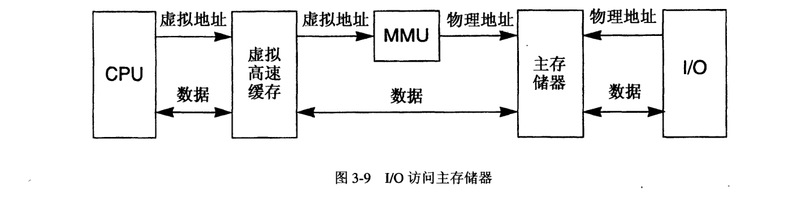

因此，没有缓冲的 I/O 所产生的问题类似于别名，因为 I/O 子系统通过 DMA 引用数据所采用的地址（物理地址而不是虚拟地址）和 CPU 通过高速缓存引用相同数据时所采用的地址不同。DMA 操作不检查高速缓存命中，因为 I/O 设备没有直接连接到高速缓存上，DMA 使用物理地址（不能用它来索引一个虚拟高速缓存）。甚至仅有的几个有虚拟 DMA 功能的系统，即使 I/O 子系统得到的虚拟地址而不是物理地址，往往也还是选择绕过高速缓存直接访问主存储器：否则，DMA 操作将会和 CPU 竞争对高速缓存的访问。

如果一个用户进程对一个设备执行没有缓冲的 write 调用，而且还使用了写回高速缓存机制，那么对应于 I/O 缓冲区的修改过的数据可能仍然在高速缓存中，这意味着在主存储器内的数据过时了。当主存储器发生 DMA 操作的时候，它会获得过时的数据。为了防止发生这样的情况，在 DMA 操作开始之前，内核必须用高速缓存内对应于 I/O 缓冲的被修改过的数据让主存储器有效。

类似地，在没有缓冲的 reaq调用之前，可以高速缓存对应于 1/0 缓冲的数据。如果在这样的情况下允许 OMA 操作，那么来自设备的新数据就会被放入主存储器，而高速缓存不受影响。没有什么能阻止用户进程引用过时的高速续存数据。这种状况会持续下去，直到在缺失处理期间从高速缓存中删除了过时的数据为止。为了防止使用过时的高速缓存数据，必须从高速缓存中冲洗掉（使之无效）将要通过 OMA 读入的 I/O 缓冲区所对应的任何数据。此刻没有时机用高速缓存内修改过的数据使主存储器有效，因为 DMA 会覆盖它。

有可能通过把未缓冲的 I/O 操作和现场切换期间完成的高速缓存冲洗操作结合起来，从而消除为未缓冲的 I/O 操作所显示进行的高速缓存冲洗操作。系统调用 read 和 write 阻塞进程直到 I/O 操作完成为止。这会导致一旦发起 I/O 操作，就会发生一次现场切换。注意，在现场切换时所需要的冲洗正确地处理了的未缓冲的 I/O：为写回高速缓存使主存储器有效，并且使高速缓存无效。所以，只要在 DMA 操作真正开始之前执行了现场切换冲洗操作，那么为 I/O 操作保持数据一致性就不需要额外的冲洗。对于大多数系统来说，这仅仅意味着内核在发起 I/O 操作之前执行现场切换冲洗操作，然后在真正发生现场切换的时候通过冲洗操作。这项技术不能用在支持异步 I/O（asynchronous I/O）的系统中。异步 I/O 允许 I/O 操作和进程的执行并行完成。因为在 DMA 执行的同时并不需要阻塞进程，所以就不能依赖现场切换时刻的冲洗操作，必须进行显式的冲洗操作。

以上讨论假定原始（未缓冲的）I/O 缓冲区的虚拟地址和一个高速缓存行的边界相对应，而且假定缓冲区时高速缓存行大小的倍数。这是简单的情况，因为在缓冲区所占据的高速缓存行内没有包含其他进程的数据。但是，不需要如此。其他数据有可能和缓冲区相邻或者和缓冲区共享高速缓存行。如图 3-10 所示，考虑下面这部分进程的虚拟地址空间（看作是一个线性的数组）。

这幅图给出了从虚拟地址。开始的 4 个变量： a、 buf、 b 和 c。变量 a、 b 和 c 每个都有 4 字节长，而 buf 则有 20 宇节。如果我们现在考察这些变量是怎样在每行 16 字节的高速缓存中出现的（如图 3-11），我们就会看到 buf 跨越了两行高速缓存，而 2、b 以及 c 共享了行的开头和结尾（假定虚拟地址。索引到高速缓存行 0）。

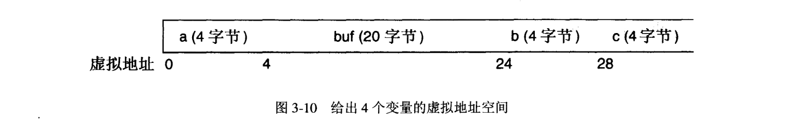

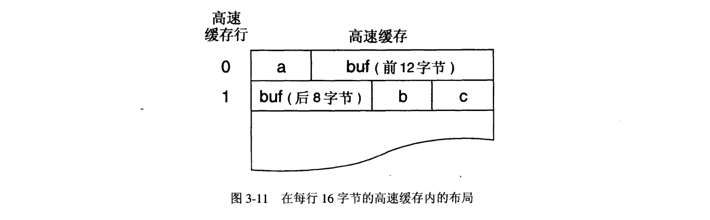

现在，如果进程执行一次原始 read 调用，读入 buf，那么 buf 的内容必须是无效的。内核不能简单地让 buf 占据的所有高速缓存行都无效，因为这样做也会使 a、b和 c 无效。如果采用写回高速缓存，那么这样做能致使这些变量被修改过的版本丢失，从而在将来的引用中使用主存储器内过时的版本。所以，当采用写回高速缓存机制的时候，内核必须首先以 I/O 缓冲区没有占满的开始和最后的高速缓存行的内容来使主存储器有效，从而确保邻接的变量不受影响。如果采用了前面讨论过的现场切换优化，那么这就不成问题了，虽然如此，理解它还是很重要的。

如果图 3-10 描绘的 I/O 缓冲区位于共享存储区内，而且采用写回高速缓存的话，就会出现更复杂的问题（如果使用异步 I/O，也会出现这个问题）。在这种情况下，共享相同存储区的另一个进程有可能在 DMA 访问 buf 的同时访问缓冲区附近的变量 (a 、b 和 c)。如果共享存储的一个进程开始了一次 read 调用，读入 buf，而共享存储的另一个进程开始运行的话，第二个进程就可以引用变量 a （举个例子），致使在 DMA 操作开始之前，包含 a 和 buf 前 12 字节的高速缓存行被带入高速缓存。这意味着 buf 前 12 个字节原来的内容被高速缓存下来了。如果现在开始 DMA 操作，那么它会用来自read 的新数据替换存储器内 buf 的副本。这对高速缓存的内容没有影响，它仍旧保留着缓冲区开头位置原来的数据。现在如果进程修改了 a 版本在高速缓存内的值，那么当整个高速缓存行被写回存储器的时候，主存储器内缓冲区前 12 个字节的新数据会被来自高速缓存的原来的数据覆盖掉，从而破坏存储器内 buf 的副本。观察到这种情形高度依赖于 DMA 操作的相对执行时刻，以及共享相同存储区域的其他进程的高速缓存存取／写回操作。如果在另一个进程访问共享存储之前就执行了 DMA，那么就决不会发生这个问题。

内核一定不能让这类破坏数据的问题出现。对于内核来说，解决这个问题最简单的方法**是检测到缓冲区的高速缓存行没有均匀对齐（不是在开头没有对齐，就是在末尾没有对齐，或者开头末尾都没有对齐）**。在这些情况下，内核可以在内核存储器中分配另一块缓冲区，在那里可以安全地执行 DMA 操作。当 DMA 操作完成的时候，内核就可以把数据复制回共享存储区，而不会干扰其他进程。虽然增加这么一次复制操作似乎减弱了不经缓冲 I/O 的目的，但是最好不要冒破坏数据的风险。

在内核进行其内部 1/0 操作的时候必须考虑到本节所描述的问题。这既包括文件 I/O，也包括在调页（paging）和交换 （swapping）期间所进行的 I/O。此外，设备驱动程序也必须意识到系统中存在高速缓存。典型情况下，I/O 设备的控制和状态寄存器会映射到寄存器中，这意味着它们出现在物理地址空间中，可以通过正常的 load 和 store 操作进行引用。这些 load 和 store 操作必须通过不缓存的引用方式来完成，从而不会从设备中而是从高速缓存中读取过时的状态信息。类似地，当一条命令被写入控制寄存器的时候，一定不要高速缓存它，并把它保存在写回高速缓存中，否则在该高速缓存行被替换之前，设备都不会收到这条命令。如果高速缓存没有不缓存的模式，那么设备驱动程序就不得不在每次从设备寄存器读取数据的操作之后显式地使高速缓存无效，而在保存操作之后使主存储器有效。

#### 3.3.8 用户-内核数据的歧义
防止内核和用户数据之间出现任何歧义是很重要的。在内核模式（kernel-mode）和用户模式（user-mode）执行期间都会使用高速缓存，所以必须保证用户不能访问任何被高速缓存的内核数据，也必须保证任何被高速缓存的用户数据不会被误认为内核数据。这对于确保系统的完整性和完全性来说是至关重要的。

虚拟高速缓存格外易受这类完整性问题的影响，因为大多数系统都不使用 MMU 来验证高速缓存中命中的访问。这意味着如果被高速缓存的内核数据在系统调用返回用户模式的时候遗留在高速缓存里，那么用户就有可能会通过引用相应的内核地址而读取到这些数据。为了防止用户进程访问到被高速缓存的内核数据，在系统调用或者中断之后，返回用户模式之前，必须冲洗高速缓存（如果采用写回高速缓存机制则使主存储器有效，然后使高速缓存内的数据无效）。如果高速缓存规模大的话，这就会成为一项代价很大的操作，因为 UNIX 程序倾向于频繁地执行系统调用。幸运的是，如果进程的地址空间被分成了图 1-2 所示的用户空间和内核空间，那么被高速缓存的用户数据就不会被误认为是一个系统调用入口的内核数据。这是因为内核会使用不同的虚拟地址来访问它自己的数据，所以即使用户数据碰巧被高速缓存在了索引行中，高速缓存也一定不会返回一次命中。

为了克服每次返回用户模式的时候不得不冲洗高速缓存所造成的性能上的损失，有些实现（比如 Apollo DN-4000）在标记中加入一个比特位来指出数据是在用户模式还是在内核模式读取的。为了使用户模式中能在该行出现一次命中，这个比特位必须指出该行包含用户数据。如果该比特位指出的是内核数据，那么就出现一次正常的缺失。这就防止了用户访问被
高速缓存的内核数据，它类似于前面讨论过的可写位的概念。在内核模式高速缓存访问期间，就忽略用户－内核位（ user-kernel bit），以便内核能够访问高速缓存中的用户数据（例如，这类数据可能是系统调用参数）。注意，当内核把数据复制到用户空间的时候（比如当返回系统调用的结果时），数据就会被标记为内核数据。这将防止用户进程访问它，于是从高速缓存中冲洗掉要复制的地址范围（使主存储器有效，而使高速缓存无效）。即使如此，这一技术通过消除上述的高速缓存冲洗操作而大大减少了冲洗高速缓存的量，但是除非增加额外的支持硬件，否则它仅在采用写直通高速缓存机制的情况下可行。

写回高速缓存策略不能和这一技术单独配合使用，因为在返回用户模式的时候，留在高速缓存内修改过后的内核数据不能在用户模式内的一次高速缓存确实所导致的行替换期间被写回到主存储器中。写回这样的高速缓存行要求用户进程能够转换内核虚拟地址，而且能向内核的物理页面写入数据。这类功能会破坏系统的安全性，因为用户进程能随心所欲地向任何内核地址写入数据。为了克服这个问题， Intel i860 在从高速缓存的写回操作期间不检查用户－内核访问权限。但是，它要确认从 CPU 对所有高速缓存访问的访问权限，而不是像 Apollo 系统那样不管。结果，用户进程不能访问被高速缓存的内核数据（也不能修改它），但是它们能在行替换期间写回内核数据。这种方法保持了系统的安全性，而且不需要显式的高速缓存冲洗操作来防止用户－内核的歧义。没有这些功能的写回高速缓存必须显式地冲洗数据。

### 3.4 小结
对于在高速缓存中命中的引用来说，虚拟高速缓存不需要 MMU 操作，从而提供了高速的高速缓存访问，但是它们要求操作系统频繁地进行冲洗操作。如果在不同的时刻使用相同的虚拟地址来引用不同的物理地址，那么就会在高速缓存中出现歧义现象。当使用多个虚拟地址引用相同的物理位置时就会出现别名现象。操作系统必须防止发生歧义和别名现象，以便让高速缓存的存在对用户程序是透明的，这对于程序的可移植性来说至关重要。为了做到这一点，必须在现场切换、调用 exec 和 exit、sbrk 缩小操作、原始 I/O 操作以及用户模式和内核模式之间过渡的时候冲洗高速缓存。频繁地冲洗大规模的虚拟高速缓存非常耗时，会导致很差的系统性能。除了冲洗操作的开销之外，还有另外一个缺点，即冲洗高速缓存会导致进程的局部引用特性被丢弃。每次在现场切换之后执行进程的时候，还有可能在每次系统调用之后，进程都会失去所有的存储引用，从而迫使为每次引用进行 MMU 转换和访问主存储器。如果采用了独立的指令和数据高速缓存，那么只要上述任何情形要求一次无效操作，就必须使指令和数据高速缓存都无效。

可以对虚拟高速缓存采取两种常用的修正措施，从而减少必须出现的冲洗次数。这两种方法将在后面两章中探讨。

## 4. 带有键的虚拟高速缓存
本章介绍一种对第 3 章里介绍的虚拟高速缓存实现的修正方式。每一个高速缓存行的标记字段（ tag field）都扩充包含一个进程键（process key），这个进程键唯一地确定一行高速缓存属于一个特殊的进程。采用进程键的目标是减少必须出现的冲洗操作的次数，并且在现场切换前后获得一个进程的局部引用特性。这种体系结构除了用于指令和数据高速缓存之外，还用在了 MMU 里。本章探讨这种类型的高速缓存的组织结构，及其对 UNIX 内核的影响。

### 4.1 带有键的虚拟高速缓存的操作
系统设计人员已经找到了一条降低冲洗虚拟高速缓存开销的途径，就是在高速缓存每行的标记中增加一个进程键。在理想情况下，给每个进程都分配一个唯一的键，于是将进程的虚拟地址和键组合起来就形成了一个唯一的标识符，标识一个特殊的进程。使用键的目的是防止在不同的进程中相同的虚拟地址之间出现歧义。这样一来，就不会和使用纯虚拟高速缓存一样要频繁地冲洗高速缓存了。这样的高速缓存的组织结构和上一章中虚拟高速缓存的组织结构类似，只是增加了一个特殊的硬件寄存器来保存当前执行的进程的键，还在每个标记中增加了几个比特位来保存和高速缓存行相关联的键（参见图 4-1 ）。

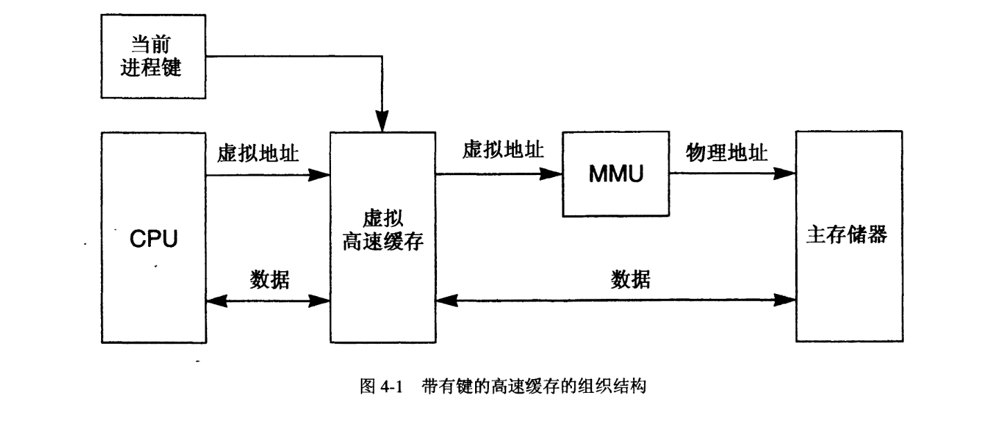

高速缓存仍然以虚拟地址来索引，但是对于出现的命中来说，不但虚拟地址必须吻合，而且当前进程键寄存器（current process key register）也必须和标记中保存的键相吻合才行。当前执行的进程的键由操作系统在现场切换时读入到这个寄存器中（这个寄存器既可以在 CPU 里，也可以在高速续存控制器上)。这意味着，只要每一个进程有唯一的键，那么使用
相同虚拟地址范围的两个不同的进程就不会再有相互引用高速缓存中对方数据的危险。

进程键本身是一个和每个进程相关联的简单整数值。有些实现代之以把键称为任务 id(task id）或者地址空间 id (address space id），但是含义是相同的。不应该把进程键和 UNIX 系统的进程 ID 号（process ID number）或者说 pid 混淆起来，后者是一种独立类型的进程标识符。

进程键本身的实际值并不重要。唯一的需要是它对于每个进程来说是唯一的。这样一来，不同进程所使用的虚拟地址就决不会出现歧义。遗憾的是，可以采用的唯一的键值往往很小，有些实现在标记中只有 3 个比特位来保存键值。如果系统中的进程数比键的数量多，那么多个进程就必须共享键。如果一个以上的进程使用了相同的键，那么高速缓存就不能区分那些进程在高速缓存中的数据，歧义再次出现了。在这些情况下，操作系统不得不冲洗高速缓存来防止出现歧义。这将在 4.2.1 小节中详细讨论。

过去采用这种高速缓存组织结构的系统有 Apollo DN4000 和 Sun 3/200，这两种系统都出现在 20 世纪 80 年代。 Apollo 系统使用指令和数据合起来有 8K 的直接映射高速缓存。高速缓存行的大小为 4 字节，它使用采用写分配机制的写直通策略。Sun 系统的高速缓存有 64K, 每行 16 字节。它是直接映射高速缓存，指令和数据部分相结合，并且使用写回（带有写分配机制）策略。两种系统的键都使用 3 个比特位，允许 8 个不同的地址空间同时被高速缓存。

### 4.2 管理带有键的虚拟高速缓存
因为高速缓存仍然采用虚拟地址进行索引，所以仍会出现别名。如果有一个以上的进程，使用同一个键，那么也能出现歧义。下面的几小节详细介绍内核必须冲洗高速缓存以防止出现歧义和别名的情形。和采用虚拟高速缓存时一样，只要数据高速缓存需要变得无效，那么使用独立的指令和数据高速缓存的系统也必须使指令高速缓存无效。

#### 4.2.1 现场切换
在正常情况下，如果使用写直通高速缓存机制，那么不需要在现场切换时冲洗高速缓存，因为使用键消除了不同进程中相同虚拟地址之间在高速缓存中的歧义。只要有足够多的键，每一个进程都能分配到一个唯一的键，那么内核只须把硬件中的当前进程键寄存器改为选择执行的新进程的键即可。注意，因为没有冲洗过高速缓存，所以原来进程的局部引用特性就留在了高速缓存冲。因此，在下一次选择执行该进程的时候，它的数据有可能还在高速缓存中。这是一种重要的性能收益，因为一个进程可能不会发生和在使用纯虚拟高速缓存的系统上执行时一样多的缺失。如果进程倾向于使用相同的虚拟地址范围，那么就会在一定程度上失去这种好处，因为高速缓存的索引是从虚拟地址中产生的。使用共同虚拟地址空间的进程会所引导相同的高速缓存行。键能够防止出现歧义，但是前面的进程所读入的高速缓存行仍然会被来自当前执行进程的数据所替换，因而失去了前面进程的局部引用特性。对于小规模的直接映射高速缓存来说尤其如此（试图跨越现场切换而保留局部引用特性的技术将在 7.2.2 小节中介绍）。

当系统中没有足够多的键用于所有的进程时，采用进程键的方法就遇到了困难。这意味着不得不通过把一个键从一个进程重新分配给另一个进程的方法，在多个进程中间共享进程键。在重新分配键的时候，高速缓存中以相关键所标记的所有项都必须被冲洗掉（在采用写回高速缓存的情况下，使主存储器有效，而使高速缓存行无效）。如果没有这样做，那么在以前使用该键的进程的虚拟地址和新进程的虚拟地址之间就会出现歧义。

对于操作系统来说，重要的是在重新分配键的时候做出良好的选择，避免分配的结果落入每次现场切换都要重新分配键的境地。这样的情形会削弱采用进程键的好处，因为冲洗高速缓存的操作会和纯虚拟高速缓存一样频繁。

这种高速缓存组织结构的大多数实现都优先采用写直通策略，就像 Apollo 系统所采用的那样。如果使用了写回高速缓存机制，那么在现场切换到下一个进程的时候，原来进程被修改过的数据还遗留在高速缓存中。如果那些被修改过的高速缓存行中有一行在缺失处理期间被挑选出来进行替换，那么系统就不知道把修改过的行保存到什么地方，因为老进程的地址空间映射关系己经被新进程的替换掉了。高速缓存只包含有老进程数据的虚拟地址，但是在现场切换期间， MMU 己经载入了新进程的地址空间映射关系，所以它不能转换老进程的地址。使用写直通高速缓存机制可以消除这个问题，因为不会在高速缓存中留下修改过的高速缓存行。

为了克服这个问题，Sun 使用的 MMU 能够同时保存和每个进程相关联的映射关系。于是，当有一行需要写回时，高速缓存把虚拟地址和键都传送给 MMU, MMU使用键来判断如何转换地址。这是一种比较复杂的实现，因为它要求 MMU 一次管理多个地址空间的映射关系，但是它也有优点，即可以使用写回高速缓存机制，从而有助于减少访问主存储器的次数。

如果没有采用这样的硬件，那么其他唯一的选择就是在现场切换的时候用高速缓存中所有修改过的数据使主存储器有效。这就确保了在另一个进程正在运行的时候，不会有前一个进程的数据要写回。

### 4.3 在 MMU 中使用虚拟高速缓存
高速缓存不仅限于保持程序指令和数据。在几乎所有的 MMU 中都集成了一种特殊用途的高速缓存，它称为高速后援缓冲器（Translation Lookaside Buffer, TLB) 或者地址转换高速缓存（Address Translation Cache， ATC）。它通过高速缓存最近使用过的页面映射关系（page mapping), 也就是对应于进程工作集的那些页面，来加速因局部引用特性而带来的“虚拟到物理”的地址转换过程。TLB 本身仅仅是一个虚拟高速缓存而已，**通过使用虚拟高速缓存可以找到转换所用的入口地址，它也同样以这个地址来进行索引和标记。TLB 所高速缓存的“数据”是物理页号（physical page number) 和页访问权限 (page access permission)。**TLB 内发生一次命中的时候，MMU 能够从 TLB 的数据立即计算出物理地址和有效的权限。在出现一次缺失的时候，有些实现会读取主存储器内的页表，以获得相关的映射关系，然后将新的映射关系自动高速缓存在 TLB 中供以后使用。传统的处理器体系结构就采用了这种方法。有些 RISC 实现在 TLB 发生缺失的时候产生了一个操作系统的陷阱。随后，操作系统必须判断正确的映射关系，检查页面的权限，并且将适当的“虚拟到物理”转换信息读入 TLB。

如果只采用虚拟地址来标记 TLB 的数据，那么在每次现场切换的时候都必须把它冲洗掉。这样做可以防止在新老进程的映射关系之间发生歧义。68040、88000 和 80X86 中的 TLB 是以这样的方式运行的。但是，MIPS 系列和 TI SPARC 系列处理器的 TLB 使用了一块带有键的虚拟高速缓存。就像本章所讨论的数据和指令高速缓存那样，给每个进程分配一个唯一的 TLB 键，也能让 TLB 同时高速缓存来自多个进程的数据项。这样做可以不必在现场切换时冲洗 TLB。例如，MIPSR4000 就带有一个有 48 项的全相联 TLB。其中的每一项包括一个 8 位的地址空间标识符（键）。带有键的 TLB 只需要在地址转换时进行冲洗就可以了，比如在系统调用 sbrk 缩小了 bss 段的时候，或者在另一个进程要重用键的时候。

进程键同样适用于 TLB。例如，TLB 所高速缓存的项和数据高速缓存不同，它们是只读的，不能共享。这就避免了本章前面看到的与共享存储和写时复制页面相关的不一致问题。带有键的 TLB 跨越现场切换，保留了进程的转换关系，这就使得当从操作系统中几乎得不到额外的维护（冲洗操作）时有可能降低 TLB 的缺失率（不命中的比率）。

### 4.4 小结
带有键的虚拟高速缓存尝试减少纯虚拟高速缓存上的冲洗开销，与此同时，它仍然保留了无需 MMU 操作就能访问高速缓存的好处。因为在正常情况下，不会在现场切换的时候冲洗高速缓存。所以进程的局部引用特性就有机会一直在高速缓存中保存到下一次选择运行该进程的时候。采用纯虚拟高速缓存是不可能有这样的性能优势的。

虽然需要的冲洗操作少了，特别是在现场切换时的冲洗操作少了，但是它仍然还有明显的缺点，即不能共享高速缓存内的共享数据（无论是 fork 期间的写时复制共享，还是共享存储，亦或是映射文件），因为每一个进程使用的进程键都不同。通过限制共享存储的附接地址，只要每个进程都索引到了相同的高速缓存行，而且又采用了带有写分配机制的直接映射高速缓存，那么就不需要显式地冲洗高速缓存。但是要注意，其效果就彷佛是执行了一次显式的冲洗操作一样：发生一次缺失，然后替换高速缓存行。如果一组有两行以上的高速缓存，那么就需要显式地使主存储器有效，从而防止使用过时的数据。带有键的虚拟高速缓存没有消除在 exec、exit、brk、sbrk 和 I/O 期间所需要的冲洗操作。和使用纯虚拟高速缓存时一样，这些活动都需要冲洗高速缓存。

如果没有足够多的键提供给系统中所有的进程，那么会给性能造成额外的损失，因为必须在重新分配键的时候冲洗高速缓存。在使用独立的指令和数据高速缓存的系统上，只要是为了维护一致性而使高速缓存无效，就必须同时让指令和数据部分都无效。通过代之以物理地址标记高速缓存行，就可以减少需要进行冲洗的次数，这将在下一章里进行讨论。


## 5. 带有物理地址标记的虚拟高速缓存
本章介绍对虚拟高速缓存的最后一种增强方式，它不但可以消除歧义，而且还有可能共享高速缓存中的数据。通过从标记中去除虚拟地址这一造成问题的根源，而代之以采用数据的物理地址，就能做到这一点。不过，采用了这种方法以后，高速缓存查找操作就和 MMU 的地址转换有关了，因为需要用物理地址来判断是否命中。下面几节将阐述这种高速缓存组织结构的影响。

### 5.1 带有物理标记的虚拟高速缓存的组成
带有物理地址标记的虚拟高速缓存建立索引的方式和纯虚拟高速缓存相同。但是，高速缓存行是以数据的物理地址来标记的。标记中没有用虚拟地址，只在建立索引期间才用虚拟地址。在采用这种高速缓存组织结构的情况下，每次访问的时候都需要转换虚拟地址，因为需要用物理地址来判断寻址的数据是否在高速缓存中。图 5-1 给出了这样的一个系统的逻辑组织结构。

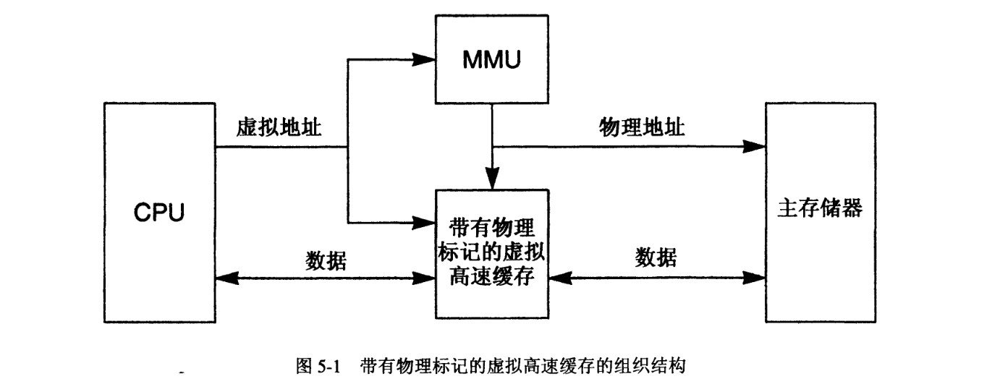

在这种类型的系统中，从 CPU 来的虚拟地址被同时发送到高速缓存和 MMU。这样一来，地址转换和存取高速缓存在时间上交叠在一起。在 MMU 转换地址的同时，高速缓存也通过散列算法从虚拟地址得到索引来开始它的查找操作。接着高速缓存能够读取被索引到的高速缓存行的内容，或者为比较标记做好准备。MMU 一旦转换好了地址，就把物理地址发送给高速缓存。随后，高速缓存把这个地址和选出行中标记里保存的地址进行比较，以判断是否发生了命中或者缺失。

这种组织结构的好处是，在不同进程中未经高速缓存的数据之间一定不会出现歧义问题，因为每个进程的虚拟地址空间都转换成了一个明确有别于其他的物理地址，可以唯一地确定数据。在这个意义上说，物理地址标记起到了上一章中进程键的作用。不再会发生因为键不匹配，导致若干进程共享的数据无法命中，从而迫使从高速缓存中冲洗掉进程数据行的情况。在转换其虚拟地址的时候，共享数据的进程将产生相同的物理地址，所以当它们索引共享数据的时候会发生命中。这将在以后详细说明。

这种高速缓存设计的缺点是高速缓存查找操作的速度受限于 MMU 所需的转换时间。正如将要看到的那样，这种设计吸引人的地方是它降低了内核显式冲洗高速缓存的要求，所以是在硬件开销和软件开销之间相对比的一种折衷。因为每次高速缓存操作都要用到物理地址，所以应该说明它和前两章里虚拟标记的高速缓存之间有区别的两个地方。首先，考虑一下采用写回高速缓存的情况。

当替换被修改过的高速缓存时，不再需要转换地址了，因为在高速缓存的标记中保留着物理地址。高速缓存直接把这个物理地址和高速缓存行的内容发送给主存储器，完全绕过了MMU。和以前一样，假定如果进程有权修改高速缓存中的数据，那么它必须有权把数据写回到主存储器，所以不需要 MMU 再次检查页面访问权限。这就很方便地克服了在带有键的虚拟高速缓存中采用写回高速缓存机制时的问题。

还要说明的是，在转换地址期间，MMU 也有一次检查页面访问权限的机会。因此，带有物理标记的虚拟高速缓存不需要像其他类型的高速缓存中那样，保存比如说冗余的写权限位这样的内容。

和所有的高速缓存一样，设计人员也利用了这样的事实：即没有必要在标记中保存完整的地址，而只是保存那些无法通过数据在高速缓存中的位置推算出来的比特位。虚拟地址中低端的一些比特位，包含有在虚拟页面（virtual page）中的页面偏移量（page offset），它们和物理地址中的是一样的。这些低端的比特位不必保存在高速缓存的标记中。

例如，考虑有 512 行、每行 16 字节的一块直接映射高速缓存。假定页面的大小为 2 KB，地址是 32 位的。这意味着页面偏移量（page offset）有 11 位，而虚拟页号（virtual page number，VPN）有 21 位。在高速缓存查找操作期间，这些地址位的解析过程如下图所示。

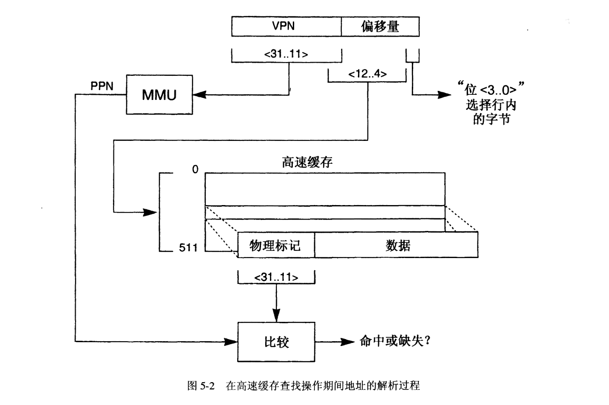

在执行查找操作之后，“位<3..0>”将选择出高速缓存行内的字节，后 9 位，即“位<12..4>"被发送给高速缓存，从来选择 512 行高速缓存中要读取的一行。与此同时，虚拟页号”位<31..11>"并行地发送给 MMU，以转换为物理页号（physical page number, PPN)。当完成转换时，MMU 输出物理地址的 “位<31.11>"。如果需要访问主存储器，填补高速缓存的缺失，那么这些位就和页面偏移量”位<10..0>“拼起来形成完整的物理地址。到 MMU 转换完地址的时候，高速缓存已经读出了被索引的行，并且把标记的内容发送给比较器，以查看是否发生了命中。由 MMU 转换出的物理页号和保存在标记中的 PPN 要进行一次比较。如果它们相符就发送一次命中。

注意，必须在标记中保存完整的 PPN。这和前面章节介绍的虚拟标记的高速缓存不一样，虚拟标记的高速缓存只需在标记中保存虚拟地址的“位＜31..13＞”，因为“位＜12.. 0＞”用于索引高速缓存行和选择行内的字节。这些高速缓存都是从同一个实体一一虚拟地址一一获得标记和索引的。保存标记中 VPN 的低两位 (“位＜12.. 11＞”）是一种冗余，因为这些值可以从行号推算出来。但是，在物理标记的高速缓存中，在 VPN 和 PPN 之间没有预先确定的对应关系。 PPN 的“位<12.. 11＞”与 VPN 的“位<12..11>”没有关系。因此必须用完整的 PPN来标记高速缓存行。

如果写回操作需要的话，随后会重组一行内数据的物理地址，方式如下。物理地址的“位<31..11＞”保存在标记中。物理地址的“位＜10..4＞”可以通过取得行索引的低 7 位，从行在高速缓存内的位置推算出来。最后，可以设置“位＜3.. 0＞”选择所需的一个特定字节或者字。 MIPS R4000 的片上高速缓存就是这种组织结构的一个例子。它有独立的指令和数据高速
缓存，每一个都有 8KB 大，并且是直接映射高速缓存。它的数据高速缓存采用了有写分配机制的写回策略。

对于有些设计来说，使用带有物理标记的虚拟高速缓存和使用物理高速缓存之间有微妙的差别。正如我们将要在下一章看到的那样，物理高速缓存只从物理地址产生索引，从而暗示在高速缓存查找操作能够继续进行之前必须进行 MMU 转换。但是，我们看到的结果却是，如果仅凭页面偏移量内的比特位就能获得高速缓存索引的话，那么就可以立即开始查找操作，因为对于虚拟和物理地址来说，偏移量都是一样的。除了纯物理高速缓存提供的软件性能收益之外，这样的高速缓存也能获得采用物理标记的虚拟高速缓存所获得的性能收益，后者的 MMU 转换和高速缓存查找操作在时间上是交叠进行的。这些高速缓存都应该被认为是纯物理高速缓存，我们将在下一章介绍它们。 MMU 转换和高速缓存查找操作并行执行可以看作是对软件透明的一种硬件优化措施。

### 5.2 管理带有物理标记的虚拟高速缓存
使用物理标记大大减少了需要内核显式冲洗高速缓存的情况。我们很快将看到，此外还有能共享高速缓存数据的好处。和前面一样，在下面描述的情况下采用独立的指令和数据高速缓存要求使它们分别无效。

#### 5.2.1 现场切换
没有共享存储的无关进程给它们的数据使用不同的物理页面。因此，在正常情况下，没有必要在现场切换期间冲洗高速缓存，因为物理标记能防止不同进程的数据之间发送歧义。这是这类高速缓存体系结构的主要优点之一。第二个优点是没有像在上一章里讨论过的高速缓存体系结构那样需要管理的进程键。

注意，当使用写回高速缓存机制的时候，当前进程运行的同时，在高速缓存中会出现来自其他进程的修改数据。如果当前进程在缺失处理期间使得另一个进程修改过的高速缓存行被替换掉了，那么这一行就必须被写回到那个进程的地址空间中。因为高速缓存不需要使用 MMU 就能产生物理地址，所以这不会造成问题。它可以把数据直接写入到和修改过它的进程的地址空间相对应的物理页面中。这并不代表破坏了安全性，因为当前进程不能改变或者访问数据。它只能在发生命中的时候才可以这样做，但因为标记不会匹配，所以永远不会发生这样的情况（假定没有使用共享存储）。

当使用共享存储的时候，必须在现场切换时冲洗高速缓存。这将在 5.2.6 小节介绍。

#### 5.2.2 fork
不需要为了建立写时复制共享机制而在调用 fork 的时候忡洗高速缓存。和采用带有键的虚拟高速缓存情况不同，即使使用了写回高速缓存机制（就像前面讲述过的一样），也不需要这样做。此外，还有一个优点，那就是可以共享高速缓存本身里的数据，这在其他虚拟高速缓存体系结构中都是不可能的。

虽然父进程和子进程通过写时复制技术来共享页面，但是两者都使用者相同的虚拟地址。这些虚拟地址都会被映射到相同的物理页面上。因为虚拟地址相同，所以当使用一个给定的虚拟地址时，两个进程都会索引相同的高速缓存行或者组。只要数据驻留在高速缓存中，就会继续在两个进程之间共享。这和 4.2.2 小节中带有键的虚拟高速缓存相比，效果相差很大，在后者的情况下，因为数据的进程键不同，所以每个进程访问数据都会发生缺失，被迫从主存储器重新读取数据。结果，同使用键的虚拟高速缓存相比，在使用物理标记的虚拟高速缓存时，预计发生缺失的情形要少。

无需进行冲洗操作，也可以使用写回高速缓存机制和双路或者更多路组相联高速缓存。如果来自父进程的修改数据在调用 fork 之前就出现在了高速缓存中，那么当该数据以写时复制机制进行共享的时候，子进程对该数据的任何引用都会在高速缓存中命中，从而返回正确的数据。这同样也是因为两者都使用了相同的虚拟和物理地址的缘故。此外，将修改过的数据写回到以写时复制机制共享的页面内也不成问题，就像采用了前面几种虚拟高速绥存结构的情况）样。在那些高速缓存结构中，因为页面是只读共享的，所以写回操作会产生一个保护性的陷阱。这将错误地导致发生写时复制处理。在采用物理标记的虚拟高速缓存的情况下，执行写回操作用不着 MMU，因为高速缓存能够产生出物理地址。这就允许它将修改过的数据透明地写回共享页面。在这种情况下，随后出现缺失时，父进程和子进程都能读取到正确的数据。

在父进程或者子进程试图修改某页面而要复制该页面的一个副本时要格外小心。如前所述，在写时复制页面被共享的同时，来自该页面的修改数据可以出现在写回高速缓存中。必须保证在写时复制结束的时候，两个进程都获得数据修改过的版本，而不是来自主存储器的过时数据。应该使用和 3.3.2 小节中所介绍的一样的技术，即为复制操作的目的地建立一个临时的映射。如果复制操作的目的地的内核虚拟地址在引用时会被高速缓存，那么必须使存储器有效，使高速缓存无效，从而消除别名问题。使用不被高速缓存的引用可以避免这次冲洗操作。一旦进行复制，那么就不需要冲洗操作了，因为此刻进程使用了不同的物理地址。物理标记意味着即便进程使用了相同的虚拟地址，也不会出现别名，更不需要冲洗操作。

#### 5.2.3 exec
在 exec 期间释放老的地址空间时，过时的数据项会遗留在高速缓存中。操作系统可以在系统调用时使之无效，也可以让它们留在高速缓存中，直到它们所关联的物理地址被释放为止。因为任何进程都没有使用给它们作标记的物理地址，所以一旦 exec 释放了页面，那么就没有另一个进程会命中过时数据的危险。但必须保证在把页面分配给新的进程之前要删除过时数据。这项技术将在 7.4 节中详细介绍。

#### 5.2.4 exit
和 exec 的情况一样，在调用 exit 期间被释放的地址雪间既可以在执行系统调用时被冲洗掉，也可以推迟到重用物理页面的时候，这都不会有在高速缓存中的过时数据上出现歧义的危险。这类似于进程键的效果，即直到键被重用之前都不会出现歧义。

#### 5.2.5 brk 和 sbrk
既然缩小 bss 段的系统调用 brk和 sbrk也会释放部分地址空间，所以它们所需的高速缓存管理与 exec 和 exit 的类似。高速缓存不是在执行系统调用时被冲洗掉，就是推迟到重用物理页面的时候。注意，在采用这种高速缓存组织结构的情况下，每次引用都会用到 MMU，所以能防止进程访问任何已释放区域内的数据。

在调用 brk 或者 sbrk 增大 bss 段的时候不需要冲洗操作（即使如果在以前释放期间推迟了冲洗操作，那么在分配页面期间可能需要进行一些冲洗操作。）

### 5.3 小结
从操作系统所需的管理量方面来看，带有物理标记的虚拟高速缓存对比前两种类型的高速缓存有了巨大的改进。物理页面消除了几乎所有情况下的歧义问题，这意味着需要进行的冲洗操作少得多了。使用物理标记不但保留了带有键的虚拟高速缓存所有的好处，而且还没有为管理键而增加的开销。此外，这是唯一一种能够高速缓存共享存储，而且在数据驻留高速缓存时可以在进程中间共享的虚拟高速缓存结构。对于采用了大规模的高速缓存，而且共享存储或者映射文件使用率很高的系统来说，这会取得显著的性能收益。

这种结构的主要缺点是，为了判断是否命中，需要在每次访问高速缓存期间进行虚拟到物理的地址转换。如果系统中使用的 MMU速度慢，那么这就会削弱或者抵消使用物理标记所带来的好处。尽管能够同时高速缓存多个进程的现场，从而有可能在现场切换完继续执行某个进程的时候该进程的数据已经驻留在高速缓存中了，但是除非高速缓存是全相联的，或者每组有大量的高速缓存行，否则进程倾向于使用相同虚拟地址的实际情况会降低这种可能性。这个问题所有类型的虚拟高速缓存都有，而且要归因于如何索引高速缓存（与如何标记高速缓存行相对）。最后有一个缺点，但不大，即：不冲洗高速缓存，或者不采用无高速缓存的操作，就不能在任意边界上共享存储器。


## 6 物理高速缓存
我们研究的最后一种高速缓存体系结构是物理高速缓存。这种类型的高速缓存抛弃了虚拟地址的一切用法，而是使用物理地址来索引和标记高速缓存行。其优点在于彻底消除了别名和歧义问题，但代价是每次访问都需要进行一次地址转换。这种组织结构也能使用一种新技术一一总线监视（ bus watching）一一来保持 I/O 操作的高速缓存一致性。最后以讨论多级高速缓存来结束本章的内容。

### 6.1 物理高速缓存的组成
物理高速缓存采用数据的物理地址来进行索引和标记，物理高速缓存从不使用虚拟地址。当然，这种类型的组织结构要求每次高速缓存查找操作的时候都要由 MMU 转换虚拟地址。物理高速缓存的组织如下图所示。

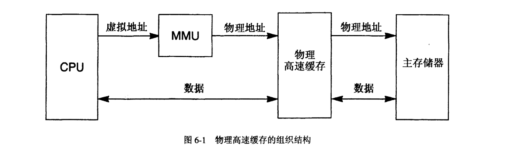

这类设计的诱人之处在于既不会出现歧义也不会出现别名。没有共享数据的无关进程各自都分配得到不同的存储物理页面。因此，来自不同进程的物理标记决不会吻合。共享数据的进程使用相同的物理页面，使得它们索引到相同的高速缓存行或者组，并且会匹配标记从而发生一次命中。因为访问高速缓存时不牵扯到虚拟地址，所以不可能有别名问题。从而不需要冲洗高速缓存。果采用了总线监视技术，那么始终都不必冲洗高速缓存。在这种情况下，高速缓存对操作系统和用户程序来说是完全透明的。这种情况使得物理高速缓存适用于最初没有设计高速缓存的系统。如，IBM PC 及其兼容机就是这样，它们采用的 Intel 80X86 系列中的早期版本（80386 以及更老的芯片）没有片上高速缓存。为了保持同给以前的微处理器版本编写的操作系统和应用软件的兼容性， 80486 和 Pentium 都有了片上的物理高速缓存。 80486 有一个 8K 的写直通 4 路组相联高速缓存。 Pentium 包含独立的指令和数据高速缓存，每个都是 8K 的双路组相联高速缓存。Pentium 的数据高速缓存使用了写回策略。

和采用带有物理标记的虚拟高速缓存的情况一样，物理高速缓存中的数据在其驻留于高速缓存内的时候是可以共享的。除此之外，使用物理地址来索引高速缓存还能让来自不同进程（没有共享存储）内相同虚拟地址的数据索引到不同的高速缓存行，因为每个数据都使用了不同的物理地址。这就解决了所有类型的虚拟高速缓存可能有的性能问题之一，即无关的进程竞争相同的高速缓存行，因为这些进程频繁地使用相同的虚拟地址范围。这种竞争降低了被高速缓存的数据在进程下次运行的时候还存在于高速缓存中的可能性。物理高速缓存有可能将这样的数据均匀地分布在高速缓存中，从而获得更好的性能。

一般而言，片外（外部）高速缓存是物理高速缓存。大多数没有片上高速缓存的处理器都是这种情况，比如 Intel 80386 和 MIPS R2000/R300，这两种芯片的地址行只包含物理地址。片外的硬件不能用虚拟地址，这就使物理高速缓存成为一种自然而然符合要求的选择。尽管现在大多数处理器都有片上高速缓存，但通常是在访问外部高速缓存之前检查它们。到那个时候，虚拟地址往往己经被转换好了，进而能使用外部的物理高速缓存，还不会多花时间。 6.3 节将详细介绍多级高速缓存的使用。

根据高速缓存的大小和组成不同，在地址转换完成之前查找操作可能就开始了。正如在 5.1 节中所提到的那样，如果散列算法生成索引所使用的全部比特位都来自页面偏移量，那么通过从虚拟地址获得这些比特位就可以立即开始查找操作。这就提供了一种有好处的硬件优化措施，能够在 MMU 转换地址的同时索引并读取相关的高速缓存行或者组。这还带来了有物理标记的虚拟高速缓存所拥有的性能优点，以及物理高速缓存（如果有的话，规模小，而且供冲洗需要）的软件好处。不过，所有情况下都必须在比较标记之前完成转换。

80486 和 Pentium 的高速缓存就使用了这种技术。例如，Pentium 的高速缓存行有 32 字节，这意味着共有 128 组（8K ÷ 32 字节／行 ÷ 2 行／组）。因此，“位＜4..0>”会选择高速缓存行内的字节，而“位＜11..5＞”则选择组。因为使用的是 4K 大小的页面，所以页面偏移包含在“位＜11..0＞”中，从而可以让高速缓存查找操作在虚拟地址转换之前开始。

如果每一组有足够数量的行，那么这项技术就和比页面大的高速缓存一起使用。80486 和 Pentium 的高速缓存是页面大小的两倍，而德州仪器公司的 SuperSPARC 芯片的高速缓存更大。“位＜5..0>”选择行内的字节，而“位＜11.6＞”选择组。因为使用的是 4K 大小的页面，所以所有的索引位都来自页面偏移。类似地，它的指令高速缓存有 16K 大，且为 4 路组相联高速缓存，每行 32 字节。“位＜4..0>”选择行内的字节，而“位＜11..5＞”选择组，所有的比特位还是都来自于页面偏移。

对于较大的物理高速缓存，需要来自物理页号的比特位来形成索引，那么在开始高速缓存查找操作之前必须完成地址转换。 MIPS R4000 就是这种情况，它可以有多达 4M 的外部高速缓存。这个高速缓存是直接映射高速缓存，每行可多至 128 字节。在这种情况下，“位＜6..0>” 选择行内字节，而“位＜21..7＞”选择行。因此，在组成高速缓存索引之前，需要来自物理页号的“位＜21..12＞”。因为在片上高速缓存的查找操作期间，虚拟地址己经转换好了，所以需要物理页号来索引外部高速缓存，而不会造成性能损失。

### 6.2 管理物理高速缓存
物理高速缓存不需要或者很少需要冲洗高速缓存，其中的原因将在下面各小节中阐述。

#### 6.2.1 现场切换
因为物理标记能防止歧义问题，而以物理地址索引能防止别名问题，所以在现场切换时不需要冲洗高速缓存。对于有大规模高速缓存的系统来说，这格外有益，因为它能大大减少现场切换的时间。采用大规模高速缓存的第二个好处是，一个进程的数据在别的进程正在运行的同时更有可能会保留在高速缓存中，因为物理索引机制能将来自不同进程的数据在整个高速缓存上均匀地分布。于是，一个进程可以期望下一次执行的时候有更好的命中率。但是，对于小规模的物理高速缓存（小于或者等于典型进程局部引用的大小）来说，情况并非如此，因为每个进程都会用它自己的局部引用替换前一个进程的。

#### 6.2.2 fork 
不需要在调用 fork 时为了建立写时复制共享机制而冲洗高速缓存，因为父进程和子进程都使用相同的物理地址来引用共享数据。这意味着它们在寻址相同的数据时都会索引和命中相同的高速缓存行。物理高速缓存也简化了写时复制共享结束时（或者实现不带写时复制机制的 fork 调用时）复制一页的任务。采用带有键或者物理标记的虚拟高速缓存时，为了避免别名，必须冲洗临时映射的地址范围。物理高速缓存不必这样做，因为在复制入新页面的操作完成时，已经正确地标记了数据，而且数据处于正确的行或者组里。临时映射所使用的虚拟地址和高速缓存不相干。

#### 6.2.3 exec、exit、brk 和 sbrk
在使用物理高速缓存的时候，这些系统调用执行期间释放内存都不需要任何冲洗高速缓存的操作。在释放内存的时候，没有哪个进程在用相应的物理地址范围，因此，没有哪个进程会命中可能在高速缓存中的任何过时数据。当这块内存最终又重新分配给某个进程的时候，必须确保它无法访问到高速缓存中任何剩下的过时数据。因为 UNIX 内核一定是在 I/O 读操作期间（比如满足一次缺页错的需要）或者通过填零来填页，所以肯定能做到这一点。例如，如果同为了增加栈而分配新内存时一样用零来填页，那么内核就会通过高速缓存来清理存储器，从而以零替换掉任何残余的过时数据。I/O 操作的一致性将在 6.2.6 小节中进行讨论。在其中任何一种情况下，当初始化新分配的页面时，都会清除过时数据，所以不需要显式地高速缓存冲洗操作。

#### 6.2.4 共享存储和映射文件
当使用物理高速缓存的时候，保持共享存储和映射文件的一致性都不需要冲洗高速缓存。和采用带有物理标记的虚拟高速缓存的情况一样，可以在数据驻留在高速缓存中的时候共享它。和物理标记的虚拟高速缓存不同，因为不会出现别名，所以在共享进程访问共享存储所用的虚拟地址上没有限制。

#### 6.2.5 用户-内核数据的歧义
在高速缓存中使用物理地址的时候，不可能在用户和内核之间出现别名和歧义。因此，不需要进行高速缓存冲洗操作来保持一致性。只要内核页面没有被映射到用户进程的虚拟地址空间中，那么就没有哪个用户进程能够访问内核数据，**因为每次访问所完成的 MMU 操作都会检查页面权限。**

#### 6.2.6 输入输出和总线监视
因为 I/O 的 DMA 操作是和高速缓存无关的，所以前面的虚拟高速缓存结构都需要冲洗高速缓存来保持 I/O 操作的一致性。但是，物理高速缓存具有实现一种称为总线监视的技术的能力，以保持 I/O 操作的高速缓存一致性，而无需由操作系统冲洗高速缓存。除了让高速缓存执行来自 CPU 的查找操作之外，还让它监视（或者说观察）系统总线上来自 I/O 设备的 DMA 操作，就能达到上述目的。以前由操作系统执行的冲洗高速缓存的操作现在则由硬件自动处理。下图展示了这种系统组成的一个高级视图。


系统总线担当了 CPU/MMU/高速缓存、主存储器和 I/O 设备之间一个共同的互连通道。它是一种基于广播的介质，这意味着任何单元都可以接收到总线上由任何其他连接到总线的单元所发送的信息。CPU/MMU/高速缓存通过把数据的物理地址发到总线上来读取存储器，如下图所示。存储器通过返回总线上被请求的数据来响应地址，高速缓存在总线上接收的数据。

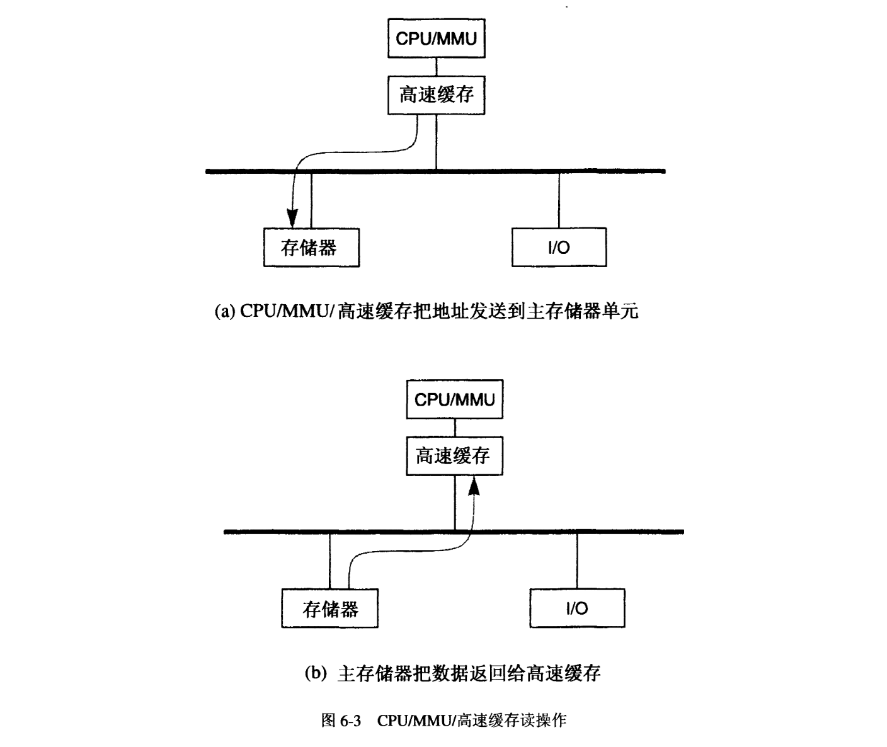

1/0 设备以相同的方式执行 DMA 操作。为了把数据写入设备（比如磁盘） I/O 控制器将数据的物理地址放到总线上（参见图 6-4(a））。接着，主存储器单元通过把相应的数据发送到总线上来进行响应，设备随后在总线上收到数据（参见图 6-4(b））。

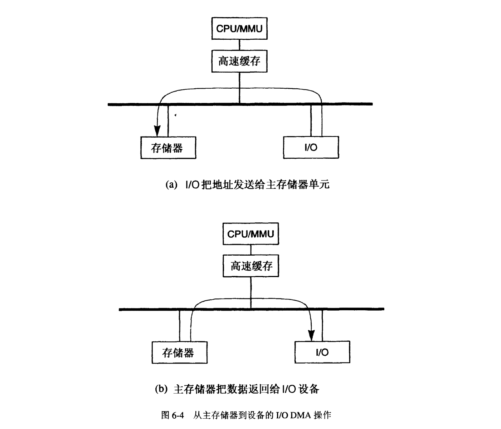

当数据被 CPU 或者 I/O 写入到存储器的时候，物理目的地址和数据一起被发送到总线上。存储器单元捕获地址和数据，将数据写入被寻址的存储器位置。

数据是在一次或者多次总线交易（bus transaction）中发送到总线上的。每次总线交易只发送一定数量的数据，其范围一般从一次几个字到一次几十个字。因此，如果需要发送大量的数据，比如从磁盘读取一页的时候，传输会被分成多次总线交易，每次都包含有目的地址和数据。

因为高速缓存能够看到所有的总线交易，所以总线监视技术实现起来直截了当。当高速缓存没有使用总线来读或者写存储器本身的时候，它会监视所有 I/O 设备执行的总线活动，这常被称为监听（snooping）。对于每个感兴趣（后面介绍）的总线交易，高速缓存检查其内容来查看交易中的物理地址是否驻留在高速缓存中（参见图 6-5）。监听的高速缓存查找操作和 CPU 访问查找操作是一样的：散列计算地址，索引到相应的行或者组，检查标记看是否发生了命中或者缺失。如果发送一次缺失，则高速缓存什么也不需要做。在这种情况下，总线交易的 DMA 操作就好像在没有高速缓存的系统中一样完成。如果地址在高速缓存中命中，那么硬件要采取的行动取决于总线操作对主存储器是读还是写操作，以及高速缓存是写直通还是写回高速缓存。

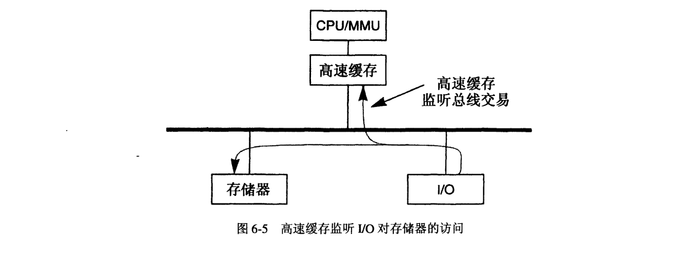

首先考虑采用写直通高速缓存机制的情况，因为它比较简单。此时，**高速缓存能够忽略从 I/O 设备读主存储器的 DMA 操作。**因为是写直通高速缓存，所以始终会更新存储器，所以 I/O 设备一定可以从主存储器读到数据的正确版本。但是，**高速缓存必须监昕所有从 I/O 设备写主存储器的操作。如果发生一次缺失，那么高速缓存什么也不做**，从设备来的数据就照常被写入存储器。**如果发生一次命中，那么要使高速缓存中的这行无效，**并且不会影响 DMA 写主存储器操作的完成。**这就保证了高速缓存决不会保留相对于主存储器来说过时的数据**。当 CPU 以后引用相应地址的时候，它将引发高速缓存缺失，并且从主存储器读取数据。当 DMA 写存储器操作期间发生命中的时候，有些实现选择用从设备来的新数据替换高速缓存中的数据。这样做的基本效果等同于保持高速缓存和主存储器同步。这样的实现假定 CPU 很快需要数据，所以值得在高速缓存中保留一个副本。

采用写回高速缓存的时候，情况会更复杂一些，因为这类高速缓存必须监听所有的总线交易。在执行来自存储器的 DMA 读操作的情况下，高速缓存可能包含修改过的数据，这意味着存储器中相应的数据是过时的。 I/O 设备一定不能读取这个过时数据，所以高速缓存必须监昕 DMA 读操作。在这样一次操作期间，当命中一行修改过的数据时，高速缓存就把它的数据返回给 I/O 设备，防止主存储器以过时的数据进行响应。这个动作对于 I/O 设备来说是透明的。如果命中了一行未经修改的高速缓存行，那么存储器和高速缓存是同步的，两者都可以返回数据。在这种情况下，无论是高速缓存还是存储器返回数据，都是和实现无关的。如前所述，当一次 DMA 读操作期间发生缺失时，高速缓存不需要做任何事情，从而让主存储器返回数据。

和采用写直通高速缓存机制一样，当 DMA 写主存储器的操作没有在高速缓存中命中的时候，写回高速缓存也不需要做任何事情。当 DMA 写操作期间发生命中时，所要采取的操作则取决于高速缓存行的当前状态。如果高速缓存行没有被修改过，那么就可以像写直通高速缓存一样使之无效（有些实现和以前一样把新数据载入高速缓存）。如果高速缓存行被修改过，而且 DMA 写操作替换了整个高速缓存行（也就是说，行的大小等于总线交易），那么就像该行没有修改过一样来处理它，使之无效。在这种情况下，高速缓存中修改过的数据在逻辑上被 DMA 写操作所覆盖，所以可以丢弃过时的高速缓存数据。但是，如果 DMA 写操作没有替换整个高速缓存行，当总线交易的大小比行的大小要小的话就会发生这种情形，那么高速缓存必须捕获来自 DMA 操作的新数据，更新高速缓存行。此时它不能使高速缓存行无效，因为这会失去行中 DMA 没有替换的那部分里被修改过的数据。例如，假定高速缓存行的大小为 32 字节，总线交易为 16 字节。假定高速缓存在第 5 行中保存有修改过的数据。出现一次向存储器中对应于高速缓存第 5 行后半段数据的地址执行的 DMA 写操作。如果高速缓存现在要使整个高速缓存行无效，它就会失去CPU 写入该行前 16 字节的任何修改过的数据。因此，高速缓存必须把数据载入该行的后 16 字节。该行保持处于修改过的状态，以便最终在替换该行的时候把数据写回主存储器。在存储器中 I/O 缓冲区的起始和结尾处，出现必须更新部分行的情形很常见。这样的缓冲区并不能认为是从对应于高速缓存行边界处的地址开始的，也不会要求它们的长度必须是高速缓存行大小的倍数。这种情形和 3.3.7 小节中所描述的情形相同（参见图 3-10 和 3-11），后者的内核不得不冲洗高速缓存来保持一致性。带有总线监视机制的物理高速缓存则在硬件中自动执行这项任务。

因为 I/O 操作的高速缓存一致性现在是在硬件中处理的，所以不需要操作系统的干预。既然本章所描述的其他情形都不需要冲洗高速缓存，那么对于软件来说，带有总线监视机制的物理高速缓存是完全透明的。正因为有这样的好处，所以大多数现代处理器都支持总线监视技术。 Intel 80X86 系列处理器、 MIPS R4000MC、Motorola 68040 和 88000 以及 TI SuperSPARC 都是如此。如果高速缓存没有总线监视功能，比如 MIPS 4000PC 的低档版本和 TI MicroSPARC，那么必须有和前面章节所介绍的相同的冲洗操作来保持 I/O DMA 操作的一致性。 

一般而言，只会在物理高速缓存上找到总线监视技术。有几种实现，如 Intel i860 XP, 也连同虚拟高速缓存一起支持它。i860 XP 要做到两点来支持这样的一种配置。首先，高速缓存可以用虚拟地址或者物理地址来进行索引。因为 16K 独立的指令和数据高速缓存是 4 路组相联高速缓存，每行 32 字节，所以可以做到这一点。因为总共有 128 组，所以“位＜11..5＞”选择组，而“位＜4..0＞”选择行内的字节。因为页面的大小是 4K，所以虚拟地址和物理地址中的“位＜11..0＞”都是一样的。其次，两块高速缓存都有两个地址标记：一个包含虚拟地址，－个用于物理地址。这就有了两条独立的路径来访问高速缓存，如图 6-6 所示。

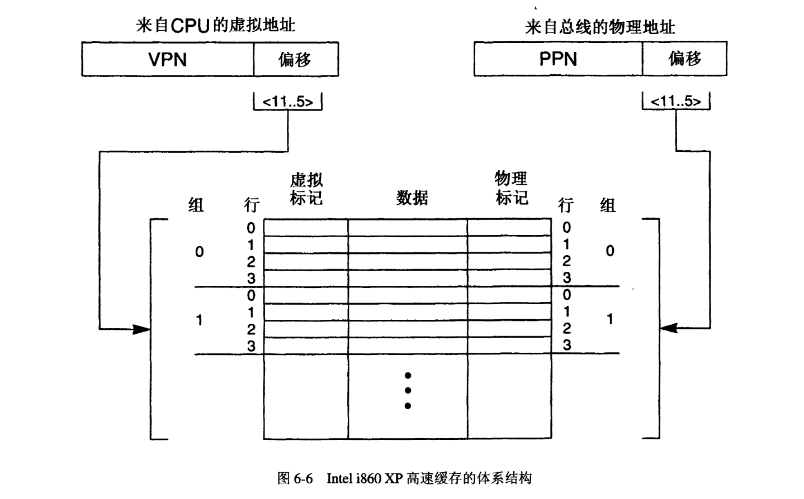

和采用虚拟高速缓存的情况一样，CPU 无需等候 MMU 完成地址转换，就可以完成一次高速缓存访问。CPU 以来自页面偏移的比特位来索引高速缓存，并且检查虚拟标记，看是否会命中。当在一次缺失期间载入一行的时候，设置这行的虚拟标记和物理标记都对应于刚刚取得的数据的虚拟地址和物理地址。因此，标记中的物理地址就是同一行内虚拟地址标记的转换结果。使用来自 DMA 操作物理地址的页面偏移中的比特位来索引高速缓存，并且使用物理标记来检查是否命中，就可以支持总线监视机制。因为在虚拟地址和物理地址中，页面偏移里的比特位都是相同的。所以使用其中任何一种地址都会索引到相同的组。这就保证了即使 CPU 使用一个虚拟地址，而总线监视使用一个物理地址，总线监视硬件也能够定位任何由 CPU 所高速缓存的行。采用这种技术，在 Intel i860 XP 上运行的总线监视机制就和 Intel 80X86 以及前面介绍的其他处理器的物理高速缓存一样。

i860 XP 高速缓存结构的另一个额外的好处是硬件能够自动处理别名问题。在缺失处理期间，通过检查物理标记，查看是否有别名状态就可以达到上述目的。例如，假定位于 OxaOOO 的物理页面在一个进程的地址空间内 Ox15000 和 Ox952000 两处虚拟地址上有别名。如果高速缓存一开始为空（所有的行都标记为无效），那么当进程引用 Ox15ff0 的时候，就会把物理地址 Oxaff0 的数据填入 127 组内的一行。这一行的虚拟标记设为 Ox15，物理标记设为 Oxa（通常，用于索引高速缓存的比特位没有保存在标记中，因为它们可以根据行的位置进行重构）。现在，假定进程引用位于 Ox952ff0 的另一个别名。这就再次索引到了组 127，但是会发生一次缺失，因为没有哪个虚拟标记和这个地址吻合。在 MMU 转换了这个地址之后，处理器开始从主存储器执行一次读操作，取得数据，同时检查被索引的组内的物理标记，看是否命中。在这个例子中，发生了一次命中，表明遇到了别名问题。为了防止将两个别名都载入高速缓存，而且可能让彼此失去同步，i860 XP 忽略了从主存储器返回的数据，只是改变了包含别名的行上的虚拟标记。物理标记则保持不变。因而，过去有虚拟标记 Ox15 的行现在有虚拟标记 Ox952。这一活动对于软件来说是透明的，从而避免了让操作系统显式地冲洗高速缓存来防止别名问题。在所有其他方面，i860 XP 上的高速缓存都表现为虚拟高速缓存，需要第 3 章中所描述的其他类型的冲洗操作。

### 6.3 多级高速缓存
有些实现可以扩展图 2-1 中的存储层次结构，包含一级以上的高速缓存机制。这样做的目的是通过为高速缓存提供高速缓存来进一步提高性能。下图展示了一种有两级高速缓存机制的组织结构

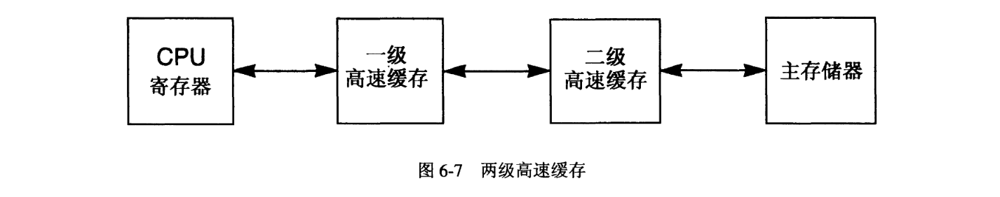

和以前一样，存储层次结构的级别越靠近 CPU，它的速度就越快，规模一般也越小。之所以使用层次结构是出于经济因素：高速存储器很贵，它的密度也低。因此，一级高速缓存（也称为主高速缓存， primary cache）比二级高速缓存（也称为次级高速缓存， secondary cache) 速度快，通常规模也小一些。通过使用稍微有一点儿慢的二级高速缓存，就可以平衡系统的成本和性能。对这个高速缓存的速度要求较低，从而允许使用更便宜的部件，这又反过来让二级高速缓存的规模更大。一级高速缓存较高的速度弥补了二级高速缓存较低的速度。

这两种高速缓存的组成没必要相同。一种典型的安排是这样的，大规模的物理二级高速缓存配合某种类型的小规模高速虚拟高速缓存一起使用。这意味着能够快速地访问一级高速缓存，甚至不需要进行一次 MMU 转换。如果发生一次缺失，那么接下来检查二级高速缓存。这样的系统会并行地启动 MMU 转换和一级高速缓存查找操作。这意味着，如果需要检查二级高速缓存，则物理地址已经就绪了。于是，这就将两类高速缓存结构的优点结合了起来，同时又削弱了缺点。

使用多级高速缓存不能改变必须冲洗高速缓存的情形。这些操作是由各自的高速缓存体系结构所决定的，必须在本章和前面章节所介绍的情况下执行。

#### 6.3.1 带有次级物理高速缓存的主虚拟高速缓存
举第一个例子，其中使用了带有外部物理高速缓存的 Intel i860 XR 。i860XR 具有独立的指令和数据高速缓存，两者都是虚拟高速缓存。数据高速缓存使用写回策略。注意， XR 没有前面介绍过的 XP 所使用的物理标记，因此不支持总线监视和别名检测。假定在外部给 i860 增加一个带有总线监视机制的物理高速缓存，这块高速缓存既包括指令高速缓存也包括数据高速缓存，故称之为统一高速缓存（unified cache）。图 6-8 展示了这一组织结构。

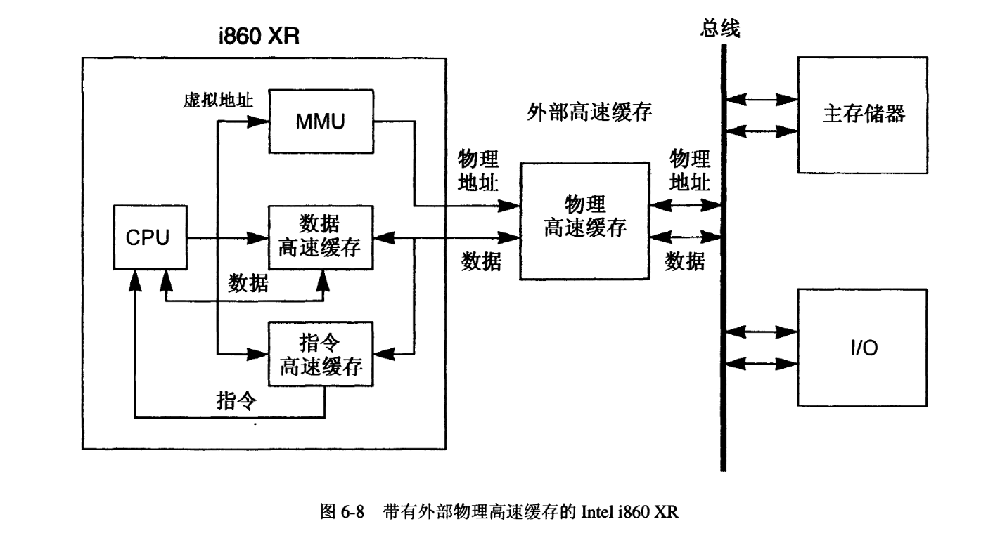

在这幅图中，i860 芯片内的 CPU 向所需的高速缓存和 MMU 发出虚拟地址。高速缓存按照请求把它们的数据和指令返回给 CPU。只有当内部高速缓存中发生一次缺失的时候，才把物理地址发送给外部高速缓存，以执行查找操作。外部高速缓存中的一次缺失会使得物理地址通过总线转发给主存储器。在这种组织结构中，访问主存储器之前先检查高速缓存，所以称之为直通高速缓存 (look-through cache），它得名于访问的串行特性。在检查高速缓存的同时，把物理地址发送给主存储器的组织结构则称为后援高速缓存 (look-aside cache）。后援方式的优点是，如果出现缺失，则可以更快地从主存储器得到数据。在高速缓存大、命中率高的情况下，直通方式是一种更好的方法。使用直通和后援方式对于软件来说是透明的。

因为 i860 上的高速缓存是虚拟高速缓存，可能出现别名和歧义问题，所以在第 3 章所描述的所有情况下，内核都必须冲洗高速缓存。例如，在现场切换时，必须将数据高速缓存写回，并使之无效。考虑到次级高速缓存是物理高速缓存，所以为了保持一致性，只需将主数据高速缓存写回到次级高速缓存即可，不需要把数据写回到主存储器。不出所料，根本不需要冲洗次级高速缓存，因为它是纯物理高速缓存。哪怕是在 I/O 期间，内核也只需写回 i860 的高速缓存，并（或）使之无效就行了。一旦软件顾及到了片上高速缓存的一致性，硬件就会通过总线监视技术来保持次级高速缓存内的一致性。简而言之，内核必须让自己只考虑、主高速缓存，它可以忽略外部高速缓存的存在。

主指令高速缓存和主数据高速缓存之间没有直接连接起来。所以，使用可以自我修改的代码有可能在指令高速缓存中造成过时的指令。当 CPU 以前取过指令，让它们被缓存在指令高速缓存中，而随后又修改了这些指令的时候，就可能出现上述情况。当 CPU 修改它们的时候，它会把新指令保存在数据高速缓存中。这样做并不会影响到指令高速缓存，它仍旧继续缓存着过时的数据。在这些情况下，必须使过时的数据无效，以便下次读取它们的时候出现一次高速缓存缺失。既然使用了统一的次级高速缓存，那么就没有必要把新指令从主数据高速缓存写回主存储器。相反，只需要把它们写入外部高速缓存。当主指令高速缓存中发生了一次缺失的时候，访问主存储器之前先要检查次级高速缓存。

### 6.4 小结
物理高速缓存大大地减少了由操作系统来进行维护的要求。如果使用总线监视机制，那么由于所有的 I/O 操作一致性都在硬件中进行处理，所以不需要冲洗高速缓存。对于这些系统来说，就好像不存在高速缓存一样（从软件角度来看）。我们所看到的一切效果就是因为高速缓存的数据减少了访问主存储器的瞬间，从而获得了更好的性能。物理高速缓存的缺点是 CPU 每次访问时都需要进行 MMU 转换。正因为如此，物理高速缓存把数据返回给 CPU 要比虚拟高速缓存多花时间。通过消除显式地冲洗高速缓存的需要，从而抵消了性能上的损失。物理高速缓存在性能上的缺点可以通过把它与虚拟高速缓存结合起来构成多级高速缓存来予以缓解。这就可以让系统既能利用两种体系结构的好处，又能减弱两者的缺点。

## 7 高效的高速缓存管理技术
前面的章节展示出，为了保持数据一致性，需要如何管理高速缓存。操作系统的设计必须超过这个范围，以一种高效的方式管理高速缓存，以便获得高速缓存的最大性能。本章介绍既能够改善高速缓存性能，又能保持数据一致性的软件技术。

### 7.1 引言
一个高速缓存的整体性能是由 3 个因素所决定的：**高速缓存的物理设计、在系统上运行的程序的局部引用特性，以及操作系统管理高速缓存的效果**。遗憾的是，对于改善局部引用特性很差’的程序性能来说，操作系统无能为力。类似地，一旦硬件造好了，那么高速缓存的物理设计在高速缓存行的大小、组的大小、高速缓存的大小等方面都成了固定不变的。但是，在变化的条件下，可以调整操作系统来有效地管理高速缓存。本章将探讨降低高速缓存管理开销、提高高速缓存整体性能的 3 种技术。它们是**地址空间布局**（address space layout）、**延迟高速缓存无效**（delayed cache invalidation）和**对齐高速缓存的数据结构**（cache-aligning data structure）。

### 7.2 地址空间布局

#### 7.2.1 虚拟索引的高速缓存
每一种 UNIX 系统的实现在一个进程中有 3 个主要区域（正文、数据/bss 和栈）的起始地址都是标准的。为了有效地利用高速缓存，均匀地分布数据，在选择这些标准虚拟地址的时候，必须考虑典型的进程地址空间上高速缓存散列算法的影响。对于任何类型的虚拟索引高速缓存来说都是如此。这种影响最好以一个例子来说明。

考虑一个 64K、直接映射、正文和数据高速缓存相结合的高速缓存，每行 16 字节，共 4096 行。这个高速缓存选择使用虚拟地址的“位＜15..4＞”作为 12 位的行索引。“位＜3..0>” 选择行内的字节。假定系统上页的大小为 4K。对于本例来说，我们将考虑可能的最小进程，它的正文、数据和栈各有一页。对于第一种情况，假定选择如图 7-1 所示的地址作为标准的区域起始地址。


乍一看，这些地址好像是合理的选择，32 位的地址空间均匀地分配给正文和数据，栈从靠近地址空间顶部的地方开始，从而赋予它最大的增长空间（假定在这个系统中，栈向着较低的地址增长）。但是，如果我们现在考虑这 3 个虚拟地址将会产生的高速缓存索引，就会出现如图 7-2 所示的不期望的结果。

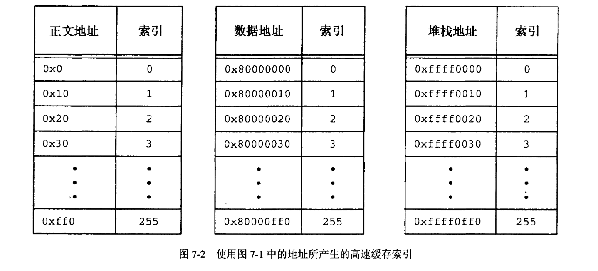

注意，这 3 页中每一页的地址都会索引到同一组高速缓存行：0-255 行。这意味着进程对正文和数据的所有引用都只会索引到高速缓存的前 256 行，而剩余的 3840 行用不上，如图 7-3 所示。

虽然进程正在执行，但是它只能利用全部高速缓存容量的 1/l6。来自 3 个区域的所有引用都在竞争同一组高速缓存行，进而因为高速缓存颠簸而导致命中率很低。既然进程只有 12K 大，而且运行在一个有着 64K 高速缓存的系统上，就没有必要出现这种情形。在进程正在执行的同时，如果有必要，高速缓存有着很大的空间，比足够保存整个地址空间所需的容量还要大。

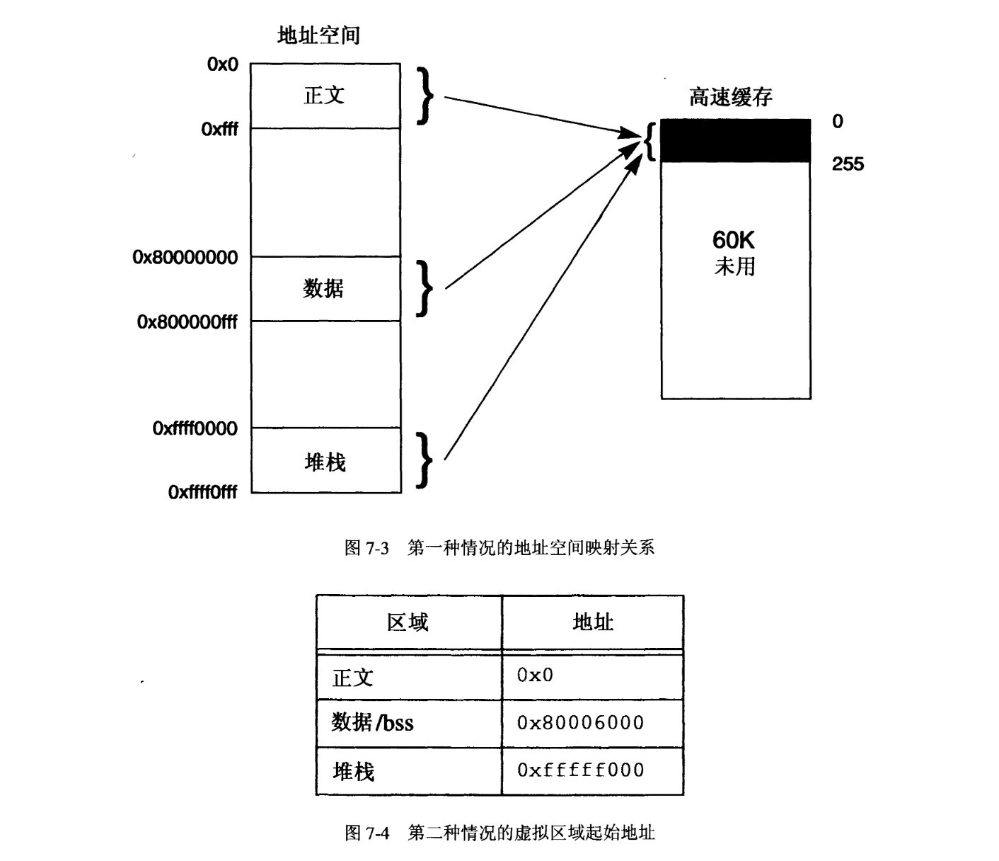

考虑到散列算法的影响，选择不会产生同一组索引的地址，以定义一组新的区域起始地址。例如，可以使用图 7-4 所示的地址。这些地址产生的一组高速缓存索引如图 7-5 所示。选择这些地址以后，来自任何页面的正文或者数据都不会在高速缓存中发生交叠，从而让这个进程最大地利用了高速缓存。观察这样做在图 7-6 中所产生的效果，可以很容易地看出，高速缓存在正文、数据和栈中进行了划分。阴影区域标记出一个很小的、仅有 3 个页面的进程的正文、数据和栈页在高速缓存中所占据的部分。注意，在正文区域同数据区域所占据的高速缓存行发生交叠之前，它可以有 24K 大。类似地，高速缓存中在 bss 和栈区域之间也有 32K 大的空闲部分，供两者增长使用。考虑到这些区域的增长之后，系统就能更好地支持有更大地址空间的进程。因此，选择区域的标准起始地址在很大程度上受到了系统中应用区域预计大小的影响，而且对高速缓存的整体性能有巨大作用。对于大规模的高速缓存来说，为了充分利用它们的空间，为虚拟索引的高速缓存正确选择区域起始地址这项技术格外重要。其好处随着高速缓存大小的减小而相应降低。对于高速缓存小于最小的进程大小的情况来说，这个优势迅速降低，因为不再完全有可能防止单个进程内的高速缓存争用现象。对于高速缓存小于或者等于系统上页面大小的情况来说，则没有什么作用。此时，所有 3 个区域都会竞争相同的高速缓存行，所以没有什么办法能防止高速缓存颠簸。

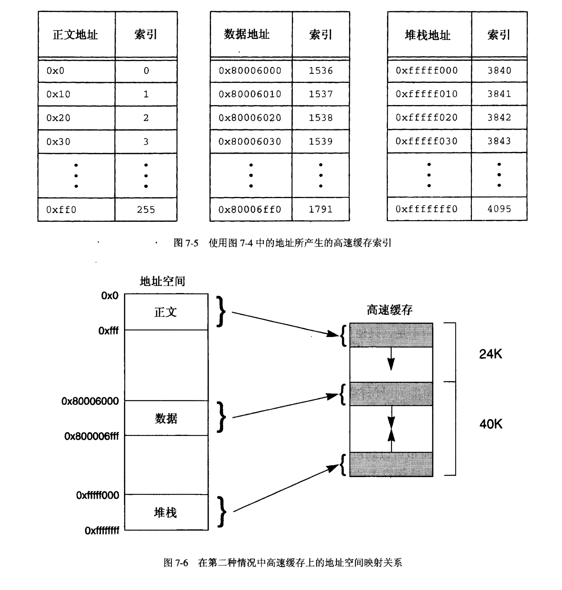

#### 7.2.2 动态地址绑定
带有键的虚拟地址和以物理地址标记的虚拟高速缓存都试图同时缓存多个进程的现场。这些类型的高速缓存组成有一个缺点，即不同进程中相同的虚拟地址都索引到同一组高速缓存行上，从而导致在下一个进程运行的时候上一个进程中高速缓存的数据都被替换掉了。在链接时刻，当所有的进程都和同一组标准区域起始地址绑定到一起的时候尤其如此，正如上一小节所介绍的那样。例如，如果运行的两个小进程使用如图 7-7 所示的地址空间布局，那么这两个进程就会竞争高速缓存中相同的 12K 空间。

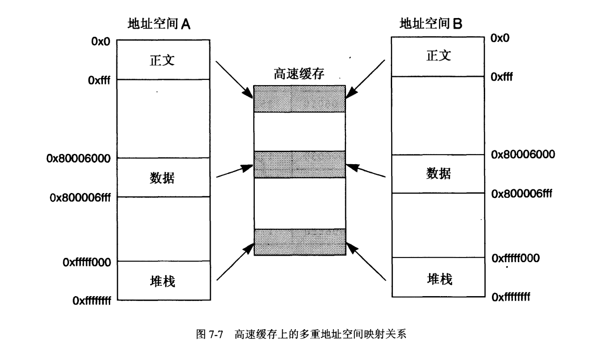

高速缓存再次利用不足，只使用了 64K 高速缓存中的 12K。使用动态绑定机制能够避免这个缺点。

如果进程可以产生的高速缓存索引处于脱节的组内，那么以键或者物理地址标记的大规模虚拟高速缓存就有可能同时缓存来自不同进程的数据。虽然不可能完全防止不同的进程索引到相同的高速缓存行（因为高速缓存要小于进程空间合起来的大小），但是无疑会减少竞争。做到这一点的一种方法是，在链接程序时，把程序随机地绑定到一组区域起始地址之一。类似地，在调用 exec 时也可以随机地选择栈区域的地址。这就提高了系统上运行的进程使其数据随机地分布在高速缓存中的概率，从而避免了和其他进程争用高速缓存。不过，这项技术仍然有缺点，即地址绑定关系是在链接时刻静态固定好的，因而阻碍了操作系统动态地进行调整，以适应在一个正在运转的系统上不断变化的程序混合状态。

第二种可能的方法是使用与位置无关的代码。这是指程序在编译或者链接的时候没有绑定到任何特殊的虚拟地址，在这样的程序中没有出现硬编码的地址（没有使用绝对转移或者数据地址）。相反，操作系统可以在任何虚拟地址载入程序，并开始执行它。接下来，程序相对于当前的 PC C程序计数器）或者它被载入的位置来引用其数据和转移目的地。这种方法的优点是，在系统调用 exec 期间，操作系统能够为程序动态地选择虚拟地址。然后，它可以选择一段地址范围，这段地址产生的一组高速缓存行索引和其他正在运行的进程的地址相脱节。这就允许操作系统进行调整，以动态地适应不断变化的进程混合情况。动态地址绑定的一个缺点是它从程序的执行环境中删除了一个确定性的元素，即固定的区域起始地址。没有了这个确定性的元素，将意味着一个程序必须经受更广泛的测试，以确保它对加载它的虚拟地址没有隐藏的依赖性。第二，这些技术只能在有大规模高速缓存的系统上才能产生可度量的性能增益。较小的高速缓存在任何情况下都不能保存大量进程的局部引用信息，所以计算一个能减少高速缓存行争用的载入地址，所带来的额外开销并不一定划算。最后，不是所有的体系结构都能高效地支持与位置无关的代码。因此，同与位置有关的代码相比，性能可能还有些降低，所以必须把它和高速缓存性能上可能的提升相对照来进行衡量。

#### 7.2.3 物理索引高速缓存
区域起始地址不会影响物理索引高速缓存的性能，因为在计算高速缓存索引时从不使用虚拟地址。但是，物理索引高速缓存会受到虚拟页映射到的物理页地址的影响。因此，对于操作系统来说，比较合适的做法为尝试分配物理页，从而把物理高速缓存行的竞争降至最低。下面介绍的是一种可能的分配物理页的算法，它能够把对高速缓存的引用分布到高速缓存中，以减少争用的情形。

在采用取模的高速缓存索引机制时，物理存储器的连续页面将映射到高速缓存中连续的位置上。例如，图 7-8 画出了页面大小为 4K 的系统上一块 16K 的高速缓存，它还显示出了物理页面怎样映射到高速缓存上（每个阴影区域代表一页）。

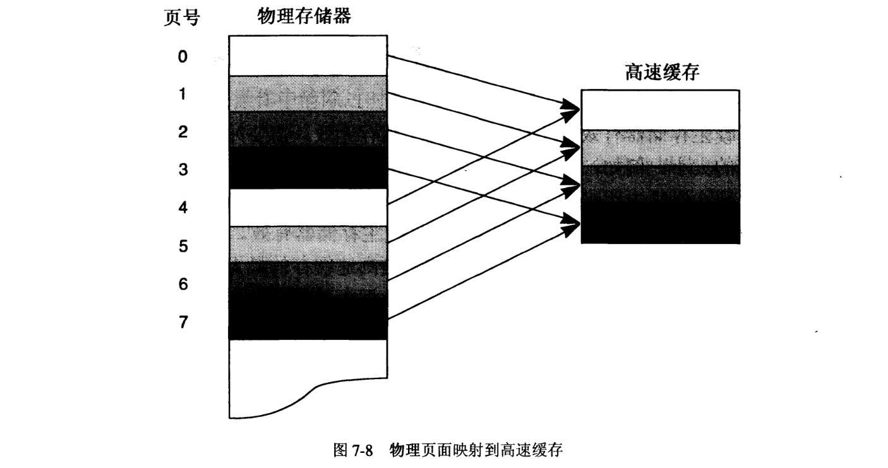

由此可见，每隔 5 页（例如，图中页号为 4 的物理页面〉就“折回”到高速缓存的开头。有相同灰度的物理页面都映射到高速缓存中有对应灰度的部分。不同的灰度经常被称为颜色(color）。于是，我们说每个物理页面都有某种颜色。将对高速缓存的引用均匀分布的一种直截了当的做法是，将物理页分成 n 组，这里的 n 等于高速缓存大小除以页面大小所得的商（也就是说，高速缓存中的颜色数）。接下来，将索引到高速缓存中相同部分的所有页面（那些有相同颜色的页面）都放入到同一组（也就是说，按照它们的颜色进行保存）。在上面的例子中，n 应该是 4，页 0、4、 8、12、16......应该在 0 组，因为它们都索引到高速缓存中第一个 4K 空间。类似地，页 1、5、9、13、17......应该在 1 组，依此类推。不管什么时候分配物理存储器，都要使用循环(round-robin）分配的方法从 4 组中选出一页来。例如，第一页从 0 组分配，第二页从 1 组分配，第三页从 2 组分配，第四页从 3 组分配，然后再回到 0 组、1 组等等。这样一来，系统投入使用的页面，其高速缓存索引应该在高速缓存中均匀分布。这种算法儿乎不会占用操作系统的开销。

如果操作系统要跟踪己经给一个特殊的进程分配了哪些颜色，那么可以进一步采用这项技术，以便均匀分布每个进程的各个页面，从而获得最好的进程级性能。在理想情况下，一个只有 3 页（正文、数据和栈）的进程会从不同的组分配得到它的每一页，于是，在进程执行的时候，它自己的引用之中不会有任何高速缓存行的争用现象。

本节所讨论的技术可以在大规模的高速缓存上很好地发挥作用，这些高速缓存是页面大小的几倍或者更多。但是，对于小规模的高速缓存来说，它们几乎不会对性能有所改善，因为均匀分配页面的情况只能随机出现。例如，如果高速缓存只有页面大小的两倍，在没有操作系统任何额外操作的情况下，从空闲的页面列表中随机分配出的物理页面正好不和上次分配页面同组的机会只有 50%。此外，当高速缓存的大小小于页面大小的话，不会获得任何改善，因为既然只有一种颜色，那么所有的页面都映射到了相同的高速缓存行上。

### 7.3 受限于高速缓存大小的冲洗操作
不论是为了使主存储器有效，还是为了使高速缓存无效，需要冲洗掉的最大数据量始终受限于高速缓存的大小。例如，如果在一个使用写回高速缓存的系统上，有一个进程请求一次 I/O 写操作，那么必须先用来自 I/O 缓冲区且尚在高速缓存中的修改数据（对于没有总线监视机制的所有类型的高速缓存来说，都是如此）使主存储器有效。如果高速缓存有 2K 大，I/O 缓冲区为 4K 大，那么至多有 2K 数据（即能够被高速缓存的最大数据量）需要从高速缓存中冲洗掉，以便用来自高速缓存的任何修改过的数据更新主存储器中全部 4K 大的 I/O 缓冲区。对于所有类型的高速缓存以及在所有的情况下，高速缓存的冲洗操作都受限于高速缓存的大小，利用这一事实，就可以大大节省冲洗操作的开销。对于小规模的高速缓存来说尤其如此，因为举例来说，大量的 I/O 操作在逻辑上需要冲洗的数据总量，或者在一个大型进程返出时需要冲洗的数据总量都会轻易地超过高速缓存的大小。下面将会看到，可以进一步增强这项技术。

### 7.4 滞后的高效缓存无效操作
正如在前面章节中所讨论的那样，在许多可能的情况下，操作系统都必须使高速缓存无效，以保持数据的一致性。虽然有些高速缓存的无效操作必须立即完成（以保持 I/O 一致性或岩防止出现用户－内核歧义），但是如果有特殊的高速缓存实现能保证不引用不一致或者过时的数据，那么就可以推迟其他类型的无效操作。例如，当一个系统上的进程退出的时候，如果这个系统使用带有键的虚拟高速缓存，那么只要其他进程使用不同的键，就不会有哪个进程能命中这个死去进程的过时数据。因此，在调用 exit 的时候，没有必要使高速缓存无效。

由于频繁的高速缓存无效操作会大大降低系统性能，所以推迟高速缓存的无效操作是一个很重要的考虑方面。性能降低的部分原因是由于无效操作本身的开销。高速缓存的无效操作很花时间，它最少也需要一次写高速缓存标记的操作，以此来使高速缓存行无效。在典型情况下，对于要使之无效的每一行高速缓存来说，都必须重复执行这项操作，因为几乎没有哪种高速缓存体系结构能一次冲洗一行以上的高速缓存。

系统性能降低的另一部分原因是，试图使某些高速缓存行无效，而这些行却没有包含操作系统要尝试删除的数据。典型情况下，在给定的任何时刻，一个进程的地址空间中只有一部分（它的局部引用）在高速缓存中。遗憾的是，操作系统没有办法知道驻留在高速缓存中的是哪些部分。因此，例如，当调用 exit 要使高速缓存无效的时候，操作系统必须假定最糟糕的情况，于是要冲洗掉进程所使用的整个地址范围。于是，如果在页面大小为 4K 的系统上使用 16K 高速缓存，并且一个仅有 3 页（正文、数据和堆找）的小进程退出，那么操作系统不得不使整个 12K 的地址空间都无效，以确保从高速缓存中删除进程的所有数据。幸运的是，几乎所有的高速缓存体系结构在真正冲洗一行高速缓存之前都会检查是否命中。这就防止了无效操作删除其他进程的数据，但还是需要对 12K 数据逐行进行检查。

一种改进方式为，在那些高速缓存的体系结构能够防止引用过时数据的情况下推迟无效操作，以后在一次冲洗操作中清除过时数据，其好处显而易见。在采用带有物理标记的 12K 虚拟高速缓存且页面大小为 4K 的情况下，即使是最小进程，每次调用 exit 的时候也不得不使 12K 高速缓存无效。如果有 10 个进程依次退出，那么就会致使操作系统不得不从高速缓存中冲洗掉 120K 数据。如果操作系统等着直到第 10 个进程退出，它就只需要一次使 12K 高速缓存无效即可，而且也能保证死去进程的全部数据都被删除掉了。这就节省了 10 次 exit 调用中 90% 的无效操作开销。这项技术的确切实现取决于高速缓存的组织结构，但是一般不贵。

滞后的高速缓存无效操作不能用于虚拟标记的高速缓存（参见习题 7.9）。此外，带有总线监视机制的物理高速缓存不需要任何这样的技术，因为它们从来都不需要任何冲洗操作（参考 6.2.6 小节）

### 7.5 按高速缓存对齐数据结构
最后一种使高速缓存的性能最大化的计数是在存储器中按高速缓存对齐数据结构。这里要对一个程序中的数据结构，可能就是程序本身进行修改，以提高高速缓存保存数据的效率。其目标是布置好程序的数据，从而让频繁访问的数据结构很好地与高速缓存行相吻合，从而把不能命中高速缓存的情况减至最少，并且使程序的局部引用更为紧凑。虽然这样的修改不一定能移植，因为对高速缓存行大小的了解必须”嵌入“到程序当中去，所以在目标代码的可移植性没有程序的性能重要的场合里，它们就能够提高性能。操作系统本身就是这类程序的一个良好例证。

为了看到这种做法时怎样有益于提高高速缓存性能的，最好把存储器想成是高速缓存行的一个数组，如图 7-9 所示。

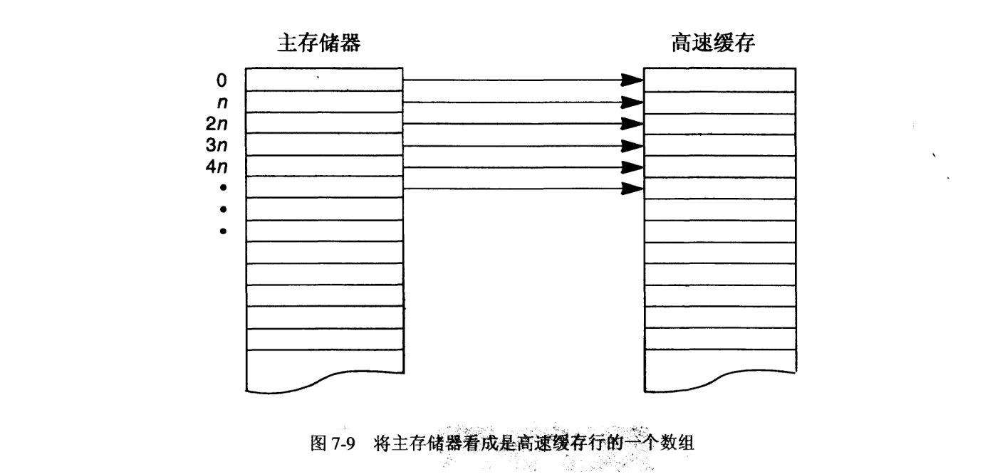

如果使用的物理高速缓存每行的大小为 n，那么从物理地址 0 开始的第一组 n 字节就映射到物理缓存中的第一行。接下来的 n 字节映射到下面一行高速缓存，以此类推。于是，从物理地址 0、n、2n、3n 等等起始的 n 字节，每一组都正好装满一行高速缓存（注意，当使用虚拟地址和虚拟索引的高速缓存时情况也是一样）。知道了这一点，那么现在就可以在存储器中放置数据结构，使它们尽可能高效地与高速缓存行相配合。

例如，在 UNIX 操作系统中访问最频繁的数据结构之一是进程表（process table）。进程表是一个结构数组，每个结构对应于系统中的一个进程，其中包含有诸如进程 ID(process ID）、用户 ID (user ID）和组 ID (group ID）这样的信息。如果高速缓存行比一个进程表项大，而又比两个进程表项小，那么就可以按照下图中的样子把进程表项的数组布置到高速缓存中。

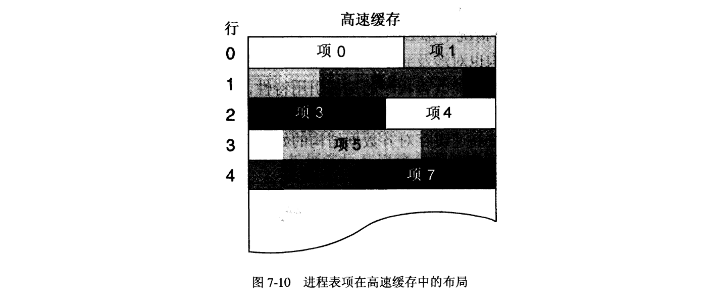

注意进程表项 1、3、4 和 6 如何跨越两行高速缓存，而其余的进程表项则完全在一行之中。在单个进程表项所代表的进程正在执行的同时，该表项内有高度的局部性。因此，我们希望在那些过程中整个进程表项能够驻留在高速缓存里。上图中的 0、2、5 和 7 项都能够以一次高速缓存缺失而读入高速缓存。1、3、4 和 6 项则会产生两次缺失，而且会占用两行高速缓存。多出来的缺失会影响系统的性能，因为在进程表项内有高度的局部性。此外，高速缓存其他的进程表项几乎不会获得什么性能上的好处，因为进程在运行的时候，一般只会访问它们自己的进程表项。就像 1、3、4 和 6 项的情况所体现出来的那样，让每一项只占一行而不是两行高速缓存更可取一些。达到上述目的的一种方法时把每个进程表项填充到和高速缓存行一样大（在高速缓存行比一个数据结构大，而又比两个数据结构小的情况下）。这样做形成的布局如下图所示。

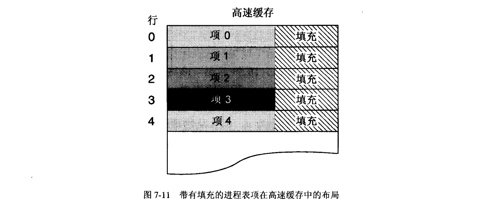

现在每一个进程表项都只占一行高速缓存，这意味着读入完整一项仅仅需要一次高速缓存缺失处理。当然，所做的折衷就是每项末尾的填充浪费了存储器。还要说明的一点是，在任何时刻，高速缓存中所容纳的进程表项也更少了。当决定是否使用这项技术的时候，必须要考虑这些因素。如果填充非常小，那么就很值得做。但是，随着填充不断地增加，浪费的高速缓存空间也就越多，而且可能会让性能降低。类似地，在多个进程表项都是局部引用一部分（比如一个指向散列斗（hash bucket）的指针数组）的情况下，在数据结构上使用填充方法也会降低性能。在每一种情况下都必须运行基准测试程序（benchmark）来确定最优方法。

按高速缓存对齐数据结构也对涉及到多个数据结构的情形有所帮助。通过把相关的数据一起放入存储器的做法，人们就能改善程序的局部引用特性，而且令其所需的高速缓存行更少（因此发生的高速缓存缺失也更少），从而高效地运行。正如我们将在第三部分里看到的那样，在多处理机系统中，按高速缓存对齐数据结构的好处更多。

### 7.6 小结
本章展示了高效管理高速缓存的几种技术。地址空间的布局之所以重要，是因为它影响到了高速缓存的利用率和高速缓存行的竞争。针对虚拟索引的高速缓存，仔细选择区域索引地址，以及针对物理索引的高速缓存，仔细选择物理页面以均匀分布颜色，就能够提高高速缓存的性能。因为所有的高速缓存冲洗操作都受限于高速缓存的大小，所以就可以采用推迟高速缓存无效操作的计数来优化清除过时高速缓存数据的任务。最后，按照高速缓存对齐数据结构，通过整合用于特殊局部引用的数据，使其正好和一行高速缓存相吻合，就可以有助于降低出现高速缓存缺失的情形。只要有可能改善高速缓存的性能，所有这些技术都应该使用，尤其是所有这些技术实现起来都很容易，就更要如此了。