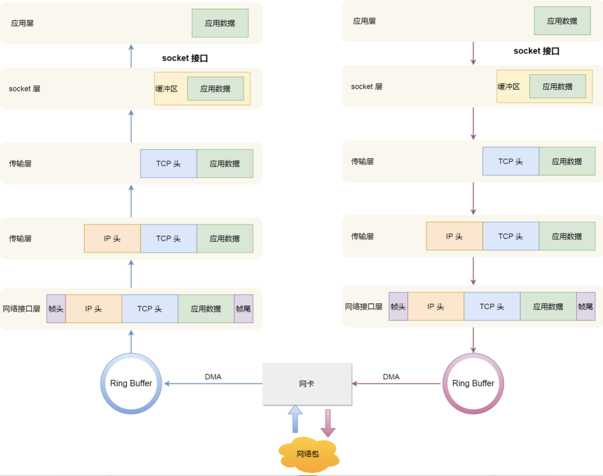

## TCP/IP 相关问题

#### Linux 是如何接收一个网络包的
当网卡上收到数据以后，Linux 中第一个工作的模块是网络驱动。 网络驱动会以 DMA 的方式把网卡上
收到的帧写到内存里。再向 CPU 发起一个中断，以通知 CPU 有数据到达。第二，当 CPU 收到中断请
求后，会去调用网络驱动注册的中断处理函数。 网卡的中断处理函数并不做过多工作，发出软中断请
求，然后尽快释放 CPU。ksoftirqd 检测到有软中断请求到达，调用 poll 开始轮询收包，收到后交由各级协议栈处理。对于 udp 包来说，会被放到用户 socket 的接收队列中。

### 相关概念：
1. ring buffer
2. struct sk_buff
3. Socket 接收缓冲区

#### Linux 接收网络包的流程

网卡是计算机里的一个硬件，专门负责接收和发送网络包，当网卡接收到一个网络包后，会通过 DMA 技术，将网络包放入到 Ring Buffer，这个是一个环形缓冲区。

那接收到网络包后，应该怎么告诉操作系统这个网络包已经到达了呢？

最简单的一种方式就是触发中断，也就是每当网卡收到一个网络包，就触发一个中断告诉操作系统。

但是，这存在一个问题，在高性能网络场景下，网络包的数量会非常多，那么就会触发非常多的中断，要知道当 CPU  收到了中断，就会停下手里的事情，而去处理这些网络包，处理完毕后，才会回去继续其他事情，那么频繁地触发中断，则会导致 CPU 一直没玩没了的处理中断，而导致其他任务可能无法继续前进，从而影响系统的整体效率。

所以为了解决频繁中断带来的性能开销，Linux 内核在 2.6 版本中引入了 NAPI 机制，它是混合「中断和轮询」的方式来接收网络包，它的核心概念就是不采用中断的方式读取数据，而是首先采用中断唤醒数据接收的服务程序，然后 poll 的方法来轮询数据。

比如，当有网络包到达时，网卡发起硬件中断，于是会执行网卡硬件中断处理函数，中断处理函数处理完需要「暂时屏蔽中断」，然后唤醒「软中断」来轮询处理数据，直到没有新数据时才恢复中断，这样一次中断处理多个网络包，于是就可以降低网卡中断带来的性能开销。

那软中断是怎么处理网络包的呢？它会从 Ring Buffer 中拷贝数据到内核 struct sk_buff 缓冲区中，从而可以作为一个网络包交给网络协议栈进行逐层处理。

首先，会先进入到网络接口层，在这一层会检查报文的合法性，如果不合法则丢弃，合法则会找出该网络包的上层协议的类型，比如是 IPv4，还是 IPv6，接着再去掉帧头和帧尾，然后交给网络层。

到了网络层，则取出 IP 包，判断网络包下一步的走向，比如是交给上层处理还是转发出去。当确认这个网络包要发送给本机后，就会从 IP 头里看看上一层协议的类型是 TCP 还是 UDP，接着去掉 IP 头，然后交给传输层。

传输层取出 TCP 头或 UDP 头，根据四元组「源 IP、源端口、目的 IP、目的端口」 作为标识，找出对应的 Socket，并把数据拷贝到 Socket 的接收缓冲区。

最后，应用层程序调用 Socket 接口，从内核的 Socket 接收缓冲区读取新到来的数据到应用层。

至此，一个网络包的接收过程就已经结束了，你也可以从下图左边部分看到网络包接收的流程，右边部分刚好反过来，它是网络包发送的流程。

##### Linux 发送网络包的流程

如上图的有半部分，发送网络包的流程正好和接收流程相反。

首先，应用程序会调用 Socket 发送数据包的接口，由于这个是系统调用，所以会从用户态陷入到内核态中的 Socket 层，Socket 层会将应用层数据拷贝到 Socket 发送缓冲区中。

接下来，网络协议栈从 Socket 发送缓冲区中取出数据包，并按照 TCP/IP 协议栈从上到下逐层处理。

如果使用的是 TCP 传输协议发送数据，那么会在传输层增加 TCP 包头，然后交给网络层，网络层会给数据包增加 IP 包，然后通过查询路由表确认下一跳的 IP，并按照 MTU 大小进行分片。

分片后的网络包，就会被送到网络接口层，在这里会通过 ARP 协议获得下一跳的 MAC 地址，然后增加帧头和帧尾，放到发包队列中。

这一些准备好后，会触发软中断告诉网卡驱动程序，这里有新的网络包需要发送，最后驱动程序通过 DMA，从发包队列中读取网络包，将其放入到硬件网卡的队列中，随后物理网卡再将它发送出去。