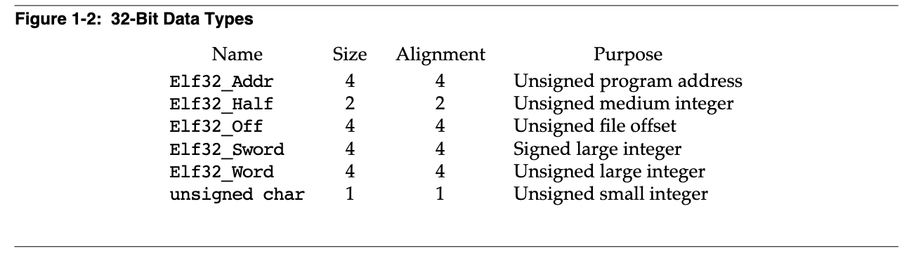

# Executable and Linkable Format (ELF)

[TOC]

## Preface
> The Executable and Linking Format was originally developed and published by UNIX System Laboratories (USL) as part of the Application Binary Interface (ABI). The Tool Interface Standards committee (TIS) has selected the evolving ELF standard as a portable object file format that works on 32-bit Intel Architecture environments for a variety of operating systems.

可执行和链接格式最初由 UNIX 系统实验室（USL）开发和发布，作为应用二进制接口（ABI）的一部分。 工具接口标准委员会（TIS）选择了不断发展的 ELF 标准，作为一种可移植的对象文件格式，可以在各种操作系统的 32 位英特尔架构环境下使用。

> The ELF standard is intended to streamline software development by providing developers with a set of binary interface definitions that extend across multiple operating environments. This should reduce the number of different interface implementations, thereby reducing the need for recoding and recompiling code.

ELF 标准的目的是通过为开发者提供一套跨多种操作环境的二进制接口定义来简化软件开发。这应该会减少不同接口实现的数量，从而减少对重新编码和重新编译代码的需要。

About This Document

> This document is intended for developers who are creating object or executable files on various 32-bit environment operating systems.  It is divided into the following three parts: (本文件是为在各种 32 位环境操作系统上创建对象或可执行文件的开发人员准备的。 它分为以下三个部分。)
> + Part 1, ‘‘Object Files’’ describes the ELF object file format for the three main types of object files. (第一部分，''对象文件''描述了三个主要类型的对象文件的 ELF 对象文件格式。)
> + Part 2, ‘‘Program  Loading and Dynamic Linking’’ describes the object file information and system actions that create running programs. (第二部分，程序加载和动态链接描述了创建运行程序的对象文件信息和系统操作。)
> + Part 3, ‘‘C Library’’ lists the symbols contained in libsys, the standard ANSI  C and libc routines, and the global data symbols required by the libc routines. (第三部分，C 库列出了 libsys 中包含的符号，标准 ANSI C 和 libc 例程，以及libc 例程所需的全局数据符号。)

> NOTE: References to X86 architecture have been changed to Intel Architecture.

## OBJECT FILES

### Introduction
> Part 1 describes the iABI object file format, called ELF (Executable and Linking Format). There are three main types of object files. (第一部分描述了 iABI 对象文件格式，称为 ELF（可执行和链接格式）。有三种主要类型的对象文件。)
> + A relocatable file holds code and data suitable for linking with other object files to create an executable or a shared object file. (可重定位文件持有适合与其他对象文件连接的代码和数据，以创建一个可执行文件或一个共享对象文件。)
> + An executable file holds a program suitable for execution; the file specifies how exec(BAOS) creates a program’s process image. (一个可执行文件容纳一个适合执行的程序；该文件指定 exec(BAOS) 如何创建一个程序的进程图像。)
> + A shared object file holds code and data suitable for linking in two contexts. First, the link editor [see ld(SDCMD)] may process it with other relocatable and shared object files to create another object file. Second, the dynamic linker combines it with an executable file and other shared objects to create a process image. (一个共享对象文件持有适合在两种情况下进行链接的代码和数据。首先，链接编辑器[见ld(SDCMD)]可以将其与其他可重定位和共享对象文件一起处理，以创建另一个对象文件。其次，动态链接器将其与可执行文件和其他共享对象结合起来，创建一个进程映像。)

> Created by the assembler and link editor, object files are binary representations of programs intended to execute directly on a processor.  Programs that require other abstract machines, such as shell scripts, are excluded.

对象文件由汇编器和链接编辑器创建，是程序的二进制表示，旨在直接在处理器上执行。 需要其他抽象机器的程序，如shell脚本，被排除在外。

> After the introductory material, Part 1 focuses on the file format and how it pertains to building programs. Part 2 also describes parts of the object file, concentrating on the information necessary to execute a program.

在介绍性材料之后，第 1 部分集中介绍了文件格式以及它与构建程序的关系。第 2 部分还描述了对象文件的各个部分，集中于执行程序所需的信息。

#### File Format
> Object files participate in program linking (building a program) and program execution (running a program). For convenience and efficiency, the object file format provides parallel views of a file’s contents, reflecting the differing needs of these activities. Figure 1-1 shows an object file’s organization.

对象文件参与程序连接（构建程序）和程序执行（运行程序）。为了方便和高效，对象文件格式提供了文件内容的平行视图，反映了这些活动的不同需要。 图 1-1 显示了一个对象文件的组织。


> An ELF header resides at the beginning and holds a 'road map' describing the file’s organization. Sections hold the bulk of object file information for the linking view: instructions, data, symbol table, relocation information, and so on. Descriptions of special sections appear later in Part 1. Part 2 discusses segments and the program execution view of the file.

ELF 头位于文件的开头，持有描述文件组织的 "路线图"。各个部分包含了链接视图的大部分对象文件信息：指令、数据、符号表、重定位信息等等。特殊部分的描述将在第一部分中出现。第二部分讨论了段和文件的程序执行视图。

> A program header table , if present, tells the system how to create a process image. Files used to build a process image (execute a program) must have a program header table; relocatable files do not need one. A section header table contains information describing the file’s sections. Every section has an entry in the table; each entry gives information such as the section name, the section size, etc. Files used during linking must have a section header table; other object files may or may not have one.

程序头表，如果存在的话，告诉系统如何创建一个进程图像。用于建立进程映像（执行一个程序）的文件必须有一个程序头表；可重定位的文件不需要。节头表包含描述文件节的信息。每个节在表中都有一个条目；每个条目给出的信息包括节名称、节大小等。在连接过程中使用的文件必须有一个节头表；其他对象文件可能有也可能没有。

> Note: Although the figure shows the program header table immediately after the ELF header, and the section header table following the sections, actual files may differ.  Moreover, sections and segments have no specified order.  Only the ELF header has a fixed position in the file.
> 注意：虽然图中显示的是紧随 ELF 头的程序头表，以及紧随各节的节头表，但实际的文件可能有所不同。 此外，节和段没有指定的顺序。只有 ELF 文件头在文件中具有固定的位置。

#### Data Representataion
> As described here, the object file format supports various processors with 8-bit bytes and 32-bit architectures. Nevertheless, it is intended to be extensible to larger (or smaller) architectures. Object files therefore represent some control data with a machine-independent format, making it possible to identify object files and interpret their contents in a common way. Remaining data in an object file use the encoding of the target processor, regardless of the machine on which the file was created.

正如这里所描述的，对象文件格式支持各种具有 8 位字节和 32 位架构的处理器。然而，它的目的是可以扩展到更大（或更小）的体系结构。因此，对象文件用一种与机器无关的格式表示一些控制数据，使得有可能识别对象文件并以一种通用的方式解释其内容。对象文件中的其余数据使用目标处理器的编码，而不管文件是在哪台机器上创建的。



> All data structures that the object file format defines follow the ‘‘natural’’ size and alignment guidelines for the relevant class.  If necessary, data structures contain explicit padding to ensure 4-byte alignment for 4-byte objects, to force structure sizes to a multiple of 4, etc.  Data also have suitable alignment from the beginning of the file.  Thus, for example, a structure containing an Elf32_Addr member will be aligned on a 4-byte boundary within the file. 

对象文件格式定义的所有数据结构都遵循相关类别的''自然''大小和对齐准则。如果有必要，数据结构包含明确的填充，以确保 4 字节对象的 4 字节对齐，强制结构大小为 4 的倍数，等等。数据也有适当的对齐方式，从文件的开始。因此，例如，一个包含 Elf32_Addr 成员的结构将在文件中以 4 字节的边界对齐。

> For portability reasons, ELF uses no bit-fields.

由于可移植性的原因，ELF 不使用位域。

### ELF Header
> Some object file control structures can grow, because the ELF header contains their actual sizes. If the object file format changes, a program may encounter control structures that are larger or smaller than expected. Programs might therefore ignore ‘‘extra’’ information. The treatment of ‘‘missing’’ information depends on context and will be specified when and if extensions are defined.

一些对象文件的控制结构可以增长，因为 ELF 头包含它们的实际尺寸。如果对象文件格式发生变化，程序可能会遇到比预期大或小的控制结构。因此，程序可能会忽略''额外''的信息。对''缺失''信息的处理取决于上下文，并将在定义扩展时指定。


**e_ident** 
> The initial bytes mark the file as an object file and provide machine-independent data with which to decode and interpret the file’s contents. Complete descriptions appear below, in ‘‘ELF Identification.’’

最初的字节标志着该文件是一个对象文件，并提供独立于机器的数据，用来解码和解释文件的内容。完整的描述出现在下面的 "ELF Identification" 中。

**e_type**
> This member identifies the object file type.

该成员标识了对象文件类型。

Name      | Value | Meaning
--------  | ----- | -----------
ET_NONE   | 0     | No file type
ET_REL    | 1     | Relocatable file
ET_EXEC   | 2     | Executable file
ET_DYN    | 3     | Shared object file
ET_CORE   | 4     | Core file
ET_LOPROC | 0xff00| Processor-specific
ET_HIPROC | 0xffff| Processor-specific

> Although the core file contents are unspecified, type ET_CORE is reserved to mark the file. Values from ET_LOPROC through ET_HIPROC (inclusive) are reserved for processor-specific semantics. Other values are reserved and will be assigned to new object file types as necessary.

尽管核心文件的内容没有被指定，但 ET_CORE 类型被保留用来标记该文件。从 ET_LOPROC 到 ET_HIPROC （包括）的值被保留用于处理器特定的语义。其他的值被保留，并将在必要时分配给新的对象文件类型。

**e_machine**
> This member's value specifies the required architecture for an individual file.

这个成员的值指定了单个文件所需的架构。

Name    | Value | Meaning
------  | ----- | ----------
EM_NONE | 0     | No machine
EM_M32  | 1     | AT&T WE 32100
EM_SPARC| 2     | SPARC
EM_386  | 3     | Intel 80386
EM_68K  | 4     | Motorola 68000
EM_88K  | 5     | Motorala 88000
EM_860  | 7     | Intel 80860
EM_MIPS | 8     | MIPS RS3000

> Other values are reserved and will be assigned to new machines as necessary. Processor-specific ELF names use the machine name to distinguish them.  For example, the flags mentioned below use the prefix EF_; a flag named WIDGET for the EM_XYZ machine would be called EF_XYZ_WIDGET.

其他值是保留的，将在必要时分配给新机器。特定于处理器的 ELF 名称使用机器名称来区分它们。例如，下面提到的标志使用前缀 EF_；为 EM_XYZ 机器命名的 WIDGET 标志将被称为 EF_XYZ_WIDGET。

**e_version**
>This member identifies the object file verison.

这个成员标识了对象文件的版本。

Name       | Value | Meaning
EV_NONE    | 0    | Invalid version
EV_CURRENT | 1    | Current version

> The value 1 signifies the original file format; extensions will create new versions with higher numbers. The value of EV_CURRENT, though given as 1 above, will change as necessary to reflect the current version number.

值 1 表示原始文件格式；扩展将创建具有更高数字的新版本。EV_CURRENT 的值，虽然上面给出的是 1，但会根据需要改变以反映当前的版本号。

**e_entry**
> This member gives the virtual address to which the system first transfers control, thus starting the process. If the file has no associated entry point, this member holds zero.

这个成员给出了系统第一次转移控制权的虚拟地址，从而启动了这个进程。如果文件没有相关的入口点，这个成员就持有零。

**e_phoff**
> This member holds the program header table’s file offset in bytes. If the file has no program header table, this member holds zero.

这个成员持有程序头表的文件偏移量，单位是字节。如果文件没有 programe header table，这个成员持有零。

**e_shoff**
> This member holds the section header table’s file offset in bytes. If the file has no section header table, this member holds zero.

这个成员持有节头表的文件偏移量，单位是字节。如果文件没有 section header table，这个成员持有零。

**e_flags**
> This member holds processor-specific flags associated with the file. Flag names take the form EF_machine_flag.  See ‘‘Machine Information’’ for flag definitions.

这个成员持有与文件相关的处理器特定标志。标志名称采用 EF_machine_flag 形式。关于标志的定义，见 "机器信息"。

**e_ehsize**
> This member holds the ELF header’s size in bytes.

这个成员持有 ELF 头的大小，单位是字节。

**e_phentsize**
> This member holds the size in bytes of one entry in the file’s program header table; all entries are the same size.

这个成员持有文件的程序头表中一个条目的大小，以字节为单位；所有条目都是相同的大小。

**e_phnum**
> This member holds the number of entries in the program header table. Thus the product of e_phentsize and e_phnum gives the table’s size in bytes. If a file has no program header table, e_phnum holds the value zero.

这个成员持有程序头表的条目数。因此，e_phentsize 和 e_phnum 的乘积给出了该表的字节数。如果一个文件没有程序头表，e_phnum 的值为 0。

**e_shentsize**
> This member holds a section header’s size in bytes. A section header is one entry in the section header table; all entries are the same size.

这个成员持有一个节头的大小，单位是字节。一个 section header 是 section header table 中的一个条目；所有条目都是相同的大小。

**e_shnum**
> This member holds the number of entries in the section header table. Thus the product of e_shentsize and e_shnum gives the section header table’s size in bytes. If a file has no section header table, e_shnum holds the value zero.

这个成员持有节头表的条目数。因此，e_shentsize 和 e_shnum 的乘积给出了节头表的大小（字节）。如果一个文件没有 section header table，e_shnum 的值为 0。

**e_shstrndx**
> This member holds the section header table index of the entry associated with the section name string table. If the file has no section name string table, this member holds the value SHN_UNDEF. See ‘‘Sections’’ and ‘‘String Table’’ below for more information.

这个成员持有与 section name string table 相关的条目的 section header table 索引。如果文件没有 section name string table，这个成员持有值 SHN_UNDEF。更多信息请参见下面的''章节''和''字符串表''。

#### ELF Identification
> As mentioned above, ELF provides an object file framework to support multiple processors, multiple data encodings, and multiple classes of machines.  To support this object file family, the initial bytes of the file specify how to interpret the file, independent of the processor on which the inquiry is made and independent of the file’s remaining contents.

如上所述，ELF 提供了一个对象文件框架，以支持多处理器、多数据编码和多类机器。为了支持这个对象文件系列，文件的初始字节指定如何解释文件，与查询的处理器无关，也与文件的其余内容无关。

> The initial bytes of an ELF header (and an object file) correspond to the e_ident member.

ELF 头文件（和对象文件）的初始字节对应于 e_ident 成员。


> These indexes access bytes that hold the following values.

这些索引访问持有以下数值的字节。

**EI_MAG0 to EI_MAG3**
> A file’s first 4 bytes hold a ‘‘magic number,’’ identifying the file as an ELF object file.

一个文件的前 4 个字节有一个"神奇的数字"，用于识别该文件是一个 ELF 对象文件。

Name     | Value | Position
-------- | ----- | ----------
ELFMAG0  | 0x7f  | e_ident[EI_MAG0]
ELFMAG1  | 'E'   | e_ident[EI_MAG1]
ELFMAG2  | 'L'   | e_ident[EI_MAG2]
ELFMAG3  | 'F'   | e_ident[EI_MAG3]

**EI_CLASS**
> The next byte, e_ident[EI_CLASS], identifies the file’s class, or capacity.

下一个字节，e_ident[EI_CLASS]，标识了文件的类别，或容量。

Name   | Value | Meaning 
------ | ----- | ---------
ELFCLASSNONE | 0 | Invalid class
ELFCLASS32   | 1 | 32-bit objects
ELFCLASS64   | 2 | 64-bit objects

> The file format is designed to be portable among machines of various sizes, without imposing the sizes of the largest machine on the smallest. Class ELFCLASS32 supports machines with files and virtual address spaces up to 4 gigabytes; it uses the basic types defined above.

文件格式被设计成可以在不同大小的机器之间移植，而不会把最大机器的尺寸强加给最小的机器。ELFCLASS32 类支持文件和虚拟地址空间高达 4 GB的机器；它使用上面定义的基本类型。

> Class ELFCLASS64 is reserved for 64-bit architectures.  Its appearance here shows how the object file may change, but the 64-bit format is otherwise unspecified.  Other classes will be defined as necessary, with different basic types and sizes for object file data.

ELFCLASS64 类是为 64 位架构保留的。它在这里的出现显示了对象文件可能发生的变化，但 64 位格式在其他方面没有指定。其他类将在必要时被定义，为对象文件数据提供不同的基本类型和大小。

**EI_DATA**
Byte e_ident[EI_DATA] specifies the data encoding of the processor-specific data in the object file.  The following encodings are currently defined.

字节 e_ident[EI_DATA] 指定了对象文件中处理器特定数据的数据编码。目前定义的编码有以下几种。

Name        | Value | Meaning
----------- | ----  | --------
ELFDATANONE | 0     | Invalid data encoding
ELFDATA2LSB | 1     | See below
ELFDATA2MSB | 2     | See below

> More information on these encodings appears below.  Other values are reserved and will be assigned to new encodings as necessary.

关于这些编码的更多信息见下文。其他值是保留的，并将在必要时分配给新的编码。

**EI_VERSION** 
> Byte e_ident[EI_VERSION] specifies the ELF header version number.  Currently, this value must be EV_CURRENT, as explained above for e_version. 

字节 e_ident[EI_VERSION] 指定 ELF 头的版本号。目前，这个值必须是 EV_CURRENT，正如上面对 e_version 的解释。

**EI_PAD** 
> This value marks the beginning of the unused bytes in e_ident. These bytes are reserved and set to zero; programs that read object files should ignore them.  The value of EI_PAD will change in the future if currently unused bytes are given meanings.

这个值标志着 e_ident 中未使用的字节的开始。这些字节被保留并设置为零；读取对象文件的程序应该忽略它们。如果当前未使用的字节被赋予意义，EI_PAD 的值将在未来发生变化。

> A file’s data encoding specifies how to interpret the basic objects in a file.  As described above, class ELFCLASS32 files use objects that occupy 1, 2, and 4 bytes. Under the defined encodings, objects are represented as shown below. Byte numbers appear in the upper left corners.

一个文件的数据编码指定了如何解释文件中的基本对象。如上所述，ELFCLASS32 类文件使用占用 1、2 和 4 字节的对象。在定义的编码下，对象的表示方法如下所示。字节数出现在左上角。

> Encoding ELFDATA2LSB specifies 2’s complement values, with the least significant byte occupying the lowest address.

编码 ELFDATA2LSB 指定2's complement 值，最不重要的字节占据最低地址。


> Encoding ELFDATA2MSB specifies 2’s complement values, with the most significant byte occupying the lowest address.

编码 ELFDATA2MSB 指定 2 的补码值，最重要的字节占据最低地址。


#### Machine Information
> For file identification in e_ident, the 32-bit Intel Architecture requires the following values.

对于 e_ident 中的文件识别，32 位 Intel 架构需要以下数值。


> Processor identification resides in the ELF header’s e_machine member and must have the value EM_386.

处理器识别驻留在 ELF 头的 e_machine 成员中，其值必须是 EM_386。

> The ELF header’s e_flags member holds bit flags associated with the file.  The 32-bit Intel Architecture defines no flags; so this member contains zero.

ELF 头的 e_flags 成员持有与文件相关的位标志。32 位英特尔架构没有定义任何标志；所以这个成员包含零。

### Sections
> An object file’s section header table lets one locate all the file’s sections.  The section header table is an array of Elf32_Shdr structures as described below.  A section header table index is a subscript into this array.  The ELF header’s e_shoff member gives the byte offset from the beginning of the file to the section header table; e_shnum tells how many entries the section header table contains; e_shentsize gives the size in bytes of each entry.

一个对象文件的 section header table 可以让人找到文件的所有 section。section header table 是一个 Elf32_Shdr 结构的数组，如下所述。一个 section header table 的索引是这个数组的一个下标。ELF 头的 e_shoff 成员给出了从文件开始到 section header table 的字节偏移量；e_shnum 告诉了 section header table 包含多少个条目；e_shentsize 给出了每个条目的字节大小。

> Some section header table indexes are reserved; an object file will not have sections for these special indexes.

一些 section header table 的索引是保留的；一个对象文件不会有这些特殊索引的 section。

**Figure 1-8: Special Section Indexes**

Name      | Value
--------- | -------
SHN_UNDEF | 0
SHN_LORESERVE | 0xff00
SHN_LOPROC | 0xff00
SHN_HIPROC | 0xff1f
SHN_ABS    | 0xfff1
SHN_COMMON | 0xfff2
SHN_HIRESERVE | 0xffff

**SHN_UNDEF**
> This value marks an undefined, missing, irrelevant, or otherwise meaningless section reference.  For example, a symbol ‘‘defined’’ relative to section number SHN_UNDEF is an undefined symbol.

这个值标志着一个未定义的、缺失的、不相关的、或其他无意义的章节参考。例如，相对于节号 SHN_UNDEF 的"'定义'"符号是一个未定义的符号。

> Note: Although index 0 is reserved as the undefined value, the section header table contains an entry for index 0.  That is, if the e_shnum member of the ELF header says a file has 6 entries in the section header table, they have the indexes 0 through 5.  The contents of the initial entry are specified later in this section.

注意：尽管索引 0 被保留为未定义的值，但节头表包含一个索引 0 的条目。也就是说，如果 ELF 头的 e_shnum 成员说一个文件在节头表中有 6 个条目，它们的索引是 0 到 5。初始条目的内容将在本节后面指定。

**SHN_LORESERVE**
> This value specifies the lower bound of the range of reserved indexes.

这个值指定了保留索引范围的下限。

**SHN_LOPROC through SHN_HIPROC**
> Values in this inclusive range are reserved for processor-specific semantics.

这个包容范围内的值是为处理器特定语义保留的。

**SHN_ABS** 
> This value specifies absolute values for the corresponding reference. For example, symbols defined relative to section number SHN_ABS have absolute values and are not affected by relocation.

这个值指定了相应参考的绝对值。例如，相对于节号 SHN_ABS 定义的符号具有绝对值，不受重定位的影响。

**SHN_COMMON** 
> Symbols defined relative to this section are common symbols, such as FORTRAN COMMON or unallocated C external variables.

相对于本节定义的符号是常见的符号，如 FORTRAN COMMON 或未分配的 C 外部变量。

**SHN_HIRESERVE** 
> This value specifies the upper bound of the range of reserved indexes. The system reserves indexes between SHN_LORESERVE and SHN_HIRESERVE, inclusive; the values do not reference the section header table. That is, the section header table does not contain entries for the reserved indexes.

这个值指定了保留索引范围的上限。系统保留 SHN_LORESERVE 和 SHN_HIRESERVE 之间的索引，包括在内；这些值不引用节头表。也就是说，节头表不包含保留索引的条目。

> Sections contain all information in an object file, except the ELF header, the program header table, and the section header table. Moreover, object files’ sections satisfy several conditions.

Sections 包含对象文件中的所有信息，除了 ELF 头、程序头表和节头表。此外，对象文件的 section 满足几个条件。

+ Every section in an object file has exactly one section header describing it.  Section headers may exist that do not have a section. (在一个对象文件中的每一节都有确切的节头来描述它。可能存在没有节的节头。)
+ Each section occupies one contiguous (possibly empty) sequence of bytes within a file. (每个节在一个文件中占据一个连续的（可能是空的）字节序列。)
+ Sections in a file may not overlap. No byte in a file resides in more than one section. (文件中的各个节不得重叠。一个文件中的任何字节都不能同时属于多个节。)
+ An object file may have inactive space. The various headers and the sections might not ‘‘cover’’ every byte in an object file. The contents of the inactive data are unspecified. (一个对象文件可能有不活跃的空间。各种 headers 和 sections 可能没有''覆盖''一个对象文件中的每个字节。不活动数据的内容是不明确的。)

> A section header has the following structure.

一个 section header 有以下结构。

```c
    typedef struct {
        Elf32_Word  sh_name;
        Elf32_Word  sh_type;
        Elf32_Word  sh_flags;
        Elf32_Addr  sh_addr;
        Elf32_Off  sh_offset;
        Elf32_Word  sh_size;
        Elf32_Word  sh_link;
        Elf32_Word  sh_info;
        Elf32_Word  sh_addralign;
        Elf32_Word  sh_entsize;
    } Elf32_Shdr;
```

**sh_name** 
> This member specifies the name of the section. Its value is an index into the section header string table section [see ‘‘String Table’’ below], giving the location of a null-terminated string.

这个成员指定节的名称。它的值是节头字符串表部分的索引[见下面的''字符串表'']，给出一个空尾字符串的位置。

**sh_type**
> This member categorizes the section’s contents and semantics.  Section types and their descriptions appear below.

这个成员对节的内容和语义进行分类。节的类型和它们的描述出现在下面。

**sh_flags**
> Sections support 1-bit flags that describe miscellaneous attributes. Flag definitions appear below.

部分支持描述杂项属性的 1 位标志。标志的定义见下文。

**sh_addr** 
> If the section will appear in the memory image of a process, this member gives the address at which the section’s first byte should reside. Otherwise, the member contains 0.

如果该节将出现在一个进程的内存映像中，这个成员给出了该节的第一个字节的地址。否则，该成员包含 0。

**sh_offset** 
> This member’s value gives the byte offset from the beginning of the file to the first byte in the section. One section type, SHT_NOBITS described below, occupies no space in the file, and its sh_offset member locates the conceptual placement in the file.

这个成员的值给出了从文件开始到节中第一个字节的字节偏移。有一种节的类型，即下面描述的 SHT_NOBITS，在文件中不占空间，它的 sh_offset 成员在文件中定位概念性的位置。

**sh_size**
> This member gives the section’s size in bytes.  Unless the section type is SHT_NOBITS, the section occupies sh_size bytes in the file. A section of type SHT_NOBITS may have a non-zero size, but it occupies no space in the file.

这个成员给出了该节的大小，单位是字节。除非节的类型是 SHT_NOBITS，否则该节在文件中占据 sh_size 字节。SHT_NOBITS 类型的部分可能有一个非零的大小，但它在文件中不占任何空间。

**sh_link** 
> This member holds a section header table index link, whose interpretation depends on the section type. A table below describes the values.

这个成员持有一个节头表索引链接，其解释取决于节的类型。下面的表格描述了这些值。

**sh_info** 
> This member holds extra information, whose interpretation depends on the section type. A table below describes the values.

这个成员持有额外的信息，其解释取决于节类型。下面的表格描述了这些值。

**sh_addralign** 
> Some sections have address alignment constraints. For example, if a section holds a doubleword, the system must ensure doubleword alignment for the entire section. That is, the value of sh_addr must be congruent to 0, modulo the value of sh_addralign.  Currently, only 0 and positive integral powers of two are allowed. Values 0 and 1 mean the section has no alignment constraints.

有些节有地址对齐限制。例如，如果一个部分持有一个双字，系统必须确保整个节的双字对齐。也就是说，sh_addr 的值必须与 0 一致，并与 sh_addralign 的值相乘。目前，只允许 0 和 2 的正整数次方。值为 0 和 1 意味着该节没有对齐限制。

**sh_entsize** 
> Some sections hold a table of fixed-size entries, such as a symbol table. For such a section, this member gives the size in bytes of each entry. The member contains 0 if the section does not hold a table of fixed-size entries.

有些节保存着一个固定大小的条目表，比如说符号表。对于这样的节，这个成员给出了每个条目的大小（字节）。如果该部分不持有固定大小的条目表，该成员包含 0。

> A section header’s sh_type member specifies the section’s semantics.

一个节头的 sh_type 成员指定了该节的语义。

**Figure 1-10: Section Types, sh_type**

Name      | value 
--------- | ------------
SHT_NULL  | 0
SHT_PROGBITS | 1
SHT_SYMTAB | 2
SHT_STRTAB | 3
SHT_RELA   | 4
SHT_HASH   | 5
SHT_DYNAMIC | 6
SHT_NOTE    | 7
SHT_NOBITS  | 8
SHT_REL     | 9
SHT_SHLTB   | 10
SHT_DYNSYM  | 11
SHT_LOPROC  | 0x70000000
SHT_HIPROC  | 0x7fffffff
SHT_LOUSER  | 0x80000000
SHT_HIUSER  | 0xffffffff

**SHT_NULL** 
> This value marks the section header as inactive; it does not have an associated section. Other members of the section header have undefined values.

这个值标志着节头是不活跃的；它没有相关的节。节头的其他成员有未定义的值。

**SHT_PROGBITS** 
> The section holds information defined by the program, whose format and meaning are determined solely by the program.

该节持有由程序定义的信息，其格式和含义完全由程序决定。

**SHT_SYMTAB and SHT_DYNSYM**
> These sections hold a symbol table.  Currently, an object file may have only one section of each type, but this restriction may be relaxed in the future.  Typically, SHT_SYMTAB provides symbols for link editing, though it may also be used for dynamic linking.  As a complete symbol table, it may contain many symbols unnecessary for dynamic linking.  Consequently, an object file may also contain a SHT_DYNSYM section, which holds a minimal set of dynamic linking symbols, to save space.  See ‘‘Symbol Table’’ below for details.

这些节持有一个符号表。目前，一个对象文件中每种类型只能有一个节，但这个限制在将来可能会放宽。通常情况下，SHT_SYMTAB 为链接编辑提供符号，尽管它也可能被用于动态链接。作为一个完整的符号表，它可能包含许多动态链接所不必要的符号。因此，一个对象文件也可以包含一个 SHT_DYNSYM 部分，它持有最小的动态链接符号集，以节省空间。详见下面的 "符号表"。

**SHT_STRTAB** 
> The section holds a string table. An object file may have multiple string table sections. See ‘‘String Table’’ below for details.

该节持有一个字符串表。一个对象文件可以有多个字符串表部分。详情见下面的''字符串表''。

**SHT_RELA** 
> The section holds relocation entries with explicit addends, such as type Elf32_Rela for the 32-bit class of object files. An object file may have multiple relocation sections. See ‘‘Relocation’’ below for details.

该节保存有明确加注的重定位条目，例如，32 位类对象文件的 Elf32_Rela 类型。一个对象文件可以有多个重定位部分。详见下面的"重定位"。

**SHT_HASH**
> The section holds a symbol hash table. All objects participating in dynamic linking must contain a symbol hash table. Currently, an object file may have only one hash table, but this restriction may be relaxed in the future. See ‘‘Hash Table’’ in Part 2 for details.

该节持有一个符号哈希表。所有参与动态链接的对象必须包含一个符号哈希表。目前，一个对象文件只能有一个哈希表，但这个限制在未来可能会放宽。详情见第 2 部分的 "哈希表"。

**SHT_DYNAMIC** 
> The section holds information for dynamic linking.  Currently, an object file may have only one dynamic section, but this restriction may be relaxed in the future.  See ‘‘Dynamic Section’’ in Part 2 for details.

该节保存动态链接的信息。目前，一个对象文件只能有一个动态部分，但这个限制在将来可能会被放宽。详情见第二部分的 "动态部分"。

**SHT_NOTE** 
> The section holds information that marks the file in some way.  See ‘‘Note Section’’ in Part 2 for details. 

该节持有以某种方式标记文件的信息。详见第 2 部分的 "注释部分"。

**SHT_NOBITS**
> A section of this type occupies no space in the file but otherwise resembles SHT_PROGBITS.  Although this section contains no bytes, the sh_offset member contains the conceptual file offset. 

这种类型的部分在文件中不占空间，但其他方面与 SHT_PROGBITS 相似。尽管这个部分不包含任何字节，但sh_offset 成员包含概念性的文件偏移。

**SHT_REL**
> The section holds relocation entries without explicit addends, such as type Elf32_Rel for the 32-bit class of object files.  An object file may have multiple relocation sections.  See ‘‘Relocation’’ below for details.

该节持有没有明确加注的重定位条目，例如 32 位类对象文件的 Elf32_Rel 类型。一个对象文件可以有多个重定位部分。详情见下面的''重定位''。

**SHT_SHLIB**
> This section type is reserved but has unspecified semantics. Programs that contain a section of this type do not conform to the ABI.

这个节类型是保留的，但具有未指定的语义。 包含这种类型的节的程序不符合ABI。

**SHT_LOPROC through SHT_HIPROC**
> Values in this inclusive range are reserved for processor-specific semantics.

这个包容范围内的值是为处理器特定语义保留的。

**SHT_LOUSER**
> This value specifies the lower bound of the range of indexes reserved for application programs.

这个值指定了为应用程序保留的索引范围的下限。

**SHT_HIUSER**
> This value specifies the upper bound of the range of indexes reserved for application programs. Section types between SHT_LOUSER and SHT_HIUSER may be used by the application, without conflicting with current or future system-defined section types.

这个值指定了为应用程序保留的索引范围的上限。SHT_LOUSER 和 SHT_HIUSER 之间的部分类型可以被应用程序使用，而不会与当前或未来的系统定义的部分类型相冲突。

> Other section type values are reserved. As mentioned before, the section header for index 0 (SHN_UNDEF) exists, even though the index marks undefined section references. This entry holds the following.

其他节的类型值是保留的。如前所述，索引 0 的节头（SHN_UNDEF）是存在的，尽管该索引标志着未定义的节引用。这个条目包含以下内容。

**Figure1-11: Section Header Table Entry: Index 0**

Name     | Value | Note
-------- | ----- | ----
sh_name  | 0     | No name
sh_type  | SHT_NULL | Inactive
sh_flags | 0     | No flags
sh_addr  | 0     | No address
sh_offset| 0     | No file offset
sh_size  | 0     | No size
sh_link  | SHN_UNDEF | No link information
sh_info  | 0     | No auxiliary information
sh_addralign | 0 | No auxiliary information
sh_entsize | 0   | No entries

> A section header’s sh_flags member holds 1-bit flags that describe the section’s attributes. Defined values appear below; other values are reserved.

节头的 sh_flags 成员持有 1 位标志，描述了该节的属性。定义的值出现在下面；其他值是保留的。

**Figure1-12: Section Attribute Flags, sh_flags**

Name      | Value
--------- | -------
SHF_WRITE | 0x1
SHF_ALLOC | 0x2
SHF_EXECINSTR | 0x4
SHF_MASKPROC  | 0xf0000000

> If a flag bit is set in sh_flags, the attribute is ‘‘on’’ for the section.  Otherwise, the attribute is ‘‘off’’ or does not apply.  Undefined attributes are set to zero.

如果在 sh_flags 中设置了一个标志位，则该属性对该节是''开''。否则，该属性为''关闭''或不适用。未定义的属性被设置为零。

**SHF_WRITE** 
> The section contains data that should be writable during process execution.

该节包含在进程执行过程中应该可以写入的数据。

**SHF_ALLOC** 
> The section occupies memory during process execution.  Some control sections do not reside in the memory image of an object file; this attribute is off for those sections.

该节在进程执行期间占用内存。有些控制部分不在对象文件的内存映像中，对于这些部分，这个属性是关闭的。

**SHF_EXECINSTR**
> The section contains executable machine instructions.

该节包含可执行的机器指令。

**SHF_MASKPROC**
> All bits included in this mask are reserved for processor-specific semantics.

该掩码中包含的所有位都保留给处理器特定的语义。

> Two members in the section header, sh_link and sh_info, hold special information, depending on section type.

节头中的两个成员，sh_link 和 sh_info，持有特殊信息，取决于节的类型。

**Figure1-13: sh_link and sh_info interpretation**

sh_type     | sh_link | sh_info
----------- | ------- | -----------
SHT_DYNAMIC | The section header index of the string table used by entries in the section.  | 0
SHT_HASH    | The section header index of the symbol table to which the hash table applies.  | 0
SHT_REL & SHT_RELA  | The section header index of the associated symbol table. | The section header index of the section to which the relocation applies.
SHT_SYMTAB & SHT_DYNSYM | The section header index of the associated string table. | One greater than the symbol table index of th last local symbol (binding STB_LOCAL).
other  | SHN_UNDEF  | 0

#### Special Sections
> Various sections hold program and control information. Sections in the list below are used by the system and have the indicated types and attributes.

各个部分保存着程序和控制信息。下面列表中的部分被系统使用，并具有指定的类型和属性。

Name     |  Type       |  Attributes 
-------- | ----------- | ------------
.bss     | SHT_NOBITS  | SHF_ALLOC + SHF_WRITE
.comment | SHT_PROGBITS| none
.data    | SHT_PROGBITS| SHF_ALLOC + SHF_WRITE
.data1   | SHT_PROGBITS| SHF_ALLOC + SHF_WRITE
.debug   | SHT_PROGBITS| none
.dynamic | SHT_DYNAMIC | see below
.dynstr  | SHT_STRTAB  | SHF_ALLOC
.dynsym  | SHT_DYNSYM  | SHF_ALLOC
.fini    | SHT_PROGBITS| SHF_ALLOC + SHF_EXECINSTR
.got     | SHT_PROGBITS| see below
.hash    | SHT_HASH    | SHF_ALLOC
.init    | SHT_PROGBITS| SHF_ALLOC + SHF_EXECINSSTR
.interp  | SHT_PROGBITS| see below
.line    | SHT_PROGBITS| none
.note    | SHT_NOTE    | none
.plt     | SHT_PROGBITS| see below
.relname | SHT_REL     | see below
.relaname| SHT_RELA    | see below
.rodata  | SHT_PROGBITS| SHF_ALLOC
.rodata1 | SHT_PROGBITS| SHF_ALLOC
.shstrtab| SHT_STRTAB  | none
.strtab  | SHT_STRTAB  | see below
.symtab  | SHT_SYMTAB  | see below
.text    | SHT_PROGBITS| SHF_ALLOC + SHF_EXECINSTR

**.bss** 
> This section holds uninitialized data that contribute to the program’s memory image. By definition, the system initializes the data with zeros when the program begins to run. The section occupies no file space, as indicated by the section type, SHT_NOBITS.

这一部分保存着未初始化的数据，这些数据对程序的内存图像有贡献。根据定义，当程序开始运行时，系统会用零来初始化这些数据。该部分不占用文件空间，正如节类型 SHT_NOBITS 所表明的。

**.comment** 
> This section holds version control information.

这一部分包含版本控制信息。

**.data and .data1**
> These sections hold initialized data that contribute to the program’s memory image.

这些部分持有初始化的数据，有助于程序的内存图像。

**.debug**
> This section holds information for symbolic debugging.  The contents are unspecified.

这一部分保存了符号调试的信息。其内容未作规定。

**.dynamic** 
> This section holds dynamic linking information. The section’s attributes will include the SHF_ALLOC bit. Whether the SHF_WRITE bit is set is processor specific.  See Part 2 for more information.

该部分持有动态链接信息。该部分的属性将包括 SHF_ALLOC 位。SHF_WRITE 位是否被设置是由处理器决定的。更多信息见第二部分。

**.dynstr**
> This section holds strings needed for dynamic linking, most commonly the strings that represent the names associated with symbol table entries.  See Part 2 for more information.

这一部分保存动态链接所需的字符串，最常见的是代表与符号表项相关的名称的字符串。更多信息见第 2 部分。

**.dynsym** 
> This section holds the dynamic linking symbol table, as ‘‘Symbol Table’’ describes. See Part 2 for more information.

本节持有动态链接符号表，如''符号表''所述。更多信息见第 2 部分。

**.fini**
> This section holds executable instructions that contribute to the process termination code. That is, when a program exits normally, the system arranges to execute the code in this section.

这一部分持有有助于进程终止代码的可执行指令。也就是说，当一个程序正常退出时，系统会安排执行这一部分的代码。

**.got** 
> This section holds the global offset table. See ‘‘Special Sections’’ in Part 1 and ‘‘Global Offset Table’’ in Part 2 for more information.

本部分存放全局偏移表。更多信息请参见第1部分的 "特殊部分 "和第 2 部分的 "全局偏移表"。

**.hash** 
> This section holds a symbol hash table.  See ‘‘Hash Table’’ in Part 2 for more information.

本节持有一个符号哈希表。更多信息请参见第二部分的 "哈希表"。

**.init** 
> This section holds executable instructions that contribute to the process initialization code. That is, when a program starts to run, the system arranges to execute the code in this section before calling the main program entry point (called main for C programs).

这一部分保存了有助于进程初始化代码的可执行指令。也就是说，当一个程序开始运行时，系统会在调用主程序入口点（对 C 程序来说称为 main）之前安排执行这一部分的代码。

**.interp**
> This section holds the path name of a program interpreter. If the file has a loadable segment that includes the section, the section’s attributes will include the SHF_ALLOC bit; otherwise, that bit will be off. See Part 2 for more information.

本节保存程序解释器的路径名称。如果文件有一个包括该部分的可加载段，该部分的属性将包括 SHF_ALLOC位；否则，该位将被关闭。更多信息见第二部分。

**.line** 
> This section holds line number information for symbolic debugging, which describes the correspondence between the source program and the machine code.  The contents are unspecified.

本节保存符号调试的行号信息，描述了源程序和机器代码之间的对应关系。其内容未作规定。

**.note** 
> This section holds information in the format that ‘‘Note Section’’ in Part 2 describes.

本部分持有的信息格式为第 2 部分中的''注释部分''所描述的格式。

**.plt** 
> This section holds the procedure linkage table.  See ‘‘Special Sections’’ in Part 1 and ‘‘Procedure Linkage Table’’ in Part 2 for more information.

本节是程序联接表。更多信息请参见第一部分的 "特殊部分 "和第二部分的 "程序连接表"。

**.relname and .relaname**
> These sections hold relocation information, as ‘‘Relocation’’ below describes.  If the file has a loadable segment that includes relocation, the sections’ attributes will include the SHF_ALLOC bit; otherwise, that bit will be off.  Conventionally, name is supplied by the section to which the relocations apply.  Thus a relocation section for .text normally would have the name .rel.text or .rela.text.

这些部分保存着重定位信息，正如下面的"重定位"所描述的。如果文件有一个包括重定位的可加载段，这些部分的属性将包括 SHF_ALLOC 位；否则，该位将被关闭。传统上，名称是由重新定位所适用的部分提供的。因此，.text 的重定位部分通常会被命名为 .rel.text 或 .rela.text。

**.rodata and .rodata1**
> These sections hold read-only data that typically contribute to a non-writable segment in the process image.  See ‘‘Program Header’’ in Part 2 for more information.

这些部分持有只读数据，通常在进程映像中贡献一个不可写的段。更多信息请参见第二部分的 "程序头"。

**.shstrtab** 
> This section holds section names.

本节保存节名称。

**.strtab** 
> This section holds strings, most commonly the strings that represent the names associated with symbol table entries.  If the file has a loadable segment that includes the symbol string table, the section’s attributes will include the SHF_ALLOC bit; otherwise, that bit will be off.

本节保存字符串，最常见的是代表与符号表项相关的名称的字符串。如果文件有一个包括符号字符串表的可加载段，该部分的属性将包括 SHF_ALLOC 位；否则，该位将被关闭。

**.symtab**
> This section holds a symbol table, as ‘‘Symbol Table’’ in this section describes. If the file has a loadable segment that includes the symbol table, the section’s attributes will include the SHF_ALLOC bit; otherwise, that bit will be off.

本节持有一个符号表，正如本节中的''符号表''所述。如果文件有一个包括符号表的可加载段，该段的属性将包括 SHF_ALLOC 位；否则，该位将被关闭。

**.text** 
> This section holds the ‘‘text,’’ or executable instructions, of a program.

这一节持有程序的''文本''或可执行指令。

> Section names with a dot (.) prefix are reserved for the system, although applications may use these sections if their existing meanings are satisfactory.  Applications may use names without the prefix to avoid conflicts with system sections.  The object file format lets one define sections not in the list above. An object file may have more than one section with the same name.

带有点（.）前缀的节名称是为系统保留的，尽管应用程序可以使用这些节，如果它们的现有含义令人满意。应用程序可以使用没有前缀的名称，以避免与系统部分冲突。对象文件格式允许人们定义不在上述列表中的部分。一个对象文件可以有一个以上的相同名称的节。

> Section names reserved for a processor architecture are formed by placing an abbreviation of the architecture name ahead of the section name. The name should be taken from the architecture names used for e_machine. For instance .FOO.psect is the psect section defined by the FOO architecture. Existing extensions are called by their historical names.

为处理器架构保留的部分名称是通过将架构名称的缩写放在节名称前面形成的。该名称应取自 e_machine 使用的架构名称。例如，.FOO.psect 是 FOO 架构定义的 psect 部分。现有的扩展是以其历史名称来称呼的。

### String Table
> String table sections hold null-terminated character sequences, commonly called strings. The object file uses these strings to represent symbol and section names. One references a string as an index into the string table section.  The first byte, which is index zero, is defined to hold a null character.  Likewise, a string table’s last byte is defined to hold a null character, ensuring null termination for all strings. A string whose index is zero specifies either no name or a null name, depending on the context. An empty string table section is permitted; its section header’s sh_size member would contain zero. Non-zero indexes are invalid for an empty string table.

字符串表节保存空尾的字符序列，通常称为字符串。对象文件使用这些字符串来表示符号和节名称。人们引用一个字符串作为进入字符串表节的索引。第一个字节，也就是索引 0，被定义为持有一个空字符。同样地，字符串表的最后一个字节被定义为容纳一个空字符，以确保所有字符串的空终止。一个索引为零的字符串要么没有名字，要么是一个空名字，这取决于上下文。一个空的字符串表节是允许的；其节头的 sh_size 成员将包含零。非零索引对于空字符串表来说是无效的。

> A section header’s sh_name member holds an index into the section header string table section, as designated by the e_shstrndx member of the ELF header.  The following figures show a string table with 25 bytes and the strings associated with various indexes.

节头的 sh_name 成员持有节头字符串表部分的索引，由 ELF 头的 e_shstrndx 成员指定。下面的数字显示了一个有 25 个字节的字符串表和与各种索引相关的字符串。

```
    Index   +0  +1  +2  +3  +4  +5  +6  +7  +8  +9
     0      \0   n   a   m   e   .   \0  V   a   r
     10      i   a   b   l   e   \0  a   b   l   e
     20     \0  \0   x   x  \0

    Index   String
     0       none
     1       name.
     7       Variable
     11      able
     16      able
     24      null string
```

> As the example shows, a string table index may refer to any byte in the section. A string may appear more than once; references to substrings may exist; and a single string may be referenced multiple times. Unreferenced strings also are allowed.

如例子所示，一个字符串表的索引可以指代该节的任何字节。一个字符串可以出现不止一次；对子字符串的引用可以存在；一个字符串可以被多次引用。未被引用的字符串也是允许的。

### Symbol Table
> An object file’s symbol table holds information needed to locate and relocate a program’s symbolic definitions and references. A symbol table index is a subscript into this array. Index 0 both designates the first entry in the table and serves as the undefined symbol index. The contents of the initial entry are specified later in this section.

一个对象文件的符号表持有定位和重新定位程序的符号定义和引用所需的信息。符号表的索引是这个数组的一个下标。索引 0 既指定了表中的第一个条目，又作为未定义的符号索引。初始条目的内容将在本节后面说明。

> A symbol table entry has the following format.

符号表条目有以下格式。

```c
    typedef struct {
        Elf32_Word  st_name;
        Elf32_Addr  st_value;
        Elf32_Word  st_size;
        unsigned char st_info;
        unsigned char st_other;
        Elf32_Half  st_shndx;
    } Elf32_Sym;
```

**st_name** 
> This member holds an index into the object file’s symbol string table, which holds the character representations of the symbol names. If the value is non-zero, it represents a string table index that gives the symbol name. Otherwise, the symbol table entry has no name.

该成员持有对象文件的符号字符串表的索引，该表持有符号名称的字符表示 如果该值为非零，它代表一个字符串表的索引，它给出了符号名称。否则，符号表条目没有名称。

> Note: external C symbols have the same names in C and object files’ symbol tables.

注意：外部 C 语言符号在 C 语言和对象文件的符号表中具有相同的名称。

**st_value**
> This member gives the value of the associated symbol.  Depending on the context, this may be an absolute value, an address, etc.; details appear below.

该成员给出了相关符号的值。根据上下文，这可能是一个绝对值，一个地址，等等；详情见下文。

**st_size**
> Many symbols have associated sizes. For example, a data object’s size is the number of bytes contained in the object. This member holds 0 if the symbol has no size or an unknown size.

许多符号都有相关的大小。例如，一个数据对象的大小是该对象中包含的字节数。如果符号没有大小或大小未知，这个成员就会持有 0。

**st_info**
> This member specifies the symbol’s type and binding attributes. A list of the values and meanings appears below. The following code shows how to manipulate the values.

这个成员指定了符号的类型和绑定属性。值和含义的列表出现在下面。下面的代码显示了如何操作这些值。

```c
    #define ELF32 ST_BIND(i)    ((i)>>4)

    #define ELF32 ST_TYPE(i)    ((i)&0xf)

    #define ELF32 ST_INFO(b, t) (((b)<<4) + ((t)&0xf))
```

**st_other**
> This member currently holds 0 and has no defined meaning.

这个成员目前持有 0，没有定义的意义。

**st_shndx**
> Every symbol table entry is ‘‘defined’’ in relation to some section; this member holds the relevant section header table index. As Figure 1-7 and the related text describe, some section indexes indicate special meanings.

每一个符号表项都是相对于某些节 "定义"的；这个成员持有相关节头表的索引。正如图 1-7 和相关文字所描述的，一些节的索引表示特殊的含义。

> A symbol’s binding determines the linkage visibility and behavior.

一个符号的绑定决定了链接的可见性和行为。

**Figure 1-17: Symbol Binding, ELF32_ST_BIND**

Name     |  Value
---------- | --------
STB_LOCAL  | 0
STB_GLOBAL | 1
STB_WEAK   | 2
STB_LOPROC | 13
STB_HIPROC | 15

**STB_LOCAL**
> Local symbols are not visible outside the object file containing their definition. Local symbols of the same name may exist in multiple files without interfering with each other.

本地符号在包含其定义的对象文件之外不可见。同名的局部符号可以存在于多个文件中而不会相互干扰。

**STB_GLOBAL**
> Global symbols are visible to all object files being combined.  One file’s definition of a global symbol will satisfy another file’s undefined reference to the same global symbol.

全局符号对所有被合并的对象文件都是可见的。一个文件对全局符号的定义将满足另一个文件对同一全局符号的未定义引用。

**STB_WEAK**
> Weak symbols resemble global symbols, but their definitions have lower precedence.

弱符号类似于全局符号，但其定义的优先级较低。

**STB_LOPROC through STB_HIPROC** 
> Values in this inclusive range are reserved for processor-specific semantics.

这个包容范围内的值是为处理器特定语义保留的。

> Global and weak symbols differ in two major ways.
> + When the link editor combines several relocatable object files, it does not allow multiple definitions of STB_GLOBAL symbols with the same name. On the other hand, if a defined global symbol exists, the appearance of a weak symbol with the same name will not cause an error. The link editor honors the global definition and ignores the weak ones. Similarly, if a common symbol exists (i.e., a symbol whose stshndx field holds SHN_COMMON), the appearance of a weak symbol with the same name will not cause an error. The link editor honors the common definition and ignores the weak ones.
> + When the link editor searches archive libraries, it extracts archive members that contain definitions of undefined global symbols. The member’s definition may be either a global or a weak symbol. The link editor does not extract archive members to resolve undefined weak symbols. Unresolved weak symbols have a zero value.

全局和弱小符号在两个主要方面有所不同。
+ 当链接编辑器结合了几个可重定位的对象文件时，它不允许多个同名的 STB_GLOBAL 符号的定义。另一方面，如果存在一个已定义的全局符号，出现一个同名的弱符号将不会导致错误。链接编辑器会尊重全局定义而忽略弱的定义。同样，如果存在一个公共符号（即一个符号，其tshndx字段持有SHN_COMMON），出现一个同名的弱符号也不会导致错误。链接编辑器尊重共同的定义而忽略弱的定义。
+ 当链接编辑器搜索存档库时，它会提取包含未定义全局符号定义的存档成员。该成员的定义可以是全局符号或弱符号。链接编辑器不会提取存档成员来解决未定义的弱符号。未解决的弱符号的值为零。

> In each symbol table, all symbols with STB_LOCAL binding precede the weak and global symbols. As ‘‘Sections’’ above describes, a symbol table section’s sh_info section header member holds the symbol table index for the first non-local symbol.

在每个符号表中，所有具有 STB_LOCAL 绑定的符号都在弱的和全局的符号之前。正如上面的''Sections''所描述的，一个符号表部分的 sh_info 部分标题成员持有第一个非本地符号的符号表索引。

> A symbol’s type provides a general classification for the associated entity.

符号的类型为相关实体提供了一个一般的分类。

**Figure 1-18:  Symbol Types, ELF32_ST_TYPE**

Name    |   Value
------- | ---------
STT_NOTYPE | 0
STT_OBJECT | 1
STT_FUNC   | 2
STT_SECTION| 3
STT_FILE   | 4
STT_LOPROC | 13
STT_HIPROC | 15

**STT_NOTYPE**
> The symbol’s type is not specified.

符号的类型没有指定。

**STT_OBJECT**
> The symbol is associated with a data object, such as a variable, an array, etc.

符号与一个数据对象相关联，如一个变量、一个数组等。

**STT_FUNC**
> The symbol is associated with a function or other executable code.

符号与一个函数或其他可执行代码相关。

**STT_SECTION**
> The symbol is associated with a section.  Symbol table entries of this type exist primarily for relocation and normally have STB_LOCAL binding.

该符号与一个部分相关。这种类型的符号表项主要为重定位而存在，通常具有 STB_LOCAL 绑定。

**STT_FILE**
> Conventionally, the symbol’s name gives the name of the source file associated with the object file. A file symbol has STB_LOCAL binding, its section index is SHN_ABS, and it precedes the other STB_LOCAL symbols for the file, if it is present.

传统上，符号的名称给出了与对象文件相关的源文件的名称。文件符号具有 STB_LOCAL 绑定，它的部分索引是 SHN_ABS，如果有的话，它在文件的其他 STB_LOCAL 符号之前。

**STT_LOPROC through STT_HIPROC**
> Values in this inclusive range are reserved for processor-specific semantics.

这个包容范围内的值是为处理器特定语义保留的。

> Function symbols (those with type STT_FUNC) in shared object files have special significance. When another object file references a function from a shared object, the link editor automatically creates a procedure linkage table entry for the referenced symbol.  Shared object symbols with types other than STT_FUNC will not be referenced automatically through the procedure linkage table.

共享对象文件中的函数符号（类型为 STT_FUNC 的符号）具有特殊意义。当另一个对象文件引用共享对象中的一个函数时，链接编辑器会自动为被引用的符号创建一个存储过程链接表条目。 类型不是 STT_FUNC 的共享对象符号将不会通过存储过程链接表自动引用。

> If a symbol’s value refers to a specific location within a section, its section index member, st_shndx, holds an index into the section header table. As the section moves during relocation, the symbol’s value changes as well, and references to the symbol continue to ‘‘point’’ to the same location in the program. Some special section index values give other semantics.

如果一个符号的值是指某一节中的特定位置，它的节索引成员 st_shndx 持有节头表的索引。当节在重定位过程中移动时，符号的值也会改变，对符号的引用会继续''指向''程序中的同一位置。一些特殊的节索引值提供了其他语义。

**SHN_ABS**
> The symbol has an absolute value that will not change because of relocation.

符号有一个绝对值，不会因为重新定位而改变。

**SHN_COMMON**
> The symbol labels a common block that has not yet been allocated.  The symbol’s value gives alignment constraints, similar to a section’s sh_addralign member.  That is, the link editor will allocate the storage for the symbol at an address that is a multiple of st_value.  The symbol’s size tells how many bytes are required.

该符号标示了一个尚未分配的公共块。符号的值给出了对齐限制，类似于一个区段的 sh_addralign 成员。 也就是说，链接编辑器将在 st_value 的倍数的地址上为该符号分配存储。符号的大小告诉我们需要多少个字节。

**SHN_UNDEF** 
> This section table index means the symbol is undefined.  When the link editor combines this object file with another that defines the indicated symbol, this file’s references to the symbol will be linked to the actual definition.

该节表索引意味着该符号未被定义。当链接编辑器将这个对象文件与另一个定义了指定符号的文件结合起来时，这个文件对该符号的引用将被链接到实际的定义。

> As mentioned above, the symbol table entry for index 0 (STN_UNDEF) is reserved; it holds the following.

如上所述，索引 0 的符号表项（STN_UNDEF）是保留的；它持有以下内容。

**Figure 1-19:  Symbol Table Entry: Index 0**

Name    | Value | Note
------- | ----- | -------
st_name | 0     | No name
st_value| 0     | Zero value
st_size | 0     | No size
st_info | 0     | No type, local binding
st_other| 0     |
st_shndx| SHN_UNDEF | No section

#### Symbol Values
> Symbol table entries for different object file types have slightly different interpretations for the st_value member.
> + In relocatable files, st_value holds alignment constraints for a symbol whose section index is SHN_COMMON.
> + In relocatable files, st_value holds a section offset for a defined symbol. That is, st_value is an offset from the beginning of the section that st_shndx identifies.
> + In executable and shared object files, st_value holds a virtual address. To make these files’ symbols more useful for the dynamic linker, the section offset (file interpretation) gives way to a virtual address (memory interpretation) for which the section number is irrelevant.

不同对象文件类型的符号表项对 st_value 成员的解释略有不同。
+ 在可重定位的文件中，st_value 持有一个符号的对齐约束，这个符号的节索引是 SHN_COMMON。
+ 在可重定位文件中，st_value 持有一个定义符号的部分偏移。也就是说，st_value 是一个从 st_shndx 识别的部分开始的偏移。
+ 在可执行文件和共享对象文件中，st_value 持有一个虚拟地址。为了使这些文件的符号对动态链接器更有用，区段偏移（文件解释）让位于虚拟地址（内存解释），区段号对它来说是不相关的。


> Although the symbol table values have similar meanings for different object files, the data allow efficient access by the appropriate programs.

尽管符号表的值对不同的对象文件有相似的含义，但这些数据允许适当的程序有效地访问。

### Relocation
> Relocation is the process of connecting symbolic references with symbolic definitions. For example, when a program calls a function, the associated call instruction must transfer control to the proper destination address at execution. In other words, relocatable files must have information that describes how to modify their section contents, thus allowing executable and shared object files to hold the right information for a process’s program image. Relocation entries are these data.

重定位是将符号引用与符号定义联系起来的过程。例如，当一个程序调用一个函数时，相关的调用指令必须在执行时将控制权转移到适当的目标地址。换句话说，可重定位文件必须有描述如何修改其节内容的信息，从而使可执行文件和共享对象文件能够为进程的程序图像持有正确的信息。重定位条目就是这些数据。

```c
    typedef struct {
        Elf32_Addr  r_offset;
        Elf32_Word  r_info;
    } Elf32_Rel;

    typedef struct {
        Elf32_Addr  r_offset;
        Elf32_Word  r_info;
        Elf32_Sword r_addrend;
    } Elf32_Rela;
```

**r_offset**
> This member gives the location at which to apply the relocation action. For a relocatable file, the value is the byte offset from the beginning of the section to the storage unit affected by the relocation. For an executable file or a shared object, the value is the virtual address of the storage unit affected by the relocation.

这个成员给出了应用重定位操作的位置。对于一个可重定位的文件，该值是从节的开始到受重定位影响的存储单元的字节偏移。对于可执行文件或共享对象，该值是受重定位影响的存储单元的虚拟地址。

**r_info**
> This member gives both the symbol table index with respect to which the relocation must be made, and the type of relocation to apply. For example, a call instruction’s relocation entry would hold the symbol table index of the function being called.  If the index is STN_UNDEF, the undefined symbol index, the relocation uses 0 as the ‘‘symbol value.’’ Relocation types are processor-specific.  When the text refers to a relocation entry’s relocation type or symbol table index, it means the result of applying ELF32_R_TYPE or ELF32_R_SYM, respectively, to the entry’s r_info member.

这个成员给出了必须进行重定位的符号表索引，以及要应用的重定位类型。例如，一个调用指令的重定位项将持有被调用函数的符号表索引。如果该索引是 STN_UNDEF，即未定义的符号索引，重定位使用 0 作为 "符号值"。重定位类型是特定于处理器的。当文本提到一个重定位项的重定位类型或符号表索引时，它指的是将ELF32_R_TYPE 或 ELF32_R_SYM 分别应用到该项的 r_info 成员的结果。

```c
    #define ELF32_R_SYM(i)  ((i)>>8)

    #define ELF32_R_TYPE(i) ((unsigned char)(i))

    #define ELF32_R_INFO(s, t)  (((s)<<8) + (unsigned char)(t))
```

**r_addend**
> This member specifies a constant addend used to compute the value to be stored into the relocatable field.

这个成员指定了一个常数附加值，用于计算要存储到可重定位字段的值。

> As shown above, only Elf32_Rela entries contain an explicit addend. Entries of type Elf32_Rel store an implicit addend in the location to be modified.  Depending on the processor architecture, one form or the other might be necessary or more convenient. Consequently, an implementation for a particular machine may use one form exclusively or either form depending on context.

如上所示，只有 Elf32_Rela 条目包含一个显式的后缀。Elf32_Rel 类型的条目在要修改的位置上存储了一个隐含的附加符。根据处理器结构的不同，一种形式或另一种形式可能是必要的或更方便的。因此，一个特定机器的实现可能只使用一种形式，或者根据上下文使用其中一种形式。

> A relocation section references two other sections: a symbol table and a section to modify. The section header’s sh_info and sh_link members, described in ‘‘Sections’’ above, specify these relationships. Relocation entries for different object files have slightly different interpretations for the r_offset member.

一个重定位部分引用了另外两个部分：一个符号表和一个要修改的节。节头的 sh_info 和 sh_link 成员，在上面的''节''中描述，指定了这些关系。不同对象文件的重定位条目对 r_offset 成员的解释略有不同。

> + In relocatable files, r_offset holds a section offset. That is, the relocation section itself describes how to modify another section in the file; relocation offsets designate a storage unit within the second section.
> + In executable and shared object files, r_offset holds a virtual address. To make these files’ relocation entries more useful for the dynamic linker, the section offset (file interpretation) gives way to a virtual address (memory interpretation).

+ 在可重定位文件中，r_offset 持有一个节的偏移量。也就是说，重定位部分本身描述了如何修改文件中的另一个部分；重定位偏移量指定了第二个部分中的一个存储单元。
+ 在可执行文件和共享对象文件中，r_offset 持有一个虚拟地址。为了使这些文件的重定位条目对动态链接器更有用，部分偏移（文件解释）让位于虚拟地址（内存解释）。

> Although the interpretation of r_offset changes for different object files to allow efficient access by the relevant programs, the relocation types’ meanings stay the same.

尽管对于不同的对象文件，r_offset 的解释发生了变化，以允许相关程序的有效访问，但重定位类型的含义是不变的。

#### Relocation Types
> Relocation entries describe how to alter the following instruction and data fields (bit numbers appear in the lower box corners).

重置条目描述了如何改变以下指令和数据字段（位号出现在下框角）。


**word32**
> This specifies a 32-bit field occupying 4 bytes with arbitrary byte alignment. These values use the same byte order as other word values in the 32-bit Intel Architecture.

这指定了一个占据 4 个字节的 32 位字段，具有任意的字节排列。这些值使用与 32 位 Intel 架构中其他字值相同的字节顺序。


> Calculations below assume the actions are transforming a relocatable file into either an executable or a shared object file. Conceptually, the link editor merges one or more relocatable files to form the output. It first decides how to combine and locate the input files, then updates the symbol values, and finally performs the relocation.  Relocations applied to executable or shared object files are similar and accomplish the same result. Descriptions below use the following notation.

下面的计算假设行动是将可重定位的文件转化为可执行文件或共享对象文件。从概念上讲，链接编辑器合并一个或多个可重定位的文件以形成输出。它首先决定如何合并和定位输入文件，然后更新符号值，最后执行重定位。应用于可执行文件或共享对象文件的重定位是类似的，并完成同样的结果。下面的描述使用以下符号。

**A**
> This means the addend used to compute the value of the relocatable field.

这意味着用于计算可重定位字段的值的加数。

**B** 
> This means the base address at which a shared object has been loaded into memory during execution. Generally, a shared object file is built with a 0 base virtual address, but the execution address will be different.

这意味着共享对象在执行过程中被加载到内存中的基础地址。一般来说，共享对象文件的基础虚拟地址为 0，但执行地址会有所不同。

**G**
> This means the offset into the global offset table at which the address of the relocation entry’s symbol will reside during execution. See ‘‘Global Offset Table’’ in Part 2 for more information.

这指的是全局偏移表中的偏移量，在执行过程中，重定位项的符号地址将位于该表中。更多信息请参见第二部分的 "全局偏移表"。

**GOT**
> This means the address of the global offset table. See ‘‘Global Offset Table’’ in Part 2 for more information. 

这意味着全局偏移表的地址。更多信息请参见第二部分的 "全局偏移表"。

**L**
> This means the place (section offset or address) of the procedure linkage table entry for a symbol. A procedure linkage table entry redirects a function call to the proper destination. The link editor builds the initial procedure linkage table, and the dynamic linker modifies the entries during execution.  See ‘‘Procedure Linkage Table’’ in Part 2 for more information.

这意味着一个符号的过程连接表条目的位置（部分偏移量或地址）。过程链接表条目将一个函数调用重定向到适当的目的地。链接编辑器建立了初始的过程链接表，动态链接器在执行过程中会修改这些条目。 更多信息请参见第二部分的 "过程链接表"。

**P**
> This means the place (section offset or address) of the storage unit being relocated (computed using r_offset).

这意味着被重新定位的存储单元的位置（段偏移量或地址）（用 r_offset 计算）。

**S** 
> This means the value of the symbol whose index resides in the relocation entry.

这意味着符号的价值，其索引位于重定位条目中。

> A relocation entry’s r_offset value designates the offset or virtual address of the first byte of the affected storage unit. The relocation type specifies which bits to change and how to calculate their values. The SYSTEM V architecture uses only Elf32_Rel relocation entries, the field to be relocated holds the addend.  In all cases, the addend and the computed result use the same byte order.

一个重定位项的 r_offset 值指定了受影响存储单元的第一个字节的偏移量或虚拟地址。重定位类型指定了要改变哪些位以及如何计算它们的值。SYSTEM V 架构只使用 Elf32_Rel 重定位条目，被重定位的字段持有 addend。在所有情况下，加数和计算结果使用相同的字节顺序。

**Figure 1-22: Relocation Type**

Name        | Value |  Field  | Calculation
----------- | ----- | ------- | -------------
R_386_NONE  | 0     | none    | none
R_386_32    | 1     | word32  | S + A
R_386_PC32  | 2     | word32  | S + A - P
R_386_GOT32 | 3     | word32  | G + A - P
R_386_PLT32 | 4     | word32  | L + A - P
R_386_COPY  | 5     | none    | none
R_386_GLOB_DAT | 6  | word32  | S
R_386_JMP_SLOT | 7  | word32  | S
R_386_RELATIVE | 8  | word32  | S + A
R_386_GOTOFF | 9  | word32  | S + A - GOT
R_386_GOTPC | 10  | word32  | GOT + A - P

> Some relocation types have semantics beyond simple calculation.

有些重定位类型的语义超出了简单的计算。

**R_386_GOT32**
> This relocation type computes the distance from the base of the global offset table to the symbol’s global offset table entry. It additionally instructs the link editor to build a global offset table.

这种重定位类型计算从全局偏移表的基点到符号的全局偏移表条目的距离。它还指示链接编辑器建立一个全局偏移表。

**R_386_PLT32**
> This relocation type computes the address of the symbol’s procedure linkage table entry and additionally instructs the link editor to build a procedure linkage table.

这种重定位类型计算符号的过程链接表项的地址，并另外指示链接编辑器建立一个过程链接表。

**R_386_COPY** 
> The link editor creates this relocation type for dynamic linking.  Its offset member refers to a location in a writable segment. The symbol table index specifies a symbol that should exist both in the current object file and in a shared object.  During execution, the dynamic linker copies data associated with the shared object’s symbol to the location specified by the offset.

链接编辑器为动态链接创建这种重定位类型。它的偏移量成员指的是可写段中的一个位置。符号表索引指定了一个符号，这个符号应该同时存在于当前对象文件和共享对象中。 在执行过程中，动态链接器将与共享对象的符号相关的数据复制到由偏移量指定的位置。

**R_386_GLOB_DAT**
> This relocation type is used to set a global offset table entry to the address of the specified symbol. The special relocation type allows one to determine the correspondence between symbols and global offset table entries.

这种重定位类型用于将一个全局偏移表项设置为指定符号的地址。这种特殊的重定位类型允许人们确定符号和全局偏移表项之间的对应关系。

**R_3862_JMP_SLOT** 
> The link editor creates this relocation type for dynamic linking.  Its offset member gives the location of a procedure linkage table entry. The dynamic linker modifies the procedure linkage table entry to transfer control to the designated symbol’s address [see ‘‘Procedure Linkage Table’’ in Part 2].

链接编辑器为动态链接创建这种重定位类型。它的偏移量成员给出了一个过程链接表项的位置。动态链接器修改过程链接表项，将控制权转移到指定符号的地址[见第 2 部分的 "过程链接表"]。

**R_386_RELATIVE** 
> The link editor creates this relocation type for dynamic linking.  Its offset member gives a location within a shared object that contains a value represent- ing a relative address. The dynamic linker computes the corresponding virtual address by adding the virtual address at which the shared object was loaded to the relative address. Relocation entries for this type must specify 0 for the sym- bol table index.

链接编辑器为动态链接创建这种重定位类型。它的偏移量成员给出了共享对象中的一个位置，它包含一个代表相对地址的值。动态链接器通过将共享对象加载的虚拟地址添加到相对地址中来计算相应的虚拟地址。这种类型的重新定位条目必须指定符号表索引为 0。

**R_386_GOTOFF** 
> This relocation type computes the difference between a symbol’s value and the address of the global offset table. It additionally instructs the link editor to build the global offset table.

这种重定位类型计算一个符号的值和全局偏移表的地址之间的差异。它还指示链接编辑器建立全局偏移表。

**R_386_GOTPC** 
> This relocation type resembles R_386_PC32, except it uses the address of the global offset table in its calculation. The symbol referenced in this relocation normally is _GLOBAL_OFFSET_TABLE_, which additionally instructs the link editor to build the global offset table.

这种重定位类型与 R_386_PC32 相似，只是它在计算时使用全局偏移表的地址。在这种重定位中引用的符号通常是 _GLOBAL_OFFSET_TABLE_，它另外指示链接编辑器建立全局偏移表。

## PROGRAM LOADING AND DYNAMIC LINKING

### Introduction
> Part 2 describes the object file information and system actions that create running programs. Some information here applies to all systems; other information is processor-specific.

第二部分描述了创建运行程序的对象文件信息和系统操作。这里的一些信息适用于所有的系统；其他信息是特定于处理器的。

> Executable and shared object files statically represent programs. To execute such programs, the system uses the files to create dynamic program representations, or process images. A process image has segments that hold its text, data, stack, and so on.  The major sections in this part discuss the following.

可执行文件和共享对象文件静态地表示程序。为了执行这些程序，系统使用这些文件来创建动态的程序表示，或称为进程图像。一个进程映像有一些段，用来保存其文本、数据、堆栈等。本部分的主要章节讨论了以下内容。

> + Program header. This section complements Part 1, describing object file structures that relate directly to program execution. The primary data structure, a program header table, locates segment images within the file and contains other information necessary to create the memory image for the program.
> + Program loading. Given an object file, the system must load it into memory for the program to run.
> + Dynamic linking. After the system loads the program, it must complete the process image by resolving symbolic references among the object files that compose the process.

+ 程序头。本节是对第一部分的补充，描述了与程序执行直接相关的对象文件结构。主要的数据结构，即程序头表，在文件中定位段图像，并包含为程序创建内存图像的其他必要信息。
+ 程序加载。给定一个对象文件，系统必须将其加载到内存中，以便程序运行。
+ 动态链接。在系统加载程序后，它必须通过解析组成进程的对象文件之间的符号引用来完成进程的图像。

> NOTE: There are naming conventions for ELF constants that have specified processor ranges. Names such as DT, PT, for processor-specific extensions, incorporate the name of the processor: DTM32SPECIAL, for example. Pre–existing processor extensions not using this convention will be supported.

注意：ELF 常量有指定处理器范围的命名惯例。诸如 DT、PT 这样的名字，对于特定的处理器扩展，包含了处理器的名称。例如，DTM32SPECIAL。不使用这种惯例的预先存在的处理器扩展将被支持。

### Program Header
> An executable or shared object file’s program header table is an array of structures, each describing a segment or other information the system needs to prepare the program for execution. An object file segment contains one or more sections, as ‘‘Segment Contents’’ describes below.  Program headers are meaningful only for executable and shared object files.  A file specifies its own program header size with the ELF header’se_phentsize and e_phnum members [see ‘‘ELF Header’’ in Part 1].

一个可执行文件或共享对象文件的程序头表是一个结构数组，每个结构描述一个段或系统需要的其他信息，以准备程序的执行。一个对象文件段包含一个或多个部分，正如下面 "段内容" 所描述的。程序头只对可执行文件和共享对象文件有意义。 一个文件通过 ELF 头的 se_phentsize 和 e_phnum 成员来指定它自己的程序头大小[见第1部分的''ELF头'']。

```c
    typedef struct {
        Elf32_Word  p_type;
        Elf32_Off   p_offset;
        Elf32_Addr  p_vaddr;
        Elf32_Addr  p_paddr;
        Elf32_Word  p_filesz;
        Elf32_Word  p_memsz;
        Elf32_Word  p_flags;
        Elf32_Word  p_align;
    } Elf32_Phdr;
```

**p_type**
> This member tells what kind of segment this array element describes or how to interpret the array element’s information.  Type values and their meanings appear below.

这个成员告诉我们这个数组元素描述的是什么类型的段，或者如何解释这个数组元素的信息。类型值及其含义见下文。

**p_offset**
> This member gives the offset from the beginning of the file at which the first byte of the segment resides.

该成员给出了该段的第一个字节所在的文件开头的偏移量。

**p_vaddr**
> This member gives the virtual address at which the first byte of the segment resides in memory.

该成员给出了段的第一个字节在内存中的虚拟地址。

**p_paddr**
> On systems for which physical addressing is relevant, this member is reserved for the segment’s physical address. Because System V ignores physical addressing for application programs, this member has unspecified contents for executable files and shared objects.

在物理寻址相关的系统中，这个成员被保留为段的物理地址。因为 System V 忽略了应用程序的物理寻址，所以这个成员对可执行文件和共享对象的内容没有明确的规定。

**p_filesz** 
> This member gives the number of bytes in the file image of the segment; it may be zero.

这个成员给出了该段的文件映像中的字节数；它可能是零。

**p_memsz**
> This member gives the number of bytes in the memory image of the segment; it may be zero.

该成员给出段的内存映像中的字节数；它可能是零。

**p_flags**
> This member gives flags relevant to the segment.  Defined flag values appear below.

这个成员给出了与该段有关的标志。 定义的标志值出现在下面。

**p_align** 
> As ‘‘Program Loading’’ later in this part describes, loadable process segments must have congruent values for p_vaddr and p_offset, modulo the page size. This member gives the value to which the segments are aligned in memory and in the file. Values 0 and 1 mean no alignment is required. Otherwise, p_align should be a positive, integral power of 2, and p_vaddr should equal p_offset, modulo p_align.

正如本部分后面的''程序加载''所描述的那样，可加载的进程段必须有 p_vaddr 和 p_offset 的一致的值，并以页的大小为模。这个成员给出了段在内存和文件中的对齐值。值 0 和 1 意味着不需要对齐。否则，p_align 应该是 2 的整数倍，p_vaddr 应该等于 p_offset，再加上 p_align。

> Some entries describe process segments; others give supplementary information and do not contribute to the process image. Segment entries may appear in any order, except as explicitly noted below. Defined type values follow; other values are reserved for future use.

有些条目描述了过程段；其他条目提供了补充信息，对过程图像没有贡献。段落条目可以以任何顺序出现，除非下面明确指出。后面是定义的类型值；其他值保留给将来使用。

**Figure 2-2:  Segment Types, p_type**

Name    |   Value   
------- | ----------
PT_NULL | 0
PT_LOAD | 1
PT_DYNAMIC | 2
PT_INTERP | 3
PT_NOTE | 4
PT_SHLIB | 5
PT_PHDR | 6
PT_LOPROC | 0x70000000
PT_HIPROC | 0x7fffffff

**PT_NULL**
> The array element is unused; other members’ values are undefined.  This type lets the program header table have ignored entries.

数组元素是未使用的，其他成员的值是未定义的。 这种类型让程序头表有忽略的条目。

**PT_LOAD**
> The array element specifies a loadable segment, described by p_filesz and p_memsz. The bytes from the file are mapped to the beginning of the memory segment. If the segment’s memory size (p_memsz) is larger than the file size (p_filesz), the ‘‘extra’’ bytes are defined to hold the value 0 and to follow the segment’s initialized area. The file size may not be larger than the memory size.  Loadable segment entries in the program header table appear in ascending order, sorted on the p_vaddr member.

数组元素指定一个可加载段，由 p_filesz 和 p_memsz 描述。文件的字节被映射到内存段的开头。如果段的内存大小（p_memsz）大于文件大小（p_filesz），''额外的''字节被定义为保持值为 0，并跟随段的初始化区域。文件大小不得大于内存大小。程序头表中的可加载段条目以升序出现，按 p_vaddr 成员排序。

**PT_DYNAMIC**
> The array element specifies dynamic linking information.  See ‘‘Dynamic Section’’ below for more information.

数组元素指定动态链接信息。更多信息见下面的 "动态部分"。

**PT_INTERP** 
> The array element specifies the location and size of a null-terminated path name to invoke as an interpreter.  This segment type is meaningful only for executable files (though it may occur for shared objects); it may not occur more than once in a file. If it is present, it must precede any loadable segment entry.  See ‘‘Program Interpreter’’ below for further information.

数组元素指定一个空尾的路径名称的位置和大小，作为解释器调用。这个段类型只对可执行文件有意义（尽管它可能出现在共享对象中）；它在一个文件中可能不会出现一次以上。如果它存在，它必须在任何可加载段条目之前。更多信息见下面的 "程序解释器"。

**PT_NOTE** 
> The array element specifies the location and size of auxiliary information.  See ‘‘Note Section’’ below for details.

数组元素指定辅助信息的位置和大小。详见下面的''注意部分''。

**PT_SHLIB** 
> This segment type is reserved but has unspecified semantics.  Programs that contain an array element of this type do not conform to the ABI.

该段类型是保留的，但具有未指定的语义。包含这种类型的数组元素的程序不符合 ABI 的要求。

**PT_PHDR** 
> The array element, if present, specifies the location and size of the program header table itself, both in the file and in the memory image of the program.  This segment type may not occur more than once in a file.  Moreover, it may occur only if the program header table is part of the memory image of the program.  If it is present, it must precede any loadable segment entry.  See ‘‘Program Interpreter’’ below for further information.

数组元素，如果存在，指定程序头表本身的位置和大小，包括在文件中和程序的内存图像中。该段类型在一个文件中不能出现超过一次。此外，只有当程序头表是程序内存映像的一部分时，它才能出现。如果它出现了，它必须在任何可加载段条目之前。 更多信息见下面的 "程序解释器"。

**PT_LOPROC through PT_HIPROC**
> Values in this inclusive range are reserved for processor-specific semantics.

这个包容范围内的值是为处理器特定语义保留的。

> Note: Unless specifically required elsewhere, all program header segment types are optional. That is, a file’s program header table may contain only those elements relevant to its contents.

注意：除非其他地方特别要求，所有的程序头段类型都是可选的。也就是说，一个文件的程序头表可以只包含与其内容相关的元素。

#### Base Address
> Executable and shared object files have a base address , which is the lowest virtual address associated with the memory image of the program’s object file.  One use of the base address is to relocate the memory image of the program during dynamic linking.

可执行文件和共享对象文件有一个基址，它是与程序对象文件的内存镜像相关的最低虚拟地址。基准地址的一个用途是在动态链接期间重新定位程序的内存映像。

> An executable or shared object file’s base address is calculated during execution from three values: the memory load address, the maximum page size, and the lowest virtual address of a program’s loadable segment. As ‘‘Program Loading’’ in this chapter describes, the virtual addresses in the program headers might not represent the actual virtual addresses of the program’s memory image. To compute the base address, one determines the memory address associated with the lowest p_vaddr value for a PT_LOAD segment. One then obtains the base address by truncating the memory address to the nearest multiple of the maximum page size. Depending on the kind of file being loaded into memory, the memory address might or might not match the p_vaddr values.

一个可执行文件或共享对象文件的基本地址在执行过程中是由三个值计算出来的：内存加载地址、最大页面大小和程序可加载段的最低虚拟地址。正如本章中的 "程序加载"所描述的，程序头文件中的虚拟地址可能不代表程序内存映像的实际虚拟地址。为了计算基础地址，我们要确定与 PT_LOAD 段的最低 p_vaddr 值相关的内存地址。然后通过将内存地址截断到最大页面大小的最接近的倍数来获得基础地址。根据被加载到内存中的文件类型，内存地址可能与 p_vaddr 值匹配，也可能不匹配。

> As ‘‘Sections’’ in Part 1 describes, the .bss section has the type SHT_NOBITS. Although it occupies no space in the file, it contributes to the segment’s memory image.  Normally, these uninitialized data reside at the end of the segment, thereby making p_memsz larger than p_filesz in the associated program header element.

正如第一部分中的 "段 "所描述的，.bss 段的类型是 SHT_NOBITS。尽管它在文件中不占空间，但它对段的内存映像有贡献。通常，这些未初始化的数据位于段的末尾，从而使 p_memsz 大于相关程序头元素的 p_filesz。

#### Note Section
> ometimes a vendor or system builder needs to mark an object file with special information that other programs will check for conformance, compatibility, etc.  Sections of type SHT_NOTE and program header elements of type PT_NOTE can be used for this purpose. The note information in sections and program header elements holds any number of entries, each of which is an array of 4-byte words in the format of the target processor. Labels appear below to help explain note information organization, but they are not part of the specification.

有时，供应商或系统构建者需要用特殊的信息来标记一个对象文件，其他程序将检查其一致性、兼容性等。 SHT_NOTE 类型的部分和 PT_NOTE 类型的程序头元素可用于此目的。节和程序头元素中的注解信息持有任意数量的条目，每个条目都是目标处理器格式的4字节字数组。下面出现的标签可以帮助解释注释信息的组织，但它们不是规范的一部分。

```
Figure 2-3:  Note Information

        namesz
        descsz
        type
        name. . .
        desc. . .
```

**namesz and name**
> The first namesz bytes in name contain a null-terminated character representation of the entry’s owner or originator. There is no formal mechanism for avoiding name conflicts. By convention, vendors use their own name, such as ‘‘XYZ Computer Company,’’ as the identifier.  If no name is present, namesz contains 0. Padding is present, if necessary, to ensure 4-byte alignment for the descriptor.  Such padding is not included in namesz.

name 中的第一个 namesz 字节包含条目的所有者或发起人的空尾字符表示。没有正式的机制来避免名称冲突。按照惯例，供应商使用他们自己的名字，比如 "XYZ 计算机公司"，作为标识符。如果没有名字，namesz 包含 0。如果有必要，会有填充，以确保描述符的 4 字节对齐。这种填充不包括在 namesz 中。

**descsz and desc**
> The first descsz bytes in desc hold the note descriptor. The ABI places no constraints on a descriptor’s contents. If no descriptor is present, descsz contains 0. Padding is present, if necessary, to ensure 4-byte alignment for the next note entry. Such padding is not included in descsz.

desc 中的第一个 descsz 字节存放笔记描述符。ABI 对描述符的内容没有限制。如果没有描述符存在，descsz 包含 0。如果有必要的话，填充是存在的，以确保下一个注释条目的4字节对齐。这种填充不包括在 descsz 中。

**type** 
> This word gives the interpretation of the descriptor. Each originator controls its own types; multiple interpretations of a single type value may exist. Thus, a program must recognize both the name and the type to ‘‘understand’’ a descriptor. Types currently must be non-negative. The ABI does not define what descriptors mean.

这个词给出了描述符的解释。每个发起人都控制自己的类型；一个类型值可能存在多种解释。因此，程序必须同时识别名称和类型来''理解''一个描述符。目前，类型必须是非负数。ABI 没有定义描述符的含义。

> To illustrate, the following note segment holds two entries.

为了说明这一点，下面的纸币段持有两个条目。


> Note: The system reserves note information with no name (namesz==0) and with a zero-length name (name[0]==’\0’) but currently defines no types. All other names must have at least one non-null character.

注意：系统保留了没有名称（namesz == 0）和零长度名称（name[0]=='/0'）的注解信息，但目前没有定义任何类型。所有其他名称必须至少有一个非空字符。

> Note: Note information is optional. The presence of note information does not affect a program’s ABI conformance, provided the information does not affect the program’s execution behavior. Otherwise, the program does not conform to the ABI and has undefined behavior.

注意：注解信息是可选的。注释信息的存在并不影响程序的 ABI 一致性，只要该信息不影响程序的执行行为。否则，该程序不符合 ABI，并且有未定义的行为。


### Program Loading
> As the system creates or augments a process image, it logically copies a file’s segment to a virtual memory segment.  When—and if—the system physically reads the file depends on the program’s execution behavior, system load, etc.  A process does not require a physical page unless it references the logical page during execution, and processes commonly leave many pages unreferenced.  Therefore delaying physical reads frequently obviates them, improving system performance. To obtain this efficiency in practice, executable and shared object files must have segment images whose file offsets and virtual addresses are congruent, modulo the page size.

当系统创建或增加一个进程映像时，它在逻辑上将一个文件的段复制到一个虚拟内存段。 系统何时以及是否对文件进行物理读取，取决于程序的执行行为、系统负载等。一个进程不需要物理页，除非它在执行过程中引用逻辑页，而进程通常会留下许多未引用的页。因此，延迟物理读取经常会避免它们，提高系统性能。为了在实践中获得这种效率，可执行文件和共享对象文件必须具有文件偏移量和虚拟地址一致的分段图像，并以页大小为模数。

> Virtual addresses and file offsets for the SYSTEM V architecture segments are congruent modulo 4 KB (0x1000) or larger powers of 2. Because 4 KB is the maximum page size, the files will be suitable for paging regardless of physical page size.

因为 4KB 是最大的页面大小，所以无论物理页面大小如何，文件都适合分页。

**Figure2-5: Executable File**

File Offset |   file     | Virtual Address
----------- | ---------- | ---------------
0           | ELF header | -
Program header table |  - | -
-    | Other information |   
0x100       | Text segment | 0x8048100
-           | ...        |  
-           | 0x2be00 bytes | 0x8073eff
0x2bf00     | Data segment | 0x8074f00
-           | ...        | 
-           | 0x4e00 bytes | 0x8079cff
0x30d00     | Other information |   
-           | ...        |

**Figure 2-6: Program Header Segments**

Member      |   Text    |   Data    
----------- | --------- | -----------
p_type      | PT_LOAD   | PT_LOAD
p_offset    | 0x100     | 0x2bf00
p_vaddr     | 0x8048100 | 0x8074f00
p_paddr     | unspecified | unspecified 
p_filesz    | 0x2be00   | 0x4e00
p_memsz     | 0x2be00   | 0x5e24
p_flags     | PF_R + PF_X | PF_R + PF_W + PF_X
p_align     | 0x1000    | 0x1000

> Although the example’s file offsets and virtual addresses are congruent modulo 4 KB for both text and data, up to four file pages hold impure text or data (depending on page size and file system block size).
> + The first text page contains the ELF header, the program header table, and other information.
> + The last text page holds a copy of the beginning of data.
> + The first data page has a copy of the end of text.
> + The last data page may contain file information not relevant to the running process.

尽管这个例子的文件偏移量和虚拟地址对文本和数据来说都是同调的，但最多有四个文件页持有不纯的文本或数据（取决于页面大小和文件系统块大小）。
+ 第一个文本页包含ELF头，程序头表，以及其他信息。
+ 最后一个文本页保存着数据的开头部分的副本。
+ 第一个数据页有一个文本末尾的副本。
+ 最后的数据页可能包含与运行中的进程无关的文件信息。

> Logically, the system enforces the memory permissions as if each segment were complete and separate; segments’ addresses are adjusted to ensure each logical page in the address space has a single set of permissions.  In the example above, the region of the file holding the end of text and the beginning of data will be mapped twice: at one virtual address for text and at a different virtual address for data.

在逻辑上，系统强制执行内存权限，就像每个段是完整和独立的一样；段的地址被调整，以确保地址空间中的每个逻辑页都有一组权限。在上面的例子中，文件中存放文本结束和数据开始的区域将被映射两次：文本在一个虚拟地址，数据在另一个虚拟地址。

> The end of the data segment requires special handling for uninitialized data, which the system defines to begin with zero values. Thus if a file’s last data page includes information not in the logical memory page, the extraneous data must be set to zero, not the unknown contents of the executable file. ‘‘Impurities’’ in the other three pages are not logically part of the process image; whether the system expunges them is unspecified. The memory image for this program follows, assuming 4 KB (0x1000) pages.

数据段的末端需要对未初始化的数据进行特殊处理，系统定义为以零值开始。因此，如果一个文件的最后一个数据页包括不在逻辑内存页中的信息，无关的数据必须被设置为零，而不是可执行文件的未知内容。其他三个页面中的''杂质''在逻辑上不是进程映像的一部分；系统是否删除它们还没有明确说明。这个程序的内存映像如下，假设是 4KB（0x1000）页。


> One aspect of segment loading differs between executable files and shared objects. Executable file segments typically contain absolute code. To let the process execute correctly, the segments must reside at the virtual addresses used to build the executable file. Thus the system uses the p_vaddr values unchanged as virtual addresses.

在可执行文件和共享对象之间，分段加载的一个方面有所不同。可执行文件段通常包含绝对代码。为了让进程正确执行，段必须驻留在用于建立可执行文件的虚拟地址上。因此，系统使用p_vaddr值作为虚拟地址而不改变。

> On the other hand, shared object segments typically contain position-independent code. This lets a segment’s virtual address change from one process to another, without invalidating execution behavior. Though the system chooses virtual addresses for individual processes, it maintains the segments’ relative positions. Because position-independent code uses relative addressing between segments, the difference between virtual addresses in memory must match the difference between virtual addresses in the file. The following table shows possible shared object virtual address assignments for several processes, illustrating constant relative positioning. The table also illustrates the base address computations.

另一方面，共享对象段通常包含与位置无关的代码。这让一个段的虚拟地址从一个进程改变到另一个进程，而不会使执行行为无效。尽管系统为各个进程选择了虚拟地址，但它保持了段的相对位置。因为与位置无关的代码在段之间使用相对寻址，内存中虚拟地址的差异必须与文件中虚拟地址的差异相匹配。下表显示了几个进程可能的共享对象虚拟地址分配，说明了恒定的相对定位。该表还说明了基地址的计算。

**Figure 2-8: Example Shared Object Segment Addresses**

Sourc       |   Text    |   Data    |   Base Address
----------- | --------- | --------- | ------------------
File        | 0x200     | 0x2a400   |   0x0
Process 1   | 0x80000200| 0x8002a400|   0x80000000
Process 2   | 0x80081200| 0x800ab400|   0x80081000
Process 3   | 0x900c0200| 0x900ea400|   0x900c0000
Process 4   | 0x900c6200| 0x900f0400|   0x900c6000


### Dynamic Linking

#### Program Interpreter
> An executable file may have one PT_INTERP program header element.  During exec(BAOS), the system retrieves a path name from the PT_INTERP segment and creates the initial process image from the interpreter file’s segments. That is, instead of using the original executable file’s segment images, the system composes a memory image for the interpreter. It then is the interpreter’s responsibility to receive control from the system and provide an environment for the application program.

一个可执行文件可以有一个 PT_INTERP 程序头元素。在 exec(BA OS) 过程中，系统从 PT_INTERP 段检索路径名称，并从解释器文件的段创建初始进程映像。也就是说，系统不是使用原始可执行文件的段镜像，而是为解释器组成一个内存镜像。然后，解释器的责任是接受系统的控制并为应用程序提供环境。

> The interpreter receives control in one of two ways. First, it may receive a file descriptor to read the executable file, positioned at the beginning. It can use this file descriptor to read and/or map the executable file’s segments into memory. Second, depending on the executable file format, the system may load the executable file into memory instead of giving the interpreter an open file descriptor. With the possible exception of the file descriptor, the interpreter’s initial process state matches what the executable file would have received.  The interpreter itself may not require a second interpreter. An interpreter may be either a shared object or an executable file.

解释器以两种方式之一接收控制。首先，它可能会收到一个文件描述符来读取可执行文件，它被定位在开头。它可以使用这个文件描述符来读取和/或将可执行文件的片段映射到内存中。第二，根据可执行文件的格式，系统可能将可执行文件加载到内存中，而不是给解释器一个开放的文件描述符。除了文件描述符这个可能的例外，解释器的初始进程状态与可执行文件会收到的东西相匹配。 解释器本身可能不需要第二个解释器。解释器可以是一个共享对象，也可以是一个可执行文件。

> + A shared object (the normal case) is loaded as position-independent, with addresses that may vary from one process to another; the system creates its segments in the dynamic segment area used by mmap(KEOS) and related services. Consequently, a shared object interpreter typically will not conflict with the original executable file’s original segment addresses.
> + An executable file is loaded at fixed addresses; the system creates its segments using the virtual addresses from the program header table. Consequently, an executable file interpreter’s virtual addresses may collide with the first executable file; the interpreter is responsible for resolving conflicts.

+ 一个共享对象（正常情况下）是作为独立位置加载的，其地址可能因进程不同而不同；系统在 mmap(KEOS) 和相关服务使用的动态段区中创建其段。因此，一个共享对象的解释器通常不会与原始可执行文件的原始段地址发生冲突。
+ 一个可执行文件是以固定地址加载的；系统使用程序头表的虚拟地址来创建其段。因此，可执行文件解释器的虚拟地址可能与第一个可执行文件发生冲突；解释器负责解决冲突。

#### Dynamic Linker
> When building an executable file that uses dynamic linking, the link editor adds a program header element of type PT_INTERP to an executable file, telling the system to invoke the dynamic linker as the program interpreter.

当建立一个使用动态链接的可执行文件时，链接编辑器在可执行文件中添加一个类型为 PT_INTERP 的程序头元素，告诉系统调用动态链接器作为程序解释器。

> Note: The locations of the system provided dynamic linkers are processor–specific.

注意：系统提供的动态链接器的位置是特定于处理器的。

> Exec(BA OS) and the dynamic linker cooperate to create the process image for the program, which entails the following actions:
> + Adding the executable file’s memory segments to the process image;
> + Adding shared object memory segments to the process image;
> + Performing relocations for the executable file and its shared objects;
> + Closing the file descriptor that was used to read the executable file, if one was given to the dynamic linker;
> + Transferring control to the program, making it look as if the program had received control directly from exec(BA OS).

Exec(BA OS) 和动态链接器合作，为程序创建进程映像，这需要进行以下操作。
+ 将可执行文件的内存段添加到进程镜像中。
+ 将共享对象内存段添加到进程镜像中。
+ 为可执行文件及其共享对象进行重新定位。
+ 关闭用于读取可执行文件的文件描述符，如果给了动态链接器一个的话。
+ 将控制权转移给程序，使其看起来就像程序直接从 exec(BA OS) 收到控制权一样。

> The link editor also constructs various data that assist the dynamic linker for executable and shared object files. As shown above in ‘‘Program Header,’’ these data reside in loadable segments, making them available during execution.  (Once again, recall the exact segment contents are processor-specific. See the processor supplement for complete information.)
> + A .dynamic section with type SHT_DYNAMIC holds various data.  The structure residing at the beginning of the section holds the addresses of other dynamic linking information.
> + The .hash section with type SHT_HASH holds a symbol hash table.
> + The .got and .plt sections with type SHT_PROGBITS hold two separate tables: the global offset table and the procedure linkage table. Sections below explain how the dynamic linker uses and changes the tables to create memory images for object files.

链接编辑器还构建了各种数据，协助动态链接器处理可执行文件和共享对象文件。如上文 "程序头"所示，这些数据驻留在可加载段中，使它们在执行期间可用。(再次提醒，确切的段内容是特定于处理器的。完整的信息请参见处理器的补充说明）。
+ 类型为 SHT_DYNAMIC 的 .dynamic 部分持有各种数据。驻留在该部分开头的结构持有其他动态链接信息的地址。
+ 类型为 SHT_HASH 的 .hash 部分持有一个符号哈希表。
+ 类型为 SHT_PROGBITS 的 .gott 和 .plt 部分有两个独立的表：全局偏移表和存储过程链接表。下面的章节解释了动态链接器如何使用和改变这些表来为对象文件创建内存镜像。

> Because every ABI-conforming program imports the basic system services from a shared object library, the dynamic linker participates in every ABI-conforming program execution.

因为每个符合 ABI 的程序都从共享对象库中导入基本的系统服务，动态链接器参与了每个符合 ABI 的程序的执行。

> As ‘‘Program Loading’’ explains in the processor supplement, shared objects may occupy virtual memory addresses that are different from the addresses recorded in the file’s program header table. The dynamic linker relocates the memory image, updating absolute addresses before the application gains control. Although the absolute address values would be correct if the library were loaded at the addresses specified in the program header table, this normally is not the case.

正如 "程序加载 "在处理器补充中所解释的那样，共享对象可能占用的虚拟内存地址与文件的程序头表中记录的地址不同。动态链接器重新定位内存映像，在应用程序获得控制权之前更新绝对地址。尽管如果库是按照程序头表中指定的地址加载的，绝对地址值是正确的，但通常情况下不是这样。

> If the process environment [see exec(BA OS)] contains a variable named LD_BIND_NOW with a non-null value, the dynamic linker processes all relocation before transferring control to the program. For example, all the following environment entries would specify this behavior.
> + LD_BIND_NOW = 1
> + LD_BIND_NOW = on
> + LD_BIND_NOW = off

如果进程环境 [见exec(BA OS)] 包含一个名为 LD_BIND_NOW 的非空值的变量，动态链接器会在将控制权转移给程序之前处理所有的重定位。例如，以下所有的环境条目将指定这种行为。
+ LD_BIND_NOW = 1
+ LD_BIND_NOW = on
+ LD_BIND_NOW = off

> Otherwise, LD_BIND_NOW either does not occur in the environment or has a null value. The dynamic linker is permitted to evaluate procedure linkage table entries lazily, thus avoiding symbol resolution and relocation overhead for functions that are not called. See ‘‘Procedure Linkage Table’’ in this part for more information.

否则，LD_BIND_NOW 要么不在环境中出现，要么是空值。动态链接器被允许懒散地评估存储过程链接表项，从而避免了符号解析和未被调用的函数的重定位开销。更多信息请参见本部分的 "存储过程链接表"。

#### Dynamic Section
> If an object file participates in dynamic linking, its program header table will have an element of type PT_DYNAMIC. This ‘‘segment’’ contains the .dynamic section. A special symbol, _DYNAMIC, labels the section, which contains an array of the following structures.

如果一个对象文件参与了动态连接，它的程序头表将有一个类型为 PT_DYNAMIC 的元素。这个''段''包含.动态部分。一个特殊的符号，_DYNAMIC，标记了这个部分，它包含一个由以下结构组成的数组。

```c++
    // Figure 2-9:  Dynamic Structure

    typedef struct {
        Elf32_Sword d_tag;
        union {
            Elf32_Word  d_val;
            Elf32_Addr  d_ptr;
        } d_un;
    } Elf32_Dyn;

    extern Elf32_Dyn_DYNAMIC[];
```

For each object with this type, d_tag controls the interpretation of d_un.

对于每个具有这种类型的对象，d_tag 控制 d_un 的解释。

**d_val** 
> These Elf32_Word objects represent integer values with various interpretations. 

这些 Elf32_Word 对象代表具有不同解释的整数值。

**d_ptr** 
> These Elf32_Addr objects represent program virtual addresses. As mentioned previously, a file’s virtual addresses might not match the memory virtual addresses during execution. When interpreting addresses contained in the dynamic structure, the dynamic linker computes actual addresses, based on the original file value and the memory base address. For consistency, files do not contain relocation entries to ‘‘correct’’ addresses in the dynamic structure.

这些 Elf32_Addr 对象代表程序虚拟地址。如前所述，文件的虚拟地址在执行过程中可能与内存的虚拟地址不一致。当解释动态结构中包含的地址时，动态链接器根据原始文件值和内存基址计算出实际地址。为了保持一致性，文件不包含动态结构中''正确''地址的重定位条目。

> The following table summarizes the tag requirements for executable and shared object files. If a tag is marked ‘‘mandatory,’’ then the dynamic linking array for an ABI-conforming file must have an entry of that type. Likewise, ‘‘optional’’ means an entry for the tag may appear but is not required.

下表总结了可执行文件和共享对象文件的标签要求。如果一个标签被标记为''强制''，那么符合 ABI 的文件的动态链接数组必须有一个该类型的条目。同样，''可选''意味着该标签的条目可能出现，但不是必须的。

**Figure 2-10: Dynamic Array Tags, d_tag**

Name        |   Value   |  d_un   |  Executable   | Shared Object
----------- | --------- | ------- | ------------- | ----------------
DT_NULL     |   0       | ignored | mandatory     | mandatory
DT_NEEDED   |   1       | d_val   | optional      | optional
DT_PLTRELSZ |   2       | d_val   | optional      | optional
DT_PLTGOT   |   3       | d_ptr   | optional      | optional
DT_HASH     |   4       | d_ptr   | mandatory     | mandatory
DT_STRTAB   |   5       | d_ptr   | mandatory     | mandatory
DT_SYMTAB   |   6       | d_ptr   | mandatory     | mandatory
DT_RELA     |   7       | d_ptr   | mandatory     | optional
DT_RELASZ   |   8       | d_val   | mandatory     | optional
DT_RELAENT  |   9       | d_val   | mandatory     | optional
DT_STRSZ    |   10      | d_val   | mandatory     | mandatory
DT_SYMENT   |   11      | d_val   | mandatory     | mandatory
DT_INIT     |   12      | d_ptr   | optional      | optional
DT_FINI     |   13      | d_ptr   | optional      | optional
DT_SONAME   |   14      | d_val   | ignored       | optional
DT_RPATH    |   15      | d_val   | optional      | ignored
DT_SYMBOLIC |   16      | ignored | ignored       | optional
DT_REL      |   17      | d_ptr   | mandatory     | optional
DT_RELSZ    |   18      | d_val   | mandatory     | optional
DT_RELENT   |   19      | d_val   | mandatory     | optional
DT_PLTREL   |   20      | d_val   | optional      | optional
DT_DEBUG    |   21      | d_ptr   | optional      | ignored
DT_TEXTREL  |   22      | ignored | optional      | optional
DT_JMPREL   |   23      | d_ptr   | optional      | optional
DT_LOPROC   | 0x70000000| unspecified | unspecified | unspecified
DT_HIPROC   | 0x7fffffff| unspecified | unspecified | unspecified

**DT_NULL**
> An entry with a DT_NULL tag marks the end of the _DYNAMIC array.

一个带有 DT_NULL 标签的条目标志着 _DYNAMIC 数组的结束。

**DT_NEEDED** 
> This element holds the string table offset of a null-terminated string, giving the name of a needed library. The offset is an index into the table recorded in the DT_STRTAB entry. See ‘‘Shared Object Dependencies’’ for more information about these names. The dynamic array may contain multiple entries with this type. These entries’ relative order is significant, though their relation to entries of other types is not.

这个元素持有一个空尾的字符串表的偏移量，给出一个需要的库的名称。该偏移量是 DT_STRTAB 条目中记录的表的索引。关于这些名字的更多信息，请看''共享对象的依赖性''。动态数组可能包含多个这种类型的条目。这些条目的相对顺序是重要的，尽管它们与其他类型的条目的关系并不重要。

**DT_PLTRELSZ** 
> This element holds the total size, in bytes, of the relocation entries associated with the procedure linkage table. If an entry of type DT_JMPREL is present, a DT_PLTRELSZ must accompany it. 

这个元素持有与存储过程链接表相关的重定位条目的总大小，单位是字节。如果有一个 DT_JMPREL 类型的条目存在，那么必须有一个 DT_PLTRELSZ 来伴随它。

**DT_PLTGOT** 
> This element holds an address associated with the procedure linkage table and/or the global offset table.  See this section in the processor supplement for details.

这个元素持有一个与程序连接表和/或全局偏移表相关的地址。详情见处理器补充文件中的这一部分。

**DT_HASH** 
> This element holds the address of the symbol hash table, described in ‘‘Hash Table.’’ This hash table refers to the symbol table referenced by the DT_SYMTAB element.

这个元素持有符号散列表的地址，在''散列表''中描述。这个哈希表是指 DT_SYMTAB 元素所引用的符号表。

**DT_STRTAB** 
> This element holds the address of the string table, described in Part 1. Symbol names, library names, and other strings reside in this table.

这个元素持有字符串表的地址，在第一部分中描述。符号名、库名和其他字符串都在这个表中。

**DT_SYMTAB** 
> This element holds the address of the symbol table, described in Part 1, with Elf32_Sym entries for the 32-bit class of files. 

这个元素持有符号表的地址，在第 1 部分中描述，有 32 位类文件的 Elf32_Sym 条目。

**DT_RELA** 
> This element holds the address of a relocation table, described in Part 1.  Entries in the table have explicit addends, such as Elf32_Rela for the 32-bit file class. An object file may have multiple relocation sections. When building the relocation table for an executable or shared object file, the link editor catenates those sections to form a single table. Although the sections remain independent in the object file, the dynamic linker sees a single table. When the dynamic linker creates the process image for an executable file or adds a shared object to the process image, it reads the relocation table and performs the associated actions. If this element is present, the dynamic structure must also have DT_RELASZ and DT_RELAENT elements. When relocation is ‘‘mandatory’’ for a file, either DT_RELA or DT_REL may occur (both are permitted but not required).

这个元素持有一个重定位表的地址，在第 1 部分中描述。表中的条目有明确的后缀，比如 32 位文件类的 Elf32_Rela。一个对象文件可以有多个重定位部分。当为一个可执行文件或共享对象文件建立重定位表时，链接编辑器将这些部分分类以形成一个单一的表。尽管这些部分在对象文件中保持独立，但动态链接器看到的是一个单一的表。当动态链接器为可执行文件创建进程映像或将共享对象添加到进程映像中时，它会读取重定位表并执行相关操作。如果这个元素存在，动态结构也必须有 DT_RELASZ 和 DT_RELAENT 元素。当重定位对一个文件来说是''强制性''时，DT_RELA 或 DT_REL 都可以出现（两者都允许，但不是必须的）。

**DT_RELASZ** 
> This element holds the total size, in bytes, of the DT_RELA relocation table.

这个元素持有 DT_RELA 重定位表的总大小，单位是字节。

**DT_RELAENT** 
> This element holds the size, in bytes, of the DT_RELA relocation entry.

这个元素持有 DT_RELA 重定位条目的大小，单位是字节。

**DT_STRSZ** 
> This element holds the size, in bytes, of the string table.

这个元素持有字符串表的大小，以字节为单位。

**DT_SYMENT** 
> This element holds the size, in bytes, of a symbol table entry.

这个元素持有一个符号表项的大小，单位是字节。

**DT_INIT** 
> This element holds the address of the initialization function, discussed in ‘‘Initialization and Termination Functions’’ below.

这个元素持有初始化函数的地址，在下面 "初始化和终止函数" 中讨论。

**DT_FINI** 
> This element holds the address of the termination function, discussed in ‘‘Initialization and Termination Functions’’ below.

这个元素持有终止功能的地址，在下面的''初始化和终止功能''中讨论。

**DT_SONAME** 
> This element holds the string table offset of a null-terminated string, giving the name of the shared object. The offset is an index into the table recorded in the DT_STRTAB entry. See ‘‘Shared Object Dependencies’’ below for more information about these names.

这个元素持有一个空尾的字符串表的偏移量，给出共享对象的名称。该偏移量是 DT_STRTAB 条目中记录的表的索引。关于这些名字的更多信息，请看下面的''共享对象的依赖性''。

**DT_RPATH** 
> This element holds the string table offset of a null-terminated search library search path string, discussed in ‘‘Shared Object Dependencies.’’  The offset is an index into the table recorded in the DT_STRTAB entry.

这个元素持有空尾搜索库搜索路径字符串的字符串表偏移量，在''共享对象依赖性''中讨论。该偏移量是 DT_STRTAB 条目中记录的表的索引。

**DT_SYMBOLIC** 
> This element’s presence in a shared object library alters the dynamic linker’s symbol resolution algorithm for references within the library. Instead of starting a symbol search with the executable file, the dynamic linker starts from the shared object itself. If the shared object fails to supply the referenced symbol, the dynamic linker then searches the executable file and other shared objects as usual.

这个元素在共享对象库中的存在改变了动态链接器对库内引用的符号解析算法。动态链接器不是从可执行文件开始进行符号搜索，而是从共享对象本身开始。如果共享对象不能提供被引用的符号，动态链接器会像往常一样搜索可执行文件和其他共享对象。

**DT_REL** 
> This element is similar to DT_RELA, except its table has implicit addends, such as Elf32_Rel for the 32-bit file class. If this element is present, the dynamic structure must also have DT_RELSZ and DT_RELENT elements.

这个元素类似于 DT_RELA，除了它的表有隐含的附加值，例如 Elf32_Rel 用于 32 位文件类。如果这个元素存在，动态结构也必须有 DT_RELSZ 和 DT_RELENT 元素。

**DT_RELSZ** 
> This element holds the total size, in bytes, of the DT_REL relocation table.

这个元素持有 DT_REL 重定位表的总大小，单位是字节。

**DT_RELENT** 
> This element holds the size, in bytes, of the DT_REL relocation entry.

这个元素持有 DT_REL 重定位条目的大小，单位是字节。

**DT_PLTREL** 
> This member specifies the type of relocation entry to which the procedure linkage table refers. The d_val member holds DT_REL or DT_RELA, as appropriate.  All relocations in a procedure linkage table must use the same relocation.

这个成员指定了存储过程连接表所涉及的重新定位条目的类型。d_val 成员持有 DT_REL 或 DT_RELA，视情况而定。在一个存储过程链接表中的所有重定位必须使用相同的重定位。

**DT_DEBUG** 
> This member is used for debugging. Its contents are not specified for the ABI; programs that access this entry are not ABI-conforming.

这个成员用于调试。它的内容没有为 ABI 指定；访问这个条目的程序不符合 ABI。

**DT_TEXTREL** 
> This member’s absence signifies that no relocation entry should cause a modification to a non-writable segment, as specified by the segment permissions in the program header table. If this member is present, one or more relocation entries might request modifications to a non-writable segment, and the dynamic linker can prepare accord-ingly.

这个成员的缺失标志着任何重定位条目都不应该导致对不可写段的修改，这是由程序头表中的段权限指定的。如果这个成员存在，一个或多个重定位条目可能会要求修改一个不可写段，动态链接器可以相应地准备。

**DT_JMPREL** 
> If present, this entries’s d_ptr member holds the address of relocation entries associated solely with the procedure linkage table. Separating these relocation entries lets the dynamic linker ignore them during process initialization, if lazy binding is enabled. If this entry is present, the related entries of types DT_PLTRELSZ and DT_PLTREL must also be present.

如果存在，这个项的 d_ptr 成员持有仅与存储过程链接表相关的重定位项的地址。分开这些重定位条目可以让动态链接器在进程初始化过程中忽略它们，如果懒惰绑定被启用的话。如果这个条目存在，相关的 DT_PLTRELSZ 和 DT_PLTREL 类型的条目也必须存在。

**DT_LOPROC through DT_HIPROC**
> Values in this inclusive range are reserved for processor-specific semantics.

这个包容范围内的值是为处理器特定语义保留的。

> Except for the DT_NULL element at the end of the array, and the relative order of DT_NEEDED elements, entries may appear in any order. Tag values not appearing in the table are reserved.

除了数组末尾的 DT_NULL 元素，以及 DT_NEEDED 元素的相对顺序，条目可以以任何顺序出现。没有出现在表中的标签值被保留。

#### Shared Object Dependencies
> When the link editor processes an archive library, it extracts library members and copies them into the output object file. These statically linked services are available during execution without involving the dynamic linker. Shared objects also provide services, and the dynamic linker must attach the proper shared object files to the process image for execution. Thus executable and shared object files describe their specific dependencies.

当链接编辑器处理一个归档库时，它提取库的成员并将它们复制到输出对象文件中。这些静态链接的服务在执行过程中是可用的，不需要动态链接器的参与。共享对象也提供服务，动态链接器必须将适当的共享对象文件附加到进程映像中，以便执行。因此，可执行文件和共享对象文件描述了它们的具体依赖关系。

> When the dynamic linker creates the memory segments for an object file, the dependencies (recorded in DT_NEEDED entries of the dynamic structure) tell what shared objects are needed to supply the program’s services. By repeatedly connecting referenced shared objects and their dependencies, the dynamic linker builds a complete process image. When resolving symbolic references, the dynamic linker examines the symbol tables with a breadth-first search. That is, it first looks at the symbol table of the executable program itself, then at the symbol tables of the DT_NEEDED entries (in order), then at the second level DT_NEEDED entries, and so on. Shared object files must be readable by the process; other permissions are not required.

当动态链接器为一个对象文件创建内存段时，依赖关系（记录在动态结构的 DT_NEEDED 条目中）告诉我们需要哪些共享对象来提供程序的服务。通过反复连接被引用的共享对象和它们的依赖关系，动态链接器建立了一个完整的进程镜像。在解决符号引用时，动态链接器以广度优先的方式检查符号表。也就是说，它首先查看可执行程序本身的符号表，然后是 DT_NEEDED 项的符号表（按顺序），然后是第二级 DT_NEEDED 项，以此类推。共享对象文件必须是进程可读的，其他权限是不需要的。

> Note: Even when a shared object is referenced multiple times in the dependency list, the dynamic linker will connect the object only once to the process.

注意：即使一个共享对象在依赖列表中被多次引用，动态链接器也只将该对象与进程连接一次。

> Names in the dependency list are copies either of the DT_SONAME strings or the path names of the shared objects used to build the object file. For example, if the link editor builds an executable file using one shared object with a DT_SONAME entry of lib1 and another shared object library with the path name /usr/lib/lib2, the executable file will contain lib1 and /usr/lib/lib2 in its dependency list.

依赖列表中的名称是 DT_SONAME 字符串的副本，或者是用于构建对象文件的共享对象的路径名称。例如，如果链接编辑器使用一个 DT_SONAME 为 lib1 的共享对象和另一个路径名为 /usr/lib/lib2 的共享对象库来构建可执行文件，可执行文件将在其依赖列表中包含 lib1 和 /usr/lib/lib2。

> If a shared object name has one or more slash (/) characters anywhere in the name, such as /usr/lib/lib2 above or directory/file, the dynamic linker uses that string directly as the path name. If the name has no slashes, such as lib1 above, three facilities specify shared object path searching, with the following precedence.

如果共享对象名称中的任何地方有一个或多个斜线（/）字符，如上面的 /usr/lib/lib2或directory/file，动态链接器直接使用该字符串作为路径名称。如果名称中没有斜线，如上面的 lib1，有三种设施指定共享对象的路径搜索，其优先级如下。

> + First, the dynamic array tag DT_RPATH may give a string that holds a list of directories, separated by colons (:).  For example, the string /home/dir/lib:/home/dir2/lib: tells the dynamic linker to search first the directory /home/dir/lib, then /home/dir2/lib, and then the current directory to find dependencies.
> + Second, a variable called LD_LIBRARY_PATH in the process environment [see exec(BAOS)] may hold a list of directories as above, optionally followed by a semicolon ( ;) and another directory list. The following values would be equivalent to the previous example:
>   + LD_LIBRARY_PATH=/home/dir/lib:/home/dir2/lib:
>   + LD_LIBRARY_PATH=/home/dir/lib;/home/dir2/lib:
>   + LD_LIBRARY_PATH=/home/dir/lib:/home/dir2/lib:;
>   All LD_LIBRARY_PATH directories are searched after those from DT_RPATH.  Although some programs (such as the link editor) treat the lists before and after the semicolon differently, the dynamic linker does not. Nevertheless, the dynamic linker accepts the semicolon notation, with the semantics described above.
> + Finally, if the other two groups of directories fail to locate the desired library, the dynamic linker searches /usr/lib.

+ 首先，动态数组标签 DT_RPATH 可以给出一个字符串，其中包含一个目录列表，用冒号（:）隔开。例如，字符串 /home/dir/lib:/home/dir2/lib: 告诉动态链接器首先搜索目录 /home/dir/lib，然后是 /home/dir2/lib，最后是当前目录来寻找依赖。
+ 第二，在进程环境中，一个叫做 LD_LIBRARY_PATH 的变量 [见exec(BAOS)] 可以保存一个如上所述的目录列表，后面可以选择分号（;）和另一个目录列表。下面的值将等同于前面的例子。
  + LD_LIBRARY_PATH=/home/dir/lib:/home/dir2/lib:
  + LD_LIBRARY_PATH=/home/dir/lib;/home/dir2/lib:
  + LD_LIBRARY_PATH=/home/dir/lib:/home/dir2/lib:;
  所有 LD_LIBRARY_PATH 目录都在 DT_RPATH 的目录之后进行搜索。尽管一些程序（比如链接编辑器）对分号前后的列表进行了不同的处理，但动态链接器并没有这样做。尽管如此，动态链接器还是接受分号符号，其语义如上所述。
+ 最后，如果其他两组目录未能找到所需的库，动态链接器会搜索 /usr/lib。

> NOTE: For security, the dynamic linker ignores environmental search specifications (such as LD_LIBRARY_PATH) for set-user and set-group ID programs. It does, however, search DT_RPATH directories and /usr/lib.

注意：为了安全起见，动态链接器忽略了设置用户和设置组 ID 程序的环境搜索规范（如LD_LIBRARY_PATH）。然而，它确实会搜索 DT_RPATH 目录和 /usr/lib。

#### Global Offset Table
> Position-independent code cannot, in general, contain absolute virtual addresses. Global offset tables hold absolute addresses in private data, thus making the addresses available without compromising the position-independence and sharability of a program’s text. A program references its global offset table using position-independent addressing and extracts absolute values, thus redirecting position-independent references to absolute locations.

一般来说，位置无关的代码不能包含绝对的虚拟地址。全局偏移表将绝对地址保存在私有数据中，从而使地址可用而不影响程序文本的位置无关性和共享性。一个程序使用与位置无关的寻址方式引用其全局偏移表，并提取绝对值，从而将与位置无关的引用重定向到绝对位置。

> Initially, the global offset table holds information as required by its relocation entries [see ‘‘Relocation’’ in Part 1]. After the system creates memory segments for a loadable object file, the dynamic linker processes the relocation entries, some of which will be type R_386_GLOB_DAT referring to the global offset table. The dynamic linker determines the associated symbol values, calculates their absolute addresses, and sets the appropriate memory table entries to the proper values. Although the absolute addresses are unknown when the link editor builds an object file, the dynamic linker knows the addresses of all memory segments and can thus calculate the absolute addresses of the symbols contained therein.

最初，全局偏移表按照其重定位条目的要求保存信息[见第一部分的 "重定位"]。在系统为可加载对象文件创建内存段后，动态链接器会处理重定位条目，其中一些会是指全局偏移表的 R_386_GLOB_DAT 类型。动态链接器确定相关的符号值，计算它们的绝对地址，并将适当的内存表项设置为适当的值。虽然在链接编辑器建立对象文件时，绝对地址是未知的，但动态链接器知道所有内存段的地址，因此可以计算出其中包含的符号的绝对地址。

> If a program requires direct access to the absolute address of a symbol, that symbol will have a global offset table entry.  Because the executable file and shared objects have separate global offset tables, a symbol’s address may appear in several tables.  The dynamic linker processes all the global offset table relocations before giving control to any code in the process image, thus ensuring the absolute addresses are available during execution. 

如果一个程序需要直接访问一个符号的绝对地址，该符号将有一个全局偏移表条目。因为可执行文件和共享对象有独立的全局偏移表，一个符号的地址可能出现在几个表中。动态链接器在将控制权交给进程映像中的任何代码之前，会处理所有全局偏移表的重定位，从而确保绝对地址在执行期间是可用的。

> The table’s entry zero is reserved to hold the address of the dynamic structure, referenced with the symbol _DYNAMIC. This allows a program, such as the dynamic linker, to find its own dynamic structure without having yet processed its relocation entries. This is especially important for the dynamic linker, because it must initialize itself without relying on other programs to relocate its memory image. On the 32-bit Intel Architecture, entries one and two in the global offset table also are reserved. ‘‘Procedure Linkage Table’’ below describes them.

该表的零号条目被保留为动态结构的地址，用符号 _DYNAMIC 来引用。这允许一个程序，比如动态链接器，在没有处理其重定位条目的情况下找到自己的动态结构。这对动态链接器特别重要，因为它必须初始化自己而不依赖其他程序来重新定位它的内存映像。在32位英特尔架构上，全局偏移表的第一和第二项也被保留。下面的 "程序链接表" 描述了它们。

> The system may choose different memory segment addresses for the same shared object in different programs; it may even choose different library addresses for different executions of the same program. Nonetheless, memory segments do not change addresses once the process image is established. As long as a process exists, its memory segments reside at fixed virtual addresses. 

在不同的程序中，系统可以为同一个共享对象选择不同的内存段地址；甚至可以为同一个程序的不同执行过程选择不同的库地址。尽管如此，一旦进程图像建立起来，内存段的地址就不会改变。只要一个进程存在，它的内存段就驻留在固定的虚拟地址上。

> A global offset table’s format and interpretation are processor-specific.  For the 32-bit Intel Architecture, the symbol _GLOBAL_OFFSET_TABLE_ may be used to access the table.

全局偏移表的格式和解释是特定于处理器的。对于 32 位 Intel 架构，符号 _GLOBAL_OFFSET_TABLE_ 可以用来访问该表。

```c++
    // Figure 2-11:  Global Offset Table

    extern Elf32_Addr _GLOBAL_OFFSET_TABLE_[];
```

> The symbol _GLOBAL_OFFSET_TABLE_ may reside in the middle of the .got section, allowing both negative and non-negative ‘‘subscripts’’ into the array of addresses.

符号 _GLOBAL_OFFSET_TABLE_ 可以位于 .got 部分的中间，允许负数和非负数的''下标''进入地址阵列。

#### Procedure Linkage Table
> Much as the global offset table redirects position-independent address calculations to absolute locations, the procedure linkage table redirects position-independent function calls to absolute locations. The link editor cannot resolve execution transfers (such as function calls) from one executable or shared object to another.  Consequently, the link editor arranges to have the program transfer control to entries in the procedure linkage table.  On the SYSTEM V architecture, procedure linkage tables reside in shared text, but they use addresses in the private global offset table.  The dynamic linker determines the destinations’ absolute addresses and modifies the global offset table’s memory image accordingly. The dynamic linker thus can redirect the entries without compromising the position-independence and sharability of the program’s text. Executable files and shared object files have separate procedure linkage tables.

与全局偏移表将与位置无关的地址计算重定向到绝对位置一样，过程链接表将与位置无关的函数调用重定向到绝对位置。链接编辑器不能解决从一个可执行文件或共享对象到另一个的执行转移（如函数调用）。因此，链接编辑器安排程序将控制权转移到过程链接表中的条目。在 SYSTEM V 架构上，程序链接表位于共享文本中，但它们使用私有全局偏移表中的地址。 动态链接器确定目的地的绝对地址并相应地修改全局偏移表的内存映像。因此，动态链接器可以在不损害程序文本的位置独立性和共享性的情况下重新定向这些条目。可执行文件和共享对象文件有单独的程序连接表。


> NOTE: As the figures show, the procedure linkage table instructions use different operand addressing modes for absolute code and for position-independent code. Nonetheless, their interfaces to the dynamic linker are the same.

注意：如图所示，程序连接表指令对绝对代码和独立于位置的代码使用不同的操作数寻址模式。尽管如此，它们与动态链接器的接口是相同的。

> Following the steps below, the dynamic linker and the program ‘‘cooperate’’ to resolve symbolic references through the procedure linkage table and the global offset table.

按照下面的步骤，动态链接器和程序''合作''，通过过程链接表和全局偏移表来解决符号引用。

> 1. When first creating the memory image of the program, the dynamic linker sets the second and the third entries in the global offset table to special values. Steps below explain more about these values.
> 2. If the procedure linkage table is position-independent, the address of the global offset table must reside in %ebx. Each shared object file in the process image has its own procedure linkage table, and control transfers to a procedure linkage table entry only from within the same object file. Consequently, the calling function is responsible for setting the global offset table base register before calling the procedure linkage table entry.
> 3. For illustration, assume the program calls name1, which transfers control to the label .PLT1.
> 4. The first instruction jumps to the address in the global offset table entry for name1. Initially, the global offset table holds the address of the following pushl instruction, not the real address of name1.
> 5. Consequently, the program pushes a relocation offset (offset) on the stack. The relocation offset is a 32-bit, non-negative byte offset into the relocation table. The designated relocation entry will have type R_386_JMP_SLOT, and its offset will specify the global offset table entry used in the previous jmp instruction. The relocation entry also contains a symbol table index, thus telling the dynamic linker what symbol is being referenced, name1 in this case.
> 6. After pushing the relocation offset, the program then jumps to .PLT0, the first entry in the procedure linkage table. The pushl instruction places the value of the second global offset table entry (gotplus4 or 4(%ebx)) on the stack, thus giving the dynamic linker one word of identifying information.  The program then jumps to the address in the third global offset table entry (gotplus8 or 8(%ebx)), which transfers control to the dynamic linker.
> 7. When the dynamic linker receives control, it unwinds the stack, looks at the designated relocation entry, finds the symbol’s value, stores the ‘‘real’’ address for name1 in its global offset table entry, and transfers control to the desired destination.
> 8. Subsequent executions of the procedure linkage table entry will transfer directly to name1, without calling the dynamic linker a second time. That is, the jmp instruction at .PLT1 will transfer to name1, instead of ‘‘falling through’’ to the pushl instruction.

1. 在第一次创建程序的内存映像时，动态链接器将全局偏移表的第二和第三项设置为特殊值。下面的步骤将进一步解释这些值。
2. 如果程序连接表是独立于位置的，那么全局偏移表的地址必须位于%ebx中。进程映像中的每个共享对象文件都有自己的过程连接表，控制权只能从同一对象文件中转移到过程连接表条目。因此，在调用过程链接表项之前，调用函数要负责设置全局偏移表基寄存器。
3. 为了说明问题，假设程序调用 name1，将控制权转移到标签 .PLT1。
4. 第一条指令跳转到全局偏移表项中name1的地址。最初，全局偏移表保存的是下面pushl指令的地址，而不是name1的真实地址。
5. 因此，程序在堆栈中推入了一个重定位偏移量（offset）。重新定位偏移量是重新定位表中的一个32位非负的字节偏移量。指定的重定位项的类型是 R_386_JMP_SLOT，其偏移量将指定前一条jmp指令中使用的全局偏移表项。重定位条目也包含一个符号表索引，从而告诉动态链接器被引用的符号，在本例中是 name1。
6. 在推入重定位偏移量后，程序就会跳转到 .PLT0，即过程链接表的第一个条目。pushl 指令将第二个全局偏移表项（gotplus4 或 4(%ebx)）的值放在堆栈中，从而给动态链接器一个字的识别信息。然后程序跳转到第三个全局偏移表项（gotplus8或8(%ebx)）中的地址，将控制权转移给动态链接器。
7. 当动态链接器收到控制时，它展开堆栈，查看指定的重定位条目，找到符号的值，在其全局偏移表条目中存储 name1 的''真实''地址，并将控制转移到所需的目的地。
8. 随后执行的过程链接表项将直接转移到 name1，而不需要第二次调用动态链接器。也就是说，.PLT1 的jmp 指令将转移到 name1，而不是''下降''到 pushl 指令。

> The LD_BIND_NOW environment variable can change dynamic linking behavior.  If its value is non-null, the dynamic linker evaluates procedure linkage table entries before transferring control to the program. That is, the dynamic linker processes relocation entries of type R_386_JMP_SLOT during process initialization. Otherwise, the dynamic linker evaluates procedure linkage table entries lazily, delaying symbol resolution and relocation until the first execution of a table entry.

LD_BIND_NOW 环境变量可以改变动态链接行为。如果它的值为非空，动态链接器会在将控制权转移给程序之前评估存储过程链接表条目。也就是说，动态链接器在进程初始化时处理 R_386_JMP_SLOT 类型的重定位条目。否则，动态链接器会懒惰地评估存储过程链接表项，将符号解析和重定位推迟到第一次执行表项时。

> NOTE: Lazy binding generally improves overall application performance, because unused symbols do not incur the dynamic linking overhead. Nevertheless, two situations make lazy binding undesirable for some applications. First, the initial reference to a shared object function takes longer than subsequent calls, because the dynamic linker intercepts the call to resolve the symbol.  Some applications cannot tolerate this unpredictability. Second, if an error occurs and the dynamic linker cannot resolve the symbol, the dynamic linker will terminate the program. Under lazy binding, this might occur at arbitrary times. Once again, some applications cannot tolerate this unpredictability. By turning off lazy binding, the dynamic linker forces the failure to occur during process initialization, before the application receives control.

注意：懒惰绑定通常会提高整个应用程序的性能，因为未使用的符号不会产生动态链接的开销。然而，有两种情况使得懒惰绑定对某些应用程序来说是不可取的。首先，对共享对象函数的初始引用要比后续调用花费更多时间，因为动态链接器会拦截调用以解析符号。一些应用程序不能容忍这种不可预测性。第二，如果发生错误，动态链接器不能解析符号，动态链接器将终止程序。在懒惰绑定下，这可能在任意时间发生。再次，一些应用程序不能容忍这种不可预测性。通过关闭懒惰绑定，动态链接器迫使故障发生在进程初始化期间，在应用程序收到控制之前。

#### Hash Table
> A hash table of Elf32_Word objects supports symbol table access.  Labels appear below to help explain the hash table organization, but they are not part of the specification.

Elf32_Word 对象的哈希表支持符号表访问。标签出现在下面以帮助解释哈希表的组织，但它们不是规范的一部分。

```
    // Figure 2-14: Symbol Hash Table

        nbucket
        nchain
        bucket[0]
        ...
        bucket[nbucket - 1]
        chain[0]
        ...
        chain[nchain - 1]
```

> The bucket array contains nbucket entries, and the chain array contains nchain entries; indexes start at 0. Both bucket and chain hold symbol table indexes.  Chain table entries parallel the symbol table. The number of symbol table entries should equal nchain; so symbol table indexes also select chain table entries. A hashing function (shown below) accepts a symbol name and returns a value that may be used to compute a bucket index. Consequently, if the hashing function returns the value x for some name, bucket[x%nbucket] gives an index, y , into both the symbol table and the chain table.  If the symbol table entry is not the one desired, chain[y] gives the next symbol table entry with the same hash value. One can follow the chain links until either the selected symbol table entry holds the desired name or the chain entry contains the value STN_UNDEF.

桶数组包含 nbucket 条目，链数组包含 nchain 条目；索引从 0 开始。桶和链都持有符号表的索引。链表条目与符号表平行。符号表项的数量应该等于 nchain；所以符号表索引也选择链表项。一个散列函数（如下图所示）接受一个符号名称，并返回一个可用于计算桶索引的值。因此，如果散列函数为某个名称返回值 x，bucket[x%nbucket] 给出了符号表和链表的索引，y，。 如果该符号表项不是所需的，链[y]给出下一个具有相同散列值的符号表项。我们可以按照链式链接，直到所选的符号表项拥有所需的名称或链式项包含 STN_UNDEF 的值。

**Figure 2-15: Hashing Function**

```c++
// Hashing Function

    unsigned long elf_hash(const unsigned char* name)
    {
        unsigned long h = 0, g;
        while (*name) 
        {
            h = (h << 4) + *name++;
            if (g = h & 0xf0000000)
                h ^= g >> 24;
            h &= ~g;
        }
        return h;
    }
```

#### Initialization and Termination Functions
> After the dynamic linker has built the process image and performed the relocations, each shared object gets the opportunity to execute some initialization code.  These initialization functions are called in no specified order, but all shared object initializations happen before the executable file gains control.

在动态链接器建立进程映像并执行重定位后，每个共享对象都有机会执行一些初始化代码。 这些初始化函数的调用没有特定的顺序，但所有共享对象的初始化都发生在可执行文件获得控制权之前。

> Similarly, shared objects may have termination functions, which are executed with the atexit(BAOS) mechanism after the base process begins its termination sequence. Once again, the order in which the dynamic linker calls termination functions is unspecified.

类似地，共享对象可能有终止函数，在基本进程开始其终止序列后，用 atexit(BA OS) 机制执行。再一次，动态链接器调用终止函数的顺序是没有规定的。

> Shared objects designate their initialization and termination functions through the DT_INIT and DT_FINI entries in the dynamic structure, described in ‘‘Dynamic Section’’ above. Typically, the code for these functions resides in the .init and .fini sections, mentioned in ‘‘Sections’’ of Part 1.

共享对象通过动态结构中的 DT_INIT 和 DT_FINI 条目来指定它们的初始化和终止功能，如上文 "动态部分 "所述。通常，这些函数的代码位于 .init 和 .fini 部分，在第一部分的 "部分 "中提到。

> NOTE: Although the atexit(BAOS) termination processing normally will be done, it is not guaranteed to have executed upon process death. In particular, the process will not execute the termination processing if it calls _exit [see exit(BAOS)] or if the process dies because it received a signal that it neither caught nor ignored.

注意：尽管 atexit(BAOS) 的终止处理通常会被完成，但并不保证在进程死亡时已经执行。特别是，如果进程调用 _exit[见 exit(BA OS)]，或者进程因为收到一个既没有捕捉到也没有忽略的信号而死亡，那么该进程将不会执行终止处理。

## C LIBRATY
> The C library, libc, contains all of the symbols contained in libsys, and, in addition, contains the routines listed in the following two tables. The first table lists routines from the ANSI C standard.

C 库，libc，包含了 libsys 中的所有符号，此外，还包含了以下两个表格中列出的例程。第一个表列出了来自 ANSI C 标准的例程。

```c
// Figure 3-1: libc Contents, Names without Synonyms

    abort       fputc       isprint     putc        strncmp
    abs         fputc       ispunct     putchar     strncpy
    abctime     fread       isspace     puts        strpbrk
    atof        freopen     isupper     qsort       strrchr
    atoi        frexp       isxdigit    raise       strspn
    atol        fscanf      labs        rand        strstr
    bsearch     fseek       ldexp       rewind      strtod
    clearerr    fsetpos     idiv        scanf       strtok
    clock       ftell       localtime   setbuf      strtol
    ctime       fwrite      longjmp     setjmp      strtoul
    difftime    getc        mblen       setvbuf     tmpfile
    div         getchar     mbstowcs    sprintf     tmpnam
    fclose      getenv      mbtowc      srand       tolower
    feof        gets        memchr      sscanf      toupper
    ferror      gmtime      memcmp      strcat      ungetc
    fflush      isalnum     memcpy      strchr      vfprintf
    fgetc       isalpha     memmove     strcmp      vprintf
    fgetpos     iscntrl     memset      strcpy      vsprintf
    fgets       isdigit     mktime      strcspn     wcstombs
    fopen       isgraph     perror      strlen      wctomb
    fprintf     islower     printf      strncat
```

> Additionally, libc holds the following services.

此外，libc 拥有以下服务。

```c
    // Figure 3-2: libc Contents, Names with Synonyms

    __assert        getdate     lockf †     sleep       tell †
    cfgetispeed     getopt      lsearch     strdup      tempnam
    cfgetospeed     getpass     memccpy     swab        tfind
    cfsetispeed     getsubopt   mkfifo      tcdrain     toascii
    cfsetospeed     getw        mktemp      tcflow      _tolower
    ctermid         hcreate     monitor     tcflush     tsearch
    cuserid         hdestroy    nftw        tcgetattr   _toupper
    dup2            hsearch     nl_langinfo tcgetpgrp   twalk
    fdopen          isascii     pclose      tcgetsid    tzset
    __fillbuf       isatty      popen       tcsendbreak _xftw
    fileno          isnan       putenv      tcsetattr
    __flsbuf        isnand †    putw        tcsetpgrp
    fmtmsg †        lfind       setlabel    tdelete

    // † Function is at Level 2 in the SVID Issue 3 and therefore at Level 2 in the ABI.
```

> Besides the symbols listed in the With Synonyms table above, synonyms of the form _name exist for name entries that are not listed with a leading underscore prepended to their name. Thus libc contains both getopt and _getopt, for example.

> 除了上面 "有同义词 "表中列出的符号外，对于那些没有在名字前加下划线的名字条目，存在形式为 _name 的同义词。例如，libc 同时包含 getopt 和 _getopt。

> Of the routines listed above, the following are not defined elsewhere.

在上面列出的例程中，以下是其他地方没有定义的。

<b> int __filbuf(FILE* f); </b>

> This function returns the next input character for f, filling its buffer as appropriate. It returns EOF if an error occurs.

该函数返回 f 的下一个输入字符，适当地填充其缓冲区。如果发生错误，它将返回 EOF。

<b> int __flsbuf(int x, FILE *f); </b>

> This function flushes the output characters for f as if putc(x ,f d) had been called and then appends the value of x to the resulting output stream.  It returns EOF if an error occurs and x otherwise.

这个函数冲刷 f 的输出字符，就像调用了 putc(x,f) 一样，然后将 x 的值附加到结果的输出流中。如果发生错误，它返回 EOF，否则返回 x。

<b> int __xfwt(int, char *, int (*)(char *, struct stat *, int), int); </b>

> Calls to the ftw(BA LIB) function are mapped to this function when applications are compiled. This function is identical to ftw(BA LIB), except that _xftw() takes an interposed first argument, which must have the value 2.

当应用程序被编译时，对 ftw(BA LIB) 函数的调用被映射到这个函数。这个函数与 ftw(BA LIB) 相同，除了 _xftw() 需要一个插入的第一个参数，其值必须是 2。

> See this chapter’s other library sections for more SVID, ANSI C, and POSIX facilities. See ‘‘System Data Interfaces’’ later in this chapter for more information.

关于更多的 SVID、ANSI C 和 POSIX 设施，请参见本章的其他库部分。更多信息请参见本章后面的 "系统数据接口"。

**Global Data Symbols**
> The libc library requires that some global external data symbols be defined for its routines to work properly. All the data symbols required for the libsys library must be provided by libc, as well as the data symbols listed in the table below. 

libc 库需要定义一些全局性的外部数据符号，以便其例程能够正常工作。libsys 库所需的所有数据符号都必须由 libc 提供，还有下表中列出的数据符号。

> For formal declarations of the data objects represented by these symbols, see the System V Interface Definition, Third Edition or the ‘‘Data Definitions’’  section of Chapter 6 in the appropriate processor supplement to the System V ABI.

关于这些符号所代表的数据对象的正式声明，请参见 System V 接口定义，第三版或 System V ABI 的相应处理器补充文件中的第六章 "数据定义" 部分。

> For entries in the following table that are in name - name form, both symbols in each pair represent the same data. The underscore synonyms are provided to satisfy the ANSI C standard.

对于下表中以名-名形式出现的条目，每一对中的两个符号都代表相同的数据。提供下划线同义词是为了满足 ANSI C 标准的要求。

```c
    // Figure 3-3: libc Contents, Global External Data Symbols
    
    getdate_err     optarg
    _getdata_err    opterr
    __iob           optind
                    optopt
```