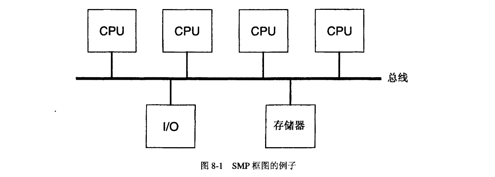
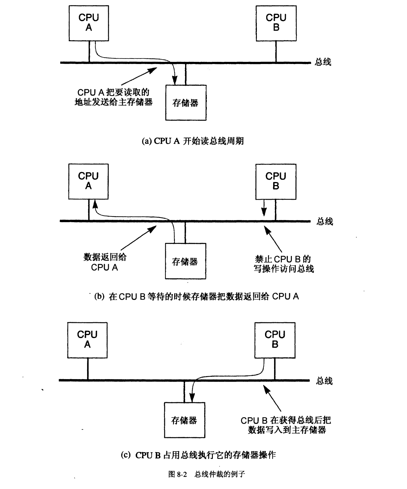
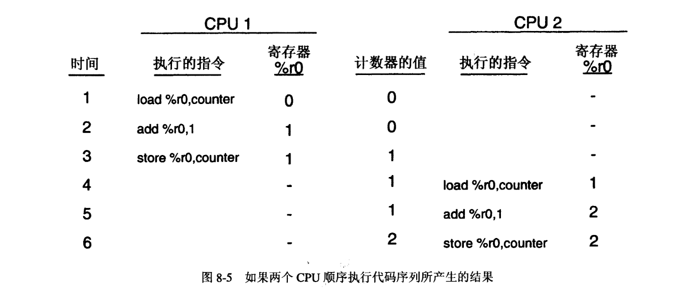
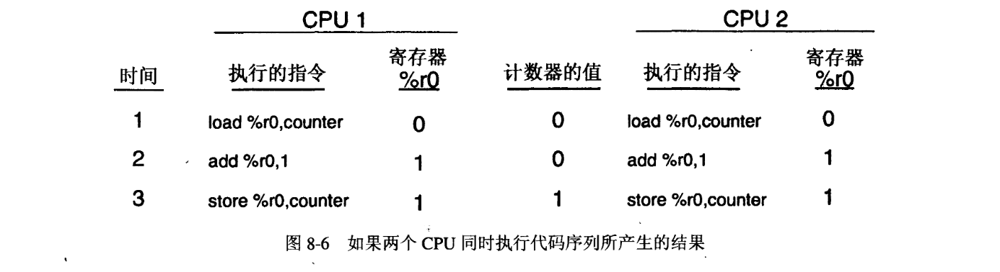
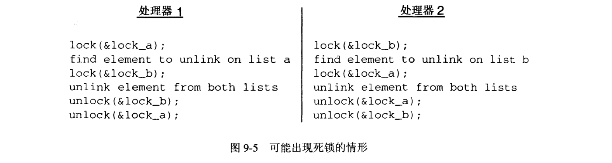
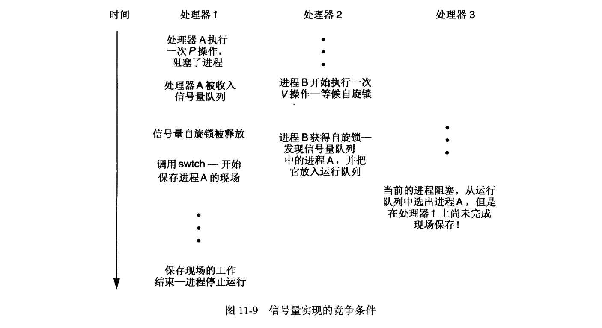
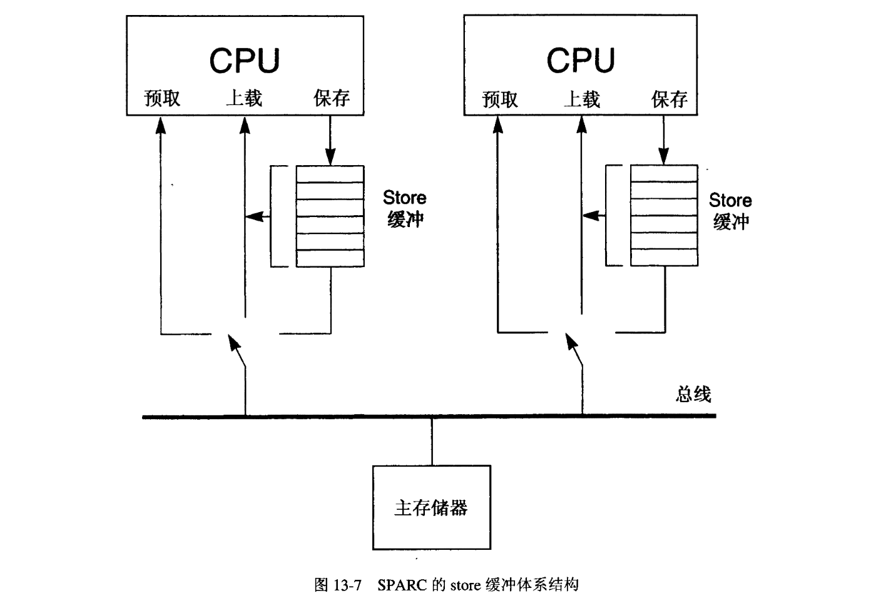
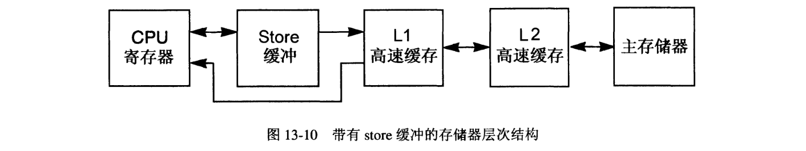

# 第二部分 多处理机系统

## 8 多处理机系统概述
本章介绍紧密耦合、共享存储的对称多处理机 (symmetric multiprocessor), 它将成为本书余下部分的研究焦点。这是 UNIX 系统最长采用的多处理机类型，因为它将标准单处理机 UNIX 内核实现所假定的执行环境并行化了。接下来的各小节介绍它的组成，从而为后面的各章做好准备，后面的各章将要研究如何调整 UNIX 操作系统，使之适合于在这类硬件上运
行。本章从详细描述存储器模型（memory model）入于，接下来介绍了在这些系统上提供互斥机制（mutual exclusion）的问题，并解释了如何在单处理机内核实现上解决这些问题。本书这一部分所介绍的所有多处理机系统在运行时都不带高速缓存，从而更好地展示出多处理机操作系统必须解决的基本问题。多处理机高速缓存机制将在第三部分中详细介绍。

### 8.1 引言
用户一直在追求速度更快、更经济的计算机系统。设计人员能够满足这种需求的一种方法是，通过制造速度更快的单 CPU，从而提高单位时间内能够完成的处理量。这种方法的缺点是，一旦突破了 CPU 性能上的某个阔值，硬件和开发成本的增长速度就会大大超过由此在 CPU 速度上带来的提高。制造速度非常快的 CPU 需要在许多权衡因素之间进行平衡。例如，高速硅晶片技术要有较低的元件密度（component density），对信号同步（ signal synchronization）和传输延迟（propagation relay）的限制日益重要，它还需要更大的功率，会发出更多的热量（有时甚至需要液体致冷）。正因为有这些困难之处，所以设计人员经常会求助于多处理机，将其作为增加计算机系统整体性能的一种选择。

多处理机（multiprocessor, MP）是由两个或者两个以上的 CPU 组合成的单个计算机系统所构成的。采用多处理机的方法以后，设计人员代之以采用多个 CPU 来缓解制造更高速度 CPU 的需要，于是就可以把工作量分布到所有的 CPU 上。如果我们把一个单处理机 (uniprocessor, UP）系统和一个采用相同 CPU 的多处理机系统进行比较，就会发现在执行任
何单一任务的时候，多处理机一般不会比单处理机速度更快，因为 CPU 的速度是相同的，但是它可以在单位时间内并行执行更多的任务。这是多处理机的主要诱人之处：在单位时间内执行多项任务，可以使用比尝试制造能够在相同时间内处理相同任务量的单处理机更为经济的 CPU 技术。此外，可以重新编写一些应用来利用一个MP系统所固有的并行特性。可以将应用划分成一组相互配合的子系统，其中每一个子系统都在不同的处理器上执行。在这种情况下，可以减少运行这一应用所需的时间。例如，科学应用往往就是由一些执行并行化功能的编译器自动地以这样的方式进行细分的。

从立足于市场的观点来看，多处理机机制也具有优势。多处理机系统可以通过调整 CPU 的数量来进行扩展，从而与应用环境相匹配。例如，对于终端用户和客户来说，从单处理机系统或者双处理机系统起步，然后随着其计算需求的扩大而增加 CPU 数量来升级系统，就是一种很吸引人的方案。此外，还有可能提高系统的可用性。如果一个 CPU 发生故障，那么剩余 CPU 就可以继续发挥作用（取决于系统的设计），从而保证了系统的可用性，只是性能会有所降低。这就提供了一定程度的容错（fault tolerance）能力，在诸如在线交易处理这样的环境中，系统停机会造成收入上的损失，就需要容错能力。

#### 8.1.1 MP 操作系统
多处理机操作系统的设计必须要协调好所有 CPU 上同时发生的活动，这是一项比管理单处理机系统更为复杂的任务。正如将会在后面几章中看到的那样，调整单处理机 UNIX 内核实现，使之可以在一个 MP 系统上运行，所需要的修改程度变化范围很大。但是，每一种实现都必须解决 3 个主要领域的问题: **系统完整性 (system integrity)、性能 (performance) 和 外部编程模型 (external programming model)。**

所有的 MP 内核实现都必须保持系统的完整性。这意味着要正确地协调好 CPU 的并行活动，从而避免危害到内核的数据结构。这就保证了系统在所有可能的情况下，不管外部事件以及系统中各 CPU 活动的时间前后如何，都能正常地发挥作用。

一旦有了完整性，那么就可以对实现进行修改和调优，以获得最大的性能。虽然有许多种不同的途径能够获得一个满足系统完整性要求的 MP 内核，但是在如何高效地管理 CPU 并因此影响 MP 系统的整体性能方面，可以采用的不同技术五花八门。接下来的几章内容将突出介绍几种不同的 MP 实现，它们在性能上有很大的不同。

第三个因素，外部编程模型决定了有多个 CPU 会对系统调用接口（它是应用程序接口 (application program interface）的一部分）产生什么样的影响。MP 系统的操作系统设计人员不得不就是否将 MP 系统”伪装“成一个 UP 系统的样子而做出选择。如果系统调用接口和 UP 的系统调用接口兼容，那么己有的单处理机应用程序无需修改就能在 MP 上运行。另一方面，如果系统调用接口不兼容，那么程序就不得不在明确知道系统中有多个 CPU 的情况下进行编写，而且可能需要使用特殊的系统调用来和运行在其他处理器上的进程进行通信，或者向其传送数据。

例如，考虑 UNIX 的进程 ID 号（process ID number）。在一个单处理机系统上，任何进程都能够以这个进程 ID 号来引用任何其他进程。一个没有保持单处理机系统调用接口的 MP 内核实现，为了引用运行在另一个处理器上的进程，除了需要进程 ID 号外，可能还要给出 CPU 号。这种方法的缺点是它丧失了应用的可移植性。

因为重新编写符合新系统调用接口的程序代价很高，所以大多数实现都选择保持单处理机系统调用接口，于是有多个 CPU 的情况就完全透明了（即看不到了）。这是本书中给予考虑的唯一一种实现类型。这并不是说不允许操作系统提供新接口来让程序员利．用 MP 上固有的并行性：这意味着内核必须提供所有业己成为标准的单处理机系统调用接口和设施。

在探讨为了让 UNIX 系统能够在 MP 上运行而需要进行的修改之前，了解多处理机的体系结构以便看到对操作系统的影响是很重要的。

### 8.2 紧密耦合、共享存储的对称多处理机
对于本书接下来的内容来说，感兴趣的多处理机体系结构是紧密相合、共享存储、对称多处理机，经常把它简称为 SMP （因为 SMP 是在本书中所介绍的唯一一种多处理机类型，所以将会互换使用 SMP 和 MP 这两个词）。如前所述，这是最常用的一种 MP 的类型，因为它很容易就可以支持能够保持单处理机外部编程模型的操作系统实现。图 8-1 给出的逻辑框图是一个有 4 个 CPU 的系统。



对于这种类型的多处理机体系结构来说，要了解几个要点。第一，所有的 CPU、存储器和 I/O 都是紧密相合的。做到紧密相合有几种方法，但是最简单也是最常用的方法就是用一个公共高速总线把所有的单元都直接互连起来（这也是本书重点讨论的互连类型）。回忆 6.2.6 小节的内容，那里介绍的一条总线是基于广播的通信介质，它能够一次传输一个字或者更多个字的数据，这就可以让连接到总线上的任何单元和任何其他单元进行高速通信。因为总线高速并行传输许多位数据，所以它的长度是非常有限的。紧密藕合的另一个含义是指所有的部件彼此都在很短的距离之内（通常是在同一个物理机柜中）这一事实。

从图 8-1 中可以很容易地看出共享存储的特点：所有 CPU 和 I/O 设备共用单独一个能够全局访问到的存储模块。 CPU 本身没有局部存储器（local memory) （高速缓存有可能除外），它们把其全部的程序指令和数据都保存在全局共享存储器（global shared memory）中。这里最重要的一点在于，一个 CPU 保存到主存储器中的数据，所有其他 CPU 都可以立即访问到。在第三部分中我们将会看到，每个 CPU 都有自己的局部高速缓存 (local cache），但没有其他的非共享存储器（non-shared memory）。

SMP 体系结构中最后一个重要的方面是存储器访问是对称的，这意味着所有的 CPU 和 I/O 设备都能平等地访问全局共享存储器。存储器中的内容是完全共享的，只要是引用相同的数据，那么所有的 CPU 和设备都使用相同的物理地址。对总线和存储器的访问要进行仲裁，从而保证所有的 CPU 和设备都能有平等的访问权利。此外，它们的访问不会彼此相互干扰。例如，没有必要让运行在一个 CPU 上的程序去关心另一个 CPU 上正在运行的、读写存储器不同部分的程序。多个 CPU 对存储器相同部分的同时访问要进行仲裁，以便让它们不会彼此干扰（这将在 8.3 节中详细讨论）。

注意，I/O 设备由于其位置的原因，也会以一种对称的方式由所有 CPU 共享。这就让所有的 CPU 可以根据需要发起 I/O 操作。还要注意，出于 DMA 的目的， I/O 设备仍然能够完整地访问全部存储器。这意味着 CPU 写的任何数据都可以借助 DMA被发送到 I/O 设备，而且所有的 CPU 都能访问从设备到存储器执行 DMA 操作的结果。因为 I/O 设备是通过同样的共享总线来访问存储器的，所以上面有关 CPU 如何对存储器进行访问的所有讨论都可以直接运用到基于 DMA 的 I/O 设备上。

现在很容易看出，SMP 的体系结构是 6.2.6 小节里介绍的 UP 系统结构在逻辑上的一种扩展：两者的总线、存储器和 I/O 结构都是相同的。通过增加更多的 CPU，就把 UP 系统转变成了 SMP 系统，仿佛是给系统增加了额外的 I/O 卡一样。

在 SMP 系统中可以技入实际工作的最大 CPU 数目受到共享总线和存储器的带宽限制。这个带宽在设计系统的时候就固定下来了，它必须足以满足系统中所有 CPU 和 I/O 设备的需要，否则系统的整体性能就会受损。例如，如果总线和主存储器的带宽为 20 Mb/s，而 I/O 设备需要在一个给定的应用环境中执行 5Mb/s 的 DMA 传输，那么这就给 CPU 剩下了 15Mb/s 的可用带宽。如果每个 CPU 要连续执行指令而没有延迟，需要 3Mb/s 的带宽，那么系统就最多支持 5 个 CPU。如果增加的 CPU 数量超过了这个限度，对存储的请求总量就超过了总线和主存储器能够提供的数量，从而导致请求被拖延。如果我们考虑 CPU 从主存储器取得指令的情况，就会很清楚地看到，任何延迟都会让 CPU 执行指令的速度更慢，因为它在等候存储器提供下一条指令的时候是空闲的。结果，多加的 CPU 并不会提高系统的性能。

在高性能系统的设计中，设计 SMP 系统的总线和主存储器子系统能够向 CPU 和 I/O 设备提供适当的带宽是一个很重要的方面。然而从操作系统的角度来看，它对保持单处理机外部编程模型时所面临的问题没有影响，也对确保操作系统自身正确发挥作用没有影响。因此，后面几章的内容集中讨论 SMP 系统给操作系统带来的问题。

### 8.3 MP 存储器模型
MP 系统的存储器模型定义了 CPU 和运行在它们上面的程序如何访问主存储器，以及其他 CPU 的同时访问会给它们造成怎样的影响。既然采用物理地址访问主存储器，那么虚拟地址转换的影响，包括在使用一个没有映射的虚拟地址时可能发生的任何异常在内，都不会是当作是存储器模型的一部分来考虑，而是由单个 CPU 处理这些活动。相反，存储器模型关注 CPU 和主存储器之间物理地址和数据的传输。

不同的 MP 硬件系统可能会实现不同的存储器模型。操作系统程序员必须透彻地理解一种特殊机器的模型，以便让编写出的操作系统能够正确地运行，而且能保证系统的完整性。不同机器上的存储器模型之间主要的不同之处集中在硬件如何确定 load （上载）和 store （保存）指令的执行顺序上。改变执行的顺序是为了改善性能。存储器模型也确定了多个处理器同时访问相同的存储器位置时该如何进行处理。从 CPU 的角度来看，为了降低成本或者提高速度而选择的总线仲裁策略和（或）主存储子系统的不同实现，是改变存储器模型的主要因素。

SMP 的存储器模型包括上一小节提到的那些特性：存储器是全局访问的、紧密糯合的，也是对称的。于是，模型确定了 load-store 的顺序，以及多个 CPU 同时访问存储器的影响（在继续阅读下去之前，读者可能会希望复习一下 6.2.6 小节中就系统总线进行的介绍性讨论）。

#### 8.3.1 顺序存储模型
最简单和最常用的存储器模型是顺序存储模型（ sequential memo可 model，也称为强定序 (strong ordering）模型）。在这种模型中，CPU 是按照程序次序（program order）来执行所有的 load 和 store 指令的，即**按照它们在程序的顺序指令流中出现的次序来执行**的。而且从主存储子系统和其他 CPU 的角度来看，load 和 store 指令也是顺序对主存储器产生影响的。Motorola MC68000 和 MC88000 系列处理器、Intel 80X86 系列处理器以及 MIPS 系列的 RISC 处理器都采用了这种模型。与此相对照，诸如 SPARC v8 (version U 这样的体系结构把 store 指令所关联的数据发送给主存储器的次序和 store 指令的执行次序不一样，它是非顺序的，因为读取同数据的另一个 CPU 所看到的主存储器内容的变化将不会和保存数据的程序执行指令的次序相同（其他的存储器模型和它们对操作系统的影响将在第 13 章中探讨）。

**除了定义存储器操作是以程序次序来执行的，顺序存储模型还规定它们是原子的**，就像前两节中所描述的那样。为了简单起见，以及因为其常用性，本书在接下来的几章里着重讨论顺序存储模型。所有的例子和讨论都假定使用了这个模型，而且进一步假定编译器(compiler）或者优化器（optimizer）不能改变程序中指令的次序。 8.3.2 和 8.3.3 两小节将介绍为了理解这一简化的存储器模型对操作系统的影响而需要知道的核心内容。大多数系统都采用了各种不同的优化措施来改善性能，同时又不会影响到软件。这些都超出了本书的范围。

#### 8.3.2 原子读和原子写
**顺序存储模型定义从 CPU 或者 I/O 设备（通过 DMA）到主存储器的单次读或者写操作为原子读或者写操作。这样的一次操作一旦开始，就不能被系统上来自 CPU 或者 I/O 设备的任何其他存储器操作所中断，或者受到它们的干扰**（不考虑诸如“split read” 这样的能并行执行多个总线操作的特殊硬件实现技术，因为它们对于操作系统来说是透明的）。由于访问主存储器必须使用一条共享总线，所以轻而易举就能保证存储器操作的原子性（atomicity）。一次只能有一个 CPU（或者 I/O 设备）使用总线。如果多个 CPU 同时希望访问存储器，那么在总线上的特殊硬件要在多个请求方（requestor）之间进行仲裁，以确定接下来允许哪一个来使用总线。在选择了一个请求方之后，就将总线授权给它，并且允许那个 CPU 完成一次原子读或者写操作，这个操作涉及到了主存储器中一个或者更多在物理上连续的字。在这一次操作期间，禁止所有其他的 CPU 和 I/O 设备执行任何它们自己的读操作或者写操作。在完成每一次操作之后，就会重复这个周期：对总线进行仲裁，并授权给另一个 CPU。选择接下来该由哪个 CPU 获得总线，可以使用先入先出（first-in-first-out, FIFO）、循环（round-robin) 或者在总线硬件中实现的任何其他类型的调度机制。最后，所有希望访问主存储器的 CPU 都会获得一个周期，不会让任何 CPU 永远访问不到存储器（要记住一点，SMP 体系结构指定了所有的 CPU 都能平等地访问到主存储器）。I/O 设备的总线仲裁机制和 CPU 是一样的。

图 8-2 给出了一个带有两个处理器的 SMP 系统（为了简单起见，省略了 I/0）。假定处理器 A 希望从主存储器读数据。如果总线处于空闲状态，那么就会允许它立即开始它的总线周期，把要读的数据的地址发送给主存储器（参见图 8-2 中（a）图）。如果 CPU B 尝试在数据正返回给 CPU A 的同时开始一次写操作，那么就会禁止它的操作，直到 A 完成它的周期为止（图（b））。一旦 A 的周期完成，总线仲裁器就会把总线授权给 B，于是允许 B 完成它的存储器操作（图（c））。



在一次操作中能够传输的数据量被限制在能防止一个处理器阻塞总线的数量之内。虽然实际机器中的典型传输量往往等于高速缓存行或者子行的大小，但是操作系统是直接看不到传输量的大小的。既然现在只考虑没有高速缓存的 MP 系统，那么为了简单起见，假定传输量为一个字。

由此可见，在等待总线被授权给 CPU 的时候会引入延迟。从软件的角度来看，如果一条访问存储器的指令在等候轮到它占用总线的时候被拖延了，那么这条指令似乎仅仅是花了更多一些的时间执行而己。这就是为什么对于总线和存储器来说，其带宽要大于或者等于所有CPU和 110设备能够产生的存储器流量之和很重要的原因。如果不是如此，那么 CPU就不能以峰值性能来执行，因为它们在试图访问存储器的时候会被频繁地延迟。无论如何，总线引发的延迟对于运行在系统上的软件来说都是透明的（除了性能之外）。

对于前面的定义，有一点很清楚，那就是如果每个 CPU 只访问主存储器的一部分，这部分存储器不但是唯一的，而且和其他 CPU 所访问的部分无关，那么从软件的角度来看，每个 CPU 就会像它是系统上唯一一个 CPU 那样来执行。多个 CPU 访问相同的共享主存储器单元的事实是不确切的，因为每个 CPU 只访问了其他处理器从不访问的位置（这又再次显示出 SMP 如何成为四系统模型在逻辑上的一个扩展〉。现在，我们必须考虑多个 CPU 同时访问相同位置所带来的影响。

在顺序存储模型中，哪怕是多个 CPU 同时访问主存储器内的同一个字，也要保证是原子操作。例如，如果系统内所有的 CPU 同时发出了写同一个字的指令，那么总线仲裁硬件会禁止除了一个 CPU 之外所有处理器的写操作。这个被选出的 CPU 占用总线，而且允许它完成它的写操作。当它完成以后，总线仲裁器接下来会选择另一个 CPU，允许这个 CPU 执行它
的写操作。和前面一样，这会持续下去，直到所有的写请求都得到满足为止。纯粹的结果就是对存储器的同时访问，无论位置是否相同，始终都被总线仲裁器给顺序化了。从主存储器子系统的角度来看，在任何一点时间上，只会出现一个存储器操作。既然所有的操作都由总线进行了顺序化处理，所以在精确的同一时刻，不可能有两个或者以上的 CPU 能实际写入相同的主存储器（虽然有诸如多端口存储器（multiported memory）和多存储器库（ multiple memory bank）这样的能够并行执行某种存储器操作的特殊硬件技术，但是任何支持顺序存储器模型的系统仍然要保持这里所介绍的存储器操作的原子性）。

虽然存储器操作是原子的和顺序的，但是来自多个 CPU 同时的存储器操作，其相对的次序却并不是确定的。如果正好在同一时刻有两个 CPU 试图向同一个位置执行写操作，那么软件不能就哪一个操作先执行做出任何假定。类似地，如果一个 CPU 正在从一个存储器位置上读取数据，而同时另一个 CPU 向这个位置写入数据，那么读取数据的 CPU 既可以读到这个位置上老的数据，也可以读到新的数据，因为不能保证先发生读操作还是写操作。这种情况称为竞争条件（race condition），我们将在 8.4 节中对其进行更详细的讨论。

#### 8.3.3 原子读-改-写操作
因为在 SMP 系统上经常需要对共享存储器地址的访问进行同步，所以大多数实现都通过原子的读-改-写 (read-modify-write) 操作来对此提供硬件支持。这样的操作能够让 CPU 从主存储器读取一个值，修改它，再把修改过的值保存回存储器中相同的位置，整个过程作为一次原子总线操作。这些操作和前面介绍的正常的存储器和指令取操作（fetch operation）所使用的正规原子读操作和写操作不同。读-改-写操作是作为 CPU 内的特殊指令来实现的，只有在必须要同步的时候才使用。

在读-改-写操作期间对数据所做的修改类型是特定于实现的，但是最常用的是 test-and-set（测试－设置）指令。 Motorola MC68040 和 IBM370 的体系结构就是使用这种操作的处理器的例子。这条指令从主存储器读一个值（通常是一个字节或者一个字），把它和 0 相比较（相应地在处理器中设置条件码），然后无条件地把 1 保存到存储器内的位置上，所有步骤都在一次原子操作中。一旦一条 test-and-set 指令开始了它的总线周期，那么任何其他的 CPU 或者 I/O 设备都不可能访问主存储器。有了这个基本的操作，操作系统就可以建立更高级的同步操作，这将在后面的章节中介绍。

虽然有可能实现更复杂的操作，比如原子递增或者递减操作，但是现代 RISC 系统倾向于提供更简单的操作。例如，可能最简单的一个原子 read-modify-write 指令就是原子交换 (swap-atomic）操作。这种类型的操作用在 Sun SPARC 处理器和 Motorola MC88100 RISC 处理器中，这些处理器没有 MC68040 中的 test-and-set 指令。这样的一条指令仅仅是把保存在寄存器中的一个值和存储器中的一个值进行交换。通过把寄存器中的值设为 1，执行原子的交换操作，然后将寄存器中的值（存储器中原来的值）和 0 相比较，就可以构造出一次测试－设置操作来。下列代码用 C 描述了这个过程。

```
    int test_and_set(volatile int *addr) 
    {
        int old_value;
        old_value = swap_atomic(addr, 1);
        if (old_value == 0)
            return 0;
        return 1;
    }
```

test_and_set 函数的参数是要进行操作的一个字的地址。声明 volatile 告诉编译器，即使函数自身不会改变整数指针 addr所指的值，在函数执行的同时这个值也可以发生变化。在这种情况下，另一个处理器可以同时在相同的位置上执行一次测试-设置操作。**声明一个变量是 volatile 变量就禁止了编译器原本可以进行的代码优化处理**，比如将冗余的 load 或者 store 指令缩入到一次操作中。虽然对于本例来说并非是严格必需的，但是声明所有可能会由多个处理器同时修改的变量为 volatile 的，是一种良好的编程习惯（当访问 I/O 设备的寄存器时，也会用到 volatile 声明）。

继续说明 test-and-set 的例子，假定 swap_atomic 函数只能在其第一个参数所寻址的字上执行 swap-atomic 硬件指令。它在把那个位置上的值和它的第二个参数交换以后，返回那个位置原来的值。这个实现展示出测试-设置操作确实是将两个独立的操作组合到了一条指令中。测试-设置第一个阶段是取得字的当前值，再用 1 替换它，这是原子操作。第二个阶段是测试在第一个阶段取得的值。RISC 对此的解决方法是使用独立的、更为简单的指令，从而简化了硬件设计。

有些 RISC 体系结构对此做了进→步的简化，它们提供了一对指令，一起使用这一对指令就能执行一次原子的读-改-写操作，这对指令是 load-linked 和 store-conditional。load-linked 指令执行原子的读-改-写操作的前半部分，它从存储器读取一个值（通常是一个字），在硬件中设置一个标志，指出那个位置上正在进行一次读－改－写操作（这个标志通常由高速缓存控制器来维护，对于软件来说不可见）。使用 store-conditional 指令把任何期望的值保存回读取该值的存储器位置，但是只有在仍然设置了硬件标志的时候才这么做，从而完成读－改－写操作。自从执行了 load-linked 指令以来，任何 CPU 或者 I/O 设备对该位置所做的任何保存操作都会清除掉这个标志。因此，如果 store-conditional 指令发现标志还在，它就得到保证，自从完成 load-linked 指令以后，那个位置没有改变过，而且对于相关的存储器位置
来说，从 load-linked 开始到 store-conditional 结束的整个指令序列是以原子的方式执行的。于是，可以使用这两条基本的指令构造出更多复杂的原子操作。

### 8.4 互斥
既然顺序存储模型不能保证来自一个以上的 CPU 同时读和写相同的存储器位置时有确定性的次序，那么没有哪个共享的数据结构被一个以上的 CPU 同时更新而不会有破坏数据的风险。次序的不确定性就会导致出现竞争条件。只要 SMP 中一组操作的结果要取决于两个或者两个以上处理器之间操作的相对次序或者时序，那么就会发生竞争条件。对于内核数据结构的完整性来说，这种不确定的行为可能是灾难性的，必须要防止其出现。

为了举例说明这个问题，考虑这样的情况，在一个双 CPU 的系统中有一个全局计数器，任何一个 CPU 都能在各个时间点上使之增加 1。假定这个计数器必须准确地反映出由两个 CPU 执行的所有递增操作之和（也就是说，一次也不能少）。再假定系统使用 load-store 体系结构，这意味着算术指令（以及大多数其他指令）的操作数和结果都必须在寄存器中，并且采用 load 和 store 指令在寄存器和存储器之间移动。因此，为了使内存中一个位置的值加 1，需要下列代码中所示的 3 条指令的序列。这个序列以伪汇编语言给出，其中的符号 %r0 用于表示寄存器 0, counter 表示全局计数器在主存储器中的值。因为 MP 系统中每个 CPU 都有它自己的一组寄存器，所以 %r0 表示正在执行指令的 CPU 上的寄存器 0 。
```
    load %r0, counter
    add  %r0, 1
    store %ro, counter
```

下图中的时间序列显示了 counter 在主存储器内的内容，以及每个 CPU 的寄存器 0 的内容。假定每个 CPU 在每个时间间隔内执行一条指令。对于本例来说，考虑这样的情况，CPU  1 先执行上述的代码片段中所有 3 条指令，然后是 CPU 2（在一列中出现的短划线表示在那个时间点上，这个地方的值与本例无关）。



在这种情况下， counter 的结果值是正确的：该值最初为 0，递增两次（每个 CPU 一次），最后得出值为 2。只要两个 CPU 从没有同时执行过 3 条指令的序列，那么 counter 的值就一定是正确的。如果它们同时执行过，那么就会出现图 8-6 中的结果。在这里我们看到，counter 在主存储器中的值是不正确的。值为 1 而不是 2，这意味着少记了一次递增操作。之所以出现这样的情况，是因为两个 CPU 都从主存储器取得了 counter 的原始值，而没有意识到在另一个 CPU上也正在同时进行递增操作。在这样的场合下，就称处理器彼此竞争，因为结果取决于首先执行完代码序列的那个处理器。



任何更新在两个或者两个以上处理器之间共享的变量或者数据结构的指令序列都能导致出现一种竞争条件。指令序列本身被称为临界段（critical section），它们操作的数据称为临界资源（critical resource）。一个临界段既可以像上述代码中 3 条指令的序列那么短，也可以包含大段代码。为了消除由多个处理器同时执行临界段所造成的竞争条件，一次至多有一个处理器在临界段内执行。这被称为互斥（mutual exclusion），并且能够以多种方式来实现。

在继续展示如何在 MP 系统中实现互斥之前，回顾一下它在单处理机 UNIX 系统上是如何实现的，以及这些技术为什么在 MP 上不能使用，会对我们有所帮助。在后面几章中我们将介绍几种能够在 MP 系统上实现的技术。

### 8.5 回顾单处理机 Unix 系统上的互斥
即使是在单处理机的操作系统上也可能有竞争条件。任何允许多个控制线程的系统，如多进程，都需要考虑线程之间的互斥。由中断处理程序（interrupt handler）所执行的指令也有可能同它们所中断的代码发生竞争。

下面几个小节回顾了在单处理机 UNIX 系统上互斥实现的重要方面。这些系统按照互斥的类型把它们对这个问题的处理分成了 3类，这 3 类是**短期互斥 (short-term mutual exclusion)、和中断的互斥 (mutual exclusion with interrupts) 以及长期互斥 (long-term mutual exclusion)。**

#### 8.5.1 短期互斥
**短期互斥是指防止短临界段中的竞争条件**，比如 8.4 节中介绍的临界段。当内核正处于更新其数据结构之一的期间，就会发生这样的临界段。因为内核的数据结构是由所有正在执行的进程所共享的，如果两个或者两个以上正以内核态执行的进程要同时更新相同的数据结构，就可能出现一个竞争条件。因为单处理机一次只能执行一个进程，所以只有在内核中执行的一个进程能够被另一个抢先时，才有可能出现这样的竞争条件。这就是为什么 UNIX 内核的设计者选择让内核在以内核态执行时为非抢先的原因。回忆 1.2 节的内容，以内核态执行的进程没有分时间片执行，不能被抢先。只有当内核态的进程允许时，才能从当前进程的现场切换到另外一个进程。

以内核态执行的进程非抢先的规则大大地降低了单处理机 UNIX 内核实现的复杂度。因为一次只允许一个进程在内核中运行，而且决不会被抢先，所以在检查和更新内核数据结构的同时不会出现竞争条件。因此，比如像在 8.4 节中所介绍的计数器例子这样的情况，无需做更多的工作就可以保持数据结构的完整性。

#### 8.5.2 和中断处理程序的互斥
如果一个中断处理程序执行的代码访问或者更新了由非中断的代码 (通常称为基准代码 (base-level code) 使用的同一数据结构，那么就会出现竞争条件。例如，以内核态执行的一个进程在执行上述代码序列时发生了一次中断。如果中断处理代码也试图让同一个计数器加 1，那么可能会出现和 MP 的情形一样的错误结果。幸运的是，得到允许以内核态执行的进程会临时禁止中断。因此，只要基准代码要更新一个与中断处理程序共享的数据结构，那么它就首先禁止中断，执行临界段，然后再重新允许中断。禁止和允许中断的动作就实现了互斥。在单处理机 UNIX 内核中， spl 函数提供了允许和禁止中断的于段。 spl 代表 Set Priority Level（设置优先级），它是指把中断优先级设低，让处理器忽略中断。例如，图 8-7 显示了一段 C 代码，它能正确地保护 counter 的递增操作不受所有可能的中断影响。

```
    s = splhi();
    counter++;
    splx(s);
    
    // 保护临界段不受中断影响
```

splhi 函数屏蔽了所有中断（把中断优先级设置为最高级）。直到另一次对 spl 函数的显式调用消除对中断的屏蔽之前，都会一直保持对中断的屏蔽。因为来自不同设备的中断可能处于不同的优先级，所以用来屏蔽中断的 spl 函数会返回过去的优先级，以便在临界段完成的时候能恢复它。现在就能安全地递增计数器而不会和中断处理程序中的代码发生竞争。 splhi
返回的以前的优先级则用 splx 函数予以恢复。

重要的是理解这种互斥的实现和短期互斥的实现之间有什么不间。在采用短期互斥的情况下，实现内核态进程非抢先的一般性策略就能解决问题，而无需显式地把它编码入内核。在采用中断互斥的情况下，互斥必须通过使用 spl 函数显式地编码入算法中。

#### 8.5.3 长期互斥
从用户程序的角度来看，大多数 UNIX 系统调用提供的服务部保证是原子操作。例如，一旦对一个普通文件（regular file）开始执行系统调用 write，那么操作系统就一定会保持住对同一文件的任何其他 read 或者 write 系统调用，直到当前的系统调用完成为止（有了这种文件操作的互斥，编写针对共享文件的有确定性的用户程序就更加容易了）。为了完成系统调用 write，可能需要一次或者更多的磁盘 I/O 操作。磁盘 I/O 操作与 CPU 能够在同期内完成的工作量相比，是相当长的操作。因此，在这样长的操作上使用非抢先策略是非常不可取的，因为在等候 I/O 操作完成之前， CPU 会处于等候状态。为了避免出现这样的情况，执行系统调用 write 的进程需要让它们自己被抢先，以便能够运行其他进程。不过，一旦允许抢先，那么就需要有一种技术能防止友起对同一文件的其他 read 和 write 调用。单处理机 UNIX 内核以 sleep 和 wakeup 函数实现这种类型的互斥。

**函数 sleep 是一个内部的内核例程（只能由以内核态执行的进程使用），它能挂起调用它的进程，直到指定的事件发生为止。这是一个以内核态执行的进程自愿让出控制权，允许自己被抢先的重要于段。函数 wakeup 用于发出→个特殊事件已经出现的信号，它使得所有等候该事件的进程都被唤醒，并放回到运行队列中。事件用一个任意的整数值来表示，它往往是和该事件相关的内核数据结构的地址。我们以下面的例子来说明使用 sleep 和 wakeup 函数实现长期互斥的技术。**

内核中每个要求长期互斥的对象都用一个数据结构的实例来表示。要在对象上实现原子操作，就要“锁住”该对象，以便一次仅让一个进程访问它。通过给数据结构增加一个标志，如果对象当前上了锁，那么设置这个标志就可以做到这→点。为了简单起见，假定这个标志保存在对象的数据结构中某个字节里，于是每个数据结构都有一个唯一的标志。下述代码展示了－种在任意一个对象上实现互斥的可能途径（在不同的 UNIX 系统版本上，实际的细节也不同，但和这里的讨论不相关）。

```
    void lock_object(char* flag_ptr)
    {
        while(*flag_ptr)
            sleep(flag_ptr);
            *flag_ptr = 1;
    }
```

在这个例子中，标志被设置为 1 表明一个进程现在锁住了对象。在原子操作开始的时候，调用函数 lock_object，通过传递→个指向与之相关联的标志字节的指针来锁住对象。如果对象当前没有被锁住，那么 while 语句中的条件不满足，进程就通过设置标志来锁住对象（之所以需要使用一个 while 循环将在后面解释）。现在，进程可以继续执行操作，自愿地使它自己抢先，比如在原子文件操作的情况下等候磁盘 1/0 完成，而且确保在第一个进程明确地解锁之前，不会有其他进程能够成功地锁定对象。尝试访问同－个对象的任何其他进程都使用同样的数据结构，并且以同样的标志字节地址调用 lock_object 函数来尝试锁住它。但是，这一次 while语句中的条件为真，那么进程将执行 sleep 调用，这个调用会挂起进程。

重要的是要理解测试标志、发现它被清除以及设置它的操作构成了一个临界段，而且必须采用互斥来处理它。否则就有可能出现竞争条件，从而导致出现两个或者两个以上的进程认为它们都锁住了对象的情况。幸运的是，单处理机的非抢先策略（nonpreemptability policy) 防止了竞争条件的出现。

注意， sleep 函数中是标志自身的地址。使用对象所关联的数据结构的地址来标识事件是内核中到处使用的一种普遍约定。之所以采用这样的约定，是因为它能轻而易举地让等候不同对象上的锁的进程在不同的事件上睡眠。那样一来，在某个特殊的锁被打开的时候，只有正在等候该锁的进程才会被唤醒（而不是唤醒等候任何锁的所有进程）。

函数 sleep 本身只需要执行几个简单的操作就能挂起调用它的进程。它首先在一张表中记录下事件，以便随后的 wakeup 操作能确定该唤醒哪些进程。然后它执行一次现场切换，选择执行另一个进程。现在调用 sleep 的进程不再运行了，直到它被唤醒为止（注意，在实际的 UNIX 内核实现中，函数 sleep 有另一个参数，它指定进程被唤醒的时候应该运行的优先级。因为它并不影响互斥，所以为简单起见就省略掉了）。

当保持锁的进程完成了它在对象上的原子操作之后，它就会按照下述代码那样调用函数。
```
    void unlock_object(char * flag_ptr)
    {
        *flag_ptr = 0;
        wakeup(flag_ptr);
    }

    // 解开一个对象上的锁
```

在这里清除了标志，使用函数 wakeup唤醒所有等候该锁的进程。传递给 wakeup 的事件必须和 sleep 函数使用的事件相吻合，以便可以唤醒正确的进程（即那些正在等候这个特殊锁的进程）。要唤醒一个进程，wakeup搜索 sleep 记录哪些进程在哪些事件上睡眠的那张表，将所有符合给定事件的进程放入运行队列。函数 wakeup 的一个重要方面是调用它不必知道实际上是否有任何进程在该事件上睡眠。如果 wakeup 发现没有进程等在－个事件上，那么它就什么也不做，直接返回。以后在同一事件上睡眠的进程也一定会被挂起，而不管在上一次 wakeup 操作期间发生了什么事情。

当上述代码中睡眠的进程被唤醒，随后由调度器（scheduler）选择执行的时候，它就接着从它上次停止的地方开始执行，即在函数 sleep 中发生现场切换的地方。此刻， sleep 就返回了调用它的函数。重新开始检查 while 循环，如果所需的锁仍然是打开的，那么循环终止，进程就获得了自己的锁。如果再次发现对象是被锁定的，那么进程就返回去睡眠，等待被持有锁的新进程唤醒。这可以在两种不同的情况下发生。第一种情况是当已经被唤醒的进程正在运行队列上等候它的时间片的时候，另一个进程出来锁住了对象。第二种情况是有多个进程在等待同样的锁。因为 wakeup 操作没有记忆，所以 wakeup 函数必须唤醒在同一事件上睡眠的所有进程。它们都被放入到运行队列，按照调度器对它们的选择顺序执行。第一个要运行的进程会发现锁被释放了，并且成功地锁定了它。如果为同样的事件而被唤醒的其他进程之一在第一个进程释放锁之前要运行，它会发现己经上锁了，所以就回去睡眠。当它被唤醒的时候，它将再次尝试获得锁。这就是为什么 lock_object 函数必须包含一个 while 循环的原因。现在可以看到， lock_object 和 unlock_object 函数向它们所括起来的代码段提供了长期互斥功能。和非抢先策略所提供的短期互斥不同，这种类型的互斥必须明确地编码在内核中。

### 8.6 在 MP 上使用 UP 互斥策略的问题
为了获得一个高性能的 MP 系统，需要让系统调用和其他内核活动出现在所有的处理器上。这样－来，内核的工作量就可以分摊到整个系统上。遗憾的是，前面各小节介绍的技术虽然能够让单处理机内核实现避免竞争条件，但是却不能在 MP 系统上有→个以上的处理器可以同时执行内核代码的时候正确地工作。原因如下，这些问题的解决方法则在以后的章节中介绍。

让单处理机内核不能在 MP 系统上正确运行的主要困难在于，在内核中同时执行的多个处理器违反了支持短期互斥的假定。通过使用内核进程的非抢先策略， UP 系统能够避免许多竞争条件。即使－个 MP 系统上的内核能防止在一个特殊处理器上的某个进程被另一个进程抢先，在另一个处理器上启动系统调用的进程也能够造成和 8.4 节所描述的竞争条件一样的情况。→旦有→个以上的进程以内核态开始执行，那么除非采取额外的措施来防止竞争，否则内核的数据结构就会被破坏。

在 MP 系统上，和中断处理程序的互斥也可能不会发挥正常的功能。**函数 spl 只会影响其执行所在处理器的处理器优先级，而不会影响传递给其他处理器的中断。**根据硬件设计的不同，中断可以传递给系统中的任何一个 CPU，或者它们也可以始终被定向到一个 CPU。无论是这两种情况的哪一种，在一个处理器上执行的进程，当它使用 spl 函数在与中断处理程序共享的数据结构上实现互斥时，如果中断处理程序开始在一个不同的处理器上执行，那么它就不能真正保护数据。

最后，在 MP 系统上，以 sleep 和 wakeup 函数实现长期互斥所采用的编码技术也不能正确工作。回忆 8.5.3 小节的内容，lock_object 的实现要依靠短期互斥来防止在测试标志和进程要么开始 sleep 要么设置标志本身之间的时间内出现竞争条件。因为短期互斥策略在 MP 上不再起作用，所以这些代码序列现在可以包含竞争。例如，考虑这样的情况，两个在不同处理器上的进程同时开始执行图 8-8 中的 lock_object 函数。假定当前没有上锁，它们两者都检测标志，然后发现标志被清除了，那么它们将开始设置标志，继续执行。每个进程接下来都会认为它获得了锁，因而违反了互斥的策略。

在 lock_object 和 unlock_object之间也可以有竞争条件。一个进程执行 lock一object 来检测标志，并且发现它被设置了，正好另一个进程要释放这个锁。假如在第一个进程检测锁和开始执行 sleep 函数之间，第二个进程释放了锁。在这种情况下，释放锁的时候调用的 wakeup 函数什么也不会做，因为刚才要锁住对象的进程还没有睡眠昵。当第一个进程调用 sleep 的时候，即使现在锁已经解开了，它还是会被挂起。注意，现在没有进程会唤醒它（没有哪个进程占有锁，因此也就没有哪个进程会调用 unlock_o均ect）。这个进程继续睡眠，直到另一个进程试图获得同－个锁为止。这个新进程将会发现锁是解开的，于是不必睡眠就能获得锁。当它最终释放锁的时候， wakeup才会让第→个进程再次运行。因为不能保证第一个进程为此要等候多长时间，所以必须通过消除竞争条件来防止出现这种情况。

在接下来的 3 章里，我们将介绍防止这些问题的 3种重要技术。为了防止所有可能的竞争条件，它们对内核所必须进行的修改程度也不同。

### 8.7 小结
SMP 是最常用的多处理机系统类型，因为它将单处理机系统的执行环境并行化了。这类 MP 系统的重要特点是所有的CPU 和 I/O 设备都是紧密藕合的，它们共享一个公共的全局主存储器，而且对称和平等地访问存储器。大多数 MP 内核的实现都保留了单处理机的外部编程模型，从而使得应用程序无需修改就可以在 XP 上运行。

MP 的存储器模型描述了 load-store 指令在一个程序中的次序，以及多个 CPU 同时访问主存储器时结果如何。顺序存储模型提供的原子读和写操作要按照程序次序在每个 CPU 上执行，但是它没有为多个 CPU 同时访问相同存储器位置的操作指定相对次序。正因为如此，顺序存储模型通常会提供某种类型的原子读－改－写操作，CPU 可以将其用于同步的目的。

对共享位置的存储器操作缺乏确定的次序会导致出现竞争条件。对共享的存储器位置或者数据结构的任何多指令操作，比如一次递增操作或者给－个链表增加一个元素，都很容易造成竞争，因为多个处理器会同时试图执行这项操作。为了防止出现竞争，内核必须实现互斥机制来使对共享数据的访问顺序化，从而防止数据遭到破坏。

为了简化单处理机 UNIX 内核系统的设计，就要依靠这一事实，即以内核态执行的进程是非抢先的。这个事实消除了大多数竞争条件，因为在当前执行的进程自愿放弃 CPU 之前，不会有别的进程能访问任何内核数据。使用显式的锁，并且调用 sleep 和 wakeup 函数，就能实现长期互斥（例如，支持原子文件操作所需要的）。和中断处理程序的互斥则通过在基准内核代码中出现临界段期间显式地屏蔽和开通中断来实现。但是，当内核代码可以在一个以上处理器上同时执行的时候，这些策略都不能在 MP 系统上提供互斥。

## 9 主从处理机内核
本章介绍修改单处理机内核实现，使之没有竞争条件地运行在 SMP 系统上所采用的的最简单的技术: 主从处理机内核 (master-slave kernel)。本章还介绍一种称为自旋锁 (spin lock) 的 SMP 互斥原语，用它们重建的短期互斥能够防止出现上一章所描述的问题。接下来介绍 MP 内核中出现死锁 (deadlock) 的原因，以及用来避免它们的技术。最后介绍实现一个主从系统必须对内核进行的改动，然后讨论对性能带来的影响。

### 9.1 引言
8.5.1 小节中介绍的短期互斥实现技术是构造单处理机 UNIX 内核实现的主要基础之一，它不需要把明确的上锁代码编入内核中的许多地方。没有了这一点，当访问和更新内核数据结构的时候就可能出现竞争条件。仅有这一项技术还不足以在 SMP 系统上防止两个或者两个以上的进程同时在系统中不同的处理器上执行时出现竞争条件。即使允许内核进程非抢先，多个处理器同时执行的内核活动仍然会导致出现竞争。防止这类竞争可以使用几种方法，有些方法需要对内核进行大规模的修改。本章考虑在 MP 系统上恢复单处理机非抢先要求的最简单的技术，把它作为更复杂实现的入门。

第 8 章的短期互斥技术依赖于这样的事实，即在内核中决不会有一个以上的进程同时执行，在 MP 系统上做到这一点的一项简单技术是要求所有的内核活动都在一个物理处理器上执行，这个处理器称为主处理器（master）。系统中所有其他的处理器都称为从处理器（slave），它们只能执行用户代码。以用户态执行的进程可以在系统中的任何处理器上执行。但是，当进程执行一次系统调用的时候，它就切换到主处理器上。一旦系统调用完成，进程就可以再次在任何处理器上运行。运行在处理器上的用户态进程所产生的任何陷阱（比如缺页错或者算数异常）也会使得进程切换到主处理器上，因此还要维护内核陷阱处理程序（kernel trap handler) 的互斥要求。最后，所有的设备驱动程序（device driver）和设备中断处理程序（device interrupt handler）只能在主处理器上运行。

从内核的角度来看，主从处理机的编排保留了单处理机执行环境。这就能让单处理机的内核实现只需要很少的修改就可以在 MP 系统上运行，而且可以在任意数量的处理器上执行。要修改的重要领域之一就是如何将进程分配给各个处理器。有一项简单技术可以做这件事情，即有两个独立的运行队列，一个包含必须运行在主处理器上的内核态进程，而一个包含运行在从处理器上的用户态进程。在每次现场切换的时候，每个从处理器选择在从运行队列（slave run queue）中有最高优先级的进程，而主处理器选择在内核进程队列（kernel process queue) 中有最高优先级的进程。运行在从处理器上的进程在执行一次系统调用或者产生一次陷阱的时候就被放入主处理器的运行队列。当主处理器执行一次现场切换的时候，它正在执行的老进程如果是以用户态执行的，那么就把它放入从队列（slave queue）：否则，它就返回主队列（master queue）。

因为有多个处理器同时把进程排入队列、取出队列或者在队列中搜索进程，所以需要有一种方法来防止竞争条件。运行队列（run queue）是唯一需要显式 MP 短期互斥技术的数据结构，因为通过让所有的内核代码运行在主处理器，就可以保护所有其他的数据结构。采用自旋锁（spin lock）是提供这样的短期互斥的最简单方法。

### 9.2 自旋锻
自旋锁是一种 MP短期互斥机制，它可以用来防止在代码的短临界段期间发生竞争条件。和第 8章中屏蔽中断和实现长期互斥的函数一样，在进入临界段之前要获得自旋锁，而在临界段完成之后要释放它。自旋锁得名于这样的事实，**一个进程在等候另一个进程正在使用的锁时就会处于忙等待（busy-wait，在一个循环中自旋）状态。**

自旋锁是实现一个主从处理机内核所需的唯一 MP 原语操作（ primitive operation）。正如在后面的章节中将要看到的那样，不同的内核实现可能会使用其他类型的原语。保护短临界段的自旋锁的简单性和高效性使得它们在这些实现中也会派上用场。在存储器中使用一个字，由它反映出锁的当前状态，就可以实现自旋锁。当一个特殊的进程能够把自旋锁的状态以原子方式从开锁（unlocked）状态转变为上锁 Oocked）状态时，那个进程就需要独占使用它。必须以一次原子操作来做到这一点，以确保一次只有一个进程能够获得锁。对于下面的例子来说， 0 值用来表示自旋锁的开锁状态。所有的例程都接受一个指向自旋锁状态字的指针，在它上面执行操作。于是可以使用下述代码中的例程来初始化一
个自旋锁以及用原子方式锁定一个自旋锁。

```
    typedef int lock_t;
    void initlock(volatile lock_t *lock_status) 
    {
        *lock_status = 0;
    }

    // 初始化一个自旋锁
```

```
    void lock(volatile lock_t *lock_status)
    {
        while (test_ans_set(lock_status) == 1);
    }

    // 以原子方式锁定一个自旋锁
```

上述函数通过以原子方式把自旋锁的状态从 0 变为 1 来锁住它。如果锁的状态已经是 1 了（意味着这个锁正在由另外一个进程使用），那么 test_and_set 函数就返回 1，并且处理器在循环中自旋，直到该锁被释放为止。只要把锁的状态设置位 0，就可以释放锁。如下述代码。

```
    void unlock(volatile lock_t *lock_status)
    {
        *lock_status = 0;
    }

    // 解开一个自旋锁
```

自旋锁可以在有任何数量处理器的系统上正常工作。如果多个处理器恰好同时试图获得同一个自旋锁，那么 test_and_set 函数的原子特性就可以一次只让一个处理器把锁的状态从 0 改为 1。其他进程会看到锁己经被设为 1 了，从而进入自旋，直到拥有锁的进程释放它为止。现在，内核可以用 lock 和 unlock 函数调用构成一个临界段。

```
    lock(&spin_lock);
    perform critical section
    unlock(&spin_lock);

    // 采用自旋锁实现一个临界区
```

如果临界区较短（通常不超过几百行机器指令），那么自旋锁就可以工作良好。不应该把它们当做一种长期互斥技术来使用，因为等候锁的处理器在自旋期间什么有用的工作也不做。如果处理器在等待获得锁上花费了太多时间，那么系统的整体性能就会降低。如果有许多处理器频繁地争用相同的锁，也会发生这样的情况。

减少对锁的争用可以采用两种办法。第一，内核可以针对不同的临界资源使用不同的自旋锁，这就防止了处理器在没有竞争条件威胁的时候被另一个处理器挂起。第二，应该增强 lock 和 unlock 函数，在上锁的时候屏蔽中断。否则，在处理器获得一个自旋锁的同时所出现的中断会进一步拖延其他进程等候那个锁的时间（而且可能导致死锁，下一小节介绍）。

### 9.3 死锁
当一个处理器试图一次获得一种以上资源的独占使用权时，必须小心处理，否则就可能出现死锁。当两个或者两个以上的处理器彼此占有对方所需要的资源，而彼此又等待对方释放所占有的资源时，就会发生死锁。例如，考虑这样一个数据结构，它的每个元素都在两个独立的链表上。假定使用独立的自旋锁来保护每个列表，以便能够独立地访问它们。再假定某个操作要求遍历一个列表所检索到的元素必须从两个列表中断开链接，而且必须以一次原子操作来完成。这意味着在消除一个元素的链接时必须同时拥有两个列表的锁。如果通过先获得要遍历的列表的锁，再尝试获得另一个列表的锁来实现，那么就可能造成死锁。当两个进程的每一个都从遍历另一个列表开始操作的时候，如图 9-5 所示，就可能出现这种情况。



如果两个进程恰好同时开始执行它们各自的代码片段，那么处理器 1 就获得 lock_a，处理器 2 获得 lock_b。接着，处理器 1 忙等待 lock_b，而处理器 2忙等待 lock_aa 既然两个处理器都不会放弃它己经获得的锁，那么两个处理器就会在尝试获得另一个锁的循环中永远自旋下去。现在，这两个处理器己经死锁住了。**这种特殊的死锁情形称为 AB-BA 死锁，它是指这一事实，即两个处理器试图以相反的顺序获得对方的锁。这种动作一定会造成潜在的死锁状态。**

注意，死锁是否真正发生取决于两个处理器之间的相对时间顺醋。如果处理器 1 和处理器 2 其中之一能在对方开始执行之前完成其代码序列的话（如图 9-5 所示），就不会造成死锁。

为了防止发生这类死锁，所有的处理器都必须以相同的次序获得嵌套锁（nested lock) , 即顺序获得且同时占有的锁。更改前面例子中的代码，结果为如下的代码序列，任何处理器一且要开始执行一次操作，从两个列表中以原子方式断开一个元素的链接时，就可以执行这段代码。
```
    lock(&lock_a);
    lock(&lock_b);
    find element to unlink on list a or b
    unlink element from both lists
    unlock(&lock_b);
    unlock(&lock_a);

    // 修改算法，防止死锁
```

注意，无论哪一个链表，在不会马上执行一次原子断开链接操作的情况下，只要获得该链表的锁，就仍然可以遍历它。即使另一个进程同时执行一次原子的断开链接操作，也不可能出现死锁。总而言之，防止 AB-BA 死锁的关键在于，所有的处理器都以完全相同的次序获得和释放嵌套锁。当涉及到 3 个或者更多锁的时候也是如此：只要在获得和释放锁的时候保持相同的次序，那么就不会出现死锁。

在别的情况下使用自旋锁时也可能会出现死锁。例如，如果一个占有自旋锁的进程要执行一次现场切换，那么任何试图获得同一个锁的处理器就会保持自旋，直到占有锁的进程再次恢复运行，并且释放了锁为止。从性能的立足点来看，不希望出现这样的情况，因为其他处理器会自旋任意长的一段时间，但更糟糕的是，它们也能导致死锁。如果系统中所有的处理器都试图获得一个己经被现场切换出去的进程所占有的自旋锁，那么就可能发生这种情况。一旦处理器开始为锁而自旋，那么它们就再也不能执行现场切换了。这意味着占有自旋锁的进程不可能重获执行，因而它再也没有机会释放锁了。所有的处理器将会永远自旋下去，死锁住系统。为了防止发生这种死锁问题，不允许一个进程跨越现场切换还能占有一个自旋锁。

在采用自旋锁时出现死锁的另一种情形是基准内核代码和一个中断处理程序使用了同样的自旋锁。如果一个处理器已经锁住了自旋锁，而且在该处理器上发生了一次中断，那么如果中断处理程序企图获得同一个锁，就会导致死锁。处理器会在中断级上永远自旋下去，因为被中断的进程再也没有机会释放锁了。出于这个原因，当一个中断处理程序要使用的自旋锁被基准内核代码占有的时候，就必须屏蔽中断的发生。

一个试图两次获得同一个锁的进程自身也可以导致一次死锁。和前面的情况一样，进程也会在第二次尝试获得同一个锁的时候永远自旋下去。有些实现修改了自旋锁原语，以检查二个进程是否两次锁定了同一个锁（称为递归上锁（ recursive locking) ），如果进程己经获得了这个锁，那么就跳过此次操作。进程能够记录已经尝试过的递归上锁的次数，以便在实际释放自旋锁之前必须执行同等数量的解锁操作。这就能让嵌套的过程获得锁，而又无需知道上一层执行了什么样的上锁操作。本书里的实现和例子没有依靠这样的技术，所以就不进一步考虑它们了。

### 9.4 主从处理机内核的实现
在采用一个主从处理机内核实现的情况下，唯一的临界资源（critical resource）就是两个运行队列。向两个队列加入进程和从两个队列取出进程的操作都必须采用互斥来完成，以防队列被破坏。用一个自旋锁来保护每个队列就能轻而易举地达到这个目的。

#### 9.4.1 运行队列的实现
假定每个运行队列都作为一个无序链表（unsorted linked list) 来实现（优先级队列是一种更好的实现，但是简单的无序链表能让这个例子集中在问题的互斥方面）。将队列中进程的进程表项连接起来就构成了链表。在这些信息中，进程表项包含有进程的优先级和一个指向链表中下一个元素的指针。为了防止不必要的争用，为主运行队列和从运行队列使用单独的自旋锁。下述代码展示了这些数据结构的定义。

```
    typedef struct proc proc_t;
    typedef struct queue queue_t;

    struct proc {
        proc_t p_next;      // 运行队列中的下一个进程
        int p_pri;          // 进程优先级
        ...
    };

    struct queue {
        lock_t q_lock;      // 保护队列的锁
        proc_t q_head;      // 运行队列的开头
    };

    queue_t master_queue;
    queue_t slave_queue;

    // 主从运行队列的声明
```

结构 queue 的定义展示出 MP 内核找那个使用的一种典型的编码技术: 将一个临界资源和保护它的锁组合到一个数据结构中。在系统启动时初始化两个队列所采用的的例程如下代码所示。
```
    void init_queue(queue_t *q) 
    {
        initlock(&q->q_lock);
        q->q_head = NULL;
    }

    init_queue(&master_queue);
    init_queue(&slave_queue);

    // 初始化一个运行队列
```

接着可以用下面所示的代码把一个进程放入队列之一。系统中的任何处理器都能在任何时刻调用函数 enqueue，因为自旋锁可以防止在处理运行队列的时候可能发生的一切竞争条件。

```
    void enqueue(queue_t *q, proc_t* p) 
    {
        int s;
        s = splhi();
        lock(&q->q_lock);
        p->p_next = q->q_head;
        q->q_head = p;
        unlock(&q->q_lock);
        splx(s);
    }

    // 将一个进程排入到运行队列中
```

在占有自旋锁的同时调用 splhi 可以屏蔽所有的中断，这就防止了同使得进程可以运行的中断处理程序发生竞争。例如，当一次 I/O 操作完成，让等待 I/O 的进程被放回到运行队列中的时候，就可能发生这种情况。如前所述，如果运行队列自旋锁被占有时发生了一次中断，而中断处理程序又调用了 enqueue 函数，就会造成死锁（有些实现将 splhi和 lock 的调用都组合到了一次操作中，参见 12.4.1 小节）。

下面代码所示的 dispatch 函数从一个队列中选择并删除有最高优先级的进程，如果队列为空，则返回 null。假定 p_pri 的最小值代表队列中优先级最高的进程。如果有一个以上的进程有相同的 p_pri 值，而且这个值是最小值，那么就选择最老（最靠近队列末尾）的那个进程。
```
    proc_t * dispatch(queue_t *q)
    {
        proc_t **p;
        proc_t **highest_ptr;
        proc_t *highest;
        int s;

        highest_ptr = NULL;
        s = splhi();
        lock(&q->q_lock);

        for (p = (proc_t**)&q->q_head; *p; p = &(*p)->p_next)
            if (highest_ptr == NULL || (*p)->p_pri <= (*highest_ptr)->p_pri)
                highest_ptr = p;
        
        /* 除非队列为空，否则解除优先级最高的进程的连接 */
        if (highest_ptr != NULL) {
            highest = *highest_ptr;
            *highest_ptr = (*highest_ptr)->p_next;
        } else 
            highest = NULL;
        
        unlock(&q->q_lock);
        splx(s);
        return highest;
    }

    // 从运行队列中选择进程
```

在整个搜索操作期间，以及将选出的项从队列中取出时，必须占有队列的自旋锁。在没有获得锁的情况下就搜索列表的做法是不正确的，因为如果另一个处理器加入或者删除一顶的话，队列的状态会发生变化。这也确保了同时要分配进程的两个处理器不会选择同一个进程。一旦从队列中删除了选出的进程，那么就可以安全地释放锁。和以前一样，必须屏蔽中断，防止在执行 dispatch 中的临界段时发生一次中断，而中断处理程序又调用 enqueue 函数的时候发生死锁。

#### 9.4.2 从处理器的进程选择
从处理器只能执行在从运行队列中的进程。当一个从处理器需要选择一个要执行的新进程时，它会执行如下所示的代码片段。
```
    while(newproc = dispatch(&slave_queue)) == NULL );

    // 选择要运行的新进程的从处理器代码
```

如果队列中没有进程，那么从处理器只是在循环中忙等待，直到能够得到一个进程为止。在这里的情况下，处于忙等待状态是没有害处的，因为没有什么要做的。但是要注意，在等候一个进程运行的时候，从处理器会重复地调用 dispatch，它每次都要获得和释放队列锁。虽然在从处理器上执行它的开销不明显，但是占有锁的所有从处理器造成的总开销会不必要地延迟试图把一个进程排入队列的处理器。对于主从实现来说，这并不是一个临界问题，因为 dispatch 例程中代码的临界段在队列为空的时候很小。即使如此，看看如何避免不必要的锁争用也是有用处的，因为这项技术可以应用到其他情形。为了减少争用，可以对上述所示的 dispatch 例程进行修改，在获得锁之前先检测队列的状态。可以把图 9-12 中的代码加入到例程的开头部分，在队列为空的时候提早返回。

```
    proc_t * dispatch(queue_t *q) 
    {
        ...
        if (q->q_head == NULL)
            return NULL;
        ...
        // 修改后的 dispatch 例程
    }
```

即使别的进程同时正在向队列排入进程或者从队列中取出进程，按照上面的方式，无需占有锁也能安全地检查队列的状态。和占有锁时发生的竞争条件相比，这样做所造成的竞争条件是不同的。例如，假定图 9-12 中的代码在发现队列为空和执行返回之前这段时间内，另一个处理器把一个进程排入队列。这种情况和图 9-10 中的代码在发现队列不为空之后释放队列锁的情况不同，而且在执行 return 语句之前，另一个处理器就把一个进程排入了队列。

其次，当队列里只有一个进程的时候，也没有两个不同的处理器会彼此竞争的危险。假定两个从处理器同时开始执行图 9-12 中修改后的 dispatch 代码。如果在队列中有一个进程，那么两个从处理器会发现队列非空，便继续要求获得队列锁。一个处理器将首先获得锁，从而成功地将链表内的一个项取出队列。另一个处理器接着运行，它发现队列为空，就只是返回 null。 这里的关键因素在于，在获得队列锁之后要重新检测队列状态。即使函数顶部的测试表明队列不为空，代码也不能假定至少有一个进程在队列中。另一个重要因素是 while 中的代码要继续调用 dispatch，直到它找到一个进程为止。这就消除了在 dispatch 例程正好发现队列为空之后又新加入进程的时候可能出现的任何竞争。当运行在一个从处理器上的进程执行一次系统调用或者产生一个陷阱的时候，它就通过使用 enqueue 函数把它放入 master_queue 来切换到主处理器上，接着再使用图 while 中的代码来选择一个要在从处理器上执行的新进程。

#### 9.4.3 主处理器的选择
因为主处理器既可以运行内核态进程，也可以运行用户态进程，所以它可以从任何一个队列中选择进程，如下所示。
```
    do {
        if ((newproc = dispatch(&master_queue)) == NULL)
            newproc = dispatch(&slave_queue);
    } while (newproc == NULL);

    // 选择要运行的新进程的主处理器代码
```

这段代码优先从主运行队列选出一个进程，因为那些进程只能在主处理器上运行。用户态进程可以在任何处理器上运行，于是这些用户态进程可以留给从处理器去运行（除非没有要运行的内核态进程）。

#### 9.4.4 时钟中断处理
在主从实现中的每个处理器都要接收和处理它自己的时钟中断（clock interrupt），这就能让每个处理器跟踪当前正在执行的进程的时间配额 C time  quantum）。为了保持单处理机短期互斥策略，所有和时钟中断相关的普通内核活动，比如跟踪每天的时间、执行 alarm 系统调用、重新计算进程优先级等等，都是由主处理器来处理的。在从处理器上的时钟中断处理程序只能检查应该执行一次现场切换的情形。这会在 3 种情况下发生：在当前进程的时间配额过时的时候，在向从运行队列中加入了一个优先级更高的进程的时候（传统的 UNIX 实现通过设置标志来交流这种情况，在时钟中断处理程序中可以检查这个标志），或者向该进程发送一个信号的时候。在前两种情况下，当前正在执行的进程会被放回到从运行队列中。在第三种情况下，必须将该进程切换到主处理器上，以便无需冒着有竞争条件的风险就能运行处理信号所需的内核代码。

### 9.5 性能考虑
正如在前面的几小节中所看到的那样，主从 MP 内核的实现很直观，而且在概念上也很简单。它既能满足系统完整性的要求，又能保持 8.1.1 小节中讨论过的单处理机外部编程模型。但是，一个重要的问题是它将如何执行。

在理想情况下，随着系统中加入更多的处理器，SMP 的整体系统吞吐量将等于处理器的数量和单个处理器吞吐量的积。因此，双处理器系统应该能够处理一个 UP 两倍的吞吐量，3 个处理器的系统应该有 3 倍的吞吐量，依此类推。一个 MP实现能够在多大的程度上接近这个理想值则取决于 3 个主要因素：硬件体系结构、应用作业的混合情况以及内核的实现。

如果硬件设计不适用于一个 MP 系统，那么随着处理器的增加，就无法对软件进行调优，从而让一个实现接近性能线性增长的理想状态。例如，如果存储子系统没有给所有的处理器提供足够的带宽（参见 8.2 节），那么就不能充分利用多出来的处理器。考虑到本书的目的，MP 的性能将集中着眼于软件体系结构，并且假定硬件不是限制因素。

应用作业的混合情况是指在系统上运行的应用的数量和类型。通过在不同的内核实现上采用相同的应用组合，就可以形成一个基准（benchmark），借助这个基准就可以测量系统性能，并且和其他内核实现进行比较。重要的是，为了正确地解释测试结果，要理解任何基准所反映的应用泪合情况。例如，由一个只运行一次的程序所构成的基准绝对不能体现出 MP系统比 UP 系统的任何性能提高，因为它并没有给其他处理器提供要做的任务。当基准贴切地模拟出系统用途的模型时，就能获得最有用的衡量结果。

为了展示出对于同样的内核实现，基准测试的结果可能会截然不同，让我们考虑在一个主从 MP 实现上运行的两种不同的基准。第一个基准由一组完全限于计算（compute bound) 的进程所构成。一旦被启动执行，它们不会产生缺页错、也没有系统调用，更不执行 I/O 操作。随着给系统加入更多的处理器，在系统吞吐量上，这样的基准会表现出几乎理想的线性增长。因为基准在用户态花掉了它全部的时间，所以完全利用上了所有的从处理器。另一方面，第二个基准由相同数量的进程所组成，不同之处在于这些进程都是限于系统调用的(system call bound），它显示出了相反的结果。如果每个进程仅仅在一个严密的循环中连续不断地执行一个普通的系统调用，比如 getpid 或者 time，使用户级的处理尽可能得少，这个基准就会显示出，不管 MP 系统中有多少个处理器，在性能上比 UP 系统并没有改善。在这种场合下，基准中的所有进程都需要不断得到内核的服务。既然只有主处理器才能提供这种服务，那么在整个基准中，从处理器都处于空闲状态。类似地，限于 I/O ( I/O bound）的基准也会显示出采用主从处理机内核的 MP 系统没有改善性能，因为从处理器增加的 CPU 吞吐量并不会加速 I/O 操作。

由此可以得到结论，对于高度交互性（或者 I/O 密集型）的应用环境来说，因为这些应用有大量系统调用和 I/O 活动，所以采取主从实现是一种糟糕的选择。但主从实现对限于计算的科学应用环境来说则是一个良好的选择。这种类型的 MP 内核实现对其他的应用作业混合情况是否有用可以用下面的例子体现出来。

介于限于计算（compute-bound）和限于系统调用（ system call bound）两个极端之间的应用混合情况仍然能够从增加的从处理器上获益。比如，如果在 UP 系统上运行着一种应用混合情况，而且发现它耗费了其 50% 的时间在内核中执行， 40% 的时间在用户级执行，而用 10% 的时间等待 I/O 操作完成，那么在用户级的 40% 就可以分布到双处理器主从 MP 系统中的从处理器上。这能提高至多 40% 的性能，这一结果假定所有的用户级任务都是同内核以及 I/O 活动并行完成的。如果事实并非如此，那么对性能的提高就要低一些。对于部分用户级任务来说，往往要依赖于系统调用或者 I/O 操作的结果。所以，如果结果是只有一半的用户任务可以同内核以及 I/O 任务并行完成，那么就会看到性能提高了 20%。多增加处理器并不能进二步提高性能，因为它们对于减少应用混合在主处理器上运行而花费的 50% 时间来说，什么忙也帮不上，它们也不能减少等待 ν0所花费的时间。这是在一个没有限于计算（non-compute bound）的环境中采用主从处理机内核时碰到的主要问题：当增加了更多的处理器时，主处理器迅速成为了一个瓶颈，而且抑制了吞吐量的增长。仅仅为了 20% 的性能提升而增加第二个处理器可能并不划算。对于这样的情形来说，超出双 CPU 主从 MP 系统之外的任何东西都几乎一定不会划算。

#### 9.5.1 主从处理机内核的改进
通过放松所有的系统调用都在主处理器上执行这一要求，就可以改善主从处理机内核实现的性能。任何只能返回一条内核信息的系统调用都可以由从处理器来执行，而且很保险。系统调用 getpid 就是一个例子，因为它只返回在进程的生命期内都不会改变的一个值。这类系统调用还有 getpgrp、getppid、getuid、geteuid、getgid、getegid、 getrlimit、time、times 和 uname。

类似地，任何系统调用如果只会修改对于进程来说是私有的数据（也就是说，从来不被任何别的进程所修改），那么它也能在从处理器上运行。如果只有一个进程修改数据，就不会造成竞争。这组系统调用的例子有 alarm、nice、profil、setpgrp、setuid、setgid、setrlimit、ulimit和 umask （在 10.3 节中将对可以省去上锁机制的场合进行进一步的讨论）。

虽然这些修改很容易做到，但是它们不太可能对一个主从系统的整体性能有显著的影响，因为这些系统调用并不常用，而且它们也不会占用多少内核的 CPU 时间量。因为将所有的内核活动都栓到一个处理器的做法在主从实现中是一个限制因素，所以改善系统性能的唯一方法就是有可能让多个处理器同时在内核中执行。这需要对内核进行大量的修改工作，以避免发生竞争条件。这些技术将在后面的章节中进行探讨。

### 9.6 小结
不经过修改，单处理机内核就不能在 MP 系统上运行。UP 内核所使用的短期互斥技术依赖于这样的事实，即内核从来不会同时执行一个以上的进程。MP 系统保持这个策略有效的一种途径就是将所有的内核活动都限制在系统中的一个处理器上。这个主处理器服务于所有的系统调用、中断和任何其他的内核活动。系统中其他的处理器是从处理器，它们只能在进程处于用户态时才能执行它们。一旦运行在从处理器上的一个进程启动一次系统调用，或者产生一个陷阱，那么它就必须被切换到主处理器上。

在这样的一种实现中，唯一的临界资源就是运行队列。需要有一项技术把多个处理器对运行队列的访问串行化，从而防止发生竞争条件。自旋锁是一种简单的 MP 互斥原语，它可以用于这个目的。自旋锁可以通过更新一个存储器位置的原子操作来实现，于是，在任何时刻，只有一个处理器能成功地获得锁。一旦某个处理器获得了自旋锁，那么所有其他试图获得该锁的处理器就会处于忙等待状态，直到该锁被释放为止。

如果以一种嵌套的方式来使用锁，而且所有的处理器都没有以相同的次序来上锁，那么就会导致死锁。为了防止出现死锁，所有的处理器都必须以相同的次序来锁定嵌套锁。如果一个占有自旋锁的进程执行了一次现场切换，或者如果一个中断处理程序试图获得已经由被中断的进程占有的自旋锁，也会导致死锁。

在主从处理机内核中，主处理器会成为系统整体性能的限制因素。一旦主处理器饱和了，那么再增加更多的从处理器也不会改善性能，因为它们在一般的情况下无法分担内核的负载。有一些简单的系统调用可以放到从处理器上运行，因为没有别的进程会同时修改这些调用所引用的数据。但是因为它们不是占用主处理器大多数时间的系统调用，所以把它们放到从处理器上运行并不会明显地改善性能。只有让内核活动并行地在多个处理器上执行，才能显著地提高性能。

## 10 采用自旋锁的内核
本章介绍调整单处理机内核实现，从而让多处理器可以同时在内核中执行的几种方法之一。通过增加自旋锁来保护内核的数据结构，就可以防止出现竞争条件。首先介绍一种主从处理机内核的变体，然后介绍多线程（multitheading）技术。本章还讨论了设计和性能的诸多折衷因素。

### 10.1 引言
对于所要求的内核服务超过了适中量的应用环境来说，主从处理机内核的实现并不够用。交互性的应用、执行大量文件 I/O 操作的应用、频繁产生缺页错的应用等，对大量内核活动的需求都很稳定。为了让 SMP 系统对于这些类型的应用来说在经济上也是划算的，就必须让内核能够支持这样的要求，即运行于不同处理器上的不同进程可以同时发出系统调用。这样的一种内核实现允许一次执行内核活动的多条线索，因而称为多线程内核（multi.threaded kernel）。要让操作系统成为多线程的，就必须以某种方式标识和保护所有的临界区（critical region）。自旋锁就是一种能够提供这种保护的机制（其他技术在后面的章节中介绍）。

在使用自旋锁的时候，必须决定锁的粒度（granularity）。锁的粒度是指使用了多少个自旋锁，以及任何一个锁保护多少数据。粗粒度（coarse-grained）的实现仅使用几个锁，每个锁保护内核的很大一部分，或许干脆就是一个完整的子系统。细粒度（fine-grained）的实现使用很多的锁，其中有一些可能只保护一个数据结构元素。是选择使用粗粒度锁还是细粒度锁，要在时间和空间两方面进行权衡。如果每个锁需要一个字的空间，那么极度细粒度的锁可能会为系统中每种数据结构的每个实例都多用一个字的空间。在另一个极端的情况下，一个非常粗粒度的实现几乎不使用额外的空间，但占有锁的时间很长，从而导致其他处理器在等待锁被释放的时候过分自旋。在为了执行简单的活动而必须要获得多个锁的时候，就会发生这种情况。在这些情况下，操控锁本身的开销变得相当大。

在下面几小节中，我将会研究粗粒度锁和细粒度锁，先从有可能的粒度最粗的实现开始介绍。

### 10.2 巨型上锁
在内核中仅仅使用少量的自旋锁，则被称为采用了巨型锁（这里的每个锁都保护着“巨大”数量的数据）。采用巨型锁（ giant lock）的最简单的内核实现就是只使用一个锁的内核。在这种极端情况下，锁保护着全部内核数据，防止一个以上的进程同时以内核态执行。虽然使用单个锁并不会造就真正的多线程内核，因为一次仅有一个进程占有锁，但是从这里学到的概念和经验教训却可以运用到更复杂的实现上。在任何实现中都可以出现相同的锁争用(lock contention）的基本类型。

在采用了巨型上锁机制且只有一个锁的内核中，在进入内核的任何地方，比如通过系统调用或者陷阱，都要获得这个锁，而当进程发生现场切换或者返回用户态的时候，则要释放这个锁。在进行进程切换的过程中，必须要占有这个锁，因为它保护着运行队列的状态。一旦某个处理器已经选中了要执行的新进程，而且将其从运行队列中移出，该处理器就必须进行检查，看看该进程是以内核态还是以用户态来执行的。如果进程正在以用户态执行，那么处理器就能释放内核巨型锁，运行该进程。如果它处于内核态，那么处理器要获得锁，以便新进程可以在内核中继续执行。

中断可以在任何时间任何处理器上出现。从最低限度上来说，每个进程会接收时钟中断，但也可能接收 I/O 中断。在 MP 系统上，例程 spl 所提供的保护并不充分，因为它们只能够影响执行它们的处理器上的中断优先级。中断可能会在另一个处理器上出现，如果设备驱动程序正在别处运行，那么就会造成一个竞争条件。因此，中断处理程序也必须获得内核巨型锁，因为它们也代表进入内核的一个入口点。但是，要注意，如果发生中断的处理器已经占有了内核自旋锁（如 9.3 节所阐明的那样），那么就会出现死锁。防止出现这种情况的一种方法是在占有内核巨型锁的处理器上屏蔽所有的中断。如果在另一个处理器上发生了中断（一个没有占有锁的处理器），那么它只会自旋，就像执行系统调用的进程那样等着得到锁。虽然保持了操作系统的完整性，但是它会增加中断的时延。因为任何中断都可能会被拖延任意长的一段时间，所以 I/O 子系统的性能会受到不利影响。通过用单独的自旋锁来保护每个设备驱动程序，就可以避免出现这样的情况。当发生中断的时候，中断处理程序为各个设备驱动程序获得自旋锁。拥有独立的锁增加了中断处理程序能够为其驱动程序获得锁，而不必像使用内核巨型锁那样可能会有多余延迟时间的机会。以这样的方式来解决性能问题就向更细粒度的实现迈出了第一步。

这里介绍的巨型上锁技术类似于主从处理机内核。在这两种实现中，所有的内核活动都被限制在一个处理器上，这就保证了内核在类似单处理机的环境中运行。系统中的其他处理器可以自由地在任何时刻执行用户态进程。不同之处在于，对于采用巨型锁的内核来说，任何处理器都能执行内核代码，从而没有必要让现场切换到主处理器上。这乍看起来似乎是个优点，但是采用巨型锁的内核其性能可能比主从处理机内核更差。对于采用巨型锁的内核来说，如果当一个进程执行一次系统调用时，另一个处理器却占据着内核锁，那么产生新系统调用的处理器就会进入空闲，同时自旋等待该锁。在主从处理机内核中，处理器可以选择另一个用户态进程来运行，而不只是空等待。如果占有内核锁的处理器正在执行一个长时间的系统调用，那么其他处理器会自旋很长一段时间才结束。如果己经占有锁的处理器做现场切换又进入另一个内核态进程，继续占据该锁，从而让它有可能锁住其他处理器，无限期地不让它们访问内核，那么会让这种情况更加糟糕。在任何实际的 MP 内核实现中，必须避免类似这样的情况。

还是有可能通过使用额外的自旋锁来弥补这些缺点的。首先，不希望当处理器能够执行另一个用户态进程的时候，却让它们空白旋，等待内核锁。要做到这一点，可以使用一种新型的自旋锁操作，该操作能够有条件地获得锁。这可以下列代码来实现。
```
    int cond_lock(volatile lock_t *lock_status)
    {
        if (test_and_set(lock_status) == 1)
            return FALSE;
        else 
            return TRUE:
    }

    // 有条件的锁定一个自旋锁
```

函数 cond一lock 做一次获得自旋锁的尝试。如果锁是空闲的，那么 cond_lock 就得到了它，并返回真（ true）。如果锁己经在使用了，那么它就返回假（ false）。现在，一个处理器能够检测到内核锁什么时候在使用，而且如果在用的话，就执行现场切换，切换到另一个用户态进程，而不是等待内核锁。在 SMP 内核实现中，有条件获得锁的概念通常都是很有用的技术。其次，保护运行队列所用的锁必须和正常的内核巨型锁分开。这对于当一个处理器不能获得内核巨型锁的时候，它仍然能够在很短一段时间内获得运行队列锁，于是它可以把它正在运行的进程排入队列，并且选择一个要执行的新的用户态进程来说是必要的。

注意，这些改进只能让采用巨型锁的内核的性能提高到主从处理机内核的水平。两种方法之间唯一的不同之处在于，现在任何处理器都能称为主处理器，而不是永久性地指定一个处理器作为主处理器。既然巨型锁的方法实现起来更为复杂，所以几乎没有哪个地方会用到它。为了超越主从处理机内核的性能限制，必须有更高的内核并行性。

### 10.3 不需要上锁的多线程情况
让一个内核多线程化的第一步就是确定出那些没有必要用到上锁机制的实例。这可以避免使用过多的锁，从而既节省了时间又节省了空间。它还消除了在这些情形之下任何可能的锁争用问题，因为没有用到锁。在 9.5.1 小节中提及的所有系统调用不用锁都能够运行。如前所述，只有当使用了对于一个进程来说是私有的数据结构时，才会出现可以使之成为可能的条件。（注意，如果在对进程进行调试，那么即使是一个进程的私有数据结构，可能也会由另一个进程考察或者修改。在允许访问被调试进程的私有数据之前，往往要挂起该进程。这就防止了在调试器和被调试进程之间发生竞争条件，因此不需要再更进一步考虑这种情形。）

每个 UNIX 进程都有一个用户区（user area，缩写为 u-area, u 区），它是包含一个进程大部分私有数据的内核数据结构。它包含诸如当前信号处理程序（signal handler) 设置、当前系统调用的参数、寄存器保存区（在系统调用的执行过程中保存用户寄存器的值）以及其他私有的数据这样的内容。只有和 u 区相关的进程才能操控这些数据。除了在调试过程中之外，进程绝对不会共享 u区，没有哪个进程能访问其他进程的 u 区。因此，当进程正在从它自己的 u 区读取数据或者向它自己的 u 区写入数据时，不需要上锁。

另一个私有数据结构是进程的内核栈（kernel stack）。每个进程都有它自己的内核栈，在代替用户进程执行系统调用的时候会用到内核栈。因为没有哪个进程要访问另一个进程的内核栈，所以在使用位于内核栈内的任何数据时也不需要上锁。这就正好包括了所有的 C 局部变量（也称为自动变量）和函数参数。

最后，有些系统调用为私有数据动态地分配额外的空间。这样做是为了防止所需的数据量比内核栈能容纳的大，或者比 u 区中永久分配的多的情况。保存作为系统调用参数一部分的路径名的空间，以及传递给系统调用 exec 的参数列表都是这类补充数据区的例子。这类数据可以看作是对进程的私有内核栈或者 u 区的临时扩展，所以，只要没有别的进程会访问到它，就不需要上锁。

每个进程还有一个进程表项。和 u 区不同，部分进程表项可以由系统中的其他进程访问和修改（在除了调试之外的情况下）。大多数这类情形都需要上锁，但即使在全部的进程之间共享数据结构，也有一些情形仍然没必要上锁。例如，进程表项保存有进程 ID、进程的用户 ID和组 ID。在进程的生命期内，进程 ID 始终不变：因此，任何进程都能够在任何时刻读取这个值，而不需要上锁。类似地，用户 ID 和组 ID 只能由和进程表项相关联的进程来进行修改（通过执行 setuid 、 setgid 或者其他系统调用）。其他进程可以读取这些值（例如，以此了解它们是否有权限向这个进程发送信号），但都不会修改它们。因此，任何进程都可以无需上锁就能读取这些数据。

注意，如果在其他进程读取一个进程的这几个 ID 号时改变了它们，那么在其他进程之间存在一种本来就有的竞争条件。即使增加了上锁机制来防止在改变这些值的时候读取它们，仍然会导致同样的竞争条件：在这些值被改变之前读取它们的进程看到的是它们以前的值，而在这些值修改之后读取它们的进程看到的则是新的值。上锁对于这种竞争毫无影响。因此，最好完全放弃上锁机制，节省空间，消除不必要的锁争用。总结归纳这种情形，对于任何一个字的存储器中的一份数据来说，在只有一个写方的任何时刻都可以省去上锁。省去上锁的能力取决于这样的事实，即顺序存储模型保证对存储器中任何一个字的存储操作都是原子操作。

类似于此的本来就有的竞争条件在内核的其他地方也会出现。在这些情况下也可以不用上锁。但是，在必须对一个以上的字进行原子更新，或者当需要读-改-写操作的时候，就不能省去上锁。对于这些临界段来说，必须在粗粒度上锁或者细粒度上锁间进行选择。

### 10.4 粗粒度上锁
可以对只使用了一个锁的巨型上锁技术进行扩展，通过增加更多的锁带来一些额外的并有性。为内核中的每个子系统，比如在不同处理器上的进程，使用独立的锁，如果它们只影响到不同的内核子系统，那么就可以同时执行系统调用。

根据这样的粒度水平，可以分配给进程管理子系统一个锁，从而在系统中对进程表项里保存数据的全部修改操作提供保护。为了了解这是如何起作用的，考虑一个进程正在向另一个进程发送信号的情形。在大多数 UNIX 内核中，进程的挂起信号由保存在进程表项中的一位掩码来表示。要发送一个信号，必须用读－改－写操作来更新掩码，该操作设置正在发送的信号所对应的比特位。因为多个进程可能会同时试图向另一个进程发送信号，所以这就会需要上锁机制。通过要求正在发送信号的所有进程锁住一个共同的进程管理锁，就可以消除竞争条件。对于进程表项中可以由别的进程修改的其他字段来说也是如此。

依此类推，可以用一个自旋锁保护文件管理子系统。在所有和文件系统有关的系统调用（比如 open、read、write 和 close）期间，都要获得并且占有这个锁。可以用另一个锁保护虚拟存储子系统。当一项操作影响到内核中一个以上的子系统时，就会带来死锁问题。例如，要弥补一个缺页错，可能会要求从文件中读取数据。这样的一次操作首先要加虚拟存储子系统的锁。之后，要从文件系统中读取数据，还必须要获得文件子系统的锁。类似地，如果另一个进程发起了一次文件操作，比如说截断文件，它就会首先加上文件子系统锁，随后，为了使文件被截断部分的任何页都失效（该文件可能己经被映射到某些进程的地址空间中），它又不得不加上虚拟存储子系统的锁。如果这两项操作同时发生，它们之间就会出现死锁，因为它们正好以相反的次序要求获得锁（参见 9.3 节）。

为了防止这类死锁，必须在内核中一致地定义和使用一种上锁的次序。例如，上锁的策略可以是，当同时需要文件系统和虚拟存储子系统锁的时候，总是先获得文件系统锁。因为截断文件的代码以这一次序获得锁，所以不需要对代码进行修改。但是，必须对用于虚拟存储子系统的代码进行修改，使之符合所定义的上锁次序。实现这一点有几种方法。

最简单的方法是，在开始任何虚拟存储操作之前首先加上文件子系统锁。一旦知道不再需要文件系统操作的时候，就释放文件锁。虽然这种方法易于实现，但是因为它倾向于抵消为两个子系统使用单独的锁所要达到的目的，所以并不可取。相对于使用一个锁来保护两个子系统来说，它几乎没有多提供并行度。

第二种解决方案是，当虚拟存储子系统发现需要加上文件子系统锁的时候才这样做。为了避免死锁，代码必须首先释放虚拟存储锁，然后加上文件锁。一旦完成文件操作，就可以再次获得虚拟存储锁。在 MP 内核中，释放一个锁以维护正确的上锁次序的技术并不罕见。但缺点是，在释放锁之前，所有的虚拟存储子系统数据结构都必须处于一致的状态。一旦锁
被释放，在不同处理器上的另一个进程就可以自由地发起一次虚拟存储操作。这些影响必须给予考虑，可能要对代码进行其他修改，以防止在不同的进程之间出现竞争条件。例如，一旦文件子系统完成了它的那部分任务，可能有必要重新发起虚拟存储操作。当别的进程可能已经改动过虚拟存储数据结构，从而使以前考察过的状态不再有效的时候，就会有这个必要。

第三种技术是，利用有条件的上锁操作来尝试避免释放虚拟存储锁的要求。通过让虚拟存储代码在发现它必须执行一次文件操作的时候有条件地获得文件系统锁，就可以做到这一点。如果锁是空闲的，那么它就获得这个锁，并且能够继续执行，而不必释放虚拟存储锁。在这种情况下，既没有必要确保虚拟存储数据结构的一致性，也没有必要以后重新发起操作，因为虚拟存储锁从未释放过。但是，在有条件的上锁操作失败的情况下，虚拟存储锁还是必须照前面那样释放。

总而言之，在不按照次序获得锁的时候，使用有条件的上锁机制避免了死锁问题，因为不可能出现为了等待锁而永远自旋下去的情况。如果不能有条件地尝试获得锁，那么进程可以采取另一种措施，这和前面介绍的解决方案是一样的。虽然这个原则一般都有效，但是在粗粒度的系统上，当系统调用速度很快的时候它却不太可能有用。在这类情况下，子系统锁几乎不断被锁住，从而让有条件的上锁操作几乎不太可能成功。

每个内核子系统都可以用上述的方式上锁。剩下来的问题则发生在内核中正在执行的一个进程必须睡眠的时候。正如 9.3 节所述，进程在占有自旋锁的时候不能睡眠（现场切换），因为这会导致死锁。因此，进程所占有的任何子系统锁都必须先行释放。因为这样做可以让其他进程访问到受这些锁保护的数据结构，所以必须确保它们和睡眠之前状态的一致性，或者确保适当长地拥有锁。在单处理机版的内核睡眠的任何情形下，都会出现这两种情形之一。在单处理机上进行现场切换和在 MP 上进行现场切换发生竞争条件的可能性一样大，因为其他进程可以运行和访问相同的数据。因此，调整这段代码使之适用于 MP 环境，只要正确地处理好自旋锁即可。

实现这一点的一种方法是，将某个进程正占有的锁以及获得它们的次序记录在该进程的 u 区中。于是，现场切换代码能够释放正被挂起的进程的锁。当进程在睡眠之后重新执行的时候，它必须获得它以前占有的所有的锁。这也可以由现场切换代码来处理。

虽然一个粗粒度的 MP 内核开始允许在一个以上的处理器上并行地进行内核活动，但对于系统调用密集型的工作量来说，它依然有太多的局限。对于那些要求有大量内核服务的混合应用任务来说，它一般不会比主从处理机内核有太大的性能提升。例如，如果应用需要文件 I/O，那么在粗粒度的内核中，所有这类活动仍然是单线程的，因为即使每个进程使用了不同的文件，文件系统锁却只有一个。

### 10.5 细粒度上锁

#### 10.5.1 短期互斥
**细粒庭上锁的目的是为了通过不同的处理器提高并行内核活动的数量**。虽然许多进程可能想要使用同一个内核子系统，但是常见的情况却是，它们正在使用有关数据结构的不同部分。通过给每个文件一个独立的锁，如果几个进程正在使用不同的文件，那么就有可能在文件系统中同时执行。这样一来，可以把每个子系统分成独立的临界资源，每个临界资源有自己的锁。这需要分析由单处理机短期互斥技术所保护的全部数据结构，并且增加适当的自旋锁。介绍 UNIX 内核中所有可能的这类独立临界资源超出了本书的范围。下面是一些使用自旋锁的细粒度上锁的例子，源于其中的概念适用于整个内核。

将细粒度上锁机制应用到前面的信号一例中，我们能够在每个进程的进程表项中分配一个自旋锁，保护挂起信号的位掩码。这将让包含不同进程的信号操作在系统内不同的处理器上同时执行。要发送一个信号，发送方进程必须首先锁住接收方进程的信号锁。然后，它可以执行修改该进程的信号掩码以包含将发送的信号的临界段代码。

继续这个例子，每个进程必须周期性地检查，了解它是否已经有了任何挂起信号。在进程做检查的时候不需要让它占有其信号锁，因为这并不会解决在发送信号的进程和检查其掩码看是否有新信号的接收进程之间存在的固有的竞争条件。上锁的话，新信号能够正好在接收方进程检查其掩码之前发送：不上锁的话，新信号正好在接收方进程检查其掩码之后发送（另一种固有的竞争条件）。但是，当进程在更新它自己的信号掩码时，它必须占有其信号锁。当进程向它自己发送信号，或者当它正在处理发给它的信号，并且正在清除掩码中的相应位时，就会出现这种情况。这两者都是必须按照原子方式完成的读－改．写操作，它们要求上锁。

自旋锁也适用于保护内核的许多全局数据结构和列表。例如，每个己安装的文件是由一个数据结构来表示的，所有的结构都维护在一个链表中。对这个列表搜索、增加或者删除的操作都是临界段。可以分配一个自旋锁来保护这个列表。类似地，内核也维护着各种数据结构的空闲列表（缓冲区、物理页面帧等）。其中的每一种也都可以由一个自旋锁来保护。

作为更进一步的例子，考虑这样的情形，即正在创建一个新进程，必须分配一个新的进程 ID (pid）。必须保证新的 pid是唯一的，这在典型情况下是通过让一个计数器保存下一个要用到的 pid来实现的。有些实现使用 30 创则作为 pid 的最大值，于是计数器会周期性地折返。因此，计数器中给出的下一个 pid 的值必须要检查，以确保它尚未被前面创建的进程使用。这可以通过扫描系统中的所有进程表项，确定没有进程有那个值来做到。因为两个处理器可以同时尝试创建一个新的进程，分配唯一 pid 的代码也必须是临界段，以保证两者不会分配相同的 pid。这可以通过用自旋锁保护计数器来做到。每次使用计数器的时候，要获得自旋锁，并且将当前计数器的值作为尝试使用的下一个 pid。于是，在释放锁之前，计数器要累加 1。这样一来，每个处理器从计数器读取到的始终是唯一的值。

从计数器获得一个新的 pid之后，必须进行搜索，以确保没有哪个进程正在使用那个值。如果进程表是一个长度固定的数组，那么所有的处理器能够同时扫描数组而不必占有任何锁。不会出现任何竞争条件，因为扫描一个固定长度的数组并不依赖于其中的数据。如果进程表项保存在一个链表中，那么在遍历列表的时候，必须使用自旋锁来防止列表被改变（比如，从列表中删除一个已经终止的进程）。这以单线程的方式访问列表，一次仅仅允许一个进程扫描列表。正因为如此，可以去掉用于保护计数器的自旋锁，而转由进程表的列表自旋锁来保护。把计数器的值作为一个独立的临界资源加以保护没有任何好处，因为不管怎样，所有的处理器都被进程表的锁给串行化了。如前所述，应该避免锁的数量过多，以节省空间和上锁的开销。 （扫描进程表的操作适合采用多读锁（multireader lock），这将在下一章中进行介绍。）

#### 10.5.2 长期互斥
采用单处理机短期互斥来防止竞争条件的另一个地方是在获得长期互斥锁的代码中，比如 8.5.3 小节中的对象锁。回顾图 8-8 中的代码，注意到 lock_object 函数依赖于这样的事实，即只有一个进程能够立即执行该函数。这样一来，作为一项原子操作，该函数可以检测标志，然后设置它（如果锁是空闲的），或者进入睡眠。通过增加一个如图 10-2所示的自旋锁，可以在多线程内核上重新构建这个临界段。

自旋锁 object_locking 的使用正确地保护了函数 lock_object 中的临界段。在长期锁空闲的情况下，测试并设置标志的操作可以是原子操作。要记住，当进程正在睡眠时，不能占有自旋锁。但是，自旋锁不能在调用 sleep 之前释放，因为在函数 unlock_object 中的 sleep和 wakeup之间会造成竞争（参见 8.6节）。决定睡眠以及让进程进入那一状态所必需的工作必须以原子的方式完成，这意味着在整个过程中必须占有自旋锁。可以使用与 10.4 节给出的相同的解决方案，在这个方案里，锁被现场切换代码记录在 u 区中，并且由其释放。和以前一样，当进程被唤醒的时候，要重新获得锁。因为进程仍然要在函数 lock_object 的临界段中执行，从而需要在测试标志状态以及决定采取何种行动（不是再次睡眠，就是为自己设定锁）的同时占有锁，因此需要这样做。
```
    void lock_object(char *flag_ptr)
    {
        lock(&object_locking);
        while (*flag_ptr)
            sleep(flag_ptr);
        *flag_ptr = 1;
        unlock(&object_locking);
    }

    // 图 10-2 锁住一个对象的 MP 代码
```

另一种解决方案是，直接把要被释放以及重新获得的自旋锁的地址传递给 sleep 函数。这是一个结构化更好的方法，因为它不需要使用 u 区中的进程全局数据，然而这里的局限在于，当进程调用 sleep 的时候，它只能占有一个自旋锁。当 lock_object 调用 sleep 的时候可能就是这种情况，因为内核在试图获得一个长期锁的时候不会占有其他自旋锁。

unlock_object 的代码也需要占有自旋锁，因为清除标志并且唤醒等候长期锁的任何进程是一个临界区。
```
    void unlock_object(char *flag_ptr)
    {
        lock(&object_locking);
        *flag_ptr = 0;
        wakeup(flag_ptr);
        unlock(&object_locking);
    }

    // 图 10-3 给一个对象解锁的 MP 代码
```

object_locking 自旋锁的使用解决了 8.6 节中描述的与长期互斥有关的竞争条件。一旦 object_locking 函数返回，进程就得到保证，能像单处理机实现那样互斥地使用对象。它现在能够修改对象内的数据结构，而不必进一步上锁。它也能睡眠，等待诸如磁盘 I/O 这样的事情，而不必冒有竞争条件的风险。长期互斥的任何实例都能够以同样的方式给予保护。

#### 10.5.3 和中断处理程序的互斥
正如 8.5.2 小节所介绍的那样，当基准驱动程序代码和中断处理程序之间共享数据结构时，单处理机通过屏蔽中断来防止出现竞争条件的技术，在多线程 MP 内核中还不充分。如果图 8-7 所示的临界段要在一个处理器上执行，那么只会屏蔽在那个处理器上出现的中断。如果在别的处理器上出现中断，那么立即就会有两个处理器同时访问、而且还有可能更新临界资源。主从处理机的内核实现通过在单个处理器上执行所有的内核代码以及所有的中断处理程序来避免这个问题。在采用多线程的内核中必须采取进一步的措施。既然这些临界段需要短期互斥，那么可以使用自旋锁来防止出现竞争。可以如图 10-4 所示来增强图 8-7 中的 UP 代码。
```
    // 基准代码
    s = splhi();
    lock(&driver_lock);
    counter++;
    unlock(&driver_lock);
    splx(s);

    // 中断处理程序代码
    lock(&driver_lock);
    counter++;
    unlock(&driver_lock);

    // 中断处理程序互斥
```

自旋锁和 spl 保护一起运用，可以解决两种可能的竞争条件。如果中断发生在执行基准代码片段的同一处理器上，则 spl 保护可以防止与中断处理程序的竞争，就如同它在 UP 系统上起的作用一样。如果中断处理程序是在和执行基准代码不同的处理器上执行的，那么自旋锁起到保护作用，防止竞争。在这种情况下，在别的处理器完成临界段之前，中断处理程序只做自旋。注意，单独使用自旋锁是不够的，基准代码还必须提高 spl 的级别。除非中断被屏蔽了，否则中断可能出现在占有自旋锁的进程上，造成在中断处理程序试图获得同一个锁的时候发生死锁。

#### 10.5.4 锁的粒度
一旦按照前面的章节所介绍的那样，在整个内核中增加了自旋锁，那么任何处理器都能够执行任何进程，不论它是以用户态还是以内核态来执行该进程的。在这样的多线程内核中，在每次现场切换的时候，每个处理器都会选择运行队列中优先级最高的进程。下一个问题是，细粒度实现应该达到什么样的程度？

如前所述，加锁的粒度能够从粗到细。在决定一个实现应该达到什么样的细粒度时，不仅必须考虑性能，而且必须考虑操作本身的语义。例如，统调用 read 和 write 的方面来说， UNIX 外部编程模型的定义保证了对普通文件的 I/O 操作是原子的。传统的 UNIX 内核实现通过使用前面描述的对象上锁技术，即一次仅仅允许一个进程在文件上执行操作，就能够做到这一点。但是，通过允许多个只是读文件的进程同时执行系统调用 read 就可以合法地使锁的粒度更细。这在频繁读取一个文件（比如口令文件）的情况下（因为把用户名转换为 ID 及其逆向转换都是一项频繁的操作），或者在目录中查找文件的情况下，都具有优势。如果进程是对同一个文件中无关的部分执行读写操作，也有可能让它们同时对该文件执行这些操作。实际需要以原子方式完成的操作仅仅是，有两个或者两个以上的处理器同时在一个文件的同一部分上执行操作，而且至少有一个进程要写文件。比如，当多个进程试图向一个日志文件增添信息的时候，就会发生这样的情况。这体现出了锁粒度的界限在哪里：它不能比操作许可的语义更细。

接下来，在实现中使用的独立的锁的数量同每个锁要保护的数据量之间进行对比是有差异的。例如，上一节介绍过一个用于信号的实现，其中有一个独立的自旋锁，它保护每个进程表项中挂起信号的位掩码。这里的粒度级别比单个进程管理子系统锁要细，它能让信号操作同其他的进程管理操作（比如给新进程分配进程 ID）并行进行。注意，通过使用单个锁，
保护所有进程中的信号位掩码，而非给每个进程使用一个独立的锁，也能达到同样的目的。在这两种情况下，诸如发送信号和分配进程 ID 这样的无关操作都可以并行进行。区别在于，相同类型的多项操作（在这里是发送信号）是否能够同时发生。类似地，可以在每个容易被长期上锁的对象上使用一个独立的自旋锁，或者可以不管正在哪个对象上操作而使用单个锁，就像函数 lock_object和 unlock_object 中所展示的那样。两种实现中的任何一种都既保持了外部编程模型，也保持了操作系统的完整性。但是，它们可能在性能上有差别。

当决定采用什么水平的粒度时，必须既要考虑系统中处理器的数量，也要考虑期望的应用数量。一般而言，处理器数量少的系统（例如， 2 个或者 4 个）不会因为给每个进程表项中的信号一个独立的自旋锁来增加粒度，而比出于相同目的但只用一个自旋锁的做法获得太多的好处。因为临界区太小，所以两三个处理器不太可能会同时执行它。即使它们确实同时执行了临界区，短小的临界区也确保了别的处理器只会被短暂地延迟一下，边自旋边等待。随着处理器数量的增加，多个处理器同时发送信号的可能性也增加了。如果应用大量地使用信号（例如，作为一种进程间通信机制）的话尤其如此。在这样的情况下，对单个全局自旋锁的争夺可能会太厉害，于是考虑给每个进程独立的锁才会有意义。注意，在没有或者几乎没有争用信号自旋锁的情况下，性能都是一样的。无论是单个全局锁还是每个进程一个独立的锁，都需要有一套自旋锁的操作。唯一的区别在于，独立的锁需要更多的空间，以及降低锁争用的几率。

决定粒度达到什么程度，与在巨型上锁和多线程之间进行抉择是分开来考虑的。决定采用多线程倾向于选择以独立的锁来保护信号掩码。接下来要决定应该使用多少个独立的锁来实现这一点：一个全局锁，还是每个进程一个锁。无论选择什么样的粒度，无关的内核操作还是有可能并行发生的。正是这一特性让多线程内核有潜力比主从处理机内核以及巨型锁内核实现的性能更好。

#### 10.5.5 性能
为了把多线程内核的性能同第 9 章中主从处理机内核实现的性能进行比较，还要再次混合使用两种极端的应用任务，即受限于计算的进程和受限于系统调用的进程。和以前一样，受限于计算的任务能够在所有的处理器上并行执行，而不会发生争用。多线程内核既不能有助于改善这类应用的性能，也不能损害它们的性能，这不足为奇。差异则体现在当运行系统
调用密集型（system-call-intensive）应用时系统的性能上。如果在这些混合应用任务中的进程使用了独立的内核资源，它们各自的数据结构由独立的锁来保护，那么这些进程不管是处于用户态还是内核态，都不会争用相同的锁，并且能够在不同的 CPU 上同时井行运行。这是可能出现的最好情况，因为应用的负载可以随着系统中处理器数量的增长而线性地增加。遗憾的是，应用可以执行而不会发生任何锁争用的情况是很少见的，即使在细粒度的实现中也是如此。总是会有这样一些共享的数据结构，所有的进程都必须使用它们。运行队列就是个不错的例子，数据结构释放列表也是。

类似地，使用独立文件（所有的文件都由不同的锁加以保护）的进程可能仍会发现，如果这些文件都保存在相同的驱动器上，那么它们仍然要争用共享的资源（磁盘驱动器本身）。这些因素将会限制多线程内核的性能，让它难于达到随着处理器的增加而线性地提高性能的目的。为了获得最大的性能，必须针对特定的应用任务混合情况来对实现进行调优。

#### 10.5.6 内核抢先
最初的单处理机 UNIX 内核在设计上是非抢先的，这简化了短期互斥的实现。我们看到，为了让多线程内核实现能在一个 MP 系统上正确地运转，必须用自旋锁对需要短期互斥的所有情况加以保护。因为短期互斥现在已经做成是显式的了，所以原来的、不抢先内核中正在执行的进程的 UP 方法可以不那么严格。只要一个进程没有占有自旋锁，也没有屏蔽任何中断，那么它就没有在一段临界区内执行，因而可以被抢先。当某个内核进程在这些情况下被抢先的时候，要保证该进程当时只在访问私有数据。例如，这项观察措施在实时系统上有用处，因为它能在可以运行优先级更高的进程时降低执行延迟。注意，被抢先的进程可能会占有一个长期锁，但是这并不表示破坏了相关的临界区，因为在被抢先的进程释放它之前，没有别的进程能够获得长期锁。

### 10.6 sleep 和 wakeup 对多处理机的影响
在 8.5.3 小节中，我们看到，wakeup 函数能够让所有正在相应事件上睡眠的进程被唤醒和运行。在多个进程等待一个长期互斥锁的情况下，第一个要运行的进程发现锁是空闲的，便可以获得它。在有些情况下，进程能够在现场切换之前执行完临界区并释放锁。例如，在采用文件锁的情况下，当所需的文件数据已经处于缓冲区中的时候，就会出现上述情形。这意味着，在单处理机上，从刚被唤醒的一组进程中，要执行的下一个进程也能够立即获得锁。这是一种人们想要得到的行为，因为如果在第一个进程释放锁之前，被唤醒的其他进程就要运行，那么它们会发现锁又处于忙的状态，于是再度入睡（进程颠簸）。因为单处理机内核确保了一次只能执行一个进程，而且该进程不会被抢先，所以它有可能可以在现场切换之前释放锁，于是避免了颠簸。

但是，在多处理机上，一旦在同一个事件上睡眠的一组进程被唤醒，它们就都有执行的资格，而且可以被不同的处理器从运行队列中挑选出来，井行地运行。幸运的是，如果发生了这种情况，在 lock_object 代码中使用自旋锁就能够防止出现竞争条件。某个进程能够先获得自旋锁，于是它就首先有机会为自己获得对象锁。别的进程则进入自旋，等待第一个进程释放自旋锁。发生这种情况的时候，下一个进程能够获得自旋锁，并且发现对象被锁住了，于是它会再度入睡。这种情况会继续下去，直到被唤醒的一组进程全都再度入睡为止。结果是，在多处理机上使用 sleep/wakeup 的时候，出现颠簸的情况更多了，因为获得锁的第一个进程不太可能在被唤醒的其他进程被调度到其他处理器上运行之前就释放锁。对锁的争夺以及由此造成的颠簸通常称为 thundering herd 群雄纷争）现象。

这个问题可以通过使用 wakeup 的变体来避免，这个变体称为 wakeup_one，在调用它的时候只唤醒一个进程。如果有多个进程在相同的事件上睡眠，那么将选择优先级最高的进程。如果所有进程的优先级都相等，那么就按照先入先出（FIFO）的顺序唤醒它们。和以前一样，唤醒操作也没有记忆性，所以说，如果调用了 wakup_one，但在事件上没有正在睡眠的进程，那么它什么也不做便返回。在实现长期互斥中使用 wakeup 的所有情况都可以代之以转而使用这个新函数，从而消除了前者可能造成的颠簸现象。注意，重新实现 wakeup 本身，使之具备 wakeup一one 的功能，这种提法并不正确。这里的问题在于，单处理机内核的一些部分要依赖于唤醒所有睡眠进程的 wakeup 函数的特性。将 sleep/wakeup 用于进程同步而不是实现长期互斥就是这种情形。例如，可能会有许多进程等着向一个己经满了的管道写入数据（管道是一种 UNIX进程间通信机制，它在进程之间传送一个数据字节流）。当读方从管道读取数据时，它就会唤醒所有正在等候向管道写入数据的进程。这是最简单的实现，因为它不需要读方知道正在等候的写方有多少，以及来自它们的写入操作的全部数据量是否会再次填满管道。相反，读方只是把它们全部唤醒，并且让写方互相争夺管道。在采用这种实现的情况下，只唤醒一个写方会让其他写方被阻塞，不会执行。这里的问题在于，当一个写方完成它的写入操作之后，即使管道中还有空间，该实现也不会让其他写方被唤醒。

当然，还是有可能重新实现内核中依赖于 wakeup 行为的那些部分。既然只要有多个进程正在某个事件上睡眠，wakeup 的语义就能导致颠簸，那么这通常有更好的效果。在管道的例子里，管道自身有一个长期互斥锁，每个写方都必须占有该锁。于是，如果有若干写方被同时唤醒，那么一次只有一个写方能够获得锁。其余的则再度入睡，但是现在却
是在不同的事件上睡眠的：是锁自身，而不是等待管道中的空间可以使用。这又再次导致出现颠簸。

如果内核的所有部分都被重写，这次是使用 wakeup_one，那么就可以去掉 wakeup 的原有功能。单处理机 wakeup 函数的缺点致使有些实现用新的、更适合于 MP 环境的原语替换了 sleep/wakeup 。

### 10.7 小结
通过增加自旋锁，可以修改一个单处理机内核实现，使之在多处理器上运行。增加的这些自旋锁保护着短期互斥技术隐含保护的临界段。有些地方根本没必要用上锁机制。只要用到的数据是一个进程的私有数据，那么就不需要用上锁机制，因为不会有竞争条件。对进程的内核战的访问、所有的局部变量和函数参数以及进程的 u 区，都是不需要上锁机制的私有
数据结构的例子。

可能覆盖所有处理器的、井发的内核活动的数量部分取决于多线程化的程度。粗粒度的实现使用的锁很少，但是在应用频繁需要内核服务的时候，就会遇到和主从处理机内核实现一样的缺点。细粒度实现试图通过用不同的锁保护不同的数据结构来克服这些缺点。如果应用倾向于使用内核中有不相干数据结构的设施，比如使用不同的文件，那么多个处理器就可以同时以内核态执行。注意，为了获得高性能的多线程内核而给数据结构的每个实例都使用一个独立的自旋锁的做法，并不总是必要的。目的在于，确保无关的进程能够不发生争用地执行它们的内核活动，而不仅仅是在内核中散布许多个锁。

多线程内核的一个优势就是，所有的临界段不是由长期锁或者自旋锁来保护，就是通过提高中断优先级来保护。这使得没有占有任何自旋锁以及没有屏蔽任何中断的内核进程有可能被抢先。对于实时系统来说，这种功能非常重要。单处理机 wakeup 函数的作用，即唤醒为某个事件而睡眠的所有进程，对于 MP 系统来说一般是不希望有的，因为这些进程有可能在不同的处理器上同时运行。因为这些进程可能在它们运行的时候争夺一个共用的锁，所以如果它们中的大多数在不能获得锁之后都必须再度睡眠的话，就会导致出现颠簸现象。通过引入一种新的唤醒函数，一次只唤醒一个进程，就能解决这个问题。重写内核中依赖于单处理机 wakeup 函数行为的那些部分，也是可以的。

## 11 采用信号量的内核
本章介绍一种新的 MP 原语，即信号量（semaphore），它代替了单处理机 sleep/wakeup 设施的功能。信号量既能用于互斥，也能用于同步。因为发明它们是为了在不需要外部上锁机制和不做非抢先假定的条件下正确发挥作用，所以它们不同于 sleep/wakeup，使用起来往往要更为简单。正如很快会看到的那样，信号量不是专门为了代替自旋锁来保护短临界段的，所以在采用信号量的内核中仍然会使用自旋锁。这里介绍操作系统中信号量的实现及其使用，下一章将会展示其他各种 MP 原语。

### 11.1 引言
上一章讲述了如何向单处理机内核加入自旋锁，使之能够在 MP 系统上正确运行。围绕 sleep 和 wakeup 函数的使用，需要有自旋锁，因为不这样的话，在使用这两个函数的代码中就会出现竞争条件。由于这些竞争的缘故，所以 sleep 和 wakeup 函数本身并不适合于 MP 系统。此外， wakeup 函数的行为是唤醒在某个特殊事件上睡眠的全部进程，对于 MP 系统来说，经常不希望如此。

正是因为有了这些考虑，操作系统的设计人员转向在多处理机 UNIX 系统中用其他原语代替 sleep 和 wakeup。和自旋锁一样，这些原语的设计能在 MP 环境中正确发挥作用，而不管系统中处理器的数量有多少。它们与自旋锁的区别在于它们允许让一个进程在某些判定规则不能立即得以满足（比如，试图获得一个已经投入使用的长期锁）的时候被挂起。虽然发明了各种各样这类的原语供 MP 系统使用（其中的一些将在下一章里介绍），但是最简单的原语之一则是 dijkstra 信号量。它既可以用于实现互斥，也可以用于实现进程同步。

AT&T Bell 实验室在 20 世纪 80 年代早期完成的 UNIX 操作系统的 MP 实现就使用了信号量，它是在一种称为 3B20 的双处理器 SMP 系统上实现的。这一实现的源代码可以通过许可证获得，于是成为了包括 Silicon Graphics 、 Sequent和 Pyramid Technologies在内的许多公司开发各自 MP 系统的最初基础。从这个基础演变出来的内核已经用到了从微处理器到大型机的各种 MP 系统上，有一些现如今仍在使用。

信号量的状态是用一个有符号的整数值来表示的，根据这个整数值定义了两种原子操作。操作 P(s）将信号量 s 所关联的整数值减 1，如果新得到的值小于 0，则阻塞进程。如果新得到的值大于或者等于 0，则允许进程继续执行。逆操作为 V(s），它将信号量的值加 1，如果新得到的值小于或者等于 0，则取消该信号量上 P 操作期间被挂起的进程的阻塞状态。执行 V 操作的进程决不会被阻塞。除了整数值之外，在信号量上被阻塞的进程队列也被当成是信号量的状态来进行维护。当信号量的值为负数的时候，其绝对值指出了队列中进程的数量。

P 和 V 操作同单处理机 sleep 和 wakeup 函数之间的区别因素在于，信号量是更为高级的操作，它让阻塞的决定和阻塞进程的动作都是一项原子操作。这类似于 lock_object 函数，后者测试对象的状态，并且不是阻塞对象就是睡眠，所奋的操作都是原子操作。此外，像 wakeup_one 一样， V操作具有一次仅取消一个进程阻塞状态的理想效果。因为信号量掌握着和它们相关联的状态（由每次操作更新的整数值），因此没有必要像 lock_object 函数那样保持外部的标志来记录锁的状态。而且这种状态信息意味着信号量保持着对过去操作的“记忆”，这和 wakeup 不一样（如果没有进程在事件上睡眠，那么它不会记得有操作）。

#### 11.1.1 采用信号量的互斥
将信号量的值初始化为 1，就可以实现长期互斥锁。在进入临界段之前先使用 P 操作，在退出时使用 V 操作就能保护它（参见图 11-1）。这样做一次仅允许临界区内有一个进程。一旦第一个进程进入临界区，它就会把信号量的值减为 0。该进程获得许可继续执行，但是随后的任何其他进程在执行 P 操作的时候将阻塞。当第一个进程退出临界区的时候，如果有
一个等待进程的话，那么 V 操作将通过取消该进程的阻塞状态来准许另一个进程进入临界区。
```
    P(s)
    执行临界段
    (进程可以在任何时刻自有切换现场)
    V(s)

    // 图 11-1 信号量保护的临界区
```

以这种方式用于互斥的信号量称为二值信号量（binary semaphore）。这种命名指出了这样的事实，即二值信号量在逻辑上只有两种状态：上锁和解锁。二值信号量的值从不会大于 1，因为这会一次让一个以上的进程处于临界段。

和长期互斥的所有用法一样，进程也允许在临界区内阻塞（例如，当等候 I/O 完成的时候）。和使用 lock_object 函数实现长期互斥的单处理机内核一样，这样做不会释放锁。只有在进程执行 V 操作的时候才会释放它。这同上一章里讨论过的粗粒度内核中自旋锁的使用不一样，那里的自旋锁（但不是长期锁本身）是围绕现场切换自动释放和获得的（参见 10.4 节）。

#### 11.1.2 采用信号量的同步
将信号量的值初始化为 0，就可以用于进程同步，这样做允许通过使用 P 操作让一个进程等待某个事件发生。既然信号量被初始化成了。那么进程将会立即阻塞。另一个进程使用 V 操作能够发出信号，表明事件已经结束。 V 操作导致正等待事件的进程被唤醒，并继续执行（参见图 11-2）。因为即使在信号量上没有阻塞进程，V 操作也会给信号量加 1，所以在前一个进程能够执行 P 操作之前触发事件会导致进程继续执行，不必等待。这是一种受欢迎的情形，因为它不要求有额外的协调工作，就能处理在等候事件的进程同发信号表明该事件完成的进程之间本来就有的竞争条件。
```
    // 进程 1
    P(s) /* 等待事件 */

    // 进程 2
    V(s) /* 触发事件 */

    // 采用信号量的同步
```

#### 11.1.3 采用信号量分配资源
最后，信号量可以用于控制一个有限资源库内资源的分配。例如，假定系统中有一个特殊用途的缓冲区库，进程必须定期地分配它。如果当前没有可用的缓冲区，那么要求获得一块缓冲区的进程会保持等待，直到有一块缓冲区可用为止。通过把信号量初始化为库中缓冲区的数量，就能执行 P 操作来预订一块缓冲区。只要信号量的值保持大于 0，那么每个预留一块缓冲区的进程都会得到允许，不必阻塞就能运行。当释放一块缓冲区的时候，执行一次 V 操作。一旦所有的缓冲区都投入使用了，那么要预留一块缓冲区的进程便被阻塞。当释放一块缓冲区的时候，等候一块缓忡区的进程被唤醒，得以继续执行（参见图 11-3 ）。

注意，P 操作并不分配缓冲区，而只是预留。分配和回收必须分别实现。如果进程试图一次从库中预留一块以上的资源，就会造成死锁。这将在下一节里讨论。

```
    P(s)    // 预留缓冲区
    分配和使用缓冲区
    ...
    把缓冲区返回给库
    V(s)    // 释放预留

    // 采用信号量预留资源
```

### 11.2 死锁
在 9.3 节里介绍的一些潜在的死锁情形也可能会在采用信号量时出现。简而言之，和自旋锁一样，信号量也会有上锁次序和 AB-BA 死锁的问题。类似地，如果一个进程试图不止一次获得一个用于互斥的信号量的话，就会同它自己发生死锁。一旦它试图第二次锁住信号量（称为递归上锁），它就会永远阻塞下去。这两个死锁问题和使用自旋锁时是一样的。此外，这些情形对于实现互斥的任何 MP 原语都适用。

在进程占有一个二值信号量时也允许进行现场切换。这不会造成采用自旋锁时潜在的死锁问题，因为试图获得信号量锁的进程将会阻塞，而让别的进程运行。这样一来，等候锁的进程就不会像采用自旋锁时那样，不让占有锁的进程运行和释放锁。

虽然在一个中断处理程序之中获得自旋锁是安全的（假定被中断的代码没有占有同一个锁），但是信号量的 P 操作不能用在中断级 (interrupt level) 上，这和不能使用 sleep 函数是一样的。中断处理程序没有进程现场，所以如果执行 P 操作，而信号量的值小于或者等于 0, 就不会阻塞进程。阻塞被中断的进程是不对的，因为它可能就是执行 V操作释放信号量的进程。这就好比这样的情形，中断处理程序永远自旋下去，试图获得由被中断的进程使用的自旋锁。

一个进程可能在用于同步的信号量上执行多次 P 操作。这并不会导致死锁，因为事件总是由另一个进程触发的。为了展示这一点，考虑两个进程之间的生产者-消费者（producer-consumer）关系。进程 1 等候一块数据缓冲区，在该缓冲区到达时就处理它。进程 2 准备数据，当它就绪后，使用一个信号量通知进程 1。。所以，即使进程 1在同一个信号量上重复执行 P 操作，也不会发生死锁。因为信号量是用于同步目的的，所以这不被当成是递归上锁。
```
    // 进程 1
    for (;;) {
        P(s); // 等候数据
        处理来自进程 2 的数据
    }

    // 进程 2
    for (;;) {
        为进程 1 准备数据
        V(s); // 数据就绪
    }

    // 图 11-4 生产者-消费者模型
```

在把信号量用于资源预留时，如果进程试图一次预留多份资源（通过使用多次 P 操作做到这一点），那么就会出现死锁。为了了解这是怎样发生的，设想有一个库，它包含四份资源，有两个进程，每个进程都想立即使用它们中的三份。如果这些进程是在不同的处理器上运行的，而且同时开始它们的连续 3 次 P 操作，那么一旦它们中的每一个都获得了两份资源，就会出现死锁。在两个进程中的任何一个满足其需求之前，资源库就被用光了，从而致使两个进程以及任何其他试图从资源库中分配资源的进程都永远地阻塞下去。就和典型的死锁情形一样，两个进程的相对时序决定了实际是否会发生死锁。如果两个进程中的任何一个能够在另一个开始之前完成它的 P 操作序列，预留它所需要的资源，那么就不会发生死锁。

有几种算法能够以不会出现死锁的方式分配多项资源，它们都通过让一个进程不会部分地获得它所需要的资源来避免死锁。如果不能获得全部的资源分配，那么就不给进程任何资源，并且阻塞进程，直至它能够获得所需要的全部预留资源为止。这样一来，进程在等候的时候就不会消耗别的进程需要的资源。银行家算法（banker’s algorithm）就利用了这种技术。进程并不是执行多次 P 操作来获得资源，而是使用一种新的原语，它们在其中指定所需资源的数量，然后就可以按全有全无 （all-or-nothing）的方式来分配资源。

最后要注意，就资源分配请求本身而言，只要进程从不企图一次利用资源库中的多份资源，那么就决不会发生死锁。如果资源库为空，那么进程被阻塞，直到无需占有任何一份资源就能获得一份的时候为止，这就防止了出现死锁。

### 11.3 实现信号蠢
RISC 处理器的问世意味着，类似信号量那样需要多次自动完成存储器访问的操作很少在硬件中实现。相反，信号量必须由软件建立在基本硬件原子操作之上。使用自旋锁可以轻易地做到这一点。

每个信号量都需要一个小小的数据结构来维护当前的值和被阻塞进程的队列（参见图11-5）。队列使用单个链接的列表，还有指向列表首尾元素的指针。在一个信号量上阻塞的进程被加入到列表的末尾，由 V 操作解锁的进程则从列表开头删除（另一种方法是，进程可能按照其优先级被唤醒）。在更新数据结构的时候，加入一个自旋锁来提供互斥。

```
    struct semaphore {
        lock_t lock;    // 保护其他字段
        int count;      // 当前信号量的值
        proc_t *head;   // 指向第一个被阻塞的进程的指针
        proc_t *tail;   // 指向最后一个被阻塞的进程的指针
    };
    
    typedef struct semaphore sema_t;

    // 图 11-5  信号量的数据结构
```

在使用信号量的数据结构之前必须对其进行初始化，这通常是在系统初始化时，或者在分配一个包含信号量的数据结构时完成的。采用图 11-6 中的函数，可以把信号量初始化为任意值。
```
    void initsema(sema_t *sp, int initial_cnt)
    {
        initlock(&sp->lock);
        sp->head = NULL;
        sp->tail = NULL;
        sp->count = initial_cnt;
    }

    // 图11-6 初始化一个信号量
```

信号量的 P 操作可以如图 11-7 所示来实现。进程的 u 区包含一个指向其进程表项的指针。这个指针为 u.u_procp。和运行队列的实现一样（参见 9.4.1 小节）, proc 结构的元素 p_next 用于把同一信号量上阻塞的进程链接到一起。进程绝不会同时既在运行队列中，又在信号量上被阻塞，所以同一个指针可以用于上述两者。类似地，一个进程一次不能在一个以上的信号量上阻塞。
```
    void p(sema_t *sp)
    {
        lock(&sp->lock);
        sp->count--;

        if (sp->count < 0) {
            if (sp->head == NULL)
                sp->head = u.u_procp;
            else 
                sp->tail->p_next = u.u_procp;

            u.u_procp->p_next = NULL;
            sp->tail = u.u_procp;
            unlock(&sp->lock);
            swtch();
            return;
        }
        unlock(&sp->lock);
    }

    // 图 11-7 信号量的 P 操作
```

函数 swtch() 执行一次现场切换。它使得当前执行进程的状态被保存起来，并选择执行一个新的进程（这和 sleep 内部使用的函数是同一个函数）。在以后进程被唤醒的时候 (V 操作使该进程可以运行之后），它会在函数 switch() 内保存它的状态的地方继续执行。接着，它只是返回到 p() 函数。此刻，进程已经影响了信号量。既然在进程第一次进入 p()函数的时候就调整了信号量的计数值，所以不需要再进一步操作，它只是返回调用方。

```
    void v(sema_t *sp)
    {
        proc_t *p;
        lock(&sp->lock);
        sp->count++;
        if (sp->count <= 0) {
            p = sp->head;
            sp->head = ->p_next;
            if (sp->head == NULL)
                sp->tail = NULL;
            unlock(&sp->lock);
            enqueue(&runqueue, p);
            return;
        }
        unlock(&sp->lock);
    }

    // 图11-8 信号量的 V 操作
```

信号量的 V 操作可以如图 11-8 所示来实现。如果一个进程己经在前一次 P 操作期间被阻塞，那么 V 操作就从队列中移走这类进程中最早的一个，并把它加入到运行队列中。如此一来，这种实现通过以 FIFO 次序唤醒进程，就照顾到了全体的公正性。还可以让它唤醒优先级最高的进程，但副作用是，如果在执行 P 操作的时候，优先级较高的进程连续阻塞，那么优先级低的进程可能会被阻塞任意长的一段时间（注意，这正是实时系统所期望的行为）。

在阻塞进程的 P 操作期间释放信号量内部的自旋锁时，和进程在 swtch 函数内完成现场切换时，这两点时间之间有一个原本就有的竞争条件。另一个处理器有可能正好在锁上自旋，等待执行一次 V操作。只要 P操作释放了自旋锁，那么就可以进行 V操作。如果在信号量队列中的唯一进程是仍在 swtch 内执行的那个进程，那么 V操作就会删除它，并把它加入到运行队列中去。于是，另一个处理器就有可能选择这个进程来执行，并且试图在该进程能在前一个处理器上 P 操作内完成它的现场切换之前就要运行它。如果发生了这种情况，那么会出现异常，因为在进程的状态尚未在别的处理器上被完整保存之前，这个处理器就要恢复该进程的状态。如果正好在调用 swtch 之前发生了一次长时间的中断，那么就更有可能出现这种竞争条件。图 11-9 给出了一条时间线索，显示了致使这种竞争条件出现的事件序列。



为了防止这种竞争条件，在 swtch 例程已经完全保存了进程的状态之后，它会把进程的状态从 running （正在运行）变为 blocked （被阻塞）。无论处理器何时选择一个要执行的进程，在试图运行它之前，都要检查进程的状态。如果进程的状态被标记为 running，那么则意味着有其他的进程仍然在保存进程的状态。在继续执行之前，新的处理器只是在这个状态上处于忙等待，直到状态变为 blocked 为止。一般情况下，因为这种竞争条件很少见，所以进程已经被标记为 blocked 了。但是，为了保持系统的完整性，内核必须做好处理这种情况的准备。

### 11.4 粗粒度信号量的实现
有可能使用信号量而不是自旋锁来实现上一章介绍的粗粒度内核（参见 10.2 和 10.4 节）。对于这项应用来说，二值信号量比自旋锁更为方便，因为它们在锁已经被占有时会阻塞进程。在采用自旋锁的情况下，当可以执行用户态进程时，需要一次有条件的锁操作来避免自旋。在使用信号量的时候不需要这样做。

实现的其他方面都不变：在内核中睡眠之前，仍然必须释放巨型锁，仍然需要独立的运行队列，以便无需获得巨型锁之一就能切换现场。系统的最终性能是一样的，因为信号量只是为实现巨型锁提供了一种比自旋锁更方便的原语，它们不会影响在内核中可能有的并行度。虽然信号量实现的巨型锁更好，但是在诸如保护运行队列这样的情况下，自旋锁仍然不失为一种在粗粒度内核中很有用的原语。

### 11.5 采用信号量的多线程
当采用信号量实现多线程内核时，同样可以运用上一章介绍的、采用自旋锁的多线程机制的原则。例如，要尽可能避免不必要的上锁（参见 10.3 节），这仍然是我们所非常期望的。类似地，仍然需要考虑锁的粒度（参见 10.5.4小节）。当采用信号量实现多线程内核时看到的主要不同在于，信号量原语替换了 sleep 和 wakeup。在上一章里，使用了自旋锁来增强原来的机制，以便它们在 MP 系统上能起作用而不会有竞争条件。下面的几小节更为详细地对此予以讨论。

#### 11.5.1 长期互斥
采用信号量很容易就能实现长期互斥。因为信号量的值保留了锁的状态（值为 1 意味着没有上锁，小于或者等于 0 意味着上了锁），不需要有外部标志来传给单处理机 lock_object 函数以表明锁的状态。而且因为信号量已经根据需要执行了阻塞进程和取消阻塞的任务，所以也就不需要 sleep 和 wakeup 了。结果是可以取消 lock_object和 unlock_object，并以信号量的操作来代替它们。不是在要被锁住的数据结构中保持锁状态标志，而是代之以用一个信号
量和它关联起来。于是，在用到 lock_object 的任何地方，都能代之以使用信号量的 P 操作，传递给它指向要被锁住的数据结构中信号量的指针。类似地，所有的 unlock_object 调用都可以用信号量的 V 操作来替换。

除了不需要单独的状态标志之外，使用信号量和使用传统的单处理机技术实现长期互斥之间还有以下不同应该予以说明。

首先，在使用信号量的时候，不需要 lock_object 函数内的 while 循环。在有多个进程为锁而进入睡眠的情形中，这个循环是必不可少的。因为 wakeup 会唤醒为相同事件而进入睡眠的所有进程，所以单处理机内核不得不确保只有一个这样的进程能获得锁，而其他的进程再度入睡。因而进程会被唤醒，发现锁仍然被锁住了，并且在最终为它们自己获得锁之前还得再睡上任意长的一段时间，于是就需要 while 循环。

甚至在使用上一章介绍的 wakeup_one 函数时，循环仍然是必要的，因为一个首次调用 lock_ object 的新进程会同刚刚被唤醒的进程竞争锁。新进程能够比一直为等候锁而睡眠的进程早获得锁，从而致使这些进程要执行循环，再度睡眠。

像本章中那样采用信号量来实现就不会发生这些情况了。如果已经上了锁，那么新接触信号量的进程一定要睡眠。它们是按照 FIFO 的次序被唤醒的，从而使得连续出现的新进程不能妨碍等待中的进程获得锁。而且一次只唤醒一个进程，这样做对它们来说就是，它们每次醒来的时候不需要为锁而展开竞争。V 操作唤醒的进程保证能够获得锁。

#### 11.5.2 短期互斥
虽然可以使用信号量实现短期互斥（在中断处理程序中的除外），但是自旋锁却是更好的选择。正如自旋锁在它们保护的临界段太长时所暴露出的不足一样，信号量在临界段太短时也会暴露出不足。这是因为，如果进程在信号量上阻塞的话，就会有现场切换的开销。如果开销比进程花在自旋锁上的自旋时间还要长，那么临界段对于使用信号量来说就太短了。因此，来自上一章的自旋锁示例，如显示运行队列的操控、信号处理等等，不应该变成使用信号量来实现。对于 MP 内核来说，使用一种以上的原语，每种适用于不同的情形，是很常见的做法。

#### 11.5.3 同步
正如本章开头处所展示的那样，P 和 V 操作就好像单处理机的 sleep 和 wakeup 函数一样，可以用于进程同步。为了体现这一点，考虑当父进程正在使用系统调用 wait，阻塞父进程，直到子进程退出时，在父进程和子进程之间完成的同步。如果子进程在父进程执行 wait 调用之前退出，那么 wait 立即返回。在两种情况中的任何一种里， wait都返回子进程的退出状态（它传递给系统调用 exit 的值，或者导致它终止的信号量）。

实现 exit 和 wait 之间同步的一种方法是向进程表项中加入信号量（它将称为 p_waitsema）。在创建进程的时候，将信号量初始化为 0。当进程执行一次系统调用 wait 的时候，它在信号量上执行一次 P 操作。图 11-10 给出了这样做的伪代码实现。

```
    wait() 
    {
        if (no children)
            return ESRCH;
        p(&u.u_procp->p_waitsema);
        find a child that has exited
        return child's exit status
    }
    // 图 11-10 wait 的算法
```

当进程退出的时候，它按照图 11-11 所示在其父进程的信号量上执行一次 V 操作。注意，wait 的算法必须首先进行检查，看看是否有子进程。如果没有，那么就出错，并且返回 ESRCH。对于 wait 来说，在做检查之前执行 P 操作是不正确的，因为如果没有子进程，那么进程就会和它自己发生死锁。没有子进程，就没有进程在信号量上执行 V 操作来让第一个进程再次运行。

还要说明的一点是，对于任意数量的子进程，无论系统调用 wait 和 exit 的相对次序如何，这个算法都能正确地起作用。例如，如果一个进程有 5 个子进程，其中有 3 个子进程在父进程等待它们中的任何一个之前就退出了，那么此刻信号量的值是 3。这意味着父进程下面要执行的 3 次 wait系统调用都会返回而不会阻塞。如果剩下来的两个子进程都没有在父进程执行另一次 wait 系统调用之前退出，那么下一次 wait 调用就会阻塞。

```
    exit() 
    {
        save exit status
        release address space
        close files
        etc.
        ...
        v (&u.u_procp->p_parent->p_waitsema);
    }
    // 图 11-11 exit 的算法
```

这个例子给出了一种情况，其中有一个“消费者”进程（父进程）等候一个事件发生（子进程退出）。还有多个进程可能等待一个事件发生，而当事件发生时应该唤醒所有进程的情况（类似于 wakeup 的语义）。例如，如果多个进程已经在一个共享页面上产生了缺页错，那么当读取该页的 I/O 结束的时候，所有的进程都要被阻塞。这可以轻而易举地通过使用 V 操作的一种变形（称为广播 V 操作）来实现，这项操作能够解除信号量队列中所有进程的阻塞状态。代码和图 11-8 中所示的一样，不同之处在于它要保持循环，直到信号量的值为 0。因为如果在信号量上没有阻塞进程，那么它什么也不做，所以它和普通的 V 操作不同。这正是广播类型（ broadcast-type）的操作所期望的行为，因为在事件发生之后才到的进程一般不需要阻塞。为了在前面例子的上下文中显示这一点，如果页面已经在存储器中了，那么在页面上发生缺页错的新进程就不需要等着 I/O 完成，所以它不会第一个执行 P 操作。

和在长期互斥的情况一样，信号量能够替换单处理机内核中所有用于同步目的的 sleep 和 wakeup。这些地方太多了，无法在这里列出来，但是它们都遵循本节介绍的指导原则。

## 12 其他 MP 原语
本章介绍其他一些原语的例子：管程（ monitor）、事件计数（eventcount）以及定序器(sequencer）。本章也涵盖了一组原语，源自 UNIX 系统实验室（UNIX System Laboratories) 的 UNIX System V 的 MP版本就使用了它们。我们把这些原语的语义和用法同前面儿章介绍的原语和技术进行了比较。

### 12.1 引言
数年以来，己经有各种各样的 MP 原语被发明出来。所有的原语不是提供了互斥机制，就是提供了同步机制，或者就是两种功能都提供。正如读者将要看到的那样，它们主要的差别在于，它们处于特殊场合中的方便性或者灵活性如何。为了体现出这些差异，下面几小节介绍了其他几种原语的例子，包括那些在 UNIX SVR 4.2  C System V Release 4.2, )  MP 软件产品中用到的原语。这些使得操作系统多线程化的原语使用起来和前两章里介绍的用法一样。因此，本章将着重讨论这些原语的语义。

### 12.2 管程
管程为临界资源以及访问或者修改该资源的所有临界段提供了互斥机制，它还提供了在使用管程的诸进程间进行同步的于段。一个管程可以想成是一个装有资源的隔间。进程要访问资源，它必须首先进入隔间。通过一次只允许一个进程进入隔间，就做到了互斥。如果在管程已经投入使用的时候，别的进程试图进入它，那么就会被阻塞，直到使用管程的进程退出管程为止，或者在与管程关联的事件上等待。每个管程都可能有一个或者更多的事件，若干进程能够在这些事件上等待。进程被阻塞在这些事件上，直到在管程内执行的其他进程触发事件为止。根据定义，触发操作只能从管程内部完成。这就不需要增加额外的同步机制来解决竞争条件，一个进程可能正要等待，恰好另一个进程要向它发信号时就造成了竞争条件。

当触发一个事件的时候，被阻塞在事件上的一个进程就被唤醒。因为在管程内一次只能唤醒一个进程，所以在发出触发信号的证程退出管程之前，被触发的进程不会继续执行。此刻，被触发的进程在管程内从它等候的位置开始继续执行。管程的语义保证了刚被触发的进程接下来在管程内执行。等待进入管程的其他进程会继续等候，直到所有被触发的进程都结柬为止。如果触发了一个事件，而没有进程等待，那么信号不会造成什么影响，和使用 wakeup 的情况一样。因为管程没有对过去触发操作的记忆，所以一次等候操作一定会让进程被阻塞。

在文献中，管程都是使用特殊的编程语言结构（programming language construct）来表示的，这个结构把临界资源内的数据和构成临界段的例程联系了起来。调用这些例程之一就隐含进入了管程。当它们返回的时候，则显式地退出管程。除了调用这些例程之外，不能访问和管程关联的数据。因为标准 C 语言没有提供直接支持该功能的设施，所以必须和信号量的方式一样，显式地编写管程的代码。可以提供例程来实现进入（enter）、退出（exit）、等候(wait）以及触发（signal) 函数。例如，假定有一个链表，需要多个处理器对它进行修改。可以使用图 12-1 中的例程来使用管程保护临界资源，向列表中加入元素，以及从列表中删除元素。假如列表为空，那么删除函数就等着有元素被加入到列表中（因为使用了伪代码，为简洁起见，省略了链表及其元素的声明）。

```
    monitor_t list_monitor;

    enum list_events {
        LIST_NOTEMPTY
    };

    void add(elem_t *new)
    {
        mon_enter(&list_monitor);
        // 向列表中增加新元素
        mon_signal(&list_monitor, LIST_NOTEMPTY);
        mon_exit(&list_monitor);
    }

    elem_t * remove(void)
    {
        mon_enter(&list_monitor);
        if (列表为空)
            mon_wait(&list_monitor, LIST_NOTEMPTY);

        // 从列表中删除元素
        mon_exit(&list_monitor);
        return element;
    }

    // 图12-1 管程用法的 C 语言示例。
```
在本例中，和采用信号量一样，用一个称为 monitor_t 的小数据结构表示每个管程。例程 add 和 remove 是临界段，所以它们必须按照图示进入和退出管程。和管程相关的事件列为一种枚举类型。在这个例子中只有一个事件，但是在一般情况下可以有任意数量的事件。如前所述，在事件上等待的动作会阻塞进程，而让其他的进程进入管程。因为被触发的进程比其他试图进入管程的优先级高，所以 remove 函数在删除一个元素之前不必再度检查列表的状态，因为它得到保证，刚才加入的元素还在。最后要说明的一点是，为了遵循管程的定义，例程 mon_signal 和 mon_wait 必须只能从函数对 mon_enter 和 mon_exit 中来调用。

### 12.3 事件计数和定序器
事件计数是一个非递减的正整数值，在这个数值上定义了 3 种操作。操作 advance(E) 将事件计数 E 加 1，这叫做触发事件。操作 await(E, V) 致使调用进程被阻塞，直到事件计数 E 的值达到值 V 为止。如果在调用 await 的时候，事件计数的值大于或者等于 V，那么进程继续执行，而不会阻塞，因为事件是在以前触发的。事件计数的当前值可以用 read(E) 来读取。在创建事件计数的时候，它被初始化为 0，而且在数值上永远不会减小。假定保存事件计数值的存储器位置足够大，于是事件计数在其整个生命期中，一直都不会溢出（通常一个 32 位的无符号整数就够了）。

和事件计数相关的是定序器，它是一个非递减的正整数值，在这个数值上定义了一种操作。操作 ticket(S）将定序器加 1，并且返回新值，它是一项原子操作。因此，多个调用者同时调用同一个定序器的 ticket 操作时，保证都会得到唯一的返回值。和事件计数一样，定序器也初始化为 0，而且在它们的生命期内必须永远不溢出。事件计数和定序器至少在一种 UNIX 系统的 MP版本中使用过：即 Data General 公司的 DG/UX 4.00。

事件计数和定序器可以用于通过各种途径实现互斥和同步机制。例如，可以用图 12-2 所示的数据结构像二值信号量那样实现互斥。像这样的简单互斥锁经常简称为 mutex 锁。

```
    struct mutex {
        eventcount_t event;     // 事件计数，在其上等候
        sequencer_t seq;        // 决定次序
    };

    typedef struct mutex mutex_t;

    void init_mutex(mutex_t *mp)
    {
        init->eventcount(&mp->event);
        init_sequencer(&mp->seq);
        advance(&mp->event);
    }

    // 图12-2 采用事件计数和定序器实现的 mutex 锁
```

事件计数和定序器分别用数据结构 eventcount_t 和 sequencer_t 来表示。通过调用 init_eventcount 和 init_sequencer 来对它们进行初始化，它们将事件计数和定序器初始化为 0 。采用图 12-3 中的代码可以获得和释放 mutex 锁。

```
    void lock_mutex(mutex_t *mp)
    {
        int my_turn;
        my_turn = ticket(&mp->seq);
        await(&mp->event, my_turn);
    }

    void unlock_mutex(mutex_t *mp)
    {
        advance(&mp->event);
    }

    图 12-3 对 mutex 锁上锁和开锁
```

这里的策略是，使用定序器给每个进程一个唯一的标签，就能让多个进程按照它们的标签值依次进入临界段。这好比商店里的服务台，客户在进商店的时候拿一个号，按照进店的顺序接受服务。定序器分发唯一的顺序编号，而事件计数决定下一个轮到谁（类似于商店里的“现在服务第 n 号客户”）。于是每个调用 lock_mutex 的进程都从定序器那里得到下一个标签，并且等着轮到它。因为定序器返回的第一个标签为 1，所以必须用图 12-2 中的初始化代码让事件计数前进一号。这就能让第一个调用 lock mutex 的进程立即获得锁，因为事件计数等于第一个让 await 调用返回而不阻塞进程的标签。

在释放锁的时候就增加事件计数，让具有下一个标签值的进程获得锁。注意，这里不像使用 sleep/wakeup 实现的 lock_object 代码那样（参见图 10-2）需要一个自旋锁。这是因为，即使没有进程在等下一个值，事件计数也会保留它的状态，即计数器的值。这就消除了如果没有进程在事件上睡眠，wakeup 没有作用所导致的竞争条件。还要说明的一点是，定序器在竞争锁的多个进程之间推行了一种严格的 FIFO 次序。另一方面，可以实现信号量来让进程按照它们的进程优先级获得锁。

事件计数还可以用于只要求进程同步的情形。考虑在生产者进程和消费者进程之间的双缓冲机制。策略是使用两个事件计数：一个用于在缓冲满了的时候执行触发操作，一个用于在缓冲空了的时候执行触发操作。声明和初始化代码如图 12-4 所示。

图 12-5 给出了生产者进程和消费者进程的代码。
```
    buf_t buffer[2];
    eventcount_t full;
    eventcount_t empty;
    ...
    init_eventcount(&full);
    init_eventcount(&empty);
    advance(&empty);
    advance(&empty);

    // 图12-4 双缓冲示例的初始化代码

    // 生产者
    int cur_buf;
    int next;

    cur_buf = 0;

    for (next = 1; ; next++) {
        await(&empty, next);
        // 填充 buffer[cur_buf];
        advance(&full);
        cur_buf = !cur_buf;
    }

    // 消费者
    int cur_buf;
    int next;

    cur_buf = 0;

    for (next = 1; ; next++) {
        await(&full, next);
        // 使用 buffer[cur_buf]
        advance(&empty);
        cur_buf = !cur_buf;
    }

    // 图 12-5  有事件计数的生产者-消费者进程
```

当一个进程结束其使用缓冲的任务时，它就通过增加相应的事件计数值来通知另一个进程。每个进程都知道，在它可以使用变量 next 中下一个缓冲数据之前，事件计数所必须达到的值。因为两个缓冲一开始都是空的，所以初始化代码两次增加事件计数 empty 的值，从而使得生产者进程先要填写两个缓冲，然后才进入阻塞，等待消费者进程清空第一个缓冲。


### 12.6 小结
MP 原语有许多种类型。所有的类型都可以用于实现互斥，实现同步，或者实现这两者。对于一个特殊的场合来说，除了有自旋语义和睡眠语义的对比之外，原语之间的主要区别是在特定环境下使用它们的方便程度。

管程提供了互斥和同步，可以把它想成是一个隔间，在访问临界资源之前必须进入这个隔间。在管程中一次只允许有一个进程，这就实现了互斥。一个进程在管程内的时候，可以等待一个事件发生，或者可以触发一个事件，其他进程可能正在等待这个事件。既然所有的同步都是从管程内出现的，所以不需要附加的锁来消除要等在一个事件上的进程和要触发它的进程之间的竞争条件。

事件计数是一个非递减的正整数值，它初始为 0。使用函数 advance 可以使事件计数递增 1。进程可以使用函数 awaitg 来等待要到达的一个特殊的事件计数值。定序器类似于事件计数，不同之处在于，它只能完成一种操作。函数 ticket 使定序器递增 1，并且返回新的值，这是作为一项原子操作完成的。因此保证了不管同时有多少个调用方，调用 ticket 函数都会接收到一个唯一的值。事件计数和定序器可以用于实现互斥和同步。

## 13 其他存储模型
本章讨论非顺序存储模型（nonsequential memo可 model)。这些模型为了提升存储系统的性能而改变了存储器操作发生的顺序。还将介绍在 SPARC 体系结构中实现的全部 store 定序（total store ordering, TSO）和部分 store 定序（partial store ordering, PSO），包括它们对 UP 和 MP 内核的影响。

### 13.1 引言
本书前面的所有例子都假定硬件实现了顺序存储模型（强定序），这是在过去以及将来的计算机系统中使用最广泛的存储模型。顺序存储模型强制存储器操作（比如 load 和 store)都按照程序次序（ program order）来执行，即**这些指令是按照在随程序执行的指令流中出现的顺序次序（sequential order）来执行的**。它也指定了，由不同处理器完成的 load 和 store 操作也要以某种顺序的、但又是非确定性的方式排序。为了说明这一点，可以用图 13-1 中的代码片段（由两个处理器来执行）来测试顺序存储模型的表现。
```
    // 处理器 1
    store %r1, A
    load %r2, B

    // 处理器 2
    store %r1, B
    load %r2, A

    // 图13-1 测试顺序存储模型的代码片段
```

两个吹起同时开始执行，但是因为总线将对内存的访问串行化了，所以其中一条 store 指令会首先完成（哪一条先完成则不确定）。处理器只能以 3 种可能的方式执行它们的代码片段且遵循顺序存储模型: 某个处理器的一条 store 指令之后可能是两条以某种次序出现的 load 指令；处理器 1 的两条指令在 处理器 2 的任何指令之前执行；或者处理器 2 的两条指令在处理器 1 的任何指令之前执行。结果，至少有一条 load 指令会读取由别的处理器保存的新值。两条 load 可能都会返回新值，但是不可能都返回原来的值，因为后者意味着在 load 执行之前两条 store 指令都没有到达存储器。这将违反代码的顺序特性。需要刚才所述行为的算法的一个例子就是 Dekker 算法。

### 13.2 Dekker 算法
Dekker 算法是一种用在硬件找那个没有原子的读-改-写存储器操作的情况下实现临界段的技术。它只用到了 load 和 store，但是要求顺序存储模型起作用，之所以要这样将在以后讨论。下面几段内容介绍该算法如何在采用了顺序定序（sequential ordering）的系统上起作用。

图 13-2 到图 13-4 中给出的代码用 Dekker 算法而不是 atomic-swap 或者 test-and-set 指令实现了双 CPU 系统上的自旋锁。算法通过单独从每个 CPU 的角度记录锁的状态，并且提供一种方法在两个处理器同时试图获得锁的时候打破僵局，从而消除了竞争条件。在使用原子指令的时候不会出现这样的僵局，因为硬件会解决。图 13-2 中定义的数据结构保留着锁的状态。

```
    enum state { UNLOCKED, LOCKED };
    typedef struct {
        char status[2];         // 每个 CPU 的状态字节
        char turn;              // 在发生僵局的期间下一步哪个 CPU 先执行
    } lock_t;

    void initlock(lock_t *lock) 
    {
        lock->status[0] = UNLOCKED;
        lock->status[1] = UNLOCKED;
        lock->turn = 0;
    }

    // 图13-2 自旋锁的结构以及为 Dekker 算法进行的初始化
```

每个 CPU 在获得一个自旋锁的时候，必须确保另一个 CPU 当前既没有使用锁，也没有为自己争取获得锁。这是用 图 13-3 所示的函数来做到的。此处的函数 cpuid() 返回它正在上面运行的处理器的 CPU 号（对于本例来说，不是 0 就是 1），函数 othercpu() 返回另一个处理器的 CPU 号。
```
    void lock(volatile lock_t *lock) 
    {
        // 试图为自己获得锁
        lock->status[cpuid()] = LOCKED;
        // 检查看另一个 CPU 是否正在使用锁
        while (lock->status[othercpu()] == LOCKED) {
            // 如果没有轮到我，则退避以下，直到另一个 CPU 离开临界区为止
            if (lock->turn != cpuid()) {
                lock->status[cpuid()] = UNLOCKED;
                while (lock->turn == othercpu());
                lock->status[cpuid()] = LOCKED;   // 再试
            }
        }
    }

    // 图 13-3 使用 Dekker 算法获得一个自旋锁
```

使用图 13-4 中的函数释放自旋锁。锁的状态和 turn 值都必须相应地做设置，以使另一个 CPU 能够退出 lock 函数中的双重 while 循环。

```
    void unlock(lock_t * lock)
    {
        lock->status[cpuid()] = UNLOCKED;
        lock->turn = othercpu();
    }

    // 图 13-4 使用 Dekker 算法打开一个自旋锁
```

### 13.3 其它存储模型
虽然从程序员的角度来看，顺序存储模型是最自然的存储模型，但是通过改变执行期间某些操作的执行次序就能获得更高的性能。对于存储器操作来说，能够获得在存储器层次结构中不同层面上的数据就意味着 load 和 store 指令的执行要花不同的时间。举个简单的例子，考虑图 13-5 所示的程序片段，它从存储器中读取两个值，把它们相加，然后把结果存回到存储器。
```
    load %r1, A
    load %r2, B
    add %r3, %r1, %r2   // A 加 B
    store %r3, C        // 保存结果

    // 图 13-5 展示重新确定指令次序的程序片段举例
```

假定 B 的值被高速缓存了，而 A 没有。因此执行第一条 load 指令要多花一点时间，因为它涉及到完成一次高速缓存缺失和一次主存储器操作。有些处理器没有等待第一个处理器执行完 load，而是在第一个处理器正在等待主存储器返回结果的时候，预取并开始执行第二条 load 指令。因为第二条 load 指令造成了高速缓存命中，所以它可能要比第一条 load 指令先执行完。这种机制的优点在于，第二条 load 指令的开销被第一条的延迟完全隐藏掉了。于是第一条 load 指令一结束，硬件就能执行 add 指令。

多指令执行在现今的处理器中很普通。例如， MIPS R4000 能够在每个时钟周期发出（开始执行）多达 2条指令，在处理器的八段流水线（ eight-stage pipeline ）上一次可以执行多达 8 条指令。但是，程序员在编写程序的时候不需要直接了解这些。通过提供连锁（interlock) , 硬件自动地跟踪每条指令的进展以及指令之间的数据依赖关系。虽然 R4000 不能不按次序执行指令，但是在一般情况下，处理器上重新确定指令次序的连锁不允许图 13-5 中的 add 指令在两条 load指令完成之前执行。类似地，直到 add完成之后，才会出现最后一条 store 指令。这就在允许一些指令被重新确定执行次序的同时又保持了程序的顺序特性。

通过进一步放松顺序存储模型所强制规定的严格次序，就能获得额外的性能，但是它可能并不是对软件透明的。首先要注意，一个来自主存储器的 load 指令的任意序列，假定它们都使用独立的寄存器的话，就能够以任何次序来执行。只要硬件的连锁确保了在 load 结束之前寄存器不会被后续的指令使用，那么这就不会对程序有影响。

但是，在执行时刻透明地重新确定 load 执行次序的功能并不适用于 store 指令。例如，任意序列的 store指令可能包含向同一位置的多次保存操作，比如更新一个循环计数器。顺序程序的语义规定，必须按照程序次序完成 store 指令，否则将在错误的时刻保存错误的值，从而导致后续的 load指令检索到错误的值。

store 指令的相对次序，甚至是对不同位置的相对次序，是 MP系统上的内核所要关注的重要问题。再回顾一下图 9-3，可以看到，仅仅在锁里保存一个 0，就会释放锁。因为在释放锁的 store 指令之前的指令是由锁保护的临界区的一部分，所以必须确保在这条 store 指令完成之前己经把结果保存到了存储器中。

为了说明这一点，考虑图 13-6 中的例子，它给出了临界段的最后部分。最后的操作是累加计数器，然后释放保护临界段的自旋锁。要简化这个例子，为简洁起见己经省略了获得锁的代码。同样，也没有给出对 unlock 函数的过程调用，这是为了不让这个例子同采用子例程链接（ subroutine linkage）的例子混淆。这就把累加计数器以及释放锁的工作留给了连续的指令流。

```
    ...
    load %r1, counter   // 获得原来的值
    add  %r2, %r1, 1    // 累加计数器
    store %r2, counter  // 保存新值
    clear %r3
    store %r3, lock     // 释放自旋锁

    // 图 13-6 临界区指令流
```

**为了让这段代码能在 MP 上正确操作，保存更新后的计数器值的 store 指令必须在释放锁的 store 指令之前发生。如果硬件要重新确定这两条 store 指令的次序，自旋锁将先行释放，从而让另－个处理器获得锁。那个处理器接着就会在第一个处理器完成保存更新值的 store 指令之前读取计数器原来的值。这就破坏了临界段，因此绝对不允许出现这样的情形。任何时候只要使用了自旋锁、信号量或者任何其他 MP 原语，就需要控制 store 指令的次序。**

一定要按照发出指令的顺序来执行 load 和 store 的特殊情形是，当寻址目标是 I/O 和处理器控制寄存器而不是物理存储器的时候。因为程序为了执行 I/O，必须顺序地读读状态寄存器和写命令寄存器，所以必须确保硬件没有重新确定这 3 种操作的次序。这种情形的特殊之处将在后面的小节中进行讨论。

考虑到这些问题以后，我们将考察两种新的存储模型。这两种模型是从 SPARC v8 CSP ARC 体系结构的版本 8）开始使用的，它们也用在了其他一些系统上。它们定义了 load 和 store 指令的相对次序，称为全部 store 定序（TSO）和部分 store 定序 (PSO) (SPARC 没有使用严格的顺序定序，它默认使用的是 TSO）。这两种模型的目的在于，利用通过 PSO 获得的潜在的最大速度，实现高速存储系统。正如将要看到的那样，不是为顺序存储模型编写的所有程序都可以移植到使用 PSO 的机器上。所以这种存储模型是一种可选的模式，要用处理器控制寄存器中的一个比特位来启动它。

### 13.4 TSO
为了提高存储系统的性能， SPARC 体系结构在 CPU 中包括了一种 store 缓冲（store buffer, 也叫做 write behind buffer）。它的目的是为 store 指令缓冲数据，使得 CPU 不必等待主存储器（或者甚至是高速缓存）的响应。这就让 CPU 在 store 缓冲处理把数据移入存储器的工作的同时继续执行程序。store 缓冲是和 CPU 配合操作的，它独立于任何现有的高速缓存（为了简单起见，先假定提到的系统都没有高速缓存）。MP 系统的每个 CPU 都有它自己的 store 缓冲。缓冲区的大小与实现有关，但是只有几个字大。例如，TI SuperSPARC 上的 store 缓冲包括 8个双宇（double word）。图 13-7 显示了一个双处理器系统的体系结构。



从逻辑上说，每个 CPU 都有用于指令预取、上载和保存的单独连接。尽管如此，每个 CPU 依然只有一条到系统总线的连接。这条连接可以想成是一个开关，切换它就能让一次指令预取、上载或者保存操作访问总线。总线一次只能由一个 CPU 的一次这样的操作使用。

在这种模式下，指令预取总是要去主存储器的。来自 store 指令的地址和数据则被放入到 store 缓冲里，这就保证了以 FIFO 次序把数据发送到主存储器（所有的 store 都要确定次序，所以命名为全部 store 次序，即 TSO）。指令 load 在访问主存储器之前先检查 store 缓冲的内容（就好像它是一小块高速缓存一样）。如果在 store 缓冲中发生一次命中，那么最近向该地址执行的 store 指令所带的数据就被返回给 CPU。注意，在这种情况下没有访问主存储器，它本身就像一块高速缓存那样带来了一些性能上的改善。如果完成上载操作所需要的数据不在 store 缓冲里，那么代之以访问主存储器。一且要求访问一次主存储器的 load 指令开始执行，CPU 就不再多发出存储器操作。这就在一定程度上保证了顺序性。

SPARC 提供一种 atomic-swap指令，把对单个位置的上载和保存操作作为一个不可分割的操作。硬件专门处理这些功能。当一条 atomic-swap 指令发出的时候，它就被放入 store 缓冲中，相对于以前发出的 store 指令按 FIFO 次序进行处理，但是它也会屏蔽更多的存储器操作，直到 store 缓冲为空，原子交换操作为止。

在对 I/O 或者处理器控制寄存器的 load 和 store 指令时， SPARC 自动恢复到顺序定序。当对特别指定的地址空间（列在体系结构手册中）执行上载和保存操作，或者对通过页表特别标记过的页面执行上载和保存操作时，这些情况就被检测出来。因为这些访问坚持使用熟悉的顺序模式，所以关于它们不需要改动内核。

这种存储模型和顺序存储模型之间的主要区别在于，保存操作不是立即提交给主存储器，而且上载操作也不保证要访问主存储器。注意，对于 UP 系统来说，TSO 的作用并不重要，因为只有一个 store 缓冲要由处理器发出的每次上载操作来检查。这再配以 store 缓冲的 FIFO性质，就能让 TSO 的行为对这些系统来说是和顺序定序一样的。

但是在一个 MP 系统上，一个处理器保存的数据不会立即由另一个处理器执行的上载操作得到。load 只检查它自己的处理器的 store 缓冲，它不检查其他处理器的 store 缓冲。没有在它自己的 store 缓冲中命中的 load 要访问主存储器，如果另一个处理器的缓冲中有一个挂起的保存操作，那么主存储器保存的可能就是过时的数据。回顾图 13-1 所示的代码，可以看到，它的表现不同于在顺序存储模型上运行时的表现。当两个处理器执行它们各自的保存操作时，两者都被放入到处理器的 store 缓冲里。接下来的上载操作都会访问主存储器，造成两者都获得了 A 和 B 原来的值。这是在采用强定序时绝对不会发生的情况，因此这种新的行为对软件造成的影响必须给予考虑。

总体而言，多个处理器使用 TSO，对存储器中同一个位置同时执行上载和保存操作，结果是不确定的。这对于顺序存储模型也是一样。采用前面章节的上锁结构（locking construct) 实现临界段，就可以消除这种不确定性的行为。根据定义，这些临界段一次只允许一个处理器在其中执行，从而防止了对临界资源同时执行上载和保存操作。因此，只要上锁原语仍然能在 TSO 下正确发挥功能，那么临界段将会保持有效，也不需要对内核做进一步修改就能支持这种存储模型。

让我们首先考虑采用 TSO 时自旋锁如何发挥功能。使用 atomic-swap 指令获得一个自旋锁的代码如图 13-8 所示。函数 swap_atomic 把它的第二个参数保存到第一个参数寻址的位置里，并且返回这个位置以前的值。和以前一样，在用作锁的这个字里，值为 1 表示锁被锁住了。因此，在以前的值表明锁尚未被锁住的时候，尝试将用作锁的宇设定为 1，就得到了锁。指令的原子性质一次只让一个处理器获得锁。

```
    void lock(volatile lock_t *lock_status) 
    {
        while (swap_atomic(lock_status, 1) == 1);
    }

    // 图 13-8 使用原子交换操作锁住一个自旋锁
```

现在假定使用 TSO 的两个处理器同时试图获得当前没有锁住的一个锁。当原子交换操作由 CPU 发出的时候，它就让所有在 store 缓冲里挂起的保存操作完成，并且阻止发出后续的存储器操作。在原子交换操作遇到 store 缓冲 FIFO 的开头之前，处理器以前可能已经对锁字（lock word）做过的任何保存操作都将写入到存储器。此刻，store 缓冲为空，于是处理器的表现就仿佛 store 缓冲不存在一样。和采用顺序定序一样，对锁的争用仍然继续存在。一次只有一个处理器能够获得锁，从而保留了操作的语义。而且可以确保在获得锁之前，不会在指令流中发出访问临界资源的后续指令，因为原子交换操作在它完成之前，屏蔽了更进一步的存储器操作。

接下来，假定一个处理器已经得到了锁，并且已经更新了一个它所保护的数据结构。另一个处理器仍然通过在 lock 函数中的循环里自旋来等待获得锁。当占有锁的处理器释放它的时候，它通过把 0 保存到锁字里来做到这一点。这次保存操作被放入 store 缓冲中，和任何别的保存操作一起按照 FIFO 的次序进行处理。这就保证了对临界资源的所有更新都在更新锁字之前被提交给存储器，因此也满足了前一节所讨论的问题的需要。当释放锁的保存操作遇到 store 缓冲的开头时，它就被写到主存储器，从而让其他处理器能够获得锁。

另一种情况，假定在清除锁字的保存操作尚未通过 store 缓冲提交到存储器之前，刚刚释放锁的处理器就试图再次获得锁。这个处理器执行一次原子交换来重新获得锁，该操作进入 store 缓冲，位于释放锁的保存操作之后。这意味着清除锁的保存操作先进入存储器，原子交换操作跟在后面，它把值从主存储器读回来。这样一来，保证了争夺一个锁的所有处理器都用到了存储器内最新的值，而决不会是它们自己的 store 缓冲内的值。因为锁字在存储器内的值是一致的，所以自旋锁的语义保持有效。让这种做法能起作用的关键因素是，原子交换操作保持了 store 缓冲和主存储器的同步，直到获得了锁以后，后续的上载和保存操作才会发出。

既然自旋锁己经表现出能正确地发挥作用，所以建立在它们之上更高层的原语（如前面章节里给出代码的原语）也将正确地发挥作用。最后，用于内核临界区的算法和数据结构也将正确地发挥作用。在实现 TSO 的机器上唯一不能正确发挥作用的算法是，其中多个处理器同时执行对相同位置的上载和保存操作，而没有使用某种类型的互斥锁的算法。这可以用 Dekker算法来说明。

这个算法在 TSO 下不能用。考虑这样的情况，两个处理器同时开始执行图 13-3 所示的 lock 函数，试图获得当前空闲的自旋锁。两个 CPU 都把它们的锁的状态设置为 1，然后彼此检查对方锁的状态。因为前面执行过的、设置锁状态的保存操作还保存在每个处理器的 store 缓冲里，所以两个处理器都从存储器里读到了另一个处理器过时的锁的状态。这一过时信息仍然指示处理器没有占有锁，从而造成两个处理器都认为它们已经成功地得到了锁。注意，这里的 lock 函数以和图 13-1 所示一样的基本代码序列开头：一条 store 指令，向一个将由另一个处理器读取的位置保存数据，后跟一条 load指令，从由另一个处理器写入的位置读取数据。如前所述，为了让这类算法正确发挥作用，需要顺序存储定序。

需要说明的是，可以对这个算法加以修改，通过以调用 swap_atomic(）替换对锁状态字的赋值语句来让它在 TSO 下运行。这就在允许后续上载操作继续执行之前，迫使 store 缓冲和存储器同步，从而消除了刚才说过的问题。

前面章节里介绍的算法没有一种像 Dekker 算法那样依赖于存储次序。因此，要在 TSO 下支持这些算法，除了使用原子交换操作实现自旋锁之外，不需要对内核做进一步修改。

使用共享存储的用户程序也会受到 TSO 的影响。和内核一样，**一个处理器上的一个用户程序对共享存储器所执行的保存操作也不会立即被另一个处理器上运行的用户程序看到**。利用共享存储的用户程序必须以某种方式保持同步，以避免竞争条件。这对于顺序存储模型也是如此。只要它们使用的原语在 TSO 下能正确发挥功能，不论它是由内核提供的同步设施，还是共享存储内的 Dekker算法，那么更高层次上的代码也能发挥功能。

### 13.5 PSO
**（部分 store 定序 PSO）使用和图 13-7 一样的体系结构，不同之处在于，并不保证以 FIFO 次序处理 store 缓冲。**如果在 store 缓冲里有多条针对相同位置的 store 操作，那么只保证这些保存操作以 FIFO 次序完成，但是针对其他位置的保存和原子交换操作的相对次序则不确定。load 仍然会检查 store 缓冲，看是否有命中，如果有的话，则返回最近向那个位置执行的 store 指令所带的数据。否则，它们就像以前那样去访问存储器。原子交换操作的行为和 TSO 时介绍的一样。

支持单处理机系统的 PSO，不需要改变代码（可能前面介绍的 DMA 操作的情况是个例外）。和 TSO 一样，如果最近向某个位置执行的 store 指令所带的数据还在 store 缓冲里的话，load 操作就返回它：否则，它们就去访问存储器。因此，store 缓冲对于处理器发出的任何 load 操作来说都是透明的。其次，向某个位置执行的 store 指令总是按照 FIFO 的次序完成的，所以结果和采用顺序存储定序的情况一样。

在多处理机系统上，多个处理机几乎肯定会像上一节介绍的那样试图获得同一个锁。原子交换操作阻止了再进一步发出存储器操作，但是在原子交换操作执行的时候， store 缓冲不保证为空。因为 store 缓冲不是按照 FIFO 次序来处理的，所以原子交换操作可能在之前发出的 store 完成之前就结束了。这不会影响到锁所保护的临界段，因为影响它的上载和保存操作都还没有发出昵，而且在得到锁之前，都不会发出。因此，图 13-8 中的代码采用 PSO 也能正确运行。但是，当释放锁的时候，复杂情况就出现了。

**非顺序存储模型关注的问题之一是，需要确保临界资源在保护它们的锁被释放之前，在存储器中得到更新。**考虑图 13-6 中的代码片段。它执行了两条顺序保存操作：第一条更新计数器的值，第二条释放保护计数器的锁。这两条 store 指令被顺序地放入 store 缓冲，但是在采用 PSO 的情况下，数据到达存储器的次序是不确定的。如前所述，如果和释放自旋锁相关联的保存操作先到存储器，那么另一个处理器就能获得锁，并从存储器中读取到计数器的过时值。

因为绝对不允许这种情况出现，所以 SPARC 体系结构包括了一种称为 store-barrier （汇编程序助记名为 stbar）的指令，强制造成一定程度的顺序性。**当 CPU 发出 store-barrier 指令的时候，该指令就被放入 store 缓冲，在此后有任何指令之前，迫使 store-barrier之前发出的全部 store 指令都先完成。** store-barrier 指令将缓冲里的 store 指令分成了若干组，但是不会影响每一组里 store 的次序（因此命名为部分 store 定序）。所以，举个例子，如果在发出 store-barrier 指令之前，在 store 缓冲里有多条 store 指令，那么它们完成的次序仍然是不确定的。对于 store-barrier 指令之后的 store 指令也是如此。如果一个程序有一个 store 指令序列，必须按照发出这些指令的次序来把它们送到存储器，那么就必须在每条 store 指令之后放一条
store-barrier 指令。这显示出了 PSO 带来的利弊：它有获得更好性能的潜力，但是它要改变要求顺序定序的程序才能正确发挥作用。

在向 I/O 和处理器寄存器执行上载和保存操作的特殊情况下，可以像 TSO 那样来使用顺序定序。这样做避免了必须在这类代码中到处显式地写入 store-barrier 指令的要求。

图 J3-9 给出了在使用 PSO 时释放自旋锁的正确方式（这是对图 9-3 中代码的一个修改版本）。
```
    void unlock(volatile lock_t *lock_status)
    {
        store_barrier();
        *lock_status = 0;
    }

    // 图13-9 使用 PSO 打开一个自旋锁
```

调用 store_barrier 函数 (它仅仅执行一条 store-barrier 指令就返回) 确保了与该锁所保护的临界资源相关的任何保存操作都会在释放该锁的保存操作之前被写入存储器。

和 TSO 一样，支持 PSO 也不需要改动更高层的 MP 原语，以及它们保护的临界资源。因为其他原语是建立在自旋锁之上的，所以在释放→个自旋锁的时候使用的 store-barrier 也能够使以前所有的 store 都同步。如果内核包括了任何没有使用自旋锁的原语或者算法，比如 Dekker 算法，那么必须显式地采用 store-barrier指令。例如，通过包括 TSO所需要的增强特性（用原子交换操作替换针对锁状态域的保存操作），以及在函数 unlock 的开头增加一条 store-barrier 指令，能让图 13-3 和图 13-4 给出的自旋锁实现对 PSO 也起作用。

在现场切换期间，PSO 引入了一个新问题。考虑图 11-9 所示的情况，当释放一个信号量的时候出现了一个竞争条件。通过让从运行队列中选出一个进程的处理器等待，直到进程的状态变为 blocked 为止，就能消除这种竞争。这就确保了在新处理器上尝试恢复进程现场之前，已经在前一个处理器上完整地保存好了该进程的现场。既然 store 缓冲不是 FIFO 的，所以在保存进程现场的 store 指令完成之前，可能出现将进程状态变为 blocked 的 store 指令，
这会致使新处理器读入过时的数据。为了防止出现这样的情况，必须在进程状态被变为 blocked 之前，在 store 缓冲内放入 store-barrier 指令。这样一来，在允许另一个处理器开始读取现场之前，保存现场的所有保存操作都己经提交给了存储器。采用 TSO 时，这种情况不是一个问题，因为它总是在最后才执行改变进程状态的保存操作。在把数据保存到存储器，之后立即有一条针对 I/O 寄存器的 store 指令，开始对那个存储器执行 DMA 操作的时候，还会出现一个类似的问题。虽然 SPARC 保证了对 I/O 位置和物理存储器的上载和保存操作各自都是顺序完成的，但是它没有保证对 I/O 位置和物理存储器的上载和保存操作混合起来还是顺序完成的。所以，就有可能出现这样的情况，当随后发出的开始 DMA 操作的 store 指令被发给 I/O 寄存器时，之前针对存储器的 store 指令相关联的数据却还在 store 缓存中。如果出现这样的情况，那么 DMA 操作将会访问存储器中的过时数据，因为 DMA 操作不检查 store 缓冲。和以前一样，在发起 I/O 的保存操作之前插入一条 store-barrier 指令就能解决这个问题。因为 store 缓冲的规模很小，而设备驱动程序一般为建立 I/O 操作而执行的存储器操作数量相当多，所以在正常情况下不太可能发生这种情况，但是应该了解和考虑到它。采用 TSO 时也不会出现这个问题，因为对存储器和 I/O 寄存器的保存操作总是顺序完成的。

### 13.6 作为存储层次结构的一部分的 store 缓冲
store 缓冲只是系统存储层次结构中的又一层而己。当系统有高速缓存的时候，store 缓冲就位于 CPU 的寄存器和一级（Ll）高速缓存之间。 store 缓冲自身的表现就像是一小块高速缓存，因为 load 能够在缓冲中发生命中。更新图 6-7，包括进 store 缓冲，就得到图 13-10 所示的层次结构。



在一个 MP 系统上使用 store 缓冲时出现的问题表现出了 MP 高速缓存技术的普遍问题。因为每个处理机的 store 缓冲是独立运行的，所以当一个处理器的缓冲里尚有挂起的保存操作时，另一个处理机就有可能从存储器或者是它自己的 store 缓冲中读取到过时的数据。就如同 store 缓冲需要改变自旋锁的实现以确保使 store 保持同步那样，要处理 MP 高速缓存技术的普遍情形，挑战在于让所有处理机的高速缓存保持同步，从而使得过时数据不会被访问到。这是第三部分的讨论主题。

### 13.7 小结
顺序存储模型已经在过去和当前的大多数系统上得到了应用。虽然来自不同处理机的上载和保存操作的次序是不确定的，但是的确能够保证，在一个处理器发出新操作之前，该处理器以前发出的保存操作的执行结果已经提交给了存储器，而且上载操作始终都从存储器读取数据。为了正确地发回作用，Dekker 算法要依靠这些语义。

为了获得更高的性能，SPARC 体系结构使用了不同的存储模型。一个 store 缓冲被加了进来，使得 CPU 能够在 store 指令被发送给存储器的同时继续执行。store 缓冲是计算机的存储层次结构中的又一个层次。在采用 TSO 的情况下，store 缓冲的内容是以 FIFO 的次序发送给存储器的。在采用 PSO 时，只有针对相同位置的保存操作才以 FIFO 的次序完成，其他保存操作的次序则不确定。无论是这两种模式的哪一种，load 都要在 store 缓冲中检查被请求的地址，并且返回最近向那个地址执行的 store 指令所带的数据。

只要自旋锁能够表现出正确的功能，那么更高层的 MP 原语及其保护的临界区也就能正确地发挥作用。用于锁住一个自旋锁的 atomic-swap 指令，通过让任何以前针对锁字的保存操作先行完成的做法，迫使 store缓冲和存储器保持同步。它还阻止了再进一步发出存储器操作。这就确保了所有的 CPU都将直接访问存储器内的锁字，而不是在它们的 store 缓冲中可能已经过时的副本。它还在获得锁之前，防止来自临界段的上载和保存操作被发出。

采用 PSO 的情况下释放一个自旋锁需要包括一条 store-barrier 指令，这样做迫使以前发出的保存操作在锁本身被释放之前到达存储器。在现场切换期间也需要一条 store-barrier 指令，以确保进程被选出来在另一个处理器上执行之前，它的状态己经完全保存起来了。采用 TSO 时不需要 store-barrier 指令。
