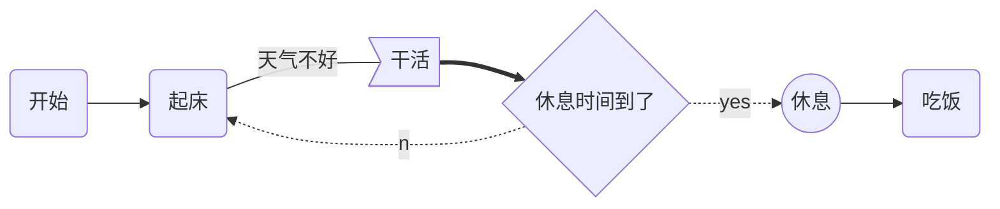
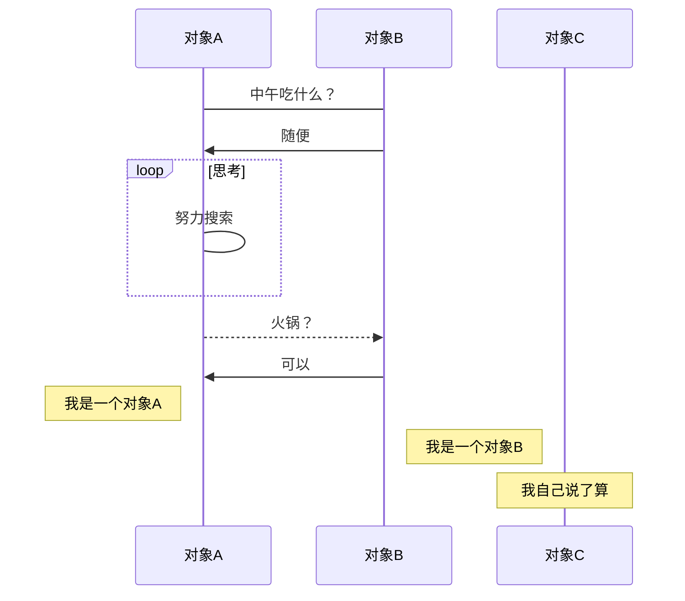
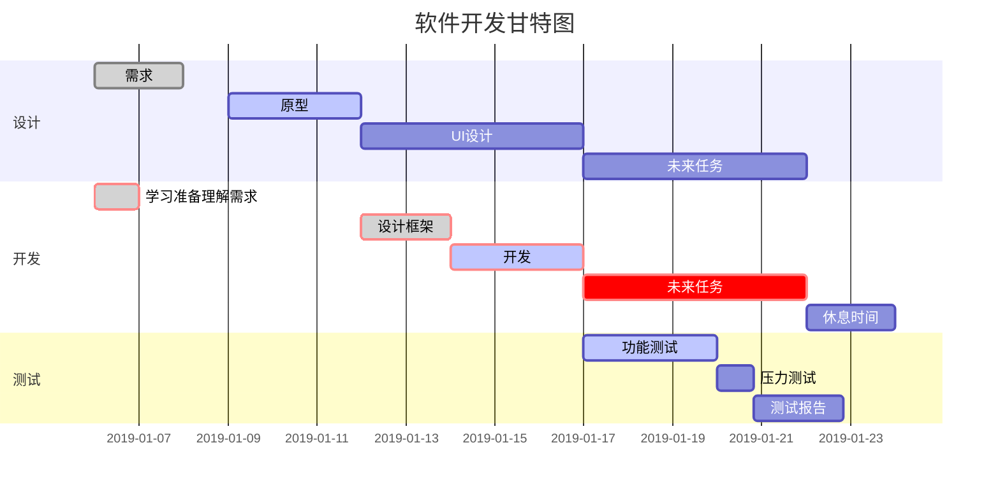

```flow
st=>start: 页面加载
e=>end: End:>http://www.google.com
op1=>operation: get_hotel_ids|past
op2=>operation: get_proxy|current
sub1=>subroutine: get_proxy|current
op3=>operation: save_comment|current
op4=>operation: set_sentiment|current
op5=>operation: set_record|current

cond1=>condition: ids_remain空?
cond2=>condition: proxy_list空?
cond3=>condition: ids_got空?
cond4=>condition: 爬取成功??
cond5=>condition: ids_remain空?

io1=>inputoutput: ids-remain
io2=>inputoutput: proxy_list
io3=>inputoutput: ids-got

st->op1(right)->io1->cond1
cond1(yes)->sub1->io2->cond2
cond2(no)->op3
cond2(yes)->sub1
cond1(no)->op3->cond4
cond4(yes)->io3->cond3
cond4(no)->io1
cond3(no)->op4
cond3(yes, right)->cond5
cond5(yes)->op5
cond5(no)->cond3
op5->e

```

```flow
a=>operation: H
b=>end
a(right)->b
```



```sequence
  Title:时序图示例
  客户端->服务端: 我想找你拿下数据 SYN
  服务端-->客户端: 我收到你的请求啦 ACK+SYN
  客户端->>服务端: 我收到你的确认啦，我们开始通信吧 ACK
  Note right of 服务端: 我是一个服务端
  Note left of 客户端: 我是一个客户端
  Note over 服务端,客户端: TCP 三次握手
  participant 观察者
```


``` sequence
  客户端->打印机: 打印请求(id)
  打印机->数据库:请求数据(id)
  Note right of 数据库: 执行SQL获取数据
  数据库-->打印机:返回数据信息
  Note right of 打印机:使用数据打印
  打印机-->>客户端:返回打印结果
  客户端->客户端:等待提取结果
```



