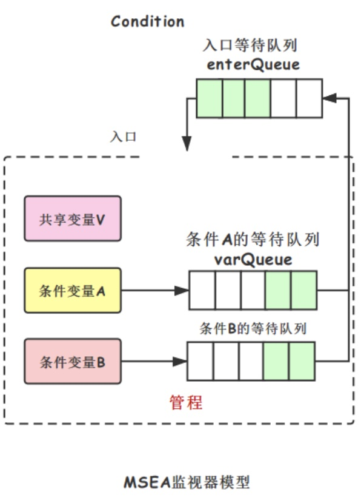

## 进程同步与通信
进程之间的协作关系包括互斥、同步和通信。

### 并发原理

#### 并发带来的问题
由于并发执行的进程之间相对执行速度是不可预测的，它取决于其他进程的活动、操作系统的调度策略等。这就带来了以下困难
1. 全局变量的共享存在危险。（读写不一致）
2. 操作系统很难最佳地管理资源的分配。（可能出现死锁）
3. 定位程序的错误是恨困难的。（难以重现）

因此“并发”给操作系统的设计和管理带来了很多问题，操作系统为此要关注的事情有以下几方面。
1. 操作系统要记录每个进程的情况，并通过进程控制块实现。
2. 操作系统要为每个进程分配和释放各种资源，这些资源包括处理机、存储器、文件和 I/O 设备。
3. 操作系统要保护每个进程的数据和资源，避免遭到其他进程的干涉和破坏。
4. 保证进程执行结果的正确性，进程的执行结果与速度无关。

#### 竞争条件（Race Condition）
两个或多个进程/线程读写某些共享数据，而最后的结果取决于进程/线程运行的精确时序。

#### 进程互斥（Mutual Exclusive）
进程互斥是指由于共享资源所要求的排他性，进程之间要相互竞争，某个进程使用这种资源时，其他进程必须等待。换句话说，互斥是指多个进程不能同时使用同一个资源。

#### 进程同步
进程同步使之多个进程中发生的时间存在着某种时序关系，必须协同动作、相互配合，以共同完成一个任务。进程同步的主要任务是使并发执行的诸进程有效地共享资源和相互合作，从而使程序的执行具有可再现性。

### 临界资源和临界区
+ 临界资源：在某段时间内只允许一个进程使用的资源。
+ 临界区：每个进程中访问临界资源的那段程序。

#### 临界区进入准则
+ 空闲让进。当无进程处于临界区时，临界资源处于空闲状态，允许进程进入临界区。
+ 忙则等待。当已有进程进入临界区时，临界资源正在被访问，其他想进入临界区的进程必须等待。
+ 有限等待。对于要求访问临界资源的进程，应保证在有效的时间内进入，以免进入“死等”状态
+ 让权等待。当进程不能进入临界区时，应立即释放处理机，以免其他进程进入“忙碌状态“

#### 互斥实现的硬件方法
1. 禁止中断
   在单处理机中，并发执行的进程不能在CPU上同时执行，只能交替执行。另外，对于一个进程而言，它将一直运行，直至被中断。因此，只要保证在临界区内进程不被中断就可以保证互斥。另外，在多处理机环境中，禁止中断仅对执行本指令的 CPU 起作用，对其他 CPU 不起作用，也就不能保证对临界区的互斥进入。
2. 专用机器指令。
   在很多计算机中，设有专用指令来解决互斥问题。硬件方法普通变为TS指令和Swap指令两种。
   + TS（Test and Set）指令
     TS 原语指令的功能是读出执行标志后把该标志设为 true，TS 指令的功能可以用如下函数描述。
    ```
      boolean lock = false;
      boolean testAndSet() {
          boolean tmp = lock;
          lock = true;
          return tmp;
      }

      进入临界区：
      while(testAndSet()); // 什么也不做
      // 临界区代码...
      退出临界区：
      lock = false;
    ```

   + Swap 指令
     Swap 原语指令的功能是交换两个字节的内容。可以用如下函数描述：
     ```
      boolean lock = false;
      boolean swap(a, b) {
          boolean tmp = a;
          a = b;
          return tmp;
      }

      进入临界区：
      lock = false;
      while(swap(lock, true)); // 什么也不做
      // 临界区代码...
      退出临界区：
      lock = false;
     ```

综上所述，硬件方法实现由如下优点。
+ 适用范围广。硬件方法适用于任意数目的进程，单处理机和多处理机都能使用。
+ 简单。硬件方法的标志设置简单，容易验证其正确性。
+ 支持多个临界区。在一个进程中有多个临界区，只需为每个临界区设置一个布尔变量。

硬件方法也有无法克服的缺点，主要包括以下两方面。
+ 进程在等待进入临界区时，不能做到“让权等待”。
+ 由于进入临界区的进程是从等待进程中随机选择的，可能造成某个进程长时间不能被选上，从而导致“饥饿“现象。

#### 互斥实现的软件方法
##### 算法 1: 单标志算法
假如有两个进程 P0，P1 要互斥访问临界区，设置公共整型变量 turn，用于指示进入临界区的标识，进程在进入区通过循环检查变量 turn 确定是否可以进入，即当 turn = 0 时，进程 P0 可进入，否则循环检查该变量，直到 turn 变为 0 为止。在退出区将 turn 改成另一个进程的标识，即 turn = 1，从而使 P0，P1 轮流访问临界资源。

```
初始值：turn = 0；
进程 P0:
  // 进入临界区
  while (turn != 0); // 什么也不做
  // 临界区..
  // 退出临界区
  turn = 1;

进程P1:
  // 进入临界区
  while (turn != 1); // 忙等
  // 临界区..
  // 退出临界区
  turn = 0;
```
该算法可以保证任何时刻至多只有一个进程进入临界区，但它的缺点是强制性轮流进入临界区，不能保证“空闲让进”。

##### 算法 2: 双标志、先检查算法

```
flag[] 初始值都为false。
进程 P0:
  // 进入临界区
  while (flag[1]); // 什么也不做
  flag[0] = true;
  // 临界区..
  // 退出临界区
  flag[0] = false;

进程P1:
  // 进入临界区
  while (flag[0]); // 忙等
  flag[1] = true;
  //临界区..
  // 退出临界区
  flag[1] = false;
```
该算法解决了“空闲让进”的问题，但是该算法有可能出现同时让两个进程进入临界区的缺点，不能保证“忙则等待”。

##### 算法 3: 双标志、先修改后检查算法
```
flag[] 初始值都为false。
进程 P0:
  // 进入临界区
  flag[0] = true;
  while (flag[1]); // 什么也不做
  // 临界区..
  // 退出临界区
  flag[0] = false;

进程P1:
  // 进入临界区
  flag[1] = true;
  while (flag[0]); // 忙等
  //临界区..
  // 退出临界区
  flag[1] = false;
```
该算法可放置两个进程同时进入临界区，但它的缺点时可能两个进程因过分“谦让”而都进不了临界区。

##### 算法 4: 先修改、后检查、后修改者等待算法
综合算法 1 和算法 3 的概念，标志 flag[0]为 true 表示进程 P0 想进入临界区，标志 turn 表示要在进入区等待的进程标识。在进入区先修改后检查，通过修改同一标志 turn 来描述标志修改的先后；检查对方标志flag，如果对方不想进入，自己再进入。如果对方想进入，则检查标志 turn，由于 turn 中保存的是较晚的一次赋值，因此较晚修改标志的进程等待，较早修改标志的进程进入临界区。
```
turn = 0;
flag[] 初始值都为false。
进程 P0:
  // 进入临界区
  flag[0] = true;
  turn = 1;
  while (flag[1] && turn == 1); // 什么也不做
  // 临界区..
  // 退出临界区
  flag[0] = false;

进程P1:
  // 进入临界区
  flag[1] = true;
  turn = 0;
  while (flag[0] && turn == 0); // 忙等
  //临界区..
  // 退出临界区
  flag[1] = false;
```
至此，算法 4 可以正常工作，即实现了同步机制中的前两条--“空闲让进”和“忙则等待”。但从上述软件方法中可以发现，对于3个以上进程的互斥又要区别对待。因此用软件解决互斥的问题有一定难度，且局限性很大。因而很少有人用这样的方法。

### 信号量和 PV 操作
#### 信号量的定义
Dijkstra最初定义的信号量包括一个整型值 s 和一个等待队列 s.queue，信号量只能通过两个原语操作 P、V 操作来访问它，信号量的定义如下：
```
struct semaphore {
  int value;
  struct PCB* queue;
}

P 原语操作可用函数 wait(s) 来表示
void wait(semaphore s) {
  s.value = s.value - 1;
  if (s.value < 0) {
    block(s.queue);   // 将进程阻塞，并将其投入等待队列 s.queue */
  }
}

V 原语操作可用函数 signal(s) 表示
void signal(semaphore s) {
  s.value = s.value + 1;
  if (s.value <= 0) {
    // 唤醒阻塞进程，将其从等待队列 s.queue取   出，投入就绪队列。
    wakeup(s.queue);  
  }
}
```

#### 信号量的物理意义
1. 在信号量机制中，信号量的初值 s.value 表示系统中某种资源的数目，因而又称为资源信号量。
2. P 操作意味着进程请求一个资源，因此描述为 s.value = s.value - 1;当 s.value < 0 时，表示资源以及分配完毕，因而进程所申请的资源不能够满足，进程无法继续执行，所以进程执行 block(s.queue) 自我阻塞，放弃处理机，并插入等待该信号量的等待队列。
3. V 操作意味着进程释放一个资源，因此描述为 s.value = s.value + 1;当 s.value ≤ 0 时，表示在该信号量的等待队列中有等待该资源的进程被阻塞，故应调用 wakeup(s.queue) 原语将等待队列中的一个进程唤醒。
4. 当 s.value < 0 时，|s.value| 表示等待队列的进程数。

#### 用信号量解决互斥问题
如果信号量的初值为 1，表示仅允许一个进程访问临界区，此时的信号量转化为互斥信号量。如下代码段
```
semaphore mutex = 1;
P1:
{
  P(mutex);
  // ...临界区
  V(mutex)
}

P2:
{
  P(mutex);
  // ...临界区
  V(mutex)
}
```

#### 用信号量解决同步问题
利用信号量可以实现进程之间的同步，即可以控制进程执行的先后次序。如果有两个进程 P1和 P2，要求 P2 必须在 P1 执行完毕之后才可以执行，则只需要设置一个信号量 S，其初始值为 0，将 V（S）操作放在进程 P1 的代码段 C1 后面，将 P(S) 操作放在进程 P2 的代码段 C2 前面，代码如下：
```
P1:
{
  C1;
  V(S);
}

P2:
{
  P(S);
  C2;
}
```

#### AND 信号量
在用信号量解决问题的过程中，要注意许多细节问题。比如生产者和消费者问题中两个 P 操作的次序不能颠倒，及哲学家问题容易死锁的现象。这些问题的出现促使了 AND 信号量的产生，继而发展到一般“信号量集”。AND 信号量同步机制的主要思想是将进程在整个运行期间所需要的所有临界资源一次性全部分配给进程，待该进程使用完后再一起释放。只要尚有一个资源不能满足进程的要求，其他所有能分配给该进程的资源也都不予以分配，为此在 P 操作上增加一个 AND 条件，故称为 AND 信号量。P 操作的原语是 Swait，V 操作的原语是 Ssignal。

### 管程

#### 管程的定义
管程的定义是一个共享资源的数据结构以及一组能为并发进程在其上执行的针对该资源的一组操作，这组操作能同步进程和改变管程中的数据。管程的基本思想是把信号量及其操作原语封装在一个对象内部，即将共享资源以及针对共享资源的所有操作集中在一个模块中。管程可以用函数库的形式实现，一个管程就是一个基本程序单位，可以单独编译。

#### 管程的特征
+ 局限于管程的共享变量（数据结构）只能被管程的过程访问，任何外部过程都不能访问。
+ 一个进程通过调用管程的一个过程进入管程。
+ 任何时候只能有一个进程在管程中执行，调用管程的任何其他进程都被挂起，以等待管程变为可用，即管程有效地实现互斥。

#### 管程的结构
为了实现并发，管程必须包含同步工具。假设一个进程调用了管程，当它在管程中时要等待某个条件，条件不满足时它必须被挂起。这就需要一种机制，使得该进程不仅能被挂起，而且当条件满足且管程再次可用时，可以恢复该进程，并允许它在挂起点重新进入管程。

##### 条件变量
管程必须使用条件变量提供对同步的支持，这些条件变量包含在管程中，并且只有在管程中才能被访问。以下两个函数可以操作条件变量。
+ cwait(c)。调用进程的执行在条件 c 上挂起，管程现在可被另一个进程使用。
+ csignal(c)。恢复在 cwait 上因为某些条件而挂起的进程的执行。如果有多种这样的进程，选择其中一个。

注意，管程中的条件不是计数器，不能像信号量那样积累信号，供以后使用。如果管程中的一个进程执行 csignal(c)，而在条件变量 c 上没有等待着的进程，则它所发送的信号丢失。换句话说，cwait(c) 操作必须在 csignal(c) 操作之前。

##### 管程的结构
管程只有一个入口点，并保证一次只有一个进程可以进入，其他试图进入管程的进程加入挂起等待观察可用的进程队列。但一个进程在管程中时，它可能会通过发送 cwait(c) 把自己暂时挂起在条件 x 上，随后它被放入等待条件改变以重新进入管程的进程队列中。（说白了，管程结构就是代码互斥+条件变量）

管程的实现主要是有Hoare管程和MESA管程，下面是MESA管程的实现示意图。



MESA管程有如下特点：
+ 用 while 循环取代 if。因为不能保证在某个线程被唤醒之前没有其他线程进入管程而阻塞。也因此，多检查了一次使得出错概率减小。
+ 可以给每个条件原语关联一个监视计时器，不论是否被通知，等待时间超时后将被设为就绪态。

#### 管程和信号量的区别
+ 信号量有计数，PV 操作都会进行计数增减；而管程不会，当signal之后，若无等待的线程，则信号丢失。
+ 管程除了有入口等待队列，还有自己的条件队列，并且允许多个条件队列；信号量只有入口等待队列。
+ 管程编程实现简单，易于检查错误；信号量编程需要注意顺序，严防死锁。

### 进程间通信 IPC
进程间的通信要解决的问题是进程之间信息的交流，这种信息交流的量可大可小。

#### 为什么需要进程间通信
+ 信号量及管程只能传递比较简单的信息，比如要传递大数组
+ 信号量及管程不适用于多处理器的情况。

#### 进程通信机制
适用于分布式系统、基于共享内存的多处理机系统，但处理剂系统可以解决进程间的同步问题、通信问题。
+ 消息传递（send & receive原语）
  + 发送进程调用send(message)，陷入内核，将消息复制进操作系统空间中的一组消息缓冲区，并从message(msg_head, recid, msgType, msgLength, ctrlMsg,msgbody...)中获取接收进程ID，将消息队列指针送入接收进程的PCB中，这一过程称之为消息入队。
+ 共享内存
  + 分配一块共享的物理内存，并分别映射到两个进程的地址空间。
+ 管道
  + 利用一个缓冲传输介质--内存或文件连接两个相互通信的进程
+ 套接字
+ 远程过程调用

#### Linux的进程通信机制
管道、消息队列、共享内存、信号量、信号、套接字
内核同步机制：原子操作、自旋锁、读写锁、信号量、屏障

### 其他同步技术

#### 自旋锁
在单处理机系统中，如果线程碰到锁，将总是进入阻塞状态，而不是自旋，因为单处理机上只有一个线程在运行。Solaris 使用自旋锁方法保护那些只有几百条指令的短代码段的临界数据。引入如果代码段较长，自旋等待将很低效。所以长代码段使用管程和信号量比较好。在Linux中也有类似的机制，在单处理机中因为不适合使用自旋锁，采用了禁止和允许内核抢占来实现。对于对称多处理机，则采用自旋锁。Linux提供了两个系统调用 preempt_disable 和 preempt_enable 来禁止和允许内核抢占。

#### PThread 中的同步机制
PThread.mutex.. 实现互斥
PThread.cond.. 实现同步

### 死锁

#### 死锁的基本概念
一组进程中，每个进程都无限等待被该组进程只能够另一个进程所占有的资源，因而永远无法得到的资源，这种现象称为**进程死锁**，这一组进程就成为**死锁进程**。

#### 活锁
在某些情况下，当进程意识到它不能获取所需要的下一个锁时，就会尝试礼貌地释放已经获得的锁，然后等待 1ms，再尝试一次。此时，如果另外一个进程在相同的时刻做了相同的动作。这个过程中没有进程阻塞，然而，进程并不会往下继续运行，这种现象称为活锁。

#### 饥饿
在动态运行的系统中，有些进程因为优先级或者其他原因一直被无限推迟运行，导致这类进程永远得不到服务，这种现象称为饥饿。

#### 可重复使用资源和可消耗资源
+ 可重复使用资源：在使用时往往要求一次只能供一个进程安全使用，并且不会因使用而耗尽。进程得到这类资源后，使用完毕再释放，供其他进程再次使用。这类资源包括处理机、I/O 通道，设备及文件，数据库等；既有软件资源，也有硬件资源。解决这类死锁的策略是在系统设计时施加关于资源请求顺序的约束。
+ 可消耗资源：指可以创建和撤销的资源。当一个进程使用这种资源后，这种资源就不再存在，比如中断、信号量、消息和缓冲区。可消耗资源也有可能导致死锁。

#### 死锁产生的必要条件
以下四个条件构成了死锁的必要条件。
+ 互斥条件。指进程对所分配的资源进行排他性使用，即在一段时间内某资源只能由一个进程占有。如果此时有其他进程要求使用该资源，要求使用资源者只能阻塞，直到占用该资源的进程用完该资源为止。
+ 请求和保持。进程已经占有了至少一个资源，但又提出了新的资源请求，而该资源已经被其他进程占有，此时进程阻塞，但对已经获得的资源保持不放。
+ 不可抢占条件。进程已经获得了资源，在它使用完毕前不能被剥夺，只能使用完毕后自己释放。
+ 环路条件。存在一个进程与资源的环形链表，在该链中，每个进程都正在等待一个被占用的资源。

#### 死锁预防
预防死锁可以破坏前文所述的4个必要条件，排除产生死锁的可能性。

##### 互斥
在死锁产生的四个条件中，互斥条件是不可以禁止的。互斥是资源固有的属性，如文件，可以允许多个进程同时读，但不允许多个进程同时写，必须做到写互斥。

##### 请求与保持（占有且等待）
为了预防请求与保持条件的发生，可以使用**资源预先静态分配法**，即要求进程一次性请求所有必须的资源，如果资源不能够满足，就阻塞这个进程，直到其所有请求都得到满足为止。这个方法有效，但在以下两方面是低效的。
+ 进程将被延迟运行。进程因为申请过多资源而被阻塞很长时间，而实际上，它只需要一部分资源就可以运行，但却因为害怕死锁而被延迟执行。
+ 资源严重浪费。分配给一个进程的资源可能有相当长的时间是闲置的，而在这期间，这些已经分配的资源不能给其他进程使用。
+ 还有一个问题是提前让进程提出它所需要的所有资源困难，进程只有执行时才知道需要哪些资源。

##### 不可抢占
通过不可抢占预防思索的一个方法是，如果一个进程占有某些资源，当它有新的资源请求被拒绝时，该进程停滞运行，并释放它所占有的资源；当它再次被执行时，重新申请资源。另一个方法是，如果一个进程请求另一个进程占有的资源，操作系统可以抢占后者占有的资源，要求它释放资源，并将资源分配给前者使用。这种方法实现复杂，可能导致反复地请求和释放资源，而使进程的执行无限推迟。这不仅延长了进程的周转时间，还增加了系统开销，降低了系统的吞吐量。

##### 环路
采用有序分配资源的策略可破坏产生死锁的环路条件。环路条件可以通过定义资源类型线性顺序来预防。如果一个进程已经分配到了某种类型的资源，它接下来请求的资源只能是那些排在该类型资源之后的那些资源。这种预防死锁的方法比起前面的策略来，其资源利用率和系统吞吐量都有明显的改善，但是也存在下述问题。
+ 为系统中各种资源所分配的序号必须相对稳定，但这样会限制新设备的增加。
+ 尽管在为资源分配序号时考虑到了大多数进程实际使用这些资源的顺序，但是也经常发生这种情况，即进程使用资源的顺序，与系统规定的顺序不同，从而造成资源的浪费。
+ 为方便用户，系统对用户编程时所拾家的限制条件应尽可能少，然后这种按规定顺序申请资源的方法必然会限制用户简单、自主地编程。

#### 死锁避免
避免死锁是动态地决定是否允许进程当前的资源分配请求。避免死锁采用的是资源分配拒绝策略。在该方法中，允许进程动态的申请资源，但系统在分配资源之前，先计算资源分配的安全性，若此次分配不会导致系统进入不安全状态，便将资源分配给进程，否则不予以分配，进程等待。

##### 安全状态和不安全状态
安全状态：指至少存在一个安全序列<P1,P2,P3,P4>，按照这个序列为进程分配所需的资源，直到满足最大需求，使得每个进程都可以顺序完成。若系统不存在这样一个序列，则称系统处于不安全状态。

##### 银行家算法
避免死锁就是系统在分配资源时，确保每一次分配后系统是安全的。也就是说，如果把某个资源分配给某个进程，该进程可以运行完毕。如果进程得到资源后可以顺利地运行结束，则予以分配；否则若进程得到资源后仍然无法运行完毕，则拒绝此次资源的分配，系统仍旧保持自己的安全状态。

##### 死锁避免算法分析
避免死锁的优点是它不需要死锁预防中的剥夺资源和进程的重新执行，并且比死锁的限制要少，但是在使用中仍有以下方面的限制。
+ 必须事先声明每个进程的资源最大需求量
+ 进程之间必须是无关的，也就是说，进程之间的执行顺序没有任何同步要求。
+ 系统中可供分配的资源数目必须是固定的。
+ 进程在占有资源时，不能退出。

#### 死锁检测与解除
检测死锁的基本思路是系统保存资源请求和分配信息，利用某种算法对这些信息加以检查，以判断系统是否出现了死锁。

##### 资源分配图
死锁检测算法主要是检察系统中的进程是否有循环等待。把系统中进程和资源的深情和分配情况描述成一个有向图，通过检查有向图中是否有循环来判断死锁的存在。具体地说，有向图的顶点有两类，一类是资源，另一类是进程。定义从资源 R 到进程 P 的边表示 R 已经分配给进程 P，从进程 P 到资源的边表示进程 P 请求资源 R。这样就构成了资源分配图。

##### 死锁检测
为了在复杂的有向图中判断是否存在循环，可以通过简化资源分配图的方法来检测系统中的某个状态 S 是否处于死锁状态。简化方法如下。
+ 找出资源分配图中非孤立且没有阻塞的进程 Pi。对于这样的进程，它在顺利的情况下获得所需要的资源而运行完毕，之后它就会释放其所占有的全部资源。这相当于可以在资源分配图中删除进程 Pi 的所有请求边和分配边，使之成为孤立顶点。
+ 如此反复执行
+ 在进行一系列的简化后，若能删除途中的所有遍，使得所有进程都成为孤立的顶点，则该图是可以完全简化的，否则该图是不可以完全简化的。

**死锁定理：系统中的状态 S 是死锁状态的充分必要条件是，当且仅当 S 的资源分配图是不可以完全简化的。**

##### 死锁解除
一旦检测到死锁，就需要解除死锁。方法如下：
+ 撤销所有死锁进程。这是操作系统最常用的方法，也是最容易实现的方法。
+ 把每个死锁的进程恢复到前面定义的某个检查点，并重新运行这些程序。要实现这个方法需要系统有构造重新运行和重新启动机制。该方法的风险是有可能再次发生原来发生过的死锁。但是操作系统的不确定性使得不会总是发生同样的事情。
+ 有选择的撤销死锁进程，直到不存在死锁。选择撤销进程的顺序基于最小代价原则。每次撤销一个进程后，要调用死锁检测算法检测是否仍然存在死锁。
+ 抢占资源，直到不存在死锁。和上面一个差不多。

###### 最小代价原则
+ 到目前为止消耗的处理机时间最少
+ 到目前为止产生的输出最少
+ 预计剩下的执行时间最长。
+ 到目前为止分配的资源总量最少。
+ 进程的优先级最低。
+ 撤销某进程对其他进程的影响最小。

#### 鸵鸟算法
对于死锁最简单的方法就是鸵鸟算法：把头埋在沙子里，假装什么也没有发生。