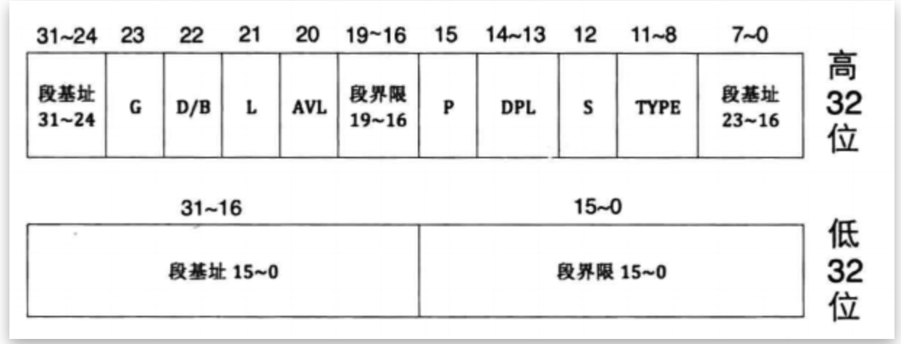
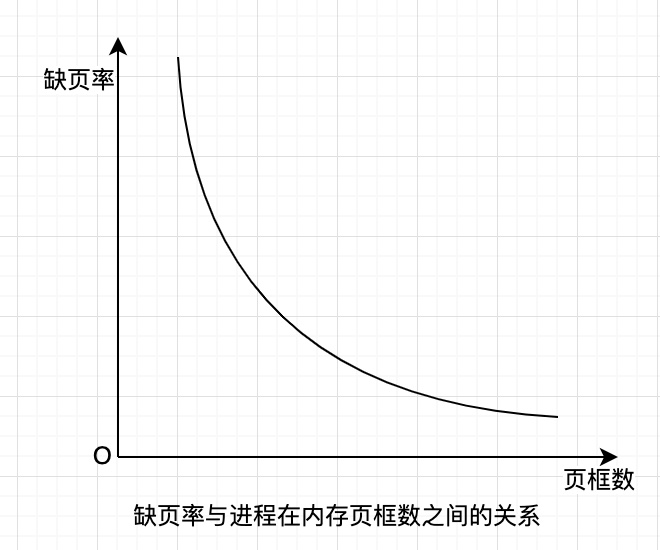

## 存储管理

### 程序的装入和链接
1. 编译。用户源程序经过编译生成目标模块，目标模块以“0”作为开始地址。目标模块的地址称为相对地址或逻辑地址。
2. 链接。将编译后形成的多个目标模块以及它们所需要的库函数链接在一起形成装入模块。装入模块虽然具有统一的地址空间，但它仍是以“0”作为参考地址。
3. 装入。将装入模块装入内存实际物理地址空间，并修改程序中与地址有关的代码，这过程称为地址重定位。

### 重定位
地址重定位完成的是相对地址（逻辑地址）转换成内存的绝对地址（物理地址）的工作。地址重定位又称为地址映射。按照重定位的时机，可分为静态重定位和动态重定位。
+ 静态重定位
  静态重定位就是在程序执行之前进行重定位。它根据装入模块将要装入内存的起始地址修改装入模块中有关使用地址的代码。静态重定位有如下缺点。
  + 程序重定位之后不能再在内存中移动
  + 要求程序的存储空间是连续的，不能把程序放在若干个不连续的存储区域内。
+ 动态重定位。
  动态重定位是指程序在执行过程中进行地址重定位。更确切的说是在每次访问每个地址单元前再进行地址变换。动态重定位有如下好处。
  + 目标模块装入内存时无须任何修改，因而装入后可以再搬迁。
  + 一个程序是有若干个相对独立的目标模块组成的。只要各个模块有自己对应的重定位寄存器，这些模块的存储区域可以不是顺序相邻的。

### 链接
链接程序的功能是将经过编译后得到的一组目标模块以及它们所需要的库函数装配成一个完整的装入模块。实现链接的方式有 3 种，分别为静态链接、装入时动态链接和运行时动态链接。
+ 静态链接：在程序运行之前事先进行的链接，链接以后的文件通常不会再拆开，形成一个完整的可执行文件。
+ 装入时动态链接：在程序装入时边装入变链接。装入时动态链接的特点有：
  + 优点
    + 便于软件版本的更新。
    + 便于实现目标模块的共享。
  + 不足之处
    + 程序的整个运行期间，装入模块是不改变的。实际应用中有时需要不断修改某些装入模块，并希望在程序不停止运行的情况下把修改后的装入模块与正在运行的应用模块连接在一起并运行。
    + 每次运行时的装入模块是相同的。而在实际应用的许多情况下，每次运行的模块可能是不同的，例如操作系统调用的驱动程序，由于每台机器的硬件配置可能发生变化，所以与硬件相关的驱动程序都是不同的。
+ 运行时动态链接：解决上面两个问题的有效方法是采用运行时动态链接的方式，即将目标模块的链接推迟到程序执行时再进行。即在执行过程中，若发现被调用模块还没有装入内存，再去找出该模块，将它装入内存，并链接到调用模块上。

### 连续分配存储管理方式
连续分配是指为用户程序分配一个连续的内存空间，这种分配方式曾广泛地应用于20世纪 60～70 年代的操作系统中。连续分配的方式有单一连续分区、固定分区和可变分区。

#### 单一连续分区
单一连续分区方案是最早出现的一种存储管理方式，它将整个内存区域被分成系统区域和用户区域两部分。
+ 系统区域。提供给操作系统使用，它可以驻留在内存的低地址部分，也可以主流在内存的高地址部分。
+ 用户区域。供应用程序使用的内存区域。
+ 常用界限寄存器的方法防止操作系统程序受到用户程序的破坏。

#### 固定分区
固定分区分配是最早使用的一种运行在多道程序中的存储管理方案。在进程装入内存之前，由操作员或操作系统把内存划分成若干个大小不等的分区。固定分区技术简单，但内存利用率不高，适用于进程的大小及数量事先能够预知的系统中。

#### 可变分区
可变分区是指在进程中装入内存时，把可用的内存空间“切出”一个连续的区域分配给进程，以适应进程大小的需要。整个内存分区的大小和分区的个数不是固定不变的，而是根据装入进程的大小动态划分，因此也称为动态分区。

##### 可变分区中的数据结构
为了实现可变分区的分配，必须配置相应的数据结构记录在内存的使用情况，常用的数据结构有两种，即空闲分区表和空闲分区链。
+ 空闲分区表为内存中每个尚未分配出去的分区设置一个表项，每个表项包括分区序号，分区起始地址和分区的大小。
+ 空闲分区链即在空闲分区中设置用于控制分区分配的信息及用于链接各个分区的指针，将内存中的空闲分区链接成的一个链表。

##### 可变分区分配算法
为把一个进程装入内存，需要按一定的分配算法从空闲分区表或空闲分区链中选出一分区分配给该进程。常用的可变分区的分配算法有
+ 首次适应分配算法（First Fit）: 该算法要求空闲分区以地址递增的次序排序。如果采用的是链表结构，分配时则从链表的开始顺序进行查找，直到找到一个能够满足进程大小要求的空闲分区为止。该算法倾向于使用内存中低地址部分的空闲空间，高地址部分很少被利用，从而保证高地址部分留有较大的空闲分区。其缺点是低地址部分不断被“切割”，致使留下许多难以利用的小空闲分区，而每次查找又都从低地址部分开始，这无疑会影响查找的速度。
+ 下次适应分配算法（Next Fit）：该算法从首次适应算法演变而来。为了避免低地址部分小空闲分区的不断增加，在给进程分配内存空间时，不再每次从链首开始查找，而是从上次找到的空闲分区的下一个空闲分区开始查找，直到找到一个能满足要求的空闲分区，并从中“切除”一块与请求的大小相等的内存空间分配出去。该算法的特点是可以使内存得到比较均衡的利用，减少查找空闲分区的开销，但会使系统缺乏大的空闲分区，导致比较大的进程无法运行。
+ 最佳适应分配算法（Best Fit）: 每次为进程分配内存时，总是把与进程大小最匹配的空闲分区分配出去，该算法采用的数据结构若是空闲分区链，首先要求将空闲分区按分区大小递增的顺序形成一空闲分区链。当进程要求分配内存时，第一次找到的满足要求的空闲区必然是最优的。该算法的优点是如果系统中有一空闲分区的大小正好与进程的大小相等，则必然选中该空闲块；另外，系统中可能保留有较大的空闲分区。缺点是链表的头部会留下许多难以利用的小空闲区，成为碎片，从而影响分配的速度。
+ 最坏适应分配算法（Worst Fit）: 该算法要求空闲分区按分区大小递减的顺序排序，每次分配时，从链首找到最大的空闲分区“切出“一块进行分配。该算法的特点是基本不会留下小空闲分区，不易形成碎片；缺点是大的空闲分区被切割，当有较大的进程需要运行时，系统往往不能满足要求。

##### 可变分区内存的回收
进程运行完毕后就要释放占有的内存，系统回收它所占的分区时可应考虑回收分区是否与空闲分区邻接，若有邻接，则应加以合并。回收分区与空闲分区的邻接情况可能有以下四种情况。
+ 回收分区与前面一个空闲分区F邻接。此时合并为一个空闲分区后，修改F的表项的大小为两个分区大小之和。
+ 回收分区与后面一个（高地址）空闲分区F邻接。此时合并为一个空闲分区后，修改F的表项的首地址为回收分区的地址，以及大小为两个分区大小之和。
+ 回收分区与前F1后F2两个空闲分区相邻接。合并为一个空闲分区之后，修改F1的表项的大小为三个大小之后，并删除F2的表项。
+ 回收分区不语其他空闲分区邻接。此时应为回收分区单独建立一个新的表项，填写回收分区的首地址和大小，并将该分区插入链（表）的适当位置。

#### 动态重定位分区（内存紧凑）
在前面所述的可变分区分配方案中，由于必须将一个用户进程装入一个连续的内存空间，如果系统由于不断切割，不存在这样大的空闲分区，但其空闲分区的总量可以容纳用户进程，此时可以采用内存紧凑的方法，即移动原来内存中的用户进程，内存紧凑之后，还需要对被移动的用户进程的原来的地址进行修改，即重定位。这种技术虽然可以解决内存碎片的问题，但由于内存大量信息的移动，为此要付出的处理机时间开销很大。出现这一问题的主要原因是一个进程必须放在一个连续的内存空间中。由于此因素，便产生了离散式分配思想----允许将一个进程分散地分配到许多不相邻的分区中。页式存储管理便是其中一种方式。

### 伙伴系统
Linux底层内存管理采用一种经典的内存分配方案。也是一种特殊的”分离适配“算法。主要思想：将内存按 2 的幂进行划分，组成若干空闲块链表；查找该链表找到能满足进程需求的最佳匹配块。算法设计如下：
+ 首先将整个可用空间看作一块：2^u
+ 假设进程申请的空间大小为s，如果满足 2^(u-1) < s ≤ 2^u, 则分配整个块。否则，将块划分为两个大小相等的伙伴，大小为 2^(u-1)
+ 一直划分下去直到产生大于或等于s的最小块

### 页式存储管理
在页式存储管理方式中，把内存空间分成大小相同的若干个存储块（或称为页框），并为这些存储块进行编号0块、1块、...（n-1）块，相应地，把进程的逻辑地址空间分成若干个与内存快大小相等的页（也称为页面）。在为进程分配空间时，以页为单位进行。进程中的若干个页分别装入多个不相邻的存储块。进程最后一页经常装不满一个存储块，而形成不可利用的碎片，称为页内碎片。

#### 页表
在页式管理系统中，进程的若干个页被离散地存储在内存的多个存储块中，为了能找到每个页所对应的存储块，系统为每个进程建立一张页表。进程所有页依次在页表中有一页表项，其中记录了相应页在内存中对应的物理块号。页表的作用时实现从页号到页框号的地址映射。
系统除了为每个进程建立一张页表之外，还应建立一张空闲块表，该表按页框号从小到大的次序记录内存未分配页框的框号。

#### 页的大小
在页式管理系统中，页或存储块的大小由机器的地址结构决定，若选择的页面较小，可以试页内的碎片减小，有利于提高内存的利用率，但是同时进程要求页面数增加，从而使页表的长度增大，占用大量内存空间；若选择的页面较大，虽然可以减小页表的长度，却又会使页内碎片增大。因此，页面的大小应适中选择。通常页的大小为512B～4MB。

#### 页表的硬件实现
页表在大多操作系统下是存放在内存中的，这使 CPU 每次要获取一个数据时都要至少访问两次内存，第一次是访问内存中的页表，从页表中找到该页的页框号，将此页框号与页内位移形成物理地址。第二次访问内存时才真正从得到的物理地址存取数据，因此，计算机的处理速度降低了近一半，可见，引入页式存储管理系统付出的代价是昂贵的。
为了提高系统的地址转换速度，在地址转换机构中设置了一组高速快表（Translation Lookaside Buffer)，用来存放当前访问最频繁的少量活动页。有了快表以后，页式管理系统的地址变换过程如下：
1. 在处理机得到进程的逻辑地址后，将该地址分成页号和页内位移两部分。
2. 由地址变换机构自动将页号于快表中的所有页进行比较，若与其中某页想匹配，则从快表中查处对应页的页框号，并转 4. 如在快表中没有找到，则转 3.
3. 访问内存中的页表，找到后读出页框号。同时将该页表项内容存入快表中的一个单元，即修改快表。如果快表已满，将快表中被认为不再需要的页换出。
4. 有页框号与业内位移得到物理地址。
  
#### 页表组织
在32位x86处理机中，如果一个页的大小为4KB，那么就需要 1M 的页表项才能表示这么多的物理页面。用于存储页框号32位物理地址的每一个页表项占4个字节，因此页表总大小就需要4M。每个进程都有一个页表，若按此分配方式，页表占用内存开销是很大的。为了解决这个问题，常采用的策略是多级页表结构。下面以两级页表举例说明：

##### 两级页表
用两级页表可实现将页表离散存放的问题，另外还可以将部分页表放在内存，其他大多数页表放在磁盘，需要时再调入内存。具体操作是，对于正在运行的进程，先将其外层页表放入内存，然后可根据需要将内存页表的一页或几页调入内存，为了表明哪些页表在内存，可以在外层页表中增加一状态位，值为0表示对应的页表不在内存，为1表示对应的页表在内存。当需要访问不在内存的页表时，产生一缺页中断，再用中断处理程序负责将不在内存的页表调入内存。（详见x86实模式-保护模式）

### 段式存储管理
内存离散分配方案中另一种市是进程分段。段式存储管理方式的引入，主要是为了满足用户在编程和使用上的要求。主要有如下几点。
+ 方便编程。通常，人们写的程序时分成许多子程序段的，每个段有自己的名字和长度，要访问的逻辑地址是由段名（或段号）和段内地址决定的。每个段从0开始编址，程序在执行过程中用段名和段内地址进行访问。
+ 段的共享。实现程序和数据的共享都是以信息的逻辑单位为基础的，段是信息的逻辑单位，实现段信息的共享更有意义。
+ 段的保护。在段式系统中，对内存中物理信息的保护，同样是对信息的逻辑单位的保护。
+ 动态链接。动态链接就是在程序运行过程中实现目标模块的链接。只有在段式存储管理方案中才能实现在程序运行过程中调用某段时，才将该段（目标模块）调入内存并进行连接。
+ 动态增长。程序在运行过程中往往有些段，特别是数据段会不断的增长，而事先又无法确切地知道数据段会增长到多大。这种动态增长的情况在其他几种存储管理方案中时难以应付的。而段式存储管理系统却能很好地解决这一问题。

#### 段式存储管理的基本原理
在段式存储管理中，为每一个段分配一个连续的分区，而进程的每个段可以离散的放在内存的不同分区中。为了使进程能正常运行，需要对于进程的每个逻辑地址找出其在内存的实际物理地址，为此系统为每个进程建立一张段表。在段表中，每个段占有一表项，其中记录该段在内存的起始地址和段的长度。

#### 段式存储管理系统地址变换过程
1. 为了实现进程逻辑地址到内存物理地址的变换，系统中设置了段表寄存器，其中存放了段表起始地址和段表长度，在进行地址变换中，如果逻辑地址中的段号大于段表寄存器中段表的长度，则产生一个越界中断。
2. 由段表起始地址找到段表在内存中的位置，通过逻辑地址中的段号访问相应的段表项。
3. 检查逻辑地址的段内位移是否超过该段的段长。若超过，发出越界中断。
4. 若没有越界，将该段的起始地址与段内位移想家，即得到要访问的内存物理地址。

#### 分段和分页的区别
+ 页是信息的物理单位，分页是为了实现进程在内存的有效离散存放，以减少碎片，提高内存的利用率。而段是信息的逻辑单位，段是一组有意义的相对完整的信息。分页是系统管理的需要，而分段的目的是为了满足用户的需要。
+ 页的大小是固定的，把逻辑地址分成页号和页内位移两部分，是由机器硬件实现的，因而一个系统只能有一种大小的页；段的长度是可变的，由用户所编写的程序决定。
+ 页的逻辑地址空间是一维的，给出页的逻辑地址时只给出一个地址；而段的逻辑地址空间是二维的，在给出段的逻辑地址时既要给出段号，又要给出段内地址。

#### 段的共享与保护
##### 段共享
段式存储管理系统有一个突出的特点，就是易于实现段共享，即允许多个进程共享一个或多个段，而且对段的保护也很简单。通过

##### 页共享
页面共享的方法是采用内存映射文件。内存映射文件的思想是进程可以通过文件映射将文件所在的磁盘块映射成内存的一页（或多页）。当按普通文件访问磁盘时，就将文件的一部分读入物理内存，以后文件的读写就按通常的内存访问来处理。
如果多个进程将同一文件映射到自己的虚拟空间中，就产生了数据的共享。一个进程修改虚拟内存中的数据，就会为其他映射相同文件部分的进程所见。这种机制也提供了一个进程之间的通信通道。

##### 段的保护
段的保护措施有如下3种。
+ 存取控制。在段表中增加存取保护位，用于设置对本段的存取方式，如可读、可写、可执行。
+ 段表保护。每个进程都有自己的段表，段表本身对段可起到保护作用。段表寄存器有段表起始地址和段表长度，访问不属于自己段内的地址时，系统会产生中断。
+ 保护环。其基本思想是系统把所有信息按照其作用和相互调用关系分成不同的层次。即环。0～3.
  + 0 级是操作系统内核，它处理 I/O，存储管理和其他关键的操作。
  + 1 级是系统调用处理程序，用户程序可以调用系统提供的系统调用，但只有一些特定的和受保护的系统调用才提供给用户。
  + 2 级是库函数，他可能是由很多正在运行的进程共享的，用户程序可以调用这些过程，读取它们的数据，但不能修改它们。
  + 3 及上运行的是用户程序。

### 段页式存储管理
段式和页式存储管理系统各有优缺点。页式系统能有效地提高内存利用率，而段式系统能更好地满足用户的需要。将两者结合，就产生了段页式存储管理系统。既有段式系统便于实现段的共享、段的保护、动态链接和段的动态增长等一系列优点，又能像页式系统那样很好地解决内存的外部碎片问题。

#### 段页式存储管理的地址变换
为了实现地址映射，每个进程有一个段表，每个段表项存放一个段的情况，其中包括段号、标识该段是否在内存的状态位、该段的页表长度和页表起始地址。即每个段有一个页表，其中有页号，标识该页是否在内存的状态位和页框号。
如果页的大小为 4KB，段页式系统地址变换过程如下。
1. 对于给定的逻辑地址，用段号 S 与段表寄存器中段表长度进行比较。若段号大于段表长度，产生一越界中断。
2. 通过段表寄存器中的段表起始地址找到该段在内存中的段表，从段表中找到段号 S 对应的段表项。
3. 查看该段的状态位，若该段不在内存，则产生一缺段中断，并将所缺段调入内存。如果内存没有空间，则需要进行置换。
4. 由该段的页表起始地址找到该段的页表。
5. 用逻辑地址中的段内页号与页表长度进行比较。若段内页号大于页表长度，则产生一越界中断。
6. 从页表中得到页号对应的页表项，查看该页的状态位，如果该页不在内存，则产生一缺页中断。如果内存没有空间，则需要进行置换。
7. 得到该页在内存的页框号，并与逻辑地址中的页内位移构成物理地址。

### Intel 80386 的存储管理系统
Intel 80386中既支持分段，也支持分页。根据需要可构成以下4中存储管理方式。
1. 不分段也不分页。这种方式可用于高性能的控制器。
2. 分页不分段。这种方式成为一个单纯的页式存储管理系统。
3. 分段不分页
4. 段页式存储管理机制。这是性能最好的一种存储管理方式。

Intel 80386 有 16K 个独立段，每个段最大可以有 4GB。
Intel 80386 虚拟存储器段表有局部描述符表（LDT）和全局描述符表（GDT）两类。每个进程都有自己的LDT，系统中的所有进程共享一个GDT。LDT 中每个表项描述进程的一个段的情况，包括代码段、数据段和栈段。GDT 描述系统段，包括操作系统本身。
为了访问某个段，Intel 80386 将段选择符(Selector)装入计算机的6歌段寄存器中的某一个，在运行过程中，cs寄存器保存代码段靠舒服，ds寄存器保存数据段描述符。每个段选择符为16位，前13位是索引号，后两位是DPL字段，最后第三位是指出这个段时局部的，还是全局的。
在选择符被装入段寄存器的同时，对应的段描述符被从 LDT 或 GDT 中取出装入微程序寄存器，以便快速访问。一个段描述符有64位，结构如图所示。

1. 段基址。供32位，定义了4GB 虚拟地址空间中某段的开始地址。
2. 段限长。规定了段的长度。页的大小为 4KB，段长为20位，故最大段长为 4GB。Intel 80386 可以采用两种存储管理方案：如果 G 位为 0，段的长度以字节为单位计算；如果 G 位为 1，段的长度以页为单位计算。
3. 操作数长 D。仅用于代码段描述符。D 为 1，表示用32位描述段长，即最大段长为4GB；当D为0时，表示用16位描述段长，最大段长为64KB。
4. 存在位 P。P 为 0标识段未调入内存，P 为1表示段在内存。
5. 特权级别DPL。用于标识段的特权级，供 4 个特权级。当一个进程访问某段时，要具有访问该段的特权才可进行。
6. 系统段标志 S。当 S=0时为系统段描述符，当 S=1 时为非系统段描述符。
7. 类型TYPE。对于系统段（S=0），用于表示段的类型；对于非系统段（S=1），表示段的存取控制。如本段是可执行、只读或可读/写。
8. 访问位 A。用于段的置换。
   
通过段选择符和位移，将逻辑地址转换成物理地址的过程如下。
1. 系统通过段选择符，定位段描述符。首先，根据段选择符的第2位确定是 GDT 或 LDT。然后将段选择符的低 3 位清0，复制到段寄存器；加上 GDT 或 LDT 的地址，得到一个指向段描述符的指针。
2. 得到段描述符后，查找段是否在内存（P位）中，若段不在内存中，会产生缺段中断。
3. 检查段的长度是否出界，若出界，则产生越界中断。从逻辑上讲，段的长度应该为32位，但实际上只有20位，可以使用。
4. 如果位移没有出界，系统将段描述符中的32位段基址和位移相加得到所谓的线性地址。为了和只有24位段基址的Intel 80286兼容，Intel 80386的基址被分成3个部分分布在段描述符中。
5. 如果系统不分页，则得到的线性地址就是一个内存物理地址，此时的Intel 80386系统是段式存储管理系统。但如果系统分页，线性地址将被解释为一个32位的虚拟地址，并通过页表机构映射为物理地址。
6. Intel 80386系统将上述32位线性地址分成3个部分，分别为页目录（10位）、页号（10位）、和页内位移（12位）。页目录的地址由页表寄存器给出。页目录由1024个32位的表项组成。页目录中每个表项都指向一个也包含1024个32位表项的页表。页表中，20位为页框号，3位留给系统操作员使用，其他为修改位D、访问位A、用户管理位US（用于页保护）、读写保护位RW 和存在位 P 等信息。
  
一个页表描述 1024 个表项，每个表项描述一页的内存空间，即4KB。因此一个页表可以处理 4MB 的内存。一个小于 4MB 的段将只有一个表项的页目录，这个表项指向唯一的一个页表，所以短的段额外开销只有两个页。
另外，Intel 80386 的联想存储器中有 32 个表项，在每个表项中包含 3 个数据项，分别为页目录项、页号和页框号。由于页的大小是 4KB，32个表项可以覆盖128KB的内存。故块表中查询的命中率高达 98%。
如果应用程序不需要分段，只需要分页的 32 位地址空间也是可以的。此时，所有段寄存器被设置成同一个选择符，它的段描述符基址为 0，长度为最大。段位移就是线性地址，这样就是分页系统了。
所以，Intel 80386 可实现纯分段、纯分页和段页式存储管理系统，并与 Intel 80286兼容，其高效地设计了所有目标。

## 虚拟存储管理

### 局部性原理
1968年，P.Denning 提出了局部性原理，这一原理为虚拟存储器的引入奠定了理论基础。局部性原理具体如下。
1. 程序在执行时，顺序执行指令占大多数。虽然分支和过程调用指令导致程序不能顺序执行，但这两类指令在所有程序指令中只占有一小部分。
2. 过程调用的深度一般不超过 5。过程调用会使程序从内存的某个区域转至另一区域。但研究表明，在较短的时间内，指令的引用在很少的几个过程内。
3. 程序中的循环结构使得多条指令被重复执行。在循环过程中，程序的执行被限制在一段较小的内存区域内。
4. 程序中包括许多对数组、记录等数据结构的处理，这些操作一般也局部于内存的一个很小的范围内。
   
局部性表现在一下两个范围内：
1. 空间局部性。程序在执行时访问的内存储单元会局限在一个比较小的范围内。这反映了程序顺序执行的特性，也反映了程序顺序访问数据结构的特性。
2. 时间局部性。程序中执行的某些指令会在不久后再次被执行，程序访问的数据结构也会在不久后被再次访问。产生时间局部性的原因是程序中存在着大量循环操作。

### 内存扩充技术
+ 如何解决在较小的内存空间运行较大的进程呢？

#### 交换技术(Swapping)
设计思想：内存空间紧张时，系统将内存中某些进程暂时移到外存，把外存中某些进程换进内存，占据前面所占用的区域（进程在内存与磁盘之间的动态调度）
交换区：一般系统会指定一块特殊的磁盘区域作为交换空间（swap space），包含连续的磁道、操作系统可以使用底层的磁盘读写操作对其高效访问。

#### 覆盖技术(Overlaying)
+ 解决的问题：程序的大小超过物理内存总和
+ 程序执行过程中，程序的不同部分在内存中相互替代
  按照其自身的逻辑结构，将那些不会同时执行的程序段共享同一块内存区域，要求程序各模块之间有明确的调用结构。
+ 程序员声明覆盖结构，操作系统完成自动覆盖

### 虚拟存储技术
##### 什么是虚拟存储技术
所谓虚拟存储技术是指：当进程运行时，先将其一部分装入内存，另一部分暂留在磁盘，当要执行的指令或访问的数据不在内存时，由操作系统自动完成将它们从磁盘调入内存的工作。
虚拟地址空间：分配给进程的虚拟内存。
虚拟地址：在虚拟内存中指令或数据的位置，该位置可以被访问，彷佛它是内存的一部分。

#### 虚拟存储器的特征
虚拟存储器具有以下重要特征。
+ 离散型。指进程不连续地装入内存多个不同的区域中。离散性是实现虚拟存储器的基础。如果采用连续分配方式，需将进程装入一个连续的内存区域，必须事先为进程一次性地分配内存空间，此时进程分多次调入内存没有什么意义。
+ 多次性。指一个进程分多次调入内存。即一个进程在运行时，只将当期要运行的那部分程序和数据调入内存，以后在进程运行过程中调入需要的其他部分。
+ 对换性。指进程在运行过程中，允许将部分程序和数据换进、换出。进程在执行过程中，允许将暂时不用的部分程序和数据从内存调到外存的对换区。换进、换出是为了提高内存的利用率。
+ 虚拟性。指能从逻辑上扩充内存容量，使用户感觉到的内存容量远远大于实际的内存容量。

### 请求页式存储管理
将虚拟存储器用在页式存储管理系统中，进程的多个页根据需要调入内存，当内存空间紧张时再讲暂时不用的页调出。因为页式根据需要请求调入的，因此成为请求页式存储管理系统。

#### 请求页式存储管理系统的实现

##### 页表的扩充
请求页式管理系统中需要的主要数据结构仍旧是页表，它的基本功能是将用户地址空间的逻辑地址转换为内存空间的物理地址。由于请求页式管理系统的特殊要求，页表的内容需要进行扩充，扩充后的页表项如图。

扩充后的页表增加了状态位 P、访问字段 A、修改位 M 和外存地址。
1. 状态位用于指示该页是否已调入内存。该位由操作系统来管理，当把一页调入内存时，将状态位置为 1；相反，当将一页调出内存时，将该位置为 0。
2. 访问字段用于记录本页多长时间没有被访问。置换算法在选择换出页面时使用访问字段。
3. 修改位表示该页调入内存后是否被修改过。如果该页在内存期间被修改过，该页表项置 1.该项由操作系统修改，当操作系统将修改过的页写回磁盘后，将该页表置为 0.
4. 外存地址用于指出该页在外存的地址，供调入该页时使用。

##### 缺页中断机构
在请求页式管理系统中，当要访问的页表项中的状态为 0时，就表明该页不在内存，便产生缺页中断，请求操作系统将所缺页调入内存。缺页中断是一种比较特殊的中断，主要表现在两个方面。
+ 在指令执行期间产生和处理中断信号。通常的 CPU 外部中断是在每条指令执行完毕后去检查是否有中断请求到达，而缺页中断是在指令执行期间发现所要访问的指令或数据不在内存时产生和处理。
+ 一条指令执行期间可能发生多次缺页中断。例如，一条双操作数的指令在执行时，指令本身、两个操作数都有可能不在内存，此时可能发生3次缺页中断。基于这些特性，系统中的硬件机构应能保存多次中断时的状态，并保证最后能返回中断前产生缺页中断的指令处继续执行。

##### 地址变换机构
请求页式存储管理系统的地址变换机构是在页式存储管理系统的基础上为实现虚拟存储器而增加某些功能所形成的，增加的功能有产生和处理缺页中断、从内存换出一页和调入一页。变换流程大致如下。
+ 在地址变换时，首先检查给定的页号是否大于页表寄存器中的页表长度，若是，则产生一越界中断。
+ 根据页号同时查找页表和快表，若在快表中找到，便修改页表项中的访问字段。对于写操作，还需要将修改位置为 1。然后利用快表中给出的页框号与页内位移形成物理地址。若在快表中找不到所需的页号，则继续在内存中的页表中查找。
+ 在页表中查到后，首先检查页表项中的状态位，了解该页是否已调入内存。如果该页在内存，则将此页的页表项写入快表。如果快表已满，则使用某种置换算法换出一页后再将该页写入。
+ 如果该页尚未调入内存，便产生一缺页中断。由中断处理程序负责将需要的页调入内存。若此时内存已满，则使用某种置换算法换出一页后再将该页写入内存。

#### 请求页式存储管理驻留集管理

##### 分配给进程的页框数
对于请求页式存储管理系统，进程在运行时没有必要将其所有页调入内存。因此操作系统必须决定将进程的多少页调入内存。在决定这个问题时，有以下几个因素需要考虑。
+ 分配给一个进程的在内存中的页框数越小，驻留在内存中的进程数就越多。
+ 如果一个进程在内存中的页框数比较少，缺页率相对比较高。
+ 进程在内存中的页框数达到一定数量后，根据局部性原理，即使给进程分配更多的页框数，该进程的缺页率也不会明显地改善。

##### 分配策略
基于以上因素，应给进程分配一定数量的页框数，具体实施分配有以下两种分配。
+ 固定分配策略。在内存中位进程分配固定的页框数，这个数目在进程创建时确定，具体的数量可以根据进程的类型确定或者由操作员根据经验确定。进程开始运行后，进程在内存中的页框数一直保持不变。
+ 可变分配策略。指分配给进程的页框数在该进程盛宁周期内不断地发生变化。如果一个进程的缺页率比较高，则再额外分配给它一些页框号，以减少缺页率。反之，如果进程的缺页率比较低，可以在不明显增加其缺页率的基础上减少分配给它的页框数。

##### 驻留集管理
除了分配策略，系统还要考虑换出策略。在考虑换出一页时，有两种置换策略。
+ 局部置换策略。指在缺页的进程中选择一页换出。
+ 全局置换策略。指在所有驻留在内存的页进行选择，不管它属于哪个进程。

综合分析分配策略和置换策略，固定分配就意味着使用局部置换，可变分配策略显然既可以采用局部置换策略，也可以采用全局置换策略，于是就组合出了以下 3 种适用的策略。
+ 固定分配、局部置换。该策略为每个进程分配固定页数的存储空间，且在整个进程运行期间不再改变。如果进程在运行过程中发生缺页，则只能从进程在内存的 n 个页面中选择一页换出，然后再调入新页。这种策略的难点在于确定应为每个进程分配多少个页框数。若太少，则会频繁地发生缺页；若太多，又必然使内存中驻留的进程数减少，进而造成 CPU 利用率降低或其他资源空闲等情况。
+ 可变分配、全局置换。该策略是最易于实现的一种策略。操作系统维护着一个空闲页框队列，当某进程发生缺页时，从系统空闲页框队列中取出一页框分配给该进程。这样，凡是缺页的进程都将获得新的页框。只有当空闲页框队列中的页框用完时，操作系统彩从内存中选择一页换出，该页可能是任何一个进程的页。因此，有可能导致某进程在内存中的页框数减少，缺页率增加。解决这一问题的办法是使用页缓冲。
+ 可变分配，局部置换。该策略同样在进程创建时先为它分配一定数目的页框，但当某进程发生缺页时，只允许从本进程在内存的页框中选择一页换出。这样，一个进程的行为不会影响其进程。如果进程在运行过程中频繁发生缺页，则系统再为其多分配一些页框，直到其缺页率减低到适当程度为止。反之，若进程在运行过程中的缺页率特别低，可以减少分配给它的页框数。

#### 请求页式存储管理的调入策略
请求页式存储管理系统页面调入策略涉及何时调入和何处调入两个问题。
##### 何时调入策略。
何时调入就是确定何时将进程所需的页调入内存。常用的方式有预调和请调两种。
  + 情调。当进程运行过程中发生缺页时，将所缺页面调入内存。这种调入策略实现简单，但容易产生较多缺页中断，造成对磁盘 I/O 次数增多，容易产生抖动现象。
  + 预调。预计进程要访问的页，提前将其调入内存的方法就是预调。由于从磁盘调入一页，系统开销比较大，因此一次调入多页比调人一页更高效。根据局部性原理，每次调入时，也将相邻的若干页调入内存。预调策略主要是用于进程首次调入时。预调策略也可以与情调策略联合使用，即在进程缺页时不仅调入进程所缺的页面，同时将相邻的几个页面一起调入。
##### 何处调入策略。
在请求页式存储管理系统中，把外存分成两部分，即文件区和对换区。文件区是用于存放文件的磁盘空间，兑换区专门用于存放从内存换出的页面。一般来说，对换区的磁盘 I/O 速度要比文件区高，因为对换区的盘块大小比文件区要大的多。当发生缺页时，对于从各处将缺页调入内存，由以下 3 种实现方法。
  + 从对换区调入，进程装入时，将其所有叶念复制到对换区，以后在执行过程中总是从对换区调入。这种方法速度比较快，但要求系统对换区的空间比较大。
  + 只将修改过的页放在对换区。对于修改过的页，在将它们换出时换到对换区，以后需要时再从对换区调入。没有修改过的页都直接从文件区调入，因为这些页没有被修改，所以置换时也不必换出，以后再调入时仍然从文件区调入。这种方法适用于对换区空间较小的情况。
  + 首次从文件区调入，以后再次调入时从对换区调入。凡是未运行过的页都从文件区调入，运行后所有换出的页都换到对换区，下次调入时从对换区调入。

#### 请求页式存储管理的页面置换算法
选择置换算法的出发点是把未来不再使用的或短时间内不再使用的页调出。而未来的情况是不可预知的，通常只能在局部性理论的指导下，依据过去的统计数据进行预测。主要有如下算法.

##### 最佳置换算法
最佳置换算法是一种理论上的算法。它要求选择置换那些不再使用的，或在最长时间内不再使用的页。由于无法预知内存中的哪些页不再使用或在最长时间内不再使用，因此该算法是无法实现的。但是可以用该算法作为一个标准，用于评价其他算法的性能。

##### 先进先出置换算法
先进先出置换算法时最早使用的一种页面置换算法。该算法总是淘汰最先进入内存的页，或者说是选择在内存驻留时间最久的页予以淘汰。该算法实现简单，但与进程实际运行的规律不相适应，因此缺页率较高。

##### 二次机会法
按照先进先出算法选择某一页面，检查其访问位 A，如果为 0， 则置换该页，如果为 1，则给第二次机会，并将访问位置 0.（从链表摘下来，挂在链尾，开销大）

##### 最近未使用置换算法（Not Recently Used，NRU）
选择在最近一段时间内未使用过的一页并置换。
发生缺页中断时，操作系统检查 A、M 位。便分为如下四种情况。
+ 最近没有被访问，也没有被修改（A=0，M=0），该页是最佳淘汰页。
+ 最近没有访问过，但被修改过（A=0，M=1）。
+ 最近有访问过，但没有被修改过（A=1，M=0）。
+ 最近有访问过，且被修改过（A=1，M=1）。该页可能再次被访问。

##### 最不经常使用算法（Not Frequently Used，NFU）
选择访问次数最少的页面置换。
实现：
+ 软件计数器，一页一个，初值为 0.
+ 每次时钟中断时，计数器加 R。
+ 发生缺页中断时，选择计数器值最小的一页置换。

##### 老化算法（Aging）
NFU 的改进算法，在计数器加 R 前先右移一位（衰减），R 位加到计数器的最左端。

##### 最近最久未使用置换算法（Least Recently Used, LRU)
LRU 算法是根据页面调入内存后的使用情况作为置换的条件，把“最近最久未使用"作为淘汰的条件。LRU 算法赋予每个页面一个访问字段，用于记录页面自上次被访问以来所经历的时间 t，当要淘汰一页时，就选择现有页面中 t 指最大的页予以淘汰。

##### 时钟置换算法
尽管 LRU 算法的性能与最佳置换算法比较接近，缺页率也比较低，但是实现比较困难。因此在实际应用找那个，大多采用 LRU 的近似算法，时钟（CLock）置换算法就是其中一种。使用Clock算法，只需为每页设置一访问位，再将内存中的所有页面用指针链接成一个循环队列。当某页被访问时，其访问位置为 1。当系统进行置换时，检查每页的访问位，如果该页的访问位为 0，则进行淘汰。若其访问位为 1，则重新将它置为 0，暂时不换出该页，继续查找队列中的其他页，直到找到访问位为 0 的页，予以淘汰。

#### 请求页式存储管理系统的性能

##### 驻留集
驻留集理论是在1968年 P.Denning 提出并推广的，它对虚拟存储器的设计有着深远的影响。Denning 认为，进程在运行时对页面的访问是不均匀的，即往往在某短时间内的访问仅局限于较少的若干个页面；而在另一段时间内则又可能仅局限于对另一些较少的页面进行访问。如果能够预知进程在某段时间间隔内要访问哪些页面，并将这些页面提前调入内存，将会大大降低缺页率，从而减少置换工作，提高 CPU 的利用率。
所谓驻留集，是指在某段时间间隔内进程要访问的页面集合 ∆。具体地说，把某进程在时间 t 的驻留集记为 w(t,∆)，变量 ∆ 称为驻留集的”窗口大小“。驻留集 w(t,∆)是一个二元函数，它与时间 t 有关，即在不同的时间 t，驻留集 w 的大小不同，所包含的页数也不相同。驻留集又与窗口大小 ∆ 有关，驻留集 w 是窗口大小 ∆ 的非降函数。
下图给出了缺页率与进程在内存的页框数之间的关系。

从图中可以看出，当分配给进程的页框数很小时，进程的缺页率很高；随着分配给进程的页框数不断增加，其缺页率逐渐地降低；但当分配给进程的页框数达到一定数目时，缺页率的改善不是很明显。所以一般说，为进程分配的存储块数应取该曲线的拐点附近或稍大些。

##### 抖动和加载控制
如果进程的大部分时间都用于页面换进/换出，而几乎不能完成任何有效的工作。称这时的系统处于抖动状态。在多道程序环境中，一旦调度程序发现 CPU 利用率降低，会立即提高多道程序的道数，以提高 CPU 的利用率。为此，引入更多的进程进入内存。新进程的引入，又减少了其他进程在内存的存储块数。于是进一步加剧了进程的缺页情况。这样的情况恶性膨胀，使缺页率急剧增加，有效访问存储器的时间急剧减少。为了预防这种情况的发生，可以采取以下措施。
1. 驻留集理论隐含了加载控制，只有驻留集足够大的进程才允许执行。在确定每个进程驻留集的大小时，就确定了进程的数目。
2. Denning 于 1980年提出了”L=S准则“，它用于调整多道程序的道数，使产生缺页的平均时间 L 等于系统处理缺页的平均时间 S。性能研究表明，此时 CPU 的利用率最大。
3. 系统在采取可变分配策略时，尽可能采取局部置换。到某进程发生缺页时，尽在进程自己的页面内进行置换，不影响其它进程分配的页框数。这样即使出现了抖动，也局限在较小的范围内。
4. 当多道程序的道数出现偏高时，简单而有效的方法时挂起一些进程，以便腾出内存空间分配给出现抖动的进程。选择被挂起进程时应考虑优先级较低的进程、进程较大、缺页进程及剩余时间较大的进程。