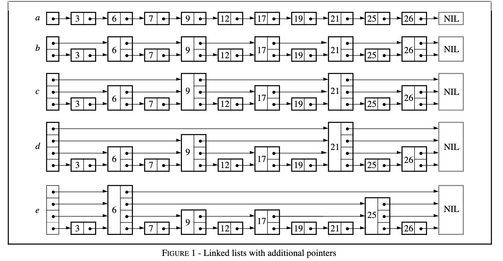
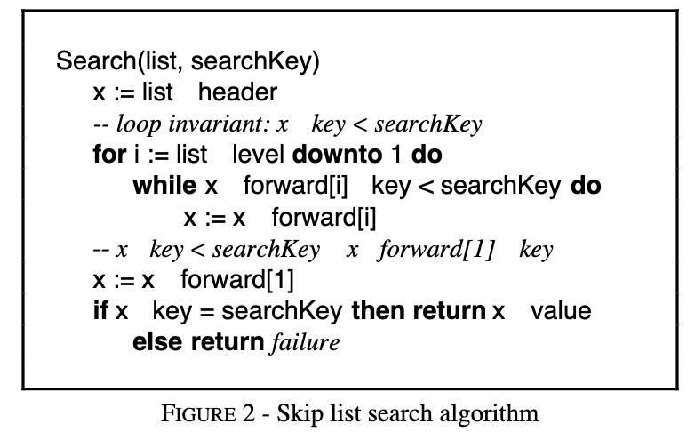
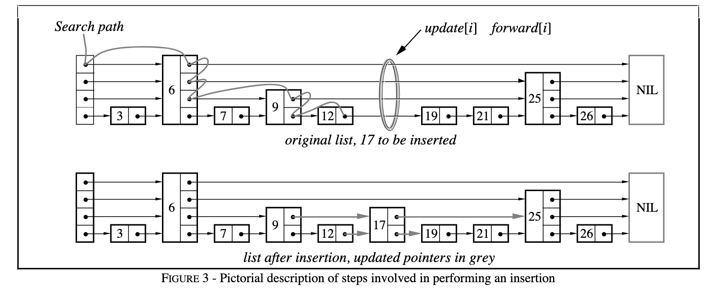
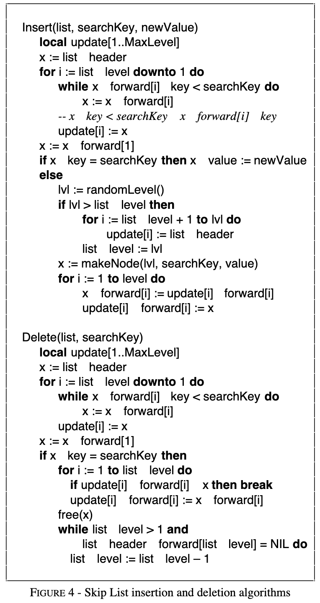
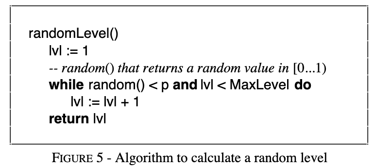

# Skip Lists: A Probabilistic Alternative toBalanced Trees
> Skip lists are a data structure that can be used in place of balanced trees. Skip lists use probabilistic balancing rather than strictly enforced balancing and as a result the algorithms for insertion and deletion in skip lists are much simpler and significantly faster than equivalent algorithms for balanced trees.
> 跳表是一种可以用来替代平衡树的数据结构。跳表使用概率平衡，而不是严格的强制平衡，因此，跳表中的插入和删除算法比平衡树的同等算法要简单得多，速度也快得多。

## William Pugh
Binary trees can be used for representing abstract data types such as dictionaries and ordered lists. They work well when the elements are inserted in a random order. Some sequences of operations, such as inserting the elements in order, produce degenerate data structures that give very poor performance. If it were possible to randomly permute the list of items to be inserted, trees would work well with high probability for any input sequence. In most cases queries must be answered on-line, so randomly permuting the input is impractical. Balanced tree algorithms re-arrange the tree as operations are performed to maintain certain balance conditions and assure good performance.

二叉树可用于表示抽象的数据类型，如字典和有序列表。当元素以随机的顺序插入时，它们工作得很好。一些操作序列，如按顺序插入元素，会产生退化的数据结构，使性能非常差。如果有可能随机地对要插入的项目列表进行排列，那么对于任何输入序列，树都会以很高的概率工作。在大多数情况下，查询必须在线回答，所以随机排列输入是不现实的。平衡树算法在执行操作时重新排列树，以保持一定的平衡条件并保证良好的性能。

Skip lists are a probabilistic alternative to balanced trees. Skip lists are balanced by consulting a random number generator. Although skip lists have bad worst-case performance, no input sequence consistently produces the worst-case performance (much like quicksort when the pivot element is chosen randomly). It is very unlikely a skip list data structure will be significantly unbalanced (e.g., for a dictionary of more than 250 elements, the chance that a search will take more than 3 times the expected time is less than one in a million). Skip lists have balance properties similar to that of search trees built by random insertions, yet do not require insertions to be random.

跳表是平衡树的一种概率性替代方法。跳表是通过咨询随机数发生器来平衡的。尽管跳表的最坏情况下的性能很差，但没有任何输入序列能持续产生最坏情况下的性能（很像随机选择枢轴元素的 quicksort）。一个跳过列表的数据结构不太可能出现明显的不平衡（例如，对于一个超过 250 个元素的字典来说，搜索花费超过预期时间 3 倍的几率小于百万分之一）。跳表的平衡特性类似于通过随机插入建立的搜索树，但不要求插入是随机的。

Balancing a data structure probabilistically is easier than explicitly maintaining the balance. For many applications, skip lists are a more natural representation than trees, also leading to simpler algorithms. The simplicity of skip list algorithms makes them easier to implement and provides significant constant factor speed improvements over balanced tree and self-adjusting tree algorithms. Skip lists are also very space efficient. They can easily be configured to require an average of 1 1/3 pointers per element (or even less) and do not require balance or priority information to be stored with each
node.

以概率方式平衡一个数据结构比显式维持平衡要容易。对于许多应用来说，跳表是一种比树更自然的表示方法，也导致了更简单的算法。跳表算法的简单性使得它们更容易实现，并且与平衡树和自调整树算法相比，提供了显著的恒定系数速度改进。跳表也非常节省空间。它们可以很容易地被配置为每个元素平均需要 1/3 个指针（甚至更少），并且不需要将平衡或优先级信息与每个元素一起存储。

## SKIP LISTS


We might need to examine every node of the list when search-ing a linked list (Figure 1a). If the list is stored in sorted order and every other node of the list also has a pointer to the node two ahead it in the list (Figure 1b), we have to examine no more than n/2 + 1 nodes (where n is the length of the list). Also giving every fourth node a pointer four ahead (Figure 1c) requires that no more than n/4 + 2 nodes be examined. If every (2<sup>i</sup>)<sup>th</sup> node has a pointer 2<sup>i</sup> nodes ahead (Figure 1d), the number of nodes that must be examined can be reduced to log<sub>2</sub>n while only doubling the number of pointers. This data structure could be used for fast searching, but insertion and deletion would be impractical.

在搜索链表时，我们可能需要检查列表的每个节点（图 1a）。如果列表以排序的方式存储，并且列表中的每一个其他节点也有一个指向它前面两个节点的指针（图 1b）。我们必须检查不超过 n / 2 + 1 个节点（其中 n 是列表的长度）。同时，给每一个第四个节点一个指向前面四个结点的指针（图 1c），要求检查的节点不超过 n / 4 + 2。如果每一个 (2<sup>i</sup>) 节点都有一个指向前方 2<sup>i</sup> 节点的指针（图 1d），那么必须检查的节点数量可以减少到 log<sub>2</sub>n，而指针的数量只增加一倍。这种数据结构可用于快速搜索，但插入和删除将是不切实际的。

A node that has k forward pointers is called a level k node. If every (2i)th node has a pointer 2i nodes ahead, then levels of nodes are distributed in a simple pattern: 50% are level 1, 25% are level 2, 12.5% are level 3 and so on. What would happen if the levels of nodes were chosen randomly, but in the same proportions (e.g., as in Figure 1e)? A node’s ith forward pointer, instead of pointing 2i–1 nodes ahead, points to the next node of level i or higher. Insertions or deletions would require only local modifications; the level of a node, chosen randomly when the node is inserted, need never change. Some arrangements of levels would give poor execution times, but we will see that such arrangements are rare. Because these data structures are linked lists with extra pointers that skip over intermediate nodes, I named them skip lists.

一个拥有 k 个前向指针的节点被称为 k 级节点。如果每一个(2i)节点都有一个指向前方的 2i 个节点，那么节点的级别就以一种简单的模式分布：50% 是级别 1，25% 是级别 2，12.5% 是级别 3，依此类推。如果节点的级别是随机选择的，但比例相同（例如，如图 1e），会发生什么？一个节点的第 i 个前向指针，不是指向前面的 2i - 1 个节点，而是指向第 i 级或更高的下一个节点。插入或删除只需要进行局部修改；当节点被插入时，随机选择的节点的级别永远不会改变。某些级别的安排会带来糟糕的执行时间，但我们将看到这种安排是罕见的。因为这些数据结构是带有跳过中间节点的额外指针的链接列表，我把它们命名为跳表。

## SKIP LIST ALGORITHMS

This section gives algorithms to search for, insert and delete elements in a dictionary or symbol table. The Search operation returns the contents of the value associated with the desired key or failure if the key is not present. The Insert operation associates a specified key with a new value (inserting the key if it had not already been present). The Delete operation deletes the specified key. It is easy to support additional operations such as “find the minimum key” or “find the next key”.

本节给出了在字典或符号表中搜索、插入和删除元素的算法。搜索操作返回与所需键相关的值的内容，如果键不存在则返回失败。Insert 操作将一个指定的键与一个新的值联系起来（如果该键还没有出现，则插入该键）。删除操作删除了指定的键。支持额外的操作是很容易的，比如 "寻找最小的键 "或 "寻找下一个键"。

Each element is represented by a node, the level of which is chosen randomly when the node is inserted without regard for the number of elements in the data structure. A level i node has i forward pointers, indexed 1 through i. We do not need to store the level of a node in the node. Levels are capped at some appropriate constant MaxLevel. The level of a list is the maximum level currently in the list (or 1 if the list is empty). The header of a list has forward pointers at levels one through MaxLevel. The forward pointers of the header at levels higher than the current maximum level of the list point to NIL.

每个元素由一个节点表示，节点的级别是在插入节点时随机选择的，不考虑数据结构中元素的数量。一个 i 级节点有 i 个前向指针，索引为 1 到 i。等级的上限是某个适当的常数 MaxLevel。列表的级别是当前列表中的最大级别（如果列表为空则为 1）。列表的头在级别一到 MaxLevel 之间有前向指针。在高于列表当前最大级别的头的前向指针指向 NIL。

### Initialization
An element NIL is allocated and given a key greater than any legal key. All levels of all skip lists are terminated with NIL. A new list is initialized so that the the level of the list is equal to 1 and all forward pointers of the list’s header point to NIL.

一个元素 NIL 被分配并被赋予一个大于任何合法键的键。所有跳表的所有级别都以 NIL 结束。一个新的列表被初始化，因此该列表的级别等于 1，并且该列表头的所有前向指针都指向 NIL。

### Search Algorithm


We search for an element by traversing forward pointers that do not overshoot the node containing the element being searched for (Figure 2). When no more progress can be made at the current level of forward pointers, the search moves down to the next level. When we can make no more progress at level 1, we must be immediately in front of the node that contains the desired element (if it is in the list).

我们通过遍历不超过包含被搜索元素的节点的前向指针来搜索一个元素（图 2）。当在当前级别的前向指针上无法取得更多进展时，搜索就会下移到下一个级别。当我们在第1层无法取得更多进展时，我们必须立即在包含所需元素的节点前面（如果它在列表中）。

### Insertion and Deletion Algorithms


To insert or delete a node, we simply search and splice, as shown in Figure 3. Figure 4 gives algorithms for insertion and deletion. A vector update is maintained so that when the search is complete (and we are ready to perform the splice), update[i] contains a pointer to the rightmost node of level i or higher that is to the left of the location of the insertion/deletion. 

要插入或删除一个节点，我们只需搜索和拼接，如图 3 所示。图 4 给出了插入和删除的算法。一个向量update 被维护着，这样当搜索完成时（我们准备好进行拼接），update[i]包含一个指向插入/删除位置左侧的第i级或更高级别的最右边节点的指针。

If an insertion generates a node with a level greater than the previous maximum level of the list, we update the maximum level of the list and initialize the appropriate portions of the update vector. After each deletion, we check if we have deleted the maximum element of the list and if so, decrease the maximum level of the list.

如果一个插入产生的节点的级别大于列表中以前的最大级别，我们就更新列表的最大级别，并初始化更新向量的适当部分。每次删除后，我们检查是否删除了列表中的最大元素，如果是，则减少列表的最大级别。



### Choosing a Random Level


Initially, we discussed a probability distribution where half of the nodes that have level i pointers also have level i+1 pointers. To get away from magic constants, we say that a fraction p of the nodes with level i pointers also have level i+1 pointers. (for our original discussion, p = 1/2). Levels are generated randomly by an algorithm equivalent to the one in Figure 5. Levels are generated without reference to the number of elements in the list.

最初，我们讨论了一个概率分布，即有 i 级指针的节点中有一半也有 i + 1 级的指针。为了摆脱神奇的常数，我们说有 i 级指针的节点的一部分 p 也有 i + 1 级的指针。(对于我们原来的讨论，p = 1/2）。等级是由相当于图 5 中的算法随机生成的。级别的生成不参考列表中元素的数量。

### At what level do we start a search? Defining L(n)
In a skip list of 16 elements generated with p = 1/2, we might happen to have 9 elements of level 1, 3 elements of level 2, 3 elements of level 3 and 1 element of level 14 (this would be very unlikely, but it could happen). How should we handle this? If we use the standard algorithm and start our search at level 14, we will do a lot of useless work.

在一个以 p = 1/2 生成的 16 个元素的跳表中，我们可能碰巧有 9 个级别的元素，3 个级别的元素，3 个级别的元素和 1 个级别的元素 14（这将是非常不可能的，但它可能发生）。我们应该如何处理这种情况？如果我们使用标准算法，从第 14 层开始搜索，我们会做很多无用功。

Where should we start the search? Our analysis suggests that ideally we would start a search at the level L where we expect 1/p nodes. This happens when L = log1/p n. Since we will be referring frequently to this formula, we will use L(n) to denote log1/p n.

我们应该从哪里开始搜索？我们的分析表明，理想情况下，我们会在预期有 1/p 节点的 L 层开始搜索。这发生在 L = log<sub>1/p</sub>n 的时候。由于我们将经常提到这个公式，我们将用 L(n) 来表示 log<sub>1/p</sub>n。

There are a number of solutions to the problem of deciding how to handle the case where there is an element with an unusually large level in the list.

对于决定如何处理列表中存在一个级别异常大的元素的情况，有很多解决方案。

+ Don’t worry, be happy. Simply start a search at the highest level present in the list. As we will see in our analysis, the probability that the maximum level in a list of n elements is significantly larger than L(n) is very small. Starting a search at the maximum level in the list does not add more than a small constant to the expected search time. This is the approach used in the algorithms described in this paper.
+ Use less than you are given. Although an element may contain room for 14 pointers, we don’t need to use all 14. We can choose to utilize only L(n) levels. There are a number of ways to implement this, but they all complicate the algorithms and do not noticeably improve performance, so this approach is not recommended.
+ Fix the dice. If we generate a random level that is more than one greater than the current maximum level in the list, we simply use one plus the current maximum level in the list as the level of the new node. In practice and intuitively, this change seems to work well. However, it totally destroys our ability to analyze the resulting algorithms, since the level of a node is no longer completely random. Programmers should probably feel free to implement this, purists should avoid it.

+ 别担心，开心点。只需从列表中存在的最高级别开始搜索。正如我们在分析中所看到的，在一个有 n 个元素的列表中，最高级别明显大于 L(n) 的概率是非常小的。从列表中的最高层开始搜索，对预期搜索时间的增加不会超过一个小常数。这就是本文所描述的算法中使用的方法。
+ 使用的数量要比给你的少。尽管一个元素可能包含 14 个指针的空间，但我们不需要使用所有 14 个。我们可以选择只利用 L(n)级。有很多方法可以实现这一点，但它们都会使算法复杂化，而且不会明显地提高性能，所以不推荐这种方法。
+ 修复骰子。如果我们生成的随机等级比列表中的当前最大等级大 1 以上，我们只需用 1 加上列表中的当前最大等级作为新节点的等级。在实践中和直觉上，这种改变似乎效果不错。然而，它完全破坏了我们分析结果算法的能力，因为节点的级别不再是完全随机的。程序员也许应该自由地实现这一点，纯粹主义者应该避免这样做。

### Determining MaxLevel
Since we can safely cap levels at L(n), we should choose MaxLevel = L(N) (where N is an upper bound on the number of elements in a skip list). If p = 1/2, using MaxLevel = 16 is appropriate for data structures containing up to 2<sup>16</sup> elements

由于我们可以安全地将级别限定在 L(n)，我们应该选择 MaxLevel = L(N)（其中N是一个跳过列表中元素数量的上限）。如果 p = 1/2，使用 MaxLevel=16 适合于包含多达 2<sup>16</sup> 个元素的数据结构

## ANALYSIS OF SKIP LIST ALGORITHMS
The time required to execute the Search, Delete and Insert operations is dominated by the time required to search for the appropriate element. For the Insert and Delete operations, there is an additional cost proportional to the level of the node being inserted or deleted. The time required to find an element is proportional to the length of the search path, which is determined by the pattern in which elements with different levels appear as we traverse the list.

执行搜索、删除和插入操作所需的时间主要是搜索适当元素所需的时间。对于插入和删除操作，有一个额外的成本与被插入或删除的节点的级别成正比。找到一个元素所需的时间与搜索路径的长度成正比，这是由我们在遍历列表时不同级别的元素出现的模式决定的。

### Probabilistic Philosophy
The structure of a skip list is determined only by the number elements in the skip list and the results of consulting the random number generator. The sequence of operations that produced the current skip list does not matter. We assume an adversarial user does not have access to the levels of nodes; otherwise, he could create situations with worst-case running times by deleting all nodes that were not level 1.

跳过列表的结构只由跳过列表中的数字元素和咨询随机数发生器的结果决定。产生当前跳过列表的操作序列并不重要。我们假设一个对抗性的用户不能访问节点的级别；否则，他可以通过删除所有非1级的节点来创造最坏情况下的运行时间的情况。

The probabilities of poor running times for successive operations on the same data structure are NOT independent; two successive searches for the same element will both take exactly the same time. More will be said about this later.

同一数据结构上的连续操作的不良运行时间的概率不是独立的；对同一元素的两个连续的搜索都会花费完全相同的时间。关于这一点，后面会有更多介绍。

### Analysis of expected search cost
We analyze the search path backwards, travelling up and to the left. Although the levels of nodes in the list are known and fixed when the search is performed, we act as if the level of a node is being determined only when it is observed while backtracking the search path.

我们向后分析搜索路径，向上和向左移动。尽管在进行搜索时，列表中的节点的级别是已知的和固定的，但我们的做法是，只有在回溯搜索路径时观察到一个节点的级别才会被确定。

At any particular point in the climb, we are at a situation similar to situation a in Figure 6 – we are at the ith forward pointer of a node x and we have no knowledge about the levels of nodes to the left of x or about the level of x, other than that the level of x must be at least i. Assume the x is not the header (the is equivalent to assuming the list extends infinitely to the left). If the level of x is equal to i, then we are in situation b. If the level of x is greater than i, then we are in situation c. The probability that we are in situation c is p. Each time we are in situation c, we climb up a level. Let C(k) = the expected cost (i.e, length) of a search path that climbs up k levels in an infinite list:
```
    C(0) = 0
    C(k) = (1–p) (cost in situation b) + p (cost in situation c)
    
    By substituting and simplifying, we get:
    
    C(k) = (1–p) (1 + C(k)) + p (1 + C(k–1))
    C(k) = 1/p + C(k–1)
    C(k) = k/p
```
Our assumption that the list is infinite is a pessimistic assumption. When we bump into the header in our backwards climb, we simply climb up it, without performing any leftward movements. This gives us an upper bound of (L(n)–1)/p on the expected length of the path that climbs from level 1 to level L(n) in a list of n elements.

We use this analysis go up to level L(n) and use a different analysis technique for the rest of the journey. The number of leftward movements remaining is bounded by the number of elements of level L(n) or higher in the entire list, which has an expected value of 1/p.

We also move upwards from level L(n)  to the maximum level in the list. The probability that the maximum level of the list is a greater than k is equal to 1–(1–pk)n, which is at most npk. We can calculate the expected maximum level is at most L(n) + 1/(1–p). Putting our results together, we find

```
Total expected cost to climb out of a list of n elements
    L(n)/p + 1/(1–p)
```
which is O(log n).

(暂缓)

## CONCLUSIONS
From a theoretical point of view, there is no need for skip lists. Balanced trees can do everything that can be done with skip lists and have good worst-case time bounds (unlike skip lists). However, implementing balanced trees is an exacting task and as a result balanced tree algorithms are rarely implemented except as part of a programming assignment in a data structures class.

从理论的角度来看，没有必要使用跳表。平衡树可以做所有可以用跳表做的事情，并且有很好的最坏情况下的时间界限（与跳表不同）。然而，实现平衡树是一项严格的任务，因此平衡树算法很少被实现，除非是作为数据结构课中编程作业的一部分。

Skip lists are a simple data structure that can be used in place of balanced trees for most applications. Skip lists algorithms are very easy to implement, extend and modify. Skip lists are about as fast as highly optimized balanced tree algorithms and are substantially faster than casually implemented balanced tree algorithms.

跳表是一种简单的数据结构，可以代替平衡树用于大多数应用。跳过列表的算法非常容易实现、扩展和修改。跳过列表的速度与高度优化的平衡树算法差不多，而且比随便实现的平衡树算法要快很多。
