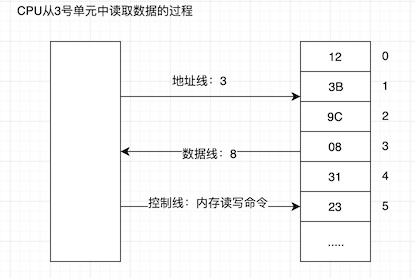

# 基础知识

## 机器语言
机器语言是机器指令的集合。计算机是可以执行机器指令，进行运算的机器。电子计算机的机器指令是一列**二进制数字**。计算机将🈯之转变为一列高低电平，以使电子计算机的电子器件受到驱动，尽心运算。计算机中有一个称之为CPU的芯片。CPU是一种微处理器。人们常提到的计算机是指由CPU和其他受CPU直接或间接控制的芯片、器件、设备组成的计算机系统。

## 汇编语言的产生
由于机器语言难于辨别和记忆，不利于整个产业的发展，于是汇编语言产生了。汇编指令是机器指令便于记忆的书写格式。因为有汇编指令的产生，所以需要有一个编译器，将汇编语言编译为机器语言，从而让计算机能够识别并执行。具体工作流程如下所示：

    汇编源代码 -> 编译器 -> 机器码 -> 计算机

## 汇编语言的组成
1. 汇编指令：机器码的助记符，有对应的机器码。
2. 伪指令：没有对应的机器码，由编译器执行，计算机并不执行。
3. 其他符号：如+，-，*，/等，由编译器识别，没有对应的机器码。

## 存储器
必须向CPU提供指令和数据，CPU才能工作。指令和数据在存储器中存放，也就是人们平时所说的内存。

## 指令和数据
指令和数据是应用上的概念。在内存或磁盘上，指令和数据没有任何区别，都是二进制信息。CPU工作时将根据指令将相关信息识别成指令或者数据，为同样的信息提供了不同的含义。

## 存储单元
存储器被划分成若干个存储单元，每个存储单元从0开始顺序编号，例如一个存储器有128个存储单元，编号从0~127。 
常见的计量单位有
 
    1KB = 1024B   1MB = 1024KB  1GB = 1024MB  1TB = 1024GB

## CPU对存储器的读写
CPU要从内存中读取数据，首先要确定存储单元的地址，也就是说要先确定它要读取哪一个存储单元的数据。简言之，CPU要想进行数据的读写，必须和外部器件进行下面3类信息的交互。
1. 存储单元的地址（地址信息）
2. 器件的选择，读或写的命令（控制信息）
3. 读或写的数据（数据信息）

那么，CPU是通过什么叫地址、数据和控制信息传到存储器芯片中的呢？电子计算机能处理、传输的信息都是电信号，电信号当然要通过导线传送。在计算机中专门和连接CPU和其他芯片的导线，通常称为总线。总线从逻辑上分为3类：地址总线、控制总线和数据总线。下图是CPU从3号单元中读取数据的过程：

CPU从内存中读取数据的过程
1. CPU通过地址线将地址信息3发出。
2. CPU通过控制线发出内存或命令，选中存储器芯片，并通知它，将要从中读取数据
3. 存储器将3号单元中的数据8通过数据线送入CPU。

## 地址总线
CPU是通过地址总线来指定存储器单元的。可见地址总线上能传送多少个不同的信息，CPU就可以对多少个存储单元进行寻址。 
假设：一个CPU有10根地址总线，由于一根导线可以传送的稳定状态只有两种：高电平和低电平。用二进制表示就是0和1，10根导线可以传送10位二进制数据。也就是2的10次方。最小数为0，最大为1023. 
一个CPU有N根地址线，则这个CPU的地址总线的宽度为N，这样的CPU最多可以寻找2的N次方个内存单元。

## 数据总线
CPU与内存或其他器件之间的数据传送是通过数据总线来进行的。数据总线的宽度决定了CPU和外界的数据传送速度。8个数据总线一次可传送8位二进制数据即一个字节。16根数据总线一次可传送2个字节。

## 控制总线
CPU对外部器件的控制是通过控制总线来进行的。在这里控制总线是个总称，控制总线是一些不同控制线的集合。有多少根控制总线，就意味着CPU提供了对外部器件的多少种控制。所以，控制总线的宽度决定了CPU对外部器件的控制能力。前面所讲的内存读或写明了是由几根控制线综合发出的，其中有一根称为”读信号输出”的控制线负责由CPU向外传送读信号，CPU向该控制线输出低电平表示将要读取数据。有一根成为“写信号输出”的控制线则负责传送写信号。

### 小结：
1. 汇编指令是机器指令的助记符，同机器指令一一对应。
2. 每一种CPU都有自己的汇编指令集
3. CPU可以直接使用的信息在存储器中存放。
4. 在存储器中指令和数据没有区别，都是二进制数据。
5. 存储单元从零开始编号。
6. 一个存储单元可以存放8个bit，即8位二进制数。
7. 每一个CPU芯片都有许多管脚，这些管脚和总线相连。也可以说，这些管脚引出总线。一个CPU可以引出3种总线的宽度标志了这个CPU的不同方面的性能：
   + 地址总线的宽度决定了CPU的寻址能力；
   + 数据总线的宽度决定了CPU与其他器件进行数据传送时的一次数据传送量；
   + 控制总线的宽度决定了CPU对系统中其他器件的控制能力；

## 相关概念概述
1. 内存地址空间：假设一个CPU的地址空间是10，那么可以寻址1024个内存单元，这1024个可寻到的内存单元就构成这个CPU的内存地址空间。
2. 主板：每台PC都有一个主板，主板上有核心器件和主要器件，这些器件通过总线（地址总线、数据总线、控制总线）相连。这些器件有CPU、存储器、外围芯片组、扩展插槽等。
3. 接口卡：计算机系统中，所有可用程序控制其工作的设备，必须受到CPU的控制。CPU对外部设备都不能直接控制，如显示器、音箱、打印机等。直接控制这些设备进行工作的是插在扩展插槽上的接口卡。扩展插槽通过总线和CPU相连，所以接口卡也通过总线同CPU相连，CPU可以通过总线向接口卡发送命令，接口卡根据CPU的命令控制外设进行工作。
4. 各类存储器芯片：一台PC机中，装有多个存储器芯片，从物理连接上看，它们彼此独立。
   + 从读写属性上来看可分为两类：
    + 随机存储器（RAM）：可读可写，但必须带电存储，断电后存储内容丢失；
    + 只读存储器（ROM）：只读不能写。断电后内容不丢失。
   + 从功能和连接上又可分为以下几类。
     + 随机存储器：用于存放供CPU使用的绝大部分程序和数据。主随机存储器一般由两个位置上的RAM组成，装在主板上的RAM和插在扩展插槽上的RAM。
     + 装有BIOS（Basic Input/Output System)的ROM：BIOS是由主板和各类接口卡厂商提供的软件系统，可以通过它利用该硬件设备进行最基本的输入输出。在主板和某些接口卡上插有存储相应BIOS的ROM。
     + 接口卡的RAM：某些接口卡需要对大批量输入、输出数据进行暂时存储，在其上装有RAM。
  
  ## 内存地址空间
  上述的那些存储器，在物理上是独立的期间，但是在以下两点上相同.
  + 都和CPU的总线相连
  + CPU对它们进行独活写的时候都通过控制线发出内存读写命令。
这也就是说，CPU在操控它们的时候，把它们都当作内存来对待，把它们总的看作一个若干存储单元组成的逻辑存储器，且它的容量受CPU寻址能力的限制，这个逻辑存储器就是我们所说的内存地址空间。