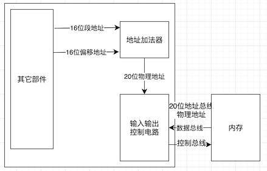

# 寄存器
一个典型的CPU由运算器、控制器、寄存器等器件构成，这些器件靠内部总线相连。简单来讲：
+ 运算器进行信息处理
+ 寄存器进行信息存储
+ 控制器控制各个器件进行工作
+ 内部总线连接各种期间，在它们之间进行数据的传送。

8086CPU有14个寄存器，每个寄存器都有一个名称。这些寄存器是：

    AX、BX、CX、DX、SI、DI、SP、BP、IP、CS、SS、DS、ES、PSW。

## 通用寄存器
8086CPU的所有寄存器都是16位的，可以存放两个字节。AX、BX、CX、DX这4个寄存器通常用来存放一般性的数据，被称为通用寄存器。并且为了兼容上代CPU编写的程序，这几个通用寄存器都可分为独立使用的8位寄存器来使用。
+ AX可分为AH和AL；
+ BX可分为BH和BL；
+ CX可分为CH和CL；
+ DX可分为DH和DL；
  
## 字在寄存器中的存储
出于对兼容性的考虑，8086CPU可以一次性处理一下两种尺寸的数据
+ 字节：记为byte，一个字节由8个bit组成，可以存在8位寄存器中。
+ 字：记为word，一个字由两个字节组成，这两个字节分别称为这个字的高位字节和低位字节。

## 8086CPU给出物理地址的方法
+ 物理地址：由于CPU访问内存单元的时候，要给出内存单元的地址。所有的内存单元构成的存储空间是一个一维的线性空间，每一个内存单元在这个空间中都有唯一的地址，我们将这个唯一的地址称为物理地址。
+ 16位结构的CPU：概括的讲，16位结构描述了一个CPU具有几方面的结构特性。
  + 运算器一次最多可以处理16位的数据；
  + 寄存器的最大宽度为16位；
  + 寄存器和运算器之间的通路为16位；

### 8086CPU给出物理地址的方法：
8086CPU有20位地址总线，可以传送20位地址，达到1MB的寻址能力。8086CPU又是16位结构，在内部一次性处理、传输、暂时存储的地址为16位。从8086CPU的内部结构来看，如果将地址简单从内部发出，那么它只能送出16位的地址，表现出的寻址能力只有64KB。

    8086CPU采用一种在内部用两个16位地址合成的方法来形成一个20位的物理地址。



如图所示：当8086CPU要读写内存时：
1. CPU中的相关部件提供两个16位的地址，一个称为段地址，一个成为偏移地址；
2. 段地址和偏移地址通过内部总线送入一个称为地址加法器的部件；
3. 地址加法器将两个16位地址合成为一个20位的物理地址；
4. 地址加法器通过内部总线将20位物理地址送入输入输出控制电路；
5. 输入输出控制电路将20位物理地址送上地址总线；
6. 20位物理地址被地址总线传送到存储器。

```
物理地址 = 段地址 x 16 + 偏移地址
地址加法器采用该公式的方法将段地址和偏移地址合成物理地址。
```

## 段寄存器、CS和IP
8086CPU中有8个段寄存器：CS、DS、SS、ES。当8086CPU要访问内存时由这4个段寄存器提供内存单元的段地址。<br/>
CS和IP是8086中两个最关键的寄存器，它们指示了CPU当前要读取指令的地址。CS为代码段寄存器，IP为指令指针寄存器，任意时刻，设CS中的内容为M，IP中的内容为N，8086CPU将从内存 M x 16 + N 单元开始，读取一条指令并执行。也就是说：任意时刻，CPU将CS:IP指向的内容当作指令执行。

1. 段地址在8086CPU的段寄存器中存放。当8086CPU要访问内存时，由段寄存器提供内存单元的段地址。8086CPU有4个段寄存器，其中CS用来存放指令的段地址。
2. CS存放指令的段地址，IP存放指令的偏移地址。
3. 8086机中，任意时刻，CPU将CS:IP指向的内容当作指令执行。
4. 8086CPU的工作过程：
   1. 从CS:IP指向的内存单元读取指令，读取的指令进入指令缓冲器；
   2. IP指向下一条指令；
   3. 执行指令。（转到步骤1，重复这个过程）
5. 8086CPU提供转移指令修改CS、IP的内容。

## 数据段、内存中字的存储
+ 8086CPU中，用16位寄存器来存储一个字。高8位存放高位字节，低8位存放低位字节（小端模式）。在内存中存储时，由于内存单元是字节单元（一个单元存放一个字节），则一个字要用两个地址连续的内存单元来存放。<br/>
+ 字单元：存放一个字形数据（16位）的内存单元，有两个地址连续的内存单元组成。
+ 对于8086PC机，可以根据需要，将一组内存单元定义为一个段。可以将一组长度为N（N ≤ 64KB）、地址连续、起始地址为16的倍数的内存单元当作专门存储数据的内存空间，从而定义了一个数据段。
+ 用mov指令访问内存单元，可以在mov指令中只给出单元的偏移地址，此时，段地址默认在DS寄存器中。
+ [address]表示一个偏移地址为address的内存单元。
+ 在内存和寄存器之间传送字形数据时，高地址单元和高8位寄存器、低地址单元和低8位寄存器相对应。
+ mov、add、sub是具有两个操作对象的指令。jmp是具有一个操作对象的指令。

## CPU提供的栈机制
8086提供入栈和出栈指令。最基本的两个是PUSH（入栈）和POP（出栈）。比如，push ax表示将寄存器ax的数据送入栈中，pop ax 表示从栈顶取出数据送入ax。8086CPU的入栈操作都是以字为单位进行的。

### 栈的综述
1. 8086CPU提供了栈操作机制，在SS、SP中存放栈顶的段地址和偏移地址；提供入栈和出栈指令，它们根据SS:SP指示的地址，按照栈的方式访问内存单元。
2. push指令的执行操作：
   1. SP = SP - 2;
   2. 向 SS : SP 指向的字单元中送入数据。
3. pop指令的执行操作：
   1. 从 SS : SP 指向的字单元中读取数据；
   2. SP = SP + 2;
4. 任意时刻，SS ：SP 指向栈顶元素
5. 8086CPU只记录栈顶，栈空间的大小需要程序员自己管理。
6. 用栈来暂存以后需要恢复的寄存器的内容时，寄存器出栈的顺序要和入栈的顺序相反。
7. push、pop实质上是一种内存传送指令，注意它们的灵活运用。

## 段的综述
+ 我们可以将一段内存定义为一个段，用一个段地址指示段，用偏移地址访问段内的单元。这完全是程序员自己的安排。
+ 可以用一个段存放数据，将它定义为“数据段”
+ 可以用一个段存放代码，将它定义为“代码段”
+ 可以用一个段当作栈，将它定义为“栈段”
+ 程序员可以这样安排，但若要让CPU按照这种安排来访问这些段，则需要
  + 对于数据段，将它的段地址存放在DS中，用mov、add、sub等访问内存单元的指令时，CPU就将我们定义的数据段中的内容当作数据来访问；
  + 对于代码段，将它的段地址存放在CS中，将段中第一条指令的偏移地址放在IP中，这样CPU就将执行我们定义在代码段中的指令；
  + 对于栈段，将它的段地址放在SS中，将栈顶单元的偏移地址放在SP中，这样CPU在需要进行栈操作的时候，比如执行push、pop指令等，就将我们定义的栈段当作栈空间来使用。
+ 可见，不管我们如何安排，CPU将内存中的某段内容当作代码，是因为CS:IP指向了那里；CPU将某段内存当作栈，是因为SS:SP指向了那里，我们一定要清楚，什么是我们的安排，以及如何让CPU按照我们的安排行事，要非常清楚CPU的工作机理，才能在控制CPU按照我们的安排运行的时候做到游刃有余。