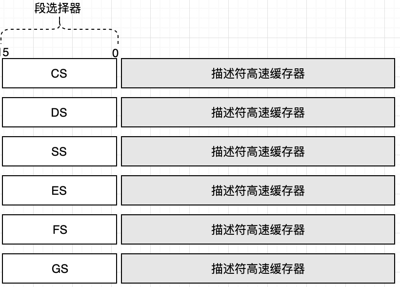
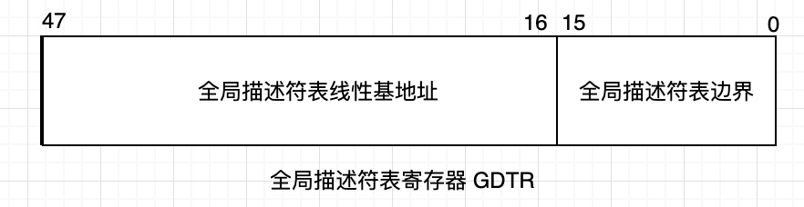
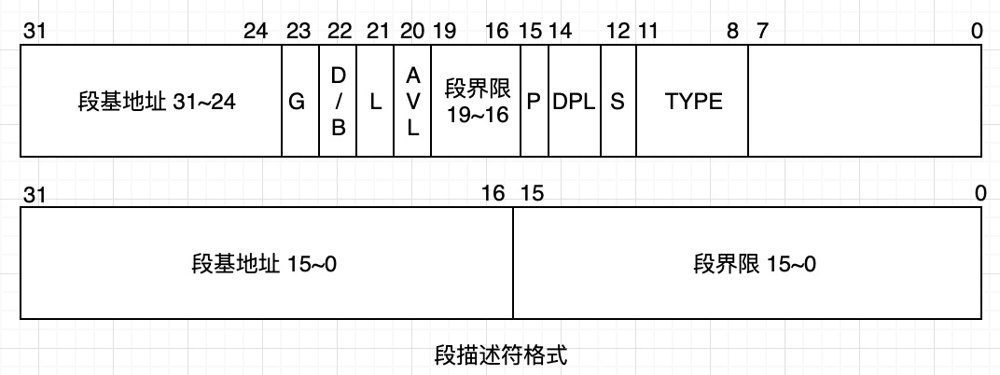
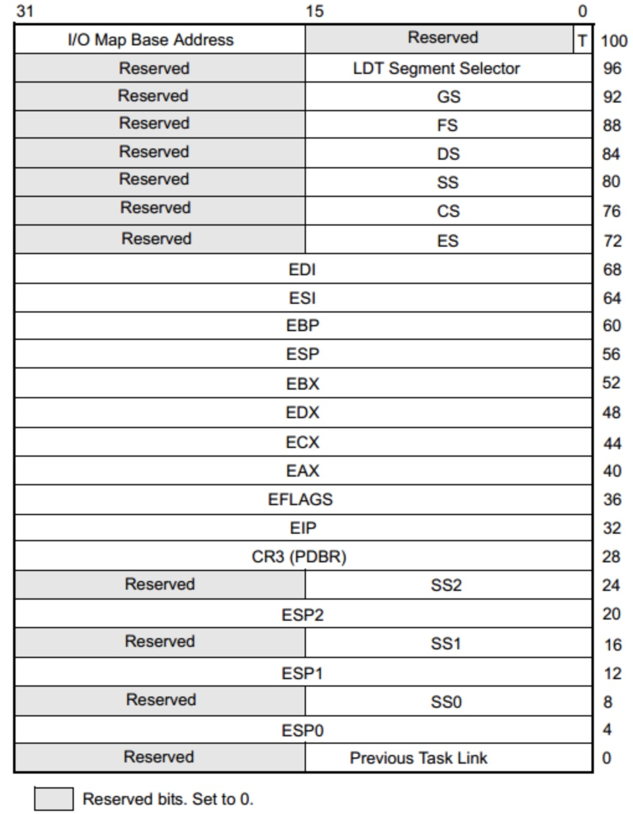
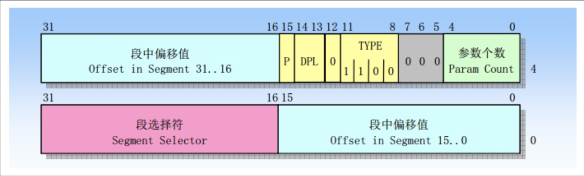
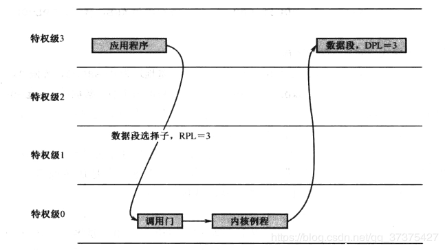
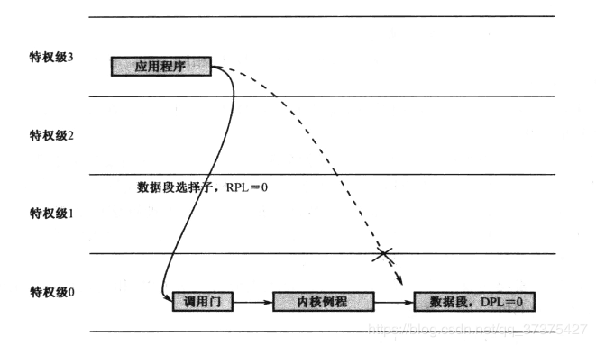
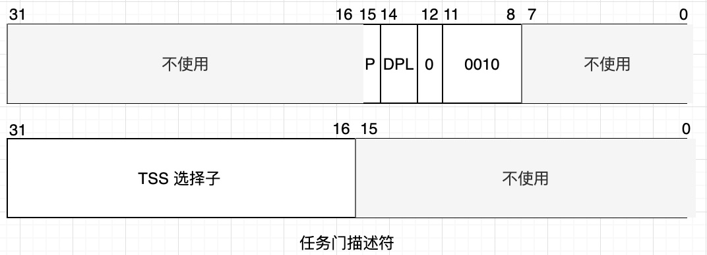
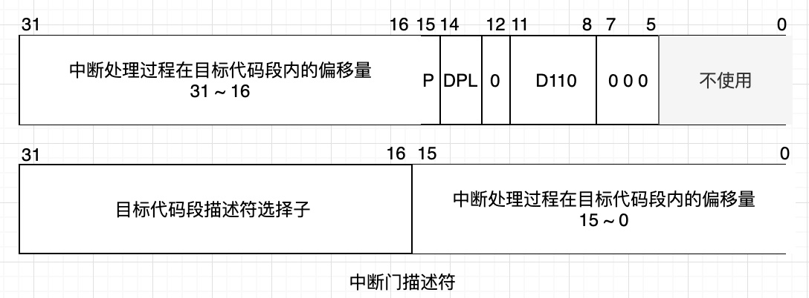
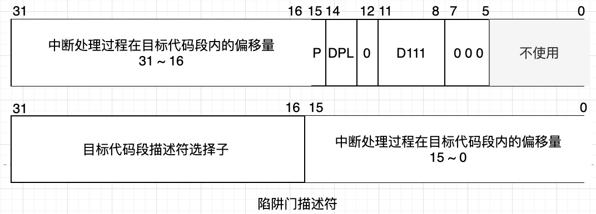

## 32 位 x86 处理器编程架构
Intel 32 位处理器架构简称 IA-32（Intel Architecture，32-bit），是以 1978 年 8086 处理器为基础发展出来的。32位处理器的功能包括高速缓存、流水线、浮点处理部件、多处理器管理、多媒体扩展、乱序执行、分支预测、虚拟化、温度和电源管理等。

### IA-32 架构的基本执行环境
#### 寄存器的扩展
在16位处理内，由 8 个通用寄存器 AX、BX、CX、DX、SI、DI、BP 和 SP。其中，前 4 个还可以拆分成两个独立的 8 位寄存器来用，即 AH、AL、BH、BL、CH、CL、DH、DL。32 位处理器在 16 位处理器的基础上，扩展了这 8 个通用寄存器的长度，使之达到 32 位。扩展后的寄存器命名分别是 EAX、EBX、ECX、EDX、ESI、EDI、EBP、ESP。其他类似扩展的寄存器还有 标志寄存器 EFLAGS 和 EIP。它们都兼容以前的使用方式，即低 16 位保持兼容。
在 32 位模式下，传统的段寄存器，如 CS、SS、DS、ES，保存的不再是 16 位段基址，而是**段的选择子**，用于选择所要访问的段，因此，它也叫段选择器。除了段选择器之外，每个段寄存器还包括一个不可见部分，称为描述符高速缓存器，里面有段的基地址和各种访问属性。这部分内容程序不可访问，由处理器自动使用。
另外，32 为处理器增加了两个额外的段寄存器 FS 和 GS。



#### 基本的工作模式
经典的 8086 只有一种工作模式，即实模式。80286 第一次提出了保护模式的概念，在保护模式下，段寄存器保存的不再是段地址，而是段选择子。计算线性地址时，不再用段地址左移来计算，真正的段物理基地址从段寄存器的描述符高速缓存器中，计算线性地址时，由描述符中的段基地址加上段内偏移得到。
80386，以及后续的 32 位处理器，都兼容实模式，可以运行实模式下的 8086 程序。而且，在刚加电时，这些处理器都自动处于实模式下，此时，它相当于一个非常快速的8086 处理器，只有在进行一番设置之后，才能运行在保护模式下。

#### 线性地址
为 IA-32 处理器编程，访问内存时，需要在程序中给出段地址和偏移量，因为分段是 IA-32 架构的基本特征之一。传统上，段地址和偏移地址称为逻辑地址，偏移地址叫做有效地址，在指令中给出有效地址的方式叫做寻址方式。
段的管理时由处理器的段部件负责进行的，段部件将段地址和偏移地址相加，得到访问内存的地址。如果没有开启页功能的话，段部件产生的地址就是物理地址。
线性地址的概念用来描述任务的地址空间。IA-32 处理器上的每个任务都拥有 4GB 的虚拟内存空间，这是一段长 4GB 的平坦空间，就像一段平直的线段，因此叫线性地址空间。相应地，由段部件产生的地址，就对应着线性地址空间上的每一个点，这就是线性地址。

#### 现代处理器的结构和特点
##### 流水线
早在8086时代，处理器就已经有了指令预取队列。当指令执行时，如果总线是空闲的（没有访问内存的操作），就可以在指令执行的同时预取指令并提前译码，这种做法大大加快了程序的执行速度。
处理器执行一条指令的操作大致分为从内存中取指令、译码、执行。为了提高处理器的执行效率和速度，可以把一条指令的执行过程分解成若干个细小的步骤，并分配给相应的单元来完成。各个单元的执行时独立的、并行的。如此一来，各个步骤的执行在时间上就会重叠起来，这种执行指令的方法就是流水线技术。

##### 高速缓存
寄存器的速度是很快的，原因在于它使用了触发器，这是一种利用反馈原理制作的存储电路，触发器的工作速度是纳秒级别的，当然也可以用来作为内存的基本单元，即静态存储器（SRAM），缺点是成本太高，价格不菲。所以，制作内存芯片的材料一般是电容和单个的晶体管，由于电容需要定时刷新，使得它的访问速度变得很慢，通常是几十个纳秒。因此，通常叫做动态存储器（DRAM）。接着，硬盘是机电设备，是机械和电子的混合体，它的速度最慢，通常在毫秒级。
在这种情况下，因为需要等待内存和硬盘这样的慢速设备，处理器便无法全速运行。为了缓解这一矛盾，高速缓存技术应运而生。高速缓存是处理器与内存（DRAM）之间的一个静态存储器，容量较小，但速度可以与处理器匹配。
高速缓存的用处源于程序在运行时所具有的局部性规律。程序常常访问最近访问过的指令和数据，或者与它们相邻的指令和数据。
每当处理器要访问内存时，首先检索高速缓存，如果要访问的内容已经在高速缓存中，那么可以用极快的速度直接从高速缓存中取得，这称为命中（Hit）；否在称为不中（miss）；在不中的情况下，处理器在取得需要的内容之前必须重新装载高速缓存，而不是直接到内存中去取那个内容。高速缓存的装载是以块为单位的，包括那个所需数据的邻近内容。为此，需要额外的时间来等待块从内存载入高速缓存，在该过程中所损失的时间称为不中惩罚。

##### 乱序执行
为了实现流水线技术，需要将指令拆分成更小的可独立执行部分，即拆分成微操作（micro-operation）。若两个微操作之前处理机认为没有顺序关系，处理器便可以在必要的时候乱序执行。

##### 分支目标预测
流水线并不是百分之百完美的解决方案。实际上，有很多潜在的因素会使得流水线不能达到最佳的效率。一个典型的情况是，如果遇到一条转移指令，则后面那些进入流水线的指令就都无效了。换句话说，我们必须清空流水线，从要转移到的目标位置处重新取指令放入流水线。
流水线最大的问题时代码中经常存在分支。举个例子来说，一个条件转移允许指令流前往任意两个方向。如果这里只有一个流水线，那么，直到那个分支开始执行，在此之前，处理器讲不知道应该用哪个分支填充流水线。流水线越长，处理器在用错误的分支填充流水线时，浪费的时间越多。
为了解决这个问题，在 1996 年的 Pentium Pro 处理器上，引入了分支预测技术。分支预测的核心问题是，转移是发生还是不会发生。在处理器内部，有一个小容量的高速缓存器，较分支目标缓存器（Branch Target Buffer，BTB）。当处理器执行了一条分支语句后，它会在 BTB 中记录当前指令的地址。分支目标的地址，以及本次分支预测的结果。下一次，在那条转移指令实际执行前，处理器会查找 BTB，看有没有最近的转移记录。如果能找到对应的条目，则推测执行和上一次相同的分支，把该分支的指令送入流水线。当该指令实际执行时，如果预测是失败的，那么，就清空流水线，同时刷新 BTB 中的记录，这个代价较大。

### 进入保护模式
在多用户、多任务时代，内存中会有多个用户应用程序在同时运行。为了使它们彼此隔离，防止因某个程序的编写错误或者崩溃影响到操作系统和其他应用程序，使用保护模式是非常有必要的。

#### 全局描述符表
为了让程序在内存中能自由浮动而又不影响它的正常运行，处理器将内存划分成逻辑上的段，并在指令中使用段内偏移地址。在保护模式下，堆内存的访问仍然使用段地址和偏移地址，但是，在每个段能够访问之前，必须先进行登记。和一个段有关的信息需要 8 个字节来描述，所以称为 段描述符（Segment Descriptor），每个段都需要一个描述符。为了存放这些描述符，需要在内存中开辟出一段空间。在这段空间里，所有的描述符都是挨在一起，集中存放的，这就构成一个描述符表。
最主要的描述符表是全局描述符表（Global Descriptor Table，GDT），它是为整个软硬件系统服务的。在进入保护模式前，必须要定义全局描述符表。
为了跟踪全局描述符表，处理器内部有一个 48 位的寄存器，称为全局描述符表寄存器（GDTR）。该寄存器分为两部分，分别是 32 位的线性地址和 16 位的边界。GDTR 的 32 位线性基地址部分保存的是全局描述符表在内存中的起始线性地址，16 位边界部分保存的是全局描述符表的边界（界限），其在数值上等于表的大小（总字节数）减一。



由于在进入保护模式之后，处理器立即要按新的内存访问模式工作，所以，必须要进入保护模式之前定义GDT。但是，由于在实模式下只能访问 1MB 的内存，故 GDT 通常都定义在 1MB 以下的内存范围中。



如图所示。描述符共有32位描述段的起始地址，20位限制段的扩展范围。因为访问内存的方法是用段基地址加上偏移量，所以对于向上扩展的段，如代码段和数据段来说，偏移量是从 0 开始递增，段界限决定了偏移量的最大值；对于向下扩展的段，如栈段来说，段界限决定了偏移量的最小值。
+ G 位是粒度位，用于解释段界限的含义。当 G 位是 “0” 时，段界限以字节为单位。此时，段的扩展范围是从（1B~1M），因为描述符中的界限值是 20 位的。相反，如果该位是 “1”，那么段界限是以 4KB 为单位的。这样，段的扩展范围是从 4KB 到 4GB。
+ S 位用于指定描述符的类型（Descriptor Type）。当该位是“0”时，表示是一个系统段；为”1“时，表示是一个代码段或者数据段（栈段也是特殊的数据段）。
+ DPL 表示描述符的特权级（Descriptor Privilege Level，DPL）。共有 4 种处理器支持的特权级别，分别是0、1、2、3。其中 0 是最高特权级别，3 是最低特权级别。刚进入保护模式时执行的代码具有最高特权级 0。这些代码通常都是操作系统代码，因此它的特权级别最高。每当操作系统加载一个用户程序时，它通常都会指定一个稍低的特权级，比如 3 特权级。不同特权级别的程序是互相隔离的，其互访是严格限制的，而且有些处理器指令（特权指令）只能由 0 特权级的程序来执行，为的就是安全。
+ P 是段存在位（Segment Present）。P 位用于指示描述符所在的段在内存中是否存在。一般来说，描述符所指示的段都位于内存中。但是，当内存空间紧张时，有可能指示建立了描述符，对应的空间并不存在，这时，应当把 P 位清零，表示段并不存在。另外，同样是在内存空间紧张的情况下，会把很少用到的段换出到磁盘中，腾出空间给当前急需内存的程序使用，这时，同样要把段描述符的 P 位清零。当再次轮到它执行时，再装入内存，然后将 P 位置 1。P 位是由处理器检查的。每当通过描述符访问内存中的段时，如果 P 位为”0",处理器就会产生一个异常中断。通常，该中断处理程序是由操作系统提供的，该处理过程的任务是负责将该段从硬盘换回内存，并将 P 置为 1.
+ D/B 位是“默认的操作数大小”或者”默认的栈指针大小“。当 D = 0时，表示指令中的偏移地址或者操作数是 16 位的。D=1，指示32位的偏移地址或者操作数。
+ L 位是64位代码段标志。保留此为给 64 位处理器使用。
+ TYPE 字段共 4 位，用于指示描述符的子类型，或者是类别。对于数据段来说，这 4 位分别是 X、E、W、A 位；而对于代码段来说，这 4 位分别是 X、C、R、A 位。
  + X 表示是否可执行。数据段总是不可执行的，故X=0；代码段则总是可执行的，故X=1；
  + 对于数据段来说，E 位指示段的扩展方向。E=0 是向上扩展的，也就是向高地址方向扩展的，是普通的数据段；E=1 是向下扩展的，也就是向低地址方向扩展的，通常是栈段。 W 位指示段的读写属性，或者说段是否可写，W=0 的段是不允许写入的，否则会引发处理器异常中断；W=1 的段是可以正常写入的。
  + 对于代码段来说，C 位指示段是否位特权级依从的（Conforming）。C=0 表示非依从的代码段，这样的代码段可以从与它特权级相同的代码段调用，或者通过门调用；C=1 表示允许从低特权级的程序转移到该段执行。R 位指示代码段是否允许读出。代码段总是可执行的，但是为了防止程序被破坏，它是不能写入的。至于能不能读，看R 位。该 R 位只是限制程序和指令的行为，并不适用于处理器。
  + 数据段和代码段的 A 位是已访问位，用于指示它所指向的段最近是否被访问过。
+ AVL 通常保留给操作系统使用的位。

#### 加载 GDTR
加载GDT描述符表的线性基地址和界限到 GDTR 寄存器，需要使用 ldgt 指令
```
    lgdt m48        ;lgdt m16 & m32
```
该指令的操作数是一个 48 位（6字节）的内存区域。在这 6 字节中，要求前 16 位是 GDT 的界限值，后 32 位式 GDT 的基地址。在初始状态下，GDTR 的基地址被初始化为 0x00000000；界限值为0xFFFF。该指令不影响任何标志位。

#### 保护模式下的内存访问

##### 保护模式的开启
控制实模式和保护模式这两种模式的开关原是在一个叫 CR0 的寄存器。CR0 是处理器内部的控制寄存器（Control Register，CR）。CR0 是一个 32 位的寄存器，包含了一系列用于控制处理器操作模式和运行状态的标志位。它的第 1 位式保护模式允许位（Protection Enable，PE），是开启保护模式大门的门把手，如果把该位置”1“，则处理器进入保护模式，并按保护模式的规则执行指令。

##### 保护模式的内存访问
在保护模式下访问一个段时，传送到段选择器的是段选择子。如图，它由 3 部分组成。第一部分是描述符的索引号，用来在描述表中选择一个段描述符。TI 是描述符表指示器（Table Indicator），TI = 0 时，表示描述符在 GDT 中；TI = 1 时，表示描述符在 LDT 中。RPL 是请求特权级，表示给出当前选择子的那个程序的特权级别，正是该程序要求访问这个内存段。


#### 存储器的保护
处理器引入保护模式的目的是提供保护功能。其中很重要的一个方面就是存储器保护功能。存储器的保护功能可以禁止程序的非法内存访问。

##### 修改段寄存器的保护
如下代码。
```
    jmp dword 0x0010:flush      ;这条指令会隐式地修改段寄存器CS。

    mov eax， 0x0008
    mov ds, eax                 ;修改数据段寄存器
```
当以上这些指令执行时，锤炼器把指令中给出的选择子传送到段寄存器的选择器部分。在处理器的固件传送之前，会先校验选择子及其描述符是否正确。由于每个描述符的长度都是 8 个字节。故在校验段选择子是否合法时，会先将段选择子的值（GDT 索引号) 乘以 8，再和描述符表的线性基地址相加得到描述符在内存中的地址，首先确认这个地址在 GDT 的合法界限内，如果不在，处理器产生中断异常，段寄存器值保持原来不变。若地址界限合法，还要对描述符的特权级和类别进行确认，若合法才给予更新段选择器，并将描述符载入描述符高速缓存区中。

##### 地址变换时的保护
在 32 位模式下，尽管段的信息在描述符表中，但是，一旦相应的描述表被加载到段寄存器的描述符高速缓冲期，则处理器取指令和执行指令时，将不再访问描述符表，而是直接使用段寄存器的描述符高速缓存器，从中取得线性基地址，同指令指针寄存器 EIP 的内容相加，共同形成 32 位的物理地址从内存中取得下一条指令。不过，在指令开始执行之前，处理器必须检验其访问地址的合法性，以防止执行超出允许范围之外的指令。

### 任务和特权级保护
在保护模式下，通过将内存分成大小不等的段，并用描述符对每个段的用途、类型和长度进行指定，就可以在程序运行时由处理器硬件施加访问保护。比如，当程序试图让处理器区写一个可执行的代码段时，处理器就会阻止这种企图；再比如，当程序试图让处理器访问超过段界限的内存区域时，处理器也会引发异常中断。
段保护是处理器提供的基本保护功能，但对于现实的需求来说，仍是不够的。主要由如下三种原因：
+ 有可能存在一个恶意的或失控的程序，通过追踪和修改描述符表来达到他们访问任何内存的目的。
+ 在多任务系统中，需要对任务之间的隔离和保护。
+ 对操作系统的保护。

#### 任务、任务的 LDT 和 TSS

##### 任务
程序是记录在载体上的指令和数据，总是位了完成某个特定的工作，其正在执行中的一个副本，叫做任务。如果一个程序有多个副本正在内存中运行，那么，它对应着多个任务，每一个副本都是一个任务。

##### 局部描述符表 LDT
为了有效地在人物之间实施隔离，处理器建议每个任务都应当具有自己的描述符表，称为局部描述符表 LDT（Local Descriptor Table)，并且把专属于自己的那些段放到 LDT 中。

和 GDT 一样，LDT 也是用来存放描述符的。不同之处在于，LDT 只属于某个任务。或者说，每个任务都有自己的 LDT，每个任务私有的段，都应当在 LDT 中进行描述。另外，LDT 的第 1 个描述符，也就是 0 号槽位，是可以使用的。同 GDT 一样，处理器使用了一个叫做局部描述符寄存器（LDT Register, LDTR) 用于追踪和访问 LDT。

在多任务的系统中，会有很多任务在轮流执行，正在执行中的那个任务，称为当前任务。因为 LDTR 寄存器只有一个，所以，它只用于指向当前任务的 LDT。每当发生任务切换时，LDTR 的内容被更新，以指向新任务的 LDT。和 GDTR 一样，LDTR 包含了 32 位线性基地址字段和 16 位段界限字段，以指示当前 LDT 的位置和大小。

由于每个任务一个 LDT，处理器为了追踪它们，要求在 GDT 中安装每个 LDT 的描述符。当要使用这些 LDT时，可以用它们的选择子来访问 GDT，将 LDT 描述符加载到 LDTR 寄存器。

加载局部描述表寄存器（LDTR)使用的是 lldt 指令，
```
    lldt r/m16          
```
操作数是16位寄存器或者内存单元。但是，指向的是 LDT 选择子。lldt 指令执行时，处理器首先要检查描述符的有效性，包括审查它是不是 LDT 描述符。在将 LDT 选择子加载到 LDTR 寄存器之后，处理器用该选择子访问 GDT 中对应的 LDT 描述符，将段界限和段基地址加载到 LDTR 的描述符高速缓存器部分。

##### 任务状态段 TSS
在一个多任务的环境中，当任务切换发生时，必须保护旧任务的运行状态，或者说是保护现场，保护的内容包括通用寄存器、段寄存器、栈指针寄存器、指令指针寄存器、状态寄存器EFLAGS等等，为了保存任务的状态，并在下次重新执行时恢复它们，每个任务都应当用一个额外的内存区域保存相关信息，这叫做任务状态段（Task State Segment：TSS）。

并且处理器用 TR（Task Register） 寄存器来指向当前任务的 TSS。TR 寄存器在处理器中只有一个。当任务发生切换时，TR 寄存器的内容也会跟着指向新任务的 TSS。这个过程是这样的：首先，处理器将当前任务的现场信息保存到由 TR 寄存器指向的 TSS；然后，再使 TR 寄存器指向新任务的 TSS，并从新任务的 TSS 中恢复现场。以下是 TSS 描述符信息。



和 LDT 一样，必须在 GDT 中创建 TSS 的描述符，TSS 描述符中包括了 TSS 的基地址和界限，该界限值包括 I/O 许可位映射区在内。这样做，一方面是为了对 TSS 进行段和特权级的检查；另一方面，也是执行任务切换的需要。

加载任务寄存器 TR 需要使用ltr指令。格式为
```
    ltr r/m16
```
操作数可以是 16 位通用寄存器，也可以是指向一个 16 位单元的内存地址。其内容是16 位的 TSS 选择子。

ltr 执行时，处理首先检查描述符的有效性，包括审查它是不是 TSS 描述符，在将 TSS 选择子加载到 TR 寄存器之后，处理器用该选择子访问 GDT 中对应的 TSS 描述符，将段界限和段基地址加载到任务寄存器 TR 的描述符高速缓存器部分。同时，处理将该 TSS 描述符中的 B位置”1“，也就是标记为“忙”，但并不执行任务切换。
该指令不影响 EFLAGS 的任何标志位，但属于只能在 0 特权级下执行的特权指令。

**当 call far 或 jmp far 指令的操作数是 TSS 描述符选择子时，处理器将执行任务切换操作。**

#### 全局空间和局部空间
每个任务实际包括两个部分：全局部分和私有部分。全局部分是所有任务共有的，含有操作系统的软件和库程序，以及可以调用的系统服务和数据；私有部分则是每个任务各自的数据和代码，与任务所要解决的具体问题有关，彼此并不相同。
任务实际上是在内存中运行的，所以，所谓的全局部分和私有部分，其实是地址空间的划分，即全局地址空间和私有地址空间，简称全局空间和局部空间。

地址空间的访问时依靠分段机制来进行的。具体地说，需要先在描述符表中定义各个段的描述符，然后再通过描述符来访问它们。因此，全局地址空间是用全局描述符表（GDT)来指定的，而局部地址空间则是由每个任务私有的局部描述符表（LDT)来定义的。
同一块物理内存，可以让多个任务，或者每个任务的不同段来使用。当执行或者访问一个新的段时，如果它不在物理内存中，而且也没有空闲的物理内存空间来加载它，那么，操作系统将挑出一个用不到的段，把它换出到磁盘中，并把能够腾出来的空间分配给马上要访问的段，并修改段的描述符，使之指向这段内存空间。下一次，当被换出的那个段马上又要用到时，再按相同的办法换回到物理内存。

#### 特权级保护概述
特权级（Privilege Level)，也叫特权级别，是存在于描述符及其选择子中的一个数值，当这些描述符或者选择子所指向的对象要进行某种操作，或者被别的对象访问时，该数值用于控制它们所能进行的操作，或者限制它们的可访问性。

Intel 处理器可以识别 4 个特权级别，分别是 0 到 3，较大的数值级别越低。通常内操作系统内核在特权级 0， 系统服务程序特权级为 1，2。用户程序一般都被分配为3。因为其可靠性通常被认为是最低的，而且一般不需要直接访问硬件和一些敏感的系统资源。

当处理器正在一个代码段取指令和执行指令时，那个代码段的特权级叫做当前特权级（Current Priviege Level，CPL)。正在执行的这个代码段，其选择子位于段寄存器 CS 中，其最低两位就是当前特权级的数值。在保护模式中，某些只有特权级为 0 才能访问的指令叫特权指令。比如停机指令 hit 和控制寄存器 CR0 的写操作等。

除了那些特权级敏感的指令外，处理器还允许对各个特权级别所能执行的 I/O 操作进行控制。通常，这指的是端口访问的许可权，因为对设备的访问都是通过对端口进行的。在处理器的标志寄存器 EFLAGS 中，位 13、位 12 是 IOPL 位，也就是输入/输出特权级（I/O Privilege level)，它代表着当前任务的 I/O 特权级别。

处理器不限制 0 特权级程序的 I/O 访问，它总是允许的。但是可以限制低特权及程序的 I/O 访问权限，这是很重要的，操作系统的功能之一就是设备管理，它可能不希望应用程序拥有私自访问外设的能力。

代码段的特权级检查是很严格的。一般来说，控制转移只允许发生在两个特权级相同的代码段之间。如果当前代码段为 2，那么，它可以转移到另一个 DPL 为 2 的代码段接着执行，但不允许转移到 DPL 为 0、1、3的代码段执行。不过，为了让特权级第的应用程序可以调用特权级高的操作系统例程，处理器也提供了相应的解决办法。
+ 第一种办法是将高特权级的代码段定义为依从的。即定义代码段描述符中 TYPE 字段的 C 位，如果 C = 0，这样的代码段只能供同特权级的程序使用；否则，如果 C = 1，则这样的代码段称为依从的代码段，可以从特权级比它低的程序调用进入。也就是在数值上 CPL ≥ 目标代码段描述符的 DPL。值得注意的是，依从的代码段不是在它的 DPL 特权级上运行，而是在调用程序的特权级上运行。就是说，当控制转移到依从的代码段上执行时，不改变当前特权级 CPL。
+ 另一种在特权级之间转移控制的方法时使用门，门（gate）是另一种形式的描述符，称为们描述符，简称门。和段描述符不同，段描述符用于描述内存段，门描述符则用于描述可执行的代码，比如一段程序、一个过程或者一个任务。实际上，根据不同的用途，门的类型由好几种。不同特权级之间的过程调用可以使用调用门；中断门/陷阱门是作为中断处理过程使用的；任务门对应着单个的任务，用来执行任务的切换。

所有描述符都是64位的，调用门描述符也不例外。在调用门描述符中，定义了目标过程所在代码段的选择子，以及段内偏移。要想通过调用门进行控制转移，可以使用 jmp far 或者call far指令。并把调用门描述符的选择子作为操作数。

通过jmp far 指令，可以将控制通过门转移到比当前特权级高的代码段，但不改变当前特权级别。但是使用 call far 指令，则当前特权级会提升到目标代码段的特权级别。也就是说，处理器是在目标代码段的特权级上执行。但是，除了从高特权级别的例程（通常是操作系统例程）返回外，不允许从特权级高的代码段将控制转移到特权级低的代码段，因为操作系统不会引用可靠性比自己低的代码段。

##### 调用门描述符
调用门（Call-Gate）用于在不同特权级之间进行控制转移。本质上，它只是一个描述符，一个不同于代码段和数据段的描述符，可以安装在 GDT 或者 LDT 中。该描述符格式如下图，下面是低 32位，上面是高 32 位.


+ 调用门描述符给出了段选择子，而不是 32 位线性地址。有了段选择子，就能访问描述符表得到代码段或数据段的基地址，并且在通过调用门进行控制转移时，实施段描述符有效性、段界限和特权级的检查。
+ 访问段内偏移量页式在描述符中指定的，在通过调用门调用例程时，不使用指令中给出的偏移量。
+ TYPE 字段用于标识门的类型，共 4 bit，值”1100“表示调用门。
+ P 位是有效位，通常应该是”1“。当它为“0”时，调用这样的门会导致处理器产生异常中断。对于操作系统来说，这个机关可能会很有用。比如，为了统计调用门的使用频率，可以将可以将它置“0”，然后，每当因调用该门而产生中断时，在中断处理程序中将该门的调用次数加 1，同时把 P 置 “1”。对于因 P 位为”0“而引起的中断来说，它们属于故障中断，从中断处理过程返回时，处理器还会重新执行引起故障的指令。此时，因 P 已经为 ”1“，所以可以执行。故，可以在该调用门所对应的例程中将 P 位清零。这样，下一次门调用时，又会重复以上过程。
+ 调用门描述符中的 DPL 和目标代码段描述符的 DPL 用于决定哪些特权级的程序可以访问此门。具体的规则是必须同时符合以下两个条件才行。
  + 当前特权级 CPL 和请求特权级 RPL 高于或者等于调用门描述符特权级DPL。
  + 当前特权级 CPL 低于或者等于目标代码段描述符特权级。
+ 通过调用门实施特权级之间的控制转移时，可以使用 jmp far 指令，也可以使用 call far指令。如果是后者，会改变当前特权级 CPL。因为栈段的特权级必须同当前特权级保持一致，因此还要切换栈。即，从低特权级的栈切换到高特权级的栈。比如，一个特权级为 3 的程序必须使用自己的 3 特权级栈工作。当它通过调用门进入 0 特权级的代码段执行时，当前特权级由 3 变为 0.此时，栈也要跟着切换，从 3 特权级的栈切换到 0 特权级的栈。这主要是为了防止因栈空间不足而产生不可预料的问题，同时也是为了防止栈数据的交叉引用。
+ 为了切换栈，每个任务除了自己固有的栈之外，还必须额外定义几套栈，具体数量取决于任务的特权级别。0 特权级任务不需要额外的栈，它自己固有的栈就足够使用，因为除了调用返回外，不可能将控制转移到低特权级的段；1 特权级的任务需要额外定义一个描述符特权级 DPL = 0 的栈，以便将控制转移到 0 特权级时使用；2 特权级的任务则需要额外定义两个栈，描述符特权级 DPL 分别是 0 和 1，在转移控制到 0 特权级和 1 特权级时使用；3 特权级的任务最多额外定义 3 个栈，描述符特权级分别是 0、1、2，在控制转移到0，1，2 特权级时使用。

##### 控制转移下的栈切换
这些额外创建的栈，其描述符位于任务自己的 LDT 中。同时，还要在任务的 TSS 中登记，原因是，栈切换时由处理器固件自动完成的。处理器需要根据 TSS 中的信息来完成这一过程。在 TSS 内，登记有特权级 0 到 2的栈段选择子，以及相应的 ESP 初始值。还包括自己固有的栈信息 SS 和 ESP。

通过调用门使用高特权级的例程服务时，调用者会传递一些参数给例程。可以通过寄存器来传送，当要传递的参数很多时，更经常的做法是通过栈进行。调用者把参数压入栈，例程从栈中取出参数。当发生栈切换时，参数还在旧栈中，为了使例程能获得参数，必须将参数从旧栈复制到新栈中。

参数的复制工作是由处理器固件完成的，但它必须事先知道参数的个数，并根据该数量决定复制多少内容。所以，调用门描述符中还有一个参数个数字段，共 5 比特。就是说，至多允许传送 31 个参数。

栈切换前，段寄存器 SS 指向的是旧栈，ESP 指向旧栈的栈顶，即最后一个被亚茹的过程参数；栈切换后，处理器自动替换 SS 和 ESP 寄存器的内容，使它们分别为新栈的选择子和新栈的栈顶（最后一个被复制的参数）。

###### 栈的具体切换过程
当前栈是由段寄存器 SS 和栈指针寄存器 ESP 的当前内容指示的；要切换到的新栈位于当前任务的 TSS 中，处理器知道如何找到它。在栈切换前，处理器要检查新栈是否有足够的空间完成本次控制转移。栈切换过程如下：
1. 使用目标代码段的 DPL（也就是新的DPL）到当前任务的 TSS 中选择一个栈，包括栈段选择子和栈指针。
2. 从 TSS 中读取所选择的段选择子和栈指针，并用该选择子读取栈段描述符。在此期间，任何违反段界限检查的行为都将引发处理器异常中断（无效TSS）。
3. 检查栈段描述符的特权级和类型，并可能引发处理器异常中断（无效TSS)。
4. 临时保存当前栈段寄存器 SS 和栈指针 ESP 的内容。
5. 把心的栈段选择子和栈指针代入 SS 和 ESP 寄存器，切换到新栈。
6. 将刚才临时保存的 SS 和 ESP 的内容压入当前栈。
7. 依据调用门描述符“参数个数”字段的指示，从旧栈中将所有参数都复制到新栈中。如果参数个数为0，不复制参数。
8. 把当前段寄存器 CS 和指令指针寄存器 EIP 的内容压入新栈，通过调用门实施的控制转移一定是远转移，所以要压入 CS 和 EIP。
9. 从调用门描述符中依次将目标代码段选择子和段内偏移传送到 CS 和 EIP 寄存器，开始执行被调用过程。

值得一提的是，如果没有改变特权级别，则不切换栈。继续使用调用者的栈，只在原来的基础上压入当前段寄存器 CS 和指令指针寄存器 EIP 的内容。另外，如果通过调用门的控制转移是使用 jmp far 指令发起的，也不需要切换栈，因为它不需要返回。相反，如果通过调用门的控制转移是使用 call far 指令发起的，那么可以使用远返回指令 retf 把控制返回到调用者。要求特权级变化的远返回，只能返回到较低的特权级别上。控制返回的全部过程如下：
1. 检查栈中保存的 CS 寄存器的内容，根据其 RPL 字段决定返回时是否需要改变特权级别。
2. 从当前栈中读取 CS 和 EIP 寄存器的内容，并针对代码段描述符和代码段选择子的 RPL 字段实施特权级检查。
3. 如果远返回指令是带参数的，则将参数和 ESP 寄存器的当前值相加，以跳过栈中的参数部分。最后的结果是 ESP 寄存器指向调用者 SS 和 ESP 的压栈值。注意，retf 指令的字节计数值必须等于调用门中的参数个数乘以参数长度。
4. 如果返回时需要改变特权级，从栈中将 SS 和 ESP 的压栈值代入段寄存器 SS 和指令指针寄存器 ESP，切换到调用者的栈。在此期间，一旦检测到由任何界限违例的情况都将引发处理器异常中断。
5. 如果远返回指令是带参数的，则将参数和 ESP 寄存器的当前值相加，以跳过调用者栈中的参数部分。最后的结果是调用者的栈恢复到平衡位置。
6. 如果返回时需要改变特权级，检查 DS、ES、FS和 GS 寄存器的内容，根据它们找到相应的段描述符。要是有任何一个段描述符的 DPL 高于调用者的特权级（返回后新的 CPL），那么，处理器将把数值 0 传送到该段寄存器。

##### 段选择子的 RPL
RPL 的意思是请求特权级（Requested Privilege Level）。我们知道，要将控制从一个代码段转移到另一个代码段，通常是使用 jmp 和 call 指令，并在指令中提供目标代码段的选择子，以及段内偏移量（入口点）。而为了访问内存中的数据，也必须先将段选择子加载到段寄存器 DS、ES、FS或GS中。不管是实施控制转移，还是访问数据段，这都可以看成是一个请求，请求者提供一个段选择子，请求访问指定的段。段选择子中后两位就是 RPL 字段。从这个意义上来说，RPL 也就是指请求者的特权级别。

在绝大多数时候，请求者都是当前程序自己，因此，CPL = RPL。要判断请求者是谁，最简单的方法就是看谁提供了选择子。但是，在某些情况下，CPL 和 RPL 的值并不相同。如图所示，程序希望从硬盘读一个扇区，并传送到自己的数据段，因此，数据段描述符的 DPL 同样会是 3。


由于 I/O 特权级的限制，应用程序无法自己访问硬盘。好在位于 0 特权级的操作系统提供了相应的例程，但必须通过调用门才能使用，因为特权级间的控制转移必须通过门。

高特权级的程序可以访问低特权及级别的数据段，这是没有问题的。

再假如下面这幅图


假如用户程序不知道从哪里得知了操作系统数据段的选择子，并且希望用这个选择子访问操作系统的数据段。虽然它不能直接访问操作系统数据段，因为那个数据段的 DPL 为 0，而应用程序工作的当前特权级为 3，但是它可以借助于调用门。调用门工作在目标代码段的特权级上，一旦处理器的执行流离开应用程序，通过调用门进入操作系统例程时，当前特权级从 3 变为 0。此时，假设没有引入请求特权级的机制，那么这个用户程序便可以将一个指向操作系统数据段的选择子通过通用寄存器作为参数传入调用门时，因为当前特权级已经从 3 变为 0，可以从硬盘读出数据，并且允许向操作系统数据段写入数据，这就破坏了对操作系统的保护！

而引入请求特权级（RPL）的原因时处理器在遇到一条将选择子传送到段寄存器的指令时，无法区分真正的请求者是谁。但是，引入 RPL 本身并不能完全解决这个问题，这只是处理器和操作系统之间的一种协议，处理器负责检查请求特权级 RPL，判断它是否有权访问，但前提是提供了正确的 RPL；内核或者操作系统负责鉴别请求者的身份，并有义务保证 RPL 的值和它的请求者身份相符，因为这是处理器无能为力的。

因为只有操作系统的编写者很清楚段选择子的来源，即真正的请求者是谁。所以当应用程序调用一个操作系统提供的服务例程时，操作系统需要也应该将应用程序给出的选择子中 RPL 字段设置为真正请求者的特权级。每当处理器执行一个将段选择子传送到段寄存器（DS、ES、FS、GS）的指令时，比如：
```
    mov ds, cx
```
会检查以下两个条件是否满足。
+ 当前特权级 CPL 高于或者和数据段描述符的 DPL 相同。即在数值上，CPL ≤ 数据段描述符的 DPL。
+ 请求特权级 RPL 高于或者和数据段描述符的 DPL 相同。即在树枝上，RPL ≤ 数据段描述符的 DPL。

如果以上两个条件不能同时成立，处理器就会组织这种操作，并引发异常中断。

最后，我们来总结一下基本的特权级检查规则。
+ 首先，将**控制直接转移到非依从的代码段**，要求当前特权级 CPL 和请求特权级 RPL 都等于目标代码段描述符的 DPL。即在数值上
  + CPL = 目标代码段描述符的 DPL。
  + RPL = 目标代码段描述符的 DPL。
+ 其次，要将**控制直接转移到依从的代码段**，要求当前特权级 CPL 和请求特权级 RPL 都低于或者和目标代码段描述符的 DPL 相同。控制转移后，当前特权级保持不变。即在数值上
  + CPL ≥ 目标代码段描述符的 DPL。
  + RPL ≥ 目标代码段描述符的 DPL。
+ 第三，高特权级别的程序可以访问低特权级别的数据段，但低特权级别的程序不能访问高特权级别的数据段。
+ 最后，处理器要求在任何时候，栈段的特权级必须和当前特权级 CPL 相同。因此，在对段寄存器 SS 进行修改时，要求当前特权级 CPL 和请求特权级 RPL 必须等于目标栈段描述符的 DPL。

#### 特权级保护小结
1. 程序员在写程序时，不需要指定特权级别。当程序运行时，操作系统将程序创建为任务局部空间的内容，并赋予较低特权级别，比如 3。操作系统对应着任务全局空间的内容。如果有多个任务，则操作系统属于所有任务的公共部分。
2. 当任务运行在局部空间时，可以在各个段之间转移控制，并访问私有数据，因为它们具有相同的特权级别，但不允许直接将控制转移到高特权级别的全局空间的段，除非通过调用门，或者目标段时依从的代码段。
3. 当通过调用门进入全局空间执行时，操作系统可以在全局空间内的各个段之间转移控制并访问数据，因为它们也具有相同的特权级别。同时，操作系统还可以访问任务局部空间的数据，即低特权级别的数据段。但除了调用门返回外，不允许将控制转移到低特权级别的局部空间内的代码段。
4. 任何时候，当前栈的特权级别必须和 CPL 是一样的。进入不同特权级别的段执行时，要切换栈。


## 任务切换
所谓多任务系统，是指能够同时执行两个以上的任务。即使前一个任务没有执行完，下一个任务也可以开始执行。但是什么时候切换到另一个任务，以及切换到哪一个任务执行，主要是操作系统的责任，处理器只负责具体的切换过程，包括保护前一个任务的现场。

### 任务切换的方法

#### 利用中断机制
第一种任务切换的方法是借助于中断，这也是现代抢占式多任务的基础。原因很简单，只要中断没有屏蔽，它就能随时发生。特别是定时器中断，能够以准确地时间间隔发生，可以用来强制实施任务切换。

##### 保护模式下的中断机制
在保护模式下，中断向量表不再使用，取而代之的，是中断描述符表，它和 GDT、LDT 一样，用于保存描述符。唯一不同的地方是，中断描述表保存的是门描述符，包括中断们、陷阱门、任务门，当中断发生时，处理器用中断号乘以 8（因为每个描述符占 8 个字节），作为索引访问中断描述符表，取出门描述符。门描述符中有中断处理过程的代码段选择子和段内偏移量，这和调用门是一样的。接着，转移到相应的位置去执行。

一般的中断处理可以使用中断门和陷阱门。回忆一下调用门的工作原理，它只是从任务的局部空间转移到更高特权级的全局空间去执行，本质上是一种任务内的控制转移行为。与此相同，中断门和陷阱门允许在任务内实施中断处理，转到全局空间区执行一些系统级的管理工作，本质上，也是任务内的控制转移行为。
但是，在中断发生时，如果该中断号对应的是任务门，那么，性质就截然不同了，必须进行任务切换。即，要中断当前任务的执行，保护当前任务的现场，并转到另一个任务去执行。



任务门描述符中主要成分是任务的 TSS 选择子。任务门用于中断发生时执行任务切换，而执行任务切换时必须找到新任务的任务状态段 TSS。所以，任务门应当指向任务的TSS。为了指向任务的 TSS，只需要在任务门描述符中给出任务的 TSS 选择子就可以了。

任务门描述符中的 P 位指示该门是否有效，当 P 位为”0“时，不允许通过此门实施任务切换；DPL 是任务门描述符的特权级，但是对因中断而发起的任务切换不起作用，处理器不按特权级施加任何保护。

##### 中断机制下的任务切换
这样，当中断发生时，处理器用中断号乘以 8 作为索引访问中断描述符表。当它发现这是一个任务门（描述符）时，就知道应当发起任务切换。于是，它取出任务门描述符；再从任务门描述符中取出新任务的 TSS 选择子；接着，再用 TSS 选择子访问 GDT，取出新任务的 TSS 描述符。在转到新任务执行前，处理器要先把当前任务的状态保存起来。当前任务的 TSS 是由任务寄存器 TR 的当前内容指向的，所以，处理器把每个寄存器的”快照“保存到由 TR 指向的 TSS 中。然后，处理器访问新任务的 TSS，从中恢复各个寄存器的内容，包括通用寄存器、标志寄存器EFLAGS、段寄存器、指令指针寄存器 EIP、栈指针寄存器 ESP，以及局部描述符表寄存器 LDTR 等。最终，任务寄存器 TR 指向新任务的 TSS，而处理器旋即开始执行新的任务。一旦新任务开始执行，处理器固件会自动将其 TSS 描述符 的 B 位置”1“。表示该任务的状态为忙。

当中断发生时，可以执行常规的中断处理过程，也可以进行任务切换。尽管性质不同，但它们都要使用 iret 这里返回。前者是返回到同一任务内的不同代码段；后者是返回到被中断的那个任务。问题是，处理器如何区分这两种截然不同的类型呢？

32 位处理器的 EFLAGS 标志寄存器中有 NT 位（位14），意思是嵌套任务标志（Nestes Task flag）。每个任务的 TSS 中都有一个任务链接域，指向前一个任务的指针。可以填写为前一个任务的 TSS 描述符选择子。如果当前任务的 EFLAGS 寄存器的 NT 位是”1“，则表示当前正在执行的任务嵌套于其他任务内，并且能够通过 TSS 任务链接域的指针返回到前一个任务。

因中断而引发任务切换时，取决于当前任务（旧任务）是否嵌套于其他任务内，其 EFLAGS 寄存器的 NT 位可能是”0”，也可能是“1”。不过这无关紧要，因为处理器不会改变它，而是和其他寄存器一起，写入 TSS 中保护起来。另外，当前任务（旧任务）肯定处于“忙”状态，其 TSS 描述符 B 位一定是“1”，在任务切换后保持不变。

对新任务的处理是，要把老任务的 TSS 选择子填写到新任务 TSS 中的任务链接域，同时，将新任务 EFLAGS 寄存器的 NT位置“1”，以允许返回（转换）到前一个任务（老任务）继续执行。同时，还要把新任务 TSS 描述符的 B位置 “1”。

可以使用 iret 指令从当前任务返回（转换）到前一个任务，前提是当前任务 EFLAGS 寄存器的 NT 位必须是“1”。无论任何时候处理器碰到 iret 指令，它都要检查 NT 位，如果此位式0，表明是一般的中断过程，按一般的中断返回处理，即，中断返回是任务内的（中断处理过程虽然属于操作系统，但属于任务的全局空间）；如果此位是 1，则表明当前任务之所以能够指在执行，是因为中断了别的任务。因此，应当返回原先被中断的任务继续运行。此时，由处理器固件把当前任务 EFLAGS 寄存器的 NT 位改成“0”，并把 TSS 描述符的 B 位改成“0”。在保存了当前任务的状态之后，接着，用新任务（被中断的任务）的 TSS 恢复现场。

#### 远过程调用/转移指令发生的任务切换
除了因中断引发的任务切换之外，还可以用远过程调用指令CALL,或者远眺转指令 JMP 直接发起任务切换。在这两种情况下，CALL 和 JMP 指令的操作数是任务的 TSS 描述符选择子或任务门。比如
```
    call 0x0010:0x00000000
    jmp 0x0010:0x00000000
```
当处理器执行这两条指令时，首先用指令中给出的描述符选择子访问 GDT，分析它的描述符类型。如果是一般的代码段描述符，就按普通的段间转移规则执行；如果是调用门，按调用门的规则执行；如果是 TSS 描述符，或者任务门，则执行任务切换。此时，指令中给出的 32 位偏移量被忽略，原因是执行任务切换时，所有处理器的状态都可以从 TSS 中获得。注意，任务门描述符可以安装在中断描述符表中，也可以安装在全局描述符表 GDT 或者局部描述符表 LDT 中。

如果是发起任务切换，call 指令和 jmp 指令也有不同之处。使用 call 指令发起的任务切换类似于因中断发起的任务切换。这就是说，由 call 指令发起的任务切换也是嵌套的，当前任务（旧任务）TSS 描述符的 B 位保持原来的“1”不变，EFLAGS 寄存器的 NT 位也不发生变化；新任务 TSS 描述符的 B 位置 “1”，EFLAGS 寄存器的 NT 位置“1“，表示此任务嵌套于其他任务重。同时，TSS 任务链接域的内容改为旧任务的 TSS 描述符选择子。

用 CALL 指令发起的任务切换，可以通过 iret 指令返回到前一个任务。此时，旧任务 TSS 描述符的 B 位，以及 EFLAGS 寄存器的 NT 位都恢复到”0“。

和 call 指令不同，使用 jmp 指令发起的任务切换，不会形成任务之间的嵌套关系。执行任务切换时，当前任务（旧任务）TSS 描述符的 B 位清零，变为非忙状态，EFLAGS 寄存器的 NT 位不变；新任务 TSS 描述符的 B 位置”1“，进入忙的状态，EFLAGS 寄存器的 NT 位保持从 TSS 中加载是的状态不变。

#### 处理器实施任务切换时的操作
处理器用以下四种方法将控制转移到其他任务:
+ 当前程序、任务或者过程执行一个将控制转移到 GDT 内某个 TSS 描述符的 jmp 或者 call 指令。
+ 当前程序、任务或者过程执行一个将控制转移到 GDT 或者某个 LDT 内某个任务门描述符的 jmp 或者 call 指令。
+ 一个异常或者中断发生时，中断号指向中断描述符表内的任务门。
+ 在 EFLAGS 寄存器的 NT 位置位的情况下，当前任务执行了一个 iret 指令。

jmp、call、iret 指令或者异常和中断，是程序重定向的机制，它们所引用的 TSS 描述符或者任务门，以及 EFLAGS 寄存器 NT 标志的状态，决定了任务切换是否，以及如何发生。
在任务切换时，处理器执行以下操作。
1. 从 jmp 或者 call 指令的操作数、任务门或者当前任务的 TSS 任务链接域取得新任务的 TSS描述符选择子。最后一种办法适用于以 iret 发起的任务切换。
2. 检查是否允许从当前任务（旧任务）切换到新任务。数据访问的特权级检查规则适用于 jmp 和 call 指令，当前（旧）任务的 CPL 和新任务段选择子的 RPL 必须在数值上小于等于目标 TSS 或者任务门的 DPL。异常、中断（除了以 int n 指令引发的中断）和 iret 指令引起的任务切换忽略目标任务们或者 TSS 描述符的 DPL。对于以 int n 指令产生的中断，要检查 DPL。
3. 检查新任务的 TSS 描述符是否已经标记为有效（P=1），并且界限也有效。
4. 检查新任务是否可用，不忙（B=0，对于以CALL、JMP、异常或者中断发起的任务切换）或者忙（B=1，对于以 iret 发起的任务切换）。
5. 检查当前（旧）任务和新任务的 TSS，以及所有在任务切换时用到的段描述符已经安排到系统内存中。
6. 如果任务切换是由 jmp 或者 iret 发起的，处理器清除当前（旧）任务的忙（B）状态；如果是由 call 指令、异常或者中断发起的，忙（B）状态保持原来的置位状态。
7. 如果任务切换是有 iret 指令发起的，处理器建立 EFLAGS 寄存器的一个临时副本并清除其 NT 标志；如果是由 call 指令、jmp 指令、异常或者中断发起的，副本中的 NT 标志不变。
8. 保存当前（旧）任务的状态到它的 TSS 中。处理器从任务寄存器中找到当前 TSS 的基地址，然后将以下寄存器的状态复制到当前 TSS 中：所有通用寄存器、段寄存器中段选择子、刚才那个 EFLAGS 寄存器的副本，以及指令指针寄存器 EIP。
9. 如果任务切换是由 call 指令、异常或者中断发起的，处理器把从新任务加载的 EFALGS 寄存器的 NT 标志置位；如果是由 iret 或者 jmp 指令发起的，NT 标志位的状态对应着从新任务加载的 EFLAGS寄存器的 NT 位。
10. 如果任务切换是由 call 指令、jmp 指令、异常或者中断发起的，处理器将新任务 TSS 描述符中 B 位置位；如果是由 iret 指令发起的，B 位保持原先的置位状态不变。
11. 用新任务的 TSS 选择子和 TSS 描述符加载任务寄存器 TR。
12. 新任务的 TSS 状态数据被加载到处理器。这包括 LDTR寄存器、PDBR（控制寄存器CR3）、EFLAGS寄存器、EIP寄存器、通用寄存器，以及段选择子。载入状态期间只要发生一个故障，架构状态就会被破坏（因为有些状态的内容已被改变，而且无法撤销和回退）。所谓架构，是指处理器对外公开的那一部分的规格和构造；所谓架构状态，是指处理器内部的各种构件，在不同的条件下，所建立起来的确定状态。当处理器处于某种状态时，再施加另一种确定的条件，可以进入另一种确定的状态，这应当是严格的、众所周知的、可预见的。否则，就意味着架构状态被破坏。
13. 与段选择子相对应的描述符在经过验证后也被加载。与加载和验证新任务环境有关的任何错误都将破坏架构状态。注意，如果所有的检查和保护工作都已经成功实施，处理器提交任务切换。如果在从第 1 步到第 11 步的过程中发生了不可恢复性的错误，处理器不能完成任务切换，并确保处理器返回到执行发起任务切换的那条指令前的状态。如果在第 12 步发生了不可恢复性的错误，架构状态将被破坏；如果在提交点（第13步）之后发生了不可恢复性的错误，处理器完成任务切换并在开始执行新任务之前产生一个相应的异常。
14. 开始执行新任务。

在任务切换时，当前任务的状态总要被保存起来。在恢复执行时，处理器从 EIP 寄存器的保存至所指向的那条指令开始执行，这个寄存器的值实在当初任务被挂起时保存的。

任务切换时，新任务的特权级别并不是从那个被挂起的任务继承来的。新任务的特权级别是由段寄存器 CS 的低 2 位决定的，而该寄存器的内容取自新任务的 TSS。因为每个人物都有自己独立的地址空间和任务状态段 TSS。所以任务之间是彼此隔离的，只需要用特权级规则控制对 TSS 的访问就行，软件不需要在任务切换时进行显式的特权级检查。

任务状态段 TSS 的任务链接域和 EFLAGS 寄存器的 NT 位用于返回前一个任务执行，当前 EFLAGS 寄存器的 NT 位是“1”，表明当前任务嵌套于其他任务中。无论如何，新任务的 TSS 描述符的 B 位都会被置位，旧任务的 B 位取决于任务切换的方法。

## 分页机制和动态页面分配

### 页目录、页表和页
为了完成从虚拟地址（线性地址）到物理地址的转换，操作系统应当为每个任务准备一张页映射表。因为任务的虚拟地址空间为 4GB，可以分成 1048576个页，所以，映射表需要 1048576 个表项，用于存放页的物理地址。又因为每个表项占 4 字节，所以，一个映射表的总大小为 4MB。假设一台计算机运行 10 个进程，那么所占内存空间将会达到 40 MB。为了解决内存空间浪费的问题，处理器设计了层次化的分页结构。

分页层次结构化的主要手段是不采用单一的映射表，取而代之的是页目录表和页表。因为 4GB 的虚拟内存空间对应着 1048576 个 4KB 的页，可以随机地抽取这些页，将它们组织在 1024 个页表内，每个页表可以容纳 1024 个页。页表内的每个项目叫做页表项，占 4 字节，存放的是页的物理地址，故每个页表的大小是 4KB，正好是一个标准页的长度。这样，将 1048576个页归拢到 1024 个页表之后，再用一个表来指向 1024 个页表，这就是页目录表（Page Directory Table,PDT），和页表一样，页目录项的长度为 4 字节，填写的是页表的物理地址，共指向 1024 个表页，所以页目录表的大小是 4KB，正好是一个标准页的长度。

每个任务都有自己的页目录表和页表。在处理内部，有一个控制寄存器 CR3，存放着当前任务页目录的物理地址，故又叫做页目录基址寄存器（Page Directory Base Register,PDBR)。

每个任务都有自己的任务状态段，它是任务的标志性结构，存放了和任务相关的各种数据，其中就包括了 CR3 寄存器域，存放了任务自己的页目录物理地址。当任务切换时，处理器切换到新任务开始执行，而 CR3 寄存器的内容也被更新，以指向新任务的页目录位置。

### 地址变换的具体过程
CR3 寄存器给出了页目录的物理基地址；页目录给出了所有页表的物理地址，而每个页表给出了它所包含的页的物理地址。

处理器的页部件专门负责线性地址到物理地址的转换工作。它首先将段部件送来的 32 位线性地址截成 3 段，分别是高 10 位、中间的 10 位和低 12 位。高 10 位是页目录的索引，中间 10 位是页表的索引，低 12 位作为页内偏移使用。

如图，这时页目录项和页表项的格式。在页目录和页表中，只保存了页表或者也物理地址的高 20 位。因为页表或者页的物理地址，都要求必须是 4KB 对齐的，以便于放在一个页内，故其低 12 位可以留作其他用途。


+ P（Present）是存在位，为“1”时，表示页表或者页位于内存中。否则，表示页表或者也不在内存中，必须先予以创建，或者在磁盘调入内存后方可使用。
+ RW（Read/Write）是读/写位。为”0“时表示这样的页只能读取，为“1”时，可读可写。
+ US（User/Supervisor) 是用户/管理位。为”1“时，允许所有特权级别的程序访问；为”0“时，只允许特权级别为0、1、2的程序访问，特权级为 3 的程序不能访问。
+ PWT(Page-Level Write-Through) 是页级通写位，和高速缓存有关。”通写”是处理器高速缓存的一种工作方式，这一位用来间接决定是否采用此种方式来改善页面的访问效率。
+ PCD(Page-level Cache Disable) 是页级高速缓存禁用位，用来间接决定该表项所指向的那个页是否使用高速缓存策略。
+ A(Accessed) 是访问位。该位由处理器固件设置，用来指示此表项所指向的页是否被访问过。这一位很有用，可以被操作系统用来监视该页的使用频率，当内存空间紧张时，用以将较少的页换出到磁盘，同时将其 P 位清零。然后，将释放的页分配给马上就要运行的程序，以实现虚拟内存管理功能。
+ D(Dirty) 是脏位。该位由处理器固件设置，用来指示此表项所指向的页是否写过数据。
+ PAT(Page Attribute Table)页属性表支持位。此位涉及更复杂的分页系统，和页高速缓存有关，可以不予理会，在普通的 4KB 分页机制中，处理器建议将其置“0”。
+ G（Global）是全局位。用来指示该表项所指向的页是否为全局性质的。如果页是全局的，那么，它将在高速缓存中一直保存。因为页高速缓存容量有限，只能存放频繁使用的那些表项。而且，当因任务切换等原因改变 CR3 寄存器的内容时，整个页高速缓存的内容都会刷新。
+ AVL 位被处理器忽略，保留位。

### 开启页功能
控制寄存器 CR0 的最高位，也就是位 31，是 PG（Page）位，用于开启或者关闭页功能。当该位清零时，页功能被关闭，从段部件来的线性地址就是物理地址；当它置位时，页功能开启。只能在保护模式下才能开启页功能，当PE位清零时，设置 PG 位将导致处理器产生一个异常中断。

### 平坦模型
由于分段是 Intel 处理器的固有机制，处理器总是按“段地址+偏移量”来形成线性地址。而平坦模型是指将全部 4GB 内存整体上作为一个大段来处理，而不是分成小的区块，在这种模型下，所有段都是 4GB，每个段的描述符都指向 4GB 的段，段的基地址都是 0x00000000，段界限都是 0xFFFFF，粒度为 4KB。

## 中断和异常的处理
### 中断和异常
当中断和异常发生时，处理器将控制从当前正在执行的程序或任务转移到另一个例程或者任务中去。这例程叫做中断处理程序，或者异常处理程序。如果是一个任务，则发生任务切换。

#### 中断
中断包括硬件中断和软中断。
硬件中断时由外围设备发出的中断信号引发的，以请求处理器提供服务。当 I/O 接口发出中断请求时，会被中断控制器收集，并发送到处理器。硬件中断完全是随机产生的，与处理器的执行并不同步。当中断发生时，处理器要先执行完当前的指令，然后才对中断进行处理。
软中断时由 int n 指令引发的中断处理，n 是中断号或者叫类型码。

#### 异常
异常是处理器内部产生的中断，表示在指令执行的过程中遇到了错误的状况。当处理器执行一条非法指令，或者因条件不具备，指令不能正常执行时，将引发这种类型的中断。比如在执行除法指令 div/idiv 时，遇到了被 0 除的情况；再比如，使用 jmp 指令发起任务切换时，指令的操作数不是一个有效的 TSS 描述符选择子。

根据异常情况的性质，可分为以下三种。
+ 故障（Faults）。故障通常是可以纠正的，比如当处理器执行一个访问内存的指令时，发现那个段或者页不在内存中（P=0），此时，可以在异常处理程序中予以纠正（分配内存，或者执行磁盘的换入换出操作），返回时，程序可以重新启动并不失连续性。为了做到这一点，当故障发生时，处理器把及其状态恢复到引起故障的那条指令之前的状态，在进入异常处理程序时，压入栈中的返回地址（CS 和 EIP 的内容）是指向引起故障的那条指令的，而不像通常那样指向下一条执行。如此一来，当中断返回时，将重新执行引起故障的那条指令，而且不再出错（如果引起异常的情况已经妥善处置）。比如缺页异常。
+ 陷阱（Traps）。陷阱中断通常在执行了截获陷阱条件的指令之后立即产生，如果陷阱条件成立的话。陷阱通常用于调试目的，比如单步中断指令 int3 和溢出检测指令 into。陷阱中断允许程序或者任务在从中断处理过程返回之后继续进行而不失连续性。因此，当此异常发生时，在转入异常处理程序之前，处理器在栈中压入陷阱截获指令的下一条指令的地址。
+ 终止（Aborts）。终止标志着最严重的错误，诸如硬件错误、系统表（GDT、LDT等）中的数据不一致或者无效。

### 中断描述表、中断门、陷阱门
在实模式下，位于内存最低端的 1KB 内存，是中断向量表（IVT），定义了 256 种中断的入口地址，包括 16 位段地址和 16 位段内偏移量。当中断发生时，处理器要么自发产生一个中断向量，要么从 int n 指令中得到中断向量，或者从外部的中断控制器接收一个中断向量。然后，它将该向量作为索引访问中断向量表。具体的做法是，将中断向量乘以 4，作为表内偏移量访问中断向量表，从中取得中断处理过程的段地址和偏移地址，并转到那里执行。

在保护模式下，处理器对中断的管理是相似的，但并非使用传统的中断向量表来保存中断处理过程的地址，而是中断描述符表（Interrupt Descriptor Table，IDT）。顾名思义，在这个表里，保存的是和中断处理过程有关的描述符，包括中断门、陷阱门和任务门。下图是这几个门的格式。




事实上，调用门、任务门、中断门、陷阱门的描述符非常相似，从大的方面来说，因为都用于实施控制转移，故都包括 16 位的目标代码选择子，以及 32 位的段内偏移量。中断门和陷阱门只允许寻访在 IDT 内，任务门可以存放在 GDT、LDT、IDT 中。

和实模式下的中断向量表（IVT）不同，保护模式下的 IDT 不要求必须位于内存的最低端。事实上，在处理器内部，有一个 48 位的中断描述表寄存器（Interrupt Descriptor Table Register，IDTR），保存着中段描述符表在内存中的线性基地址和界限。和 GDT 一样，因为整个系统中只需要一个 IDT 就够了，所以，GDTR 和 IDTR 不像 LDTR 和 TR，没有也不需要选择器部分。

### 中断和异常处理程序的保护
和通过调用门实施的控制转移一样，处理器需要对中断和异常处理程序进行特权级保护。当当前特权级 CPL高于或等于目标代码段描述符的特权级时，不允许将控制转移到中断或异常处理程序，违反此规则将引发常规保护异常。不过，中断和异常处理程序的特权级保护也有一些例外之处。具体表现在：
+ 因为中断和异常的向量中没有 RPL 字段，故当处理器进入中断或异常处理程序，或者通过任务门发起任务切换时，不检查 RPL。
+ 中断门、陷阱门也有自己的描述符特权级 DPL，即门的DPL，但是，通常情况下不针对该 DPL进行检查，除了用软中断 int n 和单步中断 int3，以及 into 引发的中断和异常。在这种情况下，当前特权级 CPL 必须高于或者和门的特权级 CPL 相同。

这主要是为了防止低特权级的软件通过软中断指令访问一些只为内核服务的例程，如页故障处理。相反地，对于硬件中断和处理器检测到异常情况而引发的中断处理，不检查门的 DPL。

当中断和异常发生时，任务可能正在特权级别为 0 的全局空间（内核）中执行，也可能正在特权级别为 3 的局部空间内执行。因此，当处理器将控制转移到中断或异常处理程序时，如果处理程序运行在较高的特权级别上（数值上较低的），那么，将转换栈。
+ 根据处理程序的特权级别，从当前任务的 TSS 中取得栈段选择子和栈指针。处理器把旧栈的选择子和栈指针压入新栈，毕竟，中断处理程序也是当前任务的一部分。
+ 处理器把 EFLAGS、CS 和 EIP 的当前状态压入新栈。
+ 对于有错误代码的异常，处理器还要把错误代码压入新栈，紧挨着 EIP 之后。
+ 如果中断处理程序的特权级别和当前特权级别一致，则不用转换栈。
+ 处理器把 EFLAGS、CS 和 EIP 的当前状态压入当前栈。
+ 对于有错误代码的异常，处理器还要把错误代码压入当前栈，紧挨着 EIP 之后。

中断门和陷阱门的区别不大，通过中断门进入中断处理程序时，EFLAGS 寄存器的 IF 位被处理器清零，以禁止嵌套的中断，当中断返回时，将从栈中恢复 EFLAGS 寄存器的原始状态。陷阱中断的优先级较低，当通过陷阱门进入中断处理程序时，EFLAGS 寄存器的 IF 位不变，以允许其他中断优先处理。EFLAGS 寄存器的 IF 位仅仅影响硬件中断，对NMI、异常和 int n 形式的软件中断不起作用。

### 中断描述符的加载
用 lidt 指令可加载 LDTR 寄存器（Load Interrupt Descriptor Table Register）。该指令格式和 lgdt 相同。
```
    lidt m48    ;lidt m16&m32
```
这就是说，该指令的操作数是一个内存地址，指向一个包含了 48 位（6字节）数据的内存区域。