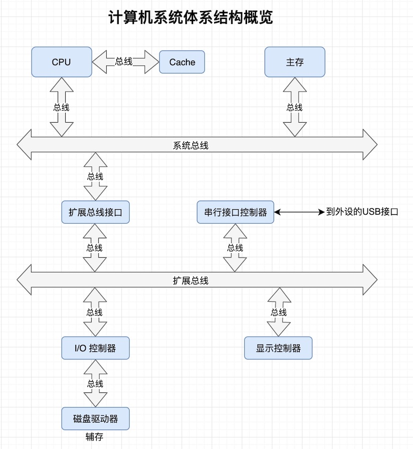

# 计算机组成原理

## 一、计算机系统体系结构


### 计算机系统
计算机系统是指包括读取并执行程序的中央处理单元（CPU）、保存程序和数据的存储器、以及将芯片转换为实用系统的其他子系统。其中具体设计到的概念如下：
+ Cache是存放常用数据的高速、专用存储器。
+ 主存是存放大量的工作数据。
+ 辅存是指磁盘或CD-ROM，能够存放海量数据。
+ 输入是指用户交给计算机的信息
+ 输出是指计算机返回给用户的信息。
+ 冯诺依曼结构：能够接收输入和输出，运算器和存储器构成的计算机模型。
+ 哈佛结构：核心特点，将指令和数据放在不同的存储器中。
+ 读周期：CPU请求的数据从存储器送往CPU。
+ 写周期：程序产生的数据从CPU写回存储器。
+ 寄存器是CPU内部用来存放数据的存储单元。
+ 时钟提供了脉冲流，所有内部操作都在时钟脉冲的触发下进行。
+ 寄存器与存储器中的字存储单元没有本质区别。二者的实际差别在于，寄存器位于CPU内，它的访问速度远远快于访问CPU外的存储器。
+ 乱序执行允许在当前指令等待正被使用的资源时执行程序中靠后的指令。
+ 总线将计算机中的两个或多个功能单元连接在一起并允许它们相互交换数据。

## 二、体系结构与组成


## 计算机基本组成
### 一、冯诺依曼计算机的特点
1. 计算机由五大部件组成（运算器、存储器、控制器、输入、输出）
2. 指令和数据以同等地位存于存储器，可按地址寻访
3. 指令和数据用二进制表示
4. 指令由操作码和地址码组成
5. 存储程序（核心特征）
6. 以运算器为中心（可以以存储器为中心改进）

### 存储器的基本组成
1. 存储体 - 存储单元 - 存储元件
2. MAR：存储器地址寄存器（反映存储单元的个数）
3. MDR：存储器数据寄存器（反映存储字长）

### 运算器的基本组成
算数逻辑单元（CLU）、寄存器

### 控制器的基本组成
1. 取指令（PC计数器）
2. 分析指令（IR：存放当前欲执行的指令）
3. 执行指令（CU控制单元）

### 简单程序的基本运行过程
1. 将程序通过输入设备送至计算机
2. 程序首地址 -- PC寄存器指定
3. 取指令： PC -> MAR -> M -> MBR -> IR
4. 分析指令：OP(IR) -> CU
5. 执行指令（取数）：Addr(IR) -> MAR -> M -> MDR -> ACC

### 计算机硬件的主要性能指标
1. 机器字长 CPU一次能处理数据的位数，与CPU中的寄存器位数有关
2. 主频
3. 核数，每个核支持的线程数
4. CPI 执行一条指令所需时钟周期数
5. MIPS 每秒执行百万条指令
6. FLOPS 每秒浮点运算次数
7. 存储容量：存放二进制信息的总位数   

## 总线的基本概念

### 什么是总线？
总线是连接各个部件的信息传输线，是各个部件共享的传输介质。因为计算机由许许多多的零散部件组成，而部件之间需要通信，为了扩展以及简化硬件的设计，引入了总线。总线上信息的传送有串行和并行两种方式。

### 总线分类
1. 片内总线: 芯片内部的总线
2. 系统总线: 计算机各部件之间的信息传输线。逻辑上分为数据总线、地址总线、控制总线。
3. 通信总线: 用于计算机系统之间或计算机系统与其他系统（如控制仪表、移动通信等）之间的通信。
   
### 总线性能指标
1. 总线宽度: 数据线的根数
2. 标准传输率: 每秒传输的最大字节数(MBps)
3. 时钟同步/异步: 同步、不同步
4. 总线复用: 地址线与数据线复用
5. 信号线数: 地址线、数据线和控制线的总和
6. 总线控制方式: 突发、自动、仲裁、逻辑、计数
7. 其他指标: 负载能力

### 总线控制
1、基本概念
主设备（模块）：对总线有控制权
从设备（模块）：响应从主设备发来的总线命令
#### 总线判优控制
分为集中式、分布式两类控制。集中式又分为有链式查询、计数器定时查询、独立请求方式
#### 总线通信控制
目的：解决通信双方协调配合问题
#### 总线传输周期
+ 申请分配阶段：主模块申请，总线仲裁设定
+ 寻址阶段：主模块向从模块给出地址和命令
+ 传数阶段：主模块和从模块交换数据
+ 结束阶段：主模块撤销有关信息
#### 总线通信的四种方式：
+ 同步通信：由同一时标控制数据传送
+ 异步通信：采用应答方式，没有公共时钟标准
+ 半同步通信：同步、异步结合
+ 分离式通信：充分挖掘系统总线每个瞬间的潜力。

## 存储器

### 概述
#### 一、存储器分类
+ 按存储器介质分类
  + 半导体存储器（TTL，MOS)、易失
  + 磁表面存储器。非易失
  + 磁芯存储器。非易失
  + 光盘存储器。非易失
+ 按存取方式分类
  + 随机存储器（在程序的执行过程中可读可写）
  + 只读存储器（在程序的执行过程中只读）
+ 按在计算机中的作用分类
  + 主存储器
    + RAM：静态RAM、动态RAM
    + ROM：MROM、PROM】EPROM、EEPROM
  + Flash Memory
  + 告诉缓冲存储器（Cache）
  + 辅助存储器：磁盘、光盘、磁带
  
#### 二、存储器的层次结构
寄存器(CPU) -> 缓存(CPU) -> 主存 -> 磁盘 -> 光盘 -> 磁带
缓存--主存的层次结构是为了解决速度问题。主存--辅存的层次结构是为了解决容量问题。

### 主存储器

#### 主存中存储单元地址的分配
大端字节序：高位字节数据存放在低字节地址，低位字节数据存放在高字节地址
小端字节序：高位字节数据存放在高字节地址，低位字节数据存放在低字节地址

#### 主存的技术指标
1. 存储容量：主存存放二进制代码的总位数
2. 存储速度：存取时间：存储器的访问时间、读出时间、写入时间。存取周期：连续两次独立的存储器操作，（读或写）所需的最小间隔时间。
3. 存储器的带宽：位/秒
   
#### 随机存取存储器（RAM）
+ 静态RAM
+ 动态RAM（DRAM）
+ 动态RAM和静态RAM的比较

#### 提高访存速度的措施
+ 采用高速器件
+ 采用层次结构 Cache-主存
+ 调整主存结构
  + 多体并行的方式：低位交叉的特点(体内地址｜体号）：在不改变存取周期的情况下，能增加存储器的带宽。
  + 高性能存储芯片
    + SDRAM（同步DRAM）：在系统时钟的控制下进行读出和写入（CPU无须等待）
    + RDRAM：由Rambus开发，主要解决存储器带宽问题
    + 带Cache的DRAM

## 高速缓冲存储器
### 一、概述
1. 为什么用Cache
   处理器的每年速度提升很快，内存的速度提升较慢，两者速度差异产生了很大的空洞。为避免CPU“空等”的现象，利用程序访问的局部性原理，产生了缓存。
   + 时间局部性原理：当前正在使用的指令和数据，不久的将来还会被用到。
   + 空间局部性原理：当前正在执行的指令和数据，不久的将来相邻的指令或数据可能会用到。
2. Cache的工作原理
    + 主存和缓存的编址
      + 内存分为两部分：一部分主存块号，一部分块内地址。
      + Cache分为两部分：一部分缓存块号，一部分块内地址。
      + Cache块有一个标记，记录和主存之间的对应关系。
      + 主存和缓存按块存储，块的大小相同。
    + 命中与未命中
      + 缓存共有C块，主存共有M块，且 M > C。
      + 命中：数据已在缓存中
      + 未命中：数据不在缓存中
    + Cache的命中率: CPU欲访问的信息在Cache中的比率，命中率与Cache的容量和块长有关。块长取一个存取周期内从主存调出的信息长度。
    + Cache - 主存系统的效率: 效率与命中率有关，e = 访问Cache的时间/平均访问时间 * 100%；设Cache命中率为h，访问Cache的时间为tc，访问主存的时间为tm，e = tc / (h * tc + (1 - h) * tm) * 100%.(该公式是建立在并行访问主存和Cache的前提下)
3. Cache的基本结构
4. Cache的读写操作
   1. 写操作要注意Cache和主存的一致性问题
      + 写直达法（write-through)：写操作时数据既写入Cache又写入主存。写操作时间就是访问主存的时间，Cache块退出时，不需要对主存执行写操作，更新策略比较容易实现。
      + 写回法(write-back)：写操作时只把数据写入Cache而不写入主存，当Cache数据被替换出去时才写回主存。写操作时间就是访问Cache的时间，Cache块退出时，被替换的块需写回主存，增加了Cache的复杂性。
5. Cache的改进
   + 增加Cache的级数
   + 统一缓存和分立缓存：比如指令Cache和数据Cache分开。
   
### 二、Cache-主存的地址映射
1. 直接相联映射：主存的某个块只能被固定的映射在Cache块，每个Cache块对应多个内存块。（利用率低）
2. 全相联映射：主存的某个块可以放在任意的Cache块，只要还有空闲区。（查找效率低）
3. 组相联映射：主存的某个块只能放在某个组内的Cache块。（取模获取组id）

### 替换算法
1. 先进先出算法(FIFO): 按进入Cache时间替换Cache的策略。
2. 近期最少使用算法(LRU): 最近一段时间内使用的最少的块被替换。

## I/O 输入输出
### I/O 设备编址方式
1. 统一编址。CPU直接用取数/存数指令
2. 独立编址。有专门的I/O指令

### I/O 设备与主机信息传送的控制方式
1. 程序查询方式
    ```flow
    start=>start: 开始
    send=>operation: CPU向I/O发出读指令
    readState=>operation: CPU读I/O状态
    checkState=>condition: 准备就绪？
    readWord=>operation: 从I/O接口中读1个字到CPU
    writeMem=>operation: CPU向主存写入1个字
    isFinished=>condition: 已完成?
    end=>end: 结束
    start->send->readState->checkState
    checkState(no)->readState
    checkState(yes)->readWord->writeMem(right)->isFinished
    isFinished(no)->send
    isFinished(yes)->end
    ```
2. 程序中断方式
   
3. DMA方式