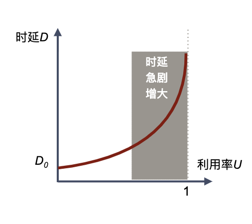

# 计算机网络概述
计算机和网络已经成为当今信息时代的核心，已经成为信息社会的命脉和发展知识经济的基础。

## 计算机网络的定义及其特点
计算机网络主要是由一些通用的、可编程的硬件互连而成的，而这些硬件并非专门用来实现某一特定目的（例如，传送数据或视频信号）。这些可编程的硬件能够用来传送多种不同类型的数据，并能支持广泛的和日益增长的应用。

### 计算机网络的特点
+ 连通性。使上网用户之间都可以交换信息（数据以及各种音视频）。好像这些用户的计算机都可以彼此直接连通一样。
+ 共享。指资源共享。比如信息共享、软件共享、硬件共享等。
+ 虚拟。无法准确直到对方是谁，也无法知道对方的位置。

## 互联网概述
+ 互联网是目前技术最为成功、应用最为广泛的计算机网络
+ 互联网已经成为现代社会最为重要的基础设施
+ 互联网，特指 Internet，它起源于美国，是由数量极大的各种计算机网络互联起来而形成的一个互连网络。它采用 TCP/IP 协议族作为通信规则，是一个覆盖全球、实现全球范围内连通性和资源共享的计算机网络。
+ 以小写字母“i”开始的 internet（互连网）是一个通用名词，它泛指由多个计算机网络互连而成的网络。任意把几个计算机网络互连起来(不管采用什么协议)，并能够相互通信，这样构成的是一个互连网，而不是互联网。
+ 以大写字母“I”开始的 Internet（互联网或因特网）则是一个专用名词，它特指当前全球最大的、开放的、由众多网络相互连接而成的特定计算机网络，它采用 TCP/IP 协议族作为通信的规则，且其前身是美国的 ARPANET。

### 互联网发展的三个阶段
+ 第一阶段。从单个网络 ARPANET 向互联网发展的过程。
  + 1983 年，TCP/IP 协议称为 ARPANET 上的标准协议，使得所有使用 TCP/IP 协议的计算机都能利用互连网相互通信。
  + 人们把 1983 年作为互联网的诞生时间。
  + 1990 年，ARPANET 正式宣布关闭。
+ 第二阶段。建成了三级结构的互联网。
  + 它是一个三级计算机网络，分为主干网、地区网和校园网（或企业网）。
+ 第三阶段。逐渐形成了多层次 ISP 结构的互联网。
  + 出现了互联网服务提供者 ISP（internet Service Provider）。
  + 任何机构和个人只要向某个 ISP 交纳规定的费用，就可从该 ISP 获取所需 IP 地址的使用权，并可通过该 ISP 接入到互联网。
  + 根据提供服务的覆盖面积大小以及所拥有的的 IP 地址数目的不同，ISP 也分成为不同层次的 ISP：主干 ISP、地区 ISP 和本地 ISP。

### 成为互联网正式标准要经过的阶段
所有互联网标准都以 [RFC](https://www.rfc-editor.org/rfc-index.html) 的形式在互联网上发表。
之前要经过三个阶段。
1. 互联网草案（Internet Draft）-- 有效期只有六个月。在这个阶段还不是 RFC 文档。
2. 建议标准 （Proposed Standard）-- 从这个阶段开始就成为 RFC 文档。
3. 互联网标准（Internet Standard）-- 达到正式标准后，每个标准就分配到一个编号 STD xxxx。一个标准可以和多个 RFC 文档关联。

现在简化为二个阶段：建议标准，互联网标准。除了建议标准和互联网标准这两种 RFC 文档外，还有三种 RFC 文档：历史的、实验的和提供信息的 RFC 文档。 

## 互联网的组成
从互联网的工作方式上看，可以划分为两大块：
+ 边缘部分。由所有连接在互联网上的主机组成。这部分是用户直接使用的，用来进行通信（传送数据、音频或视频）和资源共享。这些主机又称为端系统。端系统在功能上可能有很大的差别。
  + 小的端系统可以是一台普通个人电脑，具有上网功能的智能手机，甚至是一个很小的网络摄像头。
  + 大的端系统则可以使一台非常昂贵的大型计算机。
  + 端系统的拥有者可以是个人，也可以是单位（如学校、企业、政府机关等），当然也可以是某个 ISP。
+ 核心部分。由大量网络和连接这些网络的路由器组成。这部分是为边缘部分提供服务的（提供连通性和交换）。
  + 网络核心部分是互联网中最复杂的部分。
  + 网络中的核心部分要向网络边缘中的大量主机提供连通性，使边缘部分中的任何一个主机都能够向其它主机通信（即传送或接收各种形式的数据）。
  + 在网络核心部分起特殊作用的是路由器（router）。
  + 路由器是实现分组交换（packet switching）的关键构件，其任务是转发收到的分组，这是网络核心部分最重要的功能。


### 互联网的边缘部分
#### 端系统之间通信的含义
“主机 A 的某个进程和主机 B 上的另一个进程进行通信”。简称为“计算机之间通信”。

#### 端系统之间的两种通信方式
+ 客户 - 服务器方式（C/S 方式）。即 Client/Server 方式。简称为 C/S 方式。
  + 客户（client）和服务器（server）都是指通信中所涉及的两个应用进程。
  + 客户--服务器方式所描述的是进程之间服务和被服务的关系。
  + 客户是服务的请求方，服务器是服务的提供方。
  + 服务请求方和服务提供方都要使用网络核心部分所提供的服务。
  + 客户软件的特点。
    + 被用户调用后运行。在打算通信时主动向远地服务器发起通信（请求服务）。因此，客户程序必须知道服务器程序的地址。
    + 不需要特殊的硬件和很复杂的操作系统。
  + 服务器软件的特点。
    + 一种专门用来提供某种服务的程序，可同时处理多个远地或本地客户的请求。
    + 系统启动后即自动调用并一直不断地运行着，被动地等待并接收来自各地的客户的通信请求。因此，服务器程序不需要直到客户程序的地址。
    + 一般需要强大的硬件和高级的操作系统支持。
  + 客户与服务器的通信关系建立后，通信可以是双向的，客户和服务器都可发送和接收数据。
+ 对等方式（P2P 方式）。即 Peer-to-Peer 方式。
  + 对等连接。是指两个主机在通信时并不区分哪一个是服务请求方还是服务提供方。
  + 只要两个主机都运行了对等连接软件（P2P 软件），它们就可以进行平等的、对等连接通信。
  + 双方都可以下载对方已经存储在硬盘中的共享文档。
  + 对等连接方式从本质上看仍然是使用客户服务器方式，只是对等连接中的每一个主机既是客户又是服务器。
  + 对等连接工作方式可支持大量对等用户（如上百万个）同时工作。

### 互联网的核心部分
互联网的核心部分采用了分组交换技术。
典型的交换技术包括：
1. 电路交换
2. 分组交换
3. 报文交换。
   1. 在 20 世纪 40 年代，电报通信也采用了基于存储转发原理的报文交换（message switching）。
   2. 报文交换的时延较长，从几分钟到几小时不等。现在报文交换已经很少有人使用了。

#### 电话交换的主要特点
+ 2 部电话机只需要 1 对电线直接连接就能够互相通话。
+ 5 部电话机两两直接相连，需 10 对电线。
+ N 部电话机两两直接相连，需 N(N –1)/2 对电线。这种直接连接方法所需要的电线对的数量与电话机数量的平方（N 2）成正比。
+ 当电话机的数量增多时，就要使用交换机来完成全网的交换任务。
  + 每一部电话都直接连接到交换机上，而交换机使用交换的方法，让电话用户彼此之间可以很方便地通信。所采用的交换方式就是电路交换 (circuit switching)。
  + “交换”(switching)的含义就是转接 —— 把一条电话线转接到另一条电话线，使它们连通起来。
  + 从通信资源的分配角度来看，“交换”就是按照某种方式动态地分配传输线路的资源。
+ 电路交换必定是面向连接的。电路交换分为三个阶段：
  + 建立连接：建立一条专用的物理通路，以保证双方通话时所需的通信资源在通信时不会被其他用户占用；
  + 通信：主叫和被叫双方就能互相通电话；
  + 释放连接：释放刚才使用的这条专用的物理通路（释放刚才占用的所有通信资源）。

结论：由于计算机数据具有突发性。这导致在传送计算机数据时，通信线路的利用率很低（用来传送数据的时间往往不到 10% 甚至不到 1%）。

#### 分组交换的主要特点
+ 分组交换则采用**存储转发技术**。
+ 在发送端，先把较长的报文划分成较短的、固定长度的数据段。
+ 每一个数据段前面添加上**首部**构成**分组**（packet）。
+ 分组交换网以”分组"作为数据传输单元。
+ 依次把各分组发送到接收端。
+ 接收端收到分组后剥去首部还原成报文段。
+ 最后，在接收端把收到的数据恢复成原来的报文。（假定分组在传输过程中没有出现差错和丢失）
+ 每一个分组的首部都含有**地址**（诸如目的地在和源地址）等控制信息。
+ 分组交换网中的结点交换机根据收到的分组首部中的地址信息，把分组**转发**到下一个结点交换机。
+ 每个分组在互联网中**独立的选择传输路径**。
+ 用这样的**存储转发**方式，最后分组就能到达最终目的地。

##### 路由器
在路由器中输入和输出端口之间没有直接连线。
路由器中处理分组的过程是：
1. 把收到的分组先**放入缓存**（暂时存储）。
2. **查找转发表**，找出到某个目的地址应从哪个端口转发。
3. 把分组送到适当的端口转发出去。

###### 路由器和主机的作用不同
1. 主机是为用户进行信息处理的，并向网络发送分组，从网络接收分组。
2. 路由器对分组进行存储转发，最后把分组交付目的主机。

##### 分组交换的优点
+ 高效。在分组传输的过程中**动态分配**传输带宽，对通信链路是逐段占用。
+ 灵活。为每一个分组**独立**地选择最合适的转发路由。
+ 迅速。以分组作为传送单位，可以**不先建立连接**就能向其他主机发送分组。
+ 保证可靠性的网络协议；分布式多路由的分组交换网，使网络有很好的生存性。

##### 分组交换带来的问题
+ 分组在各结点存储转发时需要**排队**，这会造成一定的**时延**。
+ 分组必须携带的首部也造成了一定的开销。
+ 当分组交换采用数据报服务时，可能出现失序、丢之或重复分组。

#### 三种交换的比较
+ 若要连续传送大量的数据，且其传送事件远大于连接建立时间，则电路交换的传输速率较快。
+ 报文交换和分组交换不需要预先分配传输带宽，在传送突发数据时可提高整个网络的信道利用率。
+ 由于一个分组的长度往往远小于整个报文的长度，因此分组交换比报文交换的时延小，同时也具有更好的灵活性。

## 计算机网络的类别
+ 按照网络的作用范围进行分类
  + 广域网 WAN（Wide Area Network）。作用范围通常为及时到几千公里。
  + 城域网 MAN（Metropolitan Area Network）。作用范围约为 5-50 公里。
  + 局域网 LAN（Local Area Network）。局限在较小的范围。（1公里左右）
  + 个人区域网 PAN（Personal Area Network）。范围很小。10米左右。
+ 按照网络的使用者进行分类
  + 公用网（public network）。按规定交纳费用的人都可以使用的网络。
  + 专用网（private network）。为特殊业务工作的需要而建造的网络。
+ 用来把用户接入到互联网的网络
  + 接入网 AN（Access Network）。它又称为本地接入网或居民接入网。
  + 接入网是一类比较特殊的计算机网络，用于将用户接入互联网。
  + 接入网本身既不属于互联网的核心部分，也不属于互联网的边缘部分。
  + 接入网是从某个用户端系统到互联网中的第一个路由器（也称为边缘路由器）之间的一种网络。
  + 从覆盖的范围看，很多接入网还是属于局域网。
  + 从作用上看，接入网只是起到让用户能够与互联网连接的“桥梁”作用。

## 计算机网络的性能

### 性能指标
计算机网络中性能指标主要包括：速率、带宽、吞吐量、时延、时延带宽积、往返时间、利用率。

### 信息的度量
信息的本质是消除不确定性。
#### 比特概念
+ 香农 1948 年的论文《通信的数学理论》中第一次出现“比特”。在香农的理论中，比特成为信息的基本单位。回答一个是/否问题需要 1 比特信息。
+ 比特（bit）也是计算机中数据量的单位。比特来源于 binary digit。
+ 表示一个二进制数字，因此一个比特表示二进制数字中的 1 或 0。

### 速率
+ 速率是计算机网络中最重要的一个性能指标，指的是数据的传送速率，它也称为数据率（data rate）或比特率（bit rate）。
+ 速率往往是指额定速率或标称速率，非实际运行速率。
+ 速率的单位
  + bit/s（比特每秒，基本单位），或 Kbit/s，Mbit/s，Gbit/s 等（也记作bps);
  + 例如 4 * 10^10 bit/s 的数据率就记为 40 Gbit/s。
+ 注意与存储容量的区别（乘 2^10）
  + Byte（字节，基本单位）、KByte（KB），MByte（MB）。1 Byte = 8 bit。

### 带宽
常见带宽有两种不同的意义。
+ 带宽（brandwidth）是指辛哈具有的频率成分范围。也可表示为信道的频带宽度（允许通过的最高频率成分与最低频率成分之差），其单位是赫（或千赫、兆赫、吉赫等）。
  + 例如：人耳可辨别的声音约在 16~20000Hz 之间，但只要保留 300~3400Hz 这段范围内的声音，仍能清晰辨别话音信号。故电话信道的带宽为 3400-300 = 3100Hz。
+ 计算机网络中，带宽用来表示网络中某通道传送数据的能力。表示在单位时间内网络中的某信道所能通过的“最高数据率”。单位：比特每秒（bit/s)。
  + 例如，计算机 100Mbps 接入网络。指的是计算机能以 100Mbps 速率向信道注入 bit 流。

以上就是带宽的两种表述。前者为频域称谓，后者为时域称谓，本质上是相同的。一条通信链路的“带宽”越宽，所能传输的“最高数据率”也越高。在时间轴上信号的宽度随带宽的增大而变窄，即单位时间内能通过的数据量更多。

### 吞吐量
吞吐量表示在单位时间内通过某个网络（或信道，接口）的数据量。
+ 吞吐量用来测量实际上到底有多少数据量能够通过网络
+ 吞吐量受网络的带宽或网络的额定速率的限制。

### 网络时延
时延（delay）是指数据（一个报文或分组，甚至比特）从网络或链路的一端传送到另一端所需的时间。有时也称为延迟或迟延。网络中的时延由以下几个不同的部分组成。
+ 发送时延
+ 传播时延
+ 处理时延
+ 排队时延

#### 发送时延
也称为传输时延。发送数据时，数据帧从**结点进入到传输媒体**所需要的时间。也就是从发送数据帧的**第一个比特**算起，到该帧的**最后一个比特**发送完毕所需的时间。


#### 传播时延
+ 电磁波在信道中需要传播一定的距离而花费的时间。
+ 信号发送速率和信号在信道上的传播速率是完全不同的概念。
+ **传播速率**：信号在信道（铜缆）上“跑”的速度。（约为光速的60%~80%，约 200m/µs），速度不变.


#### 处理时延
主机或路由器在收到分组时，为**处理分组**（例如分析首部、提取数据、差错检验或查找路由）所花费的时间。

#### 排队时延
+ 分组在路由器输入输出队列中排队等待处理所经历的时延；
+ 排队时延的长短往往取决于网络中当时的通信量。

#### 总时延
+ 数据在网络中经历的总时延就是发送时延、传播时延、处理时延和排队时延之和。
+ 必须指出，在总时延中，究竟是哪一种时延占主导地位，必须具体分析。


#### 几种产生时延的地方


**对于高速网络链路，我们提高的仅仅是数据的发送速率而不是比特在链路上的传播速率。所以，提高链路带宽减小了数据的发送时延。**

#### 时延带宽积
链路上的时延带宽积又称为**以比特为单位的链路长度**。
+ 即某段链路中现在有多少比特
+ 只有在代表链路的管道都充满比特时，链路才得到了充分利用。


#### 往返时延
互联网上的信息不仅仅单方向传输，而是双向交互的。因此，有时很需要知道**双向交互一次所需的时间。**
+ 往返时间表示从发送方发送数据开始，到发送方收到来自接收方的确认，总共经历的时间。
+ 在互联网中，往返时间包括往返传播时延，各中间结点的处理时延、排队时延以及转发数据时的发送时延。


### 利用率


若令 D0 表示网络空闲时的时延，D 表示网络当前的时延，则在适当的假定条件下，可以用下面的简单公式表示 D 和 D0 之间的关系。
```
    D = D0 / (1 - U)
    其中：U 是网络的利用率，数值在 0 到 1 之间。
```
其函数关系图如下：



## 计算机网络的体系结构
计算机网络的体系结构（Architecture）是计算机网络的各层及其协议的集合。
+ 体系结构就是这个计算机网络及其部件所应完成的功能的精确定义。
+ 实现（Implementation）是遵循这种体系结构的前提下用何种硬件或软件完成这些功能的问题。
+ 体系结构是抽象的，而实现则是具体的，是真正在运行的计算机硬件和软件。

### 为什么要分层
计算机网络是个非常复杂的系统，相互通信的两个计算机必须高度协调工作才行，而这种“协调”是相当复杂的；“分层”可将庞大而复杂的问题，转化为若干较小的局部问题，而这些较小的局部问题就比较易于研究和处理。

### 如何分层
+ 按功能进行抽象分层。
+ 定义层间接口，提供什么服务，层间如何调用服务。
+ 对等层间的遵循规则（协议）。

### 协议与划分层次
计算机网络中的数据交换必须遵守事先约定好的规则。这些规则明确规定了所交换的数据的格式以及有关的同步问题（同步含有时序的意思）。

#### 网络协议（network protocol)
是为进行网络中的数据交换而建立的规则、标准或约定。

#### 网络协议组成要素
+ 语法。数据与控制信息的结构或格式，解决交换信息的格式问题。
+ 语义。需要发出何种控制信息，完成何种动作以及做出何种响应，解决做什么的问题。
+ 同步。事件实现顺序地详细说明。什么事件什么条件下做某一特定操作的规定，解决先做什么后做什么的问题。
+ 因为很多条件不可预测，所以难有十全十美的协议。

#### 分层的原则
+ 层次适度。层次少，层次功能多，实现困难；层次多，层次功能少，开销大。
+ 功能确定。每个层次有自己的分工，并且有确定的方式完成这些工作
+ 层次独立。每个层次的工作，不影响其它层次，层次变化也不影响其它层次。
+ 层次关联。相邻层次间存在一种工作上的联系。
+ 层次分合。层次按实际需求划分，可以合并，分解，也可以取消。
+ 层次对等。双方要有完成相同功能的对等层次。
+ 层次协议。对等层次要遵守一系列共同的规约（协议）
+ 层次接口。相邻层次间通过接口交互信息。

#### 各层的主要功能
+ 差错控制。使对应层次对等方的通信更加可靠。
+ 流量控制。发送端的发送速率必须使接收端来得及接收，不要太快。
+ 分段和重装。发送端将要发送的数据库划分为更小的单位，在接收端将其还原。
+ 复用和分用。发送端几个高层会话复用一条底层的连接，在接收端再进行分用。
+ 连接建立和释放。交换数据前先建立一条逻辑连接，数据传送结束后释放连接。

#### 具有五层协议的体系结构
+ OSI 的七层协议体系结构的概念清楚，理论也较完整，但它既复杂又不实用。
+ TCP/IP 是四层体系结构。应用层、运输层、网际层和网络接口层。
+ 但最下面的网络接口层并没有具体内容。
+ 因此往往采取折中的办法，即综合 OSI 和 TCP/IP 的优点，采用一种只有五层协议的体系结构

具体五层协议功能如下。
+ 应用层。通过应用进程间的交互来完成特定网络应用。
+ 运输层。负责向两台主机中进程之间的通信提供通用的数据传输服务，TCP 是提供面向连接的、可靠的数据传输服务，传输单位为报文段；UDP 提供无连接的尽最努力的数据传输服务，传输单位为用户数据报。
+ 网络层：提供主机间的通信服务。路由器生成转发表，依据转发表转发分组至下一个路由器。
+ 数据链路层。直连网络中相邻节点的链路上传输帧。
+ 物理层。实现比特传输。


#### 相关概念
+ 协议数据单元 PDU（Protocol Data Unit)。OSI 参考模型把对等层次之间传送的数据单位称为该层的协议数据单元 PDU。
+ 实体（entity）。表示任何可发送或接收信息的硬件或软件进程。
+ 协议是控制两个对等实体进行通信的罪责的集合（水平的）。
+ 在协议的控制下，两个对等实体间的通信使得本层能够向上一层提供服务（功能调用，垂直的，单向的）。
+ 要实现本层协议，还需要使用下层所提供的服务。
+ 本层的服务用户只能看见服务而无法看见下面的协议。即下面的协议对上面的服务用户是透明的。
+ 上层使用服务原语获得下层所提供的服务。
+ 服务原语。服务在形式上由一组接口原语（或操作）来描述的。
  + 上层实体向下层实体请求服务时，服务提供者和服务用户间需要交互一些必要的信息，以说明要求服务的一些情况，这些信息即服务原语。
+ 服务访问点 SAP（SERVICE ACCESS POINT）
  + 同一系统相邻两层的实体进行交互的地方，称为服务访问点。
  + SAP 是一个抽象的概念，是一个逻辑接口（下层服务的入口）。
  + 服务访问点规定了上层如何调用下层提供的服务。
    + 服务的名字及其参数。
+ 服务数据单元 SDU（SERVICE DATA UNIT）。层与层之间交换的数据单位称为服务数据单元 SDU。加上本层的 PCI 后，构成本层的 PDU。
  + SDU 分段/装配。如果下层通道的带宽不能满足传递 SDU 的需要，就需要将一个 SDU 分成多段，分别封装成 PDU 发送出去（分段）；在接收方再将这些 PDU 解封装后重新装配成 SDU。
  + SDU 拼接/分离。拼接是指在发送方层协议实体把多个长度较短的 SDU 封装成一个 PDU 来发送，在接收方再将接收到的 PDU 解封装，将多个 SDU 分离出来。采用拼接功能的目的是提高通道的利用率。

#### 协议的复杂性
协议必须把所有不利的条件事先都估计到，而不能假定一切都是正常的和非常理想的。看一个计算机网络协议是否正确，不能光看在正常情况下是否正确，还必须非常仔细地检查这个协议能否应付各种异常情况。