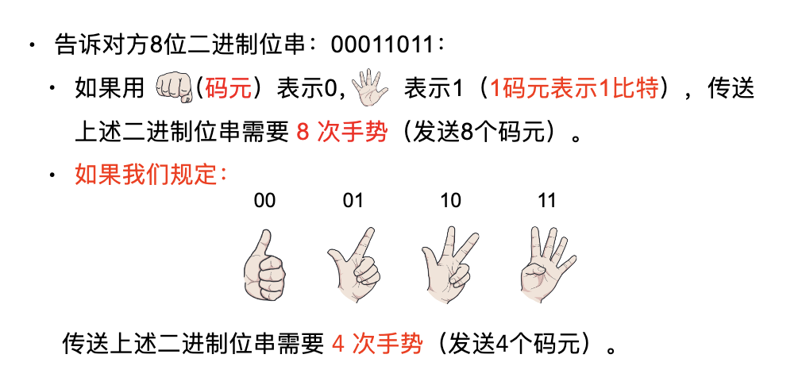

# 物理层

## 物理层的基本概念
+ 物理层考虑的是怎样才能在连接各种计算机的传输媒体上传输数据比特流，而不是指具体的传输媒体。
+ 物理层的作用是要尽可能地屏蔽掉不同传输媒体和通信手段的差异。
+ 用于物理层的协议也常称为物理层规程 (procedure)。

### 物理层的功能
物理层不包括物理媒介，而是确定与传输媒体的接口特性。
+ 机械特性。接口所用接线器的一些物理属性如接口形状，接口尺寸，引线数目及排列。
+ 电气特性。接口电缆的各条线上出现的电压的范围，阻抗匹配，传输速率，距离等。
+ 功能特性。某条线上出现的某一电平的电压的意义，接口部件信号线的用途。
+ 过程特性。对于不同功能的各种可能事件的出现顺序，定义各条物理线路的工作规程和时序关系。

### 物理层的信号类型
主要功能：解决计算机间比特传输问题，即透明地传送比特流，关心的是点到点的问题。
+ 透明传输：指不管所传输的数据时什么痒的比特组合，都能够在链路上传输。
+ 要尽可能地屏蔽不同传输媒体和通信手段的差异。
+ 信号类型。
  + 铜缆。基于电平（electrical signals）
  + 光纤。基于光脉冲（light pluse）
  + 无线。基于微波（Microwave）

### 标准制定者
+ ISO。国际标准化组织，非政府组织。
+ IEEE。电气和电子工程师协会，世界上最大的非营利性专业技术学会。
+ ANSI。美国国家标准学会，民间团体。
+ ITU。国际电信联盟。
+ ELA/TIA。美国电子工业协会/电信工业协会。
+ FCC。美国联邦通信委员会。
+ IETF。国际互联网工程任务组。

常用物理层相关标准：RJ45、RS-232-C

## 数据通信基础
一个数据通信系统包括三大部分。**源系统**（或发送端、发送方）、**传输系统**（或传输网络）和**目的系统**（或接收端、接收方）。

### 基本术语
通信的目的是传送消息。

#### 消息、数据类术语
+ 消息：消息是客观物质运动或主观思维活动，以及事件发生状态的一种反映，它通过语言、文字、图像和数据等不同形式具体描述。
+ 消息不便于传送和交换。
+ 数据。运送消息的实体。信息在传输之前需要进行编码，编码后的消息就变成了数据（将消息存储到计算机中形成二进制比特流）。

#### 信号、信道类术语
+ 信号。数据的电气的或电磁的表现。数据在通信线路上传递需要变成光信号或电信号。
+ 模拟信号（analogous signal）。代表消息的参数的取值是连续的。
+ 数字信号（digital signal）。代表消息的参数的取值是离散的。
+ 信源。产生和发送数据的源头。
+ 信宿。接收数据的终点。
+ 信道。信号传输的通道（传输媒介），一般来表示向某一个方向传送信息的介质，一端是发送信道，另一端是接收信道。一条传输介质上可以有多条信道（多路复用）。
+ 模拟信道传输模拟信号；数字信道传输数字信号

#### 三种基本通信方式
通信方式|描述|例子
-------|-------|------
单向通信|又称为弹弓通信，只有一个方向上的通信而没有反方向的交互|电视机、广播
双向交替通信|又称为半双工通信，通信双方可以发送或接收数据，但不能同时发送和接收|对讲机
双向同时通信|又称为全双工通信，通信双方可以同时发送和接收消息。|电话

#### 基带、宽带相关术语
+ 基带信号（Baseband Signal），新源发出的没有经过调制的原始信号（直接表达了要传输的信息的信号）。
  + 基带信号往往包含有较多的低频成分，甚至有直流成分，而许多信道并不能传输这种低频分量或直流分量。因此必须对基带信号进行调制（modulation）。
  + 由模拟信号源产生的信号称为ONI基带信号（说话的声波）。
  + 由计算机产生的二进制信号称为数字基带信号。
+ 基带传输。将基带信号（0 和 1 用两种不同电压表示，这个过程叫编码）直接送到数字信道上的传输方式。
  + 基带调制。仅对基带信号的波形进行变换，使它能够与信道特性相适应。变换后的信号仍然是基带信号。把这个过程称为编码。
  + 传输的是基带信号：近距离传输。
+ 宽带传输。将基带信号经过调制（带通调制）后送到模拟信道上的传输方式，也称为频带传输。
  + 传输的是宽带信号（带通信号）：经过载波调制后的信号，适合远距离传输。
  + 带通调制。使用载波（carrier）进行调制，把基带信号的频率范围搬移到较高的频段，并转换为模拟信号，这样就能够更好地在模拟信道中传输（即仅在一段频率范围内能够通过信道）。

#### 几种编码方式
+ 非归零编码（NRZ）。正电平代表 1，负电平代表 0。
+ 归零编码。正脉冲代表 1，负脉冲代表 0。
+ 曼彻斯特编码。从高到低跳变表示 1，从低到高跳变表示 0，但也可反过来定义。
+ 差分曼彻斯特编码。在每一位的中心处始终都有跳变。位开始边界有跳变代表 0， 而位开始边界没有跳变代表 1。

+ 曼彻斯特编码与差分曼彻斯特编码，产生的信号频率比不归零制高。
+ 曼彻斯特编码与差分曼彻斯特编码具有自同步能力。

### 基本的带通调制方法
+ 调幅 AM。载波的振幅随基带数字信号而变化。
+ 调频 FM.载波的频率随基带数字信号而变化。
+ 调相 PM.载波的初始相位随基带数字信号而变化。
+ 正交振幅调制 QAM。为了达到更高的信息传输速率，必须采用技术上更为复杂的多元制的振幅相位混合调制方法。

### 码元的概念
在使用时间域（或简称为时域）的波形表示数字信号时（固定时长的信号波形），代表不同离散数值的基本波形。
+ 1 码元可携带多个比特的信息量
+ 当码元的离散状态有 M 个时，（M>2)，此时码元称为 M 进制码元。

不是码元越多越好。若每一个码元可表示的比特数越多，则在接收端进行解调时要正确识别每一种状态就越困难，出错率增加。

## 物理层的基本概念

### 信道的极限容量
任何实际的信道都不是理想的，在传输信号时会产生各种失真以及带来各种干扰。失真的原因有
+ 码元传输速率高。
+ 信号传输的距离远。
+ 传输媒体质量较差。
+ 噪声干扰。

#### 码间串扰
指接收端收到的信号波形失去了马元之间的清晰界限的现象。

### 信道带宽
信道的频带越宽，也就是能够通过的信号高频分量越多，那么就可以用更高的速率传送码元而不出现码间串扰。

### 奈氏准则
码元速率是有上限的，传输速率过限，会出现码间串扰。
+ 信道带宽越宽（能通过的高频分量越多），可用更高的速率进行码元的传输而不出现码间串扰。
+ **奈氏准则给出了码元传输速率的限制**，没有对信息传输速率给出限制。
+ 要提高比特传输速率，采用多元调制方法（如QAM），使每个码元能携带更多比特。
+ 假定的理想低通条件（无噪声、带宽受限）下。为了避免码间串扰。**码元的传输速率的上限值 = 2W Baud（波特）**
+ V 进制码元情况下。理想低筒信道下的基线数据传输率 = 2WlogV(b/s), 
+ W 是信道的带宽，单位是 Hz。
+ 举例：在无噪声的情况下，若某通信链路的带宽为4kHz，采用4个相位，每个相位具有4种振幅的QAM调制技术，求该通信链路的最大数据传输率？信号有4 × 4 = 16种变化，最大数据传输率：Sdmax=2Wlogv(b/s)=2×4000×log216=8000×4=32(kb/s)

### 信噪比
噪声存在于所有的电子设备和通信信道中
+ 噪声是随机产生的，它的瞬时值有时会很大。因此噪声会使接收端对码元的判决产生错误。
+ 但噪声的影响是相对的。如果信号相对较强，那么噪声的影响相对较小。
+ 信噪比就是信号的平均公里和噪声的平均功率之比。常记为 S/N。并用分贝（dB）作为度量单位。即。

例如，当 S/N = 10 时，信噪比为 10dB；而当 S/N = 1000时，信噪比为30 dB。

### 香农定理
1984年，香农 (Shannon) 用信息论的理论推导出了带宽受限且有高斯白噪声干扰的信道的极限、无差错的信息传输速率。
+ 信道的带宽或信道中的信噪比越大，则信息的极限传输速率就越高。
+ 只要信息传输速率低于信道的极限信息传输速率，就一定可以找到某种办法来实现无差错的传输。
+ 若信道带宽 W 或信噪比 S/N 没有上限，则信道的极限信息传输速率 C 也就没有上限。
+ 实际信道上能够达到的信息传输速率要比香农的极限传输速率低不少。

## 传输媒体
+ **信道**是传输系统的**逻辑通路**。
+ **传输介质**也称传输媒体/传输媒介，是数据传输系统中在发送设备和接收设备之间的**物理通路**。
  + 传输介质可认为是第 0 层，他传输的是信号，但不知道信号是什么意思，根据规定的电气特性来识别比特。

### 导引型传输媒体
+ 双绞线。
+ 同轴电缆。
+ 光纤。

### 非导引型传输媒体
将自由空间称为“非导引型传输媒体”。
+ 无线传输所使用的频段很广：
+ 短波通信（即高频通信）主要是靠电离层的反射，但短波信道的通信质量较差，传输速率低；
+ 微波在空间主要是直线传播。传统微波通信有两种方式：
  + 地面微波接力通信。
  + 卫星通信。
+ 无线电波传输：距离远；开放性，保密性差，显易受干扰

## 信道复用技术
多路复用技术是指把多个信号组合在一条物理信道上进行传输，使得多个计算机或终端设备共享信道资源，提高信道利用率。

### 频分多路复用
+ 使用调制的方法，把各路信号分别搬移到适当的位置，彼此不产生干扰，各路信号就在自己所分配到的信道中传送。
+ 频分复用的各路信号在同样的时间占用不同的带宽资源。（这里的“带宽”是频率带宽）.
+ 频分复用要求总频率宽度大于各个子信道频率之和。各子信道之间设立隔离带，这样就保证了各路信号互不干扰：
  + 频分复用技术的特点是所有子信道传输的信号以并行的方式工作.
  + 例：广播、有线电视；
  + 充分利用带宽，效率较高。
  + 技术成熟，实现容易。
### 时分多路复用
+ 时分复用则是将时间划分为一段段等⻓的时分复用帧（TDM 帧），每一路信号在每一个 TDM 帧中占用固定序号的时隙（同步时分复用）.
  + 每一路信号所占用的时隙是周期性地出现（其周期就是 TDM帧的⻓度），TDM 信号也称为等时信号。
  + 时分复用的所有用户是在不同的时间占用同样的频带宽度。
### 统计时分复用
+ 数据发往复用器，复用器按顺序扫描，把复用器中的数据放入STDM帧中，一个STDM帧满了就发出。
+ STDM不是固定分配时隙，而是按需动态分配时隙。
+ 注意STDM帧的时隙数少于终端数，并且有站标识开销。
### 波分多路复用
+ 光波分复用是将两种或多种不同波⻓的光载波信号，在发送端经复用器把这些光载波信号汇合在一起，并耦合到光线路中同一根光纤中进行传输；
+ 接收端经分用器将各种波⻓的光载波进行分离，这种复用方式称为波分复用。
+ 可以是单向传输，也可以是双向传输。光的波分复用可理解为光的频分复用。
### 码分复用技术
+ 各用户使用经过特殊挑选的不同码型，因此彼此不会造成干扰；
+ 这种系统发送的信号有很强的抗干扰能力，其频谱类似于白噪声，不易被敌人发现