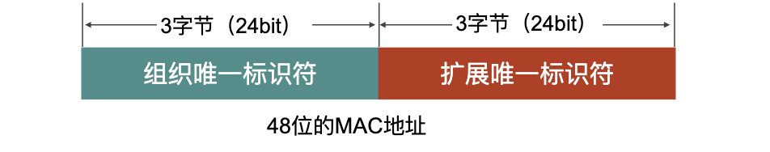

# 数据链路层

## 数据链路层的设计

### 为什么需要数据链路？
+ 结点：主机、路由器。
+ 物理层解决了相邻结点透明传输比特的问题。
+ 物理层没有解决的问题：
  + 传输错误问题。发送端发送比特 1，而接收端收到比特 0，接收端无法知道接收的是否正确。
  + 谁接收的问题。多个设备连接相关问题：如谁能发送数据？数据发送给谁？谁负责接收和处理？
  + 传输结束问题。如何知道一组数据即将到来？这组数据何时结束？

### 信道类型
+ 点对点信道。这种信道使用一对一的点对点通信方式，控制协议相对简单。
+ 广播信道。使用一对多的广播通信方式，通信过程比较复杂。广播信道上连接的主机很多，因此必须使用专用的共享协议来协调这些主机的数据发送，控制协议相对复杂。

#### 使用点对点信道的数据链路层
+ A 的数据链路层把网络层交下来的 IP 数据报添加首部和尾部封装成帧。
+ A 把封装好的帧发送给 B 的数据链路层。
+ B 的数据链路层收到的帧无差错，从帧中取出 IP 数据报交给网络层；否则丢弃这个帧。

### 基本术语
+ 链路。结点间的物理通道。是一条无源的点到点的物理线路段（双绞线、光纤等），中间没有任何其他交换地点。一条链路只是一条通路的一个组成部分。
+ 数据链路。是结点间的逻辑通道。除了物理线路以外，还必须有通信协议来控制这些数据的传输。若把实现这些协议的硬件和软件加到链路上，就构成了数据链路。
```
    数据链路 = 链路 + 协议
```
+ 链路中通信双方的信道使用形式不同。会相应有不同的控制协议。
+ 帧。链路层协议数据单元，封装网络层的数据报。
+ 数据链路层。负责通过一条链路从一个结点向物理链路**直接相连**的相邻节点传送帧。
+ 网卡实现的物理层和数据链路层协议。

### 三个基本功能
功能概述：在物理层的基础上向网络层提供服务；加强物理层传送原始比特的功能；对网络层表现为一条无差错的链路；将可能出错的物理连接变为逻辑上无差错的数据链路。

#### 封装成帧
封装成帧（framing)就是在一段数据的前后分别添加首部和尾部，然后就构成了一个帧。首部和尾部的一个重要作用就是进行帧定界，确定帧的界限。


##### 为什么要封装成帧？
简单理解如下：（最终校验的是整个比特流）
+ 物理层发送的和接收的是一个一个的字母。
+ 数据链路层发送和接收的是一个一个的单词。
+ 接收端无法判断字母传输错误，但可以判别单词错误。

##### 如何成帧？
当数据是由可打印的 ASCII 码组成的文本文件时，帧定界可以使用特殊的帧定界符。控制字符 SOH（Start of Header）放在一帧的最前面，表示帧的首部开始，控制字符 EOT（End of Transmission）表示帧的结束。

#### 透明传输
如果数据中的某个字节的二进制代码恰好和 SOH 或 EOT 一样，数据链路层就会错误地"找到帧的边界”。采用的解决办法是，字节填充技术。即
+ 发送端的数据链路层在数据中出现控制字符”SOH“或”EOT“的前面插入一个转义字符”ESC“。
+ 接收端的数据链路层在将数据送往网络层之前删除插入的转移字符。
+ 如果转义字符也出现在数据当中，那么应在转义字符前面插入一个转义字符 ESC。当接收端收到连续的两个转义字符时，就删除其中前面的一个。


#### 差错检测
在传输过程中可能会产生比特差错。比如
+ 1 可能会变成 0，而 0 也可能变成 1。
+ 在一段时间内，传输错误的比特占所传输比特总数的比率称为误码率 BER（Bit Error Rate）。误码率与信噪比有很大的关系。
+ 为了保证数据传输的可靠性，在计算机网络传输数据时，必须采用各种差错检测措施。

##### CRC 循环冗余检验方法
在数据链路层，广泛使用了循环冗余检验 CRC 的检错技术。
+ 在发送端，先把数据划分为组。假定每组 k 个比特。
+ 假设待传送的一组数据 M = 101001（现在 k = 6）。我们在 M 的后面再添加供差错检测用的 n 位冗余码一起发送。

###### n 位冗余码的计算
+ 用二进制的模 2 运算进行 2^n 乘 M 的运算，这相当于在 M 后面添加了 n 个 0。
+ 得到的 (k + n) 位的数除以事先选定好的长度为 (n + 1) 位的除数 P。得出商是 Q 而余数是 R，余数 R 比除数 P 少 1 位，即 R 是 n 位；
+ 将余数 R 作为 冗余码拼接在数据 M 后面再发送出去。


###### 冗余码的计算实例


###### 接收端对收到的每一帧进行 CRC 检验
+ 若得出的余数 R = 0，则判定这个帧没有差错，就接受 accept。
+ 若余数 R ≠ 0，则判定这个帧有差错，就丢弃。
+ 但这种检测方法并不能确定究竟是哪一个或哪几个比特出现了差错。
+ **只要经过严格的挑选，并使用位数足够多的除数 P，那么出现检测不到差错的概率就很小很小。**

###### 帧检验序列 FCS
+ 在数据后面天记上的冗余码称为帧检验序列 FCS（Frame Check Sequence）。
+ 循环冗余检验 CRC 和帧检验序列 FCS 并不等同
  + CRC 是一种常用的检错方法，而 FCS 是添加在数据后面的冗余码
  + FCS 可以用 CRC 这种方法得出，但 CRC 并非用来获得 FCS 的唯一方法。

###### 注意
+ 仅用循环冗余检验 CRC 差错检测技术只能做到无差错接收 accept。
+ ”无差错接受“是指：凡是接受的帧（即不包括丢弃的帧），我们都能以非常接近于 1 的概率认为这些帧在传输过程中没有产生差错。
+ 也就是说，“凡是接收端数据链路层接受的帧都没有传输差错”，有差错的帧就丢弃而不接受 。
+ 要做到”可靠传输“（即发送什么就收到什么），就必须加上序号、确认和重传机制。

## 点对点协议 PPP
对于点对点的链路，目前使用得最广泛的数据链路层协议是点对点协议 PPP (Point-to-Point Protocol)。PPP 协议在 1994 年就已成为互联网的正式标准。PPP 非常简单，每收到一个帧，进行 CRC 检验，如果 CRC 检验正确，就收下这个帧，反之，就丢弃这个帧，其他什么也不做。

### PPP 协议的基本要求
+ 简单。这是首要的要求（最复杂的功能 TCP 实现，IP 也简单且不可靠），因此数据链路层的 PPP 没有必要比 IP 复杂。
  + 数据链路层的帧，不需要纠错，不需要序号，也不需要流量控制。
  + 误码率比较高的无线链路上需要更为复杂的链路层协议。
  + 简单使协议在实现时不容易出错，提高了不同厂商对协议的不同实现的互操作性。
  + 不支持多点接入。不支持半双式或单工通信。
+ 封装成帧：必须规定特殊的字符作为帧定界符；
+ 透明性：必须保证数据传输的透明性；
+ 多种网络层协议：支持多种网络层协议（IP/IPX）；
+ 多种类型链路：能够在多种类型的链路上运行；
+ 差错检测：对收到的帧进行检测，并丢弃有差错的帧；

### PPP 协议应满足的需求
+ 检测连接状态。能够及时自动监测处链路是否处于正常工作状态。
+ 最大传送单元。必须对每一种类型的点对点链路设置最大传送单元 MTU 的标准默认值，促进各种实现之间的互操作性。
+ 网络层地址协商。必须提供一种机制使通信的两个网络层实体能够通过协商直到或能够配置彼此的网络层地址。
+ 数据压缩协商。必须提供一种方法来协商使用数据压缩算法。

### PPP 协议的组成
+ 一种将 IP 数据报封装到串行链路（同步串行/异步串行）的方法
+ 链路控制协议 LCP（Link Control Protocol）用来建立，配置和测试链路，其最重的功能之一是身份验证（PAP，CHAP）；
  + 配置确认帧。所有选项都能接受
  + 配置否认帧。所有选项都理解但不接受。
  + 配置拒绝帧。选项有无法识别或不能接受内容，需要协商。
+ 网络控制协议 NCP（Network Control Protoco），支持不同的网络层协议（IP、OSI 的网络层，AppleTalk等）。

### PPP 帧格式
+ PPP 帧的首部和尾部分别为 4 个字段和 2 个字段。
+ 标志字段 F = 0x7E。
+ 地址字段 A 只置为 0xFF。地址字段实际上并不起作用。
+ 控制字段 C 通常置为 0x03。
+ PPP 有一个 2 个字节的协议字段。其值
    + 若为 0x0021，则信息字段就是 IP 数据报。
    + 若为 0x8021，则信息字段是网络控制数据。
    + 若为 0xC021，则信息字段是 PPP 链路控制数据。
    + 若为 0xC023，则信息字段是鉴别数据。
+ PPP 是面向字节的，所有的 PPP 帧的长度都是整数字节。


### PPP 同步传输和异步传输
+ 同步传输（SONET/SDH 链路）。面向比特的传输，同步传输的单位是帧。
  + 同步传输收发双时钟统一、字符间传输同步无间隔。
+ 异步传输。面向字节的传输，异步传输的单位是字符。
  + 异步传输效率低，高速链路开销大。
+ 同步问题
  + 异步传输通过字符起止的开始和停止码进行同步，线路空闲时携带着代表着比特1的信号，传输开始位使信号变为0，数据传输结束，停止位使信号重新变为1。
  + 同步传输在数据中提取同步信息（帧定界比特组合）。

### PPP 传输时透明传输
+ 异步传输时透明传输。字符填充。
  + 控制字符填充举例。
    + 字符 0x01，经字符填充后为 0x21。
    + 字符 0x03，经字符填充后为 0x23。
  + 接收端一个字符一个字符地接收，最终根绝帧定界符还原成帧。
+ 同步传输时透明传输。0 比特填充。
  + 在发送端，只要发现有 5 个连续 1，则立即填入一个 0.
  + 接收端对帧中的比特流进行扫描。每当发现有 5 个连续 1 时，就把这 5 个连续 1 后的一个 0 删除。

### PPP 协议的工作状态（同步）
+ 当用户拨号接入 ISP 时，路由器的调制解调器对拨号做出确认，并建立一条物理连接。
+ PC 机向路由器发送一系列的 LCP 分组（封装成多个 PPP 帧）。
+ 这些分组及其响应选择一些PPP 参数，并进行网络层配置，NCP 给新接入的 PC 机分配一个临时的 IP 地址，使 PC 机成为因特网上的一个主机。
+ 通信完毕时，NCP 释放网络层连接，收回原来分配出去的 IP 地址。接着，LCP 释放数据链路层连接。最后释放的是物理层的连接。
+ 可⻅，PPP 协议已不是纯粹的数据链路层的协议，它还包含了物理层和网络层的内容。

## 使用广播信道的数据链路层
### 局域网的数据链路层
局域网具有如下主要优点。
+ 具有广播功能。从一个站点可很方便的访问全网。局域网上的主机可共享连接在局域网上的各种硬件和软件资源；
+ 于系统的扩展和逐渐地演变，各设备的位置可灵活调整和改变。
+ 提高了系统的可靠性、可用性和生存性。
  + 可靠性。一定的条件下和规定的时间内无故障完成网络功能的能力。
  + 可用性。用户是否能够使用网络完成任务，效率及主观感受如何。
  + 生存性。网络遭到攻击而损坏但仍能保证网络的基本功能。

### 以太网
#### 以太网的两个标准
+ DIX Ethernet V2 是世界上第一个局域网产品（以太网）的规约。
+ IEEE 802.3 是第一个IEEE的以太网标准。
  + DIX Ethernet V2 标准与 IEEE 的 802.3 标准只有很小的差别，因此可以将 802.3 局域网简称为“以太网”。
  + 严格说来，“以太网”应当是指符合 DIX Ethernet V2 标准的局域网。
  + IEEE 802又称为LMSC（LAN /MAN Standards Committee，局域网/城域网标准委员会），致力于研究局域网和城域网的物理层和MAC层中定义的服务和协议，对应OSI网络参考模型的最低两层（即物理层和数据链路层）。

#### 计算机和局域网的通信
计算机通过适配器和局域网进行通信，适配器的主要功能有
+ 进行串行/并行转换
+ 对数据进行缓存
+ 在计算机的操作系统中安装设备驱动程序
+ 实现以太网协议。
+ 实现了数据链路和物理层的功能。
+ 网络接口板又称为通信适配器（adapter）或网络接口卡 NIC(Network Interface Card)，或”网卡“。

#### 为了通信的简便，以太网采取了两种措施
+ 采用较为灵活的无连接的工作方式
  + 不必先建立连接就可以直接发送数据：
  + 对发送的数据帧不进行编号，也不要求对方发回确认；
    + 局域网信道的质量很好，因信道质量产生差错的概率是很小；
  + 以太网提供的服务是尽最大努力的交付，即不可靠的交付；
  + 如何协调各站发送数据问题。
  + 如果高层发现丢失了一些数据而进行重传，但以太网并不知道这是一个重传的帧，而是当做一个新的帧来发送。
+ 以太网发送的数据都使用曼彻斯特编码，其缺点如下：
  + 频带宽度比原始的基带信号增加了一倍（每秒传送的码元数加倍了）。

#### 以太网提供的服务
+ 以太网提供的服务是不可靠的交付，即尽最大努力的交付。
  + 当目的站收到有差错的数据帧时就丢弃磁针，其他什么也不做。差错的纠正由高层来决定。
  + 如果高层发现丢失了一些数据而进行重传，但以太网并不知道这是一个重传的帧，而是当做一个新的数据帧来发送。

#### CSMA/CD 协议。
最初的以太网是将许多计算机都连接到一根总线上。易于实现广播通信。当初认为这样的连接方法既简单又可靠，因为总线上没有有源器件。

##### 以太网采用广播方式发送
总线上的每一个工作的计算机都能检测到B发送的数据信号。
+ 由于只有一台计算机 D 的地址与数据帧首部写入的地址一致，因此只有 D 才接收这个数据帧。
+ 其他所有的计算机都检测到不是发送给它们的数据帧，因此就丢弃这个数据帧而不能够收下来；
+ 在具有广播特性的总线上实现了一对一的通信。
+ 为了实现一对一通信，将接收站的硬件地址写入帧首部中的目的地址字段中。
  + 仅当数据帧中的目的地址与适配器的硬件地址一致时，才能接收这个数据帧。
  + 总线也有缺点。若多台计算机或多个站点同时发送时，会产生发送碰撞或冲突，导致发送失败。

##### CSMA/CD 含义
载波监听多点接入/碰撞检测（Carrier Sense Multiple Access with Collision Detection）。
+ 载波监听（CS）。是指每一个站在发送数据之前先要检测以下信道上是否有其他计算机在发送数据，如果有，则暂时不要发送数据，以免发生碰撞。在发送数据之中也要不断检测。
+ 多点插入（MA）。表示许多计算机以多点接入的方式连接在一根总线上。
+ 碰撞检测（CD）。边发送边监听，判断发送的数据是否与其他站发送的数据产生了冲突。
+ 总线上并没有什么”载波“。”载波监听“使用电子技术检测总线上有没有其他计算机发送搞得数据信号。

###### 碰撞检测
碰撞检测就是计算机边发送数据变检测信道上的信号电压大小。
+ 当几个站同时在总线上发送数据时，总线上的信号电压摆动值将会增大（互相叠加）。
+ 当一个站检测到的信号电压摆动值超过一定的阈值时，就认为总线上至少有两个站同时在发送数据，表明产生了碰撞。
+ 所谓碰撞就是发送了冲突。因此碰撞检测也称为冲突检测。
+ 在发生碰撞时，总线上传输的信号产生了严重的失真，无法从中恢复出有用的信息来。
  + 每一个正在发送数据的站，一旦发现总线上出现了碰撞，就要立即停止发送，免得继续浪费网络资源，然后等待一段随机时间后再次发送。

为何要进行碰撞检测？
+ 电磁波在总线上的传播速率是有限的的（200m/µs)，当某个站监听到总线是空闲时，也可能总线并非真正空闲时。
  + A 向 B 发出的信息，要经过一定的时间后才能传送到 B。
  + B 若在 A 发送的信息到达 B 之前发送自己的帧（因为这时 B 的载波监听检测不到 A 所发送的信息），则必然要在某个时间和 A 发送的帧发生碰撞。碰撞的结果是两个帧都变得无用。
  + 所以需要在发送器件进行碰撞检测，以检测冲突。

信号传播时延对载波监听的影响


##### CSMA/CD 重要特性
+ 使用 CSMA/CD 协议的以太网不能进行全双工通信而只能进行双向交替通信（半双工通信）：
+ 每个站在发送数据之后的一小段时间内，存在着遭遇碰撞的可能性；
+ 这种发送的不确定性使整个以太网的平均通信量远小于以太网的最高数据率。

##### CSMA/CD 协议的要点
1. 准备发送。但在发送之前，必须先检测信道。
2. 检测信道。若检测到信道忙，则应不停地检测，一直等待信道转为空闲。若检测到信道空闲，并在 96 比特时间内信道保持空闲（保证了帧间最小间隔），就发送这个帧。
3. 检查碰撞。网络适配器要边发送边监听。这里只有两种可能性：
   1. 发送成功：在争用期内一直未检测到碰撞，发送成功。发送完毕后，其他什么也不做。然后回到 (1)；
   2. 发送失败：在争用期内检测到碰撞。立即停止发送数据，并发送人为干扰信号，执行指数退避算法，等待 r 倍 512 比特时间后，返回到步骤 (2)
4. 重传达 16 次仍不能成功，则停止重传而向上报错。

#### 以太网的 MAC 层
在局域网中，硬件地址又称为物理地址，或 MAC 地址。如果连接在局域网上的主机或路由器安装有多个适配器，那么这样的主机或路由器就有多个地址。

##### 48 位的 MAC 地址
以太网 MAC 地址共 6 字节（48bit）
+ IEEE 的注册管理机构 RA 负责向厂家分配 MAC 地址的前三个字节（即高位 24 位），称为组织唯一标识符。
+ MAC 地址的后三个自己（即低位 24 位）由厂家自行指派，称为扩展唯一标识符，必须保证生产出的适配器没有重复地址。出厂时固化在适配器的 ROM 中。
+ OUI （Organization Unique Identifier）组织唯一识别符。
+ 可根据[OUI到IEEE组织提供的OUI列表](http://standards-oui.ieee.org/oui/oui.txt。)中查询生产厂商信息。



##### MAC 地址分类
+ 单播 MAC 地址。是指第一个字节的最低位是 0 的 MAC 地址，代表了一块特定的网卡。
+ 组播 MAC 地址。是指第一个字节的最低位是 1 的 MAC 地址，代表了一组网卡。
+ 广播 MAC 地址。是指每一位都是 1 的 MAC 地址，广播 MAC 地址时组播 MAC 地址的一个特例，代表了所有网卡。
+ 广播/组播地址只能作为目的地址使用。
+ MAC 地址可以软件修改后使用，但其固化的 MAC 地址不能修改。

##### 全球管理和本地管理
IEEE 把地址字段第一字节的最低第 2 位规定位 G/L 位。
+ 当 G/L 位 = 0 时，是全球管理（保证在全球没有相同的地址），厂商向 IEEE 购买的 OUI 都属于全球管理。
+ 当 G/L 位 = 1 时，是本地管理。用户可任意分配网络上的地址。（不愿意购买 OUI）。

##### 适配器检查 MAC 地址
适配器从网络上每收到一个 MAC 帧就首先用硬件检查 MAC 帧中的 MAC 地址。
+ 如果是发往本站的帧则收下，然后再进行其他的处理。
+ 否则就将此帧丢弃。
+ 发往本站的帧包括以下三种帧。
  + 单播（unicast）帧。一对一。
  + 广播（broadcast）帧。一对全体。
  + 多播（multicast）帧。一对多。
+ 所有的适配器都至少能够识别前两种帧，即能够识别淡泊地址和广播地址。
+ 有的适配器可用编程方法识别多播地址。
+ 只有目的地址才能使用广播地址和多播地址。
+ 以混杂方式（promiscuous mode）工作的以太网适配器只要”听到“有帧在以太网上传输就都接收下来。

#### MAC 帧的格式
常用的以太网 MAC 帧格式有两种标准。
+ DIX Ethernet V2 标准。（最常用）
+ IEEE 的 802.3 标准。


+ 类型字段用来标志上一层使用的是什么协议，以便把收到的 MAC 帧的数据上交给上一层的这个协议。常用协议类型值
  + IPv4: 0x0800
  + ARP: 0x0806 
  + PPPoE: 0x8864 
  + 802.1Q tag: 0x8100 
  + IPV6: 0x86DD 
  + MPLS Label: 0x8847
+ 最小长度 64 字节 - 16 字节的首部和尾部 = 数据字段的最小长度（46 字节）
+ 当传输媒体的误码率为 1×10-8时，MAC 子层可使未检测到的差错小于 1×10-14。
+ 为了达到比特同步，在传输媒体上实际传送的要比 MAC 帧还多 8 个字节。

#### 无效的 MAC 帧
+ 帧的长度不是整数个字节。
+ 用收到的帧检验序列 FCS 查出有差错。
+ 数据字段的长度不在 46 ~ 1500 字节之间。
+ 有效的 MAC 帧长度为 64 ~ 1518 字节之间。
+ 对于检查出的无效 MAC 帧就简单地丢弃。
+ 以太网不负责重传丢弃的帧。
+ 可靠传输由高层负责。

#### 帧间最小间隔
帧间最小间隔为 9.6µs，相当于 96 bit 的发送时间
+ 一个站在检测到总线开始空闲后，还要等待 9.6µs 才能再次发送数据。
+ 这样做是为了使刚刚收到数据帧的接收缓存来得及清理，做好接收下一帧的准备。

#### 帧的发送与接收
+ 发送方
  + 接收上层数据
  + 获取目的站 MAC 地址
  + 封装成数据帧
  + 发送数据帧
  + 发送 FCS
+ 接收方
  + 判别帧是否到来
  + 接收数据帧
  + 帧检验
  + 检验正确剥去帧头帧尾上交
  + 建安不正确丢弃该帧


### 扩展以太网

#### 在物理层扩展以太网
+ 使用光纤扩展
  + 主机使用光纤（通常是一对光纤）和一对光纤调制解调器连接到集线器。
  + 很容易使主机和几公里以外的集线器相连接。
+ 使用集线器扩展
  + 碰撞域
    + 物理层的概念，之、指任何一台设备发送数据，其他设备再发送数据会与之产生冲突，这些设备的集合，称之为碰撞域或冲突域。

#### 在数据链路层扩展以太网
扩展以太网更常用的方法时在数据链路层进行。早期使用网桥，现在使用以太网交换机。
+ 网桥工作在数据链路层
+ 它根据 MAC 帧的目的地址对收到的帧进行转发和过滤。
+ 网桥收到一个帧时，不是向所有的端口转发此帧，而是先检查此帧的目的 MAC地址，然后再缺点将该帧转发到哪一个接口，或把它丢弃。
+ 隔离碰撞域。
+ 1990 年问世的交换式集线器（swtiching hub）可明显地提高以太网的性能。
+ 交换式集线器常称为以太网交换机（switch）或第二层交换机（L2 switch），强调这种交换机工作在数据链路层。

##### 以太网交换机
特点|描述|
----|----|
接口数量多|交换是一个多接口的网桥，具有十几个或更多的接口
全双工工作|接口与一台主机或另一个交换机相连，工作在全双工方式
具有并行性|能同时连通多对接口，使多对主机能同时通信。
传输无冲突|相互通信的主机都是独占传输媒体，无碰撞地传输数据
接口存储器|接口有存储器，能在输出端口繁忙时把到来的帧进行缓存
能即插即用|即插即用设备，其内部的阵脚换标是通过自学习算法自动地逐渐建立起来的
转发速率高|采用专用的交换结构芯片，硬件转发，转发速率比使用软件转发的网桥快很多。

###### 交换方式
+ 存储转发方式
  + 数据帧先缓存，检验正确性，正确转发，错误丢弃。延迟大。
  + 可靠性高，支持不同速率的端口交换。
+ 直通（cut-through）方式
  + 检查数据帧的目的 MAC 地址之后立即转发，延迟小，可靠性低，不支持不同速率的端口交换。
  + 有可能转发一些无效的帧。
+ 在某些情况下，仍需要采用基于软件的存储转发方式进行交换。例如，当需要进行线路速率匹配、协议转换或差错检测时。

###### 自学习和转发帧
交换机收到一帧后先进行自学习。查找交换表中与收到帧的源地址有无相匹配的项目。
+ 如没有。就在交换表中增加一个项目（源地址、进入的接口和有效时间）
+ 如有，则把原有的项目进行更新并转发真。同时查找交换表中与收到帧的目的地址有无相匹配的项目。
  + 如有，则按交换表中给出的接口进行转发。
  + 如没有，则向所有其他接口（进入的接口除外）转发。
  + 若交换表中给出的接口就是该帧进入交换机的接口，则应丢弃这个帧（因为这时不需要经过交换机进行转发）


### 生成树协议和虚拟局域网

#### 生成树协议
由于交换机的自学习过程，可能产生一个问题：如果两个交换机彼此级联，物理拓扑结构则构成一个环路，当两个交换机的交换表都是空时，当与交换机 A 相连的主机 Aa 向另一台交换机 B 相连的主机 Bb 发送一帧，则会出现从交换机 A 某个接口出去的帧，从另一个接口回来了。这就是回路问题。为了解决这个问题，产生了生成树协议这个解决办法。

IEEE 802.1D 标准制定了一个生成树协议 STP  (Spanning Tree Protocol)。其要点是：
+ 不改变网络的实际拓扑，但在逻辑上则切断某些链路，使得从一台主机到所有其他主机的路径是无环路的树状结构，从而消除了兜圈子现象。

#### 虚拟局域网
虚拟局域网 VLAN（Virtual LAN）是由一些局域网网段构成的与物理位置无关的逻辑组。这些组有共同需求，每个 VLAN 的帧都有一个明确的标识符，指明发送这个真的计算机是属于哪一个 VLAN。通常，虚拟局域网由以太网交换机实现。另外，虚拟局域网其实只是局域网给用户提供的一种服务，而并不是一种新型局域网。
```
  VLAN = 广播域 + 逻辑网段
  虚拟局域网限制了接收广播信息的工作站数，使得网络不会因传播过多的广播信息（"广播风暴”）而引起的性能恶化。
```

##### 拓扑结构的演变
+ 早期，以太网采用无源的总线结构。
+ 现在，采用以太网交换机的星型结构称为以太网的首选拓扑。
+ 总线以太网使用 CSMA/CD 协议，以半双工方式工作。
+ 以太网交换机不使用共享总线，没有碰撞问题，因此不使用 CSMA/CD 协议，以全双工方式工作。但仍然采用以太网的帧结构。

##### 局域网存在的问题
广播域（broadcast domain）：指这样一部分网络，其中任何一台设备发出的广播通信都能被该部分网络中的所有其他设备所接收。
+ 总线以太网和集线器星型以太网结构。
  + 所有计算机都处于同一个碰撞域（或冲突域）中和同一个广播域中
+ 采用以太网交换机的星型以太网
  + 每个接口都处于一个独立的碰撞域中，但所有计算机都处于同一个广播域中。

##### 解决广播域的问题
在实际工作中，往往要求广播域不能太大，比如为了安全性考虑，隔离各部门之间的广播域，因此，需要一种技术，将各部门从单一个广播域隔离出来，以增加网络安全性。虚拟局域网技术可以解决这个问题。

##### 虚拟局域网划分方法
+ 基于交换机端口
  + 最简单，也是最常用的方法
  + 属于在第一层划分虚拟局域网的方法。
  + 缺点：用户位置固定。
+ 基于用户计算机的 MAC 地址划分
  + 属于在第二层划分虚拟局域网的方法
  + 用户位置可以改变
  + 缺点：维护麻烦。需要输入和管理大量的 MAC 地址，如果用户的 MAC 地址改变了，需要管理员重新配置 VLAN。
+ 基于协议划分
  + 根据以太网帧的第三个字段“类型”字段确定该类型的协议属于哪一个虚拟局域网
  + 属于在第二层划分虚拟局域网的方法。
+ 基于 IP 地址划分
  + 根据以太网帧的第三个字段“类型字段和 IP 分组首部中的源 IP 地址字段确定该 IP 分组属于哪一个虚拟局域网
  + 属于在第三层划分虚拟局域网的方法。
+ 基于应用层划分方法
  + 根据高层应用或服务、或者它们的组合划分虚拟局域网
  + 更加灵活，但更加复杂。

### 高速以太网

#### 100BASE-T 以太网
速率达到或超过 100Mbit/s 的以太网称为高速以太网。
+ 100BASE-T 在双绞线上传送 100Mbit/s 基带信号的星型拓扑以太网，仍使用 IEEE 802.3 的 CSMA/CD 协议。
+ 100BASE-T 以太网又称为快速以太网（Fast Ethernet）
+ 1995 年 IEEE 已把 100BASE-T 的快速以太网定为正式标准，其代号为 IEEE 802.3u

##### 100BASE-T 以太网的特点
+ 全双工时不使用 CSMA/CD
+ MAC 帧格式为 802.3 标准
+ 网段长度 100m
+ 帧间间隔 0.96µs

#### 吉比特以太网
允许在 1Gbit/s 下全双工和半双工两种方式工作。其使用 IEEE 802.3 协议规定的帧格式；在半双工方式下使用 CSMA/CD 协议，全双工方式不使用CSMA/CD 协议；物理层使用两种成熟的技术：一种来自现有的以太网，另一种则是美国国家标准协会ANSI制定的光纤通道FC (Fibre Channel)。


### PPPoE
PPPoE（PPP over Ethernet）的意思是”在以太网上运行 PPP“，它把 PPP协议与以太网协议结合起来 ---- 将 PPP 帧再封装到以太网中来传输。用这个办法，解决了传统以太网不能提供的身份验证、加密以及压缩等功能。

#### PPPoE 部署方案
1. 第一种方案在设备之间建立 PPP 会话，所有主机通过同一个 PPP 会话传送数据，主机上不用安装 PPPoE 客户端拨号软件，一般是一个企业（公司）公用一个账号。
2. 第二种方式，PPP 会话建立在 Host 和运营商的路由器之间，为每一个 Host 建立一个 PPP 会话，每个 Host 都是 PPPoE Client，每个 Host 一个账号，方便运营商进行计费和控制。Host 上必须安装 PPPoE 客户端拨号软件。