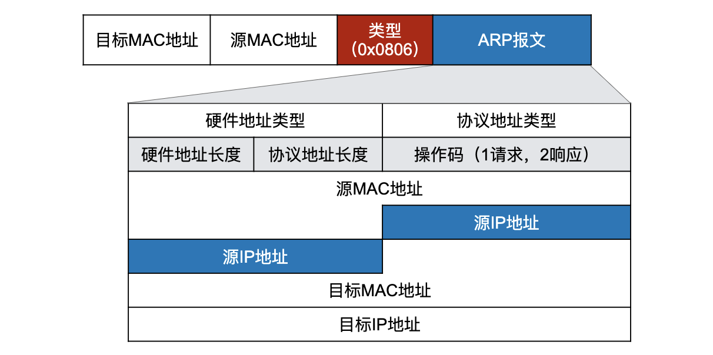
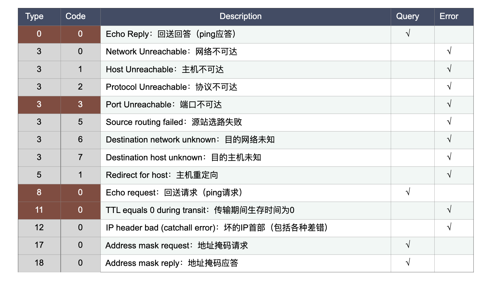

# 网络层
网际协议 IP 是TCP/IP 体系中两个最重要的协议之一。与 IP 协议配套使用的还有三个协议。
+ 地址解析协议 ARP
+ 网际控制报文协议 ICMP
+ 网际组管理协议 IGMP


## 网络层概述

### 为什么需要网络层
数据链路层解决了同一局域网（直连网络）计算机间帧的传输问题，没有解决以下问题：
+ 异构网络互联，即跨局域网连接和资源共享
+ 互联网络中主机标识问题
+ 互联网中主机标识问题
+ 互联网中主机间路由选择问题（最佳路径）
+ 互联网中数据转发的问题（分组转发）

### 网络层提供什么服务？
互联网的先驱者提出了一种崭新的网络设计思路。网络层向上只提供简单灵活的、无连接的、尽最大努力交付的数据报服务。网络在发送分组时不需要先建立连接。每一个分组（即 IP 数据报）独立发送，与其前后的分组无关（不进行编号）。
网络层不提供服务质量的承诺。即所传送的分组可能出错、丢失、重复和失序（不按序到达终点），当然也不保证分组传送的时限。

#### 尽最大努力交付
由于传输网络不提供端到端的可靠传输服务，网络中的路由器可以做得比较简单，而且价格低廉；如果主机（即端系统）中的进程之间的通信需要是可靠的，那么就由网络的主机中的运输层负责可靠交付（包括差错处理、流量控制等）；这种设计思路的好处是：网络的造价大大降低，运行方式灵活，适应多种应用。

#### 网络层的两个层面
路由器中既有转发表又有路由选择软件。转发表来源于路由表。路由表是由互联网中许多的路由器，按照共同选定的路由选择协议，通过许多次的相互交互路由信息而产生的。由此可见，在路由器之间传送的信息有以下两大类。
+ 第一类：转发主机之间所传送的数据
+ 第二类：传送路由信息，这一类信息的传送是为第一类数据的传送服务的。

因此，可将网络层抽象地划分为数据层面（转发层面）和控制层面。
+ 数据层面。
  + 每个路由器独立工作，根据收到 IP 分组的目的地址，按转发表转发至下一条路由器。
  + 采用硬件转发，速度快（纳秒数量级，10^-9秒）。
+ 控制层面。
  + 运行路由选择协议（软件），生成路由表（耗时长，秒级）。
  + 路由器间需要相互协作，交换路由信息。


## 虚拟网络互连
虚拟互连网络也就是逻辑互连网络，他的意思就是互连起来的各种物理网络的异构性本来是客观存在的，但是我们利用 IP 协议就可以使这些性能各异的网络从用户看起来好像是一个统一的网络。使用 IP 协议的虚拟互连网络可简称为 IP 网。使用虚拟互连网络的好处是：当互联网上的主机进行通信时，就好像在一个网络上通信一样，而看不见互连的各具体的网络异构细节。

### 使用一些中间设备进行互连
将网络互相连接起来要使用一些中间设备，中间设备又称为中间系统或中继系统。有如下常见的五种不同的中间设备。
1. 物理层中继系统。转发器（repeater）
2. 数据链路层的中继系统。网桥或桥接器（bridge）。
3. 网络层中继系统。路由器（router）
4. 网桥和路由器的混合物。桥路器。
5. 网络层以上的中继系统。网关（gateway）。

当中继系统是转发器或网桥时，一般并不称为网络互连，仅仅是一个网络扩大了，而这仍然是一个网络（局域网）。网络互连就是指用路由器进行网络互连和路由选择。

## IP 地址
我们把整个因特网看出为一个单一的、抽象的网络。IP 地址就是给每个连接在互联网上的主机（或路由器）的每一个接口分配一个在全世界范围内唯一的 32 位标识符。IP 地址由互联网名字和数字分配机构 [ICANN](http://www.icann.org) 进行分配。


北京计算机应用研究所于 1993 年 6 月 4 日从 APNIC 处获得了一个 C 类的 IP 地址。[CNNIC](http://www.cnnic.net.cn) 以国家互联网络注册机构（NIR）的身份于 1997 年 1 月成为 APNIC 的联盟会员，成立了以 CNNIC 为召集单位的分配联盟，已为多家 ISP 提供 IP 地址：中国联合通信有限公司、中国卫星通信集团公司、总参通信部、中国科技网络中心、中国国际电子商务中心、中国铁通集团公司等单位的全部 IP 地址；中国电信集团公司、中国网络通信集团公司、中国移动通信集团公司的部分下属单位的 IP 地址。

### IP 地址概述
IP 地址不但标志了接口某一主机，还标志了该接口所连接的网络。
IP 地址的编制方法工经过了三个历史阶段。
1. 分类的 IP 地址。这是最基本的编址方法，在 1981 年就通过了相应的标准协议。
2. 子网的划分。这是对最基本的编址方法的改进，其标准 [RFC 950](https://datatracker.ietf.org/doc/html/rfc950) 在 1985 年通过。
3. 构成超网。这是比较新的无分类编址方法。1993 年提出后很快得到推广应用。

### 分类的 IP 地址
将 IP 地址分为若干个固定类。每一类地址都由两个固定长度的字段组成，其中一个字段是网络号 net-id，它标志主机（或路由器）所连接到的网络，而另一个字段则是主机号 host-id，它标志该主机（或路由器）。主机号在它前面的网络号所指明的网络范围内必须是唯一的。由此可见，一个 IP 地址在整个互联网范围内是唯一的。这种划分成两部分的 IP 地址称为两级 IP 地址。
两级的 IP 地址可记为
```
    IP地址 ::={<网络号>，<主机号>} 
```

#### 各类 IP 地址的网络号字段和主机号字段


#### 一般不使用的特殊的 IP 地址
网络号 | 主机号 | 源地址使用 | 目的地址使用 | 描述
------|-------|--------—-|------------|--------------
0     | 0     | 可以      | 不可以      | 在本网络上的本主机
0     | X     | 可以      | 不可以      | 在本网络上的主机号为 X 的主机
全 1  | 全 1   | 不可以    |  可以       | 只在本网络上进行广播（各路由器均不转发）
Y     | 全 1  | 不可以     | 可以        | 对网络号为 Y 的网络上的所有主机进行广播
127 | 非全 0 或全 1 的任何数 | 可以 | 可以 | 用于本地软件回环测试

#### 分类 IP 地址的优点
IP 地址时一种分等级的地址结构。分两个等级的好处是。
+ IP 地址管理机构在分配 IP 地址时只分配网络号，而剩下的主机号则由得到该网络号的单位自行分配。这样就方便了 IP 地址的管理。
+ 路由器仅根据目的主机所连接的网络号来转发分组（而不考虑目的主机号），这样就可以使路由表中的项目数大幅度减少，从而减少了路由表所占的存储空间。

### 子网的划分
在 ARPANET 的早期，IP 地址的设计确实不够合理。其表现在
+ IP 地址空间的利用率有时很低。
+ 给每一个物理网络分配一个网络号会使路由表变得太大因而使网络性能变坏。
+ 两级的 IP 地址不够灵活。
+ 
#### 三级 IP 地址的演变
1985 年起在 IP 地址中增加了一个”子网号字段“，使两级的 IP 地址变成为三级的 IP 地址。这种做法叫做**划分子网**（subnetting）。划分子网已成为互联网的正式标准协议。

#### 为什么要划分子网？
+ 把大的广播域划分成为较小的广播域
+ 提高 IP 地址空间的利用率
+ 保证网络的安全性
+ 提高网络的灵活性

#### 划分子网的方法
+ 从主机号借用若干个位作为子网号 subnet-id，主机号 host-id 相应减少了若干个位。
+ 等长子网划分。即所划分的所有子网的子网掩码是相同的。
+ 变长子网划分。即不同子网拥有主机数可不相同。
+ 划分子网增加了灵活性，但却减少了能够连接在网络上的主机总数。
+ 凡是从其他网络发送给本单位内某个主机的的 IP 数据报，仍然是根据 IP 数据报的的目的网络号 net-id，先找到连接在本单位网络上的路由器。然后此路由器在收到 IP 数据报后，再按目的网络号 net-id 和子网号 subnet-id 找到目的子网，最后就将 IP 数据报直接交付给目的主机。

#### 子网掩码
因为从一个 IP 数据报的首部并无法判断源主机或目的主机所连接的网络是否进行了子网划分。而路由器需要知道子网划分情况，所以路由器需要使用子网掩码计算 IP 地址的网络号（划分子网之后）。
+ 子网掩码长度 = 32 位
+ 子网掩码左边部分的一连串 1，对应位为网络号和子网号。
+ 子网掩码右边部分的一连串 0，对应位为主机号。

##### 子网掩码的计算演示


##### 默认子网掩码


##### 子网掩码的作用
+ 路由器在和相邻路由器交换路由信息时，必须把自己所在网络（或子网）的子网掩码告诉相邻路由器。
+ 路由器的路由表中的每一个项目，除了要给出目的网络地址外，还必须同时给出该网络的子网掩码。
+ 若一个路由器连接在两个子网上就拥有两个网络地址和两个子网掩码。
```
在路由表中表项的大致格式为
    | 目的网络 | 子网掩码 | 下一跳路由器
```

#### 使用子网时分组的转发
在不划分子网的两级 IP 地址下，从 IP 地址得出网络地址是个很简单的事。但是在划分子网之后，从 IP 地址却不能唯一地得出网络地址来，这是因为网络地址取决于那个网络所采用的的子网掩码，但数据报的首部并没有提供子网掩码的信息。因此，分组转发的算法也需要作相应的改动。
1. 从收到的分组的首部提取目的 IP 地址 D。
2. 先用各网络的子网掩码和 D 逐位相“与”运算，看是否和相应的网络地址匹配。若匹配，则将分组直接交付。否则就是间接交付，执行（3）。
3. 若路由表中有目的地址为 D 的特定主机路由，则将分组传送给指明的下一跳路由器。否则执行（4）
4. 对路由表中的每一行，将子网掩码和 D 逐位相“与”运算。若结果与该行的目的网络地址匹配，则将分组传送给该行指明的下一跳路由器。否则执行（5）
5. 若路由表中有一个默认路由，则将分组传送给路由表中所指明的默认路由器。否则执行（6）。
6. 报告转发分组出错。

大致流程如下图。


### 无分类编址 CIDR
划分子网在一定程度上缓解了互联网在发展中遇到的困难。然而在 1992 年互联网仍然面临三个必须尽早解决的问题：
+ B 类地址在 1992 年已分配了近一半，眼看就要在 1994 年 3 月全部分配完毕！
+ 互联网主干网上的路由表中的项目数急剧增长（从几千个增长到几万个）。
+ 整个 IPv4 的地址空间最终将全部耗尽。

#### IP 编址问题的演进
+ RFC 1009 规定，在一个划分子网的网络中可同时使用几个不同的子网掩码。
+ 使用变⻓子网掩码VLSM (Variable Length Subnet Mask)，提高 IP 地址资源的利用率；
+ 在 VLSM 的基础上又进一步研究出无分类编址方法，它的正式名字是 无分类域间路由选择 CIDR (Classless Inter-Domain Routing)。

#### CIDR 的特点
+ CIDR 消除了A 类、B 类和 C 类地址以及划分子网的概念，更加有效地分配 IPv4 的地址空间：
+ CIDR变⻓的“网络前缀”(network-prefix)来代替分类地址中的网络号和子网号；
+ IP 地址从三级编址（使用子网掩码）又回到了两级编址。

#### 无分类的两级编址
```
    IP地址 ::= {<网络前缀>, <主机号>}
```
CIDR 是一种无分类的两级编址的记法，它使用“斜线记法”(slash notation)，即在IP 地址后面加上一个斜线“/”，然后写上网络前缀所占的位数（这个数值对应于三级编址中子网掩码中 1 的个数）。网络号改成了“网络前缀”，n 位网络前缀可以是任意⻓度。 
```
    例如：
    128.14.32.0/20 表示的地址块共有 212 个地址（斜线后面的 20 是网络前缀的位数，这个地址的主机号是 12 位）
    地址块的起始地址是 128.14.32.0；
    在不需要指出地址块的起始地址时，也可将这样的地址块简称为“/20 地址块”；
    128.14.32.0/20 地址块的最小地址：128.14.32.0；
    128.14.32.0/20 地址块的最大地址：128.14.47.255；
    全 0 和全 1 的主机号地址不使用。
```
+ CIDR 把网络前缀都相同的连续的 IP 地址组成“CIDR 地址块”；
+ 一个CIDR地址块包含的IP地址数目，取决于网络前缀的位数。

#### 特殊的地址块
+ 前缀 n = 32，即 32 位 IP 地址都是前缀，没有主机号。这其实就是一个 IP 地址。这个特殊地址用于主机路由。
+ 前缀 n = 31，这个地址块中只有两个 IP 地址，其主机号分别为 0 和 1.这个地址块用于点对点链路。
+ 全 0. 0.0.0.0/0。用于默认路由。

#### 路由聚合（route aggregation）
+ 一个 CIDR 地址块可以表示很多地址，这种地址的聚合常称为路由聚合，它使得路由表中的一个项目可以表示很多个（例如上千个）原来传统分类地址的路由。
+ 路由聚合有利于减少路由器之间的路由选择信息的交换，从而提高了整个互联网的性能。
+ 路由聚合也称为构成超网（supernetting）
+ CIDR 虽然不使用子网了，但仍然使用“掩码”这一名词（但不叫子网掩码）
+ 对于 /20 地址块，它的掩码是 20 个连续的 1。斜线记法中的数字就是掩码中 1 的个数。

##### 构成超网
+ 前缀长度不超过 23 位的 CIDR 地址块都包含了多个 C 类地址，这些 C 类地址合起来就构成了超网。
+ CIDR 地址块中的地址数一定是 2 的整数次幂
+ 网络前缀越短，期地址块所包含的地址数越多。而在三级结构的 IP 地址中，划分子网是使网络前缀变长。
+ CIDR 的一个好处是，可以更加有效地分配 IPv4 的地址空间，可根据客户的需要分配适当大小的 CIDR 地址块。

#### 最长前缀匹配
+ 使用 CIDR 时，路由表中的米格项目由”网络前缀“和”下一条地址“组成。在查找路由表时可能会得到不止一个匹配结果。
+ 应当从匹配结果中选择具有最长网络前缀的路由：最长匹配前缀。（longest-prefix matching）
+ 网络前缀越长，起地址块就越小，因而路由就越具体（more specific）
+ 最长前缀匹配又称为最长匹配或最佳匹配。

### IP 地址的一些重要特点
+ 每一个 IP 地址都由网络前缀和主机号两部分组成。
+ IP 地址管理机构只分配网络前缀，主机号由得到该网络前缀的单位自行分配。
+ 路由器根据目的主机所连接的网络前缀转发分组。
+ 连接到两个网络的主机称为多归属主机，必须具有两个网络前缀不同的 IP 地址。
+ 路由器至少应当连接两个网络，因此路由器至少有两个不同的 IP 地址。
+ 用转发器或网桥桥接起来的若干个局域网仍为一个网络，因此这些局域网都具有同样的网络前缀。
+ 所有分配到网络前缀的网络，无论是范围很小的局域网，还是可能覆盖很大地理范围的广域网，都是平等的。
+ 实际上 IP 地址是标志一个主机（或路由器）和一条链路的接口。

## IP 地址与硬件地址


IP 地址与硬件地址是不同的地址。从层次的角度看，硬件地址（或物理地址）是数据链路层和物理层使用的地址。IP 地址则是网络层和以上各层使用的地址，是一种逻辑地址（称 IP 地址是逻辑地址是因为 IP 地址是用软件实现的）。
+ 在 IP 层抽象的互联网上只能看到 IP 数据报；
+ IP数据报首部有源站 IP 地址，但路由器只根据目的站的 IP 地址进行转发；
+ 在局域网的链路层，只能看⻅ MAC 帧；
+ 互连在一起的网络的 MAC 地址体系各不相同，但 IP 层抽象的互联网屏蔽了下层这些很复杂的细节；
+ 网络层使用统一的、抽象的IP地址研究主机和主机或路由器之间的通信。

### 地址解析协议 ARP
不管网络层使用的是什么协议，在实际网络的链路上传送数据帧时，最终还是必须使用硬件地址。那么已经知道了某主机或路由器的 IP 地址，如何找出其相应的硬件地址呢？
+ 地址解析协议 ARP 就是用来解决这样的问题的。
+ 根据网络层使用的 IP 地址，解析出数据链路层使用的硬件地址。
+ ARP 的作用范围只局限于一个广播域内。



### ARP 高速缓存
每一个主机都设有一个 ARP 高速缓存（ARP cache），里面有所在的局域网上的各主机和路由器的 IP 地址到硬件地址的映射表。

#### ARP 高速缓存的作用
+ 存放最近获得的 IP 地址到 MAC 地址的绑定，以减少 ARP 广播的数量。
+ 为了减少网络上的通信量，主机 A 在发送其 ARP 请求分组时，就将自己的 IP 地址到硬件地址的映射写入 ARP 请求分组。
+ 当主机 B 收到 A 的 ARP 请求分组时，就将主机 A 的这一地址映射写入主机 B 自己的 ARP 高速缓存中。这对主机 B 以后向 A 发送数据报时就更方便了。

### ARP 协议运行过程
当主机 A 欲向本局域网上的某个主机 B 发送 IP 数据报时，就先在其 ARP 高速缓存中查看有无主机 B 的 IP 地址。
+ 如果有，就可以查出其对应的硬件地址，再将此硬件地址写入 MAC 帧，然后通过局域网将该 MAC 帧发送此硬件地址。
+ 如没有，ARP 进程在本局域网上广播发送一个 ARP 请求分组。收到 ARP 响应分组后，将得到的 IP 地址到硬件地址的映射写入 ARP 高速缓存。

### 注意问题
+ ARP 协议不能穿透路由器。
+ ARP 只能用于解决同一个局域网上的主机或路由器的 IP 地址和硬件地址的映射问题；
+ 如果所要找的主机和源主机不在同一个局域网上，那么就要通过 ARP 找到一个位于本局域网上的某个路由器的硬件地址，然后把分组发送给这个路由器，让这个路由器把分组转发给下一个网络；
+ 从 IP 地址到硬件地址的解析是自动进行的，主机的用户对这种地址解析过程是不知道的。

### 使用 ARP 的四种典型情况
1. 主机与主机。直接交付，直连网络内。
2. 主机与路由器。间接交付，交付给网关。
3. 路由器与路由器。间接交付，路由器间转发。
4. 路由器与主机。直接交付，路由器直接交付给目标主机。

## IP 数据报
IP 数据报由首部和数据两部分组成，首部的前一部分是固定长度，共 20 字节，是所有 IP 数据报必须具有的。在首部的固定部分的后面是一些可选字段，其长度是可变的。


### 格式字段
字段 | 说明
----|-----
版本 | 占 4 位，指 IP 协议的版本，目前的 IP 协议版本号为 4，即 IPv4。
首部长度 | 占 4 位，科表示的最大数值是 15 个单位（一个单位是 4 字节）。IP 首部长度的最大值是 60 字节。一般 IP 首部仅有固定部分 20 字节。故通常该字段对应的值为 0101
区分服务 | 指明期望获得哪种类型的服务。一般不用。
总长度 | 占 16 位，首部 + 数据，单位为字节，数据报的最大长度为 65535 字节，注意总长度与 MTU 的关系。
标识 | 是一个计数器，用来产生 IP 数据报标识。所有 IP 分片的标识与原始 IP 的标识一致，便于接收方还原原始 IP 数据报。
标志 | 占 3 位。最高位无意义。中间位 DF （Don't Fragment)。DF=0 允许分片，否则不允许分片。最低位 MF（More Fragment） MF=1 表示后面还有”分片“，MF=0 表示当前已是最后一个分片。
片偏移 | 占 13 位，某片在原始 IP 中的相对位置，以 8 字节为单位。
生存时间 | 占 8 位，记为 TTL（Time to live）。指示数据报在网络中可通过的路由器数的最大值。路由器收到 IP 数据报后，将 TTL 减 1，减 1 之后 TTL 值若变为 0，路由器丢弃该 IP 数据报。并向源端报超时错误。
协议 | 占 8 位，指出此数据报携带的数据使用何种协议，以便目的主机的 IP 层将数据部分，上交给那个处理过程。
首部检验和 | 占 16 位，只检验数据报的首部，不检验数据部分。
源地址 | 占 4 字节。
目的地址 | 占 4 字节。
可变部分 | 长度可变，从 1 个字节到 40 个字节不等，取决于所选择的项目。实际上这些选项很少被使用。

#### IP 分片说明
假设原始 IP 数据报总长度为 6578 字节，则原始 IP 数据报中携带的数据为 6558 字节（假设固定首部 20 字节）。若该 IP 数据报需通过以太网帧传输（MTU=1500字节），则需要分为 5 个 IP 分片。
+ 前 4 个 IP 分片每片携带 1480 字节（加上 IP 分片首部 20 字节，刚好 1500 字节）
+ 最后一个 IP 分片携带 638 字节。


## 网际控制报文协议 ICMP （Internet Control Message Protocol）

### 为什么需要 ICMP 协议？
为了更有效地转发 IP 数据报和提高交付成功的机会，在网际层使用了网际控制报文协议 ICMP；ICMP 使主机或路由器报告差错情况和提供有关异常情况的报告；ICMP 不是高层协议（看起来好像是高层协议，因为 ICMP 报文是装在 IP 数据报中，作为其中的数据部分），是 IP 层的协议。


### ICMP 报文
ICMP 报文的种类有两种，ICMP 差错报告报文 和 ICMP 询问报文。ICMP 报文的前 4 个字节是统一的格式，共有三个字段：类型、代码和检验和。接着的 4 个字节的内容与 ICMP 的类型有关。

#### ICMP 差错报告报文

##### ICMP 差错报告报文共有 4 种。
1. 终点不可达。
2. 超时。
3. 参数问题。
4. 路由重定向。



##### ICMP 差错报告报文格式


ICMP 数据字段为什么需要加上原始出错 IP 中的数据字段前 8 个字节呢？
+ 告诉源 IP 数据报发送端，是哪一个进程发送的 IP 数据报出错。（通常 IP 数据报数据字段的前 8 个字节是 源端口和目标端口）

##### 不应发送 ICMP 差错报告报文的几种情况
+ 对 ICMP 差错报告报文不再发送 ICMP 差错报告报文。
+ 对第一个分片的数据报分片的所有后续数据报片都不发送 ICMP 差错报告报文。
+ 对具有多播地址的数据报都不发送 ICMP 差错报告报文。
+ 对具有特殊地址（如127.0.0.0 或 0.0.0.0）的数据报不发送 ICMP 差错报告报文。

#### ICMP 询问报文
ICMP 询问报文有两种。
1. 会送请求和回答报文
   1. 请求：type = 8，code = 0。
   2. 回答：type = 0, code = 0。
2. 时间戳请求和回答报文
   1. 请求：type = 13，code = 0。
   2. 回答：type = 14，code = 0。

#### ICMP 的应用举例
##### PING (Packet InterNet Groper) ：
+ PING 用来测试两个主机之间的连通性；
+ PING 使用了 ICMP 回送请求与回送回答报文；
+ PING 是**应用层直接使用网络层** ICMP 的例子，它没有通过运输层的 TCP 或UDP。

##### PING 采用的 ICMP 协议格式


标识和序号是用来实现类似 TCP 协议或 UDP 协议的端口号功能，用以区分”询问和应答“对。

##### Traceroute
用来跟踪一个分组从源点到终点的路径。利用 IP 数据报中的 TTL 字段和 ICMP 时间超过差错报告报文实现对从源点到终点的路径的跟踪。

## 路由器
路由器是互联网中的关键设备，用于连通不同的网络。它是一种具有多个输入端口和多个输出端口的专用计算机，其任务是转发分组。也就是说，将路由器某个端口收到的分组，按照分组要去的目的网络，把该分组从路由器的某个合适的输出端口转发给下一跳路由器。下一跳路由器也按照这种方法处理分组，直到该分组到达终点为止。

### 路由器的结构


#### 整个的路由器结构可分为两大部分。
1. 路由选择部分
   1. 也叫做控制部分，其核心构件是路由选择处理机。
   2. 路由选择处理机的任务是根据所选定的路由选择协议构造出路由表，同时经常或定期地和相邻路由器交换路由信息而不断的更新和维护路由表。
2. 分组转发部分。主要由三部分组成。
   1. 交换结构（switching fabric）。又称为交换组织，其作用是根据转发表（forwarding table）对分组进行处理。
   2. 一组输入端口。
   3. 一组输出端口。（这里的端口就是硬件接口）

#### ”转发“和”路由选择“的区别
+ ”转发“（forwarding）就是路由器根据转发表将用户的 IP 数据报从合适的端口转发出去。
+ ”路由选择“（routing）则是按照分布式算法，根据从各相邻路由器得到的关于网络拓扑的变化情况，动态地改变所选择的路由。
+ 路由表是根据路由选择算法得出的。而转发表是从路由表得出的。
+ 在讨论路由选择的原理时，往往不去区分转发表和路由表的区别。

#### 输入端口对线路上收到的分组的处理
+ 路由器的输入端口里面装有物理层、数据链路层和网络层的处理模块。
+ 数据链路层剥去帧首部和尾部后，将分组送到网络层的队列中排队等待处理。这会产生一定的时延。 
+ 输入端口中的查找和转发功能在路由器的交换功能中是最重要的。


#### 输出端口将交换结构传送来的分组发送到线路
+ 输出端口里面装有物理层、数据链路层和网络层的处理模块。
+ 输出端口从交换结构接收分组，然后把它们发送到路由器外面的线路上。
+ 在网络层的处理模块中设有一个缓冲区（队列）。当交换结构传送过来的分组的速率超过输出链路的发送速率时，来不及发送的分组就必须暂时存放在这个队列中。
+ 数据链路层处理模块将分组加上链路层的首部和尾部，交给物理层后发送到外部线路。


#### 分组丢弃
+ 若路由器处理分组的速率赶不上分组进入队列的速率，则队列的存储空间最终必定减少到零，这就使后面再进入队列的分组由于没有存储空间而只能被丢弃。路由器中的输入或输出队列产生溢出是造成分组丢失的重要原因。

#### 交换结构
+ 交换结构是路由器的关键构件，正是这个交换结构把分组从一个输入端口转移到某个何时的输出端口。实现交换有多种方法，常用交换方法有三种。
  + 通过存储器。
    1. 当路由器的某个输入端口收到一个分组时，就用中断方式通知路由选择处理机。然后分组就从输入端口复制到存储器中。
    2. 路由器处理机从分组首部提取目的地址，查找路由表，再将分组复制到合适的输出端口的缓存中。
    3. 若存储器的带宽（读或写）为每秒 M 个分组，那么路由器的交换速率（即分组从输入端口传送到输出端口的速率）一定小于 M/2。
  + 通过总线。
    + 数据报从输入端口通过共享的总线直接传送到合适的输出端口，而不需要路由选择处理机的干预。
    + 因为每一个要转发的分组都要通过这一条总线，因此路由器的转发带宽就受总线速率的限制。
    + 现代的技术已经可以将总线的带宽提高到每秒吉比特的速率，因此许多的路由器产品都采用这种通过总线的交换方式。
  + 通过纵横交换结构
    + 这种交换结构常称为互连网络 (interconnection network)。
    + 它有 2N 条总线，可以使 N 个输入端口和 N 个输出端口相连接。
    + 当输入端口收到一个分组时，就将它发送到与该输入端口相连的水平总线上。
    + 若通向所要转发的输出端口的垂直总线是空闲的，则在这个结点将垂直总线与水平总线接通，然后将该分组转发到这个输出端口。
    + 但若该垂直总线已被占用（有另一个分组正在转发到同一个输出端口），则后到达的分组就被阻塞，必须在输入端口排队。

### 查找路由表
路由表没有给分组指明到某个网络的完整路径。路由表指出，到某个网络应当先到某个路由器（即下一跳路由器）。在到达下一跳路由器后，再继续查找其路由表，知道再下一步应当到哪一个路由器。这样一步一步地查找下去，直到最后到达目的网络。这样做的结果是。
+ IP 数据报最终一定可以找到目的主机所在目的网络上的路由器（可能要通过多次的间接交付）
+ 只有到达最后一个路由器时，才试图向目的主机进行直接交付。

#### 特定主机路由
互联网所有的分组转发都是基于目的主机所在的网络，但允许有这样的特例，即为特定的目的主机指明一个路由。采用特定主机路由可使网络管理人员能更方便地控制网络和测试网络，同时也可在需要考虑某种安全问题时采用这种特定主机路由。
```
    特定主机路由： 网络前缀 /32
```

#### 默认路由
路由器还可采用默认路由以减少路由表所占用的空间和搜索路由表所用的时间。这种转发方式在一个网络只有很少的对外连接时是很有用的。默认路由在主机发送 IP 数据报时往往更能显示出它的好处。如果一个主机连接在一个小网络上，而这个网络只用一个路由器和互联网连接，那么在这种情况下使用默认路由是非常合适的。
+ 不管分组的最终目的网络在哪里，都由指定的路由器来处理。

### 路由器分组转发算法
1. 从数据报的首部提取目的主机的 IP 地址 D, 得出目的网络地址为 N。
2. 若网络 N 与此路由器直接相连，则把数据报直接交付目的主机 D；否则是间接交付，执行 (3)。
3. 若路由表中有目的地址为 D 的特定主机路由，则把数据报传送给路由表中所指明的下一跳路由器；否则，执行 (4)。
4. 若路由表中有到达网络 N 的路由，则把数据报传送给路由表指明的下一跳路由器；否则，执行 (5)。
5. 若路由表中有一个默认路由，则把数据报传送给路由表中所指明的默认路由器；否则，执行 (6)。
6. 报告转发分组出错。 


## 其他网络层技术
### 虚拟专用网 VPN
由于 IP 地址的紧缺，一个机构能够申请到的IP地址数往往远小于本机构所拥有的主机数。考虑到互联网并不很安全，一个机构内也并不需要把所有的主机接入到外部的互联网。假定在一个机构内部的计算机通信也是采用 TCP/IP 协议，那么从原则上讲，对于这些仅在机构内部使用的计算机就可以由本机构自行分配其 IP 地址。

#### 本地地址和全球地址
+ 本地地址。仅在机构内部使用的 IP 地址，可以由本机构自行分配，而不需要向互联网的管理机构申请。
+ 全球地址。全球唯一的 IP 地址，必须向互联网的管理机构申请。

如果在内部使用的本地地址就有可能和互联网中某个 IP 地址重合，这样就会出现地址的二义性问题。针对这个问题，RFC 给出了一个解决方案。RFC 1918 指明了一些专用地址 (private address)。专用地址只能用作本地地址而不能用作全球地址。在互联网中的所有路由器，对目的地址是专用地址的数据报一律不进行转发。

三个专用 IP 地址块
+ 10.0.0.0/8，即从 10.0.0.0 到 10.255.255.255；
+ 172.16.0.0/12，即从 172.16.0.0 到 172.31.255.255；
+ 192.168.0.0/16，即从 192.168.0.0 到 192.168.255.255；

#### 专用网
采用这样的专用 IP 地址的互连网络称为专用互联网或本地互联网，或更简单些，就叫做专用网。
因为这些专用地址仅在本机构内部使用。专用IP地址也叫做可重用地址 (reusable address)。

#### VPN
利用公用的互联网作为本机构各专用网之间的通信载体，这样的专用网又称为虚拟专用网VPN (Virtual Private Network)。“专用网”是因为这种网络是为本机构的主机用于机构内部的通信，而不是用于和网络外非本机构的主机通信。“虚拟”表示“好像是”，但实际上并不是，因为现在并没有真正使用通信专线，而VPN只是在效果上和真正的专用网一样。如果专用网不同网点之间的通信必须经过公用的互联网，但又有保密的要求，那么所有通过互联网传送的数据都必须加密。一个机构要构建自己的 VPN 就必须为它的每一个场所购买专门的硬件和软件，并进行配置，使每一个场所的 VPN 系统都知道其他场所的地址。

#### 隧道技术
+ 在隧道的两端通过封装以及解封装技术在公网上建立一条数据通信道；
+ 使用这条数据通道对数据进行传输；
+ 隧道是由隧道协议构建形成的；
+ 隧道技术是 VPN 技术中的最关键的技术。

### 网络地址转换 NAT
网络地址转换 NAT （Network Address Transiation）方法是在专用网上使用专用地址的主机和互联网上的主机通信的手段之一。它于 1994 年提出。使用 NAT 技术需要在专用网连接到互联网的路由器上安装 NAT 软件。装有 NAT 软件的路由器叫做 NAT 路由器，它至少有一个有效的外部全球 IP 地址。所有使用本地地址的主机和外界通信时，都要在 NAT 路由器上将本地地址转换成全球 IP 地址，才能和互联网连接。


内部主机与外部主机通信时，在NAT路由器上发生了两次地址转换：
+ 离开专用网时：替换源地址，将内部地址替换为全球地址；
+ 进入专用网时：替换目的地址，将全球地址替换为内部地址；

#### NAT 技术没有解决的问题
1. 当 NAT 路由器具有 n 个全球 IP 地址时，专用网内**最多**可以同时有 n 台主机接入到互联网。这样就可以使专用网内较多数量的主机，轮流使用 NAT 路由器有限数量的全球 IP 地址。
2. 通过 NAT 路由器的通信必须由专用网内的主机发起。专用网内部的主机**不能**充当服务器用，因为互联网上的客户无法请求专用网内的服务器提供服务。
   
#### NAPT
为了更加有效地利用 NAT 路由器上的全球IP地址，现在常用的 NAT 转换表把运输层的端口号也利用上。这样，就可以使多个拥有本地地址的主机，共用一个 NAT 路由器上的全球 IP 地址，因而可以同时和互联网上的不同主机进行通信。使用端口号的 NAT 叫做网络地址与端口号转换NAPT (Network Address and Port Translation)，而不使用端口号的 NAT 就叫做传统的 NAT (traditional NAT)。


NAPT把专用网内不同的源 IP 地址，都转换为同样的全球 IP 地址。对源主机所采用的 TCP 端口号（不管相同或不同），转换为不同的新的端口号。当 NAPT 路由器收到从互联网发来的应答时，就可以从 IP 数据报的数据部分找出运输层的端口号，然后根据不同的目的端口号，从 NAPT 转换表中找到正确的目的主机。

#### 静态 NAT
+ 为内部某台服务器，指定一个固定转换的公有 IP（一对一的）；
+ 对节约公网 IP 没有太大意义；
+ 外面主机可以使用这个公有 IP 访问服务器资源。
+ 可以保护服务器的安全。

## IPv6
（暂缓）