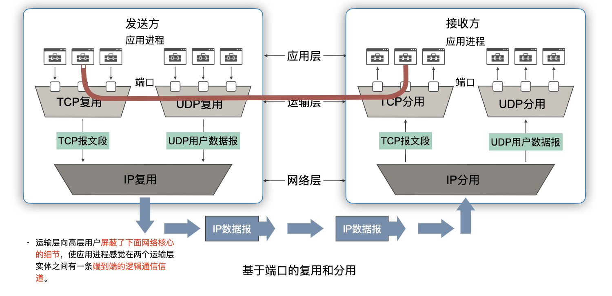

# 运输层

## 运输层协议概述

### 为什么需要运输层？
网络层解决的是一台主机经过网络到达另一台主机，即主机到主机间的通信。但最终具体由主机之上的哪个应用进程发送的分组，又需要接收主机的哪个应用进程来处理分组？网络层不予处理，故需要位于网络层之上的运输层来解决，所以运输层解决的是在不同主机之上，进程与进程之间的通信。

### 进程之间的通信
从通信和信息处理的角度看，运输层向它上面的应用层提供通信服务，它属于面向通信部分的最高层，同时也是用户功能中的最低层。当网络的边缘部分中的两个主机使用网络的核心部分的功能进行端到端的通信时，只有位于网络边缘部分的主机的协议栈才有运输层，而网络核心部分中的路由器在转发分组时都只用到下三层的功能。


”逻辑通信“的意思是”好像是这样通信，但事实上并非真的这样通信“。从 IP 层来说，通信的两端是两台主机。但”两台主机之间的通信“这种说法还不够清楚。严格的来讲，两台主机进行通信就是两台主机中的应用进程互相通信，从运输层的角度看，通信的真正端点并不是主机而是主机中的进程。也就是说，端到端的通信是应用进程之间的通信。

### 运输层的复用和分用


### 两种不同的运输协议
这条逻辑通信信道对上层的表现却因运输层使用的不同协议而有很大的差别。当运输层采用面向连接的 TCP 协议时，尽管下面的网络是不可靠的（只提供最大努力服务），但这种逻辑通信信道就相当于一条全双工的可靠信道。当运输层采用无连接的 UDP 协议时，这种逻辑通信信道是一条不可靠信道。

#### TCP 与 UDP 
两个对等运输实体在通信时传送的数据单位叫做运输协议数据单元（Transport Protocol Data Unit）。TCP 传送的数据单位协议是 TCP 报文段（segment）。UDP 传送的数据单位协议是 UDP 报文或用户数据报。
+ TCP。
  + 面向连接的协议，提供面向连接服务。
  + 支持点对点单播，不支持多播、广播。
  + 提供可靠服务
  + 复杂。用于大多数应用。如：万维网 HTTP、电子邮件 SMTP、文件传送 FTP 等。
+ UDP。
  + 无连接的协议，提供无连接服务。
  + 支持单播、广播、多播
  + 不提供可靠交付
  + 简单。适用于很多应用。如：多媒体应用、DNS、DHCP、RIP 等

另外，还需注意两点。
+ 运输层的 UDP 用户数据报与网际层的 IP 数据报有很大区别。
  + IP 数据报要经过互连网中许多路由器的存储转发。
  + UDP 用户数据报时在运输层的端到端抽象的逻辑信道中传送的。
+ TCP 报文段是在运输层抽象的端到端逻辑信道中传送，这种信道是可靠的全双工信道。但这样的信道却不知道究竟经过了哪些路由器，而这些路由器也根本不知道上面的运输层是否建立了 TCP 连接。

### 端口
端口用一个 16 位端口号进行标志，允许有65,535个不同的端口号。端口号只具有本地意义，即端口号只是为了标志本计算机应用层中的各进程。在互联网中，不同计算机的相同端口号是没有联系的。
+ 由此可见，两个计算机中的进程要互相通信，不仅必须知道对方的端口号（为了找到对方计算机中的应用进程） ，而且还要知道对方的 IP 地址（为了找到对方的计算机）。

#### 为什么需要端口？
+ 运行在计算机中的进程使用进程标识符来标志的。但运行在应用层的各种应用进程却不应当让计算机操作系统指派它的进程标识符。这是因为在互联网上使用的计算机的操作系统种类很多，而不同的操作系统又使用不同格式的进程标识符。为了使运行不同操作系统的计算机的应用进程能够互相通信，就必须用统一的方法对 TCP/IP 体系的应用进程进行标志。
+ 由于进程的创建和撤销都是动态的，发送方几乎无法识别其他机器上的进程。有时我们会该换接收报文的进程，但并不需要通知所有发送方。我们往往需要利用目的主机提供的功能来识别终点，而不需要直到实现这个功能的进程。解决这个问题的方法就是在运输层使用协议端口号（Protocol port number），或通常简称为端口（port）。虽然通信的终点是应用进程，但我们可以把端口想象成通信的终点，因为我们只要把要传送的报文交到目的主机的某一个何时的目的端口，剩下的工作（即最后交付目的进程）就由 TCP 来完成。

#### 软件端口与硬件端口
这是两个不同的概念。在协议栈层间的抽象的协议端口是软件端口。在路由器或交换机上的端口是硬件端口。硬件端口是不同硬件设备进行交互的接口，而软件端口是应用层的各种协议进程与运输实体进行层间交互的一种地址。

#### 两大类端口
+ 服务器端使用的端口号
  + **熟知端口**。数值一般为 0 ~ 1023.
  + **登记端口号**。数值为 1024 ~ 49151，为没有数值端口号的应用程序使用的。使用这个范围的端口号必须在 IANA 登记，以防止重复。
+ 客户端使用的端口号
  + 又称为**短暂端口号**，数值为 49152~ 65535，留给客户进程选择暂时使用。
  + 当服务器进程收到客户进程的报文时，就知道了客户进程所使用的的动态端口号。通信结束后，这个端口号可供其他客户进程使用。

## 用户数据报协议 UDP
UDP 只在 IP 的数据报服务之上增加了很少一点的功能。
+ 复用和分用的功能
+ 差错检测的功能

### UDP 的主要特点
1. UDP 是无连接的。发送数据之前不需要建立连接，因此减少了开销和发送数据之前的时延。
2. UDP 使用尽最大努力交付。即不保证可靠交付，因此主机不需要维持复杂的连接状态表。
3. UDP 是面向报文的。UDP 对应用层交下来的报文，既不合并，也不拆分，而是保留这些报文的边界。UDP 一次交付一个完整的报文。
4. UDP 没有拥塞控制。因此网络出现的拥塞不会使源主机的发送速率降低。这对某些实时应用是很重要的。很适合多媒体通信的要求。
5. UDP 支持一对一，一对多，多对一和多对多的交互通信。
6. UDP 的首部开销小。只有 8 个字节，比 TCP 的 20 个字节的首部要短。

### 面向报文的 UDP
+ 发送方 UDP 对应用程序交下来的报文，在添加首部后就向下交付 IP 层。UDP 对应用层交下来的报文，既不合并，也不拆分，而是保留这些报文的边界。也就是说，应用层交给 UDP 多长的报文，UDP 都照样发送，即一次发送一个报文。
+ 接收方 UDP 对 IP 层交上来的 UDP 用户数据报，在去除首部后就原封不动地交付上层的应用进程，一次交付一个完整的报文。应用程序必须选择合适大小的报文。
  + 若报文太长，UDP 把它交给 IP 层后，IP 层在传送时可能要进行分片，这会降低 IP 层的效率。
  + 若报文太短。UDP 把它交给 IP 层后，会使 IP 数据报的首部的相对长度太大，这也降低了 IP 层的效率。

### UDP 首部格式


用户数据报 UDP 两个字段。数据字段和首部字段。首部字段有 8 个字节，由 4 个字段组成，每个字段都是 2 字节。

#### 伪首部
伪首部不是 UDP 真实首部，仅仅是为了计算检验和。可以理解为 UDP 的两次检查。
+ 一次是对 IP 地址进行检验，确认该 IP 分组是发送给本机的。
+ 一次是对端口号和数据进行检验，确认交给哪个进程并且数据是无误的。
+ 发送方。
  + 增加伪首部，UDP 首部检验和和填充 0.
  + 数据部分填充 0 至 4 字节整数倍。
  + 计算检验和。伪首部 + 首部 + 数据。
  + 首部填上检验和。
  + 删除伪首部，发送 UDP 数据报。
+ 接收方。
  + 增加伪首部。
  + 计算检验和，伪首部 + 首部 + 数据。
  + 检验和全 1 无差错，否则丢弃或上交应用进程（附上错误警告）。

## 传输控制协议 TCP

### TCP 概述
TCP 是面向连接的运输层协议，在无连接的、不可靠的 IP 网络服务基础之上提供可靠交付的服务。为此，在 IP 的数据报服务基础之上，增加了保证可靠性的一系列措施。
+ 面向连接的特点
  + 每一条 TCP 连接只能有两个端点（endpoint），每一条 TCP 连接只能是点对点的（一对一）
  + 提供可靠交付的服务。
  + 提供全双工通信。
+ 面向字节流
  + TCP 中的“流”（stream）指的是流入或流出进程的字节序列。
  + 面向字节流的含义是：虽然应用程序和 TCP 的交互式一次一个数据块，但 TCP 把应用程序交下来的数据看成仅仅是一连串无结构的字节流。
  + TCP 不保证接收方应用程序所收到的数据块和发送方应用程序所发出的数据块具有对应大小的关系。
  + 但接收方应用程序收到的字节流必须和发送方应用程序发出的字节流完全一样。


注意：
+ TCP 连接是一条虚连接而不是一条真正的物理连接。
+ TCP 不关心应用进程一次把多长的报文发送到 TCP 缓存。
+ TCP 对连续的字节流进行分段，形成 TCP 报文段。
+ TCP 根据对方给出的窗口值和当前网络拥塞的程度来决定一个报文段应包含多少字节（UDP 发送的报文长度时应用进程给出的）。
+ TCP 可把太长的数据块划分短一些再传送。
+ TCP 也可等待积累有足够多的字节后再构成报文段发送出去。

### 套接字
TCP 把连接作为最基本的抽象。每一条 TCP 连接有两个端点。TCP 连接的端点不是主机，也不是 主机的 IP 地址，亦不是应用进程或协议端口。**TCP 连接的端点叫做套接字（Socket）**。端口号拼接到（contatenated with）IP 地址即构成了套接字。
```
    套接字 socket = (IP 地址 : 端口号)
    TCP 连接 := {socket1, socket2} = {(IP1:port1), (IP2:port2)}
```

## 可靠传输的工作原理
理想的传输条件有以下两个特点。
1. 传输的信道不产生差错
2. 不管发送方以多快的速度发送数据，接收方总是来得及处理收到的数据。

在这样的理想传输条件下，不需要采取任何措施就能够实现可靠传输。然而实际的网络都不具备以上两个理想条件。必须使用一些可靠传输协议，在不可靠的传输信道实现可靠传输。

### 停止等待协议
“停止等待”就是每发送完一个分组就停止发送，等待对方的确认。在收到确认后在发送下一个分组。全双工通信的双方既是发送方也是接收方。为了讨论问题的方便，我们仅考虑 A 发送数据，而 B 接收数据并发送确认，因此 A 叫做发送方，而 B 叫做接收方。

#### 无差错情况


#### 出现差错
然而，由于网络核心的复杂性，使得分组传输有可能出现差错。则会有两种情况。
+ B 接收 M1 时检测除了差错，则丢弃 M1，其他什么也不做。
+ M1 在传输过程中丢失了，这时 B 当然什么都不知道，也什么都不做。
在这两种情况下，B 都不会发送任何信息。但 A 都必须重发分组，直到 B 正确接收为止，这样才能实现可靠通信。那么 A 如何知道 B 是否正确收到了 M1 呢？
+ 解决方案是：**超时重传**。
+ A 为每一个已发送的分组都设置了一个超时计时器。
+ A 只要在超时计时器到期之前收到了相应的确认，就撤销该超时计时器，继续发送下一个分组 M2。
+ 若 A 在超时计时器规定时间内没有收到 B 的确认，就认为分组错误或丢失，就重发该分组。

另外，如果分组正确到达 B，但 B 发送的确认丢失或延迟了，由于 A 未及时收到 B 的确认，会超时重发。B 可能会收到重复的 M1，B 如何知道收到了重复的分组，需要丢弃呢？
+ 解决方案。编号。
+ A 为每一个发送的分组都进行编号。若 B 收到了编号相同的分组，则认为收到了重复分组，丢弃重复的分组，并会送确认。
+ B 为发送的确认也进行编号，指示该确认是对哪一个分组的确认。
+ A 根据确认及其编号，可以确定它是对哪一个分组的确认，避免重复发送。若为重复的确认，则将其丢弃。


#### 确认丢失和确认迟到
+ 确认丢失。
  + 若 B 所发送的对 M1 的确认丢失了，那么 A 在设定的超时重传时间内不能收到确认，但 A 并无法知道：是自己发送的分组出错、丢失了，或者 是 B 发送的确认丢失了。因此 A 在超时计时器到期后就要重传 M1。
  + 假定 B 又收到了重传的分组 M1。这时 B 应采取两个行动。
    + 丢弃这个重复的分组 M1，不向上层交付。
    + 向 A 发送确认。不能认为已经发送过确认就不再发送，因为 A 之所以重传 M1 就表示 A 没有收到对 M1 的确认。
+ 确认迟到。
  + 传输过程中没有出现差错，但 B 对分组 M1 的确认迟到了。
  + A 会收到重复的确认。对重复的确认的处理很简单。收下后就丢弃。
  + B 仍然会收到重复的 M1，并且同样要丢弃重复的 M1，并重传确认分组。


请注意。在发送完一个分组后，必须暂时保留已发送的分组的副本，以备重发。分组和确认分组都必须进行编号。超时计时器的重传时间应当比数据在分组传输的平均往返时间更长一些。

#### 自动重传请求 ARQ
通常 A 最终总是可以收到对所有发出的分组的确认。如果 A 不断重传分组但总是收不到确认，就说明通信线路太差，不能进行通信。使用上述的确认和重传机制，我们就可以在不可靠的传输网络上实现可靠的通信。像这种可靠传输协议常称为自动重传请求 ARQ（Automatic Repeat request）。意思是重传的请求是自动进行的，接收方不需要请求发送方重传某个出错的分组。

#### 信道利用率
停止等待协议的优点是简单，缺点是信道利用率太低。


可以看出，当往返时间 RTT 远大于分组发送时间 Td 时，信道的利用率就会非常低。若出现重传，则对传送有用的数据信息来说，信道的利用率就还要降低。

### 流水线传输
为了提高传输效率，发送方可以不使用低效率的停止等待协议，而是采用流水线传输。流水线传输就是发送方可连续发送多个分组，不必每发完一个分组就停顿下来等待对方的确认。这样可使信道上一直有数据不间断地传送。由于信道上一直有数据不间断地传送，这种传输方式可获得很高的信道利用率。


### 连续 ARQ 协议
基本思想：发送方一次可以发出多个分组。使用滑动窗口协议控制发送方和接收方所能发送和接收的分组的数量和编号。每收到一个确认，发送方就把发送窗口向前移动。接收方一般采用累积确认的方式，发送方一般采用回退 N（Go-Back-N）方法进行重传。


#### 累积确认
接收方一般采用累积确认的方式。即不必对收到的分组逐个发送确认，而是对按序到达的最后一个分组发送确认，这样就表示：到这个分组为止的所有分组都已正确收到了。
+ 优点。容易实现，即使确认丢失也不必重传。
+ 缺点。不能向发送方反映出接收方已经正确收到的所有分组的信息。

#### Go-back-N（回退 N）
如果发送方发送了前 5 个分组，而中间的第 3 个分组丢失了。这时接收方只能对前两个分组发出确认。发送方无法知道后面三个分组的下落，而只好把后面的三个分组都再重传一次。这就叫做 Go-back-N。表示需要再退回来重传已经发送过的 N 个分组。可见当通信线路质量不好时，连续 ARQ 协议会带来负面的影响。

### 连续 ARQ 协议与停止等待协议的对比
-----| 连续 ARQ 协议 | 停止等待协议
---- | ----------- | ----------
发送的分组数量 | 一次发送多个分组 | 一次发送一个分组
传输控制    | 滑动窗口协议 | 停止、等待 |
确认       | 累积确认 + 单独确认 | 单独确认
超市定时器  | 每个发送的分组 | 每个发送的分组
编号       | 每个发送的分组 | 每个发送的分组
重传       | 回退 N，多个分组 | 一个分组。

## TCP 报文段的首部格式
一个 TCP 报文段分为首部和数据两部分，而 TCP 的全部功能都体现在它首部中各字段的作用。TCP 报文段首部的前 20 个字节是固定的，后面有 4n 字节是根据需要而增加的选项（n 是整数）。因此 TCP 首部的最小长度是 20 字节。


### 字段语义说明
字段 | 说明
---- | ---- 
源端口  | 2 字节。端口是运输层和应用层的服务接口。
目的端口 | 2字节。运输层的复用和分用功能需要通过端口来实现。
序号   | 4 字节。TCP 连接中传送的数据流中的每一个字节都编上一个序号。序号字段的值则指的是本报文段所发送的数据的第一个字节的序号。
确认号 | 4 字节。是期望收到对方的下一个报文段的数据的第一个字节的序号。
数据偏移 | 4 位。它指出 TCP 报文段的**数据起始处**距离 TCP 报文段的起始处有多远。“数据偏移”的单位是 32 位（4 字节）。最大为 60 字节。
保留字段 | 6 位。保留位。
URG | 1 位。紧急位。当 URG = 1 时，表明紧急指针字段有效。它告诉系统此报文段中有紧急数据，应尽快传送（相当于优先级高的数据）。
ACK | 1 位。确认位。只有当 ACK = 1 时确认号字段才有效。
PSH | 1 位。推送位。接收 TCP 收到 PSH = 1 的报文段，就尽快地交付接收应用进程，而不再等到整个缓存都填满了再向上交付。
RST | 1 位。复位。当 RST = 1 时，表明 TCP 连接中出现严重差错（如由于主机崩溃或其他原因），必须释放连接，然后再重新建立运输连接。
SYN | 1 位。同步位。 SYN = 1 表示这是一个连接请求或连接接受报文。
FIN | 1 位。用来释放一个连接。FIN = 1 表明此报文段的发送端的数据已发送完毕，并要求释放运输连接。
窗口 | 2 字节。用来让对方设置发送窗口的依据，单位为字节。
检验和 | 2 字节。检验和字段检验的范围包括首部和数据这两部分。在计算机检验和时，要在 TCP 报文段的前面加上 12 字节的伪首部。
紧急指针 | 16 位。指出在本报文段中紧急数据共有多少个字节。（紧急数据放在本报文段数据部分的最前面）
填充 | 为了使整个首部长度是 4 字节的整数倍。

选项字段 | 说明 
---- | -----
MSS (Maximum Segment Size) | TCP 报文段中的数据字段的最大长度。
窗口扩大 | 3 字节。其中有一个字节表示移位值 S。新的窗口值等于 TCP 首部中的窗口位数增大到（16 + S），相当于把窗口值向左移动 S 位后获得实际的窗口大小。
时间戳 | 10 字节。其中最主要的字段时间戳值字段（4 字节）和时间戳回送回答字段（4 字节）。
选择确认 | 告诉发送方收到的连续的字节块。

### MSS 多大合适？
MSS 与 接收窗口值没有关系。若选择较小的 MSS 长度，网络的利用率较低；若 TCP 报文段非常长，那么在 IP 层传输时就有可能分解成多个短数据报分片，在终点需要把收到的各个短数据分片装配成原来的 TCP 报文段。当传输出错时还要进行重传，这些都会使开销增大。因此，MSS 应尽可能大些，只要在 IP 层传输时不需要再分片就行。

## TCP 可靠传输的实现
TCP 连接的每一端都必须设有两个窗口，一个发送窗口和一个缓存窗口。TCP 的可靠传输机制用**字节的序号**进行控制。TCP 所有的确认都是基于序号而不是基于报文段的。TCP 连接的往返时间 RTT 也不是固定不变的。需要使用特定的算法估算较为合理的重传时间。

### 以字节为单位的滑动窗口
TCP 使用流水线传输和滑动窗口协议实现高效、可靠的传输。TCP 的滑动窗口是以字节为单位的。发送方 A 和 接收方 B 分别维持一个发送窗口和一个接收窗口。
+ 发送窗口表示在没有收到确认的情况下，可以连续把窗口内的数据全部发送出去。
+ 接收窗口表示只允许接收落入窗口内的数据。


#### 发送缓存与接收缓存
发送缓存用来暂时存放
+ 发送应用程序传送给发送方 TCP 准备发送的数据。
+ TCP 已发送出但尚未收到确认的数据。


接收缓存用来暂时存放
+ 按序到达的、但尚未被接收应用程序读取的数据。
+ 不按序到达的数据。


注意事项
1. A 的发送窗口并不总是和 B 的接收窗口一样大（因为有一定的时间滞后）。
2. TCP 标准没有规定对不按序到达的数据应如何处理。通常先临时存放在接收窗口中，等到字节流中所缺少的字节收到后，再按序交付上层的应用进程。
3. TCP 要求接收方需要有累积确认的功能，这样可以减少传输开销。

#### 接收方发送确认的时机
接收方可以在合适的时候发送确认，也可以在自己有数据要发送时把确认信息顺便捎带上。也需注意两点。
+ 接收方不应过分推迟发送确认，否则会导致发送方不必要的重传，这反而浪费了网络的资源。
  + TCP 标准规定，确认推迟的时间不应超过 0.5 秒
  + 若收到一连串具有最大长度的报文段，则需要每隔一个报文段就发送一个确认。
+ 捎带确认实际上并不经常发生，因为大多数应用程序很少同时在两个方向上发送数据。

### 超时重传时间的选择
TCP 的发送方规在规定的时间内没有收到确认就要重传已发送的报文段。重传时间的选择是 TCP 最复杂的问题之一。由于 TCP 的下层是一个互联网环境，IP 数据报所选择的路有变化很大。因而运输层的往返时间 RTT 的方差也很大。如果把超时重传时间设置的太短，就会引起很多报文段的不必要的重传，使网络负荷增大。但若把超时重传时间设置得过长，则又使网络的空闲时间增大，降低了传输效率。

#### 加权平均往返时间 RTTs
TCP 采用了一种自适应算法，它记录一个报文段发出的时间，以及收到相应的确认的时间，这两个时间之差就是报文段的往返时间。TCP 保留了 RTT 的一个加权平均往返时间 RTTs（又称为平滑的往返时间），每当第一次测量到 RTT 样本时，RTTs 值就取为所测量到的 RTT 样本值。但以后每测量到一个新的 RTT 样本，就按下式重新计算一次 RTTs。
```
    新的 RTTs = （1 - ∂) x (旧的 RTTs) + ∂ x (新的 RTT 样本)
    在该式中，0 ≤ ∂ ≤ 1。若 ∂ 很接近于 0，表示 RTT 值更新较慢，若 ∂ 接近于 1，则表示 RTT 值更新较快。RFC 6298 推荐的 ∂ 值为 1/8，即 0.125。
```

#### 超时重传时间 RTO
超时计时器设置的地超时重传时间 RTO（RetransmissionTime-Out）应略大于上面得出的加权平均往返时间 RTTs。RFC 6298 建议使用下式计算 RTO。
```
    RTO = RTTs + 4 * RTTd
    RTTd 是 RTT 的偏差的加权平均值。
```
RFC 6298 建议这样计算 RTTd。第一次测量时，RTTd 值取为测量到的 RTT 样本值的一半。在以后的测量中，则使用下式计算加权平均的 RTTd。
```
    新的 RTTd = (1 - ß) x (旧的 RTTd) + ß x | RTTs - 新的 RTT 样本 |
    ß 是个小于 1 的系数，其推荐值是 1/4，即 0.25
```

#### 往返时间的测量
现假设 A 发送出一个报文段，设定的重传时间到了，还没有收到确认。于是重传报文段。经过了一段时间后，收到了确认报文段。现在的问题是：**如何判定此确认报文段时对先发送的报文段的确认，还是对后来重传的报文段的确认？**

##### Karn 算法
在计算加权平均 RTTs 时，只要报文段重传了，就不采用其往返时间样本。这样得出的加权平均 RTTs 和 RTO 就较准确。
但是这引起新的问题。当报文段的时延突然增大了很多时，在原来得出的重传时间内，不会收到确认报文段。于是就重传报文段。但根据 Karn 算法，不考虑重传的报文段的往返时间样本。这样，超时重传时间就无法更新。

##### 修正的 Karn 算法
报文段每重传一次，就把 RTO 增大一些。
```
    新的 RTO = ∂ x (旧的 RTO)
    系数 ∂ 的典型值是 2
```
当不再发生报文段的重传时，才根据报文段的往返时延更新平均往返时延 RTT 和超时重传时间 RTO 的数值。实践证明，这种策略较为合理。

### 选择确认 SACK
若收到的报文段无差错，只是未按序号，中间还缺少一些序号的数据，那么能否设法只传送缺少的数据而不重传已经正确到达接收方的数据？答案是可以的，选择确认 SACK（Selective ACK）就是一种可行的处理方法。

RFC 2018 规定。如果要使用选择确认，那么在建立 TCP 连接时，就要在 TCP 首部的选项中加上“允许 SACK ”的选项，而双方必须都实现商定好。如果要使用确认，那么原来首部中的“确认号字段“的用法仍然不变，只是以后在 TCP 报文段的首部中都增加了 SACK 选项，以便报告收到的不连续的字节块的边界。

由于首部选项的长度最多只有 40 字节，而指明一个边界就要用掉 4 字节，因此在选项中最多只能指明 4 个字节块的边界信息。

## TCP 的流量控制
一般说来，我们总是希望数据传输得更快一些。但如果发送方把数据发送得过快，接收方就可能来不及接收，这就会造成数据的丢失。流量控制（flow control)就是让发送方的发送速率不要太快，既要让接收方来得及接收，也不要使网络发生拥塞。利用滑动窗口机制可以很方便地在 TCP 连接上实现流量控制。


### 可能发生死锁
假设 B 向 A 发送了零窗口的报文段后不久，B 的接收缓存又有了一些存储空间。于是 B 向 A 发送了 rwnd=400 的报文段，但这个报文段在传送过程中丢失了，A 一直等待收到 B 发送的非零窗口的通知，而 B 也一直等待 A 发送的数据。如果没有其他措施，这种互相等待的死锁局面将一直延续下去。为了解决这个问题，TCP 为每一个连接设有一个**持续计时器**（persistence timer）。

### 持续计时器
只要 TCP 连接的一方收到对方的零窗口通知，就启动该持续计时器。若持续计时器设置的时间到期，就发送一个零窗口探测报文段（仅携带 1 字节的数据），而对方就在确认这个探测报文段时给出了现在的窗口值。若窗口仍然是 0，则收到这个报文段的一方就重新设置持续计时器。若窗口不是 0，则死锁的局面就可以打破了。

### TCP 的传输效率

#### TCP 发送报文段的时机
可以用不同的机制来控制 TCP 报文段的发送时机。
+ 第一种机制是 TCP 维持一个变量，它等于最大报文段长度 MSS。只要缓存中存放的数据达到 MSS 字节时，就组装成一个 TCP 报文段发送出去。
+ 第二种机制使由发送方的应用进程指明要求发送报文段，即 TCP 支持的推送操作。
+ 第三种机制是发送方的一个计时器期限到了，这时就把当前已有的缓存数据装入报文段（但长度不能超过 MSS）发送出去。

#### Nagle 算法
若发送应用进程把要发送的数据逐个字节地送到 TCP 的发送缓存，则发送方就把第一个数据字节先发送出去，把后面到达的数据字节都缓存起来。当发送方收到对第一个数据字符的确认后，再把发送缓存中的所有数据组装成一个报文段发送出去，同时继续对随后到达的数据进行缓存。只有在收到对前一个报文段的确认后才继续发送下一个报文段。当到达的数据已达到发送窗口大小的一半或已达到报文段的最大长度时，就立即发送一个报文段。

#### 糊涂窗口综合征
当接收方的 TCP 缓冲区已满，接收方会向发送方发送窗口大小为 0 的报文。若此时接收方的应用进程以交互方式每次只读取一个字节，于是接收方又发送窗口大小为一个字节的更新报文，发送方应邀发送一个字节的数据（发送的 IP 数据报是 41 字节长），于是接收窗口又满了，如此循环往复。比如说，发送方 TCP 每次接收到一字节的数据后就发送，这样，发送一个字节需要形成 41 字节长的 IP 数据报，有效数据传输效率 = 1/41 = 2.44%, 效率很低。

解决方案：让接收方等待一段时间，使得或者接收缓存已有足够空间容纳一个最长的报文段，或者等到接收缓存已有一半空闲的空间。只要出现这两种情况之一，接收方就发出确认报文，并向发送方通知当前的窗口大小。

## TCP 的拥塞控制

### 拥塞控制的一般原理

#### 拥塞
在某段时间，若对网络中某资源的需求超过了该资源所能提供的可用部分，网络的性能就要变坏。这种现象称为拥塞（congestion）。网络拥塞往往是由许多因素引起的，例如。
+ 某个结点缓存的容量太小
+ 链路的容量不足
+ 处理机处理的速率太慢
+ 拥塞本身会进一步加剧拥塞

```
出现拥塞的原因
    ∑ 对资源的需求 > 可用资源
```

**增加资源能解决拥塞嘛？**
**不能。**这是因为网络拥塞是一个非常复杂的问题。简单地采用上述做法，在许多情况下，不但不能解决拥塞问题，而且还可能使网络的性能更坏。例如，增大缓存，但为提高输出链路的容量和处理机的速度，排队等待时间将会大大增加，引起大量超时重传，解决不了网络拥塞。提高处理机处理的速率会将瓶颈转移到其他地方。

**拥塞常常趋于恶化**
路由器没有足够的缓存空间，它就会丢弃一些新到的分组。分组被丢弃时，发送这一分组的源点就会重传这一分组，甚至可能还要重传多次。这样会引起更多的分组流入网络和被网络中的路由器丢弃。拥塞引起的重传不会缓解网络的拥塞，反而会加剧网络的拥塞。

#### 拥塞控制与流量控制
+ 拥塞控制。防止过多的数据注入到网络中，使网络中的路由器或链路不致过载；拥塞控制是一个全局性的过程，涉及到与降低网络传输性能有关的所有因素。
+ 流量控制。抑制发送端发送数据的速率以使接收端来得及接收；是点对点通信量的控制，是端到端的问题。

#### 拥塞控制的作用


#### 拥塞控制的原理
**拥塞控制的前提是网络能够承受现有的网络负荷**。实践证明，拥塞控制是很难设计的，因为它是一个动态问题。分组的丢失是网络发生拥塞的征兆而不是原因。在许多情况下，甚至正是拥塞控制本身称为引起网络性能恶化、甚至发生死锁的原因。从大的方面看，拥塞控制可分为开环控制和闭环控制两种方法。
+ 开环控制。在设计网络时，事先考虑周全，力求工作时不产生拥塞。
+ 闭环控制。是基于反馈环路的概念；根据网络当前的运行状态采取相应控制措施。
  + 监测网络系统，以便检测到拥塞在何时、何处发生。
  + 将拥塞发生的信息传送到可采取行动的地方。
  + 调整网络系统的运行以解决出现的问题。
  + 监听网络拥塞的主要指标包括
    + 由于缺少缓存空间而被丢弃的分组的百分数
    + 平均队列长度
    + 超时重传的分组数
    + 平均分组时延
    + 分组时延的标准差，等等。
    + 上述指标的上升都标志着拥塞的增长。

**拥塞通知的传递**
+ 一种方法是在监测到拥塞发生时，要将拥塞发生的信息传送管道产生分组的源站。当然，通知拥塞发生的分组同样会使网络更加拥塞。
+ 另一种方法是在分组中保留表示拥塞状态的字段。
+ 或者周期性地发出探测分组等。


**拥塞控制的时机**
+ 过于频繁，会使系统产生不稳定的震荡。
+ 过迟缓地采取行动又不具有任何实用价值。

**解决拥塞的两条思路**
+ 增加网络可用资源
+ 减少用户对资源的需求。

### TCP 的拥塞控制方法
TCP 采用基于窗口的方法进行拥塞控制。该方法属于闭环控制方法。TCP 发送方维持一个拥塞窗口 cwnd （Congestion Window）的状态变量。拥塞窗口的大小取决于网络的拥塞程度，并且动态地在变化。发送端利用拥塞窗口根据网络的拥塞情况调整发送的数据量，发送窗口大小不仅取决于接收方窗口，还取决于网络的拥塞状况。
```
    真正的发送窗口值 = Min（接收方窗口值，拥塞窗口值）
```

#### 拥塞控制窗口的原则
+ 只要网络没有出现拥塞，拥塞窗口就可以再增大一些，以便把更多的分组发送出去，这样就可以提高网络的利用率。
+ 但只要网络出现拥塞或有可能出现拥塞，就必须把拥塞窗口减小一些，以减少注入到网络中的分组数，以便缓解网络出现的拥塞。

#### 拥塞的判断
+ 重传朝时期超时。现在通信线路的传输质量一般都很好，因传输出差错而丢弃分组的概率很小（远小于 1%）。只要出现了超时，就可以猜想网络可能出生了拥塞。
+ 收到三个重复的 ACK。预示网络可能会出现阻塞（实际可能还未发生阻塞）

#### 拥塞控制算法（RFC 5681）

##### 慢开始（slow-start）
+ 目的：用来确定网络的负载能力或拥塞程度。
+ 算法思路：由小到大逐渐增大拥塞窗口数值。
  + 当主机在已建立的 TCP 连接上开始发送数据时，并不清楚网络当前的负荷情况。如果立即把大量数据字节注入到昂罗，那么就有可能引起网络发送拥塞。先探测由Ixia，即由小到大逐渐增大注入到网络中的数据字节。
+ 两个变量。
  + 拥塞窗口。初始拥塞窗口值的设定。
    + 旧标准：1 至 2 个最大报文段。
    + RFC 5681。2 至 4 个最大报文段。
  + 慢开始门限。防止拥塞窗口增长过大引起网络拥塞。
+ 拥塞窗口 cwnd 控制方法。
  + 在每收到一个新的报文段的确认后，可以把拥塞窗口增加最多一个 SMSS 的数值。
    + 拥塞窗口 cwnd 每次的增加量 = min（N，SMSS）
    + 其中 N 是原先未被确认的、但现在被刚收到的确认报文段所确认的字节数。
    + 不难看出，当 N < SMSS 时，拥塞窗口每次的增加量要小于 SMSS。
    + 用这样的方法逐步增大发送方的拥塞窗口 cwnd，可以使分组注入到网络的速率更加合理。


为讨论方便，窗口大小单位采用报文段个数计算。使用慢开始算法后，每经过一个传输轮次（transmission round），拥塞窗口 cwnd 就加倍。一个传输轮次所经过的时间其实就是往返时间 RTT。传输轮次更加强调：把拥塞窗口 cwnd 所允许发送的报文段都连续发送出去，并收到了对已发送的最后一个字节的确认。例如，拥塞窗口 cwnd = 4，这时的往返时间 RTT 就是发送方连续发送 4 个报文段，并收到这 4 个报文段的确认，总共经历的时间。

**慢开始门限值状态变量 **ssthresh**
+ 当 cwnd < ssthresh 时，使用慢开始算法。
+ 当 cwnd > ssthresh 时，停止使用慢开始算法而改用拥塞避免算法。
+ 当 cwnd = ssthresh 时，即可使用慢开始算法，也可使用拥塞避免算法。

##### 拥塞避免（congestion avoidance）
+ 思路。让拥塞窗口 cwnd 缓慢地增大，避免出现拥塞。
+ 每经过一个传输轮次，拥塞窗口 cwnd = cwnd + 1.
+ 使拥塞窗口 cwnd 按**线性规律缓慢增大**。
+ 在拥塞避免阶段，具有”加法增大“（Additive Increase)的特点。


无论在慢开始还是在拥塞避免阶段，只要发送方判断网络出现拥塞（重传定时器超时）。
1. ssthresh = max(cwnd / 2, 2)
2. cwnd = 1
3. 执行慢开始算法

目的：迅速减少主机发送到网络中的分组数，使得发生拥塞的路由器有足够的时间把队列中积压的分组处理完毕。


所谓”拥塞避免“并非指完全能够避免了拥塞，而是把拥塞窗口控制为按线性规律增长，使网络比较不容易出现拥塞。利用以上的措施要完全避免网络拥塞还是不可能的。

##### 快重传（fast retransmit）
发送方只要一连收到三个重复确认，就知道接收方确实没有收到报文段，因而应当立即进行重传（即“快重传”），这样就不会出现超时，发送方也不就会误认为出现了网络拥塞。利用快重传可以使整个网络的吞吐量提高约 20%。不难看出。快重传并非取消重传计时器，而是在某些情况下可以更早地重传丢失的报文段。

采用快重传算法（Fast Retransmission）可以让发送方尽早知道发生了个别报文段的丢失。快重传算法首先要求接收方不要等待自己发送数据时才进行捎带确认，而是要立即发送确认，即使收到了失序的报文段也要立即发出对已收到的报文段的重复确认。


##### 快恢复（fast recovery）
当发送端收到连续三个重复的确认时，由于发送方现在认为网络很可能没有发生拥塞，因此现在不执行慢开始算法，而是执行快恢复算法（Fast Recovery)。
1. 慢开始门限值 ssthresh = 当前拥塞窗口 cwnd / 2;
2. 当新拥塞窗口 cwnd = 慢开始门限 ssthresh，执行拥塞避免算法，使拥塞窗口缓慢地线性增大。

#### 拥塞控制流程


#### 发送窗口的上限值
发送方的发送窗口应当取为接收方窗口 rwnd 和拥塞窗口 cwnd 这两个变量较小的一个，即应按一下公式确定。
```
    发送窗口的上限值 = Min(rwnd, cwnd)
```
+ 当 rwnd < cwnd 时，是接收方的接收能力限制发送窗口的最大值。
+ 当 cwnd < rwnd 时，则是网络的拥塞限制发送窗口的最大值。

### 主动队列管理 AQM
TCP 拥塞控制和网络层采取的策略有密切联系。若路由器对某些分组的处理时间特别长，那么这就可能使这些分组中的 TCP 报文段经过很长时间才能到达终点，结果引起发送方超时，对这些报文段进行重传。重传会使 TCP 连接的发送端认为在网络中发生了拥塞，但实际上网络并没有发生拥塞。对 TCP 拥塞控制影响最大的就是路由器的分组丢弃策略。

#### 路由器分组管理策略
在最简单的情况下，路由器的队列通常采用先进先出（FIFO）规则与尾部丢弃策略（tail-drop policy）。当队列已满时，以后再到达的所有分组将都被丢弃。路由器的尾部丢弃往往会导致一连串分组的丢失，这就使发送方出现超时重传，使 TCP 进入拥塞控制的慢开始状态，结果使 TCP 连接的发送方突然把数据的发送速率降低到很小的数值。

#### 全局同步
更为严重的是，在网络中通常有很多的 TCP 连接，这些连接中的报文段通常是复用在网络层的 IP 数据报中传送的。在这种情况下，若发生了路由器中的尾部丢弃，就可能会同时影响到很多条 TCP 连接，结果使这许多 TCP 连接在同一时间突然都进入到慢开始状态。这在 TCP 术语中称为全局同步（global syncronization）。全网同步使得全网的通信量突然下降了很多，而在网络恢复正常后，其通信量又突然增大很多。

#### 主动队列管理
1998 年提出了主动队列管理(Active Queue Management)。所谓“主动”就是不要等到路由器的长度已经达到最大值时才不得不丢弃后面到达的分组，而是在队列长度达到某个值得警惕的数值时（即当网络拥塞有了某些拥塞征兆时），就主动丢弃到达的分组。AQM 可以有不同的实现方法，其中曾流行多年的就是随机早期检测 RED（Random Early Detection）。

##### 随机早期检测 RED
使路由器的队列维持两个参数：队列长度最小门限 THmin 和最大门限 Thmax。RED 对每一个到达的分组都先计算平均队列长度 Lav。
+ 若平均队列长度小于最小门限 THmin，则将新到达的分组放入队列进行排队。
+ 若平均队列长度超过最大门限 Thmax，则将新到达的分组丢弃。
+ 若平均队列长度在最小门限 THmin 和最大门限 Thmax 之间，则按照某一概率 p 将新到达的分组丢弃。


但是，多年的实践证明，RED 的使用效果并不太理想。2015 年公布的 RFC 7567 已经把 RFC 2309 列为“陈旧的”，并且不再推荐使用 RED。但是对路由器进行主动队列管理 AQM 仍然是必要的。AQM 实际上就是对路由器中的分组排队进行智能管理，而不是简单地把队列的尾部丢弃。现在已经有几种不同的算法来代替旧的 RED，但都还在实验阶段。

## TCP 的运输连接管理
TCP 是面向连接的协议。TCP 连接的管理就是使 TCP 连接的建立和释放都能正常的进行。TCP 连接有三个阶段。
1. 连接建立。
2. 数据传送。
3. 连接释放。

### TCP 的连接建立
TCP 连接建立过程中要解决的三个主要问题。
1. 要使每一方能够确知对方的存在。
2. 要允许双方协商一些参数（如最大窗口值、是否使用窗口扩大选项和时间戳选项以及服务质量等）
3. 能够对运输实体资源（如缓存大小、连接表中的项目等）进行分配。

TCP 连接的建立采用客户服务器方式。主动发起连接建立的应用进程叫做客户（client），被动等待连接建立的应用进程叫做服务器（server）。

TCP 建立连接的过程叫做握手。握手需要在客户和服务器之间交换三个 TCP 报文段。称之为三报文握手。采用三报文握手主要是为了防止已失效的连接请求报文段突然又传送到了，因而产生错误。


为什么需要三报文握手建立连接？
二报文握手建立连接可能会产生一个问题，比如第 1 此握手迟到，服务器 B 等数据到来，客户没有数据要传送。


#### 三报文握手状态图


### TCP 的连接释放
数据传输结束后，通信的双方都可释放连接。TCP 连接释放过程是四报文握手。现假设 A 的应用进程先向其 TCP 发出连接释放报文段，并停止再发送数据，主动关闭 TCP 连接。
+ A 把连接释放报文段首部的FIN = 1，其序号seq = u，等待 B 的确认。
+ B 发出确认，确认号 ack = u + 1，而这个报文段自己的序号 seq = v。
+ TCP 服务器进程通知高层应用进程。
+ 从 A 到 B 这个方向连接就释放了，TCP 连接处于半关闭状态。B 若发送数据，A 仍要接收。
+ 若 B 已经没有要向 A 发送的数据，其应用进程就通知 TCP 释放连接。
+ A 收到连接释放报文段后，必须发出确认。
+ 在确认报文段中 ACK = 1，确认号 ack = w + 1，自己的序号 seq = u + 1。


#### 为什么要等待 2MSL 时长
1. 为了保证 A 发送的最后一个 ACK 报文段能够到达 B。
   1. 这个 ACK 报文段有可能丢失，因而使处在 LAST-ACK 状态的 B 收不到对已发送的 FIN + ACK 报文段的确认。B 会超时重传这个 FIN + ACK 报文段，而 A 就能在 2MSL 时间内收到这个重传的 FIN + ACK 报文段。接着 A 重传一次确认，重新启动 2MSL 计时器。最后，A 和 B 都正常进入到 CLOSED 状态。如果 A 在 TIME-WAIT 状态不等待一段时间，而是在发送完 ACK 报文段后立即释放连接，那么就无法收到 B 重传的 FIN + ACK 报文段，因而也不会再发送一次确认报文段。这样，B 就无法按照正常步骤进入 CLOSED 状态。
2. 防止“已失效的连接请求报文段”出现在本连接中。
   1. A 在发送完最后一个 ACK 报文段后，再经过时间 2MSL，就可以使本连接持续的时间内所产生的所有报文段都在网络中消失。这样就可以使下一个新的连接中不会出现这种旧的连接请求报文段。

#### 保活计时器
用来防止在 TCP 连接出现长时期的空闲。保活计时器通常设置为 2 小时。若服务器超过了 2 小时还没有收到客户的信息，它就发送探测报文段。若发送了 10 个探测报文段（每一个相隔 75 秒）还没有响应，就假定客户除了故障，因而就终止该连接。

### TCP 的有限状态机


## 小结
+ 运输层提供应用进程间的逻辑通信，也就是说，运输层之间的通信并不是真正在两个运输层之间直接传送数据。运输层向应用层屏蔽了下面网络的细节（如网络拓扑、所采用的路由选择协议等)，它使应用进程看见的就是好像在两个运输层实体之间有一条端到端的逻辑通信信道。
+ 网络层为主机之间提供逻辑通信，而运输层为应用进程之间提供端到端的逻辑通信。
+ 运输层有两个主要的协议：TCP 和 UDP。它们都有复用和分用，以及检错的功能。当运输层采用面向连接的 TCP 协议时，尽管下面的网络是不可靠的（只提供尽最大努力交付服务），但这种逻辑通信信道就相当于一条全双工通信的可靠信道。当运输层采用无连接的 UDP 协议时，这种逻辑通信信道仍然是一条不可靠信道。
+ 运输层用一个 16 位端口号来标志一个端口。端口号只具有本地意义，它只是为了标志本计算机应用层中的各个进程在和运输层交互时的层间接口。在互联网的不同计算机中，相同的端口号是没有关联的。
+ 两台计算机中的进程要互相通信，不仅要知道对方的 IP 地址（为了找到对方的计算机），而且还要知道对方的端口号（为了找到对方计算机中的应用进程)。
+ 运输层的端口号分为服务端使用的端口号（0 ~ 1023 指派给熟知端口，1024 ~ 49151 是登记端口号）和客户端暂时使用的端口号（49152 ~ 65535）。
+ UDP 的主要特点是。
  + 无连接
  + 尽最大努力交付
  + 面向报文
  + 无拥塞控制
  + 支持一对一、一对多、多对一和多对多的交互通信。
  + 首部开销小（只有四个字段：源端口、目的端口、长度、检验和）
+ TCP 的主要特点是。
  + 面向连接
  + 每一条 TCP 连接只能是点对点的（一对一）。
  + 提供可靠交付的服务
  + 提供全双工通信
  + 面向字节流
+ TCP 用主机的 IP 地址加上主机上的端口号作为 TCP 连接的端点。这样的端点就叫做套接字（socket）或插口。套接字用（IP 地址：端口号）来表示。
+ 停止等待协议呢能够在不可靠的传输网络上实现可靠的通信。每发送完一个分组就停止发送，等待对方的确认。在收到确认后再发送下一个分组。分组需要进行编号。
+ 超时重传是指只要超过了一段时间仍然没有收到确认，就重传前面发送过的分组（认为刚才发送的分组丢失了）。因此每发送完一个分组需要设置一个超时计算器，其重传时间应比数据在分组传输的平均往返时间更长一些。这种自动重传方式常称为自动重传请求 ARQ。
+ 在停止等待协议中，若接收方收到重复分组，就丢弃该分组，但同时还要发送确认。
+ 连续 ARQ 协议可提高信道利用率。发送发维持一个发送窗口，凡位于发送窗口内的分组都可连续发送出去，而不需要等待对方的确认。接收方一般采用累积确认，对按序到达的最后一个分组发送确认，表明到这个分组为止的所有分组都已正确收到了。
+ TCP 报文段首部的前 20 个字节是固定的，后面有 4N 个字节是根据需要而增加的选项（N 是整数）。在一个 TCP 连接中传送的字节流中的每一个字节都按顺序编号。首部中的序号字段值则指的是本报文段所发送的数据的第一个字节的序号。
+ TCP 首部中的确认号是期望收到对方下一个报文段的第一个数据字节的序号。若确认号为 N，则表明：到序号 N - 1 为止的所有数据都已正确收到。
+ TCP 首部中的窗口字段指出了现在允许对方发送的数据量。窗口值是经常在动态变化着的。
+ TCP 使用滑动窗口机制。发送窗口里的序号表示允许发送的序号。发送窗口后沿的后面部分表示已发送且已收到了确认，而发送窗口的前沿的前面部分表示不允许发送。发送窗口的后沿的变化情况有两种可能，即不动（没有收到新的确认）和前移（收到了新的确认）。发送窗口前沿通常是不断向前移动的。
+ 流量控制就是让发送方的发送速率不要太快，要让接收方来得及接收。
+ 在某段时间，若对网络中某一资源的需求超过了该资源所能提供的可用部分，网络的性能就要变坏。这种情况就叫做拥塞。拥塞控制就是防止过多的数据注入到网络中，这样可以使网络中的路由器或链路不致过载。
+ 流量控制是一个端到端的问题，是接收端抑制发送端发送数据的速率，以便使接收端来得及接收。拥塞控制是一个全局性的过程，设计到所有的主机、所有的路由器，以及与降低网络传输性能有关的所有因素。
+ 为了进行拥塞控制，TCP 的发送窗口要维持一个拥塞窗口 cwnd 的状态变量。拥塞窗口的大小取决于网络的拥塞程度，并且动态地在变化。发送方让自己的发送窗口取为拥塞窗口和接收方的接收窗口中较小的一个。
+ TCP 的拥塞控制采用了四种算法，即慢开始、拥塞避免、快重传和快恢复。在网络层，也可以使路由器采用适当的分组丢弃策略（如主动队列管理 AQM），以减少网络拥塞的发生。
+ 运输连接有三个阶段。即：连接管理、数据传送和连接释放。
+ 主动发起 TCP 连接建立的应用进程叫做客户，而被动等待连接的应用进程叫做服务器。TCP 的连接建立采用三报文握手机制。服务器要确认客户的连接请求，然后客户要对服务器的确认进行确认。
+ TCP 的连接释放采用四报文握手机制。任何一方都可以在数据传送结束后发出连接释放的通知，待对方确认后就进入半关闭状态。当另一方也没有数据再发送时，则发送连接释放通知，对方确认后就完全关闭了 TCP 连接。


+ TCP 的四个计时器。超时重传计时器、持续计时器（0 窗口报文探测计时器）、时间等待计时器（2MSL关闭连接）、保活计时器。