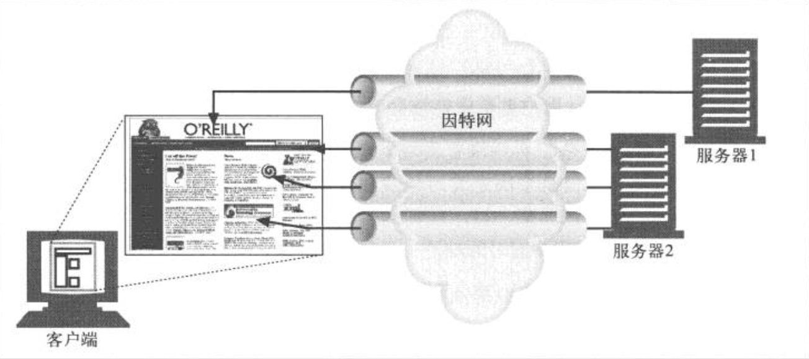
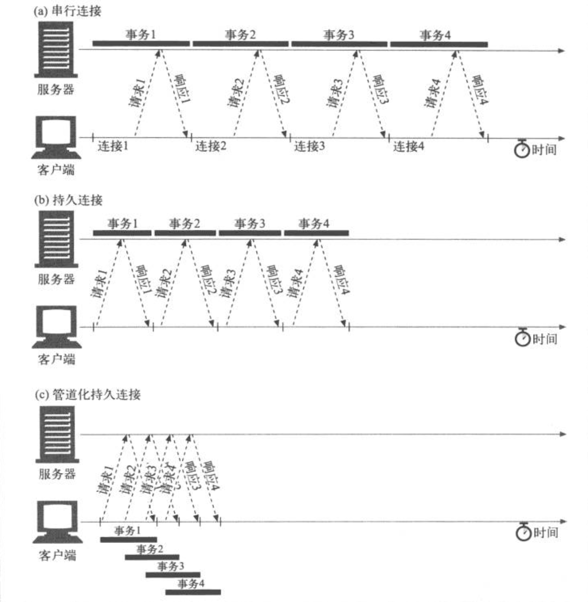

# HTTP 权威指南（Web 基础）

## HTTP 概述

### 资源
Web 服务器是 Web 资源（Web resource）的宿主。Web 资源是 Web 内容的源头。最简单的 Web 资源就是 Web 服务器文件系统中的静态文件。这些文件可以包括任意内容：文本文件、微软的 word 文件、Adobe 的 Acrobat 文件、JPEG 图片文件、AVI 电影文件，或所有其他你能够想到的格式。但资源不一定非得是静态文件，还可以是根据需要生成内容的软件程序。这些动态内容资源可以根据你的身份，所请求的信息或每天的不同时段来产生内容。

### 媒体类型
Web 服务器会为所有 HTTP 对象数据附加一个 MIME 类型。当 Web 浏览器从服务器中取回一个对象时，会去查看相关的 MIME 类型，看看它是否知道应该如何处理这个对象。MIME 类型是一种文本标记，表示一种主要的对象类型和一个特定的子类型，中间由一条斜杠来分隔。
+ HTML 格式的文本文档由 text/html 类型来标记
+ 普通的 ASCII 文本文档由 text/plain 类型来标记
+ JPEG 版本的图片为 image/jpeg 类型
+ GIF 格式的图片为 image/gif 类型
+ Apple 的 QuickTime 电影为 video/quicktime 类型
+ 微软的 PowerPoint 演示文件为 application/vnd.ms-powerpoint 类型。

### URI
每个 Web 服务器资源都有一个名字，这样客户端就可以说明它们感兴趣的资源是什么了。服务器资源名被称为统一资源标识符（Uniform Resource Identifier，URI）。URI 就像因特网上的邮政地址一样，在世界范围内唯一标识并定位信息资源。给定了 URI，HTTP 就可以解析出对象。URI 有两种形式，分别称为 URL 和 URN。

#### URL
统一资源定位符（URL）是资源标识符最常见的形式。URL 描述了一台特定服务器上某自愿的特定位置。它们可以明确说明如何从一个精确、固定的位置获取资源。大部分 URL 都遵循一种标准格式，这种格式包含三个部分。现在，几乎所有的 URI 都是 URL。
1. URL 的第一部分被称为方案（scheme），说明了访问资源所使用的的协议类型。这部分通常就是 HTTP 协议（http://)。
2. 第二部分给出了服务器的因特网地址(比如：www.baidu.com)
3. 其余部分指定了 Web 服务器上的某个资源（比如，/specials/saw-blade.gif)

#### URN
URI 的第二种形式就是统一资源名（URN）。URN 是作为特定内容的唯一名称使用的，与目前的资源所在地无关。使用这些与位置无关的 URN，就可以将资源四处搬移。通过 URN，还可以用同一个名字通过多种网络访问协议来访问资源。比如，不论因特网标准文档 RFC 2141 位于何处（甚至可以将其复制到多个地方），都可以用下列 URN 来命名它。目前仍处于试验阶段。
```
   urn:ietf:rfc:2141
```

### 事务
一个 HTTP 事务由一条（从客户端发往服务器的）请求命令和一个（从服务器发回客户端的）响应结果组成。这种通信是通过名为 HTTP 报文（HTTP message）的格式化数据块进行的。

#### 方法
HTTP 支持几种不同的请求命令，这些命令被称为 HTTP 方法（HTTP method）。每条 HTTP 请求报文都包含一个方法。这个方法会告诉服务器要执行什么动作（获取一个 Web 页面，运行一个网关程序、删除一个文件等）。常见 HTTP 方法如下表。
HTTP 方法 | 描述
----- | ------
GET   | 从服务器向客户端发送命名资源
PUT   | 将来自客户端的数据存储到一个命名的服务器资源中去
DELETE| 从服务器中删除命名资源
POST   | 将客户端数据发送到一个服务器网关应用程序
HEAD   | 仅发送命名资源响应中的 HTTP 首部

#### 状态码
每条 HTTP 响应报文返回时都会携带一个状态码。状态码是一个三位数字的diamante，告知客户端请求是否成功，或者是否需要采取其他动作。伴随着每个数字状态码，HTTP 还会发送一条解释性的“原因短语”文本。包含文本短语主要为了进行描述，所有的处理过程使用的都是数字码。

#### 报文
HTTP 报文是由一行一行的简单字符串组成的。HTTP 报文都是纯文本，不是二进制代码，所以人们可以很方便地对其进行读写。从 Web 客户端发往 Web 服务器的 HTTP 报文称为请求报文（request message）。从服务器发往客户端的报文称为响应报文（response message），此外没有其他类型的 HTTP 报文。HTTP 请求报文和响应报文的格式很类似。均包括以下三个部分。
+ 起始行。报文的第一行就是起始行，在请求报文中用来说明要做些什么，在响应报文中说明出现了什么情况。
+ 首部字段。起始行后面有零个或多个首部字段。每个首部字段都包含一个名字和一个值。为了便于解析，两者之间用冒号（：）来分隔。首部以一个空行结束。添加一个首部字段和添加新行一样简单。
+ 主体。空行之后就是可选的报文主体了，其中包含了所有类型的数据。请求主体中包括了要发送给 Web 服务器的数据；响应主体中装载了要返回给客户端的数据。起始行和首部都是文本形式且都是结构化的，而主体则不同，主体中可以包含任意的二进制数据（比如图片、视频、音轨、软件程序）。当然，主体中也可以包含文本。


### Web 的结构组件
在因特网上，要与很多 Web 应用程序进行交互。如下列出了一些比较重要的应用程序。
+ 代理。位于客户端和服务器之间的 HTTP 中间实体。接收所有客户端的 HTTP 请求，并将这些请求转发给服务器（可能会对请求进行修改之后转发）。对用户来说，这些应用程序就是一个代理，代表用户访问服务器。
+ 缓存。HTTP 的仓库，使常用页面的副本可以保存在离客户端更近的地方。
+ 网关。连接其他应用程序的特殊 Web 服务器。通常用于将 HTTP 流量转换成其他的协议。网关接收请求时就好像自己是资源的源端服务器一样。客户端可能并不知道自己正在与一个网关进行通信。
+ 隧道。对 HTTP 通信报文进行盲转发的特殊代理。HTTP 隧道通常用来在一条或多条 HTTP 连接上转发非 HTTP 数据，转发时不会窥探数据。 HTTP 隧道的一种常见用途是通过 HTTP 连接承载加密的安全套接字层（SSL，Secure Sockets Layer）流量。这样 SSL 流量就可以穿过只允许 Web 流量通过的防火墙了。
+ 用户 Agent 代理。发起自动 HTTP 请求的半智能 Web 客户端。是代表用户发起 HTTP 请求的客户端程序。所有发布 Web 请求的应用程序都是 HTTP Agent 代理。比如：Web 浏览器。

## URI 与资源
大多数 URL 方案的 URL 语法都建立在这个由 9 部分构成的通用格式上。
```
   <scheme>://<user>:<password>@<host>:<port>/<path>;<params>?<query>#<frag>
```

组件 |  描述  
----| ----- 
scheme   | 访问服务器以获取资源时要使用哪种协议
user     | 某些方案访问资源时需要的用户名
password | 用户名后面可能要包含的密码，中间由冒号（:)分割
host     | 资源宿主服务器的主机名或 IP 地址
port     | 资源宿主服务器正在监听的端口号。很多方案都有默认端口号
path     | 服务器上资源的本地名，由一个斜杠（/)将其与前面的 URL 组件分隔开来。路径组件的语法是与服务器和方案有关的。
params   | 某些方案会用这个组件来指定输入参数。参数为名/值对，URL 中可以包含多个参数字段，它们相互之间以及与路径的其余部分之间用分号（;)分隔
query    | 某些方案会用这个组件传递参数以激活应用程序（比如数据库、公告板、搜索引擎以及其他因特网网关）。查询组件的内容没有通用格式。用字符“?"将其与 URL 的其余部分分隔开来
frag     | 一小片或一部分资源的名字。引用对象时，不会将 frag 字段传送给服务器，这个字段是在客户端内部使用的。通过字符“#”将其与 URL 的其余部分分隔开来。

## HTTP 报文

### 报文流
HTTP 报文是在 HTTP 应用程序之间发送的数据块。这些数据块一些文本形式的元信息（meta-information）开头，这些信息描述了报文的内容及含义，后面跟着可选的数据部分。这些报文在客户端、服务器和代理之间流动。

### 报文的组成部分
HTTP 报文由三个部分组成：对报文进行描述的起始行（start line）、包含属性的首部（header）块，以及可选的、包含数据的主体部分（body）。

起始行和首部是由行分隔的 ASCII 文本，每行都以一个由两个字符组成的行终止序列作为结束，其中包括一个回车符（ASCII 码 13）和一个换行符（ASCII 码 10）。这个行终止序列可以协作 CRLF。需要指出的是，尽管 HTTP 规范中说明应该用 CRLF 来表示行终止，但稳健的应用程序也应该接受单个换行符作为行的终止。有些老的，或不完整的 HTTP 应用程序并不总是既发送回车符，又发送换行符。

实体中的主体或豹纹的主体是一个可选的数据块。与起始行和首部不同的是，主体中可以包含文本或二进制数据，也可以为空。

#### 报文的语法
所有的 HTTP 报文都可以分为两类：请求报文（request message）和响应报文（response message）。请求报文会向 Web 服务器请求一个动作。响应报文会将请求的结果返回给客户端。请求和响应报文的基本报文结构相同。
```
请求报文的格式 :
   <method><request-URL> <version>
   <headers>

   <entity-body>

响应报文的格式 :
   <version> <status> <reason-phrase>
   <headers>

   <entity-body>
```
下面时对各部分的简要描述
+ 方法（method）。客户端希望服务器对资源执行的动作。比如 GET、HEAD 或 POST。
+ 请求 URL（request-URL）。命名了所请求资源，或者 URL 路径组件的完整 URL。如果直接与服务器进行对话，只要 URL 的路径组件是资源的绝对路径，通常就不会有什么问题。服务器可以假定自己是 URL 的主机/端口。
+ 版本（version）。报文所使用的 HTTP 版本。其格式： HTTP/<major>.<minor>。
+ 状态码（status-code）。这三位数字描述了请求过程中所发送的情况。每个状态码的第一位数字都用于描述状态的一般类别（“成功”，“出错”等）。
+ 原因短语（reason-phrase）。数字状态码的可读版本，包含终止序列之前的所有文本。
+ 首部（header）。可以有零个或多个首部。每个首部都包含一个名字，后跟随一个冒号(:)，然后是一个可选的空格，接着是一个值，最后是一个 CRLF。首部是由一个空行（CRLF)结束的，表示了首部列表的结束和实体主体部分的开始。
+ 实体的主体部分（entity-body）。实体的主体部分包含一个由任意数据组成的数据块。并不是所有的报文都包含实体的主体部分。

#### 起始行
所有的 HTTP 报文都以一个起始行作为开始。请求报文的起始行说明了要做些什么。响应报文的起始行说明发生了什么。

##### 请求行
请求报文请求服务器对资源进行一些操作。请求报文的起始行，或称为请求航，包含了一个方法和一个请求 URL。这个方法描述了服务器应该执行的操作，请求 URL 描述了要对哪个资源执行这个方法。请求行中还包含 HTTP 的版本，用来告知服务器，客户端使用的是哪种 HTTP。所有这些字段都由空格符分隔。

##### 响应行
响应报文承载了状态信息和操作产生的所有结果数据，将其返回给客户端。响应报文的起始行称为响应行，包含了响应报文使用的 HTTP 版本、数字状态码，以及描述操作状态的文本形式的原因短语。所有这些字段都由空格符进行分隔。

##### 方法
请求的起始行以方法作为开始，方法用来告知服务器要做些什么。以下是常用的 HTTP 方法

方法  | 描述 | 是否包含主体
-----  | ------------------  | ----
GET    | 从服务器获取一份文档         | 否
HEAD   | 只从服务器上获取文档的首部    | 否
POST   | 向服务器发送需要处理的数据    | 是
PUT    | 将请求的主体部分存储在服务器上 | 是
TRACE  | 对可能经过代理服务器传送到服务器上去的报文进行跟踪 | 否
OPTIONS| 决定可以在服务器上执行哪些方法 | 否
DELETE | 从服务器上删除一份文档       |  否

##### 状态码
方法是用来告诉服务器做什么事情的，状态码则用来告诉客户端，发生了什么事情。状态码位于响应的起始行中。下表是状态码的分类。
整体范围 | 已定义范围 | 分类
------ | --------- | -----
100 ~ 199 | 100 ~ 101 | 信息提示
200 ~ 299 | 200 ~ 206 | 成功
300 ~ 399 | 300 ~ 305 | 重定向
400 ~ 499 | 400 ~ 415 | 客户端错误
500 ~ 599 | 500 ~ 505 | 服务端错误

##### 版本号
版本号会以 HTTP/x.y 的形式出现在请求和响应报文的起始行中。为 HTTP 应用程序提供了一种将自己所遵循的协议版本告知对方的方式。

### 状态码详细

#### 100 ~ 199 信息性状态码

状态码 | 原因短语  | 含义
----- | -------  | -----
100   | Continue | 说明收到了请求的初始部分，请客户端继续，发送了这个状态码之后，服务器在收到请求之后必须进行响应。如果客户端向服务器发送一个实体，并且愿意在发送实体之前等待 100 Continue 响应，那么，客户端就要发送一个携带了值为 100 Continue的 Expect 请求首部。
101   | switching Protocols | 说明服务器正在根据客户端的指定，将协议切换成 Update 首部所列的协议。

#### 200 ~ 299 成功状态码
状态码 | 原因短语  | 含义
----- | -------  | -----
200   | OK       | 请求没问题，实体的主体部分包含了所请求的资源
201   | Create   | 用于创建服务器对象的请求（比如，PUT）。响应的主体部分中应该包含各种引用了已创建的额资源 URL，Location 首部包含的则是最具体的引用。服务器必须在发送这个状态码之前创建好对象。
202   | Accepted | 请求已被接受，但服务器还未对其执行任何动作。不能保证服务器会完成这个请求，这只是意味着接受请求时，它看起来是有效的。服务器应该在实体的主体部分包含对请求状态的描述，或许还应该有对请求完成时间的估计（或者包含一个指针，指向可以获取此信息的位置）
203   | Non-Authoriative Information | 实体首部包含的信息不是来自于源端服务器，而是来自资源的一份副本。如果中间节点上有一份资源副本，但无法或者没有对它所发送的与资源有关的元信息（首部）进行验证，就会出现这种情况。
204   | No Content | 响应报文中包含若干首部和一个状态行，但没有实体的主体部分。主要用于在浏览器不转为显示新文档的情况下，对其进行更新（比如刷新一个表单页面）
205   | Reset Content | 另一个主要用于浏览器的代码。负责告知浏览器清除当前页面中的所有 HTML 表单元素。
206   | Partial Content | 成功执行了一个部分或 Range（范围）请求。客户端可以通过一些特殊的首部来获取部分或某个范围内的文档---这个状态码就说明范围请求成功了。 206 响应中必须包含 Content-Range，Date 以及 ETag 或 Content-Location 首部。

#### 300 ~ 399 重定向状态码
重定向状态码要么告知客户端使用替代位置来访问它们所感兴趣的资源，要么就提供一个替代的响应而不是资源的内容。如果资源已被移动，可发送一个重定向状态码和一个可选的 Location 首部来告知客户端资源已被移走，以及现在可以去哪里找到它。这样，浏览器可以在不打扰使用者的情况下，透明地转入新的位置了。


可以通过某些重定向状态码对资源的应用程序本地副本与源端服务器上的资源进行验证。比如，HTTP 应用程序可以查看其资源的本地副本是否仍然是最新的，或者在源端服务器上资源是否被修改过。如果文档并未被修改过，服务器回送一个 304 状态码，如下图所示。


总之，在对那些包含了重定向状态码的非 HEAD 请求进行响应时，最好要包含一个实体，并在实体中包含描述信息和指向（多个）重定向 URL 的链接。

状态码 | 原因短语  | 含义
----- | -------  | -----
300   | Multiple Choices | 客户端请求一个实际指向多个资源的 URL 时会返回这个状态码，比如服务器上有某个 HTML 文档的英语和法语版本。返回这个代码时会带有一个选项列表，这样用户就可以选择它希望使用的那一项了。有多个版本可用时，客户端需要沟通解决，服务器可以在 Location 首部包含首选 URL。
301   | Moved Permanently | 在请求的 URL 已被移除时使用。响应的 Location 首部中应该包含资源现在所处的 URL。
302   | Found    | 与 301 状态码类似，但是，客户端应该使用 Location 首部给出的 URL 来临时定位资源。将来的请求仍应使用老的 URL。
303   | See Other | 告知客户端应该用另一个 URL 来获取资源。新的 URL 位于响应报文的 Location 首部。其主要目的是允许 POST 请求的响应将客户端定向到某个资源上去。
304   | Not Modified | 客户端可以通过所包含的请求首部，使其请求变成有条件的。如果客户端发起了一个条件 GET 请求，而最近资源未被修改的话，就可以用这个状态码来说明资源未被修改。带有这个状态码的响应不应该包含实体的主体部分。
305   | Use Proxy  | 用来说明必须通过一个代理来访问资源，代理的位置由 Location 首部给出。很重要的一点是，客户端是相对某个特定资源来解析这条响应的，不能假定所有请求，甚至所有对持有所请求资源的服务器的请求都通过这个代理进行。如果客户端错误地让代理介入了某条请求，可能会引发破坏性的行为，而且会造成安全漏洞。
306   | 未使用 | 当前未使用
307   | Temporary Redirect | 与 301 状态码类似，但客户端应该使用 Location 首部给出的 URL 来临时定位资源。将来的请求应该使用老的 URL。

#### 400 ~ 499 客户端错误状态码
状态码 | 原因短语  | 含义
----- | -------  | -----
400   | Bad Request  | 用于告知客户端它发送了一个错误的请求。 
401   | Unauthorized | 与适当的首部一同返回，在这些首部中请求客户端在获取对资源的访问权之前，对自己进行认证。
402   | Payment Required | 保留未使用
403   | Forbidden    | 用于说明请求被服务器拒绝了。这个状态吗通常是在服务器不像说明拒绝原因的时候使用的。
404   | Not Found    | 用于说明服务器无法找到所请求的 URL。通常会包含一个实体，以便客户端应用程序显示给用户看。
405   | Method Not Allowed | 发起的请求中带有所请求的 URL 不支持的方法时，使用此状态码。应该在响应中包含 Allow 首部，以告知客户端所请求的资源可以使用哪些方法。
406   | Not Acceptable | 客户端可以指定参数来说明它们愿意接收什么类型的实体。服务器没有与客户端可接受的 URL 相匹配的资源时，使用此代码。通常，服务器会包含一些首部，以便客户端弄清楚为什么请求无法满足。
407   | Proxy Authenication Required | 与 401 类似，但用于要求对资源进行认证的代理服务器
408   | Request Timeout | 如果客户端完成请求所花的时间太长，服务器可以回送此状态码，并关闭连接。超时时长随服务器的不同而不同，但通常对所有的合法请求来说，都是够长的。
409   | Conflict | 用于说明请求可能在资源上引发的一些冲突。服务器担心请求会引发冲突时，可以发送此状态码。响应中应该包含描述冲突的主体。
410   | Gone     | 与 404 类似，指示服务器曾经拥有过此资源。主要用于 web 站点的维护，这样服务器的管理者就可以在资源被移除的情况下通知客户端了。
411   | Length Required | 服务器要求请求报文中包含 Content-Length 首部时使用。
412   | P热condition Failed | 客户端发起了条件请求，且其中一个条件请求失败了的时候使用。客户端包含了 Expect 首部时发起的就是条件请求。
413   | Request Entity Too Large | 客户端发送的实体主体部分比服务器能够活着希望处理的要大时，使用此状态码。
414   | Request URI Too Long | 客户端所发请求中的请求 URL 比服务器能够活着希望处理的要长时，使用此状态码。
415   | Unsupported Media Type | 服务器无法理解或无法支持客户端所发实体的内容类型时，使用此状态码
416   | Requested Range Not Satisfiable | 请求报文所请求的是指定资源的某个范围，而此范围无效或无法满足时，使用此状态码
417   | Expectation Failed | 请求的 Expect 请求首部都包含了一个期望，但服务器无法满足此期望时，使用此状态码。如果代理或其他中间应用程序有确切证据说明源端服务器会为某请求产生一个失败的期望，就可以发送这个响应状态码。

#### 500 ~ 599 服务端错误状态码
状态码 | 原因短语  | 含义
----- | -------  | -----
500   | Internal Server Error | 服务器遇到一个妨碍它为请求提供服务的错误时，使用此状态码。
501   | Not Implemented    | 客户端发情的请求超出服务器的能力范围（比如使用了服务器不支持的请求范围）时，使用此状态码。
502   | Bad Gateway   | 作为代理或网关使用的服务器从请求响应链的下一条链路上收到了一条伪响应（比如，它无法连接到其父网关）时，使用此状态码。
503   | Service Unavailable | 用来说明服务器现在无法为请求提供服务，但将来可以。如果服务器知道什么时候资源会变为可用的，可以在响应中包含一个 Retry-After 首部。
504   | Gateway Timeout | 与状态码 408 类似，只是这里的响应来自一个网关或代理，它们在等待另一服务器对其请求进行响应时超时了
505   | HTTP Version Not Supported | 服务器收到的请求使用了它无法或不愿支持的协议版本时，使用此状态码。有些服务器应用程序会选择不支持协议的早期版本。

### 首部
HTTP 规范定义了几种首部字段。应用程序可以随意发明自己所用的首部。HTTP 首部可以分为以下几类。
+ 通用首部。既可以出现在请求报文中，也可以出现在响应报文中。
+ 请求首部。提供更多有关请求的信息。
+ 响应首部。提供更多有关响应的信息。
+ 实体首部。描述主体的长度和内容，或者资源自身。
+ 扩展首部。规范中没有定义的新首部。

#### 通用首部
通用信息性首部
   首部    |  描述  
---------  | -----------
Connection | 允许客户端和服务器指定与请求/响应连接有关的选项
Date       | 提供日期和时间标志，说明报文是什么事件创建的。
MIME-Version| 给出了发送端使用的 MIME 版本
Trailer    | 如果报文采用了分块传输编码（chunked transfer encoding）方式，就可以用这个首部列出位于报文拖挂（trailer）部分的首部集合。
Transfer-Encoding | 告知接收端为了保证报文的可靠传输，对报文采用了什么编码方式
Update     | 给出了发送端可能想要“升级”使用的新版本或协议
Via        | 显示了报文经过的中间节点（代理、网关）

通用缓存首部
  首部    |  描述  
---------  | -----------
Cache-Control | 用于随报文传送缓存指示
Pragma     | 另一种随报文传送指示的方式，但不专用于缓存

#### 请求首部
请求的信息性首部
   首部    |  描述  
---------  | -----------
Client-IP  | 提供了运行客户端的机器的 IP 地址。
From       | 提供了客户端用户的 Email 地址
Host       | 给出了接受请求的服务器的主机名和端口号
Referer    | 提供了包含当前请求 URI 的文档的 URL
UA-Color   | 提供了与客户端显示器的显示颜色有关的信息
UA-CPU     | 给出了客户端 CPU 的类型或制造商
UA-Disp    | 提供了与客户端显示器能力有关的信息
UA-OS      | 给出了运行在客户端机器上的操作系统名称及版本
UA-Pixels  | 提供了与客户端显示器的像素信息
User-Agent | 将发起请求的应用程序名称告知服务器

##### Accept 首部
Accept 首部为客户端提供了一种将其喜好和能力告知服务器的方式，包括它们想要什么，可以使用什么，以及最重要的，它们不想要什么。这样，服务器就可以根据这些额外信息，对要发送的内容做出更明智的决定。Accept 首部会使连接的两端都受益。客户端会得到它们想要的内容，服务器则不会浪费其时间和带宽来发送客户端无法使用的东西。
   首部    |  描述  
--------------  | ----------------------
Accept          | 告诉服务器能够发送哪些媒体类型
Accept-Charset  | 告诉服务器能够发送哪些字符集
Accept-Encoding | 告诉服务器能够发送哪些编码方式
Accept-Language | 告诉服务器能够发送哪些语言
TE              | 告诉服务器可以使用哪些扩展传输编码

##### 条件请求首部
有时客户端希望为请求加上某些限制。比如，如果客户端已经有了一份文档副本，就希望只在服务器上的文档与客户端拥有的副本有所区别时，才请求服务器传输文档。通过条件请求首部，客户端可以为请求加上这种限制，要求服务器在对请求进行响应之前，确保某个条件为真。

   首部    |  描述  
--------------  | ----------------------
Expect          | 允许客户端列出某请求所要求的的服务器行为
If-Match        | 如果实体标记与文档当前的实体标记相匹配，就获取这份文档
If-Modified-Since | 除非在某个指定的日期之后资源被修改过，否则就限制这个请求
If-None-Match   | 如果提供的实体标记与当前文档的实体标记不相符，就获取文档
If-Unmodified-Since | 除非在某个指定日期之后资源没有被修改过，否则就限制这个请求
Range           | 如果服务器支持范围请求，就请求资源的指定范围。

##### 安全请求首部
HTTP 本身就支持一种简单的机制，可以对请求进行质询/响应认证。这种机制要求客户端在获取特定的资源之前，先对自身进行认证，这样就可以使事务稍微安全一些。

   首部    |  描述  
------------- | ----------------------
Authorization | 包含了客户端提供给服务器，以便对自身进行认证的数据
Cookie      | 客户端用它向服务器传送一个令牌--它并不是真正的安全首部，但确实隐含了安全功能。
Cookie2     | 用来说明请求端支持的 cookie 版本。

##### 代理请求首部
随着因特网上代理的普遍应用，人们定义了几个首部来协助其更好地工作。

   首部    |  描述  
------------- | ----------------------
Max-Forward   | 在通往源端服务器的路径上，将请求转发给其他代理或网关的最大次数---与 TRACE 方法一同使用。
Proxy-Authorization | 与 Authorization 首部相同，但这个首部是在与代理进行认证时使用的。
Proxy-Connection | 与 Connection 首部相同，但这个首部是在于代理建立连接时使用的。

#### 响应首部
响应的信息性首部
   首部    |  描述  
---------- | ----------------------
Age        | （从最初创建开始）响应持续时间
Public     | 服务器为其资源支持的请求方法列表
Retry-After| 如果资源不可用的话，在此日期或时间重试
Server     | 服务器应用程序软件的名称和版本
Title      | 对 HTML 文档来说，就是 HTML 文档的源端给出的标题
Warning    | 比原因短语中更详细一些的警告短文

##### 协商首部
如果资源有多种表示方法，比如，如果服务器上有某文档的法语和德语译稿，HTTP/1.1 可以为服务器和客户端提供对资源进行协商的能力。
   首部    |  描述  
------------- | ----------------------
Accept-Ranges | 对此资源来说，服务器可接受的范围类型
Vary          | 服务器查看的其他首部的列表，可能会使响应发送变化，也就是说，这是一个首部列表，服务器会根据这些首部的内容挑选出最适合的资源版本发送给客户端。

##### 安全响应首部
   首部    |  描述  
------------- | ----------------------
Proxy-Authenticate | 来自代理的对客户端的质询列表
Set-Cookie         | 不是真正的安全首部，但隐含有安全功能，可以在客户端设置一个令牌，以便服务器对客户端进行标识。
Set-Cookie2        | 与 Set-Cookie 类似，
WWW-Authenticate   | 来自服务器的对客户端的质询列表

#### 实体首部
有很多首部可以用来描述 HTTP 报文的负荷。由于请求和响应报文中都可能包含实体部分，所以在这两种类型的恶报文中都可能出现这些首部。实体首部提供了有关实体及其内容的大量信息，从有关对象类型的信息，到能够对资源使用的各种有效的请求方法。总之，实体首部可以告知报文的接收者它在对什么进行处理。
实体的信息性首部
   首部    |  描述  
---------- | ----------------------
Allow      | 列出了可以对此实体执行的请求方法
Location   | 告知客户端实体实际上位于何处；用于将接收端定向到资源的（可能是新的）位置（URL）上去。

##### 内容首部
内容首部提供了与实体内容有关的特定信息，说明了其类型、尺寸以及处理它所需的其他有用信息。比如，Web 浏览器可以通过查看返回的内容类型，得知如何显示对象。
   首部        |  描述  
-------------- | ----------------------
Content-Base     | 解析主体中的相对 URL 时使用的基础 URL
Content-Encoding | 对主体执行的任意编码方式
Content-Language | 理解主体时最适宜使用的自然语言
Content-Length   | 主体的长度或尺寸
Content-Location | 资源实际所处的位置
Content-MD5      | 主体的 MD5 校验和
Content-Range    | 在整个资源中此实体表示的字节范围
Content-Type     | 这个主体的对象类型

##### 实体缓存首部
通用的缓存首部说明了如何或什么时候进行缓存。实体的缓存首部提供了与被缓存实体有关的信息。比如，验证已缓存的资源副本是否仍然有效所需的信息，以及更好地估计已缓存资源何时失效所需的线索。
   首部        |  描述  
-------------- | ----------------------
ETag           | 与此实体相关的实体标记
Expires        | 实体不再有效，要从原始的源端再次获取此实体的日期和时间
Last-Modified  | 这个实体最后一次被修改的日期和时间

## 连接管理

### TCP 连接
HTTP 连接实际上就是 TCP 连接和一些使用连接的规则。TCP 为 HTTP 提供了一条可靠的比特传输管道。从 TCP 连接一端填入的字节会从另一端以原有的顺序、正确地传送出来。

TCP 的数据是通过名为 IP 分组（或 IP 数据报）的小数据块来发送的。这样的话，HTTP 就是 “HTTP over TCP over IP ”这个“协议栈”中的最顶层了。其安全版本 HTTPS 就是在 HTTP 和 TCP 之间插入了一个 （称为 TLS 或 SSL 的）密码加密层。

HTTP 要传送一条报文时，会以流额形式将报文数据的内容通过一条打开的 TCP 连接按序传输。TCP 收到数据流之后，会将数据流划分成被称作段的小数据块，并将段封装在 IP 分组中，通过因特网进行传输。所有这些工作都是由 TCP/IP 软件来处理的，HTTP 程序员什么也看不到。

每个 TCP 段都是由 IP 分组承载，从给一个 IP 地址发送到另一个 IP 地址的。每个 IP 分组中都包括：
+ 一个 IP 分组首部 （通常 20 字节）
+ 一个 TCP 段首部（通常 20 字节）
+ 一个 TCP 数据块（0 个或多个字节）
  
### 对 TCP 性能的考虑
HTTP 紧挨着 TCP，位于其上层。所以 HTTP 事务的性能在很大程度上取决于底层 TCP 通道的性能。

#### HTTP 事务的时延
下图描绘了 HTTP 事务主要的连接、传输以及处理时延


注意，与建立 TCP 连接，以及传输请求和响应报文的时间相比，事务处理时间可能是很短的。除非客户端或服务器超载，或正在处理复杂的动态资源，否则 HTTP 时延就是由 TCP 网络时延造成的。HTTP 事务的时延有以下几种主要原因。
1. 客户端首先需要根据 URI 确定 Web 服务器的 IP 地址和端口号。如果最近没有对 URI 中的主机名进行访问，通过 DNS 解析系统将 URI 中的主机名转换成一个 IP 地址可能要花费数十秒的时间。
2. 接下来，客户端会向服务器发送一条 TCP 连接请求，并等待服务器回送一个请求接受报文。每条新的 TCP 连接都会有连接建立时延。这个值通常最多只有一两秒钟，但如果有数百个 HTTP 事务的话，这个值会快速地叠加上去。
3. 一旦连接建立起来了，客户端就会通过新建立的 TCP 管道来发送 HTTP 请求。数据到达时，Web 服务器会从 TCP 连接中读取请求报文，并对请求进行处理。因特网传输请求报文、以及服务器处理请求报文都需要时间。
4. 然后，Web 服务器会回送 HTTP 响应，这需要花费时间。

这些 TCP 网络时延的大小取决于硬件速度、网络和服务器的负载，请求和响应报文的尺寸，以及客户端和服务器之间的距离。TCP 协议的技术复杂性也会对时延产生巨大的影响。

#### 性能聚焦区域
下面列出了一些会对 HTTP 程序员产生影响的、最常见的 TCP 相关时延。其中包括。
+ TCP 连接建立握手
+ TCP 慢启动拥塞控制
+ 数据聚焦的 Nagle 算法
+ 用于捎带确认的 TCP 延迟确认算法
+ TIME_WAIT 时延和端口耗尽

#### TCP 连接的握手时延
建立一条新的 TCP 连接时，甚至是在发送任意数据之前，TCP 软件之间会交换一系列的 IP 分组，对连接的有关参数进行沟通。**如果连接只用来传送少量数据，这些交换过程就会严重降低 HTTP 的性能**。


在发送数据前，TCP 要传送两个分组来建立连接。TCP 连接握手需要经过以下几个步骤。
1. 请求新的 TCP 连接时，客户端要向服务器发送一个小的 TCP 分组（通常是 40 - 60 个字节）。这个分组中设置了一个特殊的 SYN 标记，说明这是一个连接请求。
2. 如果服务器接受了连接，就会对一些连接参数进行计算，并向客户端回送一个 TCP 分组，这个分组中的 SYN 和 ACK 标记都被置位，说明连接请求已被接受。
3. 最后，客户端向服务器回送一条确认信息，通知它连接已成功建立。现代的 TCP 栈都允许客户端在这个确认分组中发送数据。

HTTP 程序员永远不会看到这些分组，这些分组都由 TCP/IP 软件管理，对其是不可见的。HTTP 程序员看到的只是创建 TCP 连接时存在的时延。通常 HTTP 事务都不会交换太多数据，此时 SYN/SYN+ACK 握手会产生一个可测量的时延。TCP 连接的 ACK 分组通常都足够大，可以承载整个 HTTP 请求报文，而且很多 HTTP 服务器响应报文都以放入一个 IP 分组中去（比如，响应是包含了装饰性图片的小型 HTML 文件，或者是对浏览器高速缓存请求产生的 304 Not Modified 响应）。最后的结果是，小的 HTTP 事务可能会在 TCP 建立上花费 50%，或更多的时间。下面会讨论 HTTP 是如何通过重用现存连接来减小这种 TCP 建立时延所造成的影响的。

#### 延迟确认
由于因特网自身无法确保可靠的分组传输（因特网路由器超负荷的话，可以随意丢弃分组），所以 TCP 实现了自己的确认机制来确保数据的成功传输。每个 TCP 段都有一个序列号和数据完整性校验和。每个段的接收者收到完好的段时，都会向发送者回送小的确认分组。如果发送者没有在指定的窗口时间内收到确认信息，发送者就认为分组已被破坏或损毁，并重发分组。

由于确认报文很小，所以 TCP 允许在发往相同方向的输出数据分组中对齐进行“捎带”。TCP 将返回的确认信息与输出的数据分组结合在一起，可以更有效地利用网络，为了增加确认报文找到同向传输分组的可能性，很多 TCP 栈都实现了一种“延迟确认”算法。延迟确认算法会在一个特定的窗口时间（通常是 100~200 ms)内将将输出确认存放在缓冲区中，以寻找能够捎带它的输出数据分组。如果在那个时间段内没有输出数据分组，就将确认信息放在单独的分组中传送。

但是，HTTP 具有双峰特征的请求-应答行为降低了捎带信息的可能。当希望有相反方向回传分组的时候，偏偏没有那么多。通常，延迟确认算法会引入相当大的时延。根据所使用的操作系统的不同，可以调整或进制延迟确认算法。

在对 TCP 栈的任何参数进行修改之前，一定要对自己在做什么有清醒的认识。TCP 中引入这些算法的目的是防止设计欠佳的应用程序对因特网造成破坏。对 TCP 配置进行的任意修改，都要绝对确保应用程序不会引发这些算法所要避免的问题。

#### TCP 慢启动
TCP 数据传输的性能还取决于 TCP 连接的使用期（age）。TCP 连接会随着时间进行自我“调谐”，起初会限制连接的最大速度，如果数据成功传输，会随着时间的推移提高传输的速度。这种调谐被称为 TCP 慢启动（slow start），用于防止因特网的突然过载和拥塞。

TCP 慢启动限制了一个 TCP 端点在任意时刻可以传输的分组数。简单来说，每成功接收一个分组，发送端就有了发送另外两个分组的权限。如果某个 HTTP 事务有大量数据要发送，是不能一次将所有分组都发送出去的。必须发送一个分组，等待确认；然后可以发送两个分组，每个分组都必须被确认，这样就可以发送四个分组了，以此类推。这种方式被称为“打开拥塞窗口”。

由于存在这种拥塞控制特性，所以新连接的传输速度会比已经交换过一定量数据的、“已调谐”连接慢一些。由于已调谐连接要更快一些，所以 HTTP 中有一些可以重用现存连接的工具，比如稍后介绍的 HTTP “持久连接”。

#### Nagle 算法 与 TCP_NODELAY
TCP 有一个数据流窗口，应用程序可以通过它将任意尺寸的数据放入 TCP 栈中，即使一次只放一个字节也可以。但是，每个 TCP 段中都至少装载了 40 个字节的标记和首部，所以如果 TCP 发送了大量包含少量数据的分组，网络的性能就会严重下降。Nagle 算法试图在发送一个分组之前，将大量 TCP 数据绑定在一起，以提高网络效率。RFC 896 “IP/TCP 互连网络中的拥塞控制”对此算法进行了描述。

Nagle 算法鼓励发送全尺寸（LAN 上最大尺寸的分组大约是 1500 字节，在因特网上是几百字节的）的段。只有当所有其他分组都被确认之后，Nagle 算法才允许发送非全尺寸的分组。如果其他分组仍然在传输过程中，就将那部分数据缓存起来。只有当挂起分组被确认，或者缓存中积累了足够发送一个全尺寸分组的数据时，才会将缓存的数据发送出去。

Nagle 算法会引发几种 HTTP 性能问题。首先，小的 HTTP 报文可能无法填满一个分组，可能会因为等待那些永远不会到来的额外数据而产生时延。其次，Nagle 算法与延迟确认之间的交互存在问题，Nagle 算法会阻止数据的发送，直到有确认分组抵达为止，但确认分组自身会被延迟确认算法延迟 100 ~ 200 毫秒。

HTTP 应用程序常常会在自己的栈中设置参数 TCP_NODELAY，禁用 Nagle 算法，提高性能。如果要这么做的话，一定要确保会向 TCP 写入大块的数据，这样就不会产生一堆小分组了。

#### TIME_WAIT 累积与端口耗尽
TIME_WAIT 端口耗尽是很严重的性能问题，会影响到性能基准，但在现实中相对较少出现。大多数遇到性能基准问题的人最终都会碰到这个问题，而且性能都会变得出乎意料的差，所有这个问题值得特别关注。

当某个 TCP 端点关闭 TCP 连接时，会在内存中维护一个小的控制块，用来记录最近所关闭连接的 IP 地址和端口号。这类信息只会维持一小段时间，通常是所估计的最大分段使用期的两倍（称为 2MSL，通常为 2 分钟）左右，以确保在这段时间内不会创建具有相同地址和端口号的新连接。实际上，这个算法可以防止在两分钟内创建、关闭并重新创建两个具有相同 IP 地址和端口号的连接。

现在高速路由器的使用，使得重复分组几乎不可能在连接关闭的几分钟之后，出现在服务器上。有些操作系统会将 2MSL 设置为一个较小的值，但超过此值时要特别小心。分组确认会被复制。如果来自之前的连接的复制分组插入了具有相同连接值的新 TCP 流，会破坏 TCP 数据。

2MSL 的连接关闭延迟通常不是什么问题，但在性能基准环境下就可能会称为一个问题。进行性能基准测试时，通常只有一台或几台用来产生流量的计算机连接到某系统中去，这样就限制了连接到服务器的客户端 IP 地址数。而且，服务器通常会在 HTTP 的默认 TCP 端口 80 上进行监听。用 TIME_WAIT 防止端口号重用时，这些情况也限制了可用的连接值组合。

在只有一台客户端和一台 Web 服务器的异常情况下，构建一条 TCP 连接的 4 个值，其中的 3 个都是固定固定的，只有源端口号可以随意改变。如
```
   <client-ip, source-port, server-ip, 80>
```
客户端每次连接到服务器上去时，都会获得一个新的源端口，以实现连接的唯一性。但由于可用源端口的数量有限（约 60000多个），而且在 2MSL 秒（比如，120秒）内连接是无法重用的，连接率就被限制在了 60000 /120 = 500 次/秒。如果再不断进行优化，并且服务器的连接率不高于 500次/秒，就可确保不会遇到 TIME_WAIT 端口耗尽问题。要修正这个问题，可以增加客户端负载生成及其的数量，或者确保客户端和服务器在循环使用几个虚拟 IP 地址以增加更多的连接组合。

即使没有遇到端口耗尽问题，也要特别小心有大量连接处于打开状态的情况，或为处于等待状态的连接分配了大量控制块的情况。在有大量打开连接或控制块的情况下，有些操作系统的速度会严重减缓。

### HTTP 连接的处理

#### 常被误解的 Connection 首部
HTTP 允许在客户端和最终的源端服务器之间存在一串 HTTP 中间实体（代理、高速缓存等）。可以从客户端开始，逐跳地将 HTTP 报文经过这些中间设备，转发到源端服务器上去（或者进行反向传输）。

在某些情况下，**两个相邻的 HTTP 应用程序**会为它们共享的连接应用一组选项。HTTP 的 Connection 首部字段中有一个由逗号分隔的连接标签列表，这些标签为此连接指定了一些不会传播到其他连接中去的选项。比如，可以用 Connection:close 来说明发完下一条报文之后必须关闭的连接。Connection 首部可以承载 3 种不同类型的标签，因此有时会很令人费解。
+ HTTP 首部字段名，列出了只与此连接有关的首部
+ 任意标签值，用于描述此连接的非标准选项
+ 值 close，说明操作完成之后需关闭这条持久连接

如果连接标签中包含了一个 HTTP 首部字段的名称，那么这个首部字段就包含了与一些选择有关的信息，不能将其转发出去。在将报文转发出去之前，必须删除 Connection 首部列出的所有首部字段。由于 Connection 首部可以防止无意中对本地首部的转发，因此将逐跳首部名放入 Connection 首部被称为 “对首部的保护”。如下图。


HTTP 应用程序收到一条带有 Connection 首部的报文时，接收端会解析发送端请求的所有选项，并将其应用。然后会在将此报文转发给下一跳地址之前，删除 Connection 首部以及 Connection 中列出的所有首部。而且，可能还会有少量没有作为 Connection 首部值列出，但一定不能被代理转发的逐跳首部。其中包括 Proxy-Authenticate、Proxy-Connection、Transfer-Encoding 和 Upgrade。

#### 串行事务处理时延
如果只对连接进行简单的管理，TCP 的性能时延可能会叠加起来。比如，假设有一个包含了 3 个嵌入图片的 Web 页面。浏览器需要发起 4 个 HTTP 事务来显示此页面：1 个用于顶层的 HTML 页面，3 个用于嵌入的图片。如果每个事务都需要（串行地建立）一条新的连接，那么连接时延和慢启动时延就会叠加起来。如下图。


除了串行加载引入的实际时延之外，加载一副图片时，页面上其他地方都没有动静也会让人觉得速度很慢。用户更希望能够同时加载多幅图片。

串行加载的另一个缺点是，有些浏览器在对象加载完毕之前无法获知对象的尺寸，而且它们可能需要尺寸信息来决定将对象放在屏幕的什么位置上，所以在加载了足够多的对象之前，无法在屏幕上显示任何内容。在这种情况下，可能浏览器串行装载对象的进度很正常，但用户面对的却是一个空白的屏幕，对装载的进度一无所知。

下面几种现存和新兴的方法可以提高 HTTP 的连接性能。
+ 并行连接。通过多条 TCP 连接发起并发的 HTTP 请求。
+ 持久连接。重用 TCP 连接，以消除连接及关闭时延。
+ 管道化连接。通过共享的 TCP 连接发起并发的 HTTP 请求。
+ 复用的连接。交替传送请求和响应报文。（试验阶段）

### 并行连接
如下图，HTTP 允许客户端打开多条连接，并行地执行多个 HTTP 事务。在这个例子中，并行加载了四副嵌入式图片，每个事务都有自己的 TCP 连接。



#### 并行连接可能会提高页面的加载速度
包含嵌入对象的组合页面如果能（通过并行连接）克服单条连接的空载时间和带宽限制，加载速度也会有所提高。时延可以重叠起来，而且如果单条连接没有充分利用客户端的因特网带宽，可以将未用带宽分配来装载其他对象。

#### 并行连接不一定更快
即使并行连接的速度可能会更快，但不一定总是更快。客户端的网络带宽不足（比如，浏览器是通过一个 28.8kbps 的 Modem 连接到因特网上去的）时，大部分的时间可能都是用来传送数据的。在这种情况下，一个连接到速度较快服务器上的 HTTP 事务就会很容易地耗尽所有可用的 Modem 带宽。如果并行加载多个对象，每个对象都会去竞争这有限的带宽，每个对象都会以较慢的速度按比例加载，这样带来的性能提升就很小，甚至没什么提升。

而且，打开大量连接会消耗很多内存资源，从而引发自身的性能问题。复杂的 Web 页面可能会有数十或数百个内嵌对象。客户端可能可以打开数百个连接，但 Web 服务器通常要同时处理很多其他用户的请求，所以很少有 Web 服务器希望出现这样的情况。一百个用户同时发出申请，每个用户打开 100 个连接，服务器就要负责处理 10000 个连接。这会造成服务器性能的严重下降。对高负荷的代理来说也同样如此。

实际上，浏览器确实使用了并行连接，但它们会将并行连接的总数限制为一个较小的值（通常是 4 个）。服务器可以随意关闭来自特定客户端的超量连接。

#### 并行连接可能让人“感觉”更快一些
如前所述，即使实际上它们并没有加快页面的传输速度，并行连接通常也会让用户觉得页面加载得更快了，因为多个组件对象同时出现在屏幕上时，用户能够看到加载的进展。如果整个屏幕上有很多动作在进行。即使实际上秒表显示整个页面的下载时间更长，人们也会认为 Web 页面加载更快一些。

#### 并行连接小结
并行连接可以提高复合页面的传输速度。但并行连接也有一些缺点。
+ 每个事务都会打开/关闭一条新的连接，会耗费时间和带宽。
+ 由于 TCP 慢启动特性的存在，每条新连接的性能都会有所降低。
+ 可打开的并行连接数量实际上是有限的。

### 持久连接
Web 客户端经常会打开同一个站点的连接。比如，一个 Web 页面上的大部分内嵌图片通常都来自同一个 Web 站点，而且相当一部分指向其他对象的超链通常都指向同一个站点。因此，初始化了对某服务器 HTTP 请求的应用程序很可能会在不久的将来对那台服务器发起更多的请求。这种性质被称为站点本地性（site locality）。

因此，HTTP/1.1（以及 HTTP/1.0 的各种增强版本）允许 HTTP 设备在事务处理结束之后将 TCP 连接保持在打开状态，以便为未来的 HTTP 请求重用现存的连接。**在事务处理结束之后仍然保持在打开状态的 TCP 连接被称为持久连接。非持久连接会在每个事务结束之后关闭**。持久连接会在不同事务之间保持打开状态，直到客户端或服务器决定将其关闭为止。

重用已对目标服务器打开的空闲持久连接，就可以避免缓慢的连接建立阶段。而且，已经打开的连接还可以避免慢启动的拥塞适应阶段，以便更快速地进行数据的传输。

#### 与并行连接的比较
持久连接有一些比并行连接更好的地方。持久连接降低了时延和连接建立的开销，将连接保持在已调谐状态，而且减少了打开连接的潜在数量。但是管理持久连接时要特别小心，不然就会累积出大量的空闲连接，耗费本地以及远程客户端和服务器上的资源。

持久连接与并行连接配合使用可能是最高效的方式。现在，很多 Web 应用程序都会打开少量的并行连接，其中的每一个都是持久连接。持久连接有两种类型：比较老的 HTTP/1.0 + “keep-alive”连接，以及现代的 HTTP/1.1 “persistent” 连接。

#### HTTP/1.0 + Keep-Alive 连接
下图显示了 keep-alive 连接的一些性能优点，图中将在串行连接上实现 4 个 HTTP 事务的时间线与在一条持久连接上实现同样事务所需的时间线进行了比较。由于去除了进行连接和关闭连接的开销，所以时间线有所缩减。(图中未显示去除了慢启动的时间优化)


##### Keep-Alive 操作
实现 HTTP/1.0 keep-alive 连接的客户端可以通过包含 Connection:Keep-Alive 首部请求将一条连接保持在打开状态。如果服务器愿意为下一条请求保持在打开状态，就在响应中包含相同的首部。如果响应中没有 Connection: Keep-Alive 首部，客户端就认为服务器不支持 keep-alive，会在发回响应报文之后关闭连接。（在 HTTP/1.1中已经不再使用了）

##### Keep-Alive 选项
注意，Keep-Alive 首部指示请求将连接保持在活跃状态。发出 keep-alive 请求之后，客户端和服务器并不一定会同意进行 keep-alive 会话。它们可以在任意时刻关闭空闲的 keep-alive 连接，并可随意限制 keep-alive 连接所处理事务的数量。可以用 Keep-Alive 通用首部中指定的、由逗号分隔的选项来调节 keep-alive 的行为。比如
```
   Connection: Keep-Alive
   Keep-Alive: max=5, timeout=120
   // 服务器最多还会为另外 5 个事务保持连接的打开状态，或者将打开状态保持到连接空闲了 2 分钟之后。
```
+ 参数 timeout 是在 Keep-Alive 响应首部发送的。它估计了服务器希望将连接保持在活跃状态的时间。这并不是一个承诺值。
+ 参数 max 是在 Keep-Alive 响应首部发送的。它估计了服务器还希望为多少个事务保持此连接的活跃状态。这并不是一个承诺值。
+ Keep-Alive 首部还可支持任意未经处理的属性，这些属性主要用于诊断和调试。语法为 name[=value]
+ Keep-Alive 首部完全是可选的，但只有在提供 Connection: Keep-Alive 时才能使用它。

##### Keep-Alive 连接的限制和规则
+ 在 HTTP/1.0 中，Keep-alive 并不是默认使用的。客户端必须发送给一个 Connection: Keep-Alive 请求首部来激活 keep-alive 连接。
+ Connection: Keep-Alive 首部必须随所有希望保持持久连接的报文一起发送。如果客户端没有发送这个首部，服务器就会在那条请求之后关闭连接。
+ 客户端探明响应中没有 Connection: Keep-Alive 响应首部，就可以知道服务器发出响应之后是否会关闭连接了。
+ 只有在无需检测到连接的关闭即可确定报文实体主体部分长度的情况下，才能将连接保持在打开状态---也就是说实体的主体部分必须有正确的 Content-Length，有多部件媒体类型，或者用分块传输编码的方式进行了编码。在一条 keep-alive 信道中回送错误的 Content-Length 是很糟糕的事，这样的话，事务处理的另一端就无法精确地检测出一条报文的结束和另一条报文的开始了。
+ 代理和网关必须执行 Connection 首部的规则。代理或网关必须在将报文转发出去或将高速缓存之前，删除在 Connection 首部中命名的所有首部字段以及 Connection 首部自身。
+ 严格来说，不应该与无法确定是否支持 Connection 首部的代理服务器建立 keep-alive 连接，以防出现哑代理问题。
+ 从技术上讲，应该忽略所有来自 HTTP/1.0 设备的 Connection 首部字段（包括Connection: Keep-Alive)，因为它们可能是由比较老的代理服务器误转发的。
+ 除非重复发送请求会产生其他一些副作用，否则如果在客户端收到完整的响应之前连接就关闭了，客户端就一定要做好重试请求的准备。

##### Keep-Alive 和哑代理

###### Connection 首部和盲中继。
如下图，假设有一个 Web 客户端 通过一个作为盲中继使用的哑代理与 Web 服务器进行对话。


1. 如图，Web 客户端向代理发送了一条报文，其中包含了 Connection:Keep-Alive 首部，如果可能的话请求建立一条 keep-alive 连接。客户端等待响应，以确定是否认可它对 keep-alive 信道的请求。
2. 哑代理收到了这条 HTTP 请求，但它并不理解 Connection 首部（只是将其作为一个扩展首部对待）。代理不知道 keep-alive 是神意思，因此只是简单的将原报文转发给服务器，但 Connection 首部是个逐跳首部，只适用于单条传输链路，不应该沿着传输链路向下传输。接下来，就要发送一些很糟糕的事情了。
3. 经过中继的 HTTP 请求抵达了 Web 服务器。当 Web 服务器收到代理转发的 Connection: Keep-Alive 首部时，会误以为代理（对服务器来说，这个代理看起来就和其他所有客户端一样）希望进行 keep-alive 对话！对 Web 服务器来说这没什么问题 --- 它统一进行 keep-alive 对话，并回送了一个 Connection: Keep-Alive 响应首部。所以，此时 Web服务器认为它在于代理进行 keep-alive 对话，会遵循 keep-alive 的规则。但代理却对 keep-alive 一无所知。不妙。
4. 哑代理将 Web 服务器的响应报文回送给客户端，并将来自 Web 服务器的 Connection: Keep-Alive 首部一起传送过去。客户端看到这个首部，就会认为代理同意进行 keep-alive 对话。所以，此时客户端和服务器都认为它们在进行 keep-alive 对话，但与它们进行对话的代理却对 keep-alive 一无所知。
5. 由于代理对 keep-alive 一无所知，所以会将收到的所有数据都回送给客户端，然后等待源端服务器关闭连接。但源端服务器会认为代理已经显式地请求它将连接保持在打开状态了，所以不会去关闭连接。这样，代理就会挂在那里等待连接的关闭。
6. 客户端在收到了回送的响应报文时，会立即转向下一条请求，在 keep-alive 连接上向代理发送另一条请求，而代理并不认为同一条连接上会有其他请求到来，请求被忽略，浏览器就在这里转圈，不会有任何进展了。
7. 这种错误的通信方式会使浏览器一直处于挂起状态，直到客户端或服务器将连接超时，并将其关闭为止。

###### 代理和逐跳首部
为避免上述代理通信问题的发生，现代的代理都绝不能转发 Connection 首部和所有名字出现在 Connection 值中的首部。因此，如果一个代理收到了一个 Connection: Keep-Alive 首部，是不应该转发 Connection 首部，或所有名为 Keep-Alive 首部的。

##### 插入 Proxy-Connection
Netscape 针对盲中继问题提出了一个变通做法。该做法引入了一个 Proxy-Connection 的新首部，解决了在客户端后面跟着一个盲中继所带来的问题---但并没有解决所有其他情况下存在的问题。

问题是哑代理盲目转发 Connection: Keep-Alive 之类的逐跳首部惹出了麻烦。逐跳首部只与一条特定的连接有关，不能被转发。当下游服务器误将转发来的首部作为来自代理自身的请求解释，用它来控制自己的连接时，就会引发问题。

在网景的变通做法是，浏览器会向代理发送非标准的 Proxy-Connection 扩展首部，而不是官方支持的著名的 Connection 首部。如果代理是盲中继，它会将无意义的 Proxy-Connection 首部转发给 Web 服务器，服务器会忽略此首部，不会带来任何问题。但如果代理是个聪明的代理（能够理解持久连接的握手动作），就用 Connection 首部取代无意义的 Proxy-Connection 首部，然后将其发送个服务器，已收到预期的效果。

在客户端和服务器之间只有一个代理时可以用这种方案来解决问题。但如果在哑代理的任意一侧还有一个聪明的代理，这个问题就会再次露头了。

而且，网络中出现“不可见”代理的情况现在变得非常常见了，这些代理可以是防火墙、拦截缓存，或者是反向代理服务器的加速器。这些设备对浏览器是不可见的，所以浏览器不会向它们发送 Proxy-Connection 首部。透明的 Web 应用程序正确地实现持久连接是非常重要的。

#### HTTP/1.1 持久连接
HTTP/1.1 逐渐停止了对 keep-alive 连接的支持，用一种名为持久连接（persistent Connection）的改进型设计取代了它。HTTP/1.1 持久连接在默认情况下是激活的。要在事务处理结束之后将连接关闭，HTTP/1.1 应用程序必须向报文中显式地添加一个 Connection: close 首部。这是与以前的 HTTP 协议版本很重要的区别。

##### 持久连接的限制和规则
在持久连接的使用中有以下限制和需要澄清的问题
+ 发送了 Connection: close 请求首部之后，客户单就无法在那条连接上发送更多的请求了。
+ 如果客户端不想在连接上发送其他请求了，就应该在最后一条请求中发送一个 Connection: close 请求首部。
+ 只有当连接上所有的报文都有正确的、自定义报文长度时----也就是说，实体主体部分的长度都和相应的 Content-Length 一致，或者是用来分块传输编码方式编码的，连接才能持久保持。
+ HTTP/1.1 的代理必须能够分别管理与客户端和服务器的持久连接---每个持久连接都只适用于一跳传输。
+ HTTP/1.1 的代理服务器不应该与 HTTP/1.0 客户端建立持久连接，除非它们了解客户端的处理能力。实际上，这一点是难做到的，很多厂商都违背这一原则。
+ 尽管服务器不应该试图在传输报文的过程中关闭连接，而且在关闭连接之前至少应该响应一条请求，但不管 Connection 首部取了什么值，HTTP/1.1 设备都可以在任意时刻关闭连接。
+ HTTP/1.1 应用程序必须能够从异步的关闭中会恢复出来。只要不存在可能会累积起来的副作用，客户端都应该重试这条请求。
+ 除非重复发起请求会产生副作用，否则如果在客户端收到整条响应之前连接关闭了，客户必须要重新发起请求。
+ 一个用户客户端对任何服务器或代理最多只能维护两条持久连接，以防服务器过载。代理可能需要更多到服务器的连接来支持并发用户的通信，所以，如果有 N 个用户试图访问服务器的话，代理最多要维持 2N 条到任意服务器或父代理的连接。

### 管道化连接
HTTP/1.1 允许在持久连接上可选地使用请求管道。这是在 keep-alive 连接上的进一步性能优化。在响应到达之前，可以将多条请求放入队列。当第一条请求通过网络流向地球另一端的服务器时，第二条和第三条请求也可以开始发送了。在高时延网络条件下，这样做可以降低网络的环回时间，提高性能。

下图显示了持久连接时怎样消除 TCP 连接时延，以及管道化请求是如何消除传输时延的



对管道化连接有几条限制
+ 如果 HTTP 客户端无法确认连接是持久的，就不应该使用管道。
+ 必须按照与请求相同的顺序回送 HTTP 响应。HTTP 报文中没有序列号标签，因此如果收到的响应失序了，就没办法将其与请求匹配起来了。
+ HTTP 客户端必须做好连接会在任意时刻关闭的准备，还要准备好重发所有未完成的管道化请求。如果客户端打开了一条持久连接，并立即发出了 10 条请求，服务器可能在只处理了 5 条请求之后关闭连接。剩下的 5 条请求会失败，客户端必须能够应对这些过早关闭连接的情况，重新发出这些请求。
+ HTTP 客户端不应该用管道化的方式发送会产生副作用的请求（比如 POST）。总之，出错的时候，管道化方式会阻碍客户端了解服务器执行的是一系列管道化请求中的哪一些。由于无法安全地重试 POST 这样的非幂等请求，所以出错时，就存在某些方法永远不会被执行的风险。

### 关闭连接的奥秘
连接管理--尤其是知道在什么时候以及如何去关闭连接----是 HTTP 的实用魔法之一。这个问题比很多开发者起初意识到的复杂一些，而且没有多少资料涉及这个问题。

#### “任意”解除连接
所有 HTTP 客户端、服务器或代理都可以在任意时刻关闭一条 TCP 传输连接。通常会在一条报文结束时关闭连接，但出错的时候，也可能在首部行的中间，或其他奇怪的地方关闭连接。对管道化持久连接来说，这种情形是很常见的。HTTP 应用程序可以在经过任意一段时间滞后，关闭持久连接。比如，在持久连接空闲一段时间之后，服务器可能会决定将其关闭。但是，服务器永远都无法确定在它关闭“空闲”连接的那一刻，在线路那一头的客户端有没有数据要发送。如果出现这种情况，客户端就会在写入半截请求报文时发现出现了连接错误。

#### Content-Length 及截尾操作
每条 HTTP 响应都应该有精确的 Content-Length 首部，用以描述响应主体的尺寸。一些老的 HTTP 服务器会省略 Content-Length 首部，或者包含错误的长度指示，这样就要依赖服务器发出的连接关闭来说明数据的真实末尾。

客户端或代理说道一条随连接关闭而结束的 HTTP 响应，且实际传输的实体长度与 Content-Length 并不匹配（或没有 Content-Length）时，接收端就应该质疑长度的正确性。

#### 连接关闭受限、重试以及幂等性
即使在非错误情况下，连接也可以在任意时刻关闭。HTTP 应用程序要做好正确处理非预期关闭的准备。如果在客户端执行事务的过程中，传输连接关闭了，那么，除非事务处理会带来一些副作用，否则客户端就应该重新打开连接，并重试一次。对管道化连接来说，这种情况更加严重一些。客户端可以将大量请求放入队列中排队，但源端服务器可以关闭连接，这样就会李霞大量微处理的请求，需要重新调度。

副作用是很重要的问题。如果在发送出一些请求数据之后，收到返回结果之前，连接关闭了，客户端就无法百分之百地确定服务器段实际激活了多少事务。有些事务，比如 GET 一个静态的 HTML 页面，可以反复执行多次，也不会有什么变化。而其他一些事务，比如向一个在线书店 POST 一张订单，就不能重复执行，不然会有下多张订单的危险。

如果一个事务，不管是执行一次还是很多次，得到的结果都相同，这个事务就是幂等的。实现者们可以认为 GET、HEAD、PUT、DELETE、TRACE 和 OPTIONS 方法都共享这一特性。客户端不应该以管道化方式传送非幂等请求，就需要等待来自前一条请求的响应状态。

尽管用户 Agent 代理可能会让操作员来选择是否对请求进行重试，但一定不能自动重试非幂等方法或序列。比如，大多数浏览器都会在重载一个缓存的 POST 响应时提供给一个对话框，询问用户是否希望再次发起事务处理。

#### 正常关闭连接
TCP 连接是双向的。TCP 连接的每一端都有一个输入队列和一个输出队列，用于数据的读或写。放入一端输出队列中的数据最终会出现在另一端的输入队列中。

##### 完全关闭与半关闭
应用程序可以关闭 TCP 输入和输出信道中的任意一个，或者将两者都关闭了。套接字调用 close() 会将 TCP 连接的输入和输出信道都关闭了。这杯称作“完全关闭”。还可以用套接字调用 shutdown() 单独关闭输入或输出信道。这被称为“半关闭”。如下图。


##### TCP 关闭及重置错误
简单的 HTTP 应用程序可以只使用完全关闭。但当应用程序开始与很多其他类型的 HTTP 客户端、服务器和代理进行对话且开始使用管道化持久连接时，使用半关闭来防止对等实体收到非预期的写入错误就变得非常重要了。

总之，关闭连接的输出信道总是很安全的。连接另一端的对等实体会从其缓冲区中读出所有数据之后收到一条通知，说明流结束了，这样它就知道你将连接关闭了。

关闭连接的输入信道比较危险，除非你知道另一端不打算在发送其他数据了。如果另一端向你已关闭的输入信道发送数据，操作系统就会向另一端的机器回送一条 TCP “连接被对端重置”的报文，大部分操作系统都会将这种情况作为很严重的错误来处理，删除对端还未读取的所有缓存数据。对管道化连接来说，这是非常糟糕的事情。

比如你已经在一条持久连接上发送了 10 条管道式请求了，响应也已经收到了，正在操作系统的缓冲区中存着呢（但应用程序还未将其读走）。现在，假设你发送了第 11 条请求，但服务器认为你使用这条连接的时间已经够长了，决定将其关闭。那么你的第 11 条请求就会被发送到一条已关闭的连接上去，并会向你回送一条重置信息。这个重置信息会清空你的输入缓冲区。当你最终要去读取数据的时候，会得到一个连接被对端重置的错误，已缓存的未读响应数据都丢失了，尽管其中的大部分都已经成功抵达你的机器了。

##### 正常关闭
HTTP 规范建议，当客户端或服务器突然要关闭一条连接时，应该“正常地关闭传输连接”，但它并没有说明应该如何去做。总之，实现正常关闭的应用程序首先应该关闭它们的输出信道，然后等待连接另一端的对等实体关闭它的输出信道。当两端都告诉对方它们不会再发送任何数据（比如关闭输出信道）之后，连接就会被完全关闭，而不会有重置的危险。

但不幸的是，无法确保对等实体会实现半关闭，或对其进行检查。因此，想要正常关闭连接的应用程序应该先半关闭其输出信道，然后周期性的检查其输入信道的状态（查找数据，或流的末尾）。如果在一定的时间区间内对端没有关闭输入信道，应用程序可以强制关闭连接，以节省资源。