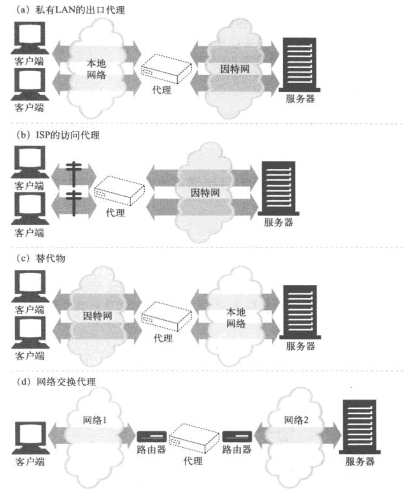

# HTTP 权威指南（HTTP结构）

## Web 服务器

### 实际的 Web 服务器会做些什么
1. 建立连接。接受一个客户端连接，或者如果不希望与这个客户端建立连接，就将其关闭。
2. 接收请求。从网络中读取一条 HTTP 请求报文。
3. 处理请求。对请求报文进行解释，并采取行动。
4. 访问资源。访问报文中指定的资源。
5. 构建响应。创建带有正确首部的 HTTP 响应报文。
6. 发送响应。将响应回送给客户端。
7. 记录事务处理过程。将已完成事务有关的内容记录在一个日志文件中。


#### 处理新连接
客户端请求一条到 Web 服务器的 TCP 连接时，Web 服务器会建立连接，判断连接的另一端是哪个客户端，从 TCP 连接中将 IP 地址解析出来。一旦新连接建立起来并被接受，服务器就会将新连接添加到其现存 Web 服务器连接列表中，做好监视连接上数据传输的准备。Web 服务器可以随意拒绝或立即关闭任意一条连接。有些 Web 服务器会因为客户端 IP 地址或主机名是未认证的，或者因为它是已知的恶意客户端而关闭连接。Web 服务器也可以使用其他识别技术。

#### 接收请求报文
连接上有数据到达时，Web 服务器会从网络连接中读取数据，并将请求报文中的内容解析出来。解析请求报文时，Web 服务器会
+ 解析请求行，查找请求方法，指定的资源标识符（URI）以及版本号，各项之间由一个空格分隔，并以一个回车换行（CRLF）序列作为行的结束。
+ 读取以 CRLF 结尾的报文首部
+ 检测到以 CRLF 结尾的、标识首部结束的空行（如果有的话）
+ 如果有的话（长度由 Content-Length 首部指定），读取请求主体。

解析请求报文时，Web 服务器会不定期地从网络上接收输入数据。网络连接可能随时都会出现延迟。Web 服务器需要从网络中读取数据，将部分报文数据临时存储在内存中，直到收到足以进行解析的数据并理解其意义为止。

##### 连接的输入/输出处理结构
高性能的 Web 服务器能够同时支持数千条连接。这些连接使得服务器可以与世界各地的客户端进行通信，每个客户端都向服务器打开了一条或多条连接。某些连接可能在快速地向 Web 服务器发送请求，而其他一些连接则可能在慢慢发送，或者不经常发送请求，还有一些可能是空闲的，安静的等待着将来可能出现的动作。因为请求可能会在任意时刻到达，所以 Web 服务器会不停地观察有无新的 Web 请求。不同的 Web 服务器结构会以不同的方式为请求服务。
+ 单线程 Web 服务器。单线程的 Web 服务器一次只处理一个请求，直到其完成为止。一个事务处理结束之后，才去处理下一条连接。这种结构易于实现，但在处理过程中，所有其他连接都会忽略。这样会造成严重的性能问题，只适用于低负荷的服务器。
+ 多进程及多线程 Web 服务器。多进程和多线程 Web 服务器用多个进程，或更高效的线程同时对请求进行处理。可以根据需要创建，或者预先创建一些线程/进程。有些服务器会为每条连接分配一个线程/进程，但当服务器同时要处理成百上千、甚至数以万计的连接时，需要的进程或线程数量可能会消耗太多的内存或系统资源。因此，很多多线程 Web 服务器都会对线程/进程的最大数量进行限制。
+ 复用 I/O 的服务器。为了支持大量的连接，很多 Web 服务器都采用了复用结构。在复用结构中，要同时监视所有连接上的活动。当连接的状态发生变化时（比如，有数据可用，或出现错误时），就对那条连接进行少量的处理；处理结束之后，将连接返回到开放连接列表中，等待下一次状态变化。只有在有事情可做时才会对连接进行处理；在空闲连接上等待的时候并不会绑定线程和进程。
+ 复用的多线程 Web 服务器。有些系统会将多线程和复用功能结合在一起，已利用计算机平台上的多个 CPU。多个线程（通常是一个物理处理器）中的而每一个都在观察打开的连接（或打开的连接中的一个子集），并对每条连接执行少量的任务。

#### 处理请求
一旦 Web 服务器收到了请求，就可以根据方法，资源、首部和可选的主体部分来对请求进行处理了。有些方法（比如 POST）要求请求报文中必须带有实体主体部分的数据。其他一些方法（比如 OPTIONS）允许有请求的主体部分，也允许没有。少数方法（比如 GET）禁止在请求报文中包含实体的主体数据。

#### 对资源的映射及访问
Web 服务器是资源服务器。它们负责发送预先创建好的内容，比如 HTML 页面或 JPEG 图片，以及运行在服务器上的资源生成程序所产生的动态内容。在 Web 服务器将内容传送给客户端之前，要将请求报文中的 URI 映射为 Web 服务器上适当的内容或内容生成器，已识别出内容的源头。

##### docroot
Web 服务器支持各种不同类型的资源映射，但最简单的资源映射形式就是用请求 URI 作为名字来访问 Web 服务器文件系统中的文件。通常，Web 服务器的文件系统中会有一个特殊的文件夹专门用于存放 Web 内容。这个文件夹被称为文档的根目录（document root，或 docroot）。Web 服务器从请求报文中获取 URI，并将其附加在文档根目录的后面。

#### 构建响应
一旦 Web 服务器识别除了资源，就执行请求方法中描述的动作，并返回响应报文，响应报文中包含有响应状态码、响应首部，如果生成了相应主体的恶化，还包括响应主体。

##### 响应实体
如果事务处理产生了响应主体，就将内容放在响应报文中间送过去。如果有响应主体的话，响应报文中通常包括
+ 描述了响应主体 MIME 类型的 Content-Type 首部
+ 描述了响应主体长度的 Content-Length 首部
+ 实际报文的主体内容

##### MIME 类型
Web 服务器要负责确定响应主体的 MIME 类型。有很多配置服务器的方法可以将 MIME 类型与资源关联起来。
+ MIME 类型。Web 服务器可以用文件的扩展名来说明 MIME 类型。Web 服务器会为每个资源扫描一个包含了所有扩展名的 MIME 类型的文件，以确定其 MIME 类型。
+ 魔法分类。Apache Web 服务可以扫描每个资源的内容，并将其与一个已知摸鼠标（被称为魔法文件）进行匹配，以决定每个文件的 MIME 类型。这样做可能比较慢，但很方便，尤其是文件没有标准扩展名的时候。
+ 显示分类。可以对 Web 服务器进行配置，使其不考虑文件的扩展名或内容，强制特定文件或目录内容个拥有某个 MIME 类型。
+ 类型协商。有些 Web 服务器经过配置，可以以多种文档格式来存储资源。在这种情况下，可以配置 Web 服务器，使其可以通过与用户的协商来决定使用哪种格式最好。

##### 重定向
Web 服务器有时会返回重定向响应而不是成功的报文。Web 服务器可以将浏览器重定向到其他地方来执行请求。重定向响应由返回码 3XX 说明。Location 响应首部包含了内容的新地址或优选地址的 URI。重定向可用于下列情况。
+ 永久删除的资源。资源可能已经被移动到了新的位置，或者被重新命名，有了一个新的 URL。Web 服务器可以高速客户端资源已经被重命名了，这样客户端就可以在从新地址获取资源之前，更新书签之类的信息了。状态码 301 Moved Permanently 就用于此类重定向。
+ 临时删除的资源。如果资源被临时移走或重命名了，服务器可能希望将客户端重定向到新的位置上去。但由于重命名是临时的，所以服务器希望客户端将来还可以回头去使用老的 URL，不要对书签进行更新。状态码 303 See Other 以及状态码 307 Temporaray Redirect 就用于此类重定向。
+ URL 增强。服务器通常用重定向来重写 URL，往往用于嵌入上下文。当请求到达时，服务器会生成一个新的包含了嵌入式状态信息的 URL，并将用户重定向到这个新的 URL 上去。客户端会跟随这个重定向信息，重新发起请求，但这次的请求会包含完整的、经过状态增强的 URL。这时在事务间维护状态的一种有效方式。状态码 303 See Other 和 307 Temporary Redirect 用于此类重定向。
+ 负载均衡。如果一个超载的服务器收到一条请求，服务器可以将客户端重定向到一个负载不太重的服务器上去。状态码 303 See Other 和 307 Temporary Redirect 用于此类重定向。
+ 服务器关联。Web 服务器上可能会有某些用户的本地信息；服务器可以将客户端重定向到包含了那个客户端信息的服务器上去。状态码 303 See Other 和 307 Temporary Redirect 用于此类重定向。
+ 规范目录名称。客户端请求的 URI 是一个不带尾部斜线的目录名时，大多数 Web 服务器都会将客户端重定向到一个加了斜线的 URI 上，这样相对链接就可以正常工作了。

#### 发送响应
Web 服务器通过链接发送数据时也会面临与接收数据一样的问题。服务器可能有很多条到各个客户端的连接，有些是空闲的，有些在向服务器发送数据，还有一些在向客户端回送响应数据。服务器要记录连接的状态，还要特别注意对持久连接的处理。对非持久连接而言，服务器应该在发送了报文之后，关闭自己这一端的连接。对持久连接来说，连接可能仍保持打开状态，在这种情况下，服务器要特别小心，要正确地计算 Content-Length 首部，不然客户端就无法知道响应什么时候结束了。

#### 记录日志
最后，当事务结束时，Web 服务器会在日志文件中添加一个条目，来描述已执行的事务。大多数 Web 服务器都提供了几种日志配置格式。

## 代理
Web 代理（proxy）服务器是网络的中间实体。代理位于客户端和服务器之间，扮演“中间人”的角色，在各端点之间来回传送 HTTP 报文。

### Web 的中间实体
Web 上的代理服务器是代表客户端完成事务处理的中间人。如果没有 Web 代理，HTTP 客户端就要直接与 HTTP 服务器进行对话。有了 Web 代理，客户端就可以与代理进行对话，然后由代理代表客户端与服务器进行交流。客户端仍然会完成对事务的处理，但它是通过代理服务器提供的优质服务来实现的。

HTTP 的代理服务器既是 Web 服务器又是 Web 客户端。HTTP 客户端会向代理发送请求报文，代理服务器必须想 Web 服务器一样，正确地处理请求和连接，然后返回响应。同时，代理自身要向服务器发送请求，这样，其行为就必须像正确的 HTTP 客户端一样，要发送请求并接收响应。

#### 私有和共享代理
代理服务器可以是某个客户端专用的，也可以是很多客户端共享的。单个客户端专用的代理被称为私有代理。众多客户端共享的代理被称为公共代理。
+ 公共代理。大多数代理都是公共的共享代理。集中式代理的费效比更高，更容易管理。某些代理应用，比如高速缓存代理服务器，会利用用户间共同的请求，这样的话，汇入同一个代理服务器的用户越多，它就越有用。
+ 私有代理。专用的私有代理并不常见，但它们确实存在，尤其是直接运行在客户端计算机上的时候。有些浏览器辅助产品，以及一些 ISP 服务，会在用户的 PC 上直接运行一些小型的代理，以便扩展浏览器特性，提高性能，或为免费 ISP 服务提供主机广告。

#### 代理与网关的对比
严格来说，代理连接的是两个或多个使用相同协议的应用程序，而网关连接的则是两个或多个不同协议的端点。网关扮演的是“协议转换器”的角色，即使客户端和服务器使用的是不同的协议，客户端也可以通过它完成与服务器之间的事务处理。下图显示了代理与网关之间的区别。


实际上，代理和网关之间的区别很模糊。由于浏览器和服务器实现的是不同版本的 HTTP，代理也经常要做一些协议转换工作。而商业化的代理服务器也会实现网关的功能来支持 SSL 安全协议、SOCKS 防火墙、FTP 访问，以及基于 Web 的应用程序。

### 为什么使用代理
代理服务器可以实现各种时髦且有用的功能。它们可以改善安全性，提高性能，节省费用。代理服务器可以看到并接触到所有流过的 HTTP 流量，所以代理可以监视流量并对其进行修改，以实现很多有用的增值 Web 服务。这里给出了几种代理使用方法的示例。
+ 儿童过滤器。小学在为教育站点提供无阻碍访问的同时，可以利用过滤器代理来组织学生访问成人内容。
+ 文档访问控制。可以用代理服务器在大量 Web 服务器和 Web 资源之间实现统一的访问控制策略，创建审核跟踪机制。这在大型企业环境或其他分布式机构中是很有用的。
+ 安全防火墙。网络安全工程师通常会使用代理服务器来提高安全性。代理服务器会在网络中的单一安全节点上限制哪些应用层协议的数据可以流入或流出一个组织。还可以提供用来消除病毒的 Web 和 Email 代理使用的那种挂钩程序，以便对流量进行详细的检查。
+ Web 缓存。代理缓存维护了常用文档的本地副本，并将它们按需提供，以减少缓慢且昂贵的因特网通信。
+ 反向代理。代理可以假扮 Web 服务器。这些被称为替代物（surrogate）或反向代理（reverse-proxy）的代理接收发给 Web 服务器的真实请求，但与 Web 服务器不同的是，它们可以发起与其他服务器的通信，以便按需定位所请求的内容。可以用这些反向代理来提高访问慢速 Web 服务器上公共内容时的性能。在这种配置中，通常将这些反向代理称为服务器加速器（server accelerator)。还可以将这些替代物与内容路由功能配合使用，已创建按需复制内容的分布式网络。
+ 内容路由器。代理服务器可以作为“内容路由器”使用，根据因特网流量状况以及内容类型将请求导向特定的 Web 服务器。内容路由器也可以用来实现各种服务级的请求。比如，如果用户或内容给提供者付费要求更高的性能，内容路由器可以将请求转发到附近的复制缓存，或者如果用户申请了过滤服务，还可以通过过滤代理来转发 HTTP 请求。可以用自适应内容路由代理来构件很多有趣的服务。
+ 转码器。代理服务器在将内容发送给客户端之前，可以修改内容的主体格式。在这些数据表示法之间进行的透明转换被称为转码（transcoding）。
+ 匿名者。匿名者代理会主动从 HTTP 报文中删除身份特性（比如客户端 IP 地址、From 首部、Referer 首部、cookie、URI 的会话 ID），从而提供高度的私密性和匿名性。

### 代理会去往何处
了解三个问题。
+ 怎样将代理部署到网络中去
+ 怎样将代理以层级方式连接在一起
+ 怎样先将网络流量直接导入代理服务器中

#### 代理服务器的部署
可以根据其目标用途，将代理放在任意位置。比如
+ 出口代理。可以将代理固定咋本地网络的出口点，以便控制本地网络与大型因特网之间的流量。可以在公司网络中使用出口代理，提供针对公司外部恶意黑客的防火墙保护，或降低带宽费用，提高因特网流量的性能，
+ 访问（入口）代理。代理常被放在 ISP 访问点上，用以处理来自客户的聚合请求。ISP 使用缓存代理来存储常用文档的副本，以提高用户（尤其是高速连接用户）的下载速度，降低因特网带宽耗费。
+ 反向代理。代理通常会被部署在网络边缘，在 Web 服务器之前，作为反向代理使用。在那里它们可以处理所有传送给 Web 服务器的请求，并只在必要时向 Web 服务器请求资源。反向代理可以提高 Web 服务器的安全特效，或者将快速的 Web 服务器缓存放在较慢的服务器之前，以提高性能。
+ 网络交换代理。可以将具有足够处理能力的代理放在网络之间的因特网对等交换点上，通过缓存来减轻因特网节点的拥塞，并对流量进行监视。



#### 代理的层次结构
可以通过代理层次结构（proxy hierarchy）将代理级联起来。在代理的层次结构中，会将报文从一个代理传给另一个代理，知道最终抵达原始服务器为止（然后通过代理传回给客户端）。Proxy 层次结构中的代理服务器被赋予了父 parent 和子 child 的关系。下一个入口（inbound）和代理（靠近服务器）被称为父代理，下一个出口（outbound）代理（靠近客户端）被称为子代理。

访问代理会根据不同的情况将报文转发给父代理或原始服务器。
+ 如果所请求的对象属于一个付费使用内容分发服务的 Web 服务器，代理就会将请求发送给附近的一个缓存服务器，这个服务器会返回已缓存对象，或者如果它那儿没有的话，它会去取回内容。
+ 如果请求的是特定类型的图片，访问代理会将请求转发给一个特定的压缩代理，这个代理会去获取图片，然后对其进行压缩，这样通过对客户端的慢速 Modem 下载时，速度会更快一些。
+ 负载均衡。子代理可能会根据当前父代理上的工作负载级别来决定如何选择一个父代理，以均衡负载。
+ 地理位置附近的路由。子代理可能会选择负责原始服务器所在物理区域的父代理。
+ 协议/类型路由。子代理可能会根据 URI 将报文转发到不同的父代理和原始服务器上去。某些特定类型的 URI 可能要通过一些特殊的代理服务器转发请求，以便进行特殊的协议处理。
+ 基于订购的路由。如果发布者为高性能服务额外付费了，它们的 URI 就会被转发到大型缓存或压缩引擎上去，以提高性能。

#### 代理是如何获取流量的
客户端通常会直接与 Web 服务器进行通信，所以我们要解释清楚 HTTP 流量怎样才能首先流向代理。有四种常见方式可以使客户端流量流向代理。
+ 修改客户端。很多 Web 客户端，包括网景和微软的浏览器，都支持手工和自动的代理配置。如果将客户端配置为使用代理服务器，客户端就会将 HTTP 请求有意地直接发送给代理，而不是原始服务器。
+ 修改网络。网络基础设施可以通过若干种技术手段，在客户端不知道，或没有参与的情况下，拦截网络流量并将其导入代理。这种拦截通常都依赖于监视 HTTP 流量的交换设备及路由设备，在客户端毫不知情的情况下，对其进行拦截，并将流量导入一个代理。这种代理被称为拦截（intercepting）代理。
+ 修改 DNS 的命名空间。放在 Web 服务器之前的代理服务器--替代物，会直接假扮 Web 服务器的名字和 IP 地址，这样，所有的请求都会发送给这些替代物。而不是服务器了。要实现这一点，可以手工编辑 DNS 名称列表，或者用特殊的动态 DNS 服务器根据需要确定适当的代理或服务器。有时在安装过程中，真实服务器的 IP 地址和名称被修改了，替代物得到的会是之前的地址和名称。
+ 修改 Web 服务器。也可以将某些 Web 服务器配置为客户端发送一条 HTTP 重定向命令（响应码 305），将客户端请求重定向到一个代理上去。收到重定向命令后，客户端会与代理进行通信。

### 客户端的代理设置
所有现代的 Web 浏览器都允许用户对代理的使用进行配置。实际上，很多浏览器都提供了多种配置代理的方式，包括
+ 手工配置。显示地设置要使用的代理。
+ 预先配置浏览器。浏览器厂商或发行商会在将浏览器发送给其客户之前预先对浏览器（或素有其他 Web 客户端）的代理设置进行手工配置。
+ 代理的自动配置（Proxy Auto-Configuratino，PAC）。提供一个 URI，指向一个用 JavaScript 语言编写的代理自动配置文件；客户端会取回这个 Javascript 文件，并运行它以决定是否应该使用一个代理，如果是的话，应该使用哪个代理服务器。
+ WPAD 的代理发现。有些浏览器支持 Web 代理自动发现协议（Web Proxy Autodiscovery Protocol，WPAD），这个协议会自动检测出浏览器可以从哪个“配置服务器”下载到一个自动配置文件。

### 与代理请求有关的一些棘手问题
+ 代理请求中的 URI 和服务器请求中的 URI 有何不同。
+ 拦截和反向代理是如何将服务器主机信息隐藏起来的
+ 修改 URI 的规则。
+ 代理是怎样影响浏览器的智能 URI 自动完成机制，或主机名扩展特性的。

#### 代理 URI 和服务器的 URI 的不同
客户端向服务器而不是代理发送请求时，HTTP 请求报文中的 URI 会有所不同。客户端向 Web 服务器发送请求时，请求行中只包含部分 URI（没有方案、主机或端口），如。
```
    GET /index.html HTTP/1.0
    User-Agent: SuperBrowser v1.3

但当客户端向代理发送请求时，请求行中则包含完整的 URI。例如：

    GET http://www.xxx.com/index.html HTTP/1.0
    User-Agent: SuperBrowser v1.3
```
为什么会有不同的请求格式，一种用于代理。另一种用于服务器呢？在原始 HTTP 设计中，客户端会直接与单个服务器进行对话。不存在虚拟主机，也没有为代理指定什么规则。单个的服务器知道自己的主机名和端口，所以，为了避免发送冗余信息，客户端只需发送部分 URI 即可，无需发送方案和主机（以及端口）。

代理出现之后，使用部分 URI 就有问题了，代理需要知道目标服务器的名称，这样它们才能建立自己与服务器的连接。基于代理的网关要知道 URI 的方案才能连接到 FTP 资源和其他方案上去。 HTTP/1.0 要求代理请求发送完整的 URI。因此，我们要将部分 URI 发送给服务器，将完整 URI 发送给代理。在显示地配置客户端代理设置的情况下，客户端就知道要发布哪种类型的请求了。

#### 与虚拟主机一样的问题
代理“缺少方案/主机/端口”的问题与虚拟主机 Web 服务器面临的问题相同，虚拟主机 Web 服务器会在很多 Web 站点间共享同一个物理 Web 服务器。包含部分 URI（比如 /index.html）的请求到达时，虚拟主机 Web 服务器小知道目的 Web 站点的主机名。尽管它们出现的问题很相似，但解决方法却有所不同：
+ 显示的代理要求在请求报文中使用完整 URI 来解决这个问题。
+ 虚拟主机 Web 服务器要求使用 Host 首部来承载主机和端口信息。

#### 拦截代理会收到部分 URI
只要客户端正确地实现了 HTTP，它们就会在请求中包含完整的 URI，发送给经过显示配置的代理。这样解决了部分问题，但还有一个问题：客户端并不总是知道它是在和代理进行对话。因为有些代理对客户端可能是不可见的。在这种情况下，客户端会认为它是在与 Web 服务器进行对话，不会发送完整的 URI。拦截代理是网络流量中的代理服务器，它会拦击从客户端发往服务器的请求，并提供给一个缓存响应，或对其进行转发。

#### 代理既可以处理代理请求，也可以处理服务器请求
由于将流量重定向到代理服务器的方式有所不同，通用的代理服务器既应该支持请求报文中的完整 URI，也应该支持部分 URI。如果是显示的代理请求，代理就应该使用完整 URI，如果是 Web 服务器请求，就应该使用部分 URI 和虚拟 Host 首部。使用完整和部分 URI 的规则如下所示。
+ 如果提供的是完整的 URI，代理就应该使用这个完整 URI。
+ 如果提供的是部分 URI，而且有 Host 首部，就应该用 Host 首部来确定原始服务器的名字和端口号
+ 如果提供的是部分 URI，且没有 Host 首部，就要用其他方法来确定原始服务器。
  + 如果代理是代表原始服务器的替代物，可以用真实服务器的地址和端口号来配置代理。
  + 如果流量被拦截了，而且拦截者也可以提供原始的 IP 地址和端口，代理就可以使用拦截技术提供的 IP 地址和端口号。
  + 如果所有方法都失效了，代理没有足够的信息来确定原始服务器，就必须返回一条错误报文。

### 追踪报文

#### Via 首部
Via 首部字段列出了与报文途径的每个中间节点（代理或网关）有关的信息。报文每经过一个节点，都必须将这个中间节点添加到 Via 列表的末尾。下面的 Via 字符串高速我们报文流经过了两个代理。第一个代理名为 proxy-62.irenes-isp.net,它实现了 HTTP/1.1 协议；第二个代理名为 cache.joes-hardware.com，实现了 HTTP/1.0。
```
    Via: 1.1 proxy-62.irenes-isp.net, 1.0 cache.joes-hardware.com
```
Via 首部字段用于记录报文的转发，诊断报文循环，标识请求/响应链上所有发送者的协议能力。代理也可以用 Via 首部来检测网络中的路由循环。代理应该在发送一条请求之前，在 Via 首部插入一个与其自身有关的独特字符串，并在输入的请求中查找这个字符串，以检测网络中是否存在路由循环。

##### Via 的语法
Via 首部字段包含一个由都好分隔的路标（waypoint）。每个路标都表示一个独立的代理服务器或网关，且包含与那个中间节点的协议和地址有关的信息。Via 首部的正规语法如下所示：
```
    Via                 = "Via" ":" 1#( waypoint )
    waypoint            = ( received-protocol received-by [ comment ] )
    received-protocol   = [ protocal-name "/" ] protocol-version
    received-by         = ( host [ ":" port ] ) | pseudonym

    注意：每个 Via 路标中最多包含 4 个组件：一个可选的协议名（默认为 HTTP）、一个必选的协议版本、一个必选的节点名和一个可选的描述性注释。 
```
+ 节点名。中间节点的主机和可选端口号（如果没有端口号，可以假定使用的是协议的默认端口号）。
+ 节点注释。进一步描述这个中间节点的可选注释。

##### Server 和 Via 首部
Server 响应首部字段对原始服务器使用的软件进行了描述。如下所示。
```
    Server: Apache/1.3.14 (Unix) PHP/4.0.4
    Server: Netscape-Enterprise/4.1
    Server: Microsoft-IIS/5.0
```

如果响应报文是通过代理转发的，一定要确保代理没有修改 Server 首部。Server 首部是用于原始服务器的。代理应该添加的是 Via 条目。

#### TRACE 方法
代理服务器可以在转发报文时对齐进行修改。可以添加、修改或删除首部，也可以将主体部分转换成不同的格式。代理变得越来越复杂，开发代理产品的厂商也越来越多，互操作性问题也开始逐渐显现。为了便于对代理网络进行诊断，我们需要有一种便捷的方式来观察在通过 HTTP 代理网络逐跳转发报文的过程中，报文是怎样变化的。

通过 HTTP/1.1 的 TRACE 方法，用户可以跟踪经代理链传输的请求报文，观察报文经过了哪些代理，以及每个代理是如何对请求报文进行修改的。TRACE 对代理流的调试非常有用。

当 TRACE 请求到达目的服务器时，整条请求报文都会封装在一条 HTTP 响应的主体中回送给发送端。当 TRACE 响应到达时，客户端可以检查服务器收到的确切报文，以及它所经过的代理列表（在Via 首部）。TRACE 响应的 Content-Type 为 message/http，状态为 200 OK。如下图。


##### Max-Forwards
通常，不管中间插入了多少代理，TRACE 报文都会沿着整条路径传到目的服务器上。可以使用 Max-Forwards(最大转发次数) 首部来限制 TRACE 和 OPTIONS 请求所经过的代理跳数，在测试代理链是否是在无限循环中转发报文，或者查看链中特定代理服务器的效果时，它是很有用的。Max-Forwards 也可以限制 OPTIONS 报文的转发。

Max-Forwards 请求首部字段包含了一个整数，用来说明这条请求报文还可以被转发的次数。如果 Max-Forwards 的值为零，那么即使接收者不是原始服务器，它也必须将 TRACE 报文回送给客户端，而不应该继续转发。如果收到的 Max-Forwards 值大于零，转发的报文中就必须包含一个更新了的 Max-Forwards 字段，其值会被减一。所有的代理和网关都应该支持 Max-Forwards。可以用 Max-Forwards 来查看在代理链的任意一跳上接收到的请求。


### 代理认证
代理可以作为访问控制设备使用。HTTP 定义了一种名为代理认证（proxy authentication）的机制，这种机制可以阻止对内容的请求，直到用户向代理提供了有效的访问权限证书为止。
+ 对受限内容的请求到达一台代理服务器时，代理服务器是可以返回一个要求使用访问证书的 407 proxy Authorization Required 状态码，以及一个用于描述怎样提供这些证书的 Proxy-Authenticate 首部字段。
+ 客户端收到 407 响应时，会尝试着从本地数据库中，或者通过提示用户来搜集所需要的整数。
+ 只要获得了整数，客户端就会重新发送请求，在 Proxy-Authorization 首部字段中提供所要求的证书。
+ 如果证书有效，代理就会将原始请求沿着传输链路向下传送，否则，就发送另一条 407 应答。


### 代理的互操作性
客户端、服务器和代理是由不同厂商构建的，实现的是不同版本的 HTTP 规范。它们支持的特性各不相同，也存在着不同的问题。代理服务器位于客户端和服务器设备之间，这些设备实现的协议可能有所不同，可能存在着很棘手的问题。

#### OPTIONS 发现对可选特性的支持。
通过 HTTP OPTIONS 方法，客户端（或代理）可以发现 Web 服务器或者其上某个特定资源所支持的功能（比如，它们所支持的方法）。通过使用 OPTIONS，客户端可以在与服务器进行交互之前，确定服务器的能力，这样它就可以更方便地与具备不同特性的代理和服务器进行互操作了。


##### Allow 首部
Allow 实体首部字段列出了请求 URI 标识的资源所支持的方法列表，如果请求 URI 为 * 的话，列出的就是整个服务器所支持的方法列表。如
```
    Allow: GET, HEAD, PUT
```

可以将 Allow 首部作为请求首部，建议在新的资源上支持某些方法。并不要求服务器支持这些方法，但应该在相应的响应中包含一个 Allow 首部，列出它实际支持的方法。


## 缓存
Web 缓存时可以自动保存常见文档副本的 HTTP 设备。当 Web 请求抵达缓存时，如果本地有“已缓存“的副本，就可以从本地存储设备而不是原始服务器中提取这个文档。使用缓存有下列优点。
+ 缓存减少了冗余的数据传输。节省了你的网络费用。
+ 缓存缓解了网络瓶颈的问题。不需要更多的带宽就能够更快的加载页面。
+ 缓存降低了对原始服务器的要求。服务器可以更快地响应，避免过载的出现。
+ 缓存降低了距离时延，因为从较远的地方加载页面会更慢一些。

### 冗余的数据传输
有很多客户端访问一个流行的原始服务器页面时，服务器会多次传输同一份文档，每次传送给一个客户端。一些相同的字节会在网络中一遍遍地传输。这些冗余的数据传输会耗尽昂贵的网络带宽，降低传输速度，加重 Web 服务器的负载。有了缓存，就可以保留第一条服务器响应的副本，后继请求就可以由缓存的副本来应对了，这样可以坚守那些流入/流出原始服务器的，被浪费掉了的重复流量。

### 带宽瓶颈
缓存还可以缓解网络的瓶颈问题。很多网络为本地网络客户端提供的带宽比为远程服务器提供的带宽要宽。客户端会以路径上最慢的网速访问服务器。如果客户端从一个快速局域网的缓存中得到了一份副本，那么缓存就可以提高性能，尤其是要传输比较大的文件时。

### 瞬间拥塞
缓存在破坏瞬间拥塞（Flash Crowds）时显得非常重要。突发事件（比如爆炸性新闻、批量 E-mail 公告，或者某个名人事件）使很多人几乎同时去访问一个 Web 文档时，就会出现瞬间拥塞。由此造成的过多流量峰值可能会使网络和 Web 服务器产生灾难性的崩溃。

### 距离时延
即使带宽不是问题，距离也可能成为问题。每台网络路由器都会增加因特网流量的时延。即使客户端和服务器之间没有太多的路由器，光速自身也会造成显著的时延。将缓存放在附近的机房里可以将文件传输距离从数千英里缩短为数十米。

### 命中和未命中的
这样看来缓存是有所帮助的，但缓存无法保存世界上每份文档的副本。可以用已有的副本为某些到达缓存的请求提供服务。这被称为缓存命中（cache hit）。其他一些到达缓存的请求可能会由于没有副本可用，而被转发给原始服务器，这被称为缓存未命中（cache miss)。

#### 再验证
原始服务器的内容可能会发生变化。缓存要不时对其进行检测，看看它们保存的副本是否仍是服务器上最新的副本。这些”新鲜度检测“被称为 HTTP 再验证（revalidation)。为了有效地进行再验证，HTTP 定义了一些特殊的请求，不用从服务器上获取整个对象，就可以快速检测出内容是否是最新的。

缓存对缓存的副本进行再验证时，会向原始服务器发送一个小的再验证请求。如果内容没有变化，服务器会以一个小的 304 Not Modified 进行响应。只要缓存知道副本仍然有效，就会再次将副本标识为暂时新鲜的，并将副本提供给客户端，这被称作再验证命中（revalidate hit）或缓慢命中（slow hit）。这种方式确实要与原始服务器进行核对，所以会比淡出的缓存命中要慢，但它没有从服务器中获取对象数据，所以要比缓存未命中快一些。

HTTP 为我们提供了几个用来对已缓存对象进行再验证的工具，但最常用的是 If-Modified-Since 首部。将这个首部添加到 GET 请求中去，就可以高速服务器，只有在缓存了对象的副本之后，又对其进行了修改的情况下，才发送此对象。下面列出了在 3 种情况下（服务器内容未被修改，服务器内容已被修改，或者服务器上的对象被删除了）服务器收到 GET If-Modified-Since 请求时会发生的情况。
+ 再验证命中。如果服务器对象未被修改，服务器会向客户端发送一个小的 HTTP 304 Not Modified 响应。
+ 再验证未命中。如果服务器对象与已缓存副本不同，服务器向客户端发送一条普通的、带有完整内容的 HTTP 200 OK 响应。
+ 对象被删除。如果服务器对象已经被删除了，服务器会回送一个 404 Not Found 响应，缓存也会将其副本删除。

#### 命中率
由缓存提供服务的请求所占的比例被称为缓存命中率（cache hit rate），有时也被称为文档命中率（document hit rate）。命中率在 0 到 1 之间，但通常使用百分数来描述的，缓存的管理者希望缓存命中率接近 100%。而实际得到的命中率则与缓存的大小，缓存用户兴趣点的相似性、缓存数据的变化或个性化评率，以及如何配置缓存有关。命中率很难预测，但对现在中等规模的Web 缓存来说，40% 的命中率是很合理的。缓存的好处是，即使是中等规模的缓存，其所包含的常见文档也足以显著地提高性能、减少流量了。缓存会努力确保将有用的内容保存在缓存中。

#### 字节命中率
由于文档并不全是统一尺寸的，所以文档命中率并不能说明一切。有些大型对象被访问的次数可能较少，但由于尺寸的原因，对整个数据流量的贡献却更大。因此有些人更愿意使用字节命中率（byte hit rate)作为度量值（尤其那些按流量字节付费的人！）。

字节命中率表示的是缓存提供的字节在传输的所有字节中所占的比例。通过这种度量方式，可以得知节省流量的程度。100% 的字节命中率说明每个字节都来自缓存，没有流量流到因特网上去。

文档命中率和字节命中率对缓存性能的评估都是很有用的。文档命中率说明阻止了多少通往外部网络的 web 事务。食物有一个通常都很大的固定时间成分（比如，建立一条到服务器的 TCP 连接），提高文档命中率对降低整体延迟（时延）很有好处。字节命中率说明阻止了多少字节传向因特网。提高字节命中率对节省带宽很有利。

#### 区分命中和未命中的情况
不幸的是，HTTP 没有为用户提供一种手段来区分响应时缓存命中的，还是访问原始服务器得到的。在这两种情况下，响应码都是 200 OK，说明响应有主体部分。有些商业代理缓存会在 Via 首部附加一些额外信息，已描述缓存中发生的情况。

客户端有一种方法可以判断响应是否来自缓存，就是使用 Date 首部。将响应中 Date 首部的值与当前事件进行比较，如果响应中的日期值比较早，客户端通常就可以认为这是一条缓存的响应。客户端也可以通过 Age 首部来检测缓存的响应，通过这个首部可以分辨出这条响应的使用期。

### 缓存的拓扑结构
缓存可以是单个用户专用的，也可以是数千名用户共享的。专用缓存被称为私有缓存（private cache）。私有缓存是个人的缓存，包含了单个用户最常用的页面。共享的缓存被称为公有缓存（public cache）。公有缓存中包含了某个用户团体的常用页面。

#### 私有缓存
私有缓存不需要很大的动力或存储空间，这样就可以将其做的很小，很便宜。Web 浏览器中有内建的私有缓存，大多数浏览器都会将常用文档缓存在你个人电脑的磁盘和内存中，并且允许用户去配置缓存的大小和各种设置。

#### 公有代理缓存
公有缓存是特殊的共享代理服务器，被称为缓存代理服务器（caching proxy server），或者更常见地被称为代理缓存（proxy cache）。代理缓存会从本地缓存中提供文档，或者代表用户与服务器进行联系。公有缓存会接受来自多个用户的访问，所以通过它可以更好地减少冗余流量。

#### 代理缓存的层次结构
在实际中，实现层次化（hierarchy）的缓存是很有意义的，在这种结构中，在较小缓存中未命中的请求会被导向较大的父缓存（parent cache），由它来为剩下的哪些”提炼过的“流量提供服务。其基本思想是在靠近客户端的地方使用小型廉价缓存，而更高层次中，则逐步采用更大、功能更强的缓存来装载多用户共享的文档。

#### 网状缓存、内容路由以及对等缓存
有些网络结构会构建复杂的网状缓存（cache mesh），而不是简单的缓存层次结构。网状缓存中的代理缓存之间会以更加复杂的方式进行对话，做出动态的缓存通信决策，决定与哪个父缓存进行对话，或者决定彻底绕开缓存，直接连接原始服务器。这种代理缓存会决定选择何种路由对内容进行访问、管理和传送。因为可将其称为内容路由器（content router）。网状缓存中为内容路由设计的缓存（除了其他任务之外）要完成下列所有功能。
+ 根据 URL 在父缓存或原始服务器之间进行动态选择。
+ 根据 URL 动态地选择一个特定的父缓存。
+ 前往父缓存之前，在本地缓存中搜索已缓存的副本。
+ 允许其他缓存对其缓存的部分内容进行访问，但不允许因特网流量通过它们的缓存。

缓存之间这些更为复杂的关系允许不同的组织互为对等（peer）实体，将它们的缓存连接起来以实现共赢。提供可选的对等支持的缓存被称为兄弟缓存（sibling cache）。HTTP 并不支持兄弟缓存，所以人们通过一些协议对 HTTP 进行了扩展，比如因特网缓存协议（Internet Cache Protocol，ICP）和超文本缓存协议（HyperText Caching Protocol，HTCP）。

### 缓存的处理步骤
现代的商业化代理缓存相当地复杂。这些缓存构建得非常高效，可以支持 HTTP 和其他一些技术的各种高级特性。但除了一些微妙的细节之外，Web 缓存的基本工作原理大多很简单。对一条 HTTP GET 报文的基本缓存处理过程包括 7 个步骤。
1. 接收。缓存从网络中读取抵达的请求报文。
2. 解析。缓存对报文进行解析，提取出 URL 和各种首部。
3. 查询。缓存查看是否有本地副本可用，如果没有，就获取一份副本（并将其保存在本地）。
4. 新鲜度检测。缓存查看已缓存副本是否足够新鲜，如果不是，就询问服务器是否有任何更新。
5. 创建响应。缓存会用新的首部和已缓存的主体来构建一条响应报文。
6. 发送。缓存通过网络将响应发回给客户端。
7. 日志。缓存可选地创建一个日志文件条目来描述这个事务。


### 保持副本的新鲜
HTTP 有一些简单的机制可以在不要求服务器记住有哪些缓存拥有其文档副本的情况下，保存已缓存数据与服务器数据之间充分一直。HTTP 将这些简单的机制称为文档过期（document expiration）和服务器再验证（server revalidation）。

#### 文档过期
通过特殊的 HTTP Cache-Control 首部和 Expires 首部，HTTP 让原始服务器向每个文档附加了一个 ”过期日期“。在缓存过期之前，缓存可以以任意频率使用这些副本，而无需与服务器联系。除非客户端请求中包含有阻止提供已缓存或未验证资源的首部。但一旦已缓存文档过期，缓存就必须与服务器进行核对，询问文档是否被修改过，如果被修改过，就要获取一份新鲜的副本。

#### 过期日期和使用期
服务器用 HTTP/1.0 的 Expires 首部或 HTTP/1.1 的 Cache-Control: max-age 响应首部来指定过期日期，同时还会带有响应主体。Expires 首部和 Cache-Control: max-age 首部所做的事情本质上是一样的，但由于 Cache-Control 首部使用的是相对时间而不是绝对日期，所以我们更倾向于使用比较新的 Cache-Control 首部。绝对日期依赖于计算机时钟的正确设置。如下表。

首部  | 描述
----  | ----
Cache-Control: max-age | max-age 值定义了文档的最大试用期，从第一次生成文档到文档不再新鲜，无法使用为止，最大的合法生存时间。（以秒为单位）。如 Cache-Control: max-age=484200
Expires  | 指定一个绝对的过期日期，如果过期日期已经过了，就说明文档不再新鲜了。Expires: Fri,05 Jul 2002, 05:00:00 GMT

#### 服务器再验证
仅仅是已缓存文档过期了并不意味着它和原始服务器上目前处于活跃状态的文档有实际的区别；这只是意味着到了要进行核对的时间了。这种情况被称为”服务器再验证“，说明缓存需要询问原始服务器文档是否发生了变化。
+ 如果再验证显示内容发生了变化，缓存会获取一份新的文档副本，并将其存储在旧文档的位置上，然后将文档发送给客户端。
+ 如果再验证显示内容没有发生变化，缓存只需要获取新的首部，包括一个新的过期日期，并对缓存中的首部进行更新就行了。

缓存并不一定要为每条请求验证文档的有效性，**只有在文档过期时它才需要与服务器进行再验证**。这样不会提供陈旧的内容，还可以节省服务器的流量，并拥有更好的用户响应时间。

HTTP 协议要求行为正确的缓存返回下列内容之一。
+ ”足够新鲜“的已缓存副本
+ 与服务器进行再验证，确认其仍然新鲜的已缓存副本
+ 如果需要与之进行再验证的原始服务器出故障了，就返回一条错误报文
+ 附有警告信息说明内容可能不正确的已缓存副本

#### 用条件方法进行再验证
HTTP 的条件方法可以高效的实现再验证。HTTP 允许缓存向原始服务器发送一个”条件 GET",请求服务器只有在文档与缓存中现有的副本不同时，才回送对象主体。通过这种方式，将新鲜度检测和对象获取结合成了单个条件 GET。向 GET 请求报文中添加一些特殊的条件首部，就可以发起条件 GET。只有条件为真时，Web 服务器才会返回对象。

HTTP 定义了 5 个条件请求首部。对缓存再验证来说最有用的 2 个首部是 If-Modified-Since 和 If-None-Match。所有的条件首部都已前缀 “If-”开头。如下表。

首部  | 描述
----  | ----
If-Modified-Since:<date> | 如果从指定日期之后文档被修改过了，就执行请求的方法。可以与 Last-Modified 服务器响应首部配合使用，只有在内容修改后与已缓存版本有所不同的时候采取获取内容
If-None-Match:<tags> | 服务器可以为文档提供特殊的标签（ETag），而不是将其与最近修改日期相匹配，这些标签就像序列号一样，如果已缓存标签与服务器文档中的标签不同，If-None-Match 首部就会执行所请求的方法。

#### If-Modified-Since:Date 再验证
最常见的缓存再验证首部是 If-Modified-Since，If-Modified-Since 再验证请求通常被称为 IMS 请求。只有自某个日期之后资源发生了变化的时候，IMS 请求才会指示服务器执行请求。
+ 如果自指定日期后，文档被修改了，If-Modified-Since 条件就为真，通常 GET 就会成功执行。携带新首部的新文档会被返回给缓存，新首部除了其他信息之外，还包含了一个新的过期日期。
+ 如果自指定日期后，文档没被修改过，条件就为假，会向客户端返回一个小的 304 Not Modified 响应报文，为了提高有效性，不会返回文档的主体。这些首部是放在响应中返回的，但只会返回哪些需要在源端更新的首部。比如 Content-Type 首部通常不会被修改，所以通常不需要发送。一般会发送一个新的过期日期。

If-Modified-Since 首部可以与 Last-Modified 服务器响应首部配合工作。原始服务器会将最后的修改日期附加到所提供的文档上去。当缓存要对已缓存文档进行再验证时，就会包含一个 If-Modified-Since 首部，其中携带有最后修改已缓存副本的日期。如
```
    If-Modified-Since: <cached last-modified date>
```

下图演示了 If-Modified-Since 再验证的两种情况。


#### If-None-Match: 实体标签再验证
有些情况下仅使用最后修改日期进行再验证是不够的。
+ 有些文档可能会被周期性的重写（比如，从一个后台进程中写入），但实际包含的数据常常是一样的。尽管内容没有变化，但修改日期会发生变化。
+ 有些文档可能被修改了，但所做修改并不重要，不需要让世界范围内的缓存都重装数据（比如对拼写或注释的修改）。
+ 有些服务器无法准确地判定其页面的最后修改日期。
+ 有些服务器提供的文档会在毫秒间隙发送变化，比如，实时监视器。对这些服务器来说，以一秒的粒度的修改日期可能就不够用了。

为了解决这些问题，HTTP 允许用户对被称为实体标签（ETag）的“版本标识符”进行比较。实体标签是附加到文档上的任意标签（引用字符串）。它们可能包含了文档的序列号或版本名，或者是文档内容的校验和及其他指纹信息。

当发布者对文档进行修改时，可以修改文档的实体标签来说明这个新的版本。这样，如果实体标签被修改了，缓存就可以用 If-None-Match 条件首部来 GET 文档的新副本了。

如下图，缓存中有一个实体标签为 v2.6 的文档。它会与原始服务器进行再验证，如果标签 v2.6 不再匹配，就会请求一个新对象。如果匹配，则返回一条 304 Not Modified 响应。


如果服务器上的实体标签已经发生了变化（可能变成了 v3.0），服务器会在一个 200 OK 响应中返回新的内容以及相应的新 ETag。

也可以在 If-None-Match 首部包含几个实体标签，告诉服务器，带有这些实体标签的对象副本在缓存中已经有了。
```
    If-None-Match: "v2.6"
    If-None-Match: "v2.4", "v2.5", "v2.6"
    If-None-Match: "foobar", "A34FAC0095", "Profiles in Courage"
```

#### 强弱验证器
缓存可以用实体标签来判断，与服务器相比，已缓存版本是不是最新的（与使用最近修改日期的方式很像）。从这个角度来看，实体标签和最近修改日期都是缓存验证器（cache validator）。

有时，服务器希望在对文档进行一些非实质性或不重要的修改时，不要使所有的已缓存副本都失效。HTTP/1.1 支持“弱验证器”，如果只对内容进行了少量修改，就允许服务器声明那是“足够好”的等价体。

只要内容发生了变化，强验证器就会变化。弱验证器允许对一些内容进行修改，但内容的主要含义发生变化时，通常它还是会变化的。有些操作不能用弱验证器来实现（比如有条件地获取部分内容），所以，服务器会用前缀“W/” 来表示弱验证器。
```
    ETag: W/"v2.6"
    If-None-Match: W/"v2.6"
```

不管相关的实体值以何种形式发生了变化，强实体标签都要发生变化。而相关实体在语义上发生了比较重要的变化时，弱实体标签页应该发生变化。

#### 什么时候应该使用实体标签和最近修改日期
如果服务器回送了一个实体标签，HTTP/1.1 客户端就必须使用实体标签验证器。如果服务器只回送了一个 Last-Modified 值，客户端就可以使用 If-Modified-Since 验证。如果实体标签和最后修改日期都提供了，客户端就应该使用这两种再验证方案。这样 HTTP/1.0 和 HTTP/1.1 缓存都可以正确响应了。

除非 HTTP/1.1 原始服务器无法生成实体标签验证器，否则就应该发送一个出去，如果使用弱实体标签有有时的话，发送的可能是个弱实体标签，而不是强实体标签。而且，最好同时发送一个最近修改值。

如果 HTTP/1.1 缓存或服务器收到的请求既带有 If-Modified-Since，又带有实体标签条件首部，那么只有这两个条件都满足时，才能返回 304 Not Modified 响应。

### 控制缓存的能力
服务器可以通过 HTTP 定义的几种方式来指定在文档过期之前可以将其缓存多长时间。按照优先级递减的顺序，服务器可以
+ 附加一个 Cache-Control: no-store 首部到响应中去
+ 附加一个 Cache-Control: no-cache 首部到响应中去
+ 附加一个 Cache-Control: must-revalidate 首部到响应中去
+ 附加一个 Cache-Control: max-age 首部到响应中去
+ 附加一个 Expires 首部到响应中去
+ 不附加过期信息，让缓存确定自己的过期日期

#### no-Store 与 no-Cache 响应首部
HTTP/1.1 提供了几种限制对象缓存，或限制提供已缓存对象的方式，以维持对象的新鲜度。no-store 首部和 no-cache 首部可以防止缓存提供未经证实的已缓存对象
```
    Pragma: no-cache
    Cache-Control: no-store
    Cache-Control: no-cache
```

标识为 no-store 的响应会禁止对响应进行复制。缓存通常会像非缓存代理服务器一样，向客户端转发一条 no-store 响应，然后删除对象。

标识为 no-cache 的响应实际上是可以存储在本地缓存区中的。只是在于原始服务器进行新鲜度再验证之前，缓存不能将其提供给客户端使用。这个首部使用 do-not-serve-from-cache-without-revalidation 这个名字更恰当一些。

HTTP/1.1 中提供 Pragma: no-cache 首部是为了兼容于 HTTP/1.0+。除了与只理解 Pragma: no-cache 的 HTTP/1.0 应用程序进行交互时，HTTP/1.1 应用程序都应该使用 Cache-Control: no-cache。

#### max-age 响应首部
Cache-Control: max-age 首部表示的是从服务器将文档传来之时其，可以认为此文档处于新鲜状态的秒数。还有一个 s-maxage 首部，其行为与 max-age 类似，但仅适用于共享（公有）缓存。
```
    Cache-Control: max-age=3600
    Cache-Control: s-maxage=3600
```
服务器可以请求缓存不要缓存文档，或者将其最大使用期为零，从而在每次访问的时候都进行刷新。
```
    Cache-Control: max-age=0
    Cache-Control: s-maxage=0
```

#### Expires 响应首部
不推荐使用 Expires 首部，它指定的是实际的过期日期而不是剩余秒数。HTTP 设计者后来认为，由于很多服务器的时钟都不同步，或者不正确，所以最好还是用剩余秒数，而不是绝对时间来表示过期时间。

#### must-revalidate 响应首部
可以配置缓存，使其提供一些陈旧的对象，以提高性能。如果原始服务器希望缓存严格遵守过期信息。可以在原始响应中附加一个 Cache-Control: must-revalidate 首部。
```
    Cache-Control: must-revalidate
```
Cache-Control: must-revalidate 响应首部告诉缓存，在事先没有跟原始服务器进行再验证的情况下，不能提供这个对象的陈旧副本。缓存仍然可以随意提供新鲜的副本。如果在缓存进行 must-revalidate 新鲜度检查时，原始服务器不可用，缓存就必须返回一条 504 Gateway Timeout 错误。

#### 客户端的新鲜度限制
Web 浏览器都有 Refresh（刷新）或 Reload（重载）按钮，可以强制对浏览器或代理缓存中可能过期的内容进行刷新。Refresh 按钮会发布一个附加了 Cache-Control 请求首部的 GET 请求，这个请求会强制进行再验证，或者无条件地从服务器获取文档。Refresh 的确切行为取决于特定的浏览器、文档以及拦截缓存的配置。

客户端可以用 Cache-Control 请求首部来强化或放松对过期时间的限制。有些应用程序对文档的新鲜度要求很高，对这些应用来说，客户端可以用 Cache-Control 首部使过期时间更严格。另一方面，作为提高性能，可靠性或开支的一种折衷方式，客户端可能会发送新鲜度要求。如下表，列出了 Cache-Control 的**请求指令。**
指令 | 目的
---- | ----
Cache-Control: max-stale | 缓存可以随意提供过期的文件。
Cache-Control: max-stale = \<s>  | 如果指定了参数 \<s>，在这段时间内，文档就不能过期。这条指令放松了缓存的规则。
Cache-Control: min-fresh=\<s>  | 至少在未来 \<s> 秒内文档要保持新鲜。这就使缓存规则更加严格了。
Cache-Control: max-age=\<s>  | 缓存无法返回缓存时间长于 \<s> 秒的文档。这条指令会使缓存规则更加严格，除非同时还发送了 max-stale 指令，在这种情况下，试用期可能会超过其过期时间。
Cache-Control: no-cache  | 除非资源进行了再验证，否则这个客户端不会接收已缓存的资源。
Pragma: no-cache  | 同上。
Cache-Control: no-store  | 缓存应该尽快冲存储器中删除文档的所有痕迹，因为其中可能会包含敏感信息。
Cache-Control: only-if-cached | 只有当缓存中有副本存在时，客户端才会获取一份副本。

### 其他

#### 命中技术和使用限制
RFC 2227，“HTTP 的简单命中技术和使用限制“中定义了一种简单得多的方案。这个协议向 HTTP 中添加了一个称为 Meter 的首部，这个首部会周期性地将对特定 URL 的命中次数回送给服务器。通过这种方式，服务器可以从缓存周期性地获取对已缓存文档命中次数的更新。

而且，服务器还能控制在缓存必须向服务器汇报之前，其中的文档还可以使用多少次，或者为缓存文档设置一个时钟超时值。这种控制方式被称为使用限制；通过这种方式，服务器可以对缓存向原始服务器汇报之前，已缓存资源的使用次数进行控制。

## 集成点：网关、隧道及中继
### 网关
HTTP 扩展和接口的发展是由用户需求驱动的。要在 Web 上发布更复杂资源的需求出现时，人们很快就明确了一点: 单个应用程序无法处理所有这些能想到的资源。为了解决这个问题，开发者提出了网关（gateway）的概念，网关可以作为某种翻译器使用，它抽象除了一种能够到达资源的方法。网关是资源和应用程序之间的粘合剂。应用程序可以（通过 HTTP 或其他向数据库发送查询语句，或者生成动态的内容，就像一个门一样：进去一条请求，出来一个响应）。下图是一个网关示例。


有些网关会自动将 HTTP 流量转换为其他协议，这样 HTTP 客户端无需了解其他协议，就可以与其他应用程序交互了。如下图。


Web 网关在一侧使用 HTTP 协议，在另一侧使用另一种协议。可以用一个斜杠来分隔客户端和服务器端写，并以此对网关进行描述：
```
    <客户端协议>/<服务器端协议>
```

因此，将 HTTP 客户端连接到 NNTP 新闻服务器的网关就是一个 HTTP/NNTP 网关。我们用术语服务器端网关和客户端网关来说明对话是在网关的哪一侧进行的。
+ 服务器端网关（server-side gateway) 通过 HTTP 与客户端对话，通过其他协议与服务器通信（HTTP/*)。
+ 客户端网关（client-side gateway）通过其他协议与客户端对话，通过 HTTP 与服务器通信（*/HTTP)。

### 协议网关
将 HTTP 流量导向网关时所使用的方式与将流量导向代理的方式相同。最常见的方式是，显式地配置浏览器使用网关，对流量进行透明的拦截，或者将网关配置为替代者（反向代理）。

#### HTTP/* 服务器端 Web 网关
请求流入服务器时，服务器端 Web 网关会将客户端 HTTP 请求转换为其他协议。如下图。


在图中，网关收到了一条对 FTP 资源的 HTTP 请求
```
    ftp://ftp.irs.gov/pub/00-index.txt
```
网关会打开一系列到原始服务器 FTP 端口（端口 21）的 FTP 连接，通过 FTP 协议获取对象。网关会做下列事情:
+ 发送 USER 和 PASS 命令登录到服务器上去
+ 发送 CWD 命令，转移到服务器上合适的目录中去
+ 将下载类型设置为 ASCII
+ 用 MDTM 获取文档的最后修改时间
+ 用 PASV 告诉服务器将有被动数据获取请求到达
+ 用 RETR 请求进行对象获取
+ 打开到 FTP 服务器的数据连接，服务器端口由控制信道返回;一旦数据信道打开了，就将对象内容回送给网关。
+ 完成获取之后，会将对象放在一条 HTTP 响应中回送给客户端。

#### HTTP/HTTPS 服务器端安全网关
一个组织可以通过网关对所有的输入 Web 请求加密，以提供额外的隐私和安全性保护。客户端可以用普通的 HTTP 浏览 Web 内容，但网关会自动加密用户的对话。


#### HTTPS/HTTP 客户端安全加速器网关
将 HTTPS/HTTP 网关作为安全加速器使用的情况是越来越多了。这些 HTTPS/HTTP 网关位于 Web 服务器之前，通常作为不可见的拦截网关或反向代理使用。它们接收安全的 HTTPS 流量，对安全流量进行解密，并向 Web 服务器发送普通的 HTTP 请求。这些网关中通常都包含专用的解密硬件，以比原始服务器有效得多的方式来解密安全流量，以减轻原始服务器的负荷。这些网关在网关和原始服务器之间发送的是未加密的流量。


#### 资源网关
最常见的网关，应用程序服务器，会将目标服务器与网关结合在一个服务器中实现。应用程序服务器是服务器端网关，与客户端通过 HTTP 进行通信，并与服务器端的应用程序相连。

第一个流行的应用程序网关 API 就是通用网关接口（Common Gateway Interface, CGI)。CGI 是一个标准接口集，Web 服务器可以用它来装载程序以响应对特定 URL 的 HTTP 请求，并收集程序的输出数据，将其放在 HTTP 响应中回送。

早期的 Web 服务器是相当简单的。请求需要使用网关的资源时，服务器会请辅助应用程序来处理请求。服务器会将辅助应用程序所需的数据传送给它。然后，它会向服务器返回一条响应或响应数据，服务器则会将其转发给客户端。服务器和网关是相互独立的应用程序，因此，它们的责任是分的很清楚的。如下图。


### 隧道
Web 隧道（Web tunnel），这种方式可以通过 HTTP 应用程序访问使用非 HTTP 协议的应用程序。Web 隧道允许用户通过 HTTP 连接发送非 HTTP 流量，这样就可以在 HTTP 上捎带其他协议数据了。使用 Web 隧道最常见的原因就是要在 HTTP 连接中嵌入非 HTTP 流量，这样，这类流量就可以穿过只允许 Web 流量通过的防火墙了。

#### 用 CONNECT 建立 HTTP 隧道
Web 隧道是用 HTTP 的 Connect 方法建立起来的。CONNECT 方法并不是 HTTP/1.1 核心规范的一部分，但却是一种得到广泛应用的扩展。CONNECT 方法请求隧道网关创建一条到达任意目的服务器和端口的 TCP 连接，并对客户端和服务器之间的后继数据进行盲转发。


+ 如图，客户端发送了一条 CONNECT 请求给隧道网关。客户端的 CONNECT 方法请求隧道网关打开一条 TCP 连接。
+ 网关和服务器主机创建了 TCP 连接。
+ 一旦建立了 TCP 连接，网关就会发送一条 HTTP 200 Connection Established 响应来通知客户端。
+ 此时，隧道就建立起来了。客户端通过 HTTP 隧道发送的所有数据都会被直接转发给输出 TCP 连接，服务器发送的所有数据都会通过 HTTP 隧道转发给客户端。
+ 图中所示是一条 SSL 隧道，其中的 SSL 流量是在一条连接上发送的，但是通过 CONNECT 方法可以与使用任意协议的任意服务器建立 TCP 连接的。

##### CONNECT 请求
除了起始行之外，CONNECT 的语法与其他 HTTP 方法类似。一个后面跟着冒号和端口号的主机名取代了请求 URI。主机和端口都必须指定。
```
    CONNECT home.netscape.com:443 HTTP/1.0
    User-agent: Mozilla/4.0
```
和其他 HTTP 报文一样，起始行之后，有零个或多个 HTTP 请求首部字段。这些行照例以 CRLF 结尾，首部列表以一个空的 CRLF 结束。

##### CONNECT 响应
发送了请求之后，客户端会等待来自网关的响应。和普通 HTTP 报文一样，响应码 200 表示成功。按照惯例，响应中的原因短语通常被设为”Connection Established“
```
    HTTP/1.0 200 Connection Established
    Proxy-agent: Netscape-Proxy/1.1
```

#### 数据隧道、定时及连接管理
管道化数据对网关是不透明的，所以网关不能对分组的顺序和分组流做任何假设。一旦隧道建立起来了，数据就可以在任意时间流向任意方向了。

作为一种性能优化方法，允许客户端在发送了 CONNECT 请求之后，接收响应之前，发送隧道数据。这样可以更快地将数据发送给服务器，但这意味着网关必须能够正确处理跟在请求之后的数据。尤其是，网关不能假设网络 I/O 请求只会返回首部数据，网关必须确保在连接准备就绪时，将与首部一同读进来的数据发送给服务器。在请求之后以管道方式发送数据的客户端，如果发现回送的响应是认证请求，或者其他非 200 但不致命的错误状态，就必须做好重发请求数据的准备。

如果在任意时刻，隧道的任意一个端点断开了连接，那个端点发出的所有未传输数据都会被传送给另一个端点，之后，到另一个端点的连接也会被代理终止。如果还有数据要传输给关闭连接的端点，数据会被丢弃。

#### SSL 隧道
最初开发 Web 隧道是**为了通过防火墙来传输加密的 SSL 流量**。很多组织都会将所有流量通过分组过滤路由器和代理服务器以隧道方式传输，以提升安全性。但有些协议，比如加密 SSL，其信息是加密的，无法通过传统的代理服务器转发。隧道会通过一条 HTTP 连接来传输 SSL 流量，已穿过端口 80 的 HTTP 防火墙。


为了让 SSL 流量经现存的代理防火墙进行传输，HTTP 中添加了一项隧道特性，在此特性中，可以将原始的加密数据放在 HTTP 报文中，通过普通的 HTTP 信道传送。

#### SSL 隧道与 HTTP/HTTPS 网关的对比
可以像其他协议一样，对 HTTPS 协议（SSL 上的 HTTP）进行网关操作: 由网关（而不是客户端）初始化与远端 HTTPS 服务器的 SSL 会话。然后代表客户端执行 HTTPS 事务。响应会由代理接收并解密，然后通过（不安全的）HTTP 传送给客户端，这是网关处理 FTP 的方式。但这种方式有几个缺点：
+ 客户端到网关之间的连接是普通的非安全 HTTP
+ 尽管代理是已认证主体，但客户端无法对远端服务器执行 SSL 客户端认证（基于 X509 证书的认证）
+ 网关奥支持完整的 SSL 实现。

注意，对于 SSL 隧道机制来说，无需在代理中实现 SSL。SSL 会话是建立在产生请求的客户端和目的（安全的）Web 服务器之间的，中间的代理服务器只是将加密数据经过隧道传输，并不会在安全事务中扮演其他的角色。


#### 隧道认证
在适当的情况下，也可以将 HTTP 的其他特性与隧道配合使用。尤其是，可以将代理的认证支持与隧道配合使用，对客户端使用隧道的权利进行认证。

##### 隧道的安全性考虑
总的来说，隧道网关无法验证目前使用的协议是否就是它原本打算经过隧道传输的协议。因此，比如说，一些喜欢捣乱的用户可能会通过本打算用于 SSL 的隧道，越过公司防火墙传递因特网游戏流量，而恶意用户可能会隧道打开 Telnet 会话，活用隧道绕过公司的 E-mail 扫描器来发送 E-mail。为了降低对隧道的滥用，网关应该只为特定的知名端口，比如 HTTPS 的端口 443，打开隧道。


### 中继
HTTP 中继（relay）是没有完全遵循 HTTP 规范的简单 HTTP 代理。中继负责处理 HTTP 中建立连接的部分，然后对字节进行盲转发。

HTTP 很复杂，所以实现基本的代理功能并对流量进行盲转发，而且不执行任何首部和方法逻辑，有时是很有用的。盲中继很容易实现，所以有时会提供简单的过滤、诊断或内容转换功能。

## Web 机器人
Web 机器人是能够在无需人类干预的情况下自动进行一系列 Web 事务处理的软件程序。很多机器人会从一个 Web 站点逛到另一个 Web 站点，获取内容，跟踪超链，并对它们找到的数据进行处理。根据这些机器人自动探查 Web 站点的方式，人们为它们起来一些各具特色的名字，比如”爬虫“、"蜘蛛”、“蠕虫”以及“机器人”等，就好像它们都有自己的头脑一样。比如
+ 股票图形机器人每隔几分钟就会向股票市场的服务器发送 HTTP GET，用得到的数据来构建故事价格趋势图。
+ Web 统计机器人会收集与万维网规模及发展有关的“统计”信息。它们会在 Web 上游荡，统计页面的数量，记录每个页面的大小、所用语言以及媒体类型。
+ 搜索引擎机器人会搜集它们所找到的所有文档，以创建搜索数据库。
+ 比较购物机器人会从在线商店的目录中手机 Web 页面，构建商品及其价格的数据库。

### 爬虫及爬行方式
Web 爬虫是一种机器人，它们会递归地对各种信息性 Web 站点进行遍历，获取第一个 Web 页面，然后获取那个页面指向的所有 Web 页面，然后是那些页面指向的所有 Web 页面，依此类推。递归地追踪这些 Web 链接的机器人会沿着 HTML 超链创建的网络“爬行”，所以将其称为爬虫（crawler)或蜘蛛。

因特网搜索引擎使用爬虫在 Web 上游荡，并把它们碰到的文档全部拉回来。然后对这些文档进行处理，形成一个可搜索的数据库，以便用户查找包含了特定单词的文档。网上有数万亿的 Web 页面需要查找和取回，这些搜索引擎蜘蛛必然是些最复杂的机器人。

#### 从哪儿开始：根集
在把饥饿的爬虫放出去之前，需要给它一个起始点。爬虫开始访问的 URL 初始集合被称作根集（root set）。挑选根集时，应该从足够多不同的站点中选择 URL，这样，爬遍所有的链接才能最终到达大部分你感兴趣的 Web 页面。

通常，一个好的根集会包括一些大的流行 Web 站点（比如 http://www.yahoo.com)、一个新创建页面的列表和一个不经常被链接的无名页面列表。很多大规模的爬虫产品，比如因特网搜索引擎使用的那些爬虫，都为用户提供了向根集中提交新页面或无名页面的方式。这个根集会随时间推移而增长，是所有新爬虫的种子列表。

#### 链接的提取以及相对链接的标准化
爬虫在 Web 上移动时，会不停地对 HTML 页面进行解析。他要对所解析的每个页面上的 URL 链接进行分析，并将这些链接添加到需要爬行的页面列表中去。随着爬虫的前进，当其发现需要探查的新链接时，这个列表常常会迅速地扩张。爬虫要通过简单的 HTML 解析，将这些链接提取出来，并将相对 URL 转换为绝对形式。

#### 避免环路的出现
机器人在 Web 上爬行时，要特别小心不要陷入循环，或环路（cycle）之中。机器人必须直到它们到过何处，以避免环路的出现。环路会造成机器人陷阱，这些陷阱会暂停或减缓机器人的爬行进程。

至少处于下列三个原因，环路对爬虫来说是有害的。
+ 它们会使爬虫陷入可能会将其困住的循环之中。循环会使未经良好设计的爬虫不停的兜圈子，把所有时间都耗费在不停地获取相同的页面上。爬虫会消耗掉很多网络带宽，可能完全无法获取任何其他页面了。
+ 爬虫不断地获取相同的页面时，另一端的 Web 服务器也在遭受着打击。如果爬虫与服务器连接良好，他就会击垮 Web 站点，组织所有真实用户访问这个站点。这种拒绝服务是可以作为法律诉讼理由的。
+ 即使循环自身不是什么问题，爬虫也是在获取大量重复的页面。爬虫应用程序会被重复的内容所充斥，这样应用程序就会变得毫无用处。

#### 面包屑留下的痕迹
如果要爬行世界范围内的一大块 Web 内容，就要做好访问数十亿 URL 的准备，记录下哪些 URL 已经访问过了是件很具挑战的事情。由于 URL 的数量巨大，所以，要使用复杂的数据结构以便快速判定哪些 URL 是曾经访问过的。数据结构在访问速度和内存使用方面都应该是非常高效的。

数亿 URL 需要具备快速搜索结构，所以速度是很重要的。穷举搜索 URL 列表是根本不可能的。机器人至少要用到搜索树或散列表，以快速判定某个 URL 是否被访问过。

数亿 URL 还会占用大量的空间。如果平均每个 URL 有 40 个字符长，而且一个 Web 机器人要爬行 5 亿个 URL（只是 Web 的一小部分），那么搜索数据结构只是存储这些 URL 就需要 20GB 或更多的存储空间（40 字节/URL x 5 亿个 URL = 20 GB）。

这里列出了大规模 Web 爬虫对其访问过的地址进行管理时使用的一些有用的技术 。
+ 树和散列表。复杂的机器人可能会用搜索树或散列表来记录已访问过的 URL。这些是加速 URL 查找的数据结构。
+ 有损的存在范围。为了减小空间，一些大型爬虫会使用有损数据结构，比如存在位数组（presence bit array）。用一个散列函数将每个 URL 都转换成一个定长的数字，这个数字在数组中有个相关的“存在位”。爬行过一个 URL 时，就将相应的“存在位”置位。如果存在位已经置位了，爬虫就认为已经爬行过那个 URL 了。
+ 检查点。一定要将已访问 URL 列表保存到硬盘上，以防机器人程序崩溃。
+ 分类。随着 Web 的扩展，在一台计算机上通过单个机器人来完成爬行就变得不太现实了。那台计算机可能没有足够的内存、磁盘空间、计算能力，或网络带宽来完成爬行任务。有些大型 Web 机器人会使用机器人“集群”，每个独立的计算机是一个机器人，以汇接方式工作。为每个节气人分配一个特定的 URL “片”，由其负责爬行。这些机器人配合工作，爬行整个 Web。机器人个人之间可能需要相互通信，来回传送 URL，以覆盖出故障的对等实体的爬行范围，或协调其工作。

#### 别名与机器人环路
由于 URL “别名”的存在，即使使用了正确的数据结构，有时也很难分辨出以前是否访问过某个页面。如果两个 URL 看起来不一样，但实际指向的是统一资源，就称这两个 URL 互为“别名”。

#### 规范化 URL
大多数 Web 机器人都试图通过将 URL “规范化”为标准格式来消除上面那些显而易见的别名。机器人首先可先通过下列步骤将每个 URL 都转化为规范化的格式。
1. 如果没有指定端口的话，就像主机中添加“:80".
2. 将所有转义符 %xx 都转换成等价字符。
3. 删除 # 标签。

### 机器人的 HTTP

#### 识别请求首部
尽管机器人倾向于只支持最小的 HTTP 集，但大部分机器人确实实现并发送了一些识别首部，最值得的一提的就是 User-Agent 首部。建议机器人实现者们发送一些基本的首部信息，已通知各站点机器人的能力、机器人的标识符，以及它是从各处起源的。

在追踪错误爬虫的所有者，以及向服务器提供机器人所能处理的内容类型时，这些信息都是有用的。估计机器人实现者们使用的基本识别首部包括如下内容。
+ User-Agent。将发起请求的机器人名字告知服务器。
+ From。提供机器人的用户/管理者的 E-mail 地址。
+ Accept。告知服务器可以发送哪些媒体类型。这有助于确保机器人只接收它感兴趣的内容。
+ Referer。提供包含了当前请求 URL 的文档的 URL。

#### 虚拟主机
机器人实现者要支持 Host 首部。随着虚拟主机的流行，请求中不包含 Host 首部的话，可能会使机器人将错误的内容与一个特定的 URL 关联起来。因此，HTTP/1.1 要求使用 Host 首部。

#### 条件请求
鉴于这些机器人的努力程度，尽量减少机器人所要获取内容的数量通常是很有意义的。对因特网搜素引擎机器人来说，需要下载的潜在页面有数十亿，所以，只在内容发生变化时才重新获取内容是很有意义的。

有些机器人实现了条件 HTTP 请求，它们会对时间戳或实体标签进行比较，看看它们最近获取的版本是否已经升级了。这与 HTTP 缓存查看已获取资源的本地副本是否有效的方法非常相似。

#### 对响应的处理
很多机器人的兴趣主要在于简单的 GET 方法来获取所请求的内容，所以，一般不会在处理响应的方式上花费太多时间。但是，使用了某些 HTTP 特性（比如条件请求）的机器人，以及那些线稿更好地探索服务器，并与服务器进行交互的机器人则要能够对各种不同类型的 HTTP 响应进行处理。

#### User-Agent 导向
Web 管理者应该记住，会有很多的机器人来访问它们的站点，因此要做好接收机器人请求的准备。很多站点会为不同的用户代理进行内容优化，并尝试着对浏览器类型进行检测，以确保能够支持各种站点特性。这样的话，当实际的 HTTP 客户端根本不是浏览器，而是机器人的时候，站点为机器人提供的就会是出错页面而不是页面内容了。

站点管理者应该设计一个处理机器人请求的策略。比如，它们可以为所有其他特性不太丰富的浏览器和机器人开发一些页面，而不是将其内容限定在特定浏览器所支持的范围。至少，管理者应该知道机器人是会访问其站点的，不应该在机器人访问时感到猝不及防。


## HTTP NG

### HTTP 发展中存在的问题
HTTP/1.1 提供了可以追踪文档版本的标记和指纹，提供了一些方法来支持文档的上传以及与可编程网关之间的交互，还提供对多语言内容、安全及认证功能、降低流量的缓存功能、减小时延的管道功能，降低启动时间提高带宽使用效率的持久连接，以及用来进行部分更新的访问范围功能的支持。HTTP 的扩展及衍生产品具有更为广泛的功能，可以提供对文档发布、应用程序服务、任意的消息服务、视频流以及无线多媒体访问的支持。HTTP 正在称为分布式多媒体应用程序的”操作系统“。

尽管 HTTP/1.1 的设计经过了充分的考量，但随着 HTTP 被越来越多地用作复杂远程操作的统一载体。HTTP/1.1 已经开始显现除了一些局限性。HTTP 的发展中至少存在 4 个方面的问题。
+ 复杂性。HTTP 相当复杂，而且其特性之间是相互依存的。由于存在一些复杂的、相互交织的要求，以及连接管理、报文处理和功能逻辑之间的混合作用，要想正确地实现 HTTP 软件肯定是非常痛苦，很容易出错的。
+ 可扩展性。HTTP 很难实现递增式扩展。很多流传下来的 HTTP 应用程序中都没有自主的功能性扩展技术，使协议的扩展无法兼容。
+ 性能。HTTP 中有些部分效率不高。其中很多低效特性会随着高时延、低吞吐量的无线访问技术的广泛使用而变得更加严重。
+ 传输依赖性。HTTP 是围绕 TCP/IP 网络协议栈设计的。尽管没有限制说不能使用替代协议栈，但在这方面所做的工作非常少。HTTP 要问替代协议栈提供更多的支持，才能作为一个更广阔的的报文发送平台应用于嵌入式和无线应用程序之中。

### HTTP-NG 的活动
1997 年夏天，万维网连鞥启动了一个特殊项目，调差并提出一个新的 HTTP 版本，以修正与复杂性、可扩展性、性能及传输依赖性有关的一些问题。这个新的 HTTP 被称为 HTTP-NG。

### 模块化及功能增强
可以用三个英语单词来描述 HTTP-NG 的主题：”模块化及功能增强“（modularize and enhance）。HTTP-NG 工作组建议将协议模块化为三层，而不是将连接管理、报文处理、服务器处理逻辑和协议方法全都混在一起。
+ 第一层，报文传输层（message transport layer）。这一层不考虑报文的功能，而是致力于端点间报文的不透明传输。报文传输层支持各种子协议栈（比如无线环境下的协议栈），主要负责处理高效报文传输及处理方面的问题。HTTP-NG 项目组为本层提出了一个名为 WebMUX 的协议。
+ 第二层，远程调用层（remote invocation layer）。定义了请求/响应的功能，客户端可以通过这些功能调用对服务器资源的操作。本层独立于报文的传输以及操作的精确语义。它只是提供了一种标准的方法来调用服务器上所有的操作。本层试图提供一种像 CORBA、DCOM 和 Java RMI 那样的面向对象的可扩展框架，而不是 HTTP/1.1 中那种静态的、服务器端定义的方法。HTTP-NG 项目组建议本层使用二进制连接协议（Binary Wire Protocol）。
+ 第三层，Web 应用层（Web application layer）。提供了大部分的内容管理逻辑，所有的 HTTP/1.1 方法（GET、POST、PUT等），以及 HTTP/1.1 首部参数都是在这里定义的。本层还支持其他构建在远程调用基础上的服务，比如 WebDAV。

### 分布式对象
HTTP-NG 的很多基本原理和功能目标都是从 CORBA 和 DCOM 这样的结构化、面向对象的分布式对象系统中借鉴来的。分布式对象系统对可扩展性和功能特性都很有帮助。

### 报文传输
报文传输层关心的是报文的有效传输，不考虑报文的含义和目的。报文传输层为报文提供了一个 API，无论底层实际采用的是什么网络协议栈都可以使用。本层关注的是提高报文传输的性能，其中包括：
+ 对报文进行管道化和批量化传输，以降低往返时延。
+ 重用连接，以降低时延，提高传输带宽。
+ 在同一条连接上并行地复用多个报文流，以防止报文流饿死的同时优化共享连接。
+ 对报文进行有效的分段，使报文边界的确定更加容易。

HTTP-NG 工作组将大部分经历都放在了第一层的报文传输开发 WebMUX 协议上。WebMUX 是个高性能的报文协议，可以对报文进行分段，并在一条复用的 TCP 连接上交错地传输报文。

### 远程调用
HTTP-NG 结构的中间层提供了对远程方法调用的支持。本层提供了通用的请求/响应框架，客户端可通过此框架调用对服务器资源的操作。本层并不关心特定操作的实现及语义（缓存、安全性以及方法逻辑等），它只关心允许客户端远程调用服务器操作的接口。

HTTP-NG 小组建议本层采用二进制连接协议。这个协议支持一种高性能的可扩展技术，通过这种技术可以调用服务器上经过良好描述的操作，并将结果返回。

### Web 应用
Web 应用层是执行语义的和应用程序特定逻辑的地方。HTTP-NG 工作组避开了扩展 HTTP 应用特性的诱惑，专注于正规的基础建设工作。

Web 应用层描述了一个用于提供应用程序特定服务的系统。这些服务并不单一，不同的应用程序可能使用不同的 API。比如，HTTP/1.1 的 Web 应用构成的应用程序与 WebDAV 可能会共享一些公用的部分，但又会有所不同。

### WebMUX
HTTP-NG 工作组花费了很多经历，为报文传输开发了 WebMUX 标准。WebMUX 是一个复杂的高性能报文系统，通过这个系统，可以在一个复用的 TCP 连接上并行地传输报文。可以对以不同速度产生和消耗的独立报文流进行高效的分组，并将其复用到一条或少数几条 TCP 连接上去。


WebMUX 协议的关键目标包括如下几条。
+ 设计简单
+ 高性能。
+ 复用。可以在一条连接上动态、高效地交错传递多个（使用任意高层协议的）数据流，不用因为等待那些速度很慢的生产者程序而延迟数据的传输。
+ 基于信用的流量控制。数据是以不同的速率产生和消耗的，发送者和接收者的内存和可用的 CPU 资源都有所不同。WebMUX 使用的是”基于信用的”流量控制方案。接收者可以预先声明期望的数据接收速度，防止出现资源缺乏产生的死锁。
+ 保持对其。保持复用流中数据的对其，这样才能有效地发送并处理二进制数据。
+ 丰富的功能。接口足够丰富，能支持套接字 API。

### 二进制连接协议
HTTP-NG 小组建议使用二进制连接协议来提高下一代 HTTP 协议支持远程操作的能力。HTTP-NG 定义了一些“对象类型”，并为每种对象类型分配了一组方法。为每种对象类型分配一个 URI，以便将对它的描述和它的方法宣传出去。通过这种方式，HTTP-NG 提供了一种比 HTTP/1.1 的扩展性更强，且面向对象的执行模型，HTTP/1.1 中所有的方法都是在服务器中静态定义的。

二进制连接协议通过一条有状态的连接承载了从客户端发往服务器的操作调用请求，以及从服务器发往客户端的操作结果应答。有状态的连接可以提供更高的效率。

请求报文中包含操作、目标对象和可选的数据值。应答报文带回了操作的最终状态、所对应请求的序列号（允许以任意顺序传递并行的请求和响应），以及可选的返回值。除了请求和应答报文之外，这个协议还定义了几种内部控制报文，用来提高连接的效率和强壮性。