# HTTP 权威指南

## 客户端识别与 cookie 机制
Web 服务器可能会同时与数千个不同的客户端进行对话。这些服务器通常要记录下它们在与谁交谈，而不会认为所有的请求都来自匿名的客户端。

### 个性化接触
HTTP 最初是一个匿名、无状态的请求/响应协议。服务器处理来自客户端的请求。然后向客户端回送一条响应。Web 服务器几乎没有什么信息用来判定是哪个用户发送的请求，也无法记录来访用户的请求序列。

现代的 Web 站点希望能够提供个性化的接触。它们希望对连接另一端的用户有更多的了解，并且能在用户浏览页面时对其进行跟踪。常见的在线商店网站可以通过以下几种方式实现站点的个性化。
+ 个性化的问候。专门为用户生成的欢迎词和页面内容，使购物体验更加个性化。
+ 有的放矢的推荐。通过了解客户的兴趣，商店可以推荐一些它们认为客户端会感兴趣的商品。商店还可以在邻近客户生日或其他一些重要日子的时候提供生日特定的商品。
+ 管理信息的存档。在线购物的用户不喜欢一次又一次地填写繁琐的地址和信用卡信息。有些站点会将这些管理细节存储在一个数据库中。只要他们识别出用户，就可以使用存档的管理信息，使得购物体验更加便捷。
+ 记录会话。HTTP 事务是无状态的。每条请求/响应都是独立进行的。很多 Web 站点希望能在用户与站点交互的过程中（比如，使用在线购物车的时候）构建增量状态。要实现这一功能，Web 站点就需要有一种方式来区分来自不同用户的 HTTP 事务。

### HTTP 首部
下表给出了其中最常见的用来承载用户相关信息的 HTTP 请求首部。
首部名称  |  首部类型  |  描述
-------  | -------- | --------
From     |  请求     | 用户的E-mail地址，理想情况下，可以将这个地址作为可行的源端来识别用户。但实际上，出于防骚扰考虑，除了机器人很少有浏览器会发送 From 首部。
User-Agent| 请求     | 用户的浏览器软件，包括程序的名称和版本，操作系统相关信息
Referer  |  请求     | 用户是从这个页面上依照链接跳转过来的。
Authorization | 请求 | 用户名和密码
Client-IP|  扩展（请求）| 客户端的 IP 地址
X-Forwarded-For | 扩展（请求） | 客户端的 IP 地址
Cookie   | 扩展（请求）| 服务器产生的 ID 标签

### 客户端 IP 地址
早期的 Web 先锋曾尝试着将客户端 IP 地址作为一种标识形式使用。如果每个用户都有不同的 IP 地址，IP 地址也很少会发生变化，而且 Web 服务器可以判断出每条请求的客户端 IP 地址的话，这种方案是可行的。通常在 HTTP 首部并不提供客户端的 IP 地址，但 Web 服务器可以找到承载 HTTP 请求的 TCP 连接另一端的 IP 地址。比如，在 Unix 系统中，函数调用 getpeername 就可以返回发送端机器的客户端 IP 地址。
```
    status = getpeernae(tcp_connection_socket,....)
```
但是，使用客户端 IP 地址来识别用户存在着很多缺点，限制了将其作为用户识别技术的效能。
+ 客户端 IP 地址描述的是所用的及其，而不是用户。如果多个用户共享同一台计算机，就无法对其进行区分了。
+ 很多因特网服务提供商都会在用户登录时为其动态分配 IP 地址。用户每次登录时，都会得到一个不同的地址，因此 Web 服务器不能假设 IP 地址可以在各登录会话之间标识用户。
+ 为了提高安全性，并对稀缺的地址资源进行管理，很多用户都是通过网络地址转换（Network Address Translation，NAT) 防火墙来浏览网络内容的。这些 NAT 设备隐藏了防火墙后面的那些实际客户端的 IP 地址，将实际的客户端 IP 地址转换成了一个共享的防火墙 IP 地址（和不同的端口号）。
+ HTTP 代理和网关通常会打开一些新的，到原始服务器的 TCP 连接。Web 服务器看到的将是代理服务器的 IP 地址，而不是客户端的。有些代理为了绕过这个问题会添加特殊的 Client-IP 或 X-Forwarded-For 扩展首部来保存原始的 IP 地址。但并不是所有的代理都支持这种行为。 

### 用户登录
Web 服务器无需被动地根据用户的 IP 地址来猜测它的身份，他可以要求用户通过用户名和密码进行认证（登录）来显示地询问用户是谁。为了使 Web 站点的登录更加简便，HTTP 中包含了一种内建机制，可以用 WWW-Authenticate 首部和 Authorization 首部向 Web 站点传送用户的相关信息。一旦登录，浏览器就可以不断地在每条发往这个站点的请求中发送这个登录信息了，这样，就总是有登录信息可用了。

如果服务器希望在为用户提供对站点的访问之前，先行登录，可以向浏览器回送一条 HTTP 响应代码 401 Login Required。然后，浏览器会显示一个登录对话框，并用 Authorization 首部在下一条对服务器的请求中提供这些信息。

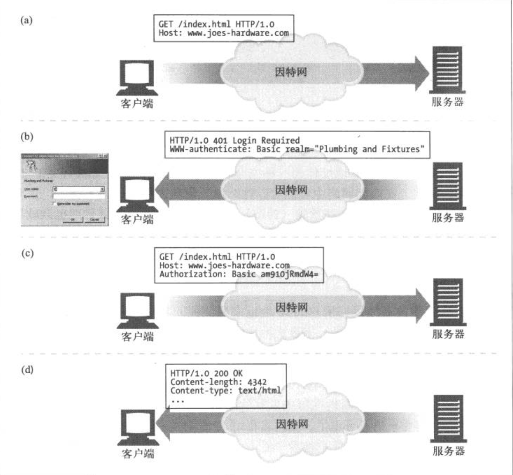

上图过程如下：
+ 浏览器对站点发起了一条请求。
+ 站点并不知道这个用户的身份。因此，服务器返回 401 Login Required HTTP 响应码，并添加 WWW-Authentication 首部，要求用户登录。这样，浏览器就会弹出一个登录对话框。
+ 只要用户输入了用户名和密码（对其身份进行完整性检查），浏览器就会重复原来的请求。这次它会添加一个 Authorization 首部，说明用户名和密码。对用户名和密码进行加密，防止那些有意无意的网络观察者看到。
+ 现在，服务器已经知道用户的身份了。
+ 今后的请求要使用用户名和密码时，浏览器会自动将存储下来的值发送出去，甚至在站点没有要求发送的时候也经常会向其发送。浏览器器在每次请求中都向服务器发送 Authorization 首部作为一种身份的标识，这样，只要登录一次，就可以在整个会话期间维持用户的身份了。

但是，登录多个 Web 站点是很繁琐的。从一个站点浏览到另一个站点的时候，需要在每个站点上登录。这就造成了麻烦。（用户很可能放弃）

### 胖 URL
有些 Web 站点会为每个用户生成特定版本的 URL 来追踪用户的身份。通常，会对真正的 URL 进行扩展，在 URL 路径开始或结束的地方添加一些状态信息。用户浏览站点时，Web 服务器会动态生成一些超链，继续维护 URL 中的状态信息。

改动后包含了用户状态信息的 URL 被称为胖 URL（fat URL）。下面是一个某电子商务网站使用的一些胖 URL 实例。每个 URL 都附加了一个用户特有的标识码（在这个例子中就是 002-1145265-8016838），这个标识码有助于在用户浏览商店内容时对其进行追踪。
```
    <a href="/exec/obidos/tg/browse/-/229220/ref=gr_gifts/002-1145265-8016838">All Gifts></a><br>
    <a href="/exec/obidos/wishlist/ref=gr_pll_/002-1145265-8016838">Wish List></a><br>
```

可以通过胖 URL 将 Web 服务器上若干个独立的 HTTP 事务捆绑成一个”会话“或”访问“。用户首次访问这个 Web 站点时，会生成一个唯一的 ID，用服务器可以识别的方式将这个 ID 添加到 URL 中去，然后服务器就会将客户端重新导向这个胖 URL。不论什么时候，只要服务器收到了对胖 URL 的请求，就可以去查找与那个用户 ID 相关的所有增量状态（购物车、简介等），然后重写所有的输出超链，使其称为胖 URL，以维护用户的 ID。

可以在用户浏览站点时，用胖 URL 对其进行识别。但这种技术存在几个很严重的问题。
+ 丑陋的 URL。浏览器中显示的胖 URL 会给新用户带来困扰。
+ 无法共享 URL。胖 URL 中包含了与特定用户和会话有关的状态信息。如果将这个 URL 发送给其他人，可能就在无意中将你积累的个人信息都共享出去了。
+ 破坏缓存。为每个 URL 生成用户特有的版本就意味着不再有可供公共访问的 URL 需要缓存了。
+ 额外的服务器负荷。服务器需要重写 HTML 页面使 URL 变胖。
+ 逃逸口。用户跳转到其他站点或者请求一个特定的 URL 时，就很容易在无意中”条例“胖 URL 会话。只有当用户严格地追随预先修改过的链接时，胖 URL 才能工作。如果用户逃离此链接，就会丢失他的进展（可能是一个已经装满了东西的购物车）信息，得重新开始。
+ 在会话期间是非持久的。除非用户收藏了特定的胖 URL，否则用户退出登录时，所有的信息都会丢失。

### Cookie
cookie 是当前识别用户，实现持久会话的最好方式。前面各种技术中存在的很多问题对它们都没什么影响，但是通常会将它们与那些技术公用，以实现额外的价值。cookie 最初是由网景公司开发的，但现在所有主要的浏览器都支持它。

#### cookie 的类型
可以笼统地将 cookie 分为两类：会话 cookie 和 持久 cookie。会话 cookie 是一种临时 cookie，它记录了用户访问站点时的设置和偏好。用户退出浏览器时，会话 cookie 就被删除了。持久 cookie 的生存时间更长一些，它们存储在硬盘上，浏览器退出，计算机重启时它们仍然存在。

会话 cookie 和持久 cookie 之间唯一的区别就是它们的过期时间。稍后我们会看到，如果设置了 Discard 参数，或者没有内置 Expires 或 Max-age 参数来说明扩展过期时间，这个 cookie 就是一个会话 cookie。

#### cookie 是如何工作的。
cookie 就像是服务器给用户贴的"嗨，我叫”的贴纸一样。用户访问一个 Web 站点时，这个 Web 站点就可以读取那个服务器贴在用户身上的所有贴纸。

用户首次访问 Web 站点时，Web 服务器对用户一无所知。Web 服务器希望这个用户会再次回来，所以想给这个用户“拍上“一个独有的 cookie，这样以后它就可以识别出这个用户了。cookie 包含了一个由 名字 = 值（name = value） 这样的信息构成的任意列表，并通过 Set-Cookie 或 Set-Cookie2 HTTP 响应（扩展）首部将其贴到用户身上去。如下图。

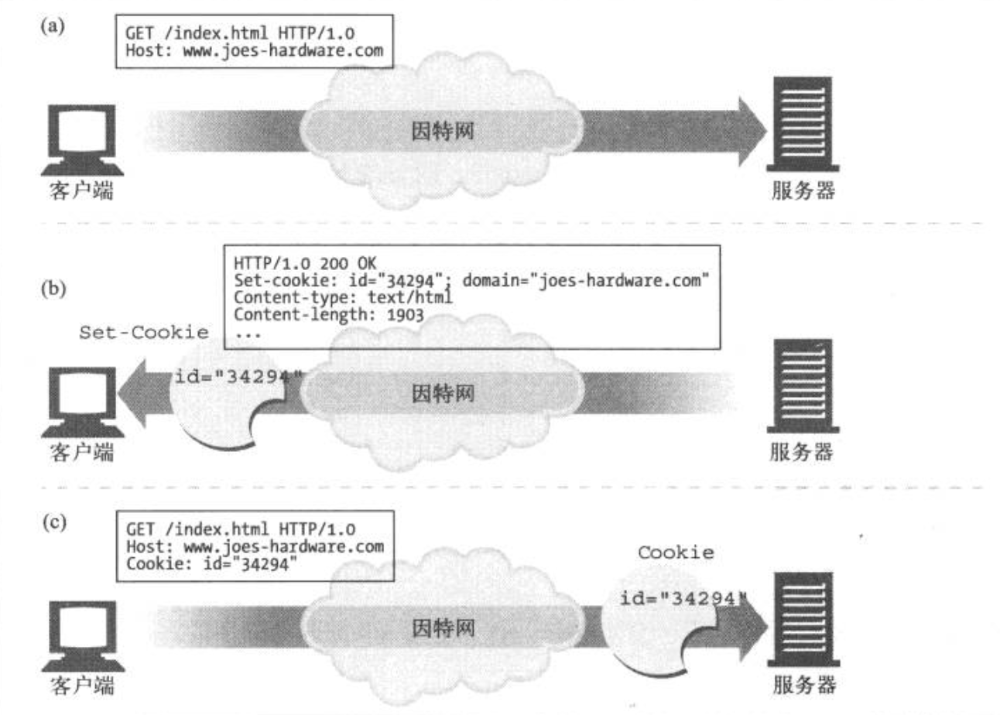

cookie 中可以包含任意信息，但它们通常都只包含一个服务器为了跟踪而产生的独特的识别码。很多 Web 服务器都会将信息直接保存在 cookie 中，比如
```
    Cookie: name="Brian Totty"; phone="555-1212"
```

浏览器会记住从服务器返回的 Set-Cookie 或 Set-Cookie2 首部中的cookie 内容，并将 cookie 集存储在浏览器的 cookie 数据库中。将来用户返回同一站点时，浏览器会挑中哪个服务器铁道用户上的那些 cookie，并在一个 cookie 请求首部中将其传回去。

#### cookie 罐：客户端的状态
cookie 的基本思想就是**让浏览器积累一组服务器特有的信息，每次访问服务器时都将这些信息提供给它**。因为浏览器要负责存储 cookie 信息，所以此系统被称为客户端侧状态（client-side state）。这个 cookie 规范的正式名称为 HTTP 状态管理机制（HTTP state management mechanism）。

#### 不同站点使用不同的 cookie
浏览器内部的 cookie 罐中可以有成百上千个 cookie，但浏览器不会将每个 cookie 都发送给所有的站点。实际上，它们通常只向每个站点发送 2 ~ 3 个 cookie。原因如下。
+ 对所有这些 cookie 进行传输会严重降低性能。浏览器实际传输的 cookie 字节数要比实际的内容字节数多。
+ cookie 中包含的是服务器特有的名值对，所以对大部分站点来说，大多数 cookie 都只是无法识别的无用数据。
+ 将所有的 cookie 发送给所有站点会引发潜在的隐私问题，那些你并不信任的站点也会获得你只想发给其他站点的信息。

总之，浏览器只向服务器发送服务器产生的那些 cookie。

很多 Web 站点都会与第三方厂商达成协议，由其来管理广告。这些广告被做得像 Web 站点的一个组成部分，而且它们确实发送了持久 cookie。用户访问另一个由同一广告公司提供服务的站点时，（由于域是匹配的）浏览器就会再次回送早先设置的持久 cookie。营销公司可以将此技术与 Referer 首部结合，暗地里构建一个用户档案和浏览习惯的详尽数据集。现代的浏览器都允许用户对隐私特性进行设置，以限制第三方 cookie 的使用。

##### cookie 的域属性
产生 cookie 的服务器可以向 Set-Cookie 响应首部添加一个 Domain 属性来控制哪些站点可以看到那个 cookie。比如，下面的 HTTP 响应首部就是在高速浏览器将 cookie user=”mary17“ 发送给域”。airtravelbargains.com“中的所有站点。
```
    Set-cookie: user="mary17"; domain="airtravelbargains.com"
```

##### cookie 路径属性
cookie 规范甚至允许用户将 cookie 与部分 Web 站点关联起来。可以通过 Path 属性来实现这一功能，在这属性列出的 URL 路径前缀下所有 cookie 都是有效的。比如。
```
    Set-Cookie: pref=compact;domain="airtravelbargins.com"; path=/autos/

结合上面的例子，如果用户访问 http://www.airtravelbargains.com/specials.html，就只会获得这个 cookie。
    
    Cookie: user="mary17"

但如果访问 http://www.airtravelbargains.com/autos/cheapo/index.html，就会获得两个 Cookie。

    Cookie: user="mary17"
    Cookie: pref=compact
```

因此，cookie 就是由服务器贴到客户端上，由客户端维护的状态片段，只会回送给那些合适的站点。

#### cookie 版本0（Netscape）
最初的 cookie 规范是由网景公司定义的。这些”版本0“的 cookie 定义了Set-Cookie 响应首部、cookie 请求首部以及用于控制 cookie 的字段。版本 0 的 cookie 看起来如下所示。
```
    Set-Cookie: name=value [; expires=date] [; path=path] [;domain=domain] [;secure]

    Cookie: name1=value1 [;name2=value2] ...
```

版本 0 的 Set-Cookie 首部有一个强制性的 cookie 名和 cookie 值。后面跟着可选的 cookie 属性，中间由分号分隔。

Set-Cookie 属性  |  描述及实例
--------------  |  ----------
NAME=VALUE      | 强制的。NAME 和 VALUE 都是字符序列，除非包含在双引号内，否则不包括分号、都好、等号和空格。Web 服务器可以创建任意的 NAME=VALUE 关联，在后继对站点的访问中会将其送回到 Web 服务器:  Set-Cookie: customer=Mary
Expires         |  可选的。这个属性会指定一个日期字符串，用来定义 cookie 的实际生存期。一旦到了过期日期，就不再存储或发布这个 cookie 了。日期的格式为: Weekday, DD-Mon-YY HH:MM:SS GMT。唯一合法的时区是 GMT，各日期元素之间的分隔符一定要是长划线。如果没有指定 Expires, cookie 就会在用户会话结束时过期: Set-Cookie: foo=bar; expires= Wednesday,09-Nov-99 23:12:40 GMT
Domain          | 可选的。浏览器只向制定域中的服务器主机名发送 cookie。这样服务器就将 cookie 限制在了特定的域中。acme.com 域就与 anvil.acme.com 和 shipping.crate.acme.com 相匹配，但与 www.cnn.com 就不匹配了。只有指定域中的主机才能为一个域设置 cookie，这些域中至少要有两个或三个句号，以防止出现.com类似的顶级域。如果没有指定域，就默认为产生 Set-Cookie 响应的服务器的主机名: Set-Cookie: SHIPPING=FEDEX; domain="joes-hardware.com"
Path            | 可选的。通过这个属性可以为服务器上特定的文档分配 cookie。
Secure          | 可选的。如果包含了这一属性，就只有在 HTTP 使用 SSL 安全连接时才会发送 cookie Set-Cookie: private_id=519; secure

客户端发送请求时，会将所有与域、路径和安全过滤器相匹配的未过期 cookie 都发送给这个站点。所有 cookie 都被组合到一个 Cookie 首部中。
```
    Cookie: session-id=002-1145265-8016838; session-id-time=1007884800
```

#### cookie 版本 1 (RFC 2965)
RFC 2965 定义了一个 cookie 的扩展版本。这个版本 1 标准引入了 Set-Cookie2 首部和 Cookie2 首部，但它也能与版本 0 系统进行互操作。

RFC 2965 cookie 相比原始的网景公司的标准略微复杂一些，还未得到完全支持。主要改动包括下列内容。
+ 为每个 cookie 关联上解释性文本，对其目的进行解释。
+ 允许在浏览器退出时，不考虑过期时间，将 cookie 强制销毁。
+ 用相对秒数，而不是绝对日期来表示 cookie 的 Max-age。
+ 通过 URL 端口号，而不仅仅是域和路径来控制 cookie 的能力。
+ 通过 cookie 首部回送域、端口和路径过滤器（如果有的话）。
+ 为实现互操作性使用的版本号。
+ 在 Cookie 首部从名字中区分出附加关键字的 $ 前缀。


基本语法如下
```
    set-cookie      =       "Set-Cookie2:" cookies
    cookies         =       1#cookie
    cookie          =       NAME "=" VALUE *(";" set-cookie-av)
    NAME            =       attr
    VALUE           =       value
    set-cookie-av   =       "Comment" "=" value
                    |       "CommentURL" "=" <"> http_URL <">
                    |       "Discard"
                    |       "Domain" "=" value
                    |       "Max-Age" "=" value
                    |       "Path" "=" value
                    |       "Port" [ "=" <"> portlist <"> ]
                    |       "Secure"
                    |       "Version" "=" 1*DIGIT
    portlist        =       1#portnum
    portnum         =       1*DIGIT
```

#### Cookie 与会话跟踪
可以用 cookie 在用户与某个 Web 站点进行多项事务处理时对用户进行跟踪。电子商务 Web 站点用会话 cookie 在用户浏览时记录下用户的购物车信息。

如下图所示。
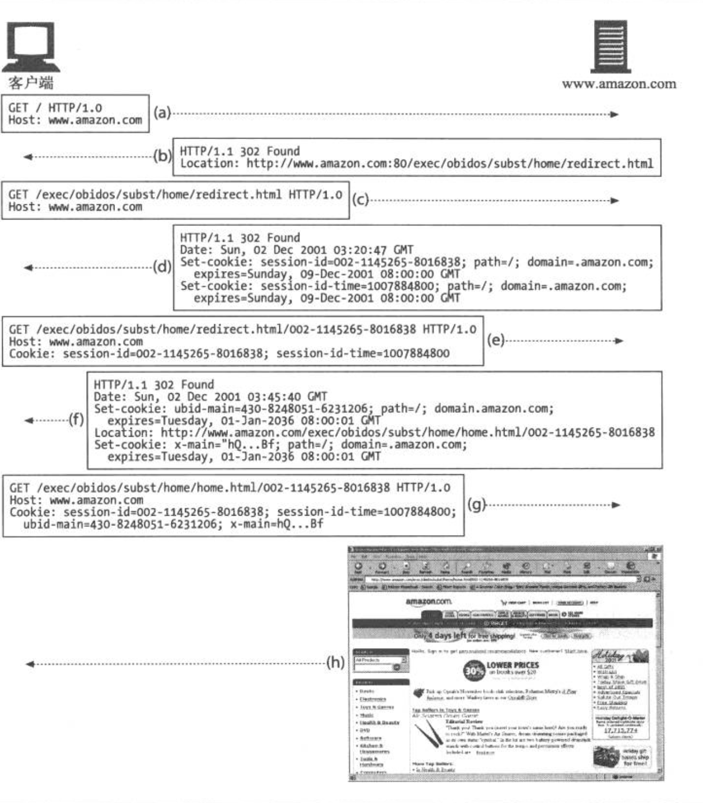

#### Cookie 与缓存
缓存那些与 Cookie 事务有关的文档时要特别小心。你不会希望给用户分配一个过去某些用户用过的 cookie，或者更糟糕的是，向一个用户展示其他人私有文档的内容。

cookie 和缓存的规则并没有很好地建立起来。下面是处理缓存时的一些指导性规则。
+ 如果无法缓存文档，要将其标示出来。文档的所有者最清楚文档是否是不可缓存的。如果文档不可缓存，就显式地注明。具体来说，如果除了 Set-Cookie 首部之外文档是可缓存的，就使用 Cache-Control: no-cache="Set-Cookie"。另一种更通用的做法是为可缓存文档使用 Cache-Control:public,这样有助节省 Web 中的带宽。
+ 缓存 Set-Cookie 首部时要小心。如果响应中有 Set-Cookie 首部，就可以对主体进行缓存（除非被告知不要这么做），但要特别注意对 Set-Cookie 首部的缓存。如果向多个用户发送了相同的 Set-Cookie 首部，可能会破坏用户的定位。

#### cookie、安全性和隐私
cookie 是可以禁止的，而且可以通过日志分析或其他方式来实现大部分跟踪记录，所以 cookie 自身并不是很大的安全隐患。实际上，可以通过提供一个标准的审查方法在远程数据库中保存个人信息，并将怒明 cookie 作为键值，来降低客户端到服务器的敏感数据传送频率。

但是，潜在的滥用情况总是存在的，所以，在处理隐私和用户跟踪信息时，最好还是要小心一些。第三方 Web 站点使用持久 coookie 来跟踪用户就是一种最大的滥用。将这种做法与 IP 地址和 Referer 首部信息结合在一起，这些营销公司就可以构建起相当精确的用户档案和浏览模式信息。

尽管有这么多负面的宣传，人们通常还是认为，如果能够小心地确认在向谁提供私人信息，并仔细查阅站点的额隐私政策，那么，cookie 会话处理和事务处理所带来的便利性要比大部分风险更重要。

## 基本认证机制
服务器需要通过某种方式来了解用户身份。一旦服务器知道了用户身份，就可以判定用户可以访问的事务和资源了。认证就意味着要证明你是谁。通常是通过提供用户名和密码来进行认证的。HTTP 为认证提供了一种原生工具。尽管我们可以在 HTTP 的认证形式和 cookie 基础之上”运行自己的“认证工具，但在很多情况下，HTTP 的原生认证功能就可以很好地满足要求。

### 认证
认证就是要给出一些身份证明。当出示像护照或驾照那样有照片的身份证件时，就给出了一些证据，说明你就是你所声称的那个人。在自动取款机上输出 PIN 码，或在计算机系统的对话框输入了密码时，也就是在证明你就是你所声称的那个人。

#### HTTP 的质询/响应认证框架
HTTP 提供了一个原生的质询/响应（challenge/response）框架，简化了对用户的认证过程。HTTP 的认证模型如下图所示。
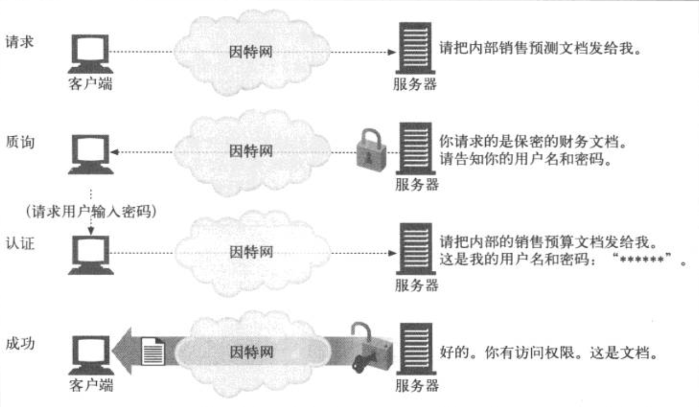

#### 认证协议与首部
HTTP 通过一组可定制的控制首部，为不同的认证协议提供了一个可扩展框架。下表列出的首部格式和内容会随认证协议的不同而发生变化。认证协议也是在 HTTP 认证首部中指定的。HTTP 定义了两个官方的认证协议: 基本认证和摘要认证。人们可以随意设计一些使用 HTTP 质询/响应框架的新协议。

步骤  |  首部  |  描述  | 方法/状态
---- | ------ | ----- | --------
请求  |                   | 第一条请求没有认证信息 | GET
质询  | WWW-Authenticate  | 服务器用 401 状态拒绝了请求，说明需要用户名和密码。服务器上可能会分为不同的区域，每个区域都有自己的密码，所以服务器会在 WWW-Authenticate 首部对保护区域进行描述。同样，认证算法也是在 WWW-Authenticate 首部中指定的。 | 401 Unauthorized
授权  | Authorization     | 客户端重新发出请求，但这一次会附加一个 Authorization 首部，用来说明认证算法、用户名和密码  | GET
成功  | Authentication-Info | 如果授权书是正确的，服务器就会将文档返回。有些授权算法会在可选的 Authentication-Info 首部返回一些与授权会话相关的附加信息  | 200 OK

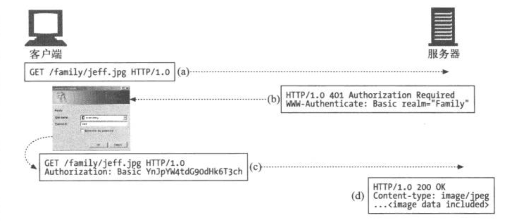

#### 安全域
HTTP 允许服务器为不同的资源使用不同的访问权限。Web 服务器会将受保护的文档组织成一个安全域（security realm)。每个安全域都可以有不同的授权用户集。

比如，假设 Web 服务器建立了两个安全域: 一个用于公司的财务信息，另一个用于个人家庭文档。不同的用户对各个安全域的访问权限是不同的。公司的 CEO 应该能够访问销售额预测资料，但不应该允许他访问员工和家人度假的照片。

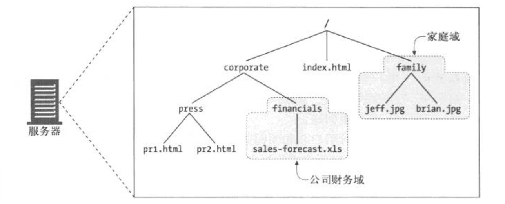

下面是一个假想的基本认证质询，它指定了一个域:
```
    HTTP/1.1 401 Unauthorized
    WWW-Authenticate: Basic realm="Corporate Financials"
    
    // 域应该有一个描述性的字符名，以帮助用户了解应该使用哪个用户名和密码。
```

### 基本认证
基本认证是最流行的 HTTP 认证协议。几乎每个主要的客户端和服务器都实现了基本认证机制。基本认证最初是在 HTTP/1.0 规范中提出的，但此后被移到了 RFC 2617 中，它详细介绍了 HTTP 的认证机制。在基本认证中，Web 服务器可以拒绝一个事务，质询客户端，请用户提供有效的用户名和密码。服务器会返回 401 状态码，而不是 200 状态码来初始化认证质询，并用 WWW-Authenticate 响应首部指定要访问的安全域。浏览器收到质询时，会打开一个对话框，请求用户输入这个域的用户名和密码。然后将用户名和密码稍加扰码，再用 Authorization 请求首部回送给服务器。

#### Base-64 用户名/密码编码
HTTP 基本认证将（由冒号分隔的）用户名和密码打包在一起，并用 Base-64 编码方式对其进行编码。Base-64 编码会将一个 8 位字节序列划分为一些 6 位的块。用每个 6 位的块在一个特殊的由 64 个字符组成的字母表中选择一个字符，这个字母表中包含了大部分字母和数字。具体示例如下图。

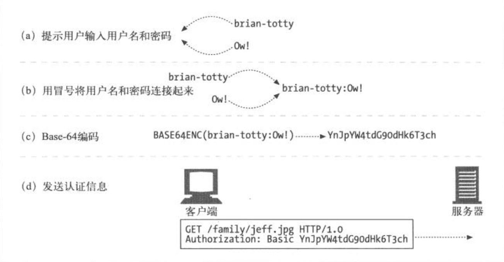

有些用户名和密码中会包含国际字符或其他在 HTTP 首部中非法的字符（比如引导、冒号、回车换行等），用Base-64 编码是非常有用的。Base-64 编码可以接受二进制字符串、文本、国际字符表示的数据，将其暂时转换成一个易移植的字母表以便传输。然后在远端就可以解码出原始字符串，而无需担心传输错误了。

#### 代理认证
中间的代理服务器也可以实现认证功能。有些组织会在用户访问服务器、LAN 或无线网络之前，用代理服务器对其进行认证。可以在代理服务器上对访问策略进行集中管理，因此，通过代理服务器提供对组织内部资源的统一访问控制是一种很便捷的方式。这个过程的第一步就是通过代理认证（proxy authentication）来识别身份。

代理认证的步骤与 Web 服务器身份验证的步骤相同。但首部和状态码都有所不同。如下表。
Web 服务器  |  代理服务器 
---------  |  ---------
Unauthorized status code: 401  | Unauthorized status code : 407
WWW-Authenticate               | Proxy-Authenticate
Authorization                  | Proxy-Authorization
Authentication-Info            | Proxy-Authentication-Info

### 基本认证的安全缺陷
基本认证简单便捷，但并不安全。只能用它来防止非恶意用户无意间进行的访问，或将其与 SSL 这样的加密技术配合使用。基本认证存在下列安全缺陷。
1. 基本认证会通过网络发送用户名和密码，这些用户名和密码都是以一种很容易解码的形式表示的。实际上，密码是以明文形式传输的，任何人都可以读取并将其捕获。虽然 Base-64 编码通过隐藏用户名和密码，致使友好的用户不太可能在进行网络观测时无意中看到密码，但 Base-64 编码的用户名和密码可以很轻易地通过反向编码过程进行解码，所以经过 Base-64 编码的密码实际上就是明文传送的。如果有动机的第三方用户有可能会去拦截基本认证发送的用户名和密码，就要通过 SSL 加密信道发送所有的 HTTP 事务，或者使用更安全的认证协议，比如摘要认证。
2. 即使密码是以更难解码的方式加密的，第三方用户仍然可以捕获被修改过的用户名和密码，并将修改过的用户名和密码一次一次地重放给原始服务器，以获得对服务器的访问权。没有什么措施可用来防止这些重放攻击。
3. 即使将基本认证用于一些不太重要的应用程序，比如公司内部网络的访问控制或个性化内容的访问，一些不良习惯也会让它变得很危险。很多用户由于受不了大量密码保护的服务，会在这些服务间使用相同的用户名和密码。
4. 基本认证没有提供任何针对代理和作为中间人的中间节点的防护措施，它们没有修改认证首部，但却修改了报文的其余部分，这样就严重地改变了事务的本质。
5. 假冒服务器很容易骗过基本认证。如果在用户实际连接到一台恶意服务器或网关的时候，能够让用户相信他连接的是一个受基本认证保护的合法主机，攻击者就可以请求用户输入密码，将其存储起来以备未来使用，然后捏造一条错误信息传送给用户。

## 摘要认证
基本认知便携灵活，但极不安全。用户名和密码都是以明文形式传送的，也没有采取任何措施防止对报文的篡改。**安全使用基本认证的唯一方式就是将其与 SSL 配合使用**。

摘要认证与基本认证兼容，但却更为安全。

### 摘要认证的改进
只要认证是另一种 HTTP 认证协议，它试图修复基本认证协议的严重缺陷。具体来说，摘要认证进行了如下改进。
+ 永远不会以明文方式在网络上发送密码
+ 可以防止恶意用户捕获并重放认证的握手过程。
+ 可以有选择地防止对报文内容的篡改。
+ 防范其他几种常见的攻击方式。

摘要认证并不是最安全的协议。摘要认证并不能满足安全 HTTP 事务的很多需求。对这些需求来说，使用传输层协议（Transport Layer Security，TLS）和安全 HTTP（Secure HTTP，HTTPS）协议更为合适一些。

#### 用摘要保护密码
摘要认证遵循的箴言是”绝不通过网络发送密码“。客户端不会发送密码，而是会发送一个”指纹“或密码的”摘要“，这是密码的不可逆扰码。客户端和服务器都知道这个密码，因此服务器可以验证所提供的摘要是否与密码相匹配。只拿到摘要的话，除了将所有的密码都拿来试试之外，没有其他办法可以找出摘要是来自哪个密码的。

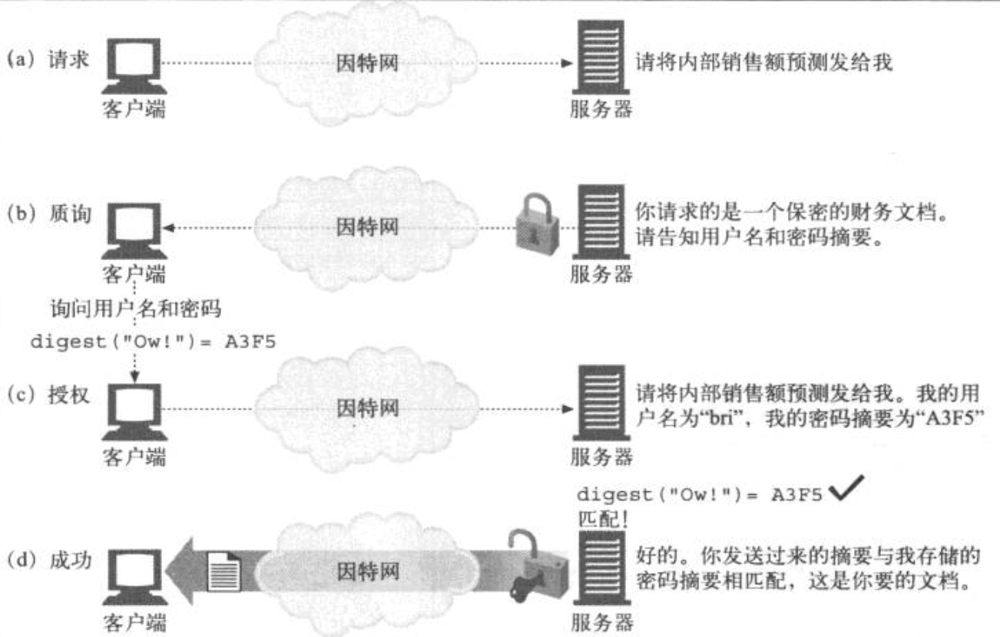

#### 单项摘要
摘要是 ”对信息主体的浓缩“。只要是一种单向函数，主要用于将无限的输入值转换为有限的浓缩输出值。常见的摘要函数 MD5，会将任意长度的字节序列转化为一个 128 位的摘要。MD5 输出的 128 位的摘要通常会被写成 32 个十六进制的字符，每个字符表示 4 位。

#### 用随机数防止重放攻击
使用单向摘要就无需以明文形式发送密码了。可以只发送密码的摘要，而且可以确信，没有哪个恶意用户能轻易地从只要中解码出原始密码。但是，仅仅隐藏密码并不能避免危险，因为即便不知道密码，别有用心的人也可以截获摘要，并一遍遍地重放给服务器。摘要和密码一样好用。为防止此类重放攻击的发生，服务器可以向客户端发送一个称为随机数（nonce）的特殊令牌，这个数会经常发生变化（可能是每毫秒,或者是每次认证都变化）。客户端在计算摘要之前要先将这个随机数令牌附加到密码上去。

在密码中加入随机数就会使摘要随着随机数的每一次变化而变化。记录下的密码摘要只对特定的随机值有效，而没有密码的话，攻击者就无法计算出正确的摘要，这样就可以防止重放攻击的发生。

摘要认证要求使用随机数，因为这个小小的重放弱点会使未随机化的摘要认证变得和基本认证一样脆弱。**随机数是从 WWW-Authenticate 质询中从服务器传送给客户端的。**

#### 摘要认证的握手机制
HTTP 摘要认证协议是一种升级版的认证方式。所用首部与基本认证类似。它在传统首部中添加了一些新的选项，还添加了一个新的可选首部 Authorization-Info。

下图描述了简化的摘要认证三步握手机制。

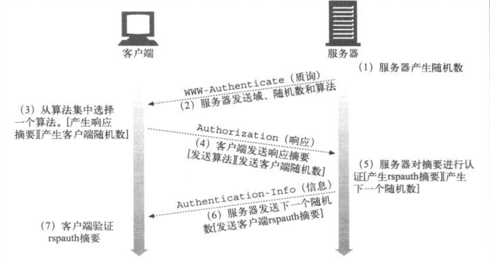

上图步骤简述如下。
1. 服务器计算出一个随机数。
2. 服务器将这个随机数放在 WWW-Authenticate 质询报文中，与服务器所支持的算法列表一同发往客户端。
3. 客户端选择一个算法，计算出密码和其他数据的摘要。
4. 将摘要放在一条 Authorization 报文中发回服务器。如果客户端要对服务器进行认证，可以发送客户端随机数。
5. 服务器接收摘要、选中的算法以及支撑数据，计算出与客户端相同的摘要，然后服务器将本地生成的摘要与网络传送过来的只要进行比较，验证其是否匹配。如果客户端反过来用客户端随机数对服务器进行质询，就会创建客户端摘要。服务器可以预先将下一个随机数计算出来，提前将其传递给客户端，这样下一次客户端就可以预先发送正确的摘要了。

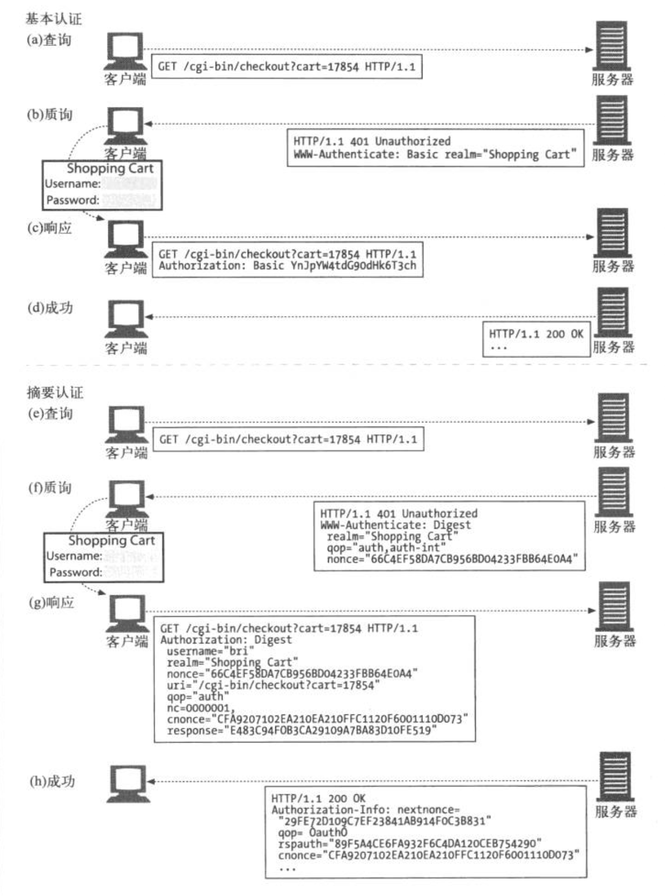

### 摘要的计算
摘要认证的核心就是对公共信息、保密信息和有时限的随机值这个组合的单向摘要。

#### 摘要算法的输入数据
摘要是根据以下三个组件计算出来的。
+ 由单向散列函数 H(d) 和摘要 KD(s, d) 组成的一对函数，其中 s 表示密码，d 表示数据。
+ 一个包含了安全信息的数据块，包括密码，称为 A1。
+ 一个包含了请求报文中非保密属性的数据块，称为 A2.
+ H 和 KD 处理两块数据 A1 和 A2，产生摘要。

#### 算法 H(d) 和 KD(s,d)
摘要认证支持对各种只要算法的选择。RFC 2617 建议的两种算法为 MD5 和 MD5-sess。如果没有指定其他算法，默认算法为 MD5。不管使用的是 MD5 还是 MD5-sess，都会用函数 H 来计算数据的 MD5，用摘要函数 KD 来计算以冒号连接的密码和非保密数据的 MD5。例如:
```
    H(<data>) = MD5(<data>)
    KD(<secret>, <data>) = H(consatenate(<secret>:<data>))
```

#### 与安全性相关的数据（A1）
被称为 A1 的数据块是密码和受保护信息的产物，它包含有用户名、密码、保护域和随机数等内容。A1 只设计安全性信息，与底层报文自身无关。A1 会与 H、KD 和 A2 一同用于摘要计算。RFC 2617 根据选择的算法定义了两种计算 AI 的方式。
+ MD5。为每条请求运行单向散列函数。A1 是由冒号连接起来的用户名，域以及密码三元组。
+ MD5-sess。只在第一次 WWW-Authenticate 握手时运行一次散列函数。对用户名、域和密码进行一次 CPU 密集型散列，并将其放在当前随机数和客户端随机数（cnonce）的前面。

算法  |  A1
---- | ----
MD5  | A1 = \<user>:\<realm>\<password>
MD5-sess | A1 = MD5(\<user>:\<realm>:\<password>):\<nonce>:\<cnonce>

#### 与报文有关的数据（A2）
数据块 A2 表示的是与报文自身有关的信息，比如 URL、请求方法和报文实体的主体部分。A2 有助于防止方法、资源或报文被篡改。A2 会与 H、KD 和 AI 一起用于摘要的计算。RFC 2617 根据所选择的保护质量（qop），为 A2 定义了两种策略。
+ 第一种策略只包含 HTTP 请求方法和 URL。当 qop=”auth“ 时使用这种策略，这是默认的情况。
+ 第二种策略添加了报文实体的主体部分，以提供一定程度的报文完整性检测。qop=”auth-int“时使用。

qop | A2
---- | -----
未定义| \<request-method>:\<uri-directive-value>
auth | \<request-method>:\<uri-directive-value>
auth-int | \<request-method>:\<uri-directive-value>:H(\<request-entity-body>)

request-method 是 HTTP 的请求方法。uri-directive-value 是请求行中的请求 URI。可能是个 *、absoluteURL 或者 abs_path，但它必须与请求 URI 一致。

#### 摘要认证会话
客户端响应对保护空间的 WWW-Authenticate 质询时，会启动一个此保护空间的认证会话（与受访问服务器的标准根结合在一起的域就定义了一个”保护空间“）。在客户端收到另一条来自保护空间的任意一台服务器的 WWW-Authenticate 质询之前，认证会话会一直持续。客户端应该记住用户名、密码、随机数、随机数计数以及一些与认证会话有关的隐晦值，以便将来在此保护空间中构建请求的 Authorization 首部时使用。

随机数过期时，即便老的 Authorization 首部所包含的随机数不再新鲜了，服务器也可以选择接受其中的信息。服务器也可以返回一个带有新随机数的 401 响应，让客户度阿奴重试这条请求；指定这个响应为 stale=true，表示服务器在告知客户端用新的随机数来重试，而不再重新提示输入新的用户名和密码了。

#### 预授权
在普通的认证方式中，事务结束之前，每条请求都要有一次请求/质询的循环。如果客户端实现知道下一个随机数是什么，就可以取消这个请求/质询循环，这样客户端就可以在服务器发出请求之前，生成正确的 Authorization 首部了。如果客户端能在服务器要求它计算 Authorization 首部之前将其计算出来，就可以预先将 Authorization 首部发送给服务器，而不用进行请求/质询了。

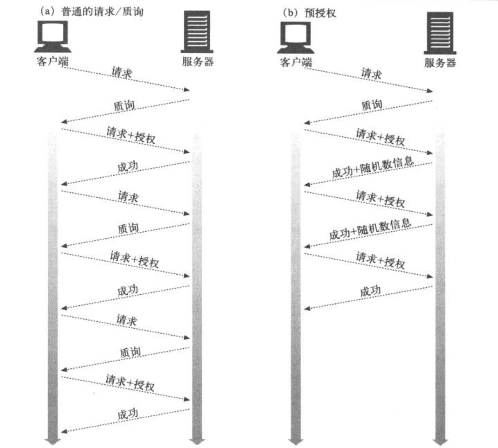

由于摘要认证使用了随机数技术来破坏重放共计，所以对摘要认证来说，预授权要稍微复杂一些。服务器会产生任意的随机数，所以在客户端收到质询之前，不一定总能判定应该发送什么用的 Authorization 首部。

摘要认证在保留了很多安全特性的同时，还提供了几种预授权方式。这里列出了几种个可选的方式。通过这些方式，客户端无需等待新的 WWW-Authenticate 质询，就可以获取正确的随机数。

##### 预先生成下一个随机数
服务器可以在 Authorization-Info 成功首部中将下一个随机数预先提供给客户端。这个首部是与前一次成功认证的 200 OK 响应一同发送的。
```
    Authentication-Info: nextnonce="<nonce-value>"
```
有了下一个随机数，客户端就可以预先发布 Authorization 首部了。

尽管这种预授权机制避免了请求/质询循环（加快了事务处理的速度），但实际上它也破坏了对同一台服务器的多条请求进行管道化的功能，因为在发布下一条请求之前，一定要收到下一个随机值才行。而管道化是避免延迟的一项基本技术，所以这样可能会造成很大的性能损失。

##### 受限先的随机数重用机制
另一种方法不是预先生成随机数序列，而是在有限的次数内重用随机数。比如，服务器可能允许将某个随机数重用 5 次，或者重用 10 秒。

在这种情况下，客户端可以随意发布带有 Authorization 首部的请求，而且由于随机数是是事先知道的，所以还可以对请求进行管道化。随机数过期时，服务器要向客户端发送 401 Unauthorized 质询，并设置 WWW-Authenticate:stale=true 指令。
```
    WWW-Authenticate:Digest
        realm="<realm-value>"
        nonce="<nonce-value>"
        stale="true"
```
重用随机数使得攻击者更容易成功地实行重放攻击。虽然这确实降低了安全性，但重用的随机数的生存期是可控的，所以应该可以在安全和性能之间找到平衡。

此外，还可以通过其他一些特性使重放共计变得更加困难，其中就包括增量计数器和 IP 地址测试。但这些技术只能使攻击的实施更加麻烦，并不能消除由此带来的安全隐患。

##### 同步生成随机数
还可以采用时间同步的随机数生成算法，客户端和服务器可根据共享的密钥，生成第三方无法轻易预测的、相同的随机数序列（比如安全 ID 卡）。

#### 对称认证
RFC 2617 扩展了摘要认证机制，允许客户端对服务器进行认证。这是通过提供客户端随机值来实现的，服务器会根据它对共享保密信息的正确了解生成正确的响应摘要。然后，服务器在 Authorization-Info 首部中将此只要返回给客户端。

### 安全性考虑
#### 首部篡改
为了提供一个简单明了的防首部篡改系统，要么就得进行端到端的加密，要么就得对首部进行数字签名，最好是两者的结合。摘要认证的重点在于提供一种防篡改的认证机制，但并不一定要将这种保护扩展到数据上去。具有一定保护级别的首部只有 WWW-Authenticate 和 Authorization。

#### 重放攻击
在当前的上下中，重放攻击指的就是有人将从某个事务中窃取的认证证书用于另一个事务。尽管对 GET 请求来说这也是个问题，但为 POST 和 PUT 请求提供一种简单的方式来避免重放攻击才是非常必要的。在传输表单数据的同时，成功重放原先用过的证书会引发严重的安全问题。

因此，为了使服务器能够接收”重放的“证书，还必须重复发送随机数。缓解这个问题的方法之一就是让服务器产生的随机数包含根据客户端 IP 地址、时间戳、资源 ETag 和私有服务器密钥算出的摘要。这样，IP 地址和一个短小超时值的组合就会给攻击者造成很大的障碍。

但这种解决方案有一个很重要的缺陷。用客户端 IP 地址来创建随机数会破坏经过代理集群的传输。在这类传输中，来自单个用户的多条请求可能会穿过不同的代理，而且，IP 欺骗也并不难实现。

一种可以完全避免重放攻击的方法就是为每个事务都使用一个唯一的随机数。在这种实现方式中，服务器会为每个事务发布唯一的随机数和超时值。发布的随机数只对指定的事务中有效，而且只在超时值的持续区间内有效。这种方式会增加服务器的负担，但这种负担可忽略不计。

#### 多重认证机制
服务器支持多重认证机制时，通常会在 WWW-Authenticate 首部提供选项。由于没有要求客户端选择功能最强的认证机制，所以得到的认证效果就和功能最弱的认证方案差不多。

要避免出现这个问题，最直接的方法就是让客户端总是去选择可用认证方案中功能最强的那个。如果无法实现（因为大部分人使用的都是商业化客户端），唯一的选择就是使用一个只维护最强认证方案的代理服务器。但只有在已知所有客户端都支持所选认证方案的区域中才能采用这种方式，比如，在公司网络中。

#### 词典攻击
词典攻击是典型的密码猜测型攻击方式。恶意用户对某个事务进行窃听，并对随机数/响应对使用标准的密码猜测程序。如果用户使用的是相对比较简单的密码，而且服务器使用的也是简单的随机数，它很可能会找到匹配项。如果没有密码过期策略，只要有足够的时间和破解密码所需的一次性费用，就很容易搜集到足够多的密码，造成实质性的破坏。除了使用复杂的相对难以破译的密码和合适的密码过期策略之外，确实没有什么好的方法可以解决这个问题。

#### 恶意代理攻击和中间人攻击
现在很多因特网流量都会在这个或那个地方流经某个代理。随着重定向技术和拦截代理的出现。用户甚至都意识不到他的请求穿过了某个代理。如果这些代理中有一个是恶意的或者容易被入侵的，就会使客户端置于中间人攻击之下。

这种攻击可以采用窃听的形式，也可以删除提供的所有选项，用最薄弱的认证策略（比如基本认证）来取代现有的认证机制，对其进行修改。

入侵受信代理的方式之一就是使用其扩展接口。有时代理会提供复杂的编程接口，可以为这类代理编写一个扩展（比如，plug-in）来拦截流量并对其进行修改。不过，数据中心和代理自身提供的安全性使得通过恶意 plug-in 进行中间人攻击的可能性变得很渺茫。

没有什么好的办法可以解决这个问题。可行的解决方案包括由客户端提供与认证功能有关的可见线索，对客户端进行配置使其总是使用可用认证策略中功能最强的那一种，等等。但即使使用的是最强大的认证策略，客户端仍然很容易被窃听。防止这些攻击唯一简便的方式就是使用 SSL。

#### 选择明文攻击
使用摘要认证的客户端会用服务器提供的随机数来生成响应。但如果中间有一个被入侵的或恶意的代理在拦截流量（或者有个恶意的原始服务器），就可以很容易地为客户端的响应计算提供随机数。使用已知密钥来计算响应可以简化响应的密码分析过程。这种方式被称为选择明文攻击（chosen plaintext attack）。选择明文攻击有以下几种变体形式。
+ 预先计算的词典攻击。这时词典攻击和选择明文攻击的组合。首先，发起攻击的服务器会用预先确定的随机数和常见密码的变化形式产生一组响应，创建一个词典。一旦有了规模可观的词典，攻击服务器或代理就可以完成对流量的封锁，向客户端发送预先确定的随机数。攻击者从客户端得到一个响应时，会搜索生成的词典，寻找匹配项。如果有匹配项，攻击者就捕获了这个用户的密码。
+ 批量暴力型攻击。批量暴力型攻击的不同之处在于计算密码的方式。它没有试图去匹配预先计算出来的摘要，而使用一组及其枚举了指定空间内所有可能的密码。随着及其运行速度变得越来越快，暴力型攻击的可行性也变得越来越强了。

总之，这些攻击所造成的威胁是很容易应对的。防止这些攻击的一种方法就是配置客户端使用可选的 cnonce 指令，这样响应就是基于客户端的判断产生的，而不是用服务器提供的随机数（这个随机数可能会被攻击者入侵）产生的。通过这种方法，再结合一些强制使用合理强密码的策略，以及一个好的密码过期策略，就可以完全消除选择明文攻击的威胁。

#### 存储密码
摘要认证机制将对比用户的响应与服务器内部存储的内容，通常就是用户名和 H（A1）元组队，其中 H(A1)是从用户名、域和密码的摘要中导出的。

与 Unix 机器中传统的密码文件不同，如果摘要认证密码文件被入侵了，攻击者马上就能够使用域中所有文件，不需要再进行解码了。消除这个问题的方法包括:
+ 就像密码文件中包含的是明文密码一样来保护它
+ 确保域名在所有域中是唯一的。这样，如果密码文件被入侵，所造成的破坏也只局限于一个特定的域中。包含主机和 domain 的全路径域名就可以满足这个要求。

## 安全 HTTP

### 保护 HTTP 的安全
人们会用 Web 事务来处理一些很重要的事情。如果没有强有力的安全保证，人们就无法安心地进行网络购物或使用银行业务。如果无法严格显示访问权限，公司就不能将重要的文档放在 Web 服务器之上。Web 需要一种安全的 HTTP 形式。

HTTP 的安全版本要高效、可移植且易于管理，不但能够适应不断变化的情况而且还应该能满足社会和政府的各项要求。我们需要一种能够提供下列功能的 HTTP 安全技术。
+ 服务器认证（客户端知道它们是在与真正的而不是伪造的服务器通话）
+ 客户端认证（服务器知道它们是在与真正的而不是伪造的客户端通话）
+ 完整性（客户端和服务器的数据不会被修改）
+ 加密（客户端和服务器的对话是私密的，无需担心被窃听）。
+ 效率（一个运行的足够快的算法，以便低端的客户端和服务器使用）。
+ 普适性（基本上所有的客户端和服务器都支持这些协议）。
+ 管理的可扩展性（在任何地方的任何人都可以立即进行安全通信）。
+ 适应性（能够支持当前最知名的安全方法）。
+ 在社会上的可行性（满足社会的政治文化需要）。

#### HTTPS
HTTPS 是最流行的 HTTP 安全形式。它是由网景公司首创的，所有主要的浏览器和服务器都支持此协议。使用 HTTPS 时，所有的 HTTP 请求和响应数据在发送到网络之前，都要进行加密。HTTPS 在 HTTP 下面提供了一个传输级的密码安全层，可以使用 SSL，也可以使用其后继者，传输层安全（Transport Layer Security，TLS）。

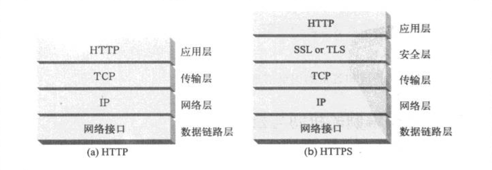

大部分困难的编码及解码工作都是在 SSL 库中完成的，所以 Web 客户端和服务器在使用安全 HTTP 时无需过多地修改其协议处理逻辑。

### 数字加密
数字加密主要包括如下内容。
+ 密码。对文本进行编码，使偷窥者无法识别的算法。
+ 密钥。改变密码行为的数字化参数。
+ 对称密钥加密系统。编解码使用相同密钥的算法。
+ 公开密钥加密系统。编解码是不同密钥的算法。
+ 数字签名。用来验证报文未被伪造或篡改的校验和。
+ 数字证书。由一个可信的组织验证和签发的识别信息。

#### 密码编制的机制与技巧
密码学是对报文进行编解码的机制与技巧。我们可以用它来防止对报文的篡改，或者证明某条报文或某个事务确实出自你手。

#### 密码
密码学基于一种名为密码（cipher）的秘密代码。密码是一套编码方案，一种特殊的报文编码方式和一种稍后使用的相应解码方式的结合体。加密之前的原始报文通常被称为明文（plaintext 或 cleartext）。使用了密码之后的编码报文通常被称作密文（ciphertext）。

### 对称密钥加密技术
对称密钥加密技术是指在编码时使用的密钥值和解码时一样（e=d)。在该技术中，发送端和接收端要共享相同的密钥 k 才能进行通信。发送端用共享的密钥来加密报文，并将得到的密文发送给接收端。接收端收到密文，并对其应用解密函数和相同的共享密钥，恢复出原始的明文。流行的对称密钥加密算法包括: DES、Triple-DES、RC2 和 RC4.

#### 密钥长度和枚举攻击
保持密钥的机密状态是很重要的。在很多情况下，编解码算法都是众所周知的，因此密钥就是唯一保密的东西了。好的加密算法会迫使攻击者试遍每一个可能的密钥，才能破解代码。用暴力去尝试所有的密钥值称为枚举攻击（enumeration attack）。

在传统的对称加密技术中，对小型的、不太重要的事务来说，40 位的密钥就足够安全了。但现在的高速工作站就可以将其破解，这些工作站每秒可进行数十亿次计算。相比之下，128 位的密钥被认为是非常强大的。

#### 建立共享密钥
**对称密钥加密技术的缺点之一就是发送者和接收者在互相对话之前，一定要有一个共享的保密密钥。**

### 公开密钥加密技术
公开密钥加密技术没有为每对主机使用单独的加密/解密密钥，而是使用了两个非对称密钥: 一个用来对主机报文编码，另一个用来对主机报文解码。编码密钥是众所周知的，但只有主机才知道私有的解密密钥。这样，每个人都能找到某个特定主机的公开密钥，密钥的建立变得更加简单。但解码密钥是保密的，因此只有接收端才能对发送给它的报文进行解码。

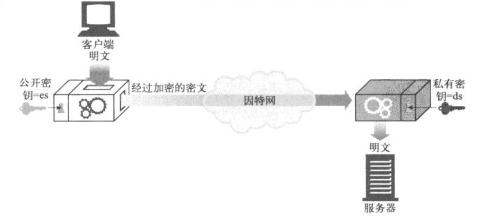

#### RSA
所有公开密钥非对称加密系统所面临的共同挑战是，要确保即便有人拥有了下面所有的线索，业务计算出保密的私有密钥:
+ 公开密钥（是公有的，所有人都可以获得）
+ 一小片拦截下来的密文（可通过对网络的嗅探获取）
+ 一条报文及与之相关的密文（对任意一段文本运行加密器就可以得到）

RSA 算法就是一个满足了所有这些条件的流行的公开密钥加密系统。

#### 混合加密系统和会话密钥
任何人只要知道了其公开密钥，就可以向一台公共服务器发送安全报文，所以非对称的公开密钥加密系统是很好用的。两个节点无须为了进行安全的通信而先交换私有密钥。

但**公开密钥加密算法的计算可能会很慢**。实际上它混合使用了对称和非对称策略。比如，比较**常见的做法是在两节点间通过便捷的公开密钥加密技术建立起安全通信，然后再用那条安全的通道产生并发送临时的随机对称密钥，通过更快的对称加密技术对其余的数据进行加密。**

### 数字签名
除了加解密报文之外，还可以用加密系统对报文进行签名（sign），以说明是谁编写的报文，同时证明报文未被篡改过。这种技术被称为数字签名（digital signing）。

#### 签名是加了密的校验和
数字签名是附加在报文上的特殊加密校验码。使用数字签名有以下两个好处。
+ 签名可以证明是作者编写了这条报文。只有作者才会有最机密的私有密钥，因此，只有作者才能计算出这些校验和。校验和就像来自作者的个人”签名“一样。
+ 签名可以防止报文被篡改。如果有恶意攻击者在报文传输过程中对其进行了修改，校验和就不再匹配了。由于校验和只有作者保密的私有密钥才能产生，所以攻击者无法为篡改了的报文伪造出正确的校验码。

数字签名通常是用非对称公开密钥技术产生的。因为只有所有者才知道其私有密钥，所以可以将作者私有密钥当做一种”指纹“使用。下图展示了数字签名的过程。

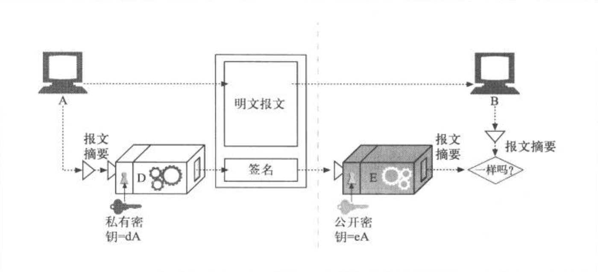

+ 节点 A 将变长报文提取为定长的摘要。
+ 节点 A 对摘要应用了一个 ”签名“函数，这个函数会将用户的私有密钥作为参数。因为只有用户才知道私有密钥，所以正确的签名函数会说名签名者就是其所有者。由于解码函数 D 中包含了用户的私有密钥，所以我们将其作为签名函数使用。
+ 一旦计算出签名，节点 A 就将其附加在报文的末尾，并将报文和签名都发送给 B。
+ 在接收端，如果节点 B 需要确定报文确实是节点 A 写的，而且没有篡改过，节点 B 就可以对签名进行检查。节点 B 接收经有密钥扰码的签名，并应用了使用公开密钥的反函数。如果拆包后的摘要与节点 B 自己的只要版本不匹配，要么就是报文在传输过程中被篡改了，要么就是发送端没有节点 A 的私有密钥（也就是说它不是节点 A）。

### 数字证书
数字证书中包含了由某个受信任组织担保的用户或公司的相关信息。数字证书中还包含一组信息，所有这些信息都是由一个官方的”证书颁发机构“以数字方式签发的。基本的数字证书中通常包含一些纸质 ID 中常见的内容。比如: 
+ 对象的名称（人、服务器、组织等）
+ 过期时间；
+ 证书发布者（由谁为证书担保）
+ 来自证书发布者的数字签名。

而且，数字证书通常还包括对象的公开密钥，以及对象和所用签名算法的描述性信息。任何人都可以创建一个数字证书，但并不是所有人都能够获得受人尊敬的签发权，从而为证书信息担保，并用其私有密钥签发证书。下图展示了一种典型的证书结构。

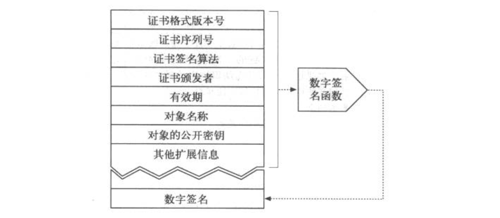

#### X.509 v3 证书
数字证书没有单一的全球标准。但 X.509 v3 是目前大多数证书使用的标准格式。X.509 v3 证书提供了一种标准的方式，将证书信息规范至一些可解析字段中。不同类型的证书有不同的字段值。下表展示了 X.509 证书中的字段信息。
字段 | 描述
---- | -----
版本    | 这个证书的 X.509 证书版本号，现在使用的通常都是版本 3
序列号   | 证书颁发机构（CA）生成的唯一证书。CA 生成的每个证书都要有一个唯一的序列号。
签名算法 ID | 签名所使用的加密算法。例如，"用 RSA 加密的 MD2 摘要”
证书颁发者  | 发布并签署这个证书的组织名称，以 X.500 格式表示
有效期     | 此证书何时有效，由一个起始日期和一个结束日期来表示
对象名称    | 证书中描述的实体，比如一个人或一个组织。对象名称是以 X.500 格式表示的
对象的公开密钥信息 | 证书对象的公开密钥，公开密钥使用的算法，以及所有附加参数
发布者唯一的 ID  | 可选的证书发布者唯一标识符，这样就可以重用相同的发布者名称
对象唯一的 ID  | 可选的证书对象唯一标识符，这样就可以重用相同的对象名称了
扩展          | 可选的扩展字段集（在版本 3 及更高的版本中使用）。每个扩展字段都被标识为关键或非关键的。关键扩展非常重要，证书使用者一定要能够理解。如果证书使用者无法识别出关键扩展字段，就必须拒绝这个证书。目前在使用的常用扩展字段包括：基本约束、对象与证书颁发机构的关系、证书策略、授予证书的策略、密钥的使用、对公开密钥使用的限制。
证书的颁发机构签名 | 证书颁发机构用指定的签名算法对上述所有字段进行的数字签名。

基于 X.509 证书的签名有好几种。其中包括 Web 服务器证书、客户端电子邮件证书、软件代码签名证书和证书颁发机构证书。

#### 用证书对服务器进行认证
通过 HTTPS 建立了一个安全 Web 事务之后，现代的浏览器都会自动获取所连接服务器的数字证书。如果服务器没有证书，安全连接就会失败。服务器证书中包含有很多字段，其中包括：
+ Web 站点的名称和主机名
+ Web 站点的公开密钥
+ 签名颁发机构的名称
+ 来自签名办法机构的签名。

浏览器收到证书时会对签名颁发机构进行检查。如果这个机构是个很有权威的公共签名机构，浏览器可能已经知道其公开密钥了（浏览器会预先安装很多签名办法机构的证书）。如果对签名颁发机构一无所知，浏览器就无法确定是否应该信任这个签名颁发机构，它通常会向用户显示一个对话框，看看他是否相信这个签名发布者。签名发布者可能是本地的 IT 部门或软件厂商。

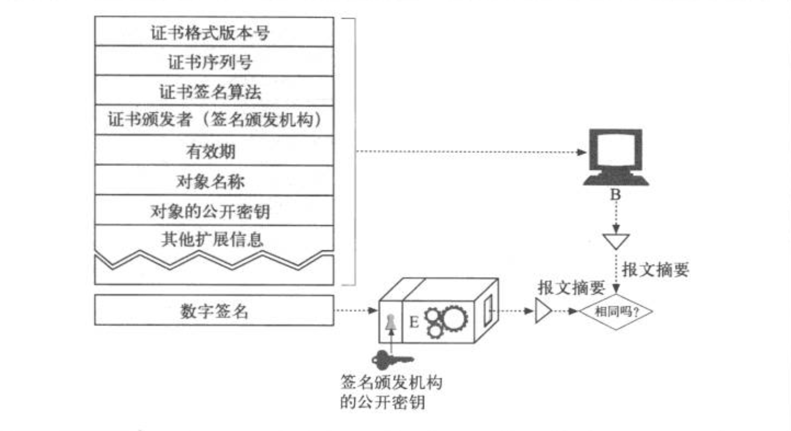

### HTTPS-细节介绍
HTTPS 是最常见的 HTTP 安全版本。它得到了广泛的应用，所有主要的商业浏览器和服务器上都提供 HTTPS。HTTPS 将 HTTP 协议与一组强大的对称、非对称和基于证书的加密技术结合在一起，使得 HTTPS 不仅很安全，而且很灵活，很容易在处于无序状态的、分散的全球互联网上进行管理。HTTPS 加速了因特网应用程序的成长，已经成为基于 Web 的电子商务快速成长的主要推动力。

#### HTTPS 概述
HTTPS 就是在安全的传输层上发送的 HTTP。HTTPS 没有将未加密的 HTTP 报文发送给 TCP，并通过世界范围内的因特网进行传输，它在将 HTTP 报文发送给 TCP 之前，现将其发送给了一个安全层，对其进行加密。现在，HTTP 安全层是通过 SSL 及其现代替代协议 TLS 来实现的。（术语 SSL 不区分 SSL 和 TLS）。


#### HTTPS 方案
现在，安全 HTTP 是可选的。因此，对 Web 服务器发起请求时，我们需要有一种方式来告知 Web 服务器去执行 HTTP 的安全协议版本。这是在 URL 的方案中实现的。比如：
```
    https://www.baidu.com
```

请求一个客户端对 Web 资源执行某事务时，它会去检查 URL 的方案。
+ 如果 URL 的方案为 http，客户端就会打开一条到服务器端口为 80 的连接，并向其发送老的 HTTP 命令。
+ 如果 URL 的方案为 https，客户端就会打开一条到服务器端口为 443 的连接，然后与服务器 “握手”，以二进制格式与服务器交换一些 SSL 安全参数，附上加密的 HTTP 命令。

SSL 是个二进制协议，与 HTTP 完全不同，其流量是承载在另一个端口上的（SSL 通常是由端口 443 承载的）。如果 SSL 和 HTTP 流量都从端口 80 到达，大部分 Web 服务器会将二进制 SSL 流量理解为错误的 HTTP 并关闭连接。将安全服务进一步整合到 HTTP 层中去就无需使用多个目的端口了，在实际中这样不会引发严重的问题。

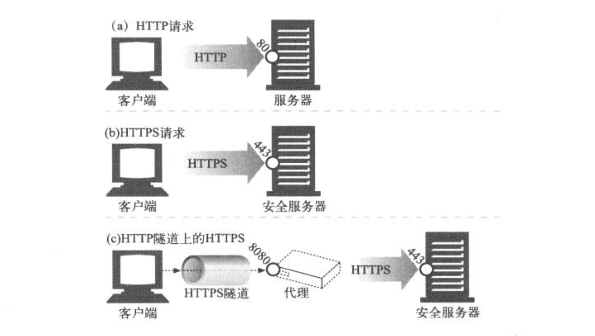

#### 建立安全传输
在未加密 HTTP 中，客户端会打开一条到 Web 服务器端口 80 的 TCP 连接，发送一条请求报文，接收一条响应报文，关闭连接。

由于 SSL 安全层的存在，HTTPS 中这个过程会略微复杂一些。在 HTTPS 中，客户端首先打开一条到 Web 服务器端口 443 的连接。一旦建立了 TCP 连接，客户端和服务器就会初始化 SSL 层，对加密参数进行沟通，并交换密钥。握手完成之后，SSL 初始化就完成了，客户端就可以将请求报文发送给安全层了。在将这些报文发送给 TCP 之前，要先对其进行加密。

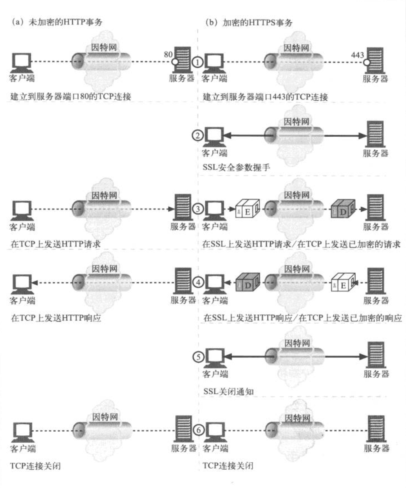

#### SSL 握手
在发送已加密的 HTTP 报文之前，客户端和服务器要进行一次 SSL 握手，在这个握手过程中，它们要完成以下工作：
+ 交换协议版本号
+ 选择一个两端都了解的密码
+ 对两端的身份进行认证
+ 生成临时的会话密钥，以便加密信道

下图是一个 SSL 握手的简化版本。

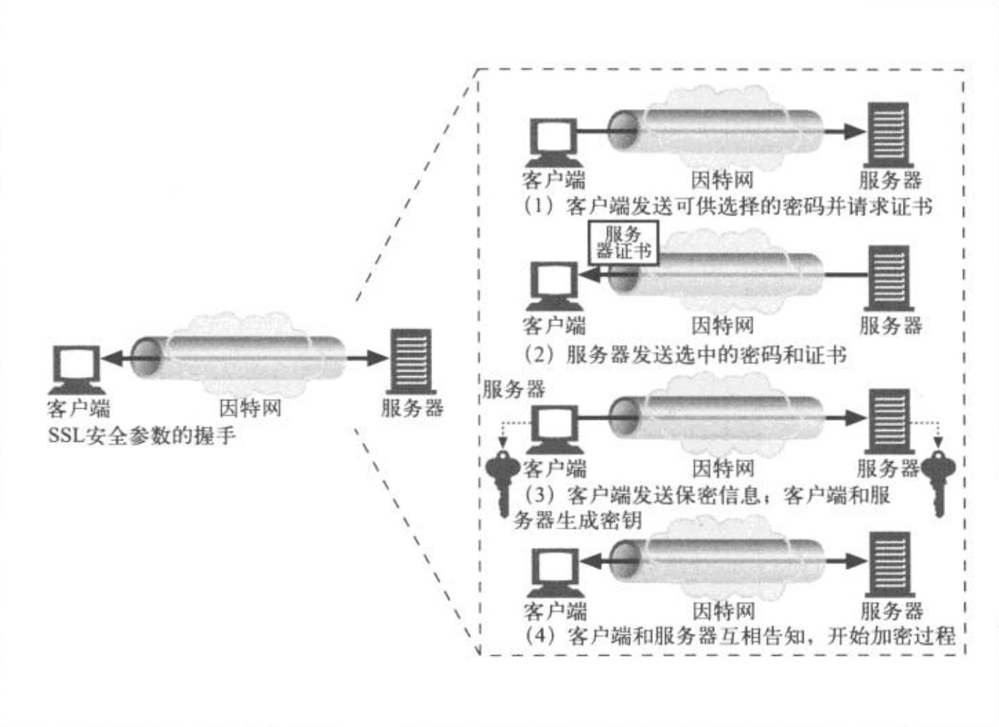

#### 服务器证书
SSL 支持双向认证，将服务器证书承载回客户端，再将客户端的证书回送给服务器。而现在，浏览时并不经常使用客户端证书。大部分用户甚至都没有自己的客户端证书。服务器可以要求使用客户端证书，但实际中很少出现这种情况。

另一方面，**安全 HTTPS 事务总是要求使用服务器证书的**。在一个 Web 服务器上执行安全事务，比如提交信用卡信息时，你总是希望是在与你所认为的那个组织对话。由知名权威机构签发的服务器证书可以帮助你在发送信用卡或私人信息之前评估你对服务器的信任度。

服务器证书是一个显示了组织的名称、地址、服务器 DNS 域名以及其他信息的 X.509 v3 派生证书。你和你所用的客户端软件可以检查证书，以确保所有的信息的可信的。

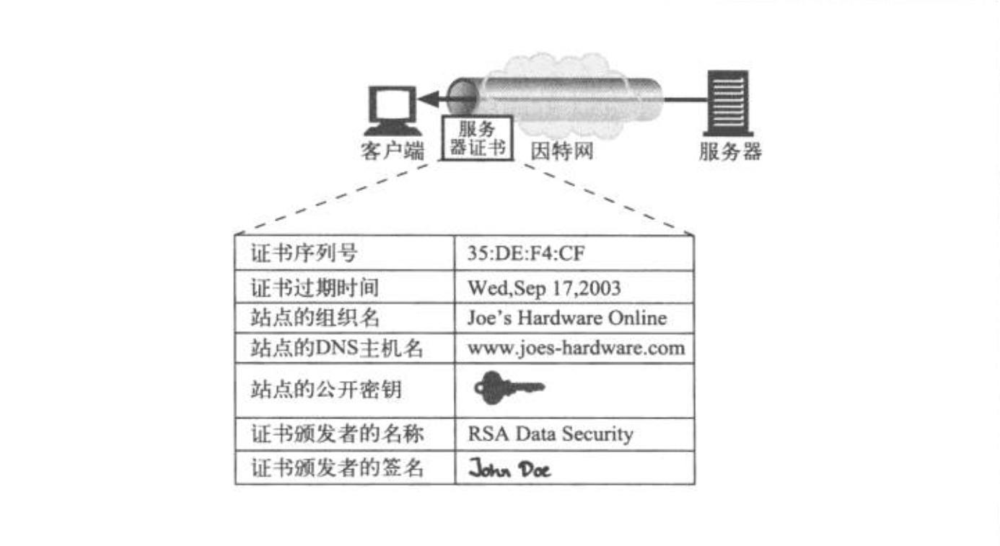

#### 站点证书的有效性
SSL 自身不要求用户检查 Web 服务器证书，但大部分现代浏览器都会对证书进行简单的完整性检查，并为用户提供进行进一步彻查的手段。网景公司提出的一种 Web 服务器证书有效性算法是大部分浏览器有效性验证技术的基础。验证步骤如下所述。
+ 日期检测。首先，浏览器检查证书的起始日期和结束日期，以确保证书仍然有效。如果证书过期了，或者还未被激活，则证书有效性验证失败，浏览器显示一条错误信息。
+ 签名颁发者可信度检测。每个证书都是由某些证书颁发机构（CA）签发的，它们负责为服务器担保。证书有不同的等级，每种证书都要求不同级别的背景验证。比如，如果申请某个电子商务服务器证书，通常需要提供一个营业的合法证明。所有人都可以生成证书，但有些 CA 是非常著名的组织，它们通过非常清晰的流程来验证证书申请人的身份及商业行为的合法性。因此，浏览器会附带一个签名颁发机构的受信列表。如果浏览器收到了某未知颁发机构签发的证书，那它通常会显示一条警告信息。有些证书会携带到受信 CA 的有效签名路径，浏览器可能会选择接受所有此类证书。换句话说，如果某受信 CA 为“Sam 的签名商店“ 签发了一个证书，而 Sam 的签名商店也签发了一个站点证书，浏览器可能会将其作为从有效 CA 路径导出的证书接受。
+ 签名检测。一旦判定签名授权是可信的，浏览器就要对签名颁发机构的公开密钥，并将其与校验码进行比较，以查看证书的完整性。
+ 站点身份检测。为防止服务器复制其他人的证书，或拦截其他人的流量，大部分浏览器都会试着去验证证书中的域名与它们所对话的服务器的域名是否匹配。服务器证书中通常都包含一个域名。但有些 CA 会为一组或一群服务器创建一些包含了服务器名称列表或通配域名的证书。如果主机名与证书中的标识符不匹配，面向用户的客户端要么就去通知用户，要么就以表示证书不正确的差错报文来终止连接。

#### 虚拟主机与证书
对虚拟主机（一台服务器上有多个主机名）站点上安全流量的处理有时是很棘手的。有些流行的 Web 服务器程序只支持一个证书。如果用户请求的是虚拟主机名，与证书名称并不严格匹配，浏览器就会显示警告框。

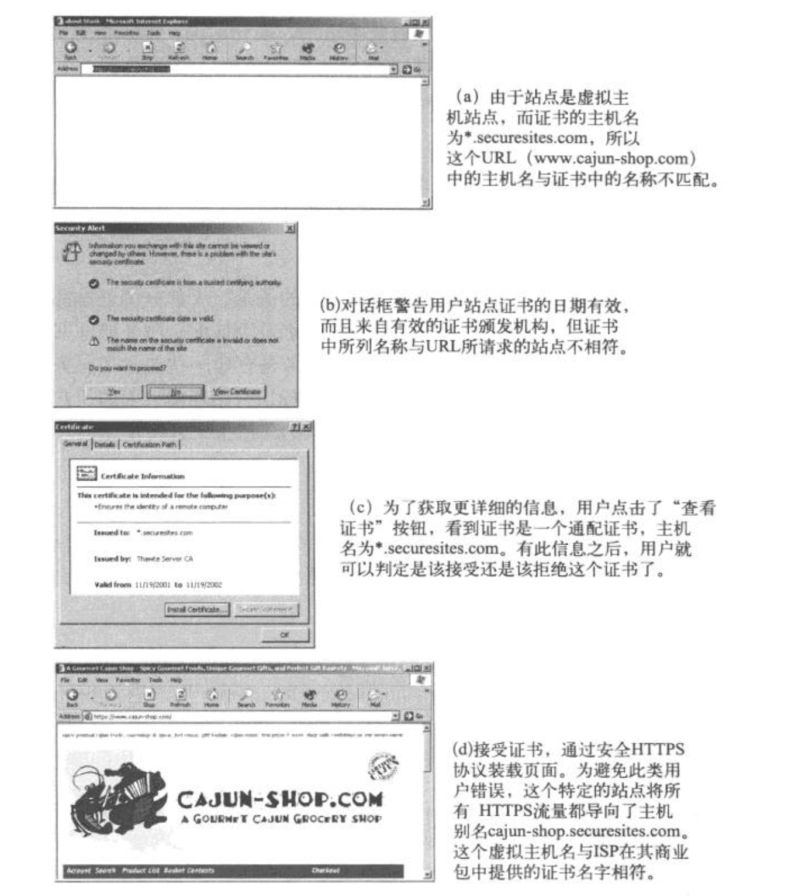

### HTTPS 客户端实例
SSL 是个复杂的二进制协议，除非你是密码专家，否则就不应该直接发送原始的 SSL 流量。通常，借助一些商业或开源的库，编写 SSL 客户端和服务器并不十分困难。

#### OpenSSL
OpenSSL 是 SSL 和 TLS 最常见的开源实现。OpenSSL 项目由一些志愿者合作开发，目标是开发一个强壮的、具有完备功能的商业级工具集，以实现 SSL 和 TLS 协议以及一个全功能的通用加密库。

### 通过代理以隧道形式传输安全流量
客户端通常会用 Web 代理服务器代表它们来访问 Web 服务器。比如，很多公司都会在公司网络和公共因特网的安全边界上放置一个代理。代理是防火墙路由器唯一允许进行 HTTP 流量交换的设备，它可能会进行病毒检测或其他的内容控制工作。但只要客户端开始用服务器的公开密钥对发往服务器的数据进行加密，代理就再也不能读取 HTTP 首部了。代理不能读取 HTTP 首部，就无法知道应该将请求转向何处了。

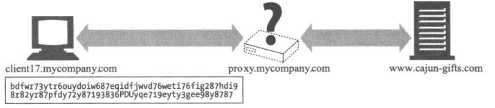

为了使 HTTPS 与代理配合工作，要进行几处修改以告知代理连接到何处。一种常用的技术就是 HTTPS SSL 隧道协议。使用 HTTPS 隧道协议，客户端首先要告知代理，它想要连接的安全主机和端口。这是在开始加密之前，以明文形式告知的，所以代理可以理解这条信息。

HTTP 通过新的名为 CONNECT 的扩展方法来发送明文形式的端点信息。CONNECT 方法会告诉代理，打开一条到所期望主机和端口号的连接。这项工作完成之后，直接在客户端和服务器之间以隧道形式传输数据。CONNECT 方法就是一条单行的文本命令。它提供了由冒号分隔的安全原始服务器的主机名和端口号。host:port 后面跟着一个空格和 HTTP 版本字符串，再后面是 CRLF。接下来是零个或多个 HTTP 请求首部行，后面跟着一个空行。空行之后，如果建立连接的握手过程成功完成，就可以开始传输 SSL 数据了。下面是一个例子:
```
    CONENCT home.netscape.com:443 HTTP/1.0
    User-agent: Mozilla/1.1N
    <raw SSL-encrypted data would follow here...>
```
在请求中的空行之后，客户端会等待来自代理的响应。代理会对请求进行评估，确保它是有效的，而且用户有权请求这样一条连接。如果一切正常，代理会建立一条到目标服务器的连接。如果成功，就向客户端发送一条 200 Connection Established 响应。
```
    HTTP/1.0 200 Connection established
    Proxy-agent: Netscape-Proxy/1.1
```