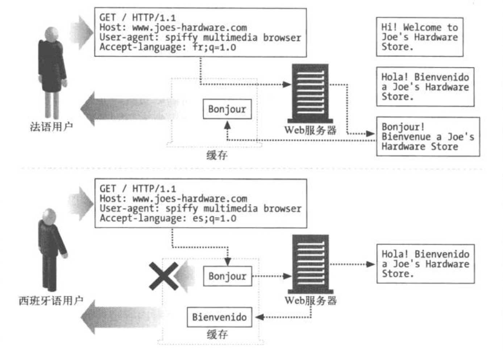

# HTTP 权威指南

## 实体和编码
每天都有数以亿计的各种媒体对象经由 HTTP 传送，如图像、文本、影片以及软件程序等，只要你能叫出名字，HTTP 就可以传送。HTTP 还会确保它的报文被正确传送，识别，提取以及适当处理。具体说来，HTTP 要确保它所承载的”货物“满足以下条件。
+ 可以被正确地识别（通过 Content-Type 首部说明媒体格式，Content-Language 首部说明语言），以便浏览器和其他客户端能正确处理内容。
+ 可以被正确地解包（通过 Content-Length 首部和 Content-Encoding 首部）。
+ 是最新的（通过实体验证码和缓存过期控制）
+ 符合用户的需要（基于 Accept 系列的内容协商首部）
+ 在网络上可以快速有效地传输（通过范围请求、差异编码以及其他数据压缩方法）
+ 完整到达、未被篡改（通过传输编码首部和 Content-MD5 校验和首部）

为了实现这些目标，HTTP 使用了完善的标签来描述承载内容的实体。

### 报文是箱子，实体是货物
如果把 HTTP 报文想象成因特网货运系统中的箱子，那么 HTTP 实体就是报文中实际的货物。


实体首部指出这是一个纯文本文档（Content-Type:text/plain)，它只有 18 个字节长（Content-Length: 18)。一个空白行（CRLF）把首部字段同主体的开始部分分隔开来。

HTTP 实体首部描述了 HTTP 报文的内容。HTTP/1.1 定义了以下几个基本实体首部字段。
+ Content-Type。实体中所承载对象的类型。
+ Content-Length。所传颂实体主体的长度或大小。
+ Content-Language。与所传送对象最相配的人类语言。
+ Content-Encoding。对象数据所做的任意变换（比如，压缩）。
+ Content-Location。一个备用位置，请求时可通过它获得对象。
+ Content-Range。如果这是部分实体，这个首部说明它是整体的哪个部分。
+ Content-MD5。实体主体内容的校验和。
+ Last-Modified。所传输内容在服务器上创建或最后修改的日期时间。
+ Expires。实体数据将要失效的日期时间。
+ Allow。该资源所允许的各种请求方法，例如，GET 和 HEAD。
+ ETag。这份文档特定实例的唯一验证码。ETag 首部没有正式定义为实体首部，但它对许多涉及实体的操作来说，都是一个重要的首部。
+ Cache-Control。指出应该如何缓存该文档。和 ETag 首部类似，Cache-Control 首部也没有正式定义为实体首部。

#### 实体主体
实体主体就是原始货物。任何其他描述性的信息都包含在首部中。因为实体主体只是原始数据，所以需要实体首部来描述数据的意义。例如，Content-Type 实体首部告诉我们如何去解释数据（是图像还是文本等），而 Content-Encoding 实体首部告诉我们数据是不是已被压缩或者重编码。

首部字段以一个空白的 CRLF 行结束，随后就是实体主体的原始内容。不管内容时什么，文本或二进制的、文档或图像、压缩的或未压缩的、英语、法语或日语，都紧随这个 CRLF 之后。

### Content-Length 实体的大小
Content-Length 首部指示出报文中实体主体的字节大小。这个大小是包含了所有内容编码的，比如，对文本文件进行了 gzip 压缩的话，Content-Length 首部就是压缩后的大小，而不是原始大小。

**除非使用了分块编码，否则 Content-Length 首部就是带有实体主体的报文必须使用的**。使用 Content-Length 首部是为了能够检测出服务器崩溃而导致的报文截尾，并对共享持久连接的多个报文进行正确分段。

#### 检测截尾
HTTP 的早期版本采用关闭连接的办法来规定报文的结束。但是，没有 Content-Length 的话，客户端无法区分到底是报文结束时正常的连接关闭，还是报文传输中由于服务器崩溃而导致的连接关闭。客户端需要通过 Content-Length 来检测报文截尾。

报文截尾的问题对缓存代理服务器来说尤其严重。如果缓存服务器收到被截尾的报文却没有识别出截尾的话，它可能会存储不完整的内容并多次使用它来提供服务。缓存代理服务器通常不会为没有显式 Content-Length 首部的 HTTP 主体做缓存，以此来减小缓存以截尾报文的风险。

#### 错误的 Content-Length
错误的 Content-Length 比缺少 Content-Length 还要糟糕。因为某些早期的客户端和服务器在 Content-Length 计算上存在一些众所周知的错误，有些客户端、服务器以及代理中就包含了特别的算法，用来检测和纠正与有缺陷服务器的交互过程。HTTP/1.1 规定用户 Agent 代理应该在接收且检测到无效长度时通知用户。

#### Content-Length 与持久连接
Content-Length 首部对于持久连接时必不可少的。如果响应通过持久连接传送，就可能有另一条 HTTP 响应紧随其后。客户端通过 Content-Length 首部就可以知道报文在何处结束，下一条报文从何处开始。因为连接是持久的，客户端无法依赖连接关闭来判别报文的结束。如果没有 Content-Length 首部，HTTP 应用程序就不知道某个实体主体在哪里结束，下一条报文从哪里开始。

有一种情况，使用持久连接可以没有 Content-Length 首部，即采用分块编码（chunked encoding）时。在分块编码的情况下，数据时分为一系列的块来发送的，每块都有大小说明。哪怕服务器在生成首部的时候不知道整个实体的大小（通常是因为实体是动态生成的），仍然可以使用分块编码传输若干已知大小的块。

#### 内容编码
HTTP 允许对实体主体的内容进行编码，比如可以使之更安全或进行压缩以节省空间。如果主体进行了内容编码，Content-Length 首部说明的就是编码后（encoded）的主体的字节长度，而不是未编码的原始主体的长度。

#### 确定实体主体长度的规则
下面列出的规则说明了在若干不同的情况下如何正确计算主体的长度和结束位置。这些规则应当按顺序应用，谁先匹配就用谁。
+ 如果特定的 HTTP 报文类型中不允许带有主体，就忽略 Content-Length 首部，它是对（没有实际发送出来的）主体进行计算的。这种情况下，Content-Length 首部是提示性的，并说明实际的主体长度。不允许带有主体的常见报文类型有：HEAD 响应、1XX、204 以及 304 响应等等。
+ 如果报文中含有描述传输编码的 Transfer-Encoding 首部（不采用默认的 HTTP ”恒等"编码），那实体就应由一个称为“零字节块”（zero-byte chunk）的特殊模式结束，除非报文已经因连接关闭而结束。
+ 如果报文中含有 Content-Length 首部（并且报文类型允许有实体主体），而且没有非恒等的 Transfer-Encoding 首部字段，那么 Content-Length 的值就是主体的长度。如果收到的报文中既有 Content-Length 首部字段又有非恒等的 Transfer-Encoding 首部字段，那就必须忽略 Content-Length，因为传输编码会改变实体主体的表示和传输方式（因此可能就会改变传输的字节数）。
+ 如果报文使用了 multipart/byterangs(多部分/字节范围)媒体类型，并且没有用 Content-Length 首部指出实体主体的长度，那么多部分报文中的每个部分都要说明它自己的大小。这种多部分类型是唯一的一宗自定界的实体主体类型，因此除非发送方知道接收方可以解析它，否则就不能发送这种媒体类型。
+ 如果上面的规则都不匹配，实体就在连接关闭的时候结束。实际上，只有服务器可以使用连接关闭来指示报文的结束。客户端不能用关闭连接来指示客户端报文的结束，因为这样会使服务器无法发回响应。

HTTP/1.1 规范中建议对于带有主体但没有 Content-Length 首部的请求，服务器如果无法确定报文的长度，就应当发送 400 Bad request 响应或 411 Length Required 响应，后一种情况表明服务器要求收到正确的 Content-Length 首部。

### 实体摘要
尽管 HTTP 通常都是在像 TCP/IP 这样的可靠传输协议之上实现的，但仍有很多因素会导致报文的一部分在传输过程中被修改，比如有不兼容的转码代理，或者中间代理有误等。为检测实体主体的数据是否被不经意地修改，发送方可以在生成初始的主体时，生成一个数据的校验和，这样接收方就可以通过检查这个校验和来捕获所有意外的实体修改了。

服务器使用 Content-MD5 首部发送对实体主体运行 MD5 算法的结果。只有产生响应的原始服务器可以计算并发送 Content-MD5 首部。中间代理和缓存不应当修改或添加这个首部，否则就会与验证端到端完整性的这个最终目的相冲突。**Content-MD5 首部是在对内容做了所有需要的内容编码之后，还没有做任何传输编码之前，计算出来的**。为了验证报文的完整性，客户端必须先进行传输编码的解码，然后计算所得到的的未进行传输编码的实体主体的 MD5。举个例子，如果一份文档使用 gzip 算法进行压缩，然后用分块编码发送，那么就对整个经 gzip 压缩的主体进行 MD5 计算。

除了检查报文的完整性之外，MD5 还可以当做散列表的关键字，用来快速定位文档并消除不必要的重复内容存储。

### 媒体类型和字符串
Content-Type 首部字段说明了实体主体的 MIME 类型。MIME 类型是标准化的名字，用以说明作为货物运载实体的基本媒体类型（比如：HTML 文件、Microsoft Word 文档等）。客户端应用程序使用 MIME 类型来解释和处理其内容。

Content-Type 的值时标准化的 MIME 类型，都在互联网号码分配机构（Internet Assigned Numbers Authority，简称 IANA）中注册。MIME 类型由一个主媒体类型（比如，text、image）后面跟一条斜线以及一个子类型组成。子类型用于进一步描述媒体类型。如下表。

媒体类型  |  描述
------   | ------
text/html   | 实体主体是 HTML 文档
text/plain  | 实体主体是纯文本文档
image/gif   | 实体主体是 GIF 格式的图像
image/jpeg  | 实体主体是 JPEG 格式的图像
audio/x-wav | 实体主体是包含 WAV 格式声音图像
model/vrml  | 实体主体是三维的 VRML 模型
application/vnd.ms-powerpoint  | 实体主体是 Microsoft PowerPoint 演示文档
multipart/byteranges  | 实体主体有若干部分，每个部分都包含了完整文档中不同的字节范围
message/http | 实体主体包含完整的 HTTP 报文

注意，Content-Type 首部说明的是原始实体主体的媒体类型。例如，如果实体经过内容编码的话，Content-Type 首部说明的仍是编码之前的实体主体的类型。

#### 文本的字符编码
Content-Type 首部还支持可选的参数来进一步说明内容类型。charset（字符集）参数就是个例子，它说明把试题中的比特转换为文本文件中的字符的方法
```
    Content-Type: text/html; charset=iso-885901
```

#### 多部分媒体类型
MIME 中的 multipart（多部分）电子邮件报文中包含多个报文，它们合在一起作为单一的复杂报文发送。每一部分都是独立的，有各自的描述其内容的集；不同的部分之间用分解字符串连接在一起。

HTTP 也支持多部分主体。不过，通常只用在下列情形之一
+ 提交填写号的表格
+ 作为承载若干文档片段的范围响应

#### 多部分表格提交
当提交填写的 HTTP 表格时，变长的文本字段和上传的对象都作为多部分主体里面独立的部分发送，这样表格中就可以填写各种不同类型和长度的值。

HTTP 使用 Content-Type:multipart/form-data 或 Content-Type:multipart/mixed 这样的首部以及多部分主体来发送这种请求，举例如下:
```
    Content-Type: multipart/form-data; boundary=[abcdefghijklmnopqrstuvwxyz]
    其中 boundary 参数说明了分割主体中不同部分所用的字符串。
```

下面的例子展示了 multipart/form-data 编码。假设我们有这样的表格。
```
    <form action="http://server.com/cgi/handle"
          enctype="multipart/form-data"
          method="post>
        What is your name? <input type="text" name="submit-name" /><br/>
        What files are you sending? <input type="file" name="files"/><br/>
        <input type="submit" value="Send"/>
        <input type="reset"/>
    </form>
```

如果用户在文本输入字段中键入 Sally，并选择了文本文件 essayfile.txt，用户 Agent 代理可能会发回下面这样的数据：
```
    Content-Type: multipart/form-data; boundary=AaB03x
    --AaB03x
    Content-Disposition: form-data; name="submit-name"
    Sally
    --AaB03x
    Content-Disposition: form-data; name="files"; filename="essayfile.txt"
    Content-Type: text/plain
    ...contents of essayfile.txt...
    --AaB03x--
```

如果用户还选了另一个图像文件 imagefile.gif，用户 Agent 代理可能还像下面这样构造这个部分:
```
    Content-TYpe: multipart/form-data; boundary=AaB03x
    --AaB03x
    Content-Disposition: form-data; name="submit-name"
    Sally
    --AaB03x
    Content-Disposition: form-data; name="files"
    Content-Type: multipart/mixed; boundary=BbC04y
    --Bbc04y
    Content-Disposition: file; filename="essayfile.txt"
    COntent-Type: text/plain
    ... contents of essayfile.txt...
    --BbC04y
    Content-Disposition: file; filename="imagefile.gif"
    Content-Type: image/gif
    Content-Transfer-Encoding: binary
    ...contents of imagefile.gif...
    --BbC04y--
    --AaB03x--
```

#### 多部分范围响应
HTTP 对范围请求的响应也可以是多部分的。这样的响应中有 Content-Type: multipart/byteranges 首部和带有不同范围的多部分主体。下面是一个例子，展示了对文档不同范围的请求产生的响应。
```
    HTTP/1.0 206 Partial content
    Server: Microsoft-IIS/5.0
    Date: Sun, 10 Dec 2000 19:11:20 GMT
    Content-Location: http://www.joes-hardware.com/gettysburg.txt
    Content-Type: multipart/x-byteranges; boundary=--[abcdefghijklmnopqrstuvwxyz]--
    Last-Modified: Sat, 09 Dec 2000 00:38:47 GMT

    --[abcdefghijklmnopqrstuvwxyz]--
    Content-Type: text/plain
    Content-Range: bytes 0-174/1441
    Fourscore and seven years ago our fathers brought forth on this continent a new nation, conceived in liberty and dedicated to the proposition that all men are created equal.
    --[abcdefghijklmnopqrstuvwxyz]--
    Content-Type: text/plain
    Content-Range: bytes: 552-761/1441
    But in a larger sense, we can not dedicate, we can not consecrate, we can not hallow this ground. The brave men, living and dead who struggled here have consecrated it far above our poor power to add or detract.
    --[abcdefghijklmnopqrstuvwxyz]--
    Content-Type: text/plain
    Content-Range: bytes 1344-1441/1441

    and that government of the people, by the people, for the people shall not perish from the earth.

    --[abcdefghijklmnopqrstuvwxyz]--

```

### 内容编码
HTTP 应用程序有时在发送之前需要对内容进行编码。例如，在把很大的 HTML 文档发送给通过慢速连接上来的客户端之前，服务器可能会对它进行压缩，这样有助于减少传输实体的时间。服务器还可以把内容搅乱或加密，以此来防止未经授权的第三方看到文档的内容。

这种类型的编码是在发送方应用到内容之上的。当内容经过内容编码之后，编好码的数据就放在实体主体中，像往常一样发送给接收方。

#### 内容编码过程
1. 网站服务器生成原始响应报文，其中有原始的 Content-Type 和 Content-Length 首部。
2. 内容编码服务器（也可能就是原始的服务器或下行的代理）创建编码后的报文。编码后的报文有同样的 Content-Type 但 Content-Length 可能不同（比如，主体被压缩了）。内容编码服务器在编码后的报文中增加 Content-Encoding 首部，这样接收的应用程序就可以进行编码了。
3. 接收程序得到编码后的报文，进行解码，获得原始报文。


注意，Content-Type 首部还应当出现在报文中。它说明了实体的原始格式，一旦实体被解码，要显示的嘶吼，可能还是需要该信息才行的。记住，Content-Length 首部现在代表的是编码之后的主体长度。

#### 内容编码类型
HTTP 定义了一些标准的内容编码类型，并允许用扩展编码的形式增添更多的编码。由互联网号码分配机构(IANA)对各种编码进行标准化，它给每个内容编码算法分配了唯一的代号。Content-Encoding 首部就用这些标准化的代号来说明编码时使用的算法。

Content-Encoding 值  | 描述
-------------------- | ------
gzip                 | 表明实体采用 GNU zip 编码
compress             | 表明实体采用 Unix 的文件压缩程序
deflate              | 表明实体采用 zlib 的格式压缩的
identity             | 表明没有对实体进行编码。当没有 Content-Encoding 首部时，就默认为这种情况。

gzip、compress 以及 deflate 编码都是无损压缩算法，用于减少传输报文的大小、不会导致信息损失。这些算法中，gzip 通常是效率最高的，使用最为广泛。

#### Accept-Encoding 首部
毫无疑问，我们不希望服务器用客户端无法解码的方式来对内容进行编码。为了避免服务器使用客户端不支持的解码方式，客户端就把自己支持的内容编码方式列表放在请求的 Accept-Encoding 首部里发出去。如果 HTTP 请求中没有包含 Accept-Encoding 首部，服务器就可以假设客户端能够接受任何编码方式（等价于发送 Accept-Encoding: *)。


Accept-Encoding 字段包含用逗号分隔的支持编码的列表，下面是一些例子：
```
    Accept-Encoding: compress, gzip
    Accept-Encoding: 
    Accept-Encoding: *
    Accept-Encoding: compress;q=0.5, gzip;q=1.0
    Accept-Encoding: gzip;q=1.0, identity;q=0.5, *;q=0
```
客户端可以给每种编码附带 Q（质量）值参数来说明编码的优先级。Q 值的范围从 0.0 到 1.0，0.0 说明客户端不想接受所说明的编码，1.0 则表明最希望使用的编码。”*“ 表示”任何其他方法“。

identity 编码代号只能出现在 Accept-Encoding 首部，客户端用它来说明相对于其他内容编码算法的优先级。

内容编码是对报文的主体进行的可逆变化。内容编码是和内容的具体格式细节紧密相关的。例如，你可能会用 gzip 压缩文本文件，但不是 JPEG 文件，因为 JPEG 这类东西用 gzip 压缩的不够好。

### 传输编码与分块编码
传输安编码页式作用在实体主体上的可逆变化，但使用它们是由于架构方面的原因，同内容的格式无关。使用传输编码是为了改变报文中的数据在网络上传输的方式。


#### 可靠传输
长久以来，在其他一些协议中会用传输编码来保证报文经过网络时能得到”可靠传输“。在 HTTP 协议中，可靠传输关注的焦点有所不同，因为底层的传输设施已经标准化并且容错性更好。在 HTTP 中，只有少数一些情况下，所传输的报文主体可能会引发问题。其中两种情况如下所述。
+ 未知的尺寸。如果不先生成内容，某些网关应用程序和内容编码器就无法确定报文主体的最终大小。通常，这些服务器希望在知道大小之前就开始传输数据。因为 HTTP 协议要求 Content-Length 首部必须在数据之前，有些服务器就使用传输编码来发送数据，并用特别的结束脚注表明数据结束。
+ 安全性。你可以用传输编码来把报文内容扰乱，然后在共享的传输网络上发送。不过，由于像 SSL 这样的传输层安全体系的流行，就很少需要靠传输编码来实现安全性了。

#### Transfer-Encoding 首部
HTTP 协议中之定义了下面两个首部来描述和控制传输编码。
+ Transfer-Encoding。告知接收方为了可靠地传输报文，已经对其进行了何种编码。
+ TE。用在请求首部中，告知服务器可以使用哪些传输编码扩展。

下面的例子中，请求使用了 TE 首部来告诉服务器它可以接受分块编码（如果是 HTTP/1.1 应用程序的话，这就是必须的）并且愿意接受附在分块编码的报文结尾桑的拖挂。
```
    GET /new_products.html HTTP/1.1
    Host: www.joes-hardware.com
    User-Agent: Mozilla/4.61 [en] (WinNT; I)
    TE: trailers, chunked
```
对它的响应中包含 Transfer-Encoding 首部，用于告诉接收方已经用分块编码对报文进行了传输编码。
```
    HTTP/1.1 200 OK
    Transfer-Encoding: chunked
    Server: Apache/3.0
```

在这个起始首部之后，报文的结构就将发生改变。

传输编码的值都是大小写无关的。HTTP/1.1 规定在 TE 首部和 Transfer-Encoding 首部中使用传输编码值。最新的 HTTP 规范只定义了一种传输编码，就是分块编码。

与 Accept-Encoding 首部类似，TE 首部也可以使用 Q 值来说明传输编码的优先顺序。不过，HTTP/1.1 规范中禁止将分块编码关联的 Q 值设为 0.0.

#### 分块编码
分块编码把报文分隔为若干个大小已知的快。块之间是紧挨着发送的，这样就不需要在发送之前知道整个报文的大小了。

要注意的是，分块编码是一种传输编码，因此是报文的属性，而不是主体的属性。前面部分讨论的多部分编码，就是主体的属性，它和分块编码时完全独立的。

##### 分块与持久连接
若客户端和服务器之间不是持久连接，客户端就不需要直到它正在读取的主体的长度，而只需要读到服务器关闭主体连接为止。

当使用持久连接时，在服务器写主体之前，必须知道它的大小并在 Content-Length 首部中发送。如果服务器动态创建内容，就可能在发送之前无法知道主体的长度。

分块编码为这种困难提供了解决方案，只要允许服务器把主体逐块发送，说明每块的大小就可以了。因为主体是动态创建的，服务器可以缓冲它的一部分，发送其大小和相应的块，然后在主体发送完之前重复这个过程。服务器可以**用大小为 0 的块作为主体结束的信号**，这样就可以继续保持连接，为下一个响应做准备。

分块编码由起始的 HTTP 响应首部块开始，随后就是一系列分块。每个分块包含一个长度值和该分块的数据。长度值是十六进制形式并将 CRLF 与数据分隔开。分块中数据的大小以字节计算，不包括长度值与数据之间的 CRLF 序列以及分块截尾的 CRLF 序列。最后一个块优点特别，它的长度值为 0，表示”主体结束“。

客户端也可以发送分块的数据给服务器。因为客户端事先不知道服务器是否接受分块编码（这是因为服务器不会在给客户端的响应中发送 TE 首部），所以客户端必须做好服务器用 411 Length Required（需要 Content-Length 首部）响应来拒绝分块请求的准备。


##### 分块报文的拖挂
如果客户端的 TE 首部中说明它可以接受拖挂的话，就可以在分块的报文最后加上拖挂。产生原始响应的服务器也可以在分块的报文最后加上拖挂。拖挂的内容是可选的元数据，客户端不一定需要理解和使用（客户端可以忽略并丢弃拖挂中的内容）。

拖挂中可以包含附带的首部字段，它们的值在报文开始的时候可能是无法确定的。Content-MD5 首部就是一个可以在拖挂中发送的首部，因为在文档生成之前，很难算出它的 MD5。上图展示了拖挂的使用方式。报文首部中包含一个 Trailer 首部，列出了跟在分块报文之后的首部列表。在 Trailer 首部中列出的首部就紧接在最后一个分块之后。

除了 Transfer-Encoding、Trailer 以及 Content-Length 首部之外，其他 HTTP 首部都可以作为拖挂发送。

#### 内容编码与传输编码的结合


#### 传输编码的规则
对报文主体使用的传输编码时，必须遵守以下规则。
+ 传输编码集合中必须包含”分块“。唯一的例外是使用关闭连接来结束报文。
+ 当使用分块传输编码时，它必须是最后一个作用到报文之上的。
+ 分块传输编码不能多次作用到一个报文主体上。

这些规则使得接收方能够确定报文的传输长度。

传输编码是 HTTP/1.1 中引入的一个相对较新的特性。实现传输编码的服务器必须特别注意不要把经传输编码后的报文发送给非 HTTP/1.1 的应用程序。同样地，如果服务器收到无法理解的经过传输编码的报文，它至少用 501 Unimplemented 状态码来回复。不过，所有的 HTTP/1.1 应用程序至少都必须支持分块编码。

### 随时间变化的实例
网站对象并不是静态的。同样的 URL 随时间变化的而指向对象的不同版本。以 CNN 的主页为例，同一天例多次访问 http://www.cnn.com，可能每次得到的返回页面都会略有不同。可以把 CNN 的主页当做一个对象来考虑，其不同版本就可以看做这个对象的不同实例。

HTTP 协议规定了称为实例操控（instance manipulations）的一系列请求和响应操作，用以操控对象的实例。**两个主要的实例操控方法是范围请求和差异编码**。这两种方法都要求客户端能够标识它所拥有的的资源的特定副本，并在一定的条件下请求新的实例。


### 验证码和新鲜度
如上图，客户端起初没有该资源的副本，因此它发送请求给服务器要求得到一份。服务器用该资源的版本 1 给以响应。客户端现在可以缓存这份副本，但是要缓存多长时间呢？

当文档在客户端”过期“之后（也就是说，客户端不再认为该副本有效），客户端必须从服务器请求一份新的副本。不过，如果该文档在服务器上并未发生改变，客户端也就不需要再接收一次了，继续使用缓存的副本即可。

这种特殊的请求，称为有条件的请求（conditional request），要求客户端使用验证码（validator）来告知服务器它当前拥有的版本号，并仅当它的当前副本不再有效时才要求发送新的副本。

#### 新鲜度
服务器应当告知客户端能够将内容缓存多长时间，在这个时间之内就是新鲜的。服务器可以用这两个首部之一来提供信息：Expires（过期）和 Cache-Control（缓存控制）。

Expires 首部规定文档”过期“的具体时间，此后就不应当认为它还是最新的。Cache-Control 首部用相对秒数来规定文档最长使用期，从文档离开服务器之后算起的总计时间。

实际上，Cache-Control 首部功能更强大。服务器和客户端都可以用它来说明新鲜度，并且除了使用期和过期时间之外，还有很多指令可用。

指令        | 报文类型  |    描述
----------  | ------  | ----------
no-cache    | 请求 | 在重新向服务器验证之前，不要返回文档的缓存副本。
no-store    | 请求 | 不要返回文档的缓存副本。也不要保存服务器的响应。
max-age     | 请求 | 缓存中的文档不能超过指定的使用期。
max-stale   | 请求 | 文档允许过期（根据服务器提供的过期信息计算），但不能超过指令中指定的过期值。
min-fresh   | 请求 | 文档的试用期不能小于指定的时间域它的当前存活时间之和。换句话说，响应必须至少在指定的这段时间之内保持新鲜。
no-transform| 请求 | 文档在发送之前不允许被转换
only-if-cached| 请求 | 只有当文档在缓存中才发送，不要联系原始服务器
public      | 响应 | 响应可以被任何服务器缓存
private     | 响应 | 响应可以被缓存，但只能被单个客户端访问
no-cache    | 响应 | 如果该指令伴随一个首部列表的话，那么内容可以被缓存并提供给客户端，但必须先删除所列出的首部。如果没有指定首部，缓存中的副本在没有重新向服务器验证之前不能提供给客户端
no-store    | 响应 | 响应不允许被缓存
no-transform| 响应 | 响应在提供给客户端之前不能做任何形式的修改
must-revalidate| 响应 | 响应在提供给客户端之前必须重新向服务器验证
proxy-revalidate | 响应 | 共享的缓存在提供给客户端之前必须重新向原始服务器验证。私有的缓存可以忽略这条指令。
max-age     | 响应 | 指定文档可以被缓存的时间以及新鲜度的最长时间
s-max-age   | 响应 | 指定文档作为共享缓存时的最长使用时间（如果有 max-age 指令的话，以本指令为准）。私有的缓存可以忽略本指令。

#### 有条件的请求与验证码
当请求缓存服务器中的副本时，如果它不再新鲜，缓存服务器就需要保证它有一个新鲜的副本。缓存服务器可以向原始服务器获取当前的副本。但在很多情况下，原始服务器上的文档仍然与缓存中已过期的副本相同。如果服务器上的文档和已过期的缓存副本相同，而缓存服务器还是要从原始服务器上去文档的话，那缓存服务器就是在浪费网络带宽，给缓存服务器和原始服务器增加不必要的负载，使所有事情都变慢了。

为了避免这种情况，HTTP 为客户端提供了一种方法，仅当资源改变时才请求副本，这种特殊请求称为有条件的请求。有条件的请求是标准的 HTTP 请求报文，但仅当某个特定条件为真时才执行。有条件的请求时通过以 ”If-" 开头的有条件的首部来实现的。在上面的例子中，有条件的首部是 If-Modified-Since（如果-从...之后-修改过）。有条件的首部使得方法仅在条件为真时才执行。如果条件不满足，服务器就发回一个 HTTP 错误码。

每个有条件的请求都通过特定的验证码来发挥作用。验证码是文档实例的一个特殊属性，用它来测试条件是否为真。从概念上来说，你可以把验证码看做是文件的序列号、版本号，或者最后发生改变的日期时间。

有条件的首部 If-Modified-Since 测试的是文档实例最后被修改的日期时间，因此我们说最后被修改的日期时间就是验证码。有条件的首部 If-None-Match 测试的是文档的 ETag 值，它是与实体相关联的一个特殊的关键字，或者说是从版本识别标记。Last-Modified 和 ETag 是 HTTP 使用的两种主要验证码。

请求类型         |  验证码   | 描述
---------------   | -------  | ---------
If-Modified-Since | Last-Modified | 如果在前一条响应的 Last-Modified 首部中说明的时间之后，资源的版本发送变化，就发送其副本。
If-Unmodified-Since | Last-Modified | 仅在前一条响应的 Last-Modified 首部中说明的时间之后，资源的版本没有变化，才发送其副本
If-Match      | ETag | 如果实体的标记与前一次响应首部中的 ETag 相同，就发送该资源的副本
If-None-Match | ETag | 如果实体的标记与前一次响应首部中的 ETag 不同，就发送该资源的副本

HTTP 把验证码分为两类: 弱验证码（weak validators）和强验证码（strong validators）。弱验证码不一定能唯一标识资源的一个实例，而强验证码必须如此。弱验证码的一个例子是对象的大小字节数。有可能资源的内容改变了，而大小还保持不变，因此假想的字节计数验证码与改变是弱相关的。而资源内容的加密校验和（比如 MD5）就是强验证码，当文档改变时它总是会改变。

最后修改时间被当做是弱验证码，它的精度最大就是 1 秒。而资源在 1 秒内可以改变很多次，而且服务器每秒可以处理数千个请求，最后修改日期时间并总能反映变化情况。ETag 首部被当做强验证码，因为每当资源内容改变时，服务器就可以在 ETag 首部放置不同的值。版本号和摘要校验和页式很好的 ETag 首部候选，但它们不能带有任意的文本。ETag 首部很灵活，它可以带上任意的文本值（以标记的形式），这样就可以用来设计出各种各样的客户端和服务器验证策略。

有时候，客户端和服务器可能需要采用不那么精确的实体标记验证方法。例如，某服务器可能想对一个很大、被广泛缓存的文档进行一些美化修饰，但不想在缓存服务器再验证时产生很大的传输流量。在这种情况下，该服务器可以在标记前面加上 “W/”前缀来广播一个“弱”实体标记。对于弱实体标记来说，只有当关联的实体在语义上发生了重大改变时，标记才会变化。而强实体标记则不管关联的实体发生了什么性质的变化，标记都一定会改变。

下面的例子展示了客户端如何用弱实体标记向服务器请求再验证。服务器仅当文档的内容从版本 4.0 算起发生了显著变化时，才返回主体。
```
    GET /announce.html HTTP/1.1
    If-None-Match: W/"v4.0"
```

概括一下，**当客户端多次访问同一个资源时，首先需要判断它当前的副本是不是仍然新鲜。如果不再新鲜，它们就必须从服务器获取最新的版本。为了避免在资源没有改变的情况下收到一份相同的副本，客户端可以向服务器发送有条件的请求，说明能唯一标识客户端当前副本的验证码。只在资源和客户端的副本不同的情况下服务器才会发送其副本**。

### 范围请求
HTTP 允许客户端实际上只请求文档的一部分，或者说某个范围。比如：
```
    GET /bigfile.html HTTP/1.1
    Host: www.example.com
    Range: bytes=4000-
    User-Agent: Mozilla/4.61 [en] (WinNT:I)
```
有了范围请求，HTTP 就可以实现断点下载。在本例中，客户端请求的是文档开头 4000 字节之后的部分（不必给出结尾字节数，因为请求方可能不知道文档的大小）。在客户端收到了开头的 4000 字节之后就失败的情况下，可以使用这种形式的范围请求。还可以用 Range 首部来请求多个范围（这些范围可以按任意顺序给出，也可以相互重叠）。例如，假设客户端同时连接到多个服务器，为了加速下载文档而从不同的服务器下载同一个文档的不同部分。对于客户端在一个请求内请求多个不同范围的情况，返回的响应也是单个实体，它由一个多部分主体及 Content-Type: multipart/byteranges 首部。

并不是所有服务器都接受范围请求。服务器可以通过在响应中包含 Accept-Ranges 首部的形式向客户端说明可以接受的范围请求。这个首部值是计算范围的单位，通常是以字节计算的。例如
```
    HTTP/1.1 200 OK
    Date: Fri, 05 Nov 1999 22:35:15 GMT
    Server: Apache/1.2.4
    Accept-Ranges: bytes
```


Range 首部在流行的点对点（Peer-to-Peer，P2P）文件共享客户端软件中得到广泛应用，它们从不同的对等实体同时下载多媒体文件的不同部分。

注意，范围请求也属于一类实例操控，因为它们时在客户端和服务器之间针对特定的对象实例来交换信息的。也就是说，客户端的范围请求仅当客户端和服务器拥有文档的同一个版本时才有意义。

### 差异编码
我们曾把网站页面的不同版本看做页面的不同实例。如果客户端有一个页面的已过期副本，就要请求页面的最新实例。如果服务器有该页面更新的实例，就要把它发给客户端，哪怕页面上只有一小部分发生了改变，也要把完整的新页面实例发给客户端。

若改变的地方比较小，与其发送完整的新页面给客户端，客户端更愿意服务器只发送页面发生改变的部分，这样就可以更快地得到最新的页面。差异编码是 HTTP 协议的一个扩展，**它通过交换对象改变的部分而不是完整的对象来优化传输性能。差异编码也是一类实例操控，因为它依赖客户端和服务器之间针对特定的对象实例来交换信息**。RFC 3229 描述了差异编码。


上图清楚地展示了差异编码的结构，包括请求、生成、接收和装配文档的全过程。客户端必须告诉服务器它有页面的哪个版本，它愿意接受页面最新版的差异（delta），它懂得哪些将差异应用于现有版本的算法。服务器必须检查它是否有这个页面的客户端现有版本，计算客户端现有版本与最新版之间的差异（有若干算法可以计算两个对象之间的差异）。然后服务器必须计算差异，发送给客户端，告知客户端所发送的是差异，并说明最新版页面的新表示（ETag），因为客户端将差异应用于其老版本之后就会得到这个版本。

客户端在 If-None-Match 首部中使用的是它所持有页面版本的唯一标识，这个标识是服务器之前响应客户端时在 ETag 首部中发送的。客户端是在对服务器说：“如果你那里页面的最新版本标识和这个 ETag 不同，就把这个页面的最新版本发给我。”。如果只有 If-None-Match 首部，服务器就会把该页面的最新版本完整地发给客户端。

不过，如果客户端想告诉服务器它愿意接受该页面的差异，只要发送 A-IM 首部就可以了。A-IM 是 Accept-Instance-Manipulation（接受实例操控）的缩写。形象比喻的话，客户端相当于这样说：“哦对了，我能接受某些形式的实例操控，如果你会其中一种的话，就不用发送完整的文档给我了。”在 A-IM 首部中，客户端会说明它知道哪些算法可以把差异应用于老版本而得到最新版本。服务端发送回下面这些内容：一个特殊的响应代码--- 226 IM used，告知客户端它正在发送的是所请求对象的实例操控，而不是那个完整的对象自身；一个 IM（Instance-Manipulation 的缩写）首部，说明用于计算差异的算法；新的 ETag 首部和 Delta-Base 首部，说明用于计算差异的某些文档的 ETag（理论上，它应该和客户端之前请求里的 If-None-Match 首部中的 ETag 相同。

差异编码所用的首部说明
首部 | 描述
---- | -----
ETag | 文档每个实例的唯一标识符。由服务器在响应中发送；客户端在后继请求的 If-Match 首部和 If-None-Match 首部中可以使用它
If-None-Match | 客户端发送的请求首部，当且仅当客户端的文档版本与服务器不同时，才向服务器请求该文档。
A-IM | 客户端请求首部，说明可以接受的实例操控类型。
IM   | 服务器响应首部，说明作用在响应上的实例操控的类型。当响应代码是 226 IM Used 时，会发送这个首部
Delta-Base | 服务器响应首部，说明用于计算差异的基线文档的 ETag 值（应当与客户端请求中的 If-None-Match 首部里的 ETag 相同）

#### 实例操控、差异生成器和差异应用器
客户端可以使用 A-IM 首部说明可以接受的一些实例操控的类型。服务器在 IM 首部中说明使用的是何种实例操控。不过到底哪些实例操控类型是可接受的呢？它们又是做什么的呢？

类型    |  说明
------ | ------
diffe  | 用 Unix 系统的 diff-e 命令计算差异
vcdiff | 用 vcdiff 算法计算差异
gdiff  | 用 gdiff 算法计算差异
gzip   | 用 gzip 算法压缩
deflate| 用 deflate 算法压缩
range  | 用在服务器的响应中，说明响应是针对范围选择得到的部分内容
identity | 用在客户端请求中的 A-IM 首部中，说明客户端愿意接收恒等实例操控

在上图中，服务器侧的“差异生成器”根据基线文档和该文档的最新实例，用客户端在 A-IM 首部中指明的算法计算它们之间的差异。客户端侧的“差异应用器“得到差异，将其应用于基线文档，得到文档的最新实例。例如，如果产生差异的算法时 Unix 系统的 diff-e 命令，客户端就可以用 Unix 系统中的文本编辑器 ed 提供的功能来应用差异，因为 diff-e \<file1> \<file2> 产生了一系列 ed 命令来把 \<file1> 转化为 \<file2>。 ed 是一个非常简单的编辑器，支持一些命令。Unix 系统的 diff-e 算法时对文件进行逐行比较的，这对于文本文件没问题，但并不适合于二进制文件。vcdiff 算法更强大，对于非文本文件也适用，并且产生的差异比 diff-e 要小。


## 国际化
HTTP 应用程序使用**字符集编码** (character set encoding) 请求和显示不同字母表中的文本，它们使用**语言标记** (language tag) 根据用户所理解的语言来说明并限制内容。

### HTTP 对国际性内容的支持
为了支持国际性的内容，服务器需要告知客户端每个文档的字母表和语言，这样客户端才能正确地把文档中的信息解包为字符并把内容呈现给用户。

服务器通过 HTTP 协议的 Content-Type 首部中的 charset 参数和 Content-Language 首部告知客户端文档的字母表和语言。这些首部描述了实体主体的”信息盒子“里面装的是什么，如何把内容转换成合适的字符以便显示在屏幕上以及里面的词语表示的是哪种语言。

同时，客户端需要告知服务器用户理解何种语言，浏览器上安装了何种字母表编码算法。客户端发送 Accept-Charset 首部和 Accept-Language 首部，告知服务器它理解哪些字符集编码算法和语言以及其中的优先顺序。

### 字符集与 HTTP

#### 字符集是把字符转换为二进制码的编码
HTTP 字符集的值说明如何把实体内容的二进制码转换为特定字母表中的字符。每个字符集标记都命名了一种把二进制码转换为字符的算法。字符集标记在由 [IANA](http://www.iana.org/assignments/character-sets) 维护的 MIME 字符集注册机构进行了标准化。

下面的 Content-Type 首部告知接收者，传输的内容是一份 HTML 文件，用 charset 参数告知接收者使用 iso-8859-6 阿拉伯字符集的解码算法把内容中的二进制码转换为字符。
```
    Content-Type: text/html; charset=iso-8859-6
```

有些字符编码（比如 UTF-8 和 iso-2022-jp)更加复杂，它们是可变长（variable-length）编码，也就是说每个字符的位数都是可变的。这种类型的编码允许使用额外的二进制位表示拥有大量字符的字母表，仅用较少的二进制位来表示标准的拉丁字符。

#### 标准化的 MIME charset 值
特定的字符编码方案和特定的已编码字符集组合成一个 MIME 字符集（MIME charset）。HTTP 在 Content-Type 和 Accept-Charset 首部中使用标准化的 MIME charset 标记。MIME charset 的值都会在 IANA 中注册。下表列出了常用的MIME charset 编码方案。

MIME charset 值  | 描述
--------------   | -------
us-ascii         | 即 ASCII 码，将 7 位数值映射到 128 个字符上。
iso-8859-1       | iso-8859-1 是对 ASCII 的 8 位扩展，以支持西欧的多种语言。
utf-8            | UTF-8 是一种用来表示 UCS（Unicode）的常用变长字符编码方案。UCS 是 Universal Character Set of the world's characters （世界字符统一字符集）。UTF-8 使用变长的编码来表示字符代码值，每个字符使用 1 ~ 6 个字节。UTF-8 的主要特点之一就是保持对普通的 7 位 ASCII 文本的后向兼容性

#### Content-Type 首部和 Charset 首部以及 META 标志
Web 服务器通过在 Content-Type 首部中使用 charset 参数把 MIME 字符集标记发送给客户端：
```
    Content-Type: text/html; charset=iso-8859-1
```
如果没有显示地列出字符集，接收方可能就要设法从文档内容中推断出字符集。对于 HTML 内容来说，可以在描述 charset 的 \<META HTTP-EQUIV="Content-Type"> 标记中找到字符集。如下例。
```
    <head>
        <meta http-equiv="Content-Type" CONTENT="text/html; charset=utf-8"/>
        <meta lang="zh-cn">
        <title> a Chinese Document </title>
    </head>
    <body>
        ...
    </body>
```

#### Accept-Charset 首部
HTTP 客户端可以使用 Accept-Charset 请求首部来明确告知服务器它支持哪些字符系统。Accept-Charset 首部的值列出了客户端支持的字符编码方案。例如。
```
    Accept-Charset: utf-8; iso-8859-1
    // 表明该客户端接收 iso-8859-1 和 utf-8 变长的 unicode 兼容系统
    // 服务器可以随便选择这两种字符编码方案之一来返回内容
```

注意，没有 Content-Charset 这样的响应首部和 Accept-Charset 请求首部匹配。只有 Content-Type 的 charset 参数中携带字符编码信息。

### 多语言字符编码入门

#### 字符集术语
+ 字符。字符是指字母、数字、标点、表意文字（比如汉语）、符号，或其他文本形式的书写”院子“。由统一字符集（Universal Character Set, UCS，它的非正式名字 Unicode）首创。为多种语言中的很多字符开发了一系列标准化的文本名称，它们常用来便捷地命名字符，而且不会与其他字符冲突。
+ 字形。描述字符的笔画图案或唯一的图形化形状。如果一个字符有多种不同的写法，就有多个字形。
+ 编码后的字符。分配给字符的唯一数字编号，这样我们就可以操作它了。
+ 代码空间。计划用于字符代码值的整数范围。
+ 代码宽度。每个字符代码所用的位数。
+ 字符库。特定的工作字符集（全体字符的一个子集）。
+ 编码后的字符集。组成字符库（从全球的字符中选出若干字符）的已编码字符集，并为每个字符分配代码空间中的一个代码。换句话说，它把数字化的字符代码映射为实际的字符。
+ 字符编码方案。把数字化的字符代码编码成一系列的二进制码（并能相应地反向解码）的算法。字符编码方案可用来减少识别字符所需要的数据总量（压缩）、解决传输限制、统一重叠编码字符集。

不要把字符和字形混淆。字符是唯一的、抽象的语言”原子”。字形是画出每个字符时使用的特定方式。根据艺术形式和手法的不同，每个字符可以有很多不同的字形。

#### 字符编码方案
字符编码方案规定如何把字符的代码数字打包装入内容比特，以及在另一端如何将其解包回字符代码。字符编码方案有以下 3 种主要类型。
+ 固定宽度。固定宽度方式的编码用固定数量的比特表示每个编码后的字符。它们能被快速处理，但可能会浪费空间。
+ 可变宽度（无模态）。可变宽度方式的编码对不同的字符代码数字采用不同数量的比特。对于常用字符，这样可以减少需要的位数，而且还能在允许使用多字节来表示国际性字符的同时，保持对传统 8 位字符集的兼容性。
+ 可变宽度（有模态）。有模态的编码使用特殊的“转义”模式在不同的模态之间切换。例如，可以用有模态的编码在文本中使用多个互相有重叠的字符集。有模态的编码处理起来比较复杂，但它们可以有效地支持复杂的书写系统。

##### 8 位
8 位固定宽度恒等编码把每个字符代码编码为相应的 8 位二进制值。它只能支持有 256 个字符代码范围的字符集。iso-8859 字符集家族系列使用的就是 8 位恒等编码。

##### UTF-8
UTF-8 是一种流行的为 UCS 设计的字符编码方案，UTF 表示的 UCS 变换格式（UCS transformation Format）。UTF-8 为字符代码值使用的是无模态的变宽编码，第一字节的高位表示编码后的字符所用的字节数，所需的每个后续字节都含有 6 位的代码值。

如果编码后的第 1 字节的最高位式 0，长度就是 1 字节，剩余的 7 位就包含字符的代码。这样带来的结果就是和 ASCII 兼容。

字符代码的二进制位 | 字节 1 | 字节 2 | 字节 3 | 字节 4 | 字节 5 | 字节 6
------- | -------- | -------- | -------- | -------- | -------- | --------
0 ~ 7   | 0ccccccc | -        | -        | -        | -        | -      
8 ~ 11  | 110ccccc | 10cccccc | -        | -        | -        | -
12 ~ 26 | 1110cccc | 10cccccc | 10cccccc | -        | -        | -
17 ~ 21 | 11110ccc | 10cccccc | 10cccccc | 10cccccc | -        | -
22 ~ 26 | 111110cc | 10cccccc | 10cccccc | 10cccccc | 10cccccc | -
27 ~ 31 | 1111110c | 10cccccc | 10cccccc | 10cccccc | 10cccccc | 10cccccc

例如，字符代码 90 (ASCII 的 “Z”) 会被编码为 1 个字节（01011010），而代码 5073（13 位二进制值为 1001111010001）会被编码为 3 个字节。

### 语言标记与 HTTP
语言标记是命名口语的标准化字符串短语。

名字需要标准化。英语的标记是 en, 德语的标记是 de，韩语的标记是 ko，等等。语言标记能够描述语言的地区变种和方言，比如美式英语的标记是 en-US，汉语中的湖南话标记是 zh-xiang。

#### Content-Language 首部
实体的 Content-Language 首部字段是描述实体的目标受众语言。如果内容主要是给法语受众的，其 Content-Language 首部字段就将包含
```
    Content-Language: fr
```

Content-Language 首部不仅仅限于文本文档。音频片段、电影以及应用程序都有可能是面向特定语言受众的。任何面向特定语言受众的媒体类型都可以有 Content-Language 首部。

如果是面向多种语言受众的，可以列出多种语言。就像在 HTTP 规范中建议的。比如
```
    Content-Language: zh, en
```

#### Accept-Language 首部
可以在 Accept-Language 首部中放入一个或多个语言标记以枚举所支持的全部语言及其优先顺序（从左到右）。比如
```
    Accept-Language: zh, en, de
```

#### 子标记
语言标记有一个或多个部分，用连字号分隔，称为子标记。
+ 第一个子标记称为主子标记，其值是标准化的。
+ 第二个子标记是可选的，遵循它自己的命名标准。
+ 其他尾随的子标记都是未注册的。

主子标记中只能含有字母（A-Z）。其后的子标记可以含有字母和数字。长度最多 8 个字符。

#### 大小写
所有的标记都是不区分大小写的，也就是说，标记 en 和 eN 是等价的。但是，习惯上用全小写来表示一般的语言，而用全大写表示特定的国家。例如，fr 表示所有分类为法语的语言，而 FR 表示国家法国。

#### 第一个子标记--名字空间
第一个子标记通常是标准化的语言几号，选择 ISO 639 中的语言标准集合。不过也可以用字母 i 来标识在 IANA 中注册的名字，或用 x 表示私有的或者扩展的名字。下面时各种规则。
如果第一个子标记含有
+ 2 个字符，那就是来自 ISO 639 和 639-1 标准的语言代码；
+ 3 个字符，那就是来自 ISO 639-2 标准及其扩展的语言代码
+ 字母 i，该语言标记是在 IANA 显示注册的
+ 字母 x，该语言标记是私有的、非标准的、或扩展的子标记

语言  |  ISO 639  | ISO 639-2
---- | --------- | ---------
汉语  | zh        | chi/zho
英语  | en        | eng
法语  | fr        | fra/fre
日语  | ja        | jpn
汉语  | ko        | kor

#### 第二个子标记--名字空间
第一个子标记通常是标准化的国家记号，下面是各种规则。如果第二个子标记含有：
+ 2 个字符，那就是 ISO 3166 中定义的国家/地区
+ 3-8 个字符，可能是在 IANA 中注册的值。
+ 单个字符，这是非法的情况。

国家  |  代码 
---- | ------
中国  | CN   
英国  | GB
美国  | US
日本  | JP

### 国际化的 URL
URI 的设计者们觉得确保资源标识符的可转抄能力（transcribability）和共享能力比让它们由最有意义的字符组成更加重要，因此当今的 URI 基本上是由 ASCII 字符的受限子集构成的。

#### URI 字符集合
URI 中允许出现的 US-ASCII 字符的子集，可以被分成保留、未保留以及转义字符这几类。未保留的字符可用于 URI 允许其出现的任何部分。保留的字符在很多 URI 中都有特殊的含义，因此一般来说不能使用它们。

字符类别 | 字符列表
-----   | -------
未保留   | {A-Za-z0-9]|"-"|"_"|"."|"!"|"~"|"*"|"'"|"("|")"
保留     | ";"|"/"|"?"|":"|"@"|"&"|"="|""|"$"|","
转移     | "%" \<HEX><HEX>


#### 转义和反转义
URI 转义提供了一种安全的方式，可以在 URI 内部插入保留字符以及原本不支持的字符(比如各种空白)。每个转义是一组 3 字符序列，由百分号(%)后面跟上两个十六进制数字的字符。这两个十六进制数字就表示一个 US-ASCII 字符的代码。例如，要在 URL 中插入一个空白(ASCII 32)，可以用转义 %20，因为 20 是 32 的十六进制表示。类似地，如果想插入一个百分号并且不想让它被当作转义，就可以输入 %25，25 是百分号的 ASCII 代码的十六进制值。

## 内容协商与转码
一个 URL 常常需要代表若干不同的资源。理想情况下，服务期应当向英语用户发送英文版，向法语用户发送法文版，用户只要访问某主页就可以得到响应语言的内容。幸运的是，**HTTP 提供了内容协商方法，允许客户端和服务器作这样的决定。**通过这些方法，单一的 URL 就可以代表不同的资源。这些不同的版本称为变体。

对于特定的 URL 来说，服务器还可以根据其他原则来决定发送什么内容给客户端最合适。在有些场合下，服务器甚至可以自动生成定制的页面。比如，服务器可以为手持设备把 HTML 页面转换成 WML 页面。这类动态内容变化被称为转码。这些变换动作是 HTTP 客户端和服务器之间进行内容协商的结果。

### 内容协商技术
共有 3 种不同的方法可以决定服务器哪个页面最适合客户端：让客户端来选择、服务器自动判定、或让中间代理来选。这 3 种技术分别称为客户端驱动的协商、服务器驱动的协商以及透明协商。

技术      |  工作原理  |  优点  |  缺点  
-------- | --------- | ----- | ------
客户端驱动 | 客户端发起请求，服务器发送可选项的列表，客户端选择。 | 在服务器端的实现最容易。客户端可以选择最合适的内容  |  增加了时延：为了获得正确的内容，至少要发送两次请求。
服务器驱动 | 服务器检查客户端的氢气首部集并决定提供哪个版本的页面 | 比客户端驱动的协商方式更快。HTTP 提供了 q 值机制，允许服务器近似匹配，还提供了 Vary 首部供服务器告知下游的设备如何对请求估值  | 如果结论不是很明确（比如首部集不匹配），服务器要做猜测。
透明     | 某个中间设备（通常是缓存代理）代表客户端进行请求协商 | 免除了 Web 服务器的协商开销。比客户端驱动的协商要快 | 关于如何进行透明协商，还没有正式的规范

### 客户端驱动的协商
对于服务器来说，收到客户端请求时只是发回响应，在其中列出可用的页面，让客户端决定要看哪个，这是最容易的事情。很显然，这时服务器最容易实现的方式，而且客户端很可能选择到最佳的版本（只要列表中有让客户端选择的足够信息）。**不利之处是每个页面都需要两次请求：第一次获取列表，第二次获取选择的副本。**这种技术速度很慢且过程枯燥乏味，让用户乏味。

从实现原理来说，服务器实际上有两种方法为客户端提供选项：一是发送回一个 HTML 文档，里面有到该页面的各种版本的链接和每个版本的描述信息；另一种方法是发送回 HTTP/1.1 响应时，使用 300 Multiple Choices 响应代码。客户端浏览器收到这种响应时，在前一种情况下，会显示一个带有链接的页面；在后一种情况下，可能会弹出对话窗口，让用户做选择。不管怎么样，**决定是由客户端的浏览器用户做出的**。

除了增加时延并且对每个页面都要进行繁琐的多次请求之外，这种方法还有一个缺点: 它需要多个 URL，公共页面要一个，其他每种特殊页面也都要一个。因此，比如说原始的请求地址是 www.example.com，该服务器可能会恢复某个页面，该页面有到 www.example.com/english 和 www.example.com/french 的链接。

### 服务器驱动的协商
客户端驱动的协商方式主要缺点是客户端和服务器之间通信量的增长，这些通信量用来决定什么页面才是对请求的最佳响应。减少额外通信量的一种方式是让服务器来决定发送哪个页面回去，但为了做到这一点。客户端必须发送有关客户端偏好的足够信息，以便服务器能够作出准确的决策。服务器通过客户端请求的首部集来获得这方面的信息。

有以下两种机制可供 HTTP 服务器评估发送什么响应给客户端比较合适。
+ 检查内容协商首部集。服务器查看客户端发送的 Accept 首部集，设法用相应的响应首部与之匹配。
+ 根据其他（非内容协商）首部进行变通。例如，服务器可以根据客户端发送的 User-Agent 首部来发送响应。

#### 内容协商首部集
首部             | 描述 
--------------- | ------
Accept          | 告知服务器发送何种媒体类型
Accept-Language | 告知服务器发送何种语言
Accept-Charset  | 告知服务器发送何种字符集
Accept-Encoding | 告知服务器采用何种编码

注意，这些首部与前面讨论的实体首部非常类似。不过，这两种首部的用途截然不同。实体首部就像运输标签，它们描述了把报文从服务器传输个客户端的过程中的各种报文主体属性。而内容协商首部集是由客户端发送给服务器用于交换偏好信息的，以便服务器可以从文档的不同版本中选择出最符合客户端偏好的那个来提供服务。

Accept 首部     |  实体首部
-----------     | -----------
Accept          | Content-Type
Accept-Language | Content-Language
Accept-Charset  | Content-Type
Accept-Encoding | Content-Encoding

注意，由于 HTTP 是无状态的协议（表示服务器不会在不同的请求之间追踪客户端的偏好），所以客户端必须在每个请求中都发送其偏好信息。

如果两个客户端都发送了 Accept-Language 首部，描述它们感兴趣的语言信息，服务器就能够决定发送 www.example.com 的何种版本给哪个客户端了。让服务器自动选择发送回去的文档，减少了往返通信的时延，这种时延是客户端驱动模型中无法避免的。

#### 内容协商首部中的质量值
HTTP 协议中定义了某质量值，允许客户端为每种偏好类别列出多种选项，并为每种偏好选项关联一个优先次序。例如，客户端可以发送下列形式的 Accept-Language 首部
```
    Accept-Language: en;q=0.5, fr;q=0.0, nl;q=1.0, tr;q=0.0
    // 其中 q 值的范围从 0.0 ~ 1.0;(0.0 是优先级最低的，1.0 是优先级最高的)
    // 这个首部说明客户端最愿意接收荷兰语（nl）文档，但英语（en）也行。
    // 最不愿意接收法语（fr）或土耳其（tr)的版本。
    // 偏好的排列顺序并不重要，只有与偏好相关的 q 值才是重要的
```

#### 随其他首部集而变化
服务器也可以根据其他客户端请求首部集来匹配响应，比如 User-Agent 首部。例如，服务器知道老版本的浏览器不支持 JavaScript 语言，这样就可以向其发送不含有 JavaScript 的页面版本。

### 透明协商
通过透明协商机制试图从服务器上去除服务器驱动协商所需的负载，并用中间代理来代表客户端以使客户端的报文交换最小化。假定代理了解客户端的预期，这样就可以代表客户端与服务器协商（在客户端请求内容的时候，代理已经收到了客户端的预期）。为了支持透明内容协商，服务器必须有能力告知代理，服务器需要检查哪些请求首部，以便对客户端的请求进行最佳匹配。HTTP/1.1 规范中没有定义任何透明协商机制，但定义了 Vary 首部。服务器在响应中发送了 Vary 首部，以告知中间节点需要使用哪些请求首部进行内容协商。

代理缓存可以为通过单个 URL 访问的文档保存不同的副本。如果服务器把它们的决策过程传给缓存，这些代理就能代表服务器与客户端进行协商。缓存同时也是进行内容转码的好地方，因为部署在缓存里的通用转码器能对任意服务器，而不仅仅是一台服务器传来的内容进行转码。

#### 进行缓存与备用候选
对内容进行缓存的时候是假设内容以后还可以重用。然后，为了确保对客户端请求回送的是正确的已缓存响应，缓存必须应用服务器在回送响应时所用到的大部分决策逻辑。

服务器根据客户端发送的 Accept 首部集，以及为了给每条请求选择最佳的响应，服务器使用的与这些首部集匹配的相应实体首部集。跟服务器一样，缓存也必须使用相同的首部集来决定回送哪个已缓存的响应。



上图展示了涉及缓存的正确及错误的操作序列。缓存把第一个请求转发给服务器，并存储其相应。对于第二个请求，缓存根据 URL 查找到了匹配的文档。但是这份文档时法语版的，而请求者想要的是西班牙语版的。如果缓存只是把文档的法语版本发给请求者的话，它就犯了错误。

因此，缓存也应该把第二条请求转发给服务器，并保存该 URL 的响应与”备用候选”响应。缓存现在就保存了同一个 URL 的两份不同的文档，同服务器上一样。这些不同的版本称为变体（variant）或备用候选（alternate）。内容协商可看成是为客户端请求选择最合适变体的过程。

#### Vary首部
这里是浏览器和服务器发送的一些典型的请求及响应首部。
```
    GET http://www.example.com/ HTTP/1.0
    Proxy-Connection: Keep-Alive
    User-Agent: Mozilla/4.73 [en] (WinNT; U)
    Host: www.example.com
    Accept: image/gif, image/x-xbitmap, image/jpeg, image/pjpeg, image/png, */*
    Accept-Encoding: gzip
    Accept-Language: en, pdf
    Accept-Charset: iso-885901, *, utf-8

    HTTP/1.1 200 OK
    Date: Sun, 10 Dec 2000 22:13:40 GMT
    Server: Apache/1.3.12 OpenSSL/0.9.5a (Unix) FrontPage/4.0.4.3
    Last-Modified: Fri, 05 May 2000 04:42:52 GMT
    Etag: "1b7ddf-48-3912514c"
    Accept-Ranges: Bytes
    Content-Length: 72
    Connection: close
    Content-Type: text/html
```

然而，如果服务器的决策不是依据 Accept 首部集，而是比如 User-Agent 首部的话，情况会如何？这不像听起来这么极端。例如，服务器可能知道老版本的浏览器不支持 JavaScript 语言，因此可能会回送不包含 JavaScript 的页面版本。如果服务器是根据其他首部来决定发送哪个页面的话，缓存必须直到这些首部是什么，这样才能在选择回送的页面时做出同样的逻辑判断。

HTTP 的 Vary 响应首部中列出了所有客户端请求首部，服务器可用这些首部来选择文档或产生定制的内容（在常规的内容协商首部集之外的内容）。例如，若所提供的文档取决于 User-Agent 首部，Vary 首部就必须包含 User-Agent。


当新的请求到达时，缓存会根据内容协商首部集来寻找最佳匹配。但在把文档提供给客户端之前，它必须检查服务器有没有在已缓存响应中发送 Vary 首部。如果有 Vary 首部，那么新请求中那些首部的值必须与旧的已缓存请求里响应的首部相同。因为服务器可能会根据客户端请求的首部来改变响应，为了实现透明协商，缓存必须为每个已缓存变体保存客户端请求首部和相应的服务器响应首部。

如果某服务器的 Vary 首部看起来像下面这样，大量不同的 User-Agent 和 Cookie 值将会产生非常多的变体：
```
    Vary: User-Agent, Cookie
```

缓存必须为每个变体保存其对应的文档版本。当缓存执行查找时，首先会对内容协商首部集进行内容匹配，然后比较请求的变体与缓存的变体。如果无法匹配，缓存就从原始服务器获取文档。

### 转码
前面已经讨论了一个机制，该机制可以让客户端和服务器从某个 URL 的一系列文档中挑选出最适合客户端的文档。实现这些机制的前提是，存在一些满足客户端需求的文档，不管是完全满足还是在一定程度上满足。

然后，如果服务器没有能满足客户端需求的文档会怎么样呢？服务器可以给出一个错误响应。但理论上，**服务器可以把现存的文档转换成某种客户端可用的文档。这种选项称为转码。**

下面列出了一些假设的转码。
转换之前                |     转换之后
---------------------  | --------------------
HTML 文档               | WML 文档
高分辨率图像             | 低分辨率图像
彩色图像                 | 黑白图像
有多个框架的复杂页面       | 没有很多框架或图像的简单文本页面
有 Java 小应用程序的 HTML 页面  | 没有 Java 小应用程序的 HTML 页面
有广告的页面              |

有 3 中类别的转码：格式转换、信息综合以及内容注入

#### 格式转换
格式转换是指将数据从给一中格式转换成另一种格式，使之可以被客户端查看。通过 HTML 到 WML 的转换，无线设备就可以访问通常供桌面客户端查看的文档了。通过慢速连接访问 Web 页面的客户端并不需要接收高分辨率图像，如果通过格式转换降低图像分辨率和颜色来减小图像文件大小的话，这类客户端就能更容易地查看图像比较丰富的页面了。

格式转换可以由内容协商首部集来驱动，但也能由 User-Agent 首部来驱动。注意，内容转换或转码与内容编码或传输编码时不同的，后两者一般用于更高效或安全地传输内容，而前两者则可使访问设备能够查看内容。

#### 信息综合
从文档中提取关键的信息片段被称为信息综合（information synthesis），这是一种有用的转码操作。这种操作的例子包括根据小节标题生成文档的大纲，或者从页面中删除广告和商标。

根据内容中的关键字对页面分类是更精细的技术，有助于总结文档的精髓。这种技术常用于 Web 页面分类系统中，比如门户网站的 Web 页面目录。

#### 内容注入
前面描述的两类转码通常会减少 Web 文档的内容，但还有另一类转换会增加文档的内容，即内容注入转码。内容注入转码的例子有自动生成器和用户追踪系统。

设想以下，一个能往途径的每个 HTML 页面中自动添加广告的广告植入转码器是多么的诱人（当然也很烦人）。这类转码操作只能动态进行，它必须即时添加与当前的特定用户有关，或针对特定用户的广告。也可以构建用户追踪系统，在页面中动态增加内容，用于收集用户查看页面和客户端浏览方式的统计信息。

#### 转码与静态预生成的对比
转码的替代做法是在 Web 服务器上建立 Web 页面的不同副本，例如一个是 HTML，一个 WML；一个图像分辨率高，一个图像分辨率低；一个有多媒体内容，一个没有。但是，这种方法不是很切合实际，原因很多: 某个页面中的任何小改动都会牵扯很多页面，需要很多空间来存储各页面的不同版本，而且使页面编目和 Web 服务器编程（以提供正确的版本）变得更加困难。有些转码操作，比如广告插入（尤其是定向广告插入），就不能静态实现，因为插入什么广告和请求页面的用户有关。

对单一的根页面进行即时转换，是比静态的预生成更容易的解决方案。但这样会在提供内容时增加时延。不过有时候其中一些计算可以由地方进行，这样就减少了 Web 服务器上的计算负荷，比如可以由代理或缓存中的外部 Agent 完成转换。

