# HTTP 权威指南 - 内容发布与分发

## Web 主机托管

对内容资源的存储、协调以及管理的职责统称为 Web 主机托管。主机托管是 Web 服务器的主要功能之一。保存并提供内容，记录对内容的访问以及管理内容都离不开服务器。如果不想字形管理服务器所需的软硬件，就需要主机托管服务，即托管者。托管者出租服务和网站管理维护业务，并提供各种不同程序的安全级别、报告及易用性。托管者通常把很多网站放在一些强大的 Web 服务器上联合运行，这样就可以获得更高的成本效益、可靠性和性能。

### 主机托管服务
在万维网的早期，每个组织自行购买自己的计算机硬件、搭建自己的计算机房，申请自己的网络连接，并管理自己的 Web 服务器软件。

随着 Web 迅速称为主流，诶人都要一个网站，但很少有人有能力或时间来搭建带空调的服务器机房，注册域名，或购买网络带宽。为了满足人们的迫切需求，出现了很多新的企业，提供了专业化管理的 Web 主机托管服务。服务级别有多种，从物理上的设备管理（提供空间、空调以及线缆）到完整的 Web 主机托管，顾客只需要提供内容就行了。

#### 简单例子--专用托管
假设 Joe 的五金商店和 Mary 的古董拍卖点都需要大量的网站。Irene 网络服务提供商那里有很多机架，机架上全是一样的高性能 Web 服务器，可以租给 Joe 和 Mary，这样，他两就不用自行购买自己的服务器并管理服务器软件了。

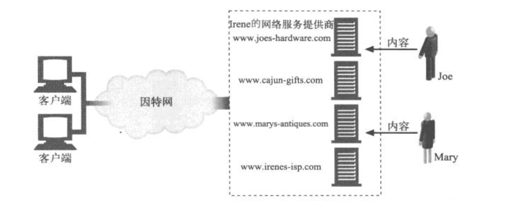

### 虚拟主机托管
许多人想要在 Web 上展现自己，但他们的网络流量都不大。对这些人来说，使用专用的 Web 服务器可能有点儿大材小用，因为他们每月花费数百美元租来的服务器大部分时间都是空闲的。

许多 Web 托管者通过让一些顾客共享一台计算机来提供便宜的 Web 主机托管服务。这称为共享主机托管或虚拟主机托管。每个网站看起来是托管在不同的服务器上，但实际上是托管在同一个物理服务器上。从最终用户的角度来看，被虚拟托管的网站应当和托管在专用服务器上的网站没什么区别。

从成本效益，空间以及管理方面考虑，提供虚拟主机托管的公司希望鞥在同一个服务器上托管数十、上百，甚至上千个网站，但这不一定意味着上千个网站是用一台 PC 机来提供服务的。托管者可以创建成排同样的服务器，称为服务器集群（server farm），把负载分摊在群里的服务器上。因为群里的每台服务器都一样，并且托管了许多虚拟网站，所以管理起来更加方便。

#### 虚拟服务器请求缺乏主机信息
不幸的是，HTTP/1.0 中一个设计缺陷会使虚拟主机托管者抓狂。HTTP/1.0 规范中没有为共享的 Web 服务器提供任何方法来识别要访问的是哪一个托管的网站。

回想一下，HTTP/1.0 请求在报文中只发送了 URL 的路径部分。如果要访问 http://www.joes-hardware.com/index.html, 浏览器会连接到服务器 www.joes-harware.com，但 HTTP/1.0 请求中只提到 GET /index.html, 并没有提到主机名。如果服务器虚拟托管了多个站点，就没有足够的信息能指出要访问的是哪个虚拟网站。如下图所示。

+ 如果客户端 A 试图访问 http://www.joes-hardware.com/index.html, 请求 GET /index.html 将被发送到共享的 Web 服务器。
+ 如果客户端 B 试图访问 http://www.marys-antiques.com/index.html，同样的请求 GET /index.html 也将被发送到共享的 Web 服务器。

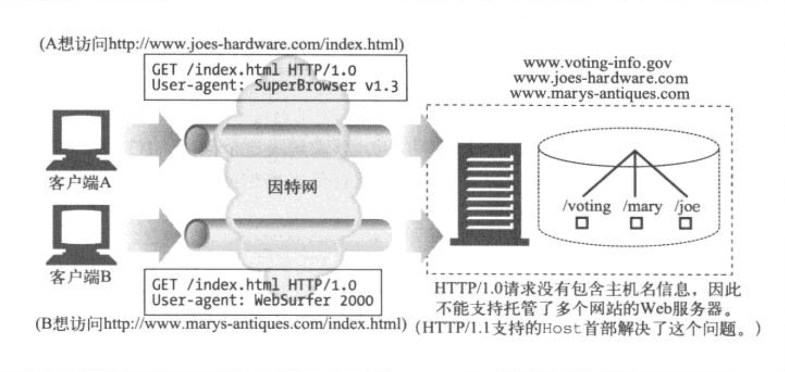

就 Web 服务器而言，没有足够的信息可供其判断究竟要访问的是哪个网站。尽管请求的是完全不同的文档（来自不同的网站），但这两个请求看起来是一样的，这是因为网站的主机信息已经从请求中剥离了）。

#### 设法让虚拟主机托管正常工作
缺失的主机信息是原始 HTTP 规范的疏忽，它错误地假设了每个 Web 服务器上只托管了一个网站。HTTP 的设计者没有为进行虚拟主机托管的共享服务器提供支持。正因为如此，URL 中的主机名信息被当做冗余信息剥离了，只要求发送路径部分。

因为早期的规范没有考虑到虚拟主机托管，Web 托管者需要开发变通的方案和约定来支持共享的虚拟主机托管。这个问题本可以通过要求所有 HTTP 请求报文发送完整的 URL 而不只是路径部分来简单地解决。而 HTTP/1.1 的确要求服务器能够处理 HTTP 报文请求行上的完整 URL，但将现存的应用程序都升级到这个规范还需要很长时间。在此期间，涌现了以下 4 种技术。
+ 通过 URL 路径进行虚拟主机托管。在 URL 中增添专门的路径部分，以便服务器判断是哪个网站。
+ 通过端口号进行主机托管。为每个站点分配不同的端口号，这样请求就由 Web 服务器的单独实例来处理。
+ 通过 IP 地址进行主机托管。为不同的虚拟站点分配专门的 IP 地址，把这些地址都绑定到一台单独的机器上。这样，Web 服务器就可以通过 IP 地址来识别网站名了。
+ 通过 Host 首部进行主机托管。很多 Web 托管者向 HTTP 的设计者施压，要求解决这个问题。HTTP/1.0 的增强版和 HTTP/1.1 正式版定义了 Host 请求首部来携带网站名称。Web 服务器可以通过 Host 首部识别虚拟站点。

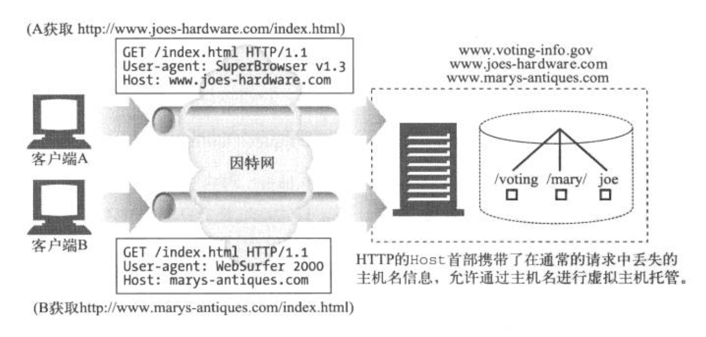

#### HTTP/1.1 的 Host 首部
Host 首部最早是在 HTTP/1.0+ 引入的，它是开发商实现的 HTTP/1.0 的扩展超集。遵循 HTTP/1.1 标准则必须支持 Host 首部。绝大多数现代浏览器和服务器都支持 Host 首部，但仍有一些客户端和服务器不支持它。

Host 首部是 HTTP/1.1 的请求首部，定义在 RFC 2068 中。由于虚拟服务器的流行，绝大多数 HTTP 客户端都实现了 Host 首部。

##### 语法与用法
Host 首部描述了所请求的资源所在的因特网主机和端口号，和原始的 URL 中得到的一样。
```
    Host = "Host" ":" host [ ":" port ]
```

但要注意以下问题。
+ 如果 Host 首部不包含端口，就使用地址方案中默认的端口。
+ 如果 URL 中包含 IP 地址，Host 首部就应当包含同样的地址。
+ 如果 URL 中包含主机名，Host 首部就必须包含同样的名字。
+ 如果 URL 中包含主机名，Host 首部就不应当包含 URL 中这个主机名对应的 IP 地址，因为这样会扰乱虚拟主机托管服务器的工作，它在同一个 IP 地址上堆叠了很多虚拟站点。
+ 如果 URL 中包含主机名，Host 首部就不应当包含这个主机名的其他别名，因为这样也会扰乱虚拟主机托管服务器的工作。
+ 如果客户端显示地使用代理服务器，客户端就必须把原始服务器，而不是代理服务器的名字和端口放在 Host 首部中。以往，若干个 Web 客户端在启动客户端代理设置时，错误地把发出的 Host 首部设置成代理的主机名。这种错误行为会使代理和原始服务器都无法处理请求。
+ Web 客户端必须在所有请求报文中包含 Host 首部。
+ Web 代理必须在转发请求报文之前，添加 Host 首部。
+ HTTP/1.1 的 Web 服务器必须用 400 状态码来响应所有缺少 Host 首部字段的 HTTP/1.1 请求报文。

下面是一段简单的 HTTP 请求报文，用于获取 www.joes-hardware.com 的主页，其中带有必须的 Host 首部字段
```
    GET http://www.joes-hardware.com/index.html HTTP/1.0
    Connection: Keep-Alive
    User-Agent: Mozilla/4.51 [en] (x11; U; IRIX 6.2 IP22)
    Accept: image/gif, image/x-xbitmap, image/jpeg, image/pjpeg, image/png, */*
    Accept-Encoding: gzip
    Accept-Language: en
    Host: www.joes-hardware.com
```

##### 缺失 Host 首部
有少量在用的老式浏览器不会发送 Host 首部。如果某个虚拟主机托管服务器使用 Host 首部来判断所服务的是哪个网站，而报文中没有出现 Host 首部的话，那它可能会把用户导向某个默认的 Web 页面，也可能返回一个错误页面建议用户升级浏览器。

##### 解释 Host 首部
对于没有进行虚拟主机托管，而且不允许资源随请求主机的不同而变化的原始服务器来说，可以忽略 Host 首部字段的值。但资源会随主机名的不同而变化的原始服务器，都必须在一条 HTTP/1.1 请求判断其所请求的资源时使用下列规则。
1. 如果 HTTP 请求报文中的 URL 是绝对的（也就是说，包含方案和主机部分），就忽略 Host 首部的值。
2. 如果 HTTP 请求报文中的 URL 没有主机部分，而该请求带有 Host 首部，则主机/端口的值就从 Host 首部中取。
3. 如果通过第 1 步或第 2 步都无法获得有效的主机，就向客户端返回 400 Bad Request 响应。

##### Host 首部与代理
某些版本的浏览器发送的 Host 首部不正确，尤其是配置使用代理的时候。例如，配置使用代理时，一些老版本的 Apple 和 PointCast 客户端会错误地把代理的名字，而不是原始服务器的名字放在 Host 首部里发送。

### 使网站更可靠
下面列出的这些时间段内，网站通常是无法运作的。
+ 服务器宕机的时候。
+ 网络中断或掉线。
+ 交通拥堵：突然间很多人都要看某个特别的新闻广播或涌向某个大甩卖网点。突然的拥堵可以使 Web 服务器过载，降低其响应速度，甚至使它彻底停机。

#### 镜像的服务器集群
服务器集群是一排配置相同的 Web 服务器，互相可以替换。每个服务器上的内容可以通过镜像复制，这样当某个服务器出问题的时候，其他的可以顶上。

镜像的服务器常常组成层次化的关系。某个服务器可能充当“内容权威”，它含有原始内容（可能就是内容作者上传的那个服务器）。这个服务器称为主原始服务器（master origin server）。从主原始服务器接收内容的镜像服务器称为复制原始服务器（replica origin server）。一种简单的部署服务器集群的方法是用网络交换机把请求分发给服务器。托管在服务器上的每个网站的 IP 地址就设置为交换机的 IP 地址。

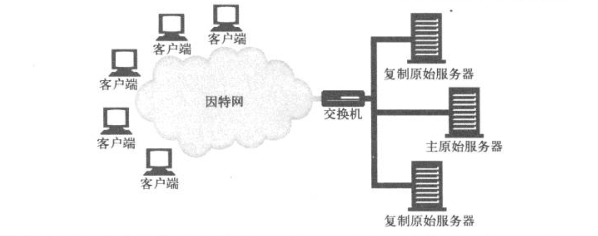

在上图中，主原始服务器负责把内容发送给复制原始服务器。对集群外部来说，内容所在的 IP 地址就是交换机的 IP 地址。交换机负责把请求发送到服务器上去。

镜像 Web 服务器可以在不同的地点包含同样内容的副本。一般来说，有以下两种方法把客户端的请求导向特定的服务器。
+ HTTP 重定向。该内容的 URL 会解析到主服务器的 IP 地址，然后它会发送重定向到复制服务器。
+ DNS 重定向。该内容的 URL 会解析到多个 IP 地址，DNS 服务器可以选择发送给客户端的 IP 地址。

#### 内容分发网络
简单的说，内容分发网络（CDN）就是对特定内容进行分发的专门网络。这个网络中的节点可以是 Web 服务器、反向代理或缓存。

#### CDN 中的反向代理缓存
复制原始服务器可以用反向代理缓存来代替。反向代理缓存可以像镜像服务器一样接受服务器请求。它们代表原始服务器中的一个特定集合来接收服务器请求。（根据内容所在的 IP 地址的广告方式，这是有可能的，原始服务器和反向代理缓存之间通常有协作关系，到特定的原始服务器的请求就由反向代理缓存来接收。）

反向代理和镜像服务器之间的区别在于反向代理通常是需求驱动的。它们不会保存原始服务器的全部内容副本，它们只保存客户端请求的那部分内容。内容在其高速缓存中的分布请情况取决于它们收到的请求，原始服务器不负责更新它们的内容。为了更容易地访问“热点”内容（就是高请求率的内容），有些反向代理具有“预取”特性，可以在用户请求之前就从服务器上载入内容。

CDN 中带有反向代理时，可能会由于存在代理的层次关系而增加其复杂性。

#### CDN 中的代理缓存
代理缓存与反向代理不同，传统的代理缓存能收到发往任何 Web 服务器的请求。（在代理缓存与原始服务器之间不需要有任何工作关系或 IP 地址约定。）但是与反向代理比起来，代理缓存的内容一般都是按需驱动的，不能指望它是对原始服务器内容的精确复制。某些代理缓存也可以预先载入热点内容。

按需驱动的代理缓存可以部署在其他环境中，尤其是拦截环境，在这种情况下，2 层或 3 层设备（交换机或路由器）会拦截 Web 流量并将其发送给代理缓存。


丽娜姐环境依赖于客户端和服务器之间设置网络的能力，这样，所有合适的 HTTP 请求才能真正发送到缓存中去。根据收到的请求，将内容分布在缓存中。

### 让网站更快
服务器集群和分布式代理缓存或反向代理服务器分散了网络流量，可以避免拥塞。分发内容使之更靠近终端用户，这样从服务器到客户端的传输时间就更短了。请求和响应穿过因特网，在客户端和服务器间传输的方式是影响资源访问速度最主要的因素。

加速网站访问的另一种方法是对内容进行编码以便更快地传输。比如，对内容压缩，但前提是接收的客户端能够把内容解压缩。

## 重定向与负载均衡
HTTP 并不是独自运行在网上的。很多协议都会在 HTTP 报文的传输过程中对其数据进行管理。HTTP 只关心旅程的端点（发送者和接收者）。但在包含有镜像服务器、Web 代理和缓存的网络世界中，HTTP 报文的目的地不一定是直接可达的。

+ 重定向技术通常可以用来确定报文是否终结于某个代理、缓存或服务器集群中某台特定的服务器。
+ 重定向技术可以将报文发送到客户端没有显示请求的地方去。

### 为什么要重定向
由于 HTTP 应用程序总是要做下列 3 件事情，所以在现代网络中重定向是普遍存在的。
+ 可靠地执行 HTTP 事务
+ 最小化时延
+ 节约网络带宽

出于这些原因，Web 内容通常分布在很多地方。这么做是出于可靠性的考虑。这样，如果一个位置出问题了，啊还有其他的可用。如果客户端能去访问较近的资源，就可以更快地收到所请求的内容，以降低响应时间；将目标服务器分散，还可以减少网络拥塞。可以将重定向当作一组有助于找到“最佳”分布式内容的技术。

重定向和负载均衡是共存的。大多数重定向部署都包含了某些形式的负载均衡。也就是说，它们可以将输入报文的负载分摊到一组服务器中去。反之，因为输入报文一定会在分担负荷的服务器之间进行某种分布，所以任意形式的负载均衡中都包含了重定向。

### 重定向到何地
从客户端向目标发送 HTTP 请求，目标对其进行处理的角度来看，服务器、代理、缓存和网关对客户端来说都是服务器。很多重定向技术都可用于服务器、代理、缓存和网关。因为它们具有共同的，与服务器类似的特征。其他一些重定向技术时专门为特定类型的端点设计的，没有通用性。

Web 服务器会根据每个 IP 来处理请求。将请求分摊到复制的服务器中去，就意味着应该把对特定 URL 的每条请求都发送到最佳的 Web 服务器上去（最靠近客户端的、或负载最轻的采用其他优化策略选择的服务器）。重定向到某台服务器就像将所有需要给汽车加油的司机都送到最近的加油站去一样。

代理希望根据每个协议来处理请求。在理想情况下，某个代理附近的所有 HTTP 流量都应该通过这个代理传输。比如，如果某代理缓存靠近各种不同的客户端，那么理想情况下，所有请求都应流经这个代理缓存，因为代理缓存上会存储常用的文档，可以直接提供，从而避免通过更长、更昂贵的路径连接到原始服务器。重定向到代理就像从一条主要通路（无论它通往何处）上将流量分流到一条本地快捷路径上去一样。

### 重定向协议概览
重定向的目标是尽快地将 HTTP 报文发送到可用的 Web 服务器上去。在穿过因特网的路径上，HTTP 报文传输的方向会收到 HTTP 应用程序和报文经由的路由设备的影响。
+ 配置创建客户端报文的浏览器应用程序，使其将报文发送给代理服务器。
+ DNS 解析程序会选择用于报文寻址的不同的 IP 地址。对不同物理地域的不同客户端来说，这个 IP 地址可能不同。
+ 报文经过网络出阿叔时，会被划分为一些带有地址的分组；交换机和路由器会检查分组中的 TCP/IP 地址，并据此来确定分组的发送路线。
+ Web 服务器可以通过 HTTP 重定向将请求反弹给不同的 Web 服务器。
  
浏览器配置、DNS、TCP/IP 路由以及 HTTP 都提供了重定向报文的机制。注意，有些方法，比如浏览器配置，只有在将流量重定向到代理的时候才有意义，而其他一些方法（比如 DNS 重定向），则可用于将流量发送给任意服务器。

下表是通用的重定向方法。
机制     |  工作方式  |  重新路由的基础  |  局限性
-------- | -------  |  ------------  |  -------
HTTP 重定向 | 最初，HTTP 请求先到第一台 Web 服务器，这台服务器会选则一台“最佳”的 Web 服务器为其提供内容。第一台 Web 服务器会向客户端发送一条到指定服务器的 HTTP 重定向。客户端会将请求重新发送到选中的服务器上。  | 选择最短路径时可用的选项很多，包括轮转（round-robin)负载均衡和最小化时延等。  |  可能会很慢，每个事务都包含了附加的重定向步骤。而且，第一台服务器一定要能够处理请求负载。
DNS 重定向 | DNS 服务器决定在 URL 的主机名返回多个 IP 地址中的哪一个  | 选择最短路径时可用的选项很多，包括轮转负载均衡和最小化时延等。  | 需要配置 DNS 服务器
任播寻址   | 几台服务器使用相同的 IP 地址。每台服务器都会伪装成一个骨干路由器。其他路由器会将共享 IP 地址分组发送给最近的服务器（认为它们将分组发送给最近的路由器）  | 路由器有内建的最短路径路由功能  | 需要拥有/配置路由器。有地址冲突的风险。如果路由变化了，与已建立的 TCP 连接相关的分组会被发送到其他的服务器，可能会使 TCP 连接断裂。
IP MAC 转发 | 交换机或路由器这样的网元会读取分组的目的地址。如果应该将分组重定向，交换机会将服务器或代理的目标 MAC 地址赋予分组  |  节省带宽，提高 QOS，负载均衡  | 服务器或代理的跳距必须是 1
IP 地址转发  | 第四层交换机会评估分组的目的端口并将重定向分组的 IP 地址改成代理或镜像服务器的 IP 地址。  | 节省带宽，提高 QOS，负载均衡  | 服务器或代理可能看不到真正的客户端 IP 地址

下表总结了将报文重定向到代理服务器的重定向方法
机制          |  工作方式  |  重新路由的基础  |  局限性  
-----------  | -------- | -------------  | ---------
显示浏览器配置  |  配置 Web 浏览器，使其将 HTTP 报文发送给附近的一个代理，通常是缓存。可以由终端用户或管理浏览器的服务进行配置  | 节省带宽，提高 QOS，负载均衡  | 取决于配置浏览器的能力
代理自动配置（PAC） | Web 了浏览器从配置服务器中解析出 PAC 文件。这个 PAC 文件会告诉浏览器为每个 URL 使用什么代理  | 节省带宽，提高 QOS，负载均衡  | 必须配置浏览器，使其去查询配置服务器
Web Proxy 代理自动发现协议（WPAD） | Web 浏览器向配置服务器查询一个 PAC 文件的 URL。与单独使用 PAC 不同，不需要将浏览器配置为使用特定的配置服务器 | 配置服务器，将 URL 建立在客户端 HTTP 请求首部提供的信息之上。负载均衡  | 只有部分浏览器支持 WPAD
Web 缓存协调协议（WCCP）| 路由器会评估一个分组的目的地址，并由代理或镜像服务器的 IP 地址将重定向分组封装起来。可以与很多现有路由器共同工作。可以将分组封装起来，这样客户端的 IP 地址就不会丢失了。  | 节省带宽，提高 QOS。负载均衡  | 必须使用支持 WCCP 的路由器。有些拓扑结构方面的限制
因特网缓存协议（ICP）  | 代理缓存会在一组兄弟代理缓存中查询所请求的内容。还支持缓存的分层结构 | 从兄弟代理或父代理缓存中获取内容比从原始服务器中获取更快  | 请求内容时只使用了 URL，所以会降低缓存命中率
缓存分组路由协议（CABP)  | 一种代理缓存散列协议。允许缓存将请求转发给一个父缓存。与 ICP 不同的是，高速缓存上的内容是不相交的，这组缓存会像一个大型缓存那样工作  | 从附近的对等高速缓存中获取内容要比从原始服务器上获取快  | CARP 无法支持兄弟关系。所有 CARP 客户端都必须在配置上达成一致；否则，不同的客户端就向不同的父代理缓存发送相同的 URI，降低命中率。
超还本缓存协议（HTCP）  | 参与的代理缓存可以向一组兄弟缓存查询所请求的内容。支持 HTTP 1.0 和 HTTP 1.1 首部，以便精细地调整缓存查询  | 从兄弟代理或父代理缓存中获取内容比从原始服务器上获取快 | —

### 通用的重定向方法

#### HTTP 重定向
Web 服务器可以将很短的重定向报文发回给客户端，告诉他们去其他地方试试。有些 Web 站点会将 HTTP 重定向作为一种简单的负载均衡形式来使用。处理重定向的服务器（重定向服务器）找到可用的负载最小的内容服务器，并将浏览器重定向到那台服务器上去。对广泛分布的 Web 站点来说，确定“最佳”的可用服务器会更复杂一些，不仅要考虑到服务器的负载，还要考虑到路蓝旗和服务器之间的因特网距离。与其他一些形式的重定向相比，**HTTP 重定向的优点之一就是重定向服务器知道客户端的 IP 地址**；理论上来讲，它可以做出更合理的选择。

下面时 HTTP 重定向的工作过程。
```
    GET /hammers.html HTTP/1.0
    Host: www.joes-hardware.com
    User-Agent: Mozilla/4.51 [en] (x11; U; IRIX 6.2 IP22)

服务器回送
    HTTP/1.0 302 Redirect
    Server: Stronghold/2.4.2 Apache/1.3.6
    Location: http://161.58.228.45/hammers.html

然后，浏览器会用重定向 URL 重新发送请求
    GET /hammers.html HTTP/1.0
    Host: 161.58.228.45
    User-Agent: Mozilla/4.51 [en] (x11; U; IRIX 6.2 IP22)
```

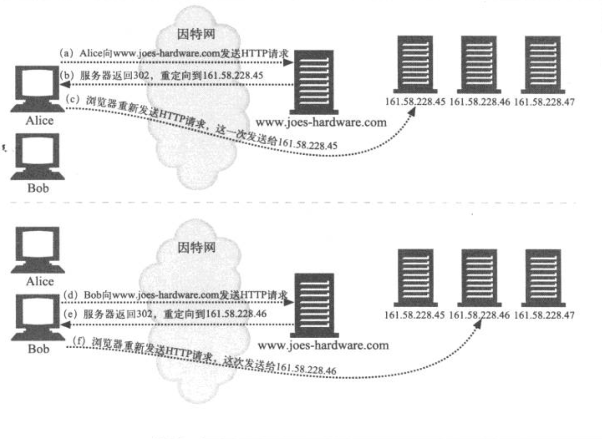

HTTP 重定向可以在服务器间导引请求，但它有以下几个缺点。
+ 需要原始服务器进行大量处理来判断要重定向到哪台服务器上去。有时，发布重定向所需的处理量几乎与提供页面本身所需的处理量一样。
+ 增加了用户时延，因为访问页面时要进行两次往返。
+ 如果重定向服务器出孤战，站点就会瘫痪。

由于存在这些弱点，HTTP 重定向通常都会与其他一种或多种重定向技术结合使用。

#### DNS 重定向
每次客户端试图访问 Joe 的五金商店的网站时，都必须将域名 www.joes-hardware.com 解析为 IP 地址。DNS 解析程序可能是客户端自己的操作系统，可能是客户端网络中的一台 DNS 服务器，或者是一台远距离的 DNS 服务器。DNS 允许将几个 IP 地址关联到一个域中，可以配置 DNS 解析程序，或对其进行编程，以返回可变的 IP 地址。解析程序返回 IP 地址时所基于的原则可以很简单（轮转）。也可以很复杂（比如查看几台服务器上的负载，并返回负载最轻的服务器的 IP 地址）。最简单的 DNS 决策算法就是轮转。

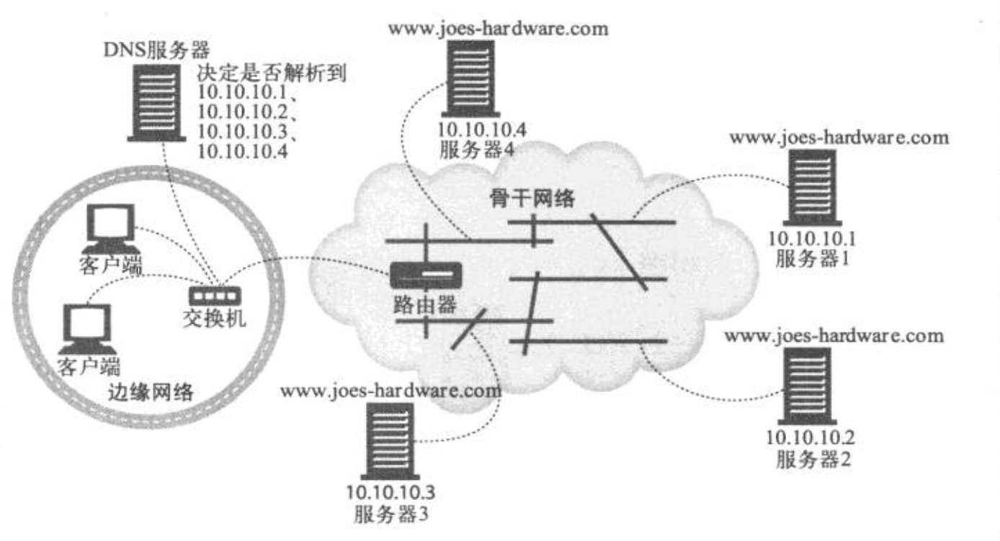

##### DNS 轮转
最常见的重定向技术之一就是最简单的重定向技术之一。**DNS 轮转使用了 DNS 主机名解析中的一项特性，在 Web 服务器集群中平衡负载。这是一种单纯的负载均衡策略**，没有考虑任何与客户端和服务器的相对位置，或者服务器当前负载有关的因素。

##### 多个地址及轮转地址的循环
大多数 DNS 客户端只会使用多地址集中的第一个地址。为了负载均衡，大多数 DNS 服务器都会在每次完成查询之后对地址进行轮转。这种地址轮转通常叫做 DNS 轮转。

##### 用来平衡负载的 DNS 轮转
由于大多数 DNS 客户端只使用第一个地址，所以 DNS 轮转可以在多台服务器间提供负载均衡。如果 DNS 没有对地址进行轮转，大部分客户端就总是会将负载发送给第一台服务器。

下面说明了 DNS 轮转循环是如何平衡负载的。
+ Alice 试图连接 www.cnn.com 时，会用 DNS 查找 IP 地址，得到 207.25.71.5 作为第一个 IP 地址。然后，Alice 连接到 Web 服务器 207.25.71.5
+ Bob 随后试图连接 www.cnn.com 时，也会用 DNS 查找 IP 地址，但由于地址列表在 Alice 上次请求的基础上轮转了一个位置，所以他会得到一个不同的结果。Bob 得到 207.25.71.6 作为第一个 IP 地址，然后，它连接到了这台服务器上。

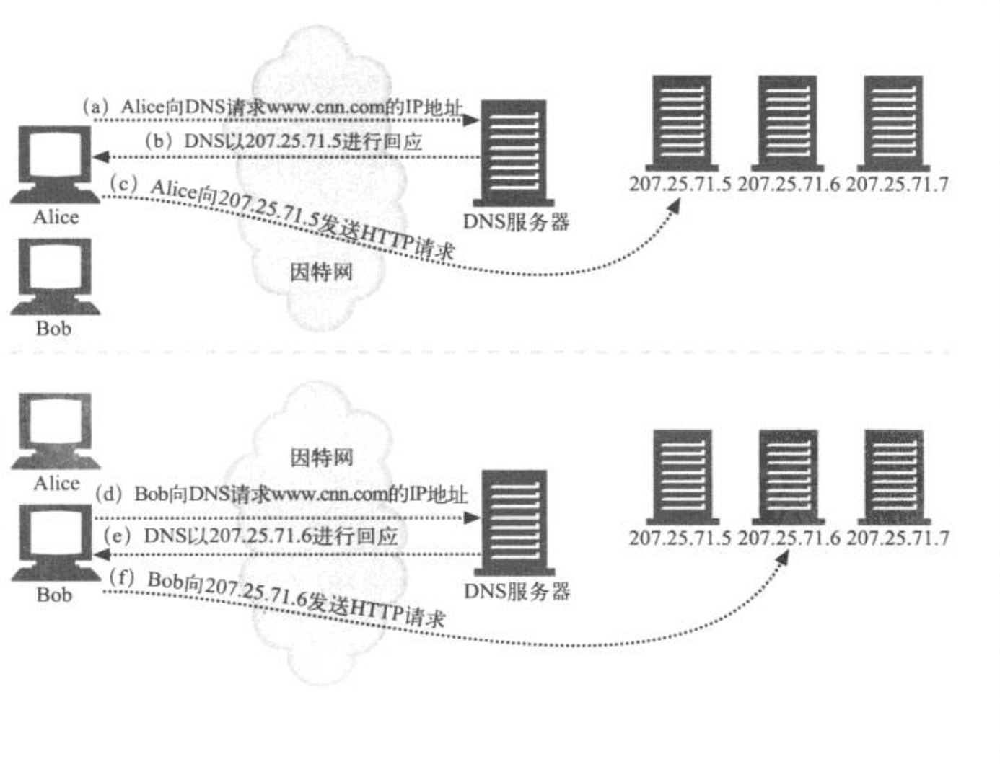

##### DNS 缓存带来的影响
DNS 对服务器的每次查询都会得到不同的服务器地址序列，所以 DNS 地址轮转会将负载分摊。但是这种分摊策均衡并不完美，因为 DNS 查找的结果可能会被记住，并被各种应用程序、操作系统和一些建议的子 DNS 服务器重用。很多 Web 浏览器都会对主机进行 DNS 查找，然后一次次地使用相同的地址，以减少 DNS 查找的开销，而且有些服务器也更愿意保持与同一台客户端的联系。另外，很多操作系统都会自动进行 DNS 查找，并将结果缓存，但并不会对地址进行轮转。因此，DNS 轮转通常都不会平衡单个客户端的负载，一个客户端通常会在很长时间内连接到一台服务器上。

尽管 DNS 没有对单个客户端的事务进行跨服务器副本的处理，但在分散多个客户端的总负荷方面它做的相当好。只要有大量具有相同需求的客户端，就可以将负载合理地分散到各个服务器上去。

##### 其他基于 DNS 的重定向算法
我们已经讨论了 DNS 是如何对每条请求进行地址列表轮转的。但是，有些增强的 DNS 服务器会使用其他一些技术来选择地址的顺序。
+ 负载均衡算法。有些 DNS 服务器会跟踪 Web 服务器上的负载，将负载最轻的 Web 服务器放在列表的最强面。
+ 邻接路由算法。Web 服务器集群在地理上分散时，DNS 服务器会尝试将用户导向最近的 Web 服务器。
+ 故障屏蔽算法。DNS 服务器可以监视网络的状况，并将请求绕过出现服务中断或其他故障的地方。

通常，运行复杂服务器跟踪算法的 DNS 服务器就是在内容提供者控制之下的一个权威服务器。如下图。

有一些分布式主机服务会使用这个 DNS 重定向模型。对于那些要查找附近服务器的服务来说，这个模型的一个缺点就是，权威 DNS 服务器只能用本地 DNS 服务器的 IP 地址，而不能用客户端的 IP 地址来做决定。

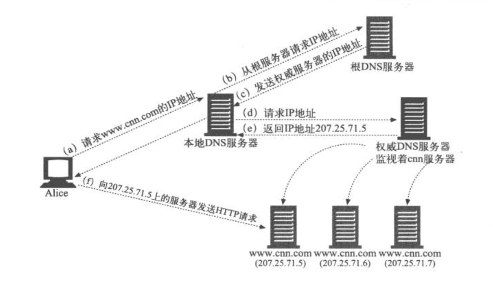

#### IP MAC 转发
在以太网中，HTTP 报文都是以携带地址的数据分组的形式发送的。每个分组都有一个第四层地址，由源 IP 地址、目的 IP 地址以及 TCP 端口号组成，它是第四层设备所关注的地址。每个分组还有一个第二层地址，MAC（Media Access Control,媒体访问控制）地址，这是第二层设备（通常是交换机和 Hub）所关注的地址。第二层设备的任务是接收具有特定输入 MAC 地址的分组，然后将其转发到特定的输出 MAC 地址上去。

比如，下图中的交换机程序会将来自 MAC 地址为 MAC3 的所有流量都发送到 MAC 地址为 MAC4 上去

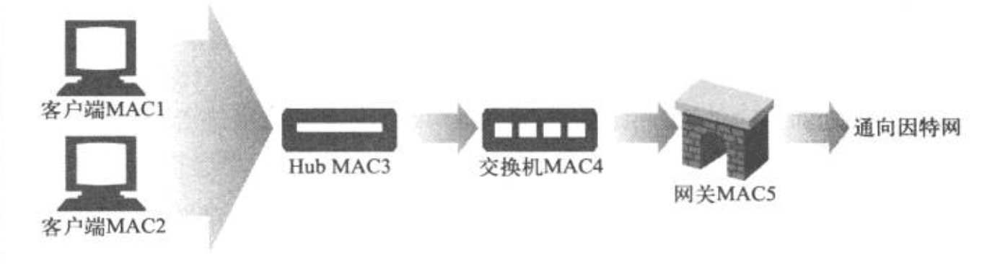

第四层交换机能够检测出第四层地址（IP 地址和 TCP 端口号），并据此来选择路由。比如，一个第四层交换机可以将所有目的为端口 80 的 Web 流量都发送到某个代理上去。

通常，如果缓存中有所请求的 HTTP 内容，而且是新鲜的，那么就由代理缓存来提供内容；否则，代理缓存就会代表客户端向此内容的原始服务器发送一条 HTTP 请求。交换机会将端口 80 的请求从代理（MAC 6）发送给因特网网关（MAC5）。

支持 MAC 转发的第四层交换机通常会将请求转发给几个代理缓存，并在它们之间平衡负载。类似地，也可以将 HTTP 流量转发给备用 HTTP 服务器。

因为 MAC 地址转发只是点对点的，所以服务器或代理只能位于离交换机一跳远的地方。

#### IP 地址转发
在 IP 地址转发中，交换机或其他第四层设备会检测输入分组中的 TCP/IP 地址，并通过修改目的 IP 地址（不是目的 MAC 地址），对分组进行相应的转发。与 MAC 转发相比，这么做的优点是目标服务器不需要位于一跳源的地方；只需要位于交换机的上游就行了，而且通常第三层的端到端因特网路由都会将分组传送到正确的地方。这种类型的转发也被称为 NAT（Network Address Translation，网络地址转换）。

但还有一个问题，就是对称路由。从客户端接受输入 TCP 连接的交换机管理者连接；交换机必须通过那条 TCP 连接将响应回送给客户端。这样，所以来自目标服务器或代理的响应都必须返回给交换机。

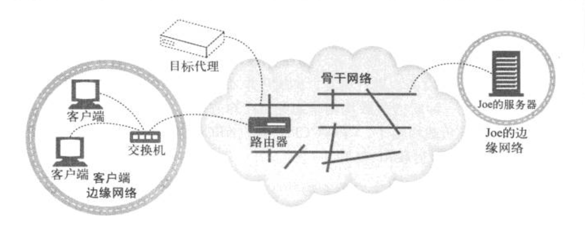

有以下两种方式可以控制响应的返回路径。
+ 将分组的源 IP 地址改成交换机的 IP 地址。通过这种方式，无论交换机和服务器之间采用何种网络配置，响应分组都会被发送给交换机。这种方式被称为完全 NAT（full NAT)，其中的 IP 转发设备会对目的 IP 地址和源 IP 地址都进行转换。这样做的缺点是服务器不知道客户端的 IP 地址，哪种需要认证和计费的 Web 服务器无法获知客户端的 IP 地址。
+ 如果 源 IP 地址仍然是客户端的 IP 地址，就要确保（从硬件的角度来看）没有从服务器到客户端的直接路由（绕过交换机的）。这种方式有时被称为半 NAT（half NAT）。这种方法的优点是服务器知道客户端的 IP 地址，但缺点是要对客户端和服务器之间的整个网络都有某种程度的控制。

#### 网元控制协议
NECP（Network Element Control Protocol，网元控制线协议）允许网元（NE，路由器和交换机等负责转发 IP 分组的设备）与服务器元素（SE，Web 服务器和代理缓存等提供应用层请求的设备）进行交互。NECP 并未显示提供负载均衡的支持；它只是为 SE 提供了一种发送负载均衡信息给 NE 的方式，这样 NE 就可以在它认为合适的情况下进行负载均衡了。与 WCCP 一样，NECP 也提供了几种转发分组的方式：MAC 转发、GRE 封装和 NAT。

NECP 支持例外。SE 可以决定它不能为某些特定的源 IP 地址提供服务，并将这些地址发送给 NE。然后，NE 可以将来自这些 IP 地址的请求转发给原始服务器。

### 代理的重定向方法
出于潜在的安全考虑，内容也可能需要通过各种代理来访问，或者网络中可能有一个客户端可利用的代理缓存。因为获取已缓存的内容很可能要比直接连接到原始服务器快得多。

但 Web 浏览器客户端怎么才会知道要连接到某个代理上去呢？可以用 3 种方法来判断。
+ 显示的浏览器配置
+ 动态自动配置
+ 透明拦截

代理可以顺次将客户端请求重定向到另一个代理上去。比如，没有缓存此内容的代理缓存可能会选择将客户端重定向到另一个代理缓存。这样一来，响应就会来自与客户端请求资源的地址的另外一个地址。所以，这里还需要讨论用于对等代理-缓存重定向的协议：ICP、CARP 和 HTCP。

#### 显示浏览器配置
大多数浏览器都可以配置为从代理服务器上获取内容，浏览器中有一个下拉菜单，用户可以在这个菜单中输入代理的名字或 IP 地址以及端口号。然后浏览器的所有请求都可以发送给这个代理。有些服务提供商不允许用户配置普通浏览器来使用代理，它们会要求用户下载事先配置好的浏览器。这些浏览器知道所要使用的代理的地址。

显示浏览器配置有以下两个主要的缺点。
+ 配置为使用代理的浏览器，即使在代理无法响应的情况下，也不会去联系原始服务器。如果代理崩溃了，或者没有正确配置浏览器，用户就会遇到连接方面的问题。
+ 对网络架构进行修改，并将这些修改通知给所有的中断用户都是很困难的。如果服务提供商要添加更多的代理服务器，或者使其中一些退出服务，用户都要修改浏览器代理设置。

#### 代理自动配置
显示配置浏览器使其联系特定的代理，这样会限制网络方面的变动，因为它是靠用户来接入并重新配置浏览器的。自动配置方式可以动态配置浏览器，连接到正确的代理服务器，以解决这个问题。这种方法已经实现了，被称为代理自动配置（PAC）协议。PAC 是网景公司定义的，网景公司的 Navigtor 和微软的 Internet Explorer 浏览器都支持此协议。

PAC 的基本思想是让浏览器去获取一个称为 PAC 的特殊文件，这个文件说明了每个 URL 所关联的代理。必须配置浏览器，为这个 PAC 文件关联一个特定的服务器。这样，浏览器每次重启的时候都可以获取这个 PAC 文件了。

PAC 文件是个 JavaScript 文件，其中必须定义函数：
```
    function FindProxyForURL(url, host)
```

如下所示，浏览器要为请求的每条 URL 调用这个函数
```
    return_value = FindProxyForURL(url_of_request, host_in_url);
```

其返回值为一个字符串，用来说明浏览器应该到哪里请求这个 URL。返回值可以是所关联的代理名称列表（比如，PROXY proxy1.domain.com, PROXY proxy2.domain.com), 或是字符串“DIRECT”， 这个字符串说明浏览器应该绕开所有的代理，直接连接原始服务器。

下图给出了浏览器对 PAC 文件的请求以及相应此请求的操作顺序。在本例中，服务器回送了带有 JavaScript 程序的 PAC 文件。JavaScript 程序中有一个 FindProxyForURL 函数，用来告知浏览器，如果所请求的 URL 的主机位于 netscape.com 域中，就直接与原始服务器联系，所有其他请求都连接到 proxy1.joes-cache.com。浏览器会为它所请求的每个 URL 调用这个函数，并根据此函数返回的结果进行连接。

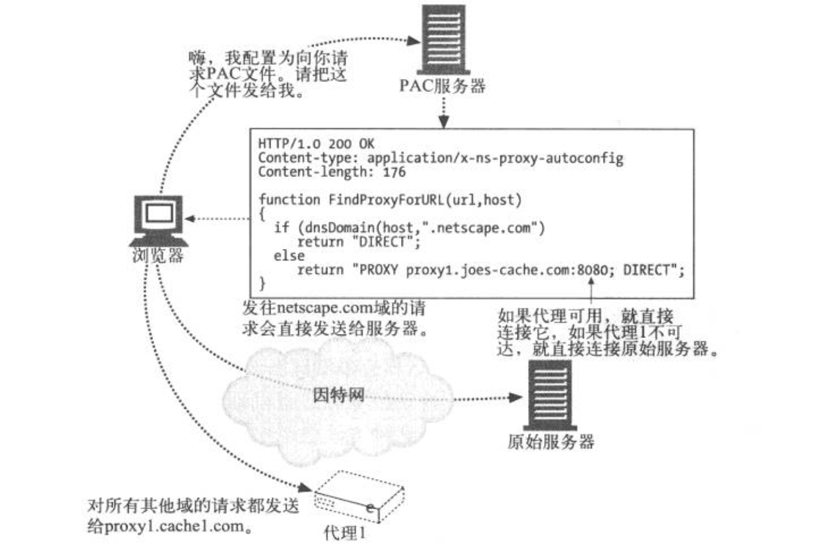

PAC 协议是相当强大的；JavaScript 程序可以请求浏览器根据大量与主机名相关的参数来选择代理，比如 DNS 地址和子网，甚至星期几或具体时间。只要服务器中的 PAC 文件保持更新，能反映代理位置的变化，PAC 就允许浏览器根据网络结构的变化自动与合适的代理进行联系。PAC 存在的主要问题是必须要对浏览器进行配置，让它知道要从哪个服务器获取 PAC 文件，因此它就是一个全自动配置的系统。

就像那些预配置浏览器一样，现在一些主要的 ISP 都在使用 PAC。

#### Web 代理自动发现协议
WPAD（Web 代理自动发现协议）的目标在不要求终端用户手工配置代理设置，而且不依赖透明流量拦截的情况下，为 Web 浏览器提供一种发现并使用附近代理的方式。由于可供选择的发现协议有很多，而且不同浏览器的代理使用配置也存在差异，因此定义 Web 代理自动发现协议时，普通的问题会被复杂化。

##### PAC 文件自动发现
WPAD 允许 HTTP 客户端定位一个 PAC 文件，并使用这个 PAC 文件找到适当的代理服务器的名字。WPAD
不能直接确定代理服务器的名字，因为这样就无法使用 PAC 文件提供的附加功能了（负载均衡，请求路由到一组服务器上去，故障时自动转移到备用代理服务器等）。**WPAD 协议发现了 PAC 文件 URL**，这个 URL 也被称为配置 URL（CURL）。PAC 文件执行了一个 JavaScript 程序，这个程序会返回合适的代理服务器地址。实现 WPAD 协议的 HTTP 客户端。
+ 用 WPAD 找到 PAC 文件的 CURL；
+ 根据这个 CURL 获取 PAC 文件（又名配置文件或 CFILE）；
+ 执行 PAC 文件来确定代理服务器
+ 向 PAC 文件返回的那个代理服务器发送 HTTP 请求。

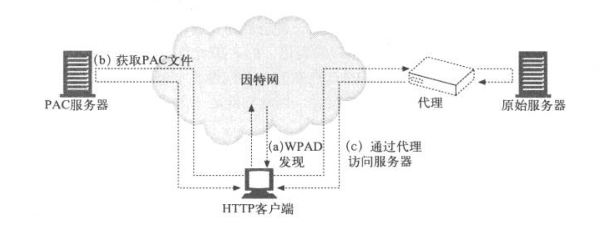

### 缓存重定向方法

#### WCCP 重定向
Cisco 系统公司开发的 WCCP 可以使路由器将 Web 流量重定向到代理缓存中去。WCCP 负责路由器和缓存服务器之间的通信，这样路由器就可以对缓存进行验证（确保它们已启动且正在运行），在缓存之间进行负载均衡，并将特定类型的流量发送给特定的缓存了。WCCP 版本2（WCCP2）是个开放的协议。

##### WCCP 重定向是怎样工作的
下面是 WCCP 重定向在 HTTP 上工作过程的概述（WCCP 对其他协议的重定向过程也是类似的）。
+ 启动包含了一些支持 WCCP 的路由器和缓存的网络，这些路由器和缓存之间可以相互通信。
+ 一组路由器及其目标缓存构成一个 WCCP 服务组。服务组的配置说明了要将何种流量发往何处，流量是如何发送的以及如何在服务组的缓存之间进行负载均衡。
+ 如果服务组配置为重定向 HTTP 流量，服务组中的路由器就会将 HTTP 请求发送给服务组中的缓存。
+ HTTP 请求抵达服务组中的路由器时，路由器会（根据对请求 IP 地址的散列，或者“掩码/值”的配对策略）选择服务组中的某个缓存为请求提供服务。
+ 路由器向缓存发送请求分组，可以用缓存的 IP 地址来封装分组，也可以通过 IP MAC 转发来实现。
+ 如果缓存无法为请求提供服务，就将分组返回给路由器进行普通的转发。
+ 服务组中的成员会互相交换心跳报文，不断验证对方的可用性。


##### WCCP 的负载均衡
除了路由功能之外，WCCP 服务器还可以在几个接收服务器之间进行负载均衡。WCCP 及其在接收服务器会交换心跳原文（hearbeat message），以便相互通知自己处于启动运行状态。如果某特定接收服务器停止发送心跳报文，WCCP 路由器就会将请求流量直接发送到因特网上，而不会将其重定向给某个节点。节点重新提供服务时，WCCP 路由器会再次开始接收心跳报文，并继续向节点发送请求流量。

### 因特网缓存协议
ICP 因特网缓存协议允许缓存中爱其兄弟缓存中查找命中内容。如果某个缓存中没有 HTTP 报文所请求的内容，它可以查明内容是否在附近的兄弟缓存中，如果在，就从那里获取内容，以避免查询原始服务器而带来的更多开销。可以把 ICP 当做一个缓存集群协议。HTTP 请求报文的最终目的地可以通过一系列的 ICP 查询确定，从这个角度来说，它就是一个重定向协议。

ICP 是一个对象发现协议。它会同时去询问附近的多个缓存，看看它们的缓存中是否有特定的 URL。附近的缓存如果有那个 URL 的话，就会返回一个简短的报文 HIT，如果没有，就返回 MISS。然后，缓存就可以打开一条到拥有此对象的邻居缓存的 HTTP 连接了。

ICP 是很简单直接的。ICP 报文时一个以网络字节序表示的 32 位封装结构，这样更便于进行解析。为了提高效率，可以由 UDP 数据报承载其报文。UDP 是一种不可靠的因特网协议，说明在传输的过程中数据可能会被被破坏，因此使用 ICP 的程序要具有超时功能，以检测丢失的数据报。

### 缓存阵列路由协议
代理服务器通过拦截来自单个用户的请求，提供所请求 Web 对象的缓存副本，极大地降低了发往因特网的流量。但随着用户数的增加，大量流量可能会使代理服务器自身超载。

对此问题的一种解决方案就是使用多个代理服务器将负载分散到一组服务器上。CARP（缓存阵列路由协议）是微软公司和网景公司提出的一个标准，通过这个协议来管理一组代理服务器，使这组代理服务器对用户来说就像一个逻辑缓存一样。

CARP 是 ICP 的一个替代批评你。CARP 和 ICP 都允许管理者通过使用多个代理服务器来提高性能。

### 超文本缓存协议
HTCP 超文本缓存协议允许兄弟缓存之间通过 URL 和所有的请求及响应首部相互查询文档是否存在，以降低错误命中的可能。而且 HTCP 允许兄弟缓存监视胡哦请求在对方的缓存中添加或删除所选中的文档，并修改对方已缓存文档的缓存策略。

