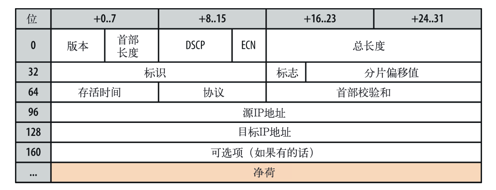

# Web性能权威指南

## Web 网络技术概览

### 延迟与带宽

#### 速度是关键
近几年来，WPO（Web Performance Optimization，Web 性能优化）产业从无到有，快速增长，充分说明用户越来越重视速度方面的用户体验。很多在公司的业绩已经证实：
+ 网站越快，用户的粘性越高；
+ 网站越快，用户忠诚度更高；
+ 网站越快，用户转化率越高；

简言之，速度是关键。要提高速度，必须先了解与之相关的各种因素，以及根本性的限制。下面主要介绍对所有网络通信都有决定性影响的两个方面：延迟和带宽。
+ 延迟。分组从信息源发送到目的地所需的时间。
+ 带宽。逻辑或物理通信路径最大的吞吐量。


#### 延迟的构成
延迟是消息（message）或分组（packet）从起到到终点经历的时间。这个定义简单明了，但却掩盖了很多有用的信息。事实上，任何系统都有很多因素可能影响传送消息的时间。因此，弄清楚这些因素是什么，以及它们如何影响性能是最重要的。

下面看看路由器这个负责在客户端和服务器之间转发消息的设备，会牵涉哪些影响延迟的因素。
+ 传播延迟。消息从发送端到接收端需要的时间，是信号传播距离和速度的函数。
+ 传输延迟。把消息的所有比特转移到链路中需要的时间，是消息长度和链路速度的函数。
+ 处理延迟。处理分组首部、检查位错误及确定分组目标所需的时间。
+ 排队延迟。到来的分组排队等待处理的时间。

以上延迟的时间综合，就是客户端到服务器的总延迟时间。传播时间取决于距离和信号通过的媒介，另外传播速度通常不超过光速。而传输延迟由传输链路的速率决定，与客户端到服务器的距离无关。举个例子，假设有一个 10 MB 的文件，分别通过两个链路出阿叔，一个 1Mbit/s，另一个 100Mbit/s。在 1Mbit/s 的链路上，需要花 10s，而在 100Mbit/s 的链路上，只需 0.1s。

接着，分组到达路由器。路由器必须检测分组的首部，以确定出站路由，并且还可能对数据进行检查，这些都要花时间。由于这些检查通常由硬件完成，因此相应的延迟一般非常短，但再短也还是存在。最后，如果分组到达的速度超过了路由器的处理能力，那么分组就要在入站缓冲区排队。数据在缓冲区排队等待的时间，当然就是排队时延。

每个分组在通过网络时都会遇到这样或那样的延迟。发送端与接收端的距离越远，传播时间就越长。一路上经过的路由器越多，每个分组的处理和传输延迟就越多。最后，网络流量越拥挤，分组在入站缓冲区被延迟的可能性就越大。

#### 光速与传播延迟
光速是所有能量、物质和信息运动所能达到的最高速度。这个结论给网络分组的传播速度设定了上限。光在真空中的传播速度每秒能达到大约 30 万公里。而网络中的分组是通过铜线、光纤等介质传播的，这些介质会导致传播速度变慢。光速与分组在介质中传播速度之比，叫做该介质的折射率。这个值越大，光在该介质中传播的速度就越慢。

传播分组的光纤，大多数折射率从 1.4 到 1.6 不等。为简单起见，我们大都假定光通过光纤的速度约为每秒 20 万公里，对应的折射率约为 1.5。下表是信号延迟的具体例子。

路线       | 距离（km） | 光在真空中时间  |  光在光纤中时间  | 光纤中的往返时间（RTT）
---------  | -------- |  ------------ | -------------- | ---------------
纽约到旧金山 | 4 148    | 14 ms         | 21 ms          | 42 ms
纽约到伦敦   | 5 585    | 19 ms         | 28 ms          | 56 ms
纽约到悉尼   | 15 993   | 53 ms         | 80 ms          | 160 ms
赤道周长     | 40075    | 133.7 ms      | 200 ms         | 400 ms

光速已经很快了，尽管如此从纽约到悉尼的一个往返（RTT）也要花 160 ms。事实上，以上这些数字都是理想情况下的结果，因为我们假设传送分组的光缆恰好是连接两个城市的一条完美的大弧形线路（地球表面两点间的最短距离）。而实际上纽约到悉尼之间是没有这样一条线路的，分组旅行的距离比这要长得多。

研究表明，在软件交互中，哪怕 100 ~ 200 ms 左右的延迟，我们中的大多数人都会感觉到“拖拉”；如果超过了 300ms 的门槛，那就会说“反映迟钝”；而要是延迟达到 1000 ms（1s) 这个界限，很多人就会分神干点别的事儿。

结论很简单：要想给用户最佳的体验，而且保证它们全身关注于手边的任务，我们的应用必须在几百 ms 之内响应。这几乎没有给我们，特别是网络，留出多少出错的余地。若要成功，必须认证对待网络延迟，在每个开发阶段都为它设立明确的标准。

#### 延迟的最后一公里
所谓的“最后一公里”问题，指的是延迟中相当大的一部分时间往往花在了最后几公里，而不是在横跨大洋或大陆时产生的。最后一公里的延迟与提供商、部署方法、网络拓扑、甚至一天中的哪个时段都有很大关系。作为最终用户，如果你想提高自己上网的速度，那选择延迟最短的 ISP 是最关键的。

#### 使用 TraceRoute 测量延迟
traceroute 是一个简单的网络诊断工具，可以列出分组经过的路由节点，以及它在 IP 网络中每一条的延迟。为找到每一跳的节点，它会向目标发送一系列分组，每次发送时的“跳数限制”都会递增。在达到跳数限制时，中间的节点会返回 ICMP Time Exceeded 消息，traceroute 根据这个消息可以计算出每一跳的延迟。

#### 网络核心的带宽
光纤就是一根“光导管”，比人的头发稍微粗一点，专门用来从一端向另一端传送光信号。金属线则用于传送电信号，但信号损失、电磁干扰较大，同时维护成本也较高。这两种线路我们的数组分组很可能都会经过，但一般长距离的分组传输都是通过光纤完成的。

通过波分复用（WDM，Wavelength-Division Multiplexing）技术，光纤可以同时传输很多不同波长（信道)的光，因而具有明显的带宽优势。一条光纤连接的总带宽，等于每个信道的数据传输速率乘以可复用的信道数。

#### 网络边缘的带宽
构成因特网核心数据路径的骨干或光纤连接，每秒能够移动数百太比特信息。然而，网络边缘的容量就小得多了，而且很大程度上取决于部署技术，比如拨号连接、DSL、电缆、各种无线技术、光纤到户，甚至与局域网路由器的性能也有关系。用户可用带宽取决于客户端与目标服务器间最低容量连接。

### TCP 的构成
因特网有两个核心协议。
+ IP。Internet Protocol （因特网协议），负责联网主机之间的路由选择和寻址。
+ TCP。Transmission Control Protocol 传输控制协议。负载在不可靠的传输信道之上提供可靠的抽象层。

TCP 负载在不可靠的传输信道之上提供可靠的抽象层，向应用层隐藏了大多数网络通信的复杂细节，比如丢包重发、按序发送、拥塞控制及表面、数据完整等待。采用 TCP 数据流可以确保发送的所有字节能够完整地被接收到，而且到达客户端的顺序也一样。也就是说，TCP 专门为精确传送做了优化，但并未过多顾及时间。

HTTP 标准并未规定 TCP 就是唯一的传输协议。如果你愿意，还可以通过 UDP （用户数据报协议）或者其他可用协议来发送 HTTP 消息。但在现实当中，由于 TCP 提供过了很多有用的功能，几乎所有 HTTP 流量都是通过 TCP 传送的。

因此，理解 TCP 的某些核心机制就成为了优化 Web 体验的必修课。虽然我们一般不会直接使用 TCP 套接口，但应用层的一些决定可能会对 TCP 以及底层网络的性能产生极大影响。

#### 三报文握手
所有 TCP 连接一开始都要经过三报文握手。客户端与服务器在交换应用数据之前，必须就起始分组序列号，以及其他一些连接相关的细节达成一致。处于安全考虑，序列号由两端随机生成。


+ SYN。客户端选择一个随机序列号 x，并发送一个 SYN 分组，其中可能还包括其他 TCP 标志和选项。
+ SYN ACK。服务器给 x 加 1，并选择自己的一个随机序列号 y，追加自己的标志和选项，然后返回响应。
+ ACK。客户端给 x 和 y 加 1 并发送握手期间的最后一个 ACK 分组。

三次握手完成后，客户端与服务器之间就可以通信了。**客户端可以在发送 ACK 分组之后立即发送数据，而服务器必须等待收到 ACK 分组之后才能发送数据。**这个启动通信的过程适用于所有 TCP 连接，因此对所有使用 TCP 的应用具有非常大的性能印象，因为每次传输应用数据之前，都必须经历一次完整的往返。

举个例子，如果客户端在纽约，服务器在伦敦，要通过光纤启动一次新的 TCP 连接，光三次握手至少就要花 56 ms：向伦敦发送分组需要 28 ms，响应返回纽约又要 28 ms。再次，连接的带宽对时间没有影响，延迟完全取决于客户端和服务器之间的往返时间，这其中主要是纽约到伦敦之间的传输时间。

三次握手带来的延迟使得每创建一个新的 TCP 连接都要付出很大代价。而这也决定了提高 TCP 应用性能的关键，在于想办法重用连接。

##### TCP 快速打开
遗憾的是，连接并不是想重用就可以重用的。事实上，由于非常短的 TCP 连接在互联网上随处可见，握手阶段已经成为影响总延迟的一个重要因素。为解决这个问题，人们正在积极寻找各种方案，其中 TFO（TCP Fast Open，TCP 快速打开）就是这样一种机制，它致力于减少新建 TCP 连接带来的性能损失。

经过流量分析和网络模拟，谷歌研究人员发现 TFO 平均可以降低 HTTP 事务网络延迟 15%，整个页面加载时间 10% 以上。在某些延迟很长的情况下，降低幅度甚至可达 40%。

Linux 3.7 及之后的内核已经在客户端和服务器支持 TFO，因此成为了客户端和服务器操作系统选型的有力候选方案。即便如此，TFO 并不能解决所有问题。他虽然有助于减少三次握手的往返时间，但却只能在某些情况下有效。比如，随同 SYN 分组一起发送的数据净荷有最大尺寸限制、只能发送某些类型的 HTTP 请求、以及由于依赖加密 cookie，只能应用于重复的连接。

#### 拥塞预防及控制
1984 年初，John Nagle 提到了一个被称为“拥塞崩溃”的现象，这个现象会影响节点间带宽容量不对称的任何网络。
```
    拥塞控制是复杂网络中众所周知的一个问题。我们发现国防部的Internet Protocol（IP）——纯粹的数据报协议，
    和Transmission  Control  Protocol （TCP）——传输层协议，在一块使用时，由于传输层与数据报层之间的交互，
    会导致一些不常见的拥塞问题。特别是 IP 网关容易收到我们称为“拥塞崩溃“现象的严重影响，尤其是在这种网关连接
    不同带宽的网络时...

    可能是往返时间超过了所有主机的最大中断间隔，于是相应的主机会在网络中制造越来越多的数据报副本，
    使得整个网络陷入瘫痪。最终，所有交换节点的缓冲区都将被填满，多出来的分组必须删掉。目前的分组往返时间已经设定为最大值。
    主机会把每个分组都发送好几次，结果每个分组的某个副本会抵达目标。这就是拥塞崩溃。

    这种情况永远存在。达到饱和状态时，只要选择被删除分组的算法适当，网络就可以退而求其次地持续运行下去。
```

这份报告的结论是拥塞崩溃不会对 ARPANET 造成影响，因为其大多数节点的带宽相同，而且其骨干网的容量相对大得多。然后，这两种情况没有持续太久。1986 年，随着加入网络的节点数量（5000+）及类型日益增多，该网络中发生了一系列拥塞崩溃故障。个别情况下，容量下降为千分之一，网络完全瘫痪。

为了解决这些问题，TCP 加入了很多机制，以便控制双向发送数据的速度，比如流量控制、拥塞控制和拥塞预防机制。

##### 流量控制
流量控制是一种预防发送端过多向接收端发送数据的机制。否则，接收端可能因为忙碌，负载中或缓冲区既定而无法处理。为实现流量控制，**TCP 连接的每一方都要通告自己的接收窗口（rwnd），其中包含保存数据的缓冲区空间大小信息。**


第一次建立连接时，两端都会使用自身系统的默认设置来发送 rwnd。浏览网页通常主要是从服务器向客户端下载数据，因此客户端窗口跟可能称为瓶颈。然而，如果是在上传图片或视频，即客户端向服务器传送大量数据时，服务器的接收窗口又可能称为制约因素。

不管怎样，如果其中一端跟不上数据传输，那它可以向发送端通告一个较小的窗口。假如窗口为零，则意味着必须由应用层先清空缓冲区，才能再接收剩余数据。这个过程贯穿于每个 TCP 连接的整个生命周期：每个 ACK 分组都会携带响应的最新 rwnd 值，以便两端动态调整数据流速，使之适应发送端和接收端的容量及处理能力。

###### 窗口缩放 RFC 1323
最初的 TCP 规范分配给通告窗口大小的字段是 16 位的，这相当于设定了发送端和接收端窗口的最大值（ 65535 字节）。结果，在这个限制内经常无法获得最优性能，特别是在那些“带宽延迟积”很高的网络中。

为解决这个问题，RFC  1323提供了“TCP窗口缩放”（TCP  Window  Scaling）选项，可以把接收窗口大小由 65535 字节提高到 1G 字节！缩放 TCP 窗口是在三次握手期间完成的，其中有一个值表示在将来的ACK 中左移 16 位窗口字段的位数。

今天，TCP 窗口缩放机制在所有主平台上都是默认启用的。不过，中间节点和路由器可以重写，甚至完全去掉这个选项。如果你的路由器或客户端的连接不能完全利用现有带宽，那往往该查一查窗口大小。在 linux 中，可以通过如下命令检查和启用窗口缩放选项：
+ sysctl net.ipv4.tcp_window_scaling
+ sysctl -w net.ipv4.tcp_window_scaling=1

##### 慢启动
尽管 TCP 有了流量控制机制，但网络拥塞崩溃仍然在 1980 年代中后期浮出水面。流量控制确实可以防止发送端向接收端过多发送数据，但却没有机制预防任何一段向钱在潜在网络过多发送数据。换句话说，发送端和接收端在连接建立之初，谁也不知道可用带宽是多少，因此需要一个估算机制，然后还要根据网络中不断变化的条件而动态改变速度。

要说明这种动态适应机制的好处，可以想象你在家里观看一个大型的流视频。视频服务器会尽最大努力根据你的下行连接提供最高品质信息。而此时，你家里又有人打开一个新连接下载某个软件的升级包。可供视频流使用的下行带宽一下子少了很多，视频服务器必须调整它的发送速度。否则，如果继续保持同样的速度，那么数据很快就会在某个中间的网关越积越多，最终会导致分组被删除，从而降低网络传输效率。

1988年，Van  Jacobson和Michael  J.  Karels撰文描述了解决这个问题的几种算法：慢启动、拥塞预防、快速重发和快速恢复。这4种算法很快被写进了TCP规范。事实上，正是由于这几种算法加入TCP，才让因特网在20世纪80年代末到90年代初流量暴增时免于大崩溃。

要理解慢启动，最好看一个例子。同样，假设纽约有一个客户端，尝试从位于伦敦的服务器上取得一个文件。首先，三次握手，而且在此期间双方各自通过ACK分组通告自己的接收窗口（rwnd）大小（图2-2）。在发送完最后一次ACK分组后，就可以交换应用数据了。

此时，根据交换数据来估算客户端与服务器之间的可用带宽是唯一的方法，而且这也是慢启动算法的设计思路。首先，服务器通过TCP连接初始化一个新的拥塞窗口（cwnd）变量，将其值设置为一个系统设定的保守值（在Linux中就是initcwnd）。
+ 拥塞窗口大小（cwnd）。发送端对从客户端接收确认（ACK）之前可以发送数据量的限制。

**发送端不会通告cwnd变量，即发送端和接收端不会交换这个值。客户端与服务器之间最大可以传输（未经ACK确认的）数据量取 rwnd 和 cwnd 变量中的最小值。**

位于伦敦的服务器只是维护拥塞窗口这么一个私有变量。那服务器和客户端怎么确定拥塞窗口大小的最优值呢？毕竟，网络状况随时都在变化，即使相同的两个网络节点之间也一样。

解决方案就是慢启动，即在分组被确认后增大窗口大小，慢慢地启动！最初，cwnd 的值只有 1 个 TCP 段。1999年4月，RFC 2581将其增加到了 4 个 TCP 段。2013年4月，RFC 6928再次将其提高到 10 个 TCP 段。

新 TCP 连接传输的最大数据量取 rwnd 和 cwnd 的最小值，而服务器实际上可以向客户端发送 4 个 TCP 段，然后就必须停下来确认。此后，每收到一个 ACK，慢启动算法就会告诉服务器可以将它的 cwnd 窗口增加 1 个 TCP 段。每次收到 ACK 后，都可以多发送两个新的分组。TCP 连接的这个阶段通常被称为”指数增长“阶段。因为客户端和服务器都在向两者之间网络路径的有效带宽迅速靠拢。


为什么知道有个慢启动对我们构建浏览器应用这么重要呢?因为包括 HTTP 在内的很多应用层协议都运行在 TCP 之上，无论带宽多大，每个 TCP 连接都必须经过慢启动阶段。换句话说，我们不可能一上来就完全利用连接的最大带宽!

相反，我们要从一个相对较小的拥塞窗口开始，每次往返都令其翻倍（指数式增大）。而达到某个目标吞吐量所需的时间，就是客户端与服务器之间的往返时间和初始拥塞窗口大小的函数。


现假设：
+ 客户端和服务器的接收窗口位 65535 字节（64KB）
+ 初始的拥塞窗口：4 段（RFC 2581）
+ 往返时间是 56 ms（伦敦到纽约)

新 TCP 连接的吞吐量一开始是受拥塞窗口初始值限制的。计算可知，要达到 64KB 的限制，需要把拥塞窗口大小增加到 45 段，而这需要 224 ms。
```
    65535 字节 / 1460 字节 ≈ 45 段
    56 ms * log(45/4) ≈ 224 ms
```

要达到客户端与服务器之间 64 KB 的屯屯粮，需要 4 次往返，几百 ms 的延迟！至于客户端与服务器之间实际的连接速率是不是在 Mbit/s 级别，丝毫不影响这个结果。这就是慢启动。


为减少增长到拥塞窗口的时间，可以减少客户端与服务器之间的往返时间。比如，把服务器部署到地理上靠近客户端的地方。要么，就把初始拥塞窗口大小增加到 RFC 9828 规定的 10 段。

慢启动导致客户端与服务器之间经过几百 ms 才能达到接近最大速度的问题，对于大型流式下载服务的影响倒不显著，因为慢启动的时间可以分摊到整个传输周期内消化掉。

可见，对于很多 HTTP 连接，特别是一些短暂、突发的连接而言，常常会出现还没有达到窗口请求就被终止的情况。换句话说，很多 Web 应用的性能经常收到服务器与客户端之间往返时间的制约。因为慢启动限制了可用的吞吐量，而这对于小文件传输非常不利。

###### 慢启动重启
除了调节新连接的传输速度，TCP 还实现了 SSR（Slow-Start Restart，慢启动重启）机制。这种机制会在连接空闲一定时间后重置连接的拥塞窗口。道理很简单，在连接空闲的同时，网络状况也可能发生了变化，为了避免拥塞，理应将拥塞窗口重置回”安全的“默认值。

毫无疑问，SSR 对于那些会出现突发空闲的长周期 TCP 连接（比如 HTTP 的 keep-alive 连接）有很大的影响。隐私，我们建议在服务器上禁用 SSR。在 linux 平台，可以通过如下命令来检查和禁用 SSR。
+ sysctl net.ipv4.tcp_slow_start_after_idle
+ sysctl -w net.ipv4.tcp_slow_start_after_idle=0

###### 慢启动对 HTTP 的影响
为演示三次握手和慢启动对简单 HTTP 传输的影响，我们假设纽约的客户端需要通过 TCP 连接向伦敦的服务器请求一个 20 KB 的文件，下面列出了连接的参数。
+ 往返时间：56 ms
+ 客户端到服务器的带宽：5 Mbit/s
+ 客户端和服务器接收窗口： 65535 字节。
+ 初始的拥塞窗口：4 段（4 * 1460 ≈ 5.7 KB）。
+ 服务器生成响应的处理时间：40 ms。
+ 没有分组丢失、每个分组都要确认、GET 请求只占 1 段。


+ 0 ms: 客户端发送 SYN 分组开始 TCP 握手。
+ 28 ms: 服务器响应 SYN-ACK 并指定其 rwnd 大小。
+ 56 ms: 客户端确认 SYN-ACK，指定其 rwnd 大小，并立即发送 HTTP GET 请求。
+ 84 ms: 服务器收到 HTTP 请求。
+ 124 ms: 服务器生成 20KB 的响应，并发送 4 个 TCP 段（初始 cwnd 大小为 4），然后等待 ACK。
+ 152 ms: 客户端收到 4 个段，并分别发送 ACK 确认。
+ 180 ms: 服务器针对每个 ACK 递增 cwnd，然后发送 8 个 TCP 段。
+ 208 ms: 客户端接收 8 个段，并分别发送 ACK 确认。
+ 236 ms: 服务器针对每个 ACK 递增 cwnd，然后发送剩余的 TCP 段。
+ 264 ms: 客户端收到剩余的 TCP 段，并分别发送 ACK 确认。

通过新 TCP 连接在往返时间为 56 ms 的客户端与服务器之间传输一个 20KB 的文件需要 264 ms! 作为对比，现在假设客户端可以重用一个 TCP 连接。再发送一次相同的请求。


+ 0 ms: 客户端发送 HTTP 请求。
+ 28 ms: 服务器收到 HTTP 请求。
+ 68 ms: 服务器生成 20 KB 响应，但 cwnd 已经大于发送文件所需的 15 段了，因此一次性发送所有数据段。
+ 96 ms: 客户端收到所有 15 个段，分别发送 ACK 确认。

同一个连接，同样的请求，但没有三次握手和慢启动，只花了 96 ms，性能提升幅度达 275% ！

以上两种情况下，服务器和客户端之间的 5 Mbit/s 带宽并不影响 TCP 连接的启动阶段。此时，延迟和拥塞窗口大小才是限制因素。

事实上，如果增大往返时间，第一次和第二次请求的性能差距只会加大。理解了 TCP 拥塞控制机制后，针对 keep-alive、流水线和多路复用的优化就简单得多了。

###### 增大 TCP 的初始拥塞窗口
把服务器的初始 cwnd 值增大到 RFC 6928 新规定的 10 段（IW10），是提升用户体验以及所有 TCP 应用性能的最简单方式。好消息是，很多操作系统已经更新了内核，采用了增大后的值。可以留意相应的文档和发布说明。在 Linux 上，IW 10 是 2.6.39 以上版本内核的新默认值。

##### 拥塞预防
认识到 TCP 调节性能主要依赖丢包反馈机制非常重要。换句话说，这不是一个假设命题，而是一个具体何时发生的命题。慢启动以保守的窗口初始化连接，随后的每次往返都会成倍提高传输的数据量，直到超过接收端的流量控制窗口，即系统配置的拥塞阈值（ssthresh）窗口，或者有分组丢失为止，此时拥塞预防算法介入。

拥塞预防算法把丢包作为网络拥塞的标志，即路径中某个连接或路由器已经拥堵了，以至于必须采取删包措施。因此，必须调整窗口大小，以避免造成更多的包丢失，从而保证网络畅通。

重置拥塞窗口后，拥塞预防机制按照自己的算法来增大窗口以尽量避免丢包。某个时刻，可能又会有包丢失，于是这个过程再从头开始。如果你看到过 TCP 连接的吞入量跟踪曲线，发现该曲线呈锯齿状，到现在就该明白为什么了。这是拥塞控制和预防算法在调整拥塞窗口，进而消除网络中的丢包问题。

###### TCP 比例降速
确定丢包恢复的最优方式并不容易。如果太激进，那么间歇性的丢包就会对整个连接的吞吐量造成很大影响。而如果不够快，那么还会继续造成更多分组丢失。最初，TCP 使用 AIMD（Multiplicative Decrease and Additive Increase，倍减加增）算法，即发生丢包时，先将拥塞窗口减半，然后每次往返再缓慢地窗口增加一个固定的值。不过，很多时候 AIMD 算法太过保守，因此又有了新的算法。

PRR(Proportional Rate Reduction，比例降速) 就是 RFC 6937 规定的一个新算法，其目标就是改进丢包后的恢复速度，改进效果如何呢？根据谷歌的测量，实现新算法后，因丢包造成的平均连接延迟减少了 3%~10%。

PRR 现在是 linux 3.2+ 内核默认的拥塞预防算法。

#### 带宽延迟积
TCP 内置的拥塞控制和预防机制对性能还有另一个重要影响：发送端和接收端理想的窗口大小，一定会因往返时间及目标传输速率而变化。

发送端和接收端之间在途未确认的最大数据量，取决于拥塞窗口（cwnd）和接收窗口（rwnd）的最小值。接收窗口会随每次 ACK 一起发送，而拥塞窗口则由发送端根据拥塞控制和预防算法动态调整。

无论发送端发送的数据还是接收端接收的数据超过了未确认的最大数据量，都必须停下来等待另一方 ACK 确认某些分组才能继续。要等待多长时间呢？取决于往返时间。

```
    BDP(Bandwidth-delay product，带宽延迟积)
    数据链路的容量与其端到端延迟的乘积。这个结果就是任意时刻处于在途未确认状态的最大数据量。
```

发送端和接收端无论谁被迫频繁地停止等待之前分组的 ACK，都会造成数据缺口，从而必然限制连接的最大屯屯粮。为解决这个问题，应该让窗口足够大，以保证任何一段都能在 ACK 返回前持续发送数据。只有传输不中断，才能保证最大吞吐量。而最优窗口大小取决于往返时间。无论实际或通告的带宽是多大，窗口过小都会限制连接的吞吐量。


那么，流量控制窗口（rwnd）和拥塞控制窗口（cwnd）的值多大合适呢？
```
    假设 cwnd 和 rwnd 的最小值为 16 KB，往返时间为 100ms: 
    16 KB = 16 * 1024 * 8 = 131072 bit
    131072 bit / 0.1s = 1310720 bit/s ≈ 1.31 Mbit/s
```

不管发送端和接收端的实际带宽多大，这个 TCP 的连接的数据传输速率不会超过 1.31 Mbit/s ! **想提高吞吐量，要么增大最小窗口值，要么减少往返时间。**

类似地，知道往返时间和两端的实际带宽也可以计算最优窗口大小。这一次我们假设往返时间不变（还是100ms），发送端的可用带宽为 10 Mbit/s，接收端则为 100Mbit/s+。还假设两端之间没有网络拥塞，我们的目标就是充分利用客户端的 10Mbit/s。
```
    10 Mbit/s = 10 * 1000 000 = 10 000 000 bit/s
    10 000 000 bit/s = 10 000 000 / (8 * 1024) = 1221 KB/s
    1221 KB/s * 0.1s = 122.1 KB
```
窗口至少需要 122.1 KB 才能充分利用 10 Mbit/s 带宽！如果没有窗口缩放（RFC 1323），TCP 接收窗口最大只有 64 KB。是不是该好好查查自己的客户端和服务器设置了？

好在窗口大小的协商与调节由网络栈自动调整。尽管如此，窗口大小有时候仍然是 TCP 性能的限制因素。如果在高速连接的客户端与服务器之间，实际传输速度只有可用带宽的几分之一，那窗口大小很可能就是罪魁祸首。要么因为某一饱和通告的接收窗口很小，要么因为网络拥塞和丢包导致拥塞窗口重置，更可能因为流量增长过快导致对连接吞吐量施加了限制。

##### 高速局域网中的带宽延迟积
BDP 是往返时间和目标传输速度的函数。因此，往返时间不仅在高传输延迟中是一个常见的瓶颈，就算在 LAN 中也可能是一个瓶颈。

要想在 1 ms 的往返时间内达到 1GBit/s 的传输速度，拥塞窗口同样至少要有 122KB，计算过程与前面类似。

#### 队首阻塞
TCP 在不可靠的信道上实现了可靠的网络传输。基本的分组错误检测与纠正、按序交付、丢包重发，以及保证网络最高效率的流量控制、拥塞控制和预防机制，让 TCP 称为大多数网络应用中最常见的传输协议。

虽然 TCP 很流行，但它并不是唯一的选择，而且在某些情况下也不是最佳的选择。特别是按序交付和可靠交付有时候并不必要，反而会导致额外的延迟，对性能造成负面影响。

要理解为什么，可以想一想，每个 TCP 分组都会带着一个唯一的序列号被发出，而所有分组必须按顺序传送到接收端。如果中途有一个分组没能到达接收端，那么后续分组必须保存在接收端的 TCP 缓冲区，等待丢失分组重发并到达接收端。这一切都发生在 TCP 层，应用程序对 TCP 重发和缓冲区排队的分组一无所知，必须等待分组全部到达后才能访问数据。在此之前，应用程序只能在通过套接字读数据时感觉到延迟交付。这种效应称为 TCP 的队首（HOL，Head of Line)阻塞。


队首阻塞造成的延迟可以让我们的应用程序不用关心分组重排和重组，从而让代码保持简洁。然后，代码简洁也要付出代价，那就是分组到达时间会存在无法预知的延迟变化。这个时间变化通常被称为抖动。也是影响应用程序性能的一个主要因素。

另外，有些应用程序可能并不需要可靠的交付或者不需要按顺序交付。比如，**每个分组都是独立的消息，那么按顺序交付就没有任何必要。而且，如果每个消息都会覆盖之前的消息，那么可靠交付同样也没有必要了**。可惜的是，TCP 不支持这种情况，所有分组必须按序交付。

**无需按序交付数据或能够处理分组丢失的应用程序，以及对延迟或抖动要求很高的应用程序，最好选择 UDP 等协议。**

##### 丢包就丢包
事实上，丢包是让 TCP 达到最佳性能的关键。被删除的包恰恰是一种反馈机制，能够让接收端和发送端各自调整速度，以避免网络拥堵，同时保持延迟最短。另外，有些应用程序可以容忍丢失一定数量的包，比如语音和游戏状态通信，就不需要可靠传输或按序交付。

就算有个包丢失了，音频编解码只要在音频中插入一个小小的间歇，就可以继续处理后来的包。只要间歇购销，用户就注意不到，而等待丢失的包则可能导致音频输出产生无法预料的暂停。相对来说，后者的用户体验更糟糕。

类似地，更新 3D 游戏中的角色的状态也一样：收到 T 时刻的包而等待 T - 1 时刻的包通常毫无必要。理想情况下，应该可以接受所有状态更新，但为避免游戏延迟，间歇性的丢包也是可以接受的。

#### 针对 TCP 的优化建议
TCP 是一个自适应的、对所有网络节点一视同仁的、最大限制利用底层网络的协议。因此，优化 TCP 的最佳途径就是调整它感知当前网络状况的方式，根据它之上或之下的抽象层的类型和需求来改变它的行为。无线网络可能需要不同的拥塞算法，而某些应用程序可能需要自定义服务品质（QoS，Quality of Service）的含义，从而交付最佳的体验。

不同应用程序需求间的复杂关系，以及每个 TCP 算法中的大量因素，使得 TCP 调优成为学术和商业研究的一个“无底洞”。上述只简单地介绍了影响 TCP 性能的几个典型因素，而没有探讨的选择性应答(SACK)、延迟应答、快速转发等，随便一个都能让人领略到 TCP 的复杂性，感受到理解、分析和调优之难。

尽管如此，而且每个算法和反馈机制的具体细节可能会继续发展，但核心原理以及它们的影响是不变的：
+ TCP 三次握手增加了整整一次往返时间。
+ TCP 慢启动将被应用到每个新连接
+ TCP 流量及拥塞控制会影响所有连接的吞吐量
+ TCP 的吞吐量由当前拥塞窗口大小控制

结果，现代高速网络中的 TCP 连接的数据传输速度，往往会受到接收端和发送端之间往返时间的限制。另外，尽管带宽不断增长，但延迟依旧受限于光速，而且已经限定在了其最大值的一个很小的常数因子之内。大多数情况下，TCP 的瓶颈都是延迟，而非带宽。

##### 服务器配置调优
在着手调整 TCP 的缓冲区、超时等数十个变量之前，最好先把主机操作系统升级到最新版本。TCP 的最佳实践以及影响其性能的底层算法一直在与时俱进，而且大多数变化都只在最新内核中才能实现。一句话，让你的服务器跟上时代是优化发送端和接收端 TCP 栈的首要措施。

有了最新的内核，我们推荐你遵循如下最佳实践来配置自己的服务器。
+ 增大 TCP 的初始拥塞窗口。加大起始拥塞窗口可以让 TCP 在第一次往返就传输较多数据，而随后的速度提升也会很明显。对于突发性的短暂连接，这也是特别关键的一个优化。
+ 慢启动重启。在连接空闲时禁用慢启动可以改善瞬时发送数据的长 TCP 连接的性能。
+ 窗口缩放。（RFC 1323）。启用窗口缩放可以增大最大接收窗口大小，可以让高延迟的连接达到更好吞吐量。
+ TCP 快速打开。在某些条件下，允许在第一个 SYN 分组中发送应用程序数据。TFO（TCP fast open，TCP 快速打开）是一种新的优化选项，需要客户端和服务器共同支持。为此，首先要搞清楚你的应用程序是否可以利用这个特性。

以上几个设置再加上最新的内核，可以确保最佳性能：每个 TCP 连接都会具有较低的延迟和较高的吞吐量。

##### 应用程序行为调优
调优 TCP 性能可以让服务器和客户端之间达到最大吞吐量和最小延迟。而应用程序如何使用新的或已经建立的 TCP 连接同样也有很大的关系。
+ 再快也快不过什么也不用发送，能少发就少发。
+ 我们不能让数据传输的更快，但可以让他们传输的距离更短。
+ 重用 TCP 连接是提升性能的关键。

当然，消除不必要的数据传输本身就是很大的优化。比如，减少下载不必要的资源，或者通过压缩算法把要发送的比特数降到最低。然后，通过在不同的地区部署服务器（比如，使用 CDN），把数据放到接近客户端的地方，可以减少网络往返的延迟，从而显著提升 TCP 性能。最后，尽可能重用已经建立的 TCP 连接，把慢启动和其他拥塞控制机制的影响降到最低。

##### 性能检查清单
优化 TCP 性能的回报是丰厚的，无论什么应用，性能提升可以在与服务器的每个连接中体现出来。下面几条尤其注意。
+ 把服务器内核升级到最新版本（linux: 3.2+）
+ 确保 cwnd 大小为 10；
+ 禁用空闲后的慢启动
+ 确保启动窗口缩放
+ 减少传输冗余数据
+ 压缩要传输的数据
+ 把服务器放到离用户近的地方以减少往返时间
+ 近最大可能重用已经建立的 TCP 连接。

### UDP 的构成
1980年8月，紧随TCP/IP之后，UDP（User  Datagram  Protocol，用户数据报协议）被John  Postel加入了核心网络协议套件。当时，正值TCP和IP规范分立为两个单独的RFC。这个时间点非常重要，稍后我们会看到，UDP的主要功能和亮点并不在于它引入了什么特性，而在于它忽略的那些特性。UDP经常被称为无（Null）协议，RFC 768 描述了其运作机制，全文完全可以写在一张餐巾纸上。
+ 数据报。一个完整、独立的数据实体，携带者从源节点到目的地节点的足够信息，对这些节点间之前的数据交换和传输网络没有任何依赖。

数据报（datagran）和分组（packet）是两个经常被人混用的词，实际上它们还是由区别的。分组可以用来指代任何格式化的数据块，而数据报则通常只用来描述那些通过不可靠的服务传输的分组，既不保证送达，也不发送失败通知。

关于 UDP 的应用，最广为人知同时也是所有浏览器和因特网应用都赖以运作的，就是 DNS（Domain Name System，域名系统）。DNS 负责把对人类友好的主机名转换成 IP 地址。可是，尽管浏览器有赖于 UDP，但这个协议以前从未被看成网页和应用的关键传输机制。HTTP 并未规定要使用 TCP，但现实中所有 HTTP 实现（以及构建于其上的所有服务）都使用 TCP。

不过，这都是过去的事了。IETF 和 W3C 工作组共同制定了一套新 API--WebRTC（Web Real-Time Communication，Web 实时通信）。WebRTC 着眼在浏览器中通过 UDP 实现原生的语音和视频实时通信，以及其他形式的 P2P（Peer-to-Peer，端到端）的通信。正是因为 WebRTC 的出现，UDP 作为浏览器中重要传输机制的地位才得以突显，而且还有了浏览器 API。

#### 无协议服务
要理解为什么 UDP 被人称作“无协议“，比从作为 TCP 和 UDP 下一层的 IP 协议说起。

IP 层主要任务就是按照地址从源主机向目标主机发送数据报。为此，消息会被封装在一个 IP 分组内，其中载明了源地址和目标地址，以及其他一些路由参数。注意，数据报这个词暗示了一个重要的信息：**IP 层不保证消息可靠的交付**，也不发送失败通知，实际上是把底层网络的不可靠性直接暴露给了上一层。如果某个路由节点因为网络拥塞、负载过高或其他原因而删除了 IP 分组，那么在必要的情况下，IP 的上一层协议负责检测、恢复和重发数据。



UDP 协议会用自己的分组结构封装用户消息，它只增加了 4 个字段: 源端口、目标端口、分组长度和校验和。这样，当 IP 分组送达目标主机时，该主机能够拆开 UDP 分组，根据目标端口找到目标应用程序，然后再把消息发送过去。


事实上，UDP 数据报中的源端口和校验和字段都是可选的。IP 分组的首部也有校验和，应用程序可以忽略 UDP 校验和。也就是说，所有错误检测和错误纠正工作都可以委托给上层的应用程序。说到底，UDP 仅仅是在 IP 层之上通过嵌入应用程序的源端口和目标端口，提供了一个”应用程序多路复用“机制。明白了这一点，就可以总计以下 UDP 的无服务是怎么回事了。
+ 不保证消息交付。不确认，不重传，无超时。
+ 不保证交付顺序。不设置包序号，不重排，不会发生队首阻塞。
+ 不跟踪连接状态。不必建立连接或重启状态机。
+ 不需要拥塞控制。不内置客户端或网络反馈机制。

TCP 是一个面向字节流的协议，能够以多个分组形式发送应用程序消息，且对分组中的消息范围没有任何明确限制。因此，连接的两端存在一个连接状态，每个分组都有序号，丢失还要重发，并且要按顺序交付。相对来说，UDP 数据报有明确的限制：数据报必须封装在 IP 分组中，应用程序必须读取完整的消息。换句话说，数据包不能分片。

UDP 是一个简单、无状态的协议，适合作为其他上层应用协议的辅助。实际上，这个协议的所有决定都需要由上层的应用程序作出。不过，在急着去实现一个协议来扮演 TCP 的角色之前，你还应该认真想一想这里涉及的复杂细节，比如 UDP 要与很多中间设备打交道（NAT 穿透），再想一想涉及网络协议的那些最佳实践。如果没有周密的设计和规划，一流的构想也可能沦为二流的 TCP 实现。TCP 中的算法和状态机已经经过了几十年的磨合与改进，而且吸收几十种并不那么容易重新实现的机制。

#### UDP 与网络地址转换器
IPv4地址只有32位长，因而最多只能提供42.9亿个唯一IP地址。1990年代初，互联网上的主机数量呈指数级增长，但不可能所有主机都分配一个唯一的IP地址。1994年，作为解决IPv4地址即将耗尽的一个临时性方案，IP网络地址转换器（NAT，Network Address Translator）规范出台了，这就是RFC 1631。

建议的IP重用方案就是在网络边缘加入NAT设备，每个NAT设备负责维护一个表，表中包含本地IP和端口到全球唯一（外网）IP和端口的映射（图3-3）。这样，NAT设备背后的IP地址空间就可以在各种不同的网络中得到重用，从而解决地址耗尽问题。


新增的NAT设备不仅立杆见影地解决了地址耗尽问题，而且迅速成为很多公司及家庭代理和路由器、安全装置、防火墙，以及其他许多硬件和软件设备中的内置组件。NAT 不再是个临时性方案，它已经成了因特网基础设施的一个组成部分。

##### 连接状态超时
NAT 转换的问题（至少对于 UDP 而言）在于必须维护一份精确的路由表才能保证数据转发。NAT 设备依赖连接状态，而 UDP 没有状态。这种根本上的错配是很多 UDP 数据报传输问题的总根源。况且，客户端前面由很多个 NAT 设备的情况也不鲜见，问题就此进一步恶化了。

每个 TCP 连接都有一个设计周密的协议状态机，从握手开始，然后传输应用数据，最后通过明确的信号确认关闭连接。在这种设计下，路由设备可以监控连接状态，根据情况创建或删除路由表中的条目。而 UDP 呢，没有握手，没有连接终止，实际根本没有可监控的连接状态机。

发送出站 UDP 不费事，但路由响应却需要转换表中有一个条目能告诉我们本地目标主机的 IP 和端口。因此，转换器必须保存每个 UDP 流的状态，而 UDP 自身却没有状态。

更糟糕的是，NAT 设备还被赋予了删除转换记录的责任，但由于 UDP 没有连接终止确认缓解，任何一端随时可以停止传输数据报，而不必发送通告。为解决这个问题，UDP 路由记录会定时过期。定时多长？没有规定，完全取决于转换器的制造商、型号、版本和配置。因此，对于较长时间的 UDP 通信，有一个事实上的最佳做法，即引入一个双向 keep-alive 分组，周期性地重置传输路径上所有 NAT 设备中转换记录的计时器。

###### TCP 超时和 NAT
从技术角度将，NAT 设备不需要额外的 TCP 超时机制。TCP 协议就遵循一个设计严密的握手与终止过程，通过这个过程就可以确定何时需要添加或删除转换记录。遗憾的是，实际应用中的 NAT 设备给 TCP 和 UDP 会话应用了类似的超时逻辑。这样就导致 TCP 连接有时候也需要双向 keep-alive 分组。如果你的 TCP 连接突然断开，那很有可能就是中间 NAT 超时造成的。

##### NAT 穿透
**不可预测的连接状态处理**是 NAT 设备带来的一个严重问题，但更为严重的则是很多应用程序根本就不能建立 UDP 连接。尤其是 P2P 应用程序，设计 VoIP、游戏和文件共享等，它们客户端与服务器经常需要角色互换，以实现端到端的双向通信。

NAT 带来的第一个问题，就是内部客户端不知道外网 IP 地址，只知道内网 IP 地址。NAT 负责重写每个 UDP 分组中的源端口、地址，以及 IP 分组中的源 IP 地址。如果客户端在应用数据中以其内网 IP 地址与外网主机通信，连接必然失败。所谓的”透明“转换因此也就成了一句空话，如果应用程序想与私有网络外部的主机通信，那么它首先必须知道自己的外网 IP 地址。

然而，知道外网 IP 地址还不是实现 UDP 传输的充分条件。任何到达 NAT 设备外网 IP 的分组还必须有一个目标端口，而且 NAT 转换表中也要有一个条目可以将其转换为内部主机的 IP 地址和端口号。如果没有这个条目（通常是从外网数据进来），那到达的分组就会被删除。此时的 NAT 设备就像一个分组过滤器，除非用户通过端口转发（映射）或类似机制配置过，否则它无法确定将 .分组发送给哪台内部主机。

需要注意的是，上述行为对客户端应用程序不是问题。客户端应用程序基于内部网络实现交互，会在交互期间建立必要的转换记录。不过，如果隔着 NAT 设备，那客户端（作为服务器）处理来自 P2P 应用程序（VoIP、游戏、文件共享）的入站连接时，就必须面对 NAT 穿透问题。

为解决 UDP 与 NAT 的这种不搭配，人们发明了很多穿透技术（TURN、STUN、ICE），用于在 UDP 主机之间建立端到端的连接。

#### STUN、TURN 与 ICE
STUN（Session Traversal Utilities for NAT）是一个协议（RFC 5389），可以让应用程序发现网络中的地址转换器，发现之后进一步取得为当前连接分配的外网 IP 地址和端口。为此，这个协议需要一个已知的第三方 STUN 服务器支持，该服务器必须架设在公网上。


假设 STUN 服务器的IP 地址已知（通过 DNS 查找或手工指定），应用程序首先向 STUN 服务器发送一个绑定请求。然后，STUN 服务器返回一个相应，其中包含在外网中代表客户端的 IP 地址和端口号。这种简单的方式解决了前面讨论的一些问题：
+ 应用程序可以获得外网 IP 和端口，并利用这些信息与对端通信；
+ 发送到 STUN 服务器的出站绑定请求将在通信要经过的 NAT 中建立路由条目，使得到达该 IP 和端口的入站分组可以找到内网中的应用程序；
+ STUN 协议定义了一个简单 keep-alive 探测机制，可以保证 NAT 路由条目不超时。

有了这个机制，STUN 并不能适应所有类型的 NAT 和网络配置。不仅如此，某些情况下 UDP 还会被防火墙或其他网络设备完全屏蔽。这种情况在很多企业网很常见。为解决这个问题，在 STUN 失败的情况下，我们还可以使用 TURN（Traversal Using Relays around NAT）协议（RFC 5766）作为后备。TURN 可以在最坏的情况下跳过 UDP 而切换到 TCP。

TURN 中的关键词是中继（relay）。这个协议依赖于外网中继设备在两端间传递数据。


+ 两端都要向同一台 TURN 服务器发送分配请求来建立连接，然后再进行权限协商。
+ 协商完毕，两端都把数据发送到 TURN 服务器，再由 TURN 服务器转发，从而实现通信。

很明显，这就不再是端到端的数据交换了。TURN 是在任何网络中为两端提供连接的最可靠方式，但运维 TURN 服务器的投入也很大。至少，为满足传输数据的需要，中继设备的容量必须足够大。因此，最好在其他直连手段都失败的情况下，再使用 TURN。

##### 现实中的 STUN 和 TURN
谷歌的 libjingle 是一个用 C++ 开发的用于构建端到端应用程序的开源库，负载在后台实现 STUN、TURN 和 ICE 协商。谷歌聊天软件 Google Talk 使用的就是这个库，其文档也为我们考量现实中的 STUN 与 TURN 性能提供了有价值的参考。
+ 92% 的时间可以直接连接（STUN）
+ 8% 的时间要使用中继器（TURN）

由于 NAT 设备遍地都是，相当一部分用户不能通过 STUN 直接建立 P2P 连接。若要提供可靠的 UDP 服务，现实中必须同时支持 STUN 和 TURN。

##### ICE
构建高效的 NAT 穿透方案可不容易。好在，还有 ICE（Interactive Connectivity Establishment)协议（RFC 5245）。ICE 规定了一套方法，致力于在通信各端之间建立一条最有效的通道：能直连就直连，必要时 STUN 协商，再不行使用 TURN。


实际开发中，如果你想构建基于 UDP 的 P2P 应用程序，绝对应该选择现有的平台 API，或者实现了 ICE、STUN 和 TURN 的第三方库。

#### 针对 UDP 的优化建议
UDP 是一个简单常用的协议，经常用于引导其他传输协议。事实上，UDP 的特色在于它所省略的那些功能：连接状态、握手、重发、重组、重排、拥塞控制、拥塞预防、流量控制，甚至可选的错误检测，统统没有。这个面向消息的传输层在提供灵活性的同时，也给实现者带来了麻烦。你的应用程序很可能需要从头实现上述几个或者大部分功能，而且每项功能都必须保证与网络中的其他主机和协议和谐共存。

与内置流量和拥塞控制以及拥塞预防的 TCP 不同，UDP 应用程序必须自己实现这些机制。拥塞处理不到位的 UDP 应用程序很容易堵塞网络，造成网络性能下降，严重时还会导致网络阻塞崩溃。如果你想在自己的应用程序中使用 UDP，务必要恩正研究和学习当下的最佳实践和建议。RFC 5405 就是这么一份文档，它对设计单播 UDP 应用程序给出了很多设计建议，简述如下：
+ 应用程序必须容忍各种因特网路径条件；
+ 应用程序应该控制传输速度；
+ 应用程序应该对所有流量进行拥塞控制；
+ 应用程序应该使用与 TCP 相近的带宽
+ 应用程序应该准备基于丢包的重发计数器；
+ 应用程序应该不发送大于路径 MTU 的数据报
+ 应用程序应该处理数据报丢失、重复和重排；
+ 应用程序应该足够稳定以支持 2 分钟以上的交付延迟；
+ 应用程序应该支持 IPv4 UDP 校验和，必须支持 IPv6 校验和。
+ 应用程序可以在需要时使用 keep-alive（最小间隔 15 秒）。

### 传输层安全 TLS
SSL (Secure Sockets Layer, 安全套接字层) 协议最初是网景公司为了保障网上交易安全而开发的，该协议通过加密来保护客户个人资料，通过认证和完整性检查来确保交易安全。为达到这个目标，SSL 协议在直接位于 TCP 上一层的应用层被实现。SSL 不会影响上层协议（如 HTTP、电子邮件、即时通讯），但能够保证上层协议的网络通信安全。


在正确使用 SSL 的情况下，第三方坚挺着只能推断出 连接的端点、加密类型，以及发送数据的频率和大致数量，不能实际读取或修改任何数据。

SSL 2.0 是该协议的第一个公开发布的版本，但由于存在很多安全缺陷很快就被 SSL 3.0 取代。鉴于 SSL 协议是网景公司专有的，IETF 成立了一个小组负责标准化该协议，后来就有了 RFC 2246，即 TLS 1.0，也就是 SSL 3.0 的升级版。

#### 加密、身份验证与完整性
TLS 协议的目标是为在它之上的应用提供三个基本服务：加密、身份验证和数据完整性。从技术角度将，并不是所有情况下都要同时使用这三个服务。比如，可以接受证书但不验证其真实性，而前提是你非常清楚这样做有什么安全风险且有防范措施。实践中，安全的 Web 应用都会利用这三个服务。
+ 加密。混淆数据的机制。
+ 身份验证。验证身份标识有效性的机制。
+ 完整性。检测消息是否被篡改或伪造的机制。

为了建立加密的安全数据通道，连接双方必须就加密数据的加密套件和密钥协商一致。TLS 协议规定了一套严密的握手程序用于交换这些信息。握手机制中最巧妙的地方，就是其使用的公钥密码系统，这套系统可以让通信双方不必事先”认识“即可商定共享的安全密钥，而且协商过程还是通过非加密通道完成的。

握手过程中，TLS 协议还允许通信两端互相验明正身。在浏览器中，验证机制允许客户端验证服务器就是它向联系的那个（比如，银行），而不是通过名字或 IP 地址伪装的目标。这个验证首先需要建立”认证机构信任链“（Chain of Trust and Certificate Authorities)。此外，服务器也可以选择验证客户端的身份。比如，公司的代理服务器可以验证所有雇员，每位雇员都应该有公司签发的独一无二的认证证书。

除了密钥协商和身份验证，TLS 协议还提供了自己的消息分帧机制，使用 MAC（Message Authentication Code，消息认证码）签署每一条消息。MAC 算法是一个单向加密的散列函数（本质上是一个校验和），密钥由连接双方协商确定。只要发送 TLS 记录，就会生成一个 MAC 值并附加到该消息中。接收端通过计算和验证这个 MAC 值来判断消息的完整性和可靠性。

上述三种机制为 Web 通信构建了一个安全的环境。所有现代 Web 浏览器都支持多种加密套件，能够验证客户端和服务器，并能对每条记录进行消息完整性检查。

##### Web 代理、中间设备、TLS 与新协议
HTTP 良好的扩展能力和获得的巨大成功，使得 Web 上出现了大量代理和中间设备：缓存服务器、安全网关、Web 加速器、内容过滤器，等等。有时候，我们知道这些设备的存在（显式代理），而有时候，这些设备对终端用户则完全不可见。

然而，这些服务器的存在及成功也给那些试图脱离 HTTP 协议的人带了一些不变。比如，有的代理服务器只会简单地转发自己无法解释的 HTTP 扩展或其他在线格式（wire format），而有的则不管是否必要都会对所有数据执行自己设定的逻辑，还有一些安全设备可能会把本来正常的数据误判成恶意通信。

换句话说，现实当中如果想脱离 HTTP 和 80 端口的语义行事，经常会遭遇各种部署上的麻烦。比如，某些客户端正常，另一个可能就会异常，甚至在某个网段表现正常的客户端到了另一个网段又会变得异常。

为解决这些问题，出现了一些新协议和对 HTTP 的扩展，比如 WebSocket、SPDY 等。这些新协议一般要依赖于建立 HTTPS 信道，以绕过中间代理，从而实现可靠的部署，因为加密的传输信道会对所有中间设备都混淆数据。这样虽然解决了中间设备的问题，但却导致通信两端不能再利用这些中间设备，从而与这些设备提供的身份验证、缓存、安全扫描等功能失之交臂。

这就是为什么大多数 WebSocket 手册都告诉我们要使用 HTTPS 向移动客户端发送数据。随着时间推移，网络上的中间设备通过升级也开始能识别新协议，基于 HTTPS 部署的要求也将逐渐弱化。到时候，除非你的会话真的需要 TLS 提供的加密，身份验证和完整性检查功能，否则完全可以不用 HTTPS。

#### TLS 握手
客户端与服务器在通过 TLS 交换数据之前，必须协商建立加密信道。协商内容包括 TLS 版本、加密套件，必要时还会验证证书。然而，协商过程的每一步都需要一个分组在客户端和服务器之间往返一次，因而所有 TLS 连接启动时都要经历一定的延迟。


注: 上图中假设”光通过光纤“的单程时间都是 28 ms。

+ 0 ms: TLS 在可靠的传输层（TCP)之上运行，这意味着首先必须完成 TCP 的”三次握手“，即一次完整的往返。
+ 56 ms: TCP 连接建立之后，客户端再以纯文本形式发送一些规格说明，比如它所运行的 TLS 协议的版本、它所支持的加密套件列表，以及它支持或希望使用的另外一些 TLS 选项。
+ 84 ms: 然后，服务器取得 TLS 协议版本以备将来通信使用，从客户端提供的加密套件列表中选择一个，再附上自己的证书，将响应发送回客户端。作为可选项，服务器也可以发送一个请求，要求客户端提供证书以及其他 TLS 扩展参数。
+ 112 ms: 假设两段经过协商确定了共同的版本和加密套件，客户端页高高兴兴地把自己的证书提供给了服务器。然后客户端会生成一个新的对称密钥，用服务器的公钥啦加密，加密后发送给服务器，告诉服务器可以开始加密通信了。到目前为止，除了用服务器公钥加密的新对称密钥之外，所有数据都以明文形式发送。
+ 140 ms: 最后，服务器解密出客户端发来的对称密钥，通过验证消息的 MAC 检测消息完整性，再返回给客户端一个加密的 ”Finished“消息。
+ 168 ms： 客户端用它之前生成的对称密钥解密这条消息，验证 MAC，如果一切顺利，则建立信道并开始发送数据。

尽管我们的 Web 应用不一定参与上述过程，但最重要的是**每一个 TLS 连接在 TCP 的握手基础之上最多还需要两次额外的往返。**这些都会增加实际交换数据之前的等待时间。如果考虑步骤，通过 TLS 交付数据很可能会引入几百甚至几千 ms 的网络延迟。

##### 公钥与对称密钥加密的性能
公钥加密系统只在建立 TLS 信道的会话中使用。在此期间，服务器向客户端提供它的公钥，客户端生成对称密钥并用服务器的公钥对其加密，然后再将加密的对称密钥返回服务器。服务器继而用自己的私钥解密出客户端发来的对称密钥。

接下来，客户端与服务器之间的通信就全部使用客户端生成的共享密钥加密，这就是对称密钥加密。之所以这样设计，很大程度上是出于性能考虑，因为公钥加密需要很大的计算量。在装有 OpenSSL 的机器上，可用下面I命令查看相关性能摘要。
+ openssl speed rsa。（不同密钥的大小每秒的操作数）
+ openssl speed aes。(每秒的字节数)

##### 应用层协议协商 ALPN
理论上，网络上的任意两端都可以使用自定义的应用层协议进行通信。为此，需要提前确定使用什么协议、指定端口号（HTTP 是 80，TLS 是 443）、并配置所有客户端和服务器使用它们。然而在实践中，这种方法效率很低且很难做到。因为每个端口都必须得到认可，而防火墙及其他中间设备通常只允许在 80 和 443 端口上通信。

于是，为了简化自定义协议的部署，我们往往必须重用 80 或 443 端口，再通过额外的机制协商确定协议。80 端口是为 HTTP 保留的，而 HTTP 规范还专门为协商协议规定过了一个 Upgrade 首部。可是，使用 Upgrade 需要一次额外的往返时间，且由于很多中间设备的存在，协商结果也不可靠。

解决办法不难想象，那就是使用 443 端口，这是给（运行于 TLS 之上的）安全 HTTPS 会话保留的。由于端到端的加密信道对中间设备模糊了数据，因此这种方式就成为了一种部署任意新应用协议的可靠而快捷的方式。不过，虽然使用 TLS 保障了可靠性，但我们还需要一种机制来协商协议。

作为 HTTPS 会话，当然可以利用 HTTP 的 Upgrade 机制来协商，但这会导致一次额外的往返，造成延迟。那在 TLS 握手的同时协商协议可行吗？

顾名思义，应用层协议协商（ALPN，Application Layer Protocol Negoiation）作为 TLS 扩展，让我们能在 TLS 握手的同时协商应用协议，从而省掉了 HTTP 的 Upgrade 机制所需的额外往返时间。具体来说，整个过程分如下几步：
+ 客户端在 ClientHello 消息中追加一个新的 ProtocolNameList 字段，包含自己支持的应用协议；
+ 服务器检查 ProtocolNameList 字段，并在 ServerHello 消息中以 ProtocolName 字段返回选中的协议。

服务器可以从中选择一个协议名，否则如果不支持其中的任何协议，则断开连接。只要 TLS 握手完成、建立了加密信道并就应用协议达成一致，客户端与服务器就可以立即通信。

ALPN 抛开了 HTTP 的 Upgrade 机制，省却了一次往返的延迟。不过，TLS 握手还是必须的。事实上，ALPN 协商不会比基于非加密信道的 HTTP upgrade 更快，它只能保证通过 TLS 进行协议协商不会更慢。

###### NPN 与 ALPN 的根源
NPN（Next Protocol Neogoitation，下一代协议协商）是谷歌在 SPDY 协议中开发的一个 TLS 扩展，目的是通过在 TLS 握手期间协商应用协议来提高效率。听着耳熟吗？最终结果与 ALPN 功能等价。

ALPN 是 IETF 在 NPN 基础上修订并批准的版本。在 NPN 中，服务器广播自己支持的协议，客户端选择和确认协议。而在 ALPN 中，交换次序颠倒过来了，客户断先声明自己支持的协议，服务器选择并确认协议。这样修改的目的是为了让 ALPN 与其他协议协商标准保持一致。

换句话说，ALPN 是 NPN 的继任者，而 NPN 已经废弃。原来配置为使用 NPN 的客户端和服务器，都需要重新配置升级为 ALPN。

##### 服务器名称指示 SNI
网络上可以建立 TCP 连接的任意两端都可以建立加密 TLS 信道，客户端只需知道另一端的 IP 地址即可建立连接并进行 TLS 握手。然后，如果服务器想在一个 IP 地址为多个站点提供服务，而每个站点都拥有自己的 TLS 证书，那怎么办？

为了解决这个问题，SNI（Server Name Indication，服务器名称指示）扩展被引入 TLS 协议，该扩展允许客户端在握手指出就指明要连接的主机名。Web 服务器可以检查 SNI 主机名，选择适当的证书，继续完成握手。

###### TLS、HTTP 及专用 IP
TLS-SNI 机制与 HTTP 发送 Host 首部是相同的，只不过后者是客户端要在请求中包含站点的主机名。总之，都是相同的 IP 地址服务于不同的域名，而区分不同域名的手段就是 SNI 或 Host。

#### TLS 会话恢复
完整 TLS 握手会带来额外的延迟和计算量，从而给所有依赖安全通信的应用造成严重的性能损失。为了挽回某些损失，**TLS 提供了恢复功能，即在多个连接间共享协商后的安全密钥。**

##### 会话标识符
最早的”会话标识符“（Session Identifier，RFC 5246）机制是在 SSL 2.0 引入的，支持服务器创建 32 字节的会话标识符，并在 TLS 协商期间作为其”ServerHello“消息的一部分发送。

在内部，**服务器会为每个客户端保存一个会话 ID 和协商后的会话参数**。相应地，**客户端也可以保存会话 ID 信息，并将该 ID 包含在后续会话的”ClientHello“消息中**，从而告诉服务器自己还记着上次握手协商后的加套件和密钥呢，这些都可以重用。假设客户端和服务器都可以在自己的缓存中找到共享的会话 ID 参数，那么就可以进行简短握手。否则，就要重新启动一次全新的会话协商，生成新的会话 ID。

**借助会话标识符可以节省一次往返**，还可以省掉用于协商共享加密秘药的公钥加密计算。由于重用了之前协商过的会话数据，就可以迅速建立一个加密连接，而且同样安全。

在实际应用中，大多数 Web 应用会尝试与同一个主机建立多个连接，以便并行取得资源。在这种情况下，会话恢复就称为减少延迟及两端计算量的必备优化手段。

大多数现代浏览器在打开到相同服务器的新连接之前，都会有意等待第一个 TLS 连接完成。这样，后续的 TLS 连接就可以重用第一个 SSL 会话，从而避免重新握手造成的损失。


由于服务器必须为每个客户端都创建和维护一段会话缓存，”会话标识符“机制在实践中也会遇到问题，特别是对那些每天都要”接待"几万甚至几百万独立连接的服务器来说，问题就更多了。**由于每个打开的 TLS 连接都要占用内存，因此需要一套会话 ID 缓存和清除策略。**对于拥有很多服务器而且为获得最佳性能必须使用共享 TLS 会话缓存的热门站点而言，部署这些策略绝非易事。今天的很多高流量站点都在成功地使用会话标识符。只不过对于多服务器部署来说，为确保会话缓存的良心循环，必须对会话标识符进行周密的规划和系统的设计。

##### 会话记录单
为了解决上述服务器部署 TLS 会话缓存的问题，“会话记录单”（Session Ticket，RFC 5077）机制出台了，该机制不用服务器保存每个客户端的会话状态。相反，如果客户端表明其支持会话记录单，则服务器可以在完整 TLS 握手的最后一次交换中添加一条“新会话记录单”（New Session Ticket）记录，包含只有服务器知道的安全密钥加密过的所有会话数据。

然后，客户端将这个会话记录单保存起来，在后续会话的 ClientHello 消息中，可以将其包含在 SessionTicket 扩展中。这样，所有会话数据只保存在客户端。而由于数据被加密过，且密钥只有服务器知道，因此仍然是安全的。

这里所说的会话标识符和会话记录单机制，也经常被人称为“会话缓存“或”无状态恢复“机制。**无状态恢复机制的优点主要是消除了服务器端的缓存负担，通过要求客户端在与服务器建立新连接时提供会话记录单简化了部署（除非记录单过期）**。

实践中，在一组负载均衡服务器上部署会话记录单仍然要求周密规划和系统设计。比如，所有服务器一开始都拥有相同的会话密钥，然后再通过另外的机制定期在所有服务器端轮换共享的密钥。

#### 信任链与证书颁发机构
身份验证是建立每个 TLS 连接必不可少的部分。毕竟，加密信道两端可以是任何机器，包括攻击者的机器。为此，必须确保我们与之交谈的计算机是可信任的，否则之前的工作都是徒劳。为理解如何验证通信两端的身份，下面我们以张三和李四之间的验证为例简单说明一下。
+ 张三和李四分别生成自己的公钥和私钥。
+ 张三和李四分别隐藏自己的私钥。
+ 张三向李四公开自己的公钥，李四也向张三公开自己的公钥。
+ 张三向李四发送一条新消息，并用自己的私钥签名。
+ 李四使用张三的公钥验证收到的消息签名。

信任是上述交流的关键。公钥加密可以让我们使用发送端端的公钥验证消息是否使用了正确的私钥签名，但认可发送端仍然是基于信任。在上述交流中，张三和李四可以当面交换自己的公钥，因为它们互相认识，能够保证不被别人冒名顶替。可以说，它们已经通过之前安全（物理）的握手确认了对方。

接下来，张三收到王五发来的一条消息。张三从未见过王五，但王五自称是李四的朋友。事实上，为了证明自己是李四的朋友，王五还请李四用李四的私钥签署了自己的公钥，并在消息中附上了签名。此时，张三首先检查王五公钥中李四的签名。他知道李四的公钥，因而可以验证李四确实签署了王五的公钥。由于他信任李四对王五的签名，所以就接受了王五的消息，并对消息进行完整性检查，以确保消息确实来自王五。

刚才这个过程建立了一个信任链：张三信任李四，李四信任王五，通过信任的传递，张三信任王五。只要这条链上的人不会被冒名顶替，我们就可以继续扩展这个信任网络。


Web 以及浏览器中的身份验证与上述过程相同，这就意味着此次此刻你应该问自己：我的浏览器信任谁？我在使用浏览器的时候信任谁？这个问题至少有三个答案。
+ 手工指定证书。所有浏览器和操作系统都提供了一种手工导入信任证书的机制。至于如何获得证书和验证完整性则完全由你自己来定。
+ 证书颁发机构。CA（Certificate Authority，证书颁发机构）是被证书接受者（拥有者）和依赖证书的一方共同信任的第三方。
+ 浏览器和操作系统。每个操作系统和大多数浏览器都会内置一个知名证书颁发机构的名单。因此，你也会信任操作系统及浏览器提供和维护的可信任机构。

实践中，保存并手工验证每个网站的密钥通常是不切实际的。现实中最常见的方案就是让证书颁发机构替我们做这件事：浏览器指定可信任的证书颁发机构（根 CA），然后验证它们签署的每个站点的责任就转移到了它们头上，它们会审计和验证这些站点的证书没有被滥用或冒充。持有 CA 证书的站点的安全性如果遭到破坏，那撤销该证书也是证书颁发机构的责任。


几乎所有浏览器都允许用户检视自己安全连接的信任链，常见的访问入口就是地址栏头而上的锁图标，点击即可查看。整个链条的”信任链据“是根证书颁发机构。每个浏览器都会内置一个可信任的证书颁发机构（根机构）的名单，在此浏览器相信而且能够验证根证书。实际上通过浏览器到浏览器开发商，再到证书颁发机构的信任链传递，可以把信任扩展至目标站点。

#### 证书销毁
有时候，处于种种原因，证书颁发者需要撤销或作废证书，比如证书的私钥不再安全，证书颁发机构本身被冒名顶替，或者其他各种正常的原因，像以旧换新或所属关系更替等，为此，证书本身会包含如何检测其是否过期的指令。为确保信任链不被破坏，通信的任何一端都可以根据嵌入的指令和签名检查链条中每个证书的状态。

##### 证书撤销名单 CPL
CRL（Certificate  Revocation  List，证书撤销名单）是RFC 5280 规定的一种检查所有证书状态的简单机制：每个证书颁发机构维护并定期发布已撤销证书的序列号名单。这样，任何想验证证书的人都可以下载撤销名单，检查相应证书是否榜上有名。如果有，说明证书已经被撤销了。

CRL文件本身可以定期发布、每次更新时发布，或通过HTTP或其他文件传输协议来提供访问。这个名单同样由证书颁发机构签名，通常允许被缓存一定时间。实践中，这种机制效果很好，但也存在一些问题：
+ CPL 名单会随着要撤销的证书增多而变长，每个客户端都必须取得包含所有序列号的完整名单。
+ 没有办法立即更新刚刚被撤销的证书序列号，比如客户端先缓存了CRL，之后某证书被撤销，那到缓存过期之前，该证书将一直被视为有效。

##### 在线证书协议 OCSP
为解决CRL机制的上述问题，RFC 2560 定义了 OCSP（Online  Certificate  Status Protocol，在线证书状态协议），提供了一种实时检查证书状态的机制。与CRL包含被撤销证书的序列号不同，OCSP支持验证端直接查询证书数据库中的序列号，从而验证证书链是否有效。总之，OCSP 占用带宽更少，支持实时验证。

#### TLS 记录协议
让位于其下的 IP 或 TCP 层没有什么不同，TLS 会话中交换的所有数据同样使用规格明确的协议进行分帧。TLS 记录协议负责不同的消息类型（握手、警告或数据，通过”内容类型“字段），以及每条消息的安全和完整性验证。


交付应用数据的典型流程如下。
+ 记录协议接收应用数据。
+ 接收到的数据被切分为块：最大为每条记录 2^14 字节，即 16 KB。
+ 压缩应用数据（可选）
+ 添加 MAC（Message Authentication Code）或 HMAC。
+ 使用商定的加密套件加密数据。

以上几步完成后，加密数据就会被交给 TCP 层传输。接收端的流程相同，顺序相反：使用商定的机密套件解密数据、验证 MAC、提取并把数据转交给上层的应用。

以上过程都由 TLS 层帮我们处理，而且对大多数应用都是完全透明的。不过，记录协议也带来了一些重要的限制，务必要注意：
+ TLS 记录最大为 16 KB；
+ 每条记录包含 5 字节的首部 MAC（在 SSL 3.0、TLS 1.0、TLS 1.1 中最多 20 字节，在 TLS 1.2 中最多 32 字节），如果使用块加密则还有填充；
+ 必须接收到整条记录才能开始解密和验证。

有可能的话，应该自主选择记录大小，这也是一项重要的优化。小记录会因记录分帧而招致较大开销，大记录再被 TLS 层处理并交付应用之前，必须通过 TCP 传输和重新组装。

#### 针对 TLS 的优化建议
鉴于网络协议的分层架构，在 TLS 之上运行应用于直接通过 TCP 通信没有什么不同。正因为如此，只需要对应用进行很少改动就可以让它基于 TLS 通信。

不过，你还应该关心 TLS 部署运维的一些防范，比如服务器的部署方式和地理位置、TLS 记录及内存缓冲区大小、是否支持简短握手，等等。关注这些细节不仅能大大改善用户体验，还能帮你节省运维成本。

##### 计算成本
建立和维护加密信道给两端带来了额外的计算复杂度。特别地，首先有一个非对称加密加密。然后，在握手期间确定共享密钥，作为对后续 TLS 记录加密的对称密钥。

公钥加密与对称加密相比，需要更大的计算工作量。因此，在 Web 发展早期，通常都需要专门的硬件来进行“SSL 卸载”。好在现在不这样了。现代硬件突飞猛进的发展为减小这种损失提供了强力支持，原先需要专门硬件来做的工作，今天直接通过 CPU 就能完成。Facebook，谷歌等大公司都通过 TLS 向数百万用户提供服务，相关的计算工作通过软件和普通的计算机就能完成。

##### 尽早完成握手
建立连接的延迟体现在每个 TLS 连接上，包括新连接和恢复的连接，因此是优化的重点。我们知道TCP 连接首先要经过“三次握手”，两端要通过一次完整的往返交换 SYN/SYN-ACK 分组。其次 “TLS 握手”在完整的情况下，需要两次额外的往返。在“TLS 会话恢复”的情况下，需要一次额外的往返。

最差的情况，在实际交换应用数据之前，建立 TCP 和 TLS 连接的过程要经过三次往返。假设一次往返耗时 56 ms，那么建立完整的 TCP 和 TLS 连接需要三次往返即 168 ms，而恢复 TLS 会话需要 112 ms。当然，56 ms 是最乐观的数字，正常情况下延迟越长，性能损失越严重。

因为所有 TLS 会话都是在 TCP 之上完成的，因此针对 TCP 的优化在这里也完全适用。如果说重用 TCP 连接对于非加密通信是一个重要的优化手段，那么这个手段对运行在 TLS 上的应用同样至关重要。换句话说，只要能省掉握手，就应该省掉。如果必须握手，那额还有一个可能的技巧，尽早完成。

我们不能指望延迟在将来能下降多少，因为光电信号的传输速度已经是光速的一个非常小的常熟因子了。不能让分组传播更快，但可以缩短传播距离。尽早完成就是这么一个架桥，即通过把服务器放到离用户更近的地方，让客户端与服务器之间往返延迟最少。

**做到尽早完成的最简单方式，就是在世界各地的服务器上缓存或重复部署数据和服务**，而不要让所有用户都通过跨海或跨大陆光缆连接到一个中心原始服务器。当然，这正是 **CDN（Content Delivery Networks，内容分发网络）服务的内容：通过使用本地代理服务器分流负载等手段降低延迟。**

虽然 CDN 最长用于在全球优化分发静态资源，但其优点并不止于此。距离客户端更近的服务器还可以缩短 TLS 会话，因为 TCP 和 TLS 握手的对象都是近处的服务器，所以建立连接的总延迟就会显著减少。相应地，本地代理服务器则可以开始与原始服务器建立一批长期的安全连接，全权代理请求与响应。

简言之，把服务器放到接近客户端的地方能够节约 TCP 和 TLS 握手的时间！大多数 CDN 提供商都提供这种服务，当然如果你愿意也可以以最小的成本部署自己的基础设施: 在全球几大数据中心租用一些云服务器，然后在每台服务器上都运行代理（服务器）程序，把请求转发到你的原始服务器，再加上地理 DNS 负载均衡系统即可。

###### 不缓存的原始获取
使用 CDN 或代理服务器取得资源的技术，如果要根据用户定制或者涉及隐私数据，则不能做到全球缓存，这种情况被称为“不缓存的原始获取”（uncached origin fetch）。

虽然只有把数据缓存到全球各地的服务器上 CDN 才能发挥最大的效用，但“不缓存的原始获取”仍然具有性能优势: 客户端连接终止于附近的服务器，从而显著减少握手延迟。相应地，CDN 或你的代理服务器可以维护一个“热连接池”（warm connection pool)，通过它将数据转发给原始服务器，同时做到对客户端快速响应。

事实上，作为附加的一个优化层，CDN 提供商在连接两端都会使用邻近服务器！客户端连接终止于邻近 CDN 节点，该节点将请求转发到与对端服务器邻近的 CDN 节点，之后请求才会被路由到原始服务器。CDN 网络中多出来这一跳，可以让数据在优化的 CDN 骨干网中寻路，从而进一步减少客户端与服务器之间的延迟。

##### 会话缓存与无状态恢复
无论什么情况下IA，在接近用户的地方终止连接都有助于减少延迟，但有延迟终归快不过没有延迟。启用 TLS 会话缓存和无状态恢复可以完全消除“回头客”的往返时间。

SSL 2.0 引入的会话表示符机制就是 TLS 会话缓存的基础，目前已经得到多数客户端和浏览器的广泛支持。然后，如果你在自己的服务器上配置 SSL/TLS，千万不能主观认为该机制默认是开启的。实际上，在大多数服务器的默认配置上它是禁用的。为此，应该仔细检查和验证自己的配置。
+ 支持多进程或工作进程的服务器应该使用共享的会话缓存；
+ 共享的会话缓存的大小应该根据流量调整；
+ 应该设置会话超时事件；
+ 在多台服务器并存的情况下，把相同的客户端 IP 或相同的 TLS 会话 ID 路由到同一台服务器可以最好地利用会话缓存；
+ 在不适宜使用“单一”负载均衡策略的情况下，应该为每台服务器配置共享缓存，以便最好地利用会话缓存；
+ 检查和监控 SSL/TLS 会话缓存的使用情况，以之作为性能调优的依据。

此外，如果客户端和服务器都支持会话记录单，则所有会话数据都将保存在客户端，上述步骤就不重要了。不过会话记录单还是相对新的 TLS 扩展，并非所有客户端都支持它。实践中，为了取得最优结果，应该做好两手准备: 在支持的客户度中使用会话记录单，而在不支持的客户端中使用会话标识符。这两种手段不会相互干扰，而是会很好地协同工作。

##### TLS 记录大小
所有通过 TLS 交付的应用数据都会根据记录协议传输。每条记录的上限为 16 KB，视选择的加密方式不同，每条记录还可能额外带有 20 到 40 字节的首部、MAC 及可选的填充信息。如果记录可以封装在一个 TCP 分组内，则还会给它增加相应的 IP 和 TCP 字段，即 20 字节的 IP 首部和 20 字节的 TCP 首部。结果，每条记录的大小就变成了 60 到 100 字节。由于 MTU 通常为 1500 字节，因此分组占比最小的情况下只相当于帧大小的 6%。

记录越小，分帧浪费越大。但简单地把记录增大到上限（60 KB）也不一定好。如果记录要分成多个 TCP 分组，那 TLS 层必须等到所有 TCP 分组都到达之后才能解密数据。只要有 TCP 分组因拥塞控制而丢失、失序或被节流，那就必须将相应 TLS 记录的分段缓存起来，从而导致额外的延迟。实践中，这种延迟会造成浏览器性能显著下降，因为浏览器倾向于逐字节地读取数据。

小记录会造成记录，大记录会导致延迟。因此，记录到底多大合适没有唯一“正确”的答案。不过对于在浏览器中运行的 Web 应用来说，倒是有一个值得推荐的做法；每个 TCP 分组恰好封装一个 TLS 记录，而 TLS 记录大小恰好沾满 TCP 分配的 MSS（Maximum Segment Size，最大段大小）。换句话说，一方面不要让 TLS 记录分成多个 TCP 分组。另一方面又要尽量在一条记录中多发送数据。以下数据可作为确定最优 TLS 记录大小的参考。
+ IPv4 帧需要 20 字节，IPv6 需要 40 字节。
+ TCP 帧需要 20 字节。
+ TCP 选项需要 40 字节（时间戳，SACK 等）。

假设常见的 MTU 为 1500 字节，则 TLS 记录大小在 IPv4 下是 1420 字节，在 IPv6 下是 1400 字节。为确保向前兼容，建议使用 IPv6 下的大小：1400 字节。当然，如果 MTU 更小，这个值也要相应调小。可惜的是，我们不能在应用层控制 TLS 记录大小。TLS 记录大小通常是一个设置，甚至是 TLS 服务器上的编译时常量或标志。

如果服务器要处理大量 TLS 连接，那么关键的优化是把每个连接占用的内存量控制在最小。默认情况下，OpenSSL 等常用的库会给每个连接分配 50 KB 空间，但正像设置记录大小一样，有必要查一查文档或者源代码，然后再决定如何调整这个值。谷歌的服务器把 OpenSSl 缓冲区的大小减少到了大约 5 KB。

##### TLS 压缩
TLS 还有一个内置的小功能，就是支持对记录协议传输的数据进行无损压缩。压缩算法在 TLS 握手期间商定，压缩操作在对记录加密之前执行。然而，处于如下原因，实践中往往需要禁用服务器上的 TLS 压缩功能。
+ 2012年公布的“CRIME”攻击会利用TLS压缩恢复加密认证cookie，让攻击者•实施会话劫持；
+ 传输级的TLS压缩不关心内容，可能会再次压缩已经压缩过的数据（图像、视频，•等等）。

双重压缩会浪费服务器和客户端的 CPU 时间，而且暴露的安全漏洞会很严重，因此请禁用 TLS 压缩。实践中，大多数浏览器会禁用TLS压缩，但即便如此你也应该在服务器的配置中明确禁用它，以保护用户的利益。

虽然不能使用TLS压缩，但应该使用服务器的 Gzip 设置压缩所有文本资源，同时对图像、视频、音频等媒体采用最合适的压缩格式。

##### 证书链的长度
验证信任链需要浏览器遍历链条中的每个节点，从站点证书开始递归验证负整数，直至信任的根证书。因此，优化的首要工作就是检查服务器在握手时没有忘记包含所有中间证书。如果忘记了包含证书，虽然很多浏览器可以正常工作，但它们会暂停验证并自己获取中间证书，验证之后再继续。此时很可能需要进行新 DNS 查找，建立 TCP 连接、发送 HTTP GET 请求，导致握手多花几百 ms 时间。

另一方面，还要确保信任链中不包含不必要的证书。或更一般化的讲，**应该确保证书链的长度最小**。服务器证书时在握手期间发送的，而发送证书使用的很可能是一个处于慢启动算法初始阶段的新 TCP 连接。如果证书链长度超过了 TCP 的初始拥塞窗口，那我们无意间就会让握手多了一次往返：证书长度超过拥塞窗口，从而导致服务器停下来等待客户端的 ACK 消息。


上图的证书链超过了 5 KB，也超过了大多数旧版本浏览器的初始拥塞窗口大小，因此会在握手期间增加一次额外的往返。对此，可以通过增大拥塞窗口来解决。此外，就是要看一看能否减少要发送的证书大小了。
+ **尽量减少中间证书颁发机构的数量。理想情况下，发送的证书链应该只包含两个证书: 站点证书和中间证书颁发机构的证书。**把这一条作为选择证书颁发机构的标准。第三个证书，也就是根证书颁发机构的证书，已经包含在浏览器内置的信任名单中了，不用发送。
+ 很多站点会在战术链中包含根证书颁发机构的证书，这时完全没有必要的。如果浏览器的信任名单中没有该根证书，那说明它是不被信任的，即便发送它也无济于事。
+ 理想的证书链应该在 2 KB 或 3 KB 左右，同时还能给浏览器提供所有必要的信息，避免不必要的往返或者对证书本身额外的请求。优化 TLS 握手可以消除关键的性能瓶颈，因为每个新 TLS 连接都要经过同样的延迟。

##### OCSP 嵌套
每个新 TLS 连接都要求浏览器验证发送过来的证书链的签名。然而，不要忘了还有一步：浏览器也需要验证证书没有被撤销。为此，浏览器可能会定期下载并缓存证书颁发机构发布的“证书撤销名单（CRL）",而且还可能需要分派发送一个”在线证书状态协议（OCSP)"请求，以便实时验证。遗憾的是，浏览器在这时候的行为差别很大。
+ 某些浏览器会使用自己的更新机制推送更新的 CRL 名单，而不会按需发送请求。
+ 某些浏览器可能只会针对扩展验证证书（EV 证书）进行实时 OCSP 和 CRL 检查。
+ 某些浏览器可能会在上述任何一种方式下阻塞 TLS 握手，有些则不会，具体情况取决于开发商、平台和浏览器版本。

这里的情况很复杂，也没有最好的解决方案。不过，在某些浏览器中还是可以采用一个叫做OCSP封套（OCSP  stapling）的优化措施：服务器可以在证书链中包含（封套）证书颁发机构的OCSP响应，让浏览器跳过在线查询。把查询OCSP操作转移到服务器可以让服务器缓存签名的OCSP响应，从而节省很多客户端的请求。与此同时，还要注意一些情况。
+ OCSP 响应从 400 字节到 4000 字节不等。把这么大的响应封套在证书链里照样会造成 TCP 拥塞窗口移除，因此要关注整体大小。
+ 只能包含一个 OCSP 响应，即在没有缓存的情况下，浏览器对其他中间证书可能仍然需要发送 OCSP 请求。

最后，要启用OCSP封套，还需要服务器支持才行。好在，NginX、Apache和IIS等服务器都可以通过配置支持OCSP封套。

##### HTTP 严格传输安全 HSFS
HTTP 严格传输安全（HSTS，Strict Transport Security）是一种安全策略机制，它能让服务器通过简单的 HTTP 首部（如 Strict-Transport-Security: max-age=31536000)对适用的浏览器声明访问规则。具体来讲，它可以让用户代理遵从如下规则。
+ 所有对原始服务器的请求都通过 HTTPS 发送
+ 所有不安全的链接和客户端请求在发送之前都应该在客户端自动转换为 HTTPS；
+ 万一证书有错误，则显示错误信息，用户不能回避警告
+ max-age 以秒为单位指定 HSTS 规则集的生存时间（例如，max-age=31536000 等于缓存 365 天）
+ 用户代理可以根据指令在指定的证书链中记住（“印下“）某主机的指纹，以便将来访问时使用，从而有效限制证书颁发机构在特定时间（由 max-age 指定）内可颁发证书的范围。（这一项是可选的）

事实上，HSTS 会把原始服务器转换只处理 HTTPS 的目标哦服务器，从而确保应用不会因各种主动或被动攻击给用户造成损失。从性能角度说，HSTS 通过把责任转移到客户端，让客户端自动把所有链接重写为 HTTPS，消除了从 HTTP 到 HTTPS 的重定向损失。

#### 性能检查清单
作为应用开发人员，事实上你接触不到TLS的这些复杂性。只要别把页面中的HTTP和HTTPS内容混为一谈，那你的应用就可以在这两种情况下都顺畅运行。然而，应用的整体性能却会受到服务器底层配置的影响。

好在，只要想到优化，任何时候都不算晚。而且一旦优化到位，所有与服务器的新连接都将受益无穷！下面是一个简单的检查清单：
+ 要最大限制提升 TCP 性能。
+ 把 TLS 库升级到最新版本，在此基础上构建服务器
+ 启用并配置会话缓存和无状态恢复
+ 监控会话缓存的使用情况并做出相应调整
+ 在接近用户的地方完成 TLS 会话，尽量减少往返延迟
+ 配置 TLS 记录大小，使其恰好能封装在一个 TCP 段内
+ 确保证书链不会超过拥塞窗口的大小。
+ 从信任链中去掉不必要的证书，减少链条层次
+ 禁用服务器的 TLS 压缩功能
+ 启用服务器对 SNI 的支持
+ 启用服务器的 OCSP 封套功能
+ 追加 HTTP 严格传输安全首部

## HTTP

### HTTP 简史
HTTP（HtypeText Transfer Protocol，超文本传输协议）是互联晚上最普遍采用的一种应用协议，页式客户端与服务器之间的共同语言，是现代 Web 的基础。

#### HTTP 0.9 只有一行的协议
+ 客户端请求是一个 ASCII 字符串
+ 客户端请求由一个回车符 CRLF 结尾
+ 服务器响应是一个 ASCII 字符流
+ 服务器响应的是一种超文本标记语言 HTML
+ 连接在文档传输完毕后断开

请求只有一行，包括GET方法和要请求的文档的路径。响应是一个超文本文档，没有首部，也没有其他元数据，只有HTML。鉴于以上交互行为只实现了部分预期目标，因此相应的协议也被非官方地称为HTTP 0.9。简单总结以下 HTTP 0.9 的功能
+ 客户端/服务器、请求/响应协议；
+ ASCII协议，运行于TCP/IP链接之上；
+ 设计用来传输超文本文档（HTML）；
+ 服务器与客户端之间的连接在每次请求之后都会关闭

#### HTTP 1.0 迅速发展及参考下 RFC
于是，1996年，HTTP工作组发布了 RFC 1945，解释说明了当时很多 HTTP 1.0 实现的“公共用法”。不过，据我们所知，这个RFC只是参考性的。HTTP 1.0并不是一个正式的规范或互联网标准。下面是一个典型的 HTTP 1.0 请求。
```
    Get /rfc/rfc1945.txt HTTP/1.0
    User-Agent: CERN-LineMode/2.15 libwww/2.17b3
    Accept: */*

    HTTP/1.0 200 OK
    Content-Type: text/plain
    Content-Length: 137582
    Expires: Thu, 01 DeC 1997 16:00:00 GMT
    Last-Modified: Wed, 1 May 1996 12:45:26 GMT
    Server: Apache 0.84

    （纯文本响应）
    （连接关闭）
```

上面列出的交换信息并未展示出HTTP  1.0的所有功能，但却能说明该协议的关键变化：
+ 请求可以由于多行首部字段构成；
+ 响应对象前面添加了一个响应状态行；
+ 响应对象也有自己的由换行符分隔的首部字段；
+ 响应对象不局限于超文本；
+ 服务器与客户端之间的连接在每次请求之后都会关闭。

#### HTTP 1.1 互联网标准
HTTP  1.1标准厘清了之前版本中很多有歧义的地方，而且还加入了很多重要的性能优化：持久连接、分块编码传输、字节范围请求、增强的缓存机制、传输编码及请求管道。
```
    GET /index.html HTTP/1.1    // 请求 HTML 文件，及其编码、字符集和元数据
    Host: website.org
    User-Agent: Mozilla/5.0 (Macintosh; Inter Mac Ox X 10_7_4)... (snip)
    Accept: text/html, application/xhtml+xml, application/xml;q=0.9, */*;q=0.8
    Accept-Encoding: gzip, deflate, sdch
    Accept-Language: en-US, en;q=0.8
    Accept-Charset: ISO-8859-1, utf-8;q=0.7, *;=0.3
    Cookie: __qca=P0-8000083390... (snip)

    HTTP/1.1 200 OK           // 对原始 HTML 请求的分块响应
    Server: nginx/1.0.11
    Connection: keep-alive
    Content-Type: text/html; charset=utf-8
    Via: HTTP/1.1 GWA
    Date: Wed, 25 Jul 2012 20:23:35 GMT
    Expires: Wed, 25 Jul 2012 20:23:35 GMT
    Cache-Control: max-age=0, no-cache
    Transfer-Encoding: chunked

    100                     // 以 ASCII 十六进制数字表示的分块数据的字节数（256 字节）
    <!doctype html>
    <snip>

    100
    <snip>

    0                       // 分块数据流响应结束

    GET /favicon.ico HTTP/1.1       // 在同一个 TCP 连接上请求图标文件
    Host: www.website.org
    User-Agent: Mozilla/5.0 (Macintosh; Inter Mac Ox X 10_7_4)... (snip)
    Accept: */*
    Referer: http://website.org/
    Connection: close               // 通知服务器不再使用连接了
    Accept-Encoding: gzip, deflate, sdch
    Accept-Language: en-US, en;q=0.8
    Accept-Charset: ISO-8859-1, utf-8;q=0.7, *;q=0.3
    Cookie: __qca=P0-8000083390... (snip)

    HTTP/1.1 200 OK                 // 图标响应，随后关闭连接
    Server: nginx/1.10.11
    Content-Type: image/x-icon
    Content-Length: 3638
    Connection: close
    Last-Modified: Thu, 19 Jul 2012 17:51:44 GMT
    Cache-Control: max-age=315360000
    Accept-Ranges: bytes
    Via: HTTP/1.1 CWA
    Date: Sat, 21 Jul 2012 21:35:22 GMT
    Expires: Thu, 31 Dec 2037 23:55:55 GMT
    Etag: W/PSA-GAu26oXbDi

    (图标数据)
    (关闭连接)
```

如上请求响应报文。最明显的差别是这里发送了两次对象请求，一次请求 HTML 页面，一次请求图片，这两次请求都是通过一个连接完成的。这个连接是持久的，因而可以重用 TCP 连接对统一主机发送多次请求，从而实现更快的用户体验。

为终止持久连接，客户端的第二次请求通过 Connection 首部，向服务器明确发送了关闭令牌。类似地，服务器也可以在响应完成后，通知客户端自己想要关闭当前 TCP 连接。从技术角度将，不发送这个令牌，任何一段也可以终止 TCP 连接。但为确保更好地重用连接，客户端和服务器都应该尽可能提供这个信息。

#### HTTP 2.0 改进传输性能
> 当前，出现了一种保持HTTP语义，但脱离HTTP/1.x消息分帧及语法的协议用法。这种用法被证明有碍于性能，并且是在鼓励滥用底层传输协议。本工作组将制定一个新规范，从有序、半双工流的角度重新表达当前HTTP的语义。与HTTP/1.x一样，主要将使用TCP作为传输层，不过也应该支持其他传输协议。
> <p align="right">——HTTP 2.0纲领（2012年1月）</p>

**HTTP 2.0 的主要目标是改进传输性能，实现低延迟和高吞吐量**。主版本号的增加听起来像想是要做大的改进, 从性能角度来说的确如此。但从另一方面看，HTTP 的高层协议语义并不会因为这次版本升级而受影响。所有 HTTP 首部、值、以及它们的使用场景都不会变。

现有的任何网站和应用，无需做任何修改都可以在 HTTP 2.0 上跑起来。换句话说，不用为了利用 HTTP 2.0 的好处而修改标记。HTTP 服务器必须运行 HTTP 2.0 协议，但大部分用户都不会因此而受到影响。唯一的不同是，假如 HTTP 工作组的目标能够达成，就应该是我们的应用能够以更低的延迟和更高的网络连接利用率交付。

### Web 性能要点
现在，我们把目光转向更宏观的 Web 性能优化：
+ 延迟和带宽对 Web 性能的影响
+ 传输协议（TCP）对 HTTP 的限制
+ HTTP 协议自身的功能和缺陷
+ Web 应用的发展趋势及性能需求
+ 浏览器局限性和优化思路

#### 超文本、网页和 Web 应用
互联网在过去几十年的发展过程中，至少带给了我们三种体验：超文本文档、富媒体网页和交互式 Web 应用。不可否认，后两种之间的界限有时候对用户来说很模糊，但从性能的角度看，这几种形式都要求我们在讨论问题、测量和定义性能时采取不同的手段。
+ 超文本文档。万维网就起源于超文本文档，一种只有基本格式，但支持超链接的纯文本文档。
+ 富媒体网页。HTML工作组和早期的浏览器开发商扩展了超文本，使其支持更多的媒体，如图片和音频，同时也为丰富布局增加了很多手段。
+ Web 应用。JavaScript及后来DHTML和Ajax的加入，再一次革命了Web，把简单的网页转换成了交互式Web 应用。Web 应用可以在浏览器中直接响应用户操作。

HTTP 1.0 引入了 HTTP 元数据的表示法（首部），HTTP 1.1 又加入了各种旨在提升性能的机制，如缓存、持久连接，等等。事实上，多 TCP 连接目前仍然存在，性能的关键指标已经从文档加载时间，变成了页面加载时间，常简写为PLT（Page Load Time）。

PLT 的简单定义是：”浏览器中的加载旋转图标停止旋转的时间。“，更技术的定义则是浏览器中的 onload 事件，这个事件由浏览器在文档及其所有依赖资源（JavaScript、图片等待）下载完毕时触发。

最后，Web 应用把网页的简单依赖关系（在标签中使用媒体作为基本内容的补充）转换成了复杂的依赖关系: 标记定义结构、样式表定义布局，而脚本构建最终的交互式应用，响应用户输入，并在交互期间创建样式表和标记。

结果，页面加载时间，这个一直以来衡量 Web 性能的事实标准，作为一个性能基础也越来越显得不够了。我们不再是构建网页，而是在构建一个动态、交互的 Web 应用。除了测量每个资源及整个页面的加载时间（PLT），还要回答有关应用的如下几个问题：
+ 应用加载过程中的里程碑是什么？
+ 用户第一次交互的时机何在?
+ 什么交互应该吸引用户参与？
+ 每个用户的参与及转化率如何？

性能好坏及优化策略成功与否，与你定义应用的特定基准和条件，并反复测试的效果直接相关。没有神没比得上应用特定的知识和测量，在关系到盈利目标和商业指标的情况下更是如此。

#### 剖析现代 Web 应用
现代 Web 应用到底长啥样？ [HTTP Archive](http://httparchive.org) 可以回答这个问题。这个网站一直在抓取世界上最热门的网站，记录、聚合并分析每个网站使用的资源、内容类型、首部及其他元数据的数量。

与桌面应用相比，Web 应用不需要单独安装，只要输入 URL，按下回车键，就可以正常运行。可是，桌面应用只需要安装一次，而 Web 应用每次访问都需要走一遍“安装过程”——下载资源、构建 DOM 和 CSSOM、运行JavaScript。正因为如此，Web 性能研究迅速发展，成为人们热议的话题也就不足为怪了。上百个资源、成兆字节的数据、数十个不同的主机，所有这些都必须在短短几百 ms 内亲密接触一次，才能带来即刻呈现的 Web 体验。Web 性能研究迅速发展，成为人们热议的话题也就不足为怪了。上百个资源、成兆字节的数据、数十个不同的主机，所有这些都必须在短短几百 ms 内亲密接触一次，才能带来即刻呈现的 Web 体验。 


##### 速度、性能与用户期望
如果应用必须对用户作出响应，那我们就必须从用户角度来考虑可感知的处理时间这个常量。下表展示了 Web 应用的处理时间和用户感觉的基本对应关系
时间          |  感觉
------------  | ------
0 ~ 100 ms    |  很快
100 ~ 300 ms  |  有一点点慢
300 ~ 1000 ms |  机器在工作呢
≥ 1000 ms     |  先干点别的把
≥ 10000 ms    |  不能用了

这个表格解释了 Web 性能社区总结的经验法则：必须 250 ms 内渲染页面，或者至少提供视觉反馈，才能保证用户不走开！

如果向让人感觉很快，就必须在几百 ms 内响应用户操作。超过 1 s，用户的预期流程就会中断，心思就会向其他任务转移，而超过 10 s，除非你有反馈，否则用户基本上就会终止任务。

现在，把 DNS 查询，随后的 TCP 握手，以及请求网页所需的几次往返时间都算上，光网络上的延迟就能轻易突破 100 ~ 1000 ms 的预算。难怪由那么多用户，特别是那些移动或无线用户，抱怨上网速度慢了。

##### 分析资源瀑布
谈到 Web 性能，必然要谈资源瀑布，事实上，资源瀑布很可能是我们可以用来分析网络性能，诊断网络问题的一个最有价值的工具。很多浏览器都内置了一些手段，让我们能查看资源瀑布。
> [WebPageTest.org](http://www.webpagetest.org/) 是一个开源免费的项目，可以测试世界各地网页的性能。测试用的浏览器在虚拟机中运行，可编程，可配置，有各种连接和浏览器设置可选。测试完成后，通过网页就可以查看结果。这一切使得 WebPageTest 成为无与伦比的 Web 性能测试工具。

网络的瀑布图是个很强大的工具，有助于揭示任何页面或应用是否处于优化状态。资源瀑布图记录的是 HTTP 请求，而连接视图展示了每个 TCP 连接的生命期。

#### 性能来源：计算、渲染和网络访问
Web 应用的执行主要涉及三个任务：取得资源、页面布局和渲染、JavaScript 执行。其中，渲染和脚本执行在一个线上交错运行，不可能并发修改生成的 DOM。实际上，优化运行时的渲染和脚本执行是至关重要的。可使，就算优化了 Javascript 执行和渲染管道，如果浏览器因网络阻塞而等待资源到来，那结果也好不到哪里去。对运行在浏览器中的应用来说，迅速而有效地获取网络资源是第一要义。

#### 延迟是性能瓶颈
下图来自 SPDY 协议的开发者之一 Mike Belshe，测试的是互联网最热门的一些站点。页面加载时间与带宽和延迟的关系图。


> 要让互联网从整体上提速，就必须寻求降低 RTT 的方法。把跨大西洋的 RTT 从 150 ms 降低到 100  ms，结果会怎么样？结果比把用户带宽从 3.9 Mbit/s提高到 10 Mbit/s 甚至 1 Gbit/s 对速度的影响都大。
> 减少页面加载时间的另一种方法，就是减少加载每个页面过程中的往返次数。今天，加载每个页面都需要客户端到服务器之间的数次往返。这些往返很大程度上是由客户端与服务器之间为建立连接（DNS、TCP、HTTP等）而进行握手所导致的，当然有的是由通信协议引发的（如 TCP 慢启动）。假如我们能够对协议加以改进，使得加载同样多的数据只需更少的往返，那应该也能够减少加载时间。这就是 SPDY 的目标之一。
> <p align="right"> Mike Belshe, 更多带宽其实不太重要</p>

很多人可能都会惊讶于这两项试验的结果，而实际情况的确如此，这正是 TCP 握手机制、流量和拥塞控制、由丢包导致的队首拥塞等底层协议特点影响性能的直接后果。大多数 HTTP 数据流都是小型突发性数据流，而 TCP 则是为持久连接和大块数据传输而进行过优化的。网络往返时间在大多数情况下都是 TCP 吞吐量和性能的限制因素。于是，延迟自然也就成了 HTTP 及大多数基于 HTTP 交付的应用的性能瓶颈。

如果延迟对大多数有线连接是限制性能的因素，那可想而知，它对无线客户端将是更重要的性能瓶颈。事实上，无线延迟明显更高，因此网络优化是提升移动 Web 应用性能的关键。

#### 人造和真实用户性能度量
有度量，才有改进。问题在于度量的标准是否正确，过程是否合理。如前所述，度量现代 Web 应用的性能并不容易，没有什么指标放之四海皆准。换句话说，我们必须定义自己的指标。确定了度量标准之后，接下来要手机性能数据，这个过程设计一系列人造和真实用户的性能度量。

宽泛地说，在受控度量环境下完成的任何测试都可称为人造测试。首先，本地构建过程运行性能套件，针对基础设施加载测试，或者针对一组分散在各地的监控服务器加载测试，这些服务器定时运行脚本并记录输出。这些测试中的任何一个都可能测试不同的基础设施（如应用服务器的吞吐量、数据性能、DNS 时间，等等）。并作为稳定的基准辅助检测性能衰退或聚焦于系统的某个特定组件。

可是，人造测试不能发现所有性能瓶颈。特别是在人造环境下收集到的性能数据缺乏现实当中的多样性，难以据之确定应用带给用户的最终体验。这个问题有如下表现。
+ 场景及页面选择：很难重复真实用户的导航模式；
+ 浏览器缓存：用户缓存不同，性能差别很大；
+ 中介设施：中间代理和缓存对性能影响很大；
+ 硬件多样化：不同的 CPU、GPU 和内存比比皆是
+ 浏览器多样化：各种浏览器版本，有新有旧
+ 上网方式和：真实连接的带宽和延迟可能不断变化。

上述这些方面，加之其他一些类似情况，意味着除了人造测试，我们必须通过真实用户度量（RUM，Real-User Measurement）来获取用户使用我们应用的真实性能数据，从而确保性能度量的有效性。有一个好消息，W3C Web Performance Working Group 通过引入 Navigation Timing API 为我们做真实用户测试提供了便利，这个 API 目前已得到很多现代桌面和移动浏览器的支持。


Navigation Timing 的真正好处是它提供了以前无法访问的数据，比如 DNS 和 TCP 连接时间，而且精确度极高（微秒级时间戳）。要获得这些数据，可以在浏览器中访问标准的 performance.timing 对象。实际上，收集这些数据的过程很简单: 加载页面，从用户浏览器中取得相应的计时对象，然后将其传回分析服务器。通过观察这些数据，就可以知道用户使用我们应用时的真实性能，发现不同硬件和不同网络连接导致的差异。

除了 Navigation Timing，W3C Performance Group 还标准化了另外两个 API: User Timing 和 Resource Timing。Navigation Timing 只针对根文档提供性能计时器，Resource Timing 则针对页面中的每个资源都提供类似的性能数据，可以让我们收集到关于页面的完整性能数据。类似地，User Timing 页式一个简单的 JavaScript API，可以标记和度量特定应用的性能指标，提供高精确度的计时结果。

```
    function init() {
        performance.mark("startTask1");         // 标记时间戳，并命名 startTask1
        applicationCode1();                     // 执行应用代码
        performace.mark("endTask1");      

        logPerformance();
    }

    function logPerformance() {
        var perfEntries = performance.getEntriesByType("mark");
        for (var i = 0; i < perfEntries.length; i++) {  // 迭代和记录用户计时数据
            console.log("Name: " + perfEntries[i].name + 
                        " Entry Type: " + perfEntries[i].entryType +
                        " Start Time: " + perfEntries[i].startTime +
                        " Duration: "   + perfEntries[i].duration + "\n");
        }
        console.log(performance.timing);   // 记录当前页面的 Navigation Timing 对象
    }
```

综合运用 Navigation、Resource 和 User 计时 API，可以对每个 Web 应用的真实用户性能进行度量。优化要以度量为依据，RUM 和人造测试是互为补充的手段，可以帮我们发现回归现象和真正的瓶颈，提升应用的用户体验。

#### 针对浏览器的优化建议
不得不说，浏览器可远远不止一个网络套接字管理器那么简单。性能可以说是每个浏览器开发商的核心卖点，既然性能如此重要，那浏览器越来越聪明也就毫不奇怪了。预解析可能的 DNS 查询，预连接可用的目标、预取得和优先取得重要资源，这些都是浏览器变聪明的标志。

可行的优化手段会因浏览器而异，但从核心优化策略来说，可以宽泛地分为两类。
+ 基于文档的优化。熟悉网络协议，了解文档、CSS 和 JavaScript 解析管道，发现和优先安排关键网络资源，尽早分派请求并取得页面，使其尽快达到可交互的状态。主要方法时优先获取资源、提前解析等。
+ 推测性优化。浏览器可以学习用户的导航模式，执行推测性优化，尝试预测用户的下一次操作。然后，预先解析 DNS、预先连接可能的目标。

所有这些优化都由浏览器替我们自动完成，经常可以节省几百 ms 的网络延迟。既然如此，那理解这些优化背后的原理就至关重要了，这样才能利用浏览器的这些特性，提升应用性能。大多数浏览器都利用了如下四种技术。

+ 资源预取和排定优先次序。文档、CSS 和 JavaScript 解析器可以与网络协议层沟通，声明每种资源的优先级：初始渲染必须的阻塞资源具有最高优先级，而低优先级的请求可能会被临时保存在队列中。
+ DNS 预解析。对可能的域名进行提前解析，避免将来 HTTP 请求时的 DNS 延迟。预解析可以通过导航历史、用户的鼠标悬停，或其他页面信号来触发。
+ TCP 预连接。DNS 解析之后，浏览器可以根据预测的 HTTP 请求，推测性的打开 TCP 连接。如果猜对的话，则可以节省一次完整的往返（TCP 握手）时间。
+ 页面预渲染。某些浏览器可以让我们提示下一个可能的目标，从而在隐藏的标签页中预先渲染真个页面。这样，当用户真的触发导航时，就能立即切换过来。

从外部看，现代浏览器的网络协议实现以简单的资源获取机制的面目示人，而从内部来说，它又极为复杂精密，为了解如何优化性能，非常值得深入钻研。那么，在探寻的过程中，我们怎么利用浏览器的这些机制呢？首先，要密切关注每个页面的结构和交付。
+ CSS 和 JavaScript 等重要资源应该尽早在文档中出现
+ 应该尽早交付 CSS，从而解除渲染阻塞并让 JavaScript 执行
+ 非关键性 JavaScript 应该推迟，以避免阻塞 DOM 和 CSSOM 构建。
+ HTML 文档由解析器递增解析，从而保证文档可以间隙性发送，以求得最佳性能。

除了优化页面结构，还可以在文档中嵌入提示，以触发浏览器为我们采用其他优化机制
```
    // 预解析特定的域名
    <link rel="dns-prefetch" href="//hostname_to_resolve.com"> 
    // 预取得页面后面要用到的关键性资源
    <link rel="subresource" href="//javascript/myapp.js">
    // 预取得将来导航要用的资源
    <link rel="prefetch" href="//images/big.jpeg">
    // 根据对用户下一个目标的预测、预渲染特定页面
    <link rel="prerender" href="//example.org/next_page.html">
```
这里的每一个提示都会触发一个推测性优化机制。浏览器虽然不能保证落实，但可以利用这些提示优化加载策略。可惜的是，并非所有浏览器都支持这些提示。不过，如果它们不支持，也只会把提示当成空操作，有益无害。因此，一定要尽可能利用这些手段。


### HTTP 1.x
改进HTTP的性能是HTTP 1.1 工作组的一个重要目标，后来这个版本也引入了大量增强性能的重要特性。
+ 持久化连接以支持连接重用
+ 分块传输编码以支持流式响应
+ 请求管道以支持并行请求处理
+ 字节服务以支持基于范围的资源请求
+ 改进的更好的缓存机制

《高性能网站建设指南》中概括了 14 条规则，有一半针对网络优化：
+ 减少 DNS 查询。每次域名解析都需要一次网络往返，增加请求的延迟，在查询期间会阻塞请求。
+ 减少 HTTP 请求。任何请求都不如没有请求更快，因此要去掉页面上没有必要的资源。
+ 使用 CDN。从地理上把数据放到接近客户端的地方，可以显著减少每次 TCP 连接的网络延迟，增加吞吐量。
+ 添加 Expires 首部并配置 ETag 标签。相关资源应该缓存，以避免重复请求每个页面中相同的资源。Expires 首部可用于指定缓存时间，在这个时间内可以直接从缓存取得资源，完全避免 HTTP 请求。ETag 及 Last-Modified 首部提供了一个与缓存相关的机制，相当于最后一次更新的指纹或时间戳。
+ Gzip 资源。所有文本资源都应该使用 Gzip 压缩，然后再在客户端与服务器间传输。一般来说，GZip 可以减少 60%~80% 的文件大小，也是一个相对简单（只要在服务器上配置一个选项），但优化效果较好的举措。
+ 避免 HTTP 重定向。HTTP 重定向及其耗时，特别是把客户端定向到一个完全不同的域名的情况下，还会导致额外的 DNS 查询、TCP 连接延迟等等。

上面每一条建议都经受住了时间检验，这些建议反映了两个根本方面：消除和减少不必要的网络延迟，把传输的字节数降到最少。这两个根本问题永远是优化的核心，对任何应用都有效。

可是，对所有 HTTP 1.1 的特性和最佳实践，我们就不能这么说了。因为有些 HTTP 1.1 特性，比如请求管道，由于缺乏支持而流产，而其他协议限制，比如队首响应阻塞，则导致了更多问题。为此，Web 开发社区，创造和推行了很多自造的优化手段：域名分区、连接文件、拼合图标、嵌入代码等等。

对多数 Web 开发者而言，所有这些都是切实可行的优化手段：熟悉、必要，而且通用。可是，现实当中，我们应该对这些技术有正确的认识：**它们都是些针对当前 HTTP 1.1 协议的局限性而采用的权益之计**。我们本来不应该操心去连接文件、拼合图标、分隔域名或嵌入资源。但遗憾的是，”不应该“并不是务实的态度: 这些优化手段之所以存在，都是有原因的。在背后的问题被 HTTP 的下一个版本解决之前，必须得依靠它们。

#### 持久连接的特点
HTTP 1.1 的一个主要改进就是引入了持久 HTTP 连接。下面举个例子量化说明下这个特性。

为简单起见，我们限定最多只有一个 TCP 连接，并且只取得两个小文件（每个 ≤ 4 KB），一个 HTMl 文档，一个 CSS 文件。服务器响应需要不同的时间（假定分别为 40 ms 和 20 ms）。假定从客户端到服务器的单向光纤延迟是 28 ms。

每个 TCP 连接开始都有三次握手，要经历一次客户端与服务器间完整的往返。此后，会因为 HTTP 请求和响应的两次通信而至少引发另一次往返。最后，还要加上服务器处理时间，才能得到每次请求的总时间。

服务器处理时间无法预测，因为这个时间因资源和后端硬件而异。不过，这里的重点其实是由一个新 TCP 连接发送的 HTTP 请求所花的总时间，最少等于两次网络往返的时间：一次用于握手，一次用于请求和响应。这时所有非持久 HTTP 会话都要付出的固定时间成本。


服务器处理速度越快，固定延迟对每个网络请求时间的影响就越大。要验证这一点，可以改一改前面例子中的往返时间和服务器处理时间。

实际上，这时候最简单的优化就是重用底层的连接！添加对 HTTP 持久连接的支持，就可以避免第二次 TCP 连接时的三次握手、消除另一次 TCP 慢启动的往返，节约整整一次网络延迟。

在上面两个请求的例子中，总共只节约了一次往返时间。但是，更常见的情况是一次 TCP 连接要发送 N 次 HTTP 请求，这时
+ 没有持久连接，每次请求都会导致两次往返延迟。
+ 有持久连接，只有第一次请求会导致两次往返延迟，后续请求只会导致一次往返延迟。

在启用持久连接的情况下，N 次请求节省的总延迟时间就是（N - 1）x RTT。据统计，在当代 Web 应用中，N 的平均值是 90，而且还在继续增加。因此，依靠持久连接节约的时间，很快就可以用秒来衡量了。这充分说明持久化 HTTP 是每个 Web 应用的关键优化手段。

#### HTTP 管道
持久 HTTP 可以让我们重用已有的连接来完成多次应用请求，但多次请求必须严格满足先进先出（FIFO）的队列顺序：发送请求，等待响应完成，再发送客户端队列中的下一个请求。HTTP 管道是一个很小但对上述工作流却非常重要的一次优化。管道可以让我们把 FIFO 队列从客户端（请求队列）迁移到服务器（响应队列）。

如下图所示，服务器处理完第一次请求后，会发生了一次完整的往返：先是响应回传，接着是第二次请求。在此期间服务器空闲。如果服务器能在处理完第一次请求后，立即开始处理第二次请求呢？甚至，如果服务器可以并行或在多线程上或者使用多个工作进程，同时处理两个请求呢？


通过尽早分派请求，不被每次响应阻塞，可以再次消除额外的网络往返。这样，就从非持久连接状态下的每个请求两次往返，变成了整个请求队列只需要两次网络往返。

HTTP 1.1 管道的好处，主要就是消除了发送请求和响应的等待时间。这种并行处理请求的能力对提升应用性能的帮助非常之大。

现在回顾一下在性能优化方面的收获。一开始，每个请求要用两个 TCP 连接，总延迟为 284 ms。在使用持久连接后，避免了一次握手往返，总延迟减少为 228 ms。最后，通过使用 HTTP 管道，又减少了两次请求之间的一次往返，总延迟减少为 172 ms。这样，从 284 ms 到 172 ms，这 40% 的性能提升完全出自于简单的协议优化。


另外，我们可以在服务器上并行处理请求。理论上讲，没有障碍可以阻止服务器同时处理管道中的请求，从而再减少 20 ms 的延迟。

可惜的是，当我们想要采取这个优化措施时，发现了 HTTP 1.x 协议的一些局限性。HTTP 1.x 只能严格串行地返回响应。特别是，HTTP 1.x 不允许一个连接上的多个响应数据交错到达（多路复用），因而一个相应必须完全返回后，下一个响应才会开始传输。为说明这一点，我可以看看服务器并行处理请求的情况。


上图演示了如下几个方面。
+ HTML 和 CSS 请求同时到达，但先处理的是 HTML 请求
+ 服务器并行处理两个请求，其中处理 HTML 用时 40 ms，处理 CSS 同时 20 ms。
+ CSS 请求先处理完成，但被缓冲起来以等候发送 HTML 响应。
+ 发送完 HTML 响应后，再发送服务器缓冲中的 CSS 响应。

即使客户端同时发送了两个氢气，而且 CSS 资源先准备就绪，服务器也会先发送 HTML 响应，然后再交付 CSS。这种情况被称作队首阻塞，并经常导致次优化交付：不能重复利用网络连接，造成服务器缓冲开销，最终导致无法预测的客户端延迟。加入第一个请求无限期挂起，或者要花很长时间才能处理完，怎么办呢？在 HTTP 1.1 中，所有后续的请求都将被阻塞，等待它完成。

实际中，由于不可能实现多路复用，HTTP 管道会导致 HTTP 服务器、代理和客户端出现很多微妙的，不见文档记载的问题。
+ 一个慢响应就会阻塞所有后续请求
+ 并行处理请求时，服务器必须缓冲管道中的响应，从而占用服务器资源，如果有个响应非常大，则很容易形成服务器的受攻击面。
+ 响应失败可能终止 TCP 连接，从页强迫客户端重新发送对所有后续资源的请求，导致重复处理。
+ 由于可能存在中间代理，因此检测管道兼容性，确保可靠性很重要。
+ 如果中间代理不支持管道，那它可能会中断连接，也可能会把所有请求串联起来。

由于存在这些以及其他类似的问题，而 HTTP 1.1 标准中也未对此做出说明，HTTP 管道技术的应用非常有限，虽然其优点毋庸置疑。今天，一些支持管道的浏览器，通常都将其作为一个高级配置选项，但大多数浏览器都会禁用它。换句话说，如果浏览器是Web应用的主要交付工具，那还是很难指望通过HTTP管道来提升性能。

> <center> <h5>在浏览器外部使用HTTP管道</h5> </center>
> 在完全忽略 HTTP 管道的优点之前，有必要提醒一下大家，如果你对客户端和服务器拥有完全控制的权限，那么还是可以使用它的，并且效果非常好。要在你自己的应用中启用管道，要注意如下事项
> 
> + 确保 HTTP 客户端支持管道
> + 确保 HTTP 服务器支持管道
> + 应用必须处理中断的连接并恢复
> + 应用必须处理中断请求的幂等问题
> + 应用必须保护自身不受出问题的代理的影响

实践中部署 HTTP 管道的最佳途径，就是在客户端和服务器间使用安全通道（HTTPS）。这样，就能可靠地避免那些不理解或不支持管道的中间代理的干扰。

#### 使用多个 TCP 连接
由于 HTTP 1.x 不支持多路复用，浏览器可以不假思索地在客户端排队所有 HTTP 请求，然后通过一个持久连接，一个接一个地发送这些请求。然后，这种方式在实践中太慢。实际上，浏览器开发商没有别的办法，只能允许我们并行打开多个 TCP 会话。现实中，大多数现代浏览器，包括桌面和移动浏览器，都支持每个主机打开 6 个连接。

进一步讨论之前，有必要先想一想同时打开多个 TCP 连接意味着什么。当然，有正面的也有负面的。下面我们以每个主机打开最多 6 个独立连接为例。
+ 客户端可以并行分派最多 6 个请求。
+ 服务器可以并行分派最多 6 个请求
+ 第一次往返可以发送的累积分组数量（TCP cwnd）增长为原来的 6 倍。

在没有管道的情况下，最大的请求数与打开的连接数相同。相应地，TCP 拥塞窗口也要乘以打开的连接数量，从而允许客户端绕开由 TCP 慢启动规定的分组限制。这好像是一个方便的解决方案。我们再看看这样做的代价：
+ 更多的套接字会占用客户端、服务器以及代理的资源，包括内存缓冲区和 CPU 时钟周期。
+ 并行 TCP 流之间竞争共享的带宽
+ 由于处理多个套接字，实现复杂性更高
+ 即使并行 TCP 流，应用的并行能力也受限制。

实践中，CPU 和内存占用并非微不足道，由此会导致客户端和服务器端的资源占用量上升，运维成本提高。类似地，由于客户端实现的复杂性提高，开发成本也会提高。最后，说到应用的并行性，这种方式提供的好处还是非常有限的。这不是一个长期的方案。了解这些之后，可以说今天之所以使用它，主要有三个原因：
+ 作为绕过应用协议（HTTP）限制的一个权益之计。
+ 作为绕过 TCP 中低起始拥塞窗口的一个权益之计。
+ 作为让客户端绕过不能使用 TCP 窗口缩放的一个权益之计。

后两个针对 TCP 的问题（窗口缩放和 cwnd）最好是通过升级到最新的 OS 内核来解决。cwnd 值最近又提高到了 10 个分组，而所有最新的平台都能可靠地支持 TCP 窗口缩放。这当然是好消息。但坏消息是，没有更好办法绕开 HTTP 1.x 的多路复用问题。

只要必须支持 HTTP 1.x 客户端，就不得不想办法应对多 TCP 流的问题。而这又会带来一个明显的问题：为什么浏览器要规定每个主机 6 个连接呢？这个数字是多方平衡的结果：这个数字越大，客户端和服务器的资源占用就越多，但随之也会带来更高的请求并行能力。每个主机 6 个连接只不过是大家都觉得比较安全的一个数字。对某些站点而言，这个数字足够了，但对其他站点来说，可能还满足不了需求。

#### 域名分区
HTTP 1.x 协议的一项空白强迫浏览器开发商引入并维护着连接池，每个主机最多 6 个 TCP 流。好的一方面是对这些连接的管理工作都由浏览器来处理。作为应用开发者，你根本不必修改自己的应用。不好的一方面呢，就是 6 个并行的连接对你的应用来说可能仍然不够用。

根据 HTTP Archive 的统计，目前平均每个页面都包含 90 多个独立的资源，如果这些资源都来自同一个主机，那么仍然会导致明显的排队等待。实际上，何必把自己只限制在一个主机上呢？我们不必通过一个主机（例如 www.example.com）提供所有资源，而是可以手工将所有资源分散到多个子域名: {shard1, shardn}.example.com。由于主机名称不一样了，就可以突破浏览器的连接限制，实现更高的并行能力。域名分区使用得越多，并行能力就越强。

但是，这样一来，每个新主机名都要求有一次额外的 DNS 查询，每多一个套接字都会多消耗两端的一些资源，而更糟糕的是，站点作者必须手工分离这些资源，并分别把它们托管到多个主机上。

实践中，把多个域名（如 shard1.example.com, shard2.example.com) 解析到同一个IP地址是很常见的做法。所有分区都通过 CNAME DNS 记录指向同一个服务器，而浏览器连接限制针对的是主机名，不是 IP 地址。另外，每个分区也可以指向一个 CDN 或其他可以访问到的服务器。

怎么计算最优的分区数目呢？答案取决于页面中资源的数量（每个页面都可能不一样），以及客户端连接的可用带宽和延迟（因客户端而异）。实际上，我们能做的，就是在调查的基础上做出预测，然后使用固定数量的分区。幸运的话，多这么一点复杂性，还是能够给大多数用户带来好处的。

实践中，域名分区经常会被滥用，导致几十个 TCP 流都得不到充分利用，其中很多永远也避免不了 TCP 慢启动，最坏的情况下还会降低性能。此外，如果使用的是 HTTPS，那么由于 TLS 握手导致的额外网络往返，会使得上述代价更高。此时，需要注意如下几条。
+ 首先，优化 TCP 连接。
+ 浏览器会自动为你打开 6 个连接。
+ 资源的数量、大小和响应时间都会影响最优的分区数目
+ 客户端延迟和带宽会影响最优的分区数目
+ 域名分区会因为额外的 DNS 查询和 TCP 慢启动而影响性能。

域名分区是一种合理但又不完美的优化手段。**请一定先从最小分区数目（不分区）开始，然后逐个增加分区并度量分区后对应用的影响**。现实当中，真正因同时打开十几个连接而提升性能的站点并不多，如果你最终使用了很多分区，那么你会发现减少资源数量或者将它们合并为更少的请求，反而能带来更大的好处。

#### 度量和控制协议开销
今天，每个浏览器发起的 HTTP 请求，都会携带额外 500 ~ 800 字节的 HTTP 元数据：用户代理字符串、很少改变的接收和传输首部、缓存指令等等。有时候，500 ~ 800 字节都少说了，因为没有包含最大的一块: HTTP cookie。现代应用进场通过 cookie 进行会话管理、记录个性选项或者完成分析。综合到一起，所有这些未经压缩的 HTTP 元数据经常会给每个 HTTP 请求增加几千字节的协议开销。

RFC 2616（HTTP 1.1）没有对 HTTP 首部的大小规定任何限制。然而，实际中，很多服务器和代理都会将其限制在 8 KB 或 16 KB 之内。

HTTP 首部的增多对它本身不是坏事，因为大多数首部都有其特定用途。然而，由于所有 HTTP 首部都以纯文本形式发送（不会经过任何压缩），这就会给每个请求附加较高的额外负荷，而这在某些应用中可能造成严重的性能问题。举个例子，API 驱动的 Web 应用越来越多，这些应用需要频繁地以序列化消息（如 JSON）的形式通信。在这些应用中，额外的 HTTP 开销经常会超过实际传输的数据净荷一个数量级。

**减少要传输的首部数据（高度重复且未压缩），可以节省相当于一次往返的延迟时间，显著提升很多 Web 应用的性能。**（Cookie 在很多应用中是常见的性能瓶颈）

#### 连接与拼合
最快的请求是不用请求。不管使用什么协议，也不管是什么类型的应用，减少请求次数总是最好的性能优化手段。可是，如果你无论如何也无法减少请求，那么对 HTTP 1.x 而言，可以考虑把多个资源捆绑打包到一块，通过一次网络请求获取。
+ 连接。把多个 JavaScript 或 CSS 文件组合为一个文件。
+ 拼合。把多张图片组合为一个更大的复合的图片。

对 JavaScript 和 CSS 来说，只要保持一定的顺序，就可以做到把多个文件连接起来而不影响代码的行为和执行。类似地，多张图片可以组合为一个”图片精灵“，然后使用 CSS 选择这张大图中的适当部分，显示在浏览器中。这两种技术都具备两方面的优点。
+ 减少协议开销。通过把文件组合成一个资源，可以消除与文件相关的协议开销。如前所述，每个文件很容易招致 KB 级未压缩数据的开销。
+ 应用层管道。说到传输的字节，这两种技术的效果都好像是启用了 HTTP 管道：来自多个响应的数据前后相继地连接在一起，消除了额外的网络延迟。实际上，就是把管道提高了一层，置入了应用中。

连接和拼合技术都属于以内容为中心的应用层优化，**它们通过减少网络往返开销**，可以获得明显的性能提升。可是，实现这些技术也要求额外的处理、部署和编码（比如选择图片精灵中子图的 CSS 代码），因而也会给应用带来额外的负载型。此外，把多个资源打包到一块，也可能给缓存带来负担，影响页面的执行速度。

要理解为什么这些技术会伤害性能，可以考虑一种并不少见的情况：一个包含十来个 JavaScript 和 CSS 文件的应用，在产品状态下把所有文件合并为一个 CSS 文件和一个 JavaScript 文件。
+ 相同类型的资源都位于一个 URL（缓存键）下面。
+ 资源包中可能包含当前页面不需要的内容。
+ 对资源包中任何文件的更新，都要求重新下载整个资源包，导致较高的字节开销。
+ JavaScript 和 CSS 只有在传输完成后才能被解析和执行，因而会拖慢应用的执行速度。

实践中，大多数 Web 应用都不是只有一个页面，而是由多个视图构成。每个视图都有自己的资源，同时资源之间还有部分重叠：公用的 CSS、JavaScript 和图片。实际上，把所有资源都组合到一个文件经常会导致处理和加载不必要的字节。虽然可以把它看出一种预获取，但代价则是**降低了初始启动的速度**。

对很多应用来说，**更新资源带来的问题更大**。更新图片精灵或组合 JavaScript 文件中的某一处，可能就会导致重新传输几百 KB 数据。由于牺牲了模块化和缓存粒度，加入打包资源变动频率过高，特别是在资源包过大的情况下，很快就会得不偿失。如果你的应用真到了这种境地，那么可以考虑把”稳定的核心“，比如框架和库，转移到独立的包中。

**内存占用也会成为问题**。对图片精灵来说，浏览器必须分析整个图片，即便实际上只显示了其中的一小块，也要始终把整个图片都保存在内存中。

为什么执行速度回收影响呢？我们知道，浏览器是以递增方式处理 HTML 的，而对于 JavaScript 和 CSS 的解析方式及执行，则要等到整个文件下载完毕。JavaScript 和 CSS 处理器都不允许递增式执行。

CSS 文件越大，浏览器在构建 CSSOM 前经历的阻塞时间就越长，从而推迟首次绘制页面的时间。类似地，JavaScript 文件越大，对执行速度的影响同样越大；小文件倒是能实现”递增式“执行。

打包文件到底多大合适呢？可惜的是，没有理想的大小。然而，谷歌 PageSpeed 团队的测试表明，30 ~ 50 KB（压缩后）是每个 JavaScript 文件大小的合适范围：既大到了能够减少小文件带来的网络延迟，还能确保递增及分层式的执行。具体的结果可能会由于应用类型和脚本数量而有所不同。

总之，连接和拼合是在 HTTP 1.x 协议限制（管道没有得到普遍支持，多请求开销大）的现实之下可行的应用层优化。使用得当的话，这两种技术可以带来明显的性能提升，代价则是增加应用的复杂度，以及导致缓存、更新、执行速度，甚至渲染页面的问题。应用这两种优化时，要注意度量结果，根据实际情况考虑如下问题。
+ 你的应用在下载很多小型的资源时是否会被阻塞？
+ 有选择地组合一些请求对你的应用有没有好处？
+ 放弃缓存粒度对用户有没有负面影响？
+ 组合图片是否会占用过多内存？
+ 首次渲染时是否会遭遇延迟执行？

#### 嵌入资源
嵌入资源是另一种非常流行的优化方法，把资源嵌入文档可以减少请求的次数。比如，JavaScript 和 CSS 代码，通过适当的 script 和 style 块可以直接放在页面中，而图片甚至音频或 PDF 文件，都可以通过数据 URI（data:[mediatype][;base64],data）的方式嵌入到页面中:
```
    
    
    //在文档中嵌入了一个1×1的透明GIF像素。而任何MIME类型，只要浏览器能理解，都可以通过类似方式嵌入到页面中，
    //包括PDF、音频、视频。不过，有些浏览器会限制数据URI的大小，比如IE8最大只允许32 KB
```

数据 URI 适合特别小的，理想情况下，最好是只用一次的资源。以嵌入方式放到页面中的资源，应该算是页面的一部分，不能被浏览器、CDN 或其他缓存代理作为单独的资源缓存。换句话说，如果在多个页面中都嵌入同样的资源，那么这个资源将会随着每个页面的加载而被加载，从而增大每个页面的总体大小。另外，如果嵌入资源被更新，那么所有以前出现过它的页面都将被宣告无效，而由客户端重新从服务器获取。

最后，虽然 CSS 和 JavaScript 等基于文本的资源很容易直接嵌入页面，也不会带来多余的开销，但非文本性资源则必须通过 base64 编码，而这会导致开销明显增大: 编码后的资源大小比原大小增大 33%。

base 64 编码使用 64 个 ASCII 符号和空白符将任意字节流编码为 ASCII 字符串。编码过程中，base 64 会导致被编码的流变成原来的 4/3，即增大 33% 的字节开销。

实践中，常见的一个经验规则是只考虑嵌入 1 ~ 2 KB 以下的资源，因为小于这个标准的资源经常会导致比它自身更高的 HTTP 开销。然而，如果嵌入的资源频繁变更，又会导致宿主文档的无效缓存率升高。嵌入资源也不是完美的方法。如果你的应用要使用很小的、个别的文件，在考虑是否嵌入时，可以参照如下建议。
+ 如果文件很小，而且只有个别页面使用，可以考虑嵌入。
+ 如果文件很小，但需要在多个页面中重用，应该考虑集中打包。
+ 如果小文件经常需要更新，就不要嵌入了。
+ 通过减少 HTTP cookie 的大小将协议开销最小化。

### HTTP 2.0
**HTTP 2.0 的目的就是通过支持请求与响应的多路复用来减少延迟，通过压缩 HTTP 首部字段将协议开销降至最低，同时增加对请求优先级和服务器端推送的支持。**为达成这些目标，HTTP 2.0 还会给我们带来大量其他协议层面的辅助实现，比如新的流量控制、错误处理和更新机制。

HTTP 2.0 不会改动 HTTP 的语义。HTTP 方法、状态码、URI 及首部字段，等等这些核心概念一如往常。但是，HTTP 2.0 修改了格式化数据（分帧）的方式，以及客户端与服务器之间传输这些数据的方式。通过新的组帧机制向我们的应用隐藏了所有复杂性。卷句话说，所有原来的应用都可以不必修改而在新协议运行。

#### 与 SPDY 的渊源
SPDY 是谷歌开发的一个实验性协议，与 2009 年年中发布，其主要目标是通过解决 HTTP 1.1 中广为人知的一些性能限制，来减少网页的加载延迟。大致上，这个项目设定的目标如下：
+ 页面加载时间（PLT，Page Load Time）降低 50%；
+ 无需网站作者修改任何内容；
+ 把部署复杂性降至最低，无需变更网络基础设施
+ 与开源社区合作开发这个新协议；
+ 收集真实性能数据，验证这个实验性协议是否有效。

为了达到降低 50% 页面加载时间的目标，SPDY 引入了一个新的二进制分帧数据层，以实现多向请求和响应、优先次序、最小化及消除不必要的网络延迟，目的是更有效地利用底层 TCP 连接。

#### 走向 HTTP 2.0
SPDY 是 HTTP 2.0 的催化剂，但 SPDY 并非 HTTP 2.0。2012 年初，W3C 向社会征集 HTTP 2.0 的建议，HTTP-WG经过内部讨论，决定将SPDY规范作为制定标准的基础。下面是 HTTP 2.0 的宣言草稿，明确了该协议的范围和关键设计要求。HTTP 2.0 应该满足如下条件。
+ 相对于使用 TCP 的 HTTP 1.1，用户在大多数情况下的感知延迟要有实质上、可度量的改进；
+ 解决 HTTP 中的”队首阻塞“问题；
+ 并行操作无需与服务器建立多个连接，从而改进 TCP 的利用率，特别是拥塞控制方面
+ 保持 HTTP 1.1 的语义，利用现有文档，包括（但不限于）HTTP 方法、状态码、URI、以及首部字段。
+ 明确规定 HTTP 2.0 如何与 HTTP 1.x 互操作，特别是在中间介质上；
+ 明确指出所有新的可扩展机制以及适当的扩展策略。
+ 对现有的 HTTP 部署，特别是 Web 浏览器（桌面及移动）、费浏览器（”HTTP API“）、Web 服务（各种规模）、以及中间介质（代理、公司防火墙、反向代理及 CDN）而言，最终规范应该满足上述这些目标。类似地，当前和未来对 HTTP/1.x 的语义扩展也应该得到新协议的支持。

HTTP 2.0 改变了客户端与服务器之间交换数据的方式。为实现性能改进目标，HTTP 2.0 增加了新的二进制分帧数据层，而这一层并不兼容之前的 HTTP 1.x 服务器及客户端。

#### 设计和技术目标
HTTP/2.0 通过支持首部字段压缩和在同一连接上发送多个并发消息，让应用更有效地利用网络资源，减少感知的延迟时间。而且，它还支持服务器到客户端的主动推送机制。

##### 二进制分帧层
HTTP 2.0 性能增强的核心，全在于新增的二进制分帧层，它定义了如何封装 HTTP 消息并在客户端与服务器之间传输。


这里所谓的“层”，指的是位于套接字接口与应用可见的高层 HTTP API 之间的一个新机制：HTTP 的语义、包括各种动词、方法、首部，都不受影响，不同的是传输器件对它们的编码方式变了。HTTP 1.x 以换行符作为纯文本的分隔符，而 HTTP 2.0 将所有传输的信息分隔为更小的消息和帧，并对它们采用二进制格式的编码。

这样一来，客户端和服务器为了相互理解，必须都使用新的二进制编码机制：HTTP 1.x 客户端无法理解只支持 HTTP 2.0 的服务器，反之亦然。不过不要紧，现有的应用不必担心这些变化，因为客户端和服务器会替它们完成必要的分帧工作。

##### 流、消息和帧
新的二进制分帧机制改变了客户端与服务器之间交互数据的方式。为了说明这个过程，我们需要了解 HTTP 2.0 的两个新概念。
+ 流。已建立的连接上的双向字节流。
+ 消息。与逻辑消息对应的完整的一系列数据帧。
+ 帧。HTTP 2.0 通信的最小单位，每个帧包含帧首部，至少也会标识出当前帧所属的流。


**所有 HTTP 2.0 通信都在一个连接上完成，这个连接可以承载任意数量的双向数据流。相应地，每个数据流以消息的形式发送，而消息由一或多个帧组成，这些帧可以乱序发送，然后再根据每个帧首部的流标识符重新组装。**

再强调以下这几个基本概念。
+ 所有通信都在**一个 TCP 连接**上完成。
+ 流是连接中的一个虚拟管道，可以承载双向的消息；每个流都有一个唯一的整数标识符（1、2...N）。
+ 消息是指逻辑上的 HTTP 消息，比如请求、响应等，由一或多个帧组成。
+ 帧是最小的通信单位，承载着特定类型的数据，如 HTTP 首部、负荷等等

简言之，HTTP 2.0 把 HTTP 协议通信的基本单位缩小为一个一个的帧，这些帧对应着逻辑流中的消息。相应地，很多流可以并行地在同一个 TCP 连接上交换消息。

##### 多向请求和响应
在 HTTP 1.x 中，如果客户端向发送多个并行的请求以及改进性能，那么必须使用多个 TCP 连接。这是 HTTP 1.x 交付模型的直接结果，该模型会保证每个连接每次只交付一个响应（多个响应必须排队）。更糟糕的是，这种模型也会导致队首阻塞，从而造成底层 TCP 连接的效率低下。

HTTP 2.0 中心的二进制分帧层突破了这些限制，实现了多向请求和响应: 客户端和服务器可把 HTTP 消息分解为互不依赖的帧，然后乱序发送，最后再在另一端把它们重新组合起来。


把 HTTP 消息分解为独立的帧，交错发送，然后在另一端重新组装是 HTTP 2.0 最重要的一项增强。事实上，这个机制会在整个 Web 技术栈中引发一系列连锁反应，从而带来巨大的性能提升，因为：
+ 可以并行交错地发送请求，请求之间互不影响；
+ 可以并行交错地发送响应，响应之间互不干扰；
+ 只使用一个连接即可并行发送多个请求和响应；
+ 消除不必要的延迟，从而减少页面加载的时间；
+ 不必再为绕过 HTTP 1.x 限制而多做很多工作

总之，HTTP  2.0的二进制分帧机制解决了 HTTP 1.x 中存在的队首阻塞问题，也消除了并行处理和发送请求及响应时对多个连接的依赖。结果，就是应用速度更快、开发更简单、部署成本更低。

支持多向请求与响应，可以省掉针对 HTTP 1.x 限制所费的那些脑筋和工作，比如拼接文件、图片精灵、域名分区。类似地，通过减少TCP连接的数量，HTTP 2.0 也会减少客户端和服务器的 CPU 及内存占用。

##### 请求优先级
把 HTTP 消息分解位很多独立的帧之后，就可以通过优化这些帧的交错和传输顺序，进一步提升性能。为了做到这一点，每个流都可以带有一个 31 比特的优先值：
+ 0 表示最高优先级
+ 2<sup>31</sup> - 1 表示最低优先级

有了这个优先值，客户端和服务器就可以处理不同的流时采取不同的策略，以最优的方式发送流，消息和帧。具体来讲，服务器可以根据流的优先级，控制资源分配（CPU、内存、带宽），而在响应数据准备好之后，优先将最高优先级的帧发送给客户端。

> <center><h5>浏览器请求优先级与 HTTP 2.0 </h5></center>
> 浏览器在渲染页面时，并非所有资源都具有相同的优先级: HTML 文档本身对构建 DOM 不可或缺，CSS 对构建 CSSOM 不可获取，而 DOM 和 CSSOM 的构建都可能收到 JavaScript 资源的阻塞，其他资源的优先级都可以降低。

为加快页面加载速度，所有现代浏览器都会基于资源的类型以及它在页面中的位置排定请求的优先次序，甚至通过之前的访问来学习优先级模式--比如，之前的渲染如果被某些资源阻塞了，那么同样的资源在下一次访问时可能就会被赋予更高的优先级。

在 HTTP 1.x 中，浏览器极少能利用上述优先级信息，因为协议本身并不支持多路复用，也没有办法向服务器通告请求的优先级。此时，浏览器只能依赖并行连接，且最多只能同时向一个域名发送 6 个请求。于是，在等连接可用期间，请求只能在客户端排队，从而增加了不必要的网络延迟。理论上，HTTP 管道可以解决这个问题，只是由于缺乏支持而无法付诸实践。

HTTP 2.0 一举解决了所有这些低效的问题：浏览器可以在发现资源时立即分派请求，指定每个流的优先级，让服务器决定最优的响应次序。这样请求就不必排队了，既节省了时间，也最大限度地利用了每个连接。

HTTP 2.0 设有规定处理优先级的具体算法，只是提供了一种赋予数据优先级的机制，而且要求客户端与服务器必须能够交换这些数据。这一来，优先值作为提示信息，对应的次序排定策略可能因客户端或服务器的实现而不同：客户端应该明确指定优先值，服务器应该根据该值处理和交付数据。

在这个规定之下，尽管你可能无法控制客户端发送的优先值，但或许你可以控制服务器。因此，在选择 HTTP 2.0 服务器时，可以多留点心。为说明这一点，考虑下面几个问题。
+ 如果服务器对所有优先值视而不见怎么办？
+ 高优先值的流一定优先处理吗？
+ 是否存在不同优先级的流应该交错的情况？

**如果服务器不理睬所有优先值，那么可能会导致应用响应变慢**：浏览器明明在等关键的 CSS 和 JavaScript，服务器却在发送图片，从而造成渲染阻塞。**不过，规定严格的优先级次序也可能带来次优的结果**，因为这可能又会引入队首阻塞的问题，即某个高优先级的慢请求会不必要地阻塞其他资源的交付。

服务器可以而且应该交错发送不同优先级别的帧。只要可能，高优先级流都应该优先，包括分配处理资源和客户端与服务器间的带宽。不过，为了最高效地利用底层连接，不同优先级的混合也是必需的。

##### 每个来源一个连接
有了新的分帧机制后，HTTP 2.0 不再依赖多个 TCP 连接去实现多流并行了。现在，每个数据流都拆分成很多帧，而这些帧可以交错，还可以分别优先级。于是，所有 HTTP 2.0 连接都是持久化的，而且客户端与服务器之间也只需要一个连接即可。
> 时延表明，客户端使用更少的连接肯定可以降低延迟时间。HTTP 2.0 发送的总分组数量比 HTTP 差不多要少 40%，而服务器处理大量并发连接的情况也变成了可伸缩性问题，因为 HTTP 2.0 减轻了这个负担。

每个来源一个连接显著减少了相关的资源占用: 连接路径上的套接字管理工作量少了，内存占用少了，连接吞吐量大了。此外，从上到下所有层面上也都获得了相应的好处。
+ 所有数据流的优先次序始终如一；
+ 压缩上下文单一使得压缩效果更好
+ 由于 TCP 连接减少而使网络拥塞状况得以改观
+ 慢启动时间减少，拥塞和丢包恢复速度更快。

##### 流量控制
在同一个 TCP 连接上传输多个数据流，就意味着要共享带宽。标定数据流的优先级有助于按序交付，但只有优先级还不足以确定多个数据流或多个连接间的资源分配。为解决这个问题，HTTP 2.0 为数据流和连接的流量控制提供了一个简单的机制: 
+ 流量控制基于每一跳进行，而非端到端的控制；
+ 流量控制基于窗口更新帧进行，即接收方广播自己准备接收某个数据流的多少字节，以及对整个连接要接收多少自己；
+ 流量窗口大小通过 WINDOW_UPDATE 帧跟心，这个字段指定了流 ID 和窗口大小递增值。
+ 流量控制有方向性，即接收方可能根据自己的情况为每个流乃至整个连接设置任意窗口大小。
+ 流量控制可以由接收方禁用，包括针对个别的流和针对整个连接。

HTTP 2.0 连接建立之后，客户端与服务器交换 SETTINGS 帧，目的是设置双向的流量控制窗口大小。初次之外，任何一段都可以选择禁用个别流或整个连接的流量控制。

HTTP 2.0 的流量控制和 TCP 流量控制实际上是一样的。然而，由于 **TCP 流量控制不能对同一条 HTTP 2.0 连接内的多个流实施差异化策略**，因此光有它自己是不够的。这正是 HTTP 2.0 流量控制机制出台的原因。

HTTP  2.0标准没有规定任何特定的算法、值，或者什么时候发送WINDOW_UPDATE帧。因此，实现可以选择自己的算法以匹配自己的应用场景，从而求得最佳性能。

优先级可以决定交付次序，而流量控制则可以控制 HTTP 2.0 连接中每个流占用的资源：接收方可以针对特定的流广播较低的窗口大小，以限制它的传输速度。

##### 服务器推送
HTTP 2.0 新增的一个强大的新功能，就是服务器可以对一个客户端请求发送多个响应。换句话说，除了对最初请求的响应外，服务器还可以额外向客户端推送资源，而无需客户端明确地请求。


为什么需要这样一个机制呢？通常的 Web 应用都由几十个资源组成，客户端需要分析服务器提供的文档才能逐个找到它们。那为什么不让服务器提前就把这些资源推送给客户端，从而减少额外的时间延迟呢？服务器已经知道客户端下一步要请求什么资源了，这时候服务器推送即可派上用场。

把资源直接插入到文档里，就是把资源直接推送给客户端，而无需客户端请求。在 HTTP 2.0 中，唯一的不同就是可以把这个过程从应用中拿出来，放到 HTTP 协议本身来实现，而且还带来了如下好处。
+ 客户端可以缓存推送过来的资源
+ 客户端可以拒绝推送过来的资源
+ 推送资源可以由不同的页面共享
+ 服务器可以按照优先级推送资源

有了服务器推送后，HTTP 1.x 时代的大多数插入或嵌入资源的做法基本上也就过时了。唯一右边要直接在网页中插入资源的情况，就是该资源只供那一个网页使用，而且编码代价不大；除此之外，所有应用都应该使用 HTTP 2.0 服务器推送。

###### 实现 HTTP 2.0 服务器推送
服务器推送为优化应用的资源交付提供了很多可能。然而，服务器到底如何确定哪些资源可以或应该推送呢？与确定优先级类似，HTTP  2.0标准也没有就此规定某种算法，所以实现者就拥有了解释权。自然地，也就有可能出现多种策略，每种策略可能会考虑一种应用或服务器使用场景。
+ 应用可以在自身的代码中明确发起服务器推送。这种情况要求与HTTP 2.0 紧密耦合，但开发人员有控制权。
+ 应用可以通过额外的 HTTP 首部向服务器发送信号，列出它希望推送的资源。这样可以将应用与 HTTP 服务器 API 分离。比如 Apache 的 mod_spdy 能够识别 X-Associated-Content 首部，这个首部中列出了希望服务器推送的资源。
+ 服务器可以不依赖应用而自动学习相关资源。服务器可以解析文档，推断出要推送的资源，或者可以分析流量，然后作出适当的决定。比如服务器可以根据 Referer 首部收集依赖数据，然后自动向客户端推送关键资源。

以上只是各种可能策略中的几个，但由此也可以知道可能性是很多的：可能是手工调用低级 API，也可能是一种全自动的实现。类似地，服务器应不应该重复推送相同的资源，还是应该实现一个更智能的策略？服务器可以根据自身的模型、客户端 cookie 或其他机制，智能推断出客户端缓存中有什么资源，然后再作出推送决定。简言之，服务器推送领域将爆出各种创新。

##### 首部压缩
HTTP 的每一次通信都会携带一组首部，用于描述传输的资源及其属性。在 HTTP 1.x 中，这些元数据都是以纯文本形式发送的，通常会给每个请求增加500~800字节的负荷。如果算上 HTTP cookie，增加的负荷通常会达到上千字节。为减少这些开销并提升性能，HTTP 2.0 会压缩首部元数据：
+ HTTP 2.0 在客户端和服务器端使用“首部表”来跟踪和存储之前发送的键值对，对于相同的数据，不再通过每次请求和响应发送。
+ 首部表在 HTTP 2.0 的连接存续期内始终存在，由客户端和服务器共同渐进地更新
+ 每个新的首部键值对要么被追加到当前表的末尾，要么替换表中之前的值。

于是，HTTP 2.0 连接的两端都知道已经发送了哪些首部，这些首部的值时什么，从而可以针对之前的数据只编码发送差异数据。


在图中，第二个请求只需要发送变化了的路径首部（:path),其他首部没有变化，不用再发送了。这样就可以避免传输冗余的首部，从而显著减少每个请求的开销。

通信期间几乎不会改变的通用键－值对（用户代理、可接受的媒体类型，等等）只需发送一次。事实上，如果请求中不包含首部（例如对同一资源的轮询请求），那么首部开销就是零字节。此时所有首部都自动使用之前请求发送的首部！

##### 有效的 HTTP 2.0 升级与发现
```
    GET /page HTTP/1.1
    Host: server.example.com
    Connection: Upgrade, HTTP2-Settings
    Upgrade: HTTP/2.0              // 发起带有 HTTP 2.0 Upgrade首部的 HTTP 1.1 请求
    HTTP2-Settings: (SETTINGS payload)  // HTTP/2.0 SETTINGS 净荷的Base64 URL 编码

    HTTP/1.1 200 OK                // 服务器拒绝升级，通过 HTTP 1.1 返回响应
    Content-length: 243
    Content-type: text/html
    (... HTTP 1.1 response ...)
            or
    HTTP 1.1 101 Switching Protocols    //服务器接受 HTTP 2.0 升级，切换到新分帧
    Connection: Upgrade
    Upgrade: HTTP/2.0
    (... HTTP 2.0 response...)
```

使用这种 Upgrade 流，如果服务器不支持 HTTP 2.0，就立即返回 HTTP 1.1 响应。否则，服务器就会以 HTTP 1.1 格式返回 101 Switching Protocols 响应，然后立即切换到 HTTP 2.0 并使用新的二进制分帧协议返回响应。无论哪种情况，都不需要额外往返。

最后，如果客户端因为自己保存有或通过其他手段（如DNS记录、手工配置等）获得了关于 HTTP 2.0 的支持信息，它也可以直接发送 HTTP 2.0 分帧，而不必依赖 Upgrade 机制。有了这些信息，客户端可以一上来就通过非加密信道发送 HTTP 2.0 分帧，其他就不管了。最坏的情况，就是无法建立连接，客户端再回退一步，重新使用 Upgrade 首部，或者切换到带 ALPN 协商的 TLS 信道。


#### 二进制分帧简介
**HTTP 2.0 的根本改进还是新增的长度前置的二进制分帧层**。与 HTTP 1.x 使用换行符分隔纯文本不同，二进制分帧层更加简洁，通过代码处理起来更简单也更有效。

建立了 HTTP 2.0 连接后，客户端与服务器会通过交换帧来通信，帧是基于这个新协议通信的最小单位。所有帧都共享一个 8 字节的首部，其中包含帧的长度、类型、标志还有一个保留为和一个 31 位的流标识符。


+ 16 位的长度前缀意味着一帧大约可以携带 64 KB 数据，不包括 8 字节首部。
+ 8 位的类型字段决定如何解释帧其余部分的内容。
+ 8 位的标志字段允许不同的帧类型定义特定于帧的消息标志。
+ 1 位的保留字段始终置为 0。
+ 31 位的流标识符唯一标识 HTTP 2.0 的流。

HTTP 2.0 规定了如下帧类型
+ DATA: 用于传输 HTTP 消息体
+ HEADERS: 用于传输关于流的额外的首部字段。
+ PRIORITY: 用于指定或重新指定引用资源的优先级。
+ RST_STREAM: 用于通知流的非正常终止
+ SETTINS: 用于通知两端通信方式的配置数据
+ PUSH_PROMISE: 用于发出创建流和服务器引用资源的要约。
+ PING: 用于计算往返时间，执行“活性“检查。
+ GOAWAY: 用于通知对端停止在当前连接中创建流
+ WINDOW_UPDATE: 用于针对个别流或个别连接实现流量控制。
+ CONTINUATION: 用于继续一系列首部块片段。

服务器可以利用GOAWAY类型的帧告诉客户端要处理的最后一个流的ID，从而消除一些请求竞争，而且浏览器也可以据此智能地重试或取消“悬着的”请求。这也是保证复用连接安全的一个重要和必要的功能！

既然有了这个分帧层，即使它对我们的应用不可见，我们也应该更进一步，分析一下两种最常见的工作流：发起新流和交换应用数据。只有明白了一个请求或响应如何转换成一个一个的帧，才能理解HTTP 2.0对性能的提升来自哪里。

##### 发起新流
在发送应用数据之前，必须创建一个新流并随之发送相应的元数据，比如流优先级、HTTP 首部等。HTTP 2.0 协议规定客户端和服务器都可以发起新流，因此有两种可能: 
+ 客户端通过发送 HEADERS 帧来发起新流，这个帧里包含带有新流 ID 的公用首部、可选的 31 位优先值，以及一组 HTTP 键值对首部
+ 服务器通过发送 PUSH_PROMISE 帧来发起推送流，这个帧与 HEADERS 帧等效，但它包含”要约流 ID“，没有优先值。


这两种帧的类型字段都只用于沟通新流的元数据，净荷会在 DATA 帧中单独发送。同样，由于两端都可以发起新流，流计数器偏置：**客户端发起的流具有偶数 ID，服务器发起的流具有奇数 ID**。这样，两端的流 ID不会冲突，而且各自持有一个简单的计数器，每次发起新流时递增 ID 即可。

##### 发送应用数据
创建新流并发送HTTP首部之后，接下来就是利用 DATA 帧发送应用数据。应用数据可以分为多个 DATA 帧，最后一帧要翻转帧首部的 END_STREAM 字段。


数据净荷不会被另行编码或压缩。编码方式取决于应用或服务器，纯文本、gzip压缩、图片或视频压缩格式都可以。整个帧由公用的 8 字节首部，后跟 HTTP 净荷组成。

从技术上说，DATA 帧的长度字段决定了每帧的数据净荷最多可达2<sup>16</sup> - 1（65535）字节。可是，为减少队首阻塞，HTTP 2.0 标准要求 DATA 帧不能超过 2<sub>14</sup> - 1（16383）字节。长度超过这个阀值的数据，就得分帧发送。

##### HTTP 2.0 帧数据流分析


+ 有 3 个活动的流: stream 1、stream 3 和 stream 5.
+ 3 个流的 ID 都是奇数，说明都是客户端发起的。
+ 这里没有服务器发起的流
+ 服务器发送的 stream 1 包含多个 DATA 帧，这时对客户端之前请求的响应数据。这也说明在此之前已经发送过 HEADERS 帧了。
+ 服务器在交错发送 stream 1 和 DATA 帧和 stream 3 的 HEADERS 帧，这就是响应的多路复用。
+ 客户端正在发送 stream 5 的 DATA 帧，表明 HEADERS 帧之前已经发送过了。

简言之，上图中的连接正在并行传送3个数据流，每个流都处于各自处理周期的不同阶段。服务器决定帧的顺序，而我们不用关心每个流的类型或内容。stream 1 携带的数据量可能比较大，也许是视频，但它不会阻塞共享连接中的其他流！

### 优化应用的交付
通信信道的物理属性对所有应用而言都是一项硬性限制：光速及客户端与服务器之间的距离决定了信号传播的延迟，而媒介（有线或无线）决定了由每个数据分组带来的处理、传输、排队及其他延迟。事实上，影响绝大多数 Web 应用性能的并非带宽，而是延迟。网速虽然越来越快，但不幸的是，延迟似乎并没有缩短。

既然我们不能让信息跑的更快，那么关键就在于对传输层和应用层采取各种可能的优化手段，消除不必要的往返、请求，把每个分组的传输距离缩到最短，比如把服务器放到离客户更近的地方。

自物理层向上，接下来就是要保证任何一台服务器都要按照最新的 TCP 和 TLS 最佳实践进行配置。针对底层协议的优化能保证每个客户端在与服务器通信时，都可以获取最佳性能——高吞吐量和低延迟：

最后，就是应用层。无论从哪个角度讲，HTTP都是出奇成功的一个协议。毕竟，它是数十亿客户端与服务器交流的“通用语言”，没有它就没有现代Web（万维网）。可是，HTTP也是一个不完美的协议，这就意味着我们在架构自己的应用时必须格外小心：
+ 我们必须想方设法地绕过HTTP 1.x的种种限制；
+ 我们必须掌握利用HTTP 2.0性能增强的方法；
+ 我们必须在应用经典的性能最佳实践时保持警惕。

#### 经典的性能优化最佳实践
无论什么网络，也不管所用网络协议是什么版本，所有应用都应该致力于**消除或减少不必要的网络延迟**，将**需要传输的数据压缩至最少**。这两条标准是经典的性能优化最佳实践，是其他数十条性能准则的出发点。
+ 减少 DNS 查找。每一次主机名解析都需要一次网络晚饭，从而增加请求的延迟时间，同时还会阻塞后续请求。
+ 重用 TCP 连接。尽可能使用持久连接，以消除 TCP 握手和慢启动延迟。
+ 减少 HTTP 重定向。HTTP 重定向极费时间，特别是不同域名之间的重定向，更加费时；这里面既有额外的 DNS 查询、TCP 握手，还有其他延迟。最佳的重定向次数为零。
+ 使用 CDN。把数据放到离用户地理位置更近的地方，可以显著减少每次 TCP 连接的网络延迟、增大吞吐量。这一条既适用于静态内容，也适用于动态内容；
+ 去掉不必要的资源。任何请求都不如没有请求快。

说到这，所有建议都无需解释。延迟是瓶颈，最快的速度莫过于什么也不传输。然而，HTTP 也提供了很多额外的机制，比如缓存和压缩，还有与其版本对应的一些性能技巧。
+ 与客户端缓存资源。应该缓存应用资源，从而避免每次请求都发送相同的内容。
+ 传输压缩过的内容。传输前应该压缩应用资源，把要传输的字节减至最少：确保对每种要传输的资源采用最好的压缩手段。
+ 消除不必要的请求开销。减少请求的 HTTP 首部数据（比如 HTTP cookie），节省的时间相当于几次往返的延迟时间。
+ 并行处理请求和响应。请求和响应的排队都会导致延迟，无论是客户端还是服务器端。这一点经常被忽视，但却会无畏地导致很长延迟。
+ 针对协议版本采取优化措施。HTTP 1.x 支持有限的并行机制，要求打包资源、跨域分散资源，等等。相对而言，HTTP 2.0 只要建立一个连接就额能实现最优性能，同时无需针对 HTTP 1.x 的那些优化方法。


##### 在客户端缓存资源
要说最快的网络请求，那就是不用发送请求就能获取资源。将之前下载过的数据缓存并维护好，就可以做到这一点。对于通过HTTP传输的资源，要保证首部包含适当的缓存字段
+ Cache-Control 首部用于指定缓存时间
+ Last-Modified 和 ETag 首部提供验证机制

只要可能，就给每种资源都指定一个明确的缓存时间。这样客户端就可以直接使用本地副本，而不必每次都请求相同的内容。类似地，指定验证机制可以让客户端检查过期的资源是否有更新。没有更新，就没必要重新发送。

最后，还要注意应同时指定缓存时间和验证方法！只指定其中之一是最常见的错误，于是要么导致每次都在没有更新的情况下重发相同内容（这是没有指定验证），要么导致每次使用资源时都多余地执行验证检查（这是没有指定缓存时间）。

##### 压缩传输的数据
利用本地缓存可以让客户端避免每次请求都重复取得数据。不过，还是有一些资源是必须取得的，比如原来的资源过期了，或者有新资源，再或者资源不能缓存。对于这些资源，应该保证传输的字节数最少。因此要保证对它们进行最有效的压缩。

HTML、CSS 和 JavaScript 等文本资源的大小经过 gzip 压缩平均可以减少 60%~80%。而图片则需要仔细考量：
+ 图片一般会占到一个网页需要传输的总字节数的一般
+ 通过去掉不必要的元数据可以把图片文件变小；
+ 要调整大小就在服务器上调整，避免传输不必要的字节
+ 应该根据图像选择最优的图片格式
+ 尽可能使用有损压缩

不同图片格式的压缩率迥然不同，因为不同的格式是分别为不同使用场景设计的。事实上，如果选错了图片格式（比如，使用了 PNG 而非 JPG 或 WebP），多产生几百甚至上千 KB 数据是轻而易举的事。

选定图片格式后，其次就是不要让图片超过它需要的大小。如果在客户端对超出需要大小的图片做调整，那么除了额外传输不必要的字节之外，还会浪费 CPU、GPU 和内存资源。

最后，选择了正确的格式，确定了必需的大小，接下来就要研究使用哪一种有损图片格式，比如 JPEG 还是WebP，以及压缩到哪个级别：较高压缩率可以明显减少字节数，同时图片品质不会有太大或太明显的损失，尤其是在较小（手机）的屏幕上看，不容易发现。

##### 消除不必要的请求字节
HTTP 是一种无状态协议，也就是说服务器不必保存每次请求的客户端的信心。然而，很多应用又依赖于状态信息以实现会话管理、个性化、分析等功能。为了实现这些功能，HTTP State Management Mechanism(RFC 2965)作为扩展，允许任何网站针对自身来源关联和更新 cookie 元数据: 浏览器保存数据，而在随后发送给来源的每一个请求的 Cookie 首部中自动附加这些信息。

上述标准并未规定cookie最大不能超过多大，但实践中大多数浏览器都将其限制为4  KB。与此同时，该标准还规定每个站点针对其来源可以有多个关联的cookie。于是，一个来源的cookie就有可能多达几十KB！不用说，这么多元数据随请求传递，必然会给应用带来明显的性能损失：
+ 浏览器会在每个请求中自动附加关联的 cookie 数据
+ 在 HTTP 1.x 中，包括 cookie 在内的所有 HTTP 首部都会在不压缩的状态下传输
+ 在 HTTP 2.0 中，这些元数据经过压缩了，但开销依然不小。
+ 最坏的情况下，过大的 HTTP cookie 会超过初始的 TCP 拥塞窗口，从而导致多余的网络往返。

应该认证对待和监控 cookie 的大小，确保只传输最低数量的元数据，比如安全会话令牌。同时，还应该利用服务器上共享的会话缓存，从中查询缓存的元数据。更好的结果，则是完全不用 cookie。比如，在请求图片、脚本和样式表等静态资源时，浏览器绝大多数情况下不必传输特定于客户端的元数据。

在使用HTTP 1.x的情况下，可以指定一个专门的“无需cookie”的来源服务器。这个服务器可以用于交付那些不区分客户端的共用资源。

##### 并行处理请求和响应
为了让应用响应速度达到最快，应该尽可能第一时间就分派所有资源请求。可是，还有一点也要考虑到，那就是所有这些请求以及它们对应的响应，将会被服务器如何处理。如果我们的请求在服务器上按先来后到的顺序依次排队，那就又会导致不必要的延迟。要是想实现最佳性能，就要记住以下几点。
+ 使用持久连接，从 HTTP 1.0 升级到 HTTP 1.1
+ 利用多个 HTTP 1.1 连接实现并行下载
+ 可能的情况下利用 HTTP 1.1 管道
+ 考虑升级到 HTTP 2.0 以提升性能
+ 确保服务器有足够的资源并行处理请求

如果不使用持久连接，则每个 HTTP 请求都要建立一个 TCP 连接。由于 TCP 握手和慢启动，多个 TCP 会造成明显的延迟。在使用 HTTP 1.1 的情况下，最好尽可能重用已有连接。如果碰上能使用 HTTP 管道的机会，不要放过。更好的选择是，则是升级到 HTTP 2.0，从而获得最佳性能。

识别造成客户端和服务器延迟的不必要资源既是艺术也是技术：要仔细检查客户端资源瀑布，以及服务器日志。常见问题如下：
+ 服务器资源不足，造成不必要的资源处理延迟。
+ 代理及负载均衡器容量不足，造成向应用服务器交付请求的延迟。
+ 客户端资源阻塞导致页面构建延迟。

#### 针对 HTTP 1.x 的优化建议
针对 HTTP 1.x 的优化次序很重要：首先要配置服务器以最大限度地保证 TCP 和 TLS 的性能最优，然后再谨慎地选择和采用移动及经典的应用最佳时间，之后再度量，迭代。

采用了经典的应用优化措施和适当的性能度量手段，还要进一步评估是否有必要为应用采取特定于HTTP 1.x的优化措施（其实是权宜之计）。
+ 利用 HTTP 管道。如果你的应用可以控制客户端和服务器两端，那么使用管道可以显著减少网络延迟。
+ 采用域名分区。如果你的应用性能受限于默认的每来源 6 个连接，可以考虑将资源分散到多个来源。
+ 打包资源以减少 HTTP 请求。拼接和精灵图等技巧有助于降低协议开销，又能达成类似管道的性能提升。
+ 嵌入小资源。考虑直接在父文档中嵌入小资源，从而减少请求数量。

管道缺乏支持，而其他优化手段又各有各的利弊。实时上，这些优化措施如果过于激进或使用不当，反倒会伤害性能。总之，要有务实的态度，通过度量来评估各种措施对性能的影响，在此基础上再迭代改进。

#### 针对 HTTP 2.0 的优化建议
HTTP 2.0 的主要目标是提升传输性能，实现客户端与服务器间较低的延迟和较高的吞吐量。显然，在 TCP 和 TLS 之上实现最佳性能，同时消除不必要的而网络延迟，从来没有如此重要过。最低限度：
+ 服务器的初始 cwnd 应该是 10 个分组
+ 服务器应该通过 LPN 协商支持 TLS
+ 服务器应该支持 TLS 恢复以最小化延迟。

接下来，或许有点意外，那就是采用移动及其他经典的最佳做法：少发数据、削减请求，根据无线网络情况调整资源供给。不管使用什么版本的协议，**减少传输的数据量和消除不必要的网络延迟**，对任何应用都是最有效的优化手段。

最后，杜绝和忘记域名分区、文件拼接、图片精灵等不良的习惯，这些做法在HTTP  2.0之上完全没有必要。事实上，继续使用这些手段反而有害！可以利用HTTP 2.0内置的多路分发以及服务器推送等新功能。

##### 去掉对 1.x 的优化
针对 HTTP 2.0 和 HTTP 1.x 的优化策略没有什么重叠。因此，不仅不必担心 HTTP 1.x 协议的种种限制，而且要撤销原先那些必要的做法。
+ 每个来源使用一个连接。HTTP  2.0通过将一个TCP连接的吞吐量最大化来提升性能。事实上，在HTTP 2.0之下再使用多个连接（比如域名分区）反倒成了一种反模式，因为多个连接会抵消新协议中首部压缩和请求优先级的效用。
+ 去掉不必要的文件合并和图片拼接。打包资源的缺点很多，比如缓存失效、占用内存、延缓执行，以及增加应用复杂性。有了HTTP 2.0，很多小资源都可以并行发送，导致打包资源的效率反而更低。
+ 利用服务器推送。之前针对 HTTP 1.x 而嵌入的大多数资源，都可以而且应该通过服务器推送来交付。这样一来，客户端就可以分别缓存每个资源，并在页面间实现重用，而不必把它们放到每个页面里了。

要获得最佳性能，应该尽可能把所有资源都集中在一个域名之下。域名分区在HTTP 2.0之下属于反模式，对发挥协议的性能有害：分区是开始，之后影响会逐渐扩散。打包资源不会影响HTTP 2.0协议本身，但对缓存性能和执行速度有负面影响。


## 浏览器 API 与协议

### 浏览器网络概述

#### 连接管理优化
运行在浏览器中的 Web 应用并不负责管理个别网络套接字的生命周期，这是好事。通过把这个任务委托给浏览器，可以自动化很多重要的性能优化任务，包括套接字重用、请求优先级排定、晚绑定、协议协商、施加连接数限制，等等。事实上，浏览器是有意把**请求管理生命周期**与**套接字管理**分开的。


套接字是以池的形式进行管理的，即按照来源，每个池都有自己的连接限制和安全约束。挂起的请求是排好队的、有优先次序的，然后再适时把它们绑定到池中个别的套接字上。除非服务器有意关闭连接，否则同一个套接字可以自动用于多个请求！
+ 来源。由应用协议、域名和端口三个要件构成。比如(http,www.example.com,80) 与 (https,www.example.com, 443) 就是两个不同的来源
+ 套接字池。属于同一个来源的一组套接字。实践中，所有驻留浏览器的最大池规模都是 6 个套接字。

自动化的套接字管理会自动重用 TCP 连接，从而有效保障性能。除了之外，这种架构设计还提供了其他优化的机会。
+ 浏览器可以按照优先次序发送排队的请求。
+ 浏览器可以重用套接字以最小化延迟并提升吞吐量，
+ 浏览器可以预测请求提前打开套接字。
+ 浏览器可以优化合适关闭空闲套接字。
+ 浏览器可以优化分配给所有套接字的带宽。

#### 网络安全与沙箱
将个别套接字的管理任务委托给浏览器还有另一个重要的用意：可以让浏览器运用沙箱机制，对不受信任的应用代码采取一致的安全域策略限制。比如，浏览器不允许直接访问原始网络套接字 API，因为这样给恶意应用向任意主机发起任意请求提供可乘之机。
+ 连接限制。浏览器管理所有打开的套接字池并强制施加连接数限制，保护客户端和服务器的资源不会被耗尽。
+ 请求格式化与响应处理。浏览器格式化所有外发请求以保证格式一致和符合协议的语义，从而保护服务器。类似地，响应解码也会自动完成，以保护用户。
+ TLS 协商。浏览器执行 TLS 握手和必要的证书检查。任何证书有问题（比如服务器正在使用自己签发的证书），用户都会收到通知。
+ 同源策略。浏览器会限制应用只能向哪个来源发送请求。

#### 资源与客户端状态缓存
最好最快的请求是没有请求。在分派请求之前，浏览器会自动检查其资源缓存，执行必要的验证，然后在满足限制条件的情况下返回资源的本地副本。类似地，如果某本地资源不在缓存中，那么浏览器就会发送网络请求，将响应自动填充到缓存中，以备后续访问使用。
+ 浏览器针对每个资源自动执行缓存指令。
+ 浏览器会尽可能恢复失效资源的有效性。
+ 浏览器会自动管理缓存大小及资源回收。


#### 应用 API 与协议
在浏览器提供的网络服务的最上层，就是应用API和协议。前面介绍了下层提供的各种重要服务：**套接字和连接管理、请求和响应处理、各种安全机制、缓存**，等等。

### XMLHttpRequest

#### 跨域资源共享（CORS）
XHR 是一个浏览器层面的API，向我们隐藏了大量底层处理，包括缓存、重定向、内容协商、认证，等等。XHR 接口强制要求每个请求都严格具备 HTTP 语义：应用提供数据和URL，浏览器格式化请求并管理每个连接的完整生命周期。

同源策略的出发点很简单：浏览器存储着用户数据，比如认证令牌、cookie 及其他私有元数据，这些数据不能泄露给其他应用。如果没有同源沙箱，那么 example.com 中的脚本就可以访问并操纵 thirdparty.com 的用户数据！

为解决这个问题，XHR 的早期版本都限制应用只能执行同源请求，即新请求的来源必须与就请求的来源一致: 来自 example.com 的 XHR 请求，只能从 example.com 请求其他资源。如果后续请求不同源，浏览器就拒绝该 XHR 请求并报错。

可是，在某些必要的情况下，同源策略也会给更好地利用 XHR 带来麻烦: 如果服务器想要给另一个网站中的脚本提供资源怎么办？这就是 Cross-Origin Resource Sharing（跨域资源共享，CORS）的来由！CORS 针对客户端的跨源请求提供了安全的选择同意机制: 
```
    // 脚本来源: (http, example.com, 80)
    var xhr = new XMLHttpRequest();
    xhr.open('GET', '/resource.js');    // 同源 XHR 请求
    xhr.onload = function() {...};
    xhr.send();

    var cors_xhr = new XMLHttpRequest();
    cors_xhr.open('GET', 'http://thirdparty.com/resource.js');  // 跨源 XHR 请求
    cors_xhr.onload = function(){...};
    cors_xhr.send();
```

CORS 请求也使用相同的 XHR_API，**区别仅在于请求资源用的 URL 与当前脚本并不同源**。在前面的例子中，当前执行的脚本来自（http, example.com, 80），而第二个 XHR 请求访问的 resource.js 则来自（http, thirdparty.com, 80)。

针对 CORS 请求的选择同意认证机制由底层处理: 请求发出后，**浏览器自动追加受保护的 Origin HTTP 首部**，包含着发出请求的来源。相应地，远程服务器可以检查 Origin 首部，决定是否接受该请求，**如果接受就返回 Access-Control-Allow-Origin 响应首部:** 
```
    => 请求
    GET /resource.js HTTP/1.1
    Host: thirdparty.com
    Origin: http://example.com      // Origin 首部由浏览器自动设置
    ...
    <= 响应
    HTTP/1.1 200 OK
    Access-Control-Allow-Origin: http://example.com     // 选择同意首部由服务器设置
    ...
```

在前面的例子中，thirdparty.com 决定同意与 example.com 跨源共享资源，因此就在响应中返回了适当的访问控制首部。假如它选择不同意接受这个请求，那么只要不在响应中包含 Access-Control-Allow-Origin 首部即可。这样，客户端的浏览器就会自动将发出的请求作废。

除此之外，CORS 还会提前采取一系列安全措施，以确保服务器支持CORS：
+ CORS 请求会省略 cookie 和 HTTP 认证等用户凭据；
+ 客户端被限制只能发送 ”简单的跨源请求“，包括只能使用特定的方法（GET、POST 和 HEAD），以及只能访问可以通过 XHR 发送并读取的 HTTP 首部。

要启用 cookie 和 HTTP 认证，客户端必须在发送请求时通过 XHR 对象发送额外的属性（withCredentials），而服务器也必须以适当的首部（Access-Control-Allow-Credentials）响应，表示它允许应用发送用户的隐私数据。类似地，如果客户端需要写或者读自定义的 HTTP 首部，或者想要使用“不简单的方法”发送请求，那么它必须首先要获得第三方服务器的许可，即向第三方服务器发送一个预备（preflight）请求：
```
    => 预备请求
    OPTIONS /resource.js HTTP/1.1   // 验证许可的预备 OPTIONS 请求
    Host: thridparty.com
    Origin: http://example.com
    Access-Control-Request-Method: POST
    Access-Control-Request-Headers: My-Custom-Header
    ...

    <= 预备响应
    HTTP/1.1 200 OK     // 第三方源的成功预备响应
    Access-Control-Allow-Origin: http://example.com
    Access-Control-Allow-Methods: GET, POST, PUT
    Access-Control-Allow-Headers: My-Custom-Header
    ...
    (正式的 HTTP 请求)   // 实际的 CORS 请求
```

W3C 官方的 CORS 规范规定了何时何地必须使用预备请求：”简单的“请求可以跳过它，但很多条件下这个请求都是必须的，因此也会为验证许可而增加仅有一次往返的网络延迟。好在，只要完成预备请求，客户端就会将结果缓存起来，后续请求就不必重复验证了。

#### 实时通知与交付
XHR提供了一种简单有效的客户端与服务器同步的方式：必要时，客户端可以向服务器发送一个 XHR 请求，以更新服务器上的相应数据。然而，实现同样但相反的操作却要困难一些。如果服务器的数据更新了，那怎么通知客户端呢？

HTTP 没有提供服务器向客户端发起连接的方式。因此，为实时接收通知，客户端要么必须轮询服务器，要么就得利用流式传输让服务器推送通知。如前所述，主流浏览器对 XHR 流的支持有限，那我们就只能使用 XHR轮询了。

##### 通过 XHR 实现轮询
从服务器取得更新的一个最简单的办法，就是客户端在后台定时发起XHR请求，也就是轮询（polling）。如果服务器有新数据，返回新数据，否则返回空响应。

轮询实现起来简单，但也经常效率很低。其中关键在于选择轮询间隔：长间隔意味着延迟交付，而短间隔会导致客户端与服务器间不必要的流量和协议开销。

##### 通过 XHR 实现长轮询
定时轮询的一个大问题就是很可能造成大量没必要的空检查。记住这一点之后，让我们来对这个轮询过程做一改进：在没有更新的时候不再返回空响应，而是把连接保持到有更新的时候。


利用长时间保留的HTTP请求（“挂起的GET”）来让服务器向浏览器推送数据的技术，经常被称作 Comet。

通过将连接一直保持打开到由更新（长轮询），就可以把更新立即从服务器发送给客户端。这样，长轮询就解决了消息交付延迟的问题，同时也消灭了空间插，减少了 XHR 请求次数和轮询的整体开销。在交付更新后，长轮询请求完成，然后客户端再发送下一次长轮询请求，等待下一次更新。

这样的话，是不是可以说长轮询永远都比定时轮询好呢？除非更新到达频率已知且固定，否则长轮询的延迟总是最短的。如果延迟是一个重要考虑因素，那么长轮询就是最好方案。

从另一方面看，还需要更仔细地分析一下开销。首先，每次更新都会伴有相同的HTTP开销，即每次更新都需要一次独立的 HTTP 请求。如果更新频率很高，那么长轮询又会导致比定时轮询更多的 XHR 请求！

长轮询通过最小化延迟可以动态适应更新频率，这种行为可能是也可能不是我们所期望的。如果应用可以容许一定时间的延迟，那么定时轮询可能更有效。因为**在更新频率很高的情况下**，定时轮询就是一个简单的“更新累积”机制，不仅能减少请求次数，还能减少对手机电量的消耗。

### 服务器发送事件
Server-Sent Events（SSE）**让服务器可以向客户端流式发送文本消息**，比如服务器上生成的实时通知或更新。为达到这个目标，SSE 设计了两个组件：**浏览器中的 EventSource 和新的“事件流”数据格式。**其中，EventSource 可以让客户端以 DOM 事件的形式接收到服务器推送的通知，而新数据格式则用于交付每一次更新。

EventSource API和定义完善的事件流数据格式，使得SSE成为了在浏览器中处理实时数据的高效而不可或缺的工具：
+ 通过一个长连接低延迟交付；
+ 高效的浏览器消息解析，不会出现无限缓冲；
+ 自动跟踪最后看到的消息及自动重新连接；
+ 消息通知在客户端以DOM事件形式呈现。

实际上，SSE提供的是一个高效、跨浏览器的XHR流实现，消息交付只使用一个长HTTP连接。然而，与我们自己实现XHR流不同，浏览器会帮我们管理连接、解析消息，从而让我们只关注业务逻辑。一句话，SSE让处理实时数据变得简单高效！

#### EventSource API
EventSource接口通过一个简单的浏览器 API 隐藏了所有的底层细节，包括建立连接和解析消息。要使用它，只需指定 SSE 事件流资源的URL，并在该对象上注册相应的 JavaScript 事件监听器即可：
```
    // 打开到流终点的SSE连接
    var source = new EventSource("/path/to/stream-url");

    // 可选的回调，建立连接时调用
    source.onopen = function () { ... };

    //可选的回调，连接失败时调用
    source.onerror = function () { ... };

    // 监听"foo"事件，调用自定义代码
    source.addEventListener("foo", function (event) { processFoo(event.data);});

    // 监听所有事件，不明确指定事件类型
    source.onmessage = function (event) {
         log_message(event.id, event.data);  
         if (event.id== "CLOSE") { 
             // 如果服务器发送"CLOSE"消息ID，关闭SSE连接   
             source.close();
         }
    }
```

EventSource可以像常规 XHR 一样利用 CORS 许可及选择同意机制，实现客户端到远程服务器的流式事件数据传输。

这就是客户端API的全部。浏览器会帮我们处理一切：替我们协商建立连接，接收并递增地解析数据，标识消息的范围，最终触发 DOM 事件。EventSource 接口的设计就是让开发者只关注业务逻辑：打开新连接、处理接收到的事件通知，然后在完事儿时终止流。

值得一提的是，EventSource接口还能自动重新连接并跟踪最近接收的消息：如果连接断开了，EventSource 会自动重新连接到服务器，还可以向服务器发送上一次接收到的消息ID，以便服务器重传丢失的消息并恢复流。

浏览器怎么知道每个消息的 ID、类型和范围呢？这里就用到了事件流协议。我们之所以可以把繁重的工作托付给浏览器，就是因为这个简单的客户端 API 和定义完善的数据格式。这两个组件总是密切协同，使得浏览器中的应用完全不必理会底层数据协议。

#### Event Stream 协议
SSE事件流是以流式HTTP响应形式交付的：客户端发起常规HTTP请求，服务器以自定义的“text/event-stream”内容类型响应，然后交付UTF-8编码的事件数据。这么简单几句话似乎都有点说复杂了，看一个例子：

```
    => 请求
    GET /stream HTTP/1.1        //客户端通过 EventSource 接口发起连接
    Host: example.com 
    Accept: text/event-stream

    <= 响应
    HTTP/1.1 200 OK             //服务器以 ”text/event-stream"内容类型响应
    Connection: keep-alive
    Content-Type: text/event-stream
    Transfer-Encoding: chunked

    retry: 15000                // 服务器设置连接中断后重新连接的间隔时间

    data: First message is a simple string.     // 不带消息类型的简单文本事件

    data: {"message": "JSON payload"}       // 不带消息类型的 JSON 数据载荷      

    event: foo                  // 类型为 foo 的简单文本事件
    data: Message of type "foo"

    id: 42                      // 带消息 ID 和类型的多行事件
    event: bar
    data: Multi-line message of
    data: type "bar" and id "42"

    id: 43                      // 带可选 ID 的简单文本事件
    data: Last message, id "43"
```

以上事件流协议很好理解，也很好实现：
+ 事件载荷就是一或多个相邻•data字段的值；
+ 事件可以带ID和 event表示事件类型；
+ 事件边界用换行符标识。

在接收端，EventSource接口通过检查换行分隔符来解析到来的数据流，从 data 字段中提取有效载荷，检查可选的 ID 和类型，最后再分派一个 DOM 事件告知应用。如果存在某个类型，那么就会触发自定义的DOM事件处理程序；否则，就会调用通用的 onmessage 回调

#### SSE 使用场景及性能
SSE 是服务器向客户端发送实时文本消息的高性能机制：服务器可以在消息刚刚生成就将其推送到客户端（低延迟），使用长连接的事件流协议，而且可以 gzip 压缩（低开销），浏览器负责解析消息，也没有无限缓冲。再加上超级简单的 EventSource API 能自动重新连接和把消息通知作为DOM事件，使得 SSE 成为处理实时数据不可或缺的得力工具！

SSE主要有两个局限。
1. 只能从服务器向客户端发送数据，不能满足需要请求流的场景（比如向服务器流式上传大文件）；
2. 事件流协议设计为只能传输 UTF-8 数据，即使可以传输二进制流，效率也不高。

话虽如此，UTF-8 的限制往往可以在应用层克服：SSE 可以通知应用说服务器上有一个新的二进制文件可以下载了，应用只要再分派一个 XHR 请求去下载即可。虽然这样多了一次往返延迟，但也能利用上 XHR 提供的诸多便利：响应缓存、传输编码（压缩），等等。如果文件是流式下载的，那它就无法被浏览器缓存。

### WebSocket
WebSocket 是浏览器中最通用最灵活的一个传输机制，其极简的API可以让我们在客户端和服务器之间以数据流的形式实现各种应用数据交换（包括JSON及自定义的二进制消息格式），而且两端都可以随时向另一端发送数据。
