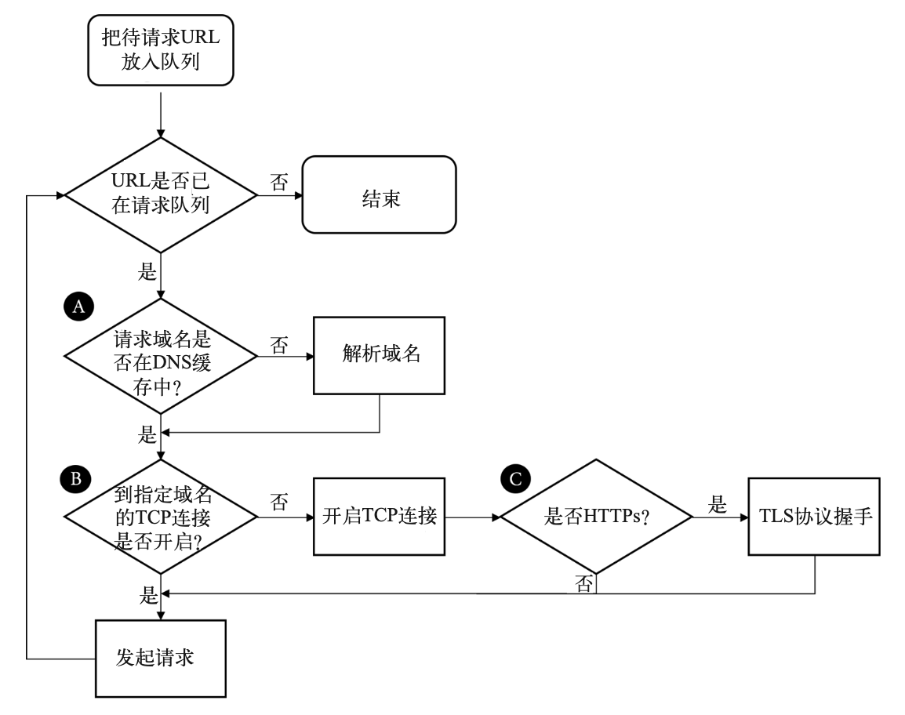
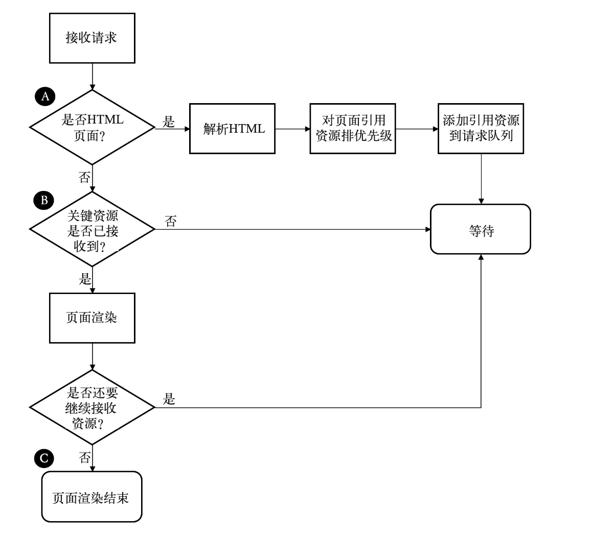
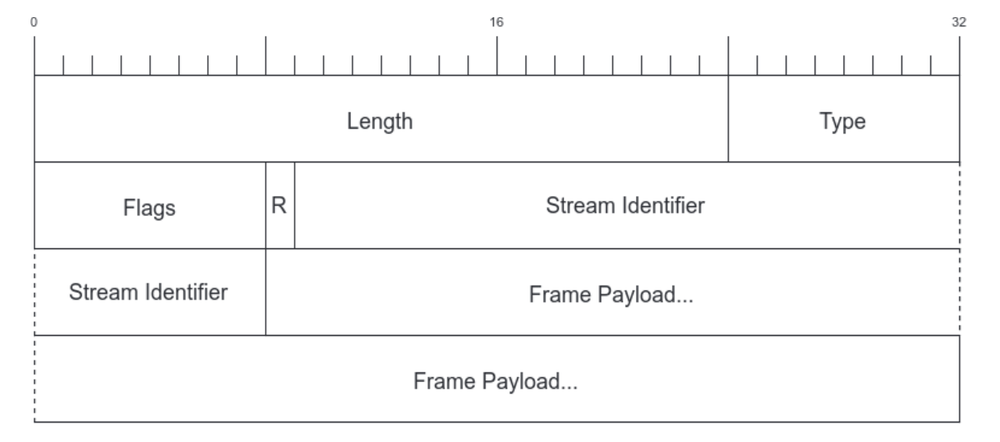
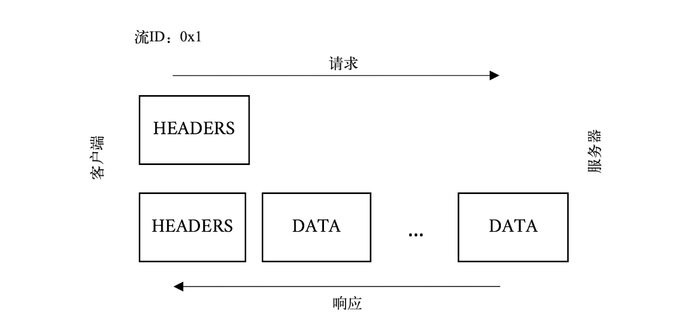
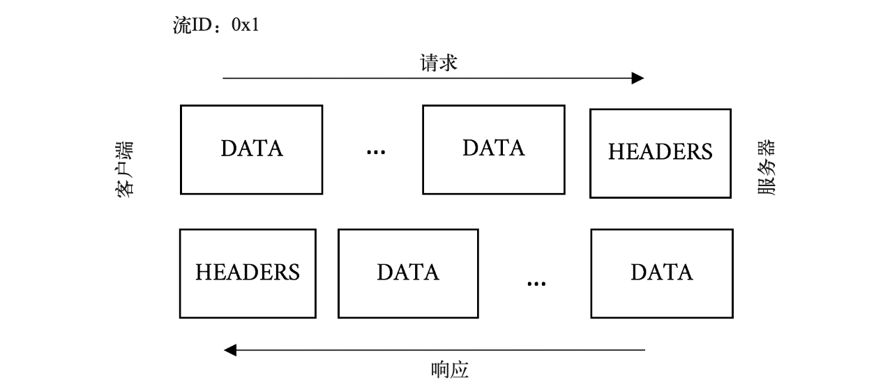
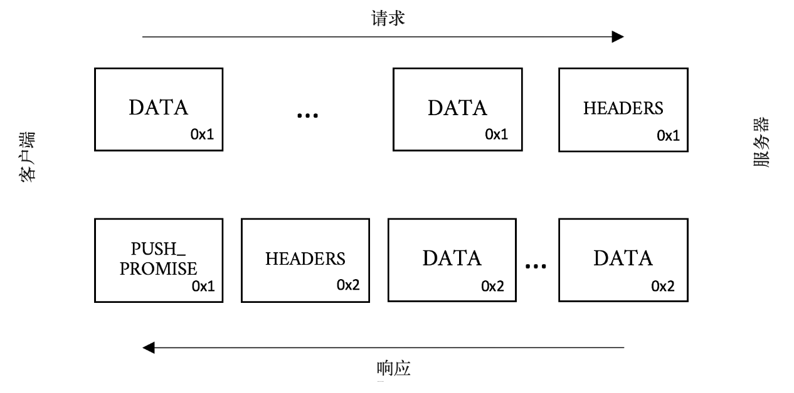
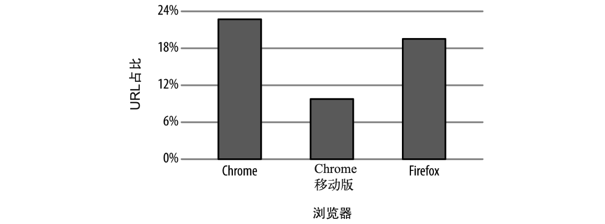
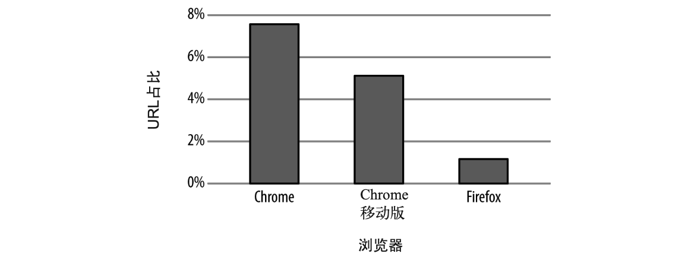
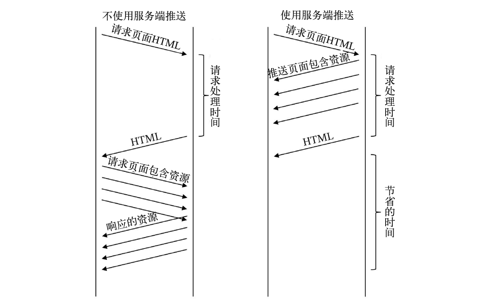
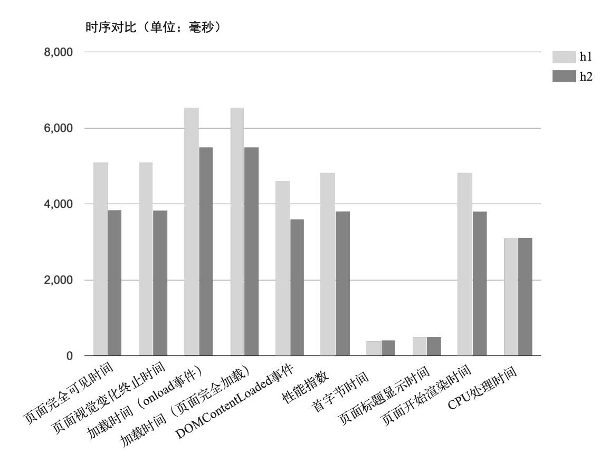

# HTTP 2

## Web 优化 “黑魔法”的动机与方式

### 当前的性能挑战
发布现代Web页面或Web应用绝不是一件小事。每个页面会引用数百个对象，关联十多个域名，网络环境相差迥异，设备的处理能力也参差不齐。在这样的前提下，提供表现一致且响应迅速的 Web 体验并不简单。如果要保证用户在网站上的交互流畅，就必须重视理解客户端获取 Web 页面和渲染的步骤，以及各个步骤要面临的挑战。理解了它们，你就能理解推动HTTP/2的力量，也能理解其新特性相对HTTP/1都带来哪些益处。

#### 剖析 Web 页面请求
在进一步深入探讨之前，必须先搞清楚我们正在尽力优化的是什么；尤其要搞清楚的是，从用户在浏览器中点击链接到页面呈现在屏幕上，在此期间到底发生了什么？浏览器请求 Web 页面时，会执行重复流程，获取在屏幕上绘制页面需要的所有信息。为了更容易理解，我们把这一过程分成两部分：资源获取、页面解析/渲染。先从资源获取的部分开始。下图展示了它的步骤。





1. 把待请求 URL 放入队列
2. 解析 URL 中的域名的 IP 地址
3. 建立与目标主机的 TCP 连接
4. 如果是 HTTPS 请求，初始化并完成 TLS 握手
5. 向页面对应的 URL 发送请求。
6. 接收响应
7. 如果接收的是主体 HTML，那么解析它，并针对页面中的资源触发优先获取机制
8. 如果页面上的关键资源已经接收到，就开始渲染页面。
9. 接收其他资源，继续解析渲染，直到结束。

页面上的每一次点击，都需要重复执行前面那些流程，给网络带宽和设备资源带来压力。Web 性能优化的核心，就是加快甚至干脆去掉其中的某些步骤。

#### 关键性能指标
从上面的图中，我们能找到影响 Web 性能的端点，以及能动手改进的地方。让我们从网络级别的性能指标开始，它会影响整个 Web 页面加载。

+ 延迟。延迟是指 IP 数据报从一个网络端点到另一个网络端点所花费的时间。与之相关的是往返时延（RTT），它是延迟的时间的两倍。延迟是制约 Web 性能的主要瓶颈，尤其对于 HTTP 这样的协议，因为其中包含大量往返于服务器的请求。
+ 带宽。只要带宽没有饱和，两个网络端点之间的连接会一次处理尽可能多的数据量。依据 Web 页面引用资源的大小和网络连接的传输能力，带宽可能会称为性能的瓶颈。
+ DNS 查询。在客户端能够获取 Web 页面前，它需要通过域名系统（DNS）把主机名称转换成 IP 地址，获取的 HTML 页面中所引用的各个不同域名也需要转换；一个域名只需转换一次。
+ 建立连接时间。在客户端与服务器之间建立需要往返数据硬蛋，称为“三次握手“。握手时间一般与客户端和服务器之间的延迟有关。握手过程包括客户端向服务器发起一个 SYN 包，接着服务器返回对应的 SYN 的 ACK 响应以及新的 SYN 包，然后客户端返回对应的 ACK。
+ TLS 协商时间。如果客户端发起 HTTPS 连接，它还需要进行传输层安全性协议（TLS）协商；TLS 用来取代安全套阶层（SSL）。除了服务器和客户端的计算处理耗时之外，TLS 还会造成额外的往返传输。

目前为止，客户端还没有真正发起 HTTP 请求，却已经用掉了 DNS 查询的往返时间，以及 TCP 和 TLS 的耗时。下面的指标严重依赖于页面内容本身或服务器性能，而不是网络。

+ 首字节时间（TTFB）。TTFB 是指客户端从开始定位到 Web 页面，至接收到主体页面响应的第一字节所耗费的时间。它包含了之前提到的各种耗时，还要加上服务器处理时间。对于主体页面上的资源，TTFB 测量的是从浏览器发起请求至收到其第一字节之间的耗时。
+ 内容下载时间。等同于被请求资源的最后字节到达时间（TTLB）。
+ 开始渲染时间。客户端的屏幕上什么时候开始显示内容？这个指标测量的是用户看到空白页面的时长。
+ 文档加载完成时间（又叫页面加载时间）。这是客户端浏览器认为页面加载完毕的时间。

如果我们关注Web性能，尤其是要制定新协议来提升效率，就必须把（上面提到的）那些指标牢记于心。把这些性能指标牢记于心之后，你就能看到互联网的发展趋势：各种东西都在增加，所以出现了性能瓶颈。下面是我们需要记住的一些增加的方面。

+ 更多的字节。毫无疑问的是，Web 页面引用的内容每年都在增长，图片越来越大，JavaScript 和 CSS 页越来越大。内容体量变大意味着（客户端需要）下载更多的字节，也意味着更长的页面加载时间。
+ 更多的资源。页面引用的资源不仅变大，而且数量也增多了。引用更多的资源会导致总耗时增加，因为所有的资源都需要获取并解析。
+ 更高的复杂度。随着我们添加更多、更丰富的功能，Web 页面和所依赖的资源正变得越来越复杂。复杂度提升，伴随而来的是计算渲染 Web 页面的时间不断延长，尤其是在处理能力较弱的移动设备上。
+ 更多的域名。Web 页面并不是从单一的域名拉取下来的额，大多数 Web 页面会关联数十个域名。没出现一个新域名都会增加 DNS 查询耗时、建立连接耗时，以及 TLS 协商耗时。
+ 更多的 TCP socket。为了应对某些方面的增加，客户端会对同一个域名开启多个 socket。这增加了与域名对应的服务器协商建立连接的开销，也加重了设备负担，还有可能导致网络连接过载，引发出错重传和缓存过满，并降低有效带宽。

#### HTTP/1 的问题

##### 队头阻塞
浏览器很少只从一个域名获取一份资源。大多数时候，它希望能同时获取多份资源。设想这样一个网站，它把所有图片放在单个特定域名下。HTTP/1 并未提供机制来同时请求这些资源。如果仅仅使用一个连接，它需要发起请求、等待响应，之后才能发起下一个请求。http 1 有个特性叫管道化（pipelining），允许一次发送一组请求，但是只能按照发送顺序依次接收响应。而且，管道化备受互操作性和部署的各种问题的困扰，基本没有实用价值。

在请求应答过程中，如果出现任何状况，剩下所有的工作都会被阻塞在那次请求应答之后。这就是”队头阻塞“，它会阻碍网络传输和 Web 页面渲染，直至失去响应。为了防止这种问题，现代浏览器会针对单个域名开启 6 个连接，通过各个连接分别发送请求。它实现了某种程度上的并行，但是每个连接仍会受到”队头阻塞“的影响。另外，这也没有高效利用有限的设备资源。

##### 低效的 TCP 利用
传输控制协议（TCP）的设计思路是：对假设情况很保守，并能够公平对待统一网络的不同流量的应用。它的避免拥塞机制设计成即使在最差的网络状况下仍能起作用，并且如果有需求冲突也保证相对公平。这时它取得成功的原因之一。它的成功并不是因为传输数据最快，而是因为它是最可靠的协议之一，涉及的核心概念就是拥塞窗口（congestion window）。拥塞窗口是指，在接收方确认数据包之前，发送方可以发出的 TCP 包的数量。例如，如果拥塞的窗口指定为 1，那么发送方发出 1 个数据包之后，只有接收方确认了那个包，才能发送下一个。

一般来讲，每次发送一个数据包并不是非常低效。TCP 有个概念叫慢启动（slow start），它用来探索当前连接对应拥塞窗口的合适大小。慢启动的设计目标是为了让新连接搞清楚当前网络状况，避免给已经拥堵的网络继续添乱。它允许发送者在收到每个确认恢复后额外发送 1 个未确认包。这意味着新连接在收到 1 个确认恢复之后，可以发送 2 个数据包；在收到 2 个确认恢复之后，可以发 4 个；以此类推。这种几何级数增长很快就会到达协议规定的发包数上限，这时候连接将进入拥塞避免阶段。

这种机制需要几次往返数据请求才能得知最佳拥塞窗口大小。但在解决性能问题时，就这区区几次数据往返也是非常宝贵的时间成本。现代操作系统一般会取 4 ~ 10 个数据包作为初始拥塞窗口大小。如果你把一个数据包设置为最大值下限 1460 字节（也就是最大有效负载），那么只能先发送 5840 字节（假定拥塞窗口为 4），然后就需要等待接收确认回复。如今的 Web 页面平均大小约 2 MB，包括 HTML 和所有依赖的资源。在理想情况下，这需要大约 9 次往返请求来传输完整个页面。除此之外，浏览器一般会针对同一个域名开启 6 个并发连接，每个连接都免不了拥塞窗口调节。

因为 HTTP 1 并不支持多路复用，所以浏览器一般会针对指定域名开启 6 个并发连接。这意味着拥塞窗口波动也会并行发生 6 次。TCP 协议保证那些连接都能正常工作，但是不能保证它们的性能也是最优的。

##### 臃肿的消息首部
尽管 HTTP 1 提供了压缩被请求内容的机制，但是消息首部却无法压缩。消息首部可不能忽略，尽管它比响应资源小很多，但它可能占据请求的绝大部分（有时候可能是全部）。如果算上 cookie，有个几千字节就很正常了。

据 HTTP 历史存档记录，2016 年末，请求首部一般集中在 460 字节左右，对于包含 140 个资源的普通 Web 页面，意味着它在发起的所有请求中大约占 63 KB。想想之前关于 TCP 拥塞窗口管理的讨论，发送该页面相关的所有请求可能需要 3 ~ 4 轮往返，因此网络延迟的损耗会被迅速放大。此外，上行带宽通常会受到网络限制，尤其是在移动网络环境中，于是拥塞窗口机制根本来不及起作用，导致更多的请求和响应。

消息首部压缩的缺失也容易导致客户端到达带宽上限，对于低带宽或高拥堵的链路尤其如此。”体育馆效应“就是一个经典例子。如果成千上万人同一时间出现在同一地点（例如重大体育赛事），会迅速耗尽无线蜂窝网络带宽。这时候，如果能压缩请求首部，把请求变得更小，就能够缓解带宽压力，降低系统的总负载。

##### 受限的优先级设置
如果浏览器针对指定域名开启了多个 socket（每个都会受队头阻塞问题的困扰），开始请求资源，这时候浏览器能指定优先级的方式是有限的：要么发起请求，要么不发起。然而 Web 页面上某些资源会比另一些更重要，这必然会加重资源的排队效应。这是因为浏览器为了先请求优先级高的资源，会推迟请求其他资源。但是优先级高的资源获取之后，在处理的过程中，浏览器并不会发起新的资源请求，所以服务器无法利用这段时间发送优先级低的资源，总的页面下载时间因此延长了。还会出现这样的情况：一个高优先级资源被浏览器发现，但是受制于浏览器处理的方式，它被排在了一个正在获取的低优先级资源之后。

##### 第三方资源
虽然第三方资源不是 HTTP/1 特有的问题，但鉴于它日益增长的性能问题，我们也把它列在这里。如今的 Web 页面上请求的很多资源完全独立于站点服务器的控制，我们称这些为第三方资源。现代 Web 页面加载时长中往往有一半消耗在第三方资源上。虽然有很多技巧能把第三方资源对页面性能的影响降到最低，但是很多第三方资源都不在 Web 开发者的控制范围内，所以很可能其中有些资源的性能很差，会延迟甚至阻塞页面渲染。任何关于 Web 性能的讨论，只要没有提到第三方资源引起的问题，都不算完整。

### Web 性能优化技术

#### Web 性能的最佳实践
+ DNS 查询优化。在于服务主机建立连接之前，需要先解析域名。解析越快就越好。
  + 限制不同域名的数量。当然，这通常不是你能控制的，但是如果准备迁移到 HTTP/2，域名数量对性能的相对影响会只增不减。
  + 保证低限度的解析延迟。了解你的 DNS 服务基础设施的结构，然后从你的最终用户分布的所有地域定期监控解析时间（你能通过虚拟或真实用户的监控做到）。如果你要依赖外部供应商，一定要谨慎选择，因为各家的服务质量参差不齐。
  + 在主体页面 HTML 或响应中利用 DNS 预取指令。这样，在下载并处理主体页面 HTML 的同时，预取指令就能开始解析页面上指定的域名。例如，下面这段代码会告诉浏览器预解析 ajax.googleapis.com:
        ```
            <link rel="dns-prefetch" href="//ajax.googleapis.com>
        ```
+ 优化 TCP 连接。开启新连接是一个耗时的过程。如果连接使用 TLS（也确实应该这么做），开销会更高。降低这种开销的方法如下。
  + 利用 preconnect 指令，连接在使用之前就已经建立号了，这样处理流程的关键路径上就不必考虑时间了。例如。 ``` <link rel="preconnect" href="//fonts.example.com" crossorigin> ```
  + 尽早终止并响应。借助 CDN 在距离请求用户很近的边缘端点上，请求就可以获得响应，所以可以终止连接，大幅减少建立新连接的通信延迟。
+ 避免重定向。重定向通常触发与额外域名建立连接。在无线网络中，一次额外的重定向可能把延迟增加数百毫秒，这不利用用户体验，并最终会影响到网站上的业务。简单的解决方案就是彻底消灭重定向，因为对于重定向的使用往往并没有合理原因。如果它们不能被直接消灭，你还有两个选择：
  + 利用 CDN 代替客户端在云端实现重定向；
  + 如果是同一域名的重定向，使用 Web 服务器上的 rewrite 规则，避免重定向。
+ 客户端缓存。没有什么比直接从本地缓存获取资源来得更快，因为它根本就不需要建立网络连接。毕竟最快的请求是根本不发起请求。另外，从本地获取资源时，ISP 或 CDN 提供商不会收取流量费。生存时间（TTL）指令告诉浏览器应该缓存某个资源多久，找到给定资源的最佳 TTL 值并没有完美的科学方法。不过，你可以从下面这些已经验证过的指导原则开始。
  + 所谓的纯静态内容。例如图片或带版本的数据，可以在客户端永久缓存。尽管如此，我们也要记住，即便 TTL 被设置得很长，比如一个月，它还是会因为缓存提早回收或清理而过期，这时客户端可能不得不从源头再次获取。因此真实的 TTL（效果）最终取决于设备特性（尤其是可用磁盘缓存空间）和最终用户的浏览习惯/历史记录。
  + CSS/JS 和个性化资源，缓存时间大约是会话平均时间的两倍。这段时间足够长，保证大多数用户在浏览网站是能够从本地拉取资源；同时也足够短，几乎能保证下次会话时从网络上拉去最新内容。
  + 其他类型的资源，理想的 TTL 值会各有不同；这取决于你对特定资源能够容忍的旧数据的极限。所以，你必须结合自身需求来判断最佳值。
+ 网络边缘的缓存。因为所有用户都能从云端的共享缓存受益，所以网络边缘的缓存提供了更快的访问速度，也为网站服务基础设施分担了很大一部分流量。如果一份资源需要缓存，它必须满足：在多用户间共享，并且能够接收一定程度的旧数据。个人信息（用户偏好、财务数据等）绝对不能在网络边缘缓存，因为它们不能共享。类似地，时间敏感的资源也不应该缓存，例如实时交易系统上的股票报价。这就是说，（除此之外的）其他一切都是可以缓存的，即使仅仅缓存几秒或几分钟。对于哪些不是经常更新，然而一旦有变化就必须立刻更新的资源，例如重大新闻，可以利用各大 CDN 厂商提供的缓存清理 (purging) 机制处理。这种模式被称为”一只保留，直到被通知“，意思是永久缓存这些资源，等收到通知后才删除。
+ 条件缓存。如果缓存 TTL 过期，客户端会向服务器发起请求。在多数情况下，收到的响应其实和缓存的版本是一样的，重新下载已经在缓存里的内容也是一种浪费。HTTP 提供条件请求机制，客户端能以有效方式询问服务器：”如果内容变了，请返回内容本身；否则，直接告诉我内容没变。“当资源不经常变化时，使用条件请求可以显著节省带宽和性能；但是，保证资源的最新版迅速可用也是非常重要的。使用条件缓存可以通过以下方法。
  + 在请求中包含 HTTP 首部 Last-Modified-Since。仅当最新内容在首部中指定的日期之后被更新过，服务器才返回完整内容；否则只返回 304 响应码，并在响应首部中附带上新的时间戳 Date 字段。
  + 在请求体中包含实体校验码，或者叫 ETag；它唯一标识所请求的资源。ETag 由服务器提供，内嵌于资源的响应首部中。服务器会比较当前 ETag 与请求首部中收到的 ETag，如果一致，就只返回 304 响应码；否则返回完整内容。
+ 压缩和代码极简化。所有的文本内容（HTML、JS、CSS、SVG、XML、JSON、字体等），可以从压缩和极简化中受益。这两种方法组合起来，可以显著减少资源大小。更少字节数对应着更少的请求-硬蛋，也就意味着更短的请求时间。 
  + 极简化（minification) 是指从文本资源中剥离所有非核心内容的过程。通常，这些内容时开发人员敲出来的，所有要考虑方便人类阅读和维护。尽管如此，浏览器并不关心可读性，放弃代码可读性反而能节省空间。在极简化的基础上，压缩可以进一步减少字节数。它通过可无损还原的算法减少资源大小。在发送资源之前，如果服务器进行压缩处理，可以节省90%的大小。常规的压缩算法包括gzip和deflate；相对晚些面世的Brotli算法也开始崭露头角了。
+ 避免阻塞 CSS/JS。CSS 的作用是告诉浏览器以什么方式在可视区域的哪个部分渲染内容。所以，在屏幕上绘制第一个像素之前，浏览器必须确保 CSS 已经下载完整。尽管浏览器的预处理器很智能，会尽早请求整个页面所需要的 CSS，但是把 CSS 资源请求放在页面靠前的部分仍然是种最佳实践，具体位置是在文档的 head 标签里，而且要在任何 JS 或图片被请求和处理之前。
  + 默认情况下，如果在 HTML 中定位了 JS，它就会被请求、解析，然后执行。在浏览器处理完这个 JS 之前，会阻止其后任何资源的下载渲染。有时候，用特定 JS 的下载和执行来阻塞解析其他 HTML 代码是可取的。例如，用它来实例化一个所谓的标签管理器（tag-manager），或者 JS 应被首先执行的其他重要情况，比如用来避免引用不存在的元素或避免竞争条件。然而大多数时候，这种默认的阻塞行为导致了不必要的延迟，甚至会造成单点故障。为了减轻 JS 阻塞带来的潜在影响，下面针对己方资源（你能控制的）和第三方资源（你不能控制的）推荐了不同的策略。
    + 定期校验这些资源的使用情况。随着时间的变迁，Web 页面可能会持续下载一些不再需要的 JS；这时候，最快速有效的解决办法就是去掉它。
    + 如果 JS 执行顺序无关紧要，并且必须在 onload 事件触发之前运行，那么可以设置 async 属性，像这样： ``` <script async src="/js/myfile.js"> ``` 只需做到下载 JS 与解析 HTML 并行，就能极大地提升整体用户体验。谨慎用 document.write 指令，因很可能中断页面执行，所以需要仔细测试。
    + 如果 JS 执行顺序重要，并且你也能承受脚本在 DOM 加载完之后运行，那么请使用 defer 属性。像这样： ``` <script defer src="/js/myjs.js"> ```
    + 对不会影响到页面初次展示的 JS 脚本，必须在 onload 事件触发之后请求它。
    + 如果你不想延迟主页面的 onload 事件，可以考虑通过 iframe 获取 JS，因为它的处理独立于主页面。但是，通过 iframe 下载的 JS 访问不了主页面上的元素。
+ 图片优化。对大多数网站而言，图片的相对重要性和绝对重要性都在不断增加。图片主导了多数现代网站，优化它们就能够获取最大的性能回报。所有图片优化手段的目标都是在达到指定视觉质量的前提下传输最少的字节。这一目标会受很多因素影响，应该引起重视。
  + 图片元信息。例如题材地理位置信息、时间戳、尺寸和像素信息，通常包含在二进制数据里，应该在发送给客户端之前去掉（务必保留版权和色彩描述信息）。这种无损处理能够在图片生成时完成。对于 PNG 图片，一般会节省大概 10% 的空间。
  + 图片过载（image overloading）是指，图片最终被浏览器自动缩小，要么因为原始尺寸超过了可视区的占位大小，要么因为像素超过设备的显示能力。**这不仅浪费带宽，消耗的 CPU 资源也很可观**，这些计算资源有时在手持设备上相当宝贵。在响应式设计（RWD）的 Web 站点上，这个问题比较常见，因为无论在什么设备上渲染，都始终返回同样尺寸的图片。

#### 反模式
HTTP 2 对每个域名只会开启一个连接，所以 HTTP 1.1 下的一些诀窍对它来说只会适得其反。

+ 生成精灵图和资源合并/内联。精灵图（spriting）是指把很多小图片拼合成一张大图，这样只需发起一个请求就可以覆盖多个图片元素。例如，颜色样本或导航元素（箭头、图标）拼合成一张大的图片，这就是精灵图。在 HTTP/2 中，针对特定资源的请求不再是阻塞式的，很多请求可以并行处理；于是就性能而言，生成精灵图就失去意义了，网站管理员不再需要考虑创建它们，虽然已经创建的精灵图不一定非要取消。
  + 与之类似，小的文本资源，例如 JS 和 CSS，会依照惯例合并成一份更大的资源，或者直接内嵌在主体 HTML 中，这也是为了减少客户端-服务器连接数。这种做法有个问题是，那些小的 CSS 或 JS 自身也许可缓存，但如果它们内嵌在不可缓存的 HTML 中的话，当然也就不可缓存了。所以，把站点从 h1 迁移到 h2 时，要避免这些做法。不过，2015年11月，khanacademy.org发表的一份研究报告指出，把很多小的 JS 脚本合并成一个大文件可能仍旧对 h2 有意义，因为这样可以更好地压缩处理并节省CPU。
+ 域名拆分。**域名拆分（sharding）是为了利用浏览器针对每个域名开启多个连接的能力来并行下载资源。**对于某个具体的站点，找到最适合拆分的域名个数并没有什么公式；可以这么说，各种观点都在业内流行。
  + HTTP2 的领域，网站管理员反而需要花费客观的额经历在收拢域名上。比较好的办法就是继续保持当前的域名拆分，但是确保这些域名共享同一张证书【通配符/存储区域网络（SAN）】,并保持服务器 IP 地址和端口相同，以便从浏览器网络归并（network coalescence）中收益，这样可以节省为单个域名连接建立的时间。
+ 禁用 cookie 的域名。在 HTTP/1 下，请求和响应首部从不会被压缩。随着时间推移，首部大小已经增长了，超过单个 TCP 数据包（约1.5 KB）的 cookie 可以说司空见惯。因此，在内容源和客户端之间来回传输首部信息的开销可能造成明显的延迟。因此，对图片之类不依赖于 cookie 的资源，设置禁用 cookie 的域名是个合理的建议。
  + 但在 HTTP2 中，首部是被压缩的，并且客户端和服务器都会保留”首部历史“，避免重复传输已知信息。所以，如果你要重构站点，大可不必考虑禁用 cookie 的域名，这样能减少很多包袱。
  + 静态资源也应该从同一域名提供；使用与主页面 HTTP 相同的域名，消除了额外的 DNS 查询以及 socket 连接，它们都会减慢静态资源的获取。把阻塞渲染的资源放在同样的域名下，也可以提升性能。

### 小结
HTTP/1.1 孕育了一个混乱不堪或者称得上是冒险刺激的世界，包含了各种性能优化手段与诀窍。业界认识挖空心思追求性能，由此带来的混乱已经登峰造极。HTTP/2 的目标之一就是淘汰掉众多此类诀窍。不管怎样，了解这些手段及其运行机制，可以帮助我们深入理解 Web 及其内部实现。

## HTTP 2 协议

### HTTP/2 分层
HTTP/2 大致可分为两部分：
+ 分帧层。即 h2 多路复用能力的核心部分。它的设计目的是传输 HTTP，而不是其他。
+ 数据或 http 层。其中包含传统上被认为是 http 及其关联数据的部分。

### 连接
连接是所有 HTTP/2 会话的基础元素，其定义是客户端初始化的一个 TCP/IP socket，客户端是指发送 HTTP 请求的实体。这和 h1 是一样的，不过与完全无状态的 h1 不同的是，**h2 把它所承载的帧（frame）和流（stream）共同依赖的连接层元素捆绑在一起，其中既包含连接层设置也包含首部表**。也就是说，与之前的 HTTP 版本不同，每个 h2 连接都有一定的开销。之所以这么设计，是考虑到收益远远超过其开销。

> <center><h5>是否支持 h2</h5></center>
> 协议发现，识别中断是否支持你想使用的协议。HTTP/2 提供两种协议发现的机制。
> 
> 在连接不加密的情况下，客户端会利用 Upgrade 首部来表明期望使用 h2。如果服务器也可以支持 h2，它返回一个 ”101 Switching Protocols“（协议转换）响应。这增加了一轮完整的请求-响应通信。
> 
> 如果连接基于 TLS，情况就不同了。客户端在 ClientHello 消息中设置 ALPN（Application-Layer Protocol Negotiation，应用层协议协商）扩展来表明期望使用 h2 协议，服务器用同样的方式回复。如果使用这种方式，那么 h2 在创建 TLS 握手的过程中完成协商，不需要多余的网络通信。值得注意的是，SPDY 和 h2 的早期修订版本使用 NPN（Next Protocol Negotiation，下一代协议协商）扩展来完成 h2 协商。它在 2014 年中期被 ALPN 取代。

> 表明中断支持 h2 的最后一个方法是使用 HTTP Alternative Services（HTTP 替代服务）或 Alt-Svc。服务器可以用这种办法，在返回给客户端的响应首部中，表示后续的请求或许可以使用更合适的请求地址或协议。这个工具非常灵活，浏览器的支持也在不断增加。它不是用来替代 ALPN 的，但它是值得特别关注。

为了向服务器双重确认客户端支持 h2，客户端会发送一个叫做 Connection preface（连接前奏）的魔法字节流，作为连接的第一份数据。这主要是为了应对客户端通过纯文本的 HTTP/1.1 升级上来的情况。该字节流用十六进制表示如下：
```
    0x505249202a20485454502f322e300d0a0d0a534d0d0a0d0a
    解释为 ASCII 是：
    PRI * HTTP/2.0\r\n\r\nSM\r\n\r\n
```

这个字符串的用处是，如果服务器（或者中间设备）不支持 h2，就会产生一个显示错误。这消息特意设计成 h1 消息的样式。如果运行良好的 h1 服务器收到这个字符串，它会阻塞这个方法（PRI）或者版本（HTTP/2.0），并返回错误，可以让 h2 客户端明确地知道发生了什么错误。

这个魔法字符串会有一个 SETTINGS 帧紧随其后。服务器为了确认它可以支持 h2，会声明收到客户端的 SETTINGS 帧，并返回一个它自己的 SETTINGS 帧（反过来也需要确认），然后确认环境正常，可以开始使用 h2。大家做了很多工作，保证这个流程尽可能高效。虽然表面上看起来有点啰嗦，但客户端可以立即开始发送帧，并假设服务器的 SETTINGS 帧已经到了。如果在偶然情况下，过分乐观的客户端在 SETTINGS 帧之前收到一些数据，那么协商会失败，客户端和服务端都会收到 GOAWAY 帧。

### 帧
HTTP 2 是基于帧（frame）的协议。采用帧是为了将重要信息都封装起来，让协议的解析方可以轻松阅读、解析并还原信息。相比之下，h1 不是基于帧的，而是以文本分隔。比如下面这个例子:
```
    GET / HTTP/1.1 <crlf>
    Host: www.example.com <crlf>
    Connection: keep-alive <crlf>
    Accept: text/html, application/xhtml+xml, application/xml;q=0.9... <crlf>
    User-Agent: Mozilla/5.0(Macintosh; Inter Mac OS X 10_11_4)... <crlf>
    Accept-Encoding: gzip, deflate, sdch <crlf>
    Accept-Language: en-US, en;q=0.8 <crlf>
    Cookie: pfy_cbc_lb=p-browse-w; customerZipCode=99912|N; ltc=%20;... <crlf>
    <crlf>
```

解析这种数据用不着什么高科技，但往往速度慢且容易出错。你需要不断读入字节，直到遇到分隔符为止，这里是指 \<crlf>, 同时还要考虑以下不太受规矩的客户端，它们会只发送 \<lf>。于是，大概需要这样一台状态机：
```
    loop
        while( ! CRLF) 
            read bytes
        end while
        
        if first line
            parse line as the Request-line
        else if line is empty
            break out of the loop   # 完成
        else if line starts with non-whitespace
            parse the header line into a key/value pair
        else if line starts with space
            add the continuation header to the previous header
        end if
    end loop
```

这样写程序是可行的，并且这事已经做过无数次了。解析 h1 的请求或响应可能出现下列问题。
+ 一次只能处理一个请求或响应，完成之前不能停止解析。
+ 无法预判解析需要多少内存。这会带来一系列问题：你要把一行读到多大的缓冲区里；如果行太长会发生什么；应该增加并重新分配内存，还是返回 400 错误。为了解决这些问题，保持内存处理的效率和速度可不简单。

从另一方面来说，有了帧，处理协议的程序就能预先知道会收到什么。基于帧的协议，特别是 h2，开始有固定长度的字节，其中包含表示整帧长度的字段。



前 9 个字节对于每个帧都是一致的。解析时只需要读取这些字节，就可以准确地知道在整个帧中期望的字节数。下表是对每个字段的说明。
  名称   |  长度  |  描述  
------- | ------ | --------
Length  | 3 字节  | 表示帧负载的长度，最大值由 SETTINGS_MAX_FRAME_SIZE 设置。最大值设置取值范围为 2<sup>14</sup> ~ 2<sup>24</sup> - 1 字节。请注意，2<sup>14</sup> 字节是默认的最大帧大小，如果需要更大的帧，必须在 SETTINGS 帧中设置。
Type    | 1 字节  | 当前帧类型
Flags   | 1 字节  | 具体帧类型的标识
R       | 1 位    | 保留位，不要设置，否则可能带来严重后果
Stream Identifier | 31 位 | 每个流的唯一 ID
FramePayload | 长度可变 | 真实的帧内容，长度是在 Length 字段中设置的。

因为规范严格明确，所以解析逻辑大概是这样：
```
    loop
        Read 9 bytes off the wire                   // 读取 9 字节
        Length = the first three bytes              // 长度值为前 3 字节
        Read the payload based on the length.       // 基于长度读负载
        Take the appropriate action based on the frame type. //根据帧类型采取对应操作
    end loop
```
这样一来，实现和维护都会简单很多。相比依靠分隔符的 h1，h2 还有另一大优势: 如果使用 h1 的话，你需要发送完上一个请求或者响应，才能发送下一个；由于 h2 是分帧的，请求和响应可以交错甚至多路复用。多路复用有助于解决类似队头阻塞的问题。

下表是 HTTP 2 协议中 10 种不同的帧类型

  名称     |  ID  | 描述
--------   | --- | ----- 
DATA       | 0x0 | 传输流的核心内容
HEADERS    | 0x1 | 包含 HTTP 首部和可选的优先级参数
PRIORITY   | 0x2 | 指示或者更改流的优先级和依赖
RST_STREAM | 0x3 | 允许一端停止流（通常由于错误导致的）
SETTINGS   | 0x4 | 协商连接级参数
PUSH_PROMISE | 0x5 | 提示客户端，服务器要推送些东西
PING       | 0x6 | 测试连接可用性和往返时延（RTT）
GOAWAY     | 0x7 | 告诉另一端，当前端已结束
WINDOW_UPDATE | 0x8 | 协商一端将要接收多少字节（用于流量控制）
CONTINUATION | 0x9 | 用以扩展 HEADER 数据块

### 流
HTTP/2 规范是对流（stream）的定义是：”HTTP/2 连接上是独立的、双向的帧序列交换。“**你可以将流看做在连接上的一系列帧，它们构成了单独的 HTTP 请求和响应**。如果客户端想要发出请求，它会开启一个新的流。然后，服务器将在这个流上回复。这与 h1 的请求/响应流程类似，重要的区别在于，因为有分帧，所以多个请求和响应可以交错，而不会互相阻塞。流 ID 用来表示帧所属的流。

客户端到服务器的 h2 连接建立之后，通过发送 HEADERS 帧来启动新的流，如果首部需要跨多个帧，可能还会发送 CONTINUATION 帧。该 HEADERS 帧可能来自 HTTP 请求，也可能来自响应，具体取决于发送方。后续流启动的时候，会发送一个带有递增流 ID 的新 HEADERS 帧。

> <center><h5> CONTINUATION 帧</h5></center>
> HEADERS 帧通过在帧的 Flags 字段中设置 END_HEADERS 标识位来标识首部的结束。在单个 HEADERS 帧装不下所有 HTTP 首部的情况下（例如，帧可能比当前最大长度还长），不会设置 END_HEADES 标识位，而是在之后跟随一个或多个 CONTINUATION 帧。我们可以把 CONTINUATION 帧当做特殊的 HEADERS 帧。那么，为什么要使用特殊的额帧，而不是再次使用 HEADERS 帧？ 如果重复使用 HEADERS，那么后续的 HEADERS 帧的负载就得经过特殊处理才能和之前的拼接起来。这些帧首部是否需要重复？这样的话，如果帧之间存在分歧该怎么办？协议开发者不喜欢这类模棱两可的情况，因为它可能在未来引起麻烦。考虑到这一点，工作组决定增加一个明确的帧类型，以避免实现混淆。
> 需要注意的是，由于 HEADERS 和 CONTINUATION 帧必须是有序的，使用 CONTINUATION 帧会破坏或减损多路复用的益处。CONTINUATION 帧时解决重要长江的工具，但只能在必要时使用。

#### 消息 
HTTP 消息泛指 HTTP 请求或响应。**流是用来传输一对请求/响应消息的**。一个消息至少由 HEADERS 帧组成，并且可以另外包含 CONTINUATION 和 DATA 帧，以及其他的 HEADERS 帧。





h1 的请求和响应都分成消息首部和消息体两部分；与之类似，h2 的请求和响应分成 HEADERS 帧和 DATA 帧。

HTTP 消息是在 HTTP/1.1 的 RFC 7230 中定义的。

HTTP/1 和 HTTP/2 消息的下列差别是需要注意的。

**一切都是header**
h1 把消息分成两部分: 请求/状态行；首部。h2 取消了这种区分，并把这些行变成了魔法伪首部。举个例子，HTTP/1.1 的请求和响应可能是这样的。
```
    GET / HTTP/1.1
    Host: www.example.com
    User-agent: Next-Great-h2-browser-1.0.0
    Accept-Encoding: compress, gzip

    HTTP/1.1 200 OK
    Content-type: text/plain
    Content-length: 2
    ...
```

在 HTTP/2 中，它等价于:
```
    :scheme: https
    :method: GET
    :path: /
    :authority: www.example.com
    User-agent: Next-Great-h2-browser-1.0.0
    Accept-Encoding: compress, gzip

    :status: 200
    content-type: text/plain
```

请注意，请求和状态行在这里拆分成了多个首部，即 :scheme、:method、:path 和 :status。同时要注意的是，h2 的这种表示方式根数据传输时不同。

**没有分块编码（chunked encoding）**
在基于帧的世界里，谁还需要分块？只有在无法预先知道数据长度的情况下向对方发送数据时，才会用到分块。在使用帧作为核心协议的 h2 里，就不再需要它了。

**不再有 101 的响应**
Switching Protocol 响应是 h1 的边缘应用。它如今最常见的应用可能就是用以升级到 WebSocket 连接。ALPN 提供了更明确的协议协商路径，往返的开销也更小。

#### 流量控制
h2 的新特性之一是基于流的流量控制。不同于 h1 的世界，只要客户端可以处理，服务端就会尽可能快地发送数据，h2 提供了客户端调整传输速度的能力。（并且，由于在 h2 中，一切几乎都是对称的，服务端也可以调整传输的速度。）WINDOW_UPDATE 帧用来指示流量控制消息。每个帧告诉对方，发送方想要接收多少字节。当一端接收并消费被发送的数据时，它将发出一个 WINDOW_UPDATE 帧以指示其更新后的处理字节的能力。

客户端有很多理由使用流量控制。一个很现实的原因可能是，确保某个流不会阻塞其他流。也可能客户端可用的带宽和内存比较优先，强制数据以可处理的分块来加载反而可以提升效率。尽管流量控制不能关闭，把窗口最大值设定为设置 2<sup>31</sup> - 1 就等效于禁用它，至少对小于 2GB 的文件来说是如此。另一个需要注意的是中间代理。通常情况下，网络内容通过代理或者 CDN 来传输，也许它们就是传输的起点或终点。由于代理两端的吞吐能力可能不同，有了流量控制，代理的两端就可以密切同步，把代理的压力降到最低。

#### 优先级
**流的最后一个重要特性是依赖关系**。现代浏览器都经过了精心设计，首先请求网页上最重要的元素，以最优的顺序获取资源，由此来优化页面性能。拿到了 HTML 之后，在渲染页面之前，浏览器通常还需要 CSS 和关键 JavaScript 这样的东西。在没有多路复用的时候，在它可以发出对新对象的请求之前，需要等待前一个响应完成。有了 h2，客户端就可以一次发出所有资源的请求，服务端也可以立即着手处理这些请求。由此带来的问题是，浏览器失去了在 h1 时代默认的资源请求优先级策略。假设服务器同时接收到了 100 个请求，也没有标识哪个更重要，那么它将几乎同时发送每个资源，次要元素就会影响到关键元素的传输。

h2 通过流的依赖关系来解决这个问题。通过 HEADERS 帧和 PRIORITY 帧，客户端可以明确地和服务端沟通它需要什么。以及它需要这些资源的顺讯。这是通过声明依赖关系树和树里的相对权重实现的。
+ 依赖关系为客户端提供了一种能力，通过指明某些对象对另一些对象有依赖，告知服务器这些对象应该优先传输。
+ 权重让客户端告诉服务器如何确定具有共同依赖关系的对象的优先级。

来看下面简单的网站
```
    - index.html
        - header.jpg
        - critical.js
        - less_critical.js
        - style.css
        - ad.js
        - photo.jpg
```

在收到主体 HTML 文件之后，客户端会解析它，并生成依赖树，然后给树里的元素分配权重。这时这棵树可能是这样的。
```
    - index.html
        - style.css
            - critical.js
                - less_critical.js (weight 20)
                - photo.jpg (weight 8)
                - header.jpg (weight 8)
                - ad.js (weight 4)
```

在这个依赖树里，客户端表明它最需要的是 style.css，其次是 critical.js。没有这两个文件，它就不能接着渲染页面。而它收到了 critical.js，就可以给出其余对象的相对权重。权重表示服务一个对象时所需要花费的对应”努力“程度。这个例子中，less_critical.js 的权重为 20，而所有元素的权重之和为 40.也就是说，服务器应当花费大约一般的时间或资源用以传输 less_critical.js，其他三个占了另外一半。称职的服务器会尽最大努力确保客户端尽快获得这些对象。不过说到底，做什么以及如何处理优先级，还是得听服务器的。它仍有做它自己认为正确的事的权利。处理优先级的智能水平，可能会是决定各种支持h2的Web服务器性能优劣的重要因素。

### 服务器推送
提升单个对象性能的最佳方式，就是在它被用到之前就放到浏览器的缓存里面。这正是 HTTP/2 的服务端推送的目的。**推送使服务器能够主动地将对象发给客户端**，这可能是因为它知道客户端不久将用到该对象。如果允许服务器随意地将对象发送给客户端，可能会产生包括性能和安全在内的一系列问题，因此它不仅仅是一个如何做的问题，还是一个如何做才对的问题。

#### 推送对象
如果服务器决定要推送一个对象，会构造一个 PUSH_PROMISE 帧。这个帧有很多重要属性，列举如下。
+ **PUSH_PROMISE 帧首部中的流 ID 用来响应相关联的请求。推送的响应一定会对应到客户端已发送的某个请求**。如果浏览器请求一个主体 HTML 页面，如果要推送此页面使用的某个 JavaScript 对象，服务器将使用请求对应的流 ID 构造 PUSH_PROMISE 帧。
+ PUSH_PROMISE 帧的首部块与客户端请求推送对象时发送的首部块是相似的。所以客户端有办法放心检查将要发送的请求。
+ **被发送的对象必须确保是可缓存的**。
+ :method 首部的值必须确保安全。安全的方法就是幂等的那些方法，这是一种不改变任何状态的好办法。例如，GET 请求被认为是幂等的，因为它通常指示获取对象，而 POST 请求被认为是非幂等的，因为它可能会改变服务器端的状态。
+ 理想情况下，PUSH_PROMISE 帧应该更早发送，应当早于客户端接收到可能承载着推送对象的 DATA 帧。假设服务器要在发送 PUSH_PROMISE 之前发送完整的 HTML，那客户端可能在接收到 PUSH_PROMISE 之前已经发出了对这个资源的请求。h2 足够健壮，可以优雅地解决这类问题，但还是会有些浪费。
+ PUSH_PROMISE 帧会指示将要发送的响应所使用的流 ID。

> 客户端会从 1 开始设置流 ID，之后每新开启一个流，就会增加 2，之后一直使用奇数。服务器开启在PUSH_PROMISE 中标明的流时，设置的流ID从 2 开始，之后一直使用偶数。这种设计避免了客户端和服务器之间的流ID冲突，也可以轻松地判断哪些对象是由服务端推送的。0 是保留数字，用于连接级控制消息，不能用于创建新的流。

如果客户端 PUSH_PROMISE 的任何元素不满意，就可以按照拒收原因选择重置这个流（使用 RST_STREAM），或者发送 PROTOCOL_ERROR（在 GAWAY 帧中）。常见的情况是缓存中已经有了这个对象。而 PROTOCOL_ERROR 是专门留给 PUSH_PROMISE 涉及的协议层面问题的，比如方法不安全，或者当客户端已经在 SETTINGS 帧中表明自己不接受推送时，仍然进行了推送。值得注意的是，服务器可以在 PUSH_PROMISE 发送后立即启动推送流，因此拒收正在进行的推送可能仍然无法避免推送大量资源。推送正确的资源是不够的，还需要保证只推送正确的资源，这是重要的性能优化手段。

假设客户端不拒收推送，服务端会继续进行推送流程，用 PUSH_PROMISE 中指明 ID 对应的流来发送对象。



#### 选择要推送的资源
根据应用的不同，选择推送哪些资源的逻辑可能非常简单，也可能异常复杂。拿一个简单的 HTML 页面来说，如果服务器接收到一个页面的请求，它需要决定是推送页面上的资源还是等客户端来请求。决策的过程需要考虑到如下方面: 
+ 资源已经在浏览器缓存中的概率
+ 从客户端看来，这些资源的优先级
+ 可用的带宽，以及其他类似的会影响客户端接收推送的资源

如果服务器选择正确，那就真的有助于提升页面的整体性能，反之则会损耗页面性能。尽管 SPDY 早在 5 年前就引入了这个特性，但如今通用的服务端推送解决方案非常少见，原因可能就在这里。

更特殊的情况是，API 或通过 h2 通信的应用程序可能更容易决定近期需要什么，并知道客户端还没有缓存什么。想想服务端给原生应用推送的更新吧，这将是接下来在服务端推送上收益最大的场景。

### 首部压缩
据统计，现代网页平均包含 140 个请求，每个 HTTP 请求平均有 460 字节，总数据量达到 63 KB。即使在最好的环境下，这也会造成相当长的演示，如果考虑到拥挤的 Wifi 或连接不畅的蜂窝网络，那可是非常痛苦的。这些请求之间通常几乎没有新的或不同的内容，这才是真正的浪费。所以，大家迫切渴望某种类型的压缩。

一开始我们就知道，首部压缩（HPACK）将会是 HTTP2 的关键元素之一。但是首部应该怎么压缩？浏览器的世界刚从 SPDY 的 CRIME 漏洞中恢复过来，该漏洞以创造性的方式利用 deflate 首部压缩算法来解密早期的加密帧，因此原有的方法肯定不行。我们需要的机制应当可以抵御 CRIME，同时具备和 GZIP 类似的压缩能力。

经过多次创新性的思考和讨论，人们提出了 HPACK。HPACK 是种表查找压缩方案，它利用霍夫曼编码获得接近GZIP 的压缩率。要想了解 HPACK 的工作原理，最好的办法可能是举个简单例子。

> 为什么不直接用 GZIP 做首部压缩，而要使用 HPACK？那样肯定能节省大量工作。不幸的是，CRIME 攻击告诉我们，GZIP 也有泄漏加密信息的风险。CRIME 的原理是这样的，攻击者在请求中添加数据，观察压缩加密后的数据量是否会小于预期。如果变小了，攻击者就知道注入的文本和请求中的其他内容（比如私有的会话cookie）有重复。在很短的时间内，经过加密的数据内容就可以全部搞清楚。因此，大家放弃了已有的压缩方案，研发出 HPACK。

下载 Web 页面及其依赖的资源往往涉及大量的请求，单个 Web 页面的请求通常数以百计，而这些请求往往非常相似。以下面两个请求为例，它们看起来像是浏览器请求完整网页的会话中先后发生的。

第一个请求:
```
    :authority: www.akamai.com
    :method: GET
    :path: /
    :scheme: https
    accept: text/html, application/xhtml+xml
    accept-language: en-US, en;q=0.8
    cookie: last_page=286A7F3DE
    upgrade-insecure-requests: 1
    user-agent: Awesome H2/1.0
```

第二个请求:
```
    :authority: www.akamai.com
    :method: GET
    :path: /style.css
    :scheme: https
    accept: text/html, application/xhtml+xml
    accept-language: en-US, en;q=0.8
    cookie: last_page=*398AB8E8F
    upgrade-insecure-requests: 1 
    user-agent: Awesome H2/1.0
```

可以看到，后者的很多数据与前者重复了。第一个请求约有 220 字节，第二个约有 230 字节，但二者只有 36 字节是不同的。如果仅仅发送这 36 字节，就可以节省约 85％ 的字节数。简而言之，HPACK 的原理就是这样。

### 线上传输
下面来看一个 HTTP/2 的请求和响应，并逐层解析它。再强调一次，这里我们都用文本表示，是为了方便阅读，实际在线上传输的 h2 信息是经过压缩的二进制数据。

```
// HTTP 2 GET 请求
    
    :authority: www.akamai.com
    :method: GET
    :path: /
    :scheme: https
    accept: text/html, application/xhtml+xml,...
    accept-language: en-US, en;q=0.8
    cookie: sidebar_collapsed=0; _mkto_trk=...
    upgrade-insecure-requests: 1
    user-agent: Mozilla/5.0(Macintosh;...)
```

> 首部名称 :authority 可能看起来有点奇怪。为什么不是 :host 呢？它类似于 URI 中的 Authority段，而不是 HTTP/1.1 中的 Host 首部。Authority 段包含主机信息，可能还有端口号，这样就刚好可以替代 Host 首部的角色。

```
// HTTP 2 GET 响应

    :status： 200
    cache-control: max-age=600
    content-encoding: gzip
    content-type: text/html;charset=UTF-8
    date: Tue, 31 May 2016 23:38:47 GMT
    etag: "08c024491eb772547850bf157abb6c430-gzip"  
    expires: Tue, 31 May 2016 23:48:47 GMT 
    link: <https://c.go-mpulse.net>;rel=preconnect  
    set-cookie: ak_bmsc=8DEA673F92AC... 
    vary: Accept-Encoding, User-Agent
    x-akamai-transformed: 9c 237807 0 pmb=mRUM,1 
    x-frame-options: SAMEORIGIN 

    <DATA Frames follow here>
```

在这个响应中，服务器表示请求已成功受理（状态码 200），设置了 cookie（cookie 首部），表示返回的内容使用 gzip 压缩（Content-Encoding 首部），还发送了需要用到的其他重要信息。

## HTTP 2 性能

### 客户端实现
Akamai 的 Foundry 团队做过一份 HTTP/1.1 与HTTP/2 性能对比的研究，目标是弄清楚不同浏览器的差异。这项研究包括查看数十亿的真实用户监控（RUM）测量结果，这些数据均来自于真实网络条件下的真实设备。结果显示了浏览器间的差异，而且对大部分页面而言，h2 请求比 h1 请求更快。



另外有些研究统计表明，开启 h2 时，某些 URL 的性能会下降。



为什么用了 h2 反而更慢？因为这项研究关注的是单个请求，而不是整个页面的加载，理解这一点很重要。这意味着，仅有的提升空间在于**首部压缩、连接重用和避免队头阻塞**。像**多路复用和服务器推送**（Server Push）这样的技术，**更关注于如何提升页面上多个请求的性能**，因为对于这项研究的结果没有影响。即便如此，URL 使用 h2 后性能提升的比例也依旧高于下降的比例。数据的差异凸显了两个终点：
1. 协议的具体实现很重要。
2. 并非所有请求在任何情况下都会从 http2 受益。

### 延迟
在计算机网络中，延迟是指数据报从一个端点到另一个端点所花的时间。有时，它也表示数据报到达接收方然后返回发送方所需的时间，又称为往返时延（RTT），长度一般以毫秒计。

虽然影响延迟的因素众多，但有两个是最重要的：端点间的距离，以及所用传输介质。在有线网络中，传输介质一般由光纤或铜丝制成。而移动/无线网络则利用无线电波来传输信号。端点间的理论最小延迟，取决于光在介质中传播的速度以及传输线路的长度。例如，光在光纤中传播的速度大约是在真空中的 2/3，相当于每秒 20 万千米。所以，如果直接从旧金山拉一根光纤到伦敦，距离约 8500 千米，其最小可能延迟大概是 43 毫秒。减少延迟时间的唯一方式就是让两端靠得更近（或者研发更快的传输介质）。

当然，如果你自己动手检测，就会发现事实上延迟时间会更长。这是因为：第一，两点之间的网线不会是笔直的；第二，各种网关、路由器、交换机以及移动基站等（也包括服务器应用本身）都会增加延迟，数据从一端到达另一端必须经过这些设施。

### 丢包
如果网络中传输的数据报没有成功到达目的地，就会发生丢包；这通常是由网络拥堵造成的。丢包通过丢包总数与已发送包总数的比值来衡量。频繁丢包会影响 h2 的页面传输，主要是因为 h2 开启单一 TCP 连接，每次由丢包/拥堵时，TCP 协议就会缩减 TCP 窗口。

关于蜂窝网络下 HTTP/2 的性能，最近一项由蒙大拿大学与 Akamai 公司 Foundry 团队合作进行的研究2，分析了丢包对不同内容类型的影响（主要是指资源大小）。该项研究由如下发现。
+ 对于包含很多小型资源（365 个，每个 2 KB）的 Web 页面，h2 加载页面的时间比 h1 更短。这是因为 h1 下（有 6 个 TCP 连接）服务器只能并行发送 6 个资源（由于队头阻塞），而 h2 下多个流（stream) 可以共用连接。进一步说，随着网络条件变差，h1 和 h2 下 PLT 都会增加；但是对 h2 的影响更值得注意，因为这是单连接架构造成的。如果唯一的连接发生了丢包，所有工作都会受影响。
+ 对于包含少量大型资源的 Web 页面（10 个，每个 435 KB），在所有网络条件下，h1 性能上都比 h2 表现要好。这个多少令人感到意外的结果是初始拥塞窗口导致的。如果开启 6 个连接，h1 的初始拥塞窗口大小实际上是 h2 的 6 倍。这意味着，在会话开始阶段，h2 的连接窗口尚未增长到最佳值，但 h1 早就能更快地传输更多数据了。这个问题目前仍在解决，因为它导致初始拥塞窗口对 h2 而言太小，然后对 h1 而言又太大。此外，h2 比 h1 更容易受丢包的影响。
+ 对于包含一些极大型资源的 Web 页面，两者没有任何差异。h2 的初始拥塞窗口劣势被整体下载时长掩盖了，多路复用此时也不再具有优势。

大部分 Web 页面属于第一种情况（包含很多小资源），这时 h2 的优势最大。这并不是巧合，因为它确实是设计者之前努力优化的使用场景。不管怎么说，丢包是 h2 的命门。

### 服务端推送
服务端推送让服务器具备了在客户端请求之前就推送资源的能力。测试表明，如果合理使用推送，页面渲染时间可以减少 20% ~ 50%。

尽管如此，推送也会浪费带宽，这是因为服务端可能试图推送那些在客户端已经缓存的资源，导致客户端收到并不需要的数据。客户端确实可以发送 RST_STREAM 帧来拒绝服务器的 PUSH_PROMISE 帧，但是RST_STREAM 并不会即刻到达，所以服务器还是会发送一些多余的信息。

如果用户第一次访问页面时，就能向客户端推送页面渲染所需的关键 CSS 和 JS 资源，那么服务端推送的真正价值就实现了。不过，这要求服务器端实现足够智能，以避免”推送承诺”（push promise）与主体 HTML 页面传输竞争带宽。理想情况下，服务端正在处理 HTML 页面主体请求时才会发起推送。有时候，服务端需要做一些后台工作来生成 HTML 页面。这时候服务端在忙，客户端却在等待，这正是开始向客户端推送所需资源的绝佳时机。



### 首字节时间
**首字节时间（TTFB）用于测量服务器的响应能力。**

TTFB 测量的是从客户端发起 HTTP 请求到客户端浏览器收到资源的第一个字节所经历的时间。它由 socket 连接时间、发送 HTTP 请求所需时间、收到页面第一个字节所需时间组成。虽然有时它被误解为忽略了 DNS 解析的时间，**但是网络术语中，TTFB 的原始计算方法都包括了收到第一个字节之前的所有网络延迟。**

在 h1 中，客户端针对单个域名在每个连接上依次请求资源，而且服务器会按序发送这些资源。客户端只有接收了之前请求的资源，才会再请求剩下的资源；服务器接着继续响应新的资源请求。这个过程会一直重复，直到客户端接收完渲染页面所需的全部资源。

与 h1 不同，通过 h2 的多路复用，客户端一旦加载了 HTML，就会向服务器并行发送大量请求。相比 h1，这些请求获得响应的时间之和一般会更短；但是因为是请求时同时发出的，而单个请求的计时起点更早，所以 h2 统计到的 TTFB 值反而更高。既然 h1 与 h2 协议的运行机制不同，TTFB 的意义也会随之变化。

HTTP/2 比 h1 确实做了更多的工作，其目的就是为了从总体上提升性能。下面是一些 h1 没有，但 h2 实现了的事情。
+ 窗口大小调节。
+ 依赖树构建
+ 维持首部信息的静态/动态表
+ 压缩/解压缩首部
+ 优先级调整（h2 允许客户端多次调整单一请求的优先级）
+ 预先推送客户端尚未请求的数据流。

下图是基于 h1 和 h2 加载同一页面的时间序列对比图。虽然在TTFB和“页面标题显示时间”（Time  to  Title）之类的指标上，两者可能表现旗鼓相当，或者h1更胜一筹，但是总体来说h2体验更好。



### 第三方资源
如今，许多网站会使用各种统计、跟踪、社交以及广告平台，使用它们必须引入名为“第三方标签”的代码，并在网站上引用这些代码。第三方标签是外部供应商提供的代码，运行它们将发起指向第三方服务器的请求。

大量研究表明，第三方调用会让网站变慢，在阻塞JavaScript的情况下甚至会导致网站失去响应。包含大量第三方内容的页面，其性能在h2上并没有太大改观。第三方内容一般会降低网站性能，尤其对 h2 有以下几点特别影响。
+ 第三方请求往往通过不同域名发送；由于浏览器需要解析 DNS、建立 TCP 连接、协商 TLS，这将严重影响性能。
+ 因为第三方资源在不同域名下，所以请求不能从服务端推送、资源依赖、请求优先级等 h2 特性中受益。这些特性仅是为请求相同域名下的资源设计的。
+ 你无法控制第三方资源的性能，也无法决定它们是否会通过 h2 传输。

换个角度来看，如果第三方内容占了页面加载时间的一半，那么h2只能解决一半的性能问题。

> 在Web页面语境下，单点故障（SPOF）是指 Web 页面上引用的某个资源，如果它出问题，将延迟整个页面的加载（甚至导致页面出错）。

### HTTP/2 反模式

#### 域名拆分
域名拆分是为了利用浏览器对每个域名开启多个连接的能力，以便实现资源的并行下载，绕过 h1 的串行化下载的限制。对于包含大量小型资源的网站，普遍的做法是拆分域名，以利用现代浏览器能针对每个域名开启 6 个连接的特性。这样实际上做到了让浏览器并行发送多个请求，以及充分利用可用带宽的效果。因为 HTTP/2 采取多路复用，所以域名拆分就不是必要的了，并且反而会让协议力图实现的目标落空。在某些场景下，连接归并可能会在部分浏览器中消除域名拆分带来的不利影响，但是最好不要依赖于它，而应该在 h2 中完全避免域名拆分。

#### 资源内联
资源内联包括把 JavaScript、样式、甚至图片插入到 HTML 页面中，目的是省掉加载外部资源所需的新连接以及请求响应的时间。然后，有些 Web 性能的最佳实践不推荐使用内联，因为这样会损失更有价值的特性，比如缓存。如果有同一个页面上的重复访问，缓存通常可以减少请求数（而且能够加速页面渲染）。尽管如此，总体来说，对那些渲染滚动条以上区域所需的微小资源进行内联处理仍是值得的。事实上有证据表明，在性能较弱的设备上，缓存对象的好处不够多，把内联资源拆分出来并不划算。

使用 h2 时的一般原则是避免内联，但是内联也不一定毫无价值。

#### 资源合并
资源合并意味着把几个小文件合并成一个大文件。它于内联很相似，旨在省掉那些加载外部资源的请求响应时间，以及解码/执行那些资源所消耗的 CPU 资源。之前针对资源内联的规则同样适用于资源合并，我们可以使用它来合并非常小的文件，以及对初始渲染很关键的最简化 JavaScript/CSS 资源。

#### 禁用 cookie 的域名
通过禁用 cookie 的域名来提供静态资源是一项标准的性能优化最佳时间。尤其是使用 h1 时，你无法压缩首部，而且有些网站使用的 cookie 大小常常超过单个 TCP 数据报的限度。不过，在 h2 下请求首部使用 HPACK 算法被压缩，会显著减少巨型 cookie（尤其是当它们在先后请求之间保持不变）的字节数。与此同时，禁用 cookie 的域名需要额外的主机名称，这意味着将开启更多的连接。

如果你正在使用禁用 cookie 的域名，以后有机会你可能得考虑消灭它。如果你确实不需要那些域名，最好删掉它们。省一个字节就是一个字节。

#### 生成精灵图
目前，生成精灵图仍是一种避免小资源请求过多的技术。为了生成精灵图，开发者把较小的图片拼合成较大的图片，然后用 CSS 选择图片中某个部分展示出来。依据设备及其硬件图形处理能力的不同，精灵图要么非常高效，要么非常低效。如果用 h2，最佳时间就是避免生成精灵图；主要原因在于，多路复用和首部压缩去掉了大量的请求开销。即便如此，还是有些场景适合使用精灵图。

#### 资源预取
资源预取也是一项 Web 性能优化手段，它“提示”浏览器，只要有可能就继续下载可缓存资源，并把这些资源缓存起来。尽管如此，如果浏览器很忙，或者资源下载花的时间太长，预取请求将会被忽略。资源预取可以在 HTML 中插入 link 标签实现。
```
    <link rel="prefetch" href="/important.css">
```
也可以使用 hTTP 响应中的 Link 首部
```
    Link: </important.css>; rel=prefetch
```
资源预取与 h2 引入的服务端推送并没多少关联。服务端推送用于让资源更快到达浏览器，而资源预取相比推送的优点之一是，如果资源已经在缓存里，浏览器就不会浪费事件和带宽重复请求它。所以，请把它看做 h2 推送的补充工具，而不是将被替代的特性。
